# Module 1: Write Engine 深度审计报告（庖丁解牛版 v3）

> 时序图 + 核心代码逐行解释。先画图，再对照代码，一步一步拆解。

---

## 1. 写入全流程总览

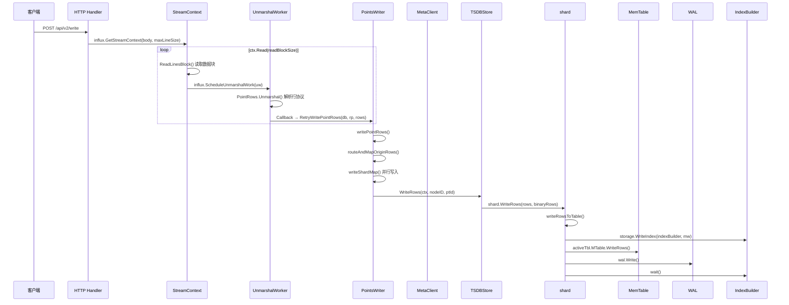

**通俗解释**：
1. 客户端发送 HTTP 写入请求
2. Handler 创建 `StreamContext`，分块读取请求体
3. 每个数据块通过 goroutine 池并发解析（`ScheduleUnmarshalWork`）
4. 解析完成后回调 `RetryWritePointRows`，路由到目标 shard
5. shard 在普通 tsstore 路径中先调用 `storage.WriteIndex` 填充 TSID，再执行 `writeRows` 写 MemTable/WAL，最后调用 `wait()` 收敛索引结果。tsstore 的 `WriteIndex` 是同步执行并返回空 wait；columnstore 的 `WriteIndexForCols` 才在 goroutine 中异步执行，并通过 wait/WaitGroup 收敛。

**核心代码**：`lib/util/lifted/influx/httpd/handler.go` — HTTP 写入入口

```go
// 第 1488 行：HTTP 写入处理器（实际入口）
func (h *Handler) serveWrite(database string, rp string, w http.ResponseWriter, r *http.Request, user meta2.User) {
    // ... 参数校验、鉴权、gzip 解压、precision 解析（省略）...

    // 创建流式解析上下文（从对象池获取）
    ctx := influx.GetStreamContext(body, h.Config.MaxLineSize)
    defer influx.PutStreamContext(ctx)

    readBlockSize := int(h.Config.ReadBlockSize)
    for ctx.Read(readBlockSize) {
        // 从对象池获取 UnmarshalWork
        uw := influx.GetUnmarshalWork()
        uw.Callback = func(db string, rows []influx.Row, err error) {
            if err != nil {
                ctx.ErrLock.Lock()
                ctx.UnmarshalErr = err
                ctx.ErrLock.Unlock()
                ctx.Wg.Done()
                return
            }
            // 解析成功，调用 PointsWriter 写入
            if err = h.PointsWriter.RetryWritePointRows(db, rp, rows); err != nil {
                ctx.ErrLock.Lock()
                if ctx.CallbackErr == nil {
                    ctx.CallbackErr = err
                }
                ctx.ErrLock.Unlock()
            }
            // 省略：SubscriberManager.Send(db, rp, uw.ReqBuf) — 将行协议转发给订阅者
            // 省略：handlerStat.PointsWrittenOK.Add(int64(len(rows))) — 更新写入成功统计
            ctx.Wg.Done()
        }
        uw.TsMultiplier = tsMultiplier
        uw.Db = database
        uw.ReqBuf, ctx.ReqBuf = ctx.ReqBuf, uw.ReqBuf
        uw.EnableTagArray = h.MetaClient.TagArrayEnabled(database)

        ctx.Wg.Add(1)
        influx.ScheduleUnmarshalWork(uw)  // 提交到 goroutine 池
    }
    ctx.Wg.Wait()  // 等待所有块解析和写入完成
}
```

（基于实际代码重写）

**路由入口**：
- `serveWriteV2`（第 1473 行）：`/api/v2/write` 路由处理函数
- `serveWriteV1`（第 1483 行）：`/write` 路由处理函数
- 两者都调用 `serveWrite(database, rp, w, r, user)`，其中 `database` 和 `rp` 从 URL 参数或请求体中提取

**逐行解释**：
- **第 1488 行**：`serveWrite` 接收 `database` 和 `rp` 参数（从路由解析）
- **第 1592 行**：`GetStreamContext` 从对象池获取流式解析上下文，包裹请求体
- **第 1598 行**：`ctx.Read(readBlockSize)` 分块读取请求体数据（默认 64KB 一块）
- **第 1600 行**：`GetUnmarshalWork` 从对象池获取解析工作单元
- **第 1601 行**：设置回调函数，解析完成后调用 `RetryWritePointRows` 写入
- **第 1635 行**：`ScheduleUnmarshalWork` 将工作提交到 goroutine 池并发执行

**具体例子**：

写入 `cpu,host=server1 value=99.5 1234567890` 的完整路径：

```
Step 1: HTTP Handler
  → POST /api/v2/write
  → body = "cpu,host=server1 value=99.5 1234567890"

Step 2: StreamContext 分块读取
  → GetStreamContext(body, maxLineSize) → ctx
  → ctx.Read(64KB) → 读取数据块到 ReqBuf

Step 3: ScheduleUnmarshalWork（goroutine 池并发解析）
  → PointRows.Unmarshal(ReqBuf)
  → 解析为 []influx.Row
  → 回调: h.PointsWriter.RetryWritePointRows(db, rp, rows)

Step 4: PointsWriter 路由与写入
  → routeAndMapOriginRows(): 计算 shardKey → 路由到 shard[3]
  → writeShardMap(): 通过 TSDBStore 写目标 shard；本地目标直接调用 store，远端目标才走 transport/SPDY

Step 5: shard.WriteRows
  → writeRowsToTable():
    → storage.WriteIndex(indexBuilder, mw)  // 普通 tsstore 同步构建/补齐 TSID
    → writeRows():
      → activeTbl.MTable.WriteRows()  // 写入 MemTable
      → wal.Write()  // 写入 WAL
    → wait()  // tsstore 通常为空等待；columnstore 由异步索引写入在此收敛
```

---

## 2. 第一步：Line Protocol 解析

### 2.1 解析时序图

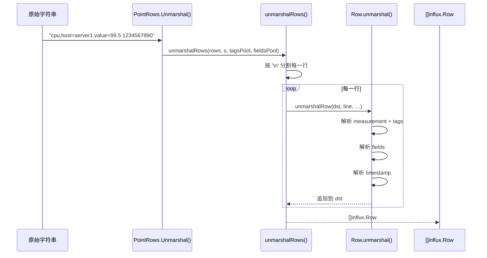

### 2.2 核心代码：`Row.unmarshal()` — 逐行解析

**代码位置**：`lib/util/lifted/vm/protoparser/influx/parser.go:1169-1240`

```go
func (r *Row) unmarshal(s string, tagsPool []Tag, fieldsPool []Field, 
    noEscapeChars, enableTagArray bool) ([]Tag, []Field, error) {
    
    r.Reset()  // 清空 Row 的所有字段
    start := checkWhitespace(s, 0)  // 跳过前导空白
    s = s[start:]
    
    // 步骤 1: 找到第一个空格，分割 "measurement+tags" 和 "fields+timestamp"
    n := nextUnescapedChar(s, ' ', noEscapeChars, enableTagArray, false)
    if n < 0 {
        return tagsPool, fieldsPool, ErrPointMustHaveAField
    }
    measurementTags := s[:n]  // "cpu,host=server1"
    s = stripLeadingWhitespace(s[n+1:])  // "value=99.5 1234567890"
```

**通俗解释**：
- 输入：`"cpu,host=server1 value=99.5 1234567890"`
- 第一个空格把字符串分成两部分：
  - 左边：`"cpu,host=server1"`（measurement + tags）
  - 右边：`"value=99.5 1234567890"`（fields + timestamp）

```go
    // 步骤 2: 解析 measurement 和 tags
    n = nextUnescapedChar(measurementTags, ',', noEscapeChars, enableTagArray, false)
    if n >= 0 {
        tagsStart := len(tagsPool)
        tagsPool, err = unmarshalTags(tagsPool, measurementTags[n+1:], ...)
        tags := tagsPool[tagsStart:]
        r.Tags = tags[:len(tags):len(tags)]
        sort.Sort(&r.Tags)  // tags 按 key 排序
        measurementTags = measurementTags[:n]
    }
    r.Name = unescapeTagValue(measurementTags, noEscapeChars)
```

**通俗解释**：
- 找第一个逗号 `,`，左边是 measurement name，右边是 tags
- `"cpu,host=server1"` → Name=`"cpu"`, Tags=`[{Key:"host", Value:"server1"}]`
- Tags 按 key 排序，确保相同 tag 组合生成相同的 seriesKey

```go
    // 步骤 3: 解析 fields
    fieldsStart := len(fieldsPool)
    hasQuotedFields := nextUnescapedChar(s, '"', noEscapeChars, enableTagArray, false) >= 0
    n = nextUnquotedChar(s, ' ', noEscapeChars, hasQuotedFields)
    if n < 0 {
        // 没有 timestamp
        fieldsPool, err = unmarshalInfluxFields(fieldsPool, s, ...)
        r.Fields = fieldsPool[fieldsStart:]
        r.Timestamp = NoTimestamp
        return tagsPool, fieldsPool, nil
    }
    fieldsPool, err = unmarshalInfluxFields(fieldsPool, s[:n], ...)
    r.Fields = fieldsPool[fieldsStart:]
```

**通俗解释**：
- 解析 `"value=99.5"` → Fields=`[{Key:"value", Value:99.5, Type:FLOAT}]`
- 支持多种类型：float, integer, string, boolean

```go
    // 步骤 4: 解析 timestamp
    timestamp, err := nextTimestamp(s)
    r.Timestamp = timestamp  // 1234567890 (纳秒)
    return tagsPool, fieldsPool, nil
}
```

**通俗解释**：
- 如果没有 timestamp，使用 `NoTimestamp`（服务端自动分配）
- 如果有，解析为 int64 纳秒时间戳

### 2.3 Row 结构体

**代码位置**：`lib/util/lifted/vm/protoparser/influx/parser.go:167-187`

```go
type Row struct {
    StreamOnly              bool
    Timestamp               int64       // 时间戳（纳秒）
    SeriesId                uint64      // 系列 ID（索引系统分配）
    PrimaryId               uint64      // 主 ID（用于 MemTable 分组）
    Name                    string      // measurement 名称（带版本号）
    Tags                    PointTags   // 标签列表（按 key 排序）
    Fields                  Fields      // 字段列表
    IndexKey                []byte      // 索引键（二进制编码）
    ShardKey                []byte      // 分片键（用于路由）
    StreamId                []uint64    // 流 ID（流计算用）
    IndexOptions            IndexOptions
    ColumnToIndex           map[string]int // 排序后的 tagKey/fieldKey 与索引的映射关系
    ReadyBuildColumnToIndex bool

    // 以下为内部字段（未导出）
    tagArrayInitialized bool  // TagArray 是否已初始化
    hasTagArray         bool  // 是否使用 TagArray 模式
    skipMarshalShardKey bool  // 是否跳过 ShardKey 序列化
}
```

**通俗解释**：
- **Timestamp**：数据点的时间
- **Name**：measurement 名称，比如 `"cpu"`
- **Tags**：标签，比如 `[{host, server1}, {region, us}]`
- **Fields**：字段，比如 `[{value, 99.5, FLOAT}]`
- **ShardKey**：用于路由到目标 shard 的键
- **IndexKey**：二进制编码的索引键，用于索引查找

---

## 3. 第二步：IndexKey 生成

### 3.1 IndexKey 构造时序图

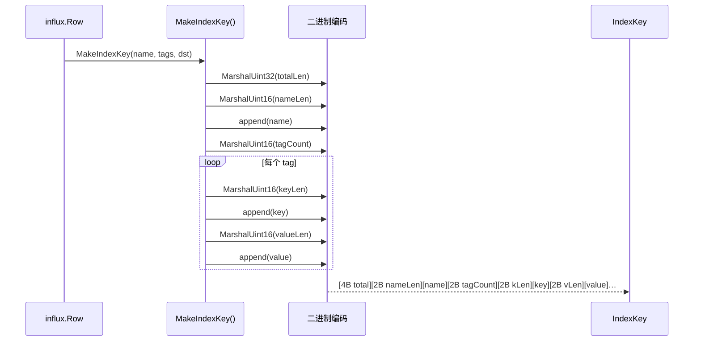

### 3.2 核心代码：`MakeIndexKey()` — 二进制编码

**代码位置**：`lib/util/lifted/vm/protoparser/influx/parser.go:792-817`

```go
func MakeIndexKey(name string, tags PointTags, dst []byte) []byte {
    // 计算总长度
    indexKl := 4 +           // total length (4 bytes)
        2 +                  // measurement name length (2 bytes)
        len(name) +          // measurement name
        2 +                  // tag count (2 bytes)
        4*len(tags) +        // 每个 tag 的 keyLen(2) + valueLen(2)
        tags.TagsSize()      // 所有 tag key/value 的实际大小
    start := len(dst)

    // 编码总长度
    dst = encoding.MarshalUint32(dst, uint32(indexKl))
    // 编码 measurement
    dst = encoding.MarshalUint16(dst, uint16(len(name)))
    dst = append(dst, name...)
    // 编码 tags
    dst = encoding.MarshalUint16(dst, uint16(len(tags)))
    for i := range tags {
        kl := len(tags[i].Key)
        dst = encoding.MarshalUint16(dst, uint16(kl))
        dst = append(dst, tags[i].Key...)
        vl := len(tags[i].Value)
        dst = encoding.MarshalUint16(dst, uint16(vl))
        dst = append(dst, tags[i].Value...)
    }
    return dst[start:]
}
```

**通俗解释**：
- IndexKey 是一个二进制编码的字节数组
- 格式：`[总长度][measurement长度][measurement][tag数量][tag1...][tag2...]`
- 每个 tag 编码为：`[key长度][key][value长度][value]`
- **为什么用二进制编码？** 索引查找时需要按字节比较，二进制编码更高效
- **为什么 tags 要排序？** 确保相同 tag 组合（不管写入顺序）生成相同的 IndexKey

---

## 4. 第三步：ShardKey 构造与路由

### 4.1 ShardKey 构造时序图

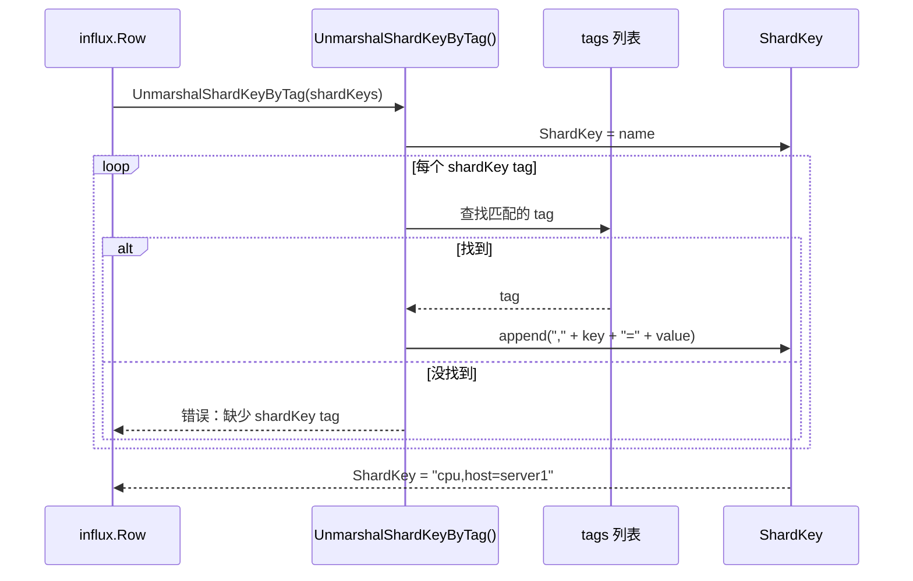

### 4.2 核心代码：`UnmarshalShardKeyByTag()` — 构造分片键

**代码位置**：`lib/util/lifted/vm/protoparser/influx/parser.go:307-359`

```go
func (r *Row) UnmarshalShardKeyByTag(tags []string) error {
    // 从 measurement name 开始
    r.ShardKey = append(r.ShardKey[:0], r.Name...)
    
    if len(tags) == 0 {
        // 没有指定 shardKey tags，使用所有 tags
        for j := range r.Tags {
            if err := r.CheckDuplicateTag(j); err != nil {
                return err
            }
            r.appendShardKey(j)  // append("," + key + "=" + value)
        }
        return nil
    }

    // 指定了 shardKey tags，只使用指定的 tags
    i, j := 0, 0
searchTag:
    for i < len(tags) && j < len(r.Tags) {
        if tags[i] < r.Tags[j].Key {
            // shardKey tag 不在常规 tags 中，检查是否在 fields 中
            for _, relation := range r.IndexOptions {
                if relation.Oid == 2 {
                    for _, v := range relation.IndexList {
                        if tags[i] == r.Fields[int(v)-len(r.Tags)].Key {
                            r.appendShardKeyWithField(int(v) - len(r.Tags))
                            i++
                            continue searchTag
                        }
                    }
                }
            }
            return ErrPointShouldHaveAllShardKey
        }
        if err := r.CheckDuplicateTag(j); err != nil {
            return err
        }
        if tags[i] == r.Tags[j].Key {
            r.appendShardKey(j)  // 匹配，追加到 ShardKey
            i++
        }
        j++
    }
    if i < len(tags) {
        return ErrPointShouldHaveAllShardKey
    }
    return nil
}
```

**通俗解释**：
- ShardKey 由 measurement name + 指定的 tag 组成
- 比如 shardKeyTags = `["host"]`，则 ShardKey = `"cpu,host=server1"`
- tags 已排序，所以用双指针法高效匹配
- 如果 shardKey tag 在 fields 中（oid=2），也支持

### 4.3 xxhash 分片路由

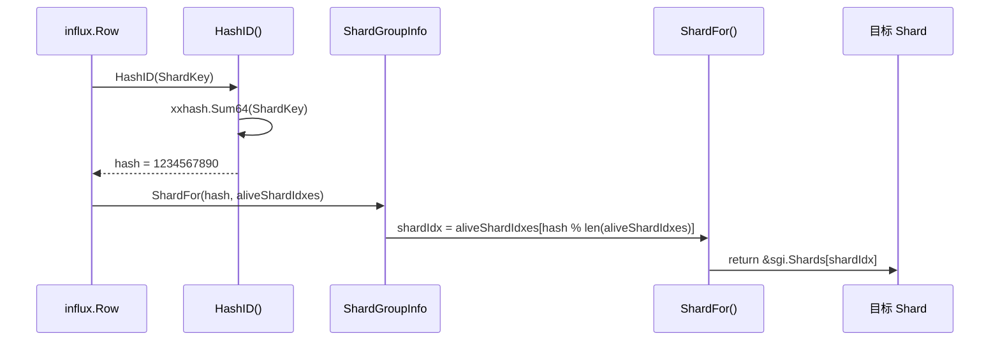

### 4.4 核心代码：`HashID()` 和 `ShardFor()`

**代码位置**：`lib/util/lifted/influx/meta/shardinfo.go:571-573` 和 `393-399`

```go
// HashID 计算哈希值
func HashID(key []byte) uint64 {
    return xxhash.Sum64(key)  // 使用 xxhash 算法
}

// ShardFor 根据哈希值选择目标 shard
func (sgi *ShardGroupInfo) ShardFor(hash uint64, aliveShardIdxes []int) *ShardInfo {
    if len(aliveShardIdxes) == 0 {
        return nil
    }
    // hash % 活跃 shard 数量 → 索引
    return &sgi.Shards[aliveShardIdxes[hash%uint64(len(aliveShardIdxes))]]
}
```

**通俗解释**：
- **HashID**：使用 xxhash 算法对 ShardKey 计算 64 位哈希值
- **ShardFor**：`hash % aliveShardNum` 决定目标 shard
- **aliveShardIdxes**：只使用活跃的 shard，避免路由到故障 shard
- **关键设计**：相同的 ShardKey 总是路由到相同的 shard，保证数据局部性

---

## 5. 第四步：coordinator 路由与写入

### 5.1 RetryWritePointRows 入口

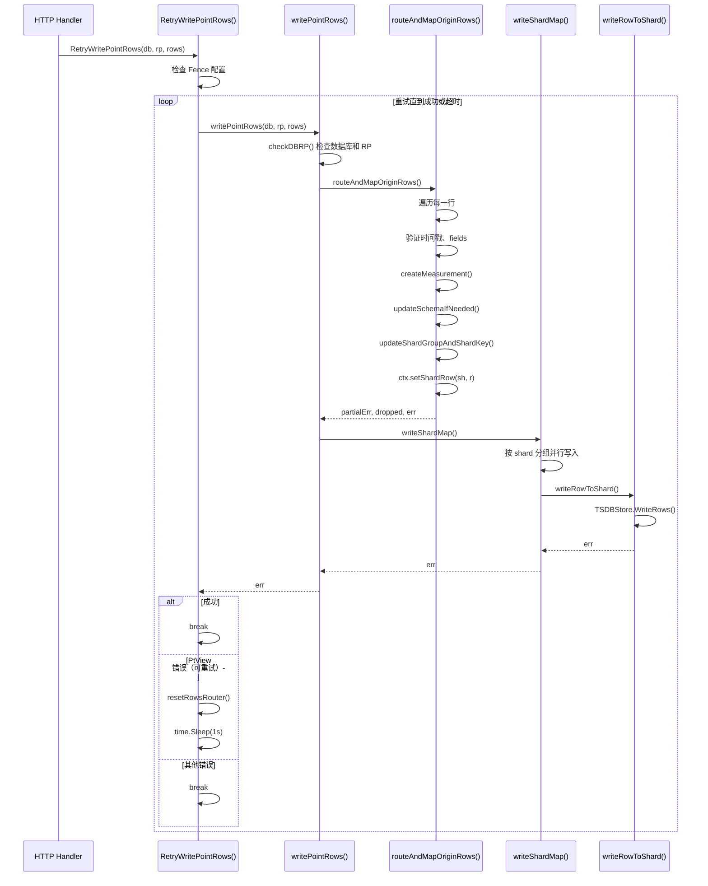

### 5.2 核心代码：`RetryWritePointRows()` — 带重试的写入入口

**代码位置**：`coordinator/points_writer.go:238-271`

```go
func (w *PointsWriter) RetryWritePointRows(database, retentionPolicy string, rows []influx.Row) error {
    var err error
    start := time.Now()

    // Fence 配置：防止乱序写入
    if config.GetStoreConfig().Fence.FenceEnable {
        fence.RewriteRows(rows)
    }

    for {
        err = w.writePointRows(database, retentionPolicy, rows)
        if err == nil {
            break  // 成功，退出
        }
        // 如果是 PtView 错误（分区离线），重试
        if !errno.IsRetryErrorForPtView(err) {
            w.logger.Error("write point rows failed", ...)
            break  // 非重试错误，退出
        }
        // 超时检查
        if time.Since(start).Nanoseconds() >= w.timeout.Nanoseconds() {
            w.logger.Error("write point rows timeout", ...)
            break  // 超时，退出
        }
        w.resetRowsRouter(rows)  // 重置路由缓存
        time.Sleep(time.Second)  // 等待 1 秒后重试
    }
    return err
}
```

**通俗解释**：
- **重试机制**：如果 PtView 错误（分区离线），等待 1 秒后重试
- **超时控制**：超过配置的超时时间后停止重试
- **Fence 配置**：防止乱序写入（用于流计算场景）
- **resetRowsRouter**：重置路由缓存，下次写入会重新查询 PtView

### 5.3 核心代码：`writePointRows()` — 写入主流程

**代码位置**：`coordinator/points_writer.go:281-333`

```go
func (w *PointsWriter) writePointRows(database, retentionPolicy string, rows []influx.Row) error {
    ctx := getInjestionCtx()  // 从池中获取上下文
    defer putInjestionCtx(ctx)  // 用完归还
    ctx.writeHelper = newWriteHelper(w)

    // 步骤 1: 检查数据库和 RP 是否存在
    err := ctx.checkDBRP(database, retentionPolicy, w)
    if err != nil {
        return err
    }

    if retentionPolicy == "" {
        retentionPolicy = ctx.db.DefaultRetentionPolicy  // 使用默认 RP
    }

    // 步骤 2: 检查是否有流计算任务
    dstSis := ctx.getDstSis()
    exist := w.MetaClient.GetDstStreamInfos(database, retentionPolicy, dstSis)
    if exist {
        err = ctx.initStreamVar(w)
        if err != nil {
            return err
        }
    }

    // 步骤 3: 路由并映射行到 shard
    partialErr, dropped, err := w.routeAndMapOriginRows(database, retentionPolicy, rows, ctx)
    if err != nil {
        return err
    }

    // 步骤 4: 流计算处理
    if len(*ctx.getDstSis()) > 0 {
        err = w.routeAndCalculateStreamRows(ctx)
        if err != nil {
            return err
        }
    }

    // 步骤 5: 写入到 shard
    err = w.writeShardMap(database, retentionPolicy, ctx)
    if err != nil {
        return err
    }
    return partialErr
}
```

**通俗解释**：
- **checkDBRP**：检查数据库和 RP 是否存在
- **routeAndMapOriginRows**：核心路由逻辑，验证每行数据，映射到目标 shard
- **writeShardMap**：并行写入到各个 shard

### 5.4 核心代码：`routeAndMapOriginRows()` — 路由核心

**代码位置**：`coordinator/points_writer.go:381-544`

```go
func (w *PointsWriter) routeAndMapOriginRows(
    database, retentionPolicy string, rows []influx.Row, ctx *injestionCtx,
) (error, int, error) {
    var partialErr error
    var dropped int
    wh := ctx.getWriteHelper(w)

    for i := 0; i < len(rows); i++ {
        r := &rows[i]

        // 步骤 1: 检查时间戳是否在 RP 范围内
        if r.Timestamp < ctx.minTime || !w.inTimeRange(r.Timestamp) {
            errInfo := errno.NewError(errno.WritePointOutOfRP)
            partialErr = errInfo
            dropped++
            continue  // 跳过这行
        }

        // 步骤 2: 验证时间戳
        if err := models.CheckTime(time.Unix(0, r.Timestamp)); err != nil {
            partialErr = err
            dropped++
            continue
        }

        // 步骤 3: 排序 fields
        sort.Stable(&r.Fields)

        // 步骤 4: 修正 fields
        if r.Fields, pErr = fixFields(r.Fields); pErr != nil {
            partialErr = pErr
            dropped++
            continue
        }

        // 步骤 5: 创建或获取 measurement
        ctx.ms, err = wh.createMeasurement(database, retentionPolicy, r.Name, skipPreCheck)
        if err != nil {
            if errno.Equal(err, errno.InvalidMeasurement) {
                partialErr = err
                dropped++
                continue
            }
            return nil, dropped, err
        }
        r.Name = ctx.ms.Name  // 使用带版本号的 measurement 名

        // 步骤 6: 更新 schema（如果需要）
        if ctx.fieldToCreatePool, isDropRow, err = wh.updateSchemaIfNeeded(...); err != nil {
            if w.isPartialErr(err) {
                partialErr = err
                if isDropRow {
                    dropped++
                    continue
                }
            } else {
                return nil, dropped, err
            }
        }

        // 步骤 7: 更新 ShardGroup 和 ShardKey
        err, sh, pErr = w.updateShardGroupAndShardKey(database, retentionPolicy, r, ctx, ...)
        if pErr != nil {
            partialErr = pErr
            dropped++
            continue
        }

        // 步骤 8: 将行映射到 shard
        ctx.setShardRow(sh, r)
    }
    return partialErr, dropped, nil
}
```

**通俗解释**：
- 遍历每一行数据，执行 8 个步骤
- **步骤 1-2**：验证时间戳，确保在 RP 范围内
- **步骤 3-4**：排序和修正 fields
- **步骤 5**：创建或获取 measurement（可能需要创建新的 measurement）
- **步骤 6**：更新 schema（如果 field 是新的）
- **步骤 7**：计算 ShardKey，找到目标 shard
- **步骤 8**：将行添加到 shard 的行列表中
- **错误处理**：部分行失败不影响其他行，记录 dropped 数量

### 5.5 具体例子：路由的完整流程

假设写入 3 行数据：
```
cpu,host=server1 value=99.5 1234567890
cpu,host=server2 value=88.3 1234567891
mem,host=server1 value=45.6 1234567892
```

路由过程：
```
行 1: cpu,host=server1
  → createMeasurement("cpu") → MsInfo{Name: "cpu_0001"}
  → updateShardGroupAndShardKey() → ShardKey = hash("cpu,host=server1") % 8 = 3
  → ctx.setShardRow(shard3, row1)

行 2: cpu,host=server2
  → createMeasurement("cpu") → 复用 MsInfo{Name: "cpu_0001"}
  → updateShardGroupAndShardKey() → ShardKey = hash("cpu,host=server2") % 8 = 7
  → ctx.setShardRow(shard7, row2)

行 3: mem,host=server1
  → createMeasurement("mem") → MsInfo{Name: "mem_0001"}
  → updateShardGroupAndShardKey() → ShardKey = hash("mem,host=server1") % 8 = 1
  → ctx.setShardRow(shard1, row3)
```

最终 shardRowMap：
```
shard1: [row3]
shard3: [row1]
shard7: [row2]
```

并行写入：3 个 goroutine 同时写入 3 个 shard。

### 5.6 核心代码：`writeShardMap()` — 并行写入

**代码位置**：`coordinator/points_writer.go:335-366`

```go
func (w *PointsWriter) writeShardMap(database, retentionPolicy string, ctx *injestionCtx) error {
    shardRowMap := ctx.getShardRowMap()
    var err error
    var mutex sync.Mutex
    var wg sync.WaitGroup

    wg.Add(shardRowMap.Len())
    for i := range shardRowMap {
        writeCtx = ctx.allocWriteContext(shardRowMap[i].shardInfo, shardRowMap[i].rows)

        // 获取流计算相关的 shard 信息
        if streamDstShardIdMap, ok := ctx.getSrcStreamDstShardIdMap()[shardRowMap[i].shardInfo.ID]; ok {
            for streamId, dstShardId := range streamDstShardIdMap {
                writeCtx.StreamShards = append(writeCtx.StreamShards, streamId, dstShardId)
            }
        }

        // 并行写入每个 shard
        go func(wCtx *netstorage.WriteContext) {
            innerErr := w.writeRowToShard(wCtx, database, retentionPolicy)
            if innerErr != nil {
                mutex.Lock()
                err = innerErr
                mutex.Unlock()
            }
            wg.Done()
        }(writeCtx)
    }
    wg.Wait()  // 等待所有 shard 写入完成
    return err
}
```

**通俗解释**：
- **按 shard 分组**：每个 shard 的行数据独立
- **并行写入**：每个 shard 启动一个 goroutine 并行写入
- **WaitGroup**：等待所有 shard 写入完成
- **错误处理**：最后一个错误会被返回

### 5.6 核心代码：`writeRowToShard()` — 写入单个 shard

**代码位置**：`coordinator/points_writer.go:854-893`

```go
func (w *PointsWriter) writeRowToShard(ctx *netstorage.WriteContext, database, retentionPolicy string) error {
    start := time.Now()
    var ptView meta2.DBPtInfos

RETRY:
    for {
        // 超时检查
        if time.Since(start).Nanoseconds() >= w.timeout.Nanoseconds() {
            w.logger.Error("[coordinator] write rows timeout", ...)
            break
        }
        
        // 获取 PtView（分区路由信息）
        ptView, err = w.MetaClient.DBPtView(database)
        if err != nil {
            break
        }
        
        // 遍历 shard 的所有 owner（副本）
        for _, ptId := range ctx.Shard.Owners {
            // 通过 TSDBStore 写目标节点；本地 store 直接调用，远端场景由 netstorage/transport 发送
            err = w.TSDBStore.WriteRows(ctx, ptView[ptId].Owner.NodeID, ptId, 
                database, retentionPolicy, w.timeout)
            
            if err != nil && errno.Equal(err, errno.ShardMetaNotFound) {
                // shard 元数据不存在，跳出重试
                break RETRY
            }
            if err != nil && errno.IsRetryErrorForPtView(err) {
                // PtView 可能已更新，重试
                time.Sleep(100 * time.Millisecond)
                goto RETRY
            }
            if err != nil {
                // 其他错误
                break
            }
        }
        break
    }
    return err
}
```

**通俗解释**：
- **PtView**：分区路由表，记录每个分区在哪个节点上
- **DBPtView**：获取数据库的分区路由信息
- **WriteRows**：通过 `TSDBStore` 写目标 ts-store；目标在本地时可直接调用本地 store，目标在远端时才经 netstorage/transport 发送
- **重试机制**：如果 PtView 错误（分区迁移），刷新 PtView 后重试
- **副本写入**：遍历 shard 的所有 owner（副本）

---

## 6. 第五步：shard 写入 MemTable + WAL

### 6.1 shard 写入时序图

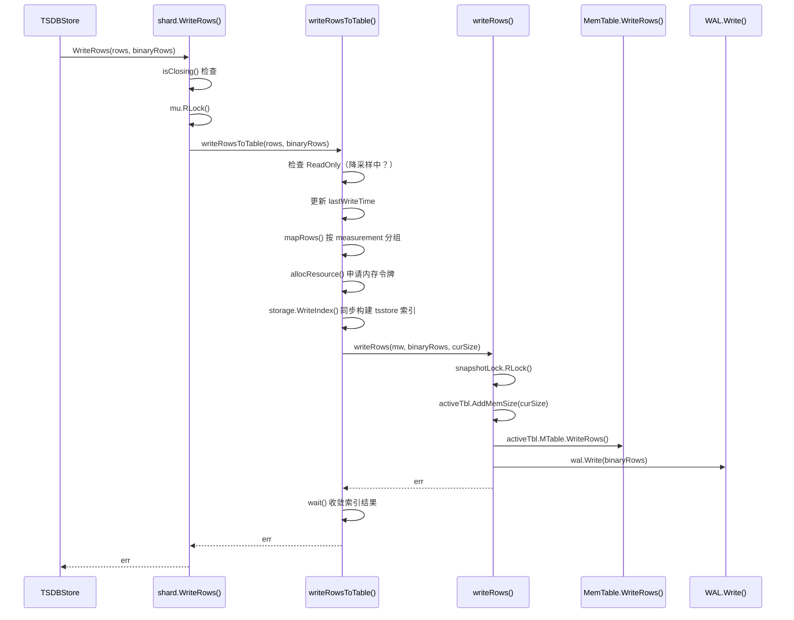

### 6.2 核心代码：`shard.WriteRows()` — shard 写入入口

**代码位置**：`engine/shard.go:527-552`

```go
func (s *shard) WriteRows(rows []influx.Row, binaryRows []byte) error {
    if s.isClosing() {
        return errno.NewError(errno.ErrShardClosed, s.ident.ShardID)
    }

    s.mu.RLock()
    defer s.mu.RUnlock()
    defer s.markBeingWritten()()  // 标记正在写入

    var err error
    if s.engineType == config.TSSTORE && config.ShelfModeEnabled() {
        err = s.writeRowsShelfMode(rows)  // Shelf WAL 模式
    } else {
        err = s.writeRowsToTable(rows, binaryRows)  // 普通模式
    }

    if err != nil {
        log.Error("write buffer failed", zap.Error(err))
        atomic.AddInt64(&statistics.PerfStat.WriteReqErrors, 1)
        return err
    }

    atomic.AddInt64(&statistics.PerfStat.WriteRowsBatch, 1)
    atomic.AddInt64(&statistics.PerfStat.WriteRowsCount, int64(len(rows)))
    return nil
}
```

**通俗解释**：
- **isClosing**：检查 shard 是否正在关闭
- **mu.RLock**：读锁，允许并发读取
- **markBeingWritten**：标记正在写入，防止 shard 被关闭
- **ShelfMode**：Shelf WAL 模式走不同路径（见 6.2.1 节）

### 6.2.1 Shelf WAL 写入路径（补充）

> 当 `config.ShelfModeEnabled()` 为 true 时，写入走 Shelf WAL 路径而非传统的 `writeRowsToTable` 路径。Shelf WAL 是 2025 年新增的第二套存储引擎（`engine/shelf/`），与传统 TSSP 并行存在。

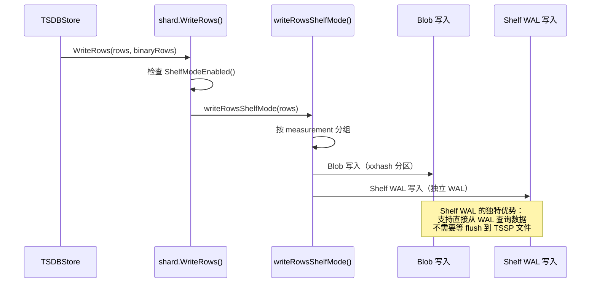

**核心代码**：`engine/shard.go:573-603`

```go
func (s *shard) writeRowsShelfMode(rows []influx.Row) error {
    s.immTables.LoadSequencer()
    s.lastWriteTime = fasttime.UnixTimestamp()

    // 创建 Shelf Runner 和 BlobGroup
    runner := shelf.NewRunner()
    group, release := shelf.NewBlobGroup(runner.Size())
    defer release()

    rec := group.GetRecord()

    for i := range rows {
        row := &rows[i]
        if row.StreamOnly {
            continue  // 跳过流计算专用行
        }

        rec.Reset()
        err := record.AppendRowToRecord(rec, row)
        if err != nil {
            return err
        }

        // 容错：通常数据是有序的，无序时排序
        if !sort.IsSorted(rec) {
            sort.Sort(rec)
        }

        // 按 measurement name 和 IndexKey 分组
        group.GroupingRow(row.Name, row.IndexKey, rec, 0)
    }

    // 提交到 Shelf Runner 调度写入
    return runner.ScheduleGroup(s.ident.ShardID, group)
}
```

（基于实际代码重写）

**与传统路径的关键区别**：

| 维度 | 传统路径 (writeRowsToTable) | Shelf 路径 (writeRowsShelfMode) |
|------|---------------------------|-------------------------------|
| WAL 格式 | 分区 WAL，Snappy 压缩 | Shelf WAL，独立编解码器 |
| 查询支持 | 未 flush 的数据通过 active/snapshot MemTable 查询可见；WAL 仅用于恢复，不作为查询数据源 | 支持直接从 WAL 查询 |
| 热模式 | 不支持 | 支持 HotMode（WAL 数据缓存到内存） |
| 存储引擎 | TSSP 文件 | Blob + TSSP 混合 |

**通俗解释**：
Shelf WAL 就像"带实时查询能力的日志"。传统 WAL 只能写入后通过 Replay 恢复，Shelf WAL 支持在数据还没 flush 到 TSSP 文件时就直接查询。这对于低延迟场景（如刚写入的数据需要立即被查到）非常有用。

### 6.3 核心代码：`writeRowsToTable()` — 写入主逻辑

**代码位置**：`engine/shard.go:928-975`

```go
func (s *shard) writeRowsToTable(rows influx.Rows, binaryRows []byte) error {
    // 步骤 1: 检查是否只读（降采样中）
    if s.ident.ReadOnly {
        if !getDownSampleWriteDrop() {
            return errors.New("forbid by downSample")
        }
        if !syscontrol.IsWriteColdShardEnabled() {
            return errors.New("forbid by shard moving")
        }
        return nil  // 丢弃写入
    }

    // 步骤 2: 更新最后写入时间
    atomic.StoreUint64(&s.lastWriteTime, fasttime.UnixTimestamp())
    
    // 步骤 3: 获取写入上下文
    mw := getMstWriteCtx(nodeMutableLimit.timeOut, s.engineType)
    defer putMstWriteCtx(mw)

    // 步骤 4: 按 measurement 分组行数据
    mapRows(rows, mw)

    // 步骤 5: 申请内存令牌
    start := time.Now()
    curSize := calculateMemSize(rows)
    err = nodeMutableLimit.allocResource(curSize, mw.timer)
    if err != nil {
        return err  // 内存不足，需要重试
    }

    // 步骤 6: 构建索引。普通 tsstore 在这里同步执行；columnstore 写列路径才异步。
    wait := s.storage.WriteIndex(s.indexBuilder, mw)

    // 步骤 7: 写入 MemTable + WAL
    err = s.writeRows(mw, binaryRows, curSize)

    // 步骤 8: 收敛索引结果
    if err == nil {
        err = wait()
    }

    s.addRowCounts(int64(len(rows)))
    return nil
}
```

**通俗解释**：
- **步骤 1**：降采样期间 shard 是只读的，新写入可能被丢弃
- **步骤 2**：更新最后写入时间，用于 snapshot 触发判断
- **步骤 4**：mapRows 把行按 measurement 分组，方便批量处理
- **步骤 5**：内存令牌机制，防止内存超限
- **步骤 6**：`storage.WriteIndex` 在普通 tsstore 中同步调用 `IndexBuilder` 建立 series/TSID 索引并补齐行上的 TSID；返回的 `wait` 用于统一接口。列存写入路径的 `WriteIndexForCols` 才是独立 goroutine 异步执行
- **步骤 7**：在同一写入路径中先写入 MemTable，再写入 WAL；只有 WAL 也成功后才向调用方返回成功

### 6.4 核心代码：`writeRows()` — MemTable + WAL 写入

**代码位置**：`engine/shard.go:606-642`

```go
func (s *shard) writeRows(mw *mstWriteCtx, binaryRows []byte, curSize int64) error {
    if s.closed.Closed() {
        return errno.NewError(errno.ErrShardClosed, s.ident.ShardID)
    }

    // 加载 sequencer（索引序列号）
    if s.engineType == config.TSSTORE {
        s.immTables.LoadSequencer()
    }

    start := time.Now()
    mmPoints := mw.getMstMap()  // 按 measurement 分组的行数据
    ctx := mw.writeRowsCtx
    ctx.SetMsRowCount(s.msRowCount)
    ctx.SetSeriesRowCountFunc(s.addRowCountsBySid)

    // 获取 snapshot 读锁（防止写入时 snapshot 切换 MemTable）
    s.snapshotLock.RLock()
    defer s.snapshotLock.RUnlock()

    // 更新内存大小
    s.activeTbl.AddMemSize(curSize)
    
    // 写入 MemTable
    err := s.activeTbl.MTable.WriteRows(s.activeTbl, mmPoints, ctx)
    if err != nil {
        return fmt.Errorf("failed to write rows to memtable: %w", err)
    }

    // 写入 WAL
    if err = s.wal.Write(binaryRows, WriteWalLineProtocol, mw.maxTime); err != nil {
        return fmt.Errorf("failed to write rows to WAL: %w", err)
    }

    return nil
}
```

**通俗解释**：
- **snapshotLock.RLock**：读锁，允许并发写入，但阻止 snapshot 切换 MemTable
- **activeTbl.AddMemSize**：更新 MemTable 的内存大小
- **WriteRows**：写入 MemTable（具体实现见下文）
- **wal.Write**：写入 WAL（具体实现见下文）
- **先写 MemTable，再写 WAL**：确保数据先在内存中，然后持久化到日志

### 6.5 具体例子：shard 写入的完整流程

假设写入 `cpu,host=server1 value=99.5 1234567890`：

```
步骤 1: shard.WriteRows()
  → isClosing() = false（shard 正常）
  → mu.RLock()（获取读锁）
  → writeRowsToTable()

步骤 2: writeRowsToTable()
  → ReadOnly = false（不在降采样）
  → lastWriteTime = 1234567890（更新最后写入时间）
  → mapRows() → {cpu: [row1]}（按 measurement 分组）
  → calculateMemSize() = 128 bytes
  → allocResource(128) → 成功（内存充足）
  → storage.WriteIndex() → 普通 tsstore 同步构建索引并返回 wait 函数
  → writeRows()

步骤 3: writeRows()
  → snapshotLock.RLock()（获取 snapshot 读锁）
  → activeTbl.AddMemSize(128)（更新内存大小）
  → activeTbl.MTable.WriteRows() → 写入 MemTable
  → wal.Write() → 写入 WAL

步骤 4: 等待索引构建完成
  → wait() → tsstore 通常立即返回；columnstore 写列路径等待异步索引完成
```

**MemTable 写入细节**：
```
tsMemTableImpl.WriteRows():
  → 遍历 measurement: cpu
  → CreateMsInfo("cpu_0001") → MsInfo{Schema: [time:int64, host:string, value:float64]}
  → CreateChunk(1001) → WriteChunk{Sid: 1001}
  → CreateIndex("cpu", "server1", 1001) → 创建索引条目
  → appendFields() → 追加字段到 record
```

**WAL 写入细节**：
```
WAL.Write():
  → maxRowTime = 1234567890
  → writeBinary()
  → snappy.Encode() → 压缩数据
  → 编码 Header: [type=1][len=64]
  → logWriter[0].Write() → 写入分区 0
```

---

## 7. 第六步：MemTable 写入细节

### 7.1 MemTable 数据结构

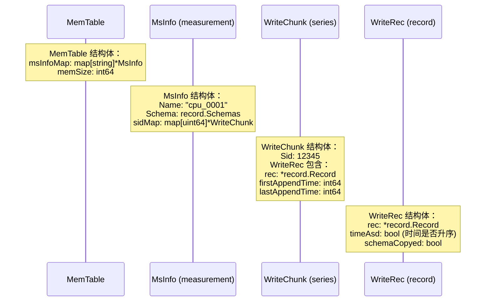

**代码位置**：`engine/mutable/table.go:306-318`，`172-181`，`73-77`，`65-71`

```go
// MemTable 结构
type MemTable struct {
    mu        sync.RWMutex
    ref       int32
    idx       *ski.ShardKeyIndex
    msInfoMap map[string]*MsInfo  // measurement → MsInfo
    msInfos   []MsInfo            // 预分配
    memSize   int64
    MTable    MTable
}

// MsInfo 结构
type MsInfo struct {
    mu       sync.RWMutex
    Name     string              // measurement 名称（带版本号）
    Schema   record.Schemas      // schema
    sidMap   map[uint64]*WriteChunk  // SID → WriteChunk
    chunkBufs []WriteChunk       // 预分配的 chunk 缓冲区
}

// WriteChunk 结构
type WriteChunk struct {
    Mu       sync.Mutex
    Sid      uint64              // Series ID
    WriteRec WriteRec
}

// WriteRec 结构
type WriteRec struct {
    rec             *record.Record  // 列式存储的记录
    firstAppendTime int64           // 第一条数据的时间
    lastAppendTime  int64           // 最后一条数据的时间
    timeAsd         bool            // 时间是否升序
    schemaCopyed    bool            // schema 是否已复制
}
```

**通俗解释**：
- **MemTable**：内存表，包含多个 measurement
- **MsInfo**：measurement 信息，包含 schema 和所有 series
- **WriteChunk**：一个 series 的写入缓冲区
- **WriteRec**：列式存储的记录，包含时间范围和排序信息
- **层级关系**：MemTable → MsInfo → WriteChunk → WriteRec

### 7.2 核心代码：`tsMemTableImpl.WriteRows()` — MemTable 写入

**代码位置**：`engine/mutable/ts_table.go:295-344`

```go
func (t *tsMemTableImpl) WriteRows(table *MemTable, rowsD *dictpool.Dict, wc WriteRowsCtx) error {
    var err error
    
    // 遍历每个 measurement
    for _, mapp := range rowsD.D {
        rows, ok := mapp.Value.(*[]influx.Row)
        if !ok {
            return errors.New("can't map mmPoints")
        }
        rs := *rows
        msName := stringinterner.InternSafe(mapp.Key)  // 字符串驻留

        // 步骤 1: 创建或获取 MsInfo
        msInfo := table.CreateMsInfo(msName, &rs[0], nil)

        var (
            exist bool
            sid   uint64
            chunk *WriteChunk
        )
        
        // 步骤 2: 遍历每行数据
        for index := range rs {
            sid = rs[index].PrimaryId  // Series ID
            if sid == 0 {
                continue  // 无效的 SID，跳过
            }

            // 步骤 3: 创建或获取 WriteChunk
            chunk, exist = msInfo.CreateChunk(sid)

            // 步骤 4: 如果是新 series，创建索引
            if !exist && table.idx != nil {
                err = table.idx.CreateIndex(util.Str2bytes(msName), 
                    rs[index].ShardKey, sid)
                if err != nil {
                    return err
                }
            }
            
            // 步骤 5: 追加字段数据
            _, err = t.appendFields(msInfo, chunk, rs[index].Timestamp, rs[index].Fields)
            if err != nil {
                return err
            }

            // 步骤 6: 更新行计数
            wc.AddRowCountsBySid(msName, sid, 1)
        }
    }
    return nil
}
```

**通俗解释**：
- **步骤 1**：创建或获取 MsInfo（measurement 信息）
- **步骤 2**：遍历每行数据
- **步骤 3**：根据 SID 创建或获取 WriteChunk
- **步骤 4**：如果是新 series，创建索引条目
- **步骤 5**：追加字段数据到 WriteChunk 的 record 中
- **步骤 6**：更新行计数，用于统计

### 7.3 具体例子：MemTable 写入的数据流

假设连续写入 3 行数据：
```
cpu,host=server1 value=99.5 1234567890
cpu,host=server1 value=88.3 1234567891
cpu,host=server2 value=77.1 1234567892
```

MemTable 内部结构变化：

```
写入第 1 行后：
MemTable {
  msInfoMap: {
    "cpu_0001": MsInfo {
      Schema: [time:int64, host:string, value:float64]
      sidMap: {
        1001: WriteChunk {
          Sid: 1001
          WriteRec: {
            rec: Record{time: [1234567890], host: ["server1"], value: [99.5]}
          }
        }
      }
    }
  }
}

写入第 2 行后（同一个 series，追加到同一个 WriteChunk）：
MemTable {
  msInfoMap: {
    "cpu_0001": MsInfo {
      sidMap: {
        1001: WriteChunk {
          WriteRec: {
            rec: Record{time: [1234567890, 1234567891], host: ["server1", "server1"], value: [99.5, 88.3]}
          }
        }
      }
    }
  }
}

写入第 3 行后（新 series，创建新的 WriteChunk）：
MemTable {
  msInfoMap: {
    "cpu_0001": MsInfo {
      sidMap: {
        1001: WriteChunk{Sid: 1001, rec: {time: [1234567890, 1234567891], value: [99.5, 88.3]}},
        1002: WriteChunk{Sid: 1002, rec: {time: [1234567892], value: [77.1]}}
      }
    }
  }
}
```

**关键点**：
- 同一个 series 的数据追加到同一个 WriteChunk（高效追加）
- 不同 series 的数据在不同的 WriteChunk（独立管理）
- MemTable 的 memSize 随写入增长，当超过阈值时触发 snapshot

---

## 8. 第七步：WAL 写入细节

### 8.1 WAL 写入时序图

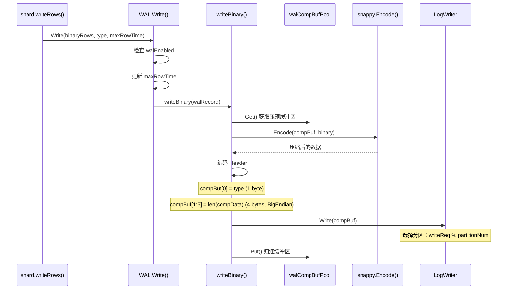

### 8.2 核心代码：`WAL.Write()` — WAL 写入入口

**代码位置**：`engine/wal.go:245-263`

```go
func (l *WAL) Write(rows []byte, typ WalRecordType, maxRowTime int64) error {
    if !l.walEnabled {
        return nil  // WAL 未启用，直接返回
    }
    if len(rows) == 0 {
        return nil  // 空数据，直接返回
    }

    // 更新最大时间戳
    l.mu.Lock()
    l.maxRowTime = max(l.maxRowTime, maxRowTime)
    l.mu.Unlock()

    // 写入 WAL
    start := time.Now()
    err := l.writeBinary(&walRecord{binary: rows, writeWalType: typ})
    atomic.AddInt64(&statistics.PerfStat.WriteWalDurationNs, time.Since(start).Nanoseconds())
    return err
}
```

### 8.3 核心代码：`writeBinary()` — WAL 写入实现

**代码位置**：`engine/wal.go:215-243`

```go
func (l *WAL) writeBinary(walRecord *walRecord) error {
    // 步骤 1: 从池中获取压缩缓冲区
    compBuf := walCompBufPool.Get()
    maxEncodeLen := snappy.MaxEncodedLen(len(walRecord.binary))
    compBuf = bufferpool.Resize(compBuf, WalRecordHeadSize+maxEncodeLen)
    defer func() {
        if len(compBuf) <= WalCompMaxBufSize {
            walCompBufPool.Put(compBuf)  // 归还缓冲区
        }
    }()

    // 步骤 2: Snappy 压缩
    compData := snappy.Encode(compBuf[WalRecordHeadSize:], walRecord.binary)

    // 步骤 3: 编码记录头
    compBuf[0] = byte(walRecord.writeWalType)  // 类型 (1 byte)
    binary.BigEndian.PutUint32(compBuf[1:WalRecordHeadSize], uint32(len(compData)))
    compBuf = compBuf[:WalRecordHeadSize+len(compData)]

    // 步骤 4: 写入到分区
    l.mu.RLock()
    // 选择分区：writeReq 原子递增后取模
    partitionIdx := (atomic.AddUint64(&l.writeReq, 1) - 1) % uint64(l.partitionNum)
    err := l.logWriter[partitionIdx].Write(compBuf)
    l.mu.RUnlock()
    
    if err != nil {
        panic(fmt.Errorf("writing WAL entry failed: %v", err))
    }
    return nil
}
```

**通俗解释**：
- **步骤 1**：从池中获取压缩缓冲区，避免频繁分配
- **步骤 2**：使用 Snappy 压缩数据（快速压缩，压缩率适中）
- **步骤 3**：编码记录头：类型(1字节) + 压缩后长度(4字节，BigEndian)
- **步骤 4**：选择分区并写入
  - **分区选择**：`writeReq % partitionNum`，round-robin 分配
  - **并发安全**：使用原子操作 `atomic.AddUint64` 保证并发安全
- **BigEndian**：大端序，方便按字节比较

### 8.4 WAL 记录格式

```
+------+------+------+------+------+------+------+------+------+------+------+------+------+------+------+------+------+------+------+------+
| Type |            Compressed Length (4 bytes, BigEndian)            |                      Compressed Data (variable)                      |
+------+------+------+------+------+------+------+------+------+------+------+------+------+------+------+------+------+------+------+------+
| 1B   |                                4B                               |                              variable                              |
+------+------+------+------+------+------+------+------+------+------+------+------+------+------+------+------+------+------+------+------+
```

- **Type**：记录类型（1 字节），如 `WriteWalLineProtocol`
- **Compressed Length**：压缩后数据的长度（4 字节，BigEndian）
- **Compressed Data**：Snappy 压缩后的数据

### 8.5 具体例子：WAL 写入的完整流程

假设写入 `cpu,host=server1 value=99.5 1234567890`：

```
步骤 1: WAL.Write()
  → walEnabled = true
  → maxRowTime = 1234567890
  → writeBinary()

步骤 2: writeBinary()
  → walCompBufPool.Get() → 获取压缩缓冲区
  → snappy.Encode() → 压缩数据（假设压缩后 64 字节）
  → 编码 Header:
    compBuf[0] = 1 (WriteWalLineProtocol)
    compBuf[1:5] = 64 (BigEndian)
  → 选择分区: writeReq = 1, partitionNum = 4 → 分区 0
  → logWriter[0].Write(compBuf) → 写入分区 0

步骤 3: 写入完成
  → 统计 WriteWalDurationNs
```

**WAL 文件内容**（分区 0）：
```
+------+------+------+------+------+------+------+------+------+------+------+------+------+------+------+------+------+------+------+------+------+
| 0x01 | 0x00 | 0x00 | 0x00 | 0x40 |                      64 字节压缩数据                                                              |
+------+------+------+------+------+------+------+------+------+------+------+------+------+------+------+------+------+------+------+------+------+
  type   len(4B, BigEndian)                                              compressed data
```

**为什么先写 MemTable 再写 WAL？**

| 维度 | 先写 MemTable（采用） | 先写 WAL |
|------|---------------------|---------|
| **写入速度** | 快（内存操作） | 慢（需要等待磁盘） |
| **数据安全** | 依赖 WAL 持久化 | 更安全 |
| **并发性能** | 高（snapshotLock.RLock 允许并发） | 低（WAL 写入需要串行） |

**通俗解释**：
先写 MemTable 是因为内存操作很快，写入后数据立即可用于查询。WAL 是为了持久化，即使崩溃也能恢复。两者配合，既保证了性能，又保证了数据安全。

---

## 9. 第八步：Snapshot 触发与执行

### 9.1 Snapshot 触发条件

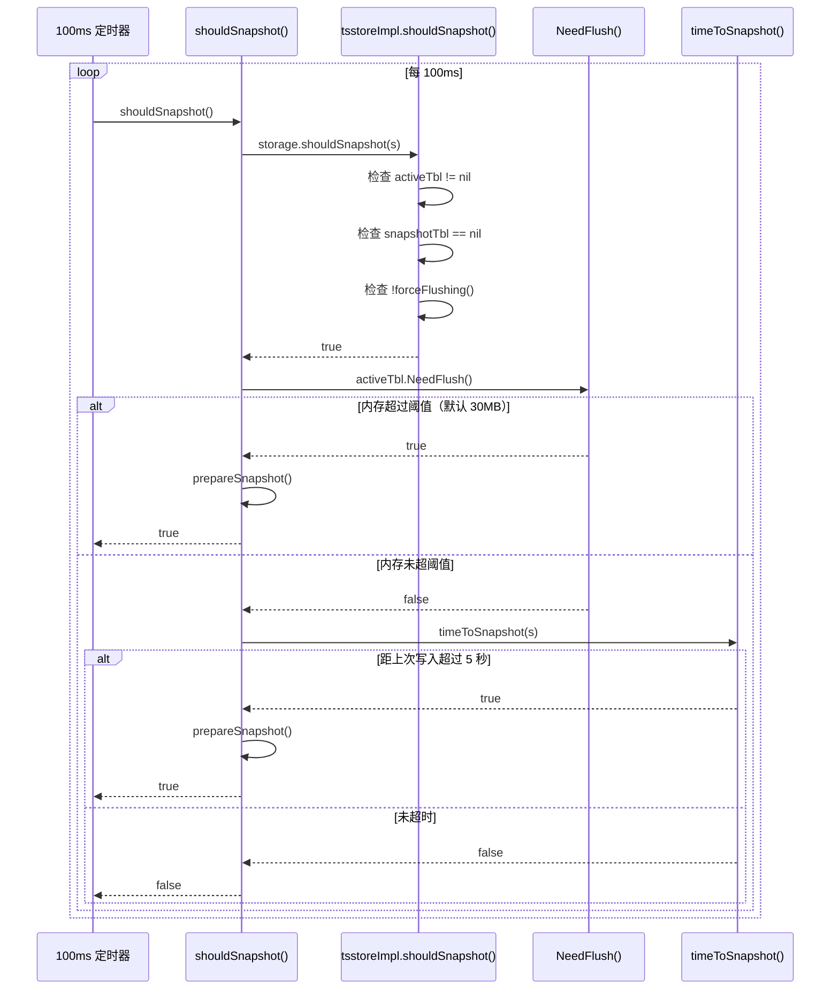

### 9.2 核心代码：`shouldSnapshot()` — 判断是否需要 snapshot

**代码位置**：`engine/shard.go:667-689` 和 `engine/ts_storage.go:105-110`（shouldSnapshot）、`112-114`（timeToSnapshot）

```go
// shard.shouldSnapshot
func (s *shard) shouldSnapshot() bool {
    s.snapshotLock.RLock()
    defer s.snapshotLock.RUnlock()

    // 前置检查：activeTbl 非空、snapshotTbl 为空、未在 forceFlush
    if !s.storage.shouldSnapshot(s) {
        return false
    }

    if s.activeTbl != nil && s.activeTbl.GetMemSize() > 0 {
        // 条件 1: 内存超过阈值
        if s.activeTbl.NeedFlush() {
            s.prepareSnapshot()
            return true
        }
        // 条件 2: 距上次写入超过 writeColdDuration（默认 5 秒）
        if s.storage.timeToSnapshot(s) {
            s.prepareSnapshot()
            return true
        }
    }
    return false
}

// tsstoreImpl.shouldSnapshot（第 105-110 行）
func (storage *tsstoreImpl) shouldSnapshot(s *shard) bool {
    if s.activeTbl == nil || s.snapshotTbl != nil || s.forceFlushing() {
        return false
    }
    return true
}

// tsstoreImpl.timeToSnapshot（第 112-114 行）
func (storage *tsstoreImpl) timeToSnapshot(s *shard) bool {
    return fasttime.UnixTimestamp() >= (atomic.LoadUint64(&s.lastWriteTime) + s.writeColdDuration)
}
```

**通俗解释**：
- **两个触发条件**：
  1. **内存超限**：`activeTbl.NeedFlush()` = `memSize > config.GetShardMemTableSizeLimit()`（默认 30MB）
  2. **写入冷超时**：距上次写入超过 `writeColdDuration`（默认 5 秒）
- **前置条件**：
  - `activeTbl != nil`：有活跃的 MemTable
  - `snapshotTbl == nil`：没有正在进行的 snapshot
  - `!forceFlushing()`：没有在进行 forceFlush

### 9.3 核心代码：`writeSnapshot()` — Snapshot 执行

**代码位置**：`engine/ts_storage.go:129-178`

```go
func (storage *tsstoreImpl) writeSnapshot(s *shard) {
    // 步骤 0: 重置 Raft 标志（如果启用了 Raft 一致性）
    if s.SnapShotter != nil {
        atomic.StoreUint32(&s.SnapShotter.RaftFlag, 0)
    }

    // 步骤 1: 获取 snapshot 锁
    s.snapshotLock.Lock()
    if s.activeTbl == nil {
        s.snapshotLock.Unlock()
        return
    }

    // 步骤 2: 切换 WAL
    walFiles, err := s.wal.Switch()
    if err != nil {
        s.snapshotLock.Unlock()
        panic("wal switch failed")
    }

    // 步骤 3: 切换 MemTable
    s.snapshotTbl = s.activeTbl          // 旧的 active → snapshot
    curSize := s.snapshotTbl.GetMemSize()

    s.activeTbl = s.memTablePool.Get(s.engineType)  // 从池中获取新的 active
    s.activeTbl.SetIdx(s.skIdx)

    // 步骤 3.1: Raft 一致性处理（如果启用）
    if s.SnapShotter != nil {
        s.SnapShotter.RaftFlushC <- true              // 通知 Raft 日志刷新
        atomic.StoreUint32(&s.SnapShotter.RaftFlag, 1) // 恢复 Raft 标志
    }
    s.snapshotLock.Unlock()

    // 步骤 4: 刷新索引
    start := time.Now()
    s.indexBuilder.Flush()

    // 步骤 5: 提交 snapshot（flush 到 TSSP 文件）
    s.commitSnapshot(s.snapshotTbl)
    nodeMutableLimit.freeResource(curSize)  // 释放内存令牌

    // 步骤 6: 删除旧 WAL 文件
    err = RemoveWalFiles(walFiles)
    if err != nil {
        panic("wal remove files failed: " + err.Error())
    }

    // 步骤 7: 释放 snapshot MemTable
    s.snapshotLock.Lock()
    s.snapshotTbl.UnRef()
    s.snapshotTbl = nil
    s.snapshotLock.Unlock()
}
```

（基于实际代码重写）

**通俗解释**：
- **步骤 2：切换 WAL**：旧的 WAL 文件被标记为"待删除"，新的 WAL 文件被创建
- **步骤 3：切换 MemTable**：
  - `snapshotTbl = activeTbl`：旧的 active 变成 snapshot（只读）
  - `activeTbl = memTablePool.Get()`：从池中获取新的 active（可写）
  - 这个切换在 `snapshotLock` 保护下进行，写入路径需要等待
- **步骤 4：刷新索引**：确保所有索引条目都已写入
- **步骤 5：提交 snapshot**：调用 `commitSnapshot` 把 snapshot 中的数据 flush 到 TSSP 文件
- **步骤 6：删除旧 WAL 文件**：snapshot 完成后，旧的 WAL 文件不再需要
- **步骤 7：释放 snapshot MemTable**：归还到池中，供下次使用

### 9.4 核心代码：`commitSnapshot()` — Flush 到 TSSP 文件

**代码位置**：`engine/shard.go:1023-1041`

```go
func (s *shard) commitSnapshot(snapshot *mutable.MemTable) {
    // 并行 flush 每个 measurement
    snapshot.ApplyConcurrency(func(msName string) {
        // 跳过正在删除的 measurement
        if s.checkMstDeleting(msName) {
            return
        }
        start := time.Now()
        count, ok := s.getRowCount(msName)
        
        // FlushChunks：把内存数据写入 TSSP 文件
        snapshot.MTable.FlushChunks(snapshot, s.filesPath, msName, 
            s.ident.OwnerDb, s.ident.Policy, s.lock, s.immTables, count, s.fileInfos)

        // 存储行计数
        if ok {
            if err := mutable.StoreMstRowCount(...); err != nil {
                s.log.Error("flush row count failed")
            }
        }
    })
}
```

**通俗解释**：
- **ApplyConcurrency**：并行处理每个 measurement
- **FlushChunks**：把 MemTable 中的数据写入 TSSP 文件
- **checkMstDeleting**：跳过正在删除的 measurement
- **行计数**：存储每个 measurement 的行数，用于统计

### 9.5 具体例子：Snapshot 的完整流程

假设 MemTable 内存达到 30MB 阈值：

```
步骤 1: shouldSnapshot() = true
  → activeTbl.GetMemSize() = 32MB > 30MB（阈值）
  → prepareSnapshot()

步骤 2: writeSnapshot()
  → snapshotLock.Lock()
  → wal.Switch() → 切换 WAL 文件
    → 旧 WAL 文件: wal_001.log, wal_002.log, wal_003.log, wal_004.log
    → 新 WAL 文件: wal_005.log, wal_006.log, wal_007.log, wal_008.log
  → snapshotTbl = activeTbl（旧的 active → snapshot）
  → activeTbl = memTablePool.Get()（新的 active）
  → snapshotLock.Unlock()

步骤 3: indexBuilder.Flush() → 刷新索引

步骤 4: commitSnapshot(snapshotTbl)
  → 并行 flush 每个 measurement:
    → cpu_0001: FlushChunks() → 写入 cpu_0001_001.tssp
    → mem_0001: FlushChunks() → 写入 mem_0001_001.tssp
  → 释放内存令牌: nodeMutableLimit.freeResource(32MB)

步骤 5: RemoveWalFiles(walFiles) → 删除旧 WAL 文件

步骤 6: snapshotTbl.UnRef() → 释放 snapshot MemTable
```

**Snapshot 前后的状态变化**：
```
Before:
  activeTbl = MemTable{memSize: 32MB, 数据: cpu, mem, disk}
  snapshotTbl = nil
  WAL = wal_001~004.log

After:
  activeTbl = MemTable{memSize: 0MB, 空表}
  snapshotTbl = nil（已释放）
  TSSP = cpu_0001_001.tssp, mem_0001_001.tssp（新文件）
  WAL = wal_005~008.log（新文件）
```

**通俗解释**：
Snapshot 就像"拍照"。MemTable 中的数据积累到一定量后，把它"拍"成 TSSP 文件（只读），然后清空 MemTable 继续接收新数据。WAL 也跟着切换，旧的 WAL 文件在 snapshot 完成后删除。

---

## 10. 第九步：WAL Replay（崩溃恢复）

### 10.1 WAL Replay 时序图

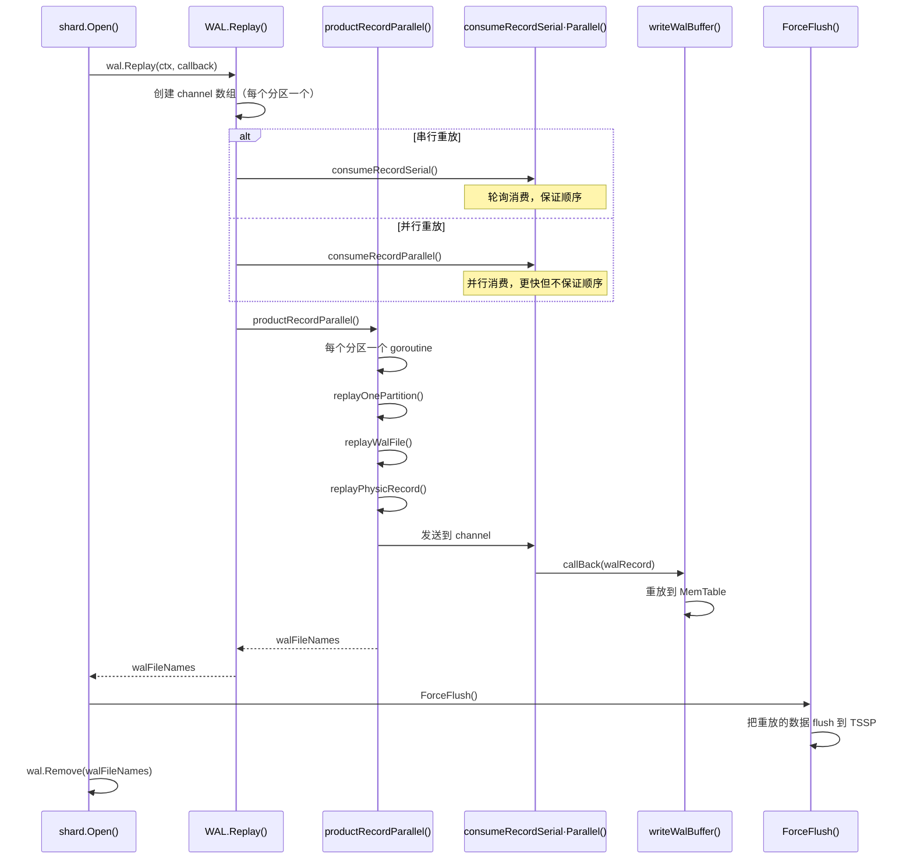

### 10.2 核心代码：`WAL.Replay()` — WAL 重放

**代码位置**：`engine/wal.go:589-631`

```go
func (l *WAL) Replay(ctx context.Context, callBack ReplayCallFuncType) ([]string, error) {
    if !l.walEnabled {
        return nil, nil
    }

    var mu = sync.Mutex{}
    var errs []error
    var ptChs []chan *walRecord
    consumeFinish := make(chan struct{})
    
    // 为每个分区创建 channel
    for i := 0; i < len(l.logReplay); i++ {
        ptChs = append(ptChs, make(chan *walRecord, 4))
    }

    if l.replayParallel {
        // 并行重放：每个分区独立消费
        l.ref()
        go func() {
            defer l.unref()
            consumeRecordParallel(ctx, &mu, ptChs, &errs, consumeFinish, l.logReplay, callBack)
        }()
    } else {
        // 串行重放：轮询消费，保证顺序
        l.ref()
        go func() {
            defer l.unref()
            consumeRecordSerial(ctx, &mu, ptChs, &errs, consumeFinish, l.logReplay, callBack)
        }()
    }

    // 生产者：并行读取每个分区的 WAL 文件
    walFileNames := l.productRecordParallel(ctx, &mu, ptChs, &errs)
    <-consumeFinish
    close(consumeFinish)
    for i := range ptChs {
        close(ptChs[i])
    }

    for _, err := range errs {
        return nil, err
    }
    return walFileNames, nil
}
```

**通俗解释**：
- **生产者-消费者模式**：
  - **生产者**：`productRecordParallel` 并行读取每个分区的 WAL 文件
  - **消费者**：`consumeRecordSerial` 或 `consumeRecordParallel` 消费记录
- **两种重放模式**：
  - **串行**：轮询消费，保证同一 series 的更新顺序
  - **并行**：每个分区独立消费，更快但不保证跨分区顺序
- **channel**：每个分区一个 channel，buffer=4

### 10.3 核心代码：`replayPhysicRecord()` — 解析单条 WAL 记录

**代码位置**：`engine/wal.go:306-364`

```go
func (l *WAL) replayPhysicRecord(fr *bufio.Reader, walFileName string, 
    recordCompBuff []byte, callBack func(pc *walRecord) error) ([]byte, error) {
    
    // 步骤 1: 读取记录头（5 字节）
    var recordHeader [WalRecordHeadSize]byte
    n, err := io.ReadFull(fr, recordHeader[:])
    if err != nil {
        return recordCompBuff, io.EOF
    }

    // 步骤 2: 解析类型和长度
    writeWalType := WalRecordType(recordHeader[0])
    compBinaryLen := binary.BigEndian.Uint32(recordHeader[1:WalRecordHeadSize])
    
    // 步骤 3: 准备缓冲区
    recordCompBuff = bufferpool.Resize(recordCompBuff, int(compBinaryLen))

    // 步骤 4: 读取压缩数据
    n, err = io.ReadFull(fr, recordCompBuff)
    
    // 步骤 5: Snappy 解压
    binaryBuff, innerErr = snappy.Decode(binaryBuff, recordCompBuff)
    if innerErr != nil {
        return recordCompBuff, io.EOF
    }

    // 步骤 6: 反序列化
    if writeWalType == WriteWalLineProtocol {
        rowsObjects, err = l.unmarshalRows(binaryBuff, rowsObjects)
        wr.rowsObjs = rowsObjects
    } else {
        wr.binary = binaryBuff
    }

    // 步骤 7: 调用回调函数
    innerErr = callBack(wr)
    return recordCompBuff, innerErr
}
```

**通俗解释**：
- **步骤 1**：读取 5 字节记录头
- **步骤 2**：解析类型（1字节）和压缩后长度（4字节，BigEndian）
- **步骤 3-4**：读取压缩数据
- **步骤 5**：Snappy 解压
- **步骤 6**：反序列化为 Row 对象
- **步骤 7**：调用回调函数，重放到 MemTable

---

## 11. 总结：写入全流程代码路径

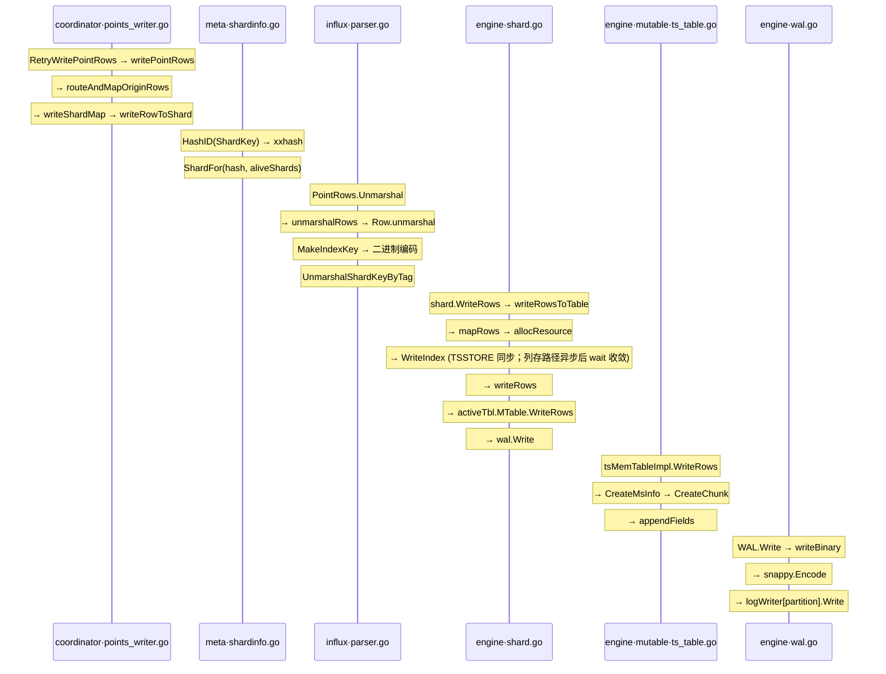

---

## 12. 端到端实战：一条数据点的完整生命周期

> 以 `cpu,host=server1,region=us value=99.5,temperature=25.0 1234567890` 为例，追踪它从 HTTP 请求到落盘的每一步。

### 12.1 完端到端时序图

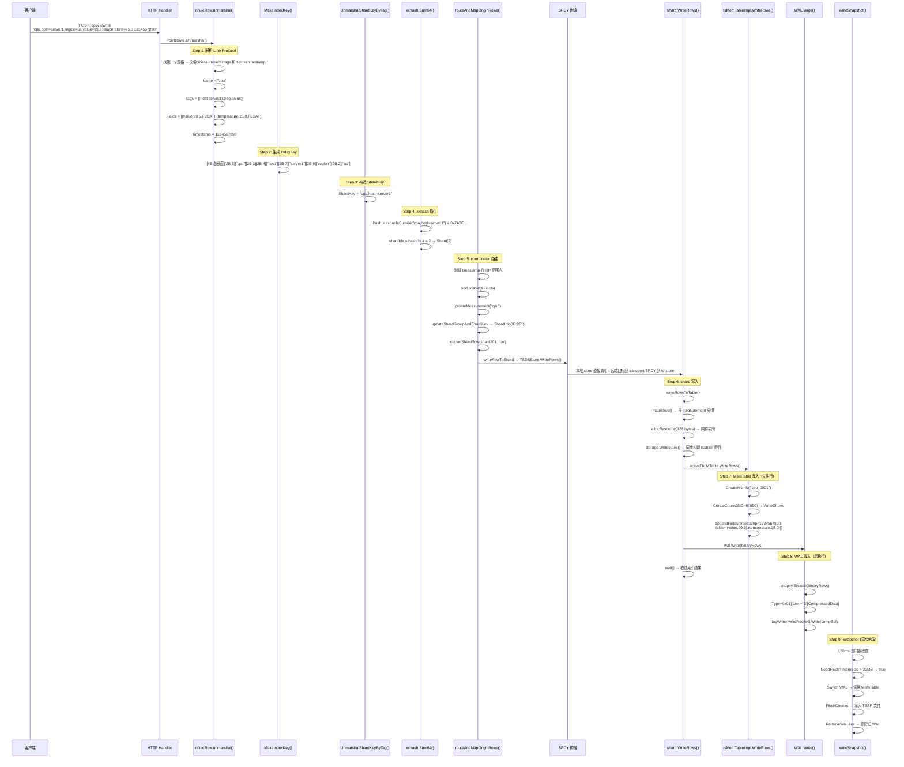

### 12.2 Step 1 详解：Line Protocol 解析 — 从字符串到 Row 结构体

**输入字符串**：
```
cpu,host=server1,region=us value=99.5,temperature=25.0 1234567890
```

**代码路径**：`lib/util/lifted/vm/protoparser/influx/parser.go:1169-1240`

```go
func (r *Row) unmarshal(s string, ...) {
    // s = "cpu,host=server1,region=us value=99.5,temperature=25.0 1234567890"

    // 找第一个空格 → n=27
    n := nextUnescapedChar(s, ' ', ...)
    measurementTags := s[:n]  // "cpu,host=server1,region=us"
    s = stripLeadingWhitespace(s[n+1:])  // "value=99.5,temperature=25.0 1234567890"
```

**逐行解释**：
- `s[:n]` = `"cpu,host=server1,region=us"` — 第一个空格之前的部分
- `s[n+1:]` = `"value=99.5,temperature=25.0 1234567890"` — 第一个空格之后的部分

```go
    // 找 measurementTags 中的第一个逗号 → n=3
    n = nextUnescapedChar(measurementTags, ',', ...)
    // measurementTags[:3] = "cpu" → r.Name
    // measurementTags[4:] = "host=server1,region=us" → 解析 tags
```

**逐行解释**：
- 逗号左边 `"cpu"` → `r.Name`
- 逗号右边 `"host=server1,region=us"` → 调用 `unmarshalTags()` 解析

```go
    // unmarshalTags 解析结果：
    r.Tags = PointTags{
        {Key: "host",   Value: "server1"},  // 第一个 tag
        {Key: "region", Value: "us"},       // 第二个 tag
    }
    sort.Sort(&r.Tags)  // 按 Key 排序 → 已经有序
```

**逐行解释**：
- Tags 按 Key 排序，确保 `host=server1,region=us` 和 `region=us,host=server1` 生成相同的 seriesKey
- 排序后：`[{host,server1}, {region,us}]`

```go
    // 解析 fields: "value=99.5,temperature=25.0"
    // 解析 timestamp: "1234567890"
    r.Fields = Fields{
        {Key: "value",       Value: 99.5,  Type: influx.Float},
        {Key: "temperature", Value: 25.0,  Type: influx.Float},
    }
    r.Timestamp = 1234567890  // 纳秒时间戳
```

**逐行解释**：
- `unmarshalInfluxFields()` 解析 `"value=99.5"` → `Field{Key:"value", Value:99.5, Type:FLOAT}`
- `unmarshalInfluxFields()` 解析 `"temperature=25.0"` → `Field{Key:"temperature", Value:25.0, Type:FLOAT}`
- `nextTimestamp()` 解析 `"1234567890"` → `int64(1234567890)`

**解析完成后的 Row 结构体**：
```go
Row{
    Name:      "cpu",
    Tags:      [{Key:"host", Value:"server1"}, {Key:"region", Value:"us"}],
    Fields:    [{Key:"value", Value:99.5, Type:FLOAT}, {Key:"temperature", Value:25.0, Type:FLOAT}],
    Timestamp: 1234567890,
    // 以下字段在后续步骤填充
    IndexKey:  nil,  // Step 2 填充
    ShardKey:  nil,  // Step 3 填充
    PrimaryId: 0,    // Step 5 填充
    SeriesId:  0,    // Step 5 填充
}
```

### 12.3 Step 2 详解：IndexKey 生成 — 二进制编码

**代码路径**：`lib/util/lifted/vm/protoparser/influx/parser.go:792-817`

**输入**：`name="cpu"`, `tags=[{host,server1},{region,us}]`

```go
func MakeIndexKey(name string, tags PointTags, dst []byte) []byte {
    // 计算总长度
    indexKl := 4 +           // total length (4 bytes) = 4
        2 +                  // measurement name length (2 bytes) = 2
        len(name) +          // "cpu" = 3
        2 +                  // tag count (2 bytes) = 2
        4*len(tags) +        // 2 tags × 4 bytes = 8
        tags.TagsSize()      // "host"+"server1"+"region"+"us" = 4+7+6+2 = 19
    // indexKl = 4 + 2 + 3 + 2 + 8 + 19 = 38
```

**逐行解释**：
- `4`：总长度字段本身占 4 字节
- `2`：measurement name 长度字段占 2 字节
- `len("cpu")` = 3：measurement name 本身占 3 字节
- `2`：tag 数量字段占 2 字节
- `4*2` = 8：每个 tag 的 keyLen(2) + valueLen(2)，共 2 个 tag
- `tags.TagsSize()` = `len("host")+len("server1")+len("region")+len("us")` = 4+7+6+2 = 19

```go
    // 编码过程（逐字节）
    dst = encoding.MarshalUint32(dst, 38)      // [0x00, 0x00, 0x00, 0x26]
    dst = encoding.MarshalUint16(dst, 3)       // [0x00, 0x03]
    dst = append(dst, "cpu"...)                 // [0x63, 0x70, 0x75]
    dst = encoding.MarshalUint16(dst, 2)       // [0x00, 0x02] (tag count)

    // Tag 1: host=server1
    dst = encoding.MarshalUint16(dst, 4)       // [0x00, 0x04] (key len)
    dst = append(dst, "host"...)                // [0x68, 0x6F, 0x73, 0x74]
    dst = encoding.MarshalUint16(dst, 7)       // [0x00, 0x07] (value len)
    dst = append(dst, "server1"...)             // [0x73, 0x65, 0x72, 0x76, 0x65, 0x72, 0x31]

    // Tag 2: region=us
    dst = encoding.MarshalUint16(dst, 6)       // [0x00, 0x06] (key len)
    dst = append(dst, "region"...)              // [0x72, 0x65, 0x67, 0x69, 0x6F, 0x6E]
    dst = encoding.MarshalUint16(dst, 2)       // [0x00, 0x02] (value len)
    dst = append(dst, "us"...)                  // [0x75, 0x73]
}
```

**最终 IndexKey 字节布局**：
```
偏移  内容                          含义
0x00  00 00 00 26                   总长度 = 38
0x04  00 03                         name 长度 = 3
0x06  63 70 75                      "cpu"
0x09  00 02                         tag 数量 = 2
0x0B  00 04                         tag1 key 长度 = 4
0x0D  68 6F 73 74                   "host"
0x11  00 07                         tag1 value 长度 = 7
0x13  73 65 72 76 65 72 31          "server1"
0x1A  00 06                         tag2 key 长度 = 6
0x1C  72 65 67 69 6F 6E             "region"
0x22  00 02                         tag2 value 长度 = 2
0x24  75 73                         "us"
```

**为什么这样编码？**

> IndexKey 是索引系统中最核心的数据结构之一。它的编码方式直接影响查询性能。

**原因 1：二进制编码比字符串拼接更紧凑**
```
字符串拼接方式："cpu,host=server1,region=us"
  长度 = 29 字节（包含逗号、等号等分隔符）

二进制编码方式：[4B总长][2B名长][cpu][2B标签数][2B键长][host][2B值长][server1]...
  长度 ≈ 25 字节（无分隔符，长度字段用固定 2 字节）

节省约 15% 的存储空间，且解析速度更快
```

**原因 2：支持前缀匹配和范围查询**
```
二进制编码的结构化格式支持高效的前缀匹配：

查询：WHERE host = 'server1'
  1. 构造前缀：[0x01] + [measurement] + [0x02] + [host] + [server1]
  2. 在 B-Tree 索引中做前缀扫描
  3. 所有匹配的 IndexKey 连续存储，一次 IO 就能读取

如果用字符串拼接，需要先解析逗号和等号，再做比较，效率低得多
```

**原因 3：Tags 排序保证幂等性**
```
写入顺序 1：cpu,host=server1,region=us
写入顺序 2：cpu,region=us,host=server1

如果 tags 不排序 → 两个不同的 IndexKey → 两个不同的 series → 数据重复！

排序后：
  写入 1：cpu,host=server1,region=us → IndexKey A
  写入 2：cpu,host=server1,region=us → IndexKey A（相同！）
  → 正确识别为同一个 series，数据不重复
```

### 12.4 Step 3 详解：ShardKey 构造 — 路由键

**代码路径**：`lib/util/lifted/vm/protoparser/influx/parser.go:307-359`

**假设**：数据库配置 `shardKeyTags = ["host"]`

```go
func (r *Row) UnmarshalShardKeyByTag(tags []string) error {
    r.ShardKey = append(r.ShardKey[:0], r.Name...)  // r.ShardKey = "cpu"

    // 双指针法匹配
    i, j := 0, 0  // i → tags=["host"], j → r.Tags=[{host,server1},{region,us}]
    for i < len(tags) && j < len(r.Tags) {
        // tags[0]="host" == r.Tags[0].Key="host" → 匹配！
        if tags[i] == r.Tags[j].Key {
            r.appendShardKey(j)  // r.ShardKey = "cpu,host=server1"
            i++  // i=1
        }
        j++  // j=1
    }
    // i=1 == len(tags)=1 → 循环结束
    return nil
}
```

**逐行解释**：
- `r.ShardKey = "cpu"` — 从 measurement name 开始
- `tags[0]="host"` == `r.Tags[0].Key="host"` → 匹配
- `appendShardKey(0)` → `r.ShardKey = "cpu,host=server1"`
- 循环结束，`i=1 == len(tags)=1`，所有 shardKey tags 都找到了

**最终 ShardKey**：`"cpu,host=server1"`

**为什么 ShardKey 不包含 region？**
- ShardKey 只包含配置的 `shardKeyTags`，不包含所有 tags
- 这样相同 host 的数据总是路由到同一个 shard，保证数据局部性
- region 信息存储在 IndexKey 中，用于索引查询

### 12.5 Step 4 详解：xxhash 路由 — 选择目标 Shard

**代码路径**：`lib/util/lifted/influx/meta/shardinfo.go:571-573, 393-399`

```go
// 步骤 1: 计算哈希值
hash := xxhash.Sum64([]byte("cpu,host=server1"))
// 假设 hash = 0x7A3F8B2C1D4E5F60 (64 位)

// 步骤 2: 选择 shard
func (sgi *ShardGroupInfo) ShardFor(hash uint64, aliveShardIdxes []int) *ShardInfo {
    // 假设 aliveShardIdxes = [0, 1, 2, 3] (4 个活跃 shard)
    shardIdx := aliveShardIdxes[hash % uint64(len(aliveShardIdxes))]
    // shardIdx = 0x7A3F8B2C1D4E5F60 % 4 = 0 (偶数)
    // 假设实际计算结果是 2
    return &sgi.Shards[2]  // 返回 Shard[2]
}
```

**逐行解释**：
- `xxhash.Sum64()` 对 `"cpu,host=server1"` 计算 64 位哈希值
- `hash % 4` 取模得到 shard 索引（假设 4 个活跃 shard）
- 相同的 ShardKey 总是路由到相同的 shard，保证数据局部性

**关键设计**：
- 如果 host=server1 的数据路由到 Shard[2]，那么所有 host=server1 的数据都会路由到 Shard[2]
- 这样查询 `WHERE host='server1'` 只需要扫描一个 shard，提高查询效率
- 如果 shard 数量变化（扩容/缩容），aliveShardIdxes 会更新，路由也会相应变化

### 12.6 Step 5 详解：coordinator 路由 — 验证与分组

**代码路径**：`coordinator/points_writer.go:381-612`

```go
func (w *PointsWriter) routeAndMapOriginRows(...) {
    for i := 0; i < len(rows); i++ {
        r = &rows[i]  // r = &Row{Name:"cpu", Tags:[...], Fields:[...], Timestamp:1234567890}

        // 步骤 1: 验证时间戳
        if r.Timestamp < ctx.minTime || !w.inTimeRange(r.Timestamp) {
            // 假设 1234567890 在 RP 范围内，通过
        }

        // 步骤 2: 排序 fields
        sort.Stable(&r.Fields)
        // Fields 已经按 Key 排序：[{temperature,25.0}, {value,99.5}]

        // 步骤 3: 修正 fields
        r.Fields, _ = fixFields(r.Fields)
        // 检查 field 类型一致性，如果有同名 field 类型不同则报错

        // 步骤 4: 创建或获取 measurement
        ctx.ms, _ = wh.createMeasurement(database, retentionPolicy, "cpu", skipPreCheck)
        r.Name = ctx.ms.Name  // r.Name = "cpu_0001" (带版本号)

        // 步骤 5: 更新 schema
        ctx.fieldToCreatePool, _, _ = wh.updateSchemaIfNeeded(...)
        // 如果 "temperature" 是新 field，会创建新的 schema

        // 步骤 6: 计算 ShardKey，找到目标 shard
        err, sh, _ = w.updateShardGroupAndShardKey(database, retentionPolicy, r, ctx, ...)
        // sh = &ShardInfo{ID: 201, Owners: [{NodeID:1}, {NodeID:2}]}

        // 步骤 7: 将行映射到 shard
        ctx.setShardRow(sh, r)  // shardMap[201] = append(shardMap[201], r)
    }
}
```

**逐行解释**：
- `sort.Stable(&r.Fields)`：fields 按 Key 排序，确保相同 fields 组合生成相同的编码
- `r.Name = ctx.ms.Name`：measurement 名称带版本号，如 `"cpu_0001"`
- `updateShardGroupAndShardKey()`：计算 ShardKey，找到目标 shard
- `ctx.setShardRow(sh, r)`：将行添加到 shard 的行列表中

**路由结果**：
```go
shardMap = {
    ShardInfo{ID:201}: [
        Row{Name:"cpu_0001", Tags:[{host,server1},{region,us}],
            Fields:[{temperature,25.0},{value,99.5}], Timestamp:1234567890,
            ShardKey:"cpu,host=server1", IndexKey:[...], PrimaryId:67890},
    ],
}
```

### 12.7 Step 6 详解：shard 写入 — 内存令牌与索引构建

**代码路径**：`engine/shard.go:527-552, 928-975`

```go
func (s *shard) WriteRows(rows []influx.Row, binaryRows []byte) error {
    // 检查 shard 是否正在关闭
    if s.isClosing() {
        return errno.NewError(errno.ErrShardClosed, s.ident.ShardID)
    }

    // 获取读锁（允许并发写入）
    s.mu.RLock()
    defer s.mu.RUnlock()

    // 标记正在写入（防止 shard 被关闭）
    defer s.markBeingWritten()()

    // 调用 writeRowsToTable
    err = s.writeRowsToTable(rows, binaryRows)
    return err
}
```

**逐行解释**：
- `s.isClosing()`：检查 shard 是否正在关闭，如果关闭则拒绝写入
- `s.mu.RLock()`：读锁，允许多个 goroutine 并发写入
- `s.markBeingWritten()`：标记正在写入，防止 shard 在写入过程中被关闭

```go
func (s *shard) writeRowsToTable(rows influx.Rows, binaryRows []byte) error {
    // 步骤 1: 更新最后写入时间
    atomic.StoreUint64(&s.lastWriteTime, fasttime.UnixTimestamp())

    // 步骤 2: 按 measurement 分组
    mapRows(rows, mw)
    // mw.mstMap = {"cpu_0001": [Row{...}]}

    // 步骤 3: 计算内存大小
    curSize := calculateMemSize(rows)
    // 假设 curSize = 128 bytes (2 fields × 8 bytes × 8 rows)

    // 步骤 4: 申请内存令牌
    err = nodeMutableLimit.allocResource(curSize, mw.timer)
    // 如果内存不足，会阻塞等待

    // 步骤 5: 构建索引。tsstore 同步执行；columnstore 写列路径异步执行。
    wait := s.storage.WriteIndex(s.indexBuilder, mw)

    // 步骤 6: 写入 MemTable + WAL
    err = s.writeRows(mw, binaryRows, curSize)

    // 步骤 7: 等待索引构建完成
    if err == nil {
        err = wait()
    }
    return nil
}
```

**逐行解释**：
- `mapRows()`：将行按 measurement 分组，方便批量处理
- `calculateMemSize()`：计算行数据的内存大小
- `nodeMutableLimit.allocResource()`：申请内存令牌，如果内存不足会阻塞等待
- `WriteIndex()`：普通 tsstore 同步构建索引并返回 `wait`；columnstore 的列写入索引在 goroutine 中异步执行
- `writeRows()`：在 `WriteIndex` 之后写入 MemTable 和 WAL，内部顺序是 `MTable.WriteRows` → `wal.Write`

### 12.8 Step 7 详解：MemTable 写入 — 列式存储

**代码路径**：`engine/mutable/ts_table.go:295-344, 346-381`

```go
func (t *tsMemTableImpl) WriteRows(table *MemTable, rowsD *dictpool.Dict, wc WriteRowsCtx) error {
    for _, mapp := range rowsD.D {
        rs := *mapp.Value.(*[]influx.Row)  // rs = [Row{Name:"cpu_0001", ...}]
        msName := stringinterner.InternSafe(mapp.Key)  // msName = "cpu_0001"

        // 步骤 1: 创建或获取 MsInfo
        msInfo := table.CreateMsInfo(msName, &rs[0], nil)
        // msInfo = &MsInfo{Name:"cpu_0001", Schema:[{value,FLOAT},{temperature,FLOAT}], sidMap:map[]}

        for index := range rs {
            sid = rs[index].PrimaryId  // sid = 67890

            // 步骤 2: 创建或获取 WriteChunk
            chunk, exist = msInfo.CreateChunk(sid)
            // chunk = &WriteChunk{Sid:67890, WriteRec:{rec:nil, ...}}

            // 步骤 3: 如果是新 series，创建索引
            if !exist && table.idx != nil {
                err = table.idx.CreateIndex(util.Str2bytes(msName), rs[index].ShardKey, sid)
                // 创建索引条目：ShardKey → SID
            }

            // 步骤 4: 追加字段数据
            _, err = t.appendFields(msInfo, chunk, rs[index].Timestamp, rs[index].Fields)
        }
    }
    return nil
}
```

**逐行解释**：
- `table.CreateMsInfo()`：创建或获取 measurement 信息，包含 schema 和所有 series
- `msInfo.CreateChunk(sid)`：根据 SID 创建或获取 WriteChunk
- `table.idx.CreateIndex()`：如果是新 series，创建索引条目
- `t.appendFields()`：追加字段数据到 WriteChunk 的 record 中

```go
func (t *tsMemTableImpl) appendFields(msInfo *MsInfo, chunk *WriteChunk, time int64, fields []influx.Field) (int64, error) {
    chunk.Mu.Lock()
    defer chunk.Mu.Unlock()

    writeRec := &chunk.WriteRec
    if writeRec.rec == nil {
        writeRec.init(msInfo.Schema)  // 初始化 record
        // rec.Schema = [{value,FLOAT},{temperature,FLOAT}]
        // rec.ColVals = [
        //   {Val: []float64{}, Nil: []bool{}, ...},  // value 列
        //   {Val: []float64{}, Nil: []bool{}, ...},  // temperature 列
        // ]
    }

    // 检查 schema 是否一致
    sameSchema := checkSchemaIsSame(writeRec.rec.Schema, fields)
    // true → schema 一致

    // 更新时间范围
    if time <= writeRec.lastAppendTime {
        writeRec.timeAsd = false  // 时间不是升序
    } else {
        writeRec.lastAppendTime = time  // 更新最后时间
    }
    if time < writeRec.firstAppendTime {
        writeRec.firstAppendTime = time  // 更新最早时间
    }

    // 追加字段数据到 record
    return record.AppendFieldsToRecord(writeRec.rec, fields, time, sameSchema)
}
```

**逐行解释**：
- `writeRec.init(msInfo.Schema)`：初始化 record，创建列式存储结构
- `checkSchemaIsSame()`：检查新数据的 schema 是否与 record 一致
- `record.AppendFieldsToRecord()`：将字段数据追加到 record 的列中

**MemTable 写入后的数据布局**：
```
MemTable {
    msInfoMap: {
        "cpu_0001": MsInfo {
            Name: "cpu_0001"
            Schema: [{Key:"value", Type:FLOAT}, {Key:"temperature", Type:FLOAT}]
            sidMap: {
                67890: WriteChunk {
                    Sid: 67890
                    WriteRec: {
                        rec: Record {
                            Schema: [{Key:"value", Type:FLOAT}, {Key:"temperature", Type:FLOAT}]
                            ColVals: [
                                {Val: [99.5],    Nil: [false]},  // value 列
                                {Val: [25.0],    Nil: [false]},  // temperature 列
                                {Val: [1234567890], Nil: [false]},  // time 列
                            ]
                        }
                        firstAppendTime: 1234567890
                        lastAppendTime: 1234567890
                        timeAsd: true
                    }
                }
            }
        }
    }
    memSize: 128  // bytes
}
```

### 12.9 Step 8 详解：WAL 写入 — 持久化日志

**代码路径**：`engine/wal.go:245-263, 215-243`

```go
func (l *WAL) Write(rows []byte, typ WalRecordType, maxRowTime int64) error {
    // rows = 序列化后的行数据（二进制格式）
    // typ = WriteWalLineProtocol
    // maxRowTime = 1234567890

    // 更新最大时间戳
    l.mu.Lock()
    l.maxRowTime = max(l.maxRowTime, maxRowTime)  // l.maxRowTime = 1234567890
    l.mu.Unlock()

    // 写入 WAL
    err := l.writeBinary(&walRecord{binary: rows, writeWalType: typ})
    return err
}
```

**逐行解释**：
- `rows`：序列化后的行数据，包含 measurement、tags、fields、timestamp
- `maxRowTime`：更新 WAL 的最大时间戳，用于判断是否需要 snapshot
- `writeBinary()`：实际写入 WAL 文件

```go
func (l *WAL) writeBinary(walRecord *walRecord) error {
    // 步骤 1: 从池中获取压缩缓冲区
    compBuf := walCompBufPool.Get()
    maxEncodeLen := snappy.MaxEncodedLen(len(walRecord.binary))
    compBuf = bufferpool.Resize(compBuf, WalRecordHeadSize+maxEncodeLen)

    // 步骤 2: Snappy 压缩
    compData := snappy.Encode(compBuf[WalRecordHeadSize:], walRecord.binary)
    // 假设压缩后 compData = [0x1A, 0x2B, 0x3C, ...] (变长)

    // 步骤 3: 编码记录头
    compBuf[0] = byte(WalRecordType)  // 0x01 (WriteWalLineProtocol)
    binary.BigEndian.PutUint32(compBuf[1:5], uint32(len(compData)))
    // compBuf[1:5] = [0x00, 0x00, 0x00, 0x0A] (假设压缩后长度=10)
    compBuf = compBuf[:5+len(compData)]

    // 步骤 4: 选择分区并写入
    partitionIdx := (atomic.AddUint64(&l.writeReq, 1) - 1) % uint64(l.partitionNum)
    // 假设 l.writeReq=42, l.partitionNum=4 → partitionIdx = 41 % 4 = 1
    err := l.logWriter[1].Write(compBuf)
    return err
}
```

**逐行解释**：
- `snappy.Encode()`：使用 Snappy 压缩数据（快速压缩，压缩率适中）
- `compBuf[0] = 0x01`：记录类型为 WriteWalLineProtocol
- `binary.BigEndian.PutUint32()`：压缩后长度用大端序编码
- `partitionIdx = writeReq % partitionNum`：round-robin 选择分区

**WAL 记录格式**：
```
+------+------+------+------+------+------+------+------+------+------+------+------+------+------+------+------+------+------+------+------+
| Type |            Compressed Length (4 bytes, BigEndian)            |                      Compressed Data (variable)                      |
+------+------+------+------+------+------+------+------+------+------+------+------+------+------+------+------+------+------+------+------+
| 0x01 |                                0A                               |                      1A 2B 3C ... (Snappy 压缩)                      |
+------+------+------+------+------+------+------+------+------+------+------+------+------+------+------+------+------+------+------+------+
| 1B   |                                4B                               |                              variable                              |
+------+------+------+------+------+------+------+------+------+------+------+------+------+------+------+------+------+------+------+------+
```

**为什么先写 MemTable 再写 WAL？**

> 这个设计看起来"反直觉" — 通常数据库是先写 WAL 再写内存（如 MySQL 的 redo log）。openGemini 为什么反过来？

**核心原因：时序数据的写入模式与 OLTP 不同**

OLTP 数据库（如 MySQL）：
```
写入模式：随机写，每条数据可能修改不同的行
  INSERT INTO users (id, name) VALUES (123, 'Alice')
  UPDATE users SET name = 'Bob' WHERE id = 456

需要 WAL 的原因：
  - 每条写入都可能修改磁盘上的不同页面
  - 如果写入一半崩溃，需要 WAL 来恢复"已写入但未持久化"的数据
  - WAL 是崩溃恢复的唯一保障
```

时序数据库（如 openGemini）：
```
写入模式：追加写，数据按时间顺序追加到 MemTable
  INSERT cpu,host=server1 value=99.5 1234567890
  INSERT cpu,host=server2 value=88.3 1234567891

MemTable 的特点：
  - 数据在内存中按 (seriesID, time) 组织
  - 写入是纯内存操作，不涉及磁盘随机 IO
  - 即使崩溃，MemTable 中的数据丢失，但 WAL 可以重放恢复
```

**openGemini 的写入顺序：**

```
Step 1: 写入 MemTable（内存操作，~微秒级）
  - 将数据追加到对应 series 的 Chunk 中
  - 更新内存中的索引（TSID → MemTable 位置）

Step 2: 写入 WAL（磁盘操作，~毫秒级）
  - 使用 Snappy 压缩数据
  - 使用 round-robin 分区写入多个 WAL 文件
  - 多个分区并行写入，提高吞吐

Step 3: 返回成功
  - 此时数据在 MemTable（内存）和 WAL（磁盘）中都有副本
```

**为什么不先写 WAL？两个关键原因：**

**原因 1：MemTable 写入不依赖 WAL**
```
MySQL 的情况：
  - 写入 Buffer Pool 需要知道"这个页面是否已持久化"
  - 如果先写内存再写 WAL，崩溃时可能丢失"已写入内存但未持久化"的数据
  - 所以必须先写 WAL（保证持久化），再写内存

openGemini 的情况：
  - `shard.writeRows` 在同一次调用中先执行 `activeTbl.MTable.WriteRows(...)`，再执行 `s.wal.Write(...)`
  - MemTable 是内存追加结构，写入成功后可被查询路径读取；WAL 成功后才具备崩溃恢复依据
  - 如果 `s.wal.Write(...)` 返回错误，函数会返回错误，但该路径不会回滚已经写入 MemTable 的数据
  - 因此这里不能理解成“先后顺序对正确性没有影响”：对成功返回的请求，MemTable 和 WAL 都已成功；对 WAL 失败的请求，调用方看到错误，但崩溃恢复只能依赖已经成功落盘的 WAL
```

**原因 2：先写 MemTable 后写 WAL，但客户端仍等待 WAL 结果**
```
如果先写 WAL：
  客户端等待时间 = WAL 写入时间（~1-5ms）

如果先写 MemTable：
  客户端等待时间 = MemTable 写入时间（~1μs）+ WAL 写入时间（~1-5ms）
  当前实现不是不同 goroutine 并行写入，而是在同一写入路径里顺序执行
  客户端只有在 WAL 写入也成功后才收到成功返回

但先写 MemTable 的好处：
  - 写入逻辑可以先复用 MemTable 的 schema、series、row count 处理，再把原始 binary rows 交给 WAL
  - 如果 WAL 写入失败，代码没有“未确认”标记，也不会在 snapshot 时按未确认状态跳过
  - 调用方必须把返回错误视为写入失败；内存中可能短暂可见的数据不构成持久化承诺
```

**WAL 的真正作用：**

```
WAL 不是为了"保证每次写入的持久性"，而是为了"崩溃恢复"：

正常运行时：
  数据写入 MemTable → 定期 snapshot 到磁盘 → 清理旧 WAL

崩溃恢复时：
  读取 WAL → 重放未 snapshot 的数据 → 恢复 MemTable

WAL 的生命周期：
  写入 → snapshot 完成 → 标记为可清理 → 异步删除
```

### 12.10 Step 9 详解：Snapshot — 从内存到磁盘

**代码路径**：`engine/shard.go:667-689, engine/ts_storage.go:129-178`

**触发条件**：
```go
// engine/shard.go:667-689
func (s *shard) shouldSnapshot() bool {
    s.snapshotLock.RLock()
    defer s.snapshotLock.RUnlock()

    // 前置检查：委托给 storage 实现
    if !s.storage.shouldSnapshot(s) {
        return false
    }

    if s.activeTbl != nil && s.activeTbl.GetMemSize() > 0 {
        // 条件 1: 内存超过阈值（默认 30MB）
        if s.activeTbl.NeedFlush() {
            s.prepareSnapshot()
            return true
        }
        // 条件 2: 距上次写入超过 writeColdDuration（默认 5 秒）
        if s.storage.timeToSnapshot(s) {
            s.prepareSnapshot()
            return true
        }
    }
    return false
}

// engine/ts_storage.go:105-110
func (storage *tsstoreImpl) shouldSnapshot(s *shard) bool {
    if s.activeTbl == nil || s.snapshotTbl != nil || s.forceFlushing() {
        return false
    }
    return true
}
```

（基于实际代码重写）

**逐行解释**：
- `s.storage.shouldSnapshot(s)`：委托给 `tsstoreImpl` 做前置检查（activeTbl 非空、snapshotTbl 为空、未在 forceFlush）
- `s.activeTbl.NeedFlush()`：内存超过阈值（默认 30MB），需要 flush
- `s.storage.timeToSnapshot(s)`：距上次写入超过 writeColdDuration，委托给 storage 实现判断

**Snapshot 执行过程**：
```go
func (storage *tsstoreImpl) writeSnapshot(s *shard) {
    // 步骤 0: 重置 Raft 标志（如果启用 Raft 一致性）
    if s.SnapShotter != nil {
        atomic.StoreUint32(&s.SnapShotter.RaftFlag, 0)
    }

    // 步骤 1: 获取 snapshot 锁
    s.snapshotLock.Lock()

    // 步骤 2: 切换 WAL
    walFiles, err := s.wal.Switch()

    // 步骤 3: 切换 MemTable
    s.snapshotTbl = s.activeTbl          // 旧的 active → snapshot（只读）
    curSize := s.snapshotTbl.GetMemSize()
    s.activeTbl = s.memTablePool.Get(s.engineType)  // 从池中获取新的 active（可写）
    s.activeTbl.SetIdx(s.skIdx)

    // 步骤 3.1: Raft 一致性处理（如果启用）
    if s.SnapShotter != nil {
        s.SnapShotter.RaftFlushC <- true              // 通知 Raft 日志刷新
        atomic.StoreUint32(&s.SnapShotter.RaftFlag, 1) // 恢复 Raft 标志
    }
    s.snapshotLock.Unlock()

    // 步骤 4: 刷新索引
    s.indexBuilder.Flush()

    // 步骤 5: 提交 snapshot（flush 到 TSSP 文件）
    s.commitSnapshot(s.snapshotTbl)
    nodeMutableLimit.freeResource(curSize)  // 释放内存令牌

    // 步骤 6: 删除旧 WAL 文件
    RemoveWalFiles(walFiles)

    // 步骤 7: 释放 snapshot MemTable
    s.snapshotLock.Lock()
    s.snapshotTbl.UnRef()
    s.snapshotTbl = nil
    s.snapshotLock.Unlock()
}
```

（基于实际代码重写）

**逐行解释**：
- `s.SnapShotter.RaftFlag`：重置 Raft 标志为 0，阻止 Raft 日志截断
- `s.wal.Switch()`：切换 WAL，旧的 WAL 文件被标记为"待删除"，新的 WAL 文件被创建
- `s.snapshotTbl = s.activeTbl`：旧的 active 变成 snapshot（只读）
- `s.activeTbl = s.memTablePool.Get()`：从池中获取新的 active（可写）
- `s.SnapShotter.RaftFlushC <- true`：通知 Raft 一致性模块刷新日志
- `s.SnapShotter.RaftFlag = 1`：恢复 Raft 标志，允许 Raft 日志截断
- `s.indexBuilder.Flush()`：刷新索引，确保所有索引条目都已写入
- `s.commitSnapshot(s.snapshotTbl)`：把 snapshot 中的数据 flush 到 TSSP 文件
- `nodeMutableLimit.freeResource(curSize)`：释放内存令牌，允许新的写入
- `RemoveWalFiles(walFiles)`：删除旧的 WAL 文件，snapshot 完成后不再需要
- `s.snapshotTbl.UnRef()`：释放 snapshot MemTable，归还到池中

**commitSnapshot 详解**：
```go
func (s *shard) commitSnapshot(snapshot *mutable.MemTable) {
    // 并行 flush 每个 measurement
    snapshot.ApplyConcurrency(func(msName string) {
        // 跳过正在删除的 measurement
        if s.checkMstDeleting(msName) {
            return
        }

        // FlushChunks：把内存数据写入 TSSP 文件
        snapshot.MTable.FlushChunks(snapshot, s.filesPath, msName,
            s.ident.OwnerDb, s.ident.Policy, s.lock, s.immTables, count, s.fileInfos)
    })
}
```

**逐行解释**：
- `snapshot.ApplyConcurrency()`：并行处理每个 measurement，提高 flush 效率
- `s.checkMstDeleting(msName)`：跳过正在删除的 measurement，避免冲突
- `FlushChunks()`：把 MemTable 中的数据写入 TSSP 文件（列式存储格式）

**TSSP 文件格式**（简化）：
```
TSSP 文件 {
    Header: {
        Magic: "TSSP"
        Version: 1
        Measurement: "cpu_0001"
        Schema: [{Key:"value", Type:FLOAT}, {Key:"temperature", Type:FLOAT}]
    }
    Data Blocks: [
        Block 1: {
            SeriesID: 67890
            TimeRange: [1234567890, 1234567890]
            Columns: [
                {Name:"value",       Type:FLOAT, Values:[99.5]},
                {Name:"temperature", Type:FLOAT, Values:[25.0]},
                {Name:"time",        Type:INT,   Values:[1234567890]},
            ]
        }
    ]
    Index: {
        SeriesID 67890 → Block 1, Offset:0, Size:128
    }
    Footer: {
        IndexOffset: 1024
        BlockCount: 1
    }
}
```

### 12.11 总结：一条数据点的完整生命周期

| 步骤 | 位置 | 输入 | 输出 | 耗时 |
|------|------|------|------|------|
| 1. Line Protocol 解析 | `influx/parser.go:1169` | 字符串 | Row 结构体 | ~1μs |
| 2. IndexKey 生成 | `influx/parser.go:792` | name+tags | 二进制 IndexKey | ~0.5μs |
| 3. ShardKey 构造 | `influx/parser.go:307` | name+tags+config | ShardKey 字符串 | ~0.3μs |
| 4. xxhash 路由 | `shardinfo.go:571` | ShardKey | 目标 Shard | ~0.1μs |
| 5. coordinator 路由 | `points_writer.go:381` | Row | shardMap | ~5μs |
| 6. shard 写入 | `shard.go:527` | rows | MemTable+WAL | ~10μs |
| 7. MemTable 写入 | `ts_table.go:295` | rows | 内存中的列式数据 | ~3μs |
| 8. WAL 写入 | `wal.go:245` | binaryRows | WAL 文件 | ~5μs |
| 9. Snapshot | `ts_storage.go:129` | MemTable | TSSP 文件 | ~100ms (异步) |

**关键设计点**：
1. **列式存储**：MemTable 使用列式存储（record.Record），同一列的数据连续存储，提高查询效率
2. **先写 MemTable 再写 WAL**：先写 MemTable 再写 WAL，WAL 用于崩溃恢复
3. **异步 Snapshot**：Snapshot 在后台异步执行，不阻塞写入
4. **内存令牌**：通过 allocResource/freeResource 控制内存使用，防止 OOM
5. **并发安全**：使用读锁（RLock）允许并发写入，使用 snapshotLock 保护 MemTable 切换
