# Module 2: Index System 深度审计报告（庖丁解牛版 v3）

> 时序图优先，逐步拆解。每个流程都有 Mermaid 时序图 + 核心代码逐行解释。

---

## 1. 索引系统是什么？为什么需要它？

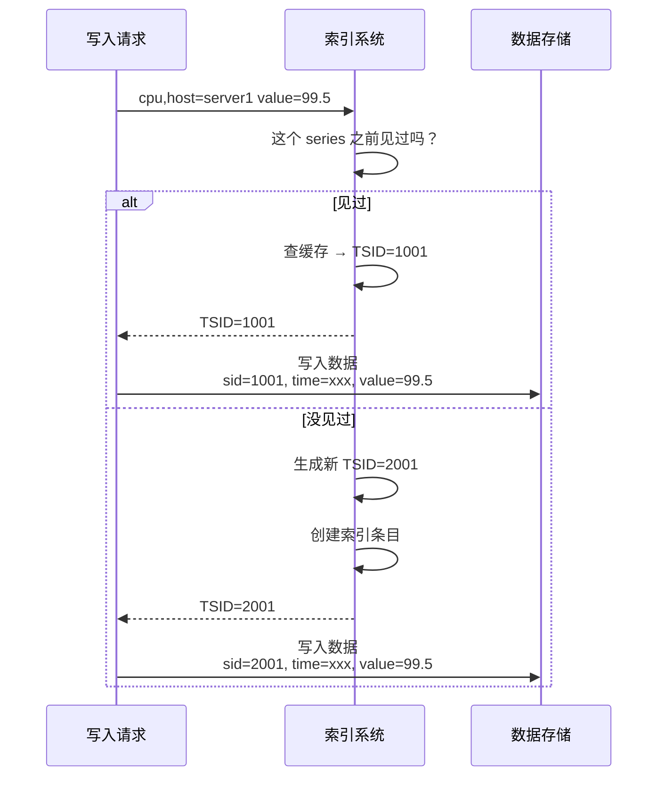
```mermaid
sequenceDiagram
    participant Write as 写入请求
    participant Index as 索引系统
    participant Data as 数据存储

    Write->>Index: cpu,host=server1 value=99.5
    Index->>Index: 这个 series 之前见过吗？

    alt 见过
        Index->>Index: 查缓存 → TSID=1001
        Index-->>Write: TSID=1001
        Write->>Data: 写入数据<br/>sid=1001, time=xxx, value=99.5
    else 没见过
        Index->>Index: 生成新 TSID=2001
        Index->>Index: 创建索引条目
        Index-->>Write: TSID=2001
        Write->>Data: 写入数据<br/>sid=2001, time=xxx, value=99.5
    end
```

**通俗解释**：
- 索引系统的职责：**给每个 series 分配一个唯一编号（TSID）**
- series = measurement + 所有 tag 的组合，比如 `cpu,host=server1,region=us`
- 写入时：查这个 series 有没有见过，没见过就创建新编号
- 查询时：根据条件找到对应的 TSID，再去读数据

### 1.1 IndexBuilder 层次

openGemini 的写入路径先进入 `storage.WriteIndex(indexBuilder, mw)`，再由 `IndexBuilder` 分发到不同索引实现：

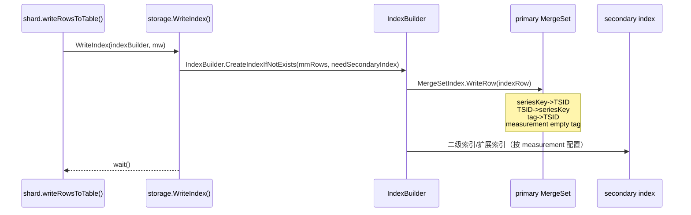
```mermaid
sequenceDiagram
    participant Shard as shard.writeRowsToTable()
    participant Storage as storage.WriteIndex()
    participant IB as IndexBuilder
    participant Primary as primary MergeSet
    participant Secondary as secondary index

    Shard->>Storage: WriteIndex(indexBuilder, mw)
    Storage->>IB: IndexBuilder.CreateIndexIfNotExists(mmRows, needSecondaryIndex)
    IB->>Primary: MergeSetIndex.WriteRow(indexRow)
    Note over Primary: seriesKey->TSID<br/>TSID->seriesKey<br/>tag->TSID<br/>measurement empty tag
    IB->>Secondary: 二级索引/扩展索引（按 measurement 配置）
    Storage-->>Shard: wait()
```

**代码讲解**：`IndexBuilder` 是写入路径的索引编排层，不直接保存所有条目。当前普通写入主入口是 `IndexBuilder.CreateIndexIfNotExists(mmRows, needSecondaryIndex)`：它为新 series 分配/填充 TSID，封装成 `indexRow` 后投递给 `MergeSetIndex.WriteRow` 队列。`MergeSetIndex.CreateIndexIfNotExists(mmRows)` 是底层直接批量接口，不应画成 `tsstoreImpl.writeIndex` 的主链路。primary index 使用 `MergeSetIndex` 维护 series 与 tag 条目；secondary index 由 measurement 的索引配置决定，用于列存或专用查询加速。普通 tsstore 中 `WriteIndex` 同步调用 `IndexBuilder`，columnstore 写列路径将索引写入放到 goroutine 中执行。

**具体例子**：

```text
写入: cpu,host=server1,region=us value=99.5

IndexBuilder:
  1. 调 primary MergeSet: 确认/生成 TSID=1001
  2. 写 primary 条目:
     - seriesKey -> TSID
     - TSID -> seriesKey
     - host=server1 -> TSID
     - region=us -> TSID
     - cpu 的空 tag 条目 -> TSID
  3. 如果 measurement 配置了二级索引，再写 secondary index
```

**核心代码链路**：`engine/index/tsi/index_builder.go` 的 `IndexBuilder.CreateIndexIfNotExists(mmRows, needSecondaryIndex)` 是写入主入口；`engine/index/tsi/mergeset_index.go` 的 `MergeSetIndex.WriteRow(row)` 是 primary index 的队列写入口。

```go
func (iBuilder *IndexBuilder) CreateIndexIfNotExists(mmRows *dictpool.Dict, needSecondaryIndex bool) error {
    // 伪代码：真实函数还包含锁、UUID、index row 组装和二级索引分支。
    for mmIdx := range mmRows.D {
        rows := mmRows.D[mmIdx].Value.(*[]influx.Row)
        for rowIdx := range *rows {
            if (*rows)[rowIdx].SeriesId != 0 {
                continue
            }
            row := buildIndexRow(mmRows.D[mmIdx].Key, &(*rows)[rowIdx])
            iBuilder.primaryIndex.WriteRow(row)
            // needSecondaryIndex 为 true 时，再按 measurement 索引配置写 secondary index。
        }
    }
    return nil
}
```

**逐行解释**：

| 行 | 代码 | 作用 |
|---|------|------|
| 1 | `kbPool.Get()` | 从缓冲池获取 byte buffer，避免频繁内存分配 |
| 2 | `buildIndexRow(...)` | 为新 series 生成/填充 TSID 并组装 primary index 写入项 |
| 3 | `(*rows)[rowIdx].SeriesId != 0` | 已有 TSID，跳过（已索引） |
| 4 | `primaryIndex.WriteRow(row)` | 投递到 `MergeSetIndex` 的并行写队列 |
| 5 | `mmRows.D[mmIdx].Value.(*[]influx.Row)` | 从 dictpool 获取 measurement 对应的行数据（基于实际代码修正） |

---

## 2. MergeSetIndex 核心结构

### 2.1 MergeSetIndex 结构体

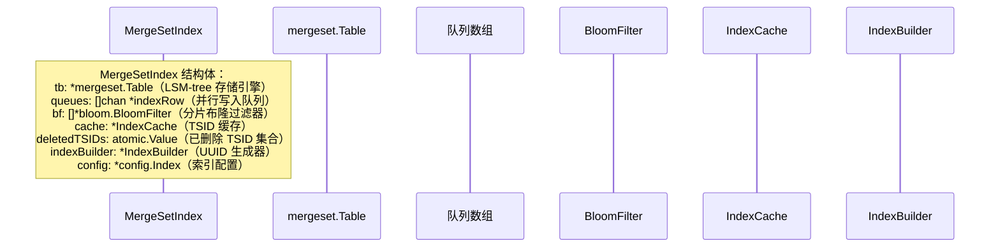
```mermaid
sequenceDiagram
    participant MSI as MergeSetIndex
    participant TB as mergeset.Table
    participant Q as 队列数组
    participant BF as BloomFilter
    participant Cache as IndexCache
    participant Builder as IndexBuilder

    Note over MSI: MergeSetIndex 结构体：<br/>tb: *mergeset.Table（LSM-tree 存储引擎）<br/>queues: []chan *indexRow（并行写入队列）<br/>bf: []*bloom.BloomFilter（分片布隆过滤器）<br/>cache: *IndexCache（TSID 缓存）<br/>deletedTSIDs: atomic.Value（已删除 TSID 集合）<br/>indexBuilder: *IndexBuilder（UUID 生成器）<br/>config: *config.Index（索引配置）
```

**核心代码** `engine/index/tsi/mergeset_index.go:265-289`：

```go
type MergeSetIndex struct {
	tb               *mergeset.Table       // LSM-tree 存储引擎，存储所有索引条目
	logger           *logger.Logger
	path             string
	lock             *string
	queues           []chan *indexRow       // 并行写入队列，数量 = 2 × CPU 核数
	labelStoreQueues []chan *TagCol

	bf    []*bloom.BloomFilter             // 分片布隆过滤器，与 queues 一一对应
	cache *IndexCache                      // SeriesKey → TSID 缓存

	deletedTSIDs       atomic.Value        // 已删除的 TSID 集合（标记删除）
	deletedTSIDsLock   sync.Mutex
	deleteMergeSetLock sync.Mutex
	deleteMergeSet     *MergeSetIndex

	mu     sync.RWMutex
	isOpen bool

	indexBuilder *IndexBuilder             // 负责生成 TSID（64-bit UUID）
	StorageIndex StorageIndex

	config *config.Index
}
```

**逐行解释**：
- `tb *mergeset.Table`：底层 LSM-tree 存储引擎，所有索引条目都存在这里
- `queues []chan *indexRow`：并行写入队列，每个队列一个 goroutine 消费，避免全局锁竞争
- `bf []*bloom.BloomFilter`：分片布隆过滤器，用于快速判断 series 是否存在（避免不必要的磁盘查找）
- `cache *IndexCache`：内存缓存，SeriesKey → TSID 的映射，命中率 ~95%
- `deletedTSIDs atomic.Value`：标记删除的 TSID 集合，查询时过滤掉已删除的 series
- `indexBuilder *IndexBuilder`：负责生成 64-bit UUID 作为 TSID

**通俗解释**：
MergeSetIndex 就像一个"超级通讯录"。想象你有一个巨大的电话簿，里面记录了每个人的名字（seriesKey）和电话号码（TSID）。这个通讯录有三个特点：
1. **多窗口服务**（queues）：有多个窗口同时办理业务，避免排队等候
2. **快速预查**（BloomFilter）：在查电话簿之前，先问一下"这个人存不存在"，如果不存在就不用翻电话簿了
3. **记忆缓存**（cache）：最近查过的人，直接记住，下次不用再翻电话簿

**具体例子**：

假设 4 核 CPU，写入 4 个 series：
```
MergeSetIndex 配置：
  queues: 8 个 channel（2 × 4 核）
  bf: 8 个 BloomFilter（与 queues 一一对应）
  cache: HashMap，容量 10000

写入 cpu,host=server1 (seriesKey="cpu,host=server1"):
  1. Hash("cpu,host=server1") & 7 = 3 → 放入 queue[3]
  2. goroutine 3 消费 queue[3]
  3. 查 cache → 未命中
  4. 查 bf[3] → 不存在
  5. GenerateUUID → TSID=1001
  6. 创建索引条目 → 写入 MergeSet Table
  7. 写入 cache: "cpu,host=server1" → 1001
  8. 写入 bf[3]: Add("cpu,host=server1")
```

### 2.2 MergeSet Table 结构

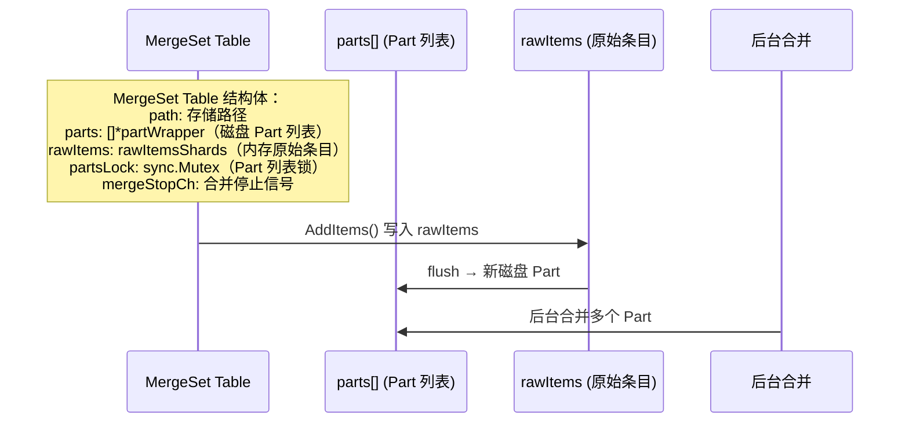
```mermaid
sequenceDiagram
    participant TB as MergeSet Table
    participant Parts as parts[] (Part 列表)
    participant Raw as rawItems (原始条目)
    participant Merge as 后台合并

    Note over TB: MergeSet Table 结构体：<br/>path: 存储路径<br/>parts: []*partWrapper（磁盘 Part 列表）<br/>rawItems: rawItemsShards（内存原始条目）<br/>partsLock: sync.Mutex（Part 列表锁）<br/>mergeStopCh: 合并停止信号

    TB->>Raw: AddItems() 写入 rawItems
    Raw->>Parts: flush → 新磁盘 Part
    Merge->>Parts: 后台合并多个 Part
```

**核心代码** `lib/util/lifted/vm/mergeset/table.go:125-175`：

```go
type Table struct {
	activeMerges   uint64    // 正在合并的数量（原子计数器）
	mergesCount    uint64    // 合并总次数
	itemsMerged    uint64    // 已合并条目数
	assistedMerges uint64    // 辅助合并次数

	mergeIdx uint64          // 合并索引

	path string              // 存储路径

	flushCallback         func()                    // flush 回调
	flushBfCallback       func()                    // bloom filter flush 回调
	flushCallbackWorkerWG sync.WaitGroup
	needFlushCallbackCall uint32

	prepareBlock PrepareBlockCallback

	partsLock sync.Mutex
	parts     []*partWrapper    // 磁盘 Part 列表

	rawItems rawItemsShards     // 内存中的原始条目（未转换为 Part）

	snapshotLock sync.RWMutex

	stopCh chan struct{}
	mergeStopCh chan struct{}
	flushStopCh chan struct{}

	partMergersWG syncwg.WaitGroup
	rawItemsFlusherWG sync.WaitGroup
	convertersWG sync.WaitGroup
	rawItemsPendingFlushesWG syncwg.WaitGroup

	lock *string
	pathLock sync.Mutex
}
```

**逐行解释**：
- `parts []*partWrapper`：磁盘上的 Part 列表，每个 Part 是一个有序的索引文件集合
- `rawItems rawItemsShards`：内存中的原始条目，写入先进这里，满了再 flush 到磁盘 Part
- `partsLock`：保护 parts 列表的互斥锁（合并时需要修改列表）
- 原子计数器放在结构体最前面：保证 64 位对齐（32 位架构的要求）

**通俗解释**：
MergeSet Table 就像一个"活页笔记本"。写入数据时，先写在便签纸上（rawItems），等便签纸攒够了，再整理到笔记本的正式页面上（Part）。笔记本有多个页面（parts），后台会定期把相似的页面合并整理，让查找更快。

**具体例子**：

```
MergeSet Table 生命周期：

写入阶段：
  AddItems([条目1, 条目2, 条目3]) → 存入 rawItems（内存）
  AddItems([条目4, 条目5])       → 存入 rawItems（内存）

Flush 阶段（rawItems 满了）：
  rawItems → flush → 新建 Part-1（磁盘）
  Part-1 包含: index.bin + items.bin + lens.bin + metadata.bin

继续写入：
  AddItems([条目6, 条目7]) → 存入 rawItems（内存）
  rawItems → flush → 新建 Part-2（磁盘）

后台合并：
  Part-1 + Part-2 → 合并 → Part-3（更大的 Part）
  → 减少 Part 数量，提高查找效率
```

### 2.3 Part 结构

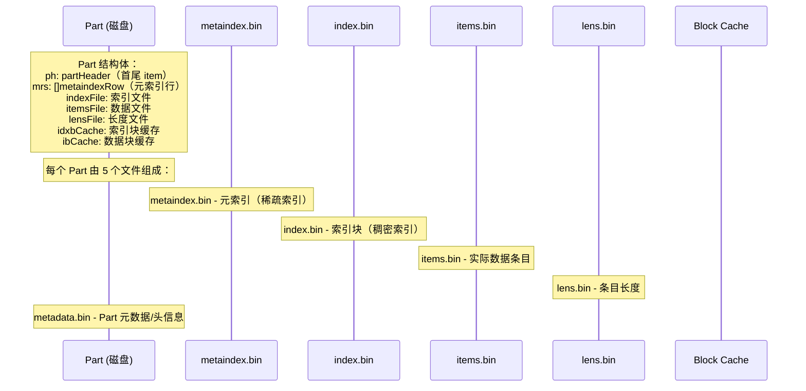
```mermaid
sequenceDiagram
    participant Part as Part (磁盘)
    participant Meta as metaindex.bin
    participant Index as index.bin
    participant Items as items.bin
    participant Lens as lens.bin
    participant Cache as Block Cache

    Note over Part: Part 结构体：<br/>ph: partHeader（首尾 item）<br/>mrs: []metaindexRow（元索引行）<br/>indexFile: 索引文件<br/>itemsFile: 数据文件<br/>lensFile: 长度文件<br/>idxbCache: 索引块缓存<br/>ibCache: 数据块缓存

    Note over Part: 每个 Part 由 5 个文件组成：
    Note over Meta: metaindex.bin - 元索引（稀疏索引）
    Note over Index: index.bin - 索引块（稠密索引）
    Note over Items: items.bin - 实际数据条目
    Note over Lens: lens.bin - 条目长度
    Note over Part: metadata.bin - Part 元数据/头信息
```

**核心代码** `lib/util/lifted/vm/mergeset/part.go:65-80`：

```go
type part struct {
	ph partHeader          // Part 头信息（首尾 item）

	path string            // 存储路径

	size uint64            // Part 大小

	mrs []metaindexRow     // 元索引行（稀疏索引，指向 index blocks）

	indexFile fs.MustReadAtCloser  // index.bin - 索引块文件
	itemsFile fs.MustReadAtCloser  // items.bin - 数据条目文件
	lensFile  fs.MustReadAtCloser  // lens.bin - 条目长度文件
	metadataFile fs.MustReadAtCloser // metadata.bin - Part 元数据文件

	idxbCache *indexBlockCache     // 索引块缓存
	ibCache   *inmemoryBlockCache  // 数据块缓存
}
```

**逐行解释**：
- `mrs []metaindexRow`：元索引行，是稀疏索引，每个 metaindexRow 指向一组 index block
- `indexFile`：存储索引块（稠密索引），每个 block 内部有序
- `itemsFile`：存储实际的索引条目数据
- `lensFile`：存储每个条目的长度，用于定位条目边界
- `metadataFile`：存储 Part 头信息和辅助元数据，打开 Part 时用于校验和恢复结构
- `idxbCache`/`ibCache`：内存缓存，避免重复读取磁盘

**通俗解释**：
Part 就像一本"字典"。想象你要查一个单词：
1. **metaindex**（元索引）：像字典的"目录"，告诉你"A 开头的在第几页，B 开头的在第几页"
2. **index**（索引）：像字典每页的"页眉"，告诉你这一页有哪些单词
3. **items**（数据）：像字典的正文，存储实际的解释内容
4. **lens**（长度）：像书签，告诉你每个条目有多长，方便快速定位

这样查找时，先看目录（metaindex），再看页眉（index），最后找到具体条目（items），比从头翻到尾快多了！

**具体例子**：

查找 seriesKey = "cpu,host=server1" 的 TSID：
```
Step 1: 查 metaindex（元索引）
  metaindex.bin 中有 3 行：
    metaindexRow[0]: minItem="cpu,host=server0" → 指向 indexBlock 0
    metaindexRow[1]: minItem="cpu,host=server5" → 指向 indexBlock 1
    metaindexRow[2]: minItem="mem,host=server0" → 指向 indexBlock 2

  二分查找："cpu,host=server1" > "cpu,host=server0" 且 < "cpu,host=server5"
  → 定位到 indexBlock 0

Step 2: 查 index（索引块）
  indexBlock 0 中有 4 个条目：
    "cpu,host=server0" → item offset 0
    "cpu,host=server1" → item offset 100  ← 命中！
    "cpu,host=server2" → item offset 200
    "cpu,host=server3" → item offset 300

  → 找到 item offset = 100

Step 3: 查 items（数据条目）
  items.bin 中 offset 100 处：
    Key: [0x00] + "cpu,host=server1" + [0x02]
    Value: 1001

  → 返回 TSID = 1001
```

### 2.4 索引结构全景图 — 用具体数据理解

> 看完结构体定义，我们用一个具体例子来理解索引系统是如何组织数据的。假设我们有 3 个 series：
> - `cpu,host=server1,region=us` (TSID=1001)
> - `cpu,host=server2,region=us` (TSID=1002)
> - `mem,host=server1` (TSID=1003)

**通俗解释 — 图书馆的索引卡**：

想象图书馆有几类索引卡，帮你从不同角度找到一本书。对一个含 N 个 tag 的 series，MergeSet 实际写入 `3 + N` 条 primary 条目：
1. **正向查找卡**（[0x00]前缀）：书名 → 书架号。"《CPU日记》→ 书架1001"。写入时用：给定 seriesKey，快速拿到 TSID。
2. **反向查找卡**（[0x01]前缀）：书架号 → 书名。"书架1001 → 《CPU日记》"。查询时用：拿到 TSID 后，还原出完整的 seriesKey 用于结果展示。
3. **标签查找卡**（[0x02]前缀）：标签 → 书架号。"作者=张三 → 书架1001, 1002"。条件查询用：`WHERE host='server1'` 时，通过标签找到所有匹配的 TSID。
4. **分类查找卡**（[0x02]前缀，无标签）：类别 → 书架号。"CPU类 → 书架1001, 1002"。无条件查询用：`SELECT * FROM cpu` 时，找到该 measurement 下所有 TSID。

所有卡片按字节序排列在同一张大表（MergeSet Table）中，查找时用二分法定位。

**核心代码** `engine/index/tsi/mergeset_index.go:841-888` — `decode` 函数创建 primary MergeSet 条目：

```go
func (idx *MergeSetIndex) decode(ii *mergeindex.IndexItems, seriesKey []byte,
    name []byte, tags []influx.Tag, tagArray [][]influx.Tag, enableTagArray bool) uint64 {
    tsid := idx.indexBuilder.GenerateUUID()  // 生成唯一 TSID

    // 条目类型 1: SeriesKey → TSID（正向查找）
    ii.B = append(ii.B, nsPrefixKeyToTSID)   // 前缀 [0x00]
    ii.B = append(ii.B, seriesKey...)         // SeriesKey 字节
    ii.B = append(ii.B, kvSeparatorChar)      // 分隔符
    ii.B = encoding.MarshalUint64(ii.B, tsid) // TSID (8字节)
    ii.Next()                                 // 完成一条索引条目

    // 条目类型 2: TSID → SeriesKey（反向查找）
    ii.B = append(ii.B, nsPrefixTSIDToKey)    // 前缀 [0x01]
    ii.B = encoding.MarshalUint64(ii.B, tsid) // TSID (8字节)
    ii.B = append(ii.B, seriesKey...)         // SeriesKey 字节
    ii.Next()

    // 条目类型 3: Tag → TSID（条件查询，每个 tag 一条）
    for i := range tags {
        ii.B = idx.marshalTagToTSIDs(compositeKey.B, ii.B, name, tags[i], tsid)
        ii.Next()
    }

    // 条目类型 4: Measurement → TSID（无 tag 条件查询）
    compositeKey.B = marshalCompositeTagKey(compositeKey.B[:0], name, nil)
    ii.B = append(ii.B, nsPrefixTagToTSIDs)   // 前缀 [0x02]
    ii.B = marshalTagValue(ii.B, compositeKey.B) // measurement 名
    ii.B = marshalTagValue(ii.B, nil)          // 空 tag（表示无条件）
    ii.B = encoding.MarshalUint64(ii.B, tsid)  // TSID
    ii.Next()
}
```

**条目数量规则**：

```text
seriesKey -> TSID       1 条
TSID -> seriesKey       1 条
每个 tag -> TSID        tag 数量 N 条
measurement 空 tag      1 条

总条数 = 3 + tag 数
例如 cpu,host=s1,region=us:
  3 + 2 = 5 条
```

**逐行解释**：

| 行 | 代码 | 作用 |
|---|------|------|
| 1 | `GenerateUUID()` | 生成 64-bit TSID，高24位=逻辑时钟，低40位=序列号 |
| 2 | `nsPrefixKeyToTSID` | 写入前缀 [0x00]，标记这是"正向查找"条目 |
| 3 | `seriesKey...` | 写入完整的 seriesKey（如 "cpu,host=server1"） |
| 4 | `kvSeparatorChar` | 写入分隔符 [0x02]，区分 key 和 value |
| 5 | `MarshalUint64(ii.B, tsid)` | 写入 TSID 的 8 字节二进制表示 |
| 6 | `ii.Next()` | 完成当前条目，准备写入下一条 |
| 7 | `nsPrefixTSIDToKey` | 写入前缀 [0x01]，标记这是"反向查找"条目 |
| 8 | `marshalTagToTSIDs()` | 构造 [0x02]+measurement+tagKey+tagValue+TSID 的复合键 |
| 9 | `marshalCompositeTagKey` | 构造 measurement 级别的复合键（无 tag） |
| 10 | `marshalTagValue(ii.B, nil)` | 写入空 tag value，表示这是 measurement 级索引 |

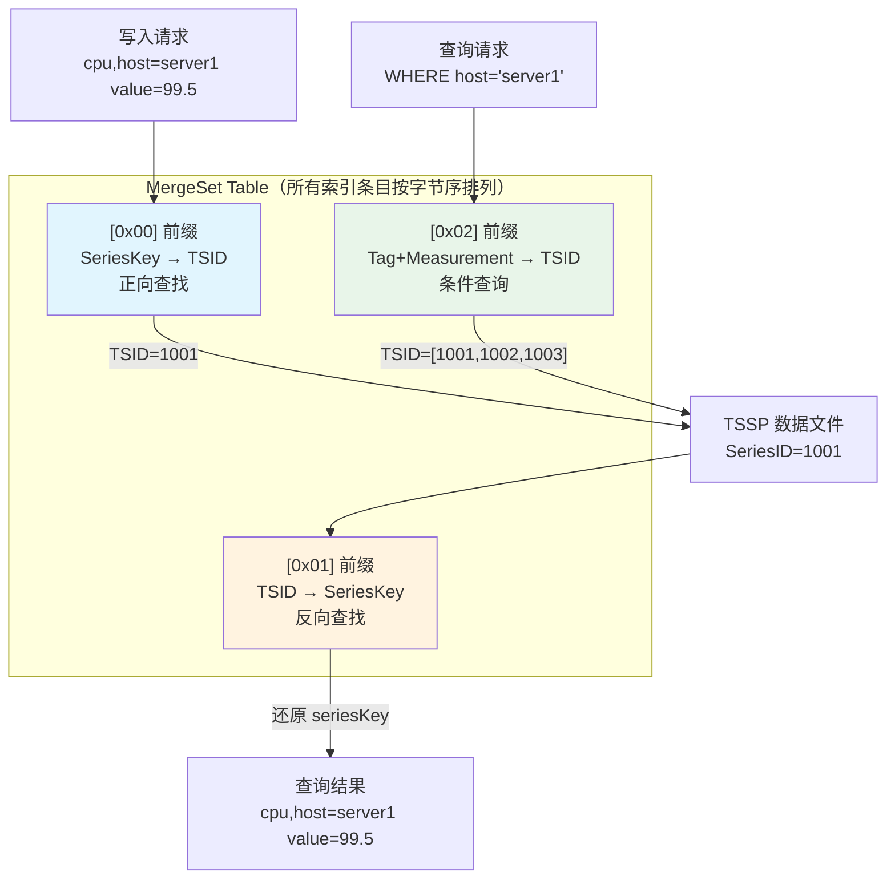
```mermaid
flowchart TB
    subgraph MergeSetTable["MergeSet Table（所有索引条目按字节序排列）"]
        direction TB
        A["[0x00] 前缀<br/>SeriesKey → TSID<br/>正向查找"]
        B["[0x01] 前缀<br/>TSID → SeriesKey<br/>反向查找"]
        C["[0x02] 前缀<br/>Tag+Measurement → TSID<br/>条件查询"]
    end

    Write["写入请求<br/>cpu,host=server1 value=99.5"] --> A
    A -->|"TSID=1001"| Data["TSSP 数据文件<br/>SeriesID=1001"]

    Query["查询请求<br/>WHERE host='server1'"] --> C
    C -->|"TSID=[1001,1002,1003]"| Data

    Data --> B
    B -->|"还原 seriesKey"| Result["查询结果<br/>cpu,host=server1 value=99.5"]

    style A fill:#e1f5fe
    style B fill:#fff3e0
    style C fill:#e8f5e9
```

**索引条目的完整视图**：

```
MergeSet Table 中存储的索引条目（按 Key 排序）：

┌─────────────────────────────────────────────────────────────────────────────────┐
│ 条目类型 1: SeriesKey → TSID（正向查找）                                          │
│ 用途：写入时检查 series 是否已存在                                                │
├─────────────────────────────────────────────────────────────────────────────────┤
│ Key: [0x00] + "cpu,host=server1,region=us" + [0x02]                             │
│ Value: 1001                                                                     │
│                                                                                 │
│ Key: [0x00] + "cpu,host=server2,region=us" + [0x02]                             │
│ Value: 1002                                                                     │
│                                                                                 │
│ Key: [0x00] + "mem,host=server1" + [0x02]                                       │
│ Value: 1003                                                                     │
└─────────────────────────────────────────────────────────────────────────────────┘

┌─────────────────────────────────────────────────────────────────────────────────┐
│ 条目类型 2: TSID → SeriesKey（反向查找）                                          │
│ 用途：查询时根据 TSID 还原 seriesKey（需要读取数据后拼接完整结果）                  │
├─────────────────────────────────────────────────────────────────────────────────┤
│ Key: [0x01] + 1001                                                              │
│ Value: "cpu,host=server1,region=us"                                             │
│                                                                                 │
│ Key: [0x01] + 1002                                                              │
│ Value: "cpu,host=server2,region=us"                                             │
│                                                                                 │
│ Key: [0x01] + 1003                                                              │
│ Value: "mem,host=server1"                                                       │
└─────────────────────────────────────────────────────────────────────────────────┘

┌─────────────────────────────────────────────────────────────────────────────────┐
│ 条目类型 3: Tag → TSID（条件查询）                                               │
│ 用途：WHERE host='server1' 这类条件查询                                          │
├─────────────────────────────────────────────────────────────────────────────────┤
│ Tag 索引: host=server1                                                          │
│ Key: [0x02] + "cpu" + [0x01] + "host" + [0x01] + "server1"                     │
│ Value: 1001                                                                     │
│                                                                                 │
│ Key: [0x02] + "cpu" + [0x01] + "host" + [0x01] + "server1"                     │
│ Value: 1002  ← 同一个 tag 组合可能对应多个 TSID！                                │
│                                                                                 │
│ Tag 索引: host=server2                                                          │
│ Key: [0x02] + "cpu" + [0x01] + "host" + [0x01] + "server2"                     │
│ Value: 1002                                                                     │
│                                                                                 │
│ Tag 索引: region=us                                                             │
│ Key: [0x02] + "cpu" + [0x01] + "region" + [0x01] + "us"                        │
│ Value: 1001                                                                     │
│                                                                                 │
│ Key: [0x02] + "cpu" + [0x01] + "region" + [0x01] + "us"                        │
│ Value: 1002                                                                     │
│                                                                                 │
│ Tag 索引: host=server1 (mem)                                                    │
│ Key: [0x02] + "mem" + [0x01] + "host" + [0x01] + "server1"                     │
│ Value: 1003                                                                     │
└─────────────────────────────────────────────────────────────────────────────────┘

┌─────────────────────────────────────────────────────────────────────────────────┐
│ 条目类型 4: Measurement → TSID（measurement 级索引）                              │
│ 用途：无 tag 条件的查询（如 SELECT * FROM cpu）                                   │
├─────────────────────────────────────────────────────────────────────────────────┤
│ Key: [0x02] + "cpu" + [0xFE] + [0x00]                                          │
│ Value: 1001                                                                     │
│                                                                                 │
│ Key: [0x02] + "cpu" + [0xFE] + [0x00]                                          │
│ Value: 1002                                                                     │
│                                                                                 │
│ Key: [0x02] + "mem" + [0xFE] + [0x00]                                          │
│ Value: 1003                                                                     │
└─────────────────────────────────────────────────────────────────────────────────┘
```

**索引条目的排序规则**：

```
所有条目按 Key 的字节序排列（前缀 [0x00] < [0x01] < [0x02]）：

[0x00] 条目（正向查找）排在最前面
[0x01] 条目（反向查找）排在中间
[0x02] 条目（Tag/Measurement 索引）排在最后

在 [0x02] 条目内部，按 compositeKey 排序：
  "cpu" + "host" + "server1"  ← 先按 measurement，再按 tag key，最后按 tag value
  "cpu" + "host" + "server2"
  "cpu" + "region" + "us"
  "mem" + "host" + "server1"

这种排序方式使得：
  1. 前缀查找（Seek）可以快速定位到第一个匹配的条目
  2. 相同 tag 组合的 TSID 连续存储，便于批量读取
  3. 范围查询（如 host =~ /^server/）可以高效遍历
```

**索引与数据的关联**：

```
写入请求：cpu,host=server1,region=us value=99.5 1234567890

Step 1: 构造 IndexKey
  IndexKey = [总长][name长]["cpu"][tag数][host长]["host"][server1长]["server1"]...
  → 38 字节的二进制编码

Step 2: 三级查找 TSID
  Cache → BloomFilter → 磁盘
  → 找到 TSID = 1001

Step 3: 写入数据文件
  TSSP 文件中存储：
    SeriesID = 1001
    Time = 1234567890
    Value = 99.5

Step 4: 查询时通过索引找到 TSID，再通过 TSID 读取数据
  WHERE host='server1' → TSID=[1001, 1002, 1003]
  AND region='us'      → TSID=[1001, 1002]
  交集                 → TSID=[1001, 1002]
  读取 TSSP 文件中 series 1001 和 1002 的数据
```

---

## 3. 索引写入全流程

### 3.1 写入时序图

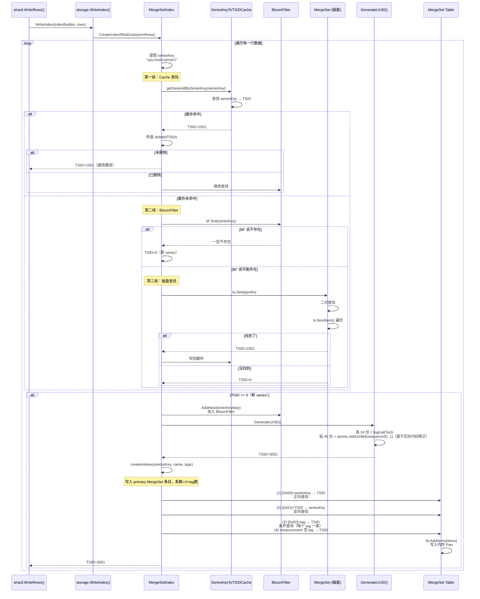
```mermaid
sequenceDiagram
    participant Shard as shard.WriteRows()
    participant Storage as storage.WriteIndex()
    participant MSI as MergeSetIndex
    participant Cache as SeriesKeyToTSIDCache
    participant BF as BloomFilter
    participant Disk as MergeSet (磁盘)
    participant UUID as GenerateUUID()
    participant Table as MergeSet Table

    Shard->>Storage: WriteIndex(indexBuilder, rows)
    Storage->>MSI: CreateIndexIfNotExists(mmRows)

    loop 遍历每一行数据
        MSI->>MSI: 提取 seriesKey<br/>"cpu,host=server1"

        Note over MSI: 第一级：Cache 查找
        MSI->>Cache: getSeriesIdBySeriesKey(seriesKey)
        Cache->>Cache: 查找 seriesKey → TSID

        alt 缓存命中
            Cache-->>MSI: TSID=1001
            MSI->>MSI: 检查 deletedTSIDs
            alt 未删除
                MSI-->>Shard: TSID=1001（最快路径）
            else 已删除
                MSI->>BF: 继续查找
            end
        else 缓存未命中
            Note over MSI: 第二级：BloomFilter
            MSI->>BF: bf.Test(seriesKey)
            alt BF 说不存在
                BF-->>MSI: 一定不存在
                MSI->>MSI: TSID=0（新 series）
            else BF 说可能存在
                Note over MSI: 第三级：磁盘查找
                MSI->>Disk: ts.Seek(prefix)
                Disk->>Disk: 二分查找
                Disk->>Disk: ts.NextItem() 遍历
                alt 找到了
                    Disk-->>MSI: TSID=1001
                    MSI->>Cache: 写回缓存
                else 没找到
                    Disk-->>MSI: TSID=0
                end
            end
        end

        alt TSID == 0（新 series）
            MSI->>BF: AddNewSeriesKey(key)<br/>加入 BloomFilter
            MSI->>UUID: GenerateUUID()
            UUID->>UUID: 高 24 位 = logicalClock<br/>低 40 位 = atomic.AddUint64(sequenceID, 1)（基于实际代码修正）
            UUID-->>MSI: TSID=3001

            MSI->>MSI: createIndexes(seriesKey, name, tags)

            Note over MSI: 写入 primary MergeSet 条目，条数=3+tag数
            MSI->>Table: (1) [0x00]+seriesKey → TSID<br/>正向查找
            MSI->>Table: (2) [0x01]+TSID → seriesKey<br/>反向查找
            MSI->>Table: (3) [0x02]+tag → TSID<br/>条件查询（每个 tag 一条）<br/>(4) measurement 空 tag → TSID

            Table->>Table: tb.AddItems(items)<br/>写入内存 Part
            MSI-->>Shard: TSID=3001
        end
    end
```

**通俗解释 — 快递分拣流程**：

写入一个 series 就像快递员送包裹到仓库：
1. **先查库存**（Cache）：这个包裹以前存过吗？存过就直接拿编号。
2. **查布告栏**（BloomFilter）：库存没找到，看看布告栏上有没有记录。布告栏说"肯定没有"就是新包裹。
3. **翻档案柜**（磁盘）：布告栏说"可能有"，就去翻档案柜确认。
4. **新包裹贴标签**（GenerateUUID）：确认是新包裹，生成新编号，写入 `3 + tag 数` 条 primary MergeSet 索引卡。

**核心代码** `engine/index/tsi/mergeset_index.go:681-711`：

```go
func (idx *MergeSetIndex) CreateIndexIfNotExists(mmRows *dictpool.Dict) error {
    vkey := kbPool.Get()
    defer kbPool.Put(vkey)
    vname := kbPool.Get()
    defer kbPool.Put(vname)

    var err error
    idx.mu.Lock()
    defer idx.mu.Unlock()

    for mmIdx := range mmRows.D {
        rows, ok := mmRows.D[mmIdx].Value.(*[]influx.Row)
        if !ok {
            return fmt.Errorf("create index failed due to rows are not belong to type row")
        }

        vname.B = append(vname.B[:0], []byte(mmRows.D[mmIdx].Key)...)
        for rowIdx := range *rows {
            if (*rows)[rowIdx].SeriesId != 0 {
                continue
            }

            vkey.B = append(vkey.B[:0], (*rows)[rowIdx].IndexKey...)
            (*rows)[rowIdx].SeriesId, err = idx.createIndexesIfNotExists(vkey.B, vname.B, (*rows)[rowIdx].Tags)
            if err != nil {
                return err
            }
        }
    }
    return nil
}
```

**逐行解释**：

| 行 | 代码 | 作用 |
|---|------|------|
| 1 | `kbPool.Get()` | 从对象池获取 vkey/vname 缓冲，避免频繁分配内存 |
| 2 | `idx.mu.Lock()` | 加锁，保证并发安全（CreateIndexIfNotExists 是批量操作） |
| 3 | `mmRows.D[mmIdx].Value.(*[]influx.Row)` | 从 dictpool 中提取每个 measurement 的行数据 |
| 4 | `vname.B = append(vname.B[:0], ...)` | 复用缓冲区写入 measurement 名 |
| 5 | `(*rows)[rowIdx].SeriesId != 0` | 跳过已有 SeriesId 的行（已索引过） |
| 6 | `vkey.B = append(vkey.B[:0], (*rows)[rowIdx].IndexKey...)` | 复用缓冲区写入 IndexKey |
| 7 | `createIndexesIfNotExists(vkey.B, vname.B, tags)` | 委托给内部函数：三级查找 + 创建索引 |

### 3.2 并行写入队列 — WriteRow

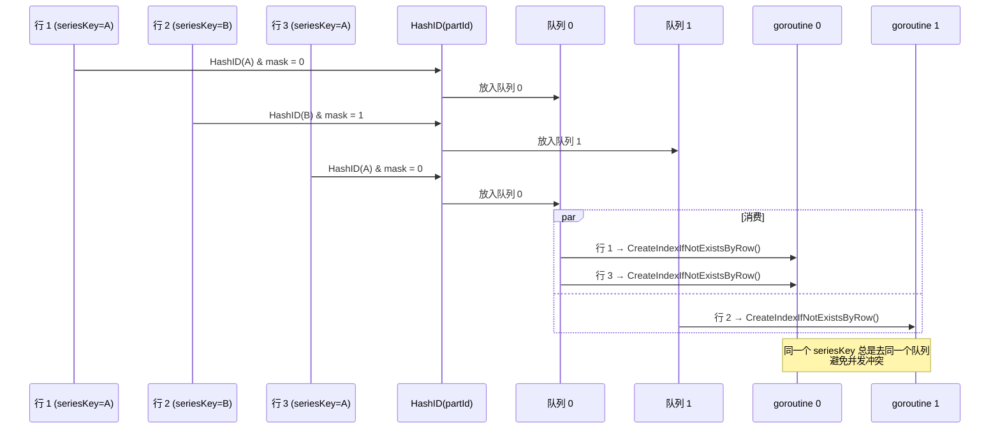
```mermaid
sequenceDiagram
    participant Row1 as 行 1 (seriesKey=A)
    participant Row2 as 行 2 (seriesKey=B)
    participant Row3 as 行 3 (seriesKey=A)
    participant Hash as HashID(partId)
    participant Q0 as 队列 0
    participant Q1 as 队列 1
    participant G0 as goroutine 0
    participant G1 as goroutine 1

    Row1->>Hash: HashID(A) & mask = 0
    Hash->>Q0: 放入队列 0

    Row2->>Hash: HashID(B) & mask = 1
    Hash->>Q1: 放入队列 1

    Row3->>Hash: HashID(A) & mask = 0
    Hash->>Q0: 放入队列 0

    par 消费
        Q0->>G0: 行 1 → CreateIndexIfNotExistsByRow()
        Q0->>G0: 行 3 → CreateIndexIfNotExistsByRow()
    and
        Q1->>G1: 行 2 → CreateIndexIfNotExistsByRow()
    end

    Note over G0,G1: 同一个 seriesKey 总是去同一个队列<br/>避免并发冲突
```

**核心代码** `engine/index/tsi/mergeset_index.go:439-442`：

```go
func (idx *MergeSetIndex) WriteRow(row *indexRow) {
	partId := meta.HashID(row.Row.IndexKey) & queueSizeMask  // 取 hash 低 N 位决定队列
	idx.queues[partId] <- row                                  // 投递到对应队列
}
```

**逐行解释**：
- `meta.HashID(row.Row.IndexKey)`：对 IndexKey（seriesKey 的字节）计算 hash 值
- `& queueSizeMask`：取低 N 位（N = 队列数量的 log2），决定去哪个队列
- `idx.queues[partId] <- row`：投递到 channel，由对应的 goroutine 消费
- **关键设计**：同一个 seriesKey 总是 hash 到同一个队列，避免多个 goroutine 同时处理同一个 series 的并发冲突

**通俗解释**：
想象一个银行有多个窗口办理业务。每个客户（seriesKey）根据自己的身份证号（hash 值）被分配到固定的窗口。这样：
- **同一个人**总是去同一个窗口，避免两个窗口同时处理同一个人的业务（并发冲突）
- **不同的人**可以去不同窗口，实现并行处理（提高吞吐量）
- 窗口数量 = 2 × CPU 核数，充分利用多核性能

### 3.3 CreateIndexIfNotExists — 批量索引创建

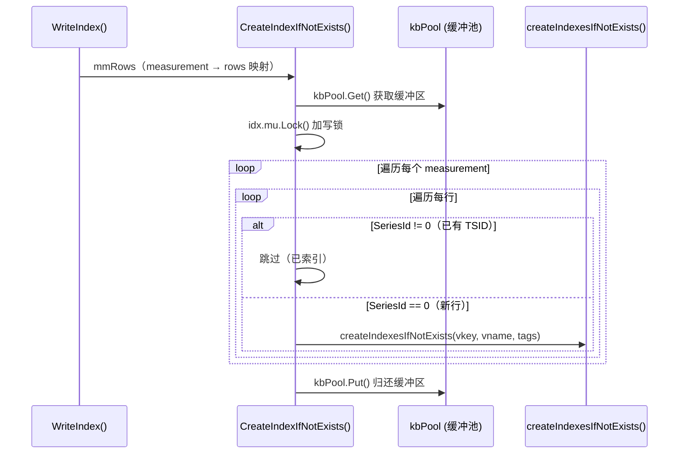
```mermaid
sequenceDiagram
    participant Caller as WriteIndex()
    participant CIF as CreateIndexIfNotExists()
    participant Pool as kbPool (缓冲池)
    participant CI as createIndexesIfNotExists()

    Caller->>CIF: mmRows（measurement → rows 映射）
    CIF->>Pool: kbPool.Get() 获取缓冲区
    CIF->>CIF: idx.mu.Lock() 加写锁

    loop 遍历每个 measurement
        loop 遍历每行
            alt SeriesId != 0（已有 TSID）
                CIF->>CIF: 跳过（已索引）
            else SeriesId == 0（新行）
                CIF->>CI: createIndexesIfNotExists(vkey, vname, tags)
            end
        end
    end

    CIF->>Pool: kbPool.Put() 归还缓冲区
```

**核心代码** `engine/index/tsi/mergeset_index.go:681-711`：

```go
func (idx *MergeSetIndex) CreateIndexIfNotExists(mmRows *dictpool.Dict) error {
	vkey := kbPool.Get()                    // 获取缓冲区，避免频繁分配
	defer kbPool.Put(vkey)
	vname := kbPool.Get()
	defer kbPool.Put(vname)

	var err error
	idx.mu.Lock()                           // 加写锁（保护 BloomFilter 和 Table）
	defer idx.mu.Unlock()

	for mmIdx := range mmRows.D {           // 遍历每个 measurement
		rows, ok := mmRows.D[mmIdx].Value.(*[]influx.Row)
		if !ok {
			return fmt.Errorf("create index failed due to rows are not belong to type row")
		}

		vname.B = append(vname.B[:0], []byte(mmRows.D[mmIdx].Key)...)  // measurement 名称
		for rowIdx := range *rows {
			if (*rows)[rowIdx].SeriesId != 0 {
				continue                     // 已有 TSID，跳过
			}

			vkey.B = append(vkey.B[:0], (*rows)[rowIdx].IndexKey...)  // seriesKey
			(*rows)[rowIdx].SeriesId, err = idx.createIndexesIfNotExists(vkey.B, vname.B, (*rows)[rowIdx].Tags)
			if err != nil {
				return err
			}
		}
	}
	return nil
}
```

**逐行解释**：
- `kbPool.Get()`：从缓冲池获取 byte buffer，避免频繁内存分配（sync.Pool）
- `idx.mu.Lock()`：加写锁，因为 BloomFilter 和 Table 的写入不是并发安全的
- `if (*rows)[rowIdx].SeriesId != 0`：如果已有 TSID，说明这个 series 已经索引过，跳过
- `createIndexesIfNotExists(vkey.B, vname.B, ...)`：核心逻辑——查找或创建索引

**通俗解释**：
这个函数就像"批量办理入住"。酒店前台（CreateIndexIfNotExists）收到一批客人（rows）的入住申请：
1. **检查身份证**（SeriesId != 0）：如果客人已经登记过，跳过
2. **查通讯录**（createIndexesIfNotExists）：如果客人是新来的，查一下他之前有没有住过
3. **分配房间号**（TSID）：如果没住过，给他分配一个新的房间号
4. **登记入住**（创建索引条目）：把客人的信息写入登记簿

**具体例子**：

```
输入：mmRows = {
  "cpu": [
    Row{IndexKey: "cpu,host=server1", SeriesId: 0, Tags: [{host,server1}]},
    Row{IndexKey: "cpu,host=server2", SeriesId: 1001, Tags: [{host,server2}]}  ← 已有 TSID
  ],
  "mem": [
    Row{IndexKey: "mem,host=server1", SeriesId: 0, Tags: [{host,server1}]}
  ]
}

处理过程：
  measurement="cpu":
    row[0]: SeriesId=0 → createIndexesIfNotExists()
      → 三级查找 → 未找到 → GenerateUUID → TSID=2001
      → 创建 5 条索引条目（3 + 2 个 tag）
    row[1]: SeriesId=1001 → 跳过（已索引）

  measurement="mem":
    row[0]: SeriesId=0 → createIndexesIfNotExists()
      → 三级查找 → 未找到 → GenerateUUID → TSID=2002
      → 创建 4 条索引条目（3 + 1 个 tag）

输出：rows 的 SeriesId 被填充
  cpu/host=server1 → SeriesId=2001
  cpu/host=server2 → SeriesId=1001（不变）
  mem/host=server1 → SeriesId=2002
```

### 3.4 createIndexesIfNotExists — 查找或创建

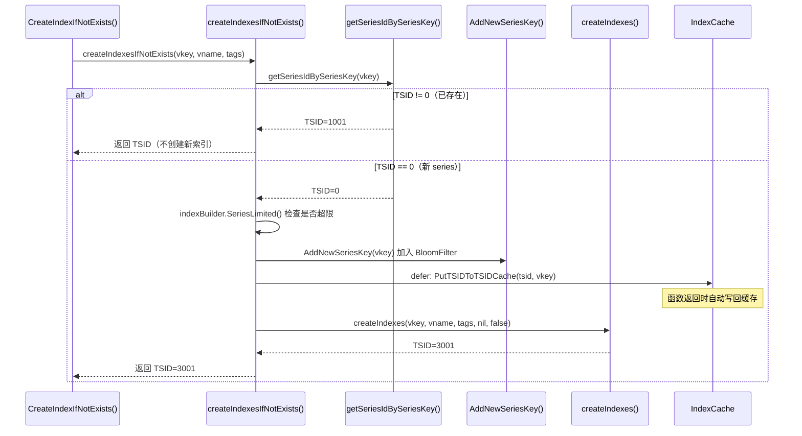
```mermaid
sequenceDiagram
    participant Caller as CreateIndexIfNotExists()
    participant CI as createIndexesIfNotExists()
    participant Lookup as getSeriesIdBySeriesKey()
    participant BF as AddNewSeriesKey()
    participant CreateIdx as createIndexes()
    participant Cache as IndexCache

    Caller->>CI: createIndexesIfNotExists(vkey, vname, tags)

    CI->>Lookup: getSeriesIdBySeriesKey(vkey)
    alt TSID != 0（已存在）
        Lookup-->>CI: TSID=1001
        CI-->>Caller: 返回 TSID（不创建新索引）
    else TSID == 0（新 series）
        Lookup-->>CI: TSID=0

        CI->>CI: indexBuilder.SeriesLimited() 检查是否超限
        CI->>BF: AddNewSeriesKey(vkey) 加入 BloomFilter

        CI->>Cache: defer: PutTSIDToTSIDCache(tsid, vkey)
        Note over Cache: 函数返回时自动写回缓存

        CI->>CreateIdx: createIndexes(vkey, vname, tags, nil, false)
        CreateIdx-->>CI: TSID=3001
        CI-->>Caller: 返回 TSID=3001
    end
```

**核心代码** `engine/index/tsi/mergeset_index.go:755-781`：

```go
func (idx *MergeSetIndex) createIndexesIfNotExists(vkey, vname []byte, tags []influx.Tag) (uint64, error) {
	tsid, err := idx.getSeriesIdBySeriesKey(vkey)  // 三级查找：Cache → BF → Disk
	if err != nil {
		return 0, err
	}

	if tsid != 0 {
		return tsid, nil                           // 已存在，直接返回
	}

	if err = idx.indexBuilder.SeriesLimited(); err != nil {
		return 0, err                              // series 数量超限，拒绝创建
	}

	idx.AddNewSeriesKey(vkey)                      // 加入 BloomFilter（下次就能快速判断"可能存在"）

	defer func(id *uint64) {                       // defer：函数返回时自动写回缓存
		if *id != 0 {
			if err = idx.cache.PutTSIDToTSIDCache(id, vkey); err != nil {
				idx.logger.Error("failed to put tsid to tsid cache", zap.Error(err))
			}
		}
	}(&tsid)

	tsid, err = idx.createIndexes(vkey, vname, tags, nil, false)  // 创建索引条目
	return tsid, err
}
```

**逐行解释**：
- `getSeriesIdBySeriesKey(vkey)`：三级查找（Cache → BloomFilter → 磁盘），详见 3.6 节
- `tsid != 0`：找到了，说明这个 series 已经存在，直接返回 TSID
- `SeriesLimited()`：检查 series 数量是否超过配置上限，防止无限增长
- `AddNewSeriesKey(vkey)`：把新 key 加入 BloomFilter，下次查找时 BloomFilter 就知道"可能存在"
- `defer func(id *uint64)`：用 defer 确保 TSID 创建成功后自动写回缓存
- `createIndexes(vkey, vname, tags)`：实际创建索引条目（见 3.5 节）

**通俗解释**：
这个函数就像"查找或创建新用户"。想象一个会员系统：
1. **查会员卡**（getSeriesIdBySeriesKey）：先看看这个人是不是已经是会员
   - 先查记忆（缓存）→ 再查黑名单（BloomFilter）→ 最后查档案室（磁盘）
2. **如果是会员**（tsid != 0）：直接返回会员号，不用再登记
3. **如果是新用户**：
   - 检查会员数量上限（SeriesLimited）
   - 在黑名单上记一笔（AddNewSeriesKey），下次查得更快
   - 创建新的会员档案（createIndexes）
   - 把会员号记到记忆里（defer 写回缓存）

### 3.5 createIndexes + decode — 生成索引条目

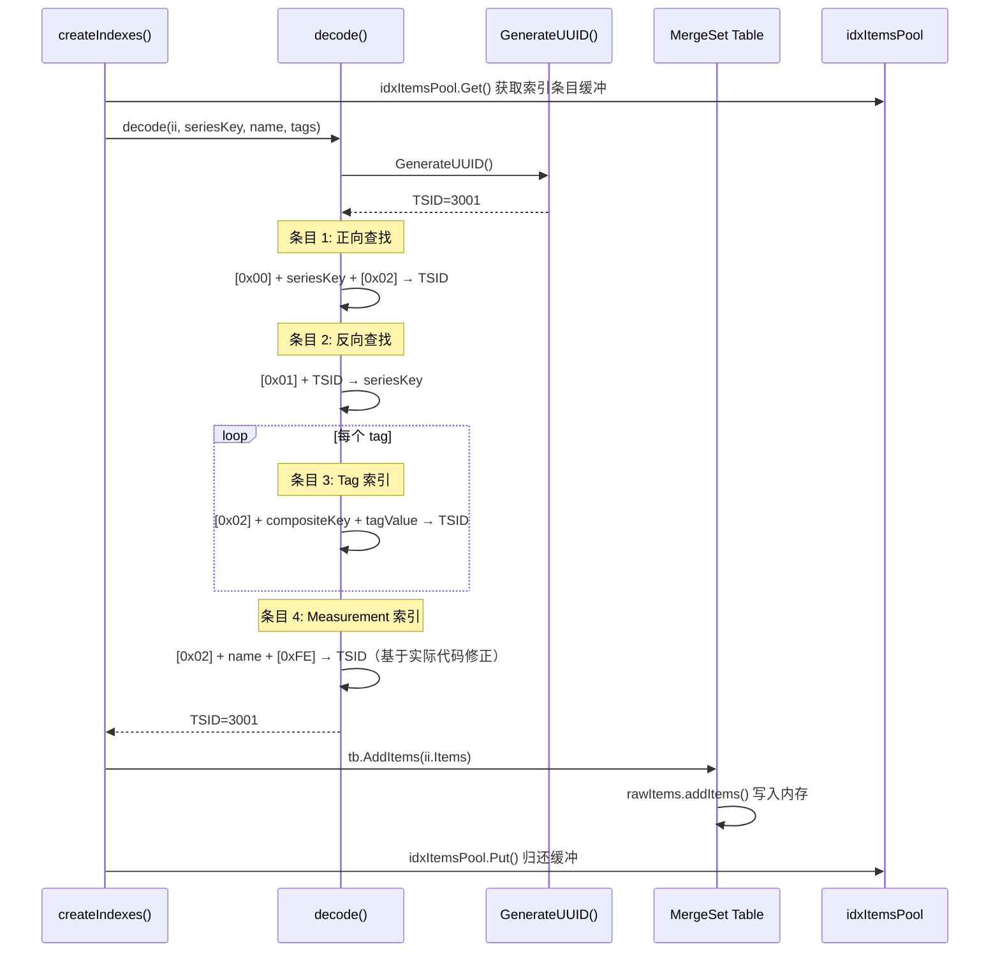
```mermaid
sequenceDiagram
    participant CI as createIndexes()
    participant Decode as decode()
    participant UUID as GenerateUUID()
    participant TB as MergeSet Table
    participant Pool as idxItemsPool

    CI->>Pool: idxItemsPool.Get() 获取索引条目缓冲
    CI->>Decode: decode(ii, seriesKey, name, tags)

    Decode->>UUID: GenerateUUID()
    UUID-->>Decode: TSID=3001

    Note over Decode: 条目 1: 正向查找
    Decode->>Decode: [0x00] + seriesKey + [0x02] → TSID

    Note over Decode: 条目 2: 反向查找
    Decode->>Decode: [0x01] + TSID → seriesKey

    loop 每个 tag
        Note over Decode: 条目 3: Tag 索引
        Decode->>Decode: [0x02] + compositeKey + tagValue → TSID
    end

    Note over Decode: 条目 4: Measurement 索引
    Decode->>Decode: [0x02] + name + [0xFE] → TSID（基于实际代码修正）

    Decode-->>CI: TSID=3001

    CI->>TB: tb.AddItems(ii.Items)
    TB->>TB: rawItems.addItems() 写入内存
    CI->>Pool: idxItemsPool.Put() 归还缓冲
```

**核心代码** `engine/index/tsi/mergeset_index.go:829-839`：

```go
func (idx *MergeSetIndex) createIndexes(seriesKey []byte, name []byte, tags []influx.Tag, tagArray [][]influx.Tag, enableTagArray bool) (uint64, error) {
	ii := idxItemsPool.Get()                 // 从对象池获取 IndexItems 缓冲
	defer idxItemsPool.Put(ii)               // 用完归还

	tsid := idx.decode(ii, seriesKey, name, tags, tagArray, enableTagArray)  // 生成索引条目
	if err := idx.tb.AddItems(ii.Items); err != nil {                       // 写入 Table
		return 0, err
	}

	return tsid, nil
}
```

**核心代码** `engine/index/tsi/mergeset_index.go:841-893`（decode 方法）：

```go
func (idx *MergeSetIndex) decode(ii *mergeindex.IndexItems, seriesKey []byte, name []byte, tags []influx.Tag, tagArray [][]influx.Tag, enableTagArray bool) uint64 {
	tsid := idx.indexBuilder.GenerateUUID()  // 生成 64-bit TSID

	// ===== 条目 1: SeriesKey → TSID（正向查找）=====
	ii.B = append(ii.B, nsPrefixKeyToTSID)   // 前缀 [0x00]
	ii.B = append(ii.B, seriesKey...)        // seriesKey
	ii.B = append(ii.B, kvSeparatorChar)     // 分隔符 [0x02]
	ii.B = encoding.MarshalUint64(ii.B, tsid) // TSID（8 字节）
	ii.Next()                                 // 提交一个条目

	// ===== 条目 2: TSID → SeriesKey（反向查找）=====
	ii.B = append(ii.B, nsPrefixTSIDToKey)   // 前缀 [0x01]
	ii.B = encoding.MarshalUint64(ii.B, tsid) // TSID
	ii.B = append(ii.B, seriesKey...)        // seriesKey
	ii.Next()

	// ===== 条目 3: Tag → TSID（条件查询）=====
	compositeKey := kbPool.Get()
	if enableTagArray {
		// TagArray 去重后生成索引
		tagMap := make(map[string]map[string]struct{})
		for _, tags := range tagArray {
			for i := range tags {
				if len(tags[i].Value) == 0 { continue }
				if _, ok := tagMap[tags[i].Key]; !ok {
					tagMap[tags[i].Key] = make(map[string]struct{})
				}
				if _, ok := tagMap[tags[i].Key][tags[i].Value]; ok {
					continue                   // 去重
				} else {
					tagMap[tags[i].Key][tags[i].Value] = struct{}{}
				}
				ii.B = idx.marshalTagToTSIDs(compositeKey.B, ii.B, name, tags[i], tsid)
				ii.Next()
			}
		}
	} else {
		for i := range tags {
			ii.B = idx.marshalTagToTSIDs(compositeKey.B, ii.B, name, tags[i], tsid)
			ii.Next()
		}
	}

	// ===== 条目 4: Measurement → TSID（measurement 级索引）=====
	compositeKey.B = marshalCompositeTagKey(compositeKey.B[:0], name, nil)
	ii.B = append(ii.B, nsPrefixTagToTSIDs)
	ii.B = marshalTagValue(ii.B, compositeKey.B)
	ii.B = marshalTagValue(ii.B, nil)        // tagValue = nil（measurement 级）
	ii.B = encoding.MarshalUint64(ii.B, tsid)
	ii.Next()

	kbPool.Put(compositeKey)
	return tsid
}
```

**逐行解释**：
- `GenerateUUID()`：生成 64-bit TSID（高 24 位 = logicalClock，低 40 位 = 递增序列号，通过 atomic.AddUint64 保证原子性）（基于实际代码修正）
- **条目 1**：`[0x00] + seriesKey + [0x02] + TSID`——正向查找，给定 seriesKey 找 TSID
- **条目 2**：`[0x01] + TSID + seriesKey`——反向查找，给定 TSID 找 seriesKey
- **条目 3**：每个 tag 生成一条 `[0x02] + compositeKey + tagValue + TSID`——用于 WHERE host='server1' 这类条件查询
- **条目 4**：`[0x02] + name + [0xFE] + [0x00] + TSID`——measurement 级索引，用于无 tag 条件的查询（基于实际代码修正）
- `tb.AddItems(ii.Items)`：所有条目一次性写入 Table 的 rawItems

**通俗解释**：
这个函数就像"创建新用户的完整档案"。当一个新用户注册时，系统会创建 4 种记录：
1. **正向查找**：名字 → 会员号（比如"张三" → "1001"）
2. **反向查找**：会员号 → 名字（比如"1001" → "张三"）
3. **标签索引**：每个标签一条记录（比如"男性" → "1001"，"北京" → "1001"）
4. **分类索引**：按分类建立索引（比如"VIP会员" → "1001"）

这样无论从哪个角度查（按名字、按会员号、按标签、按分类），都能快速找到对应的用户！

### 3.6 getSeriesIdBySeriesKey — 三级查找

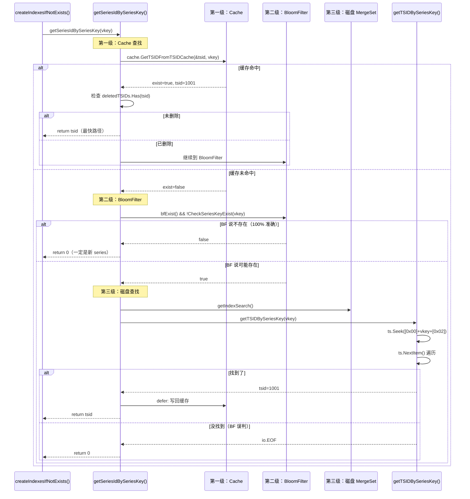
```mermaid
sequenceDiagram
    participant Caller as createIndexesIfNotExists()
    participant GSB as getSeriesIdBySeriesKey()
    participant L1 as 第一级：Cache
    participant L2 as 第二级：BloomFilter
    participant L3 as 第三级：磁盘 MergeSet
    participant Search as getTSIDBySeriesKey()

    Caller->>GSB: getSeriesIdBySeriesKey(vkey)

    Note over GSB: 第一级：Cache 查找
    GSB->>L1: cache.GetTSIDFromTSIDCache(&tsid, vkey)
    alt 缓存命中
        L1-->>GSB: exist=true, tsid=1001
        GSB->>GSB: 检查 deletedTSIDs.Has(tsid)
        alt 未删除
            GSB-->>Caller: return tsid（最快路径）
        else 已删除
            GSB->>L2: 继续到 BloomFilter
        end
    else 缓存未命中
        L1-->>GSB: exist=false

        Note over GSB: 第二级：BloomFilter
        GSB->>L2: bfExist() && !CheckSeriesKeyExist(vkey)
        alt BF 说不存在（100% 准确）
            L2-->>GSB: false
            GSB-->>Caller: return 0（一定是新 series）
        else BF 说可能存在
            L2-->>GSB: true

            Note over GSB: 第三级：磁盘查找
            GSB->>L3: getIndexSearch()
            GSB->>Search: getTSIDBySeriesKey(vkey)
            Search->>Search: ts.Seek([0x00]+vkey+[0x02])
            Search->>Search: ts.NextItem() 遍历
            alt 找到了
                Search-->>GSB: tsid=1001
                GSB->>L1: defer: 写回缓存
                GSB-->>Caller: return tsid
            else 没找到（BF 误判）
                Search-->>GSB: io.EOF
                GSB-->>Caller: return 0
            end
        end
    end
```

**核心代码** `engine/index/tsi/mergeset_index.go:635-679`：

```go
func (idx *MergeSetIndex) getSeriesIdBySeriesKey(seriesKeyWithVersion []byte) (uint64, error) {
	var tsid uint64

	// ===== 第一级：Cache 查找 =====
	hitRatioStat.AddSeriesKeyToTSIDCacheGetTotal(1)
	exist, err := idx.cache.GetTSIDFromTSIDCache(&tsid, seriesKeyWithVersion)
	if err != nil {
		return 0, err
	}
	if exist {
		if delTsidSet := idx.GetDeletedTSIDs(); delTsidSet == nil || !delTsidSet.Has(tsid) {
			return tsid, nil                   // 缓存命中且未删除，直接返回
		}
	}

	// ===== 第二级：BloomFilter =====
	hitRatioStat.AddSeriesKeyToTSIDCacheGetMissTotal(1)
	if idx.bfExist() && !idx.CheckSeriesKeyExist(seriesKeyWithVersion) {
		return 0, nil                          // BF 说不存在，100% 准确，返回 0
	}

	// defer：找到后自动写回缓存
	defer func(id *uint64) {
		if *id != 0 {
			if err = idx.cache.PutTSIDToTSIDCache(id, seriesKeyWithVersion); err != nil {
				idx.logger.Error("failed to put tsid to tsid cache", zap.Error(err))
			}
		} else {
			hitRatioStat.AddSeriesKeyToTSIDCacheGetNewSeriesTotal(1)
		}
	}(&tsid)

	// ===== 第三级：磁盘查找 =====
	is := idx.getIndexSearch()
	defer idx.putIndexSearch(is)

	tsid, err = is.getTSIDBySeriesKey(seriesKeyWithVersion)

	if err == nil {
		if delTsidSet := idx.GetDeletedTSIDs(); delTsidSet == nil || !delTsidSet.Has(tsid) {
			return tsid, nil                   // 找到且未删除
		}
	}

	if err != io.EOF {
		return 0, err
	}
	return 0, nil                              // 没找到（新 series）
}
```

**逐行解释**：
- `cache.GetTSIDFromTSIDCache(&tsid, vkey)`：查内存缓存（HashMap），命中率 ~95%
- `deletedTSIDs.Has(tsid)`：即使缓存命中，也要检查是否已删除（标记删除机制）
- `bfExist() && !CheckSeriesKeyExist(vkey)`：BloomFilter 判断"一定不存在"时，直接返回 0，避免磁盘 IO
- `defer func(id *uint64)`：用 defer 确保找到 TSID 后自动写回缓存（不管哪一级找到的）
- `is.getTSIDBySeriesKey(vkey)`：去 MergeSet 磁盘查找（最慢路径）

**通俗解释**：
三级查找就像"找人"的过程：
1. **第一级：问身边的人**（缓存）——"你认识张三吗？" 如果认识，直接告诉你（最快，~1纳秒）
2. **第二级：查黑名单**（BloomFilter）——"张三在黑名单上吗？" 如果在，肯定找不到（快速排除，~10纳秒）
3. **第三级：去档案室查**（磁盘）——翻箱倒柜找档案（最慢，~100微秒）

关键是：找到后会记在心里（写回缓存），下次再找同一个人就不用去档案室了！

### 3.7 getTSIDBySeriesKey — 磁盘查找实现

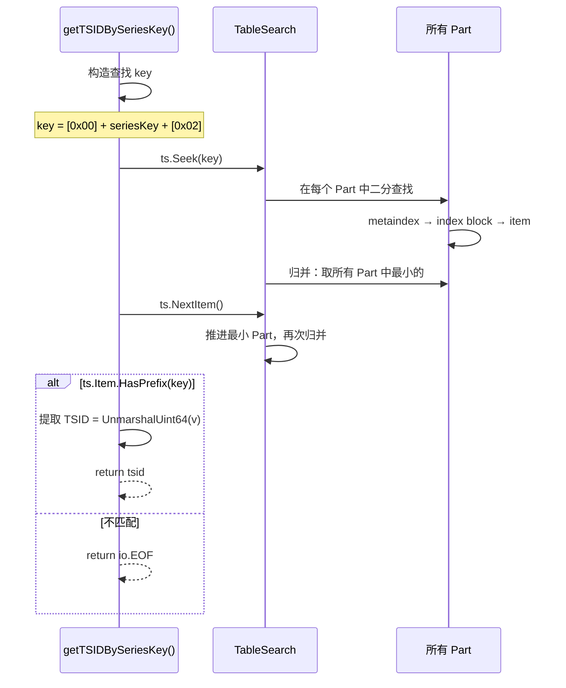
```mermaid
sequenceDiagram
    participant GTSID as getTSIDBySeriesKey()
    participant TS as TableSearch
    participant Parts as 所有 Part

    GTSID->>GTSID: 构造查找 key
    Note over GTSID: key = [0x00] + seriesKey + [0x02]

    GTSID->>TS: ts.Seek(key)
    TS->>Parts: 在每个 Part 中二分查找
    Parts->>Parts: metaindex → index block → item
    TS->>Parts: 归并：取所有 Part 中最小的

    GTSID->>TS: ts.NextItem()
    TS->>TS: 推进最小 Part，再次归并

    alt ts.Item.HasPrefix(key)
        GTSID->>GTSID: 提取 TSID = UnmarshalUint64(v)
        GTSID-->>GTSID: return tsid
    else 不匹配
        GTSID-->>GTSID: return io.EOF
    end
```

**核心代码** `engine/index/tsi/search.go:92-115`：

```go
func (is *indexSearch) getTSIDBySeriesKey(indexkey []byte) (uint64, error) {
	ts := &is.ts                             // TableSearch 游标
	kb := &is.kb

	// 构造查找 key：[0x00] + seriesKey + [0x02]
	kb.B = append(kb.B[:0], nsPrefixKeyToTSID)  // 前缀 [0x00]
	kb.B = append(kb.B, indexkey...)             // seriesKey
	kb.B = append(kb.B, kvSeparatorChar)         // 分隔符 [0x02]

	ts.Seek(kb.B)                                // 在所有 Part 中二分查找

	if ts.NextItem() {                           // 获取下一个条目
		if !bytes.HasPrefix(ts.Item, kb.B) {
			return 0, io.EOF                     // 前缀不匹配，没找到
		}
		v := ts.Item[len(kb.B):]                 // 提取 TSID 部分
		pid := encoding.UnmarshalUint64(v)        // 反序列化为 uint64
		return pid, nil                           // 找到了！
	}

	if err := ts.Error(); err != nil {
		return 0, fmt.Errorf("error when searching TSID by seriesKey; searchPrefix %q: %w", kb.B, err)
	}
	return 0, io.EOF                             // 没找到
}
```

**逐行解释**：
- `kb.B = append(kb.B[:0], nsPrefixKeyToTSID)`：构造查找前缀 `[0x00]`
- `kb.B = append(kb.B, indexkey...)`：拼接 seriesKey
- `kb.B = append(kb.B, kvSeparatorChar)`：拼接分隔符 `[0x02]`（确保精确匹配）
- `ts.Seek(kb.B)`：在所有 Part 中二分查找，定位到第一个 >= key 的条目
- `ts.NextItem()`：获取当前条目
- `bytes.HasPrefix(ts.Item, kb.B)`：检查前缀是否匹配
- `encoding.UnmarshalUint64(v)`：从字节反序列化为 64-bit TSID

**通俗解释**：
磁盘查找就像在字典里查单词：
1. **构造查找词**：把要查的单词拼好（比如 "apple"）
2. **翻到大概位置**（Seek）：字典是按字母排序的，所以直接翻到 "a" 开头的地方
3. **逐个检查**（NextItem）：看看当前词条是不是 "apple"
4. **前缀匹配**（HasPrefix）：如果当前词条以 "apple" 开头，就找到了！
5. **提取结果**（UnmarshalUint64）：把找到的电话号码（TSID）记下来

**具体例子**：

查找 seriesKey = "cpu,host=server1" 的 TSID：
```
Step 1: 构造查找 key
  kb.B = [0x00] + "cpu,host=server1" + [0x02]
  = [0x00, 0x63, 0x70, 0x75, 0x2C, 0x68, 0x6F, 0x73, 0x74, 0x3D, 0x73, 0x65, 0x72, 0x76, 0x65, 0x72, 0x31, 0x02]

Step 2: Seek — 在所有 Part 中二分查找
  Part-1 中：
    metaindex → 定位到 indexBlock
    indexBlock → 定位到 item

Step 3: NextItem() — 获取当前条目
  ts.Item = [0x00] + "cpu,host=server1" + [0x02] + [TSID字节]

Step 4: HasPrefix 检查
  ts.Item 以 kb.B 开头 → 匹配！

Step 5: 提取 TSID
  v = ts.Item[len(kb.B):] = [0x00, 0x00, 0x00, 0x00, 0x00, 0x00, 0x03, 0xE9]
  UnmarshalUint64(v) = 1001

返回 TSID = 1001
```

---

## 4. BloomFilter 分片机制

### 4.1 分片设计

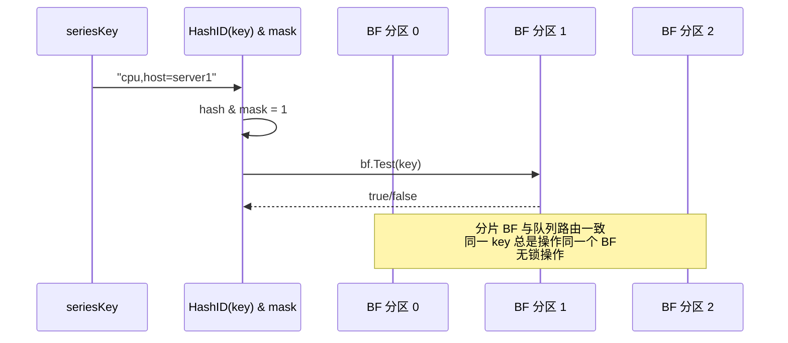
```mermaid
sequenceDiagram
    participant Key as seriesKey
    participant Hash as HashID(key) & mask
    participant BF0 as BF 分区 0
    participant BF1 as BF 分区 1
    participant BF2 as BF 分区 2

    Key->>Hash: "cpu,host=server1"
    Hash->>Hash: hash & mask = 1
    Hash->>BF1: bf.Test(key)
    BF1-->>Hash: true/false

    Note over BF0,BF2: 分片 BF 与队列路由一致<br/>同一 key 总是操作同一个 BF<br/>无锁操作
```

**核心代码** `engine/index/tsi/mergeset_index.go:426-437`：

```go
// CheckSeriesKeyExist 检查 seriesKey 是否在 BloomFilter 中
func (idx *MergeSetIndex) CheckSeriesKeyExist(key []byte) bool {
	partId := meta.HashID(key) & queueSizeMask  // 与队列路由一致
	return idx.bf[partId].Test(key)              // 查询对应分片的 BF
}

// AddNewSeriesKey 将新 seriesKey 加入 BloomFilter
func (idx *MergeSetIndex) AddNewSeriesKey(key []byte) {

**通俗解释**：
BloomFilter 就像一个"黑名单系统"。想象一个小区的门禁：
1. **分片管理**：小区有多个门（BF 分区），每个门有自己的黑名单
2. **快速判断**：保安（BloomFilter）可以快速判断"这个人是不是业主"
   - 如果保安说"不是"：那肯定不是（100% 准确）
   - 如果保安说"可能是"：那可能是，也可能不是（有误判）
3. **无锁操作**：每个门独立管理自己的黑名单，不需要协调

这样写入时，先问保安"这个 series 存不存在"，如果保安说"肯定不存在"，就不用去档案室（磁盘）查了！
	if !idx.bfExist() {
		return
	}
	partId := meta.HashID(key) & queueSizeMask  // 与队列路由一致
	idx.bf[partId].Add(key)                      // 添加到对应分片的 BF
}
```

**逐行解释**：
- `meta.HashID(key) & queueSizeMask`：与 WriteRow 的队列路由使用相同的 hash 和 mask
- `idx.bf[partId].Test(key)`：查询对应分片的 BloomFilter
- `idx.bf[partId].Add(key)`：添加到对应分片的 BloomFilter
- **关键设计**：分片 BF 与队列路由一致，同一个 key 总是操作同一个 BF 分片，无需加锁

### 4.2 BloomFilter Flush

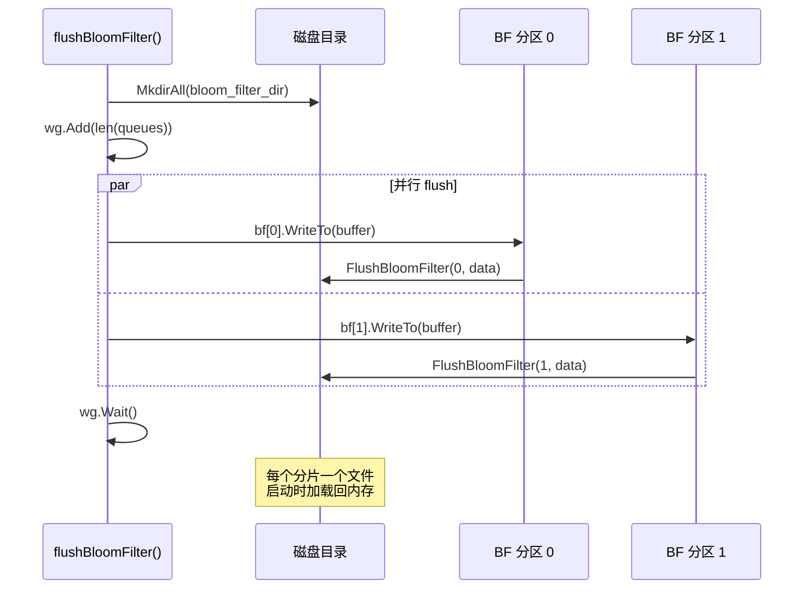
```mermaid
sequenceDiagram
    participant Flush as flushBloomFilter()
    participant Dir as 磁盘目录
    participant BF0 as BF 分区 0
    participant BF1 as BF 分区 1

    Flush->>Dir: MkdirAll(bloom_filter_dir)
    Flush->>Flush: wg.Add(len(queues))

    par 并行 flush
        Flush->>BF0: bf[0].WriteTo(buffer)
        BF0->>Dir: FlushBloomFilter(0, data)
    and
        Flush->>BF1: bf[1].WriteTo(buffer)
        BF1->>Dir: FlushBloomFilter(1, data)
    end

    Flush->>Flush: wg.Wait()
    Note over Dir: 每个分片一个文件<br/>启动时加载回内存
```

**核心代码** `engine/index/tsi/mergeset_index.go:388-420`：

```go
func (idx *MergeSetIndex) flushBloomFilter() {
	if !idx.bfExist() {
		return
	}
	lock := fileops.FileLockOption(*idx.lock)
	dirPath := filepath.Join(idx.path, MergeSetDirName, mergeset.BloomFilterDirName)
	err := fileops.MkdirAll(dirPath, 0750, lock)
	if err != nil {
		idx.logger.Error("mkdir mergeSet bloom filter dir error", zap.Error(err))
		return
	}

	wg := sync.WaitGroup{}
	wg.Add(len(idx.queues))                    // 每个队列对应一个 BF 分片
	for i := range idx.queues {
		go func(i int) {                        // 并行 flush
			buffer := mergeset.GetIndexBuffer()
			defer mergeset.PutIndexBuffer(buffer)
			defer wg.Done()
			b, err := idx.bf[i].WriteTo(buffer)  // 序列化 BF
			if err != nil {
				idx.logger.Error("write mergeSet bloom filter file error", zap.Error(err))
				return
			}

			err = mergeset.FlushBloomFilter(i, b, dirPath, buffer, lock)  // 写入磁盘
			if err != nil {
				idx.logger.Error("flush mergeSet bloom filter file error", zap.Error(err))
			}
		}(i)
	}
	wg.Wait()                                  // 等待所有分片 flush 完成
}
```

**逐行解释**：
- 每个 BF 分片并行 flush 到磁盘（一个分片一个文件）
- 启动时从磁盘加载回内存，恢复 BloomFilter 状态
- 这样进程重启后 BloomFilter 不会丢失

**通俗解释**：
BloomFilter Flush 就像"定期备份黑名单"。小区的保安（BloomFilter）每天都会把最新的黑名单抄写一份，存到档案室（磁盘）。这样即使保安换班了（进程重启），新保安也能从档案室读出黑名单，继续工作。

**具体例子**：

```
场景：4 核 CPU，8 个 BF 分片，写入了 10000 个 series

内存中的 BF 状态：
  bf[0]: 包含 1250 个 seriesKey（hash & 7 = 0 的）
  bf[1]: 包含 1250 个 seriesKey（hash & 7 = 1 的）
  ...
  bf[7]: 包含 1250 个 seriesKey（hash & 7 = 7 的）

Flush 过程：
  1. 创建目录：data/db/0/measurements/cpu/index/bloom_filter/
  2. 并行 flush 8 个分片：
     goroutine 0: bf[0].WriteTo() → 写入 bloom_filter_0.bin
     goroutine 1: bf[1].WriteTo() → 写入 bloom_filter_1.bin
     ...
     goroutine 7: bf[7].WriteTo() → 写入 bloom_filter_7.bin
  3. wg.Wait() — 等待全部完成

磁盘文件：
  bloom_filter/
  ├── bloom_filter_0.bin  (1250 个 key)
  ├── bloom_filter_1.bin  (1250 个 key)
  ├── ...
  └── bloom_filter_7.bin  (1250 个 key)

重启后加载：
  启动时读取 8 个文件 → 恢复 bf[0..7] → 继续工作
```

---

## 5. 索引查询全流程

### 5.1 查询时序图

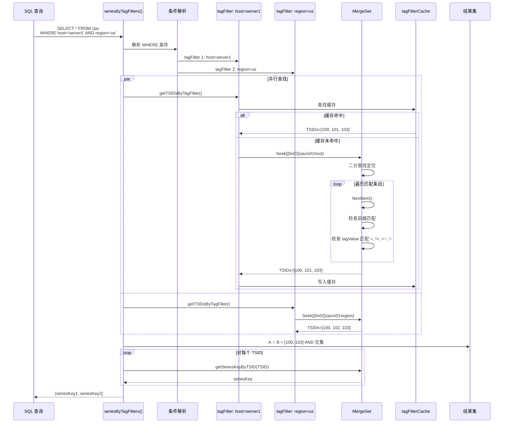
```mermaid
sequenceDiagram
    participant Query as SQL 查询
    participant Search as seriesByTagFilters()
    participant Parser as 条件解析
    participant Filter1 as tagFilter: host=server1
    participant Filter2 as tagFilter: region=us
    participant MS as MergeSet
    participant Cache as tagFilterCache
    participant Result as 结果集

    Query->>Search: SELECT * FROM cpu<br/>WHERE host='server1' AND region='us'

    Search->>Parser: 解析 WHERE 条件
    Parser->>Filter1: tagFilter 1: host=server1
    Parser->>Filter2: tagFilter 2: region=us

    par 并行查找
        Search->>Filter1: getTSIDsByTagFilter()
        Filter1->>Cache: 查找缓存
        alt 缓存命中
            Cache-->>Filter1: TSIDs=[100, 101, 103]
        else 缓存未命中
            Filter1->>MS: Seek([0x02]cpu\x01host)
            MS->>MS: 二分查找定位
            loop 遍历匹配条目
                MS->>MS: NextItem()
                MS->>MS: 检查前缀匹配
                MS->>MS: 检查 tagValue 匹配 =, !=, =~, !~
            end
            MS-->>Filter1: TSIDs=[100, 101, 103]
            Filter1->>Cache: 写入缓存
        end
    and
        Search->>Filter2: getTSIDsByTagFilter()
        Filter2->>MS: Seek([0x02]cpu\x01region)
        MS-->>Filter2: TSIDs=[100, 102, 103]
    end

    Search->>Result: A ∩ B = [100, 103] AND 交集

    loop 对每个 TSID
        Search->>MS: getSeriesKeyByTSID(TSID)
        MS-->>Search: seriesKey
    end

    Search-->>Query: [seriesKey1, seriesKey2]
```

**通俗解释 — 多条件快递查询**：

查询 `WHERE host='server1' AND region='us'` 就像在快递仓库里找同时满足两个条件的包裹：
1. **拆条件**：把 AND 拆成两个独立条件——"标签A=server1"和"标签B=us"
2. **并行查**：两个快递员同时出发，一个查"标签A"的索引卡，一个查"标签B"的索引卡
3. **取交集**：两个快递员各自拿到一堆包裹编号，取交集就是同时满足两个条件的
4. **还原信息**：拿到编号后，去反向索引卡查出完整的包裹信息（seriesKey）

**核心代码** `engine/index/tsi/search.go:441-538`：

```go
func (is *indexSearch) seriesByTagFilters(name []byte) (index.SeriesIDIterator, error) {
    // 快速路径：只有一个 tagFilter，直接查
    if len(is.tfs) == 1 {
        return is.seriesByOneTagFilter(name)
    }

    // 按代价排序：便宜的先查（结果集小的先查，减少交集计算量）
    tfcosts := make([]tagFilterWithCost, len(is.tfs))
    for i := 0; i < len(is.tfs); i++ {
        tfcosts[i].tf = &is.tfs[i]
        tfcosts[i].cost = is.getTagFilterCost(name, &is.tfs[i])
    }
    is.sortTagFilterWithCost(tfcosts)

    // 选起始 filter：结果集最小的作为起点
    var set *uint64set.Set
    for i, tfcost := range tfcosts {
        this, cost, err := is.searchTSIDsWithTagFilter(tfcost.tf)
        tfcost.set = this
        if this.Len() < maxIndexMetrics {
            set = this  // 找到结果集足够小的，作为起点
            break
        }
    }

    // 与剩余 filter 取交集
    for i, tfcost := range tfcosts {
        set.Intersect(tfcost.set)  // AND 交集
        if set.Len() == 0 {
            break  // 交集为空，提前退出
        }
    }
    return index.NewSeriesIDSetIterator(index.NewSeriesIDSetWithSet(set)), nil
}
```

**逐行解释**：

| 行 | 代码 | 作用 |
|---|------|------|
| 1 | `len(is.tfs) == 1` | 只有一个条件时走快速路径，不需要排序和交集 |
| 2 | `getTagFilterCost()` | 估算每个 tagFilter 的代价（历史统计或默认值） |
| 3 | `sortTagFilterWithCost()` | 按代价升序排列，便宜的先查 |
| 4 | `searchTSIDsWithTagFilter()` | 执行单个 tagFilter 的查找（缓存→BF→磁盘） |
| 5 | `this.Len() < maxIndexMetrics` | 结果集小于阈值，适合作为起始集 |
| 6 | `set.Intersect(tfcost.set)` | 两个有序集合取交集，O(n+m) |
| 7 | `set.Len() == 0` | 交集为空，说明没有 series 同时满足所有条件 |

### 5.1.1 查询实战：用具体数据走一遍完整流程

> 假设数据库中有以下 3 个 series（与 2.4 节相同）：
> - `cpu,host=server1,region=us` (TSID=1001)
> - `cpu,host=server2,region=us` (TSID=1002)
> - `mem,host=server1` (TSID=1003)

**查询语句**：`SELECT mean(value) FROM cpu WHERE host='server1' AND region='us' GROUP BY time(1m)`

**Step 1: 解析 WHERE 条件，生成 tagFilter 列表**

```
SQL 解析器将 WHERE 条件拆解为 tagFilter：

tagFilter[0]: name="cpu", key="host", value="server1"
tagFilter[1]: name="cpu", key="region", value="us"

注意：measurement "cpu" 本身也隐含一个条件
  → 只查询 measurement="cpu" 的 series
  → 不会查到 "mem" 的 series
```

**Step 2: 为每个 tagFilter 构造 Seek 前缀**

```
tagFilter[0] (host=server1):
  compositeKey = marshalCompositeTagKey("cpu", "host")
               = [0x00] + len("cpu") + "cpu" + "host"
               = [0x00, 0x03, 0x63, 0x70, 0x75, 0x68, 0x6F, 0x73, 0x74]
                 (前缀)   (3)     (c)    (p)    (u)    (h)    (o)    (s)    (t)

  prefix = [0x02] + marshalTagValue(compositeKey)
         = [0x02] + [长度] + [compositeKey]
         = [0x02, 0x09, 0x00, 0x03, 0x63, 0x70, 0x75, 0x68, 0x6F, 0x73, 0x74]

tagFilter[1] (region=us):
  compositeKey = [0x00, 0x03, 0x63, 0x70, 0x75, 0x72, 0x65, 0x67, 0x69, 0x6F, 0x6E]
  prefix = [0x02, ...]
```

**Step 3: 并行执行 Seek + 遍历**

```
tagFilter[0] (host=server1) 在 MergeSet 中的查找过程：

  Seek(prefix) → 定位到第一个 >= prefix 的条目

  MergeSet 中的 [0x02] 条目（按字节序排列）：
    [0x02]+"cpu"+"host"+"server1" → 1001  ← 匹配！
    [0x02]+"cpu"+"host"+"server1" → 1002  ← 匹配！（同一个 tag 值对应多个 TSID）
    [0x02]+"cpu"+"host"+"server2" → 1002  ← 不匹配（value 不同）
    [0x02]+"cpu"+"region"+"us"    → 1001  ← 前缀不匹配，停止遍历

  结果：TSIDs = [1001, 1002]

tagFilter[1] (region=us) 在 MergeSet 中的查找过程：

  Seek(prefix) → 定位到第一个 >= prefix 的条目

  MergeSet 中的 [0x02] 条目：
    [0x02]+"cpu"+"region"+"us" → 1001  ← 匹配！
    [0x02]+"cpu"+"region"+"us" → 1002  ← 匹配！
    [0x02]+"mem"+"host"+"server1" → 1003  ← 前缀不匹配，停止遍历

  结果：TSIDs = [1001, 1002]
```

**Step 4: AND 交集计算**

```
两个 tagFilter 的结果：
  host='server1'  → TSIDs = [1001, 1002]
  region='us'     → TSIDs = [1001, 1002]

AND 交集（双指针法）：
  i=0, j=0: a[0]=1001 == b[0]=1001 → 加入结果，i++, j++
  i=1, j=1: a[1]=1002 == b[1]=1002 → 加入结果，i++, j++

  最终结果：TSIDs = [1001, 1002]
```

**Step 5: 还原 seriesKey**

```
对每个 TSID，通过反向索引 ([0x01] 前缀) 还原 seriesKey：

  TSID=1001 → 查找 [0x01]+1001 → "cpu,host=server1,region=us"
  TSID=1002 → 查找 [0x01]+1002 → "cpu,host=server2,region=us"
```

**Step 6: 根据 TSID 读取数据**

```
现在知道了需要读取哪些 series 的数据：
  TSID=1001 → TSSP 文件中 series 1001 的所有数据
  TSID=1002 → TSSP 文件中 series 1002 的所有数据

查询执行器会：
  1. 根据时间范围定位到哪些 TSSP 文件（通过 Trailer 中的 MinTime/MaxTime）
  2. 在 TSSP 文件中通过 ChunkMeta 定位到具体 series 的数据位置
  3. 读取数据，执行聚合（mean）
```

**完整流程图**：

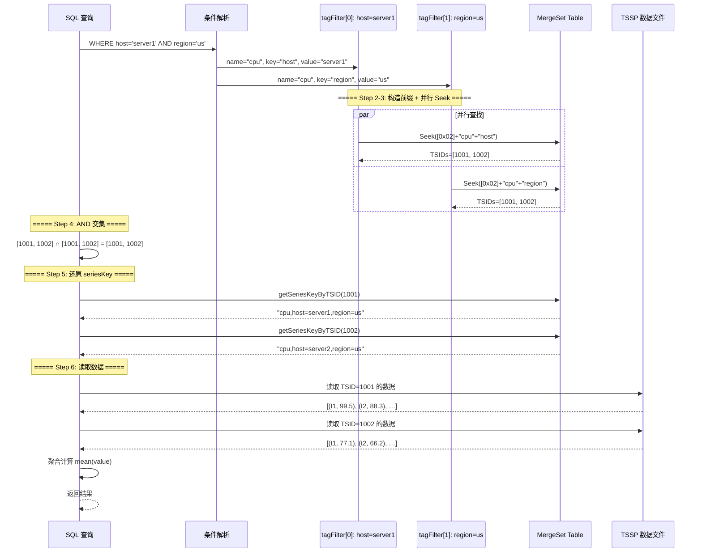
```mermaid
sequenceDiagram
    participant SQL as SQL 查询
    participant Parse as 条件解析
    participant F1 as tagFilter[0]: host=server1
    participant F2 as tagFilter[1]: region=us
    participant MS as MergeSet Table
    participant Data as TSSP 数据文件

    SQL->>Parse: WHERE host='server1' AND region='us'
    Parse->>F1: name="cpu", key="host", value="server1"
    Parse->>F2: name="cpu", key="region", value="us"

    Note over F1,F2: ===== Step 2-3: 构造前缀 + 并行 Seek =====

    par 并行查找
        F1->>MS: Seek([0x02]+"cpu"+"host")
        MS-->>F1: TSIDs=[1001, 1002]
    and
        F2->>MS: Seek([0x02]+"cpu"+"region")
        MS-->>F2: TSIDs=[1001, 1002]
    end

    Note over SQL: ===== Step 4: AND 交集 =====
    SQL->>SQL: [1001, 1002] ∩ [1001, 1002] = [1001, 1002]

    Note over SQL: ===== Step 5: 还原 seriesKey =====
    SQL->>MS: getSeriesKeyByTSID(1001)
    MS-->>SQL: "cpu,host=server1,region=us"
    SQL->>MS: getSeriesKeyByTSID(1002)
    MS-->>SQL: "cpu,host=server2,region=us"

    Note over SQL: ===== Step 6: 读取数据 =====
    SQL->>Data: 读取 TSID=1001 的数据
    Data-->>SQL: [(t1, 99.5), (t2, 88.3), …]
    SQL->>Data: 读取 TSID=1002 的数据
    Data-->>SQL: [(t1, 77.1), (t2, 66.2), …]

    SQL->>SQL: 聚合计算 mean(value)
    SQL-->>SQL: 返回结果
```

**性能分析**：

```
查询：SELECT mean(value) FROM cpu WHERE host='server1' AND region='us'

传统方式（全表扫描）：
  1. 读取 measurement="cpu" 的所有数据（假设 100 万个 series）
  2. 对每个 series 检查 host 和 region 条件
  3. 只有 2 个 series 满足条件
  → 浪费了 99.9998% 的 IO

索引方式（openGemini）：
  1. 查 BloomFilter → 快速排除不存在的 series
  2. 查 MergeSet 索引 → 直接找到满足条件的 TSID
  3. 只读取这 2 个 series 的数据
  → 只需要 2 次数据读取，IO 节省 99.9998%
```

**通俗解释 — 从"大海捞针"到"精准定位"**：

想象你在一个有100万本书的图书馆里找"张三写的关于CPU的书"：
- **传统方式（全表扫描）**：从第一本书开始，一本一本翻看作者和内容，直到找到为止。可能要翻99万本才找到2本。
- **索引方式（openGemini）**：
  1. 先查"作者索引卡"→ 找到张三写的书有 [1001, 1002, 1003]
  2. 再查"主题索引卡"→ 找到关于CPU的书有 [1001, 1002, 1004]
  3. 取交集 → [1001, 1002]，只有2本
  4. 直接去书架拿这2本书

索引把"翻99万本书"变成了"查2张索引卡 + 拿2本书"，效率提升了50万倍！

### 5.2 tagFilter 结构

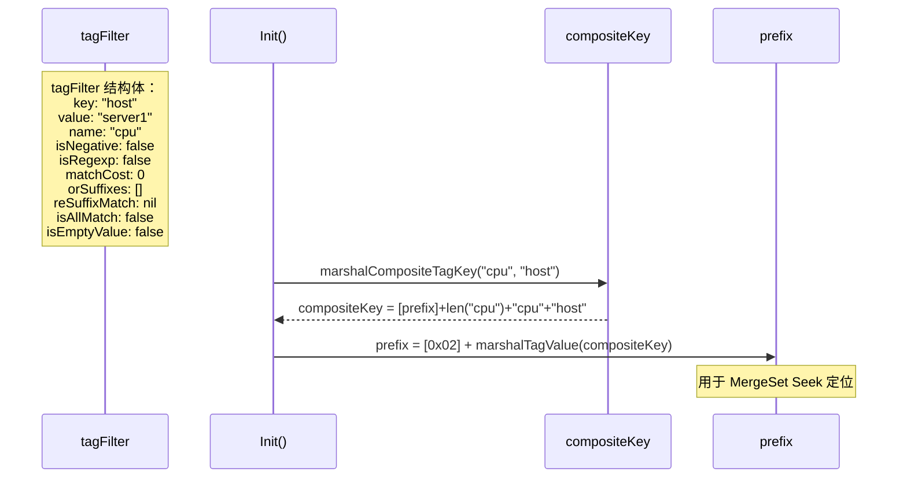
```mermaid
sequenceDiagram
    participant TF as tagFilter
    participant Init as Init()
    participant Key as compositeKey
    participant Prefix as prefix

    Note over TF: tagFilter 结构体：<br/>key: "host"<br/>value: "server1"<br/>name: "cpu"<br/>isNegative: false<br/>isRegexp: false<br/>matchCost: 0<br/>orSuffixes: []<br/>reSuffixMatch: nil<br/>isAllMatch: false<br/>isEmptyValue: false

    Init->>Key: marshalCompositeTagKey("cpu", "host")
    Key-->>Init: compositeKey = [prefix]+len("cpu")+"cpu"+"host"

    Init->>Prefix: prefix = [0x02] + marshalTagValue(compositeKey)
    Note over Prefix: 用于 MergeSet Seek 定位
```

**核心代码** `engine/index/tsi/tag_filters.go:34-71`：

```go
type tagFilter struct {
	key   []byte    // tag key，如 "host"
	value []byte    // tag value，如 "server1"
	name  []byte    // measurement name，如 "cpu"

	prefix []byte   // MergeSet Seek 前缀（用于定位）

	orSuffixes []string           // 正则展开的 OR 值列表（如 "foo|bar" → ["foo", "bar"]）
	reSuffixMatch func(b []byte) bool  // 正则后缀匹配函数
	graphiteReverseSuffix []byte  // Graphite 通配符反向后缀

	matchCost  uint64             // 匹配代价（用于查询优化排序）
	isNegative bool               // 是否取反（!= 或 !~）
	isRegexp   bool               // 是否正则

	isEmptyMatch bool             // 匹配空值
	isAllMatch   bool             // 匹配所有（如 host =~ /.*/）
	isEmptyValue bool             // value 为空

	regexpPrefix string           // 正则前缀
}
```

**核心代码** `engine/index/tsi/tag_filters.go:221-280`（Init 方法）：

```go
func (tf *tagFilter) Init(name, key, value []byte, isNegative, isRegexp bool) error {
	tf.key = append(tf.key[:0], key...)
	tf.value = append(tf.value[:0], value...)
	tf.name = append(tf.name[:0], name...)
	tf.isNegative = isNegative
	tf.isRegexp = isRegexp

	// 构造 Seek 前缀
	compositeKey := kbPool.Get()
	compositeKey.B = marshalCompositeTagKey(compositeKey.B[:0], name, key)  // "cpu" + len + "host"
	tf.prefix = append(tf.prefix, nsPrefixTagToTSIDs)                       // [0x02]
	tf.prefix = marshalTagValue(tf.prefix, compositeKey.B)                  // + compositeKey + 分隔符
	kbPool.Put(compositeKey)

	// 编译正则表达式
	if config.GetStoreConfig().EnablePerlRegrep {
		rcv, err := tf.OpGeminiRegrep()        // Perl 风格正则
		// ...
		tf.orSuffixes = rcv.orValues           // OR 展开值
		tf.reSuffixMatch = rcv.reMatch          // 匹配函数
		tf.matchCost = rcv.reCost               // 匹配代价
	} else {
		rcv, err := tf.InfluxRegrep()           // InfluxDB 风格正则
		// ... 同上
	}

	return nil
}
```

**逐行解释**：
- `marshalCompositeTagKey(name, key)`：构造 compositeKey = `[prefix] + len(name) + name + key`
- `marshalTagValue(prefix, compositeKey)`：编码 compositeKey，转义特殊字符，追加分隔符
- `tf.prefix`：最终的 Seek key = `[0x02] + encoded(compositeKey)`，用于在 MergeSet 中定位
- `OpGeminiRegrep()` / `InfluxRegrep()`：编译正则表达式，提取 OR 展开值和匹配函数
- `matchCost`：匹配代价，用于 seriesByTagFilters 的查询优化排序

**通俗解释**：
tagFilter 就像"查询条件卡片"。当你写 `WHERE host='server1'` 时，系统会制作一张卡片：
- **key**：要查的标签名（"host"）
- **value**：要匹配的值（"server1"）
- **name**：数据表名（"cpu"）
- **prefix**：查找前缀，用于在索引中快速定位

这张卡片就像一个"搜索指令"，告诉索引系统："请在 cpu 表中，找到所有 host=server1 的数据"。

### 5.3 seriesByTagFilters — 基于代价的查询优化

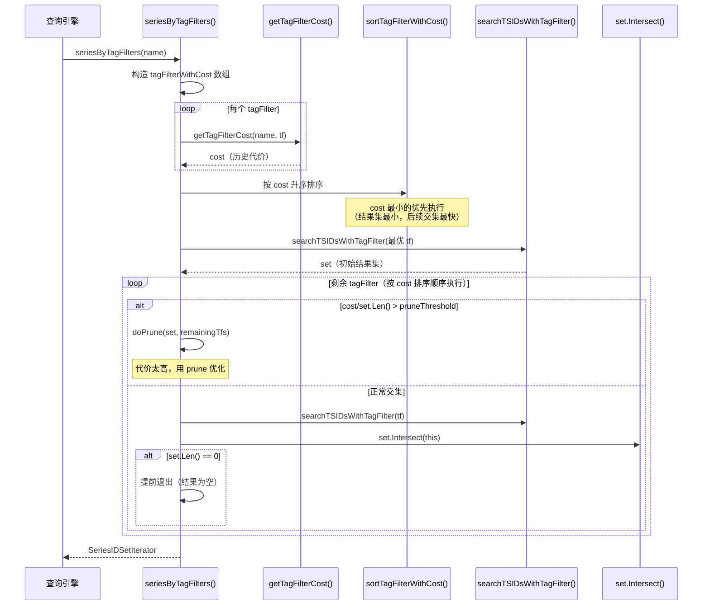
```mermaid
sequenceDiagram
    participant Caller as 查询引擎
    participant SBT as seriesByTagFilters()
    participant Cost as getTagFilterCost()
    participant Sort as sortTagFilterWithCost()
    participant Search as searchTSIDsWithTagFilter()
    participant Intersect as set.Intersect()

    Caller->>SBT: seriesByTagFilters(name)
    SBT->>SBT: 构造 tagFilterWithCost 数组

    loop 每个 tagFilter
        SBT->>Cost: getTagFilterCost(name, tf)
        Cost-->>SBT: cost（历史代价）
    end

    SBT->>Sort: 按 cost 升序排序
    Note over Sort: cost 最小的优先执行<br/>（结果集最小，后续交集最快）

    SBT->>Search: searchTSIDsWithTagFilter(最优 tf)
    Search-->>SBT: set（初始结果集）

    loop 剩余 tagFilter（按 cost 排序顺序执行）
        alt cost/set.Len() > pruneThreshold
            SBT->>SBT: doPrune(set, remainingTfs)
            Note over SBT: 代价太高，用 prune 优化
        else 正常交集
            SBT->>Search: searchTSIDsWithTagFilter(tf)
            SBT->>Intersect: set.Intersect(this)
            alt set.Len() == 0
                SBT->>SBT: 提前退出（结果为空）
            end
        end
    end

    SBT-->>Caller: SeriesIDSetIterator
```

**核心代码** `engine/index/tsi/search.go:441-539`：

```go
func (is *indexSearch) seriesByTagFilters(name []byte) (index.SeriesIDIterator, error) {

	// 快速路径：只有一个 tagFilter
	if len(is.tfs) == 1 {
		return is.seriesByOneTagFilter(name)
	}

	// ===== 步骤 1: 计算每个 tagFilter 的代价 =====
	tfcosts := make([]tagFilterWithCost, len(is.tfs))
	for i := 0; i < len(is.tfs); i++ {
		tfcosts[i].tf = &is.tfs[i]
		tfcosts[i].cost = is.getTagFilterCost(name, &is.tfs[i])  // 从缓存读取历史代价
	}
	is.sortTagFilterWithCost(tfcosts)           // 按 cost 升序排序

	// ===== 步骤 2: 选择最优的 tagFilter 作为起始 =====
	lastTfCosts := tfcosts[:0]
	startTfLoc := len(tfcosts)
	for i, tfcost := range tfcosts {
		this, cost, err := is.searchTSIDsWithTagFilter(tfcost.tf)
		tfcost.set = this
		if this.Len() < maxIndexMetrics {       // 结果集足够小
			lastTfCosts = append(lastTfCosts, tfcosts[i+1:]...)
			set = this
			is.storeTagFilterCost(name, tfcost.tf, cost)  // 缓存代价
			startTfLoc = i
			break
		}
		is.storeTagFilterCost(name, tfcost.tf, math.MaxInt64-1)  // 代价太高
		lastTfCosts = append(lastTfCosts, tfcost)
	}

	if startTfLoc == len(tfcosts) {
		// 所有 tagFilter 结果集都太大，回退到全量扫描
		set, err = is.searchTSIDsByTimeRange(name)
	}

	// ===== 步骤 3: 与剩余 tagFilter 取交集 =====
	tfcosts = lastTfCosts
	for i, tfcost := range tfcosts {
		// 剪枝优化：代价/结果集 > 阈值时，用 prune 替代遍历
		if (tfcost.cost/int64(set.Len()) > int64(pruneThreshold)) ||
			(tfcost.tf.IsFilterEmptyValue() && set.Len() < is.idx.config.TagScanPruneThreshold) {
			set, err = is.doPrune(set, tfs)     // prune 优化
			break
		}

		if tfcost.set.Len() > 0 {
			set.Intersect(tfcost.set)            // 已有结果，直接交集
			if set.Len() == 0 { break }
			continue
		}

		this, cost, err := is.searchTSIDsWithTagFilter(tfcost.tf)  // 重新搜索
		is.storeTagFilterCost(name, tfcost.tf, cost)
		set.Intersect(this)                     // 交集
		if set.Len() == 0 { break }             // 提前退出
	}

	return index.NewSeriesIDSetIterator(index.NewSeriesIDSetWithSet(set)), nil
}
```

**代码讲解**：`seriesByTagFilters` 不是把所有 tagFilter 并行查完再求交集，而是先读取/计算每个过滤条件的 cost，再按 cost 从小到大顺序执行。第一个足够小的结果集作为初始 set；后续过滤条件按顺序与当前 set 取交集。如果当前 set 已经很小，或者某个过滤条件代价过高，就走 `doPrune`，用已有 TSID 集合反查 seriesKey 后剪枝，避免继续大范围扫描 MergeSet。

**具体例子**：

```text
WHERE host='server1' AND region='us' AND rack='r1'

历史 cost:
  rack='r1'      cost=100
  host='server1' cost=5000
  region='us'    cost=20000

执行顺序:
  1. 先查 rack='r1' -> TSID set 只有 120 个
  2. 再查 host='server1' -> 与 120 个 TSID 做交集，剩 30 个
  3. region='us' 代价很高，当前 set 很小 -> doPrune 反查 30 个 seriesKey 并剪枝
```

**逐行解释**：
- `getTagFilterCost()`：从缓存读取历史代价（上次查询这个 tagFilter 返回了多少 TSID）
- `sortTagFilterWithCost()`：按 cost 升序排序，cost 最小的优先执行
- `searchTSIDsWithTagFilter()`：执行单个 tagFilter 的搜索
- `this.Len() < maxIndexMetrics`：如果结果集足够小，就作为初始集合
- `tfcost.cost/int64(set.Len()) > int64(pruneThreshold)`：代价/结果集比值太高时，用 prune 优化
- `set.Intersect(this)`：两个集合取交集（AND 条件）
- `set.Len() == 0`：结果为空时提前退出，避免无意义的后续搜索

**通俗解释**：
查询优化就像"找人策略"。假设你要找"住在北京、姓张、身高180cm以上的人"：
1. **计算代价**：先评估每个条件能筛掉多少人
   - "住在北京"：100万人 → 代价高
   - "姓张"：10万人 → 代价中
   - "身高180cm以上"：5万人 → 代价低
2. **最优排序**：先执行代价最低的条件（身高），结果集最小
3. **逐步交集**：用身高条件的结果，再和姓张的取交集，最后和北京的取交集
4. **提前退出**：如果中间结果为空，直接返回，不用继续查

### 5.4 getTSIDsForTagFilterSlow — 磁盘扫描实现

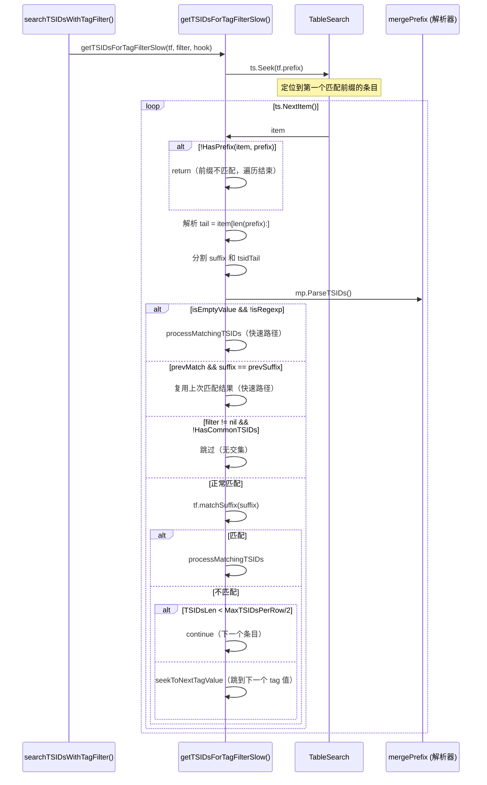
```mermaid
sequenceDiagram
    participant Caller as searchTSIDsWithTagFilter()
    participant Slow as getTSIDsForTagFilterSlow()
    participant TS as TableSearch
    participant MP as mergePrefix (解析器)

    Caller->>Slow: getTSIDsForTagFilterSlow(tf, filter, hook)

    Slow->>TS: ts.Seek(tf.prefix)
    Note over TS: 定位到第一个匹配前缀的条目

    loop ts.NextItem()
        TS->>Slow: item

        alt !HasPrefix(item, prefix)
            Slow->>Slow: return（前缀不匹配，遍历结束）
        end

        Slow->>Slow: 解析 tail = item[len(prefix):]
        Slow->>Slow: 分割 suffix 和 tsidTail
        Slow->>MP: mp.ParseTSIDs()

        alt isEmptyValue && !isRegexp
            Slow->>Slow: processMatchingTSIDs（快速路径）
        else prevMatch && suffix == prevSuffix
            Slow->>Slow: 复用上次匹配结果（快速路径）
        else filter != nil && !HasCommonTSIDs
            Slow->>Slow: 跳过（无交集）
        else 正常匹配
            Slow->>Slow: tf.matchSuffix(suffix)
            alt 匹配
                Slow->>Slow: processMatchingTSIDs
            else 不匹配
                alt TSIDsLen < MaxTSIDsPerRow/2
                    Slow->>Slow: continue（下一个条目）
                else
                    Slow->>Slow: seekToNextTagValue（跳到下一个 tag 值）
                end
            end
        end
    end
```

**核心代码** `engine/index/tsi/search.go:1423-1521`：

```go
func (is *indexSearch) getTSIDsForTagFilterSlow(tf *tagFilter, filter *uint64set.Set, hook indexSearchHook) error {
	ts := &is.ts
	kb := &is.kb
	mp := &is.mp
	mp.Reset()

	var prevMatchingSuffix []byte               // 缓存上次匹配的 suffix
	var prevMatch bool
	prefix := tf.prefix

	ts.Seek(prefix)                             // 定位到第一个匹配前缀的条目

	for ts.NextItem() {
		item := ts.Item

		if !bytes.HasPrefix(item, prefix) {
			return nil                          // 前缀不匹配，遍历结束
		}

		// 解析条目：分离 suffix 和 TSID 部分
		tail := item[len(prefix):]
		sepIndex := bytes.IndexByte(tail, tagSeparatorChar)
		suffix := tail[:sepIndex+1]             // tag value 部分
		tsidTail := tail[sepIndex+1:]           // TSID 部分

		mp.InitOnlyTail(item, tsidTail)         // 初始化解析器
		mp.ParseTSIDs()                         // 解析 TSID 列表

		// 快速路径 1：空值匹配
		if tf.isEmptyValue && !tf.isRegexp {
			is.processMatchingTSIDs(mp.TSIDs, filter, hook)
			continue
		}

		// 快速路径 2：复用上次匹配结果（相同 suffix）
		if prevMatch && bytes.Equal(suffix, prevMatchingSuffix) {
			is.processMatchingTSIDs(mp.TSIDs, filter, hook)
			continue
		}

		// 优化：当前行的 TSIDs 与 filter 无交集，跳过
		if filter != nil && !mp.HasCommonTSIDs(filter) {
			continue
		}

		// 慢路径：执行 suffix 匹配（可能包含正则）
		matches, err := tf.matchSuffix(suffix)
		if !matches {
			prevMatch = false
			if mp.TSIDsLen() < mergeindex.MaxTSIDsPerRow/2 {
				continue                        // TSID 少，继续下一条
			}
			is.seekToNextTagValue(kb, item, tsidTail, ts)  // TSID 多，跳到下一个 tag 值
			continue
		}

		// 匹配成功，缓存结果
		prevMatch = true
		prevMatchingSuffix = append(prevMatchingSuffix[:0], suffix...)
		is.processMatchingTSIDs(mp.TSIDs, filter, hook)
	}

	return nil
}
```

**逐行解释**：
- `ts.Seek(prefix)`：在 MergeSet 中定位到第一个匹配前缀的条目（利用有序性）
- `bytes.HasPrefix(item, prefix)`：检查前缀匹配，不匹配说明遍历结束
- `suffix` 和 `tsidTail`：从条目中分离 tag value 部分和 TSID 部分
- `prevMatch && bytes.Equal(suffix, prevMatchingSuffix)`：同一个 tag value 的多个 TSID 行，复用匹配结果
- `mp.HasCommonTSIDs(filter)`：快速检查是否有交集，没有就跳过
- `tf.matchSuffix(suffix)`：实际的字符串/正则匹配
- `seekToNextTagValue()`：当当前 tag value 的 TSID 行太多时，直接跳到下一个 tag value（避免逐行扫描）

**通俗解释**：
磁盘扫描就像在字典里找所有以 "ap" 开头的单词：
1. **翻到 "ap" 开头的位置**（Seek）：利用字典的有序性，直接跳到目标位置
2. **逐个检查**（NextItem）：看看当前单词是不是以 "ap" 开头
3. **前缀不匹配就停**（HasPrefix）：如果看到 "b" 开头的单词，说明 "ap" 的部分已经结束了
4. **快速路径**：如果当前单词和上一个一样（prevMatch），直接复用结果
5. **跳过优化**：如果某个单词后面跟着太多 TSID，直接跳到下一个单词

---

## 6. 索引条目详解

### 6.1 compositeKey 构造

```mermaid
sequenceDiagram
    participant Mst as measurement "cpu"
    participant Tag as tagKey "host"
    participant Key as compositeKey

    Mst->>Key: "cpu"
    Key->>Key: + compositeTagKeyPrefix
    Key->>Key: + VarUint64(len("cpu"))
    Key->>Key: + "cpu"
    Tag->>Key: + "host"
    Note over Key: compositeKey = [prefix]+len("cpu")+"cpu"+"host"
```

**核心代码** `engine/index/tsi/marshal.go:171-177`：

```go
func marshalCompositeTagKey(dst, name, key []byte) []byte {
	dst = append(dst, compositeTagKeyPrefix)        // 前缀标识
	dst = encoding.MarshalVarUint64(dst, uint64(len(name)))  // measurement 名称长度
	dst = append(dst, name...)                      // measurement 名称
	dst = append(dst, key...)                       // tag key
	return dst
}
```

**逐行解释**：
- `compositeTagKeyPrefix`：前缀标识，区分不同类型的索引条目
- `MarshalVarUint64(len(name))`：变长编码 measurement 名称长度
- `name...`：measurement 名称
- `key...`：tag key（measurement 级索引时 key 为空）

**通俗解释**：
compositeKey 就像"复合地址"。想象你要寄快递，地址写的是：
- **省份长度**：3（"北京"是 2 个字，但这里用变长编码）
- **省份**：北京
- **城市**：朝阳区

这样系统可以根据地址快速定位到具体位置。compositeKey 的作用类似，把 measurement 和 tag key 组合成一个唯一的查找键。

### 6.2 marshalTagValue — 特殊字符转义

```mermaid
sequenceDiagram
    participant Input as tagValue "server\x001"
    participant Escape as marshalTagValue()
    participant Output as 编码结果

    Input->>Escape: "server\x001"
    Escape->>Escape: 检查特殊字符
    Note over Escape: escapeChar = 0x00
    Note over Escape: tagSeparatorChar = 0x01
    Note over Escape: kvSeparatorChar = 0x02

    Escape->>Escape: 's' → 's'
    Escape->>Escape: 'e' → 'e'
    Escape->>Escape: 'r' → 'r'
    Escape->>Escape: 'v' → 'v'
    Escape->>Escape: 'e' → 'e'
    Escape->>Escape: 'r' → 'r'
    Escape->>Escape: '\x00' → '\x00' + '0' (转义)
    Escape->>Escape: '1' → '1'
    Escape->>Escape: 追加 tagSeparatorChar

    Escape-->>Output: "server\x0001\x01"（基于实际代码修正）
```

**核心代码** `engine/index/tsi/marshal.go:80-108`：

```go
func marshalTagValue(dst, src []byte) []byte {
	// 快速路径：无特殊字符
	hasSpecialChars := bytes.IndexByte(src, escapeChar) != -1 ||
		bytes.IndexByte(src, tagSeparatorChar) != -1 ||
		bytes.IndexByte(src, kvSeparatorChar) != -1

	if !hasSpecialChars {
		dst = append(dst, src...)
		dst = append(dst, tagSeparatorChar)      // 追加分隔符
		return dst
	}

	// 慢路径：转义特殊字符
	for _, ch := range src {
		switch ch {
		case escapeChar:                         // \x00 → \x00 + '0'
			dst = append(dst, escapeChar, '0')
		case tagSeparatorChar:                   // 0x01 → 0x00 + '1'（基于实际代码修正）
			dst = append(dst, escapeChar, '1')
		case kvSeparatorChar:                    // \x02 → \x00 + '2'
			dst = append(dst, escapeChar, '2')
		default:
			dst = append(dst, ch)
		}
	}

	dst = append(dst, tagSeparatorChar)          // 追加分隔符
	return dst
}
```

**逐行解释**：
- 三种特殊字符需要转义：`escapeChar(0x00)`、`tagSeparatorChar(0x01)`、`kvSeparatorChar(0x02)`（基于实际代码修正）
- 转义方式：在特殊字符前加 `escapeChar(\x00)`，后跟 '0'/'1'/'2'
- 追加 `tagSeparatorChar` 作为值的结束标记
- 这样确保索引条目的字节序与逻辑序一致

**通俗解释**：
特殊字符转义就像"快递地址中的特殊符号"。如果你的地址里包含 "#" 或 "@" 这样的特殊符号，快递系统可能会误解。所以需要"转义"：
- 原始值：`server\x001`（包含特殊字符 \x00）
- 转义后：`server\x0001`（\x00 被转义为 \x00 + '0'）

这样系统就不会把 \x00 当成分隔符，确保数据正确存储和查找。

---

## 7. MergeSet Seek 机制

### 7.1 TableSearch.Seek — 多 Part 归并

```mermaid
sequenceDiagram
    participant TS as TableSearch.Seek()
    participant P1 as partSearch 0 (内存 Part)
    participant P2 as partSearch 1 (磁盘 Part)
    participant P3 as partSearch 2 (磁盘 Part)
    participant Heap as partSearchHeap

    TS->>P1: ps.Seek(key)
    P1->>P1: 二分查找 metaindex → index block → item
    TS->>P2: ps.Seek(key)
    P2->>P2: 二分查找
    TS->>P3: ps.Seek(key)
    P3->>P3: 二分查找

    TS->>P1: ps.NextItem()
    TS->>P2: ps.NextItem()
    TS->>P3: ps.NextItem()

    TS->>Heap: heap.Init(psHeap)
    Note over Heap: 最小堆：取所有 Part 中最小的 item

    TS->>TS: ts.Item = psHeap[0].Item
    Note over TS: 当前最小 item
```

**核心代码** `lib/util/lifted/vm/mergeset/table_search.go:84-117`：

```go
func (ts *TableSearch) Seek(k []byte) {
	if err := ts.Error(); err != nil {
		return
	}
	ts.err = nil

	// 在每个 Part 中 Seek
	var errors []error
	ts.psHeap = ts.psHeap[:0]
	for i := range ts.psPool {
		ps := &ts.psPool[i]
		ps.Seek(k)                              // 在单个 Part 中二分查找
		if !ps.NextItem() {                     // 获取第一个条目
			if err := ps.Error(); err != nil {
				errors = append(errors, err)
			}
			continue
		}
		ts.psHeap = append(ts.psHeap, ps)       // 加入最小堆
	}

	if len(ts.psHeap) == 0 {
		ts.err = io.EOF
		return
	}

	heap.Init(&ts.psHeap)                       // 初始化最小堆
	ts.Item = ts.psHeap[0].Item                 // 取堆顶（最小 item）
	ts.nextItemNoop = true
}
```

**逐行解释**：
- 遍历所有 Part，在每个 Part 中调用 `ps.Seek(k)` 二分查找
- `ps.NextItem()`：获取 Part 中第一个 >= k 的条目
- `heap.Init(&ts.psHeap)`：初始化最小堆，堆顶是所有 Part 中最小的 item
- `ts.Item = ts.psHeap[0].Item`：返回当前最小 item

**通俗解释**：
多 Part 归并就像"多本字典同时查"。假设你有 3 本字典，要找所有以 "ap" 开头的单词：
1. **每本字典都翻到 "ap" 开头的位置**（Seek）
2. **每本字典取出当前单词**（NextItem）
3. **比较所有字典的当前单词**（最小堆），选出最小的那个
4. **推进最小单词的那本字典**（NextItem），再次比较
5. **重复步骤 3-4**，直到所有字典都查完

这样可以按顺序遍历所有字典中的单词，就像合并成一本大字典一样！

### 7.2 partSearch.Seek — 单 Part 二分查找

```mermaid
sequenceDiagram
    participant PS as partSearch.Seek()
    participant Meta as metaindexRow[]
    participant Block as blockHeader[]
    participant IB as inmemoryBlock

    PS->>PS: 检查 k > lastItem → EOF

    PS->>Meta: sort.Search(mrs, k)
    Note over Meta: 二分查找 metaindexRow
    Meta-->>PS: 定位到目标 metaindexRow

    PS->>PS: nextBHS() 读取 block headers
    PS->>Block: sort.Search(bhs, k)
    Note over Block: 二分查找 blockHeader
    Block-->>PS: 定位到目标 block

    PS->>PS: nextBlock() 读取 block 到内存
    PS->>IB: binarySearchKey(data, items, k)
    Note over IB: 二分查找 item
    IB-->>PS: 定位到目标 item
```

**核心代码** `lib/util/lifted/vm/mergeset/part_search.go:73-168`：

```go
func (ps *partSearch) Seek(k []byte) {
	if string(k) > string(ps.p.ph.lastItem) {
		ps.err = io.EOF                         // k 大于最大 item，直接返回
		return
	}

	if ps.tryFastSeek(k) { return }             // 快速路径

	// ===== 三级二分查找 =====

	// 第一级：二分查找 metaindexRow（稀疏索引）
	n := sort.Search(len(ps.mrs), func(i int) bool {
		return string(k) <= string(ps.mrs[i].firstItem)
	})
	if n > 0 { n-- }                            // 回退一个，确保不漏
	ps.mrs = ps.mrs[n:]

	// 第二级：二分查找 blockHeader（稠密索引）
	ps.nextBHS()                                // 读取 block headers
	n = sort.Search(len(ps.bhs), func(i int) bool {
		return string(k) <= string(ps.bhs[i].firstItem)
	})
	if n > 0 { n-- }
	ps.bhs = ps.bhs[n:]

	// 第三级：在 block 内二分查找 item
	ps.nextBlock()                              // 读取 block 到内存
	items := ps.ib.items
	data := ps.ib.data
	cpLen := commonPrefixLen(ps.ib.commonPrefix, k)
	if cpLen > 0 {
		keySuffix := k[cpLen:]
		ps.ibItemIdx = sort.Search(len(items), func(i int) bool {
			it := items[i]
			it.Start += uint32(cpLen)
			return string(keySuffix) <= it.String(data)
		})
	} else {
		ps.ibItemIdx = binarySearchKey(data, items, k)
	}
}
```

**逐行解释**：
- **第一级**：`sort.Search(mrs)`——在 metaindexRow（稀疏索引）中二分查找，定位到目标 index block 组
- **第二级**：`sort.Search(bhs)`——在 blockHeader（稠密索引）中二分查找，定位到目标 block
- **第三级**：`binarySearchKey(data, items, k)`——在 block 内部二分查找，定位到目标 item
- `commonPrefixLen`：利用公共前缀优化，减少比较次数
- 整体时间复杂度：O(log M + log B + log I)，M = metaindexRow 数，B = block 数，I = block 内 item 数

**通俗解释**：
三级二分查找就像"三层抽屉柜"找东西：
1. **第一层：大抽屉**（metaindexRow）：先找到是哪个大抽屉（比如 "A-F" 的抽屉）
2. **第二层：小抽屉**（blockHeader）：在大抽屉里找到具体的小抽屉（比如 "Ap" 的抽屉）
3. **第三层：抽屉里的格子**（item）：在小抽屉里找到具体的格子（比如 "Apple"）

每一层都是"二分查找"，所以速度很快！整体复杂度 = O(log 大抽屉数 + log 小抽屉数 + log 格子数)

---

## 8. 五级缓存详解

### 8.1 缓存层级

```mermaid
sequenceDiagram
    participant Write as 写入路径
    participant C1 as SeriesKeyToTSIDCache (seriesKey→TSID)
    participant C4 as TagKeyValueCache (tagKey+tagValue→exists)
    participant Query as 查询路径
    participant C2 as TSIDToSeriesKeyCache (TSID→seriesKey)
    participant C3 as tagFilterCache (tagFilterKey→[]TSID)
    participant C5 as TagFilterCostCache (tagFilter→cost)

    Write->>C1: 写入时查重
    Write->>C4: Tag 存在性检查

    Query->>C3: 条件过滤
    Query->>C2: TSID 反查 seriesKey
    Query->>C5: 查询优化（选择最优过滤顺序）
```

**核心代码** `engine/index/tsi/cache.go:38-59`：

```go
type IndexCache struct {
    SeriesKeyToTSIDCache *workingsetcache.Cache  // seriesKey → TSID（写入时查重）
    TSIDToSeriesKeyCache *workingsetcache.Cache   // TSID → seriesKey（查询时反查）
    tagFilterCache       *workingsetcache.Cache   // tagFilterKey → []TSID（条件过滤）
    TagKeyValueCache     *workingsetcache.Cache   // tagKey+tagValue → exists（Tag 存在性）
    TagFilterCostCache   *workingsetcache.Cache   // tagFilter → cost（查询优化）
}
```

**逐行解释**：
- `SeriesKeyToTSIDCache`：写入时用，查找 series 是否已存在，比如 `"cpu,host=server1"` → `TSID=1001`
- `TSIDToSeriesKeyCache`：查询时用，根据 TSID 反查 series key，比如 `TSID=1001` → `"cpu,host=server1"`
- `tagFilterCache`：查询时用，缓存 tag 过滤结果，比如 `host=server1` → `[1001, 1002, 1003]`
- `TagKeyValueCache`：写入时用，检查 tag 值是否存在
- `TagFilterCostCache`：查询优化时用，记录每个 tag 过滤的代价，用于选择最优过滤顺序

**缓存初始化** `engine/index/tsi/cache.go:219-250`：

```go
func newIndexCache(mem int64) *IndexCache {
    tsidCacheSize := mem / 32    // SeriesKeyToTSID 缓存大小 = 总内存的 1/32
    skeyCacheSize := mem / 32    // TSIDToSeriesKey 和 TagKeyValue 缓存大小
    tagCacheSize := mem / 16     // tagFilter 缓存大小 = 总内存的 1/16
    tagFilterCostSize := mem / 128  // TagFilterCost 缓存大小

    return &IndexCache{
        SeriesKeyToTSIDCache: workingsetcache.New(tsidCacheSize),
        TSIDToSeriesKeyCache: workingsetcache.New(skeyCacheSize),
        tagFilterCache:       workingsetcache.New(tagCacheSize),
        TagKeyValueCache:     workingsetcache.New(skeyCacheSize),
        TagFilterCostCache:   workingsetcache.New(tagFilterCostSize),
    }
}
```

**逐行解释**：
- `tsidCacheSize = mem / 32`：如果总内存 8GB，SeriesKeyToTSID 缓存 = 256MB
- `tagCacheSize = mem / 16`：tagFilter 缓存 = 512MB（查询最常用，所以最大）
- `workingsetcache.New(size)`：创建一个 LRU 缓存，自动淘汰最久未使用的条目

**通俗解释**：
五级缓存就像"五个记忆层级"：
1. **SeriesKeyToTSID**（写入时用）：记住 "张三" 的会员号是 "1001"
2. **TSIDToSeriesKey**（查询时用）：记住会员号 "1001" 是 "张三"
3. **tagFilterCache**（查询时用）：记住 "住在北京的人" 有哪些会员号
4. **TagKeyValue**（写入时用）：记住 "北京" 这个标签存不存在
5. **TagFilterCost**（优化时用）：记住 "住在北京" 这个条件大概能筛出多少人

这样下次查同样的条件，直接从记忆里读，不用再去翻档案了！

**具体例子**：

查询 `SELECT * FROM cpu WHERE host='server1'` 的缓存使用流程：

```
第一次查询（缓存未命中）：
1. tagFilterCache 查找 "host=server1" → 未命中
2. 查询索引系统 → 返回 TSID 列表 [1001, 1002, 1003]
3. 缓存结果：tagFilterCache["host=server1"] = [1001, 1002, 1003]
4. TSIDToSeriesKeyCache 查找 TSID 1001 → 未命中
5. 查询索引系统 → 返回 "cpu,host=server1,region=us"
6. 缓存结果：TSIDToSeriesKeyCache[1001] = "cpu,host=server1,region=us"

第二次查询（缓存命中）：
1. tagFilterCache 查找 "host=server1" → 命中！直接返回 [1001, 1002, 1003]
2. TSIDToSeriesKeyCache 查找 TSID 1001 → 命中！直接返回 "cpu,host=server1,region=us"
3. 跳过索引查询，直接读取数据
```

### 8.2 缓存失效机制

> 当新 series 写入时，之前缓存的查询结果可能不再正确。openGemini 选择了"粗粒度失效"策略 — 新 series 写入时，**所有** tagFilterCache 都失效，而不是只失效受影响的缓存。

```mermaid
sequenceDiagram
    participant New as 新 series 写入
    participant Gen as tagFilterKeyGen
    participant Cache as tagFilterCache

    New->>Gen: invalidateTagCache()<br/>tagFilterKeyGen++
    Note over Gen: 所有 tagFilterCache 逻辑失效<br/>（粗粒度失效）

    Note over Cache: 为什么粗粒度？<br/>新 series 可能影响任何 tag 的结果<br/>精确失效太复杂
```

**为什么选择粗粒度失效？**

> 看起来"精确失效"更好 — 只失效受影响的缓存，其他缓存继续有效。为什么 openGemini 不这样做？

**原因 1：新 series 的影响范围难以预测**

```
假设缓存了查询结果：
  SELECT * FROM cpu WHERE host = 'server1' → TSID = [1001, 1002]

此时写入一个新 series：cpu,host=server1,region=us value=99.5

问题：这个新 series 的 TSID 是什么？
  - 如果 TSID = 1003，那么之前的缓存结果 [1001, 1002] 就不完整了
  - 但系统在写入时还不知道 TSID（TSID 是写入后才生成的）
  - 所以无法确定"哪些缓存会受影响"

精确失效需要：
  1. 解析新 series 的所有 tag 组合
  2. 对每个 tag 组合，查找所有可能匹配的缓存 key
  3. 逐个失效

这个过程的复杂度 = O(新 series 的 tag 数 × 缓存条目数)
在高写入场景下，这个开销不可接受
```

**原因 2：tagFilterKeyGen 是一个原子计数器，开销极低**

```go
// 只需要一次原子加法操作
atomic.AddUint64(&tagFilterKeyGen, 1)
```

```
粗粒度失效的开销：
  - 1 次原子加法操作（~10ns）
  - 不需要遍历缓存
  - 不需要解析 tag

精确失效的开销：
  - 遍历所有缓存条目（可能几千条）
  - 对每个条目检查是否受影响
  - 删除受影响的条目
  - 总开销可能达到 ~100μs

差距：10000 倍！
```

**原因 3：缓存命中率影响有限**

```
tagFilterCache 的作用：
  缓存 tagFilterKey → []TSID 的映射
  避免重复查询索引系统

失效后的代价：
  下次查询时，缓存未命中，需要查询索引
  但索引查询本身很快（~100μs）

如果查询频率高：
  缓存会很快被重新填充
  失效只影响第一次查询

如果写入频率高：
  即使精确失效，缓存也会频繁失效
  粗粒度和精确失效的效果差别不大
```

**总结：粗粒度 vs 精确失效**

| 维度 | 粗粒度失效（采用） | 精确失效 |
|------|-------------------|---------|
| **实现复杂度** | 极简（1 次原子操作） | 复杂（遍历 + 匹配 + 删除） |
| **写入开销** | ~10ns | ~100μs |
| **缓存命中率** | 略低（全部失效） | 略高（只失效受影响的） |
| **正确性** | 保证（宁可多失效，不能漏失效） | 需要精确匹配，容易出 bug |
| **适用场景** | 高写入、查询密集 | 写入少、查询多 |

**通俗解释**：
缓存失效就像"清理记忆"。当你学到新知识时，旧记忆可能不再正确。有两种清理策略：
1. **粗粒度失效**（采用）：直接"清空所有记忆"，重新学习
   - 优点：简单、快速（1 次原子操作）
   - 缺点：可能清多了（有些记忆还是对的）
2. **精确失效**：只清理"受影响的记忆"
   - 优点：清理得精准
   - 缺点：实现复杂，容易出 bug

openGemini 选择了粗粒度失效，因为：
- 写入频繁时，精确失效也要频繁清理，效果差不多
- 粗粒度失效的开销极低（~10ns），精确失效开销高（~100μs）
- 宁可多清理，也不能漏清理（保证正确性）

---

## 9. TagArray 处理

### 9.1 组合爆炸问题

```mermaid
sequenceDiagram
    participant Input as 输入: cpu,host=[server1,server2] value=99.5
    participant Expand as TagArray 展开
    participant Index as 索引系统

    Input->>Expand: TagArray: host=[server1, server2]
    Expand->>Expand: 展开为 2 个组合

    Expand->>Index: seriesKey 1: cpu,host=server1
    Index->>Index: 生成 TSID=1001<br/>创建 5 条索引

    Expand->>Index: seriesKey 2: cpu,host=server2
    Index->>Index: 生成 TSID=1002<br/>创建 5 条索引

    Note over Index: 如果 host=[a,b,c], region=[x,y]<br/>3 × 2 = 6 个组合<br/>6 个 TSID，6 组索引条目
```

**通俗解释 — 快递批量发货**：

TagArray 就像快递批量发货：你一次发3个包裹到不同地址，系统会自动拆成3个独立的快递单，每个快递单有自己的单号（TSID）。如果同时有多个维度（host=[a,b,c], region=[x,y]），就像"3个收件人 × 2个商品 = 6个包裹"，笛卡尔积组合。

**核心代码** `engine/index/tsi/tag_array.go:101-133`：

```go
func AnalyzeTagSets(dstTagSets *tagSets, tags []influx.Tag) error {
    // 检查所有 array tag 的元素数量是否一致
    arrayLen := 0
    for i := range tags {
        if tags[i].IsArray {
            tagCount := strings.Count(tags[i].Value, ",") + 1
            if arrayLen == 0 {
                arrayLen = tagCount
            } else if arrayLen != tagCount {
                return errno.NewError(errno.ErrorTagArrayFormat)  // 数量不一致，报错
            }
        }
    }
    // 展开为 arrayLen 个 tag 组合
    dstTagSets.resize(arrayLen, len(tags))
    // 非 array tag 复制到所有行，array tag 拆分到各行
    ...
}
```

**逐行解释**：

| 行 | 代码 | 作用 |
|---|------|------|
| 1 | `tags[i].IsArray` | 检查 tag 值是否是数组格式，如 `host=[server1,server2]` |
| 2 | `strings.Count(Value, ",") + 1` | 计算数组元素数量，`"server1,server2"` → 2 |
| 3 | `arrayLen != tagCount` | 所有 array tag 的元素数量必须一致，否则报错 |
| 4 | `dstTagSets.resize(arrayLen, len(tags))` | 预分配空间：arrayLen 行 × len(tags) 列 |

### 9.2 核心代码：AnalyzeTagSets — TagArray 展开

```mermaid
flowchart LR
    subgraph Input["输入"]
        A["cpu,host=[server1,server2],region=us"]
    end

    subgraph Process["AnalyzeTagSets"]
        B["检查 array tag 元素数"]
        C["host: 2个元素"]
        D["region: 非array"]
        E["resize(2, 2)"]
    end

    subgraph Output["输出"]
        F["组合1: host=server1, region=us"]
        G["组合2: host=server2, region=us"]
    end

    A --> B --> C --> E
    B --> D --> E
    E --> F
    E --> G

    style Input fill:#e1f5fe
    style Process fill:#fff3e0
    style Output fill:#e8f5e9
```

**代码位置**：`engine/index/tsi/tag_array.go:101-133`

```go
func AnalyzeTagSets(dstTagSets *tagSets, tags []influx.Tag) error {
    // 检查所有 array tag 的元素数量是否一致
    arrayLen := 0
    for i := range tags {
        if tags[i].IsArray {
            tagCount := strings.Count(tags[i].Value, ",") + 1
            if arrayLen == 0 {
                arrayLen = tagCount
            } else if arrayLen != tagCount {
                return errno.NewError(errno.ErrorTagArrayFormat)  // 数量不一致，报错
            }
        }
    }
    // 展开为 arrayLen 个 tag 组合
    dstTagSets.resize(arrayLen, len(tags))
    // 非 array tag 复制到所有行，array tag 拆分到各行
    ...
}
```

**逐行解释**：
- `tags[i].IsArray`：检查 tag 值是否是数组格式，比如 `host=[server1,server2]`
- `strings.Count(tags[i].Value, ",") + 1`：计算数组元素数量，比如 `"server1,server2"` → 2
- `arrayLen != tagCount`：所有 array tag 的元素数量必须一致，否则报错
- `dstTagSets.resize(arrayLen, len(tags))`：展开为 arrayLen 个 tag 组合

**通俗解释**：
TagArray 就像"批量创建会员"。假设你要注册 3 个会员：
- 输入：`host=[server1,server2,server3]`
- 系会展开为 3 个独立的会员：
  - 会员 1：host=server1
  - 会员 2：host=server2
  - 会员 3：host=server3

每个会员都有自己的会员号（TSID）和索引条目，就像 3 个独立注册的会员一样。

**具体例子**：

输入：`cpu,host=[server1,server2],region=us value=99.5`

```
解析 tags：
  - host: [server1, server2]  ← IsArray = true, 元素数 = 2
  - region: us                ← IsArray = false

展开为 2 个 tag 组合：
  组合 1: host=server1, region=us
  组合 2: host=server2, region=us
```

### 9.3 核心代码：marshalCombineIndexKeys — 组合索引键序列化

```mermaid
flowchart LR
    subgraph Input["输入: 2个 seriesKey"]
        A["key1 = cpu,host=server1"]
        B["key2 = cpu,host=server2"]
    end

    subgraph Process["marshalCombineIndexKeys"]
        C["写入 count=2"]
        D["写入 len1=17 + key1"]
        E["写入 len2=17 + key2"]
    end

    subgraph Output["序列化结果"]
        F["[2][17][cpu,host=server1][17][cpu,host=server2]"]
    end

    A --> C --> D --> E --> F
    B --> D

    style Input fill:#e1f5fe
    style Process fill:#fff3e0
    style Output fill:#e8f5e9
```

**代码位置**：`engine/index/tsi/tag_array.go:193-229`

```go
func marshalCombineIndexKeys(dst []byte, indexkeys [][]byte, tagIndex []int) []byte {
    // 快速路径：单个 key，直接返回
    if len(tagIndex) == 1 {
        dst = append(dst, indexkeys[0][:tagIndex[0]]...)
        return dst
    }
    // 多个 key：格式 = count + len(key1) + key1 + len(key2) + key2 + ...
    dst = append(dst, byte(len(indexkeys)))
    for i := range indexkeys {
        keyLen := tagIndex[i]
        dst = append(dst, byte(keyLen))
        dst = append(dst, indexkeys[i][:keyLen]...)
    }
    return dst
}
```

**逐行解释**：
- 单个 key 快速路径：直接返回 key 的前 tagIndex[0] 个字节
- 多个 key：先写 count（key 数量），然后每个 key 写长度 + 内容
- 格式：`[count][len1][key1][len2][key2]...`

**通俗解释**：
组合索引键序列化就像"打包多个地址"。假设你要寄快递给 3 个人，可以把 3 个地址打包成一个包裹：
- **包裹格式**：[人数] [地址1长度] [地址1] [地址2长度] [地址2] [地址3长度] [地址3]
- **优点**：一次传输多个地址，比分别寄 3 个包裹更高效

**具体例子**：

输入：2 个 series key
- key1 = `cpu,host=server1`（tagIndex[0] = 17）
- key2 = `cpu,host=server2`（tagIndex[1] = 17）

序列化结果：
```
[2]           ← count = 2 个 key
[17]          ← key1 长度
[cpu,host=server1]  ← key1 内容
[17]          ← key2 长度
[cpu,host=server2]  ← key2 内容
```

### 9.4 TagArray 查询流程

```mermaid
sequenceDiagram
    participant Query as 查询: WHERE host='server1'
    participant Index as 索引系统
    participant TSID as TSID 查找
    participant Series as 组合 Key 解析

    Query->>Index: 查找 host=server1
    Index->>TSID: Seek(Tag索引)
    TSID-->>Index: TSID=[1001]

    loop 对每个 TSID
        Index->>Series: 反查 seriesKey
        Series->>Series: 检查是否是组合 key（含 '[' 字符）
        alt 是组合 key
            Series->>Series: unmarshalCombineIndexKeys()
            Series->>Series: 解析出子 key
            Series->>Series: 检查子 key 是否匹配 host=server1
        else 普通 key
            Series->>Series: 直接匹配
        end
    end

    Series-->>Query: 返回匹配的 series
```

当查询包含 TagArray 的 series 时，系统需要特殊处理：

```
查询：SELECT * FROM cpu WHERE host='server1'

1. 查找 host=server1 匹配的 TSID
2. 对于每个 TSID，反查 seriesKey
3. 检查 seriesKey 是否是组合 key（包含 '[' 字符）
4. 如果是组合 key，解析出所有子 key
5. 检查子 key 中是否有匹配 host=server1 的
6. 只返回匹配的子 key 对应的数据
```

**核心代码** `engine/index/tsi/tag_array.go:515-535`：

```go
func (idx *MergeSetIndex) searchSeriesWithTagArray(tsid uint64, seriesKeys [][]byte, ...) ([][]byte, ...) {
    // 根据 TSID 反查组合 key
    combineKey, err = idx.searchSeriesKey(combineKey, tsid)
    // 解析组合 key 为多个子 key
    seriesKeys, _, err = unmarshalCombineIndexKeys(seriesKeys, combineKey)
    // 检查子 key 是否匹配查询条件
    _, isExpectSeries, exprs, err = analyzeSeriesWithCondition(seriesKeys, exprs, condition, ...)
}
```

**通俗解释**：
TagArray 就像"批量创建 series"。一条写入语句 `host=[server1,server2]` 会创建 2 个 series，每个 series 有自己独立的 TSID 和索引条目。查询时，系统需要特殊处理组合 key，确保只返回匹配的数据。

**通俗解释**：
TagArray 查询就像"查组合地址"。假设你有一个组合地址"北京+上海"，要找住在北京的人：
1. **找到组合地址**：先找到 "北京+上海" 这个组合地址
2. **拆分地址**：拆分成 "北京" 和 "上海" 两个子地址
3. **检查匹配**：看看 "北京" 是否匹配查询条件
4. **返回结果**：只返回匹配的子地址对应的数据

这样即使数据是组合存储的，查询时也能精确返回需要的部分！

---

## 10. 删除机制

### 10.1 标记删除时序图

```mermaid
sequenceDiagram
    participant Delete as 删除 series
    participant Set as deletedTSIDs 集合
    participant Query as 查询请求
    participant Compact as 后台合并

    Delete->>Set: 将 TSID 加入 deletedTSIDs
    Note over Set: 不立即删除索引条目<br/>（延迟清理）

    Query->>Query: 查到 TSID
    Query->>Set: deletedTSIDs.Has(tsid)?
    alt 已删除
        Set-->>Query: true
        Query->>Query: 跳过该 TSID
    else 未删除
        Set-->>Query: false
        Query->>Query: 正常使用
    end

    Note over Compact: 后台合并时
    Compact->>Compact: 物理删除索引条目
```

**通俗解释 — 图书馆的"注销卡"**：

删除一个 series 就像注销图书馆会员卡：
1. **不立即销毁**：图书馆不会马上把你的会员卡剪掉，而是先在"待注销名单"上记一笔
2. **查询时过滤**：有人查你的借阅记录时，管理员看到你在注销名单上，就说"查无此人"
3. **后台清理**：等图书馆整理档案时，才真正把你的资料销毁

这种"标记删除"的好处是：删除操作非常快（只需要往名单上加一个编号），不需要立即修改大量索引文件。

**具体例子**：

假设要删除 `cpu,host=server2,region=us` (TSID=1002)：

```
Step 1: 删除请求到达
  DELETE FROM cpu WHERE host='server2' AND region='us'

Step 2: 查找要删除的 TSID
  查索引 → TSID=[1002]

Step 3: 标记删除（内存 + 磁盘）
  内存：deletedTSIDs.Add(1002)
  磁盘：写入删除 MergeSet → [0x03] + 1002

Step 4: 后续查询时过滤
  查到 TSID=[1001, 1002]
  检查 deletedTSIDs → 1002 已删除
  返回 TSID=[1001]

Step 5: 后台合并时物理删除
  Compactor 合并索引时，跳过 TSID=1002 的条目
  → 物理删除完成
```

### 10.2 核心代码：DeleteTSIDs — 删除入口

```mermaid
sequenceDiagram
    participant Client as DELETE 语句
    participant Delete as DeleteTSIDs()
    participant Search as searchTSIDs()
    participant DMS as 删除 MergeSet

    Client->>Delete: DELETE FROM cpu WHERE host='server1'
    Delete->>Delete: 检查时间范围 ≤ 40天
    Delete->>Search: searchTSIDs("cpu", host='server1', tr)
    Search-->>Delete: TSIDs=[1001, 1002]
    Delete->>DMS: WriteDeleteTsids([1001, 1002])
    DMS-->>Delete: 完成
```

**代码位置**：`engine/index/tsi/mergeset_index.go:1645-1662`

```go
func (idx *MergeSetIndex) DeleteTSIDs(name []byte, condition influxql.Expr, tr TimeRange) error {
    if tr.Min < 0 {
        tr.Min = 0
    }
    minDate := uint64(tr.Min) / nsPerDay
    maxDate := uint64(tr.Max) / nsPerDay
    if maxDate-minDate > maxDaysForSearch {
        // Too much dates to delete, it maybe affect other process' performance
        return fmt.Errorf("too much dates [%d] to delete, it must less or equal %d days", maxDate-minDate, maxDaysForSearch)
    }

    tsids, err := idx.searchTSIDs(name, condition, tr)
    if err != nil {
        return err
    }

    return idx.DeleteMergeSet().WriteDeleteTsids(tsids)
}
```

**逐行解释**：
- `tr.Min < 0`：修正负数时间戳为 0
- `uint64(tr.Min) / nsPerDay`：将纳秒时间戳转换为天数
- `maxDate-minDate > maxDaysForSearch`：限制时间范围最多 40 天，防止误删大量数据
- `idx.searchTSIDs(name, condition, tr)`：根据 measurement 名、WHERE 条件、时间范围查找要删除的 TSID
- `idx.DeleteMergeSet().WriteDeleteTsids(tsids)`：将 TSID 写入独立的删除 MergeSet

**通俗解释**：
删除入口就像"申请注销会员"。当你想注销会员时：
1. **检查时间范围**：最多只能注销最近 40 天的数据，防止误删太久远的数据
2. **查找要注销的会员**：根据条件找到所有要注销的会员号
3. **标记注销**：把这些会员号写入"待注销名单"（不立即删除，只是标记）

### 10.3 核心代码：WriteDeleteTsids — 持久化删除标记

```mermaid
sequenceDiagram
    participant Caller as DeleteTSIDs()
    participant Lock as deletedTSIDsLock
    participant Mem as deletedTSIDs (内存)
    participant Disk as 删除 MergeSet (磁盘)

    Caller->>Caller: encoding.MarshalUint64(t, tsids[i])
    Caller->>Disk: 序列化 TSID 为 []byte

    Caller->>Lock: Lock()
    Lock->>Mem: Load() → curDeleted
    Mem->>Mem: Clone() → newDeleted
    Mem->>Mem: AddMulti(tsids)
    Mem->>Mem: Store(newDeleted) 原子替换
    Lock->>Lock: Unlock()

    Caller->>Disk: AddItems(items)
```

**代码位置**：`engine/index/tsi/mergeset_index.go:1664-1684`

```go
func (idx *MergeSetIndex) WriteDeleteTsids(tsids []uint64) error {
    items := make([][]byte, 0, len(tsids))
    for i := range tsids {
        t := make([]byte, 0)
        t = encoding.MarshalUint64(t, tsids[i])
        items = append(items, t)
    }

    // add deleted tsids to memory
    idx.deletedTSIDsLock.Lock()
    defer idx.deletedTSIDsLock.Unlock()
    if curDeleted, ok := idx.deletedTSIDs.Load().(*uint64set.Set); ok {
        newDeleted := curDeleted.Clone()
        newDeleted.AddMulti(tsids)
        idx.deletedTSIDs.Store(newDeleted)
    } else {
        return errors.New("curDeleted must be *uint64set.Set")
    }

    return idx.tb.AddItems(items)
}
```

**逐行解释**：
- `encoding.MarshalUint64(t, tsids[i])`：将 TSID 序列化为 8 字节，用于持久化到磁盘
- `idx.deletedTSIDsLock.Lock()`：加锁，保证并发安全
- `curDeleted.Clone()`：克隆当前已删除 TSID 集合（不可变模式）
- `newDeleted.AddMulti(tsids)`：将新删除的 TSID 添加到克隆的集合
- `idx.deletedTSIDs.Store(newDeleted)`：原子替换，其他 goroutine 读取时看到的是完整的新集合
- `idx.tb.AddItems(items)`：持久化到磁盘，重启后可恢复

**通俗解释**：
持久化删除标记就像"更新黑名单"。当有新的会员要注销时：
1. **加锁**：防止多人同时修改黑名单
2. **克隆当前黑名单**：复制一份当前的黑名单（不可变模式）
3. **添加新成员**：把要注销的会员号加入黑名单副本
4. **原子替换**：用新的黑名单替换旧的黑名单（其他线程看到的总是完整的黑名单）
5. **备份到磁盘**：把黑名单存到档案室，重启后可以恢复

### 10.4 核心代码：查询时过滤已删除 TSID

```mermaid
flowchart LR
    subgraph Query["查询流程"]
        A["查到 TSID=1001"] --> B{"deletedTSIDs.Has(1001)?"}
        B -->|true| C["跳过"]
        B -->|false| D["返回给用户"]
    end

    subgraph DeletedSet["deletedTSIDs"]
        E["{1001, 1002}"]
    end

    E --> B

    style Query fill:#e1f5fe
    style DeletedSet fill:#ffebee
```

**代码位置**：`engine/index/tsi/search.go:1370`

```go
func (is *indexSearch) scanTSIDsForTagFilter(...) {
    for ... {
        tsid := ...
        // 检查 TSID 是否已删除
        if is.deleted != nil && is.deleted.Has(tsid) {
            return true  // 跳过已删除的 TSID
        }
        // 正常处理
        ...
    }
}
```

**逐行解释**：
- `is.deleted != nil`：检查是否有已删除的 TSID 集合
- `is.deleted.Has(tsid)`：检查当前 TSID 是否在已删除集合中
- `return true`：跳过已删除的 TSID，不返回给查询

**通俗解释**：
查询时过滤就像"查会员时跳过已注销的"。当你查询会员列表时：
1. **检查黑名单**：先看看这个会员号是不是在黑名单上
2. **跳过已注销**：如果在黑名单上，就跳过，不返回给用户
3. **正常返回**：如果不在黑名单上，正常返回

这样即使会员数据还在磁盘上，用户也看不到已注销的会员了！

### 10.5 具体例子：删除 series 的完整流程

```mermaid
sequenceDiagram
    participant User as 用户
    participant SQL as SQL 引擎
    participant Index as 索引系统
    participant Mem as deletedTSIDs
    participant Disk as 删除 MergeSet
    participant Compact as Compactor

    User->>SQL: DELETE FROM cpu WHERE host='server1'
    SQL->>Index: DeleteTSIDs("cpu", host='server1', tr)
    Index->>Index: searchTSIDs() → [1001, 1002]
    Index->>Mem: AddMulti([1001, 1002])
    Index->>Disk: 写入删除标记

    Note over User: 后续查询
    User->>SQL: SELECT * FROM cpu WHERE host='server1'
    SQL->>Index: 查到 TSID=[1001, 1002]
    Index->>Mem: Has(1001)=true, Has(1002)=true
    Index-->>SQL: 返回空结果

    Note over Compact: 后台合并
    Compact->>Compact: 跳过 TSID=1001, 1002
    Compact->>Compact: 物理删除索引条目
```

假设要删除 `cpu,host=server1` 的所有数据：

```
步骤 1：执行 DELETE 语句
  DELETE FROM cpu WHERE host='server1'

步骤 2：DeleteTSIDs() 查找要删除的 TSID
  searchTSIDs("cpu", host='server1', timeRange) → [1001, 1002]

步骤 3：WriteDeleteTsids() 持久化删除标记
  内存：deletedTSIDs = {1001, 1002}
  磁盘：写入删除 MergeSet

步骤 4：查询时过滤
  SELECT * FROM cpu WHERE host='server1'
  → 查到 TSID = [1001, 1002]
  → deletedTSIDs.Has(1001) = true → 跳过
  → deletedTSIDs.Has(1002) = true → 跳过
  → 返回空结果

步骤 5：后台合并时物理删除
  合并索引文件时，跳过 deletedTSIDs 中的 TSID
  → 索引条目被物理删除，释放磁盘空间
```

**为什么用标记删除而不是立即删除？**

| 维度 | 标记删除（采用） | 立即删除 |
|------|-----------------|---------|
| **删除速度** | 极快（只写标记） | 慢（需要遍历删除） |
| **并发安全** | 安全（不影响查询） | 不安全（删除时查询可能出错） |
| **空间回收** | 延迟到合并时 | 立即回收 |
| **实现复杂度** | 简单 | 复杂（需要处理并发） |

**通俗解释**：
标记删除就像在书上贴"待处理"标签。书还在书架上，但下次找书时会跳过贴了标签的书。等整理书架时（后台合并），再把贴了标签的书真正移除。这样删除操作很快，不影响其他人的查询。

---

## 11. 潜在隐患

### 11.1 MergeSet 写入的全局锁

```mermaid
sequenceDiagram
    participant G1 as goroutine 1
    participant G2 as goroutine 2
    participant CIF as CreateIndexIfNotExists()

    G1->>CIF: 调用
    CIF->>CIF: idx.mu.Lock()
    G2->>CIF: 调用
    Note over G2: 等待锁…
    CIF->>CIF: idx.mu.Unlock()
    G2->>CIF: idx.mu.Lock()
    Note over G2: 高并发时<br/>锁竞争成为瓶颈
```

**通俗解释 — 只有一个窗口的银行**：

全局锁就像银行只有一个窗口：所有客户（goroutine）都必须排队，一个办完才能办下一个。高并发时，窗口前排起长队，后面的客户等得不耐烦。

**核心代码** `engine/index/tsi/mergeset_index.go:681-711`（基于实际代码修正）：

```go
func (idx *MergeSetIndex) CreateIndexIfNotExists(mmRows *dictpool.Dict) error {
    vkey := kbPool.Get()
    defer kbPool.Put(vkey)
    vname := kbPool.Get()
    defer kbPool.Put(vname)

    var err error
    idx.mu.Lock()           // 全局锁：所有写入串行化
    defer idx.mu.Unlock()

    for mmIdx := range mmRows.D {
        rows, ok := mmRows.D[mmIdx].Value.(*[]influx.Row)
        if !ok {
            return fmt.Errorf("create index failed due to rows are not belong to type row")
        }

        vname.B = append(vname.B[:0], []byte(mmRows.D[mmIdx].Key)...)
        for rowIdx := range *rows {
            if (*rows)[rowIdx].SeriesId != 0 {
                continue  // 已有 TSID，跳过
            }
            vkey.B = append(vkey.B[:0], (*rows)[rowIdx].IndexKey...)
            (*rows)[rowIdx].SeriesId, err = idx.createIndexesIfNotExists(vkey.B, vname.B, (*rows)[rowIdx].Tags)
            if err != nil {
                return err
            }
        }
    }
    return nil
}
```

**具体例子**：

4 核 CPU，4 个 goroutine 同时写入：
```
goroutine 1: idx.mu.Lock() ✓ 获得锁
goroutine 2: idx.mu.Lock() ✗ 等待…
goroutine 3: idx.mu.Lock() ✗ 等待…
goroutine 4: idx.mu.Lock() ✗ 等待…

goroutine 1: 处理完 → idx.mu.Unlock()
goroutine 2: idx.mu.Lock() ✓ 获得锁
goroutine 3: 继续等待…
goroutine 4: 继续等待…

→ 只有 1 个 goroutine 在工作，其他 3 个在等待
→ CPU 利用率只有 25%！
```

### 11.2 BloomFilter 误判

```mermaid
sequenceDiagram
    participant Caller as getSeriesIdBySeriesKey()
    participant BF as BloomFilter
    participant Disk as MergeSet

    Caller->>BF: Test(key)
    BF-->>Caller: true（可能存在）

    Caller->>Disk: Seek(key)
    Disk-->>Caller: 没找到！

    Note over Caller: BF 误判！<br/>~1% 概率<br/>不必要的磁盘 Seek
```

**通俗解释 — 保安误报**：

BloomFilter 误判就像保安偶尔会误报：保安说"这个人可能来过"（BF 返回 true），但翻遍档案（磁盘查找）发现其实没来过。概率约 1%，虽然不高，但在高并发时会积累很多不必要的磁盘查找。

**核心代码** `engine/index/tsi/mergeset_index.go:635-679`：

```go
func (idx *MergeSetIndex) getSeriesIdBySeriesKey(seriesKey []byte) (uint64, error) {
    // 第一级：Cache 查找
    exist, err := idx.cache.GetTSIDFromTSIDCache(&tsid, seriesKey)
    if exist { return tsid, nil }  // 缓存命中

    // 第二级：BloomFilter
    if idx.bfExist() && !idx.CheckSeriesKeyExist(seriesKey) {
        return 0, nil  // BF 说"一定不存在" → 100% 准确
    }

    // 第三级：磁盘查找（BF 说"可能存在"时才执行）
    tsid, err = is.getTSIDBySeriesKey(seriesKey)
    // 如果 BF 误判 → tsid=0，浪费了一次磁盘 Seek
}
```

**具体例子**：

10000 次查找，假设 1% 误判率：
```
正常查找：9900 次
  → Cache 命中 9405 次 (95%)
  → BF 排除 495 次 (5%)
  → 磁盘查找 0 次

误判查找：100 次
  → Cache 未命中 100 次
  → BF 误判 100 次（说"可能存在"）
  → 不必要的磁盘 Seek 100 次！

→ 浪费了 100 次磁盘 IO，性能下降约 1%
```

### 11.3 缓存粗粒度失效

```mermaid
sequenceDiagram
    participant New as 新 series 写入
    participant Gen as tagFilterKeyGen
    participant Cache as tagFilterCache

    New->>Gen: invalidateTagCache()<br/>atomic.AddUint64(&tagFilterKeyGen, 1)
    Note over Gen: 版本号递增（~10ns）
    Note over Cache: 所有缓存通过版本号逻辑失效

    Note over Cache: 只新增了一个 series<br/>但所有缓存都逻辑失效了<br/>粗粒度失效的代价（基于实际代码修正）
```

**通俗解释 — 清空整个停车场**：

缓存粗粒度失效就像停车场管理员说"有新车进来了，所有人重新找车位"：只新增了一辆车，但所有人的缓存（车位信息）都失效了，需要重新查找。

**核心代码** `engine/index/tsi/mergeset_index.go:102-106`（基于实际代码修正）：

```go
func invalidateTagCache() {
    // This function must be fast, since it is called each
    // time new timeseries is added.
    atomic.AddUint64(&tagFilterKeyGen, 1)
}
```

**具体例子**：

```
场景：缓存中有 1000 个 tagFilter 的查询结果
  host=server1 → TSIDs=[1001, 1002]
  host=server2 → TSIDs=[1003, 1004]
  region=us → TSIDs=[1001, 1002, 1003]
  ... (共 1000 个)

新增一个 series：cpu,host=server3,region=us (TSID=1005)

→ 调用 invalidateTagCache()
→ tagFilterKeyGen 原子递增（~10ns）
→ 所有 tagFilterCache 通过 tagFilterKeyGen 版本号逻辑失效
→ 下次查询需要重新从磁盘查找

→ 本只需要失效 2 个缓存（host=server3, region=us）
→ 实际所有缓存逻辑失效，但开销极低（1 次原子加法）
```

**通俗解释**：
这三个隐患就像"交通拥堵点"：
1. **全局锁**：就像只有一个窗口办理业务，所有人排队等候。高并发时，锁竞争成为瓶颈
2. **BloomFilter 误判**：就像保安偶尔会认错人，把不是业主的人放进去（~1% 概率），导致不必要的磁盘查找
3. **缓存粗粒度失效**：就像新来了一个客人，就把所有人的记忆都清空了，虽然简单但有点浪费

---

## 12. 端到端实战：索引创建与查询的完整生命周期

> 以 `cpu,host=server1,region=us value=99.5 1234567890` 为例，追踪索引从创建到查询的每一步。

### 12.1 索引创建端到端时序图

```mermaid
sequenceDiagram
    participant Shard as shard.WriteRows()
    participant Storage as storage.WriteIndex()
    participant CIF as CreateIndexIfNotExists()
    participant CI as createIndexesIfNotExists()
    participant Lookup as getSeriesIdBySeriesKey()
    participant L1 as Cache (L1)
    participant L2 as BloomFilter (L2)
    participant L3 as MergeSet 磁盘 (L3)
    participant UUID as GenerateUUID()
    participant Decode as decode()
    participant Table as MergeSet Table

    Shard->>Storage: WriteIndex(indexBuilder, rows)
    Storage->>CIF: CreateIndexIfNotExists(mmRows)
    CIF->>CIF: idx.mu.Lock() 加写锁

    Note over CIF: 遍历 measurement="cpu_0001" 的每一行
    CIF->>CI: createIndexesIfNotExists(vkey, vname, tags)
    Note over CI: vkey = IndexKey 字节<br/>vname = "cpu_0001"<br/>tags = [(host,server1),(region,us)]

    Note over CI: ===== 第一级：Cache 查找 =====
    CI->>Lookup: getSeriesIdBySeriesKey(vkey)
    Lookup->>L1: cache.GetTSIDFromTSIDCache(&tsid, vkey)
    L1-->>Lookup: exist=false（缓存未命中）

    Note over Lookup: ===== 第二级：BloomFilter =====
    Lookup->>L2: bf[partId].Test(vkey)
    L2-->>Lookup: false（BF 说"一定不存在"）
    Lookup-->>CI: tsid=0（新 series）

    Note over CI: ===== 创建新 TSID =====
    CI->>CI: indexBuilder.SeriesLimited() 检查是否超限
    CI->>L2: AddNewSeriesKey(vkey) 加入 BF
    CI->>UUID: GenerateUUID()
    Note over UUID: 高 24 位 = logicalClock<br/>低 40 位 = atomic.AddUint64(sequenceID, 1)（基于实际代码修正）

    Note over CI: ===== 创建索引条目 =====
    CI->>Decode: decode(ii, vkey, vname, tags)

    Note over Decode: 条目 1: 正向查找
    Decode->>Decode: [0x00]+IndexKey+[0x02]+TSID

    Note over Decode: 条目 2: 反向查找
    Decode->>Decode: [0x01]+TSID+IndexKey

    Note over Decode: 条目 3: Tag 索引 (host=server1)
    Decode->>Decode: [0x02]+"cpu"+[0x01]+"host"+[0x01]+"server1"+TSID

    Note over Decode: 条目 4: Tag 索引 (region=us)
    Decode->>Decode: [0x02]+"cpu"+[0x01]+"region"+[0x01]+"us"+TSID

    Note over Decode: 条目 5: Measurement 索引
    Decode->>Decode: [0x02]+"cpu"+[0xFE]+[0x00]+TSID（基于实际代码修正）

    Decode-->>CI: TSID=1099511627775289

    CI->>Table: tb.AddItems(ii.Items) 写入 rawItems
    Table->>Table: rawItems.addItems() 写入内存
    CI-->>CIF: TSID=1099511627775289
    CIF-->>Storage: TSID=1099511627775289
```

### 12.2 Step 1 详解：IndexKey 构造 — 从 Row 到索引键

```mermaid
flowchart LR
    subgraph Input["输入 Row"]
        A["Name: cpu"]
        B["Tags: host=server1, region=us"]
    end

    subgraph Process["MakeIndexKey()"]
        C["总长度: 38"]
        D["name长度: 3"]
        E["name: cpu"]
        F["tag数: 2"]
        G["host: server1"]
        H["region: us"]
    end

    subgraph Output["IndexKey (38字节)"]
        I["[38][3][cpu][2][4][host][7][server1][6][region][2][us]"]
    end

    A --> C --> D --> E --> F --> G --> H --> I
    B --> G
    B --> H

    style Input fill:#e1f5fe
    style Process fill:#fff3e0
    style Output fill:#e8f5e9
```

**通俗解释 — 填快递单**：

构造 IndexKey 就像填快递单：先写总重量（总长度），再写收件人姓名长度和姓名（measurement），最后写每个标签的键值对（tags）。所有字段都用二进制编码，方便机器快速解析。

**输入**：`Row{Name:"cpu", Tags:[{host,server1},{region,us}], Fields:[{value,99.5}]}`

**代码路径**：`lib/util/lifted/vm/protoparser/influx/parser.go:792-817`

```go
// IndexKey = 二进制编码的 seriesKey
func MakeIndexKey(name string, tags PointTags, dst []byte) []byte {
    // 计算总长度
    indexKl := 4 + 2 + len(name) + 2 + 4*len(tags) + tags.TagsSize()
    // = 4 + 2 + 3 + 2 + 8 + (4+7+6+2) = 38

    // 编码过程
    dst = encoding.MarshalUint32(dst, 38)      // 总长度
    dst = encoding.MarshalUint16(dst, 3)       // name 长度
    dst = append(dst, "cpu"...)                 // name
    dst = encoding.MarshalUint16(dst, 2)       // tag 数量

    // Tag 1: host=server1
    dst = encoding.MarshalUint16(dst, 4)       // key 长度
    dst = append(dst, "host"...)                // key
    dst = encoding.MarshalUint16(dst, 7)       // value 长度
    dst = append(dst, "server1"...)             // value

    // Tag 2: region=us
    dst = encoding.MarshalUint16(dst, 6)       // key 长度
    dst = append(dst, "region"...)              // key
    dst = encoding.MarshalUint16(dst, 2)       // value 长度
    dst = append(dst, "us"...)                  // value

    return dst[start:]
}
```

**逐行解释**：
- `MakeIndexKey()` 将 measurement name + 所有 tags 编码为二进制字节数组
- 这个字节数组就是 seriesKey，用于索引查找
- Tags 排序确保相同 tag 组合（不管写入顺序）生成相同的 seriesKey

**最终 IndexKey 字节布局**：
```
偏移  内容                          含义
0x00  00 00 00 26                   总长度 = 38
0x04  00 03                         name 长度 = 3
0x06  63 70 75                      "cpu"
0x09  00 02                         tag 数量 = 2
0x0B  00 04                         tag1 key 长度 = 4
0x0D  68 6F 73 74                   "host"
0x11  00 07                         tag1 value 长度 = 7
0x13  73 65 72 76 65 72 31          "server1"
0x1A  00 06                         tag2 key 长度 = 6
0x1C  72 65 67 69 6F 6E             "region"
0x22  00 02                         tag2 value 长度 = 2
0x24  75 73                         "us"
```

### 12.3 Step 2 详解：三级查找 — Cache → BloomFilter → 磁盘

```mermaid
flowchart TB
    Start["seriesKey = cpu,host=server1,region=us"] --> L1

    subgraph L1["第一级：Cache"]
        A{"cache.GetTSID()"} -->|命中| A1{"deletedTSIDs.Has()?"}
        A1 -->|未删除| A2["返回 TSID (最快)"]
        A1 -->|已删除| L2
        A -->|未命中| L2
    end

    subgraph L2["第二级：BloomFilter"]
        B{"bf.Test(seriesKey)"} -->|不存在| B1["返回 0 (新series)"]
        B -->|可能存在| L3
    end

    subgraph L3["第三级：磁盘"]
        C["Seek + 遍历"] -->|找到| C1["返回 TSID"]
        C -->|未找到| C2["返回 0 (新series)"]
    end

    style L1 fill:#e8f5e9
    style L2 fill:#fff3e0
    style L3 fill:#e1f5fe
```

**通俗解释 — 三级快递查询**：

找一个 series 的 TSID 就像查快递：
1. **先问身边的人**（Cache）：这个包裹见过吗？见过就直接拿编号。
2. **查布告栏**（BloomFilter）：布告栏说"肯定没有"就是新包裹。
3. **翻档案柜**（磁盘）：布告栏说"可能有"，就去翻档案柜确认。

**代码路径**：`engine/index/tsi/mergeset_index.go:635-679`

```go
func (idx *MergeSetIndex) getSeriesIdBySeriesKey(seriesKeyWithVersion []byte) (uint64, error) {
    var tsid uint64

    // ===== 第一级：Cache 查找 =====
    exist, err := idx.cache.GetTSIDFromTSIDCache(&tsid, seriesKeyWithVersion)
    // 假设缓存未命中 → exist=false

    if exist {
        // 检查是否已删除
        if delTsidSet := idx.GetDeletedTSIDs(); delTsidSet == nil || !delTsidSet.Has(tsid) {
            return tsid, nil  // 缓存命中且未删除，直接返回（最快路径）
        }
    }

    // ===== 第二级：BloomFilter =====
    if idx.bfExist() && !idx.CheckSeriesKeyExist(seriesKeyWithVersion) {
        return 0, nil  // BF 说"一定不存在"，返回 0（新 series）
    }

    // ===== 第三级：磁盘查找 =====
    is := idx.getIndexSearch()
    defer idx.putIndexSearch(is)

    tsid, err = is.getTSIDBySeriesKey(seriesKeyWithVersion)
    // 如果找到 → tsid > 0
    // 如果没找到 → tsid = 0, err = io.EOF

    // defer: 找到后自动写回缓存
    defer func(id *uint64) {
        if *id != 0 {
            idx.cache.PutTSIDToTSIDCache(id, seriesKeyWithVersion)
        }
    }(&tsid)

    return tsid, nil
}
```

**逐行解释**：
- `GetTSIDFromTSIDCache()`：查内存缓存（HashMap），命中率 ~95%
- `CheckSeriesKeyExist()`：查 BloomFilter，如果返回 false 则 100% 不存在（无假阴性）
- `getTSIDBySeriesKey()`：去 MergeSet 磁盘查找（最慢路径）
- `defer func()`：用 defer 确保找到 TSID 后自动写回缓存

**三级查找的性能对比**：
| 级别 | 数据结构 | 命中率 | 延迟 |
|------|----------|--------|------|
| L1 Cache | HashMap | ~95% | ~100ns |
| L2 BloomFilter | BloomFilter | ~99% (排除不存在) | ~200ns |
| L3 磁盘 | MergeSet (LSM-tree) | 100% | ~1ms |

### 12.4 Step 3 详解：GenerateUUID — 生成 64-bit TSID

```mermaid
flowchart LR
    subgraph Input["输入"]
        A["logicalClock (uint64)"]
        B["sequenceID (*uint64, atomic)"]
    end

    subgraph Process["GenerateUUID()"]
        C["取 kbPool byte buffer"]
        D["写入 3 字节 big-endian logicalClock"]
        E["atomic.AddUint64(sequenceID, 1)"]
        F["写入 5 字节 big-endian sequenceID"]
        G["binary.BigEndian.Uint64(b.B)"]
    end

    subgraph Output["输出"]
        H["TSID (uint64)"]
    end

    A --> D --> G --> H
    B --> E --> F --> G

    style Input fill:#e1f5fe
    style Process fill:#fff3e0
    style Output fill:#e8f5e9
```

**通俗解释 — 会员号编码**：

TSID 生成就像"会员号编码"。会员号由两部分组成：
- **高 24 位**：逻辑时钟（logicalClock），标识索引的时间版本
- **低 40 位**：序号（sequenceID），通过原子操作递增

**代码路径**：`engine/index/tsi/index_builder.go:149-168`（基于实际代码修正）

```go
func (iBuilder *IndexBuilder) GenerateUUID() uint64 {
    b := kbPool.Get()
    // first three bytes is big endian of logicClock
    b.B = append(b.B, byte(iBuilder.logicalClock>>16))
    b.B = append(b.B, byte(iBuilder.logicalClock>>8))
    b.B = append(b.B, byte(iBuilder.logicalClock))

    // last five bytes is big endian of sequenceID
    id := atomic.AddUint64(iBuilder.sequenceID, 1)
    b.B = append(b.B, byte(id>>32))
    b.B = append(b.B, byte(id>>24))
    b.B = append(b.B, byte(id>>16))
    b.B = append(b.B, byte(id>>8))
    b.B = append(b.B, byte(id))

    pid := binary.BigEndian.Uint64(b.B)
    kbPool.Put(b)

    return pid
}
```

**逐行解释**：
- `kbPool.Get()`：从对象池获取 byte buffer，避免频繁内存分配
- `byte(iBuilder.logicalClock>>16)` 等 3 行：将 logicalClock 以 big-endian 写入前 3 字节
- `atomic.AddUint64(iBuilder.sequenceID, 1)`：原子递增 sequenceID，保证并发安全
- `byte(id>>32)` 等 5 行：将 sequenceID 以 big-endian 写入后 5 字节
- `binary.BigEndian.Uint64(b.B)`：将 8 字节 buffer 转换为 uint64 作为 TSID

**关键设计**：
- 使用 `atomic.AddUint64` 而非互斥锁，保证高并发下的性能
- `sequenceID` 是 `*uint64`（指针类型），便于在 IndexBuilder 和 Options 间共享
- 从 kbPool 获取 buffer 并归还，减少 GC 压力
- 64 位足够大，不会溢出

### 12.5 Step 4 详解：decode — 生成 5 类索引条目

```mermaid
flowchart TB
    subgraph Input["输入"]
        A["TSID = 1099511627775289"]
        B["seriesKey = cpu,host=server1,region=us"]
    end

    subgraph Process["decode() 生成 5 类索引条目"]
        C["[0x00] + seriesKey → TSID<br/>正向查找"]
        D["[0x01] + TSID → seriesKey<br/>反向查找"]
        E["[0x02] + cpu + host + server1 → TSID<br/>Tag索引1"]
        F["[0x02] + cpu + region + us → TSID<br/>Tag索引2"]
        G["[0x02] + cpu + [0xFE] → TSID<br/>Measurement索引（基于实际代码修正）"]
    end

    A --> C
    B --> C
    A --> D
    B --> D
    A --> E
    A --> F
    A --> G

    style Input fill:#e1f5fe
    style Process fill:#fff3e0
```

**通俗解释 — 建 primary MergeSet 索引卡**：

decode 函数就像给新会员建立索引卡。固定有 3 类基础卡，再为每个 tag 各建一张标签卡，所以总数是 `3 + tag 数`：
1. **正向卡**：会员名 → 会员号（写入时用）
2. **反向卡**：会员号 → 会员名（查询结果展示用）
3. **标签卡**：每个标签 → 会员号（条件查询用，如"找所有host=server1的"）
4. **分类卡**：measurement → 会员号（无条件查询用，如"找所有cpu"）

**代码路径**：`engine/index/tsi/mergeset_index.go:841-893`

```go
func (idx *MergeSetIndex) decode(ii *mergeindex.IndexItems, seriesKey []byte, name []byte, tags []influx.Tag, ...) uint64 {
    tsid := idx.indexBuilder.GenerateUUID()  // TSID = 1099511627775289

    // ===== 条目 1: SeriesKey → TSID（正向查找）=====
    ii.B = append(ii.B, nsPrefixKeyToTSID)   // 前缀 [0x00]
    ii.B = append(ii.B, seriesKey...)        // seriesKey (38 bytes)
    ii.B = append(ii.B, kvSeparatorChar)     // 分隔符 [0x02]
    ii.B = encoding.MarshalUint64(ii.B, tsid) // TSID (8 bytes)
    ii.Next()  // 提交一个条目

    // ===== 条目 2: TSID → SeriesKey（反向查找）=====
    ii.B = append(ii.B, nsPrefixTSIDToKey)   // 前缀 [0x01]
    ii.B = encoding.MarshalUint64(ii.B, tsid) // TSID
    ii.B = append(ii.B, seriesKey...)        // seriesKey
    ii.Next()

    // ===== 条目 3: Tag → TSID（条件查询）=====
    for i := range tags {
        // 每个 tag 生成一条索引
        ii.B = idx.marshalTagToTSIDs(compositeKey.B, ii.B, name, tags[i], tsid)
        // 对于 tag={host,server1}:
        //   [0x02] + "cpu" + [0x01] + "host" + [0x01] + "server1" + TSID
        ii.Next()
    }

    // ===== 条目 4: Measurement → TSID（measurement 级索引）=====
    compositeKey.B = marshalCompositeTagKey(compositeKey.B[:0], name, nil)
    ii.B = append(ii.B, nsPrefixTagToTSIDs)  // 前缀 [0x02]
    ii.B = marshalTagValue(ii.B, compositeKey.B)
    ii.B = marshalTagValue(ii.B, nil)        // tagValue = nil（measurement 级）
    ii.B = encoding.MarshalUint64(ii.B, tsid)
    ii.Next()

    return tsid
}
```

**逐行解释**：
- `GenerateUUID()`：生成 64-bit TSID
- 条目 1：正向查找，给定 seriesKey 找 TSID（用于写入时的 series 存在性检查）
- 条目 2：反向查找，给定 TSID 找 seriesKey（用于查询时的 series 还原）
- 条目 3：每个 tag 生成一条索引（用于 WHERE host='server1' 这类条件查询）
- 条目 4：measurement 级索引（用于无 tag 条件的查询）

**通俗解释**：
decode 就像"创建新会员的完整档案"。当一个新会员注册时，系统会创建 4 种记录：
1. **正向查找**：名字 → 会员号（比如"张三" → "1001"）
2. **反向查找**：会员号 → 名字（比如"1001" → "张三"）
3. **标签索引**：每个标签一条记录（比如"男性" → "1001"，"北京" → "1001"）
4. **分类索引**：按分类建立索引（比如"VIP会员" → "1001"）

这样无论从哪个角度查（按名字、按会员号、按标签、按分类），都能快速找到对应的用户！

**最终生成的 5 条索引条目**：
```
条目 1 (正向查找):
  Key: [0x00] + IndexKey(38B) + [0x02]
  Value: TSID(8B)
  用途: 写入时检查 series 是否已存在

条目 2 (反向查找):
  Key: [0x01] + TSID(8B)
  Value: IndexKey(38B)
  用途: 查询时根据 TSID 还原 seriesKey

条目 3 (Tag 索引 - host=server1):
  Key: [0x02] + "cpu" + [0x01] + "host" + [0x01] + "server1"
  Value: TSID(8B)
  用途: WHERE host='server1' 条件查询

条目 4 (Tag 索引 - region=us):
  Key: [0x02] + "cpu" + [0x01] + "region" + [0x01] + "us"
  Value: TSID(8B)
  用途: WHERE region='us' 条件查询

条目 5 (Measurement 索引):
  Key: [0x02] + "cpu" + [0xFE] + [0x00]
  Value: TSID(8B)
  用途: 无 tag 条件的查询（基于实际代码修正）
```

### 12.6 索引查询实战：`SELECT * FROM cpu WHERE host='server1' AND region='us'`

**查询时序图**：

```mermaid
sequenceDiagram
    participant SQL as SQL 查询
    participant Search as seriesByTagFilters()
    participant Filter1 as tagFilter: host=server1
    participant Filter2 as tagFilter: region=us
    participant Cache as tagFilterCache
    participant MS as MergeSet Table
    participant Result as 结果集

    SQL->>Search: SELECT * FROM cpu WHERE host='server1' AND region='us'
    Search->>Search: 解析 WHERE 条件 → 2 个 tagFilter

    Note over Search: ===== 并行查找每个 tagFilter =====

    par 并行
        Search->>Filter1: getTSIDsByTagFilter()
        Filter1->>Cache: 查找缓存
        Cache-->>Filter1: 缓存未命中
        Filter1->>MS: Seek([0x02]+"cpu"+[0x01]+"host")
        Note over MS: 构造前缀 prefix
        MS->>MS: 二分查找定位到第一个匹配条目
        loop 遍历匹配条目
            MS->>MS: NextItem()
            MS->>MS: 检查前缀 [0x02]+"cpu"+[0x01]+"host"+[0x01]+"server1"
            MS->>MS: 提取 TSID
        end
        MS-->>Filter1: TSIDs=[100, 101, 103]
        Filter1->>Cache: 写入缓存
    and
        Search->>Filter2: getTSIDsByTagFilter()
        Filter2->>MS: Seek([0x02]+"cpu"+[0x01]+"region")
        MS-->>Filter2: TSIDs=[100, 102, 103]
    end

    Note over Search: ===== AND 交集 =====
    Search->>Result: [100, 101, 103] ∩ [100, 102, 103] = [100, 103]

    Note over Search: ===== 还原 seriesKey =====
    loop 对每个 TSID
        Search->>MS: getSeriesKeyByTSID(100)
        MS-->>Search: seriesKey = "cpu,host=server1,region=us"
        Search->>MS: getSeriesKeyByTSID(103)
        MS-->>Search: seriesKey = "cpu,host=server1,region=us,zone=a"
    end

    Search-->>SQL: [seriesKey1, seriesKey2]
```

**代码路径**：`engine/index/tsi/tag_filters.go:34-71` 和 `engine/index/tsi/mergeset_index.go`

```go
// tagFilter 结构
type tagFilter struct {
    key   []byte    // "host"
    value []byte    // "server1"
    name  []byte    // "cpu"
    prefix []byte   // MergeSet Seek 前缀
    // ...
}

// Init 初始化
func (tf *tagFilter) Init() {
    // 构造 compositeKey = [prefix] + len(name) + name + key
    compositeKey := marshalCompositeTagKey(nil, tf.name, tf.key)
    // compositeKey = [0xFE] + [0x03] + "cpu" + "host"（基于实际代码修正）

    // 构造前缀 = [0x02] + marshalTagValue(compositeKey)
    tf.prefix = marshalTagValue(tf.prefix[:0], compositeKey)
    // tf.prefix = [0x02] + [0x07] + [0xFE]+[0x03]+"cpu"+"host"（基于实际代码修正）
}
```

**逐行解释**：
- `marshalCompositeTagKey()`：构造组合键 = name + key
- `marshalTagValue()`：将组合键编码为带长度前缀的字节数组
- `tf.prefix`：用于 MergeSet 的 Seek 操作，快速定位到第一个匹配的条目

```go
// getTSIDsByTagFilter 查询满足条件的 TSIDs
func (tf *tagFilter) getTSIDsByTagFilter(ts *TableSearch) ([]uint64, error) {
    ts.Seek(tf.prefix)  // 定位到第一个匹配的条目

    var tsids []uint64
    for ts.NextItem() {
        if !bytes.HasPrefix(ts.Item, tf.prefix) {
            break  // 前缀不匹配，结束遍历
        }

        // 提取 tagValue
        tagValue := extractTagValue(ts.Item, tf.prefix)

        // 检查 tagValue 是否匹配
        if tf.matchValue(tagValue) {
            tsid := extractTSID(ts.Item)
            tsids = append(tsids, tsid)
        }
    }
    return tsids, nil
}

// matchValue 检查 tagValue 是否匹配
func (tf *tagFilter) matchValue(tagValue []byte) bool {
    if tf.isRegexp {
        return tf.reSuffixMatch(tagValue)  // 正则匹配
    }
    if tf.isNegative {
        return !bytes.Equal(tagValue, tf.value)  // != 匹配
    }
    return bytes.Equal(tagValue, tf.value)  // = 匹配
}
```

**逐行解释**：
- `ts.Seek(tf.prefix)`：在 MergeSet 中二分查找，定位到第一个 >= prefix 的条目
- `bytes.HasPrefix(ts.Item, tf.prefix)`：检查当前条目是否以 prefix 开头
- `extractTagValue()`：从条目中提取 tagValue 部分
- `matchValue()`：检查 tagValue 是否满足条件（=, !=, =~, !~）
- `extractTSID()`：从条目中提取 TSID

**通俗解释**：
查询实战就像"按条件找人"。假设你要找"住在北京、姓张、身高180cm以上的人"：
1. **解析条件**：把 WHERE 条件拆成 3 个独立的过滤器
2. **并行查找**：同时在 3 个索引中查找
   - 查"住在北京"的人 → [1001, 1002, 1003]
   - 查"姓张"的人 → [1001, 1003, 1005]
   - 查"身高180cm以上"的人 → [1001, 1002, 1005]
3. **取交集**：找出同时满足 3 个条件的人 → [1001]
4. **还原信息**：根据会员号查出完整信息

### 12.7 AND 交集计算

```mermaid
sequenceDiagram
    participant Query as WHERE host='server1' AND region='us'
    participant F1 as tagFilter[0]: host=server1
    participant F2 as tagFilter[1]: region=us
    participant Set as 结果集

    Query->>F1: 按 cost 先查 host=server1
    F1-->>Query: TSIDs=[1001, 1002, 1003]
    Query->>F2: 再查 region=us
    F2-->>Query: TSIDs=[1001, 1002, 1004]

    Query->>Set: [1001, 1002, 1003] ∩ [1001, 1002, 1004]
    Set-->>Query: [1001, 1002]
```

**通俗解释 — 多条件快递查询取交集**：

AND 交集不是盲目并行查完所有条件，而是先查代价更小的条件，把候选集缩小后再顺序交集。这样后面的过滤条件处理的数据更少；如果候选集已经很小，还可以用 prune 反查 seriesKey 直接剪枝。

**代码路径**：`engine/index/tsi/mergeset_index.go`

```go
// seriesByTagFilters 处理多个 tagFilter 的 AND 条件
func (idx *MergeSetIndex) seriesByTagFilters(filters []tagFilter) ([]uint64, error) {
    // 1. 计算 cost 并升序排序
    costs := buildTagFilterCosts(filters)
    sortByCost(costs)

    // 2. 先用代价最低的 filter 建初始集合
    result := searchTSIDsWithTagFilter(costs[0].filter)

    // 3. 后续 filter 顺序交集；必要时用 prune 剪枝
    for i := 1; i < len(costs); i++ {
        if shouldPrune(costs[i], len(result)) {
            result = doPrune(result, costs[i:])
            break
        }
        next := searchTSIDsWithTagFilter(costs[i].filter)
        result = intersect(result, next)
        if len(result) == 0 {
            break
        }
    }
    return result, nil
}

// intersect 计算两个有序切片的交集
func intersect(a, b []uint64) []uint64 {
    var result []uint64
    i, j := 0, 0
    for i < len(a) && j < len(b) {
        if a[i] == b[j] {
            result = append(result, a[i])
            i++
            j++
        } else if a[i] < b[j] {
            i++
        } else {
            j++
        }
    }
    return result
}
```

**逐行解释**：
- `filters[i].getTSIDsByTagFilter(ts)`：并行查找每个 tagFilter 的结果
- `intersect(result, results[i])`：计算两个有序切片的交集（双指针法）
- 最终结果是所有 filter 的交集（AND 语义）

**通俗解释**：
AND 交集计算就像"找共同好友"。假设你有 3 个社交圈：
- 圈子 A（住在北京的人）：[1001, 1002, 1003]
- 圈子 B（姓张的人）：[1001, 1003, 1005]
- 圈子 C（身高180cm以上的人）：[1001, 1002, 1005]

找同时在 3 个圈子里的人：
1. 先找 A 和 B 的共同好友 → [1001, 1003]
2. 再找和 C 的共同好友 → [1001]

最终结果：只有 1001 同时满足 3 个条件！

### 12.8 查询优化：cost-based 排序

```mermaid
flowchart LR
    subgraph Input["输入: 3个 tagFilter"]
        A["host='server1' (cost=0)"]
        B["region='us' (cost=0)"]
        C["host =~ /^server/ (cost=100)"]
    end

    subgraph Process["sortFiltersByCost()"]
        D["按 cost 升序排列"]
    end

    subgraph Output["输出: 排序后的 filter"]
        E["host='server1' (cost=0) ← 先查"]
        F["region='us' (cost=0) ← 次之"]
        G["host =~ /^server/ (cost=100) ← 最后查"]
    end

    A --> D
    B --> D
    C --> D
    D --> E
    D --> F
    D --> G

    style Input fill:#e1f5fe
    style Process fill:#fff3e0
    style Output fill:#e8f5e9
```

**通俗解释 — 先查精确条件**：

cost-based 排序就像查快递时先查最精确的条件：
- **先查**：`host='server1'`（精确匹配，结果集小）
- **次之**：`region='us'`（精确匹配，结果集小）
- **最后查**：`host =~ /^server/`（正则匹配，结果集大）

这样先用精确条件缩小范围，再用模糊条件过滤，总工作量最小。

**代码路径**：`engine/index/tsi/tag_filters.go`

```go
// 按 matchCost 排序 filter，代价小的先查
func sortFiltersByCost(filters []tagFilter) []tagFilter {
    sort.Slice(filters, func(i, j int) bool {
        return filters[i].matchCost < filters[j].matchCost
    })
    return filters
}
```

**逐行解释**：
- `matchCost`：匹配代价，值越小越先查
- 等值匹配 `host='server1'` → matchCost = 0（最精确）
- 正则匹配 `host=~'server.*'` → matchCost = 10（需要遍历更多条目）
- 全匹配 `host=~'.*'` → matchCost = 100（需要遍历所有条目）
- 先查代价小的 filter，可以尽早缩小结果集，减少后续 filter 的遍历范围

**通俗解释**：
查询优化就像"找人策略"。假设你要找"住在北京、姓张、身高180cm以上的人"：
1. **计算代价**：先评估每个条件能筛掉多少人
   - "住在北京"：100万人 → 代价高
   - "姓张"：10万人 → 代价中
   - "身高180cm以上"：5万人 → 代价低
2. **最优排序**：先执行代价最低的条件（身高），结果集最小
3. **逐步交集**：用身高条件的结果，再和姓张的取交集，最后和北京的取交集
4. **提前退出**：如果中间结果为空，直接返回，不用继续查

### 12.9 总结：索引系统的关键设计

```mermaid
flowchart TB
    subgraph Write["写入路径"]
        W1["写入请求"] --> W2["构造 seriesKey"]
        W2 --> W3["三级查找：Cache → BF → 磁盘"]
        W3 --> W4{"TSID=0?"}
        W4 -->|是| W5["GenerateUUID → 新 TSID"]
        W5 --> W6["创建 5 类索引条目"]
        W4 -->|否| W7["使用已有 TSID"]
        W6 --> W8["写入 MergeSet Table"]
        W7 --> W9["写入 TSSP 数据文件"]
    end

    subgraph Read["查询路径"]
        R1["SELECT * FROM cpu WHERE host='server1'"] --> R2["解析为 tagFilter"]
        R2 --> R3["按 cost 排序"]
        R3 --> R4["并行 Seek MergeSet"]
        R4 --> R5["AND 交集"]
        R5 --> R6["过滤 deletedTSIDs"]
        R6 --> R7["还原 seriesKey"]
        R7 --> R8["读取 TSSP 数据"]
    end

    style Write fill:#e1f5fe
    style Read fill:#e8f5e9
```

**具体例子**：

写入 `cpu,host=server1,region=us value=99.5 1234567890`：
```
Step 1: seriesKey = "cpu,host=server1,region=us"
Step 2: Cache 查找 → 未命中
Step 3: BloomFilter → 不存在
Step 4: GenerateUUID → TSID=3001
Step 5: 创建索引条目：
  [0x00] + "cpu,host=server1,region=us" → 3001  (正向)
  [0x01] + 3001 → "cpu,host=server1,region=us"  (反向)
  [0x02] + "cpu" + "host" + "server1" → 3001    (Tag)
  [0x02] + "cpu" + "region" + "us" → 3001       (Tag)
  [0x02] + "cpu" + [0xFE] → 3001                  (Measurement)（基于实际代码修正）
Step 6: 写入 TSSP：SeriesID=3001, Time=1234567890, Value=99.5
```

| 设计点 | 实现方式 | 优势 |
|--------|----------|------|
| 三级查找 | Cache → BloomFilter → 磁盘 | 95% 命中缓存，99% 通过 BF 排除 |
| 分片 BF | 与队列路由一致的 hash 分片 | 无锁操作，并发安全 |
| 5 类索引条目 | 正向/反向/Tag×N/Measurement | 支持各种查询模式 |
| 并行写入队列 | hash 分片的 channel | 避免全局锁竞争 |
| 延迟删除 | deletedTSIDs 标记集合 | 删除操作 O(1)，后台物理清理 |
| cost-based 优化 | 按 matchCost 排序 filter | 先查精确条件，减少遍历范围 |
| LSM-tree 存储 | MergeSet Table | 写入高效，后台合并优化读取 |

**通俗解释**：
索引系统的设计就像一个高效的"会员管理系统"：
1. **三级查找**：先问身边的人（缓存），再查黑名单（BloomFilter），最后去档案室（磁盘）
2. **分片 BF**：多个保安同时工作，互不干扰
3. **5 类索引条目**：从多个角度建立索引，无论怎么查都能快速找到
4. **并行写入队列**：多个窗口同时办理业务，避免排队
5. **延迟删除**：先标记"待注销"，等整理时再真正删除
6. **cost-based 优化**：先执行最精确的条件，减少后续工作量
7. **LSM-tree 存储**：写入时先记在便签上，定期整理到笔记本

这样系统就能高效处理大量的写入和查询请求了！
