# Module 3: Query Engine 深度审计报告（庖丁解牛版 v3）

> 时序图优先，逐步拆解。SQL → AST → 逻辑计划 → DAG → 执行，每一步都不放过。核心代码逐行解释。

---

## 1. 查询引擎是什么？

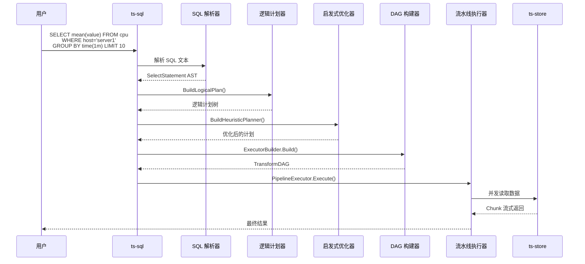
```mermaid
sequenceDiagram
    participant User as 用户
    participant SQL as ts-sql
    participant Parser as SQL 解析器
    participant Planner as 逻辑计划器
    participant Optimizer as 启发式优化器
    participant Builder as DAG 构建器
    participant Executor as 流水线执行器
    participant Store as ts-store

    User->>SQL: SELECT mean(value) FROM cpu<br/>WHERE host='server1'<br/>GROUP BY time(1m) LIMIT 10

    SQL->>Parser: 解析 SQL 文本
    Parser-->>SQL: SelectStatement AST

    SQL->>Planner: BuildLogicalPlan()
    Planner-->>SQL: 逻辑计划树

    SQL->>Optimizer: BuildHeuristicPlanner()
    Optimizer-->>SQL: 优化后的计划

    SQL->>Builder: ExecutorBuilder.Build()
    Builder-->>SQL: TransformDAG

    SQL->>Executor: PipelineExecutor.Execute()
    Executor->>Store: 并发读取数据
    Store-->>Executor: Chunk 流式返回
    Executor-->>User: 最终结果
```

**通俗解释**：
查询引擎就像"智能翻译官"。当你写一句 SQL 时，它会帮你翻译成机器能理解的指令：
1. **SQL 解析**：把你写的 SQL 文本翻译成结构化的 AST（抽象语法树）
2. **逻辑计划**：根据 AST 生成执行计划，决定怎么查数据
3. **优化**：优化执行计划，让查询更快
4. **DAG 构建**：把计划转换成可以并行执行的有向无环图
5. **执行**：按照 DAG 并行读取数据，返回结果

**核心代码**：`engine/executor/select.go` — 查询入口

```go
// 查询入口函数：编译、准备、启动执行
func Select(ctx context.Context, stmt *influxql.SelectStatement,
    shardMapper query.ShardMapper, opt query.SelectOptions) (hybridqp.Executor, error) {

    s, err := query.Prepare(stmt, shardMapper, opt)   // 预编译：映射 Shard
    if err != nil {
        return nil, err
    }
    // ... 构建逻辑计划（preparedStatement.BuildLogicalPlan）
    // ... 构建 DAG（ExecutorBuilder.Build）
    // ... 启动流水线执行（PipelineExecutor.Execute）
}
```

**逐行解释**：
- `query.Prepare(stmt, shardMapper, opt)`：预编译阶段，映射 Shard 到节点，创建 `preparedStatement`
- `preparedStatement.BuildLogicalPlan()`：构建逻辑计划 + 启发式优化
- `ExecutorBuilder.Build()`：把逻辑计划转换成 DAG
- `PipelineExecutor.Execute()`：并行执行 DAG 中的 Transform

**具体例子**：

假设用户执行：`SELECT mean(value) FROM cpu WHERE host='server1' GROUP BY time(1m) LIMIT 10`

```
步骤 1：SQL 解析
  输入：SELECT mean(value) FROM cpu WHERE host='server1' GROUP BY time(1m) LIMIT 10
  输出：SelectStatement AST
    - Fields: [mean(value)]
    - Sources: [cpu]
    - Condition: host='server1'
    - Dimensions: [time(1m)]
    - Limit: 10

步骤 2：构建逻辑计划
  输入：SelectStatement AST
  输出：逻辑计划树
    - FilterTransform (WHERE host='server1')
    - IntervalTransform (GROUP BY time(1m))
    - AggTransform (mean)
    - LimitTransform (LIMIT 10)

步骤 3：优化
  输入：逻辑计划树
  输出：优化后的计划
    - 谓词下推：把 WHERE 条件推到数据源
    - Limit 下推：把 LIMIT 推到数据源
    - 聚合下推：把部分聚合推到数据源

步骤 4：DAG 构建
  输入：优化后的计划
  输出：TransformDAG
    - 每个 Transform 一个 goroutine
    - 通过 Channel 连接
    - 批量处理数据

步骤 5：执行
  输入：TransformDAG
  输出：查询结果
    - 并发读取 3 个 shard 的数据
    - 流式返回 Chunk
    - 聚合计算 mean
    - 返回 10 行结果
```

---

## 2. 第一步：SQL 解析 — 文本变成 AST

### 2.1 解析时序图

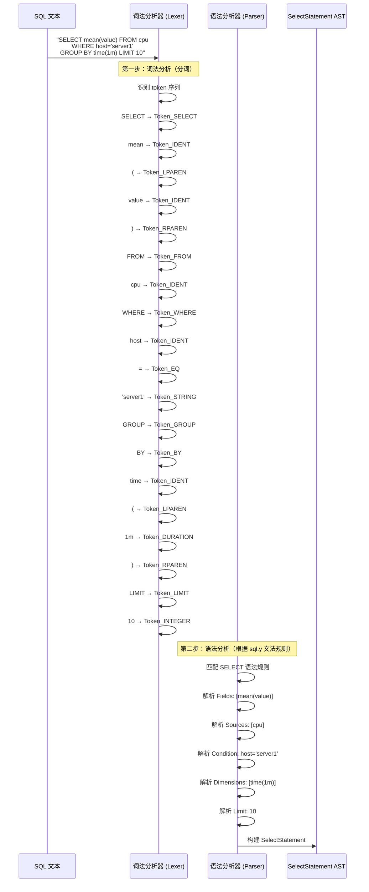
```mermaid
sequenceDiagram
    participant Input as SQL 文本
    participant Lexer as 词法分析器 (Lexer)
    participant Parser as 语法分析器 (Parser)
    participant AST as SelectStatement AST

    Input->>Lexer: "SELECT mean(value) FROM cpu<br/>WHERE host='server1'<br/>GROUP BY time(1m) LIMIT 10"

    Note over Lexer: 第一步：词法分析（分词）
    Lexer->>Lexer: 识别 token 序列
    Lexer->>Lexer: SELECT → Token_SELECT
    Lexer->>Lexer: mean → Token_IDENT
    Lexer->>Lexer: ( → Token_LPAREN
    Lexer->>Lexer: value → Token_IDENT
    Lexer->>Lexer: ) → Token_RPAREN
    Lexer->>Lexer: FROM → Token_FROM
    Lexer->>Lexer: cpu → Token_IDENT
    Lexer->>Lexer: WHERE → Token_WHERE
    Lexer->>Lexer: host → Token_IDENT
    Lexer->>Lexer: = → Token_EQ
    Lexer->>Lexer: 'server1' → Token_STRING
    Lexer->>Lexer: GROUP → Token_GROUP
    Lexer->>Lexer: BY → Token_BY
    Lexer->>Lexer: time → Token_IDENT
    Lexer->>Lexer: ( → Token_LPAREN
    Lexer->>Lexer: 1m → Token_DURATION
    Lexer->>Lexer: ) → Token_RPAREN
    Lexer->>Lexer: LIMIT → Token_LIMIT
    Lexer->>Lexer: 10 → Token_INTEGER

    Note over Parser: 第二步：语法分析（根据 sql.y 文法规则）
    Parser->>Parser: 匹配 SELECT 语法规则
    Parser->>Parser: 解析 Fields: [mean(value)]
    Parser->>Parser: 解析 Sources: [cpu]
    Parser->>Parser: 解析 Condition: host='server1'
    Parser->>Parser: 解析 Dimensions: [time(1m)]
    Parser->>Parser: 解析 Limit: 10

    Parser->>AST: 构建 SelectStatement
```

### 2.2 SelectStatement AST 结构详解

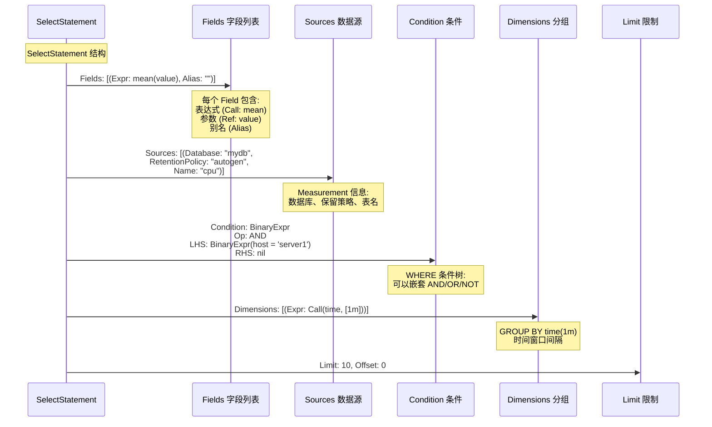
```mermaid
sequenceDiagram
    participant AST as SelectStatement
    participant Fields as Fields 字段列表
    participant Sources as Sources 数据源
    participant Where as Condition 条件
    participant Group as Dimensions 分组
    participant Limit as Limit 限制

    Note over AST: SelectStatement 结构
    AST->>Fields: Fields: [(Expr: mean(value), Alias: "")]
    Note over Fields: 每个 Field 包含:<br/>表达式 (Call: mean)<br/>参数 (Ref: value)<br/>别名 (Alias)

    AST->>Sources: Sources: [(Database: "mydb",<br/>RetentionPolicy: "autogen",<br/>Name: "cpu")]
    Note over Sources: Measurement 信息:<br/>数据库、保留策略、表名

    AST->>Where: Condition: BinaryExpr<br/>Op: AND<br/>LHS: BinaryExpr(host = 'server1')<br/>RHS: nil
    Note over Where: WHERE 条件树:<br/>可以嵌套 AND/OR/NOT

    AST->>Group: Dimensions: [(Expr: Call(time, [1m]))]
    Note over Group: GROUP BY time(1m)<br/>时间窗口间隔

    AST->>Limit: Limit: 10, Offset: 0
```

### 2.3 AST 节点类型

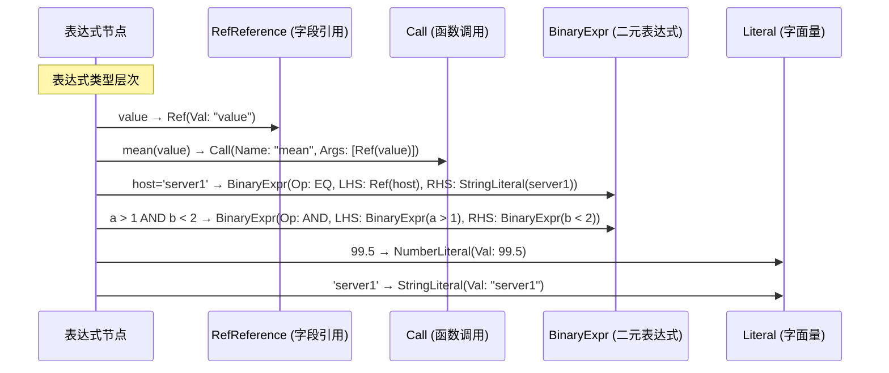
```mermaid
sequenceDiagram
    participant Expr as 表达式节点
    participant Ref as RefReference (字段引用)
    participant Call as Call (函数调用)
    participant Bin as BinaryExpr (二元表达式)
    participant Lit as Literal (字面量)

    Note over Expr: 表达式类型层次
    Expr->>Ref: value → Ref(Val: "value")
    Expr->>Call: mean(value) → Call(Name: "mean", Args: [Ref(value)])
    Expr->>Bin: host='server1' → BinaryExpr(Op: EQ, LHS: Ref(host), RHS: StringLiteral(server1))
    Expr->>Bin: a > 1 AND b < 2 → BinaryExpr(Op: AND, LHS: BinaryExpr(a > 1), RHS: BinaryExpr(b < 2))
    Expr->>Lit: 99.5 → NumberLiteral(Val: 99.5)
    Expr->>Lit: 'server1' → StringLiteral(Val: "server1")
```

**核心代码** `influxql/parser.go`：

```go
// 语法分析器（Parser）
// 注意：没有独立的 Lexer 结构体，词法扫描由 bufScanner 完成
type Parser struct {
    s      *bufScanner               // 带缓冲的扫描器（内部封装词法分析）
    params map[string]interface{}     // 绑定参数（用于参数化查询）
}

// 解析 SQL 文本，返回 *Query（包含多个 Statement），不是 *SelectStatement
func ParseQuery(s string) (*Query, error) {
    return NewParser(strings.NewReader(s)).ParseQuery()
}
```

**具体例子**：

解析 `SELECT mean(value) FROM cpu WHERE host='server1' GROUP BY time(1m) LIMIT 10`

```
步骤 1：词法分析（分词）
  输入：SELECT mean(value) FROM cpu WHERE host='server1' GROUP BY time(1m) LIMIT 10
  输出：[SELECT, mean, (, value, ), FROM, cpu, WHERE, host, =, 'server1', GROUP, BY, time, (, 1m, ), LIMIT, 10]

步骤 2：语法分析（构建 AST）
  输入：token 序列
  输出：SelectStatement
    - Fields: [mean(value)]
      - Field[0]:
        - Expr: Call{Name: "mean", Args: [Ref{Val: "value"}]}
        - Alias: ""
    - Sources: [cpu]
      - Source[0]: {Database: "mydb", RetentionPolicy: "autogen", Name: "cpu"}
    - Condition: BinaryExpr{Op: EQ, LHS: Ref{Val: "host"}, RHS: StringLiteral{Val: "server1"}}
    - Dimensions: [time(1m)]
      - Dimension[0]: Call{Name: "time", Args: [DurationLiteral{Val: 1m}]}
    - Limit: 10
    - Offset: 0
```

**通俗解释**：
SQL 解析就像"翻译外语"。当你写一句 SQL 时：
1. **词法分析**：把句子拆成单词（token）
   - "SELECT" → 关键字
   - "mean" → 函数名
   - "value" → 字段名
2. **语法分析**：根据语法规则，把单词组合成句子结构（AST）
   - "SELECT mean(value)" → 调用 mean 函数，参数是 value 字段
   - "FROM cpu" → 数据源是 cpu 表
   - "WHERE host='server1'" → 过滤条件：host 等于 server1

---

## 3. 第二步：构建逻辑计划

### 3.1 BuildLogicalPlan 时序图

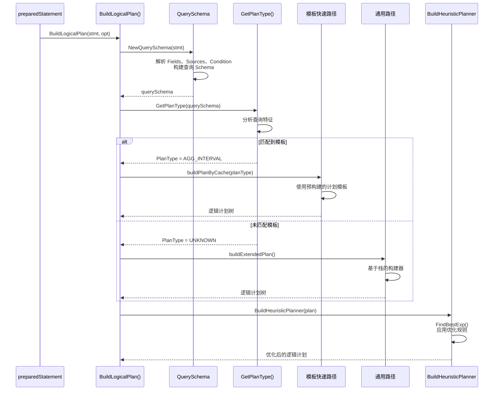
```mermaid
sequenceDiagram
    participant Select as preparedStatement
    participant Build as BuildLogicalPlan()
    participant Schema as QuerySchema
    participant Type as GetPlanType()
    participant Cache as 模板快速路径
    participant Extended as 通用路径
    participant Planner as BuildHeuristicPlanner

    Select->>Build: BuildLogicalPlan(stmt, opt)

    Build->>Schema: NewQuerySchema(stmt)
    Schema->>Schema: 解析 Fields、Sources、Condition<br/>构建查询 Schema
    Schema-->>Build: querySchema

    Build->>Type: GetPlanType(querySchema)
    Type->>Type: 分析查询特征

    alt 匹配到模板
        Type-->>Build: PlanType = AGG_INTERVAL
        Build->>Cache: buildPlanByCache(planType)
        Cache->>Cache: 使用预构建的计划模板
        Cache-->>Build: 逻辑计划树
    else 未匹配模板
        Type-->>Build: PlanType = UNKNOWN
        Build->>Extended: buildExtendedPlan()
        Extended->>Extended: 基于栈的构建器
        Extended-->>Build: 逻辑计划树
    end

    Build->>Planner: BuildHeuristicPlanner(plan)
    Planner->>Planner: FindBestExp()<br/>应用优化规则
    Planner-->>Build: 优化后的逻辑计划
```

**核心代码** `engine/executor/select.go:179-256`：

```go
func (p *preparedStatement) BuildLogicalPlan(ctx context.Context) (hybridqp.QueryNode, hybridqp.Trait, error) {
	if len(p.stmt.Fields) == 0 {
		return nil, nil, nil                        // 无字段，返回空
	}
	var mstsReqs []*MultiMstReqs = make([]*MultiMstReqs, 0)
	ctx = context.WithValue(ctx, NowKey, p.now)

	opt, ok := p.opt.(*query.ProcessorOptions)
	if !ok {
		return nil, mstsReqs, errors.New("preparedStatement Select p.opt isn't *query.ProcessorOptions type")
	}

	opt.EnableBinaryTreeMerge = sysconfig.GetEnableBinaryTreeMerge()

	rewriteVarfName(p.stmt.Fields)                 // 重写变量名

	// ===== 步骤 1: 构建 QuerySchema =====
	schema := NewQuerySchemaWithJoinCase(p.stmt.Fields, p.stmt.Sources, p.stmt.ColumnNames(), opt,
		p.stmt.JoinSource, p.stmt.UnionSource, p.stmt.UnnestSource, p.stmt.SortFields)
	schema.SetPromCalls(p.stmt.PromSubCalls)

	// ===== 步骤 2: 尝试匹配模板 =====
	HaveOnlyCSStore := schema.Sources().HaveOnlyCSStore()
	planType := GetPlanType(schema, p.stmt)         // 尝试匹配 6 种模板
	if planType != UNKNOWN {
		if p != nil && !HaveOnlyCSStore {
			var templatePlan []hybridqp.QueryNode
			if localStorageForQuery != nil {
				templatePlan = SqlPlanTemplate[planType].GetLocalStorePlan()
			} else {
				templatePlan = SqlPlanTemplate[planType].GetPlan()  // 获取预构建模板
			}
			schema.SetPlanType(planType)
			plan, err := p.buildPlanByCache(ctx, schema, templatePlan, &mstsReqs)
			return plan, mstsReqs, err              // 模板快速路径，直接返回
		}
	}

	// ===== 步骤 3: 通用路径 — 从头构建计划 =====
	plan, err := buildExtendedPlan(ctx, p.stmt, p.qc, schema)
	if err != nil {
		return nil, mstsReqs, err
	}

	// ===== 步骤 4: 启发式优化 =====
	planner := p.optimizer()
	planner.SetRoot(plan)
	best := planner.FindBestExp()                   // 应用优化规则

	// ===== 步骤 5: 列存优化 =====
	if HaveOnlyCSStore {
		if schema.Options().IsUnifyPlan() {
			if best.Schema().HasCall() {
				if !best.Schema().CanSeqAggPushDown() {
					best = ReplaceSortAggMergeWithHashAgg(best)[0]
					best = ReplaceSortMergeWithHashMerge(best)[0]
				}
			} else {
				best = ReplaceSortMergeWithHashMerge(best)[0]
			}
		} else {
			best = RebuildColumnStorePlan(best)[0]
			RebuildAggNodes(best)
			best = ReplaceSortAggWithHashAgg(best)[0]
		}
	}

	return best, mstsReqs, nil
}
```

**逐行解释**：
- `NewQuerySchemaWithJoinCase()`：把 AST 的 Fields、Sources、Condition 解析成 QuerySchema（查询 Schema）
- `GetPlanType(schema, p.stmt)`：尝试匹配 6 种模板（见 3.2 节）
- `planType != UNKNOWN`：匹配到模板，用预构建的计划，跳过复杂优化
- `buildExtendedPlan()`：通用路径，从头构建逻辑计划
- `planner.FindBestExp()`：启发式优化（谓词下推、列裁剪等）
- `ReplaceSortAggMergeWithHashAgg()`：列存专用优化，用 HashAgg 替代 SortAgg

### 3.2 GetPlanType — 6 种模板匹配

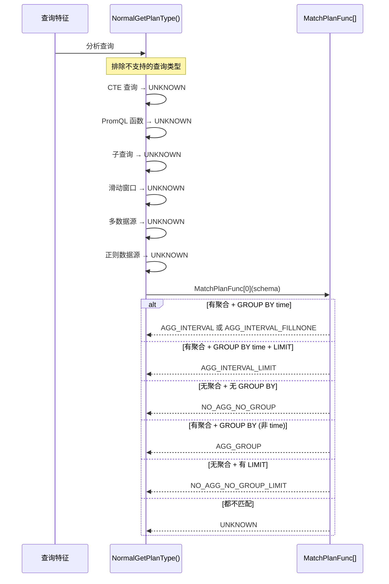
```mermaid
sequenceDiagram
    participant Query as 查询特征
    participant Type as NormalGetPlanType()
    participant Match as MatchPlanFunc[]

    Query->>Type: 分析查询

    Note over Type: 排除不支持的查询类型
    Type->>Type: CTE 查询 → UNKNOWN
    Type->>Type: PromQL 函数 → UNKNOWN
    Type->>Type: 子查询 → UNKNOWN
    Type->>Type: 滑动窗口 → UNKNOWN
    Type->>Type: 多数据源 → UNKNOWN
    Type->>Type: 正则数据源 → UNKNOWN

    Type->>Match: MatchPlanFunc[0](schema)
    alt 有聚合 + GROUP BY time
        Match-->>Type: AGG_INTERVAL 或 AGG_INTERVAL_FILLNONE
    else 有聚合 + GROUP BY time + LIMIT
        Match-->>Type: AGG_INTERVAL_LIMIT
    else 无聚合 + 无 GROUP BY
        Match-->>Type: NO_AGG_NO_GROUP
    else 有聚合 + GROUP BY (非 time)
        Match-->>Type: AGG_GROUP
    else 无聚合 + 有 LIMIT
        Match-->>Type: NO_AGG_NO_GROUP_LIMIT
    else 都不匹配
        Match-->>Type: UNKNOWN
    end
```

**核心代码** `engine/executor/plan_type.go:104-114`（PlanType 常量）：

```go
type PlanType uint32

const (
	AGG_INTERVAL          PlanType = iota  // 0: 聚合 + GROUP BY time
	AGG_INTERVAL_LIMIT                      // 1: 聚合 + GROUP BY time + LIMIT
	NO_AGG_NO_GROUP                         // 2: 无聚合 + 无 GROUP BY
	AGG_GROUP                               // 3: 聚合 + GROUP BY (非 time)
	NO_AGG_NO_GROUP_LIMIT                   // 4: 无聚合 + 有 LIMIT
	AGG_INTERVAL_FILLNONE                   // 5: 聚合 + GROUP BY time + FILL(none)
	UNKNOWN                                 // 6: 不匹配任何模板
)
```

**核心代码** `engine/executor/plan_type.go:174-237`（NormalGetPlanType 实现）：

```go
func NormalGetPlanType(schema hybridqp.Catalog, stmt *influxql.SelectStatement) PlanType {

	// ===== 排除不支持的查询类型 =====

	if stmt != nil && len(stmt.AllDependencyCTEs) > 0 {
		return UNKNOWN                             // CTE 查询不支持模板
	}

	hasPromCall := len(schema.GetPromCalls()) > 0
	isPromQuery := schema.Options().IsPromQuery()
	hasPromSortField := (len(schema.Options().GetSortFields()) > 0)
	if hasPromCall || (isPromQuery && hasPromSortField) || schema.HasInCondition() {
		return UNKNOWN                             // PromQL 查询不支持模板
	}

	hintType := schema.Options().GetHintType()
	if schema.HasSubQuery() || (hintType != hybridqp.DefaultNoHint && hintType != hybridqp.FullSeriesQuery) {
		return UNKNOWN                             // 子查询不支持模板
	}

	if schema.HasSlidingWindowCall() || schema.HasHoltWintersCall() || schema.HasBlankRowCall() {
		return UNKNOWN                             // 特殊算子不支持模板
	}

	if stmt != nil {
		if stmt.Target != nil {
			return UNKNOWN                         // 写入目标不支持模板
		}
		if m, rex := stmt.Sources[0].(*influxql.Measurement); rex {
			if m.Regex != nil {
				return UNKNOWN                     // 正则数据源不支持模板
			}
		}
	}

	if len(schema.Sources()) > 1 {
		return UNKNOWN                             // 多数据源不支持模板
	}

	if schema.Options().IsRangeVectorSelector() {
		return UNKNOWN                             // PromQL range vector 不支持模板
	}

	// ===== 尝试匹配模板 =====

	if typ := MatchPlanFunc[0](schema); typ != UNKNOWN {
		return typ                                 // 优先匹配 AGG_INTERVAL
	}

	if schema.Options().(*query.ProcessorOptions).Fill == influxql.NoFill {
		return UNKNOWN                             // 无 FILL 操作，后续模板不匹配
	}

	for i := 1; i < len(MatchPlanFunc); i++ {
		if typ := MatchPlanFunc[i](schema); typ != UNKNOWN {
			return typ                             // 匹配其他模板
		}
	}
	return UNKNOWN                                 // 都不匹配
}
```

**逐行解释**：
- 先排除所有不支持模板的查询类型（CTE、PromQL、子查询、特殊算子等）
- `MatchPlanFunc[0]`：优先匹配 AGG_INTERVAL（最常见的聚合+时间窗口查询）
- 如果 Fill == NoFill，后续模板不匹配（NoFill 是特殊处理）
- `MatchPlanFunc[1:]`：匹配其他模板类型
- 匹配到模板就返回对应 PlanType，否则返回 UNKNOWN

### 3.3 逻辑计划树示例

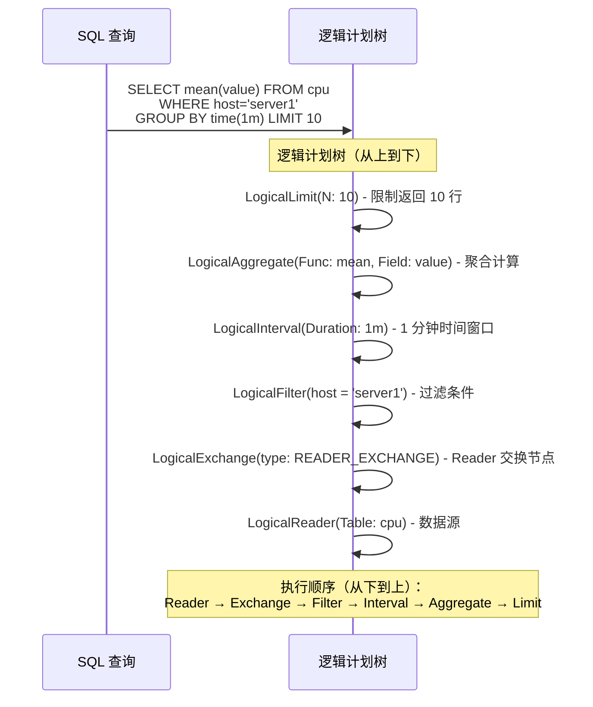
```mermaid
sequenceDiagram
    participant SQL as SQL 查询
    participant Tree as 逻辑计划树

    SQL->>Tree: SELECT mean(value) FROM cpu<br/>WHERE host='server1'<br/>GROUP BY time(1m) LIMIT 10

    Note over Tree: 逻辑计划树（从上到下）
    Tree->>Tree: LogicalLimit(N: 10) - 限制返回 10 行
    Tree->>Tree: LogicalAggregate(Func: mean, Field: value) - 聚合计算
    Tree->>Tree: LogicalInterval(Duration: 1m) - 1 分钟时间窗口
    Tree->>Tree: LogicalFilter(host = 'server1') - 过滤条件
    Tree->>Tree: LogicalExchange(type: READER_EXCHANGE) - Reader 交换节点
    Tree->>Tree: LogicalReader(Table: cpu) - 数据源

    Note over Tree: 执行顺序（从下到上）：<br/>Reader → Exchange → Filter → Interval → Aggregate → Limit
```

**核心代码** `engine/executor/logic_plan.go`（关键 LogicalPlan 结构）：

```go
// LogicalFilter — 过滤节点（lines 1102-1104）
type LogicalFilter struct {
	LogicalPlanSingle                            // 单输入节点
}

// LogicalInterval — 时间窗口分组节点（lines 1407-1409）
type LogicalInterval struct {
	LogicalPlanSingle
}

// LogicalLimit — 限制行数节点（lines 1038-1041）
type LogicalLimit struct {
	LimitPara LimitTransformParameters           // Limit 参数
	LogicalPlanSingle
}

// LogicalAggregate — 聚合节点（lines 549-557）
type LogicalAggregate struct {
	isCountDistinct      bool                     // 是否 COUNT(DISTINCT)
	isPercentileOGSketch bool                     // 是否 percentile OG sketch
	isPromNestedCall     bool                     // 是否 PromQL 嵌套调用
	aggType              int                      // 聚合类型
	calls                map[string]*influxql.Call // 聚合函数列表
	callsOrder           []string                 // 聚合函数顺序
	LogicalPlanSingle
}

// LogicalExchange — 交换节点（lines 2080-2093）
type LogicalExchange struct {
	LogicalPlanSingle
	LogicalExchangeBase                          // 嵌入 Exchange 基类
}

// LogicalExchangeBase — Exchange 基类（lines 4322-4326）
type LogicalExchangeBase struct {
	eType   ExchangeType                         // 交换类型（NODE/SHARD/READER/SERIES）
	eRole   ExchangeRole                         // 角色（CONSUMER/PRODUCER）
	eTraits []hybridqp.Trait                     // 交换特征
}
```

**逐行解释**：
- `LogicalPlanSingle`：单输入节点（大多数算子都是单输入）
- `LogicalAggregate`：聚合节点，包含聚合函数列表和特殊标记
- `LogicalExchange`：交换节点，是分布式查询的关键（不同粒度的数据交换）
- `LogicalExchangeBase`：Exchange 基类，包含交换类型和角色

### 3.4 ExchangeType — 8 种有效交换类型 + UNKNOWN

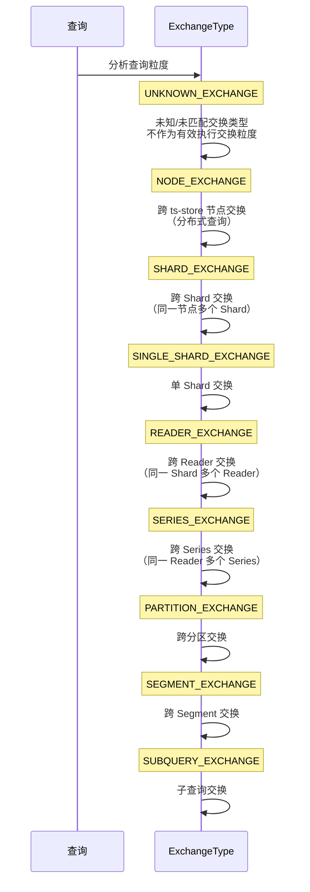
```mermaid
sequenceDiagram
    participant Query as 查询
    participant Exchange as ExchangeType

    Query->>Exchange: 分析查询粒度

    Note over Exchange: UNKNOWN_EXCHANGE
    Exchange->>Exchange: 未知/未匹配交换类型<br/>不作为有效执行交换粒度

    Note over Exchange: NODE_EXCHANGE
    Exchange->>Exchange: 跨 ts-store 节点交换<br/>（分布式查询）

    Note over Exchange: SHARD_EXCHANGE
    Exchange->>Exchange: 跨 Shard 交换<br/>（同一节点多个 Shard）

    Note over Exchange: SINGLE_SHARD_EXCHANGE
    Exchange->>Exchange: 单 Shard 交换

    Note over Exchange: READER_EXCHANGE
    Exchange->>Exchange: 跨 Reader 交换<br/>（同一 Shard 多个 Reader）

    Note over Exchange: SERIES_EXCHANGE
    Exchange->>Exchange: 跨 Series 交换<br/>（同一 Reader 多个 Series）

    Note over Exchange: PARTITION_EXCHANGE
    Exchange->>Exchange: 跨分区交换

    Note over Exchange: SEGMENT_EXCHANGE
    Exchange->>Exchange: 跨 Segment 交换

    Note over Exchange: SUBQUERY_EXCHANGE
    Exchange->>Exchange: 子查询交换
```

**核心代码** `engine/executor/logic_plan.go:2058-2070`：

```go
type ExchangeType uint8

const (
	UNKNOWN_EXCHANGE     ExchangeType = iota  // 0: 未知
	NODE_EXCHANGE                              // 1: 跨节点交换
	SHARD_EXCHANGE                             // 2: 跨 Shard 交换
	SINGLE_SHARD_EXCHANGE                      // 3: 单 Shard 交换
	READER_EXCHANGE                            // 4: 跨 Reader 交换
	SERIES_EXCHANGE                            // 5: 跨 Series 交换
	SEGMENT_EXCHANGE                           // 6: 跨 Segment 交换
	PARTITION_EXCHANGE                         // 7: 跨分区交换
	SUBQUERY_EXCHANGE                          // 8: 子查询交换
)
```

**逐行解释**：
- `UNKNOWN_EXCHANGE`：哨兵值，表示未匹配或不需要 Exchange；不计入有效交换类型
- `NODE_EXCHANGE`：最高层交换，跨 ts-store 节点（分布式查询的核心）
- `SHARD_EXCHANGE`：同一节点内，跨 Shard 交换
- `SINGLE_SHARD_EXCHANGE`：单 Shard 场景下的交换标记
- `READER_EXCHANGE`：同一 Shard 内，跨 Reader 交换（每个 Reader 读一个 TSSP 文件）
- `SERIES_EXCHANGE`：同一 Reader 内，跨 Series 交换
- `SEGMENT_EXCHANGE` / `PARTITION_EXCHANGE`：更细粒度的数据段/分区交换
- `SUBQUERY_EXCHANGE`：子查询计划中的交换
- 当前代码中共有 9 个枚举值，其中 8 个是有效交换类型，另有 `UNKNOWN_EXCHANGE` 作为未知/未使用状态
- 层级关系常见为：NODE > SHARD > READER > SERIES，其他类型用于特定执行路径

---

## 4. 第三步：启发式优化

### 4.1 优化时序图

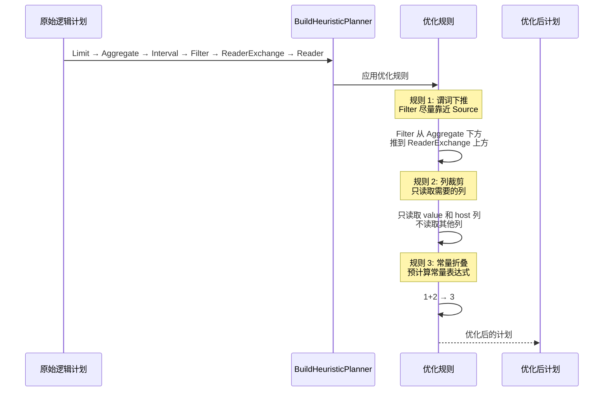
```mermaid
sequenceDiagram
    participant Input as 原始逻辑计划
    participant Planner as BuildHeuristicPlanner
    participant Rules as 优化规则
    participant Output as 优化后计划

    Input->>Planner: Limit → Aggregate → Interval → Filter → ReaderExchange → Reader

    Planner->>Rules: 应用优化规则

    Note over Rules: 规则 1: 谓词下推<br/>Filter 尽量靠近 Source
    Rules->>Rules: Filter 从 Aggregate 下方<br/>推到 ReaderExchange 上方

    Note over Rules: 规则 2: 列裁剪<br/>只读取需要的列
    Rules->>Rules: 只读取 value 和 host 列<br/>不读取其他列

    Note over Rules: 规则 3: 常量折叠<br/>预计算常量表达式
    Rules->>Rules: 1+2 → 3

    Rules-->>Output: 优化后的计划
```

### 4.2 核心代码：HeuPlannerImpl.FindBestExp() — 优化入口

**代码位置**：`engine/executor/heu_planner.go:596-601`

```go
func (p *HeuPlannerImpl) FindBestExp() hybridqp.QueryNode {
    p.executeProgram(p.mainProgram)   // 执行所有优化规则
    final := p.buildFinalPlan(p.root) // 从 DAG 构建最终计划
    hybridqp.WalkQueryNodeInPostOrder(p, final) // 后序遍历，分配节点 ID
    return final
}
```

**逐行解释**：
- `p.executeProgram(p.mainProgram)`：执行主优化程序，遍历 DAG 中每个节点，尝试匹配并应用优化规则
- `p.buildFinalPlan(p.root)`：从优化后的 DAG 根节点构建最终的逻辑计划树
- `hybridqp.WalkQueryNodeInPostOrder(p, final)`：后序遍历计划树，为每个节点分配唯一 ID

### 4.3 核心代码：applyRules() — 规则应用的不动点循环

**代码位置**：`engine/executor/heu_planner.go:649-696`

```go
func (p *HeuPlannerImpl) applyRules(ruleSet RuleSet) {
    for {
        iter := p.dag.GetGraphIterator(p.root, p.currentProgram.matchOrder)
        fixedPoint = true  // 假设达到不动点
        for {
            vertex, nodes := iter.Next()
            if vertex == nil { break }
            for rule := range ruleSet {
                newVertex := p.applyRule(rule, vertex, nodes)
                if newVertex != nil {
                    fixedPoint = false  // 有规则匹配，继续循环
                }
            }
        }
        if fixedPoint { break }  // 没有规则匹配，达到不动点
    }
}
```

**逐行解释**：
- 外层 `for` 循环：反复遍历 DAG，直到没有规则可以匹配（不动点）
- `iter.Next()`：按匹配顺序（深度优先或任意）遍历 DAG 中的每个节点
- `p.applyRule(rule, vertex, nodes)`：尝试将规则应用到当前节点，如果匹配则返回新的节点
- `fixedPoint = false`：只要有规则匹配成功，就需要重新遍历（因为新节点可能触发更多优化）
- `if fixedPoint { break }`：所有规则都不匹配，优化完成

### 4.4 已注册的优化规则

**代码位置**：`engine/executor/heu_planner.go:948-995`

```go
func initSqlHeuInstruction() {
    // 谓词下推：将 WHERE 条件推到数据源附近
    RULE_SUBQUERY
    RULE_PUSHDOWN_LIMIT    // LIMIT 下推：尽早丢弃不需要的数据
    RULE_PUSHDOWN_AGG      // 聚合下推：在数据源侧先做局部聚合
    RULE_SPREAD_AGG        // 聚合展开：将全局聚合拆分为 局部聚合 + 最终聚合
    RULE_HEIMADLL_PUSHDOWN // HAVING 下推
    RULE_PUSHDOWN_DISTINCT // DISTINCT 下推
}
```

**通俗解释**：
- **谓词下推**（最常用）：把 `WHERE host='server1'` 从最顶层推到数据源附近，这样在读数据时就过滤掉不匹配的行，减少后续处理的数据量
- **LIMIT 下推**：把 `LIMIT 10` 推到数据源侧，每个节点只返回 10 条，最后合并时再取 Top 10
- **聚合下推**：把聚合计算推到数据源侧先做局部状态。`mean(value)` 不能简单地对多个局部 mean 再求 mean，真实语义需要携带 `sum/count` 中间态，最终按 `sum(sum) / sum(count)` 加权合并。
- **聚合展开**：将 `COUNT(*)` 拆分为每个节点的 `COUNT(*)` + 汇总节点的 `SUM(count)`

### 4.5 具体例子：优化前后的计划对比

假设查询：`SELECT mean(value) FROM cpu WHERE host='server1' GROUP BY time(1m) LIMIT 10`

**优化前的逻辑计划**（从上到下）：
```
Limit(10)
  └── Aggregate(mean(value))
        └── Interval(1m)
              └── Filter(host='server1')
                    └── ReaderExchange
                          └── Reader(cpu)
```

**优化后的逻辑计划**（谓词下推 + LIMIT 下推）：
```
Limit(10)
  └── Aggregate(mean(value))        ← 聚合下推：局部 sum/count 中间态
        └── Interval(1m)
              └── ReaderExchange
                    └── Filter(host='server1')  ← Filter 下推到数据源
                          └── Reader(cpu)
```

**关键变化**：
- `Filter(host='server1')` 从 `Interval` 下方推到了 `ReaderExchange` 下方（靠近数据源）
- 这样每个 ts-store 节点在读数据时就过滤掉 `host != 'server1'` 的行，减少网络传输和后续处理的数据量

**通俗解释**：
想象你去图书馆找书。优化前：先把所有书搬到办公室，再挑出你要的。优化后：在图书馆里就挑出你要的，只搬回需要的书。谓词下推就是这个"在源头就过滤"的思想。

---

## 5. 第四步：DAG 构建 — 逻辑计划变成执行图

### 5.1 ExecutorBuilder.Build 时序图

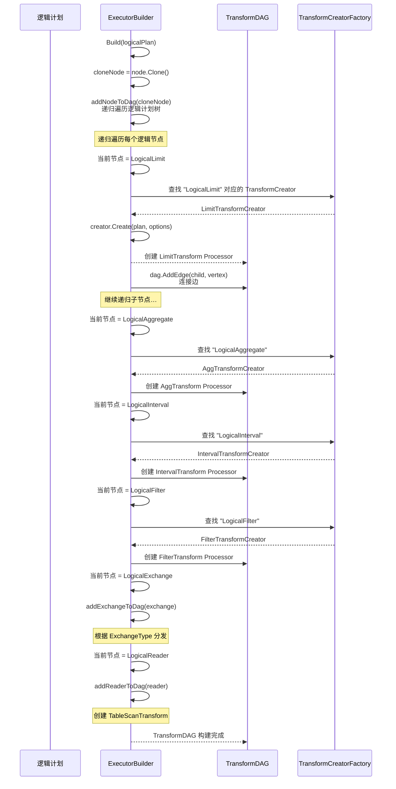
```mermaid
sequenceDiagram
    participant Input as 逻辑计划
    participant Builder as ExecutorBuilder
    participant DAG as TransformDAG
    participant Factory as TransformCreatorFactory

    Builder->>Builder: Build(logicalPlan)
    Builder->>Builder: cloneNode = node.Clone()
    Builder->>Builder: addNodeToDag(cloneNode)<br/>递归遍历逻辑计划树

    Note over Builder: 递归遍历每个逻辑节点
    Builder->>Builder: 当前节点 = LogicalLimit

    Builder->>Factory: 查找 "LogicalLimit" 对应的 TransformCreator
    Factory-->>Builder: LimitTransformCreator

    Builder->>Builder: creator.Create(plan, options)
    Builder-->>DAG: 创建 LimitTransform Processor

    Builder->>DAG: dag.AddEdge(child, vertex)<br/>连接边

    Note over Builder: 继续递归子节点…
    Builder->>Builder: 当前节点 = LogicalAggregate
    Builder->>Factory: 查找 "LogicalAggregate"
    Factory-->>Builder: AggTransformCreator
    Builder->>DAG: 创建 AggTransform Processor

    Builder->>Builder: 当前节点 = LogicalInterval
    Builder->>Factory: 查找 "LogicalInterval"
    Factory-->>Builder: IntervalTransformCreator
    Builder->>DAG: 创建 IntervalTransform Processor

    Builder->>Builder: 当前节点 = LogicalFilter
    Builder->>Factory: 查找 "LogicalFilter"
    Factory-->>Builder: FilterTransformCreator
    Builder->>DAG: 创建 FilterTransform Processor

    Builder->>Builder: 当前节点 = LogicalExchange
    Builder->>Builder: addExchangeToDag(exchange)
    Note over Builder: 根据 ExchangeType 分发

    Builder->>Builder: 当前节点 = LogicalReader
    Builder->>Builder: addReaderToDag(reader)
    Note over Builder: 创建 TableScanTransform

    Builder-->>DAG: TransformDAG 构建完成
```

**核心代码** `engine/executor/pipeline_executor.go:524-545`（ExecutorBuilder 结构）：

```go
type ExecutorBuilder struct {
	dag                         *TransformDag          // DAG 图
	root                        *TransformVertex       // DAG 根节点
	multiMstTraitsForLocalStore []*StoreExchangeTraits // 多 measurement 交换特征
	multiMstInfosForLocalStore  []*IndexScanExtraInfo  // 多 measurement 索引信息
	mstIndex                    int
	infoIndex                   int
	traits                      *StoreExchangeTraits
	csTraits                    *CsStoreExchangeTraits // 列存交换特征
	frags                       *ShardsFragmentsGroups // Shard 片段组
	indexInfo                   interface{}
	currConsumer                int

	enableBinaryTreeMerge int64                      // 是否启用二叉树合并
	info                  *IndexScanExtraInfo

	parallelismLimiter chan struct{}                  // 并行度限制器

	span           *tracing.Span
	oneReaderState bool
	oneShardState  bool
}
```

**核心代码** `engine/executor/pipeline_executor.go:667-678`（Build 方法）：

```go
func (builder *ExecutorBuilder) Build(node hybridqp.QueryNode) (hybridqp.Executor, error) {
	if node == nil {
		return nil, nil
	}
	var err error
	cloneNode := node.Clone()                      // 克隆逻辑计划（避免修改原计划）
	builder.root, err = builder.addNodeToDag(cloneNode)  // 递归构建 DAG

	builder.buildAnalyze()                          // 构建分析信息

	return NewPipelineExecutorFromDag(builder.dag, builder.root), err  // 创建流水线执行器
}
```

**逐行解释**：
- `node.Clone()`：克隆逻辑计划，避免修改原计划（不可变性）
- `addNodeToDag(cloneNode)`：递归遍历逻辑计划树，为每个节点创建对应的 Transform
- `NewPipelineExecutorFromDag()`：从 DAG 创建流水线执行器

**具体例子**：

假设逻辑计划树如下：

```
逻辑计划树：
  LimitTransform (LIMIT 10)
    └── AggTransform (mean)
        └── IntervalTransform (GROUP BY time(1m))
            └── FilterTransform (WHERE host='server1')
                └── TableScanTransform (读取 cpu 表)
```

DAG 构建过程：

```
步骤 1：克隆逻辑计划
  cloneNode = LimitTransform.Clone()

步骤 2：递归构建 DAG
  → 处理 LimitTransform
    → 查找 "LogicalLimit" → LimitTransformCreator
    → 创建 LimitTransform Processor
    → dag.AddEdge(root, limitVertex)

  → 处理 AggTransform
    → 查找 "LogicalAggregate" → AggTransformCreator
    → 创建 AggTransform Processor
    → dag.AddEdge(limitVertex, aggVertex)

  → 处理 IntervalTransform
    → 查找 "LogicalInterval" → IntervalTransformCreator
    → 创建 IntervalTransform Processor
    → dag.AddEdge(aggVertex, intervalVertex)

  → 处理 FilterTransform
    → 查找 "LogicalFilter" → FilterTransformCreator
    → 创建 FilterTransform Processor
    → dag.AddEdge(intervalVertex, filterVertex)

  → 处理 TableScanTransform
    → 查找 "LogicalReader" → TableScanTransformCreator
    → 创建 TableScanTransform Processor
    → dag.AddEdge(filterVertex, scanVertex)

步骤 3：创建流水线执行器
  → NewPipelineExecutorFromDag(dag, root)
  → 从 LimitTransform 开始执行
```

**通俗解释**：
DAG 构建就像"搭建流水线"。把逻辑计划转换成可以并行执行的流水线：
1. **LimitTransform**：最后一个工序，只保留 10 个结果
2. **AggTransform**：计算平均值
3. **IntervalTransform**：按 1 分钟窗口分组
4. **FilterTransform**：过滤 host=server1 的数据
5. **TableScanTransform**：从磁盘读取数据

每个工序（Transform）是一个独立的 goroutine，通过 Channel 连接，实现并行处理！

### 5.2 addNodeToDag — 递归构建 DAG

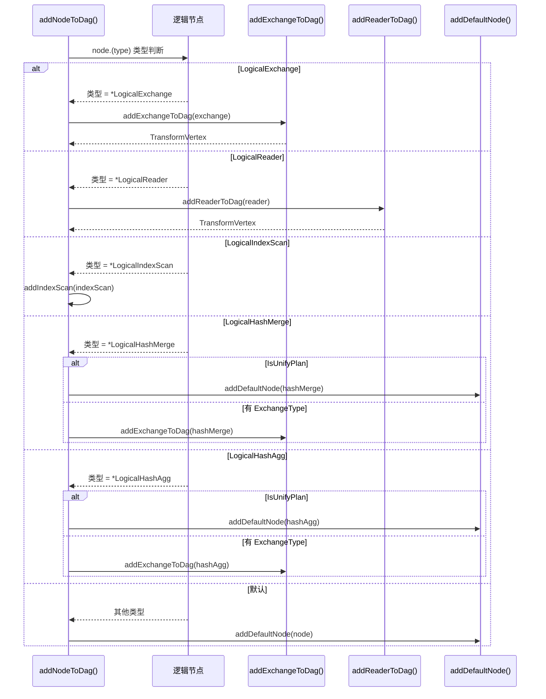
```mermaid
sequenceDiagram
    participant Builder as addNodeToDag()
    participant Node as 逻辑节点
    participant Exchange as addExchangeToDag()
    participant Reader as addReaderToDag()
    participant Default as addDefaultNode()

    Builder->>Node: node.(type) 类型判断

    alt LogicalExchange
        Node-->>Builder: 类型 = *LogicalExchange
        Builder->>Exchange: addExchangeToDag(exchange)
        Exchange-->>Builder: TransformVertex
    else LogicalReader
        Node-->>Builder: 类型 = *LogicalReader
        Builder->>Reader: addReaderToDag(reader)
        Reader-->>Builder: TransformVertex
    else LogicalIndexScan
        Node-->>Builder: 类型 = *LogicalIndexScan
        Builder->>Builder: addIndexScan(indexScan)
    else LogicalHashMerge
        Node-->>Builder: 类型 = *LogicalHashMerge
        alt IsUnifyPlan
            Builder->>Default: addDefaultNode(hashMerge)
        else 有 ExchangeType
            Builder->>Exchange: addExchangeToDag(hashMerge)
        end
    else LogicalHashAgg
        Node-->>Builder: 类型 = *LogicalHashAgg
        alt IsUnifyPlan
            Builder->>Default: addDefaultNode(hashAgg)
        else 有 ExchangeType
            Builder->>Exchange: addExchangeToDag(hashAgg)
        end
    else 默认
        Node-->>Builder: 其他类型
        Builder->>Default: addDefaultNode(node)
    end
```

**核心代码** `engine/executor/pipeline_executor.go:1521-1554`：

```go
func (builder *ExecutorBuilder) addNodeToDag(node hybridqp.QueryNode) (*TransformVertex, error) {
	switch n := node.(type) {
	case *LogicalExchange:
		return builder.addExchangeToDag(n.Clone().(*LogicalExchange))  // Exchange 节点
	case *LogicalReader:
		return builder.addReaderToDag(n)                               // Reader 节点
	case *LogicalIndexScan:
		return builder.addIndexScan(n)                                 // 索引扫描节点
	case *LogicalSparseIndexScan:
		return builder.addSparseIndexScan(n)                           // 稀疏索引扫描
	case *LogicalHashMerge:
		if !n.schema.Options().IsUnifyPlan() {
			return builder.addHashMerge(n.Clone().(*LogicalHashMerge)) // Hash 合并
		}
		if n.eType != UNKNOWN_EXCHANGE {
			return builder.addExchangeToDag(n.Clone().(*LogicalHashMerge))  // 作为 Exchange
		}
		return builder.addDefaultNode(n.Clone())                       // 默认处理
	case *LogicalHashAgg:
		if !n.schema.Options().IsUnifyPlan() {
			return builder.addHashAgg(n.Clone().(*LogicalHashAgg))     // Hash 聚合
		}
		if n.eType != UNKNOWN_EXCHANGE {
			return builder.addExchangeToDag(n.Clone().(*LogicalHashAgg))  // 作为 Exchange
		}
		return builder.addDefaultNode(n.Clone())                       // 默认处理
	case *LogicalColumnStoreReader:
		return builder.addColStoreReader(n.Clone().(*LogicalColumnStoreReader))  // 列存读取
	case *LogicalTableFunction:
		return builder.addDefaultNode(n.Clone().(*LogicalTableFunction))  // 表函数
	default:
		return builder.addDefaultNode(n.Clone())                       // 默认处理
	}
}
```

**逐行解释**：
- `switch n := node.(type)`：Go 类型断言，根据逻辑节点类型分发
- `*LogicalExchange`：Exchange 节点，调用 `addExchangeToDag` 处理（见 5.3 节）
- `*LogicalReader`：Reader 节点，创建 TableScanTransform
- `*LogicalHashMerge`/`*LogicalHashAgg`：根据是否 UnifyPlan 和 ExchangeType 决定处理方式
- `default`：其他节点类型，调用 `addDefaultNode`（通过 TransformCreatorFactory 查找 Creator）

### 5.3 addExchangeToDag — 分布式交换构建

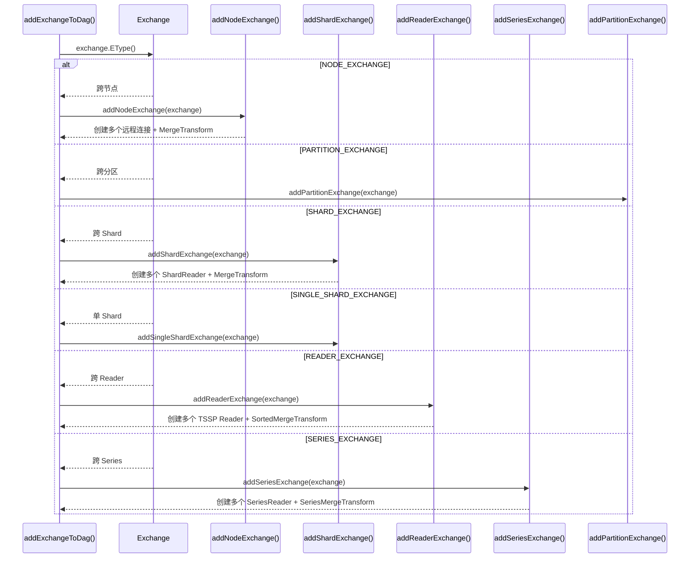
```mermaid
sequenceDiagram
    participant Builder as addExchangeToDag()
    participant Exchange as Exchange
    participant Node as addNodeExchange()
    participant Shard as addShardExchange()
    participant Reader as addReaderExchange()
    participant Series as addSeriesExchange()
    participant Partition as addPartitionExchange()

    Builder->>Exchange: exchange.EType()

    alt NODE_EXCHANGE
        Exchange-->>Builder: 跨节点
        Builder->>Node: addNodeExchange(exchange)
        Node-->>Builder: 创建多个远程连接 + MergeTransform
    else PARTITION_EXCHANGE
        Exchange-->>Builder: 跨分区
        Builder->>Partition: addPartitionExchange(exchange)
    else SHARD_EXCHANGE
        Exchange-->>Builder: 跨 Shard
        Builder->>Shard: addShardExchange(exchange)
        Shard-->>Builder: 创建多个 ShardReader + MergeTransform
    else SINGLE_SHARD_EXCHANGE
        Exchange-->>Builder: 单 Shard
        Builder->>Shard: addSingleShardExchange(exchange)
    else READER_EXCHANGE
        Exchange-->>Builder: 跨 Reader
        Builder->>Reader: addReaderExchange(exchange)
        Reader-->>Builder: 创建多个 TSSP Reader + SortedMergeTransform
    else SERIES_EXCHANGE
        Exchange-->>Builder: 跨 Series
        Builder->>Series: addSeriesExchange(exchange)
        Series-->>Builder: 创建多个 SeriesReader + SeriesMergeTransform
    end
```

**核心代码** `engine/executor/pipeline_executor.go:1328-1345`：

```go
func (builder *ExecutorBuilder) addExchangeToDag(exchange Exchange) (*TransformVertex, error) {
	switch exchange.EType() {
	case NODE_EXCHANGE:
		return builder.addNodeExchange(exchange)           // 跨节点交换
	case PARTITION_EXCHANGE:
		return builder.addPartitionExchange(exchange)      // 跨分区交换
	case SHARD_EXCHANGE:
		return builder.addShardExchange(exchange)          // 跨 Shard 交换
	case SINGLE_SHARD_EXCHANGE:
		return builder.addSingleShardExchange(exchange)    // 单 Shard 交换
	case READER_EXCHANGE:
		return builder.addReaderExchange(exchange)         // 跨 Reader 交换
	case SERIES_EXCHANGE:
		return builder.addSeriesExchange(exchange)         // 跨 Series 交换
	default:
		return nil, errno.NewError(errno.LogicalPlanBuildFail, "unknown exchange type")
	}
}
```

**逐行解释**：
- 根据 ExchangeType 分发到不同的构建方法
- `addNodeExchange`：创建多个远程连接（到其他 ts-store 节点），加 MergeTransform
- `addShardExchange`：创建多个 ShardReader（同一节点不同 Shard），加 MergeTransform
- `addReaderExchange`：创建多个 TSSP Reader（同一 Shard 不同文件），加 SortedMergeTransform
- `addSeriesExchange`：创建多个 SeriesReader，加 SeriesMergeTransform

### 5.4 TransformCreatorFactory — Transform 注册表

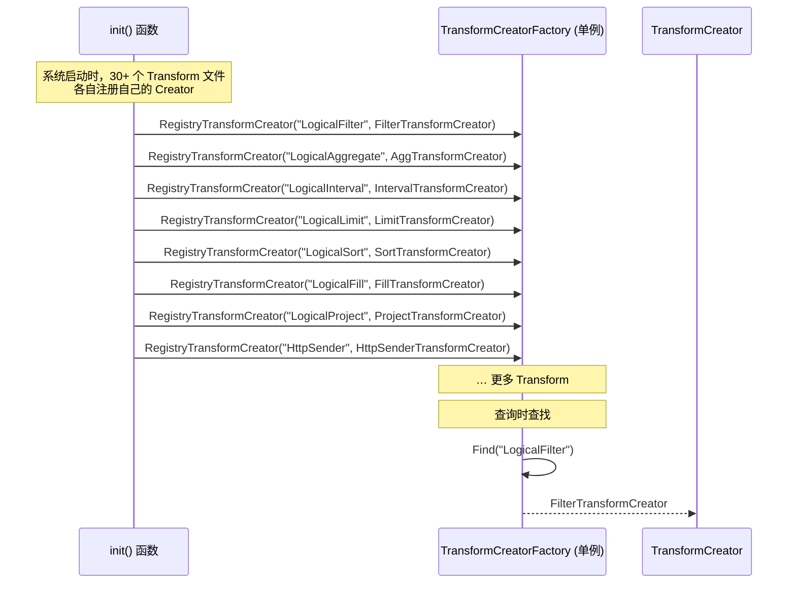
```mermaid
sequenceDiagram
    participant Init as init() 函数
    participant Factory as TransformCreatorFactory (单例)
    participant Creator as TransformCreator

    Note over Init: 系统启动时，30+ 个 Transform 文件<br/>各自注册自己的 Creator

    Init->>Factory: RegistryTransformCreator("LogicalFilter", FilterTransformCreator)
    Init->>Factory: RegistryTransformCreator("LogicalAggregate", AggTransformCreator)
    Init->>Factory: RegistryTransformCreator("LogicalInterval", IntervalTransformCreator)
    Init->>Factory: RegistryTransformCreator("LogicalLimit", LimitTransformCreator)
    Init->>Factory: RegistryTransformCreator("LogicalSort", SortTransformCreator)
    Init->>Factory: RegistryTransformCreator("LogicalFill", FillTransformCreator)
    Init->>Factory: RegistryTransformCreator("LogicalProject", ProjectTransformCreator)
    Init->>Factory: RegistryTransformCreator("HttpSender", HttpSenderTransformCreator)
    Note over Factory: … 更多 Transform

    Note over Factory: 查询时查找
    Factory->>Factory: Find("LogicalFilter")
    Factory-->>Creator: FilterTransformCreator
```

**核心代码** `engine/executor/dag.go:424-467`：

```go
// TransformCreator 接口：每个 Transform 实现这个接口
type TransformCreator interface {
	Create(LogicalPlan, *query.ProcessorOptions) (Processor, error)
}

// RegistryTransformCreator 注册 Transform Creator
func RegistryTransformCreator(plan LogicalPlan, creator TransformCreator) bool {
	factory := GetTransformFactoryInstance()     // 获取单例工厂
	name := plan.String()                        // 获取逻辑计划名称（如 "LogicalFilter"）

	_, ok := factory.Find(name)                  // 检查是否已注册

	factory.Add(name, creator)                   // 注册（覆盖已有的）

	return ok                                    // 返回是否已注册
}

// TransformCreatorFactory 工厂（单例）
type TransformCreatorFactory struct {
	creators map[string]TransformCreator          // 名称 → Creator 映射
}

func (r *TransformCreatorFactory) Add(name string, creator TransformCreator) {
	r.creators[name] = creator                   // 添加 Creator
}

func (r *TransformCreatorFactory) Find(name string) (TransformCreator, bool) {
	creator, ok := r.creators[name]              // 查找 Creator
	return creator, ok
}

// 单例模式
var instance *TransformCreatorFactory
var once sync.Once

func GetTransformFactoryInstance() *TransformCreatorFactory {
	once.Do(func() {
		instance = NewTransformCreatorFactory()   // 只创建一次
	})
	return instance
}
```

**逐行解释**：
- `TransformCreator` 接口：每个 Transform 类型实现这个接口，提供 `Create` 方法
- `RegistryTransformCreator`：注册函数，系统启动时每个 Transform 文件调用一次
- `plan.String()`：获取逻辑计划的名称（如 "LogicalFilter"），作为注册的 key
- `GetTransformFactoryInstance()`：单例模式，全局只有一个工厂实例
- 查询时通过 `Find(name)` 查找对应的 Creator，调用 `Create` 创建 Transform 实例

### 5.5 完整 DAG 构建示例

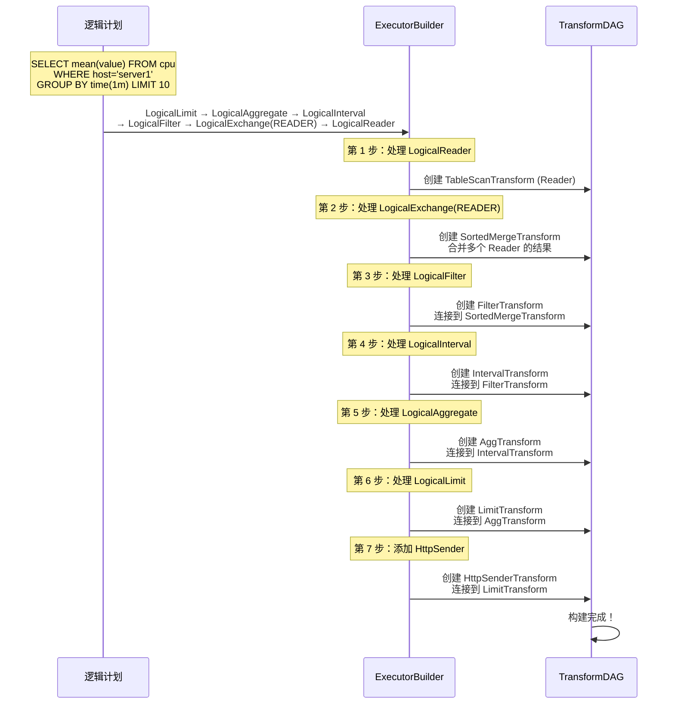
```mermaid
sequenceDiagram
    participant Plan as 逻辑计划
    participant Builder as ExecutorBuilder
    participant DAG as TransformDAG

    Note over Plan: SELECT mean(value) FROM cpu<br/>WHERE host='server1'<br/>GROUP BY time(1m) LIMIT 10

    Plan->>Builder: LogicalLimit → LogicalAggregate → LogicalInterval<br/>→ LogicalFilter → LogicalExchange(READER) → LogicalReader

    Note over Builder: 第 1 步：处理 LogicalReader
    Builder->>DAG: 创建 TableScanTransform (Reader)

    Note over Builder: 第 2 步：处理 LogicalExchange(READER)
    Builder->>DAG: 创建 SortedMergeTransform<br/>合并多个 Reader 的结果

    Note over Builder: 第 3 步：处理 LogicalFilter
    Builder->>DAG: 创建 FilterTransform<br/>连接到 SortedMergeTransform

    Note over Builder: 第 4 步：处理 LogicalInterval
    Builder->>DAG: 创建 IntervalTransform<br/>连接到 FilterTransform

    Note over Builder: 第 5 步：处理 LogicalAggregate
    Builder->>DAG: 创建 AggTransform<br/>连接到 IntervalTransform

    Note over Builder: 第 6 步：处理 LogicalLimit
    Builder->>DAG: 创建 LimitTransform<br/>连接到 AggTransform

    Note over Builder: 第 7 步：添加 HttpSender
    Builder->>DAG: 创建 HttpSenderTransform<br/>连接到 LimitTransform

    DAG->>DAG: 构建完成！
```

---

## 6. 第五步：Transform 详解 — 每个节点干啥的

### 6.1 Transform 总览

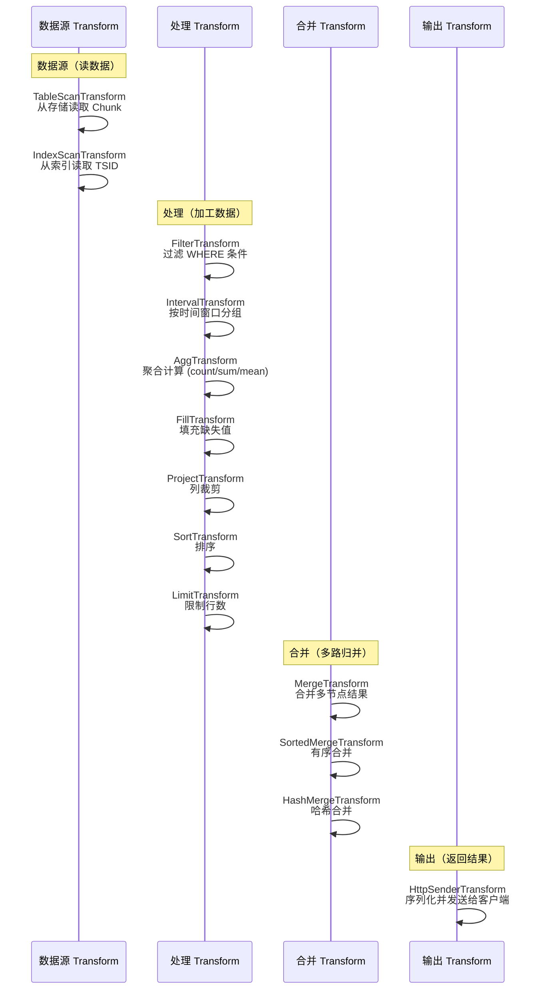
```mermaid
sequenceDiagram
    participant Source as 数据源 Transform
    participant Process as 处理 Transform
    participant Merge as 合并 Transform
    participant Output as 输出 Transform

    Note over Source: 数据源（读数据）
    Source->>Source: TableScanTransform<br/>从存储读取 Chunk
    Source->>Source: IndexScanTransform<br/>从索引读取 TSID

    Note over Process: 处理（加工数据）
    Process->>Process: FilterTransform<br/>过滤 WHERE 条件
    Process->>Process: IntervalTransform<br/>按时间窗口分组
    Process->>Process: AggTransform<br/>聚合计算 (count/sum/mean)
    Process->>Process: FillTransform<br/>填充缺失值
    Process->>Process: ProjectTransform<br/>列裁剪
    Process->>Process: SortTransform<br/>排序
    Process->>Process: LimitTransform<br/>限制行数

    Note over Merge: 合并（多路归并）
    Merge->>Merge: MergeTransform<br/>合并多节点结果
    Merge->>Merge: SortedMergeTransform<br/>有序合并
    Merge->>Merge: HashMergeTransform<br/>哈希合并

    Note over Output: 输出（返回结果）
    Output->>Output: HttpSenderTransform<br/>序列化并发送给客户端
```

### 6.2 核心代码：Processor 接口 — 所有 Transform 的基类

**代码位置**：`engine/executor/processor.go:151-168`

```go
type Processor interface {
    Work(ctx context.Context) error  // 核心执行方法，每个 Transform 实现自己的逻辑
    Close()                          // 关闭处理器，释放资源
    Abort()                          // 中止执行
    Release() error                  // 释放内存
    Name() string                    // 返回处理器名称（用于日志和调试）
    GetOutputs() Ports               // 获取输出端口列表
    GetInputs() Ports                // 获取输入端口列表
    GetOutputNumber(port Port) int   // 获取输出端口号
    GetInputNumber(port Port) int    // 获取输入端口号
    IsSink() bool                    // 是否是终点节点（无输出）
    Explain() []ValuePair            // 返回执行计划信息
    Analyze(span *tracing.Span)      // 性能分析
    StartSpan(name string, withPP bool) *tracing.Span  // 开始追踪 span
    FinishSpan()                     // 结束追踪 span
    Interrupt()                      // 中断执行（标记中断）
    InterruptWithoutMark()           // 中断执行（不标记）
}
```

**通俗解释**：
- 每个 Transform 都是一个 `Processor`，像流水线上的一个工人
- `Work()` 是工人的核心工作：从输入端口取数据，处理后放到输出端口
- `GetInputs()` 和 `GetOutputs()` 定义了工人的"进料口"和"出料口"
- Transform 之间通过 `ChunkPort`（Channel）连接，实现流水线

### 6.3 核心代码：FilterTransform — WHERE 条件过滤

**代码位置**：`engine/executor/filter_transform.go:28-45`

```go
type FilterTransform struct {
    BaseProcessor

    Input           *ChunkPort                  // 输入端口：接收上游传来的 Chunk
    Output          *ChunkPort                  // 输出端口：发送过滤后的 Chunk
    builder         *ChunkBuilder               // Chunk 构建器
    ops             []hybridqp.ExprOptions      // 表达式选项列表
    schema          *QuerySchema                // 查询 Schema
    opt             *query.ProcessorOptions     // 查询选项（包含 WHERE 条件）
    currChunk       chan Chunk                  // 当前 Chunk channel
    resultChunk     Chunk                       // 结果 Chunk
    ResultChunkPool *CircularChunkPool          // Chunk 对象池
    CoProcessor     CoProcessor                 // 列级处理器（大写 C，导出字段）
    filterMap       map[string]interface{}       // 条件表达式映射（key 为字符串）
    valueFunc       []func(int, Column) interface{}  // 值函数列表
    workTracing     *tracing.Span               // 工作追踪 span
    param           *IteratorParams             // 迭代器参数
}
```

**逐行解释**：
- `Input *ChunkPort`：输入端口，从上游接收 Chunk 数据
- `Output *ChunkPort`：输出端口，将过滤后的 Chunk 发送给下游
- `builder *ChunkBuilder`：用于构建输出 Chunk
- `ops []hybridqp.ExprOptions`：表达式选项，定义过滤条件
- `schema *QuerySchema`：查询 Schema，包含字段信息
- `opt *query.ProcessorOptions`：包含 WHERE 条件（`opt.Condition`）
- `CoProcessor CoProcessor`：列级处理器，用于批量处理多列数据（注意大写 C）
- `filterMap map[string]interface{}`：条件表达式映射（key 为字符串，非 `influxql.Expr`）
- `valueFunc []func(int, Column) interface{}`：值函数列表（非 `[]influxql.ValueFunc`）

**核心过滤逻辑** `filterHelper()`（line 166-205）：

```go
// 注意：filterHelper 返回值为 void（无返回值），直接修改 trans.resultChunk
func (trans *FilterTransform) filterHelper(c Chunk) {
    index := 0
    trans.tagFilterMapInit(index, c)           // 初始化 tag 过滤 map
    for i := 0; i < c.NumberOfRows(); i++ {
        if index < len(c.TagIndex())-1 && i == c.TagIndex()[index+1] {
            index++
            trans.tagFilterMapInit(index, c)    // 切换 tag 分组时更新 map
        }
        for j, f := range trans.Output.RowDataType.Fields() {
            trans.filterMap[f.Expr.(*influxql.VarRef).Val] = trans.valueFunc[j](i, c.Column(j))
        }
        multiValuer := []influxql.Valuer{influxql.MapValuer(trans.filterMap)}
        // ... PromQL 相关处理 ...
        valuer := influxql.ValuerEval{
            Valuer: influxql.MultiValuer(multiValuer...),
        }
        if valuer.EvalBool(trans.opt.Condition) {  // 评估 WHERE 条件
            // 条件为 true：原地修改 trans.resultChunk，追加这一行
            trans.param.chunkLen, trans.param.start, trans.param.end = trans.resultChunk.Len(), i, i+1
            trans.resultChunk.AppendTimes(c.Time()[i : i+1])
            trans.CoProcessor.WorkOnChunk(c, trans.resultChunk, trans.param)
        }
    }
}
```

**逐行解释**：
- `filterHelper` 没有返回值，直接修改 `trans.resultChunk`（在 `transferHelper` 中由对象池获取）
- `tagFilterMapInit`：当 tag 分组切换时，更新 filterMap 中的 tag 字段
- `valuer.EvalBool(trans.opt.Condition)`：评估 WHERE 条件，比如 `host='server1'`
- `trans.CoProcessor.WorkOnChunk()`：将匹配行的列数据从输入 Chunk 复制到 resultChunk

**具体例子**：
输入 Chunk（1000 行）：
```
time          host       value
t1            server1    99.5
t2            server2    88.3
t3            server1    77.1
```
WHERE `host='server1'` → 输出 Chunk（2 行）：
```
time          host       value
t1            server1    99.5
t3            server1    77.1
```

### 6.4 核心代码：IntervalTransform — 时间窗口分组

**代码位置**：`engine/executor/interval_transform.go:26-38`

```go
type IntervalTransform struct {
    BaseProcessor

    chunkPool     *CircularChunkPool       // Chunk 对象池（非 sync.Pool）
    iteratorParam *IteratorParams          // 迭代器参数
    coProcessor   CoProcessor              // 列级处理器
    Inputs        ChunkPorts               // 输入端口列表（ChunkPorts 类型，非 []*ChunkPort）
    Outputs       ChunkPorts               // 输出端口列表（ChunkPorts 类型，非 []*ChunkPort）
    opt           *query.ProcessorOptions  // 查询选项（包含窗口大小）

    span           *tracing.Span           // 追踪 span
    ppIntervalCost *tracing.Span           // Interval 成本追踪
}
```

**核心逻辑** `work()` 方法（line 131-146）：

```go
// 注意：work() 返回值为 void（无返回值），通过 trans.sendChunk(newChunk) 发送结果
func (trans *IntervalTransform) work(c Chunk) {
    newChunk := trans.chunkPool.GetChunk()              // 从对象池获取结果 Chunk
    newChunk.SetName(c.Name())
    newChunk.AppendTagsAndIndexes(c.Tags(), c.TagIndex())  // 复制 tags 和 tagIndex
    newChunk.AppendIntervalIndexes(c.IntervalIndex())
    newChunk.AppendTimes(c.Time())
    // 将每个时间戳重置为窗口起始时间
    for i, t := range newChunk.Time() {
        startTime, _ := trans.opt.Window(t)              // 计算窗口起始时间
        newChunk.ResetTime(i, startTime)
        if startTime == influxql.MinTime {
            newChunk.ResetTime(i, 0)
        }
    }
    // 列级处理：调用 CoProcessor 处理每个列
    trans.coProcessor.WorkOnChunk(c, newChunk, trans.iteratorParam)
    trans.sendChunk(newChunk)                             // 发送到下游 Output channel
}
```

**逐行解释**：
- `trans.chunkPool.GetChunk()`：从 `CircularChunkPool` 对象池获取 Chunk（不是通用 `getChunk`）
- `newChunk.AppendTagsAndIndexes()`：复制 Chunk 的 tags 和 tagIndex
- `trans.opt.Window(t)`：根据时间戳计算窗口起始时间，比如 `t=1234567891` → `startTime=1234567800`（按 1 分钟窗口）
- `newChunk.ResetTime(i, startTime)`：将时间戳重置为窗口起始时间
- `trans.coProcessor.WorkOnChunk()`：调用列级处理器，对每个列做聚合计算
- `trans.sendChunk(newChunk)`：将结果 Chunk 发送到 `trans.Outputs[0].State` channel

**具体例子**：
输入 Chunk（时间窗口 = 1 分钟）：
```
time          host       value
1234567801    server1    99.5
1234567830    server1    88.3
1234567890    server2    77.1
```
IntervalTransform 输出：
```
time          host       value
1234567800    server1    99.5    ← 时间重置为窗口起始
1234567800    server1    88.3    ← 同一窗口
1234567800    server2    77.1    ← 同一窗口
```

**通俗解释**：
IntervalTransform 就像一个"时间分组器"。它把同一分钟内的所有数据点的时间戳都改成这一分钟的起始时间，这样后续的 AggTransform 就可以按相同时间戳做聚合了。

### 6.5 核心代码：HashJoinTransform — 多表 Join

> openGemini 支持多种 Join 算法，用于将两个 measurement 的数据按 Join Key 合并。这是时序数据库中关联不同指标的关键能力。

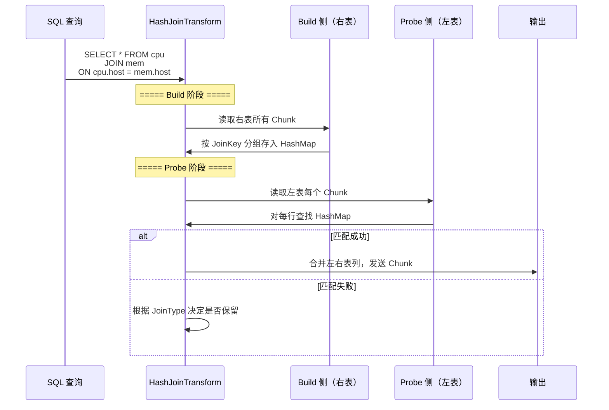
```mermaid
sequenceDiagram
    participant SQL as SQL 查询
    participant HJ as HashJoinTransform
    participant Build as Build 侧（右表）
    participant Probe as Probe 侧（左表）
    participant Output as 输出

    SQL->>HJ: SELECT * FROM cpu<br/>JOIN mem<br/>ON cpu.host = mem.host

    Note over HJ: ===== Build 阶段 =====
    HJ->>Build: 读取右表所有 Chunk
    Build->>HJ: 按 JoinKey 分组存入 HashMap

    Note over HJ: ===== Probe 阶段 =====
    HJ->>Probe: 读取左表每个 Chunk
    Probe->>HJ: 对每行查找 HashMap
    alt 匹配成功
        HJ->>Output: 合并左右表列，发送 Chunk
    else 匹配失败
        HJ->>HJ: 根据 JoinType 决定是否保留
    end
```

**核心代码**：`engine/executor/hash_join_transform.go:38-84`

```go
type HashJoinTransform struct {
    BaseProcessor

    BuildSide int                    // Build 侧索引（0=左，1=右）
    ProbeSide int                    // Probe 侧索引

    timeInJoinKey       bool         // Join Key 是否包含时间
    joinKeyInDim        bool         // Join Key 是否在维度列中
    newMst              string       // 新 measurement 名
    leftMst             string       // 左表 measurement 名
    rightMst            string       // 右表 measurement 名
    nextChunks          []chan Semaphore
    inputChunks         []chan Semaphore
    nextChunksCloseOnce []sync.Once
    outFieldMap         []int        // 输出字段映射
    leftFieldsNum       int          // 左表字段数
    joinKeyIdx          [][]int      // Join Key 的列索引
    joinKeyMap          map[string]string  // Join Key 映射
    joinCondition       influxql.Expr      // Join 条件表达式
    joinCase            *influxql.Join     // Join 语句节点
    joinType            influxql.JoinType  // Join 类型（Inner/Left/Right/Full）
    joinAlgoFunc        func()             // Join 算法函数指针
    joinTimeMatch       func(lStart int, lEnd int, rg Chunk, timeMatch map[int]bool)

    inputs       []*ChunkPort        // 两个输入端口（左表、右表）
    bufChunks    []*chunkElem        // 缓冲 Chunk
    output       *ChunkPort          // 输出端口
    outputChunk  Chunk               // 输出 Chunk
    chunkPool    *CircularChunkPool  // Chunk 对象池
    schema       hybridqp.Catalog    // 查询 Schema
    opt          hybridqp.Options    // 查询选项
    workTracing  *tracing.Span       // 工作追踪
    buildTracing *tracing.Span       // Build 阶段追踪
    probeTracing *tracing.Span       // Probe 阶段追踪
    joinLogger   *logger.Logger      // Join 日志
    errs         errno.Errs          // 错误集合

    groupMap               *hashtable.StringHashMap // <group_key, group_id>
    groupResultMap         []Chunk                  // Build 侧分组结果
    bufGroupKeys           [][]byte                 // 缓冲 Group Key
    bufGroupKeysMPool      *GroupKeysMPool          // Group Key 内存池
    groupChunkBuilder      *ChunkBuilder            // Group Chunk 构建器
    bufBatchSize           int                      // 缓冲批次大小
    rightGroupIds          []uint64                 // 右表 Group ID 列表
    matchedRightGroupIds   map[uint64]bool          // 已匹配的右表 Group ID
    matchedRightGroupTimes map[uint64]map[int]bool  // 已匹配的右表 Group 时间
}
```

**逐行解释**：
- `BuildSide` / `ProbeSide`：Hash Join 分两阶段——Build 阶段构建 HashMap，Probe 阶段探测匹配。Inner/Left Join 时右表做 Build，Right Join 时左表做 Build
- `newMst` / `leftMst` / `rightMst`：记录新旧 measurement 名，用于字段映射和结果合并
- `joinType`：支持 `InnerJoin`、`LeftOuterJoin`、`RightOuterJoin`、`FullOuterJoin`
- `joinCase`：保存原始 Join 语句节点，用于获取 Join 元信息
- `joinTimeMatch`：时间匹配函数，处理带时间条件的 Join
- `groupMap`：核心数据结构，将 Join Key 映射到 Build 侧的 Chunk 分组
- `inputs`：两个 ChunkPort，分别接收左表和右表的数据
- `matchedRightGroupIds` / `matchedRightGroupTimes`：追踪已匹配的右表分组，用于 Full Outer Join 的未匹配行处理

**三种 Join 实现**：

| 实现 | 文件 | 适用场景 |
|------|------|----------|
| HashJoinTransform | `hash_join_transform.go` | 等值 Join，性能最优 |
| FullJoinTransform | `full_join_transform.go` | Full Join，需要全量匹配 |
| SortMergeJoinTransform | `sort_merge_join_transform.go` | 已排序数据的 Join，内存友好 |

**具体例子**：

```sql
-- 查询 CPU 和内存使用率的关联数据
SELECT cpu.usage_user, mem.used_percent
FROM cpu
INNER JOIN mem
ON cpu.host = mem.host
WHERE time > now() - 1h
```

执行过程：
```
Build 阶段（右表 mem）：
  读取 mem 表所有数据
  按 host 分组：{server1: [mem_rows...], server2: [mem_rows...]}

Probe 阶段（左表 cpu）：
  读取 cpu 表每一行
  查找 HashMap：host=server1 → 命中 mem_rows
  合并：cpu.usage_user + mem.used_percent → 输出行
```

### 6.6 核心代码：FillTransform — 缺失值填充

> 当 GROUP BY time 产生空窗口时，FillTransform 负责填充缺失值。

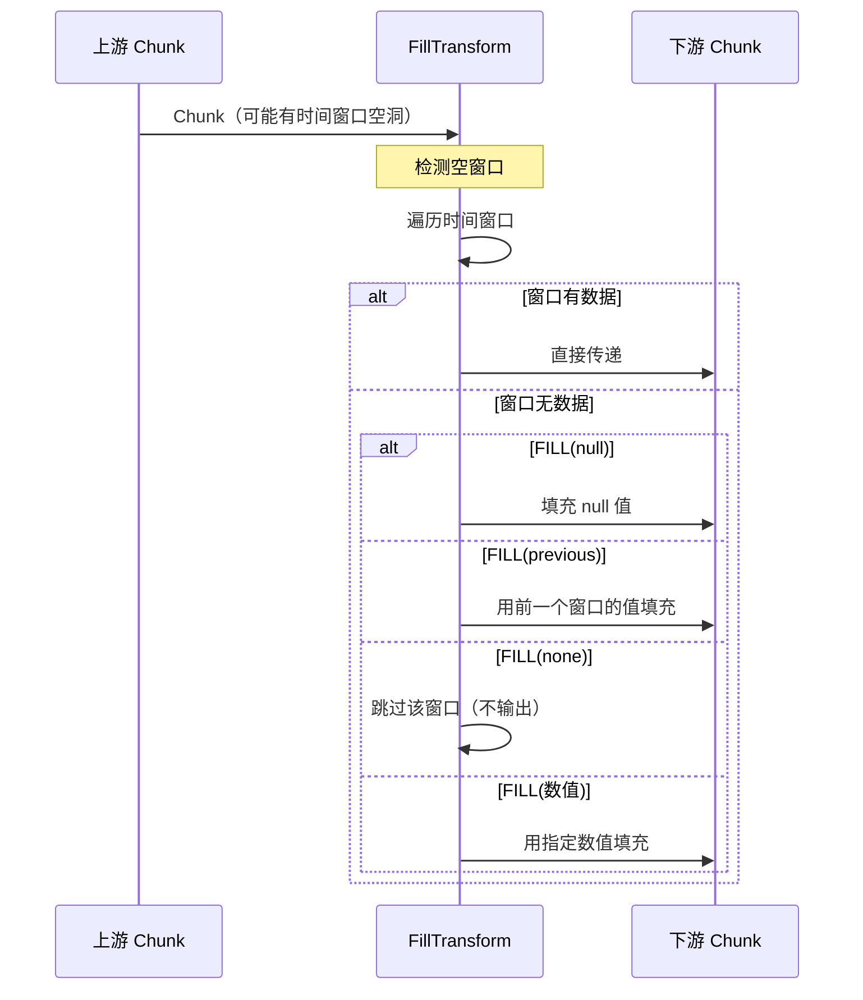
```mermaid
sequenceDiagram
    participant Input as 上游 Chunk
    participant Fill as FillTransform
    participant Output as 下游 Chunk

    Input->>Fill: Chunk（可能有时间窗口空洞）

    Note over Fill: 检测空窗口
    Fill->>Fill: 遍历时间窗口
    alt 窗口有数据
        Fill->>Output: 直接传递
    else 窗口无数据
        alt FILL(null)
            Fill->>Output: 填充 null 值
        else FILL(previous)
            Fill->>Output: 用前一个窗口的值填充
        else FILL(none)
            Fill->>Fill: 跳过该窗口（不输出）
        else FILL(数值)
            Fill->>Output: 用指定数值填充
        end
    end
```

**核心代码**：`engine/executor/fill_transform.go:35-84`

```go
type FillTransform struct {
    BaseProcessor

    startTime     int64              // 查询起始时间
    endTime       int64              // 查询结束时间
    interval      int64              // 时间窗口大小
    fillVal       interface{}        // 填充值（FILL 指定的值）
    prevChunk     Chunk              // 上一个窗口的 Chunk（用于 FILL(previous)）
    fillItem      []*FillItem        // 每列的填充逻辑
    fillProcessor []FillProcessor    // 填充处理器

    Inputs        ChunkPorts         // 输入端口
    Outputs       ChunkPorts         // 输出端口
    opt           query.ProcessorOptions  // 查询选项（包含 Fill 类型）
}
```

**逐行解释**：
- `fillVal`：FILL 指定的值，如 `FILL(0)` 时 fillVal=0
- `prevChunk`：保存上一个窗口的数据，用于 `FILL(previous)`
- `fillItem`：每列独立的填充逻辑，因为不同类型的列填充方式不同（Float 填 0.0，Integer 填 0，String 填 ""）
- `opt.Fill`：填充类型，取值为 `NullFill`、`PreviousFill`、`NoneFill`、`NumberFill`、`LinearFill`

**具体例子**：

```sql
SELECT mean(value) FROM cpu
WHERE host='server1' AND time > now() - 30m
GROUP BY time(5m) FILL(previous)
```

```
原始聚合结果（有空窗口）：
  time        mean(value)
  00:00:00    55.0
  00:05:00    60.0
  00:10:00    (空)     ← 这 5 分钟没有数据
  00:15:00    70.0
  00:20:00    (空)     ← 这 5 分钟没有数据
  00:25:00    80.0

FILL(previous) 填充后：
  time        mean(value)
  00:00:00    55.0
  00:05:00    60.0
  00:10:00    60.0     ← 用前一个窗口的值填充
  00:15:00    70.0
  00:20:00    70.0     ← 用前一个窗口的值填充
  00:25:00    80.0
```

### 6.7 SubQuery — 子查询支持

> openGemini 支持在 FROM 子句中使用子查询，将子查询结果作为外层查询的数据源。

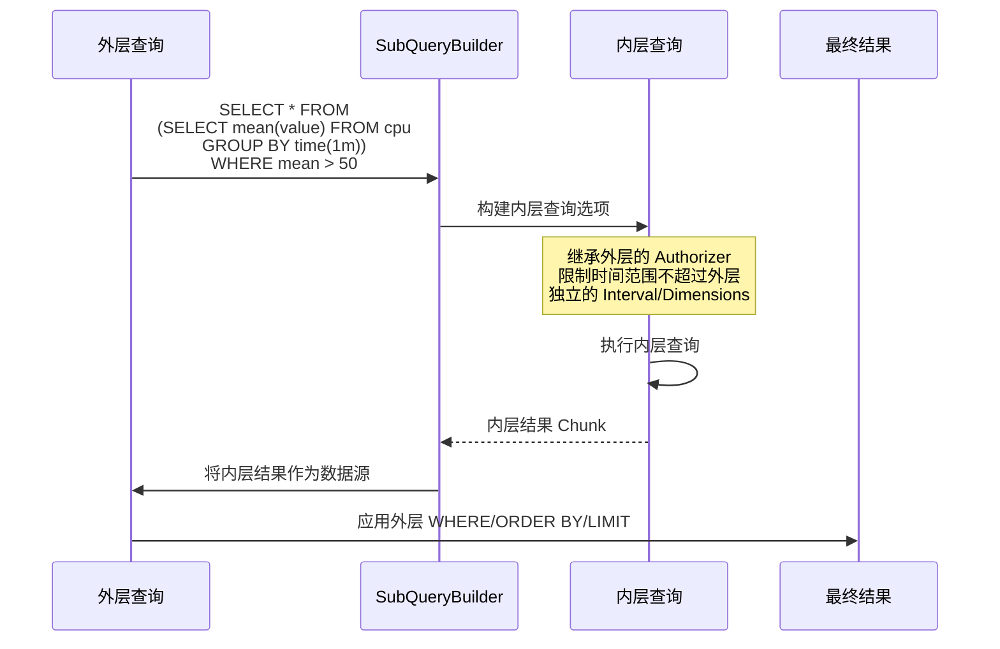
```mermaid
sequenceDiagram
    participant SQL as 外层查询
    participant Sub as SubQueryBuilder
    participant Inner as 内层查询
    participant Output as 最终结果

    SQL->>Sub: SELECT * FROM<br/>(SELECT mean(value) FROM cpu<br/>GROUP BY time(1m))<br/>WHERE mean > 50

    Sub->>Inner: 构建内层查询选项
    Note over Inner: 继承外层的 Authorizer<br/>限制时间范围不超过外层<br/>独立的 Interval/Dimensions

    Inner->>Inner: 执行内层查询
    Inner-->>Sub: 内层结果 Chunk

    Sub->>SQL: 将内层结果作为数据源
    SQL->>Output: 应用外层 WHERE/ORDER BY/LIMIT
```

**核心代码**：`engine/executor/subquery.go:28-60`

```go
type SubQueryBuilder struct {
    qc   query.LogicalPlanCreator
    stmt *influxql.SelectStatement
}

func (b *SubQueryBuilder) newSubOptions(ctx context.Context,
    opt *query.ProcessorOptions) (query.ProcessorOptions, error) {
    // 子查询不支持 EXCEPT 维度
    if len(b.stmt.ExceptDimensions) > 0 {
        return query.ProcessorOptions{}, fmt.Errorf("except: sub-query or join-query is unsupported")
    }
    // 继承外层查询的授权、限制等选项
    subOpt, err := query.NewProcessorOptionsStmt(b.stmt, query.SelectOptions{
        Authorizer:  opt.Authorizer,
        MaxSeriesN:  opt.MaxSeriesN,
        ChunkedSize: opt.ChunkedSize,
        Chunked:     opt.Chunked,
        ChunkSize:   opt.ChunkSize,
        RowsChan:    opt.RowsChan,
    })
    // 时间范围不超过外层
    if subOpt.StartTime < opt.StartTime {
        subOpt.StartTime = opt.StartTime
    }
    if subOpt.EndTime > opt.EndTime {
        subOpt.EndTime = opt.EndTime
    }
    return subOpt, nil
}
```

**通俗解释**：
子查询就像"先算内部，再算外部"。内部查询先执行，产生中间结果，外部查询再对中间结果做过滤、排序等操作。这在时序数据分析中很常见——先聚合，再对聚合结果做二次分析。

### 6.8 CTE — 公共表表达式

> openGemini 支持 CTE（Common Table Expression），允许在查询中定义临时命名结果集，提高复杂查询的可读性。

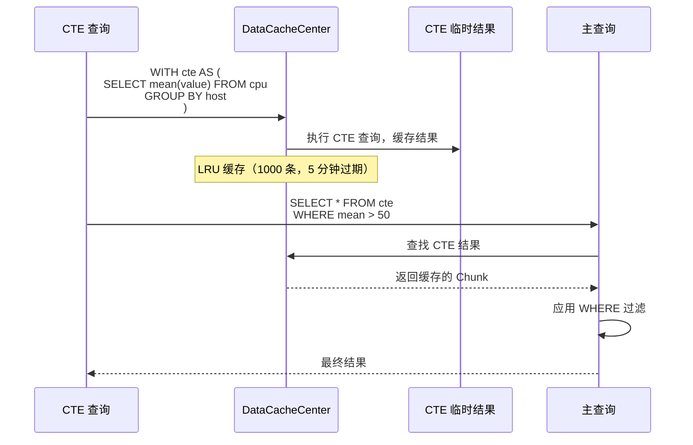
```mermaid
sequenceDiagram
    participant SQL as CTE 查询
    participant Cache as DataCacheCenter
    participant CTE as CTE 临时结果
    participant Main as 主查询

    SQL->>Cache: WITH cte AS (<br/>SELECT mean(value) FROM cpu<br/>GROUP BY host<br/>)
    Cache->>CTE: 执行 CTE 查询，缓存结果
    Note over Cache: LRU 缓存（1000 条，5 分钟过期）

    SQL->>Main: SELECT * FROM cte<br/>WHERE mean > 50
    Main->>Cache: 查找 CTE 结果
    Cache-->>Main: 返回缓存的 Chunk
    Main->>Main: 应用 WHERE 过滤
    Main-->>SQL: 最终结果
```

**核心代码**：`engine/executor/cte_transform.go:36-60`

```go
type DataCacheCenter struct {
    dataStore *lru.LRU[string, []Chunk]  // LRU 缓存：CTE 名 → Chunk 列表
}

var RegisterTable sync.Map  // 全局注册表：追踪 CTE 状态

func NewDataCacheCenter() DataCacheCenter {
    onEvicted := func(key string, _ []Chunk) {
        RegisterTable.Delete(key)  // 缓存淘汰时清理注册表
    }
    return DataCacheCenter{
        dataStore: lru.NewLRU[string, []Chunk](1000, onEvicted, time.Minute*5),
    }
}
```

**逐行解释**：
- `DataCacheCenter`：CTE 结果的全局缓存中心，使用 LRU 策略管理
- `lru.NewLRU[string, []Chunk](1000, onEvicted, time.Minute*5)`：最多缓存 1000 个 CTE 结果，5 分钟自动过期
- `RegisterTable`：全局注册表，追踪每个 CTE 的执行状态（NOT_READY / RUNNING / READY）

**通俗解释**：
CTE 就像"中间变量"。你可以在查询中先定义一个临时结果集（`WITH cte AS (...)`），然后在主查询中引用它。好处是：
1. 提高可读性：把复杂查询拆成多个步骤
2. 结果复用：同一个 CTE 可以被多次引用，不需要重复计算
3. 缓存加速：CTE 结果会被缓存，后续引用直接读缓存

---

## 7. 第六步：流水线执行

### 7.1 PipelineExecutor.Execute 时序图

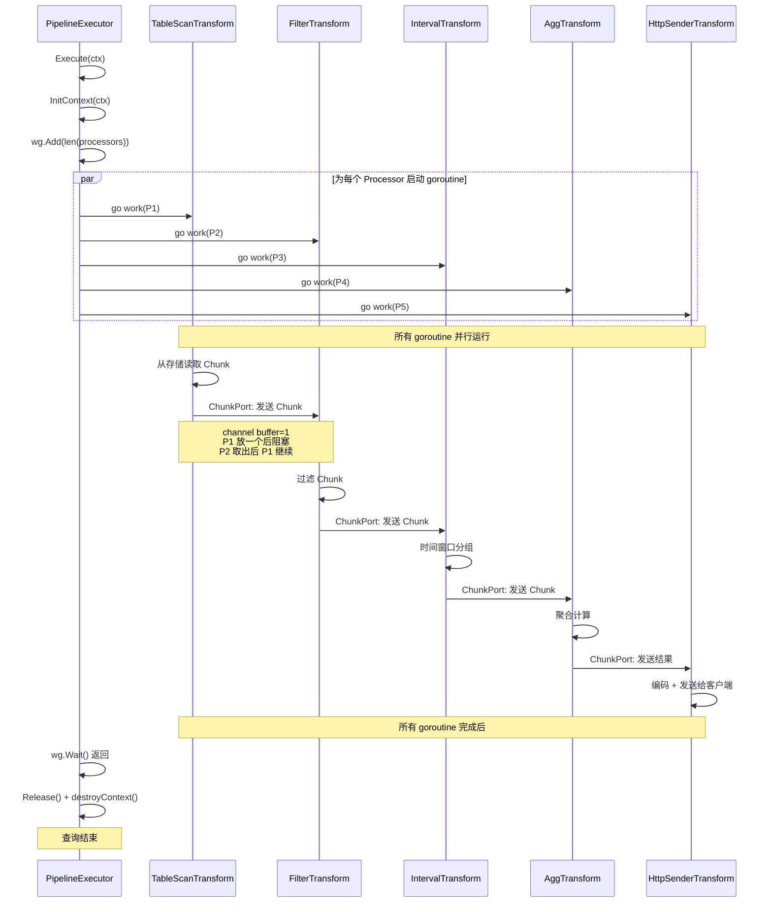
```mermaid
sequenceDiagram
    participant Main as PipelineExecutor
    participant P1 as TableScanTransform
    participant P2 as FilterTransform
    participant P3 as IntervalTransform
    participant P4 as AggTransform
    participant P5 as HttpSenderTransform

    Main->>Main: Execute(ctx)
    Main->>Main: InitContext(ctx)

    Main->>Main: wg.Add(len(processors))

    par 为每个 Processor 启动 goroutine
        Main->>P1: go work(P1)
        Main->>P2: go work(P2)
        Main->>P3: go work(P3)
        Main->>P4: go work(P4)
        Main->>P5: go work(P5)
    end

    Note over P1,P5: 所有 goroutine 并行运行

    P1->>P1: 从存储读取 Chunk
    P1->>P2: ChunkPort: 发送 Chunk
    Note over P1,P2: channel buffer=1<br/>P1 放一个后阻塞<br/>P2 取出后 P1 继续

    P2->>P2: 过滤 Chunk
    P2->>P3: ChunkPort: 发送 Chunk

    P3->>P3: 时间窗口分组
    P3->>P4: ChunkPort: 发送 Chunk

    P4->>P4: 聚合计算
    P4->>P5: ChunkPort: 发送结果

    P5->>P5: 编码 + 发送给客户端

    Note over P1,P5: 所有 goroutine 完成后
    Main->>Main: wg.Wait() 返回
    Main->>Main: Release() + destroyContext()
    Note over Main: 查询结束
```

**核心代码** `engine/executor/pipeline_executor.go:51-63`（PipelineExecutor 结构）：

```go
type PipelineExecutor struct {
	dag          *TransformDag                    // DAG 图
	root         *TransformVertex                 // DAG 根节点
	processors   Processors                       // 所有 Processor 列表
	context      context.Context
	cancelFunc   context.CancelFunc
	contextMutex sync.Mutex
	Query        string
	aborted      bool                             // 是否已中止
	crashed      bool                             // 是否已崩溃

	RunTimeStats *statistics.StatisticTimer       // 运行时统计
}
```

**具体例子**：

假设执行 `SELECT mean(value) FROM cpu WHERE host='server1' GROUP BY time(1m) LIMIT 10`

```
流水线执行过程：

时间轴：
  00:00.000 - 启动所有 goroutine
    → TableScanTransform: goroutine 1
    → FilterTransform: goroutine 2
    → IntervalTransform: goroutine 3
    → AggTransform: goroutine 4
    → HttpSenderTransform: goroutine 5

  00:00.001 - TableScanTransform 读取第一个 Chunk
    → Chunk: [(t1, 99.5, host=server1), (t2, 88.3, host=server1), ...]
    → 发送到 Channel (buffer=1)
    → Channel 满了，阻塞等待

  00:00.002 - FilterTransform 取出 Chunk
    → 过滤：只保留 host=server1 的行
    → 结果：[(t1, 99.5), (t2, 88.3), ...]
    → 发送到下一个 Channel

  00:00.003 - IntervalTransform 取出 Chunk
    → 按 1 分钟窗口分组
    → 结果：[(t1_mod, 99.5), (t1_mod, 88.3), ...]
    → 发送到下一个 Channel

  00:00.004 - AggTransform 取出 Chunk
    → 计算 mean
    → 结果：[(t1_mod, 93.9)]
    → 发送到下一个 Channel

  00:00.005 - HttpSenderTransform 取出结果
    → 编码为 JSON
    → 发送给客户端

  00:00.100 - 查询完成
    → wg.Wait() 返回
    → 释放资源
```

**通俗解释**：
流水线执行就像"工厂流水线"。每个工序（Transform）是一个独立的工人，通过传送带（Channel）连接：
1. **TableScanTransform**：从仓库（磁盘）取出原材料（数据）
2. **FilterTransform**：检查原材料，去掉不合格的
3. **IntervalTransform**：把原材料按时间分组
4. **AggTransform**：计算每组的平均值
5. **HttpSenderTransform**：把成品打包发给客户

每个工人同时工作，传送带上有 buffer=1，就像一个临时存放区。这样整个流水线可以并行处理，效率很高！

**核心代码** `engine/executor/pipeline_executor.go:259-307`（Execute 方法）：

```go
func (exec *PipelineExecutor) Execute(ctx context.Context) error {
	exec.RunTimeStats.Begin()                      // 开始计时
	defer exec.RunTimeStats.End()                  // 结束计时

	err := exec.InitContext(ctx)                   // 初始化上下文
	defer func() {
		exec.Release()                             // 释放资源
		exec.destroyContext()                      // 销毁上下文
	}()
	if err != nil {
		return err
	}

	var once sync.Once
	var processorErr error

	var wg sync.WaitGroup
	wg.Add(len(exec.processors))                   // 设置 WaitGroup 计数

	// ===== 为每个 Processor 启动 goroutine =====
	for _, p := range exec.processors {
		go func(processor Processor) {
			err := exec.work(processor)            // 执行 Processor
			if err != nil {
				once.Do(func() {                   // 只记录第一个错误
					processorErr = err
					statistics.ExecutorStat.ExecFailed.Increase()
					if errno.IsRetryErrorForPtView(processorErr) {
						exec.NoMarkCrash()         // 可重试错误，不标记崩溃
					} else {
						exec.Crash()               // 其他错误，标记崩溃
					}
				})
			}
			processor.FinishSpan()                 // 结束追踪 span
			wg.Done()                              // 标记完成
		}(p)
	}

	wg.Wait()                                      // 等待所有 Processor 完成

	if processorErr != nil {
		if errno.Equal(processorErr, errno.NoFieldSelected) {
			return nil                             // NoFieldSelected 错误忽略
		}
		return processorErr
	}

	return nil
}
```

**逐行解释**：
- `exec.InitContext(ctx)`：初始化执行上下文（包括取消函数、超时等）
- `wg.Add(len(exec.processors))`：设置 WaitGroup 计数 = Processor 数量
- `go func(processor Processor)`：为每个 Processor 启动独立 goroutine
- `exec.work(processor)`：执行 Processor 的 Work 方法（读取输入、处理、发送输出）
- `once.Do(func())`：只记录第一个错误（sync.Once 保证只执行一次）
- `exec.Crash()`：标记崩溃，通知所有 Processor 停止
- `wg.Wait()`：等待所有 goroutine 完成
- `exec.Release()`：释放所有 ChunkPort 和资源

### 7.2 ChunkPort — 算子间的连接

```mermaid
sequenceDiagram
    participant Upstream as 上游 Processor
    participant Port as ChunkPort
    participant Downstream as 下游 Processor

    Upstream->>Port: Connect(to)
    Port->>Port: make(chan Chunk, PORT_CHAN_SIZE)
    Note over Port: PORT_CHAN_SIZE = 1

    alt channel 未满
        Port->>Port: State <- chunk
        Port-->>Upstream: 成功
    else channel 已满 (buffer=1)
        Port->>Port: 阻塞等待…
        Note over Port: 下游取出后才能继续
        Downstream->>Port: <- port.State
        Port->>Downstream: chunk
        Port->>Port: State <- chunk
        Port-->>Upstream: 成功
    end

    Downstream->>Port: <- port.State
    Port-->>Downstream: chunk

    Note over Port: buffer=1 只来自 Connect()<br/>ConnectNoneCache() 使用无缓冲 channel
```

**核心代码** `engine/executor/processor.go:42-49`（Port 接口）和 `processor.go:65-71`（ChunkPort 结构体）：

```go
// Port 接口
type Port interface {
	Equal(to Port) bool
	Connect(to Port)                              // 连接到另一个 Port
	ConnectNoneCache(to Port)                     // 无缓存连接
	Redirect(to Port)                             // 重定向
	ConnectionId() uintptr
	Close()                                       // 关闭
	Release()                                     // 释放
}

// ChunkPort 结构
type ChunkPort struct {
	RowDataType hybridqp.RowDataType               // 行数据类型（列定义）
	State       chan Chunk                          // 当前 channel（可能被重定向）
	OrigiState  chan Chunk                          // 原始 channel
	Redirected  bool                               // 是否被重定向
	once        *sync.Once
}

func NewChunkPort(rowDataType hybridqp.RowDataType) *ChunkPort {
	return &ChunkPort{
		RowDataType: rowDataType,
		State:       nil,
		OrigiState:  nil,
		Redirected:  false,
		once:        new(sync.Once),
	}
}

func (p *ChunkPort) Connect(to Port) {
	p.State = make(chan Chunk, PORT_CHAN_SIZE)     // PORT_CHAN_SIZE = 1
	to.(*ChunkPort).State = p.State
}

func (p *ChunkPort) ConnectNoneCache(to Port) {
	p.State = make(chan Chunk)                     // 无缓冲 channel
	to.(*ChunkPort).State = p.State
}
```

**逐行解释**：
- `State chan Chunk`：实际使用的 channel，Send/Recv 都通过它
- `OrigiState chan Chunk`：原始 channel，Redirect 时保存原始值
- `Redirected bool`：是否被重定向（优化时可能重定向 ChunkPort 到其他 Processor）
- `Connect(to Port)`：创建 `make(chan Chunk, PORT_CHAN_SIZE)` 并让上下游共享；当前 `PORT_CHAN_SIZE` 为 1
- `ConnectNoneCache(to Port)`：创建 `make(chan Chunk)` 无缓冲 channel，常用于 CTE、IN、IndexScan、SparseIndexScan 等不希望中间缓存的路径
- `Close()`：关闭 channel（发送结束信号）

### 7.3 错误处理 — Crash/Abort 级联

```mermaid
sequenceDiagram
    participant P1 as Processor 1
    participant P2 as Processor 2
    participant P3 as Processor 3
    participant Exec as PipelineExecutor

    P1->>P1: 执行出错！

    P1->>Exec: 返回 error
    Note over Exec: once.Do(func()…)<br/>processorErr = err<br/>exec.Crash()

    Exec->>Exec: Crash() → cancelFunc()
    Note over Exec: 取消 context<br/>所有 goroutine 检测到 ctx.Done()

    P2->>P2: 检测到 ctx.Done()
    P2->>P2: 退出 Work 循环

    P3->>P3: 检测到 ctx.Done()
    P3->>P3: 退出 Work 循环

    Note over Exec: 所有 goroutine 退出<br/>wg.Wait() 返回
```

---

## 8. 第七步：分布式查询 — Scatter-Gather

### 8.1 Scatter-Gather 时序图

```mermaid
sequenceDiagram
    participant Client as 客户端
    participant SQL as ts-sql 协调节点
    participant Meta as MetaClient
    participant S1 as ts-store 节点 1
    participant S2 as ts-store 节点 2
    participant S3 as ts-store 节点 3

    Client->>SQL: SELECT mean(value) FROM cpu<br/>WHERE host='server1'<br/>GROUP BY time(1m)

    Note over SQL: 第一步：Scatter（扇出）
    SQL->>Meta: MapShards(sources, opt)
    Meta-->>SQL: shardMap = (shard1: Node1, shard2: Node2, shard3: Node3)

    SQL->>SQL: 构建 RemoteQuery 列表

    par 并发发送查询
        SQL->>S1: RemoteQuery(ShardIDs: [1,2])
        SQL->>S2: RemoteQuery(ShardIDs: [3,4])
        SQL->>S3: RemoteQuery(ShardIDs: [5,6])
    end

    par 并发执行本地查询
        S1->>S1: 本地 DAG: Reader → Filter → Aggregate
        S2->>S2: 本地 DAG: Reader → Filter → Aggregate
        S3->>S3: 本地 DAG: Reader → Filter → Aggregate
    end

    Note over SQL: 第二步：Gather（汇聚）
    S1-->>SQL: 流式返回 Chunk
    S2-->>SQL: 流式返回 Chunk
    S3-->>SQL: 流式返回 Chunk

    SQL->>SQL: MergeTransform: 合并结果
    SQL->>SQL: 最终聚合 + Sort + Limit

    SQL-->>Client: 返回最终结果
```

### 8.2 分布式 DAG 结构

```mermaid
sequenceDiagram
    participant DAG as 协调节点 DAG
    participant E1 as ExchangeTransform 1
    participant E2 as ExchangeTransform 2
    participant E3 as ExchangeTransform 3
    participant Merge as MergeTransform
    participant Agg as AggTransform
    participant Limit as LimitTransform
    participant Out as HttpSenderTransform

    Note over DAG: 分布式 DAG 结构

    E1->>Merge: Chunk（节点 1 结果）
    E2->>Merge: Chunk（节点 2 结果）
    E3->>Merge: Chunk（节点 3 结果）

    Merge->>Agg: 合并后的 Chunk
    Agg->>Limit: 最终聚合结果
    Limit->>Out: 限制行数后
    Out->>Out: 发送给客户端
```

### 8.3 二叉树合并优化

```mermaid
sequenceDiagram
    participant A as 数据源 A
    participant B as 数据源 B
    participant C as 数据源 C
    participant D as 数据源 D
    participant M1 as 合并器 1
    participant M2 as 合并器 2
    participant Final as 最终合并

    Note over Final: 二叉树合并
    par 第一层
        A->>M1: Chunk
        B->>M1: Chunk
    and
        C->>M2: Chunk
        D->>M2: Chunk
    end

    M1->>Final: 合并结果 1
    M2->>Final: 合并结果 2

    Note over Final: 延迟 = O(logN)<br/>比线性合并 O(N) 更快
```

### 8.4 核心代码：RemoteQuery — 分布式查询请求

**代码位置**：`engine/executor/rpc_message.go:319-329`

```go
type RemoteQuery struct {
    Database string           // 数据库名
    PtID     uint32           // 数据分区 ID（tsstore 用）
    NodeID   uint64           // 目标节点 ID
    ShardIDs []uint64         // 目标 Shard ID 列表（tsstore 用）
    PtQuerys []PtQuery        // 分区查询列表（csstore 用）
    Opt      query.ProcessorOptions  // 查询选项（包含 WHERE、GROUP BY 等）
    Analyze  bool             // 是否开启性能分析
    Node     []byte           // 节点地址
    MstInfos []*MultiMstInfo  // 多 measurement 查询信息
}
```

**逐行解释**：
- `Database`：查询的数据库名，比如 `"mydb"`
- `ShardIDs`：要查询的 Shard 列表，比如 `[1, 2]` 表示查询 shard 1 和 shard 2
- `Opt`：查询选项，包含所有 SQL 信息（WHERE 条件、GROUP BY、聚合函数等）
- `MstInfos`：多 measurement 查询时的信息，每个 measurement 有自己的 Shard 列表和选项

### 8.5 核心代码：RPCReaderTransform — 远程数据接收

**代码位置**：`engine/executor/rpc_transform.go:40-54`

```go
type RPCReaderTransform struct {
    BaseProcessor
    Output     *ChunkPort     // 输出端口：将接收到的 Chunk 发送给下游
    client     RPCClient      // RPC 客户端，负责网络通信
    abortSignal chan struct{}  // 中止信号
    opt        *query.ProcessorOptions
    query      []byte         // 序列化的查询节点
}
```

**核心逻辑** `Work()` 方法（line 117-146）：

```go
func (t *RPCReaderTransform) Work(ctx context.Context) error {
    // 序列化查询节点
    queryNode := hybridqp.MustMarshal(t.root)
    // 初始化 RPC 客户端
    t.client.Init(t.nodeID, queryNode)
    // 注册 Chunk 接收回调
    t.client.Register("chunkResponse", func(chunk *Chunk) {
        t.Output.Write(chunk)  // 将接收到的 Chunk 写入输出端口
    })
    // 启动 RPC 客户端（阻塞直到查询完成）
    return t.client.Run(ctx)
}
```

**逐行解释**：
- `hybridqp.MustMarshal(t.root)`：将查询计划序列化为字节，通过网络发送给远端节点
- `t.client.Init(t.nodeID, queryNode)`：初始化 RPC 客户端，指定目标节点和查询
- `t.client.Register("chunkResponse", ...)`：注册回调函数，当远端返回 Chunk 时触发
- `t.Output.Write(chunk)`：将接收到的 Chunk 写入输出端口，传递给下游 Transform
- `t.client.Run(ctx)`：启动 RPC 客户端，阻塞直到查询完成或中止

### 8.6 具体例子：分布式查询的完整流程

假设查询：`SELECT mean(value) FROM cpu WHERE host='server1' GROUP BY time(1m) LIMIT 10`

数据分布在 3 个 ts-store 节点上：
- 节点 1：shard 1（数据：t1~t100）、shard 2（数据：t101~t200）
- 节点 2：shard 3（数据：t201~t300）、shard 4（数据：t301~t400）
- 节点 3：shard 5（数据：t401~t500）、shard 6（数据：t501~t600）

**Scatter 阶段**（ts-sql → ts-store）：
1. ts-sql 构建 3 个 RemoteQuery：
   - `RemoteQuery{NodeID: 1, ShardIDs: [1,2], Opt: {WHERE: host='server1', GROUP: time(1m)}}`
   - `RemoteQuery{NodeID: 2, ShardIDs: [3,4], Opt: {WHERE: host='server1', GROUP: time(1m)}}`
   - `RemoteQuery{NodeID: 3, ShardIDs: [5,6], Opt: {WHERE: host='server1', GROUP: time(1m)}}`
2. 通过 RPC 并发发送给 3 个节点

**本地执行阶段**（每个 ts-store 节点）：
1. 接收 RemoteQuery，反序列化为本地 DAG
2. 本地 DAG：`Reader → Filter(host='server1') → Interval(1m) → Agg(mean(value))`
3. 每个节点返回自己的聚合结果（~10 行）

**Gather 阶段**（ts-sql 汇聚）：
1. 接收 3 个节点的 Chunk（每个 ~10 行）
2. MergeTransform：合并 3 个 Chunk（~30 行）
3. AggTransform：最终聚合（计算全局 mean）
4. LimitTransform：取前 10 行
5. 返回给客户端

**通俗解释**：
Scatter-Gather 就像"分而治之"。ts-sql 是"总指挥"，把查询任务分发给多个 ts-store"工人"，每个工人处理自己的数据，最后总指挥汇总结果。这样查询速度比单节点快 N 倍（N = 节点数）。

> **深入阅读**：Shard 到节点的映射逻辑（`ClusterShardMapper.MapShards`、`RemoteQueryETraitsAndSrc`、PtView 路由）详见 [Module 6: 集群通信](./06_cluster_routing_spec.md) 第 5-6 节。本节聚焦于查询引擎内部的 DAG 构建和执行，Shard 物理位置的确定由 coordinator 层完成。

---

## 9. Chunk — 列存批次数据

### 9.1 Chunk 结构

```mermaid
sequenceDiagram
    participant Chunk as ChunkImpl
    participant Time as 时间列
    participant Value as value 列
    participant Host as host 列
    participant Tag as tagIndex
    participant Int as intervalIndex

    Note over Chunk: Chunk = 一批列式数据（~1000 行）

    Chunk->>Time: Times: [t1, t2, t3, t4, t5]
    Chunk->>Value: Columns[0]: [v1, v2, nil, v4, v5]
    Chunk->>Host: Columns[1]: [h1, h1, h2, h2, h3]

    Chunk->>Tag: tagIndex: [0, 2, 4]
    Note over Tag: 行 0-1: host=h1<br/>行 2-3: host=h2<br/>行 4: host=h3

    Chunk->>Int: intervalIndex: [0, 3]
    Note over Int: 行 0-2: 窗口 1<br/>行 3-4: 窗口 2
```

### 9.2 Column 与 Bitmap

```mermaid
sequenceDiagram
    participant Column as Column 存储
    participant BitMap as BitMap
    participant Values as Values 数组

    Note over Column: 稀疏数据处理
    Column->>BitMap: BitMap: [1, 1, 0, 1, 1]
    Note over BitMap: 1 = 有值, 0 = nil

    Column->>Values: Values: [v1, v2, v4, v5]
    Note over Values: 跳过 nil 位<br/>节省内存

    Note over Column: 查询第 2 行
    Column->>BitMap: BitMap[2] = 0
    BitMap-->>Column: 该行为 nil

    Note over Column: 查询第 3 行
    Column->>BitMap: BitMap[3] = 1
    Column->>Column: GetValueIndexV2(3)<br/>计算值索引 = 2
    Column->>Values: Values[2] = v4
```

### 9.3 核心代码：ChunkImpl 结构体

**代码位置**：`engine/executor/chunk.go:182-193`

```go
type ChunkImpl struct {
    rowDataType   hybridqp.RowDataType  // 行数据类型定义（列名、列类型）
    name          string                // Chunk 名称（通常是 measurement 名）
    tags          []ChunkTags           // 标签列表（每个 series 一个 tag）
    tagIndex      []int                 // 标签索引：记录每个 tag 的起始行号
    time          []int64               // 时间列：所有行的时间戳
    intervalIndex []int                 // 窗口索引：记录每个窗口的起始行号
    columns       []Column              // 数据列：每个列一个 Column 对象
    dims          []Column              // 维度列（GROUP BY 的列）
    *record.Record                      // 嵌入 Record，提供底层数据存储
    graph         IGraph                // 图结构（用于 DAG 执行）
}
```

**逐行解释**：
- `rowDataType`：定义 Chunk 的列结构（列名、列类型），比如 `[time:int64, host:string, value:float64]`
- `tags`：标签列表，每个 series 有一个 tag，比如 `[{host: server1}, {host: server2}]`
- `tagIndex`：标签索引，记录每个 tag 的起始行号，比如 `[0, 2, 4]` 表示 tag 0 从行 0 开始，tag 1 从行 2 开始
- `time`：时间列，存储所有行的时间戳，比如 `[1234567800, 1234567801, ...]`
- `intervalIndex`：窗口索引，记录每个时间窗口的起始行号，比如 `[0, 3]` 表示窗口 1 从行 0 开始，窗口 2 从行 3 开始
- `columns`：数据列，每个列是一个 `Column` 对象，存储该列的所有值

### 9.4 核心代码：Column 接口与 Bitmap 稀疏存储

**代码位置**：`engine/executor/column.gen.go:35-108` — Column 是一个 **接口**，不是结构体

```go
// Column 是列存储接口，定义了所有列类型（Float/Integer/String/Boolean）的通用操作
type Column interface {
    DataType() influxql.DataType
    Length() int
    NilCount() int
    IsEmpty() bool
    // ... 时间列操作、值读写、nil 位图操作等
    BitMap() *Bitmap
}

// ColumnImpl 是 Column 接口的具体实现（结构体）
// 关键字段：
//   - nilsV2 *Bitmap          — nil 位图（非 []byte），标记哪些行有值
//   - floatValues []float64   — Float 类型的值数组
//   - integerValues []int64   — Integer 类型的值数组
//   - stringValuesV2 []byte   — String 类型的紧凑存储（字节数组 + offset）
//   - booleanValues []bool    — Boolean 类型的值数组
```

**逐行解释**：
- `Column` 是接口，`ColumnImpl` 是具体实现（列存数据的实际容器）
- `nilsV2 *Bitmap`：nil 位图，使用自定义 `Bitmap` 类型（非原始 `[]byte`），标记哪些行有值
- 每种数据类型有自己的值数组（`floatValues`/`integerValues` 等），不是统一的 `[]Value`
- `BitMap()` 方法返回 `*Bitmap` 指针，用于 nil 行追踪

**具体例子**：
假设有一个 Chunk 包含 5 行数据，其中第 2 行（索引 2）的 value 为 nil：

```
行号:  0    1    2    3    4
value: 99.5 88.3 nil  77.1 66.0
```

Column 存储：
```
BitMap:  [1, 1, 0, 1, 1]   ← 位图：第 2 位为 0（nil）
Values:  [99.5, 88.3, 77.1, 66.0]  ← 值数组：跳过 nil，只有 4 个值
```

**查询第 2 行（索引 2）**：
1. 检查 `BitMap[2] = 0` → 该行为 nil，返回 nil

**查询第 3 行（索引 3）**：
1. 检查 `BitMap[3] = 1` → 该行有值
2. 计算值索引：`GetValueIndexV2(3)` = 位图中索引 3 之前有多少个 1 = 2
3. 返回 `Values[2] = 77.1`

**通俗解释**：
Bitmap 稀疏存储就像一个"有值标记"。如果某一列有很多 nil 值（比如某些字段缺失），用位图标记哪些行有值，值数组只存有值的元素，节省内存。

### 9.5 核心代码：IntervalIndexGen — 生成窗口索引

**代码位置**：`engine/executor/chunk.go:645`

```go
// 注意：IntervalIndexGen 是包级函数，不是 ChunkImpl 的方法
func IntervalIndexGen(ck Chunk, opt *query.ProcessorOptions) {
    chunk, ok := ck.(*ChunkImpl)
    if !ok {
        return
    }

    tagIndex := chunk.TagIndex()
    if opt.Interval.IsZero() {
        chunk.AppendIntervalIndexes(tagIndex)
        return
    }

    windowStopTime := influxql.MinTime
    ascending := opt.Ascending
    if ascending {
        windowStopTime = influxql.MaxTime
    }

    times := chunk.Time()
    tagIndexOffset := 0
    stopTime := opt.StopTime()
    // ... 按 tag 分组 + 时间窗口生成 intervalIndex ...
}
```

**逐行解释**：
- `IntervalIndexGen` 接收 `Chunk` 接口参数，先类型断言为 `*ChunkImpl`
- 如果 `opt.Interval.IsZero()`（无时间窗口），直接将 tagIndex 作为 intervalIndex
- 根据查询方向（`ascending`/`descending`）初始化窗口停止时间
- 按 tag 分组 + 时间窗口生成 intervalIndex（比简化版更复杂，需要处理边界条件）

**具体例子**：
时间窗口 = 1 分钟，输入 Chunk：
```
行号:  0          1          2          3          4
time:  1234567801 1234567830 1234567890 1234567900 1234567950
```

窗口计算：
```
行 0: Window(1234567801) = 1234567800  ← 窗口 1 起始
行 1: Window(1234567830) = 1234567800  ← 同一窗口
行 2: Window(1234567890) = 1234567800  ← 同一窗口
行 3: Window(1234567900) = 1234567900  ← 窗口 2 起始（变化！）
行 4: Window(1234567950) = 1234567900  ← 同一窗口
```

生成的 `intervalIndex = [0, 3]`：
- 窗口 1：行 0~2（时间 1234567800）
- 窗口 2：行 3~4（时间 1234567900）

---

## 10. CoProcessor — 批量处理多字段

### 10.1 CoProcessor 时序图

```mermaid
sequenceDiagram
    participant Query as SELECT cpu, memory, disk FROM...
    participant Co as CoProcessorImpl
    participant R1 as Routine 1 (cpu)
    participant R2 as Routine 2 (memory)
    participant R3 as Routine 3 (disk)
    participant Chunk as 同一个 Chunk

    Query->>Co: 多字段查询

    Co->>R1: 绑定 cpu Iterator
    Co->>R2: 绑定 memory Iterator
    Co->>R3: 绑定 disk Iterator

    Co->>Chunk: 读取 Chunk

    par 并行处理不同列
        R1->>R1: WorkOnChunk(cpu 列)
    and
        R2->>R2: WorkOnChunk(memory 列)
    and
        R3->>R3: WorkOnChunk(disk 列)
    end

    Note over Chunk: 同一个 Chunk 只读一次<br/>三个 Routine 分别处理不同列<br/>减少 IO 和内存拷贝
```

### 10.2 核心代码：CoProcessor 接口 — 列级批量处理

**代码位置**：`engine/executor/coprocessor.go:81-83`

```go
type CoProcessor interface {
    WorkOnChunk(Chunk, Chunk, *IteratorParams)  // 处理一个 Chunk
}
```

**通俗解释**：
- `CoProcessor` 是一个"列级处理器"，负责批量处理 Chunk 中的多个列
- 每个 Transform（如 FilterTransform、IntervalTransform）都有一个 CoProcessor
- CoProcessor 内部有多个 Routine，每个 Routine 处理一个列

### 10.3 核心代码：CoProcessorImpl 结构体

**代码位置**：`engine/executor/coprocessor.go:85-87`

```go
type CoProcessorImpl struct {
    Routines []Routine  // Routine 列表，每个 Routine 处理一个列
}
```

**核心逻辑** `WorkOnChunk()` 方法（line 99-103）：

```go
func (c *CoProcessorImpl) WorkOnChunk(inChunk, outChunk Chunk, params *IteratorParams) {
    for _, routine := range c.Routines {
        routine.WorkOnChunk(inChunk, outChunk, params)  // 每个 Routine 处理自己的列
    }
}
```

**逐行解释**：
- `for _, routine := range c.Routines`：遍历所有 Routine
- `routine.WorkOnChunk(inChunk, outChunk, params)`：每个 Routine 处理自己的列

### 10.4 核心代码：Routine 接口 — 单列处理器

**代码位置**：`engine/executor/coprocessor.go:50-52`

```go
type Routine interface {
    WorkOnChunk(Chunk, Chunk, *IteratorParams)  // 处理一个列
}
```

**RoutineImpl 结构体**（line 54-59）：

```go
type RoutineImpl struct {
    iterator   Iterator          // 迭代器（实际处理逻辑）
    inOrdinal  int               // 输入列索引（非 inputOrdinal）
    outOrdinal int               // 输出列索引（非 outputOrdinal）
    endPoint   *IteratorEndpoint // 迭代器端点（输入/输出配对）
}
```

**逐行解释**：
- `inOrdinal`：输入列在 Chunk 中的索引，比如 `0` 表示第一列
- `outOrdinal`：输出列在结果 Chunk 中的索引
- `iterator`：迭代器，实际执行列级计算（如 Filter、Interval、Agg）
- `endPoint`：迭代器端点，包含 `InputPoint` 和 `OutputPoint`（各含 Chunk + Ordinal）

### 10.5 具体例子：FilterTransform 的 CoProcessor

假设查询：`SELECT host, value FROM cpu WHERE value > 80`

输入 Chunk：
```
行号:  0     1     2     3     4
host:  s1    s2    s1    s2    s1
value: 99.5  88.3  77.1  66.0  55.5
```

FilterTransform 的 CoProcessor 有 2 个 Routine：
- Routine 1：处理 host 列（inOrdinal=0, outOrdinal=0）
- Routine 2：处理 value 列（inOrdinal=1, outOrdinal=1）

执行过程：
1. Routine 2（value 列）先评估 WHERE 条件 `value > 80`：
   - 行 0: 99.5 > 80 → true（保留）
   - 行 1: 88.3 > 80 → true（保留）
   - 行 2: 77.1 > 80 → false（过滤）
   - 行 3: 66.0 > 80 → false（过滤）
   - 行 4: 55.5 > 80 → false（过滤）
2. Routine 1（host 列）根据过滤结果复制匹配的行：
   - 行 0: host = s1（保留）
   - 行 1: host = s2（保留）

输出 Chunk：
```
行号:  0     1
host:  s1    s2
value: 99.5  88.3
```

**通俗解释**：
CoProcessor 就像一个"多列并行处理器"。当查询涉及多个字段时，每个字段由一个 Routine 处理，所有 Routine 共享同一个 Chunk，避免重复读取数据。这样既节省内存，又提高处理效率。

---

## 11. 架构设计意图

### 11.1 为什么用 DAG 而不是 Volcano 模型？

> 这是 openGemini 查询引擎最核心的架构决策。理解这个选择，就理解了为什么 openGemini 能高效处理海量时序数据的聚合查询。

**背景：两种经典的查询执行模型**

数据库查询执行器有两种经典架构：

**Volcano 模型（火山模型）** — 大多数关系型数据库（PostgreSQL、MySQL）采用的方案：
```
核心思想：Iterator 模式，一行一行拉取数据

  Limit.Next()
    → Agg.Next()        // 调用下游
      → Filter.Next()   // 调用下游
        → Scan.Next()   // 从存储读一行

每一层通过 Next() 调用下一层，每次返回一行数据
像瀑布一样从上往下"拉"数据
```

**DAG 模型（有向无环图）** — openGemini 采用的方案：
```
核心思想：每个算子一个 goroutine，通过 Channel 推送 Chunk

  Scan goroutine ──Channel──→ Filter goroutine ──Channel──→ Agg goroutine ──Channel──→ Limit goroutine

每个算子独立运行，处理完一个 Chunk 就推送给下游
像流水线一样从左往右"推"数据
```

**为什么 openGemini 选择 DAG？三个关键原因：**

**原因 1：TSDB 查询是批处理，不是逐行处理**

OLTP 数据库（如 MySQL）的典型查询：`SELECT * FROM users WHERE id = 123` — 只需要返回一行，Volcano 的逐行调用开销可以忽略。

时序数据库的典型查询：`SELECT mean(value) FROM cpu WHERE time > now() - 1h GROUP BY time(1m)` — 需要扫描**数百万行**数据，然后做聚合。如果用 Volcano 模型，每一行都要经过函数调用栈（Next → Next → Next），数百万次调用的开销非常大。

DAG 模型一次处理一个 Chunk（数千行），goroutine 之间的切换次数大大减少。

**原因 2：天然并行，充分利用多核**

时序数据的一个关键特征：**不同 series 之间完全独立**。查询 `SELECT mean(value) FROM cpu GROUP BY host` 时，host=server1 和 host=server2 的计算互不依赖。

DAG 模型中，每个算子是一个独立的 goroutine，天然支持并行：
```
  Exchange goroutine (分发)
    ├── Reader goroutine (处理 Shard 1)
    ├── Reader goroutine (处理 Shard 2)
    └── Reader goroutine (处理 Shard 3)
        ↓ 汇总
  Agg goroutine (聚合)
```

Volcano 模型是单线程的函数调用栈，要实现并行需要额外的复杂机制（如并行 UNION ALL），远不如 DAG 的 goroutine 自然。

**原因 3：Go 语言的 goroutine 太便宜了**

在 C++/Java 中，创建线程的开销很大（~1MB 栈空间），所以 Volcano 模型的函数调用栈更高效。但 Go 的 goroutine 只需要 ~2KB 栈空间，创建和调度的开销极低。

这意味着：即使查询只涉及少量数据，DAG 模型创建十几个 goroutine 的开销也可以忽略不计。Go 的调度器会自动将 goroutine 映射到 OS 线程，实现高效的并行。

**Volcano 模型在 TSDB 场景下的问题：**

```
假设查询需要扫描 100 万行数据，经过 4 层算子（Scan → Filter → Agg → Limit）

Volcano 模型：
  函数调用次数 = 100万 × 4 = 400 万次 Next() 调用
  每次调用涉及：函数压栈、弹栈、条件分支
  总开销：约 400 万次函数调用

DAG 模型：
  假设 Chunk 大小 = 1000 行
  Chunk 传递次数 = (100万 / 1000) × 4 = 4000 次 Channel 操作
  每次操作涉及：goroutine 切换、Channel 收发
  总开销：约 4000 次 Channel 操作

差距：1000 倍！
```

**DAG 模型的代价：**

DAG 模型并非没有缺点：
1. **延迟略高**：第一个结果需要等待整个流水线启动，Volcano 可以立即返回第一行
2. **内存占用**：每个 goroutine 需要栈空间，算子多了会占用更多内存
3. **调试困难**：多个 goroutine 并发执行，问题定位比单线程的函数调用栈更复杂

但对于时序数据库的典型场景（批量聚合、高吞吐），DAG 的优势远大于这些代价。

**总结对比：**

| 维度 | Volcano 模型 | DAG 模型（openGemini） |
|------|-------------|----------------------|
| **数据流** | 逐行拉取（Pull） | Chunk 推送（Push） |
| **并行性** | 单线程，需额外机制 | 天然并行，每个算子一个 goroutine |
| **调用开销** | 每行 1 次函数调用 | 每 Chunk 1 次 Channel 操作 |
| **适用场景** | OLTP（少数据、低延迟） | OLAP/TSDB（大数据、高吞吐） |
| **Go 适配性** | goroutine 便宜，优势不明显 | goroutine 便宜，完美匹配 |
| **代表系统** | PostgreSQL、MySQL | openGemini、ClickHouse |

### 11.2 为什么多数 Transform 连接用 buffer=1 的 Channel？

> 在 DAG 模型中，算子之间通过 Channel 传递数据。普通 `Connect()` 为什么使用 buffer=1，而不是更大（比如 100）？

**核心原因：背压（Backpressure）控制**

`Connect()` 创建的 buffer=1 Channel 天然实现了**背压机制** — 当下游处理不过来时，上游会自动被阻塞，不会无限生产数据。注意：这不是 `ChunkPort` 的唯一模式，`ConnectNoneCache()` 会创建无缓冲 channel。

```
Connect() / buffer=1 的效果：

  上游 (Scan) ──[buffer=1]──→ 下游 (Agg)

  场景 1：上下游速度匹配
    Scan 生产 1 个 Chunk → 放入 Channel → Agg 消费 → Scan 继续生产
    流畅运行，无阻塞

  场景 2：上游快，下游慢
    Scan 生产 1 个 Chunk → 放入 Channel（满了！）
    Scan 被阻塞，等待 Agg 消费
    Agg 处理完 → 取出 Chunk → Scan 解除阻塞
    → 上游不会淹没下游

  场景 3：下游快，上游慢
    Agg 等待 Scan 生产数据
    → 下游不会空转浪费 CPU
```

**为什么不用更大的 buffer（比如 100）？**

```
buffer=100 的问题：

  上游 (Scan) ──[buffer=100]──→ 下游 (Agg)

  如果 Agg 处理速度慢：
    Scan 会连续生产 100 个 Chunk 放入 Channel
    这 100 个 Chunk 占用大量内存（假设每个 Chunk 1MB → 100MB 内存）
    但 Agg 只能一个一个处理，前面 99 个 Chunk 在内存中等待
    → 内存浪费，且延迟增加（Agg 处理的是"旧"数据）

  buffer=1 的优势：
    内存占用 = 1 个 Chunk（~1MB）
    延迟最低：Scan 生产后立即被 Agg 处理
    天然的"生产者-消费者"同步
```

**类比理解：**

```
buffer=1 就像一个单人通道：
  - 一次只能过一个人
  - 如果前面的人走得太慢，后面的人只能等着
  - 不会出现"一群人挤在通道里"的情况

buffer=100 就像一个 100 人的电梯：
  - 可以一次装 100 人
  - 但如果目的地楼层处理慢，电梯里的人只能干等
  - 浪费空间，且增加了等待时间
```

**openGemini 中的实现 — ChunkPort：**

```go
const PORT_CHAN_SIZE = 1

type ChunkPort struct {
    RowDataType hybridqp.RowDataType  // 行数据类型（列定义）
    State       chan Chunk             // 当前 channel（注意：是 chan Chunk，不是 chan *Chunk）
    OrigiState  chan Chunk             // 原始 channel（Redirect 时保存）
    Redirected  bool                   // 是否被重定向
    once        *sync.Once
}

func (p *ChunkPort) Connect(to Port) {
    p.State = make(chan Chunk, PORT_CHAN_SIZE)
    to.(*ChunkPort).State = p.State
}

func (p *ChunkPort) ConnectNoneCache(to Port) {
    p.State = make(chan Chunk)
    to.(*ChunkPort).State = p.State
}
```

每个 Transform 算子都有一个 `ChunkPort` 作为输出端口，下游算子直接通过 `<-port.State` 从 channel 读取 Chunk。没有 `GetChunk()` 方法。普通 `Connect()` 的 buffer=1 保证了：
1. **内存可控**：整个查询链路中，最多只有 N 个 Chunk 在流转（N = 算子数量）
2. **延迟可控**：每个 Chunk 都是"新鲜"的，不会在 Channel 中等待太久
3. **背压自动**：不需要额外的流控代码，Channel 本身就实现了

而 `ConnectNoneCache()` 的案例是 CTE 外层输入、IN 子查询、IndexScan/SparseIndexScan 等路径。它使用无缓冲 channel，发送方必须等接收方同步接走数据，适合不希望在两个执行片段之间额外缓存 Chunk 的连接。

### 11.3 为什么有 6 种 PlanType 模板？

```mermaid
sequenceDiagram
    participant Query as 常见查询
    participant Type as GetPlanType()
    participant Fast as 模板快速路径

    Query->>Type: SELECT mean(value)… GROUP BY time(1m)
    Type-->>Fast: AGG_INTERVAL

    Fast->>Fast: 直接使用预构建的计划<br/>跳过复杂优化<br/>直接执行

    Note over Fast: 常见查询占 80%+<br/>模板化后延迟降低
```

---

## 12. 潜在隐患

### 12.1 ChunkPort 的背压问题

```mermaid
sequenceDiagram
    participant Fast as 快速上游
    participant Chan as ChunkPort (buffer=1)
    participant Slow as 慢速下游

    Fast->>Chan: 发送 Chunk
    Chan->>Chan: 满了！阻塞…
    Note over Fast: 上游被阻塞<br/>等待下游处理

    Slow->>Chan: 处理完，取出
    Chan->>Fast: 解除阻塞

    Note over Fast: 如果下游处理慢<br/>整个流水线被拖慢
```

### 12.2 并行度限制

```mermaid
sequenceDiagram
    participant Config as 配置
    participant Limit as 并行度限制

    Config->>Limit: MaxConcurrencyInOnePt = 8
    Note over Limit: 单分区内最多 8 个并行子查询

    Note over Limit: 多分区场景下<br/>一个慢节点拖慢整个查询
```

**通俗解释**：
潜在隐患就像"交通拥堵点"：
1. **ChunkPort 背压**：就像传送带上的临时存放区只有 1 个位置。如果下游工人处理慢，上游工人就只能等着，整个流水线都被拖慢
2. **并行度限制**：就像工厂最多只能有 8 个工人同时工作。如果某个工人特别慢，整个订单都会延迟

**具体例子**：

假设有一个慢查询场景：

```
场景：查询 3 个 shard 的数据

正常情况：
  Shard 1: 100ms 返回
  Shard 2: 100ms 返回
  Shard 3: 100ms 返回
  总时间: 100ms（并行执行）

异常情况（Shard 3 很慢）：
  Shard 1: 100ms 返回
  Shard 2: 100ms 返回
  Shard 3: 10s 返回（磁盘 IO 慢）
  总时间: 10s（被最慢的 shard 拖慢）

优化方案：
  1. 设置超时：如果某个 shard 超过 5s 没返回，直接跳过
  2. 限制并行度：最多 8 个并行子查询，避免资源争抢
  3. 背压控制：ChunkPort buffer=1，防止上游发送太快
```

---

## 13. 端到端实战：一条聚合查询的完整生命周期

> 以 `SELECT mean(value) FROM cpu WHERE host='server1' GROUP BY time(5m) LIMIT 3` 为例，追踪它从 SQL 文本到最终结果的每一步。

### 13.1 端到端时序图

```mermaid
sequenceDiagram
    participant Client as 客户端
    participant SQL as ts-sql
    participant Parser as SQL 解析器
    participant Planner as BuildLogicalPlan()
    participant Builder as ExecutorBuilder.Build()
    participant Executor as PipelineExecutor.Execute()
    participant Reader as TableScanTransform
    participant Filter as FilterTransform
    participant Interval as IntervalTransform
    participant Agg as AggTransform
    participant Limit as LimitTransform
    participant Sender as HttpSenderTransform

    Client->>SQL: SELECT mean(value) FROM cpu<br/>WHERE host='server1'<br/>GROUP BY time(5m) LIMIT 3

    Note over SQL: ===== Step 1: SQL 解析 =====
    SQL->>Parser: 解析 SQL 文本
    Parser-->>SQL: SelectStatement AST<br/>Fields=[mean(value)]<br/>Sources=[cpu]<br/>Condition=host='server1'<br/>Dimensions=[time(5m)]<br/>Limit=3

    Note over SQL: ===== Step 2: 构建逻辑计划 =====
    SQL->>Planner: BuildLogicalPlan(stmt)
    Planner->>Planner: GetPlanType → AGG_INTERVAL_LIMIT (匹配模板)
    Planner->>Planner: buildPlanByCache → 使用预构建模板
    Planner->>Planner: HeuristicPlanner.FindBestExp() → 谓词下推
    Planner-->>SQL: 优化后的逻辑计划树

    Note over SQL: ===== Step 3: 构建 DAG =====
    SQL->>Builder: ExecutorBuilder.Build(plan)
    Builder->>Builder: addNodeToDag(递归遍历)
    Builder->>Builder: LogicalReader → TableScanTransform
    Builder->>Builder: LogicalExchange(READER) → SortedMergeTransform
    Builder->>Builder: LogicalFilter → FilterTransform
    Builder->>Builder: LogicalInterval → IntervalTransform
    Builder->>Builder: LogicalAggregate → AggTransform
    Builder->>Builder: LogicalLimit → LimitTransform
    Builder->>Builder: HttpSender → HttpSenderTransform
    Builder-->>SQL: TransformDAG 构建完成

    Note over SQL: ===== Step 4: 流水线执行 =====
    SQL->>Executor: PipelineExecutor.Execute(ctx)
    Executor->>Executor: 为每个 Processor 启动 goroutine

    par 并行执行
        Reader->>Reader: 从 TSSP 文件读取 Chunk
        Reader->>Filter: ChunkPort: 发送 Chunk
    and
        Filter->>Filter: 过滤 host='server1'
        Filter->>Interval: ChunkPort: 发送 Chunk
    and
        Interval->>Interval: 按 5 分钟窗口分组
        Interval->>Agg: ChunkPort: 发送分组后的 Chunk
    and
        Agg->>Agg: 计算 mean(value)
        Agg->>Limit: ChunkPort: 发送聚合结果
    and
        Limit->>Limit: 限制 3 行
        Limit->>Sender: ChunkPort: 发送结果
    and
        Sender->>Sender: 编码 + 发送给客户端
    end

    Sender-->>Client: 返回最终结果
```

### 13.2 Step 1 详解：SQL 解析 — 从文本到 AST

**输入 SQL**：
```sql
SELECT mean(value) FROM cpu WHERE host='server1' GROUP BY time(5m) LIMIT 3
```

**代码路径**：`influxql/parser.go`

**词法分析（Lexer）**：
```
Token_SELECT  → "SELECT"
Token_IDENT   → "mean"
Token_LPAREN  → "("
Token_IDENT   → "value"
Token_RPAREN  → ")"
Token_FROM    → "FROM"
Token_IDENT   → "cpu"
Token_WHERE   → "WHERE"
Token_IDENT   → "host"
Token_EQ      → "="
Token_STRING  → "'server1'"
Token_GROUP   → "GROUP"
Token_BY      → "BY"
Token_IDENT   → "time"
Token_LPAREN  → "("
Token_DURATION→ "5m"
Token_RPAREN  → ")"
Token_LIMIT   → "LIMIT"
Token_INTEGER → "3"
```

**语法分析（Parser）** → SelectStatement AST：
```go
SelectStatement{
    Fields: Fields{
        {Expr: Call{Name: "mean", Args: [Ref{Val: "value"}]}},
    },
    Sources: Sources{
        &Measurement{Database: "mydb", RetentionPolicy: "autogen", Name: "cpu"},
    },
    Condition: BinaryExpr{
        Op: EQ,
        LHS: Ref{Val: "host"},
        RHS: StringLiteral{Val: "server1"},
    },
    Dimensions: Dimensions{
        {Expr: Call{Name: "time", Args: [DurationLiteral{Val: 5m}]}},
    },
    Limit: 3,
    Offset: 0,
}
```

**逐行解释**：
- `Fields`：查询字段列表，`mean(value)` 是一个 Call 表达式
- `Sources`：数据源，`cpu` 是 measurement 名称
- `Condition`：WHERE 条件，`host='server1'` 是 BinaryExpr
- `Dimensions`：GROUP BY 维度，`time(5m)` 是时间窗口函数
- `Limit`：限制返回行数

### 13.3 Step 2 详解：构建逻辑计划 — 从 AST 到计划树

**代码路径**：`engine/executor/select.go:179-247`

```go
func (p *preparedStatement) BuildLogicalPlan(ctx context.Context) (hybridqp.QueryNode, hybridqp.Trait, error) {
    // 步骤 1: 构建 QuerySchema
    schema := NewQuerySchemaWithJoinCase(p.stmt.Fields, p.stmt.Sources, ...)
    // schema 包含：
    //   - Fields: [mean(value)]
    //   - Sources: [cpu]
    //   - Condition: host='server1'
    //   - Dimensions: [time(5m)]
    //   - Limit: 3

    // 步骤 2: 尝试匹配模板
    planType := GetPlanType(schema, p.stmt)
    // GetPlanType 检查：
    //   - 有聚合函数？ yes (mean)
    //   - 有 GROUP BY time？ yes (5m)
    //   - 有 LIMIT？ yes (3)
    //   → 匹配 AGG_INTERVAL_LIMIT 模板

    if planType != UNKNOWN {
        // 使用预构建模板
        templatePlan := SqlPlanTemplate[planType].GetPlan()
        // templatePlan = [
        //   LogicalLimit,
        //   LogicalAggregate,
        //   LogicalInterval,
        //   LogicalFilter,
        //   LogicalExchange(READER_EXCHANGE),
        //   LogicalReader,
        // ]
        plan, _ := p.buildPlanByCache(ctx, schema, templatePlan, &mstsReqs)
        return plan, mstsReqs, nil  // 模板快速路径
    }

    // 步骤 3: 启发式优化
    planner := p.optimizer()
    planner.SetRoot(plan)
    best := planner.FindBestExp()
    // 优化规则：
    //   - 谓词下推：Filter 从 Aggregate 下方推到 ReaderExchange 上方
    //   - 列裁剪：只读取 value 和 host 列
    return best, mstsReqs, nil
}
```

**逐行解释**：
- `NewQuerySchemaWithJoinCase()`：把 AST 解析成 QuerySchema
- `GetPlanType()`：尝试匹配模板，本例匹配 `AGG_INTERVAL_LIMIT`
- `buildPlanByCache()`：使用预构建模板，跳过复杂优化
- `FindBestExp()`：应用启发式优化规则

**优化后的逻辑计划树**：
```
LogicalLimit{N: 3}
  └── LogicalAggregate{Func: mean, Field: value}
        └── LogicalInterval{Duration: 5m}
              └── LogicalFilter{host = 'server1'}
                    └── LogicalExchange{type: READER_EXCHANGE}
                          └── LogicalReader{Table: cpu}
```

### 13.4 Step 3 详解：DAG 构建 — 从逻辑计划到执行图

**代码路径**：`engine/executor/pipeline_executor.go:667-678, 1521-1554`

```go
func (builder *ExecutorBuilder) Build(node hybridqp.QueryNode) (hybridqp.Executor, error) {
    cloneNode := node.Clone()  // 克隆逻辑计划
    builder.root, _ = builder.addNodeToDag(cloneNode)  // 递归构建 DAG
    return NewPipelineExecutorFromDag(builder.dag, builder.root), nil
}

func (builder *ExecutorBuilder) addNodeToDag(node hybridqp.QueryNode) (*TransformVertex, error) {
    switch n := node.(type) {
    case *LogicalExchange:
        return builder.addExchangeToDag(n)  // Exchange 节点
    case *LogicalReader:
        return builder.addReaderToDag(n)    // Reader 节点
    default:
        return builder.addDefaultNode(n)    // 默认处理
    }
}
```

**逐行解释**：
- `node.Clone()`：克隆逻辑计划，避免修改原计划
- `addNodeToDag()`：递归遍历逻辑计划树，为每个节点创建对应的 Transform
- `addExchangeToDag()`：处理 Exchange 节点，创建多个子 Reader + MergeTransform
- `addDefaultNode()`：通过 TransformCreatorFactory 查找 Creator，创建 Transform

**DAG 构建过程**：

```
Step 1: 处理 LogicalReader
  → 创建 TableScanTransform (读取 TSSP 文件)

Step 2: 处理 LogicalExchange(READER_EXCHANGE)
  → 创建 SortedMergeTransform (合并多个 Reader 的结果)
  → 如果有多个 TSSP 文件，创建多个 Reader

Step 3: 处理 LogicalFilter
  → 创建 FilterTransform (过滤 host='server1')
  → 连接到 SortedMergeTransform

Step 4: 处理 LogicalInterval
  → 创建 IntervalTransform (按 5 分钟窗口分组)
  → 连接到 FilterTransform

Step 5: 处理 LogicalAggregate
  → 创建 AggTransform (计算 mean(value))
  → 连接到 IntervalTransform

Step 6: 处理 LogicalLimit
  → 创建 LimitTransform (限制 3 行)
  → 连接到 AggTransform

Step 7: 添加 HttpSender
  → 创建 HttpSenderTransform (编码 + 发送给客户端)
  → 连接到 LimitTransform
```

**最终 DAG 结构**：
```
HttpSenderTransform
  └── LimitTransform (LIMIT 3)
        └── AggTransform (mean(value))
              └── IntervalTransform (GROUP BY time(5m))
                    └── FilterTransform (WHERE host='server1')
                          └── SortedMergeTransform (合并多个 Reader)
                                ├── TableScanTransform (Reader 1: TSSP 文件 1)
                                ├── TableScanTransform (Reader 2: TSSP 文件 2)
                                └── TableScanTransform (Reader 3: TSSP 文件 3)
```

### 13.5 Step 4 详解：流水线执行 — 每个 Processor 干啥

**代码路径**：`engine/executor/pipeline_executor.go:259-307`

```go
// engine/executor/pipeline_executor.go:259-307
func (exec *PipelineExecutor) Execute(ctx context.Context) error {
    exec.RunTimeStats.Begin()           // 开始统计执行时间
    defer exec.RunTimeStats.End()

    err := exec.InitContext(ctx)         // 初始化执行上下文
    defer func() {
        exec.Release()                   // 释放资源
        exec.destroyContext()            // 销毁上下文
    }()
    if err != nil {
        return err
    }

    var once sync.Once
    var processorErr error

    var wg sync.WaitGroup
    wg.Add(len(exec.processors))         // 设置 WaitGroup 计数 = Processor 数量

    for _, p := range exec.processors {
        go func(processor Processor) {
            err := exec.work(processor)   // 执行 Processor 的 Work 方法
            if err != nil {
                once.Do(func() {          // 只记录第一个错误
                    processorErr = err
                    statistics.ExecutorStat.ExecFailed.Increase()
                    if errno.IsRetryErrorForPtView(processorErr) {
                        exec.NoMarkCrash()  // PtView 错误可重试
                    } else {
                        exec.Crash()        // 其他错误触发崩溃
                    }
                })
            }
            processor.FinishSpan()        // 结束 tracing span
            wg.Done()
        }(p)
    }
    wg.Wait()                             // 等待所有 Processor 完成

    if processorErr != nil {
        if errno.Equal(processorErr, errno.NoFieldSelected) {
            return nil                    // 无字段选中不算错误
        }
        return processorErr
    }
    return nil
}
```

**逐行解释**：
- `exec.RunTimeStats.Begin()/End()`：统计整个执行耗时
- `exec.InitContext(ctx)`：初始化执行上下文（包括 tracing、资源分配）
- `once.Do(func(){...})`：使用 `sync.Once` 确保只记录第一个错误，避免多个 goroutine 竞争写入
- `errno.IsRetryErrorForPtView(processorErr)`：判断是否为 PtView 一致性错误（可自动刷新 PtView 并重试）
- `exec.Crash()` vs `exec.NoMarkCrash()`：前者标记为不可恢复错误，后者允许重试
- `processor.FinishSpan()`：结束每个 Processor 的 tracing span，用于性能分析
- `errno.NoFieldSelected`：查询结果无匹配字段时返回 nil（非错误）

### 13.6 数据流动详解：从原始数据到聚合结果

假设原始数据存储在 TSSP 文件中：

```
原始数据 (TSSP 文件):
┌─────────────────────┬───────┬────────┐
│ time                │ host  │ value  │
├─────────────────────┼───────┼────────┤
│ 2024-01-01 00:00:00 │ s1    │ 10.0   │
│ 2024-01-01 00:01:00 │ s1    │ 20.0   │
│ 2024-01-01 00:02:00 │ s2    │ 30.0   │
│ 2024-01-01 00:03:00 │ s1    │ 40.0   │
│ 2024-01-01 00:04:00 │ s2    │ 50.0   │
│ 2024-01-01 00:05:00 │ s1    │ 60.0   │
│ 2024-01-01 00:06:00 │ s1    │ 70.0   │
│ 2024-01-01 00:07:00 │ s2    │ 80.0   │
│ 2024-01-01 00:08:00 │ s1    │ 90.0   │
│ 2024-01-01 00:09:00 │ s1    │ 100.0  │
│ 2024-01-01 00:10:00 │ s1    │ 110.0  │
│ 2024-01-01 00:11:00 │ s2    │ 120.0  │
│ 2024-01-01 00:12:00 │ s1    │ 130.0  │
│ 2024-01-01 00:13:00 │ s1    │ 140.0  │
│ 2024-01-01 00:14:00 │ s2    │ 150.0  │
└─────────────────────┴───────┴────────┘
```

#### Step 4.1: TableScanTransform — 读取数据

```
TableScanTransform 从 TSSP 文件读取 Chunk：
┌─────────────────────┬───────┬────────┐
│ time                │ host  │ value  │
├─────────────────────┼───────┼────────┤
│ 2024-01-01 00:00:00 │ s1    │ 10.0   │
│ 2024-01-01 00:01:00 │ s1    │ 20.0   │
│ 2024-01-01 00:02:00 │ s2    │ 30.0   │
│ ...                 │ ...   │ ...    │
└─────────────────────┴───────┴────────┘

通过 ChunkPort 发送给 FilterTransform
```

#### Step 4.2: FilterTransform — 过滤 WHERE 条件

```go
// engine/executor/filter_transform.go:99-136
func (trans *FilterTransform) Work(ctx context.Context) error {
    var wg sync.WaitGroup
    span := trans.StartSpan("[Filter]TotalWorkCost", false)
    trans.workTracing = tracing.Start(span, "cost_for_filter", false)
    defer func() {
        trans.Close()
        tracing.Finish(span, trans.workTracing)
    }()

    runnable := func() {
        defer func() {
            close(trans.currChunk)
            wg.Done()
        }()
        for {
            select {
            case chunk, ok := <-trans.Input.State:   // 从上游接收 Chunk
                if !ok {
                    return
                }
                tracing.StartPP(span)
                tracing.SpanElapsed(trans.workTracing, func() {
                    trans.currChunk <- chunk           // 发送到内部 channel
                })
                tracing.EndPP(span)
            case <-ctx.Done():
                return
            }
        }
    }
    wg.Add(1)
    go runnable()               // 启动 goroutine 从上游读取
    trans.transferHelper()      // 主 goroutine 执行过滤逻辑
    wg.Wait()
    return nil
}

// engine/executor/filter_transform.go:166-205
func (trans *FilterTransform) filterHelper(c Chunk) {
    index := 0
    trans.tagFilterMapInit(index, c)           // 初始化 tag 过滤 map
    for i := 0; i < c.NumberOfRows(); i++ {
        if index < len(c.TagIndex())-1 && i == c.TagIndex()[index+1] {
            index++
            trans.tagFilterMapInit(index, c)    // 切换 tag 分组时更新 map
        }
        for j, f := range trans.Output.RowDataType.Fields() {
            trans.filterMap[f.Expr.(*influxql.VarRef).Val] = trans.valueFunc[j](i, c.Column(j))
        }
        multiValuer := []influxql.Valuer{influxql.MapValuer(trans.filterMap)}
        if trans.opt.IsPromQuery() {
            cv := NewChunkValuer(trans.opt.IsPromQuery())
            cv.SetValueFnOnlyPromTime()
            cv.ref = c
            cv.index = i
            multiValuer = append(multiValuer, cv, PromTimeValuer{}, query.MathValuer{})
        }
        valuer := influxql.ValuerEval{
            Valuer: influxql.MultiValuer(multiValuer...),
        }
        if valuer.EvalBool(trans.opt.Condition) {   // 评估 WHERE 条件
            // 条件为 true：保留该行
            trans.param.chunkLen, trans.param.start, trans.param.end = trans.resultChunk.Len(), i, i+1
            trans.resultChunk.AppendTimes(c.Time()[i : i+1])
            trans.CoProcessor.WorkOnChunk(c, trans.resultChunk, trans.param)
        }
    }
}
```

**过滤后的数据**：
```
┌─────────────────────┬───────┬────────┐
│ time                │ host  │ value  │
├─────────────────────┼───────┼────────┤
│ 2024-01-01 00:00:00 │ s1    │ 10.0   │
│ 2024-01-01 00:01:00 │ s1    │ 20.0   │
│ 2024-01-01 00:03:00 │ s1    │ 40.0   │
│ 2024-01-01 00:05:00 │ s1    │ 60.0   │
│ 2024-01-01 00:06:00 │ s1    │ 70.0   │
│ 2024-01-01 00:08:00 │ s1    │ 90.0   │
│ 2024-01-01 00:09:00 │ s1    │ 100.0  │
│ 2024-01-01 00:10:00 │ s1    │ 110.0  │
│ 2024-01-01 00:12:00 │ s1    │ 130.0  │
│ 2024-01-01 00:13:00 │ s1    │ 140.0  │
└─────────────────────┴───────┴────────┘
```

**逐行解释**：
- `chunk, ok := <-r.Input.ChunkPort().State`：从上游接收 Chunk
- `filterChunk(chunk, "host", "server1")`：过滤 host='server1' 的行
- `r.Output.ChunkPort().State <- filtered`：发送过滤后的 Chunk 给下游

#### Step 4.3: IntervalTransform — 按时间窗口分组

**GROUP BY time(5m) 的工作原理**：

```go
// engine/executor/interval_transform.go:99-146
func (trans *IntervalTransform) Work(ctx context.Context) error {
    trans.initSpan()
    defer func() {
        tracing.Finish(trans.ppIntervalCost)
    }()

    runnable := func() {
        for {
            select {
            case c, ok := <-trans.Inputs[0].State:   // 从上游接收 Chunk
                tracing.StartPP(trans.span)
                if !ok {
                    return
                }
                tracing.SpanElapsed(trans.ppIntervalCost, func() {
                    trans.work(c)                      // 处理每个 Chunk
                })
                tracing.EndPP(trans.span)
            case <-ctx.Done():
                return
            }
        }
    }
    runnable()
    trans.Close()
    return nil
}

// engine/executor/interval_transform.go:131-146
func (trans *IntervalTransform) work(c Chunk) {
    newChunk := trans.chunkPool.GetChunk()
    newChunk.SetName(c.Name())
    newChunk.AppendTagsAndIndexes(c.Tags(), c.TagIndex())
    newChunk.AppendIntervalIndexes(c.IntervalIndex())
    newChunk.AppendTimes(c.Time())
    for i, t := range newChunk.Time() {
        startTime, _ := trans.opt.Window(t)      // 计算窗口起始时间
        newChunk.ResetTime(i, startTime)          // 将时间戳重置为窗口起始时间
        if startTime == influxql.MinTime {
            newChunk.ResetTime(i, 0)
        }
    }
    trans.coProcessor.WorkOnChunk(c, newChunk, trans.iteratorParam)  // CoProcessor 处理列数据
    trans.sendChunk(newChunk)                     // 发送结果到下游
}
```

**关键区别**：真实实现不会将 Chunk 拆分为多个子 Chunk。而是**原地修改时间戳**（`ResetTime`），将每行的时间戳替换为其所属窗口的起始时间，然后通过 CoProcessor 复制列数据到新 Chunk。聚合操作由下游的 `StreamAggregateTransform` 负责。

**分组后的数据**：

```
窗口 1: [00:00:00, 00:05:00)
┌─────────────────────┬───────┬────────┐
│ time                │ host  │ value  │
├─────────────────────┼───────┼────────┤
│ 2024-01-01 00:00:00 │ s1    │ 10.0   │
│ 2024-01-01 00:01:00 │ s1    │ 20.0   │
│ 2024-01-01 00:03:00 │ s1    │ 40.0   │
└─────────────────────┴───────┴────────┘

窗口 2: [00:05:00, 00:10:00)
┌─────────────────────┬───────┬────────┐
│ time                │ host  │ value  │
├─────────────────────┼───────┼────────┤
│ 2024-01-01 00:05:00 │ s1    │ 60.0   │
│ 2024-01-01 00:06:00 │ s1    │ 70.0   │
│ 2024-01-01 00:08:00 │ s1    │ 90.0   │
│ 2024-01-01 00:09:00 │ s1    │ 100.0  │
└─────────────────────┴───────┴────────┘

窗口 3: [00:10:00, 00:15:00)
┌─────────────────────┬───────┬────────┐
│ time                │ host  │ value  │
├─────────────────────┼───────┼────────┤
│ 2024-01-01 00:10:00 │ s1    │ 110.0  │
│ 2024-01-01 00:12:00 │ s1    │ 130.0  │
│ 2024-01-01 00:13:00 │ s1    │ 140.0  │
└─────────────────────┴───────┴────────┘
```

**逐行解释**：
- `windowStart := t / int64(interval) * int64(interval)`：计算窗口起始时间
  - 例如：`00:03:00 / 5m * 5m = 0`，窗口起始 = `00:00:00`
  - 例如：`00:07:00 / 5m * 5m = 1`，窗口起始 = `00:05:00`
- `IntervalTransform` 不把一个输入 Chunk 拆成多个“窗口 Chunk”；它把每行时间改写为对应窗口起点后继续传给下游，后续 `AggTransform` 再按改写后的时间聚合。

#### Step 4.4: AggTransform — 聚合计算

**mean(value) 的计算原理**：

```go
// engine/executor/agg_transform.go:195-208
func (trans *StreamAggregateTransform) Work(ctx context.Context) error {
    trans.initSpan()
    defer func() {
        tracing.Finish(trans.computeSpan)
        trans.Close()
    }()

    errs := &trans.errs
    errs.Init(len(trans.Inputs)+1, trans.Close)

    go trans.run(ctx, errs)      // goroutine 1：从上游读取 Chunk
    go trans.reduce(ctx, errs)   // goroutine 2：执行聚合计算
    return errs.Err()
}

// engine/executor/agg_transform.go:210-241 — 读取 goroutine
func (trans *StreamAggregateTransform) run(ctx context.Context, errs *errno.Errs) {
    defer func() {
        close(trans.inputChunk)    // 关闭 channel 通知 reduce 结束
        // ... panic recovery ...
    }()
    for {
        select {
        case c, ok := <-trans.Inputs[0].State:
            if !ok {
                return
            }
            trans.inputChunk <- c              // 发送给 reduce goroutine
            if _, sOk := <-trans.nextSignal; !sOk {
                return                          // 等待 reduce 处理完成
            }
        case <-ctx.Done():
            trans.closeNextSignal()
            *trans.closedSignal = true
            return
        }
    }
}

// engine/executor/agg_transform.go:248-304 — 聚合 goroutine
func (trans *StreamAggregateTransform) reduce(ctx context.Context, errs *errno.Errs) {
    trans.bufChunk, ok = <-trans.inputChunk    // 获取第一个 Chunk
    if !ok { return }
    trans.newChunk = trans.chunkPool.GetChunk()
    for {
        if trans.bufChunk == nil {
            if trans.newChunk.NumberOfRows() > 0 {
                trans.sendChunk()              // 发送最后的结果
            }
            return
        }
        // 按 measurement 分组或按 ChunkSize 切分
        if trans.newChunk.NumberOfRows() > 0 && trans.newChunk.Name() != trans.bufChunk.Name() {
            trans.sendChunk()
        } else if trans.newChunk.NumberOfRows() >= trans.opt.ChunkSize {
            trans.sendChunk()
        }
        trans.compute(trans.bufChunk)          // 执行聚合计算
    }
}

// engine/executor/agg_transform.go:312-318 — 实际聚合
func (trans *StreamAggregateTransform) compute(c Chunk) {
    trans.iteratorParam.Reset()
    trans.proRes.coProcessor.WorkOnChunk(c, trans.newChunk, trans.iteratorParam)  // 委托给 CoProcessor
}
```

**关键区别**：真实实现使用**双 goroutine 模式**（`run` + `reduce`），通过 `inputChunk` channel 连接。聚合不是全量计算后取 mean，而是通过 `CoProcessor` 内的 `Routine` 接口实现**增量聚合**（sum/count 分别累加，最后 sum/count 得到 mean）。

**聚合结果**：

```
窗口 1: [00:00:00, 00:05:00)
  mean(value) = (10.0 + 20.0 + 40.0) / 3 = 23.33

窗口 2: [00:05:00, 00:10:00)
  mean(value) = (60.0 + 70.0 + 90.0 + 100.0) / 4 = 80.0

窗口 3: [00:10:00, 00:15:00)
  mean(value) = (110.0 + 130.0 + 140.0) / 3 = 126.67
```

**逐行解释**：
- `chunk.Value(i, fieldName)`：获取第 i 行的 value 字段值
- `sum += v.(float64)`：累加所有值
- `count++`：计数
- `mean := sum / float64(count)`：计算平均值
- `result.AppendTime(chunk.WindowStart())`：使用窗口起始时间作为结果的时间戳

#### Step 4.5: LimitTransform — 限制行数

```go
// engine/executor/limit_transform.go:136-174
func (trans *LimitTransform) Work(ctx context.Context) error {
    span := trans.StartSpan("[Limit]TotalWorkCost", false)
    trans.ppLimitCost = tracing.Start(span, "limit_cost", false)
    defer func() {
        tracing.Finish(span, trans.ppLimitCost)
    }()

    runnable := func(in int) {
        for {
            select {
            case c, ok := <-trans.Inputs[0].State:
                tracing.StartPP(span)
                if !ok {
                    if trans.NewChunk.Len() > 0 {
                        trans.SendChunk()        // 发送剩余数据
                    }
                    return
                    }
                // measurement 变化时先发送当前 Chunk
                if trans.NewChunk.Len() > 0 && trans.NewChunk.Name() != c.Name() {
                    trans.SendChunk()
                }
                trans.CurrItem = c
                trans.IntervalIndex = 0
                trans.TagIndex = 0
                trans.LimitHelper()              // 委托给 LimitHelper 执行限制逻辑
                tracing.EndPP(span)
            case <-ctx.Done():
                return
            }
        }
    }
    runnable(0)
    trans.Close()
    return nil
}
```

**关键区别**：真实实现使用 `LimitHelper` 函数指针（4 种策略：`SingleRowLimitHelper`、`MultipleRowsLimitHelper`、`SingleRowIgnoreTagLimitHelper`、`MultipleRowsIgnoreTagLimitHelper`），通过 `AppendPoint`/`AppendPoints` 和 `CoProcessor` 逐点追加，支持 tag 分组和 interval index 生成。不存在 `chunk.Slice()` 调用。

#### Step 4.6: HttpSenderTransform — 编码并发送

```go
// engine/executor/httpsender_transform.go:1065-1095
func (trans *HttpSenderTransform) Work(ctx context.Context) error {
    span := trans.StartSpan("[HttpSender]TotalWorkCost", false)
    defer func() {
        trans.Close()
        tracing.Finish(span)
    }()

    statistics.ExecutorStat.SinkWidth.Push(int64(trans.input.RowDataType.NumColumn()))

    for {
        select {
        case chunk, ok := <-trans.input.State:
            tracing.StartPP(span)
            if !ok {
                partial := trans.Writer.Write(chunk, true)   // true = 最后一次写入
                for partial {
                    partial = trans.Writer.Write(nil, true)  // 继续发送剩余数据
                }
                return nil
            }
            partial := trans.Writer.Write(chunk, false)      // false = 非最后一次
            for partial {
                partial = trans.Writer.Write(nil, false)     // 支持分块发送
            }
            tracing.EndPP(span)
        case <-ctx.Done():
            return nil
        }
    }
}
```

**关键区别**：真实实现通过 `ChunkSender` 接口（`trans.Writer`）发送数据，支持 `HttpChunkSender`（JSON/CSV 格式）和 `ArrowChunkSender`（Arrow 格式）。`Write` 返回 `partial` 表示需要继续发送剩余数据（分块流式传输），不存在 `encodeChunk()` 函数。

**最终返回给客户端的结果**：
```
┌─────────────────────┬─────────────┐
│ time                │ mean(value) │
├─────────────────────┼─────────────┤
│ 2024-01-01 00:00:00 │ 23.33       │
│ 2024-01-01 00:05:00 │ 80.0        │
│ 2024-01-01 00:10:00 │ 126.67      │
└─────────────────────┴─────────────┘
```

### 13.7 分布式场景：Scatter-Gather

如果数据分布在 3 个 ts-store 节点上：

```mermaid
sequenceDiagram
    participant Client as 客户端
    participant SQL as ts-sql 协调节点
    participant S1 as ts-store 节点 1
    participant S2 as ts-store 节点 2
    participant S3 as ts-store 节点 3

    Note over SQL: ===== Scatter（扇出）=====
    SQL->>S1: RemoteQuery(ShardIDs: [1,2])
    SQL->>S2: RemoteQuery(ShardIDs: [3,4])
    SQL->>S3: RemoteQuery(ShardIDs: [5,6])

    Note over S1,S3: 每个节点独立执行本地 DAG
    par 并行执行
        S1->>S1: Reader → Filter → Interval → Agg
        S2->>S2: Reader → Filter → Interval → Agg
        S3->>S3: Reader → Filter → Interval → Agg
    end

    Note over SQL: ===== Gather（汇聚）=====
    S1-->>SQL: Chunk: [23.33, 80.0, 126.67]
    S2-->>SQL: Chunk: [25.0, 82.0, 128.0]
    S3-->>SQL: Chunk: [22.0, 78.0, 125.0]

    SQL->>SQL: MergeTransform: 合并 3 个节点的结果
    SQL->>SQL: 最终聚合: sum(局部sum) / sum(局部count)
    SQL->>SQL: Limit: 限制 3 行

    SQL-->>Client: 返回最终结果
```

**关键点**：
- 每个 ts-store 节点独立执行本地 DAG（Reader → Filter → Interval → Agg）
- 协调节点合并所有节点的结果（MergeTransform）；对于 `mean`，合并的是局部 `sum/count` 状态，而不是对局部 mean 做普通平均。
- 如果是 mean 聚合，协调节点需要做二次聚合（合并多个 mean 值时，需要知道每个节点的 count 和 sum）

### 13.8 总结：查询引擎的关键设计

| 设计点 | 实现方式 | 优势 |
|--------|----------|------|
| DAG 模型 | 每个算子一个 goroutine，Channel 连接 | 并行执行，高吞吐 |
| ChunkPort Channel | `Connect()` 使用 buffer=1；`ConnectNoneCache()` 使用无缓冲 channel | 普通流水线天然流控，特殊路径避免额外缓存 |
| 模板快速路径 | 6 种 PlanType 模板 | 常见查询跳过复杂优化 |
| 谓词下推 | Filter 尽量靠近 Source | 减少数据传输量 |
| 列裁剪 | 只读取需要的列 | 减少 IO |
| Exchange 分层 | NODE > SHARD > READER > SERIES | 支持不同粒度的并行 |
| 二叉树合并 | 多路归并使用二叉树结构 | 延迟 O(logN) |
| Scatter-Gather | 协调节点扇出，汇聚结果 | 分布式查询 |
