# Module 4: Background Tasks 深度审计报告（庖丁解牛版 v3）

> 时序图优先，逐步拆解。每个流程都有 Mermaid 时序图 + 核心代码逐行解释。

---

## 1. 后台任务系统是什么？为什么需要它？

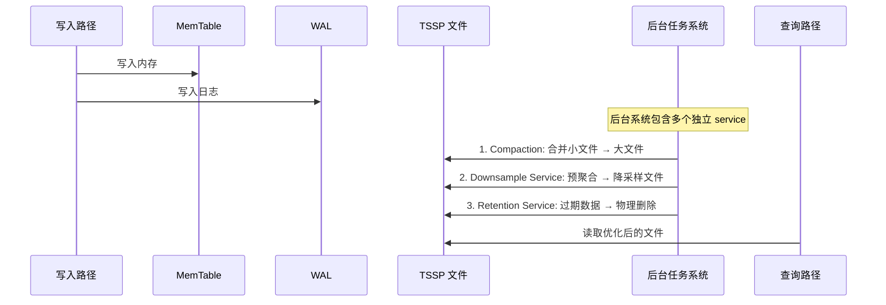
```mermaid
sequenceDiagram
    participant Write as 写入路径
    participant Mem as MemTable
    participant WAL as WAL
    participant TSSP as TSSP 文件
    participant BG as 后台任务系统
    participant Query as 查询路径

    Write->>Mem: 写入内存
    Write->>WAL: 写入日志

    Note over BG: 后台系统包含多个独立 service

    BG->>TSSP: 1. Compaction: 合并小文件 → 大文件
    BG->>TSSP: 2. Downsample Service: 预聚合 → 降采样文件
    BG->>TSSP: 3. Retention Service: 过期数据 → 物理删除

    Query->>TSSP: 读取优化后的文件
```

**通俗解释**：
- 写入数据先进 MemTable + WAL，最终 flush 到 TSSP 文件
- 但 TSSP 文件会越来越多、越来越碎，查询变慢
- **Compaction**：把小文件合并成大文件，减少文件数，提升查询性能
- **Downsample**：把精细数据预聚合成粗粒度数据，节省存储空间
- **Retention**：把过期数据物理删除，释放存储空间
- 这三个能力都在后台自动运行，但不是都由 `Compactor` 调度：`Compactor.run()` 只调度 merger、compact、free/sequencer 释放；Downsample 和 Retention 是独立 service，本章后续只在协调章节说明它们与 compaction 的关系

**核心代码**：`engine/compact.go` — Compactor 全局调度器

```go
// 第 47 行：Compactor 结构体（简化展示，完整定义见 2.1 节）
type Compactor struct {
    mu sync.RWMutex               // 读写锁，保护 sources map
    wg sync.WaitGroup             // 等待所有 shard 注销完成

    sources                  map[uint64]*shard  // shardId → shard 映射
    compactShards            []*shard           // 临时切片，每轮遍历前拷贝
    outOfOrderMergeNumberMin int                // 乱序文件合并最小数量阈值
    outOfOrderMergeSizeMin   int                // 乱序文件合并最小大小阈值

    plans map[uint64][immutable.CompactLevels]map[string][][]uint64  // 压缩计划缓存
}

// 第 59 行：构造函数 — 初始化并启动后台 goroutine
func NewCompactor() *Compactor {
    c := &Compactor{
        sources:                  make(map[uint64]*shard, 32),
        outOfOrderMergeNumberMin: 2,
        outOfOrderMergeSizeMin:   1 * 1024 * 1024,
        plans:                    make(map[uint64][immutable.CompactLevels]map[string][][]uint64, 8),
    }
    go c.run()  // 启动后台 goroutine，开始 10 秒一轮的调度循环
    return c
}
```

**逐行解释**：
- **第 47 行**：`Compactor` 是全局调度器，管理所有 shard 的后台任务
- **第 67 行**：`NewCompactor()` 构造函数中通过 `go c.run()` 启动后台 goroutine（无单独 `Start()` 方法）

**具体例子**：

假设一个时序数据库每天写入 1000 万个数据点：

```
初始状态（第 1 天）：
  MemTable → flush → 10 个 TSSP 文件（每个 100MB）
  查询：需要扫描 10 个文件，速度还行

第 7 天：
  MemTable → flush → 70 个 TSSP 文件（每个 100MB）
  查询：需要扫描 70 个文件，速度变慢！

后台任务自动运行：
  Compaction：把 70 个小文件合并成 7 个大文件（每个 1GB）
  查询：只需要扫描 7 个文件，速度提升 10 倍！

  Downsample：把 1 秒精度的数据聚合成 1 分钟精度
  存储：从 7GB 减少到 700MB，节省 90% 空间！

  Retention：删除 30 天前的过期数据
  空间：释放旧数据占用的磁盘空间
```

---

## 2. Compactor 全局调度器

### 2.1 Compactor 结构体

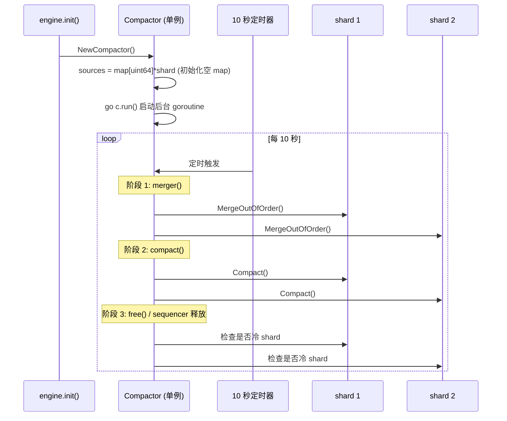
```mermaid
sequenceDiagram
    participant Init as engine.init()
    participant C as Compactor (单例)
    participant Ticker as 10 秒定时器
    participant Shard1 as shard 1
    participant Shard2 as shard 2

    Init->>C: NewCompactor()
    C->>C: sources = map[uint64]*shard (初始化空 map)
    C->>C: go c.run() 启动后台 goroutine

    loop 每 10 秒
        Ticker->>C: 定时触发

        Note over C: 阶段 1: merger()
        C->>Shard1: MergeOutOfOrder()
        C->>Shard2: MergeOutOfOrder()

        Note over C: 阶段 2: compact()
        C->>Shard1: Compact()
        C->>Shard2: Compact()

    Note over C: 阶段 3: free() / sequencer 释放
        C->>Shard1: 检查是否冷 shard
        C->>Shard2: 检查是否冷 shard
    end
```

**核心代码**：`engine/compact.go:47-70`

```go
// 第 47 行：Compactor 结构体定义
type Compactor struct {
    mu sync.RWMutex           // 读写锁，保护 sources map 的并发访问
    wg sync.WaitGroup         // 等待所有 shard 注销完成

    sources                  map[uint64]*shard  // 核心：shardId → shard 的映射表
    compactShards            []*shard           // 临时切片，每轮遍历前从 sources 拷贝
    outOfOrderMergeNumberMin int                // 乱序文件合并的最小数量阈值
    outOfOrderMergeSizeMin   int                // 乱序文件合并的最小大小阈值

    plans map[uint64][immutable.CompactLevels]map[string][][]uint64  // 压缩计划缓存
}

// 第 59 行：构造函数
func NewCompactor() *Compactor {
    c := &Compactor{
        sources:                  make(map[uint64]*shard, 32),  // 预分配 32 个 shard 的容量
        outOfOrderMergeNumberMin: 2,                            // 至少 2 个乱序文件才合并
        outOfOrderMergeSizeMin:   1 * 1024 * 1024,              // 至少 1MB 才合并
        plans:                    make(map[uint64][immutable.CompactLevels]map[string][][]uint64, 8),
    }

    go c.run()  // 启动后台 goroutine，开始 10 秒一轮的调度循环

    return c
}
```

**逐行解释**：
- **第 48 行**：`sync.RWMutex` 读写锁，允许多个读操作并发，但写操作（注册/注销 shard）互斥
- **第 49 行**：`sync.WaitGroup` 用于进程退出时等待所有 shard 清理完成
- **第 51 行**：`sources` 是核心数据结构，存储所有已注册的 shard，key 是 shardId
- **第 52 行**：`compactShards` 是临时切片，每轮遍历前从 sources 拷贝出来，避免长时间持锁
- **第 53-54 行**：乱序文件合并的阈值，至少 2 个文件且总大小 >= 1MB 才触发合并
- **第 61 行**：预分配容量 32，减少 map 扩容开销
- **第 67 行**：`go c.run()` 启动后台 goroutine，这是 Compactor 的心跳循环

**具体例子**：

假设系统中有 3 个 shard：

```
Compactor 初始化后：
  sources = {}（空 map）
  compactShards = []（空切片）
  outOfOrderMergeNumberMin = 2（至少 2 个乱序文件才合并）
  outOfOrderMergeSizeMin = 1MB（至少 1MB 才合并）

shard 1 注册后：
  sources = {1: shard1}
  wg = 1

shard 2 注册后：
  sources = {1: shard1, 2: shard2}
  wg = 2

shard 3 注册后：
  sources = {1: shard1, 2: shard2, 3: shard3}
  wg = 3

每 10 秒触发一次：
  第 1 轮：merger() → compact() → free()
  第 2 轮：merger() → compact() → free()
  ...
```

### 2.2 Shard 注册与注销

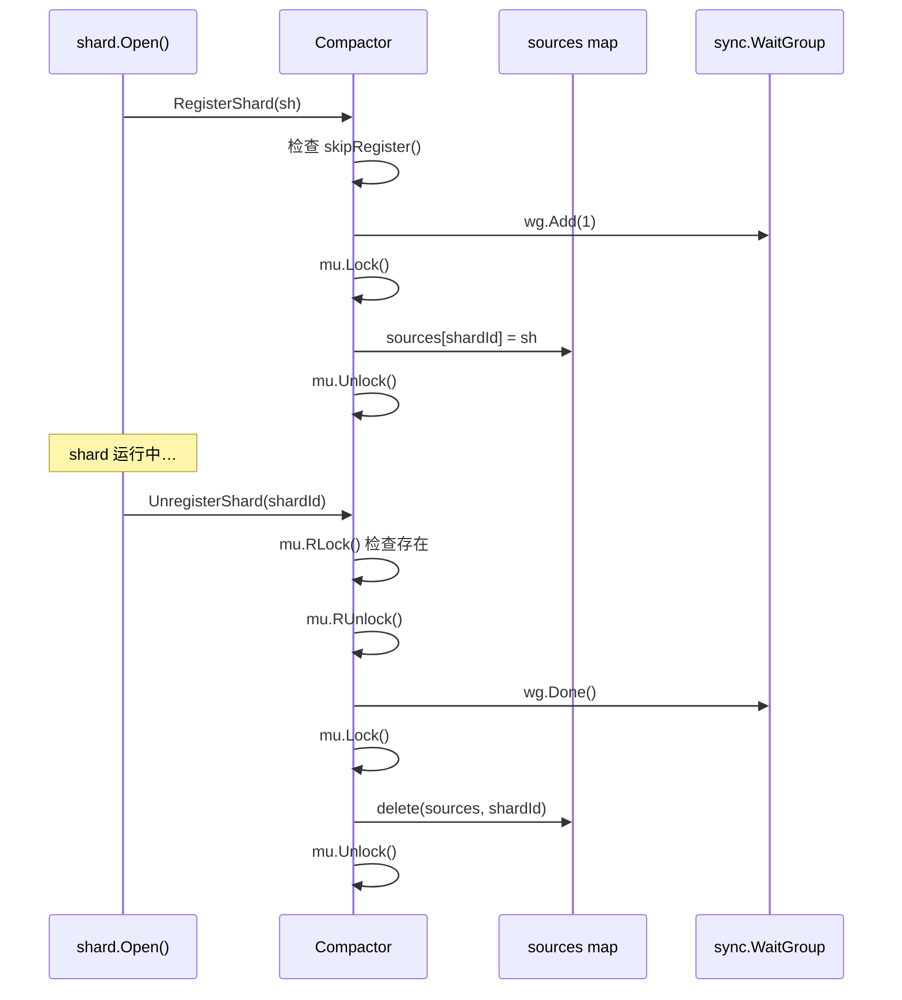
```mermaid
sequenceDiagram
    participant Shard as shard.Open()
    participant C as Compactor
    participant Sources as sources map
    participant WG as sync.WaitGroup

    Shard->>C: RegisterShard(sh)
    C->>C: 检查 skipRegister()
    C->>WG: wg.Add(1)
    C->>C: mu.Lock()
    C->>Sources: sources[shardId] = sh
    C->>C: mu.Unlock()

    Note over Shard: shard 运行中…

    Shard->>C: UnregisterShard(shardId)
    C->>C: mu.RLock() 检查存在
    C->>C: mu.RUnlock()
    C->>WG: wg.Done()
    C->>C: mu.Lock()
    C->>Sources: delete(sources, shardId)
    C->>C: mu.Unlock()
```

**核心代码**：`engine/compact.go:72-96`

```go
// 第 72 行：注册 shard 到 Compactor
func (c *Compactor) RegisterShard(sh *shard) {
    if sh.skipRegister() {  // SkipRegisterColdShard && cold tier 时不注册
        return
    }
    c.wg.Add(1)            // WaitGroup +1，表示有一个 shard 需要管理
    c.mu.Lock()            // 加写锁，因为要修改 sources map
    if _, ok := c.sources[sh.ident.ShardID]; !ok {
        c.sources[sh.ident.ShardID] = sh  // 注册：shardId → shard
    }
    c.mu.Unlock()          // 释放写锁
}

// 第 84 行：从 Compactor 注销 shard
func (c *Compactor) UnregisterShard(shardId uint64) {
    c.mu.RLock()           // 加读锁，先检查是否存在
    if _, ok := c.sources[shardId]; !ok {
        c.mu.RUnlock()     // 不存在就直接返回
        return
    }
    c.mu.RUnlock()         // 释放读锁

    c.wg.Done()            // WaitGroup -1
    c.mu.Lock()            // 加写锁
    delete(c.sources, shardId)  // 从 map 中移除
    c.mu.Unlock()          // 释放写锁
}
```

**逐行解释**：
- **第 73 行**：`skipRegister()` 的当前条件是 `SkipRegisterColdShard && s.isCold()`，也就是配置允许跳过冷 shard 且该 shard 已进入 cold tier；它不是“临时 shard”判断
- **第 76 行**：`wg.Add(1)` 在加锁之前执行；需要注意当前实现即使 shardId 已存在也会先增加 WaitGroup 计数，因此不要把它描述成“重复注册一定安全/计数绝对正确”的去重逻辑
- **第 78 行**：先检查是否已注册，避免重复注册覆盖旧 shard
- **第 85-89 行**：先用读锁检查存在性，不存在就快速返回，避免不必要的写锁竞争
- **第 92 行**：`wg.Done()` 在删除之前执行，确保计数正确

**具体例子**：

假设 shard 1 注册和注销的完整流程：

```
步骤 1：shard.Open() 被调用
  → 调用 RegisterShard(shard1)

步骤 2：RegisterShard 执行
  → skipRegister() = false（需要注册）
  → wg.Add(1) → wg = 1
  → mu.Lock()
  → sources[1] = shard1
  → mu.Unlock()

步骤 3：shard 运行中...
  → Compactor 每 10 秒检查一次
  → 对 shard1 执行 merger()、compact()、free()

步骤 4：shard.Close() 被调用
  → 调用 UnregisterShard(1)

步骤 5：UnregisterShard 执行
  → mu.RLock() → 检查 sources[1] 存在
  → mu.RUnlock()
  → wg.Done() → wg = 0
  → mu.Lock()
  → delete(sources, 1) → sources = {}
  → mu.Unlock()

结果：shard1 从 Compactor 中移除，不再参与压缩
```

### 2.3 主循环 run()

**核心代码**：`engine/compact.go:173-181`

```go
// 第 173 行：Compactor 的心跳循环
func (c *Compactor) run() {
    tm := time.NewTicker(time.Second * 10)  // 创建 10 秒定时器
    defer tm.Stop()                         // 函数退出时停止定时器
    for range tm.C {                        // 每 10 秒触发一次
        c.merger()   // 阶段 1: 合并乱序文件
        c.compact()  // 阶段 2: 层级压缩
        c.free()     // 阶段 3: 释放 sequencer
    }
}
```

**逐行解释**：
- **第 174 行**：`time.NewTicker` 创建一个每 10 秒触发一次的定时器
- **第 176 行**：`for range tm.C` 是 Go 的经典定时循环模式，每次定时器触发时执行循环体
- **第 177 行**：`merger()` 先执行，因为乱序文件需要先合并成有序文件
- **第 178 行**：`compact()` 再执行，对有序文件进行层级压缩

**具体例子**：

假设系统运行了 1 分钟：

```
时间轴：
  00:00 - Compactor 启动，go c.run()
  00:10 - 第 1 轮触发
    → merger()：检查是否有乱序文件需要合并
    → compact()：检查是否有层级压缩需要执行
    → free()：检查是否有冷 shard 需要释放
  00:20 - 第 2 轮触发
    → merger()：发现 3 个乱序文件，执行合并
    → compact()：发现 L0 有 5 个文件，触发 L0→L1 压缩
    → free()：无冷 shard
  00:30 - 第 3 轮触发
    → merger()：无乱序文件
    → compact()：L1 有 8 个文件，触发 L1→L2 压缩
    → free()：发现 shard 3 已经 5 分钟没有写入，释放 sequencer
  ...
  01:00 - 第 6 轮触发
    → 系统稳定运行，压缩任务自动完成
```

**通俗解释**：
主循环就像"定时巡检"。每隔 10 秒，Compactor 就会巡视一遍所有的 shard：
1. **先检查乱序文件**（merger）：有没有需要整理的？
2. **再检查层级压缩**（compact）：有没有需要合并的？
3. **最后检查冷数据**（free）：有没有长时间没用的？

就像一个勤劳的清洁工，每 10 秒打扫一次，保持数据库整洁高效！
- **第 179 行**：`free()` 最后执行，释放冷 shard 的 sequencer

---

## 3. 阶段 1: Merger — 合并乱序文件

### 3.1 Merger 入口

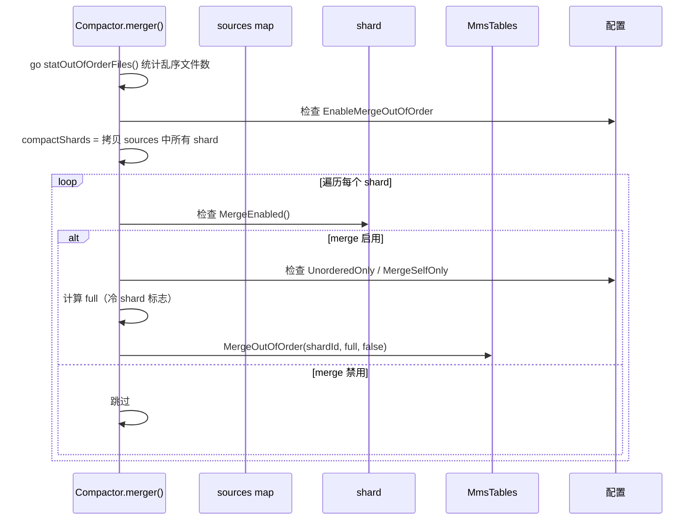
```mermaid
sequenceDiagram
    participant C as Compactor.merger()
    participant Sources as sources map
    participant Shard as shard
    participant Imm as MmsTables
    participant Conf as 配置

    C->>C: go statOutOfOrderFiles() 统计乱序文件数
    C->>Conf: 检查 EnableMergeOutOfOrder

    C->>C: compactShards = 拷贝 sources 中所有 shard

    loop 遍历每个 shard
        C->>Shard: 检查 MergeEnabled()
        alt merge 启用
            C->>Conf: 检查 UnorderedOnly / MergeSelfOnly
            C->>C: 计算 full（冷 shard 标志）
            C->>Imm: MergeOutOfOrder(shardId, full, false)
        else merge 禁用
            C->>C: 跳过
        end
    end
```

**核心代码**：`engine/compact.go:126-158`

```go
// 第 126 行：Merger 阶段入口
func (c *Compactor) merger() {
    go c.statOutOfOrderFiles()  // 异步统计乱序文件数量（用于监控）
    if !immutable.EnableMergeOutOfOrder {
        return  // 全局开关关闭，直接返回
    }

    // 第 132 行：拷贝 shard 列表，避免长时间持锁
    c.compactShards = c.compactShards[:0]  // 重置切片（复用底层数组）
    c.mu.RLock()                           // 加读锁
    for _, v := range c.sources {
        c.compactShards = append(c.compactShards, v)  // 拷贝到临时切片
    }
    c.mu.RUnlock()                         // 释放读锁

    // 第 139 行：遍历每个 shard
    for _, sh := range c.compactShards {
        if !sh.immTables.MergeEnabled() {
            continue  // 该 shard 的 merge 已禁用（比如正在降采样）
        }
        id := sh.GetID()
        select {
        case <-sh.closed.Signal():
            log.Info("closed", zap.Uint64("shardId", id))
            return  // shard 已关闭，退出
        default:
            // 第 149 行：检查是否需要全量合并
            conf := config.GetStoreConfig()
            full := false
            if conf.UnorderedOnly || conf.Merge.MergeSelfOnly {
                d := fasttime.UnixTimestamp() - sh.LastWriteTime()
                full = d >= atomic.LoadUint64(&fullCompColdDuration)  // 冷 shard 标志
            }
            _ = sh.immTables.MergeOutOfOrder(id, full, false)  // 执行合并
        }
    }
}
```

**逐行解释**：
- **第 127 行**：`go statOutOfOrderFiles()` 异步统计乱序文件数量，用于 Prometheus 监控
- **第 128 行**：`EnableMergeOutOfOrder` 是全局开关，可以通过配置关闭
- **第 132 行**：`c.compactShards[:0]` 重置切片长度为 0，但保留底层数组，避免重复分配内存
- **第 133-136 行**：加读锁遍历 sources，拷贝到 compactShards，然后立即释放锁
- **第 140 行**：`MergeEnabled()` 检查该 shard 是否允许合并，降采样时会禁用

**具体例子**：

假设系统中有 3 个 shard，其中 shard 2 正在降采样：

```
merger() 执行流程：

步骤 1：统计乱序文件数
  → 异步统计：shard1 有 5 个乱序文件，shard2 有 3 个，shard3 有 0 个

步骤 2：检查全局开关
  → EnableMergeOutOfOrder = true（开启）

步骤 3：拷贝 shard 列表
  → compactShards = [shard1, shard2, shard3]

步骤 4：遍历每个 shard
  → shard1：MergeEnabled() = true
    → UnorderedOnly = true
  → 计算 full：LastWriteTime = 4000 秒前，fullCompColdDuration = 3600 秒
    → full = false（还没冷）
    → MergeOutOfOrder(1, full=false, false)
    → 执行合并：5 个乱序文件 → 2 个有序文件

  → shard2：MergeEnabled() = false（正在降采样）
    → 跳过

  → shard3：MergeEnabled() = true
    → 没有乱序文件（0 个）
    → MergeOutOfOrder(3, full=false, false)
    → 无需合并
```

**通俗解释**：
Merger 就像"整理书架"。每隔 10 秒，检查每个书架（shard）：
1. **检查是否允许整理**：如果书架正在被别人使用（降采样），就跳过
2. **检查有没有乱序的书**：如果书架上的书摆放混乱（乱序文件），就整理
3. **整理方式**：把乱序的书重新排列，变成有序的
- **第 144 行**：`select` 检查 shard 是否已关闭，`Signal()` 返回一个 chan，关闭时会收到信号
- **第 151-153 行**：计算 `full` 标志，如果 shard 超过 `fullCompColdDuration`（默认 3600s，即 60 分钟）没写入，标记为冷 shard
- **第 155 行**：`MergeOutOfOrder` 执行实际的合并操作

---

## 4. 阶段 2: Compact — 层级压缩（L0-L6）

### 4.1 层级压缩总览

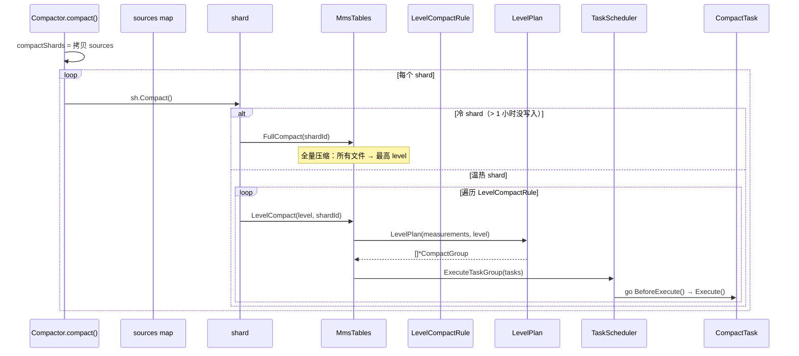
```mermaid
sequenceDiagram
    participant C as Compactor.compact()
    participant Sources as sources map
    participant Shard as shard
    participant Imm as MmsTables
    participant Rule as LevelCompactRule
    participant Plan as LevelPlan
    participant Sched as TaskScheduler
    participant Task as CompactTask

    C->>C: compactShards = 拷贝 sources

    loop 每个 shard
        C->>Shard: sh.Compact()

        alt 冷 shard（> 1 小时没写入）
            Shard->>Imm: FullCompact(shardId)
            Note over Imm: 全量压缩：所有文件 → 最高 level
        else 温热 shard
            loop 遍历 LevelCompactRule
                Shard->>Imm: LevelCompact(level, shardId)
                Imm->>Plan: LevelPlan(measurements, level)
                Plan-->>Imm: []*CompactGroup
                Imm->>Sched: ExecuteTaskGroup(tasks)
                Sched->>Task: go BeforeExecute() → Execute()
            end
        end
    end
```

**核心代码**：`engine/compact.go:160-171`

```go
// 第 160 行：Compact 阶段入口
func (c *Compactor) compact() {
    c.compactShards = c.compactShards[:0]  // 重置切片
    c.mu.RLock()
    for _, v := range c.sources {
        c.compactShards = append(c.compactShards, v)  // 拷贝 shard 列表
    }
    c.mu.RUnlock()

    for _, sh := range c.compactShards {
        _ = sh.Compact()  // 调用 shard 的 Compact 方法
    }
}
```

**逐行解释**：
- **第 161 行**：与 merger 相同的模式：先拷贝 shard 列表，再遍历

**具体例子**：

假设 shard 1 有以下文件分布：

```
初始状态：
  L0: 5 个文件（每个 100MB）← 刚 flush 出来的
  L1: 3 个文件（每个 500MB）
  L2: 2 个文件（每个 1GB）

层级压缩规则：
  L0：文件数 >= 4 时触发 L0→L1 压缩
  L1：文件数 >= 8 时触发 L1→L2 压缩
  L2：文件数 >= 16 时触发 L2→L3 压缩

第 1 轮压缩：
  → 检查 L0：5 个文件 >= 4，触发压缩
  → 选择 L0 的 5 个文件 + L1 的 3 个文件
  → 合并成 2 个新文件（每个 1GB）
  → 结果：L0: 0 个，L1: 2 个，L2: 2 个

第 2 轮压缩：
  → 检查 L0：0 个文件，不触发
  → 检查 L1：2 个文件 < 8，不触发
  → 检查 L2：2 个文件 < 16，不触发
  → 无需压缩

冷 shard（> 1 小时没写入）：
  → 触发全量压缩：所有文件 → 最高 level
  → 结果：L0: 0 个，L1: 0 个，L2: 0 个，L3: 1 个（2.5GB）
```

**通俗解释**：
层级压缩就像"图书馆整理书籍"。图书馆有多个书架（L0-L6），新书先放在入口处（L0），等书多了再整理到里面的书架（L1、L2...）：
1. **L0**：新书临时堆放区，书多了就整理
2. **L1-L6**：按类别摆放的正式书架
3. **整理规则**：当某个书架的书太多时，就把书移到下一级书架
4. **冷书架**：如果某个书架很久没有新书，就把所有书都整理到最里面的书架
- **第 169 行**：`sh.Compact()` 是 shard 级别的压缩入口，内部会判断冷热状态

### 4.2 LevelCompactRule 优先级

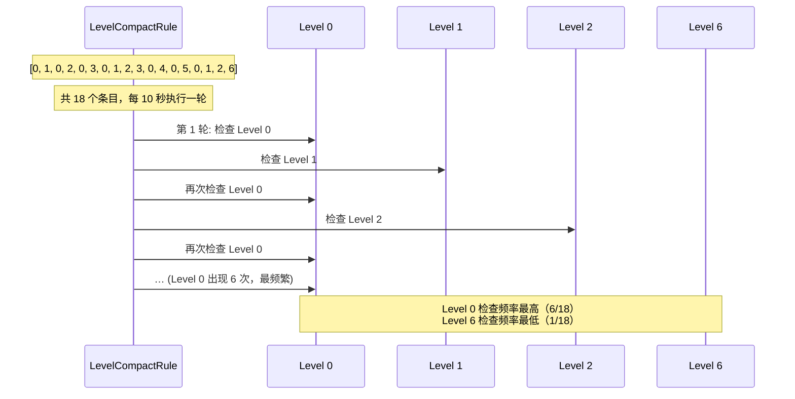
```mermaid
sequenceDiagram
    participant Rule as LevelCompactRule
    participant L0 as Level 0
    participant L1 as Level 1
    participant L2 as Level 2
    participant L6 as Level 6

    Note over Rule: [0, 1, 0, 2, 0, 3, 0, 1, 2, 3, 0, 4, 0, 5, 0, 1, 2, 6]
    Note over Rule: 共 18 个条目，每 10 秒执行一轮

    Rule->>L0: 第 1 轮: 检查 Level 0
    Rule->>L1: 检查 Level 1
    Rule->>L0: 再次检查 Level 0
    Rule->>L2: 检查 Level 2
    Rule->>L0: 再次检查 Level 0
    Rule->>L0: … (Level 0 出现 6 次，最频繁)

    Note over L0,L6: Level 0 检查频率最高（6/18）<br/>Level 6 检查频率最低（1/18）
```

**核心代码**：`engine/immutable/compact.go:38-61`

```go
// 第 38 行：常量定义
const (
    CompactLevels    = 7               // 共 7 个 level (L0-L6)
    minFileSizeLimit = 1 * 1024 * 1024 // 最小文件大小 1MB
)

// 第 43 行：全局变量
var (
    fullCompactingCount   int64                    // 当前正在执行的全量压缩任务数
    maxFullCompactor      = cpu.GetCpuNum() / 2    // 全量压缩最大并发数 = CPU 核数 / 2
    maxCompactor          = cpu.GetCpuNum()        // 普通压缩最大并发数 = CPU 核数
    compLimiter           = limiter.NewFixed(maxCompactor)  // 全局并发限制器（channel 实现）

    // 第 52 行：层级压缩规则 — 决定每轮检查哪个 level
    LevelCompactRule = []uint16{0, 1, 0, 2, 0, 3, 0, 1, 2, 3, 0, 4, 0, 5, 0, 1, 2, 6}

    // 第 54 行：每个 level 触发压缩所需的最小文件数
    LeveLMinGroupFiles = [CompactLevels]int{8, 4, 4, 4, 4, 4, 2}
    //                     L0  L1 L2 L3 L4 L5 L6
    //                     8   4  4  4  4  4  2
)
```

**逐行解释**：
- **第 39 行**：`CompactLevels = 7` 表示有 7 个层级（L0 到 L6）
- **第 44 行**：`fullCompactingCount` 用 `atomic` 操作，无锁计数
- **第 45 行**：`maxFullCompactor = CPU/2` 全量压缩很重，限制为 CPU 核数的一半
- **第 46 行**：`maxCompactor = CPU` 普通压缩限制为 CPU 核数
- **第 47 行**：`compLimiter` 是一个带 buffer 的 channel，buffer 大小 = maxCompactor，实现信号量
- **第 52 行**：`LevelCompactRule` 是压缩调度的核心，18 个条目中 L0 出现 6 次（33%），L6 只出现 1 次（5.5%），确保低 level 优先压缩
- **第 54 行**：L0 需要 8 个文件才触发，L1-L5 需要 4 个，L6 只需要 2 个

**具体例子**：

假设系统有 4 个 CPU 核心：

```
并发限制：
  maxFullCompactor = 4 / 2 = 2（全量压缩最多 2 个并发）
  maxCompactor = 4（普通压缩最多 4 个并发）
  compLimiter = channel(buffer=4)

LevelCompactRule = [0, 1, 0, 2, 0, 3, 0, 1, 2, 3, 0, 4, 0, 5, 0, 1, 2, 6]

第 1 轮（18 个检查）：
  检查 1: Level 0 → 有 10 个文件 >= 8，触发压缩
  检查 2: Level 1 → 有 3 个文件 < 4，跳过
  检查 3: Level 0 → 已经在压缩，跳过
  检查 4: Level 2 → 有 5 个文件 >= 4，触发压缩
  检查 5: Level 0 → 已经在压缩，跳过
  检查 6: Level 3 → 有 2 个文件 < 4，跳过
  ...
  检查 18: Level 6 → 有 1 个文件 < 2，跳过

结果：
  Level 0: 压缩中（10 个文件 → 3 个文件）
  Level 2: 压缩中（5 个文件 → 2 个文件）
  其他 level：等待下一轮
```

**通俗解释**：
LevelCompactRule 就像"巡检排班表"。18 个检查项中，Level 0 被安排了 6 次（最频繁），Level 6 只安排了 1 次（最少）。这样确保：
1. **新数据优先处理**：Level 0 存放最新 flush 的数据，需要最频繁检查
2. **老数据延后处理**：Level 6 存放最老的数据，检查频率最低
3. **避免资源争抢**：每次只检查一个 level，避免多个 level 同时压缩

### 4.3 LevelPlan 生成

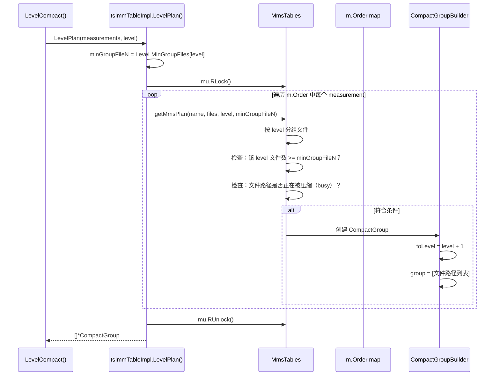
```mermaid
sequenceDiagram
    participant Caller as LevelCompact()
    participant Plan as tsImmTableImpl.LevelPlan()
    participant Mms as MmsTables
    participant Order as m.Order map
    participant Builder as CompactGroupBuilder

    Caller->>Plan: LevelPlan(measurements, level)
    Plan->>Plan: minGroupFileN = LeveLMinGroupFiles[level]

    Plan->>Mms: mu.RLock()
    loop 遍历 m.Order 中每个 measurement
        Plan->>Mms: getMmsPlan(name, files, level, minGroupFileN)
        Mms->>Mms: 按 level 分组文件
        Mms->>Mms: 检查：该 level 文件数 >= minGroupFileN？
        Mms->>Mms: 检查：文件路径是否正在被压缩（busy）？

        alt 符合条件
            Mms->>Builder: 创建 CompactGroup
            Builder->>Builder: toLevel = level + 1
            Builder->>Builder: group = [文件路径列表]
        end
    end
    Plan->>Mms: mu.RUnlock()

    Plan-->>Caller: []*CompactGroup
```

**核心代码**：`engine/immutable/ts_mms_tables.go:153-169`

```go
// 第 153 行：生成某个 level 的压缩计划
func (t *tsImmTableImpl) LevelPlan(m *MmsTables, level uint16) []*CompactGroup {
    if !m.CompactionEnabled() {
        return nil  // 压缩已禁用，返回空
    }
    var plans []*CompactGroup
    minGroupFileN := LeveLMinGroupFiles[level]  // 获取该 level 的最小文件数阈值

    m.mu.RLock()                          // 加读锁保护 m.Order map
    for k, v := range m.Order {           // 遍历所有 measurement
        if m.isClosed() || m.isCompMergeStopped() {
            break  // shard 关闭或压缩停止，退出
        }
        plans = m.getMmsPlan(k, v, level, minGroupFileN, plans)  // 为该 measurement 生成计划
    }
    m.mu.RUnlock()                        // 释放读锁
    return plans
}
```

**逐行解释**：
- **第 158 行**：`LeveLMinGroupFiles[level]` 获取阈值，L0=8, L1-L5=4, L6=2
- **第 161 行**：`m.Order` 是 `map[string]*TSSPFiles`，key 是 measurement 名
- **第 165 行**：`getMmsPlan` 检查该 measurement 在指定 level 的文件数是否 >= 阈值，且文件路径没被其他任务占用

### 4.4 CompactTask 执行

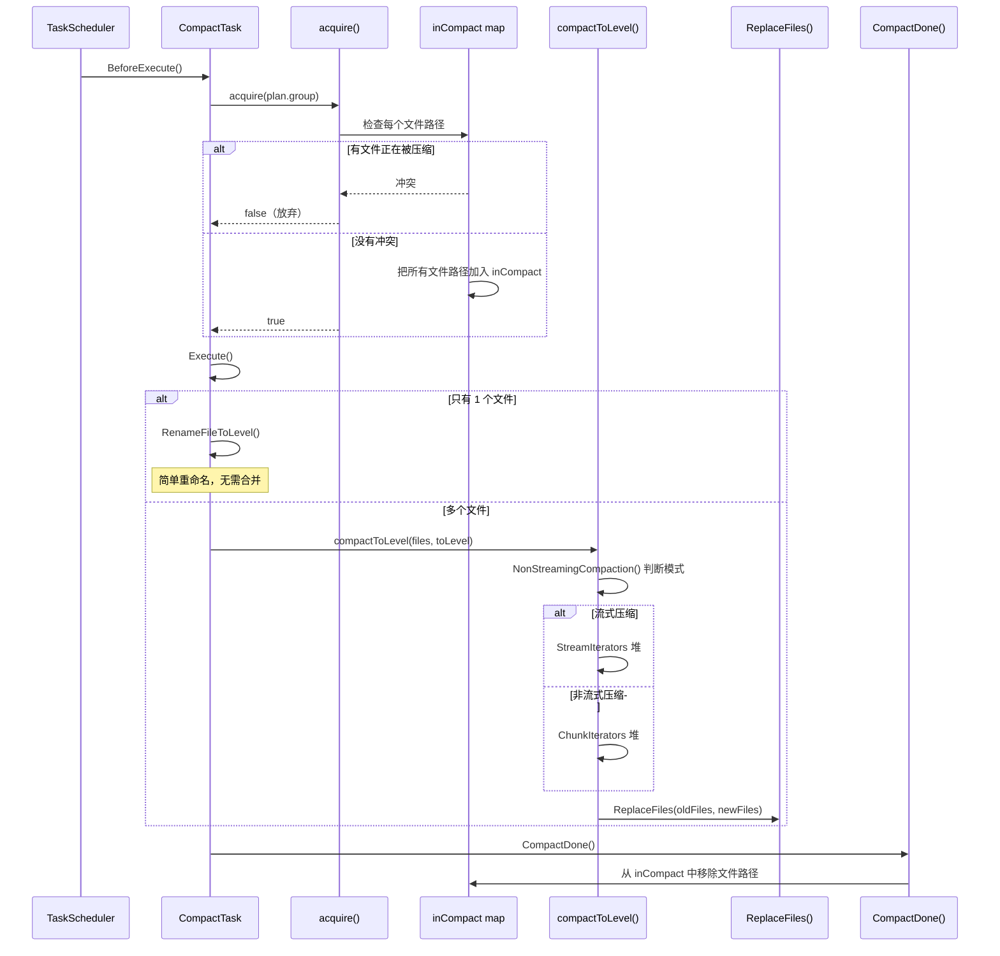
```mermaid
sequenceDiagram
    participant Sched as TaskScheduler
    participant Task as CompactTask
    participant Acquire as acquire()
    participant InCompact as inCompact map
    participant Compact as compactToLevel()
    participant Replace as ReplaceFiles()
    participant Done as CompactDone()

    Sched->>Task: BeforeExecute()
    Task->>Acquire: acquire(plan.group)
    Acquire->>InCompact: 检查每个文件路径

    alt 有文件正在被压缩
        InCompact-->>Acquire: 冲突
        Acquire-->>Task: false（放弃）
    else 没有冲突
        InCompact->>InCompact: 把所有文件路径加入 inCompact
        Acquire-->>Task: true
    end

    Task->>Task: Execute()

    alt 只有 1 个文件
        Task->>Task: RenameFileToLevel()
        Note over Task: 简单重命名，无需合并
    else 多个文件
        Task->>Compact: compactToLevel(files, toLevel)
        Compact->>Compact: NonStreamingCompaction() 判断模式

        alt 流式压缩
            Compact->>Compact: StreamIterators 堆
        else 非流式压缩
            Compact->>Compact: ChunkIterators 堆
        end

        Compact->>Replace: ReplaceFiles(oldFiles, newFiles)
    end

    Task->>Done: CompactDone()
    Done->>InCompact: 从 inCompact 中移除文件路径
```

**核心代码**：`engine/immutable/task.go:25-111`

```go
// 第 25 行：CompactTask 结构体
type CompactTask struct {
    scheduler.BaseTask       // 嵌入基础任务（UUID、Key、OnFinish 等）

    plan  *CompactGroup      // 压缩计划（包含 measurement 名、文件路径列表、目标 level）
    table *MmsTables         // 所属的 MmsTables（文件管理器）
    full  bool               // 是否是全量压缩
}

// 第 43 行：执行前的准备工作
func (t *CompactTask) BeforeExecute() bool {
    if !t.table.acquire(t.plan.group) {
        return false  // 文件路径冲突，放弃本次压缩
    }
    // 注册完成回调：压缩完成后释放文件路径锁
    t.OnFinish(func() {
        t.table.CompactDone(t.plan.group)       // 从 inCompact 中移除
        t.table.blockCompactStop(t.plan.name)    // 解除 measurement 级别的阻塞
    })
    return true
}

// 第 60 行：实际执行压缩
func (t *CompactTask) Execute() {
    group := t.plan
    m := t.table

    if group.Len() == 1 {
        err := m.RenameFileToLevel(group)  // 单文件：只需重命名到目标 level
        if err != nil {
            log.Error("compact error", zap.Error(err))
        }
        return
    }

    // 第 72 行：多文件压缩
    t.IncrFull(1)  // 如果是全量压缩，计数 +1
    orderWg, inorderWg := m.ImmTable.refMmsTable(m, group.name, false)  // 引用计数 +1
    defer func() {
        if config.GetStoreConfig().Compact.CompactRecovery {
            CompactRecovery(m.path, group)  // 压缩恢复（可选）
        }
        m.ImmTable.unrefMmsTable(orderWg, inorderWg)  // 引用计数 -1
        t.IncrFull(-1)  // 全量压缩计数 -1
    }()

    if !m.CompactionEnabled() {
        return  // 压缩被禁用（可能被降采样禁用）
    }

    // 第 86 行：创建文件迭代器
    fi, err := m.ImmTable.NewFileIterators(m, group)
    if err != nil {
        log.Error(err.Error())
        compactStat.AddErrors(1)
        return
    }

    // 第 94 行：执行层级压缩
    var tmpTSSP = fi.oldFiles[0].Path()
    err = m.ImmTable.compactToLevel(m, fi, t.full, NonStreamingCompaction(fi))
    if err != nil {
        compactStat.AddErrors(1)
        log.Error("compact error", zap.Error(err))
    }
}

// 第 107 行：全量压缩计数管理
func (t *CompactTask) IncrFull(n int64) {
    if t.full {
        atomic.AddInt64(&fullCompactingCount, n)  // 原子操作，无锁
    }
}
```

**逐行解释**：
- **第 26 行**：`BaseTask` 提供通用功能：UUID 生成、Key 哈希、OnFinish 回调链
- **第 44 行**：`acquire()` 检查文件路径是否被其他任务占用，是并发控制的关键
- **第 47-49 行**：`OnFinish` 注册回调，压缩完成时自动执行，无论成功还是失败
- **第 64 行**：`group.Len() == 1` 表示只有一个文件，只需重命名到目标 level，无需合并
- **第 72 行**：`IncrFull(1)` 原子递增全量压缩计数，用于控制全量压缩并发数
- **第 73 行**：`refMmsTable` 增加引用计数，防止压缩期间 measurement 被删除
- **第 82 行**：`CompactionEnabled()` 再次检查，因为可能在等待期间被禁用
- **第 94 行**：`NonStreamingCompaction(fi)` 根据内存估算决定使用流式还是非流式压缩

### 4.5 acquire / CompactDone — 文件路径级锁

**核心代码**：`engine/immutable/mms_tables.go:1085-1121`

```go
// 第 1085 行：尝试锁定文件路径
func (m *MmsTables) acquire(files []string) bool {
    m.inCompLock.Lock()         // 加互斥锁
    defer m.inCompLock.Unlock()

    // 第 1089 行：第一遍扫描 — 检查是否有冲突
    for _, name := range files {
        if _, ok := m.inCompact[name]; ok {
            return false  // 有文件正在被压缩，放弃
        }
    }

    // 第 1095 行：第二遍扫描 — 锁定所有文件路径
    for _, name := range files {
        m.inCompact[name] = struct{}{}  // 加入 inCompact map
    }

    return true  // 锁定成功
}

// 第 1102 行：检查文件是否正在被压缩（只读检查）
func (m *MmsTables) busy(files []string) bool {
    m.inCompLock.RLock()        // 加读锁（允许多个并发检查）
    defer m.inCompLock.RUnlock()

    for i := range files {
        if _, ok := m.inCompact[files[i]]; ok {
            return true  // 有文件正在被压缩
        }
    }
    return false
}

// 第 1115 行：释放文件路径锁
func (m *MmsTables) CompactDone(files []string) {
    m.inCompLock.Lock()
    defer m.inCompLock.Unlock()
    for _, name := range files {
        delete(m.inCompact, name)  // 从 inCompact 中移除
    }
}
```

**逐行解释**：
- **第 1086 行**：`inCompLock` 是互斥锁，保护 `inCompact` map 的并发访问
- **第 1089-1092 行**：第一遍扫描检查冲突，任何文件冲突就放弃整组压缩
- **第 1095-1097 行**：第二遍扫描锁定所有文件，使用 `struct{}{}` 作为 value（零字节，不占内存）
- **第 1103 行**：`busy()` 使用读锁，允许多个 goroutine 并发检查
- **第 1116-1120 行**：`CompactDone()` 释放锁，必须在压缩完成后调用

---

## 5. ReplaceFiles 文件替换协议

### 5.1 替换流程

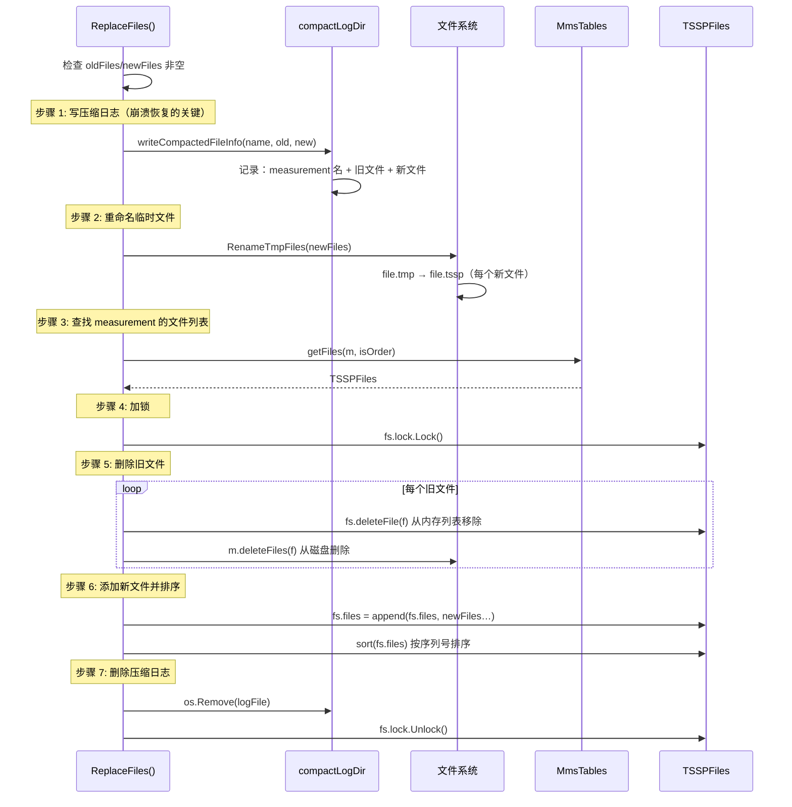
```mermaid
sequenceDiagram
    participant Caller as ReplaceFiles()
    participant Log as compactLogDir
    participant FS as 文件系统
    participant Mms as MmsTables
    participant TSSP as TSSPFiles

    Caller->>Caller: 检查 oldFiles/newFiles 非空

    Note over Caller: 步骤 1: 写压缩日志（崩溃恢复的关键）
    Caller->>Log: writeCompactedFileInfo(name, old, new)
    Log->>Log: 记录：measurement 名 + 旧文件 + 新文件

    Note over Caller: 步骤 2: 重命名临时文件
    Caller->>FS: RenameTmpFiles(newFiles)
    FS->>FS: file.tmp → file.tssp（每个新文件）

    Note over Caller: 步骤 3: 查找 measurement 的文件列表
    Caller->>Mms: getFiles(m, isOrder)
    Mms-->>Caller: TSSPFiles

    Note over Caller: 步骤 4: 加锁
    Caller->>TSSP: fs.lock.Lock()

    Note over Caller: 步骤 5: 删除旧文件
    loop 每个旧文件
        Caller->>TSSP: fs.deleteFile(f) 从内存列表移除
        Caller->>FS: m.deleteFiles(f) 从磁盘删除
    end

    Note over Caller: 步骤 6: 添加新文件并排序
    Caller->>TSSP: fs.files = append(fs.files, newFiles…)
    Caller->>TSSP: sort(fs.files) 按序列号排序

    Note over Caller: 步骤 7: 删除压缩日志
    Caller->>Log: os.Remove(logFile)

    Caller->>TSSP: fs.lock.Unlock()
```

**核心代码**：`engine/immutable/mms_tables.go:849-909`

```go
// 第 849 行：ReplaceFiles — 压缩的最后一步，也是最关键的一步
func (m *MmsTables) ReplaceFiles(name string, oldFiles, newFiles []TSSPFile, isOrder bool) (err error) {
    if len(newFiles) == 0 || len(oldFiles) == 0 {
        return nil  // 空文件列表，无需替换
    }

    defer func() {
        if e := recover(); e != nil {
            err = errno.NewError(errno.RecoverPanic, e)
            log.Error("replace file fail", zap.Error(err))
        }
    }()  // panic 恢复

    // 第 862 行：步骤 1 — 写压缩日志
    var logFile string
    shardDir := filepath.Dir(m.path)
    logFile, err = m.writeCompactedFileInfo(name, oldFiles, newFiles, shardDir, isOrder)
    if err != nil {
        if len(logFile) > 0 {
            lock := fileops.FileLockOption(*m.lock)
            _ = fileops.Remove(logFile, lock)  // 写日志失败，清理日志文件
        }
        m.logger.Error("write compact log fail", ...)
        return
    }

    // 第 873 行：步骤 2 — 重命名临时文件
    if err := RenameTmpFiles(newFiles); err != nil {
        m.logger.Error("rename new file fail", ...)
        return err
    }

    // 第 878 行：步骤 3 — 查找 measurement 的文件列表
    mmsTables := m.ImmTable.getFiles(m, isOrder)
    m.mu.RLock()
    fs, ok := mmsTables[name]
    m.mu.RUnlock()
    if !ok || fs == nil {
        return ErrCompStopped  // measurement 已被删除
    }

    // 第 886 行：步骤 4 — 加锁
    fs.lock.Lock()
    defer fs.lock.Unlock()

    // 第 889 行：步骤 5 — 删除旧文件
    for _, f := range oldFiles {
        if m.isClosed() || m.isCompMergeStopped() {
            return ErrCompStopped  // shard 关闭或压缩停止
        }
        fs.deleteFile(f)           // 从内存列表移除
        if err = m.deleteFiles(f); err != nil {
            return                  // 删除磁盘文件失败
        }
    }

    // 第 899 行：步骤 6 — 添加新文件并排序
    fs.files = append(fs.files, newFiles...)
    sort.Sort(fs)  // 按序列号排序

    // 第 902 行：步骤 7 — 删除压缩日志
    lock := fileops.FileLockOption(*m.lock)
    if err = fileops.Remove(logFile, lock); err != nil {
        m.logger.Error("remove compact log file error", ...)
    }

    return
}
```

**逐行解释**：
- **第 854-858 行**：`defer recover()` 捕获 panic，防止压缩任务崩溃导致整个 Compactor 停止
- **第 863 行**：`writeCompactedFileInfo` 写压缩日志，这是崩溃恢复的关键 — 如果进程在步骤 2-6 之间崩溃，重启时可以根据日志恢复
- **第 873 行**：`RenameTmpFiles` 把 `.tmp` 后缀重命名为 `.tssp`，确保数据不丢失
- **第 886 行**：`fs.lock.Lock()` 是 measurement 级别的锁，防止并发修改同一 measurement 的文件列表
- **第 889-896 行**：遍历旧文件，先从内存列表移除，再从磁盘删除
- **第 899 行**：添加新文件到列表末尾
- **第 900 行**：`sort.Sort(fs)` 按序列号排序，确保文件顺序正确
- **第 902-905 行**：删除压缩日志，标记操作完成

**通俗解释**：
ReplaceFiles 就像"原子换班"：
1. **写日志**（步骤 1）：先记录"我要把旧文件 A、B 换成新文件 C"
2. **重命名**（步骤 2）：新文件从临时名改成正式名
3. **加锁**（步骤 4）：防止别人同时修改文件列表
4. **删除旧文件**（步骤 5）：从列表和磁盘上删除旧文件
5. **添加新文件**（步骤 6）：把新文件加入列表
6. **删日志**（步骤 7）：操作完成，删除日志

如果中间崩溃了：
- 日志还在 → 重启时根据日志恢复
- 日志没了 → 操作已完成，无需恢复

### 5.2 崩溃恢复

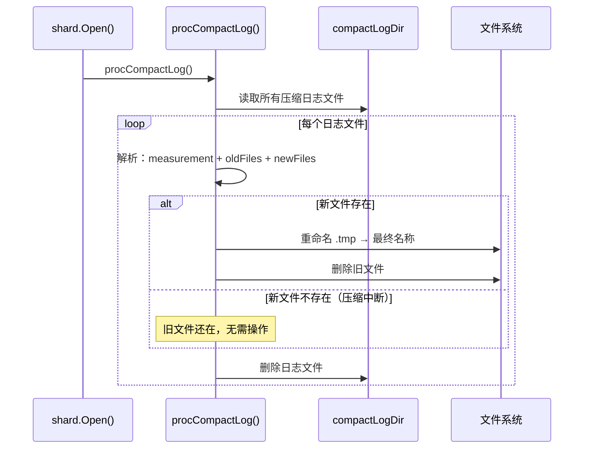
```mermaid
sequenceDiagram
    participant Start as shard.Open()
    participant Recover as procCompactLog()
    participant Log as compactLogDir
    participant FS as 文件系统

    Start->>Recover: procCompactLog()
    Recover->>Log: 读取所有压缩日志文件

    loop 每个日志文件
        Recover->>Recover: 解析：measurement + oldFiles + newFiles

        alt 新文件存在
            Recover->>FS: 重命名 .tmp → 最终名称
            Recover->>FS: 删除旧文件
        else 新文件不存在（压缩中断）
            Note over Recover: 旧文件还在，无需操作
        end

        Recover->>Log: 删除日志文件
    end
```

**通俗解释**：
- 压缩日志记录了"哪些旧文件被替换成了哪些新文件"
- **新文件存在**：说明压缩已完成但替换没做完，继续完成替换
- **新文件不存在**：说明压缩还没完成，旧文件还在，无需操作
- 这个机制确保压缩操作的原子性

---

## 6. 四层并发控制

### 6.1 并发控制总览

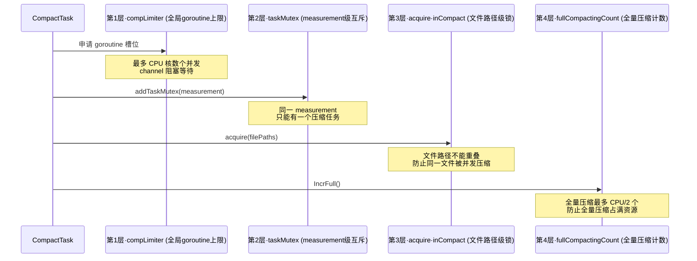
```mermaid
sequenceDiagram
    participant Task as CompactTask
    participant L1 as 第1层·compLimiter (全局goroutine上限)
    participant L2 as 第2层·taskMutex (measurement级互斥)
    participant L3 as 第3层·acquire·inCompact (文件路径级锁)
    participant L4 as 第4层·fullCompactingCount (全量压缩计数)

    Task->>L1: 申请 goroutine 槽位
    Note over L1: 最多 CPU 核数个并发<br/>channel 阻塞等待

    Task->>L2: addTaskMutex(measurement)
    Note over L2: 同一 measurement<br/>只能有一个压缩任务

    Task->>L3: acquire(filePaths)
    Note over L3: 文件路径不能重叠<br/>防止同一文件被并发压缩

    Task->>L4: IncrFull()
    Note over L4: 全量压缩最多 CPU/2 个<br/>防止全量压缩占满资源
```

**通俗解释**：
- **第 1 层 compLimiter**：全局最多 CPU 核数个 goroutine 在做压缩，防止 CPU 打满
- **第 2 层 taskMutex**：同一个 measurement 同时只能有一个压缩任务，防止重复压缩
- **第 3 层 acquire**：文件路径不能重叠，防止同一个文件被两个压缩任务同时操作
- **第 4 层 fullCompactingCount**：全量压缩最多 CPU/2 个，防止全量压缩（很重）占满所有资源

### 6.2 TaskScheduler 执行流程

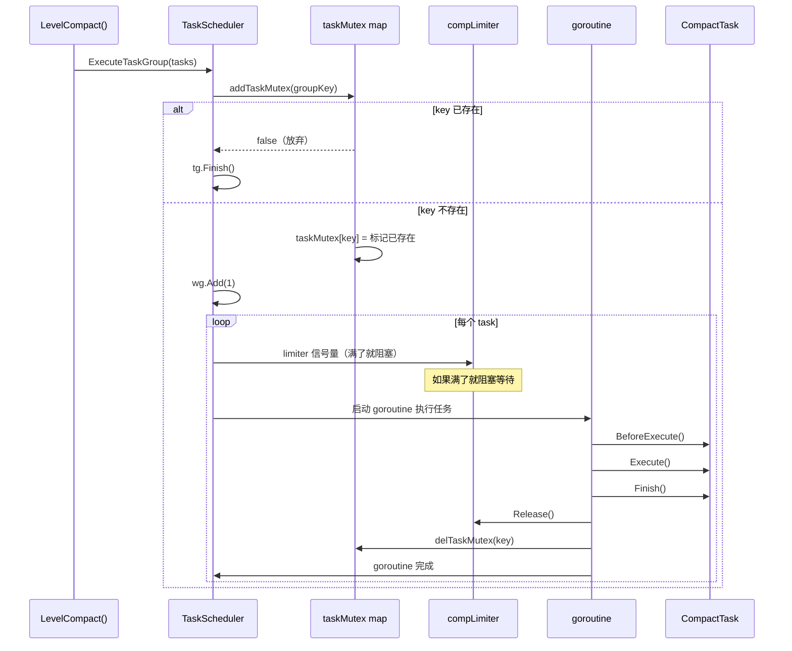
```mermaid
sequenceDiagram
    participant Caller as LevelCompact()
    participant Sched as TaskScheduler
    participant Mutex as taskMutex map
    participant Limiter as compLimiter
    participant Goroutine as goroutine
    participant Task as CompactTask

    Caller->>Sched: ExecuteTaskGroup(tasks)
    Sched->>Mutex: addTaskMutex(groupKey)

    alt key 已存在
        Mutex-->>Sched: false（放弃）
        Sched->>Sched: tg.Finish()
    else key 不存在
        Mutex->>Mutex: taskMutex[key] = 标记已存在
        Sched->>Sched: wg.Add(1)

        loop 每个 task
            Sched->>Limiter: limiter 信号量（满了就阻塞）
            Note over Limiter: 如果满了就阻塞等待

            Sched->>Goroutine: 启动 goroutine 执行任务
            Goroutine->>Task: BeforeExecute()
            Goroutine->>Task: Execute()
            Goroutine->>Task: Finish()
            Goroutine->>Limiter: Release()
            Goroutine->>Mutex: delTaskMutex(key)
            Goroutine->>Sched: goroutine 完成
        end
    end
```

**核心代码**：`lib/scheduler/task_scheduler.go:120-188`

```go
// 第 120 行：执行任务组
func (ts *TaskScheduler) ExecuteTaskGroup(tg *TaskGroup, signal chan struct{}) {
    if !ts.addTaskMutex(tg.Key()) {
        tg.Finish()  // 该 measurement 已有压缩任务在运行，放弃
        return
    }

    // 第 126 行：注册完成回调
    tg.OnFinish(func() {
        ts.wg.Done()              // WaitGroup -1
        ts.delTaskMutex(tg.Key()) // 从 taskMutex 中移除
    })

    // 第 131 行：遍历任务组中的每个任务
    for _, task := range tg.tasks {
        ts.execute(task, signal)  // 执行单个任务
    }
}

// 第 162 行：执行单个任务
func (ts *TaskScheduler) execute(task Task, signal chan struct{}) {
    select {
    case <-ts.closeSignal:
        task.Finish()  // 调度器关闭，结束任务
        return
    case <-signal:
        task.Finish()  // 收到停止信号，结束任务
        return
    case ts.limiter <- struct{}{}:
        // 第 170 行：向 limiter channel 发送数据，如果满了就阻塞
        if !ts.addTask(task) {
            ts.limiter.Release()  // 添加任务失败，释放槽位
            task.Finish()
            return
        }

        // 第 177 行：启动 goroutine 执行任务
        go func() {
            defer func() {
                task.Finish()         // 完成回调（释放文件锁等）
                ts.limiter.Release()  // 释放 limiter 槽位
            }()

            if task.BeforeExecute() {  // acquire 文件锁
                task.Execute()         // 执行压缩
            }
        }()
    }
}
```

**逐行解释**：
- **第 121 行**：`addTaskMutex` 检查该 measurement 是否已有压缩任务，使用 `map[string]struct{}` 实现
- **第 126-129 行**：`OnFinish` 注册回调，任务完成时自动清理
- **第 170 行**：`ts.limiter <- struct{}{}` 是信号量操作，channel 满时阻塞，实现并发限制
- **第 183 行**：`BeforeExecute()` 返回 false 表示文件路径冲突，跳过执行
- **第 178-181 行**：`defer` 确保无论成功还是失败，都会释放 limiter 槽位

**具体例子**：

4 核 CPU 的并发控制过程：

```
配置：compLimiter 容量 = 4（CPU 核数）
      fullCompactingCount 容量 = 2（CPU/2）

Step 1: 4 个压缩任务同时到达
  → Task1: cpu 表 L0→L1
  → Task2: mem 表 L0→L1
  → Task3: disk 表 L0→L1
  → Task4: net 表 L0→L1

Step 2: 第 1 层 compLimiter
  → Task1: limiter <- struct{}{} ✓（1/4）
  → Task2: limiter <- struct{}{} ✓（2/4）
  → Task3: limiter <- struct{}{} ✓（3/4）
  → Task4: limiter <- struct{}{} ✓（4/4）

Step 3: 第 2 层 taskMutex
  → Task1: addTaskMutex("cpu") ✓
  → Task2: addTaskMutex("mem") ✓
  → Task3: addTaskMutex("disk") ✓
  → Task4: addTaskMutex("net") ✓

Step 4: 第 3 层 acquire
  → Task1: acquire(["cpu_001.tssp", "cpu_002.tssp"]) ✓
  → Task2: acquire(["mem_001.tssp", "mem_002.tssp"]) ✓
  → Task3: acquire(["disk_001.tssp", "disk_002.tssp"]) ✓
  → Task4: acquire(["net_001.tssp", "net_002.tssp"]) ✓

Step 5: 第 4 层 fullCompactingCount
  → 如果 Task1-4 都是全量压缩：
    → Task1: IncrFull() ✓（1/2）
    → Task2: IncrFull() ✓（2/2）
    → Task3: IncrFull() 阻塞...（等待 Task1 或 Task2 完成）
    → Task4: IncrFull() 阻塞...
  → 如果 Task1-4 都是增量压缩：
    → 不受 fullCompactingCount 限制
```

---

## 7. 两种压缩模式

### 7.1 流式 vs 非流式决策

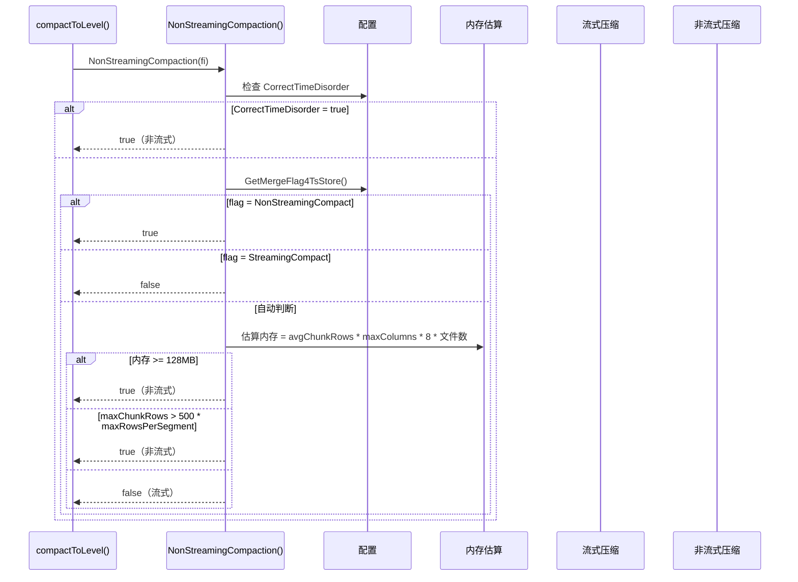
```mermaid
sequenceDiagram
    participant Caller as compactToLevel()
    participant Check as NonStreamingCompaction()
    participant Config as 配置
    participant Mem as 内存估算
    participant Stream as 流式压缩
    participant NonStream as 非流式压缩

    Caller->>Check: NonStreamingCompaction(fi)
    Check->>Config: 检查 CorrectTimeDisorder
    alt CorrectTimeDisorder = true
        Check-->>Caller: true（非流式）
    else
        Check->>Config: GetMergeFlag4TsStore()
        alt flag = NonStreamingCompact
            Check-->>Caller: true
        else flag = StreamingCompact
            Check-->>Caller: false
        else 自动判断
            Check->>Mem: 估算内存 = avgChunkRows * maxColumns * 8 * 文件数
            alt 内存 >= 128MB
                Check-->>Caller: true（非流式）
            else maxChunkRows > 500 * maxRowsPerSegment
                Check-->>Caller: true（非流式）
            else
                Check-->>Caller: false（流式）
            end
        end
    end
```

**核心代码**：`engine/immutable/stream_compact.go:43-76`

```go
// 第 43 行：常量定义
const (
    streamCompactMemThreshold     = 128 * 1024 * 1024  // 128MB 内存阈值
    streamCompactSegmentThreshold = 500                 // segment 行数阈值倍数
)

// 第 54 行：判断是否使用非流式压缩
func NonStreamingCompaction(fi FilesInfo) bool {
    if config.GetStoreConfig().Compact.CorrectTimeDisorder {
        return true  // 纠正时间乱序模式，强制非流式
    }

    flag := GetMergeFlag4TsStore()
    if flag == util.NonStreamingCompact {
        return true  // 配置强制非流式
    } else if flag == util.StreamingCompact {
        return false  // 配置强制流式
    } else {
        // 第 65 行：自动判断 — 估算内存使用量
        n := fi.avgChunkRows * fi.maxColumns * 8 * len(fi.compIts)
        if n >= streamCompactMemThreshold {
            return false  // 内存 >= 128MB，使用流式
        }

        // 第 70 行：检查 chunk 行数是否过大
        if fi.maxChunkRows > GetMaxRowsPerSegment4TsStore()*streamCompactSegmentThreshold {
            return false  // chunk 太大，使用流式
        }

        return true  // 默认使用非流式
    }
}
```

**逐行解释**：
- **第 44 行**：`streamCompactMemThreshold = 128MB`，超过这个值使用流式压缩
- **第 55-57 行**：`CorrectTimeDisorder` 是一个特殊模式，用于纠正时间乱序，强制非流式
- **第 65 行**：内存估算公式：`avgChunkRows * maxColumns * 8字节 * 文件数`
- **第 70 行**：`maxChunkRows` 太大时，非流式压缩的内存压力太大，切换到流式

**具体例子**：

假设有 5 个文件需要压缩，每个文件有 100 个 series，每个 series 有 1000 行：

```
场景 1：小数据量（非流式）
  avgChunkRows = 1000
  maxColumns = 10
  文件数 = 5
  内存估算 = 1000 * 10 * 8 * 5 = 400KB
  400KB < 128MB → 使用非流式压缩
  优点：简单快速，一次读取所有数据

场景 2：大数据量（流式）
  avgChunkRows = 100000
  maxColumns = 100
  文件数 = 50
  内存估算 = 100000 * 100 * 8 * 50 = 4GB
  4GB >= 128MB → 使用流式压缩
  优点：逐 segment 处理，内存占用可控

场景 3：时间乱序（强制非流式）
  CorrectTimeDisorder = true
  → 强制使用非流式压缩
  原因：需要一次性读取所有数据，才能重新排序
```

**通俗解释**：
流式 vs 非流式就像"搬家方式"：
1. **非流式**：把所有东西都装上车，一次性搬到新家
   - 优点：简单快速
   - 缺点：需要大卡车（大内存）
2. **流式**：分批搬，每次搬一部分
   - 优点：小推车就行（小内存）
   - 缺点：需要多次往返（多次 IO）
3. **选择策略**：东西少就一次性搬，东西多就分批搬

### 7.2 compactToLevel 执行

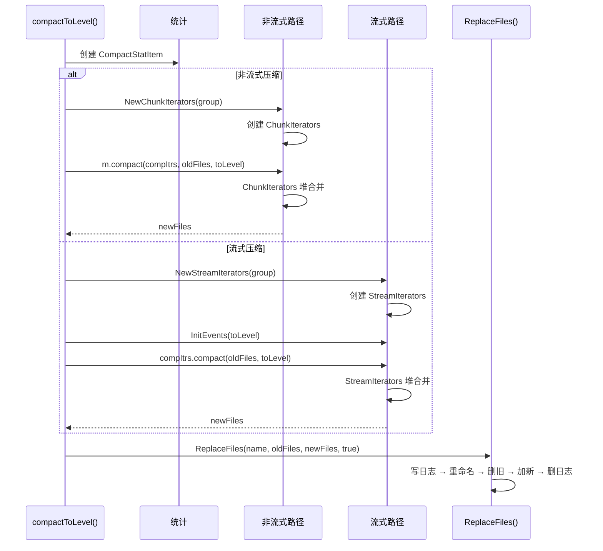
```mermaid
sequenceDiagram
    participant Caller as compactToLevel()
    participant Stat as 统计
    participant NonStream as 非流式路径
    participant Stream as 流式路径
    participant Replace as ReplaceFiles()

    Caller->>Stat: 创建 CompactStatItem

    alt 非流式压缩
        Caller->>NonStream: NewChunkIterators(group)
        NonStream->>NonStream: 创建 ChunkIterators
        Caller->>NonStream: m.compact(compItrs, oldFiles, toLevel)
        NonStream->>NonStream: ChunkIterators 堆合并
        NonStream-->>Caller: newFiles
    else 流式压缩
        Caller->>Stream: NewStreamIterators(group)
        Stream->>Stream: 创建 StreamIterators
        Caller->>Stream: InitEvents(toLevel)
        Caller->>Stream: compItrs.compact(oldFiles, toLevel)
        Stream->>Stream: StreamIterators 堆合并
        Stream-->>Caller: newFiles
    end

    Caller->>Replace: ReplaceFiles(name, oldFiles, newFiles, true)
    Replace->>Replace: 写日志 → 重命名 → 删旧 → 加新 → 删日志
```

**核心代码**：`engine/immutable/ts_mms_tables.go:57-151`

```go
// 第 57 行：compactToLevel — 层级压缩的核心执行函数
func (t *tsImmTableImpl) compactToLevel(m *MmsTables, group FilesInfo, full, isNonStream bool) error {
    compactStatItem := statistics.NewCompactStatItem(group.name, group.shId)
    compactStatItem.Full = full
    compactStatItem.Level = group.toLevel - 1
    compactStat.AddActive(1)  // 活跃压缩任务数 +1
    defer func() {
        compactStat.AddActive(-1)                         // 活跃压缩任务数 -1
        compactStat.PushCompaction(compactStatItem)        // 上报统计
    }()

    // 第 69 行：根据压缩模式选择日志前缀
    var cLog *zap.Logger
    var logEnd func()
    if isNonStream {
        cLog, logEnd = logger.NewOperation(log, "Compaction", group.name)
    } else {
        cLog, logEnd = logger.NewOperation(log, "StreamCompaction", group.name)
    }
    defer logEnd()

    var oldFilesSize int
    var newFiles []TSSPFile
    var compactErr error
    var events *Events
    var success = false

    // 第 86 行：根据模式执行不同的压缩路径
    if isNonStream {
        // 非流式：ChunkIterators 堆合并
        compItrs := m.NewChunkIterators(group)
        if compItrs == nil {
            group.compIts.Close()
            return nil
        }
        compItrs.WithLog(lcLog)
        oldFilesSize = compItrs.estimateSize
        newFiles, compactErr = m.compact(compItrs, group.oldFiles, group.toLevel, true, lcLog)
        compItrs.Close()
    } else {
        // 流式：StreamIterators 堆合并
        compItrs := m.NewStreamIterators(group)
        if compItrs == nil {
            group.compIts.Close()
            return nil
        }

        events = compItrs.InitEvents(group.toLevel)  // 初始化事件系统
        defer func() {
            events.Finish(success, m.getEventContext())  // 确保文件锁释放
        }()

        compItrs.WithLog(lcLog)
        oldFilesSize = compItrs.estimateSize
        newFiles, compactErr = compItrs.compact(group.oldFiles, group.toLevel, true)
        if compactErr != nil {
            compItrs.RemoveTmpFiles()  // 失败时清理临时文件
        }
        compItrs.Close()
    }

    if compactErr != nil {
        return compactErr
    }

    // 第 131 行：替换文件
    if err := m.ReplaceFiles(group.name, group.oldFiles, newFiles, true); err != nil {
        return err
    }

    if !isNonStream {
        NewHotFileManager().AddAll(newFiles)  // 流式压缩的新文件标记为热文件
    }

    success = true
    return nil
}
```

**逐行解释**：
- **第 61-65 行**：统计活跃压缩任务数，`AddActive(1)` 和 `AddActive(-1)` 配对使用
- **第 86 行**：`isNonStream` 决定使用哪种压缩路径
- **第 87 行**：`NewChunkIterators` 创建非流式迭代器，每个文件一个 ChunkIterator
- **第 94 行**：`m.compact` 执行非流式压缩，使用堆合并多个 ChunkIterator
- **第 97 行**：`NewStreamIterators` 创建流式迭代器
- **第 100 行**：`InitEvents` 初始化事件系统，用于流式压缩的文件替换
- **第 111 行**：`compItrs.compact` 执行流式压缩，边合并边编码
- **第 113 行**：失败时清理临时文件，防止磁盘泄漏
- **第 131 行**：`ReplaceFiles` 是原子替换操作（写日志 → 重命名 → 删旧 → 加新 → 删日志）
- **第 136 行**：流式压缩的新文件标记为热文件，用于缓存管理

---

## 8. Downsample 降采样系统

### 8.1 降采样总览

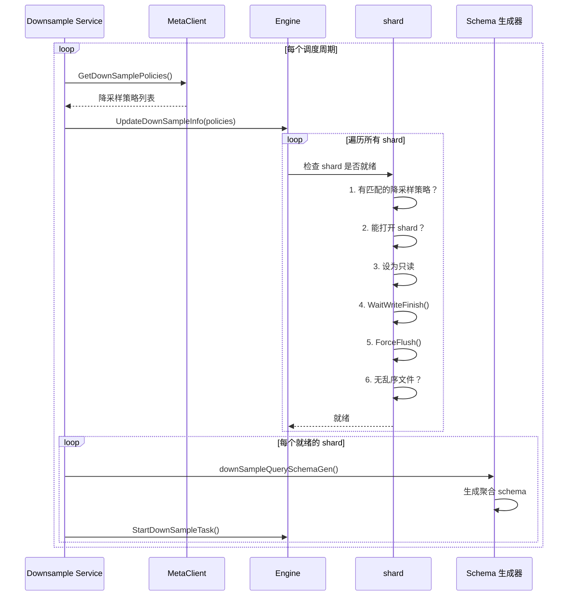
```mermaid
sequenceDiagram
    participant Service as Downsample Service
    participant Meta as MetaClient
    participant Engine as Engine
    participant Shard as shard
    participant Schema as Schema 生成器

    loop 每个调度周期
        Service->>Meta: GetDownSamplePolicies()
        Meta-->>Service: 降采样策略列表

        Service->>Engine: UpdateDownSampleInfo(policies)

        loop 遍历所有 shard
            Engine->>Shard: 检查 shard 是否就绪
            Shard->>Shard: 1. 有匹配的降采样策略？
            Shard->>Shard: 2. 能打开 shard？
            Shard->>Shard: 3. 设为只读
            Shard->>Shard: 4. WaitWriteFinish()
            Shard->>Shard: 5. ForceFlush()
            Shard->>Shard: 6. 无乱序文件？
            Shard-->>Engine: 就绪
        end

        loop 每个就绪的 shard
            Service->>Schema: downSampleQuerySchemaGen()
            Schema->>Schema: 生成聚合 schema
            Service->>Engine: StartDownSampleTask()
        end
    end
```

**具体例子**：

假设有一个降采样策略：1 秒精度 → 1 分钟精度

```
初始状态：
  原始数据：1 秒一个点，1 分钟 = 60 个点
  存储：100MB（1 天的数据）

降采样后：
  降采样数据：1 分钟一个点（sum, count, min, max）
  存储：1.67MB（节省 98.3% 空间！）

降采样过程：
  步骤 1：获取降采样策略
    → 策略：1s → 1m，聚合函数：sum, count, min, max

  步骤 2：检查 shard 是否就绪
    → shard 1：有匹配策略 ✓，能打开 ✓，设为只读 ✓
    → 等待写入完成 → 强制 flush → 无乱序文件 ✓
    → shard 1 就绪

  步骤 3：生成聚合 schema
    → float 字段：sum(value), count(value)
    → integer 字段：min(value), max(value)

  步骤 4：执行降采样任务
    → 读取 1 秒精度数据
    → 按 1 分钟窗口聚合
    → 写入降采样文件

结果：
  原始文件：100MB（1 秒精度）
  降采样文件：1.67MB（1 分钟精度）
  查询 1 小时数据：从扫描 3600 个点减少到 60 个点，速度提升 60 倍！
```

**通俗解释**：
降采样就像"数据摘要"。假设你有一个监控系统，每秒记录一次 CPU 使用率：
- **原始数据**：1 秒一个点，1 天 = 86400 个点
- **降采样后**：1 分钟一个点，1 天 = 1440 个点

降采样时，系统会计算每个 1 分钟窗口的：
- **sum**：所有值的总和
- **count**：数据点数量
- **min**：最小值
- **max**：最大值

这样查询历史数据时，只需要读取降采样后的数据，速度更快，存储更省！

### 8.2 降采样 Schema 生成

> **深入阅读**：降采样的完整机制（多级 Schema 生成、聚合函数重写、崩溃恢复）详见 [Module 5: 降采样系统](./05_downsampling_spec.md)。本节仅概述核心流程。

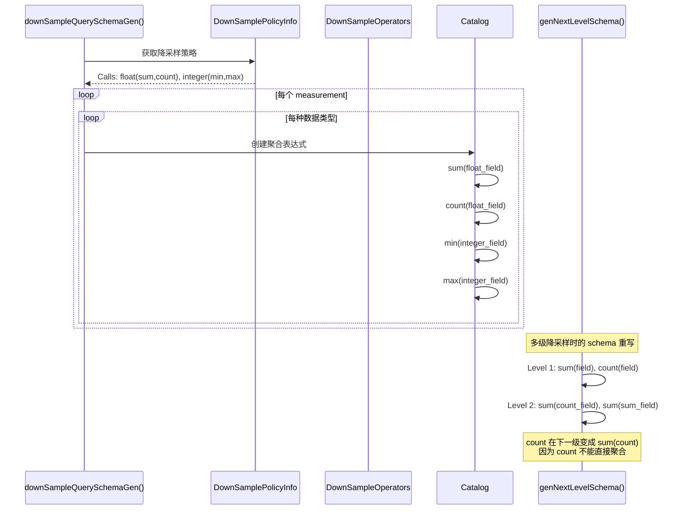
```mermaid
sequenceDiagram
    participant Gen as downSampleQuerySchemaGen()
    participant Policy as DownSamplePolicyInfo
    participant Calls as DownSampleOperators
    participant Schema as Catalog
    participant Next as genNextLevelSchema()

    Gen->>Policy: 获取降采样策略
    Policy-->>Gen: Calls: float(sum,count), integer(min,max)

    loop 每个 measurement
        loop 每种数据类型
            Gen->>Schema: 创建聚合表达式
            Schema->>Schema: sum(float_field)
            Schema->>Schema: count(float_field)
            Schema->>Schema: min(integer_field)
            Schema->>Schema: max(integer_field)
        end
    end

    Note over Next: 多级降采样时的 schema 重写
    Next->>Next: Level 1: sum(field), count(field)
    Next->>Next: Level 2: sum(count_field), sum(sum_field)
    Note over Next: count 在下一级变成 sum(count)<br/>因为 count 不能直接聚合
```

**核心代码**：`services/downsample/functions.go:146-183`

```go
// 第 146 行：生成下一级降采样的查询 Schema
func genNextLevelSchema(s hybridqp.Catalog, timeInterval time.Duration) hybridqp.Catalog {
    fields := s.GetQueryFields()
    renameFields := make([]*influxql.Field, len(fields))
    for i := range renameFields {
        f, _ := influxql.CloneExpr(fields[i].Expr).(*influxql.Call)
        callName := f.Name
        if f.Name == "count" {
            f.Name = "sum"  // count → sum（多个窗口的 count 需要累加）
        }
        rewriteField(f, callName)  // 重写字段名：value → sum_value
        renameFields[i] = &influxql.Field{Expr: f}
    }
    columnNames := s.GetColumnNames()
    opt := genDefaultOpt(s.Options().OptionsName())
    opt.Interval = hybridqp.Interval{Duration: timeInterval}
    return executor.NewQuerySchemaWithSources(renameFields, s.Sources(), columnNames, opt, nil)
}

// 第 168 行：重写字段引用名
func rewriteField(expr influxql.Expr, callName string) {
    c, ok := expr.(*influxql.Call)
    if !ok { return }
    for i := range c.Args {
        v, ok := c.Args[i].(*influxql.VarRef)
        if !ok { return }
        v.Val = callName + "_" + v.Val  // "value" → "sum_value"
        if callName == "count" {
            v.Type = influxql.Integer  // count 的结果是整数
        }
    }
}
```

**逐行解释**：
- **第 147 行**：`GetQueryFields()` 获取当前级别的查询字段
- **第 152-153 行**：`count` → `sum`，因为多个窗口的 count 需要累加
- **第 155 行**：`rewriteField` 重写字段名，如 `value` → `sum_value`
- **第 178 行**：`v.Val = callName + "_" + v.Val` 将字段名加上聚合前缀

### 8.3 降采样崩溃恢复

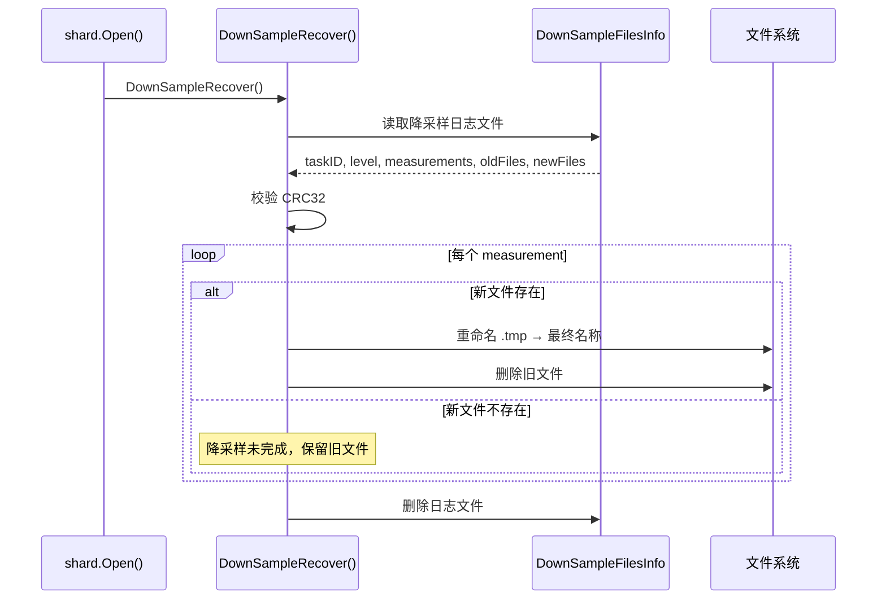
```mermaid
sequenceDiagram
    participant Start as shard.Open()
    participant Recover as DownSampleRecover()
    participant Log as DownSampleFilesInfo
    participant FS as 文件系统

    Start->>Recover: DownSampleRecover()
    Recover->>Log: 读取降采样日志文件
    Log-->>Recover: taskID, level, measurements, oldFiles, newFiles

    Recover->>Recover: 校验 CRC32

    loop 每个 measurement
        alt 新文件存在
            Recover->>FS: 重命名 .tmp → 最终名称
            Recover->>FS: 删除旧文件
        else 新文件不存在
            Note over Recover: 降采样未完成，保留旧文件
        end
    end

    Recover->>Log: 删除日志文件
```

**核心代码**：`engine/downsample_info.go:25-69`

```go
// 第 25 行：DownSampleFilesInfo — 降采样日志结构
type DownSampleFilesInfo struct {
    taskID   uint64       // 任务 ID（unexported）
    level    int          // 降采样级别（unexported）
    Names    []string     // measurement 名称列表
    OldFiles [][]string   // 旧文件路径（每个 measurement 一组）
    NewFiles [][]string   // 新文件路径（每个 measurement 一组）
}

// 第 33 行：重置（复用对象，避免频繁分配）
func (info *DownSampleFilesInfo) reset() {
    info.Names = info.Names[:0]
    info.OldFiles = info.OldFiles[:0]
    info.NewFiles = info.NewFiles[:0]
}

// 第 39 行：序列化（带 CRC32 校验）
func (info DownSampleFilesInfo) marshal(dst []byte) []byte {
    dst = numberenc.MarshalUint64Append(dst, info.taskID)
    dst = numberenc.MarshalInt64Append(dst, int64(info.level))
    // 序列化 Names、OldFiles、NewFiles ...
    valueCrc := crc32.ChecksumIEEE(dst)
    dst = numberenc.MarshalUint32Append(dst, valueCrc)
    return dst
}

// 第 71 行：反序列化（校验 CRC32）
func (info *DownSampleFilesInfo) unmarshal(src []byte) ([]byte, error) {
    info.taskID = numberenc.UnmarshalUint64(src)
    src = src[8:]
    info.level = int(numberenc.UnmarshalInt64(src))
    // 反序列化 Names、OldFiles、NewFiles ...
    return src, nil
}
```

**逐行解释**：
- **第 58 行**：CRC32 校验和确保日志文件没有损坏
- **第 66-69 行**：反序列化时先校验 CRC32，不匹配就报错，防止损坏的日志导致数据丢失

---

## 9. Retention 数据过期删除

### 9.1 两阶段删除

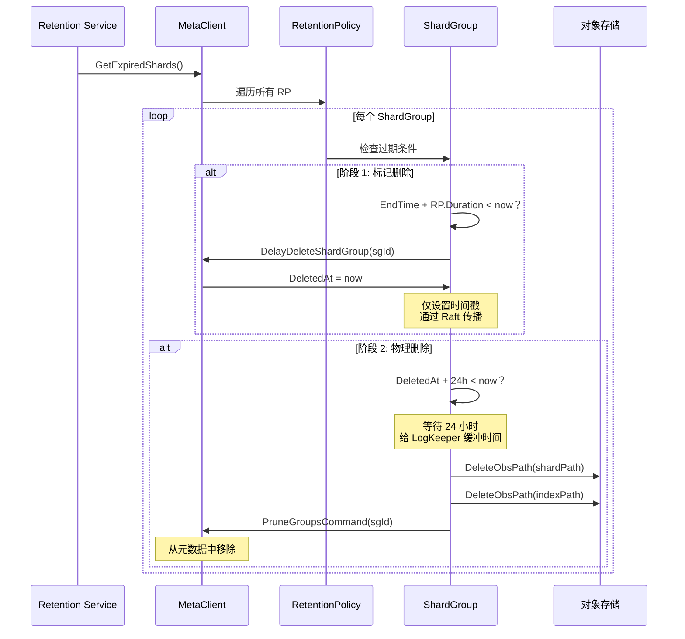
```mermaid
sequenceDiagram
    participant Service as Retention Service
    participant Meta as MetaClient
    participant RP as RetentionPolicy
    participant SG as ShardGroup
    participant OBS as 对象存储

    Service->>Meta: GetExpiredShards()
    Meta->>RP: 遍历所有 RP

    loop 每个 ShardGroup
        RP->>SG: 检查过期条件

        alt 阶段 1: 标记删除
            SG->>SG: EndTime + RP.Duration < now？
            SG->>Meta: DelayDeleteShardGroup(sgId)
            Meta->>SG: DeletedAt = now
            Note over SG: 仅设置时间戳<br/>通过 Raft 传播
        end

        alt 阶段 2: 物理删除
            SG->>SG: DeletedAt + 24h < now？
            Note over SG: 等待 24 小时<br/>给 LogKeeper 缓冲时间

            SG->>OBS: DeleteObsPath(shardPath)
            SG->>OBS: DeleteObsPath(indexPath)
            SG->>Meta: PruneGroupsCommand(sgId)
            Note over Meta: 从元数据中移除
        end
    end
```

**具体例子**：

假设有一个保留策略：数据保留 7 天

```
初始状态：
  ShardGroup 1: 创建时间 = 2024-01-01, 数据范围 = 1月1日-1月2日
  ShardGroup 2: 创建时间 = 2024-01-02, 数据范围 = 1月2日-1月3日
  ...
  ShardGroup 7: 创建时间 = 2024-01-07, 数据范围 = 1月7日-1月8日
  当前时间 = 2024-01-10

阶段 1：标记删除（检查过期）
  → ShardGroup 1: EndTime(1月2日) + Duration(7天) = 1月9日 < 1月10日
    → 标记删除：DeletedAt = 2024-01-10 10:00:00
  → ShardGroup 2: EndTime(1月3日) + Duration(7天) = 1月10日 = 1月10日
    → 不删除（刚好到期，还没过期）
  → ShardGroup 3-7: 未过期，不删除

阶段 2：物理删除（等待 24 小时）
  → 2024-01-11 10:00:00（标记删除后 24 小时）
  → ShardGroup 1: DeletedAt(1月10日) + 24h = 1月11日 < 1月11日
    → 物理删除：删除 OBS 上的数据文件和索引文件
    → 从元数据中移除

结果：
  删除前：7 个 ShardGroup，占用 70GB 空间
  删除后：6 个 ShardGroup，占用 60GB 空间，释放 10GB
```

**通俗解释**：
两阶段删除就像"先贴标签，再清理"：
1. **阶段 1：标记删除**：在过期的书上贴"待处理"标签
   - 检查条件：书的出版日期 + 保留期限 < 当前日期
   - 只贴标签，不立即清理
2. **阶段 2：物理删除**：等待 24 小时后，把贴了标签的书真正移除
   - 等待原因：给备份系统（LogKeeper）缓冲时间
   - 真正删除：从书架上移除，释放空间

**核心代码**：`lib/metaclient/meta_client_impl.go:2048-2072`

```go
// 第 2048 行：延迟删除 ShardGroup（阶段 1：标记删除）
func (c *Client) DelayDeleteShardGroup(database, policy string, id uint64, deletedAt time.Time, deleteType int32) error {
    cmd := &proto2.DeleteShardGroupCommand{
        Database:     proto.String(database),
        Policy:       proto.String(policy),
        ShardGroupID: proto.Uint64(id),
        DeletedAt:    proto.Int64(deletedAt.UnixNano()),
        DeleteType:   proto.Int32(deleteType),
    }
    _, err := c.retryExec(proto2.Command_DeleteShardGroupCommand, proto2.E_DeleteShardGroupCommand_Command, cmd)
    return err
}

// 第 2062 行：物理删除 ShardGroup（阶段 2：清理元数据）
func (c *Client) PruneGroupsCommand(shardGroup bool, id uint64) error {
    cmd := &proto2.PruneGroupsCommand{
        ShardGroup: proto.Bool(shardGroup),
        ID:         proto.Uint64(id),
    }
    _, err := c.retryExec(proto2.Command_PruneGroupsCommand, proto2.E_PruneGroupsCommand_Command, cmd)
    return err
}
```

**逐行解释**：
- **第 2047 行**：`DelayDeleteShardGroup` 只设置 `DeletedAt` 时间戳，不删除数据
- **第 2053 行**：通过 Raft 共识传播，确保所有 meta 节点一致
- **第 2062 行**：`PruneGroupsCommand` 物理删除，从元数据中移除 ShardGroup

### 9.2 删除超时保护

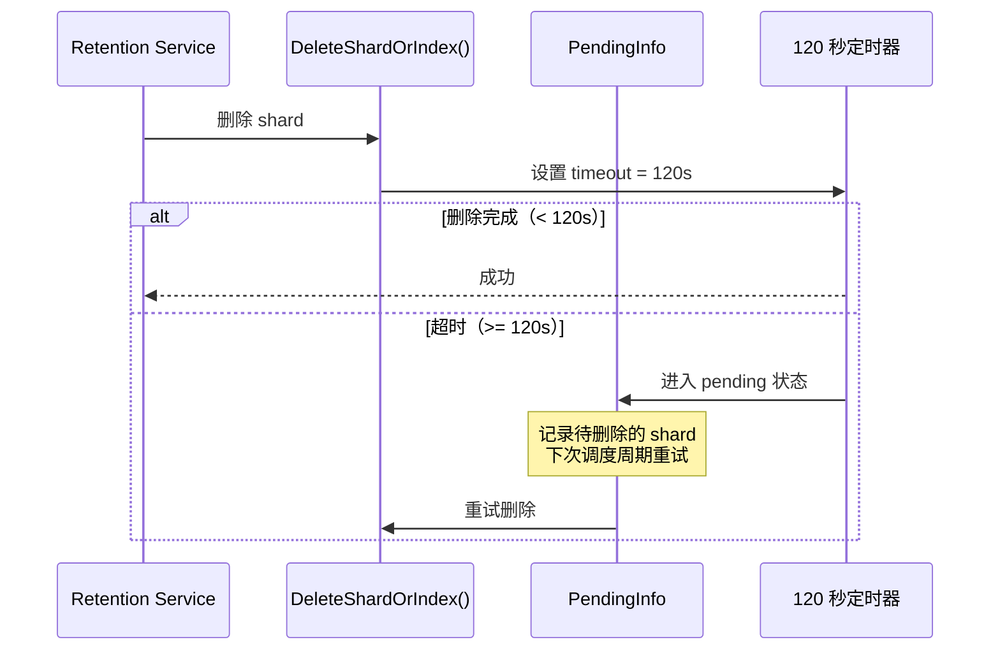
```mermaid
sequenceDiagram
    participant Service as Retention Service
    participant Delete as DeleteShardOrIndex()
    participant Pending as PendingInfo
    participant Timer as 120 秒定时器

    Service->>Delete: 删除 shard
    Delete->>Timer: 设置 timeout = 120s

    alt 删除完成（< 120s）
        Timer-->>Service: 成功
    else 超时（>= 120s）
        Timer->>Pending: 进入 pending 状态
        Note over Pending: 记录待删除的 shard<br/>下次调度周期重试
        Pending->>Delete: 重试删除
    end
```

**通俗解释**：
- 删除操作可能很慢（比如大 shard、网络存储慢）
- 如果删除超过 120 秒，进入 pending 状态，记录待删除的 shard
- 下次调度周期继续重试，不会阻塞整个 retention 服务

---

## 10. Compaction 与 Downsample 的协调

### 10.1 互斥机制

**代码位置**：`engine/immutable/mms_tables.go:232-264`

```go
// 禁用压缩和合并 — 降采样前调用
func (m *MmsTables) DisableCompAndMerge() {
    m.disableCompAndMerge()  // 第一步：设置标志位 + 关闭信号
    m.Wait()                 // 第二步：等待正在运行的压缩/合并完成
}

func (m *MmsTables) disableCompAndMerge() {
    m.inCompLock.Lock()           // 加锁，防止并发修改
    defer m.inCompLock.Unlock()

    if !m.CompactionEnabled() {   // 已经禁用了，直接返回
        return
    }

    m.CompactionDisable()         // 原子操作：compactionEn = 0
    m.MergeDisable()              // 原子操作：mergeEn = 0
    if m.stopCompMerge != nil {
        close(m.stopCompMerge)    // 发信号：通知正在运行的压缩/合并停止
        m.stopCompMerge = nil
    }
}

// 恢复压缩和合并 — 工具方法存在，但当前 StartDownSample 路径未调用
func (m *MmsTables) EnableCompAndMerge() {
    m.inCompLock.Lock()
    defer m.inCompLock.Unlock()

    if m.CompactionEnabled() {    // 已经启用了，直接返回
        return
    }

    m.CompactionEnable()          // 原子操作：compactionEn = 1
    m.MergeEnable()               // 原子操作：mergeEn = 1
    m.stopCompMerge = make(chan struct{})  // 重建停止信号通道
}
```

**逐行解释**：

| 行 | 代码 | 作用 |
|---|------|------|
| 1 | `DisableCompAndMerge()` | 降采样前调用，分两步：先设标志位，再等运行中的任务完成 |
| 2 | `m.disableCompAndMerge()` | 第一步：设置 atomic 标志位 + 关闭 stopCompMerge 通道 |
| 3 | `m.Wait()` | 第二步：阻塞等待正在运行的压缩/合并 goroutine 退出 |
| 4 | `CompactionDisable()` | atomic.StoreInt32(&m.compactionEn, 0) — 原子写 0，压缩器检查到后跳过 |
| 5 | `MergeDisable()` | atomic.StoreInt32(&m.mergeEn, 0) — 原子写 0，合并器检查到后跳过 |
| 6 | `close(m.stopCompMerge)` | 关闭 channel，正在运行的 select 会收到通知并退出 |
| 7 | `EnableCompAndMerge()` | 方法存在；当前 `StartDownSample` 成功/失败路径没有自动调用它恢复压缩和合并 |
| 8 | `CompactionEnable()` | atomic.StoreInt32(&m.compactionEn, 1) — 原子写 1，压缩器恢复工作 |
| 9 | `m.stopCompMerge = make(...)` | 重建信号通道，为下次禁用做准备 |

**具体例子**：

假设 shard 1 正在进行降采样：

```
时间轴：
  00:00 - Downsample Service 开始处理 shard 1
    → DisableCompAndMerge()
    → CompactionDisable()：禁止压缩
    → MergeDisable()：禁止合并

  00:10 - Compactor 定时触发
    → merger()：检查 shard 1
    → MergeEnabled() = false（正在降采样）
    → 跳过 shard 1

  00:20 - Compactor 再次触发
    → compact()：检查 shard 1
    → CompactionEnabled() = false（正在降采样）
    → 跳过 shard 1

  00:30 - Downsample 完成
    → 当前实现未在 StartDownSample 结束时调用 EnableCompAndMerge()
    → CompactionEnable()：允许压缩
    → MergeEnable()：允许合并

  00:40 - Compactor 再次触发
    → merger()：检查 shard 1
    → MergeEnabled() = true（降采样已完成）
    → 正常执行合并
```

**通俗解释**：
互斥机制就像"共享资源的使用规则"。shard 就像一个会议室：
1. **降采样时**：会议室被占用，其他人不能使用
   - 禁止压缩（CompactionDisable）
   - 禁止合并（MergeDisable）
2. **降采样完成后**：会议室空闲，其他人可以使用
   - 允许压缩（CompactionEnable）
   - 允许合并（MergeEnable）

这样确保降采样和压缩不会同时操作同一个 shard，避免数据损坏！

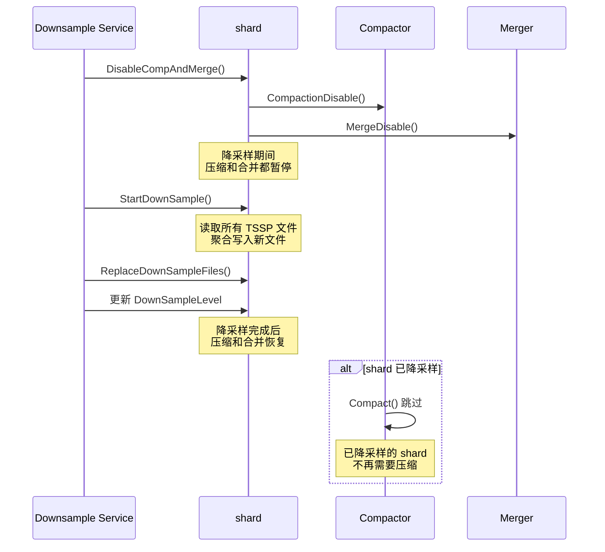
```mermaid
sequenceDiagram
    participant Down as Downsample Service
    participant Shard as shard
    participant Comp as Compactor
    participant Merge as Merger

    Down->>Shard: DisableCompAndMerge()
    Shard->>Comp: CompactionDisable()
    Shard->>Merge: MergeDisable()

    Note over Shard: 降采样期间<br/>压缩和合并都暂停

    Down->>Shard: StartDownSample()
    Note over Shard: 读取所有 TSSP 文件<br/>聚合写入新文件

    Down->>Shard: ReplaceDownSampleFiles()
    Down->>Shard: 更新 DownSampleLevel

    Note over Shard: 降采样完成后<br/>压缩和合并恢复

    alt shard 已降采样
        Comp->>Comp: Compact() 跳过
        Note over Comp: 已降采样的 shard<br/>不再需要压缩
    end
```

**通俗解释**：
- 降采样和压缩是互斥的：降采样时必须禁用压缩
- 因为降采样需要读取稳定的文件集合，压缩会改变文件
- 降采样完成后，shard 标记为已降采样，压缩器跳过它

### 10.2 关闭顺序

```mermaid
sequenceDiagram
    participant Close as shard.Close()
    participant Down as Downsample
    participant Hier as HierarchicalStorage
    participant Comp as Compactor
    participant Mem as MemTable
    participant WAL as WAL

    Close->>Down: DisableDownSample()
    Close->>Down: dswg.Wait()
    Note over Down: 等待降采样完成

    Close->>Hier: DisableHierarchicalStorage()
    Note over Hier: 停止分级存储（冷热数据迁移）

    Close->>Comp: DisableCompAndMerge()

    Close->>Comp: UnregisterShard(shardId)
    Close->>Comp: skIdx.Close()
    Close->>WAL: Close()
    Close->>Mem: waitSnapshot()
```

**通俗解释**：
- shard 关闭时，必须按正确顺序停止后台任务
- 实际顺序：DisableDownSample → DisableHierarchicalStorage → DisableCompAndMerge → UnregisterShard → skIdx.Close → WAL.Close → waitSnapshot
- 这个顺序确保数据一致性

---

## 11. 潜在隐患

### 11.1 压缩文件数量爆炸

```mermaid
sequenceDiagram
    participant Write as 高并发写入
    participant L0 as Level 0
    participant L1 as Level 1
    participant Compact as 压缩器

    Write->>L0: 快速产生大量 L0 文件

    Note over Compact: 每 10 秒检查一次
    Compact->>L0: 需要 8 个文件才触发
    alt 文件产生速度 > 压缩速度
        L0->>L0: 文件堆积
        L0->>L1: 压缩后升到 L1
        L1->>L1: L1 也需要 4 个才触发
        Note over L1: 可能也堆积
    end
```

**隐患**：
- 高并发写入时，L0 文件产生速度可能超过压缩速度
- 每层都有最小文件数要求，可能导致文件堆积
- 查询时需要扫描更多文件，性能下降

### 11.2 降采样期间写入丢失

```mermaid
sequenceDiagram
    participant Write as 写入请求
    participant Shard as shard (只读)
    participant DS as DownSampleWriteDrop

    Write->>Shard: 写入数据
    Shard->>Shard: 检查 ReadOnly
    Shard->>DS: DownSampleWriteDrop = true?
    alt 丢弃模式
        DS-->>Write: 仅跳过 downsample readonly 错误
        Note over Write: 仍会继续受冷 shard 写入开关限制
    else 错误模式
        DS-->>Write: 返回错误
    end
```

**隐患**：
- 降采样期间 shard 是只读的，新写入的数据会被丢弃或返回错误
- 如果 `DownSampleWriteDrop = true`，当前实现只跳过“降采样导致 readonly”的错误；写入 cold shard 时仍会检查冷分片写入开关，不等于所有 readonly 场景都静默丢弃
- 用户需要了解这个行为，避免在降采样期间写入关键数据

### 11.3 Retention 删除延迟

```mermaid
sequenceDiagram
    participant Time as 时间线
    participant SG as ShardGroup
    participant Delete as 删除

    Time->>SG: EndTime + Duration = 过期时间
    Note over SG: 标记删除（DeletedAt）

    Time->>Time: 等待 24 小时

    Time->>Delete: 物理删除
    Note over Delete: 过期后最多 24 小时<br/>数据仍然占用存储空间
```

**隐患**：
- 共享存储模式下，数据过期后还要等 24 小时才物理删除
- 这 24 小时内数据仍然占用存储空间
- 对于存储空间紧张的场景，这个延迟可能是问题

### 11.4 全量压缩资源争抢

```mermaid
sequenceDiagram
    participant Cold as 冷 shard
    participant Hot as 热 shard
    participant Limiter as compLimiter
    participant FullLimiter as fullCompactingCount

    Cold->>FullLimiter: IncrFull(1)
    FullLimiter->>FullLimiter: 检查：count < CPU/2？

    alt 全量压缩已满
        FullLimiter-->>Cold: 阻塞等待
        Note over Hot: 热 shard 的普通压缩<br/>也被 compLimiter 阻塞
    else 全量压缩未满
        Cold->>Limiter: 申请 limiter 槽位
        Limiter->>Limiter: 检查：活跃数 < CPU？
        Note over Cold: 全量压缩占用 1 个槽位<br/>热 shard 可用槽位减少
    end
```

**隐患**：
- 全量压缩很重（合并所有文件到最高 level），可能长时间占用 limiter 槽位
- 虽然有 `fullCompactingCount` 限制为 CPU/2，但仍然可能影响热 shard 的压缩
- 建议：全量压缩使用独立的 limiter，与普通压缩隔离

---

## 13. 端到端实战：一次 Level Compaction 的完整生命周期

> 假设 shard 有 6 个 TSSP 文件分布在 L0-L2，追踪一次 L0→L1 压缩的完整过程。

### 13.1 初始状态

```
Shard 文件分布：
L0: [file1.tssp (10MB), file2.tssp (8MB)]    ← 刚从 MemTable flush 出来
L1: [file3.tssp (50MB), file4.tssp (45MB)]   ← 之前的压缩结果
L2: [file5.tssp (200MB), file6.tssp (180MB)] ← 更早的压缩结果

文件数量：L0=2, L1=2, L2=2
触发条件：L0 文件数 ≥ 2（默认阈值）
```

### 13.2 压缩时序图

```mermaid
sequenceDiagram
    participant Timer as 10s 定时器
    participant Compactor as Compactor.run()
    participant Merger as merger()
    participant Compact as compact()
    participant Task as CompactTask
    participant Acquire as acquire()
    participant Execute as NonStreamingCompaction()
    participant Replace as ReplaceFiles()
    participant Done as CompactDone()

    Timer->>Compactor: 每 10s 触发

    Note over Compactor: ===== 阶段 1: merger() =====
    Compactor->>Merger: merger()
    Merger->>Merger: 检查 MergeOutOfOrder 开关
    Merger->>Merger: 拷贝 shard 列表（compactShards）
    loop 遍历每个 shard
        Merger->>Merger: 检查 MergeEnabled()
        Merger->>Merger: MergeOutOfOrder(shardId, full, false)
    end

    Note over Compactor: ===== 阶段 2: compact()（独立于 merger） =====
    Compactor->>Compact: compact()
    Compact->>Compact: 拷贝 shard 列表（compactShards）
    Compact->>Compact: sh.Compact() → LevelPlan()

    Note over Compact: ===== 构建 CompactTask =====
    Compact->>Task: 创建 CompactTask
    Task->>Task: CompactGroupBuilder.Init()
    Task->>Task: CompactGroupBuilder.AddFile(file1, file2)
    Task->>Task: CompactGroupBuilder.SwitchGroup()
    Note over Task: 输入文件：file1.tssp, file2.tssp<br/>目标 Level：L1<br/>输出文件：file7.tssp (新文件)

    Note over Task: ===== 执行压缩 =====
    Task->>Acquire: acquire(file1, file2)
    Note over Acquire: 标记文件为 inCompact 状态<br/>防止被其他压缩任务选中

    Task->>Execute: NonStreamingCompaction()
    Note over Execute: 读取 file1 + file2 的所有 block<br/>合并排序 → 写入 file7.tssp

    Task->>Replace: ReplaceFiles(old=[file1,file2], new=[file7])
    Note over Replace: 原子替换：从文件列表中移除 file1,file2<br/>添加 file7.tssp

    Task->>Done: CompactDone(file1, file2)
    Note over Done: 清除 inCompact 标记<br/>释放文件引用

    Note over Compact: ===== 更新文件列表 =====
    Compact->>Compact: L0: [] (清空)
    Compact->>Compact: L1: [file3, file4, file7] (新增 file7)
```

### 13.3 Step 1 详解：Compactor.run() — 10 秒定时循环

**代码路径**：`engine/compact.go:173-181`

```go
func (c *Compactor) run() {
    tm := time.NewTicker(time.Second * 10)  // 每 10 秒触发一次
    defer tm.Stop()                         // 退出时停止定时器
    for range tm.C {                        // 每 10 秒执行一轮
        c.merger()   // 阶段 1: 合并乱序文件
        c.compact()  // 阶段 2: 层级压缩
        c.free()     // 阶段 3: 释放冷 shard 的 sequencer
    }
}
```

**逐行解释**：
- `time.NewTicker(time.Second * 10)`：创建 10 秒定时器，与 2.3 节一致
- `for range tm.C`：Go 的经典定时循环模式，每次定时器触发时执行循环体
- `c.merger()`：先执行乱序文件合并，因为乱序文件需要先整理成有序文件
- `c.compact()`：再执行层级压缩，对有序文件进行 L0→L1→L2→...→L6 的逐层合并
- `c.free()`：最后释放冷 shard 的 sequencer，回收资源

### 13.4 Step 2 详解：merger() — 合并乱序文件

**代码路径**：`engine/compact.go:126-158`

```go
func (c *Compactor) merger() {
    go c.statOutOfOrderFiles()  // 异步统计乱序文件数量（用于监控）
    if !immutable.EnableMergeOutOfOrder {
        return  // 全局开关关闭，直接返回
    }

    // 拷贝 shard 列表，避免长时间持锁
    c.compactShards = c.compactShards[:0]  // 重置切片（复用底层数组）
    c.mu.RLock()                           // 加读锁
    for _, v := range c.sources {
        c.compactShards = append(c.compactShards, v)  // 拷贝到临时切片
    }
    c.mu.RUnlock()                         // 释放读锁

    // 遍历每个 shard
    for _, sh := range c.compactShards {
        if !sh.immTables.MergeEnabled() {
            continue  // 该 shard 的 merge 已禁用（比如正在降采样）
        }
        // 检查是否需要全量合并
        conf := config.GetStoreConfig()
        full := false
        if conf.UnorderedOnly || conf.Merge.MergeSelfOnly {
            d := fasttime.UnixTimestamp() - sh.LastWriteTime()
            full = d >= atomic.LoadUint64(&fullCompColdDuration)  // 冷 shard 标志
        }
        _ = sh.immTables.MergeOutOfOrder(sh.GetID(), full, false)  // 执行合并
    }
}
```

**逐行解释**：
- `c.statOutOfOrderFiles()`：异步统计乱序文件数量，用于 Prometheus 监控
- `EnableMergeOutOfOrder`：全局开关，可以通过配置关闭
- `c.compactShards[:0]`：重置切片长度为 0，但保留底层数组，避免重复分配内存
- `sh.immTables.MergeEnabled()`：检查该 shard 是否允许合并，降采样时会禁用
- `sh.immTables.MergeOutOfOrder()`：执行实际的乱序文件合并操作

### 13.5 Step 3 详解：compactToLevel — 实际压缩过程

**代码路径**：`engine/immutable/ts_mms_tables.go:57-151`

```go
func (t *tsImmTableImpl) compactToLevel(m *MmsTables, group FilesInfo, full, isNonStream bool) error {
    compactStatItem := statistics.NewCompactStatItem(group.name, group.shId)
    compactStatItem.Full = full
    compactStatItem.Level = group.toLevel - 1
    compactStat.AddActive(1)  // 活跃压缩任务数 +1
    defer func() {
        compactStat.AddActive(-1)                         // 活跃压缩任务数 -1
        compactStat.PushCompaction(compactStatItem)        // 上报统计
    }()

    var newFiles []TSSPFile
    var compactErr error

    // 根据压缩模式选择不同的执行路径
    if isNonStream {
        // 非流式：ChunkIterators 堆合并
        compItrs := m.NewChunkIterators(group)
        compItrs.WithLog(cLog)
        oldFilesSize = compItrs.estimateSize
        newFiles, compactErr = m.compact(compItrs, group.oldFiles, group.toLevel, true, cLog)
        compItrs.Close()
    } else {
        // 流式：StreamIterators 堆合并
        compItrs := m.NewStreamIterators(group)
        events = compItrs.InitEvents(group.toLevel)
        compItrs.WithLog(cLog)
        oldFilesSize = compItrs.estimateSize
        newFiles, compactErr = compItrs.compact(group.oldFiles, group.toLevel, true)
        compItrs.Close()
    }

    if compactErr != nil {
        return compactErr
    }

    // 原子替换文件
    if err := m.ReplaceFiles(group.name, group.oldFiles, newFiles, true); err != nil {
        return err
    }
    return nil
}
```

**逐行解释**：
- `isNonStream`：由 `NonStreamingCompaction(fi)` 决定（见 7.1 节），根据内存估算选择流式或非流式
- **非流式路径**：`NewChunkIterators` 创建 ChunkIterator，`m.compact()` 执行堆合并
- **流式路径**：`NewStreamIterators` 创建 StreamIterator，`compItrs.compact()` 逐 segment 合并
- `ReplaceFiles`：原子替换旧文件为新文件（写日志→重命名→删旧→加新→删日志）

**NonStreamingCompaction 决策函数**（`engine/immutable/stream_compact.go:54-76`）：

```go
func NonStreamingCompaction(fi FilesInfo) bool {
    if config.GetStoreConfig().Compact.CorrectTimeDisorder {
        return true  // 纠正时间乱序模式，强制非流式
    }
    flag := GetMergeFlag4TsStore()
    if flag == util.NonStreamingCompact {
        return true  // 配置强制非流式
    } else if flag == util.StreamingCompact {
        return false  // 配置强制流式
    } else {
        // 自动判断：估算内存使用量
        n := fi.avgChunkRows * fi.maxColumns * 8 * len(fi.compIts)
        if n >= streamCompactMemThreshold {  // 128MB
            return false  // 内存 >= 128MB，使用流式
        }
        if fi.maxChunkRows > GetMaxRowsPerSegment4TsStore()*streamCompactSegmentThreshold {
            return false  // chunk 太大，使用流式
        }
        return true  // 默认使用非流式
    }
}
```

**压缩前后对比**：
```
压缩前：
L0: [file1.tssp (10MB), file2.tssp (8MB)]
  file1 包含：series A: [t1=10, t2=20, t3=30]
              series B: [t1=100, t2=200]
  file2 包含：series A: [t4=40, t5=50]
              series C: [t1=300]

压缩后：
L1: [file7.tssp (15MB)]
  file7 包含：series A: [t1=10, t2=20, t3=30, t4=40, t5=50]  ← 合并了
              series B: [t1=100, t2=200]
              series C: [t1=300]
```

### 13.6 Step 4 详解：ReplaceFiles — 原子文件替换

**代码路径**：`engine/immutable/mms_tables.go:849-909`

```go
func (m *MmsTables) ReplaceFiles(name string, oldFiles, newFiles []TSSPFile, isOrder bool) (err error) {
    if len(newFiles) == 0 || len(oldFiles) == 0 {
        return nil  // 空文件列表，无需替换
    }

    defer func() {
        if e := recover(); e != nil {
            err = errno.NewError(errno.RecoverPanic, e)
            log.Error("replace file fail", zap.Error(err))
        }
    }()  // panic 恢复

    // 步骤 1: 写压缩日志（崩溃恢复的关键）
    var logFile string
    shardDir := filepath.Dir(m.path)
    logFile, err = m.writeCompactedFileInfo(name, oldFiles, newFiles, shardDir, isOrder)
    if err != nil {
        if len(logFile) > 0 {
            lock := fileops.FileLockOption(*m.lock)
            _ = fileops.Remove(logFile, lock)  // 写日志失败，清理日志文件
        }
        return
    }

    // 步骤 2: 重命名临时文件
    if err := RenameTmpFiles(newFiles); err != nil {
        return err
    }

    // 步骤 3: 查找 measurement 的文件列表
    mmsTables := m.ImmTable.getFiles(m, isOrder)
    m.mu.RLock()
    fs, ok := mmsTables[name]
    m.mu.RUnlock()
    if !ok || fs == nil {
        return ErrCompStopped  // measurement 已被删除
    }

    // 步骤 4: 加锁
    fs.lock.Lock()
    defer fs.lock.Unlock()

    // 步骤 5: 删除旧文件
    for _, f := range oldFiles {
        if m.isClosed() || m.isCompMergeStopped() {
            return ErrCompStopped  // shard 关闭或压缩停止
        }
        fs.deleteFile(f)           // 从内存列表移除
        if err = m.deleteFiles(f); err != nil {
            return                  // 删除磁盘文件失败
        }
    }

    // 步骤 6: 添加新文件并排序
    fs.files = append(fs.files, newFiles...)
    sort.Sort(fs)  // 按序列号排序

    // 步骤 7: 删除压缩日志
    lock := fileops.FileLockOption(*m.lock)
    if err = fileops.Remove(logFile, lock); err != nil {
        m.logger.Error("remove compact log file error", ...)
    }

    return
}
```

**逐行解释**：
- `defer recover()`：捕获 panic，防止压缩任务崩溃导致整个 Compactor 停止
- `writeCompactedFileInfo`：写压缩日志，这是崩溃恢复的关键 — 如果进程在步骤 2-6 之间崩溃，重启时可以根据日志恢复
- `RenameTmpFiles`：把 `.tmp` 后缀重命名为 `.tssp`，确保数据不丢失
- `fs.lock.Lock()`：measurement 级别的锁，防止并发修改同一 measurement 的文件列表
- `fs.deleteFile(f)` + `m.deleteFiles(f)`：先从内存列表移除，再从磁盘删除
- `sort.Sort(fs)`：按序列号排序，确保文件顺序正确
- `fileops.Remove(logFile)`：删除压缩日志，标记操作完成

### 13.7 压缩结果

```
压缩后文件分布：
L0: [] (清空)
L1: [file3.tssp (50MB), file4.tssp (45MB), file7.tssp (15MB)]
L2: [file5.tssp (200MB), file6.tssp (180MB)]

文件数量：L0=0, L1=3, L2=2
L0 文件数降到 0，停止压缩
```

**关键设计点**：
- **Level Compaction**：逐层压缩，L0→L1→L2→...→L6
- **文件数触发**：当某层文件数超过阈值时触发压缩
- **原子替换**：ReplaceFiles 保证文件列表的一致性
- **inCompact 标记**：防止同一个文件被多个压缩任务选中
- **后台执行**：压缩在后台 goroutine 执行，不阻塞写入和查询

**通俗解释**：
Level Compaction 就像"图书馆整理书架"：
- **L0**：新书刚上架，散放在书架上（小文件，乱序）
- **L1**：整理过的书，按类别放好（中等文件，有序）
- **L2**：更早整理的书，按年份放好（大文件，有序）
- **整理过程**：
  1. 检查 L0 书架：新书太多（≥2 本），需要整理
  2. 把 L0 的书和 L1 的书合并
  3. 按类别重新排列
  4. 放回 L1 书架
  5. 清空 L0 书架

好处：
- 书架整洁，找书更快（查询性能提升）
- 新书先放 L0，不影响借书（写入不阻塞）
- 整理在后台进行，不影响正常借阅（后台任务）

---

## 14. TSSP 文件结构深度剖析 — 字节级详解

> 理解 TSSP 文件的内部结构是理解流式合并和乱序合并的前提。本节从字节级别拆解文件的每一个区域。

```mermaid
flowchart TB
    subgraph TSSP["TSSP 文件结构"]
        H["① HEADER (16 bytes)<br/>magic + version"]
        D["② DATA BLOCKS (变长)<br/>所有 series 的编码数据"]
        CM["③ CHUNK META BLOCKS (变长)<br/>每个 series 的元信息"]
        MI["④ META INDEX BLOCKS (变长)<br/>稀疏索引，每个 40 bytes"]
        BFT["⑤ BLOOM FILTER INDEX (40 bytes)<br/>布隆过滤器索引"]
        BF["⑥ BLOOM FILTER BLOCKS (变长)<br/>布隆过滤器数据"]
        TI["⑦ TABLE INDEX (变长)<br/>Trailer，文件尾部索引"]
        TF["⑧ TRAILER FOOTER (8 bytes)<br/>Trailer 偏移量 (int64)"]
    end

    H --> D --> CM --> MI --> BFT --> BF --> TI --> TF
```

### 14.1 TSSP 文件物理布局

**代码位置**：`engine/immutable/table.go:24-28`（magic 和 version），`engine/immutable/trailer.go`（Trailer 结构）

```
TSSP 文件物理布局（从文件头到文件尾）：
┌──────────────────────────────────────────────────────────────────┐
│ ① HEADER (16 bytes)                                              │
│    [8 bytes] magic = "53ac2021" (固定标识符)                       │
│    [8 bytes] version = 2 (uint64, 小端序)                         │
├──────────────────────────────────────────────────────────────────┤
│ ② DATA BLOCKS (变长)                                             │
│    所有 series 的所有列的所有 segment 的编码数据                     │
│    按 series ID 升序排列，同一 series 内按列排列                      │
├──────────────────────────────────────────────────────────────────┤
│ ③ CHUNK META BLOCKS (变长)                                       │
│    每个 ChunkMeta 描述一个 series 在本文件中的元信息                   │
│    按 MetaIndex 分组，每组独立压缩                                   │
├──────────────────────────────────────────────────────────────────┤
│ ④ META INDEX BLOCKS (变长, 每个 40 bytes)                         │
│    稀疏索引：每个 MetaIndex 指向一组 ChunkMeta                       │
│    用于快速定位某个 series 在文件中的位置                              │
├──────────────────────────────────────────────────────────────────┤
│ ⑤ BLOOM FILTER (变长)                                            │
│    布隆过滤器：快速判断某个 series ID 是否在本文件中                    │
├──────────────────────────────────────────────────────────────────┤
│ ⑥ ID-TIME DATA (变长)                                            │
│    压缩的 (seriesID, maxTime) 对                                   │
│    用于 sequencer 快速加载                                         │
├──────────────────────────────────────────────────────────────────┤
│ ⑦ TRAILER (变长)                                                 │
│    文件元数据：各区域的 offset/size + 统计信息                        │
├──────────────────────────────────────────────────────────────────┤
│ ⑧ FOOTER (8 bytes)                                               │
│    [8 bytes] Trailer 的 offset (int64, 小端序)                     │
│    读取时先读这 8 字节，跳转到 Trailer，再解析整个文件                   │
└──────────────────────────────────────────────────────────────────┘
```

**通俗解释**：
- 文件分为 8 个区域，从头到尾依次是：HEADER → DATA → CHUNK META → META INDEX → BLOOM FILTER → ID-TIME → TRAILER → FOOTER
- **读取顺序**：先读 FOOTER（最后 8 字节）→ 得到 Trailer offset → 读 Trailer → 得到各区域 offset/size → 按需读取任意区域
- **写入顺序**：先写 DATA → 再写 CHUNK META → 最后写 META INDEX + BLOOM + TRAILER + FOOTER

### 14.2 HEADER — 文件头（16 字节）

**代码位置**：`engine/immutable/table.go:24-28`

```go
const tableMagic = "53ac2021"                                       // 字符串常量，len=8
const version    = uint64(2)                                        // 8 字节版本号
var fileHeaderSize = len(tableMagic) + int(unsafe.Sizeof(version))  // = 16
```

**字节布局**：
```
偏移    内容                          含义
0x00    35 33 61 63 32 30 32 31      "53ac2021" (magic)
0x08    02 00 00 00 00 00 00 00      version = 2 (小端序)
```

**通俗解释**：
- magic 用于验证文件类型，防止误读非 TSSP 文件
- version 用于兼容性判断，不同版本的文件格式可能不同

### 14.3 DATA BLOCKS — 数据区（变长）

**核心概念**：TSSP 使用**列式存储**，数据按 series → column → segment 三级组织。

```
DATA BLOCKS 内部布局：
┌──────────────────────────────────────────────────────────────────┐
│ Series A (sid=100) 的数据                                         │
│ ┌──────────────────────────────────────────────────────────────┐ │
│ │ Column 0: value (FLOAT)                                      │ │
│ │ ┌──────────────────────────────────────────────────────────┐ │ │
│ │ │ Segment 0 (≤1000 行): [Header][编码后的 float 值]         │ │ │
│ │ ├──────────────────────────────────────────────────────────┤ │ │
│ │ │ Segment 1 (≤1000 行): [Header][编码后的 float 值]         │ │ │
│ │ └──────────────────────────────────────────────────────────┘ │ │
│ ├──────────────────────────────────────────────────────────────┤ │
│ │ Column 1: temperature (FLOAT)                                │ │
│ │ ┌──────────────────────────────────────────────────────────┐ │ │
│ │ │ Segment 0: [Header][编码后的 float 值]                    │ │ │
│ │ ├──────────────────────────────────────────────────────────┤ │ │
│ │ │ Segment 1: [Header][编码后的 float 值]                    │ │ │
│ │ └──────────────────────────────────────────────────────────┘ │ │
│ ├──────────────────────────────────────────────────────────────┤ │
│ │ Column N: time (INT64) — 始终是最后一列                       │ │
│ │ ┌──────────────────────────────────────────────────────────┐ │ │
│ │ │ Segment 0: [Header][编码后的时间戳]                        │ │ │
│ │ ├──────────────────────────────────────────────────────────┤ │ │
│ │ │ Segment 1: [Header][编码后的时间戳]                        │ │ │
│ │ └──────────────────────────────────────────────────────────┘ │ │
│ └──────────────────────────────────────────────────────────────┘ │
├──────────────────────────────────────────────────────────────────┤
│ Series B (sid=200) 的数据                                         │
│ ... (同样的结构)                                                  │
└──────────────────────────────────────────────────────────────────┘
```

**代码位置**：`engine/immutable/stream_compact.go:1135-1210`（编码函数）

```go
// 时间列编码
func encodeTimeColumn(rec *record.Record, col *record.ColVal, ...) {
    // 写入列头
    EncodeColumnHeader(buf, col.Len, col.NilCount, colValType)
    // 编码时间戳
    encoding.EncodeTimestampBlock(col.IntegerValues(), buf)
}

// 普通列编码
func encodeColumn(rec *record.Record, colIdx int, ...) {
    // 写入列头
    EncodeColumnHeader(buf, col.Len, col.NilCount, colValType)
    // 根据类型选择编码器
    switch colValType {
    case influx.Float:
        encoding.EncodeFloatBlock(col.FloatValues(), buf)
    case influx.Integer:
        encoding.EncodeIntegerBlock(col.IntegerValues(), buf)
    case influx.String:
        encoding.EncodeStringBlock(col.ByteValues(), buf)
    case influx.Boolean:
        encoding.EncodeBooleanBlock(col.BooleanValues(), buf)
    }
}
```

**逐行解释**：
- `EncodeColumnHeader`：写入列头，包含行数、nil 数、值类型
- `EncodeTimestampBlock`：时间戳编码（可能使用 delta-of-delta 压缩）
- `EncodeFloatBlock`：浮点数编码（可能使用 XOR 压缩）
- 时间列始终是 `colMeta` 数组的最后一列（`TimeMeta()` 方法）

### 14.4 Segment — 数据分段（核心概念）

**代码位置**：`engine/immutable/tssp_file_meta.go:60-63`

```go
type Segment struct {
    offset int64   // 8 bytes — 在 DATA BLOCKS 中的绝对偏移量
    size   uint32  // 4 bytes — 该 segment 的字节大小
}
// 每个 Segment 占 12 bytes
```

**为什么需要 Segment？**
- 一个 series 可能有几百万行数据，不能全部加载到内存
- 每个 segment 最多 1000 行（`GetMaxRowsPerSegment4TsStore()`），按需读取
- 流式合并的关键：**逐 segment 读取，逐 segment 写入**，内存占用恒定

**Segment 与数据的对应关系**：
```
假设 Series A 有 2500 行数据，分为 3 个 segment：

Segment 0: offset=1000, size=8000   → 行 0-999 (1000 行)
Segment 1: offset=9000, size=8000   → 行 1000-1999 (1000 行)
Segment 2: offset=17000, size=5000  → 行 2000-2499 (500 行)

每个 segment 内部存储的是该列在这些行上的编码值
```

### 14.5 ChunkMeta — series 级元数据

**代码位置**：`engine/immutable/tssp_file_meta.go:377-385`

```go
type ChunkMeta struct {
    sid         uint64         // 8 bytes — series ID
    offset      int64          // 8 bytes — 在 DATA BLOCKS 中的起始偏移
    size        uint32         // 4 bytes — 整个 chunk 的字节大小
    columnCount uint32         // 4 bytes — 列数（fields + time）
    segCount    uint32         // 4 bytes — segment 数量
    timeRange   []SegmentRange // segCount × 16 bytes — 每个 segment 的时间范围
    colMeta     []ColumnMeta   // columnCount 个 — 每列的元数据
}
```

**代码位置**：`engine/immutable/tssp_file_meta.go:103`

```go
type SegmentRange [2]int64  // 16 bytes — [minTime, maxTime]
```

**代码位置**：`engine/immutable/tssp_file_meta.go:145-150`

```go
type ColumnMeta struct {
    name    string      // 2 字节长度前缀 + 列名
    ty      byte        // 1 byte — 字段类型 (Float/Int/String/Boolean)
    preAgg  []byte      // 2 字节长度前缀 + 预聚合数据 (min/max/count)
    entries []Segment   // segCount 个 — 每个 segment 的 offset+size
}
```

**ChunkMeta 完整字节布局示例**：
```
假设 Series A (sid=100) 有 2 列 (value:FLOAT, temperature:FLOAT) + 时间列
2500 行数据，分 3 个 segment

ChunkMeta 字节布局：
┌───────────────────────────────────────────────────────────────┐
│ sid = 100                    [8 bytes]                        │
│ offset = 1000                [8 bytes] — DATA 区中的起始位置   │
│ size = 37000                 [4 bytes] — 整个 chunk 的大小     │
│ columnCount = 3              [4 bytes] — value + temperature + time │
│ segCount = 3                 [4 bytes] — 3 个 segment         │
├───────────────────────────────────────────────────────────────┤
│ timeRange[0] = [t0, t999]    [16 bytes] — segment 0 时间范围  │
│ timeRange[1] = [t1000, t1999][16 bytes] — segment 1 时间范围  │
│ timeRange[2] = [t2000, t2499][16 bytes] — segment 2 时间范围  │
├───────────────────────────────────────────────────────────────┤
│ colMeta[0] (value):                                             │
│   nameLen=5, name="value"   [2+5 bytes]                        │
│   type=FLOAT                [1 byte]                           │
│   preAggLen=24, preAgg      [2+24 bytes] — min/max/count       │
│   entries[0]={off=1000,sz=8000}  [12 bytes]                    │
│   entries[1]={off=9000,sz=8000}  [12 bytes]                    │
│   entries[2]={off=17000,sz=5000} [12 bytes]                    │
├───────────────────────────────────────────────────────────────┤
│ colMeta[1] (temperature):                                       │
│   nameLen=11, name="temperature" [2+11 bytes]                  │
│   type=FLOAT                [1 byte]                           │
│   preAggLen=24, preAgg      [2+24 bytes]                       │
│   entries[0..2]             [36 bytes]                          │
├───────────────────────────────────────────────────────────────┤
│ colMeta[2] (time):                                              │
│   nameLen=4, name="time"    [2+4 bytes]                        │
│   type=INT64                [1 byte]                           │
│   preAggLen=24, preAgg      [2+24 bytes]                       │
│   entries[0..2]             [36 bytes]                          │
└───────────────────────────────────────────────────────────────┘
```

**通俗解释**：
- ChunkMeta 是一个 series 在文件中的"目录"
- 通过 `entries[]` 可以精确定位每个 segment 在 DATA 区的位置
- `preAgg` 存储预聚合数据（min/max/count），查询时可以直接用，不需要读取原始数据

### 14.6 MetaIndex — 稀疏索引

**代码位置**：`engine/immutable/tssp_file_meta.go:744-751`

```go
type MetaIndex struct {
    id      uint64  // 8 bytes — 该块中第一个 series 的 ID
    minTime int64   // 8 bytes — 该块中的最小时间戳
    maxTime int64   // 8 bytes — 该块中的最大时间戳
    offset  int64   // 8 bytes — ChunkMeta 块在文件中的偏移量
    count   uint32  // 4 bytes — 该块包含的 ChunkMeta 数量
    size    uint32  // 4 bytes — ChunkMeta 块的字节大小
}
// 每个 MetaIndex 占 40 bytes
```

**MetaIndex 的作用**：
```
文件中有 1000 个 series，每 50 个 ChunkMeta 分为一组，共 20 个 MetaIndex：

MetaIndex[0]: id=1,  offset=..., count=50  → 指向 ChunkMeta 0-49
MetaIndex[1]: id=51, offset=..., count=50  → 指向 ChunkMeta 50-99
...
MetaIndex[19]: id=951, offset=..., count=50 → 指向 ChunkMeta 950-999

查找 Series ID=300：
1. 二分查找 MetaIndex → 找到 MetaIndex[5] (id=251, count=50)
2. 读取该 MetaIndex 指向的 ChunkMeta 块（50 个 ChunkMeta）
3. 在 ChunkMeta 块中线性查找 sid=300
```

### 14.7 Trailer — 文件元数据

**代码位置**：`engine/immutable/trailer.go:58-65`，`engine/immutable/table_stat.go:35-51`

```go
type Trailer struct {
    dataOffset    int64   // 8 bytes — DATA 区的偏移（始终=16）
    dataSize      int64   // 8 bytes — DATA 区的大小
    indexSize     int64   // 8 bytes — CHUNK META 区的大小
    metaIndexSize int64   // 8 bytes — META INDEX 区的大小
    bloomSize     int64   // 8 bytes — BLOOM FILTER 区的大小
    idTimeSize    int64   // 8 bytes — ID-TIME 区的大小
    TableStat              // 嵌入统计信息
}

type TableStat struct {
    ExtraData                  // 嵌入 ExtraData 结构体（hasMetaHeader, TimeStoreFlag, ChunkMetaCompressFlag 等）
    idCount          int64     // 8 bytes — unique series 数量
    minId, maxId     uint64    // 8+8 bytes — 最小/最大 series ID（注意：uint64 不是 int64）
    minTime, maxTime int64     // 8+8 bytes — 最小/最大时间戳
    metaIndexItemNum int64     // 8 bytes — MetaIndex 条目数
    bloomM, bloomK   uint64    // 8+8 bytes — 布隆过滤器参数 m/k（注意：uint64 不是 int64）
    name             []byte    // 变长 — measurement 名称
}

// ExtraData 嵌入在 TableStat 中，存储文件级别的标志位
type ExtraData struct {
    hasMetaHeader         bool
    TimeStoreFlag         uint8
    ChunkMetaCompressFlag uint8
    size                  int
    ChunkMetaHeader       *ChunkMetaHeader
}
```

**通俗解释**：
- Trailer 是文件的"目录"，记录每个区域的位置和大小
- 读取文件时，先读 FOOTER → 得到 Trailer offset → 读 Trailer → 得到所有区域的 offset/size
- TableStat 包含统计信息，用于快速判断文件是否包含某个时间范围或 series

### 14.8 文件名格式

**代码位置**：`engine/immutable/tssp_file_name.go`

```
文件名格式：<seq>-<level>-<merge><extent>.tssp

示例：00008250-0001-00010001.tssp

各字段含义：
┌──────────┬───────────┬──────────────────────────────────┐
│ 字段     │ 长度      │ 含义                             │
├──────────┼───────────┼──────────────────────────────────┤
│ seq      │ 8 hex     │ 序列号（决定文件排序）              │
│ level    │ 4 hex     │ 压缩级别（0=初始，1=L1，...）      │
│ merge    │ 4 hex     │ 合并级别（每次合并递增）            │
│ extent   │ 4 hex     │ 文件扩展号（文件分裂时递增）        │
└──────────┴───────────┴──────────────────────────────────┘
```

**有序文件 vs 无序文件**：
```
有序文件：data/db/0/measurements/cpu/00008250-0001-00010001.tssp
无序文件：data/db/0/measurements/cpu/out-of-order/00008250-0000-00010001.tssp
                                                          ↑
                                              无序文件存放在 out-of-order/ 子目录
```

---

## 15. 流式合并深度剖析 — 为什么是"流式"？

> "流式"的核心含义：**逐 segment 读取，逐 segment 写入**，内存占用恒定，不随数据量增长。

### 15.1 流式 vs 非流式的本质区别

```
非流式合并（NonStreamingCompaction）：
  读取：整个 chunk（一个 series 的所有行）一次性加载到内存
  内存：O(series行数 × 列数)，可能非常大
  适用：数据量小，或需要修正乱序

流式合并（StreamingCompaction）：
  读取：逐 segment（≤1000 行）加载，处理完一个再读下一个
  内存：O(1000 × 列数)，恒定不变
  适用：数据量大，内存受限
```

### 15.2 流式合并的完整时序图

```mermaid
sequenceDiagram
    participant Heap as StreamIterators (最小堆)
    participant F1 as FileIterator (file1.tssp)
    participant F2 as FileIterator (file2.tssp)
    participant Disk as 磁盘
    participant Acc as 累加器 (c.col)
    participant Out as 输出文件

    Note over Heap: ===== 初始化 =====
    Heap->>F1: 读取第一个 ChunkMeta
    F1->>Disk: ReadChunkMetaData()
    F1-->>Heap: ChunkMeta(sid=100, segCount=3)
    Heap->>F2: 读取第一个 ChunkMeta
    F2->>Disk: ReadChunkMetaData()
    F2-->>Heap: ChunkMeta(sid=100, segCount=2)

    Note over Heap: ===== genChunkSchema: 按 series 分组 =====
    Heap->>Heap: heap.Pop() → 最小 sid=100
    Heap->>Heap: heap.Pop() → 也是 sid=100 → 同一组！
    Heap->>Heap: chunkItrs = [F1, F2] (两个文件的同一 series)
    Heap->>Heap: mergeSchema → 合并列定义

    Note over Heap: ===== compactColumn: 逐列逐 segment 合并 =====

    Note over Heap,F2: 处理 Column 0 (value)
    loop 遍历 F1 的每个 segment
        F1->>Disk: readData(seg0.offset, seg0.size)
        Disk-->>F1: 原始字节
        F1->>Acc: decodeSegment → 追加到累加器
        Note over Acc: 累加器：1000 行
    end
    loop 遍历 F2 的每个 segment
        F2->>Disk: readData(seg0.offset, seg0.size)
        Disk-->>F2: 原始字节
        F2->>Acc: decodeSegment → 追加到累加器
        Note over Acc: 累加器：2000 行
        alt 累加器行数 ≥ maxRowsPerSegment (1000)
            Acc->>Out: writeSegment() → 写入输出文件
            Note over Acc: 累加器清空，继续累加
        end
    end
    Acc->>Out: writeSegment() → 写入剩余数据

    Note over Heap,F2: 处理 Column 1 (temperature) … 同样的流程

    Note over Heap,F2: 处理 Column N (time)
    loop 遍历所有 segment
        F1->>Disk: readData(time segment)
        Disk-->>F1: 时间戳字节
        F1->>F1: validateTimes() → 检查是否有序
        F1->>Acc: decodeSegment → 追加
    end

    Note over Heap: ===== writeMetaToDisk =====
    Heap->>Out: 写入 ChunkMeta + 更新 MetaIndex

    Note over Heap: ===== nextChunk =====
    Heap->>F1: NextChunkMeta() → 下一个 series
    Heap->>F2: NextChunkMeta() → 下一个 series
    Heap->>Heap: 重新 push 回堆
```

### 15.3 代码级详解：genChunkSchema — 按 series 分组

**代码位置**：`engine/immutable/stream_compact.go:321-350`

```go
func (c *StreamIterators) genChunkSchema() {
    // 从堆中弹出最小的 iterator
    itr := heap.Pop(c).(*StreamIterator)
    c.mergeSchema(itr.curtChunkMeta)  // 合并列定义
    id := itr.curtChunkMeta.sid       // 记录当前 series ID
    c.chunkItrs = append(c.chunkItrs[:0], itr)  // 加入当前组

    // 继续弹出所有相同 sid 的 iterator
    for c.Len() > 0 {
        itr = heap.Pop(c).(*StreamIterator)
        if id == itr.curtChunkMeta.sid {
            c.mergeSchema(itr.curtChunkMeta)  // 同一 series → 合并 schema
            c.chunkItrs = append(c.chunkItrs, itr)
        } else {
            heap.Push(c, itr)  // 不同 series → 放回堆
            break
        }
    }
    sort.Sort(c.fields)  // 列名排序，确保输出文件的列顺序一致
}
```

**逐行解释**：
- `heap.Pop(c)`：弹出堆顶元素（最小 sid）
- `id := itr.curtChunkMeta.sid`：记录当前正在处理的 series ID
- 循环弹出所有相同 sid 的 iterator → 这些 iterator 来自不同文件，但都是同一个 series
- `c.mergeSchema()`：合并所有文件的列定义（不同文件可能有不同的列，schema evolution）
- `sort.Sort(c.fields)`：列名排序，保证输出文件的列顺序一致

**关键洞察**：
- 堆的排序规则是 `(sid, minTime)`，所以相同 sid 的 iterator 会连续弹出
- 这一步把"跨文件的多路归并"转化为"同一 series 的多文件合并"
- 合并后 `chunkItrs` 包含了这个 series 在所有文件中的 ChunkMeta

### 15.4 代码级详解：compactColumn — 逐 segment 合并

**代码位置**：`engine/immutable/stream_compact.go:753-871`

```go
func (c *StreamIterators) compactColumn(dstIdx int, ref record.Field, ...) {
    // 从上一次文件分裂遗留的数据开始
    if c.lastSegRows > 0 {
        c.col.AppendColVal(c.lastSeg.ColVals[dstIdx], 0, c.lastSegRows)
    }

    // 遍历每个 iterator（每个文件）
    for itrIndex := c.iteratorStart; itrIndex < len(c.chunkItrs); itrIndex++ {
        itr := c.chunkItrs[itrIndex]
        srcMeta := itr.curtChunkMeta
        tm := srcMeta.TimeMeta()  // 时间列的 ColumnMeta

        // 遍历该 iterator 的每个 segment
        for segIndex := c.segmentIndex; segIndex < len(tm.entries); segIndex++ {
            // ① 从磁盘读取该 segment 的列数据
            colSeg := srcMeta.colMeta[srcColIdx].entries[segIndex]
            segData := itr.readData(colSeg.offset, colSeg.size)

            // ② 解码到临时缓冲区
            c.decodeSegment(segData, tmData, ref)

            // ③ 如果是时间列，验证时间顺序
            if ref.Name == record.TimeField {
                c.validateTimes(c.tmpCol.IntegerValues())
            }

            // ④ 追加到累加器
            c.col.AppendColVal(c.tmpCol, 0, c.tmpCol.Len)

            // ⑤ 如果累加器满了，写入输出文件
            if !c.continueMerge(c.col.Len, maxRowsPerSegment) {
                c.writeSegment(sid, ref, needCalPreAgg)
                c.col.Reset()  // 清空累加器
            }
        }
    }
}
```

**逐行解释**：
- `itr.readData(colSeg.offset, colSeg.size)`：**从磁盘读取一个 segment 的数据**。这是流式的关键——每次只读 ≤1000 行
- `c.decodeSegment()`：解码到临时缓冲区 `c.tmpCol`
- `c.validateTimes()`：如果是时间列，检查是否有序（详见 16 节）
- `c.col.AppendColVal()`：追加到累加器
- `c.writeSegment()`：累加器满了（≥1000 行），写入输出文件，清空累加器

**为什么是"流式"？**

关键在于 `readData()` 只读取一个 segment（≤1000 行），而不是整个 chunk（可能几百万行）。数据像水流一样：

```
磁盘 segment → 解码到 tmpCol → 追加到累加器 c.col → 写入输出文件 → 清空累加器
     ↑                                                              ↓
     └──────────────── 循环读取下一个 segment ────────────────────────┘
```

内存占用始终是 `O(1000 × 列数 × 8 bytes)` ≈ 几十 KB，不会随数据量增长。

### 15.5 代码级详解：validateTimes — 时间顺序验证

**代码位置**：`engine/immutable/stream_compact.go:1060`

```go
func (c *StreamIterators) validateTimes(times []int64) error {
    if c.maxTime >= times[0] {
        // 上一个 segment 的最大时间 ≥ 当前 segment 的最小时间 → 乱序！
        return fmt.Errorf("minimum time is earlier than the maximum time of previous segment: %d >= %d",
            c.maxTime, times[0])
    }
    c.maxTime = times[len(times)-1]  // 更新最大时间
    return nil
}
```

**逐行解释**：
- `c.maxTime`：上一个 segment 的最大时间戳
- `times[0]`：当前 segment 的最小时间戳
- 如果 `c.maxTime >= times[0]`，说明时间不是单调递增的 → **乱序！**
- 流式合并**不允许乱序**，如果检测到乱序会报错

**关键约束**：
- 流式合并要求每个源文件内部的时间列必须是有序的
- 如果存在乱序数据，必须使用非流式合并（`CorrectTimeDisorder=true`）

### 15.6 代码级详解：Flush — 写入文件尾部

**代码位置**：`engine/immutable/stream_compact.go:671-744`

```go
func (c *StreamIterators) Flush() error {
    // ① 写入最后一个 MetaIndex 块
    c.SwitchChunkMeta()

    // ② 生成 Bloom Filter
    c.genBloomFilter()

    // ③ 计算各区域的 offset/size
    c.trailer.dataOffset = int64(fileHeaderSize)  // = 16
    c.trailer.dataSize = c.writer.DataSize() - int64(fileHeaderSize)

    // ④ 把 ChunkMeta 追加到 DATA 区后面
    c.CopyChunkMetaToData()

    // ⑤ 写入 MetaIndex 条目（每个 40 bytes）
    for _, mi := range c.metaIndexItems {
        c.writer.WriteData(mi.Marshal())
    }

    // ⑥ 写入 Bloom Filter
    c.writer.WriteData(c.bloomFilter)

    // ⑦ 写入 IdTime 数据
    c.writer.WriteData(c.idTimeData)

    // ⑧ 写入 Trailer
    c.writer.WriteData(c.trailer.Marshal())

    // ⑨ 写入 Footer（最后 8 bytes）
    footer := numberenc.MarshalInt64(c.trailerOffset)
    c.writer.WriteData(footer)
}
```

**通俗解释**：
- 所有数据块和 ChunkMeta 已经在前面的循环中写入了
- Flush 负责写入文件尾部的所有元数据
- 最后写入 Footer（8 字节），指向 Trailer 的位置

---

## 16. 乱序合并深度剖析 — 有序文件与无序文件的合并

> 当写入乱序数据时，数据先进入 `out-of-order/` 目录的无序文件。后台任务会定期将无序文件合并到有序文件中。

**通俗解释 — 图书馆的"暂存箱"**：

想象图书馆的书架必须按出版日期从左到右排列。但读者还书时不一定按顺序归还——可能先还了2024年的书，又还了2023年的书。图书馆不能把2023年的书直接插到2024年后面（那样书架就乱了），所以设置了一个"暂存箱"（out-of-order目录）：乱序归还的书先放进暂存箱，等攒够一定数量后，管理员再统一把暂存箱里的书按正确顺序合并回书架。这就是 openGemini 处理乱序数据的核心思路：**有序文件是正式书架，无序文件是暂存箱，乱序合并就是管理员整理暂存箱的过程**。

### 16.1 乱序数据的产生

```
写入顺序：t=100, t=200, t=300, t=150 (乱序！), t=400

MemTable 中：按写入顺序存储
  [t=100, t=200, t=300, t=150, t=400]

Snapshot 到 TSSP 文件时：
  - 如果是有序文件：要求时间严格递增 → t=150 会导致问题
  - 如果是无序文件：允许时间乱序 → 存入 out-of-order/ 目录
```

### 16.2 有序文件 vs 无序文件的目录结构

**代码位置**：`engine/immutable/tssp_file_name.go:90-102`

```
data/db/0/measurements/cpu/
├── 00008250-0001-00010001.tssp          ← 有序文件 (L1)
├── 00008251-0001-00010001.tssp          ← 有序文件 (L1)
└── out-of-order/
    ├── 00008300-0000-00010001.tssp      ← 无序文件 (L0)
    └── 00008301-0000-00010001.tssp      ← 无序文件 (L0)
```

### 16.2.1 乱序文件的精确判定 — SplitRecordByTime

> 核心问题：MemTable 中的数据既有新数据（时间 > 已持久化最大时间），也有乱序数据（时间 <= 已持久化最大时间）。Flush 时如何精确拆分？

**代码位置**：`engine/mutable/ts_table.go:242-293`

```go
func SplitRecordByTime(rec *record.Record, pool []record.Record, time int64) (*record.Record, *record.Record) {
    times := rec.Times()
    // 快速路径 1: 所有数据都比 flushTime 新 → 全部进有序文件
    if time >= times[len(times)-1] {
        return nil, rec
    }
    // 快速路径 2: 所有数据都比 flushTime 旧 → 全部进无序文件
    if time < times[0] {
        return rec, nil
    }

    // 通用路径: 二分查找分割点
    n := sort.Search(len(times), func(i int) bool {
        return times[i] > time  // 找到第一个 > flushTime 的位置
    })

    // 拆分为两个 Record
    orderRec := &pool[0]    // 有序部分 (time > flushTime)
    unOrderRec := &pool[1]  // 无序部分 (time <= flushTime)

    for i := range rec.Schema {
        field := rec.Schema[i]
        col := &rec.ColVals[i]

        // 无序部分: [0, n) — 时间 <= flushTime
        unOrderCol.AppendColVal(col, field.Type, 0, n)
        // 有序部分: [n, len) — 时间 > flushTime
        orderCol.AppendColVal(col, field.Type, n, col.Len)
    }
    return orderRec, unOrderRec
}
```

**逐行解释**：
- **第 244 行**：`time` 是 `flushTime`，即该 series 在磁盘上已持久化的最大时间戳
- **第 245-246 行**：快速路径 — 如果所有数据的时间都 > `flushTime`，说明全是新数据，全部进有序文件，返回 `nil, rec`
- **第 247-248 行**：快速路径 — 如果所有数据的时间都 <= `flushTime`，说明全是乱序数据，全部进无序文件，返回 `rec, nil`
- **第 251-252 行**：`sort.Search` 二分查找，找到第一个 `times[i] > flushTime` 的索引 `n`
- **第 269-275 行**：遍历每一列，将 `[0, n)` 部分追加到无序 Record，`[n, len)` 部分追加到有序 Record

**Flush 时的完整流程**：

```mermaid
sequenceDiagram
    participant Flush as FlushRecords()
    participant Seq as Sequencer
    participant Split as SplitRecordByTime()
    participant Order as orderMsBuilder
    participant Unorder as unOrderMsBuilder
    participant Disk as 磁盘

    Flush->>Seq: GetFlushTime(sid)
    Seq-->>Flush: flushTime = 该 series 已持久化的最大时间

    Flush->>Split: SplitRecordByTime(rec, pool, flushTime)

    alt 所有时间 > flushTime
        Split-->>Flush: (nil, rec) 全部有序
        Flush->>Order: WriteRecord(rec, isOrder=true)
    else 所有时间 <= flushTime
        Split-->>Flush: (rec, nil) 全部无序
        Flush->>Unorder: WriteRecord(rec, isOrder=false)
    else 部分有序部分无序
        Split-->>Flush: (orderRec, unOrderRec)
        Flush->>Order: WriteRecord(orderRec, isOrder=true)
        Flush->>Unorder: WriteRecord(unOrderRec, isOrder=false)
    end

    Order->>Disk: 写入 measurements/cpu/ 目录
    Unorder->>Disk: 写入 measurements/cpu/out-of-order/ 目录
```

**Sequencer 的作用**：

Sequencer 是一个内存中的 `map[seriesID]maxTimestamp` 结构，记录每个 series 已持久化的最大时间戳。每次 Flush 成功后，Sequencer 会更新对应 series 的最大时间。这样下次 Flush 时，就能准确判断哪些数据是"乱序"的。

```
示例：Series A 的 Sequencer 记录 maxTime=300

MemTable 中 Series A 的数据: [t=100, t=200, t=300, t=150, t=400]

SplitRecordByTime(rec, pool, flushTime=300):
  - 二分查找: times = [100, 200, 300, 150, 400]（按写入顺序）
  - 注意：MemTable 中数据按写入顺序存储，不是按时间排序！
  - 所以需要先排序，或者依赖 Flush 时的排序逻辑

实际处理：Flush 前会按时间排序
  排序后: [100, 150, 200, 300, 400]
  分割点 n=3 (第一个 > 300 的是 400)
  无序部分: [100, 150, 200, 300] → out-of-order/
  有序部分: [400] → 正常目录
```

### 16.2.2 乱序文件的选取逻辑 — getMstToMerge + BuildMergeContext

> 核心问题：后台 Compactor 每 10 秒触发一次，如何决定哪些 measurement 的无序文件需要合并？合并策略如何选择？

**选取流程总览**：

```mermaid
sequenceDiagram
    participant C as Compactor.merger()
    participant M as MmsTables
    participant Sel as getMstToMerge()
    participant Build as BuildMergeContext()
    participant Lvl as buildLevelMergeContext()
    participant Norm as buildNormalMergeContext()
    participant Exec as execMergeContext()

    C->>M: MergeOutOfOrder(shardId, full, false)
    M->>Sel: getMstToMerge(limit=CPU核数, full, force)

    loop 遍历 OutOfOrder map 中每个 measurement
        Sel->>Sel: 检查文件数 > 0
        Sel->>Sel: 检查未在合并中 (!inMerge.Has)
        alt full 或 force
            Sel->>Sel: 直接选中
        else 普通模式
            Sel->>Sel: 文件数 >= 4 或 距上次合并 > MinInterval
        end
    end
    Sel-->>M: 选中的 measurement 列表

    loop 每个 measurement
        M->>Build: buildMergeContext(mst, full, force)
        alt force=true
            Build->>Norm: buildNormalMergeContext() → selfMode=false
        else 配置 MergeSelfOnly 或 UnorderedOnly
            Build->>Lvl: buildUnorderedOnlyMergeContext()
        else 普通模式
            loop level 0 到 MaxMergeSelfLevel-1
                Build->>Lvl: buildLevelMergeContext(level)
            end
            alt 没有自合并上下文
                Build->>Norm: buildNormalMergeContext() → selfMode=false
            end
        end
        Build-->>M: []*MergeContext
        M->>Exec: execMergeContext(ctx)
    end
```

**第一层筛选：getMstToMerge**

**代码位置**：`engine/immutable/merge_out_of_order.go:182-212`

```go
func (m *MmsTables) getMstToMerge(limit int, full bool, force bool) []string {
    conf := &config.GetStoreConfig().Merge
    ret := make([]string, 0, limit)

    for mst, files := range m.OutOfOrder {
        if len(ret) >= limit {
            break  // 最多选 limit 个 measurement（防止一次合并太多）
        }

        num := files.Len()
        if num == 0 || files.closing > 0 || m.inMerge.Has(mst) {
            continue  // 跳过：无文件 / 正在关闭 / 正在合并
        }

        if full || force {
            ret = append(ret, mst)  // 全量模式或强制模式：直接选中
            continue
        }

        // 普通模式：文件数 >= 4 或 距上次合并时间超过 MinInterval
        if num >= DefaultLevelMergeFileNum || !m.lmt.Nearly(mst, time.Duration(conf.MinInterval)) {
            ret = append(ret, mst)
        }
    }
    return ret
}
```

**逐行解释**：
- **第 189 行**：`limit` 通常等于 CPU 核数，防止一次合并太多 measurement
- **第 197 行**：三重检查 — 无文件跳过、正在关闭跳过、正在合并跳过
- **第 201-203 行**：`full`（冷 shard）或 `force`（强制）模式下，直接选中
- **第 206 行**：普通模式下，文件数 >= 4（`DefaultLevelMergeFileNum`）才选中；或者距上次合并时间超过 `MinInterval`（默认 10 秒）

**第二层规划：BuildMergeContext**

**代码位置**：`engine/immutable/merge_util.go:133-170`

```go
func BuildMergeContext(mst string, files *TSSPFiles, full bool, lmt *lastMergeTime) []*MergeContext {
    var ret []*MergeContext
    var callback = func(ctx *MergeContext) {
        if ctx != nil && ctx.UnorderedLen() > 0 {
            ret = append(ret, ctx)
        }
    }

    // 路径 1: 全量模式
    if full {
        buildFullMergeContext(mst, files, callback)
        return ret
    }

    // 路径 2: 配置为"只自合并"或"只处理无序文件"
    conf := config.GetStoreConfig()
    if conf.Merge.MergeSelfOnly || conf.UnorderedOnly {
        buildUnorderedOnlyMergeContext(mst, files, callback)
        return ret
    }

    // 路径 3: 普通模式 — 先尝试层级自合并，再尝试合并到有序
    for i := uint16(0); i < conf.Merge.MaxMergeSelfLevel; i++ {
        buildLevelMergeContext(mst, files, i, callback)  // selfMode=true
    }

    // 如果没有产生任何自合并上下文，则构建合并到有序的上下文
    if len(ret) == 0 &&
        (files.MergedLevelCount(conf.Merge.MaxMergeSelfLevel) >= DefaultLevelMergeFileNum ||
            !lmt.Nearly(mst, time.Duration(conf.Merge.MinInterval))) {
        ret = append(ret, buildNormalMergeContext(mst, files))  // selfMode=false
    }

    return ret
}
```

**决策树**：

```
BuildMergeContext(mst, files, full, lmt)
├─ full=true（冷 shard）
│  └─ buildFullMergeContext() → selfMode=true，合并所有文件
├─ MergeSelfOnly 或 UnorderedOnly 配置
│  └─ buildUnorderedOnlyMergeContext() → selfMode=true，只自合并
└─ 普通模式
   ├─ 遍历 level 0 到 MaxMergeSelfLevel-1
   │  └─ buildLevelMergeContext(level) → selfMode=true，按层级分组自合并
   └─ 如果没有自合并上下文
      └─ buildNormalMergeContext() → selfMode=false，合并到有序
```

**第三层分组：buildLevelMergeContext — 按 merge level 分组**

**代码位置**：`engine/immutable/merge_util.go:180-208`

```go
func buildLevelMergeContext(mst string, files *TSSPFiles, level uint16, callback func(ctx *MergeContext)) {
    ctx := NewMergeContext(mst, level, true)  // selfMode=true

    // 每组最多 fileNum 个文件
    fileNum := DefaultLevelMergeFileNum  // 默认 4
    if int(level) < len(LevelMergeFileNum) {
        fileNum = LevelMergeFileNum[level]  // [8, 8] → level 0 最多 8 个
    }

    maxFileSize := int64(config.GetStoreConfig().Merge.MaxUnorderedFileSize)
    for _, f := range files.Files() {
        // 跳过单个文件就超过大小限制的
        if f.FileSize() >= maxFileSize && ctx.UnorderedLen() == 0 {
            continue
        }

        // 只处理同一 level 的文件
        fileMergedLevel := f.FileNameMerge()
        if fileMergedLevel != level {
            if ctx.UnorderedLen() > 0 {
                callback(ctx)  // 提交当前上下文
                ctx = NewMergeContext(mst, level, true)  // 新建上下文
            }
            continue
        }

        ctx.AddUnordered(f)
        if ctx.UnorderedLen() >= fileNum {
            callback(ctx)  // 达到文件数上限，提交
            ctx = NewMergeContext(mst, level, true)  // 新建上下文
        }
    }
}
```

**分组示例**：

```
假设 out-of-order/ 目录下有以下文件：
  F1: merge=0, size=1MB
  F2: merge=0, size=2MB
  F3: merge=0, size=3MB
  F4: merge=0, size=4MB
  F5: merge=1, size=1MB
  F6: merge=1, size=2MB

buildLevelMergeContext(level=0):
  - F1, F2, F3, F4 都是 merge=0 → 同组
  - fileNum=8 (LevelMergeFileNum[0])
  - 4 个文件 < 8 → 不够一组，暂不提交

buildLevelMergeContext(level=1):
  - F5, F6 都是 merge=1 → 同组
  - fileNum=8 (LevelMergeFileNum[1])
  - 2 个文件 < 8 → 不够一组，暂不提交

最终结果：
  level=0 的上下文: [F1, F2, F3, F4] → selfMode=true, level=0
  level=1 的上下文: [F5, F6] → selfMode=true, level=1
```

**第四层兜底：buildNormalMergeContext — 合并到有序**

**代码位置**：`engine/immutable/merge_util.go:251-262`

```go
func buildNormalMergeContext(mst string, files *TSSPFiles) *MergeContext {
    ctx := NewMergeContext(mst, 0, false)  // selfMode=false

    for _, f := range files.Files() {
        ctx.UpdateLevel(f.FileNameMerge())  // 记录最高 level
        ctx.AddUnordered(f)
        if ctx.Limited() {
            break  // 达到文件数或大小限制
        }
    }
    return ctx
}
```

**逐行解释**：
- `selfMode=false` → 这是"合并到有序"模式
- 遍历所有无序文件，加入上下文
- `Limited()` 检查：文件数 >= `MaxUnorderedFileNumber` 或 总大小 >= `MaxUnorderedFileSize`
- 没有按 level 分组 — 所有无序文件一起参与合并

### 16.2.3 乱序文件选取的完整示例

```
场景：measurement "cpu" 的 out-of-order/ 目录有 6 个文件

文件列表：
  F1: merge=0, size=500KB, seq=100
  F2: merge=0, size=800KB, seq=101
  F3: merge=0, size=1MB,   seq=102
  F4: merge=1, size=2MB,   seq=103
  F5: merge=1, size=3MB,   seq=104
  F6: merge=2, size=4MB,   seq=105

配置：
  MaxMergeSelfLevel = 2
  MaxUnorderedFileNumber = 10
  MaxUnorderedFileSize = 50MB
  LevelMergeFileNum = [8, 8]
  DefaultLevelMergeFileNum = 4

步骤 1: getMstToMerge
  - 文件数 6 >= 4 (DefaultLevelMergeFileNum) → 选中 "cpu"

步骤 2: BuildMergeContext (普通模式)
  - 遍历 level 0 到 MaxMergeSelfLevel-1 = 1

  buildLevelMergeContext(level=0):
    - F1(merge=0), F2(merge=0), F3(merge=0) → 同组
    - 3 个文件 < 8 (LevelMergeFileNum[0]) → 不提交
    - F4(merge=1) != 0 → 提交 ctx=[F1,F2,F3]
    → 产生: MergeContext{level=0, selfMode=true, files=[F1,F2,F3]}

  buildLevelMergeContext(level=1):
    - F4(merge=1), F5(merge=1) → 同组
    - 2 个文件 < 8 (LevelMergeFileNum[1]) → 不提交
    - F6(merge=2) != 1 → 提交 ctx=[F4,F5]
    → 产生: MergeContext{level=1, selfMode=true, files=[F4,F5]}

  步骤 2 结果: 2 个自合并上下文，无需兜底

最终执行：
  1. execMergeContext(ctx1) → 合并 F1+F2+F3 → 输出 merge=1 的新文件
  2. execMergeContext(ctx2) → 合并 F4+F5 → 输出 merge=2 的新文件
```

### 16.3 乱序合并的两种模式

**代码位置**：`engine/immutable/merge_util.go:41-49`

```go
type MergeContext struct {
    mst      string
    shId     uint64
    level    uint16
    selfMode bool           // true = 自合并，false = 合并到有序
    tr       util.TimeRange // 无序文件的时间范围
    order     *mergeFileInfo // 匹配到的有序文件
    unordered *mergeFileInfo // 无序文件
}
```

**两种模式**：

```
模式 1: selfMode = true（自合并）
  只合并无序文件之间，不涉及有序文件
  适用：无序文件太多，先合并成一个大的无序文件

  无序文件 A + 无序文件 B + 无序文件 C
           ↓ 合并
  无序文件 D（更大的无序文件，merge level + 1）

模式 2: selfMode = false（合并到有序）
  无序文件合并到匹配的有序文件中
  适用：将乱序数据"归位"到有序文件

  有序文件 X + 无序文件 A + 无序文件 B
           ↓ 合并
  有序文件 Y（包含所有数据，时间有序）
```

**dispatch 逻辑**：

**代码位置**：`engine/immutable/merge_out_of_order.go:98-120`

```go
func (m *MmsTables) execMergeContext(ctx *MergeContext) {
    tool := newMergeTool(m, m.getEventContext(), cLog)

    if ctx.MergeSelf() {
        tool.mergeSelf(ctx)   // → 自合并
    } else {
        tool.merge(ctx)       // → 合并到有序
    }
}
```

### 16.3.1 自合并详细流程 — mergeSelf

> 自合并的核心思想：将多个小的无序文件合并成一个大的无序文件，减少文件数量，为后续"合并到有序"做准备。

**代码位置**：`engine/immutable/merge_tool.go:202-306`

```go
func (mt *mergeTool) mergeSelf(ctx *MergeContext) {
    mt.mts.lmt.Update(ctx.mst)  // 更新最后合并时间

    if ctx.UnorderedLen() <= 1 {
        return  // 只有 1 个文件，无需自合并
    }

    // 根据 level 选择合并模式
    if ctx.MergeSelfFast() {
        mt.mergeSelfFastMode(ctx)   // 快速模式（堆合并）
    } else {
        mt.mergeSelfStreamMode(ctx) // 流式模式（复用 execute）
    }
}
```

**两种自合并模式的选择**：

```go
func (ctx *MergeContext) MergeSelfFast() bool {
    return ctx.ToLevel() == config.TSSPToParquetLevel() ||
        int(ctx.ToLevel()) <= config.GetStoreConfig().Merge.StreamMergeModeLevel
}
```

```
MergeSelfFast() 判断：
├─ ToLevel() == TSSPToParquetLevel → 快速模式（即将转 Parquet）
├─ ToLevel() <= StreamMergeModeLevel → 快速模式（低 level 用堆合并）
└─ 其他 → 流式模式（复用 mergePerformer 机制）
```

**快速模式 — mergeSelfFastMode**

**代码位置**：`engine/immutable/merge_tool.go:217-260`

```go
func (mt *mergeTool) mergeSelfFastMode(ctx *MergeContext) {
    // 1. 获取所有无序文件
    files, err := mt.mts.getFilesByPath(ctx.mst, ctx.unordered.path, false)

    // 2. 创建 MergeSelf 实例
    ms := NewMergeSelf(mt.mts, mt.lg)

    // 3. 执行合并
    merged, err := ms.Merge(ctx.mst, ctx.ToLevel(), files.Files())

    // 4. 替换原文件
    err = mt.mts.ReplaceFiles(ctx.mst, files.Files(), []TSSPFile{merged}, false)
}
```

**MergeSelf.Merge() 核心算法**：

**代码位置**：`engine/immutable/merge_self.go:47-85`

```go
func (m *MergeSelf) Merge(mst string, toLevel uint16, files []TSSPFile) (TSSPFile, error) {
    // 1. 创建输出文件的 Builder
    builder := m.createMsBuilder(mst, toLevel, files[0].FileName(), FilesMergedTire(files))

    // 2. 创建排序辅助器
    sh := record.NewColumnSortHelper()

    // 3. 创建堆迭代器（将所有文件的数据按 sid+time 排序）
    itrs := m.createIterators(files)

    // 4. 主循环：逐条记录写出
    for {
        sid, rec, err := itrs.Next()  // 从堆中取最小的 (sid, time)
        if rec == nil || sid == 0 {
            break  // 所有数据处理完毕
        }

        rec = sh.Sort(rec)         // 按时间排序（同一 series 内）
        itrs.merged = rec
        builder, err = builder.WriteRecord(sid, rec, nil)  // 写入输出文件
    }

    // 5. 生成最终文件
    merged, err := builder.NewTSSPFile(true)
    return merged, err
}
```

**自合并快速模式的完整时序图**：

```mermaid
sequenceDiagram
    participant MT as mergeTool
    participant MS as MergeSelf
    participant CI as ChunkIterators (堆)
    participant BH as Builder (输出文件)
    participant Disk as 磁盘

    MT->>MS: Merge(mst, toLevel, files)

    Note over MS: ===== 初始化 =====
    MS->>CI: createIterators(files)
    Note over CI: 为每个文件创建 ChunkIterator<br/>全部 push 入最小堆<br/>堆按 (sid, time) 排序

    MS->>BH: createMsBuilder(mst, toLevel, …)

    Note over MS: ===== 主循环 =====
    loop 堆不为空
        MS->>CI: Next()
        CI->>CI: heap.Pop() → 最小 (sid, rec)
        CI-->>MS: sid, rec

        MS->>MS: sh.Sort(rec) → 按时间排序
        MS->>BH: WriteRecord(sid, rec)
    end

    Note over MS: ===== 生成文件 =====
    MS->>BH: NewTSSPFile(true)
    BH-->>MT: merged TSSPFile

    MT->>Disk: ReplaceFiles(旧文件 → merged)
    Note over Disk: 删除旧的无序文件<br/>保留新的合并后文件（merge level+1）
```

**流式模式 — mergeSelfStreamMode**

> 流式模式复用了"合并到有序"的 `execute()` 机制：将第一个文件当作"有序文件"，其余文件当作"无序文件"，然后走标准的 mergePerformer 流程。

**代码位置**：`engine/immutable/merge_tool.go:262-306`

```go
func (mt *mergeTool) mergeSelfStreamMode(ctx *MergeContext) {
    files, err := mt.mts.getFilesByPath(ctx.mst, ctx.unordered.path, false)

    order := &TSSPFiles{}
    unordered := &TSSPFiles{}

    // 关键：第一个文件作为"有序"，其余作为"无序"
    order.Append(files.Files()[0])
    unordered.Append(files.Files()[1:]...)

    // 复用标准的 execute 流程
    mergedFiles, err := mt.execute(ctx.mst, order, unordered)

    // 替换文件
    mt.mts.ReplaceFiles(ctx.mst, order.Files(), mergedFiles.Files(), false)
    mt.mts.deleteUnorderedFiles(ctx.mst, unordered.Files())
}
```

**为什么需要两种自合并模式？**

```
快速模式 (mergeSelfFastMode)：
  - 使用 ChunkIterators 堆，直接遍历所有文件的所有数据
  - 内存中按 (sid, time) 排序后写出
  - 适用于数据量较小、level 较低的场景
  - 代码更简单，但需要加载整个 chunk 到内存

流式模式 (mergeSelfStreamMode)：
  - 复用 execute() 的 mergePerformer 机制
  - 将第一个文件当作"有序"，其余当作"无序"
  - 逐列合并，内存占用更可控
  - 适用于数据量较大、level 较高的场景
```

### 16.3.2 合并到有序详细流程 — merge

> 合并到有序的核心思想：将无序文件中的数据与有序文件中时间范围重叠的数据合并，输出时间严格有序的新有序文件。

**代码位置**：`engine/immutable/merge_tool.go:76-120`

```go
func (mt *mergeTool) merge(ctx *MergeContext) {
    // 1. 准备阶段：匹配有序文件
    if !mt.mergePrepare(ctx) {
        return
    }

    // 2. 获取文件对象
    order, unordered, err := mt.getTSSPFiles(ctx)

    // 3. 执行合并
    mergedFiles, err := mt.execute(ctx.mst, order, unordered)

    // 4. 替换有序文件
    mt.mts.replaceMergedFiles(ctx.mst, mt.zlg, order.Files(), mergedFiles.Files())
    NewHotFileManager().AddAll(mergedFiles.Files())

    // 5. 删除无序文件
    mt.mts.deleteUnorderedFiles(ctx.mst, unordered.Files())
}
```

**合并到有序的完整时序图**：

```mermaid
sequenceDiagram
    participant MT as mergeTool
    participant Prep as mergePrepare()
    participant Match as matchOrderFiles()
    participant Exec as execute()
    participant UR as UnorderedReader
    participant MP as MergePerformer
    participant CI as ColumnIterator (有序文件)
    participant Heap as 最小堆
    participant Out as 输出文件
    participant Disk as 磁盘

    MT->>Prep: mergePrepare(ctx)
    Prep->>Match: matchOrderFiles(ctx)
    Note over Match: 遍历所有有序文件<br/>检查时间范围是否与无序文件重叠<br/>重叠的加入 ctx.order
    Match-->>Prep: 匹配到的有序文件列表
    Prep->>Prep: acquire(order.path) 获取文件锁

    MT->>MT: getTSSPFiles(ctx) 获取文件对象

    MT->>Exec: execute(mst, order, unordered)

    Note over Exec: ===== 初始化 =====
    Exec->>UR: 创建 UnorderedReader(所有无序文件)
    loop 每个有序文件
        Exec->>MP: 创建 MergePerformer(有序文件, UR)
        Exec->>CI: 创建 ColumnIterator(有序文件)
    end
    Exec->>Heap: 将所有 Performer push 入堆

    Note over Exec: ===== 主循环 =====
    loop 堆不为空
        Heap->>MP: heap.Pop() → 最小 (sid, time)

        Note over MP: ===== SeriesChanged =====
        MP->>UR: InitTimes(sid, maxOrderTime)
        UR->>UR: 从所有无序文件读取该 series 的时间列
        UR->>UR: MergeTimes() → 归并排序去重
        UR-->>MP: mergedTimes

        Note over MP: ===== Handle: 逐列合并 =====
        loop 每列
            MP->>CI: ReadColumn(sid, colName) → 有序列数据
            MP->>UR: ChangeColumn(sid, field) + Read(sid, maxTime) → 无序列数据
            MP->>MP: MergeHelper(有序列, 无序列, mergedTimes)
            MP->>Out: 写入合并后的列数据
        end

        Note over MP: ===== finishSeries =====
        MP->>Out: 写入时间列 + ChunkMeta
    end

    Note over Exec: ===== Flush =====
    Exec->>Out: 写入 MetaIndex + Bloom + Trailer + Footer
    Exec-->>MT: mergedFiles

    MT->>Disk: replaceMergedFiles(旧有序文件 → 新有序文件)
    MT->>Disk: deleteUnorderedFiles(已消费的无序文件)
```

### 16.4 匹配有序文件 — 时间范围重叠

**代码位置**：`engine/immutable/merge_out_of_order.go:274-301`

```go
func (m *MmsTables) matchOrderFiles(ctx *MergeContext) {
    files, ok := m.getTSSPFiles(ctx.mst, true)  // 获取有序文件列表
    if !ok {
        return
    }

    files.lock.RLock()
    defer files.lock.RUnlock()

    for _, f := range files.Files() {
        min, max, err := f.MinMaxTime()
        if err != nil {
            continue
        }

        // 匹配逻辑：
        // 1. 已经有匹配的文件 → 继续添加（连续性保证）
        // 2. 时间范围重叠 → 需要合并
        // 3. 有序文件的 min > 无序文件的 max → 后续文件也不会重叠，但要添加（保证连续）
        if ctx.order.Len() > 0 || ctx.tr.Overlaps(min, max) || min > ctx.tr.Max {
            ctx.order.add(f)
        }
    }

    // 兜底：如果没有匹配到任何有序文件，取最后一个
    if ctx.order.Len() == 0 {
        ctx.order.add(files.Files()[files.Len()-1])
    }
}
```

**匹配规则详解**：

```
无序文件时间范围: [100, 500]
有序文件列表:
  F1: [50,  150]  → 重叠 [100,150] → 匹配
  F2: [200, 300]  → 重叠 [200,300] → 匹配（因为 F1 已匹配，连续添加）
  F3: [400, 600]  → 重叠 [400,500] → 匹配（连续添加）
  F4: [700, 800]  → 不重叠，且 min > max → 停止

结果: ctx.order = [F1, F2, F3]

为什么 F2 和 F3 也会被添加？
  因为 ctx.order.Len() > 0 条件：一旦有文件被匹配，后续所有文件都会被添加
  这保证了有序文件的连续性 — 合并后的文件不会出现"空洞"
```

### 16.5 乱序合并的完整时序图

```mermaid
sequenceDiagram
    participant Merge as mergeTool
    participant UR as UnorderedReader
    participant MP as MergePerformer
    participant CI as ColumnIterator (有序文件)
    participant Heap as 最小堆
    participant Out as 输出文件

    Note over Merge: ===== 初始化 =====
    Merge->>UR: 创建 UnorderedReader(所有无序文件)
    loop 每个有序文件
        Merge->>MP: 创建 MergePerformer(有序文件, UR)
    end
    Merge->>Heap: 将所有 Performer push 入堆

    Note over Merge: ===== 主循环 =====
    loop 堆不为空
        Heap->>MP: heap.Pop() → 最小 (sid, time)

        Note over MP: ===== SeriesChanged: 新 series =====
        MP->>UR: InitTimes(sid, maxOrderTime)
        UR->>UR: 从所有无序文件读取该 series 的时间列
        UR->>UR: MergeTimes() → 归并排序去重
        UR-->>MP: mergedTimes = [t1, t2, t3, …]

        Note over MP: ===== Handle: 逐列合并 =====
        loop 每列
            MP->>CI: ReadColumn(sid, colName) → 有序列数据
            MP->>UR: ChangeColumn(sid, field) + Read(sid, maxTime) → 无序列数据
            MP->>MP: MergeHelper(有序列, 无序列, mergedTimes)
            Note over MP: 双指针归并：<br/>有序列指针 i, 无序列指针 j<br/>按 mergedTimes 的顺序<br/>依次取值
            MP->>Out: 写入合并后的列数据
        end

        Note over MP: ===== finishSeries =====
        MP->>Out: 写入合并后的时间列 + ChunkMeta
    end

    Note over Merge: ===== Flush =====
    Merge->>Out: 写入 MetaIndex + Bloom + Trailer + Footer
```

### 16.6 代码级详解：MergeTimes — 时间列归并排序

**代码位置**：`engine/immutable/merge_util.go:400-442`

```go
func MergeTimes(a []int64, b []int64, dst []int64) []int64 {
    i, j := 0, 0
    for i < len(a) && j < len(b) {
        if a[i] < b[j] {
            dst = append(dst, a[i])  // 取 a 的当前值
            i++
        } else if a[i] > b[j] {
            dst = append(dst, b[j])  // 取 b 的当前值
            j++
        } else {
            dst = append(dst, a[i])  // 相等 → 只保留一个（去重）
            i++
            j++
        }
    }
    // 追加剩余部分
    dst = append(dst, a[i:]...)
    dst = append(dst, b[j:]...)
    return dst
}
```

**逐行解释**：
- `a`：有序文件中某个 series 的时间列（已排序）
- `b`：无序文件中同一个 series 的时间列（已排序）
- 双指针归并：比较 `a[i]` 和 `b[j]`，取较小的
- 如果相等，只保留一个（**去重**，同一时间戳不能有两条数据）
- 结果 `dst` 是合并后的有序时间列

**示例**：
```
有序文件 Series A 的时间列: [100, 200, 300, 500, 600]
无序文件 Series A 的时间列: [150, 250, 300, 400]

MergeTimes 结果: [100, 150, 200, 250, 300(去重), 400, 500, 600]
```

### 16.7 代码级详解：MergeHelper — 列数据归并

**代码位置**：`lib/record/meger.go:102-182`

```go
// MergeHelper 结构体：管理有序数据和无序数据的列级归并
type MergeHelper struct {
    unordered      []*ColVal      // 待合并的无序列数据（多个）
    unorderedTimes [][]int64      // 对应的无序时间列（多个）
    performer      *ColMergePerformer  // 列合并执行器
}

func NewMergeHelper() *MergeHelper {
    return &MergeHelper{
        performer: NewColMergePerformer(),
    }
}

// AddUnorderedCol 添加一列无序数据及其时间列
func (h *MergeHelper) AddUnorderedCol(col *ColVal, times []int64) {
    h.unorderedTimes = append(h.unorderedTimes, times)
    h.unordered = append(h.unordered, col)
}

// Merge 将有序数据与所有无序数据逐列归并，返回合并后的列和时间列
func (h *MergeHelper) Merge(col *ColVal, times []int64, typ int) (*ColVal, []int64, error) {
    if len(h.unordered) == 0 {
        return col, times, nil  // 无序数据为空，直接返回有序数据
    }

    p := h.performer
    for i := 0; i < len(h.unordered); i++ {
        p.InitTimes(times, h.unorderedTimes[i])       // 初始化时间列
        p.InitColVal(col, h.unordered[i], typ)        // 初始化列数据
        h.merge(p)                                     // 执行归并
        col, times = p.MergedResult()                  // 获取合并结果
    }

    h.resetUnordered()
    return col, times, nil
}

// merge 核心归并算法：双指针遍历有序和无序时间列
func (h *MergeHelper) merge(p MergePerformer) {
    order, unordered := p.Times(true), p.Times(false)

    for {
        if order.isEnd() {
            unordered.limit = unordered.len() - unordered.offset
            p.MergeUnordered()
            break
        }

        if unordered.isEnd() {
            order.limit = order.len() - order.offset
            p.MergeOrder()
            break
        }

        // 同一时间戳：无序数据覆盖有序数据（新数据优先）
        if order.current() == unordered.current() {
            unordered.incrLimit()
            order.incrLimit()
            p.MergeSameTime()
            continue
        }

        if order.current() < unordered.current() {
            for !order.isEnd() && order.current() < unordered.current() {
                order.incrLimit()
            }
            p.MergeOrder()
            continue
        }

        for !unordered.isEnd() && unordered.current() < order.current() {
            unordered.incrLimit()
        }
        p.MergeUnordered()
    }
}
```

**逐行解释**：
- `MergeHelper` 是一个结构体，通过 `AddUnorderedCol()` 收集无序数据，再调用 `Merge()` 一次性归并
- `Merge()` 方法遍历每一对 (有序列, 无序列)，使用 `ColMergePerformer` 执行双指针归并
- `merge()` 核心算法：双指针遍历有序时间列和无序时间列，按时间戳顺序归并
- 同一时间戳时，无序数据（新写入）覆盖有序数据（旧值）—— `MergeSameTime()` 优先取非 nil 值

**示例**：
```
mergedTimes:     [100, 150, 200, 250, 300, 400, 500, 600]
orderedTimes:    [100,      200,      300,      500, 600]
orderedValues:   [10,       20,       30,       50,  60]
unorderedTimes:  [     150,      250,      400           ]
unorderedValues: [     15,       25,       40            ]

MergeHelper 结果:
  time:  [100, 150, 200, 250, 300, 400, 500, 600]
  value: [10,  15,  20,  25,  30,  40,  50,  60]
```

### 16.8 UnorderedReader — 无序文件读取器

**代码位置**：`engine/immutable/unordered_reader.go:234-249`

```go
type UnorderedReader struct {
    readers []*UnorderedColumnReader  // 每个无序文件一个 reader
    mst     string
    shardId uint64
}

type UnorderedColumnReader struct {
    fi      *FileIterator    // 文件迭代器
    ctx     *ReadContext     // 读取上下文
    curSid  uint64           // 当前 series ID
    times   []int64          // 当前 series 的时间列
}
```

**关键操作**：

```go
// InitTimes: 读取某个 series 的所有时间戳
func (ur *UnorderedReader) InitTimes(sid uint64, maxTime int64) {
    allTimes := make([]int64, 0)
    for _, reader := range ur.readers {
        reader.ChangeSeries(sid)  // 定位到该 series
        times := reader.ReadTimes(maxTime)  // 读取时间列
        allTimes = MergeTimes(allTimes, times, nil)  // 归并排序去重
    }
    ur.mergedTimes = allTimes
}

// Read: 读取某个 series 的某列数据
func (ur *UnorderedReader) ChangeColumn(sid uint64, ref *record.Field) {
    // 先选择要读取的列；列名不作为 Read 参数传入
}

func (ur *UnorderedReader) Read(sid uint64, maxTime int64) (*record.ColVal, []int64, error) {
    result := record.NewColVal(...)
    for _, reader := range ur.readers {
        col := reader.ReadColumn(sid, maxTime, colName)
        result.AppendColVal(col, 0, col.Len)
    }
    return result
}
```

**逐行解释**：
- `InitTimes()`：从所有无序文件中读取某个 series 的时间列，归并排序去重
- `Read()`：从所有无序文件中读取某个 series 的某列数据，追加到结果中
- `ChangeSeries(sid)`：将 FileIterator 定位到指定的 series

### 16.9 乱序合并的完整数据流

```
初始状态：
  有序文件 X (Series A: [t=100,200,300,500,600], value=[10,20,30,50,60])
  无序文件 Y (Series A: [t=150,250,300,400],     value=[15,25,30,40])

Step 1: MergeTimes
  有序时间列: [100, 200, 300, 500, 600]
  无序时间列: [150, 250, 300, 400]
  合并后:     [100, 150, 200, 250, 300(去重), 400, 500, 600]

Step 2: MergeHelper (value 列)
  mergedTimes:     [100, 150, 200, 250, 300, 400, 500, 600]
  有序 value:      [10,  -,   20,  -,   30,  -,   50,  60]  (- 表示该时间没有值)
  无序 value:      [-,   15,  -,   25,  -,   40,  -,   -]

  合并规则：优先取有序文件的值，无序文件的值补充空位
  合并结果 value:  [10,  15,  20,  25,  30,  40,  50,  60]

Step 3: 写入输出文件
  输出文件 Z (Series A: [t=100,150,200,250,300,400,500,600], value=[10,15,20,25,30,40,50,60])
  → 时间严格有序，数据完整
```

### 16.10 非流式合并处理乱序 — SortRecordIfNeeded

**代码位置**：`engine/immutable/compact.go:182-209`

```go
correctTimeDisorder := config.GetStoreConfig().Compact.CorrectTimeDisorder

// 在非流式合并中
if correctTimeDisorder {
    // 所有文件的同一 series 数据已通过 record.Merge() 拼接
    rec = record.SortRecordIfNeeded(rec)  // 按时间戳排序
    itrs.merged = rec
} else {
    record.CheckTimes(rec.Times())  // 只检查，不修复
}
```

**逐行解释**：
- `record.Merge()`：把多个文件的同一 series 数据**拼接**（不是归并，是直接追加）
- `record.SortRecordIfNeeded()`：如果时间列不是有序的，**整体排序**
- 这是非流式合并的"暴力"方式：先把所有数据加载到内存，再排序

**为什么流式合并不能用 SortRecordIfNeeded？**
- 流式合并是逐 segment 处理的，无法对整个 chunk 排序
- 如果某个 segment 内部乱序 → 流式合并会报错
- 如果跨 segment 乱序（segment 1 的最大时间 > segment 2 的最小时间）→ 流式合并会报错

### 16.11 流式 vs 非流式选择决策

**代码位置**：`engine/immutable/stream_compact.go:54-76`

```go
func NonStreamingCompaction(fi FilesInfo) bool {
    // 条件 1: 如果需要修正时间乱序 → 强制非流式
    if config.GetStoreConfig().Compact.CorrectTimeDisorder {
        return true
    }

    // 条件 2: 用户显式配置
    flag := GetMergeFlag4TsStore()
    if flag == util.NonStreamingCompact { return true }
    if flag == util.StreamingCompact { return false }

    // 条件 3: 自动判断 — 基于内存估算
    n := fi.avgChunkRows * fi.maxColumns * 8 * len(fi.compIts)
    if n >= streamCompactMemThreshold {  // 128MB
        return false  // 内存需求太大 → 用流式
    }
    if fi.maxChunkRows > GetMaxRowsPerSegment4TsStore()*streamCompactSegmentThreshold {
        return false  // chunk 行数太多 → 用流式
    }
    return true  // 默认用非流式（更简单）
}
```

**决策流程**：
```
需要修正时间乱序？
  ├─ 是 → 非流式（SortRecordIfNeeded）
  └─ 否 → 估算内存需求
              ├─ ≥ 128MB → 流式（逐 segment 处理）
              └─ < 128MB → 非流式（整 chunk 处理，更简单）
```

### 16.12 总结：流式合并 vs 乱序合并

| 维度 | 流式合并 (Streaming) | 非流式合并 (NonStreaming) |
|------|---------------------|-------------------------|
| **读取粒度** | 逐 segment (≤1000 行) | 整 chunk (可能几百万行) |
| **内存占用** | O(1000 × 列数) 恒定 | O(chunk行数 × 列数) 可能很大 |
| **时间乱序** | 不允许，检测到报错 | 允许，SortRecordIfNeeded 修正 |
| **适用场景** | 数据量大，内存受限 | 数据量小，或需要修正乱序 |
| **合并方式** | 逐 segment 追加到累加器 | 整 chunk Merge() 拼接后排序 |
| **核心代码** | stream_compact.go | chunk_iterators.go + compact.go |
