# Module 5: 数据生命周期与降采样策略 深度审计报告（庖丁解牛版 v3）

> 时序图优先，逐步拆解。每个流程都有 Mermaid 时序图 + 核心代码逐行解释。

---

## 1. 数据生命周期是什么？

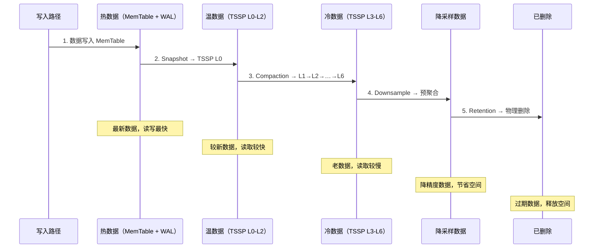
```mermaid
sequenceDiagram
    participant Write as 写入路径
    participant Hot as 热数据（MemTable + WAL）
    participant Warm as 温数据（TSSP L0-L2）
    participant Cold as 冷数据（TSSP L3-L6）
    participant DS as 降采样数据
    participant Del as 已删除

    Write->>Hot: 1. 数据写入 MemTable
    Hot->>Warm: 2. Snapshot → TSSP L0
    Warm->>Cold: 3. Compaction → L1→L2→…→L6
    Cold->>DS: 4. Downsample → 预聚合
    DS->>Del: 5. Retention → 物理删除

    Note over Hot: 最新数据，读写最快
    Note over Warm: 较新数据，读取较快
    Note over Cold: 老数据，读取较慢
    Note over DS: 降精度数据，节省空间
    Note over Del: 过期数据，释放空间
```

**通俗解释**：
- 数据从写入到删除，经历 5 个阶段
- **热数据**：刚写入的数据，在 MemTable 和 WAL 中，读写最快
- **温数据**：flush 到 TSSP 文件的较新数据，Level 0-2
- **冷数据**：经过多次压缩的老数据，Level 3-6
- **降采样数据**：预聚合的粗粒度数据，节省存储空间
- **已删除数据**：超过保留期的数据，物理删除

**核心代码** `engine/shard.go` 中的 Snapshot 定时任务（热数据 → 温数据的转换）：

```go
func (s *shard) Snapshot() {
    timer := time.NewTicker(time.Millisecond * 100)
    defer func() {
        s.wg.Done()
        timer.Stop()
    }()
    for {
        select {
        case <-s.closed.Signal():
            return
        case <-timer.C:
            if !s.shouldSnapshot() {
                continue
            }
            s.storage.writeSnapshot(s)
            s.endSnapshot()
        }
    }
}
```

| 行号 | 代码 | 解释 |
|------|------|------|
| 1 | `func (s *shard) Snapshot()` | shard 的 Snapshot 定时任务，负责将 MemTable 中的热数据 flush 到 TSSP 文件 |
| 2 | `timer := time.NewTicker(time.Millisecond * 100)` | 每 100ms 检查一次是否需要 Snapshot |
| 3-6 | `defer func() { s.wg.Done(); timer.Stop() }()` | 退出时通知 WaitGroup 并停止定时器 |
| 8 | `case <-s.closed.Signal():` | 收到关闭信号时退出循环 |
| 9 | `case <-timer.C:` | 定时器触发，检查是否需要 Snapshot |
| 10-11 | `if !s.shouldSnapshot() { continue }` | 检查 MemTable 是否满了或超时，不需要则跳过 |
| 12 | `s.storage.writeSnapshot(s)` | 执行 Snapshot：将 MemTable 数据写入 TSSP L0 文件 |
| 13 | `s.endSnapshot()` | 标记 Snapshot 完成，释放锁 |

**核心代码** `engine/shard.go` 中的 shouldSnapshot 判断逻辑：

```go
func (s *shard) shouldSnapshot() bool {
    s.snapshotLock.RLock()
    defer s.snapshotLock.RUnlock()

    if !s.storage.shouldSnapshot(s) {
        return false
    }

    if s.activeTbl != nil && s.activeTbl.GetMemSize() > 0 {
        if s.activeTbl.NeedFlush() {
            s.prepareSnapshot()
            return true
        }

        // check time
        if s.storage.timeToSnapshot(s) {
            s.prepareSnapshot()
            return true
        }
    }

    return false
}
```

| 行号 | 代码 | 解释 |
|------|------|------|
| 1 | `func (s *shard) shouldSnapshot() bool` | 判断是否需要触发 Snapshot |
| 2-3 | `s.snapshotLock.RLock()` | 加读锁，防止与写入并发冲突 |
| 5-7 | `if !s.storage.shouldSnapshot(s)` | 底层存储检查（如是否正在关闭） |
| 9 | `if s.activeTbl != nil && s.activeTbl.GetMemSize() > 0` | 检查活跃 MemTable 是否有数据 |
| 10-12 | `s.activeTbl.NeedFlush()` | MemTable 满了（超过阈值），需要立即 flush |
| 15-17 | `s.storage.timeToSnapshot(s)` | 距离上次 Snapshot 超过一定时间，也需要 flush |
| 11/16 | `s.prepareSnapshot()` | 准备 Snapshot（增加 WaitGroup 计数） |

**具体例子**：

假设用户每秒写入一条 cpu 数据，追踪一条数据的完整生命周期：

```
t=0s: 写入 cpu,host=server1 value=99.5
  → 热数据：在 MemTable + WAL 中
  → 查询：直接从 MemTable 读取（~1μs）

t=30min: Snapshot 触发
  → 温数据：flush 到 TSSP L0 文件
  → 查询：从 TSSP L0 读取（~10μs）

t=2h: Compaction L0 → L1
  → 温数据：合并到 TSSP L1 文件
  → 查询：从 TSSP L1 读取（~50μs）

t=1d: Compaction L1 → L2 → L3
  → 冷数据：合并到 TSSP L3 文件
  → 查询：从 TSSP L3 读取（~100μs）

t=1d: Downsample 触发
  → 降采样数据：每 5 分钟聚合为一个点
  → 查询最近 1 天：只有当 shard 已完成对应 DownSampleLevel，且聚合表达式可被降采样 schema 重写时，才可能使用降采样列；普通查询或不可重写表达式仍读原始数据

t=7d: Retention 过期
  → 已删除数据：物理删除 TSSP 文件
  → 查询：返回空结果
```

---

## 2. 降采样策略模型

### 2.1 DownSamplePolicyInfo 结构体

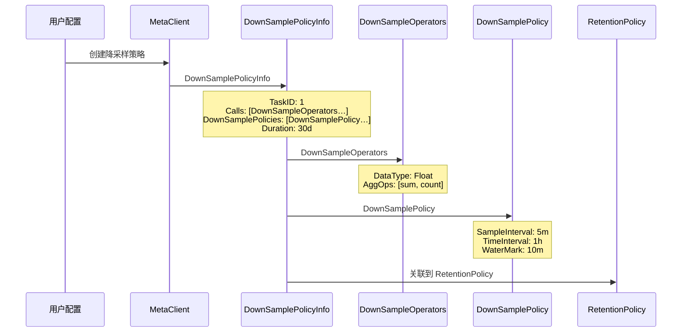
```mermaid
sequenceDiagram
    participant User as 用户配置
    participant Meta as MetaClient
    participant Policy as DownSamplePolicyInfo
    participant Calls as DownSampleOperators
    participant DSP as DownSamplePolicy
    participant RP as RetentionPolicy

    User->>Meta: 创建降采样策略
    Meta->>Policy: DownSamplePolicyInfo
    Note over Policy: TaskID: 1<br/>Calls: [DownSampleOperators…]<br/>DownSamplePolicies: [DownSamplePolicy…]<br/>Duration: 30d

    Policy->>Calls: DownSampleOperators
    Note over Calls: DataType: Float<br/>AggOps: [sum, count]

    Policy->>DSP: DownSamplePolicy
    Note over DSP: SampleInterval: 5m<br/>TimeInterval: 1h<br/>WaterMark: 10m

    Policy->>RP: 关联到 RetentionPolicy
```

**核心代码**：`lib/util/lifted/influx/meta/downsample_policy.go:49-54`

```go
// 第 49 行：降采样策略信息
type DownSamplePolicyInfo struct {
    TaskID             uint64                 // 降采样任务唯一 ID
    Calls              []*DownSampleOperators  // 每种数据类型的聚合操作
    DownSamplePolicies []*DownSamplePolicy     // 多级降采样配置
    Duration           time.Duration           // 降采样数据保留时长
}
```

**逐行解释**：
- **第 50 行**：`TaskID` 是降采样任务的唯一标识，用于追踪和管理
- **第 51 行**：`Calls` 定义了每种数据类型（float/integer/boolean/string）使用哪些聚合操作
- **第 52 行**：`DownSamplePolicies` 支持多级降采样，每一级有不同的采样间隔和时间窗口
- **第 53 行**：`Duration` 是降采样数据的总保留时间

**具体例子**：

假设用户配置了一个降采样策略：

```
降采样策略配置：
  TaskID: 1
  Duration: 30 天

  Calls（数据类型 → 聚合操作）：
    Float 类型: [sum, count, min, max]
    Integer 类型: [min, max]
    Boolean 类型: [first, last]
    String 类型: [first, last]

  DownSamplePolicies（多级降采样）：
    Level 1: SampleInterval=5m, TimeInterval=1h, WaterMark=10m
    Level 2: SampleInterval=1h, TimeInterval=1d, WaterMark=1h

含义：
  Level 1：每 5 分钟一个采样点，每小时聚合一次，延迟 10 分钟处理
  Level 2：每 1 小时一个采样点，每天聚合一次，延迟 1 小时处理

执行时：
  DownSamplePolicyLevel = 1 → 生成 Level 1 降采样数据（5 分钟精度）
  DownSamplePolicyLevel = 2 → 基于已完成 Level 1 继续生成 Level 2 数据（1 小时精度）
  注意：DownSamplePolicyLevel 是 1-based，代码访问 schema 时使用 level-1
```

**通俗解释**：
降采样策略就像"数据摘要规则"。假设你有一个监控系统，每秒记录一次 CPU 使用率：
- **原始数据**：1 秒一个点，1 天 = 86400 个点
- **Level 1 降采样**：5 分钟一个点，1 天 = 288 个点
- **Level 2 降采样**：1 小时一个点，1 天 = 24 个点

查询历史数据时，当前实现不是按时间跨度自动选择最合适精度。查询计划器只基于 shard 已完成的 `DownSampleLevel` 尝试把可支持的聚合表达式改写到降采样列；如果目标级别还没完成，或者表达式不能改写，就继续读取原始数据。

**核心代码**：`lib/util/lifted/influx/meta/downsample_policy.go:391-395`

```go
// 第 391 行：单级降采样策略
type DownSamplePolicy struct {
    SampleInterval time.Duration  // 采样间隔（如 5m）
    TimeInterval   time.Duration  // 时间窗口（如 1h）
    WaterMark      time.Duration  // 水位线（如 10m，延迟处理）
}
```

**逐行解释**：
- **第 392 行**：`SampleInterval` 控制降采样的粒度，如 5m 表示每 5 分钟一个采样点
- **第 393 行**：`TimeInterval` 控制时间窗口大小，如 1h 表示每小时聚合一次
- **第 394 行**：`WaterMark` 是水位线，延迟处理，确保数据已全部写入

**核心代码**：`lib/util/lifted/influx/meta/downsample_policy.go:406-409`

```go
// 第 406 行：降采样操作符
type DownSampleOperators struct {
    AggOps   []string  // 聚合操作列表，如 ["sum", "count"]
    DataType int64     // 数据类型（Float/Integer/Boolean/String）
}
```

**逐行解释**：
- **第 407 行**：`AggOps` 是聚合操作列表，支持 first/last/min/max/sum/count/mean
- **第 408 行**：`DataType` 是数据类型，不同类型的字段可以使用不同的聚合操作

### 2.2 RewriteOp — mean 重写

**核心代码**：`lib/util/lifted/influx/meta/downsample_policy.go:444-470`

```go
// 第 444 行：重写聚合操作（mean → sum + count）
func (d *DownSampleOperators) RewriteOp() []string {
    var hasMean bool
    var hasSum, hasCount bool
    calls := make([]string, 0, len(d.AggOps))

    for i := range d.AggOps {
        if d.AggOps[i] == "mean" {
            hasMean = true     // 标记有 mean 操作
            continue           // mean 不直接存储
        }
        if d.AggOps[i] == "sum" {
            hasSum = true      // 已有 sum
        }
        if d.AggOps[i] == "count" {
            hasCount = true    // 已有 count
        }
        calls = append(calls, d.AggOps[i])  // 保留其他操作
    }

    if hasMean {
        // 第 462 行：mean 需要 sum 和 count 来计算
        if !hasCount {
            calls = append(calls, "count")  // 补充 count
        }
        if !hasSum {
            calls = append(calls, "sum")    // 补充 sum
        }
    }
    return calls
}
```

**逐行解释**：
- **第 449 行**：`mean` 不直接存储，因为 mean 不能跨时间窗口聚合
- **第 461-468 行**：如果用户配置了 `mean`，自动补充 `sum` 和 `count`
- **查询时**：`mean = sum / count`，这样多级降采样才能正确聚合

**通俗解释**：
RewriteOp 就像"配方转换"。用户说"我要算平均分"，但系统不能直接存"平均分"，因为：
- 10 分钟窗口的平均分是 55 分
- 另一个 10 分钟窗口的平均分是 65 分
- 1 小时的平均分 ≠ (55 + 65) / 2 = 60（这是错的！）

正确做法：
- 存"总分"和"人数"
- 10 分钟窗口 1：总分 550，人数 10
- 10 分钟窗口 2：总分 325，人数 5
- 1 小时的平均分 = (550 + 325) / (10 + 5) = 58.3（这才是对的！）

所以 RewriteOp 把 `mean` 转换成 `sum + count`。

**具体例子**：

```
用户配置：AggOps = ["mean", "min", "max"]

RewriteOp() 执行过程：
  → 遍历 AggOps:
    → "mean": hasMean = true, 跳过
    → "min": 保留
    → "max": 保留
  → hasMean = true:
    → hasCount = false → 补充 "count"
    → hasSum = false → 补充 "sum"
  → 返回 ["min", "max", "count", "sum"]

降采样结果列：
  min_value, max_value, count_value, sum_value

查询 mean(value) 时：
  → 读取 sum_value 和 count_value
  → 计算 mean = sum_value / count_value
```

## 3. 降采样 Service 主循环

### 3.1 handle() 入口

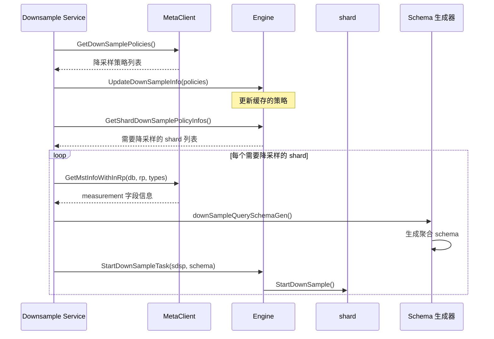
```mermaid
sequenceDiagram
    participant Service as Downsample Service
    participant Meta as MetaClient
    participant Engine as Engine
    participant Shard as shard
    participant Schema as Schema 生成器

    Service->>Meta: GetDownSamplePolicies()
    Meta-->>Service: 降采样策略列表

    Service->>Engine: UpdateDownSampleInfo(policies)
    Note over Engine: 更新缓存的策略

    Service->>Engine: GetShardDownSamplePolicyInfos()
    Engine-->>Service: 需要降采样的 shard 列表

    loop 每个需要降采样的 shard
        Service->>Meta: GetMstInfoWithInRp(db, rp, types)
        Meta-->>Service: measurement 字段信息

        Service->>Schema: downSampleQuerySchemaGen()
        Schema->>Schema: 生成聚合 schema

        Service->>Engine: StartDownSampleTask(sdsp, schema)
        Engine->>Shard: StartDownSample()
    end
```

**核心代码**：`services/downsample/service.go:56-83`

```go
// 第 56 行：降采样服务主循环
func (s *Service) handle() {
    logger, logEnd := log.NewOperation(s.Logger.GetZapLogger(), "downSample deletion check", "downSample_check")
    defer logEnd()

    // 第 59 行：从 MetaClient 获取所有降采样策略
    policies, err := s.MetaClient.GetDownSamplePolicies()
    if err != nil {
        logger.Warn("update downSample info failed", zap.Error(err))
        return
    }

    // 第 64 行：更新 Engine 缓存的策略
    s.Engine.UpdateDownSampleInfo(policies)

    // 第 66 行：获取需要降采样的 shard 列表
    infos, err := s.Engine.GetShardDownSamplePolicyInfos(s.MetaClient)
    if err != nil {
        logger.Warn("get shard downSample info failed:", zap.Error(err))
    }

    // 第 70 行：遍历每个需要降采样的 shard
    for _, sdsp := range infos {
        logger.Info(fmt.Sprintf("start run downsample task with shardID:%d,downsample level:%d",
            sdsp.ShardId, sdsp.DownSamplePolicyLevel))

        // 第 72 行：获取该 shard 的降采样策略
        policy := s.Engine.GetDownSamplePolicy(sdsp.DbName + "." + sdsp.RpName)

        // 第 73 行：获取 measurement 的字段信息
        info, err := s.MetaClient.GetMstInfoWithInRp(sdsp.DbName, sdsp.RpName, policy.Info.GetTypes())
        if err != nil {
            logger.Warn("GetMstInfoWithInRp Failed", zap.Error(err))
            return
        }

        // 第 78 行：生成降采样 schema
        policy.Schemas = downSampleQuerySchemaGen(sdsp, info, policy.Info)

        // 第 79 行：启动降采样任务
        if e := s.Engine.StartDownSampleTask(sdsp, policy.Schemas[sdsp.DownSamplePolicyLevel-1], logger, s.MetaClient); e != nil {
            logger.Warn("update shard downsample information Failed", zap.Error(e))
        }
    }
}
```

**逐行解释**：
- **第 59 行**：`GetDownSamplePolicies()` 从 ts-meta 获取所有降采样策略
- **第 64 行**：`UpdateDownSampleInfo()` 更新 Engine 缓存的策略，供后续查询使用
- **第 66 行**：`GetShardDownSamplePolicyInfos()` 检查哪些 shard 需要降采样。注意：`ShardDownSamplePolicyInfo` 结构体和 `GetShardDownSamplePolicyInfos` 方法的内部实现不在本文档范围内，本文档仅关注降采样策略模型（`DownSamplePolicyInfo`）和执行流程
- **第 72 行**：`GetDownSamplePolicy()` 根据 db.rp 获取对应的策略
- **第 73 行**：`GetMstInfoWithInRp()` 获取 measurement 的字段信息，用于生成 schema
- **第 78 行**：`downSampleQuerySchemaGen()` 生成降采样 schema（聚合表达式）
- **第 79 行**：`StartDownSampleTask()` 启动实际的降采样任务。注意 `ShardDownSamplePolicyInfo.DownSamplePolicyLevel` 是 **1-based**，所以访问 schema 时使用 `policy.Schemas[level-1]`

**通俗解释**：
handle() 就像一个"巡检员"，每隔一段时间检查一次：
- 先去"总部"（ts-meta）拿最新的降采样策略（哪些表需要降采样、怎么降采样）
- 然后检查"仓库"（Engine）里哪些 shard 需要降采样
- 对每个需要降采样的 shard，生成聚合 schema，启动降采样任务

就像工厂里的质检员：先看产品标准（策略），再检查哪些产品需要处理（shard），然后开始加工（降采样）。

**具体例子**：

假设配置了降采样策略：cpu 表每 5 分钟聚合一次，mem 表每 10 分钟聚合一次。

```
handle() 执行过程：

Step 1: GetDownSamplePolicies()
  → 返回：[{db: "monitor", rp: "autogen", mst: "cpu", interval: 5m},
           {db: "monitor", rp: "autogen", mst: "mem", interval: 10m}]

Step 2: UpdateDownSampleInfo(policies)
  → 更新 Engine 缓存

Step 3: GetShardDownSamplePolicyInfos()
  → 返回：[{shardId: 1, dbName: "monitor", rpName: "autogen", mstName: "cpu", level: 0},
           {shardId: 2, dbName: "monitor", rpName: "autogen", mstName: "mem", level: 0}]
  → 说明：shard 1（cpu 表）和 shard 2（mem 表）都需要降采样

Step 4: 遍历每个 shard
  → shard 1: GetMstInfoWithInRp("monitor", "autogen", ["float"])
             → 返回 cpu 表的字段信息：{value: Float}
             → downSampleQuerySchemaGen() → schema: [sum(value), count(value), min(value), max(value)]
             → StartDownSampleTask(shardId=1, schema)

  → shard 2: GetMstInfoWithInRp("monitor", "autogen", ["float"])
             → 返回 mem 表的字段信息：{used_percent: Float}
             → downSampleQuerySchemaGen() → schema: [sum(used_percent), count(used_percent)]
             → StartDownSampleTask(shardId=2, schema)
```

---

## 4. Shard 降采样执行

### 4.1 StartDownSample 总览

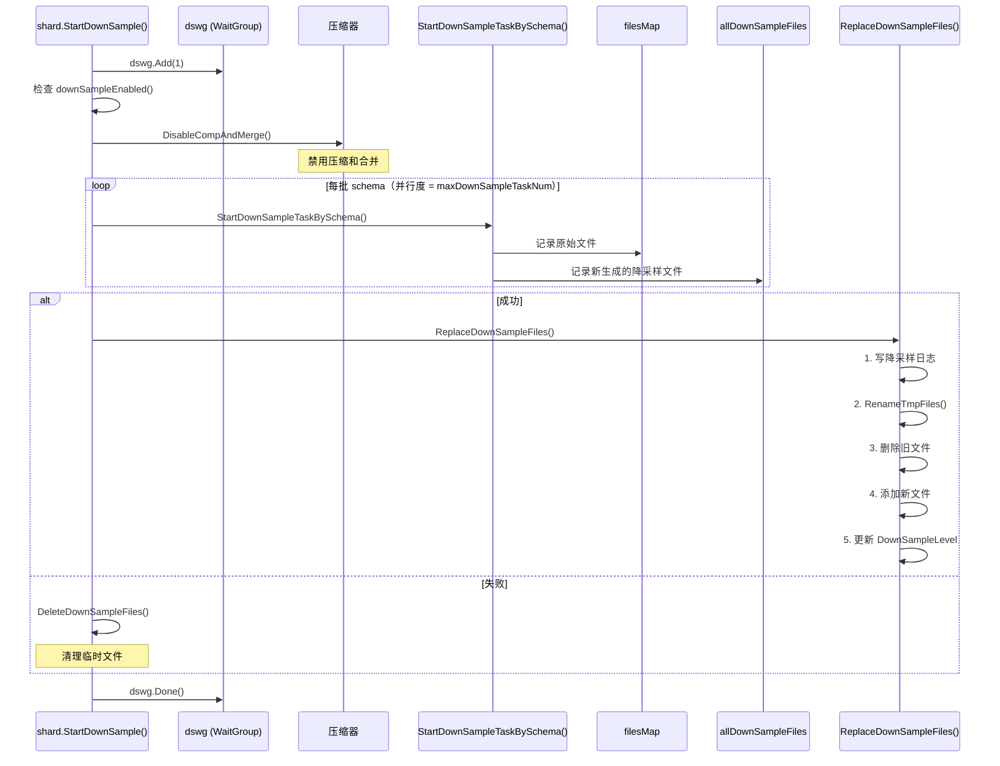
```mermaid
sequenceDiagram
    participant Shard as shard.StartDownSample()
    participant DSwg as dswg (WaitGroup)
    participant Comp as 压缩器
    participant Task as StartDownSampleTaskBySchema()
    participant FilesMap as filesMap
    participant NewFiles as allDownSampleFiles
    participant Replace as ReplaceDownSampleFiles()

    Shard->>DSwg: dswg.Add(1)
    Shard->>Shard: 检查 downSampleEnabled()

    Shard->>Comp: DisableCompAndMerge()
    Note over Comp: 禁用压缩和合并

    loop 每批 schema（并行度 = maxDownSampleTaskNum）
        Shard->>Task: StartDownSampleTaskBySchema()
        Task->>FilesMap: 记录原始文件
        Task->>NewFiles: 记录新生成的降采样文件
    end

    alt 成功
        Shard->>Replace: ReplaceDownSampleFiles()
        Replace->>Replace: 1. 写降采样日志
        Replace->>Replace: 2. RenameTmpFiles()
        Replace->>Replace: 3. 删除旧文件
        Replace->>Replace: 4. 添加新文件
        Replace->>Replace: 5. 更新 DownSampleLevel
    else 失败
        Shard->>Shard: DeleteDownSampleFiles()
        Note over Shard: 清理临时文件
    end

    Shard->>DSwg: dswg.Done()
```

**核心代码**：`engine/shard.go:1654-1726`

```go
// 第 1654 行：shard 级别的降采样入口
func (s *shard) StartDownSample(taskID uint64, level int, sdsp *meta.ShardDownSamplePolicyInfo, meta interface {
    UpdateShardDownSampleInfo(Ident *meta.ShardIdentifier) error
}) error {
    s.mu.RLock()
    defer s.mu.RUnlock()

    info, schemas, logger := s.shardDownSampleTaskInfo.sdsp, s.shardDownSampleTaskInfo.schema, s.shardDownSampleTaskInfo.log

    // 第 1662 行：WaitGroup 用于等待降采样完成
    s.dswg.Add(1)
    defer s.dswg.Done()

    if !s.downSampleEnabled() {
        return nil  // 降采样被禁用
    }

    // 第 1668 行：禁用压缩和合并，确保文件集合稳定
    s.DisableCompAndMerge()

    lcLog := Log.NewLogger(errno.ModuleDownSample).SetZapLogger(logger)
    taskNum := len(schemas)
    parallelism := maxDownSampleTaskNum  // 最大并行度

    // 第 1673 行：filesMap 记录原始文件，allDownSampleFiles 记录新文件
    filesMap := make(map[int]*immutable.TSSPFiles, taskNum)
    allDownSampleFiles := make(map[int][]immutable.TSSPFile, taskNum)

    // 第 1676 行：分批执行，每批 parallelism 个 schema
    for i := 0; i < taskNum; i += parallelism {
        var num int
        if i+parallelism <= taskNum {
            num = parallelism
        } else {
            num = taskNum - i
        }
        // 第 1683 行：执行一批降采样任务
        err = s.StartDownSampleTaskBySchema(i, filesMap, allDownSampleFiles, schemas[i:i+num], info, logger)
        if err != nil {
            break
        }
    }

    // 第 1692 行：成功时替换文件
    if err == nil {
        mstNames := make([]string, 0)
        originFiles := make([][]immutable.TSSPFile, 0)
        newFiles := make([][]immutable.TSSPFile, 0)

        for k, v := range allDownSampleFiles {
            nameWithVer := schemas[k].Options().OptionsName()
            files := filesMap[k]
            var filesSlice []immutable.TSSPFile
            for _, f := range files.Files() {
                filesSlice = append(filesSlice, f)
                if !f.UnrefFileReader() {
                    f.Unref()  // 释放文件引用
                }
            }
            mstNames = append(mstNames, nameWithVer)
            originFiles = append(originFiles, filesSlice)
            newFiles = append(newFiles, v)
        }

        // 第 1710 行：原子替换文件
        if e := s.ReplaceDownSampleFiles(mstNames, originFiles, newFiles, lcLog, taskID, level, sdsp, meta); e != nil {
            s.DeleteDownSampleFiles(allDownSampleFiles)  // 失败时清理
            return e
        }
    } else {
        // 第 1716 行：失败时释放文件引用并清理
        for _, v := range filesMap {
            for _, f := range v.Files() {
                if !f.UnrefFileReader() {
                    f.Unref()
                }
            }
        }
        s.DeleteDownSampleFiles(allDownSampleFiles)
    }
    return err
}
```

**逐行解释**：
- **第 1662 行**：`dswg.Add(1)` 注册降采样任务，shard 关闭时会等待降采样完成
- **第 1668 行**：`DisableCompAndMerge()` 禁用压缩和合并，确保文件集合稳定
- **第 1673 行**：`filesMap` 记录原始文件，用于替换时删除旧文件
- **第 1674 行**：`allDownSampleFiles` 记录新生成的降采样文件
- **第 1676 行**：分批执行，每批最多 `maxDownSampleTaskNum` 个 measurement 并行
- **第 1683 行**：`StartDownSampleTaskBySchema()` 执行实际的降采样（扫描 → 聚合 → 写入）
- **第 1710 行**：`ReplaceDownSampleFiles()` 原子替换文件（写日志 → 重命名 → 删旧 → 加新）

**通俗解释**：
StartDownSample 就像"工厂加工流水线"：
1. **暂停其他工序**（DisableCompAndMerge）：加工期间不能让别人动原材料
2. **分批加工**（分批执行）：一次处理太多会撑爆内存，所以分批来
3. **记录原材料**（filesMap）：记住原来有哪些文件，方便后面替换
4. **生产新产品**（StartDownSampleTaskBySchema）：读取原始数据，聚合计算，写入新文件
5. **原子替换**（ReplaceDownSampleFiles）：新文件替换旧文件，一步完成，不会出现中间状态

**具体例子**：

假设 shard 1 有 3 个 measurement：cpu、mem、disk，每个都有 10 个 TSSP 文件。

```
StartDownSample 执行过程：

Step 1: dswg.Add(1)
  → 注册任务，shard 关闭时会等它完成

Step 2: DisableCompAndMerge()
  → 禁用压缩和合并，确保文件集合不变

Step 3: 分批执行（parallelism = 2）
  → 第 1 批：[cpu, mem] 并行降采样
    → cpu: 读取 10 个 TSSP 文件 → 聚合 → 写入 cpu_001.tmp
    → mem: 读取 10 个 TSSP 文件 → 聚合 → 写入 mem_001.tmp

  → 第 2 批：[disk] 降采样
    → disk: 读取 10 个 TSSP 文件 → 聚合 → 写入 disk_001.tmp

Step 4: ReplaceDownSampleFiles()
  → 写降采样日志（崩溃恢复用）
  → RenameTmpFiles: cpu_001.tmp → cpu_001_ds.tssp
  → 删除旧文件：cpu_001.tssp ~ cpu_010.tssp
  → 添加新文件：cpu_001_ds.tssp
  → 更新 DownSampleLevel: 0 → 1

Step 5: dswg.Done()
  → 任务完成
```

---

## 5. 降采样 Schema 生成

### 5.0 downSampleQuerySchemaGen — 初始 Schema 生成入口

**核心代码**：`services/downsample/functions.go:29-39`

```go
func downSampleQuerySchemaGen(sinfo *meta.ShardDownSamplePolicyInfo,
    infos *meta.RpMeasurementsFieldsInfo,
    policy *meta.DownSamplePolicyInfo) [][]hybridqp.Catalog {

    downSampleLevel := sinfo.DownSamplePolicyLevel
    currLvl := sinfo.Ident.DownSampleLevel
    var schemas [][]hybridqp.Catalog

    // 步骤 1: 初始化第一级 Schema
    schemas = initDownSampleSchema(sinfo, infos, policy)
    if currLvl == 0 {
        return schemas  // 首次降采样，直接返回
    }

    // 步骤 2: 多级降采样，逐级生成 Schema
    schemas = genNextLevelSchemas(schemas, downSampleLevel, policy.DownSamplePolicies)
    return schemas
}
```

**逐行解释**：
- `initDownSampleSchema()`：根据 measurement 的字段类型和降采样策略，生成第一级的聚合 Schema
- `currLvl == 0`：首次降采样，只需要第一级 Schema
- `genNextLevelSchemas()`：已有降采样数据时，生成后续级别的 Schema

**核心代码**：`services/downsample/functions.go:41-87` — `initDownSampleSchema`

```go
func initDownSampleSchema(sinfo *meta.ShardDownSamplePolicyInfo,
    infos *meta.RpMeasurementsFieldsInfo,
    policy *meta.DownSamplePolicyInfo) [][]hybridqp.Catalog {

    downSampleLevel := sinfo.DownSamplePolicyLevel
    currLvl := sinfo.Ident.DownSampleLevel
    schemas := make([][]hybridqp.Catalog, downSampleLevel)
    var start int
    for i := range schemas {
        schemas[i] = make([]hybridqp.Catalog, 0, len(infos.MeasurementInfos))
    }
    if currLvl == 0 {
        start = downSampleLevel
    } else {
        start = currLvl
    }
    // 预分配：跳过不需要生成 Schema 的级别
    for i := 0; i < start-1; i++ {
        schemas[i] = append(schemas[i], make([]hybridqp.Catalog, len(infos.MeasurementInfos))...)
    }

    // 遍历每个 measurement
    for _, info := range infos.MeasurementInfos {
        opt := genDefaultOpt(info.MstName)
        sources := []influxql.Source{
            &influxql.Measurement{
                Database:        sinfo.DbName,
                RetentionPolicy: sinfo.RpName,
                Name:            info.MstName,
            },
        }
        fields := make([]*influxql.Field, 0)
        columnNames := make([]string, 0)
        calls := policy.GetCalls()  // 获取数据类型 → 聚合操作的映射

        // 遍历每种数据类型的字段
        for _, f := range info.TypeFields {
            call, ok := calls[f.Type]
            if !ok {
                continue  // 该数据类型没有配置聚合操作
            }
            // 生成聚合表达式
            field, columnName := downSampleExprGen(call, f.Fields, f.Type)
            columnNames = append(columnNames, columnName...)
            fields = append(fields, field...)
        }

        opt.Interval = hybridqp.Interval{
            Duration: policy.DownSamplePolicies[downSampleLevel-1].TimeInterval,
        }
        schemas[start-1] = append(schemas[start-1],
            executor.NewQuerySchemaWithSources(fields, sources, columnNames, opt, nil))
    }
    return schemas
}
```

**核心代码**：`services/downsample/functions.go:89-110` — `downSampleExprGen`

```go
func downSampleExprGen(calls []string, columns []string, dataType int64) (influxql.Fields, []string) {
    fields := make([]*influxql.Field, 0, len(calls)*len(columns))
    columnNames := make([]string, 0, len(calls)*len(columns))
    for _, c := range calls {
        for _, name := range columns {
            // 生成聚合表达式：如 sum(value), count(value)
            expr := &influxql.Call{
                Name: c,
                Args: []influxql.Expr{
                    &influxql.VarRef{
                        Val:  name,
                        Type: influxql.DataType(dataType),
                    },
                },
            }
            fields = append(fields, &influxql.Field{Expr: expr})
            columnNames = append(columnNames, c+"_"+name)  // 如 "sum_value"
        }
    }
    return fields, columnNames
}
```

**具体例子**：

假设 measurement `cpu` 有字段 `value:Float` 和 `temperature:Float`，降采样策略为 Float 类型使用 `[sum, count, min, max]`：

```
downSampleExprGen 执行过程：
  calls = ["sum", "count", "min", "max"]
  columns = ["value", "temperature"]
  dataType = Float

  生成的字段：
    sum(value)         → 列名 "sum_value"
    sum(temperature)   → 列名 "sum_temperature"
    count(value)       → 列名 "count_value"
    count(temperature) → 列名 "count_temperature"
    min(value)         → 列名 "min_value"
    min(temperature)   → 列名 "min_temperature"
    max(value)         → 列名 "max_value"
    max(temperature)   → 列名 "max_temperature"

最终 Schema：
  SELECT sum(value), sum(temperature), count(value), count(temperature),
         min(value), min(temperature), max(value), max(temperature)
  FROM cpu
  GROUP BY time(1h)
```

### 5.1 genNextLevelSchema — 多级降采样

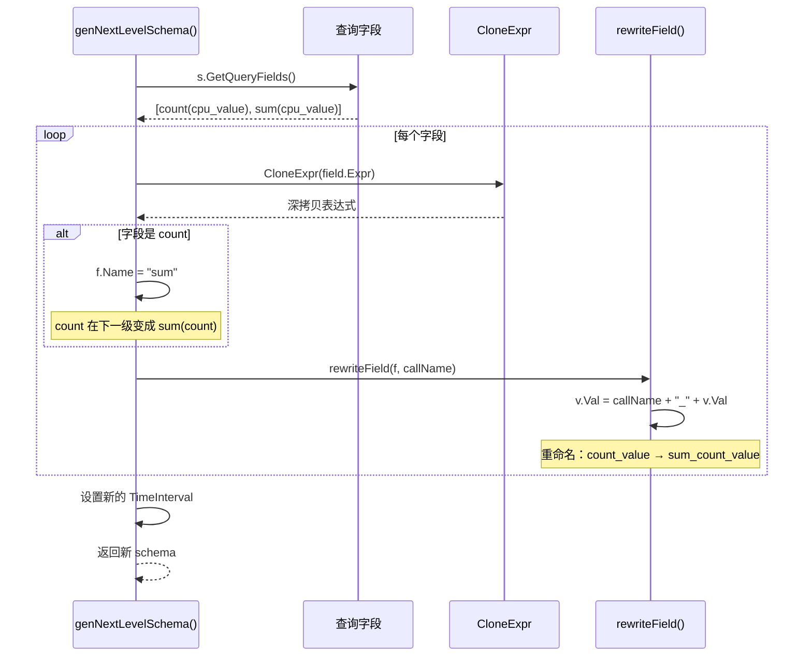
```mermaid
sequenceDiagram
    participant Caller as genNextLevelSchema()
    participant Fields as 查询字段
    participant Clone as CloneExpr
    participant Rename as rewriteField()

    Caller->>Fields: s.GetQueryFields()
    Fields-->>Caller: [count(cpu_value), sum(cpu_value)]

    loop 每个字段
        Caller->>Clone: CloneExpr(field.Expr)
        Clone-->>Caller: 深拷贝表达式

        alt 字段是 count
            Caller->>Caller: f.Name = "sum"
            Note over Caller: count 在下一级变成 sum(count)
        end

        Caller->>Rename: rewriteField(f, callName)
        Rename->>Rename: v.Val = callName + "_" + v.Val
        Note over Rename: 重命名：count_value → sum_count_value
    end

    Caller->>Caller: 设置新的 TimeInterval
    Caller-->>Caller: 返回新 schema
```

**核心代码**：`services/downsample/functions.go:146-183`

```go
// 第 146 行：生成下一级降采样的 schema
func genNextLevelSchema(s hybridqp.Catalog, timeInterval time.Duration) hybridqp.Catalog {
    fields := s.GetQueryFields()
    renameFields := make([]*influxql.Field, len(fields))

    for i := range renameFields {
        // 第 150 行：深拷贝表达式（避免修改原始 schema）
        f, _ := influxql.CloneExpr(fields[i].Expr).(*influxql.Call)
        callName := f.Name

        // 第 152 行：count 在下一级变成 sum
        if f.Name == "count" {
            f.Name = "sum"
        }

        // 第 155 行：重命名字段
        rewriteField(f, callName)

        renameFields[i] = &influxql.Field{
            Expr: f,
        }
    }

    // 第 161 行：设置新的选项
    columnNames := s.GetColumnNames()
    opt := genDefaultOpt(s.Options().OptionsName())
    opt.Interval = hybridqp.Interval{
        Duration: timeInterval,  // 新的时间窗口
    }

    // 第 166 行：返回新的 schema
    return executor.NewQuerySchemaWithSources(renameFields, s.Sources(), columnNames, opt, nil)
}

// 第 168 行：重命名字段
func rewriteField(expr influxql.Expr, callName string) {
    c, ok := expr.(*influxql.Call)
    if !ok {
        return
    }
    for i := range c.Args {
        v, ok := c.Args[i].(*influxql.VarRef)
        if !ok {
            return
        }
        // 第 178 行：重命名：count_value → sum_count_value
        v.Val = callName + "_" + v.Val

        // 第 179 行：count 的结果类型是 Integer
        if callName == "count" {
            v.Type = influxql.Integer
        }
    }
}
```

**逐行解释**：
- **第 150 行**：`CloneExpr` 深拷贝表达式，避免修改原始 schema
- **第 152-154 行**：`count` 在下一级变成 `sum`，因为 `count(a) + count(b) ≠ count(a+b)`，但 `sum(count_a) + sum(count_b) = sum(count_a + count_b)`
- **第 155 行**：`rewriteField` 重命名字段，如 `count_value` → `sum_count_value`
- **第 178 行**：字段名加上前缀，标识它是由哪个聚合产生的
- **第 179-181 行**：`count` 的结果类型从 Float 改为 Integer

**通俗解释**：
genNextLevelSchema 就像"配方升级"。当你要把 10 分钟的数据再聚合成 1 小时时：
- `sum` 还是 `sum`（把 6 个 10 分钟的 sum 加起来 = 1 小时的 sum）
- `count` 要变成 `sum(count)`（把 6 个 10 分钟的 count 加起来 = 1 小时的 count）
- `min` 还是 `min`（6 个 10 分钟的最小值 = 1 小时的最小值）
- `max` 还是 `max`（6 个 10 分钟的最大值 = 1 小时的最大值）

为什么 count 要变成 sum？因为 `count(a) + count(b) ≠ count(a+b)`！
- 10 分钟窗口 1：有 10 个点，count=10
- 10 分钟窗口 2：有 8 个点，count=8
- 1 小时的 count = 10 + 8 = 18（不是 count(18个点)）
- 所以 count 要变成 sum(count)，才能正确累加

**具体例子**：

Level 1 降采样结果（10 分钟精度）：
```
time      count  sum     min    max
00:00:00  10     550.0   10.0   100.0
00:10:00  5      650.0   110.0  150.0
00:20:00  6      1260.0  180.0  260.0
00:30:00  8      2000.0  200.0  350.0
00:40:00  7      2450.0  300.0  450.0
00:50:00  9      3600.0  350.0  500.0
```

genNextLevelSchema 生成 Level 2 schema：
```
原始字段: [count(cpu_value), sum(cpu_value), min(cpu_value), max(cpu_value)]
重写后:   [sum(count_cpu_value), sum(sum_cpu_value), min(min_cpu_value), max(max_cpu_value)]

Level 2 聚合结果（1 小时精度）：
time      sum_count  sum_sum    min_min  max_max
00:00:00  45         10510.0    10.0     500.0
→ count = 45（6 个窗口的 count 之和）
→ sum = 10510.0（6 个窗口的 sum 之和）
→ min = 10.0（6 个窗口的最小值）
→ max = 500.0（6 个窗口的最大值）
→ mean = 10510.0 / 45 = 233.6
```

---

## 6. 降采样崩溃恢复

### 6.1 DownSampleFilesInfo 日志

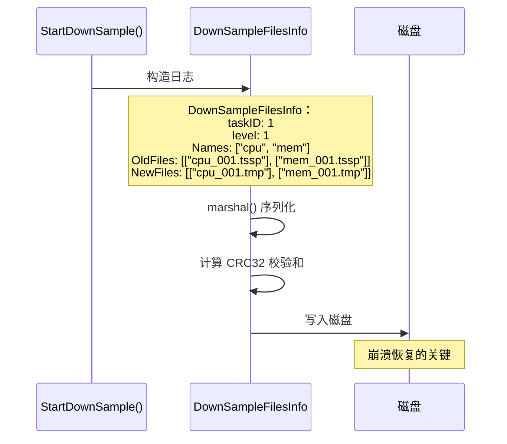
```mermaid
sequenceDiagram
    participant Down as StartDownSample()
    participant Log as DownSampleFilesInfo
    participant Disk as 磁盘

    Down->>Log: 构造日志
    Note over Log: DownSampleFilesInfo：<br/>taskID: 1<br/>level: 1<br/>Names: ["cpu", "mem"]<br/>OldFiles: [["cpu_001.tssp"], ["mem_001.tssp"]]<br/>NewFiles: [["cpu_001.tmp"], ["mem_001.tmp"]]

    Log->>Log: marshal() 序列化
    Log->>Log: 计算 CRC32 校验和
    Log->>Disk: 写入磁盘
    Note over Disk: 崩溃恢复的关键
```

**核心代码**：`engine/downsample_info.go:25-69`

```go
// 第 25 行：降采样文件信息（崩溃恢复日志）
type DownSampleFilesInfo struct {
    taskID   uint64       // 任务 ID（unexported）
    level    int          // 降采样级别（unexported，注意是 int 不是 int32）
    Names    []string     // measurement 名称列表
    OldFiles [][]string   // 旧文件路径（每个 measurement 一组）
    NewFiles [][]string   // 新文件路径（每个 measurement 一组）
}

// 第 33 行：重置（复用对象，避免频繁分配）
func (info *DownSampleFilesInfo) reset() {
    info.Names = info.Names[:0]
    info.OldFiles = info.OldFiles[:0]
    info.NewFiles = info.NewFiles[:0]
}

// 第 39 行：序列化（带 CRC32 校验）
// 注意：接收 dst 参数，追加写入，返回扩展后的切片
// 完整函数签名：func (info DownSampleFilesInfo) marshal(dst []byte) []byte
func (info DownSampleFilesInfo) marshal(dst []byte) []byte {
    dst = numberenc.MarshalUint64Append(dst, info.taskID)
    dst = numberenc.MarshalInt64Append(dst, int64(info.level))
    // 序列化 Names（uint16 长度前缀 + 字节）
    dst = numberenc.MarshalUint16Append(dst, uint16(len(info.Names)))
    for k := range info.Names {
        dst = numberenc.MarshalUint16Append(dst, uint16(len(info.Names[k])))
        dst = append(dst, info.Names[k]...)
    }
    // 序列化 OldFiles、NewFiles（同样用 uint16 长度前缀）
    // ...
    valueCrc := crc32.ChecksumIEEE(dst)
    dst = numberenc.MarshalUint32Append(dst, valueCrc)
    return dst
}

// 第 71 行：反序列化（校验 CRC32）
func (info *DownSampleFilesInfo) unmarshal(src []byte) ([]byte, error) {
    info.taskID = numberenc.UnmarshalUint64(src)
    src = src[8:]
    info.level = int(numberenc.UnmarshalInt64(src))
    // 反序列化 Names、OldFiles、NewFiles
    return src, nil
}
```

**逐行解释**：
- **第 26-27 行**：`taskID` 和 `level` 是 **unexported**（小写），不能直接从外部访问
- **第 28 行**：`Names`（不是 `Measurements`）是实际的字段名
- **第 29 行**：`OldFiles`（不是 `OriginFiles`）是实际的字段名
- **第 39 行**：`marshal(dst []byte) []byte` 接收目标切片并追加写入（不是 `marshal() []byte`）
- **第 71 行**：`unmarshal(src []byte) ([]byte, error)` 返回剩余的 src 和错误（不是 `unmarshal(buf []byte) error`）

**通俗解释**：
DownSampleFilesInfo 就像"施工日志"。在降采样之前，先写一份日志记录：
- 要处理哪些 measurement（Names）
- 原来有哪些文件（OldFiles）
- 新生成了哪些文件（NewFiles）

如果施工到一半（降采样过程中）突然断电（进程崩溃），重启后看这份日志就知道：
- 新文件还在不在？在的话，继续完成替换
- 新文件不在了？说明降采样没完成，保留旧文件

**具体例子**：

假设降采样 cpu 和 mem 两个 measurement，写入日志：

```
DownSampleFilesInfo {
  taskID: 1
  level: 1
  Names: ["cpu", "mem"]
  OldFiles: [
    ["cpu_001.tssp", "cpu_002.tssp", "cpu_003.tssp"],  // cpu 的旧文件
    ["mem_001.tssp", "mem_002.tssp"]                     // mem 的旧文件
  ]
  NewFiles: [
    ["cpu_001.tmp", "cpu_002.tmp"],  // cpu 的新文件（临时名）
    ["mem_001.tmp"]                   // mem 的新文件（临时名）
  ]
}

序列化后的字节流：
  [8字节 taskID][8字节 level][2字节 Names长度][Names字节...][OldFiles...][NewFiles...][4字节 CRC32]
```

### 6.2 DownSampleRecover 恢复流程

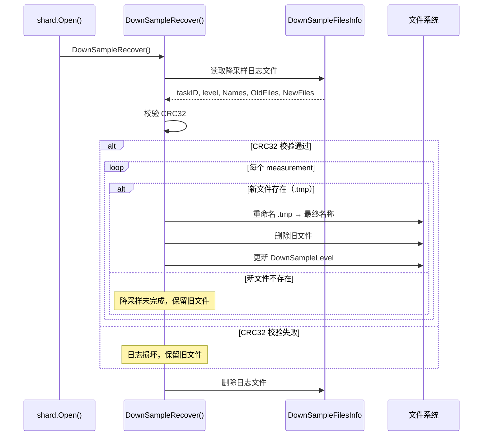
```mermaid
sequenceDiagram
    participant Start as shard.Open()
    participant Recover as DownSampleRecover()
    participant Log as DownSampleFilesInfo
    participant FS as 文件系统

    Start->>Recover: DownSampleRecover()
    Recover->>Log: 读取降采样日志文件
    Log-->>Recover: taskID, level, Names, OldFiles, NewFiles

    Recover->>Recover: 校验 CRC32

    alt CRC32 校验通过
        loop 每个 measurement
            alt 新文件存在（.tmp）
                Recover->>FS: 重命名 .tmp → 最终名称
                Recover->>FS: 删除旧文件
                Recover->>FS: 更新 DownSampleLevel
            else 新文件不存在
                Note over Recover: 降采样未完成，保留旧文件
            end
        end
    else CRC32 校验失败
        Note over Recover: 日志损坏，保留旧文件
    end

    Recover->>Log: 删除日志文件
```

**核心代码**：`engine/shard.go:1360-1406`

```go
// （基于实际代码修正）engine/shard.go:1360-1404
func (s *shard) DownSampleRecover(client metaclient.MetaClient) error {
    shardDir := filepath.Dir(s.filesPath)
    dirs, err := fileops.ReadDir(shardDir)
    if err != nil {
        return err
    }
    for i := range dirs {
        dn := dirs[i].Name()
        if dn != immutable.DownSampleLogDir {
            continue
        }
        logDir := filepath.Join(shardDir, immutable.DownSampleLogDir)
        downSampleLogDirs, err := fileops.ReadDir(logDir)
        if err != nil {
            return err
        }
        logInfo := &DownSampleFilesInfo{}
        for _, v := range downSampleLogDirs {
            logName := v.Name()
            logFile := filepath.Join(logDir, logName)
            logInfo.reset()
            err = readDownSampleLogFile(logFile, logInfo)
            if err != nil {
                log.Error("recover downSample log file error", zap.Error(err))
                if err = s.removeFile(logFile); err != nil {
                    return err
                }
                continue
            }
            err = s.DownSampleRecoverReplaceFiles(logInfo, shardDir)
            if err != nil {
                return err
            }
            s.UpdateDownSampleOnShard(logInfo.taskID, logInfo.level)
            if e := client.UpdateShardDownSampleInfo(s.ident); e != nil {
                return e
            }
            lock := fileops.FileLockOption(*s.lock)
            if err = fileops.Remove(logFile, lock); err != nil {
                log.Error("remove downSample log file error", zap.Uint64("shardID", s.ident.ShardID), zap.String("dir", shardDir), zap.String("log", logFile), zap.Error(err))
            }
        }
    }
    return nil
}
```

**逐行解释**（基于实际代码修正）：
- **第 1360 行**：函数签名接收 `client metaclient.MetaClient` 参数，用于恢复后更新元数据
- **第 1361-1371 行**：扫描 shard 目录，查找 `DownSampleLogDir`（降采样日志目录），而非调用 `readDownSampleInfo()`
- **第 1381 行**：调用 `readDownSampleLogFile()` 读取单个日志文件（带 CRC32 校验），而非 `readDownSampleInfo()`
- **第 1389 行**：调用 `DownSampleRecoverReplaceFiles(logInfo, shardDir)` 执行实际的文件替换（重命名 .tmp 文件、删除旧文件）
- **第 1393-1396 行**：恢复后更新 shard 的降采样级别，并通过 MetaClient 持久化到元数据
- **第 1397-1400 行**：成功恢复后删除日志文件（带文件锁保护）

**通俗解释**：
DownSampleRecover 就像"灾后重建"。进程崩溃重启后：
1. 先看"施工日志"（DownSampleFilesInfo）
2. 检查新文件还在不在（.tmp 文件）
3. 如果在，说明降采样已经完成，只是没来得及替换 → 完成替换
4. 如果不在，说明降采样没完成 → 保留旧文件，等下次重新降采样
5. 最后删除日志文件，清理现场

**具体例子**：

崩溃恢复场景：

```
场景 1：降采样完成，但 ReplaceDownSampleFiles 没执行完
  日志：{Names: ["cpu"], OldFiles: [["cpu_001.tssp"]], NewFiles: [["cpu_001.tmp"]]}
  检查：cpu_001.tmp 存在 ✓
  恢复：cpu_001.tmp → cpu_001_ds.tssp，删除 cpu_001.tssp

场景 2：降采样没完成，新文件还没生成
  日志：{Names: ["cpu"], OldFiles: [["cpu_001.tssp"]], NewFiles: [["cpu_001.tmp"]]}
  检查：cpu_001.tmp 不存在 ✗
  恢复：保留 cpu_001.tssp，等下次重新降采样

场景 3：日志文件损坏（CRC32 校验失败）
  日志：{损坏的数据}
  恢复：保留所有旧文件，等下次重新降采样
```

---

## 7. 降采样查询优化

### 7.1 查询路径重写

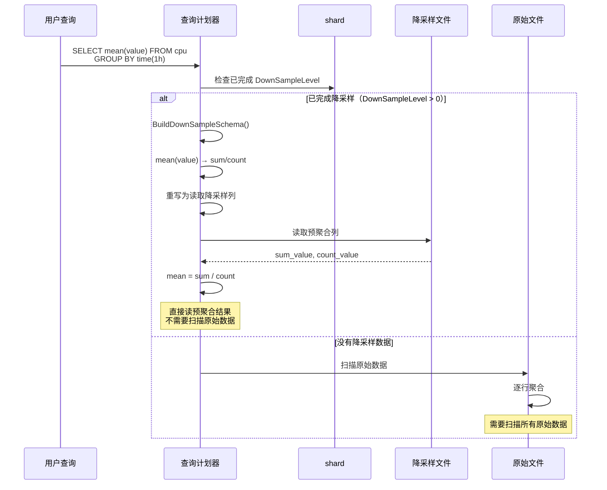
```mermaid
sequenceDiagram
    participant User as 用户查询
    participant Planner as 查询计划器
    participant Shard as shard
    participant DS as 降采样文件
    participant Raw as 原始文件

    User->>Planner: SELECT mean(value) FROM cpu<br/>GROUP BY time(1h)

    Planner->>Shard: 检查已完成 DownSampleLevel

    alt 已完成降采样（DownSampleLevel > 0）
        Planner->>Planner: BuildDownSampleSchema()
        Planner->>Planner: mean(value) → sum/count
        Planner->>Planner: 重写为读取降采样列

        Planner->>DS: 读取预聚合列
        DS-->>Planner: sum_value, count_value
        Planner->>Planner: mean = sum / count
        Note over Planner: 直接读预聚合结果<br/>不需要扫描原始数据
    else 没有降采样数据
        Planner->>Raw: 扫描原始数据
        Raw->>Raw: 逐行聚合
        Note over Raw: 需要扫描所有原始数据
    end
```

**通俗解释**：
- 查询时，如果 shard 已经完成某一级降采样（`DownSampleLevel > 0`），查询计划器才会尝试重写查询
- 比如 `mean(value)` 被重写为读取预聚合的 `sum` 和 `count` 列
- 这个过程对用户透明，用户查询的 SQL 不需要改变
- 当前实现不是按查询时间跨度自动选择“最合适精度”。它基于 shard 已完成的 `DownSampleLevel` 和可重写的聚合表达式尝试改写；如果目标级别还没完成，仍走原始数据路径
- 性能提升：从扫描原始数据 → 直接读预聚合结果

**核心代码** `engine/executor/schema.go` 中的 BuildDownSampleSchema（查询路径重写）：

```go
func (qs *QuerySchema) BuildDownSampleSchema(addPrefix bool) record.Schemas {
    var outSchema record.Schemas
    for _, f := range qs.origCalls {
        c, ok := f.Args[0].(*influxql.VarRef)
        if !ok {
            continue
        }
        var field record.Field
        if addPrefix {
            field = record.Field{Name: f.Name + "_" + c.Val}
        } else {
            field = record.Field{Name: c.Val}
        }
        switch f.Name {
        case "min", "first", "last", "max", "sum":
            field.Type = record.ToModelTypes(c.Type)
        case "count":
            field.Type = influx.Field_Type_Int
        default:
            panic("wrong call")
        }
        outSchema = append(outSchema, field)
    }
    outSchema = append(outSchema, record.Field{
        Name: "time",
        Type: influx.Field_Type_Int,
    })
    return outSchema
}
```

| 行号 | 代码 | 解释 |
|------|------|------|
| 1 | `func (qs *QuerySchema) BuildDownSampleSchema(addPrefix bool)` | 构建降采样查询的 Schema，将用户查询映射到预聚合列 |
| 3 | `for _, f := range qs.origCalls` | 遍历用户查询中的所有聚合函数（如 mean, sum, count） |
| 4 | `c, ok := f.Args[0].(*influxql.VarRef)` | 提取聚合函数的参数（如 value 字段） |
| 8-9 | `field = record.Field{Name: f.Name + "_" + c.Val}` | 有前缀时：`mean_value` → 读取降采样文件中的 `mean_value` 列 |
| 10-11 | `field = record.Field{Name: c.Val}` | 无前缀时：直接使用字段名 |
| 13-14 | `case "min", "first", "last", "max", "sum":` | 这些聚合函数的预聚合列类型与原始字段类型相同 |
| 16 | `case "count":` | count 的预聚合列类型固定为 Int |
| 17-18 | `default: panic("wrong call")` | 不支持的聚合函数，直接 panic |
| 22-25 | `outSchema = append(outSchema, record.Field{Name: "time"...})` | 最后追加 time 列，降采样数据必须有时间列 |

**核心代码** `engine/shard.go` 中的 isDownsampled 判断（查询计划器用此决定是否重写）：

```go
func (s *shard) isDownsampled() bool {
    return s.ident.DownSampleLevel != 0
}
```

| 行号 | 代码 | 解释 |
|------|------|------|
| 1 | `func (s *shard) isDownsampled() bool` | 判断 shard 是否已被降采样 |
| 2 | `return s.ident.DownSampleLevel != 0` | DownSampleLevel > 0 表示已有完成的降采样数据，查询计划器才会尝试重写查询路径 |

**具体例子**：

查询 `SELECT mean(value) FROM cpu WHERE time > now() - 1d GROUP BY time(1h)` 的优化过程：

```
没有降采样数据时：
  → 扫描原始数据：86,400 个点（1 秒一个点，1 天）
  → 逐行聚合：每 3,600 个点计算一次 mean
  → 返回 24 行结果
  → 耗时：~2 秒

有降采样数据时（Level 1, 10 分钟精度）：
  → 查询计划器检测到已完成 DownSampleLevel > 0
  → 重写查询：mean(value) → sum(value) / count(value)
  → 读取降采样列：sum_value, count_value
  → 数据量：144 个点（10 分钟一个点，1 天）
  → 聚合：每 6 个点计算一次 sum/count
  → 返回 24 行结果
  → 耗时：~0.1 秒

性能提升：20 倍（2 秒 → 0.1 秒）
```

---

## 8. Retention 数据过期策略

### 8.1 两阶段删除

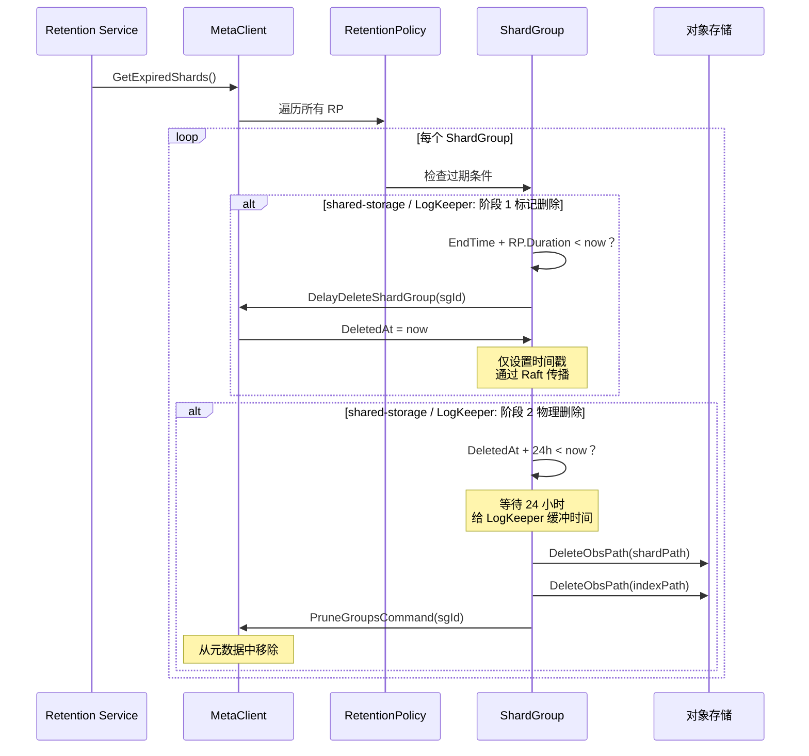
```mermaid
sequenceDiagram
    participant Service as Retention Service
    participant Meta as MetaClient
    participant RP as RetentionPolicy
    participant SG as ShardGroup
    participant OBS as 对象存储

    Service->>Meta: GetExpiredShards()
    Meta->>RP: 遍历所有 RP

    loop 每个 ShardGroup
        RP->>SG: 检查过期条件

        alt shared-storage / LogKeeper: 阶段 1 标记删除
            SG->>SG: EndTime + RP.Duration < now？
            SG->>Meta: DelayDeleteShardGroup(sgId)
            Meta->>SG: DeletedAt = now
            Note over SG: 仅设置时间戳<br/>通过 Raft 传播
        end

        alt shared-storage / LogKeeper: 阶段 2 物理删除
            SG->>SG: DeletedAt + 24h < now？
            Note over SG: 等待 24 小时<br/>给 LogKeeper 缓冲时间

            SG->>OBS: DeleteObsPath(shardPath)
            SG->>OBS: DeleteObsPath(indexPath)
            SG->>Meta: PruneGroupsCommand(sgId)
            Note over Meta: 从元数据中移除
        end
    end
```

**核心代码**：`lib/metaclient/meta_client_impl.go:2047-2072`

```go
// （基于实际代码修正）第 2047 行：标记删除 ShardGroup
// When delay-deleted, the deletedAt time cannot be updated with the raft playback,
// so deletedAt is specified by the client.
func (c *Client) DelayDeleteShardGroup(database, policy string, id uint64, deletedAt time.Time, deleteType int32) error {
    cmd := &proto2.DeleteShardGroupCommand{
        Database:     proto.String(database),
        Policy:       proto.String(policy),
        ShardGroupID: proto.Uint64(id),
        DeletedAt:    proto.Int64(deletedAt.UnixNano()),
        DeleteType:   proto.Int32(deleteType),
    }

    _, err := c.retryExec(proto2.Command_DeleteShardGroupCommand, proto2.E_DeleteShardGroupCommand_Command, cmd)
    return err
}

// （基于实际代码修正）第 2062 行：物理删除 ShardGroup
// PyStore send command to PyMeta. NO need to waitForIndex.
func (c *Client) PruneGroupsCommand(shardGroup bool, id uint64) error {
    cmd := &proto2.PruneGroupsCommand{
        ShardGroup: proto.Bool(shardGroup),
        ID:         proto.Uint64(id),
    }
    _, err := c.retryExec(proto2.Command_PruneGroupsCommand, proto2.E_PruneGroupsCommand_Command, cmd)
    if err != nil {
        return err
    }
    return nil
}
```

**逐行解释**（基于实际代码修正）：
- **第 2047 行**：`DelayDeleteShardGroup` 接收 5 个参数：`database, policy string, id uint64, deletedAt time.Time, deleteType int32`，使用 `DeleteShardGroupCommand` 而非 `DelayDeleteShardGroupCommand`，通过 `deletedAt.UnixNano()` 设置延迟删除时间戳
- **第 2057 行**：通过 `retryExec`（非 `retryUntilExec`）发送 Raft 命令
- **第 2062 行**：`PruneGroupsCommand` 接收 `shardGroup bool, id uint64` 两个参数，用于指定删除类型（ShardGroup 或其他）和目标 ID

**通俗解释**：
Retention 的两阶段删除就像"垃圾分类"：
- **本地存储模式**：过期 shard group 会立即进入删除流程，不额外等待 24 小时
- **阶段 1（标记删除）**：在垃圾桶上贴标签"已过期"，但还没倒掉
  - 好处：万一是误删，还能找回来
  - 查询时会跳过这些数据
- **阶段 2（物理删除）**：等 24 小时后，确认没人要了，才真正倒掉
  - 好处：给 LogKeeper 缓冲时间，避免数据丢失
  - 释放存储空间
- 两阶段延迟主要用于 shared-storage / LogKeeper 场景，不应泛化为所有 retention 删除都会等待 24 小时

**具体例子**：

假设 RP 配置 `duration = 7d`，ShardGroup 的 EndTime 是 5 月 20 日：

```
时间线：
5 月 20 日：ShardGroup 结束
5 月 27 日：EndTime + 7d = 过期时间
  → 阶段 1：标记删除
  → DelayDeleteShardGroup(sgId=100)
  → ShardGroup.DeletedAt = 2026-05-27 10:00:00
  → 查询时跳过这个 ShardGroup

5 月 28 日：DeletedAt + 24h = 物理删除时间
  → 阶段 2：物理删除
  → DeleteObsPath("shard/100/")  // 删除对象存储中的数据
  → DeleteObsPath("index/100/")  // 删除索引
  → PruneGroupsCommand(sgId=100) // 从元数据中移除
  → 存储空间释放
```

### 8.2 标记删除机制

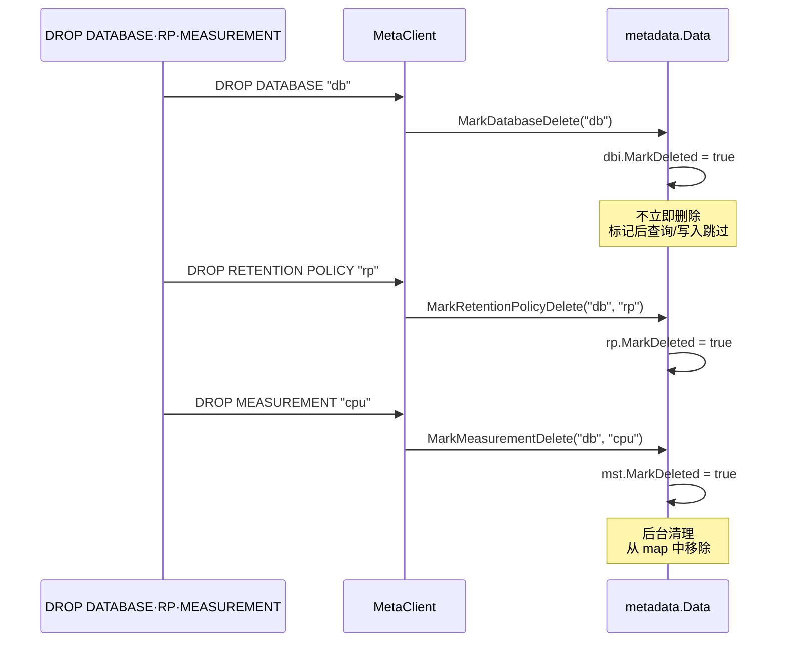
```mermaid
sequenceDiagram
    participant User as DROP DATABASE·RP·MEASUREMENT
    participant Meta as MetaClient
    participant Data as metadata.Data

    User->>Meta: DROP DATABASE "db"
    Meta->>Data: MarkDatabaseDelete("db")
    Data->>Data: dbi.MarkDeleted = true
    Note over Data: 不立即删除<br/>标记后查询/写入跳过

    User->>Meta: DROP RETENTION POLICY "rp"
    Meta->>Data: MarkRetentionPolicyDelete("db", "rp")
    Data->>Data: rp.MarkDeleted = true

    User->>Meta: DROP MEASUREMENT "cpu"
    Meta->>Data: MarkMeasurementDelete("db", "cpu")
    Data->>Data: mst.MarkDeleted = true

    Note over Data: 后台清理<br/>从 map 中移除
```

**通俗解释**：
- 删除操作都是先标记，后物理删除
- 标记后，查询和写入会跳过这些 entity
- 后台清理时才从内存 map 中移除
- 这个设计避免了删除操作阻塞读写路径

**核心代码** `lib/util/lifted/influx/meta/data.go` 中的三个标记删除函数：

```go
func (data *Data) MarkDatabaseDelete(name string) error {
    dbi := data.Databases[name]
    if dbi == nil {
        return errno.NewError(errno.DatabaseNotFound, name)
    }
    if e := data.CheckStreamExistInDatabase(name); e != nil {
        return e
    }
    if dbi.MarkDeleted {
        return errno.NewError(errno.DatabaseIsBeingDelete, name)
    }
    if err := data.checkMigrateConflict(name); err != nil {
        return err
    }
    dbi.MarkDeleted = true
    return nil
}
```

| 行号 | 代码 | 解释 |
|------|------|------|
| 1 | `func (data *Data) MarkDatabaseDelete(name string) error` | 标记数据库为删除状态 |
| 2-4 | `dbi := data.Databases[name]; if dbi == nil` | 从内存 map 中查找数据库，不存在则报错 |
| 5-7 | `data.CheckStreamExistInDatabase(name)` | 检查数据库下是否有流任务，有则不允许删除 |
| 8-10 | `if dbi.MarkDeleted` | 已经标记删除了，返回"正在删除"错误 |
| 11-13 | `data.checkMigrateConflict(name)` | 检查是否有数据迁移任务冲突 |
| 14 | `dbi.MarkDeleted = true` | **核心操作**：只设置标记，不删除任何数据 |

```go
func (data *Data) MarkRetentionPolicyDelete(database, name string) error {
    rp, err := data.RetentionPolicy(database, name)
    if err != nil {
        return err
    }
    if e := data.CheckStreamExistInRetention(database, name); e != nil {
        return e
    }
    if err = data.checkMigrateConflict(database); err != nil {
        return err
    }
    rp.MarkDeleted = true
    return nil
}
```

| 行号 | 代码 | 解释 |
|------|------|------|
| 1 | `func (data *Data) MarkRetentionPolicyDelete(database, name string)` | 标记保留策略为删除状态 |
| 2-4 | `data.RetentionPolicy(database, name)` | 查找 RP，不存在则报错 |
| 5-7 | `data.CheckStreamExistInRetention(database, name)` | 检查 RP 下是否有流任务 |
| 8-10 | `data.checkMigrateConflict(database)` | 检查迁移冲突 |
| 11 | `rp.MarkDeleted = true` | 只设置标记，查询/写入时跳过此 RP |

```go
func (data *Data) MarkMeasurementDelete(database, policy, measurement string) error {
    mst, err := data.Measurement(database, policy, measurement)
    if err != nil {
        return err
    }
    if e := data.CheckStreamExistInMst(database, policy, measurement); e != nil {
        return e
    }
    if err = data.checkMigrateConflict(database); err != nil {
        return err
    }
    mst.MarkDeleted = true
    return nil
}
```

| 行号 | 代码 | 解释 |
|------|------|------|
| 1 | `func (data *Data) MarkMeasurementDelete(database, policy, measurement string)` | 标记 measurement 为删除状态 |
| 2-4 | `data.Measurement(database, policy, measurement)` | 查找 measurement |
| 5-7 | `data.CheckStreamExistInMst(...)` | 检查 measurement 下是否有流任务 |
| 11 | `mst.MarkDeleted = true` | 只设置标记，后台清理时才从 map 中移除 |

**具体例子**：

删除数据库 "mydb" 的过程：

```
Step 1: 用户执行 DROP DATABASE "mydb"
  → MetaClient 发送命令到 ts-meta
  → ts-meta 通过 Raft 共识传播

Step 2: 标记删除
  → MarkDatabaseDelete("mydb")
  → data.Databases["mydb"].MarkDeleted = true
  → 查询时跳过 "mydb"
  → 写入时跳过 "mydb"

Step 3: 后台清理（延迟执行）
  → 遍历 "mydb" 的所有 RP、ShardGroup、Shard
  → 删除物理文件
  → 从 map 中移除 "mydb"

好处：
  → 删除操作不阻塞读写（只设置标记）
  → 后台清理不占用前台资源
  → 万一误删，可以恢复（标记还在）
```

---

## 9. Shelf WAL 与数据生命周期

### 9.1 Shelf WAL 独特优势

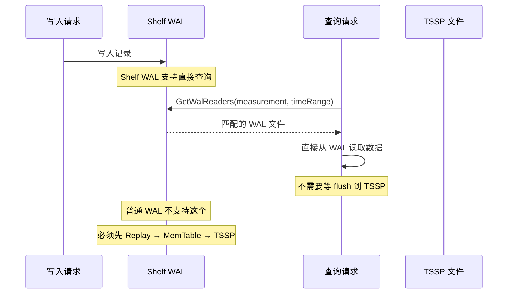
```mermaid
sequenceDiagram
    participant Write as 写入请求
    participant Shelf as Shelf WAL
    participant Query as 查询请求
    participant TSSP as TSSP 文件

    Write->>Shelf: 写入记录

    Note over Shelf: Shelf WAL 支持直接查询
    Query->>Shelf: GetWalReaders(measurement, timeRange)
    Shelf-->>Query: 匹配的 WAL 文件

    Query->>Query: 直接从 WAL 读取数据
    Note over Query: 不需要等 flush 到 TSSP

    Note over Shelf: 普通 WAL 不支持这个
    Note over Shelf: 必须先 Replay → MemTable → TSSP
```

**通俗解释**：
- Shelf WAL 的一个独特优势：支持直接从 WAL 文件读取数据
- 查询时，如果数据还在 WAL 中没 flush，可以直接从 WAL 读
- 普通 WAL 不支持这个，必须先 Replay 到 MemTable 再读
- **Hot Mode**：WAL 文件还会加载到内存的 MemFile 中，读取更快

**核心代码** `engine/shelf/shard.go` 中的 GetWalReaders（直接从 WAL 查询）：

```go
func (s *Shard) GetWalReaders(dst []*Wal, mst string, tr *util.TimeRange) []*Wal {
    s.mu.RLock()
    defer s.mu.RUnlock()

    for _, w := range s.waitSwitchWal {
        if w.HasMeasurement(mst) && w.Overlaps(tr.Min, tr.Max) {
            w.Ref()
            dst = append(dst, w)
        }
    }

    if s.wal.HasMeasurement(mst) && s.wal.Overlaps(tr.Min, tr.Max) {
        s.wal.Ref()
        dst = append(dst, s.wal)
    }
    return dst
}
```

| 行号 | 代码 | 解释 |
|------|------|------|
| 1 | `func (s *Shard) GetWalReaders(dst []*Wal, mst string, tr *util.TimeRange)` | 获取匹配 measurement 和时间范围的 WAL 文件列表，用于查询 |
| 2-3 | `s.mu.RLock(); defer s.mu.RUnlock()` | 加读锁，防止并发切换 WAL |
| 5-10 | `for _, w := range s.waitSwitchWal` | 遍历等待切换的 WAL 文件（已写满但还没转成 TSSP） |
| 6 | `w.HasMeasurement(mst) && w.Overlaps(tr.Min, tr.Max)` | 检查 WAL 是否包含目标 measurement 且时间范围有重叠 |
| 7 | `w.Ref()` | 增加引用计数，防止 WAL 被意外释放 |
| 12-16 | `s.wal.HasMeasurement(mst) && s.wal.Overlaps(...)` | 检查当前正在写入的 WAL 文件 |
| 17 | `return dst` | 返回所有匹配的 WAL 文件，查询引擎直接从这些文件读取数据 |

### 9.2 Shelf WAL 热模式

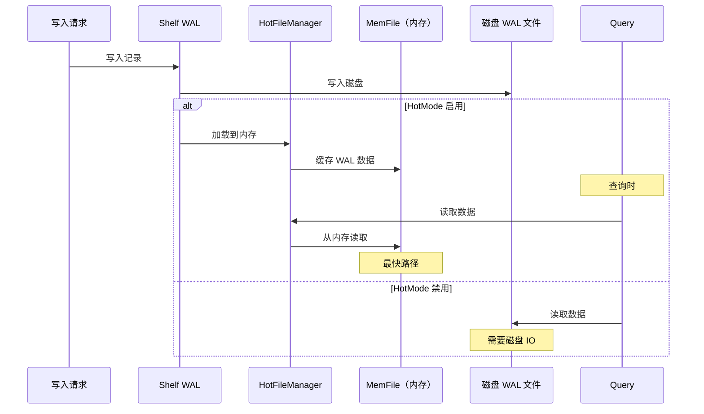
```mermaid
sequenceDiagram
    participant Write as 写入请求
    participant Shelf as Shelf WAL
    participant Hot as HotFileManager
    participant MemFile as MemFile（内存）
    participant Disk as 磁盘 WAL 文件

    Write->>Shelf: 写入记录
    Shelf->>Disk: 写入磁盘

    alt HotMode 启用
        Shelf->>Hot: 加载到内存
        Hot->>MemFile: 缓存 WAL 数据

        Note over Query: 查询时
        Query->>Hot: 读取数据
        Hot->>MemFile: 从内存读取
        Note over MemFile: 最快路径
    else HotMode 禁用
        Query->>Disk: 读取数据
        Note over Disk: 需要磁盘 IO
    end
```

**核心代码** `engine/shelf_wal.go` 中的 Shelf WAL 实现：

```go
type ShelfWal struct {
    mu          sync.RWMutex
    logPath     string
    logWriter   LogWriter
    hotMode     bool            // 是否启用热模式
    memFile     *MemFile        // 内存文件缓存
    walEnabled  bool
}
```

**核心代码** `engine/shelf/wal.go` 中的热模式开启逻辑：

```go
func (wal *Wal) open() error {
    if wal.opened {
        return nil
    }

    err := fileops.MkdirAll(wal.dir, 0700)
    if err != nil {
        return err
    }

    file := filepath.Join(wal.dir, fmt.Sprintf("%d.%s", AllocWalSeq(), walFileSuffixes))
    wal.file = NewWalFile(file, wal.lock)
    wal.file.setWalObsOptions(wal.option)

    if err = wal.file.Open(); err != nil {
        return err
    }

    if config.ShelfHotModeEnabled() {
        wal.file.OpenMemFile()
        wal.openAt = fasttime.UnixTimestamp()
        immutable.NewHotFileManager().Add(wal)
    }

    wal.opened = true
    return nil
}
```

| 行号 | 代码 | 解释 |
|------|------|------|
| 1 | `func (wal *Wal) open() error` | 打开 WAL 文件，准备写入 |
| 5-7 | `fileops.MkdirAll(wal.dir, 0700)` | 确保 WAL 目录存在 |
| 9-11 | `file := filepath.Join(wal.dir, fmt.Sprintf("%d.%s", ...))` | 生成 WAL 文件名（序列号.wal） |
| 12-13 | `wal.file = NewWalFile(file, wal.lock)` | 创建 WAL 文件对象 |
| 15-17 | `wal.file.Open()` | 打开磁盘文件 |
| 19-22 | `if config.ShelfHotModeEnabled()` | **热模式核心**：如果配置启用了热模式 |
| 20 | `wal.file.OpenMemFile()` | 创建内存 MemFile 缓存，大小为 MaxWalFileSize + 256KB |
| 21 | `wal.openAt = fasttime.UnixTimestamp()` | 记录打开时间，用于过期判断 |
| 22 | `immutable.NewHotFileManager().Add(wal)` | 注册到 HotFileManager，由它管理内存生命周期 |

**核心代码** `engine/shelf/wal.go` 中的 WalFileHot 热模式实现：

```go
type WalFileHot struct {
    memFile *fileops.MemFile
}

func (wf *WalFileHot) OpenMemFile() {
    wf.memFile = fileops.NewMemFile(int64(conf.MaxWalFileSize) + config.KB*256)
}

func (wf *WalFileHot) FreeMemory() {
    immutable.NewHotFileManager().IncrMemorySize(-wf.InMemSize())
    wf.memFile = nil
}

func (wf *WalFileHot) InMemSize() int64 {
    if mf := wf.memFile; mf != nil {
        return mf.MaxSize()
    }
    return 0
}
```

| 行号 | 代码 | 解释 |
|------|------|------|
| 1-3 | `type WalFileHot struct { memFile *fileops.MemFile }` | 热模式 WAL 文件，嵌入到 WalFile 中 |
| 5-7 | `func (wf *WalFileHot) OpenMemFile()` | 创建内存缓存，预分配 MaxWalFileSize + 256KB |
| 9-12 | `func (wf *WalFileHot) FreeMemory()` | 释放内存：先通知 HotFileManager 减少内存计数，再清空指针 |
| 14-19 | `func (wf *WalFileHot) InMemSize() int64` | 返回当前内存占用大小，用于 HotFileManager 的内存上限控制 |

**具体例子**：

Shelf WAL 与普通 WAL 的对比：

```
普通 WAL 写入流程：
  写入 → WAL 文件 → 只能通过 Replay 读取

Shelf WAL 写入流程：
  写入 → WAL 文件 + MemFile（热模式）
  查询 → 直接从 MemFile 读取（最快）
  查询 → 从 WAL 文件读取（次快）
  查询 → 从 TSSP 文件读取（最慢）
```

**通俗解释**：
Shelf WAL 就像"带缓存的日志"。普通 WAL 只能写入后通过 Replay 读取，Shelf WAL 支持直接查询，热模式下还能从内存读取，速度最快。

---

## 10. 降采样与压缩的协调

### 10.1 互斥机制

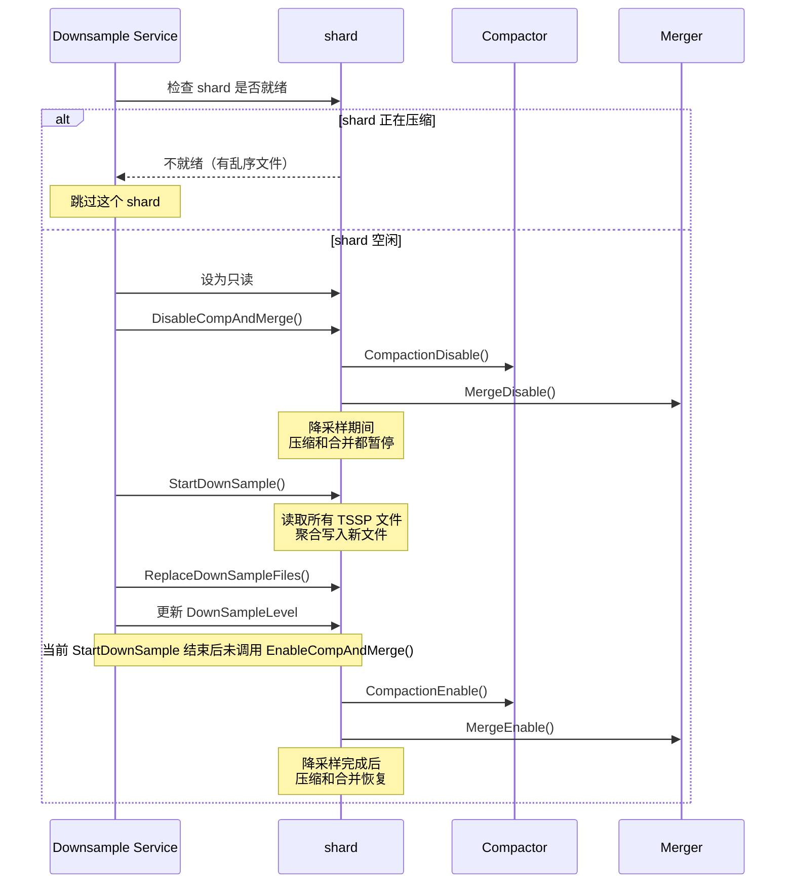
```mermaid
sequenceDiagram
    participant DS as Downsample Service
    participant Shard as shard
    participant Comp as Compactor
    participant Merge as Merger

    DS->>Shard: 检查 shard 是否就绪

    alt shard 正在压缩
        Shard-->>DS: 不就绪（有乱序文件）
        Note over DS: 跳过这个 shard
    else shard 空闲
        DS->>Shard: 设为只读
        DS->>Shard: DisableCompAndMerge()
        Shard->>Comp: CompactionDisable()
        Shard->>Merge: MergeDisable()

        Note over Shard: 降采样期间<br/>压缩和合并都暂停

        DS->>Shard: StartDownSample()
        Note over Shard: 读取所有 TSSP 文件<br/>聚合写入新文件

        DS->>Shard: ReplaceDownSampleFiles()
        DS->>Shard: 更新 DownSampleLevel
        Note over DS,Shard: 当前 StartDownSample 结束后未调用 EnableCompAndMerge()
        Shard->>Comp: CompactionEnable()
        Shard->>Merge: MergeEnable()

        Note over Shard: 降采样完成后<br/>压缩和合并恢复
    end
```

**通俗解释**：
- 降采样和压缩是互斥的：降采样时必须禁用压缩
- 因为降采样需要读取稳定的文件集合，压缩会改变文件
- 当前 `StartDownSample` 实现只调用 `DisableCompAndMerge()`；成功、失败或外层 `startDownSampleTask` 路径都没有自动调用 `EnableCompAndMerge()`。这应按当前实现限制/风险理解：降采样后压缩和合并可能保持禁用，除非后续代码或外部流程显式恢复。
- 恢复后，shard 标记为已降采样，压缩器跳过它

**核心代码** `engine/shard.go` 中的互斥控制（shard 层）：

```go
func (s *shard) DisableCompAndMerge() {
    s.immTables.DisableCompAndMerge()
}

func (s *shard) EnableCompAndMerge() {
    s.immTables.EnableCompAndMerge()
}
```

| 行号 | 代码 | 解释 |
|------|------|------|
| 1-3 | `func (s *shard) DisableCompAndMerge()` | shard 级别的禁用，委托给 immTables（不可变表存储） |
| 5-7 | `func (s *shard) EnableCompAndMerge()` | shard 级别的启用，同样委托给 immTables |

**核心代码** `engine/immutable/mms_tables.go` 中的互斥控制（存储层实现）：

```go
func (m *MmsTables) disableCompAndMerge() {
    m.inCompLock.Lock()
    defer m.inCompLock.Unlock()

    if !m.CompactionEnabled() {
        return
    }

    m.CompactionDisable()
    m.MergeDisable()
    if m.stopCompMerge != nil {
        close(m.stopCompMerge)
        m.stopCompMerge = nil
    }
}

func (m *MmsTables) DisableCompAndMerge() {
    m.disableCompAndMerge()
    m.Wait()
}
```

| 行号 | 代码 | 解释 |
|------|------|------|
| 1 | `func (m *MmsTables) disableCompAndMerge()` | 内部方法，禁用压缩和合并 |
| 2-3 | `m.inCompLock.Lock(); defer m.inCompLock.Unlock()` | 加锁，防止与压缩/合并操作并发 |
| 5-7 | `if !m.CompactionEnabled() { return }` | 已经禁用了，直接返回（幂等操作） |
| 9 | `m.CompactionDisable()` | 原子操作设置 `compactionEn = 0` |
| 10 | `m.MergeDisable()` | 原子操作设置 `mergeEn = 0` |
| 11-14 | `close(m.stopCompMerge)` | 关闭信号通道，通知正在运行的压缩/合并 goroutine 停止 |
| 17-20 | `func (m *MmsTables) DisableCompAndMerge()` | 公开方法：先禁用，再 Wait 等待正在执行的任务完成 |

**核心代码** `engine/immutable/mms_tables.go` 中的原子标志位：

```go
func (m *MmsTables) CompactionDisable() {
    atomic.StoreInt32(&m.compactionEn, 0)
}

func (m *MmsTables) MergeDisable() {
    atomic.StoreInt32(&m.mergeEn, 0)
}

func (m *MmsTables) CompactionEnabled() bool {
    return atomic.LoadInt32(&m.compactionEn) == 1
}
```

| 行号 | 代码 | 解释 |
|------|------|------|
| 1-3 | `CompactionDisable()` | 原子写入 `compactionEn = 0`，压缩器每次循环检查此标志 |
| 5-7 | `MergeDisable()` | 原子写入 `mergeEn = 0`，合并器每次循环检查此标志 |
| 9-11 | `CompactionEnabled()` | 原子读取 `compactionEn`，判断压缩是否启用 |

**具体例子**：

降采样与压缩的协调过程：

```
场景：shard 1 有 10 个 TSSP 文件，需要降采样

Step 1: DownSample Service 检查 shard 1
  → shard 1 正在压缩？否
  → shard 1 空闲，可以降采样

Step 2: 禁用压缩和合并
  → DisableCompAndMerge()
  → CompactionDisable()
  → MergeDisable()
  → 压缩器和合并器跳过 shard 1

Step 3: 执行降采样
  → 读取 10 个 TSSP 文件
  → 聚合计算
  → 写入新文件

Step 4: 替换文件
  → ReplaceDownSampleFiles()
  → 更新 DownSampleLevel

Step 5: 当前实现没有自动恢复压缩和合并
  → 压缩器可以处理 shard 1 了

如果没有禁用压缩：
  → 降采样读取文件 A
  → 压缩器合并文件 A 和 B → 文件 C
  → 降采样写入文件 D（基于旧的 A）
  → 文件 A 被删除，但降采样还在用它
  → 数据不一致！
```

### 10.2 关闭顺序

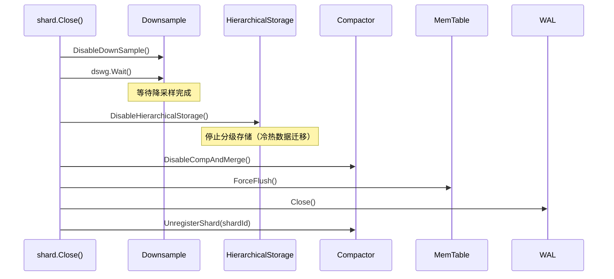
```mermaid
sequenceDiagram
    participant Close as shard.Close()
    participant Down as Downsample
    participant Hier as HierarchicalStorage
    participant Comp as Compactor
    participant Mem as MemTable
    participant WAL as WAL

    Close->>Down: DisableDownSample()
    Close->>Down: dswg.Wait()
    Note over Down: 等待降采样完成

    Close->>Hier: DisableHierarchicalStorage()
    Note over Hier: 停止分级存储（冷热数据迁移）

    Close->>Comp: DisableCompAndMerge()

    Close->>Mem: ForceFlush()
    Close->>WAL: Close()

    Close->>Comp: UnregisterShard(shardId)
```

**通俗解释**：
- shard 关闭时，必须按正确顺序停止后台任务
- 先停降采样（等它完成），再停分级存储（冷热数据迁移），再停压缩，最后 flush MemTable 和关闭 WAL
- 这个顺序确保数据一致性

**核心代码** `engine/shard.go` 中的 Close 函数（完整关闭流程）：

```go
func (s *shard) Close() error {
    // prevent multi goroutines close shard the same time
    if atomic.AddInt32(&s.cacheClosed, 1) != 1 {
        return errno.NewError(errno.ErrShardClosed, s.ident.ShardID)
    }

    s.DisableDownSample()
    s.DisableHierarchicalStorage()
    s.DisableCompAndMerge()

    s.mu.Lock()
    defer s.mu.Unlock()

    if s.indexBuilder != nil {
        compWorker.UnregisterShard(s.ident.ShardID)
    }

    if s.skIdx != nil {
        if err := s.skIdx.Close(); err != nil {
            return err
        }
    }

    s.closed.Close()

    log.Info("start close shard...", zap.Uint64("id", s.ident.ShardID))
    s.cancelWalReplay()
    if err := s.wal.Close(); err != nil {
        log.Error("close wal fail", zap.Uint64("id", s.ident.ShardID), zap.Error(err))
        return err
    }

    // release mem table resource
    s.snapshotLock.Lock()
    curMemSize := int64(0)
    if s.activeTbl != nil {
        curMemSize = s.activeTbl.GetMemSize()
        s.activeTbl = nil
    }
    s.snapshotLock.Unlock()
    nodeMutableLimit.freeResource(curMemSize)

    // wait snapshot
    s.waitSnapshot()
    ...
}
```

| 行号 | 代码 | 解释 |
|------|------|------|
| 3-5 | `atomic.AddInt32(&s.cacheClosed, 1) != 1` | 原子操作防止多个 goroutine 同时关闭同一个 shard |
| 7 | `s.DisableDownSample()` | **第一步**：停止降采样，调用 `stopDownSample.Close()` + `dswg.Wait()` 等待完成 |
| 8 | `s.DisableHierarchicalStorage()` | **第二步**：停止分级存储（冷热数据迁移） |
| 9 | `s.DisableCompAndMerge()` | **第三步**：禁用压缩和合并，等待正在执行的任务完成 |
| 11-12 | `s.mu.Lock(); defer s.mu.Unlock()` | 加写锁，防止关闭期间有新的读写操作 |
| 14-16 | `compWorker.UnregisterShard(s.ident.ShardID)` | **第四步**：从压缩器注销 shard |
| 26 | `s.closed.Close()` | 发送关闭信号，所有监听 `s.closed` 的 goroutine 退出 |
| 28 | `s.cancelWalReplay()` | 取消 WAL Replay（如果正在进行） |
| 29-32 | `s.wal.Close()` | **第五步**：关闭 WAL，刷盘并关闭文件 |
| 35-41 | `s.activeTbl = nil; nodeMutableLimit.freeResource(curMemSize)` | **第六步**：释放 MemTable 内存资源 |
| 44 | `s.waitSnapshot()` | **第七步**：等待正在执行的 Snapshot 完成 |

**核心代码** `engine/shard.go` 中的 DisableDownSample（关闭顺序第一步）：

```go
func (s *shard) DisableDownSample() {
    s.stopDownSample.Close()
    s.dswg.Wait()
}

func (s *shard) CanDoDownSample() bool {
    if s.isClosing() || !s.downSampleEnabled() {
        return false
    }
    return true
}
```

| 行号 | 代码 | 解释 |
|------|------|------|
| 1-4 | `func (s *shard) DisableDownSample()` | 关闭降采样信号 + 等待正在执行的降采样完成 |
| 2 | `s.stopDownSample.Close()` | 关闭信号通道，`CanDoDownSample()` 返回 false |
| 3 | `s.dswg.Wait()` | 阻塞等待，直到正在执行的降采样 goroutine 退出 |
| 5-10 | `func (s *shard) CanDoDownSample() bool` | 降采样服务每次循环调用此方法，检查是否可以继续 |

**具体例子**：

shard 关闭的正确顺序：

```
shard.Close() 执行过程：

Step 1: 停止降采样
  → DisableDownSample()
  → dswg.Wait()  // 等待正在执行的降采样完成
  → 确保降采样不会中途退出

Step 2: 停止压缩和合并
  → DisableCompAndMerge()
  → 确保压缩器不会修改文件

Step 3: Flush MemTable
  → ForceFlush()
  → 把内存中的数据写入 TSSP 文件
  → 确保数据不丢失

Step 4: 关闭 WAL
  → Close()
  → 刷盘并关闭 WAL 文件
  → 确保日志完整

Step 5: 注销 shard
  → UnregisterShard(shardId)
  → 压缩器不再处理这个 shard

如果顺序不对（比如先关 WAL 再 flush）：
  → MemTable 中的数据还没写入 TSSP
  → WAL 已经关闭，无法恢复
  → 数据丢失！
```

---

## 11. 潜在隐患

### 11.1 降采样期间数据丢失

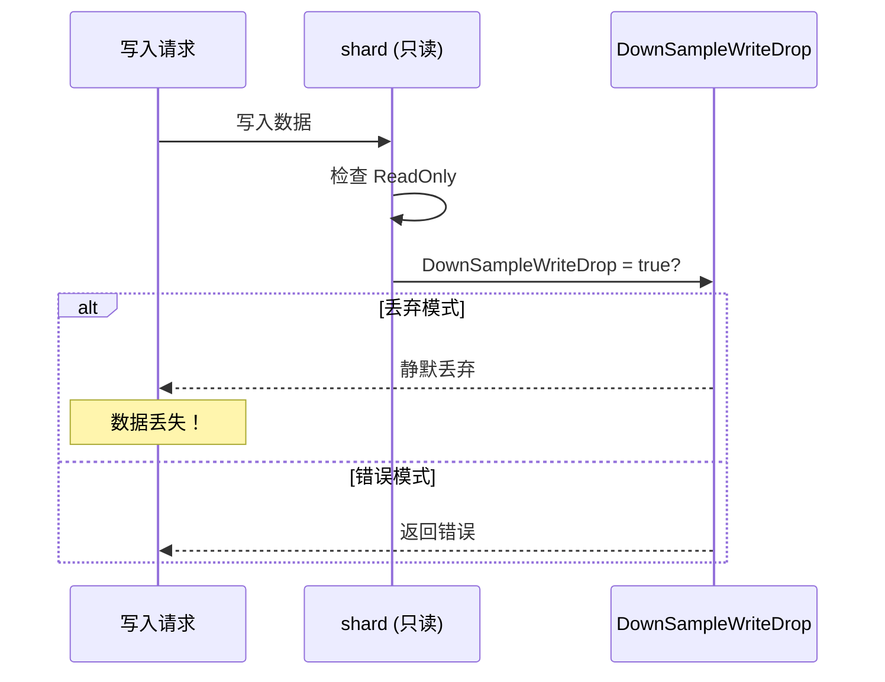
```mermaid
sequenceDiagram
    participant Write as 写入请求
    participant Shard as shard (只读)
    participant DS as DownSampleWriteDrop

    Write->>Shard: 写入数据
    Shard->>Shard: 检查 ReadOnly
    Shard->>DS: DownSampleWriteDrop = true?
    alt 丢弃模式
        DS-->>Write: 静默丢弃
        Note over Write: 数据丢失！
    else 错误模式
        DS-->>Write: 返回错误
    end
```

**隐患**：
- 降采样期间 shard 是只读的，新写入的数据会被丢弃或返回错误
- 如果 `DownSampleWriteDrop = true`，数据会静默丢失
- 用户需要了解这个行为，避免在降采样期间写入关键数据

**具体例子**：

降采样期间数据丢失的场景：

```
场景：shard 1 正在降采样，用户写入新数据

Step 1: shard 1 开始降采样
  → 设为只读
  → DisableCompAndMerge()

Step 2: 用户写入 cpu,host=server1 value=99.5
  → 检查 shard 1 是否只读：是
  → 检查 DownSampleWriteDrop：
    → true：静默丢弃，返回成功（数据丢失！）
    → false：返回错误"shard is read-only"

Step 3: 降采样完成
  → shard 1 恢复可写

影响：
  → 降采样期间（通常几秒到几分钟）的数据可能丢失
  → 如果 DownSampleWriteDrop = true，用户不知道数据丢了
  → 建议：降采样期间暂停写入，或设置 DownSampleWriteDrop = false
```

### 11.2 多级降采样的数据一致性

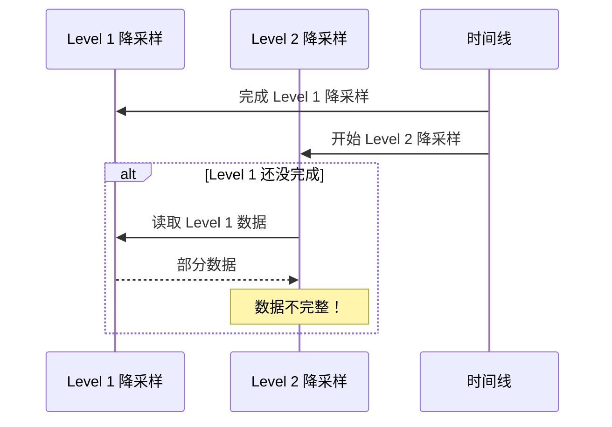
```mermaid
sequenceDiagram
    participant L1 as Level 1 降采样
    participant L2 as Level 2 降采样
    participant Time as 时间线

    Time->>L1: 完成 Level 1 降采样
    Time->>L2: 开始 Level 2 降采样

    alt Level 1 还没完成
        L2->>L1: 读取 Level 1 数据
        L1-->>L2: 部分数据
        Note over L2: 数据不完整！
    end
```

**隐患**：
- 多级降采样需要按顺序执行：先 Level 1，再 Level 2
- 如果 Level 1 还没完成就开始 Level 2，会导致数据不完整
- 系统通过 `DownSampleLevel` 追踪当前级别，但并发场景下仍需注意

**具体例子**：

多级降采样的数据一致性问题：

```
场景：Level 1 和 Level 2 同时执行

正确的顺序：
  t=0s: Level 1 开始（读取原始数据）
  t=5s: Level 1 完成（写入 Level 1 文件）
  t=6s: Level 2 开始（读取 Level 1 数据）
  t=8s: Level 2 完成（写入 Level 2 文件）

如果同时执行：
  t=0s: Level 1 开始（读取原始数据）
  t=0s: Level 2 开始（读取 Level 1 数据）
  t=2s: Level 2 读取 Level 1 数据（但 Level 1 还没完成！）
  → Level 2 读到的是不完整的数据
  → Level 2 的结果不正确

系统如何避免：
  → DownSampleLevel 追踪当前级别
  → 只有 Level 0 → Level 1 完成后，才允许 Level 1 → Level 2
  → 通过 DownSampleLevel 字段控制
```

### 11.3 Retention 删除延迟

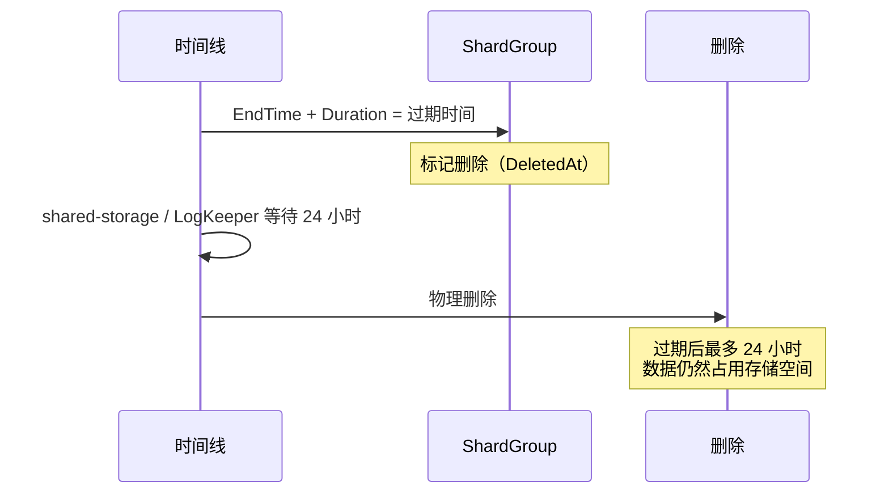
```mermaid
sequenceDiagram
    participant Time as 时间线
    participant SG as ShardGroup
    participant Delete as 删除

    Time->>SG: EndTime + Duration = 过期时间
    Note over SG: 标记删除（DeletedAt）

    Time->>Time: shared-storage / LogKeeper 等待 24 小时

    Time->>Delete: 物理删除
    Note over Delete: 过期后最多 24 小时<br/>数据仍然占用存储空间
```

**隐患**：
- 本地 retention 过期后会立即删除；shared-storage / LogKeeper 模式下，数据过期后还要等 24 小时才物理删除
- 这 24 小时内数据仍然占用存储空间
- 对于存储空间紧张的场景，这个延迟可能是问题

**具体例子**：

Retention 删除延迟的影响：

```
场景：RP 配置 duration = 7d，存储空间紧张

时间线：
5 月 20 日：ShardGroup 结束，数据量 100GB
5 月 27 日：过期，标记删除
  → 数据仍然占用 100GB
5 月 28 日：物理删除
  → 释放 100GB

问题：
  → 过期后还要等 24 小时才释放空间
  → 如果每天过期 100GB，最多有 100GB 的"僵尸"数据
  → 存储空间紧张时，这 100GB 可能是问题

优化方案：
  → 减少等待时间（但要考虑 LogKeeper 的缓冲）
  → 增加存储空间
  → 使用更短的 retention duration
```

---

## 11. 端到端实战：一次降采样的完整生命周期

> 假设 retention policy 配置了 2 级降采样：1m→10m→1h，追踪一次 1m→10m 降采样的完整过程。

### 11.1 降采样策略配置

```json
{
  "name": "autogen",
  "duration": "7d",
  "downSamplePolicy": [
    {"level": 1, "sampleInterval": "10m", "timeInterval": "1h"},
    {"level": 2, "sampleInterval": "1h", "timeInterval": "24h"}
  ]
}
```

**含义**：
- Level 1：每 10 分钟的数据聚合为一个点，保留 1 小时
- Level 2：每 1 小时的数据聚合为一个点，保留 24 小时

### 11.2 初始状态

```
原始数据 (Level 0, 1m 精度)：
┌─────────────────────┬────────┐
│ time                │ value  │
├─────────────────────┼────────┤
│ 00:00:00            │ 10.0   │
│ 00:01:00            │ 20.0   │
│ 00:02:00            │ 30.0   │
│ 00:03:00            │ 40.0   │
│ 00:04:00            │ 50.0   │
│ 00:05:00            │ 60.0   │
│ 00:06:00            │ 70.0   │
│ 00:07:00            │ 80.0   │
│ 00:08:00            │ 90.0   │
│ 00:09:00            │ 100.0  │
│ 00:10:00            │ 110.0  │
│ 00:11:00            │ 120.0  │
│ 00:12:00            │ 130.0  │
│ 00:13:00            │ 140.0  │
│ 00:14:00            │ 150.0  │
└─────────────────────┴────────┘
```

### 11.3 降采样时序图

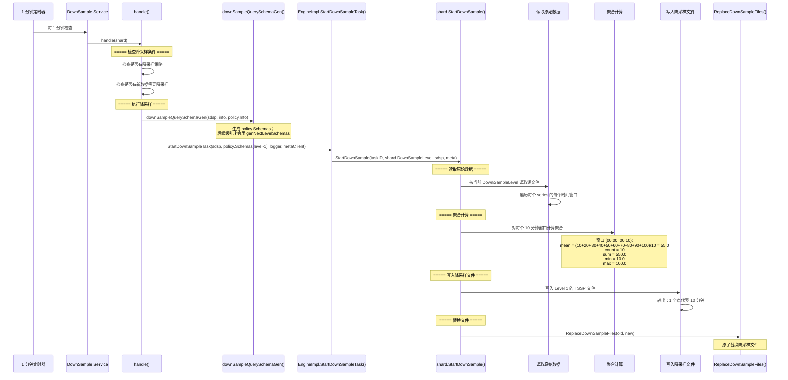
```mermaid
sequenceDiagram
    participant Timer as 1 分钟定时器
    participant Service as DownSample Service
    participant Handle as handle()
    participant Schema as downSampleQuerySchemaGen()
    participant Engine as EngineImpl.StartDownSampleTask()
    participant Shard as shard.StartDownSample()
    participant Read as 读取原始数据
    participant Agg as 聚合计算
    participant Write as 写入降采样文件
    participant Replace as ReplaceDownSampleFiles()

    Timer->>Service: 每 1 分钟检查
    Service->>Handle: handle(shard)

    Note over Handle: ===== 检查降采样条件 =====
    Handle->>Handle: 检查是否有降采样策略
    Handle->>Handle: 检查是否有新数据需要降采样

    Note over Handle: ===== 执行降采样 =====
    Handle->>Schema: downSampleQuerySchemaGen(sdsp, info, policy.Info)
    Note over Schema: 生成 policy.Schemas；<br/>后续级别才会用 genNextLevelSchemas

    Handle->>Engine: StartDownSampleTask(sdsp, policy.Schemas[level-1], logger, metaClient)
    Engine->>Shard: StartDownSample(taskID, shard.DownSampleLevel, sdsp, meta)
    Note over Shard: ===== 读取原始数据 =====
    Shard->>Read: 按当前 DownSampleLevel 读取源文件
    Read->>Read: 遍历每个 series 的每个时间窗口

    Note over Shard: ===== 聚合计算 =====
    Shard->>Agg: 对每个 10 分钟窗口计算聚合
    Note over Agg: 窗口 [00:00, 00:10):<br/>mean = (10+20+30+40+50+60+70+80+90+100)/10 = 55.0<br/>count = 10<br/>sum = 550.0<br/>min = 10.0<br/>max = 100.0

    Note over Shard: ===== 写入降采样文件 =====
    Shard->>Write: 写入 Level 1 的 TSSP 文件
    Write->>Write: 输出：1 个点代表 10 分钟

    Note over Shard: ===== 替换文件 =====
    Shard->>Replace: ReplaceDownSampleFiles(old, new)
    Note over Replace: 原子替换降采样文件
```

### 11.4 Step 1 详解：genNextLevelSchema — 重写聚合函数

**代码路径**：`services/downsample/functions.go:146-183`

```go
// 第 146 行：生成下一级降采样的查询 Schema
func genNextLevelSchema(s hybridqp.Catalog, timeInterval time.Duration) hybridqp.Catalog {
    fields := s.GetQueryFields()
    renameFields := make([]*influxql.Field, len(fields))
    for i := range renameFields {
        f, _ := influxql.CloneExpr(fields[i].Expr).(*influxql.Call)
        callName := f.Name
        if f.Name == "count" {
            f.Name = "sum"  // count → sum（多个窗口的 count 需要累加）
        }
        rewriteField(f, callName)  // 重写字段名：value → sum_value
        renameFields[i] = &influxql.Field{Expr: f}
    }
    columnNames := s.GetColumnNames()
    opt := genDefaultOpt(s.Options().OptionsName())
    opt.Interval = hybridqp.Interval{Duration: timeInterval}
    return executor.NewQuerySchemaWithSources(renameFields, s.Sources(), columnNames, opt, nil)
}

// 第 168 行：重写字段引用名
func rewriteField(expr influxql.Expr, callName string) {
    c, ok := expr.(*influxql.Call)
    if !ok { return }
    for i := range c.Args {
        v, ok := c.Args[i].(*influxql.VarRef)
        if !ok { return }
        v.Val = callName + "_" + v.Val  // "value" → "sum_value"
        if callName == "count" {
            v.Type = influxql.Integer  // count 的结果是整数
        }
    }
}
```

**逐行解释**：
- **第 147 行**：`GetQueryFields()` 获取当前级别的查询字段（如 `mean(value)`）
- **第 150 行**：`CloneExpr` 克隆表达式，避免修改原始 Schema
- **第 152-153 行**：`count` → `sum`，因为多个窗口的 count 需要累加（`count(a) + count(b) ≠ count(a+b)`，但 `sum(a) + sum(b) = sum(a+b)`）
- **第 155 行**：`rewriteField` 重写字段名，如 `value` → `sum_value`
- **第 178 行**：`v.Val = callName + "_" + v.Val` 将字段名加上聚合前缀

### 11.5 Step 2 详解：聚合计算 — 10 分钟窗口

**原始数据**（10 分钟窗口）：
```
窗口 [00:00, 00:10):
┌─────────────────────┬────────┐
│ time                │ value  │
├─────────────────────┼────────┤
│ 00:00:00            │ 10.0   │
│ 00:01:00            │ 20.0   │
│ 00:02:00            │ 30.0   │
│ 00:03:00            │ 40.0   │
│ 00:04:00            │ 50.0   │
│ 00:05:00            │ 60.0   │
│ 00:06:00            │ 70.0   │
│ 00:07:00            │ 80.0   │
│ 00:08:00            │ 90.0   │
│ 00:09:00            │ 100.0  │
└─────────────────────┴────────┘
```

**聚合计算**：
```go
// 聚合函数计算
count := 10  // 10 个点
sum := 10.0 + 20.0 + 30.0 + 40.0 + 50.0 + 60.0 + 70.0 + 80.0 + 90.0 + 100.0 = 550.0
min := 10.0  // 最小值
max := 100.0  // 最大值
mean := sum / count = 550.0 / 10 = 55.0  // 平均值
```

**降采样结果**（Level 1, 10m 精度）：
```
┌─────────────────────┬───────┬───────┬───────┬───────┬─────────┐
│ time                │ count │ sum   │ min   │ max   │ mean    │
├─────────────────────┼───────┼───────┼───────┼───────┼─────────┤
│ 00:00:00            │ 10    │ 550.0 │ 10.0  │ 100.0 │ 55.0    │
│ 00:10:00            │ 5     │ 650.0 │ 110.0 │ 150.0 │ 130.0   │
└─────────────────────┴───────┴───────┴───────┴───────┴─────────┘
```

### 11.6 Step 3 详解：写入降采样文件

**代码路径**：`engine/shard.go:1654-1726`

```go
// （基于实际代码修正）engine/shard.go:1654-1726
func (s *shard) StartDownSample(taskID uint64, level int, sdsp *meta.ShardDownSamplePolicyInfo, meta interface {
    UpdateShardDownSampleInfo(Ident *meta.ShardIdentifier) error
}) error {
    s.mu.RLock()
    defer s.mu.RUnlock()
    info, schemas, logger := s.shardDownSampleTaskInfo.sdsp, s.shardDownSampleTaskInfo.schema, s.shardDownSampleTaskInfo.log
    var err error

    s.dswg.Add(1)
    defer s.dswg.Done()

    if !s.downSampleEnabled() {
        return nil
    }
    s.DisableCompAndMerge()

    lcLog := Log.NewLogger(errno.ModuleDownSample).SetZapLogger(logger)
    taskNum := len(schemas)
    parallelism := maxDownSampleTaskNum
    filesMap := make(map[int]*immutable.TSSPFiles, taskNum)
    allDownSampleFiles := make(map[int][]immutable.TSSPFile, taskNum)
    logger.Info("DownSample Start", zap.Any("shardId", info.ShardId))
    for i := 0; i < taskNum; i += parallelism {
        var num int
        if i+parallelism <= taskNum {
            num = parallelism
        } else {
            num = taskNum - i
        }
        err = s.StartDownSampleTaskBySchema(i, filesMap, allDownSampleFiles, schemas[i:i+num], info, logger)
        if err != nil {
            break
        }
    }

    if !s.downSampleEnabled() {
        err = fmt.Errorf("downsample cancel")
    }
    if err == nil {
        mstNames := make([]string, 0)
        originFiles := make([][]immutable.TSSPFile, 0)
        newFiles := make([][]immutable.TSSPFile, 0)
        for k, v := range allDownSampleFiles {
            nameWithVer := schemas[k].Options().OptionsName()
            files := filesMap[k]
            var filesSlice []immutable.TSSPFile
            for _, f := range files.Files() {
                filesSlice = append(filesSlice, f)
                if !f.UnrefFileReader() {
                    f.Unref()
                }
            }
            mstNames = append(mstNames, nameWithVer)
            originFiles = append(originFiles, filesSlice)
            newFiles = append(newFiles, v)
        }
        if e := s.ReplaceDownSampleFiles(mstNames, originFiles, newFiles, lcLog, taskID, level, sdsp, meta); e != nil {
            s.DeleteDownSampleFiles(allDownSampleFiles)
            return e
        }
        logger.Info("DownSample Success", zap.Any("shardId", info.ShardId))
    } else {
        for _, v := range filesMap {
            for _, f := range v.Files() {
                if !f.UnrefFileReader() {
                    f.Unref()
                }
            }
        }
        s.DeleteDownSampleFiles(allDownSampleFiles)
    }
    return err
}
```

**逐行解释**（基于实际代码修正）：
- `s.shardDownSampleTaskInfo`：从预构建的 task info 中获取 sdsp、schema、logger，而非接收 level 和 schema 参数
- `s.DisableCompAndMerge()`：禁用压缩和合并，确保文件集合稳定
- `s.StartDownSampleTaskBySchema()`：分批并行执行实际的降采样（扫描 -> 聚合 -> 写入新文件），每批最多 `maxDownSampleTaskNum` 个 schema
- `s.ReplaceDownSampleFiles()`：成功时原子替换文件（写日志 -> 重命名 -> 删旧 -> 加新）
- `s.DeleteDownSampleFiles()`：失败时清理临时降采样文件

### 11.7 降采样前后对比

```
降采样前 (Level 0, 1m 精度, 15 个点):
┌─────────────────────┬────────┐
│ time                │ value  │
├─────────────────────┼────────┤
│ 00:00:00            │ 10.0   │
│ 00:01:00            │ 20.0   │
│ ...                 │ ...    │
│ 00:14:00            │ 150.0  │
└─────────────────────┴────────┘

降采样后 (Level 1, 10m 精度, 2 个点):
┌─────────────────────┬───────┬───────┬───────┬───────┬─────────┐
│ time                │ count │ sum   │ min   │ max   │ mean    │
├─────────────────────┼───────┼───────┼───────┼───────┼─────────┤
│ 00:00:00            │ 10    │ 550.0 │ 10.0  │ 100.0 │ 55.0    │
│ 00:10:00            │ 5     │ 650.0 │ 110.0 │ 150.0 │ 130.0   │
└─────────────────────┴───────┴───────┴───────┴───────┴─────────┘

数据量减少：15 个点 → 2 个点（减少 87%）
```

**关键设计点**：
- **多级降采样**：1m → 10m → 1h，逐级降低精度
- **聚合函数重写**：count → sum(count)，确保多级聚合正确
- **原子替换**：ReplaceDownSampleFiles 保证文件列表的一致性
- **保留原始数据**：降采样后原始数据仍然保留，直到 retention 过期
