# Module 6: Cluster Communication 深度审计报告（庖丁解牛版 v3）

> 时序图优先，逐步拆解。每个流程都有 Mermaid 时序图 + 核心代码逐行解释。

---

## 1. 集群通信是什么？为什么需要它？

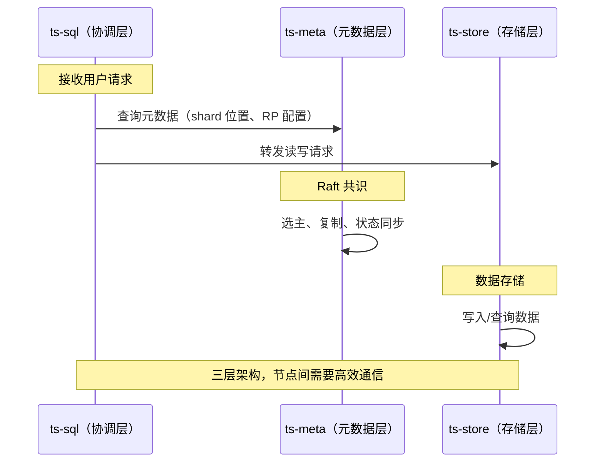
```mermaid
sequenceDiagram
    participant SQL as ts-sql（协调层）
    participant Meta as ts-meta（元数据层）
    participant Store as ts-store（存储层）

    Note over SQL: 接收用户请求
    SQL->>Meta: 查询元数据（shard 位置、RP 配置）
    SQL->>Store: 转发读写请求

    Note over Meta: Raft 共识
    Meta->>Meta: 选主、复制、状态同步

    Note over Store: 数据存储
    Store->>Store: 写入/查询数据

    Note over SQL,Store: 三层架构，节点间需要高效通信
```

**通俗解释**：
- openGemini 是三层架构：ts-sql（协调）、ts-meta（元数据）、ts-store（存储）
- 节点间需要高效通信：
  - ts-sql → ts-meta：查询元数据（shard 位置、RP 配置）
  - ts-sql → ts-store：转发读写请求
  - ts-meta ↔ ts-meta：元数据 Raft 共识（选主、复制）
- 通信层需要分清两类实现：业务 RPC 和 ts-store 分区级 Raft 消息基于 SPDY 多路复用；ts-meta 元数据 Raft 使用 Hashicorp Raft 的 `NetworkTransport`，不走 `lib/spdy`

**核心代码**：`lib/spdy/multiplexed_connection.go` — SPDY 连接

```go
// MultiplexedSession.Send — 通过会话发送数据（入口方法）
func (s *MultiplexedSession) Send(data []byte) error {
    if err := s.dataAck.Block(); err != nil {  // 流控：窗口满时阻塞
        return err
    }
    if err := s.fsm.ProcessEvent(SEND_DATA_EVENT, data); err != nil {  // FSM 状态转换
        return err
    }
    return nil
}

// MultiplexedSession.sendDataInternal — 编码帧头并通过连接写入
func (s *MultiplexedSession) sendDataInternal(flags uint16, data []byte) error {
    s.hdr.encode(DATA_TYPE, flags, s.id, uint32(len(data)))  // 编码 16 字节帧头
    if err := s.conn.Write(s.hdr, data); err != nil {        // 调用连接层写入
        return err
    }
    return nil
}

// MultiplexedConnection.Write — 将帧头和数据写入底层 TCP 连接
func (c *MultiplexedConnection) Write(hdr []byte, data []byte) error {
    c.outputGuard.Lock()
    defer func() {
        c.outputGuard.Unlock()
        c.FreeData(data)
    }()
    // ... 写入帧头 + 数据 + Flush
}
```

**逐行解释**：
- 数据发送通过 `MultiplexedSession.Send()` 入口，先经过流控（`dataAck.Block()`），再通过 FSM 状态机处理
- `sendDataInternal()` 编码 16 字节帧头（version + type + flags + connID + length），然后调用 `conn.Write()` 写入底层连接
- `MultiplexedConnection.Write()` 在写锁保护下将帧头和数据写入带缓冲的输出流并 Flush

**具体例子**：

假设有一个 3 节点的 openGemini 集群：

```
集群配置：
  Node 1: ts-sql + ts-meta（Leader）
  Node 2: ts-sql + ts-meta（Follower）
  Node 3: ts-store

用户执行：INSERT cpu,host=server1 value=99.5

通信流程：
  1. 用户 → Node 1 (ts-sql)
     → 接收写入请求

  2. Node 1 (ts-sql) → Node 1 (ts-meta)
     → 查询 shard 位置：cpu 表的 shard 在 Node 3

  3. Node 1 (ts-sql) → Node 3 (ts-store)
     → 转发写入请求到存储节点

  4. Node 3 (ts-store) → Node 3 (本地)
     → 写入 MemTable + WAL

  5. Node 1 (ts-sql) → 用户
     → 返回写入成功

用户执行：SELECT mean(value) FROM cpu WHERE host='server1'

通信流程：
  1. 用户 → Node 1 (ts-sql)
     → 接收查询请求

  2. Node 1 (ts-sql) → Node 1 (ts-meta)
     → 查询 shard 位置：cpu 表的 shard 在 Node 3

  3. Node 1 (ts-sql) → Node 3 (ts-store)
     → 转发查询请求到存储节点

  4. Node 3 (ts-store) → Node 3 (本地)
     → 执行查询，返回结果

  5. Node 1 (ts-sql) → 用户
     → 返回查询结果
```

---

## 2. SPDY 传输层 — FSM 状态机

### 2.1 FSM 状态定义

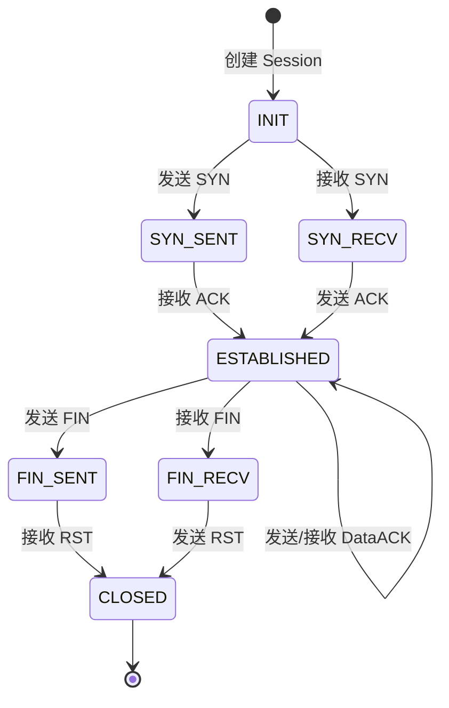
```mermaid
stateDiagram-v2
    [*] --> INIT: 创建 Session
    INIT --> SYN_SENT: 发送 SYN
    INIT --> SYN_RECV: 接收 SYN
    SYN_SENT --> ESTABLISHED: 接收 ACK
    SYN_RECV --> ESTABLISHED: 发送 ACK

    ESTABLISHED --> ESTABLISHED: 发送/接收数据
    ESTABLISHED --> ESTABLISHED: 发送/接收 DataACK
    ESTABLISHED --> FIN_SENT: 发送 FIN
    ESTABLISHED --> FIN_RECV: 接收 FIN

    FIN_SENT --> CLOSED: 接收 RST
    FIN_RECV --> CLOSED: 发送 RST

    CLOSED --> [*]
```

**核心代码**：`lib/spdy/fsm.go:24-53`

```go
// 第 24 行：事件类型定义
type event int

const (
    SEND_SYN_EVENT      event = iota  // 0: 发送 SYN（连接请求）
    RECV_SYN_EVENT                     // 1: 接收 SYN
    SEND_ACK_EVENT                     // 2: 发送 ACK（确认）
    RECV_ACK_EVENT                     // 3: 接收 ACK
    SEND_DATA_EVENT                    // 4: 发送数据
    RECV_DATA_EVENT                    // 5: 接收数据
    SEND_FIN_EVENT                     // 6: 发送 FIN（关闭请求）
    RECV_FIN_EVENT                     // 7: 接收 FIN
    SEND_RST_EVENT                     // 8: 发送 RST（重置）
    RECV_RST_EVENT                     // 9: 接收 RST
    SEND_DATA_ACK_EVENT               // 10: 发送数据确认
    RECV_DATA_ACK_EVENT               // 11: 接收数据确认
    UNKNOWN_EVENT                      // 12: 未知事件
)

// 第 42 行：状态定义
type state int

const (
    INIT_STATE        state = iota  // 0: 初始状态
    SYN_SENT_STATE                  // 1: SYN 已发送
    SYN_RECV_STATE                  // 2: SYN 已接收
    ESTABLISHED_STATE               // 3: 连接已建立
    FIN_SENT_STATE                  // 4: FIN 已发送
    FIN_RECV_STATE                  // 5: FIN 已接收
    CLOSED_STATE                    // 6: 已关闭
    UNKNOWN_STATE                   // 7: 未知状态
)
```

**逐行解释**：
- **第 27-39 行**：13 种事件类型，覆盖连接建立、数据传输、连接关闭的全过程
- **第 44-53 行**：8 种状态，从 INIT 到 CLOSED 的完整生命周期
- **设计意图**：借鉴 TCP 的三次握手和四次挥手，但简化为 SPDY 协议

**通俗解释**：
FSM 状态机就像"快递包裹的物流状态"：
- **INIT**：包裹刚下单，还没发出去
- **SYN_SENT**：快递员已取件，正在路上
- **SYN_RECV**：收件人收到取件通知
- **ESTABLISHED**：包裹已签收，可以正常通信（互发消息）
- **FIN_SENT**：一方说"我要关闭连接了"
- **FIN_RECV**：另一方收到关闭请求
- **CLOSED**：连接彻底关闭

每次状态变化都需要一个"触发事件"（比如收到 SYN、发送 ACK），就像包裹状态变化需要"扫描"一样。

**具体例子**：

ts-sql 与 ts-store 建立 SPDY 连接的过程：

```
ts-sql 侧（客户端）：                ts-store 侧（服务端）：
INIT                                INIT
  ↓ 发送 SYN (SEND_SYN_EVENT)         ↓ 收到 SYN (RECV_SYN_EVENT)
SYN_SENT                            SYN_RECV
  ↓ 收到 ACK (RECV_ACK_EVENT)         ↓ 发送 ACK (SEND_ACK_EVENT)
ESTABLISHED                         ESTABLISHED
  ←── 连接建立，可以传输数据 ──→
  ↓ 发送数据 (SEND_DATA_EVENT)         ↓ 接收数据 (RECV_DATA_EVENT)
ESTABLISHED                         ESTABLISHED
  ↓ 发送 FIN (SEND_FIN_EVENT)          ↓ 接收 FIN (RECV_FIN_EVENT)
FIN_SENT                            FIN_RECV
  ↓ 接收 RST (RECV_RST_EVENT)          ↓ 发送 RST (SEND_RST_EVENT)
CLOSED                              CLOSED
```

### 2.2 FSM 核心结构

**核心代码**：`lib/spdy/fsm.go:95-160`

```go
// 第 95 行：FSM 转换规则
type FSMTransition struct {
    start  *FSMState       // 起始状态
    event  event           // 触发事件
    next   *FSMState       // 目标状态
    action FSMEventAction  // 执行的动作
}

// 第 112 行：转换表（状态 × 事件 → 转换规则）
type TransitionTable struct {
    table map[state]map[event]*FSMTransition  // 二维 map
}

// 第 147 行：FSM 状态机
type FSM struct {
    transitionTable *TransitionTable  // 转换表
    state           state             // 当前状态
    stateGuard      sync.Mutex        // 状态锁
    closed          bool              // 是否已关闭
}

// 第 162 行：Build — 注册转换规则
func (fsm *FSM) Build(start *FSMState, event event, next *FSMState, action FSMEventAction) {
    if action == nil {
        action = defaultFSMEventAction
    }
    t := NewFSMTransition(start, event, next, action)
    HandleError(fsm.transitionTable.addTransition(t))
}

// 第 170 行：ProcessEvent — 处理事件，执行状态转换
func (fsm *FSM) ProcessEvent(event event, data []byte) error {
    fsm.stateGuard.Lock()         // 加锁，保证状态转换的原子性
    defer fsm.stateGuard.Unlock()

    if fsm.closed {
        return fmt.Errorf("session closed")
    }

    // 第 178 行：查找转换规则
    transition, ok := fsm.transitionTable.findTransition(fsm.state, event)
    if !ok {
        return NewFSMError(event, fsm.state)  // 无效的状态转换
    }

    // 第 183 行：执行退出动作
    if transition.start.exitAction != nil {
        err := transition.start.exitAction(event, transition)
        if err != nil {
            return err
        }
    }

    // 第 190 行：执行转换动作
    err := transition.action(event, transition, data)

    // 第 192 行：执行进入动作
    if transition.next.enterAction != nil {
        err := transition.next.enterAction(event, transition)
        if err != nil {
            return err
        }
    }

    // 第 199 行：更新状态
    fsm.state = transition.next.State()

    return err
}
```

**逐行解释**：
- **第 95-100 行**：`FSMTransition` 定义了一条转换规则：在 `start` 状态收到 `event` 事件，转换到 `next` 状态，执行 `action`
- **第 113 行**：`TransitionTable` 是一个二维 map：`state → event → transition`，O(1) 查找
- **第 170 行**：`ProcessEvent` 是 FSM 的核心方法，处理事件并执行状态转换
- **第 171 行**：`stateGuard.Lock()` 保证状态转换的原子性，防止并发事件导致状态混乱
- **第 183-188 行**：退出旧状态时执行 `exitAction`（如释放资源）
- **第 190 行**：执行转换动作（如发送数据）
- **第 192-197 行**：进入新状态时执行 `enterAction`（如初始化资源）
- **第 199 行**：更新当前状态

**通俗解释**：
FSM 的核心就像"自动售货机"：
- **TransitionTable** 是售货机的"规则表"：投币 → 出货，按取消 → 退币
- **ProcessEvent** 是售货机的"处理逻辑"：
  1. 先锁上门（Lock），防止两个人同时操作
  2. 查规则表：当前状态 + 事件 → 应该做什么
  3. 执行退出动作（比如清理上一个操作）
  4. 执行转换动作（比如出货）
  5. 执行进入动作（比如显示"请取货"）
  6. 更新当前状态
  7. 开门（Unlock）

**具体例子**：

处理 SEND_SYN_EVENT 的过程：

```
当前状态：INIT
事件：SEND_SYN_EVENT

Step 1: stateGuard.Lock()  // 锁住，防止并发

Step 2: findTransition(INIT, SEND_SYN_EVENT)
  → 找到：{start: INIT, event: SEND_SYN, next: SYN_SENT, action: sendSyn}

Step 3: 执行 exitAction（INIT 的 exitAction = nil，跳过）

Step 4: 执行 action: sendSyn()
  → 构造 SYN 帧
  → 通过 TCP 连接发送给对方

Step 5: 执行 enterAction（SYN_SENT 的 enterAction = nil，跳过）

Step 6: fsm.state = SYN_SENT  // 更新状态

Step 7: stateGuard.Unlock()  // 解锁
```

### 2.3 Session FSM 初始化

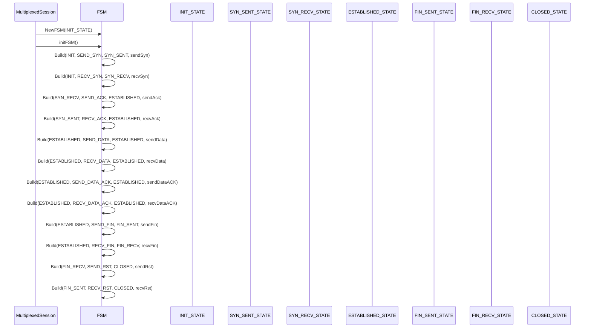
```mermaid
sequenceDiagram
    participant Session as MultiplexedSession
    participant FSM as FSM
    participant Init as INIT_STATE
    participant Sent as SYN_SENT_STATE
    participant Recv as SYN_RECV_STATE
    participant Est as ESTABLISHED_STATE
    participant FinSent as FIN_SENT_STATE
    participant FinRecv as FIN_RECV_STATE
    participant Closed as CLOSED_STATE

    Session->>FSM: NewFSM(INIT_STATE)
    Session->>FSM: initFSM()

    FSM->>FSM: Build(INIT, SEND_SYN, SYN_SENT, sendSyn)
    FSM->>FSM: Build(INIT, RECV_SYN, SYN_RECV, recvSyn)
    FSM->>FSM: Build(SYN_RECV, SEND_ACK, ESTABLISHED, sendAck)
    FSM->>FSM: Build(SYN_SENT, RECV_ACK, ESTABLISHED, recvAck)
    FSM->>FSM: Build(ESTABLISHED, SEND_DATA, ESTABLISHED, sendData)
    FSM->>FSM: Build(ESTABLISHED, RECV_DATA, ESTABLISHED, recvData)
    FSM->>FSM: Build(ESTABLISHED, SEND_DATA_ACK, ESTABLISHED, sendDataACK)
    FSM->>FSM: Build(ESTABLISHED, RECV_DATA_ACK, ESTABLISHED, recvDataACK)
    FSM->>FSM: Build(ESTABLISHED, SEND_FIN, FIN_SENT, sendFin)
    FSM->>FSM: Build(ESTABLISHED, RECV_FIN, FIN_RECV, recvFin)
    FSM->>FSM: Build(FIN_RECV, SEND_RST, CLOSED, sendRst)
    FSM->>FSM: Build(FIN_SENT, RECV_RST, CLOSED, recvRst)
```

**核心代码**：`lib/spdy/multiplexed_session.go:100-168`

```go
// 第 100 行：初始化 Session 的 FSM 状态转换表
func (s *MultiplexedSession) initFSM() {
    // 第 101-107 行：创建所有状态
    initState := NewFSMState(INIT_STATE, nil, nil)
    synSentState := NewFSMState(SYN_SENT_STATE, nil, nil)
    synRecvState := NewFSMState(SYN_RECV_STATE, nil, nil)
    establishState := NewFSMState(ESTABLISHED_STATE, nil, nil)
    finSentState := NewFSMState(FIN_SENT_STATE, nil, nil)
    finRecvState := NewFSMState(FIN_RECV_STATE, nil, nil)
    closedState := NewFSMState(CLOSED_STATE, s.enterClosed, nil)  // 进入 CLOSED 时执行 enterClosed

    // 第 109-112 行：INIT + SEND_SYN → SYN_SENT（客户端发起连接）
    s.fsm.Build(initState, SEND_SYN_EVENT, synSentState, s.sendSyn)

    // 第 114-117 行：INIT + RECV_SYN → SYN_RECV（服务端接收连接）
    s.fsm.Build(initState, RECV_SYN_EVENT, synRecvState, s.recvSyn)

    // 第 119-122 行：SYN_RECV + SEND_ACK → ESTABLISHED（服务端确认）
    s.fsm.Build(synRecvState, SEND_ACK_EVENT, establishState, s.sendAck)

    // 第 124-127 行：SYN_SENT + RECV_ACK → ESTABLISHED（客户端确认）
    s.fsm.Build(synSentState, RECV_ACK_EVENT, establishState, s.recvAck)

    // 第 129-132 行：ESTABLISHED + SEND_DATA → ESTABLISHED（发送数据，状态不变）
    s.fsm.Build(establishState, SEND_DATA_EVENT, establishState, s.sendData)

    // 第 134-137 行：ESTABLISHED + RECV_DATA → ESTABLISHED（接收数据，状态不变）
    s.fsm.Build(establishState, RECV_DATA_EVENT, establishState, s.recvData)

    // 第 139-142 行：ESTABLISHED + SEND_DATA_ACK → ESTABLISHED（发送数据确认）
    s.fsm.Build(establishState, SEND_DATA_ACK_EVENT, establishState, s.sendDataACK)

    // 第 144-147 行：ESTABLISHED + RECV_DATA_ACK → ESTABLISHED（接收数据确认）
    s.fsm.Build(establishState, RECV_DATA_ACK_EVENT, establishState, s.recvDataACK)

    // 第 149-152 行：ESTABLISHED + SEND_FIN → FIN_SENT（发起关闭）
    s.fsm.Build(establishState, SEND_FIN_EVENT, finSentState, s.sendFin)

    // 第 154-157 行：ESTABLISHED + RECV_FIN → FIN_RECV（接收关闭请求）
    s.fsm.Build(establishState, RECV_FIN_EVENT, finRecvState, s.recvFin)

    // 第 159-162 行：FIN_RECV + SEND_RST → CLOSED（确认关闭）
    s.fsm.Build(finRecvState, SEND_RST_EVENT, closedState, s.sendRst)

    // 第 164-167 行：FIN_SENT + RECV_RST → CLOSED（确认关闭）
    s.fsm.Build(finSentState, RECV_RST_EVENT, closedState, s.recvRst)
}
```

**逐行解释**：
- **第 101-107 行**：创建 7 个状态，`closedState` 的 `enterAction` 是 `s.enterClosed`（清理资源）
- **第 109-127 行**：连接建立阶段 — 类似 TCP 三次握手：SYN → SYN+ACK → ACK
- **第 129-147 行**：数据传输阶段 — 状态保持 ESTABLISHED，支持发送/接收数据和 DataACK
- **第 149-167 行**：连接关闭阶段 — 类似 TCP 四次挥手：FIN → RST

**通俗解释**：
initFSM 就像"设置自动售货机的规则表"。把 12 条规则写进去：
- 连接建立规则（2 条）：INIT + SYN → SYN_SENT，INIT + RECV_SYN → SYN_RECV
- 确认规则（2 条）：SYN_RECV + ACK → ESTABLISHED，SYN_SENT + RECV_ACK → ESTABLISHED
- 数据传输规则（4 条）：ESTABLISHED + SEND/RECV_DATA/DATA_ACK → ESTABLISHED
- 关闭规则（4 条）：ESTABLISHED + FIN → FIN_SENT/FIN_RECV，FIN + RST → CLOSED

**具体例子**：

完整的连接生命周期：

```
客户端（ts-sql）                    服务端（ts-store）
INIT                               INIT
  │ initFSM()                        │ initFSM()
  │ Build(INIT,SEND_SYN,SYN_SENT)    │ Build(INIT,RECV_SYN,SYN_RECV)
  │                                  │
  │─── SYN ────────────────────────→ │
  │ ProcessEvent(SEND_SYN)           │ ProcessEvent(RECV_SYN)
  │ INIT → SYN_SENT                  │ INIT → SYN_RECV
  │                                  │
  │                                  │─── ACK ──→
  │                                  │ ProcessEvent(SEND_ACK)
  │                                  │ SYN_RECV → ESTABLISHED
  │ ←─── ACK ───────────────────────│
  │ ProcessEvent(RECV_ACK)           │
  │ SYN_SENT → ESTABLISHED           │
  │                                  │
  │ ←─── 数据传输 ──→                │
  │ ProcessEvent(SEND_DATA)          │ ProcessEvent(RECV_DATA)
  │ ESTABLISHED → ESTABLISHED        │ ESTABLISHED → ESTABLISHED
  │                                  │
  │─── FIN ────────────────────────→ │
  │ ProcessEvent(SEND_FIN)           │ ProcessEvent(RECV_FIN)
  │ ESTABLISHED → FIN_SENT           │ ESTABLISHED → FIN_RECV
  │                                  │
  │ ←─── RST ───────────────────────│
  │ ProcessEvent(RECV_RST)           │ ProcessEvent(SEND_RST)
  │ FIN_SENT → CLOSED                │ FIN_RECV → CLOSED
```

### 2.4 MultiplexedSession 结构体

**核心代码**：`lib/spdy/multiplexed_session.go:51-90`

```go
// 第 51 行：MultiplexedSession — 多路复用会话
type MultiplexedSession struct {
    cfg       config.Spdy             // 配置
    conn      *MultiplexedConnection  // 底层连接（一个 TCP 连接）
    id        uint64                  // 会话 ID
    sequence  uint64                  // RPC 协议头序列号，用于请求/响应匹配；SPDY 数据帧头本身使用 ConnID
    fsm       *FSM                    // 状态机
    recvQueue chan []byte              // 接收队列（channel 实现）
    hdr       header                  // 帧头（16 字节：1 version + 1 type + 2 flags + 8 connID + 4 length）

    dataAck       *DataACK            // 流控机制
    ackRecvSig    chan struct{}        // ACK 接收信号
    selectTimeout time.Duration       // 超时时间

    closed    chan struct{}            // 关闭信号
    closeOnce sync.Once               // 确保只关闭一次
    onClose   []func()                // 关闭回调
}

// 第 69 行：构造函数
func NewMultiplexedSession(cfg config.Spdy, conn *MultiplexedConnection, id uint64) *MultiplexedSession {
    session := &MultiplexedSession{
        cfg:           cfg,
        conn:          conn,
        id:            id,
        sequence:      0,                                    // RPC sequence 从 0 开始
        fsm:           NewFSM(INIT_STATE),                   // 初始状态
        recvQueue:     make(chan []byte, cfg.RecvWindowSize), // 接收队列，buffer = RecvWindowSize
        hdr:           make(header, HEADER_SIZE),             // 帧头 16 字节（HEADER_SIZE = 1+1+2+8+4）
        ackRecvSig:    nil,
        selectTimeout: cfg.GetSessionSelectTimeout(),
        closed:        make(chan struct{}),
    }

    // 第 83 行：初始化 DataACK 流控
    session.dataAck = NewDataACK(func() {
        HandleError(session.SendDataACK(nil))  // 收到足够数据后发送 ACK
    }, int64(cfg.RecvWindowSize))
    session.dataAck.SetBlockTimeout(time.Duration(cfg.DataAckTimeout))

    // 第 87 行：初始化 FSM 状态转换表
    session.initFSM()

    return session
}
```

**逐行解释**：
- **第 53 行**：`conn` 是底层的 TCP 连接，多个 Session 共享同一个连接（多路复用）
- **第 56 行**：`fsm` 是会话状态机，管理连接的生命周期
- **第 57 行**：`recvQueue` 是接收队列，用 channel 实现，buffer 大小 = `RecvWindowSize`
- **第 60 行**：`dataAck` 是流控机制，防止发送方过快
- **第 83-86 行**：DataACK 的回调函数：收到足够数据后自动发送 ACK
- **第 87 行**：`initFSM()` 注册 12 条状态转换规则

**通俗解释**：
MultiplexedSession 就像"快递柜里的一个格子"：
- **conn**（底层连接）：整个快递柜（一个 TCP 连接）
- **id**（会话 ID）：格子编号
- **sequence**（RPC 序列号）：用于 mux `ProtocolHeader` 的请求/响应匹配，不是 SPDY 数据帧排序字段
- **fsm**（状态机）：格子的状态（空闲 → 已投递 → 已取件）
- **recvQueue**（接收队列）：格子里的包裹，等收件人来取
- **dataAck**（流控）：防止快递员塞太多包裹，格子放不下

**具体例子**：

一个 TCP 连接上同时传输 3 个 Session 的数据：

```
TCP 连接：ts-sql:12345 ↔ ts-store:8080

Session 1 (id=1): 查询 cpu 表
  → 发送: [frame header: ConnID=1] [payload: ProtocolHeader{Sequence=1001}+SELECT...]
  → 接收: [frame header: ConnID=1] [payload: 结果Chunk1]
  → 接收: [frame header: ConnID=1] [payload: 结果Chunk2]

Session 2 (id=2): 查询 mem 表
  → 发送: [frame header: ConnID=2] [payload: ProtocolHeader{Sequence=1002}+SELECT...]
  → 接收: [frame header: ConnID=2] [payload: 结果Chunk1]

Session 3 (id=3): 写入 disk 表
  → 发送: [frame header: ConnID=3] [payload: ProtocolHeader{Sequence=1003}+INSERT...]

同一个 TCP 连接上，3 个 Session 的数据交错传输：
  [Session1:Chunk1] [Session3:Write] [Session2:Chunk1] [Session1:Chunk2]
  通过 ConnID 区分每个 Session；RPC 请求/响应再通过 payload 内的 Sequence 匹配
```

---

## 3. DataACK 流控机制

### 3.1 流控总览

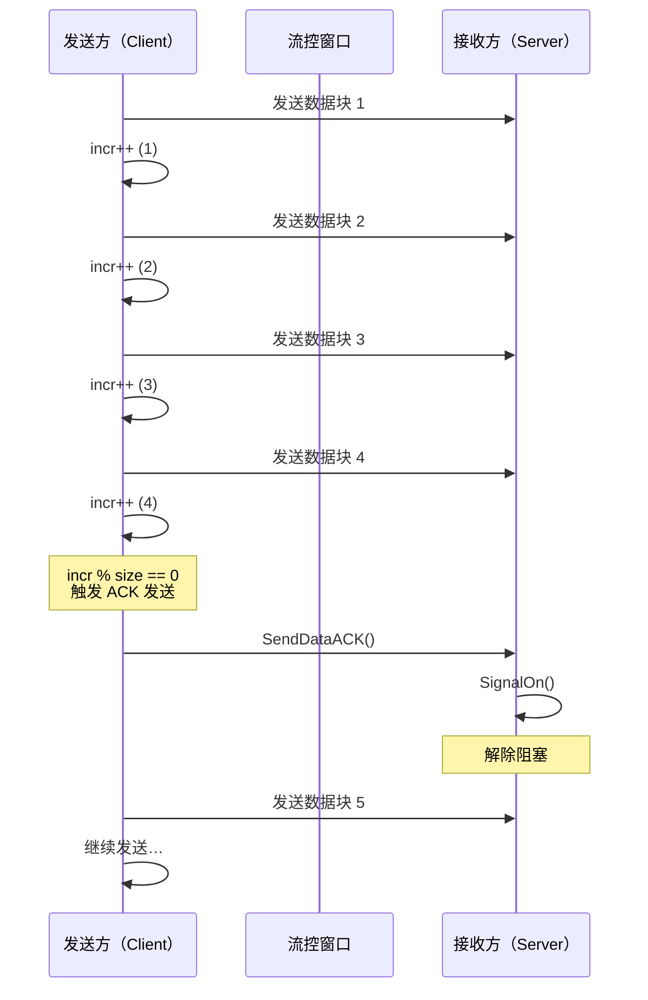
```mermaid
sequenceDiagram
    participant Sender as 发送方（Client）
    participant Window as 流控窗口
    participant Receiver as 接收方（Server）

    Sender->>Receiver: 发送数据块 1
    Sender->>Sender: incr++ (1)
    Sender->>Receiver: 发送数据块 2
    Sender->>Sender: incr++ (2)
    Sender->>Receiver: 发送数据块 3
    Sender->>Sender: incr++ (3)
    Sender->>Receiver: 发送数据块 4
    Sender->>Sender: incr++ (4)

    Note over Sender: incr % size == 0<br/>触发 ACK 发送
    Sender->>Receiver: SendDataACK()

    Receiver->>Receiver: SignalOn()
    Note over Receiver: 解除阻塞

    Sender->>Receiver: 发送数据块 5
    Sender->>Sender: 继续发送…
```

**核心代码**：`lib/spdy/data_ack.go:33-125`

```go
// 第 33 行：DataACK 结构体
type DataACK struct {
    role         SessionRole    // 角色（Client/Server）
    enable       bool           // 是否启用流控
    size         int64          // 窗口大小
    incr         int64          // 计数器
    signal       chan struct{}   // ACK 信号
    handler      func()         // ACK 发送回调
    blockTimeout time.Duration  // 阻塞超时
}

// 第 78 行：Incr — 递增计数器
func (a *DataACK) Incr() {
    if a.enable {
        a.incr++
    }
}

// 第 84 行：Dispatch — 客户端：每 size 个数据块发送一次 ACK
func (a *DataACK) Dispatch() {
    if !a.enable || a.role == RoleServer {
        return  // 服务端不发送 ACK
    }

    a.incr++
    if a.incr%a.size == 0 && a.handler != nil {
        go a.handler()  // 异步发送 ACK
    }
}

// 第 95 行：SignalOn — 服务端：收到 ACK 后解除阻塞
func (a *DataACK) SignalOn() {
    if !a.enable {
        return
    }
    defer func() {
        _ = recover()  // 防止 channel 已关闭
    }()

    a.signal <- struct{}{}  // 发送信号，解除 Block()
}

// 第 106 行：Block — 服务端：窗口满时阻塞等待
func (a *DataACK) Block() error {
    if a.role == RoleClient || !a.enable {
        return nil  // 客户端不阻塞
    }
    defer func() {
        a.incr++
    }()

    // 第 114 行：检查是否需要阻塞
    if a.incr == 0 || a.incr%a.size != 0 {
        return nil  // 未满，不阻塞
    }

    // 第 118 行：阻塞等待 ACK
    tm := time.NewTimer(a.blockTimeout)
    select {
    case <-a.signal:      // 收到 ACK
    case <-tm.C:          // 超时
        return errno.NewError(errno.DataACKTimeout)
    }
    return nil
}
```

**逐行解释**：
- **第 84-93 行**：`Dispatch()` 是客户端调用的，每发送 `size` 个数据块后，异步发送一次 ACK
- **第 95-104 行**：`SignalOn()` 是服务端调用的，收到 ACK 后发送信号，解除 `Block()` 的阻塞
- **第 106-125 行**：`Block()` 是服务端调用的，当 `incr % size == 0` 时阻塞，等待客户端的 ACK
- **注意**：`Block()` 通过 `defer func() { a.incr++ }()` 在函数返回前始终递增 `incr`（无论是否阻塞）。这意味着每次调用 `Block()` 都会推进计数器，确保窗口滑动的正确性
- **设计意图**：类似 TCP 的滑动窗口，防止发送方过快导致接收方缓冲区溢出

**通俗解释**：
DataACK 流控就像"快递签收确认"：
- **发送方**（客户端）：每发 4 个包裹（size=4），暂停一下，等签收确认
- **接收方**（服务端）：收到 4 个包裹后，发一条"已签收"消息
- **发送方**收到"已签收"后，继续发下一批

这样做的好处：
- 防止发送方发太快，接收方处理不过来（缓冲区溢出）
- 类似 TCP 的滑动窗口机制

**具体例子**：

窗口大小 size = 4，客户端发送 10 个数据块：

```
客户端发送：                    服务端接收：
数据块 1 → incr=1              接收 ✓
数据块 2 → incr=2              接收 ✓
数据块 3 → incr=3              接收 ✓
数据块 4 → incr=4              接收 ✓
  → incr % 4 == 0，触发 ACK    → 发送 DataACK
  → 等待 ACK...                → SignalOn() 解除阻塞

收到 ACK ✓，继续发送：
数据块 5 → incr=5              接收 ✓
数据块 6 → incr=6              接收 ✓
数据块 7 → incr=7              接收 ✓
数据块 8 → incr=8              接收 ✓
  → incr % 4 == 0，触发 ACK    → 发送 DataACK
  → 等待 ACK...                → SignalOn() 解除阻塞

收到 ACK ✓，继续发送：
数据块 9 → incr=9              接收 ✓
数据块 10 → incr=10            接收 ✓
  → 发送完成
```

---

## 4. MultiplexedSessionPool 连接池

### 4.1 连接池结构

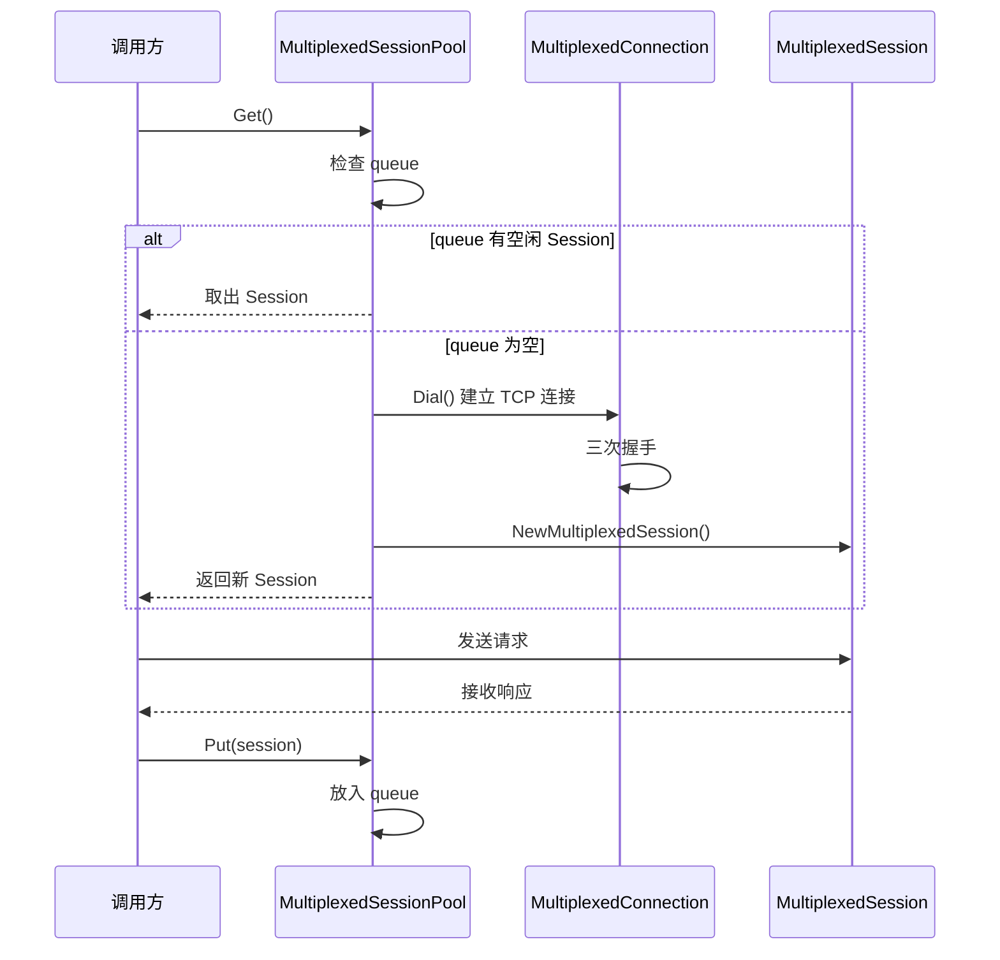
```mermaid
sequenceDiagram
    participant Caller as 调用方
    participant Pool as MultiplexedSessionPool
    participant Conn as MultiplexedConnection
    participant Session as MultiplexedSession

    Caller->>Pool: Get()
    Pool->>Pool: 检查 queue

    alt queue 有空闲 Session
        Pool-->>Caller: 取出 Session
    else queue 为空
        Pool->>Conn: Dial() 建立 TCP 连接
        Conn->>Conn: 三次握手
        Pool->>Session: NewMultiplexedSession()
        Pool-->>Caller: 返回新 Session
    end

    Caller->>Session: 发送请求
    Session-->>Caller: 接收响应

    Caller->>Pool: Put(session)
    Pool->>Pool: 放入 queue
```

**核心代码**：`lib/spdy/multiplexed_session_pool.go:30-58`

```go
// 第 30 行：MultiplexedSessionPool — 连接池
type MultiplexedSessionPool struct {
    cfg       config.Spdy          // 配置
    network   string               // 网络类型（tcp/tcp4/tcp6）
    address   string               // 目标地址
    mspLogger *logger.Logger       // 日志

    conn  *MultiplexedConnection   // 底层连接（一个 TCP 连接）
    queue chan *MultiplexedSession  // Session 队列（channel 实现）

    closed     bool                // 是否已关闭
    closeGuard sync.RWMutex        // 关闭锁

    wg sync.WaitGroup              // 等待所有 Session 关闭

    successJob *statistics.SpdyJob  // 成功统计
    failedJob  *statistics.SpdyJob  // 失败统计
    closeJob   *statistics.SpdyJob  // 关闭统计
}

// 第 49 行：构造函数
func NewMultiplexedSessionPool(cfg config.Spdy, network string, address string) *MultiplexedSessionPool {
    pool := &MultiplexedSessionPool{
        cfg:       cfg,
        network:   network,
        address:   address,
        conn:      nil,
        mspLogger: logger.NewLogger(errno.ModuleNetwork),
    }
    return pool
}
```

**逐行解释**：
- **第 37 行**：`queue` 是 Session 队列，用 channel 实现，buffer 大小 = 最大连接数
- **第 39 行**：`conn` 是底层的 TCP 连接，多个 Session 共享（多路复用）
- **第 42 行**：`closeGuard` 保护关闭操作，防止并发关闭
- **第 49 行**：构造函数只创建 Pool，不建立连接，连接在首次使用时建立

**通俗解释**：
MultiplexedSessionPool 就像"出租车调度中心"：
- **queue**（Session 队列）：空闲出租车的等候区
- **conn**（底层连接）：公路（TCP 连接）
- **GetSession()**：乘客叫车
  - 有空车 → 直接派车（从 queue 取出 Session）
  - 没空车 → 新建一辆（创建新 Session）
- **归还 Session**：乘客下车，出租车回到等候区

**具体例子**：

连接池的使用流程：

```
初始状态：queue = []（空），conn = nil

请求 1：GetSession("store1:8080")
  → queue 为空，需要新建
  → Dial("store1:8080") 建立 TCP 连接
  → NewMultiplexedSession(conn, id=1)
  → 返回 Session 1

请求 2：GetSession("store1:8080")
  → queue 为空，需要新建
  → 复用已有的 TCP 连接
  → NewMultiplexedSession(conn, id=2)
  → 返回 Session 2

请求 1 完成：归还 Session 1
  → queue = [Session 1]

请求 3：GetSession("store1:8080")
  → queue 有空闲，直接取出
  → 返回 Session 1（复用）

请求 2 完成：归还 Session 2
  → queue = [Session 2]

关闭连接池：Close()
  → 关闭所有 Session
  → 关闭 TCP 连接
  → queue 清空
```

---

## 5. 写入路由

### 5.1 写入请求路由

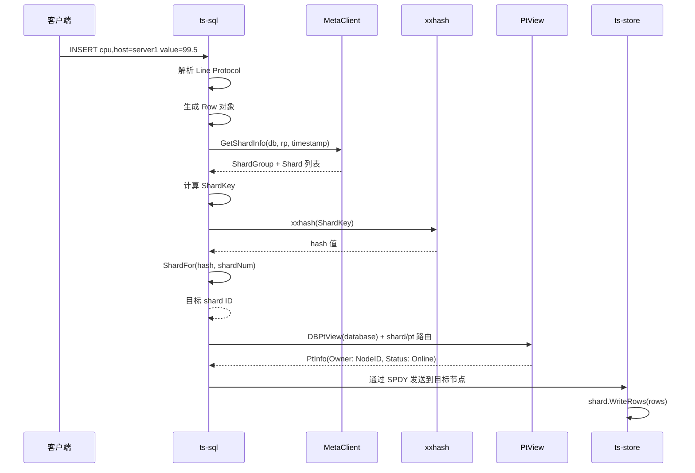
```mermaid
sequenceDiagram
    participant Client as 客户端
    participant SQL as ts-sql
    participant Meta as MetaClient
    participant Hash as xxhash
    participant PtView as PtView
    participant Store as ts-store

    Client->>SQL: INSERT cpu,host=server1 value=99.5
    SQL->>SQL: 解析 Line Protocol
    SQL->>SQL: 生成 Row 对象

    SQL->>Meta: GetShardInfo(db, rp, timestamp)
    Meta-->>SQL: ShardGroup + Shard 列表

    SQL->>SQL: 计算 ShardKey
    SQL->>Hash: xxhash(ShardKey)
    Hash-->>SQL: hash 值

    SQL->>SQL: ShardFor(hash, shardNum)
    SQL-->>SQL: 目标 shard ID

    SQL->>PtView: DBPtView(database) + shard/pt 路由
    PtView-->>SQL: PtInfo(Owner: NodeID, Status: Online)

    SQL->>Store: 通过 SPDY 发送到目标节点
    Store->>Store: shard.WriteRows(rows)
```

**核心代码**：`coordinator/points_writer.go` — 写入请求路由的入口

```go
// 第 281 行：writePointRows 是写入路由的核心入口
func (w *PointsWriter) writePointRows(database, retentionPolicy string, rows []influx.Row) error {
    ctx := getInjestionCtx()           // 从对象池获取上下文
    defer putInjestionCtx(ctx)          // 用完归还对象池
    ctx.writeHelper = newWriteHelper(w) // 创建写入辅助器

    err := ctx.checkDBRP(database, retentionPolicy, w) // 检查数据库和 RP 是否存在
    if err != nil {
        return err
    }

    if retentionPolicy == "" {
        retentionPolicy = ctx.db.DefaultRetentionPolicy // 使用默认 RP
    }

    // 第 304 行：路由并映射行到 Shard
    partialErr, dropped, err := w.routeAndMapOriginRows(database, retentionPolicy, rows, ctx)
    if err != nil {
        return err
    }

    // 第 320 行：将映射好的数据写入各 Shard
    err = w.writeShardMap(database, retentionPolicy, ctx)
    // ...
    return partialErr
}
```

**逐行解释**：
- **第 282 行**：`getInjestionCtx()` 从 `sync.Pool` 获取上下文对象，减少 GC 压力
- **第 286 行**：`checkDBRP` 验证数据库和 RetentionPolicy 是否存在
- **第 304 行**：`routeAndMapOriginRows` 是路由核心 — 解析 Line Protocol，计算 ShardKey，映射到目标 Shard
- **第 320 行**：`writeShardMap` 将数据并行写入各个 Shard（通过 SPDY 发送到目标 ts-store 节点）

**核心代码**：`coordinator/points_writer.go:703-809` — ShardGroup 和 ShardKey 计算

```go
// 第 703 行：updateShardGroupAndShardKey 计算数据应该写入哪个 Shard
func (w *PointsWriter) updateShardGroupAndShardKey(
    database, retentionPolicy string, r *influx.Row, ctx *injestionCtx,
    stream bool, dims []string, index int, reuseShardKey bool,
) (err error, sh *meta2.ShardInfo, partialErr error) {
    // ... 获取 DatabaseInfo、MeasurementInfo、ShardKeyInfo ...

    // 第 729 行：创建或获取 ShardGroup（按时间分片）
    sg, sameSg, err = wh.createShardGroup(database, retentionPolicy,
        time.Unix(0, r.Timestamp), engineType)

    // 第 738-748 行：获取 ShardKey 配置
    if len(di.ShardKey.ShardKey) > 0 {
        *si = &di.ShardKey         // 数据库级别 ShardKey
    } else {
        *si = mi.GetShardKey(sg.ID) // 表级别 ShardKey
    }

    // 第 750-776 行：根据 ShardKey 类型解析
    if stream {
        err = r.UnmarshalShardKeyByDimOrTag((*si).ShardKey, dims)
    } else if engineType == config.COLUMNSTORE {
        err = r.UnmarshalShardKeyByField((*si).ShardKey)
    } else {
        err = r.UnmarshalShardKeyByTag((*si).ShardKey)  // 按 tag 解析 ShardKey
    }

    // 第 782-803 行：根据 ShardKey 类型路由到目标 Shard
    if (*si).Type == influxql.RANGE {
        sh = sg.DestShard(bytesutil.ToUnsafeString(r.ShardKey))  // Range 分片
    } else {
        r.SkipMarshalShardKey()
        sh = sg.ShardFor(meta2.HashID(r.ShardKey), shardIdxes)  // Hash 分片
    }
    return
}
```

**逐行解释**：
- **第 729 行**：`createShardGroup` 根据数据时间戳创建或获取 ShardGroup（时间范围分片）
- **第 738-748 行**：优先使用数据库级别 ShardKey，否则使用表级别 ShardKey
- **第 750-776 行**：根据 ShardKey 配置解析数据中的分片键值
- **第 782-803 行**：两种路由策略 — Range（范围分片）和 Hash（哈希分片），最终确定目标 Shard

**核心代码**：`coordinator/points_writer.go:854-893` — 写入目标节点

```go
// 第 854 行：writeRowToShard 将数据写入目标 Shard
func (w *PointsWriter) writeRowToShard(ctx *netstorage.WriteContext,
    database, retentionPolicy string) error {
    start := time.Now()
    var ptView meta2.DBPtInfos

RETRY:
    for {
        // 第 862 行：超时检查
        if time.Since(start).Nanoseconds() >= w.timeout.Nanoseconds() {
            break
        }
        // 第 866 行：获取 PtView（分区视图）
        ptView, err = w.MetaClient.DBPtView(database)
        if err != nil {
            break
        }
        // 第 870 行：遍历 Shard 的 Owner（Pt），写入对应节点
        for _, ptId := range ctx.Shard.Owners {
            err = w.TSDBStore.WriteRows(ctx, ptView[ptId].Owner.NodeID,
                ptId, database, retentionPolicy, w.timeout)
            // 第 876 行：如果 Pt 路由变更，重试
            if err != nil && errno.IsRetryErrorForPtView(err) {
                time.Sleep(100 * time.Millisecond)
                goto RETRY
            }
        }
        break
    }
    return err
}
```

**逐行解释**：
- **第 866 行**：`DBPtView` 获取数据库的分区视图（PtId → PtInfo 的映射）
- **第 870 行**：`ctx.Shard.Owners` 包含该 Shard 关联的 PtId 列表
- **第 871 行**：`ptView[ptId].Owner.NodeID` 查找该 Pt 的 Owner 节点，通过 SPDY 发送数据
- **第 876 行**：如果 Pt 正在迁移（返回 retry 错误），等待 100ms 后重新获取 PtView

### 5.2 xxhash 分片

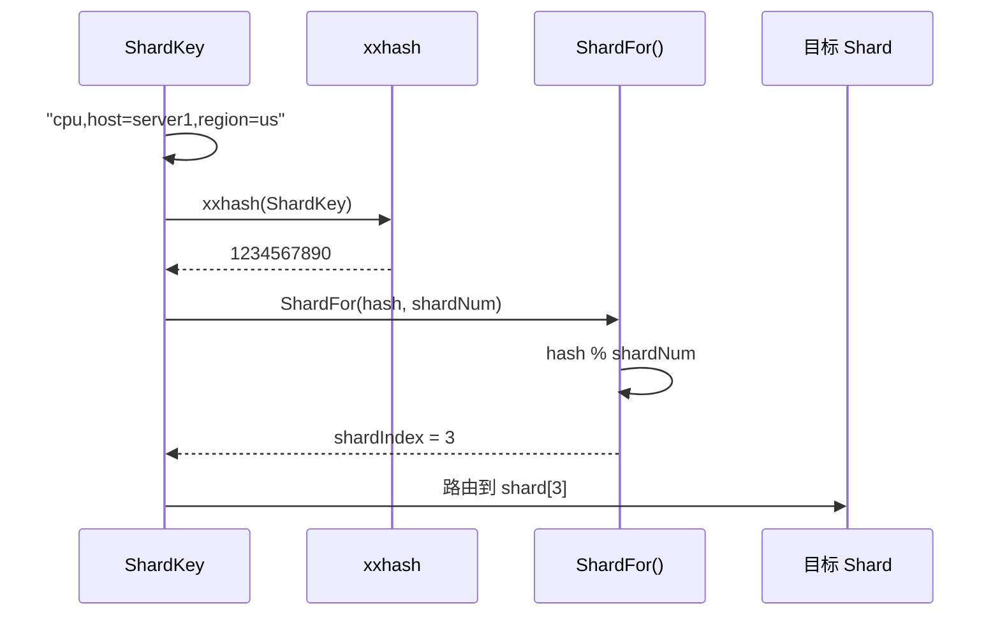
```mermaid
sequenceDiagram
    participant Key as ShardKey
    participant Hash as xxhash
    participant Mod as ShardFor()
    participant Shard as 目标 Shard

    Key->>Key: "cpu,host=server1,region=us"
    Key->>Hash: xxhash(ShardKey)
    Hash-->>Key: 1234567890

    Key->>Mod: ShardFor(hash, shardNum)
    Mod->>Mod: hash % shardNum
    Mod-->>Key: shardIndex = 3

    Key->>Shard: 路由到 shard[3]
```

**核心代码**：`lib/util/lifted/influx/meta/shardinfo.go` — xxhash 哈希与 Shard 路由

```go
// 第 571 行：HashID 使用 xxhash 计算 ShardKey 的哈希值
func HashID(key []byte) uint64 {
    return xxhash.Sum64(key)
}

// 第 393 行：ShardFor 根据哈希值路由到目标 Shard
func (sgi *ShardGroupInfo) ShardFor(hash uint64, aliveShardIdxes []int) *ShardInfo {
    if len(aliveShardIdxes) == 0 {
        return nil  // 没有存活的 Shard
    }
    // 核心公式：hash % aliveShardCount → 确定目标 Shard 索引
    return &sgi.Shards[aliveShardIdxes[hash%uint64(len(aliveShardIdxes))]]
}
```

**逐行解释**：
- **第 571 行**：`HashID` 是一个简单的封装，调用 `xxhash.Sum64` 计算 64 位哈希值
- **第 572 行**：`xxhash.Sum64(key)` 是 xxhash 算法的核心，输入字节数组，输出 uint64 哈希值
- **第 393 行**：`ShardFor` 是路由的核心方法，接收哈希值和存活的 Shard 索引列表
- **第 398 行**：`hash % uint64(len(aliveShardIdxes))` 取模运算，将哈希值映射到 Shard 索引
- **设计意图**：使用 `aliveShardIdxes` 而非全部 Shard，确保只路由到存活的 Shard

**核心代码**：`lib/util/lifted/influx/meta/shardinfo.go:455-468` — ShardInfo 结构体

```go
// 第 456 行：ShardInfo 表示一个 Shard 的元数据
type ShardInfo struct {
    ID              uint64   // Shard 全局唯一 ID
    Owners          []uint32 // Owner Pt 列表（用于复制）
    Min             string   // Range 分片的最小值
    Max             string   // Range 分片的最大值
    Tier            uint64   // 数据层（Hot/Warm/Cold）
    IndexID         uint64   // 索引 ID
    DownSampleID    uint64   // 降采样 ID
    DownSampleLevel int64    // 降采样级别
    ReadOnly        bool     // 是否只读
    MarkDelete      bool     // 是否标记删除
    MergedNum       int32    // 合并次数
}
```

**逐行解释**：
- **第 458 行**：`Owners` 是 PtId 列表，表示该 Shard 属于哪些数据分区（用于复制场景）
- **第 459-460 行**：`Min/Max` 用于 Range 分片策略，定义 Shard 覆盖的 ShardKey 范围
- **第 461 行**：`Tier` 表示数据所在的存储层（Hot=内存/Warm=SSD/Cold=对象存储）
- **设计意图**：ShardInfo 是路由查找的结果，包含目标 Shard 的所有元数据

**通俗解释**：
- ShardKey 由 measurement + 排序后的 tags 组成
- xxhash 是一个高性能哈希函数
- `ShardFor(hash, shardNum)` = `hash % shardNum` 决定目标 shard
- 同一个 ShardKey 总是路由到同一个 shard，保证数据局部性

**具体例子**：

写入 `cpu,host=server1,region=us value=99.5` 的路由过程：

```
Step 1: 构造 ShardKey
  → measurement: "cpu"
  → tags 排序: ["host=server1", "region=us"]
  → ShardKey: "cpu,host=server1,region=us"

Step 2: 计算哈希
  → xxhash("cpu,host=server1,region=us") = 1234567890

Step 3: 计算目标 shard
  → shardNum = 8（假设配置了 8 个 shard）
  → shardIndex = 1234567890 % 8 = 2
  → 路由到 shard[2]

Step 4: 获取 PtView
  → DBPtView("monitor") 后按 shard/pt 映射找到 owner
  → PtInfo{PtId: 2, Owner: Node3, Status: Online}

Step 5: 发送到目标节点
  → 通过 SPDY 发送到 Node3
  → Node3 的 shard[2] 写入数据
```

### 5.3 PtView 分区路由

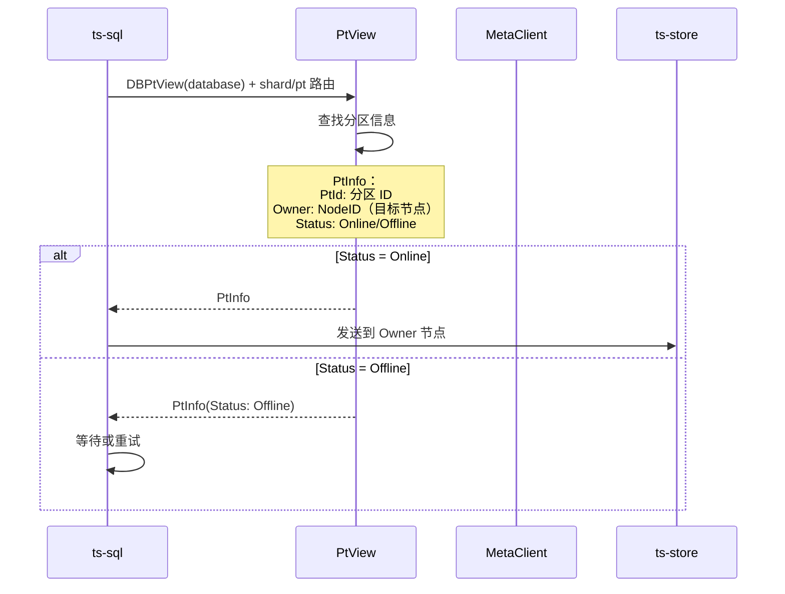
```mermaid
sequenceDiagram
    participant SQL as ts-sql
    participant PtView as PtView
    participant Meta as MetaClient
    participant Store as ts-store

    SQL->>PtView: DBPtView(database) + shard/pt 路由
    PtView->>PtView: 查找分区信息
    Note over PtView: PtInfo：<br/>PtId: 分区 ID<br/>Owner: NodeID（目标节点）<br/>Status: Online/Offline

    alt Status = Online
        PtView-->>SQL: PtInfo
        SQL->>Store: 发送到 Owner 节点
    else Status = Offline
        PtView-->>SQL: PtInfo(Status: Offline)
        SQL->>SQL: 等待或重试
    end
```

**核心代码**：`lib/util/lifted/influx/meta/database.go` — PtInfo 和 PtView 数据结构

```go
// 第 215 行：DBPtInfos 是 PtView 的类型定义（PtId → PtInfo 的映射）
type DBPtInfos []PtInfo

// 第 217-227 行：PtStatus 定义 Pt 的状态
type PtStatus uint32

const (
    Online              PtStatus = iota // 在线，正常服务
    PrepareOffload                      // 准备卸载
    PrepareAssign                       // 准备分配
    Offline                             // 离线
    RollbackPrepareOffload              // 回滚卸载
    RollbackPrepareAssign               // 回滚分配
    Disabled                            // 禁用
)

// 第 229 行：PtInfo 表示一个数据分区的完整信息
type PtInfo struct {
    Owner  PtOwner  // 拥有者节点
    Status PtStatus // 分区状态
    PtId   uint32   // 分区 ID
    Ver    uint64   // 版本号
    RGID   uint32   // 复制组 ID
}
```

**逐行解释**：
- **第 215 行**：`DBPtInfos` 是 `[]PtInfo` 的别名，索引即 PtId，值为 PtInfo
- **第 219-227 行**：7 种 Pt 状态，覆盖正常运行、迁移、故障等场景
- **第 229-235 行**：`PtInfo` 包含分区的所有元数据
- **第 230 行**：`Owner` 包含 `NodeID`，表示该分区由哪个 ts-store 节点负责
- **第 231 行**：`Status` 为 `Online` 时可正常读写，其他状态需要等待或重试
- **第 234 行**：`RGID` 用于复制模式，标识该分区属于哪个复制组

**核心代码**：`coordinator/shard_mapper.go:558-578` — PtView 路由查找

```go
// 第 558 行：distShardsToOwnerNodes 通过 PtView 将 Shard 分配到 Owner 节点
func (csm *ClusterShardMapping) distShardsToOwnerNodes(
    src *influxql.Measurement,
    shardInfosByDBPT map[uint32][]executor.ShardInfo,
    shardsMapByNode map[uint64]map[uint32][]executor.ShardInfo,
    sourcesMapByPtId map[uint32]influxql.Sources,
) (map[uint64]map[uint32][]executor.ShardInfo, map[uint32]influxql.Sources, error) {
    // 第 560 行：从 MetaClient 获取 PtView
    ptView, err := csm.MetaClient.DBPtView(src.Database)
    if err != nil {
        return nil, nil, err
    }
    // 第 564 行：遍历每个 Pt，查找 Owner 节点
    for pId, shardInfos := range shardInfosByDBPT {
        nodeID := ptView[pId].Owner.NodeID  // 获取 Owner 节点 ID
        if _, ok := shardsMapByNode[nodeID]; !ok {
            shardInfosByPtID := make(map[uint32][]executor.ShardInfo)
            shardInfosByPtID[pId] = shardInfos
            shardsMapByNode[nodeID] = shardInfosByPtID
        } else {
            shardsMapByNode[nodeID][pId] = shardInfos
        }
    }
    return shardsMapByNode, sourcesMapByPtId, nil
}
```

**逐行解释**：
- **第 560 行**：`DBPtView` 从 MetaClient 获取最新的 PtView（分区路由表）
- **第 564-576 行**：遍历 `shardInfosByDBPT`，以 PtId 为键查找 PtView 中的 Owner.NodeID
- **第 565 行**：`ptView[pId].Owner.NodeID` 就是该分区的目标存储节点
- **第 566-576 行**：按 NodeID 分组，构建 `{nodeID: {ptId: []ShardInfo}}` 映射
- **设计意图**：先查 PtView 确定 Owner，再按 Owner 分组，实现分布式路由

**通俗解释**：
- PtView 管理分区（Pt）的路由信息
- 每个 Pt 有一个 Owner 节点（负责该分区的存储节点）
- 写入时先查 PtView 找到 Owner，然后发送请求
- 如果 Pt 是 Offline（正在迁移），等待或重试

**具体例子**：

PtView 的路由查找：

```
查询：SELECT * FROM cpu WHERE host='server1'

Step 1: ts-sql 计算 shard → shard[2]

Step 2: DBPtView("monitor")，再按 shardId 映射到 ptId 并读取 PtView[ptId].Owner.NodeID
  → PtInfo{PtId: 2, Owner: Node3, Status: Online}

Step 3: 发送查询到 Node3
  → RemoteQuery{NodeID: 3, ShardIDs: [2]}

如果 Pt 正在迁移（Status = Offline）：
  → 等待 100ms，重试
  → 或者路由到新的 Owner 节点
```

---

## 6. 查询路由

### 6.1 Scatter-Gather 分布式查询

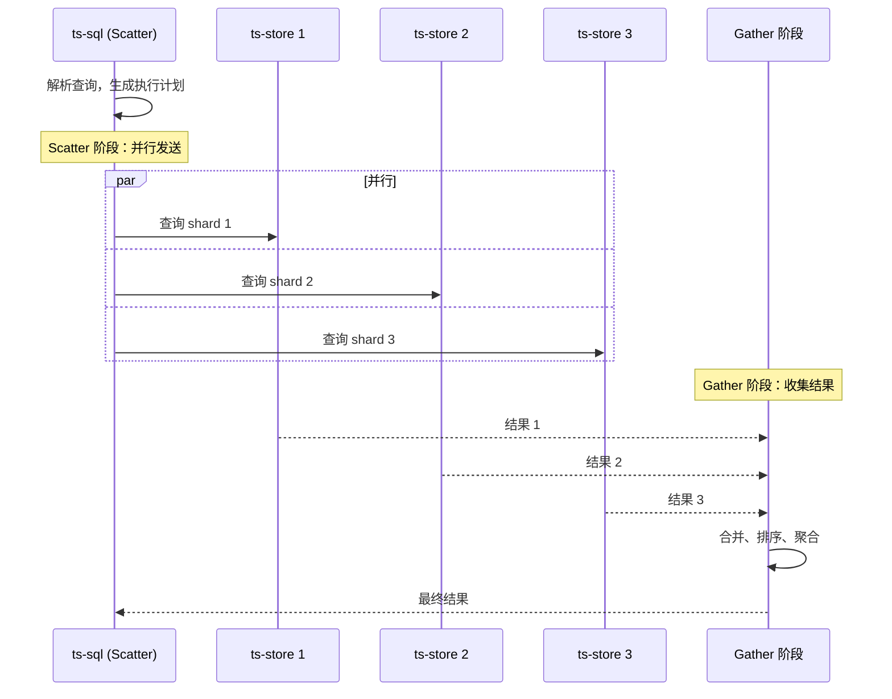
```mermaid
sequenceDiagram
    participant SQL as ts-sql (Scatter)
    participant Store1 as ts-store 1
    participant Store2 as ts-store 2
    participant Store3 as ts-store 3
    participant Gather as Gather 阶段

    SQL->>SQL: 解析查询，生成执行计划

    Note over SQL: Scatter 阶段：并行发送
    par 并行
        SQL->>Store1: 查询 shard 1
    and
        SQL->>Store2: 查询 shard 2
    and
        SQL->>Store3: 查询 shard 3
    end

    Note over Gather: Gather 阶段：收集结果
    Store1-->>Gather: 结果 1
    Store2-->>Gather: 结果 2
    Store3-->>Gather: 结果 3

    Gather->>Gather: 合并、排序、聚合
    Gather-->>SQL: 最终结果
```

**核心代码**：`coordinator/shard_mapper.go:61-103` — MapShards（Scatter 阶段的核心）

```go
// 第 61 行：MapShards 是 Scatter-Gather 的入口，将查询映射到多个 Shard
func (csm *ClusterShardMapper) MapShards(stmt *influxql.SelectStatement,
    t influxql.TimeRange, opt query.SelectOptions, condition influxql.Expr,
) (query.ShardGroup, error) {
    sources := stmt.Sources
    tmin := time.Unix(0, t.MinTimeNano()) // 查询起始时间
    tmax := time.Unix(0, t.MaxTimeNano()) // 查询结束时间
    csming := NewClusterShardMapping(csm, tmin, tmax)

    // 第 66 行：递归映射所有数据源到 Shard
    if err := csm.mapShards(csming, sources, tmin, tmax, condition, &opt); err != nil {
        return nil, err
    }
    return csming, nil
}
```

**逐行解释**：
- **第 61 行**：`MapShards` 是查询路由的入口，接收 SQL 解析后的 SelectStatement
- **第 63-64 行**：从查询条件中提取时间范围 `[tmin, tmax]`
- **第 66 行**：`mapShards` 递归处理所有数据源（包括 SubQuery、Join、Union）
- **返回值**：`ClusterShardMapping` 包含 `{source: {ptId: []ShardInfo}}` 映射

**核心代码**：`coordinator/shard_mapper.go:678-726` — RemoteQueryETraitsAndSrc（并行构建 RemoteQuery）

```go
// 第 678 行：RemoteQueryETraitsAndSrc 并行构建分布式查询请求
func (csm *ClusterShardMapping) RemoteQueryETraitsAndSrc(ctx context.Context,
    opts *query.ProcessorOptions, schema hybridqp.Catalog,
    shardsMapByNode map[uint64]map[uint32][]executor.ShardInfo,
    sourcesMapByPtId map[uint32]influxql.Sources,
) ([]hybridqp.Trait, error) {
    eTraits := make([]hybridqp.Trait, 0, len(shardsMapByNode))
    var muList = sync.Mutex{}
    wg := sync.WaitGroup{}

    // 第 685 行：遍历每个节点，并行构建 RemoteQuery
    for nodeID, shardsByPtId := range shardsMapByNode {
        for pId, sIds := range shardsByPtId {
            wg.Add(1)
            // 第 688 行：每个节点的查询独立 goroutine 处理
            go func(nodeID uint64, ptID uint32, shardInfos []executor.ShardInfo) {
                defer wg.Done()
                src := sourcesMapByPtId[ptID]
                // 第 693 行：创建 RemoteQuery（包含目标节点、Shard 列表、查询选项）
                rq, err := csm.makeRemoteQuery(ctx, src, *opts, nodeID, ptID, shardInfos, nil)
                if err != nil {
                    return
                }
                muList.Lock()
                eTraits = append(eTraits, rq) // 收集所有 RemoteQuery
                muList.Unlock()
            }(nodeID, pId, sIds)
        }
    }
    wg.Wait() // 等待所有 RemoteQuery 构建完成
    return eTraits, nil
}
```

**逐行解释**：
- **第 685 行**：`shardsMapByNode` 是 `{nodeID: {ptId: []ShardInfo}}`，来自 MapShards
- **第 688 行**：每个 `(nodeID, ptID, shardInfos)` 组合启动一个 goroutine
- **第 693 行**：`makeRemoteQuery` 构建 `RemoteQuery`，包含目标节点 ID、Shard 列表、查询选项
- **第 700 行**：用 `sync.Mutex` 保护 `eTraits` 的并发写入
- **设计意图**：并行构建 RemoteQuery，充分利用多核 CPU

**通俗解释**：
- Scatter-Gather 是分布式查询的核心模式
- **Scatter**：ts-sql 把查询并行发送到多个 ts-store 节点
- **Gather**：收集各个节点的结果，合并、排序、聚合
- 这个模式充分利用了集群的并行能力

**具体例子**：

查询 `SELECT mean(value) FROM cpu WHERE time > now() - 1h GROUP BY time(1m)` 的 Scatter-Gather 流程：

```
Scatter 阶段（ts-sql）：
  → 解析查询，找到 3 个 shard 分布在 3 个节点
  → 并行发送 3 个查询：
    Node1: SELECT mean(value) FROM cpu WHERE time > now()-1h GROUP BY time(1m) [shard 1]
    Node2: SELECT mean(value) FROM cpu WHERE time > now()-1h GROUP BY time(1m) [shard 2]
    Node3: SELECT mean(value) FROM cpu WHERE time > now()-1h GROUP BY time(1m) [shard 3]

本地执行（每个 ts-store）：
  → Node1: 扫描 shard 1 → 返回 60 行（每分钟一行）
  → Node2: 扫描 shard 2 → 返回 60 行
  → Node3: 扫描 shard 3 → 返回 60 行

Gather 阶段（ts-sql）：
  → 收集 3 × 60 = 180 行
  → 合并排序：按时间排序
  → 最终聚合：合并同一时间窗口的数据
  → 返回 60 行最终结果

性能对比：
  单机查询：扫描 3 个 shard，耗时 3 秒
  Scatter-Gather：3 个节点并行，耗时 1 秒（3 倍加速）
```

### 6.2 核心代码：RemoteQuery — 分布式查询请求

**代码位置**：`engine/executor/rpc_message.go:319-329`

```go
type RemoteQuery struct {
    Database string           // 数据库名
    PtID     uint32           // 数据分区 ID（ts-store 使用）
    NodeID   uint64           // 目标节点 ID
    ShardIDs []uint64         // 目标 Shard ID 列表（ts-store 使用）
    PtQuerys []PtQuery        // Pt 查询列表（cs-store / 列存使用）
    Opt      query.ProcessorOptions  // 查询选项
    Analyze  bool             // 是否开启性能分析
    Node     []byte           // 节点地址
    MstInfos []*MultiMstInfo  // 多 measurement 查询信息
}
```

其中 `PtQuery` 结构体定义为：
```go
type PtQuery struct {
    PtID       uint32        // 分区 ID
    ShardInfos []ShardInfo   // 该分区下的 Shard 信息列表
}
```

**具体例子**：

查询 `SELECT mean(value) FROM cpu WHERE host='server1' GROUP BY time(1m)` 的 Scatter-Gather 流程：

```
Scatter 阶段（ts-sql）：
  → 解析查询，生成执行计划
  → MapShards() → 找到 shard 1, 2, 3 分布在 3 个节点
  → 构建 3 个 RemoteQuery:
    RemoteQuery{NodeID: 1, ShardIDs: [1]}
    RemoteQuery{NodeID: 2, ShardIDs: [2]}
    RemoteQuery{NodeID: 3, ShardIDs: [3]}
  → 并行发送给 3 个节点

本地执行阶段（每个 ts-store）：
  → 接收 RemoteQuery，构建本地 DAG
  → 本地 DAG: Reader → Filter → Interval → Agg
  → 返回聚合结果（~10 行）

Gather 阶段（ts-sql）：
  → 接收 3 个节点的 Chunk
  → MergeTransform: 合并 3 个 Chunk
  → AggTransform: 最终聚合
  → LimitTransform: 取前 10 行
  → 返回给客户端
```

---

## 7. NodeManager 节点管理

### 7.1 节点发现

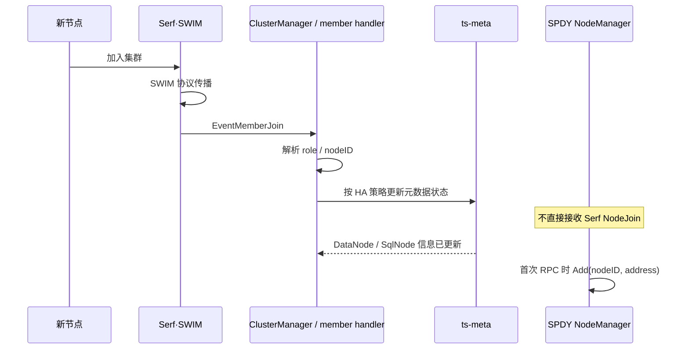
```mermaid
sequenceDiagram
    participant Node as 新节点
    participant Serf as Serf·SWIM
    participant CM as ClusterManager / member handler
    participant Meta as ts-meta
    participant NM as SPDY NodeManager

    Node->>Serf: 加入集群
    Serf->>Serf: SWIM 协议传播
    Serf->>CM: EventMemberJoin

    CM->>CM: 解析 role / nodeID
    CM->>Meta: 按 HA 策略更新元数据状态
    Note over NM: 不直接接收 Serf NodeJoin

    Meta-->>CM: DataNode / SqlNode 信息已更新
    NM->>NM: 首次 RPC 时 Add(nodeID, address)
```

**核心代码**：`lib/util/lifted/hashicorp/serf/serf/serf.go:918-989` — handleNodeJoin（节点加入处理）

```go
// 第 918 行：handleNodeJoin 处理节点加入事件（来自 memberlist）
func (s *Serf) handleNodeJoin(n *memberlist.Node) {
    s.memberLock.Lock()
    defer s.memberLock.Unlock()

    var oldStatus MemberStatus
    member, ok := s.members[n.Name]
    if !ok {
        // 第 930 行：新节点，创建 memberState
        oldStatus = StatusNone
        member = &memberState{
            Member: Member{
                Name:   n.Name,           // 节点名称（NodeID）
                Addr:   net.IP(n.Addr),    // IP 地址
                Port:   n.Port,            // 端口
                Tags:   s.decodeTags(n.Meta), // 解析 role 标签
                Status: StatusAlive,        // 标记为存活
            },
        }
        s.members[n.Name] = member
    } else {
        // 第 952 行：已知节点，更新状态
        oldStatus = member.Status
        member.Status = StatusAlive
        member.leaveTime = time.Time{}
        member.Addr = n.Addr
        member.Port = n.Port
        member.Tags = s.decodeTags(n.Meta)
    }

    // 第 966 行：更新协议版本信息
    member.ProtocolMin = n.PMin
    member.ProtocolMax = n.PMax
    member.ProtocolCur = n.PCur

    // 第 986 行：发送 MemberJoin 事件到 EventCh
    s.logger.Printf("[INFO] serf: EventMemberJoin: %s %s",
        member.Member.Name, member.Member.Addr)
    if s.config.EventCh != nil {
        s.config.EventCh <- MemberEvent{
            Type:      EventMemberJoin,
            Members:   []Member{member.Member},
            EventTime: s.eventClock.Time(),
        }
    }
}
```

**逐行解释**：
- **第 918 行**：`handleNodeJoin` 由 memberlist（底层 SWIM 实现）在检测到新节点时调用
- **第 919 行**：加写锁保护 `s.members` map 的并发访问
- **第 928-951 行**：区分新节点和已知节点 — 新节点创建 `memberState`，已知节点更新状态
- **第 930-938 行**：新节点的初始化，`Tags` 中包含 `role` 标签（meta/sql/store）
- **第 988-989 行**：将 `MemberJoin` 事件发送到 `EventCh`，由上层（ClusterManager）处理

**核心代码**：`app/ts-meta/meta/member_event_handler.go:205-231` — joinHandler（事件分发）

```go
// 第 205 行：joinHandler.handle 分发节点加入事件
func (jh *joinHandler) handle(e *memberEvent) error {
    for i := range e.event.Members {
        // 第 207 行：解析节点 ID
        id, err := strconv.ParseUint(e.event.Members[i].Name, 10, 64)
        if err != nil {
            panic(err)
        }
        // 第 211 行：根据 role 标签分发到不同处理器
        if e.event.Members[i].Tags["role"] == "meta" {
            err = jh.handleMetaEvent(&e.event.Members[i], &e.event, id, e.from)
            continue
        }
        if e.event.Members[i].Tags["role"] == "sql" {
            err = jh.handleSqlEvent(&e.event.Members[i], &e.event, id, e.from)
            continue
        }
        // 第 225 行：store 节点，根据 HA 策略分发
        err = joinHandlers[config.GetHaPolicy()](jh, id, &e.event,
            &e.event.Members[i], e.from)
    }
    return nil
}
```

**逐行解释**：
- **第 207 行**：节点 Name 就是 NodeID（字符串形式）
- **第 211-224 行**：根据 `Tags["role"]` 分发 — meta 节点调用 `handleMetaEvent`，sql 节点调用 `handleSqlEvent`
- **第 225 行**：store 节点根据 HA 策略（WAF/SharedStorage/Replication）选择不同的 joinHandler

**核心代码**：`lib/spdy/transport/node_manager.go:37-97` — NodeManager（运行时节点管理）

```go
// 第 37 行：NodeManager 管理所有已知节点的连接信息
type NodeManager struct {
    nodes map[uint64]*Node  // NodeID → Node 映射
    mu    sync.RWMutex      // 读写锁
    job   *statistics.SpdyJob
}

// 第 45 行：NewNodeManager 用于查询和 DDL 请求
func NewNodeManager() *NodeManager { return nm }

// 第 50 行：NewWriteNodeManager 用于写入请求
func NewWriteNodeManager() *NodeManager { return wnm }

// 第 63 行：Add 注册新节点
func (m *NodeManager) Add(nodeID uint64, address string) {
    m.mu.Lock()
    defer m.mu.Unlock()

    node, ok := m.nodes[nodeID]
    if ok && node != nil {
        if node.address != address {
            // 地址冲突，记录警告
        }
        return
    }
    // 第 77 行：创建新节点，初始化连接池
    m.nodes[nodeID] = &Node{
        nodeID:  nodeID,
        address: address,
        pools:   make([]*spdy.MultiplexedSessionPool, spdy.ConnPoolSize()),
    }
}

// 第 92 行：Get 根据 NodeID 获取节点
func (m *NodeManager) Get(nodeID uint64) *Node {
    m.mu.RLock()
    defer m.mu.RUnlock()
    return m.nodes[nodeID]
}
```

**逐行解释**：
- **第 37 行**：`NodeManager` 是全局单例，管理所有已知节点的网络连接
- **第 45-55 行**：三个独立的 NodeManager — 查询/DDL、写入、元数据，各自维护连接池
- **第 63 行**：`Add` 在 msgservice/netstorage 初始化请求目标或发送失败后重建连接时调用，注册节点地址和初始化连接池
- **第 77 行**：`pools` 是 SPDY 连接池数组，`ConnPoolSize()` 控制并发连接数

**通俗解释**：
- 节点发现基于 Serf/SWIM 协议（gossip 协议的一种）
- 新节点加入时，Serf 广播 `EventMemberJoin`，由 ts-meta 的 member handler/ClusterManager 处理并更新元数据
- SPDY `NodeManager` 是运行时连接池管理器，不直接订阅 Serf/SWIM NodeJoin
- NodeManager 的节点地址来自 MetaClient/DataNode 信息，在发起 RPC 或重建连接时通过 `Add(nodeID, address)` 写入

**具体例子**：

3 节点集群的节点发现过程：

```
初始状态：Node1 运行中

Step 1: Node2 启动
  → Node2 向 Node1 发送 Join 请求
  → Serf 产生 EventMemberJoin
  → ts-meta joinHandler 解析：{NodeID: 2, Role: store, Status: alive}
  → 元数据状态更新后，后续 RPC 通过 MetaClient 找到 Node2 地址
  → msgservice/netstorage 发起请求时调用 NodeManager.Add(2, TCPHost/Host)

Step 2: Node3 启动
  → Node3 向 Node1 发送 Join 请求
  → Serf 传播成员变更
  → ts-meta 更新节点状态
  → 首次访问 Node3 时 SPDY NodeManager 才注册连接池

Step 3: 所有节点都知道集群成员
  → Node1: [Node1, Node2, Node3]
  → Node2: [Node1, Node2, Node3]
  → Node3: [Node1, Node2, Node3]
```

### 7.2 SWIM 协议

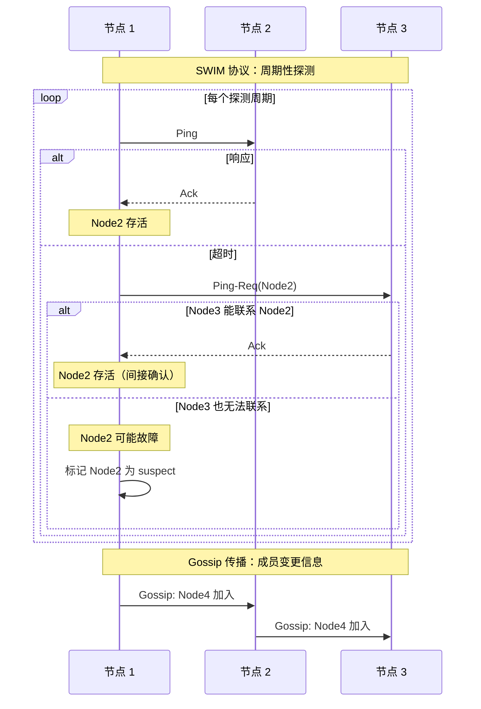
```mermaid
sequenceDiagram
    participant Node1 as 节点 1
    participant Node2 as 节点 2
    participant Node3 as 节点 3

    Note over Node1,Node3: SWIM 协议：周期性探测

    loop 每个探测周期
        Node1->>Node2: Ping
        alt 响应
            Node2-->>Node1: Ack
            Note over Node1: Node2 存活
        else 超时
            Node1->>Node3: Ping-Req(Node2)
            alt Node3 能联系 Node2
                Node3-->>Node1: Ack
                Note over Node1: Node2 存活（间接确认）
            else Node3 也无法联系
                Note over Node1: Node2 可能故障
                Node1->>Node1: 标记 Node2 为 suspect
            end
        end
    end

    Note over Node1,Node3: Gossip 传播：成员变更信息
    Node1->>Node2: Gossip: Node4 加入
    Node2->>Node3: Gossip: Node4 加入
```

**核心代码**：`lib/util/lifted/hashicorp/serf/serf/serf.go:62-107` — Serf 结构体（SWIM 协议实现）

```go
// 第 62 行：Serf 是 SWIM 协议的核心实现
type Serf struct {
    Clock      LamportClock              // 逻辑时钟（用于事件排序）
    eventClock LamportClock              // 事件时钟
    queryClock LamportClock              // 查询时钟

    broadcasts    *memberlist.TransmitLimitedQueue // 广播队列
    config        *Config                         // 配置
    failedMembers []*memberState                  // 故障成员列表
    leftMembers   []*memberState                  // 离开成员列表
    memberlist    *memberlist.Memberlist           // 底层 memberlist（SWIM 实现）
    memberLock    sync.RWMutex                    // 成员表锁
    members       map[string]*memberState          // 成员表（Name → memberState）

    recentIntents map[string]nodeIntent // 最近的 Join/Leave 意图

    eventBroadcasts *memberlist.TransmitLimitedQueue // 事件广播队列
    eventBuffer     []*userEvents                    // 事件缓冲区
    eventCh         chan Event                        // 事件通道

    logger     *log.Logger
    state      SerfState               // Serf 状态（Alive/Leaving/Left/Shutdown）
    shutdownCh chan struct{}            // 关闭信号
    snapshotter *Snapshotter           // 快照器（持久化成员状态）
}
```

**逐行解释**：
- **第 65 行**：`LamportClock` 是逻辑时钟，用于事件的全序排序（不依赖物理时钟）
- **第 73 行**：`memberlist` 是底层 SWIM 协议实现，负责探测和故障检测
- **第 75 行**：`members` 是成员表，存储所有已知节点的状态
- **第 77 行**：`recentIntents` 缓存最近的 Join/Leave 意图，防止乱序事件
- **第 101 行**：`snapshotter` 将成员状态持久化到磁盘，重启后可恢复

**核心代码**：`lib/util/lifted/hashicorp/serf/serf/event.go:14-61` — MemberEvent（成员事件）

```go
// 第 14 行：EventType 定义事件类型
type EventType int

const (
    EventMemberJoin   EventType = iota // 成员加入
    EventMemberLeave                   // 成员离开
    EventMemberFailed                  // 成员故障
    EventMemberUpdate                  // 成员更新
    EventMemberReap                    // 成员清除
    EventUser                          // 用户事件
    EventQuery                         // 查询事件
)

// 第 57 行：MemberEvent 是成员事件的载体
type MemberEvent struct {
    Type      EventType  // 事件类型
    Members   []Member   // 涉及的成员列表（可能多个，因为事件合并）
    EventTime LamportTime // 事件时间（Lamport 逻辑时钟）
}
```

**逐行解释**：
- **第 17-24 行**：7 种事件类型，覆盖成员生命周期的所有阶段
- **第 57 行**：`MemberEvent` 是 Serf 向上层传递的事件载体
- **第 59 行**：`Members` 是切片，因为 Serf 会合并短时间内相同类型的事件
- **第 60 行**：`EventTime` 使用 Lamport 逻辑时钟，保证事件的因果顺序

**通俗解释**：
- SWIM（Scalable Weakly-consistent Infection-style Process Group Membership）协议
- **探测**：每个节点周期性地 Ping 其他节点
- **间接确认**：如果 Ping 超时，请求其他节点帮忙 Ping-Req
- **Gossip 传播**：成员变更信息通过 Gossip 协议传播到整个集群
- **故障检测**：连续多次探测失败，标记节点为故障

**具体例子**：

Node1 探测 Node2 的过程：

```
探测周期 1：
  Node1 → Node2: Ping
  Node2 → Node1: Ack ✓
  结果：Node2 存活

探测周期 2：
  Node1 → Node2: Ping
  超时...（Node2 网络抖动）
  Node1 → Node3: Ping-Req(Node2)
  Node3 → Node2: Ping
  Node2 → Node3: Ack
  Node3 → Node1: Ack ✓
  结果：Node2 存活（间接确认）

探测周期 3：
  Node1 → Node2: Ping
  超时...
  Node1 → Node3: Ping-Req(Node2)
  Node3 → Node2: Ping
  超时...
  结果：Node2 可能故障，标记为 suspect

Gossip 传播：
  Node1 → Node2: "Node4 加入集群"
  Node2 → Node3: "Node4 加入集群"
  → 几秒内，所有节点都知道 Node4 加入了
```

---

## 8. Replication 数据复制

### 8.1 Raft 复制流程

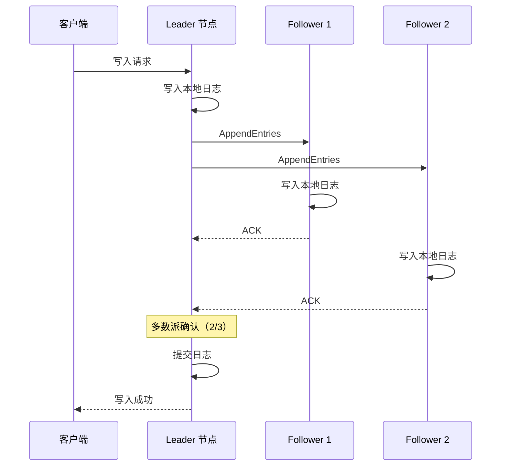
```mermaid
sequenceDiagram
    participant Client as 客户端
    participant Leader as Leader 节点
    participant Follower1 as Follower 1
    participant Follower2 as Follower 2

    Client->>Leader: 写入请求
    Leader->>Leader: 写入本地日志

    Leader->>Follower1: AppendEntries
    Leader->>Follower2: AppendEntries

    Follower1->>Follower1: 写入本地日志
    Follower1-->>Leader: ACK

    Follower2->>Follower2: 写入本地日志
    Follower2-->>Leader: ACK

    Note over Leader: 多数派确认（2/3）
    Leader->>Leader: 提交日志
    Leader-->>Client: 写入成功
```

**核心代码**：`lib/raftconn/node.go:57-106` — RaftNode 结构体

```go
// 第 57 行：RaftNode 是 Raft 共识节点的核心结构
type RaftNode struct {
    proposeC    chan []byte            // 提议通道（写入请求入口）
    confChangeC chan raftpb.ConfChange // 集群配置变更通道
    commitC     chan *Commit           // 已提交日志通道（输出）
    errorC      chan<- error           // 错误通道
    Messages    chan *raftpb.Message   // Raft 消息通道（发送给其他节点）

    nodeId   uint64            // 数据节点 ID
    database string            // 数据库名
    ptId     uint32            // 分区 ID
    id       uint64            // Raft 节点 ID（= ptId + 1）
    peers    map[uint32]uint64 // Peer 映射（ptId → nodeId）

    node      raft.Node         // etcd raft 状态机
    Store     *raftlog.RaftDiskStorage // WAL 存储
    appliedIndex uint64         // 已应用的日志索引
}
```

**逐行解释**：
- **第 58 行**：`proposeC` 是写入请求的入口，Leader 将数据写入此 channel
- **第 60 行**：`commitC` 是已提交日志的输出，应用到本地状态机
- **第 66 行**：`id` 是 Raft 节点 ID，值为 `ptId + 1`（每个 Pt 有独立的 Raft 组）
- **第 68 行**：`peers` 存储 Peer 的映射关系，用于消息路由
- **第 71 行**：`node` 是 etcd/raft 库的状态机，处理选举、日志复制等核心逻辑

**核心代码**：`lib/raftconn/node.go:316-385` — serveChannels（Raft 消息处理主循环）

```go
// 第 317 行：serveChannels 是 Raft 节点的主循环
func (n *RaftNode) serveChannels() {
    var leader bool

    for {
        select {
        case <-n.ctx.Done():
            n.node.Stop()
            return
        case <-n.tick.C:
            n.node.Tick()  // 驱动 Raft 时钟（选举超时、心跳）

        case rd := <-n.node.Ready():  // Raft Ready 包含待处理的消息和日志
            if rd.SoftState != nil {
                leader = rd.RaftState == raft.StateLeader // 判断是否为 Leader
            }

            if leader {
                // 第 336 行：Leader 先发送消息（并行写磁盘）
                for i := range n.processMessages(rd.Messages) {
                    n.Messages <- &rd.Messages[i]
                }
            }

            // 第 344 行：写入 WAL（持久化日志）
            n.SaveToStorage(&rd.HardState, rd.Entries, &rd.Snapshot)

            // 第 354-363 行：同步刷盘（确保数据持久化）
            for rd.MustSync {
                if err := n.Store.TrySync(); err != nil {
                    time.Sleep(10 * time.Millisecond)
                    continue
                }
                break
            }

            // 第 365 行：发布已提交的日志到 commitC
            ok := n.PublishEntries(n.entriesToApply(rd.CommittedEntries))

            if !leader {
                // 第 376 行：Follower 后发送消息
                for i := range n.processMessages(rd.Messages) {
                    n.Messages <- &rd.Messages[i]
                }
            }

            n.node.Advance() // 通知 raft 库可以处理下一批
        }
    }
}
```

**逐行解释**：
- **第 326 行**：`n.node.Tick()` 驱动 Raft 内部时钟，触发选举超时和心跳
- **第 328 行**：`n.node.Ready()` 返回需要处理的消息和日志条目
- **第 336 行**：Leader 先发送消息（可以和写磁盘并行，提高性能）
- **第 344 行**：`SaveToStorage` 将日志写入 WAL（Write-Ahead Log）
- **第 365 行**：`PublishEntries` 将已提交的日志发送到 `commitC`，由上层应用到状态机
- **第 376 行**：Follower 在持久化后再发送消息（保证消息对应的日志已持久化）

**核心代码**：`lib/raftconn/node.go:466-515` — PublishEntries（发布已提交日志）

```go
// 第 468 行：PublishEntries 将已提交的日志发布到 commitC
func (n *RaftNode) PublishEntries(ents []raftpb.Entry) bool {
    if len(ents) == 0 {
        return true
    }

    data := make([][]byte, 0, len(ents))
    for i := range ents {
        switch ents[i].Type {
        case raftpb.EntryNormal:
            if len(ents[i].Data) == 0 {
                continue // 忽略空消息
            }
            data = append(data, ents[i].Data) // 收集数据
        case raftpb.EntryConfChange:
            var cc raftpb.ConfChange
            cc.Unmarshal(ents[i].Data)
            n.confState = n.node.ApplyConfChange(cc) // 应用集群配置变更
        }
    }

    if len(data) > 0 {
        // 第 500 行：将已提交数据发送到 commitC
        select {
        case n.commitC <- &Commit{
            Database:       n.database,
            PtId:           GetPtId(n.id),
            Data:           data,
            CommittedIndex: ents[len(ents)-1].Index,
        }:
        case <-n.ctx.Done():
            return false
        }
    }

    n.appliedIndex = ents[len(ents)-1].Index // 更新已应用索引
    return true
}
```

**逐行解释**：
- **第 475 行**：`EntryNormal` 是普通日志条目（写入数据）
- **第 482 行**：`EntryConfChange` 是集群配置变更（添加/移除节点）
- **第 500 行**：`Commit` 结构体包含数据库名、PtId、数据和已提交索引
- **第 512 行**：更新 `appliedIndex`，用于下次重启时的日志回放

**通俗解释**：
- Raft 是一种共识算法，确保多个节点的数据一致性
- **Leader**：接收写入请求，复制到 Follower
- **Follower**：接收日志，写入本地，返回 ACK
- **提交**：当多数派（N/2 + 1）确认后，日志提交
- 这样即使少数节点故障，数据也不会丢失

**具体例子**：

Raft 复制的过程：

```
3 节点集群，Node1 是 Leader

Step 1: 客户端写入 cpu,host=server1 value=99.5
  → 客户端 → Node1（Leader）

Step 2: Node1 写入本地日志
  → LogEntry{Index: 100, Term: 5, Data: WriteCommand(...)}

Step 3: Node1 复制到 Follower
  → Node1 → Node2: AppendEntries(Index=100, Term=5, Data)
  → Node1 → Node3: AppendEntries(Index=100, Term=5, Data)

Step 4: Follower 写入本地日志
  → Node2 写入 LogEntry{Index: 100, Term: 5}
  → Node2 → Node1: ACK(success)
  → Node3 写入 LogEntry{Index: 100, Term: 5}
  → Node3 → Node1: ACK(success)

Step 5: Node1 提交日志
  → 收到多数派 ACK（2/3）
  → 标记 Index=100 为已提交
  → 应用到本地状态机

Step 6: 返回成功
  → Node1 → 客户端: 写入成功

即使 Node3 故障：
  → Node1 和 Node2 仍然可以提交（2/3 多数派）
  → 数据不会丢失
```

---

## 9. HA（高可用）策略

### 9.1 WAF（Write-Ahead Failover）

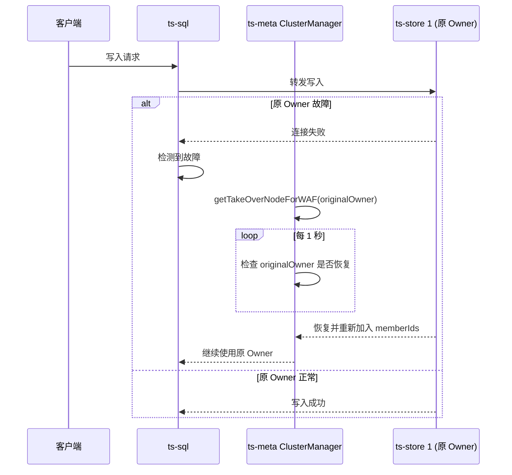
```mermaid
sequenceDiagram
    participant Client as 客户端
    participant SQL as ts-sql
    participant Meta as ts-meta ClusterManager
    participant Owner as ts-store 1 (原 Owner)

    Client->>SQL: 写入请求
    SQL->>Owner: 转发写入

    alt 原 Owner 故障
        Owner-->>SQL: 连接失败
        SQL->>SQL: 检测到故障
        Meta->>Meta: getTakeOverNodeForWAF(originalOwner)
        loop 每 1 秒
            Meta->>Meta: 检查 originalOwner 是否恢复
        end
        Owner-->>Meta: 恢复并重新加入 memberIds
        Meta-->>SQL: 继续使用原 Owner
    else 原 Owner 正常
        Owner-->>SQL: 写入成功
    end
```

**核心代码**：`app/ts-meta/meta/member_event_handler.go:285-315` — failHandlerForWAF（WAF 故障处理）

```go
// 第 285 行：failHandlerForWAF 处理 WAF 模式下的节点故障
func failHandlerForWAF(fh *failedHandler, id uint64,
    event *serf.MemberEvent, member *serf.Member, from eventFrom) error {
    // 第 286 行：SQL 节点走独立的 SQL 事件处理
    if member.Tags["role"] == "sql" {
        return fh.handleSqlEvent(member, event, id, from)
    }
    // 第 290 行：Ping 检测节点是否实际存活（防止网络抖动误判）
    if fh.cm.PingNode(id) {
        logger.GetLogger().Info("ping node success, skip fail handler",
            zap.String("name", member.Name),
            zap.String("addr", member.Addr.String()),
            zap.String("event", event.String()))
        return nil
    }
    // 第 298 行：委托给 handleStoreEvent 更新状态 + handleClusterMember 更新成员表
    return handleStoreEvent(fh, id, event, member, from)
}
```

**逐行解释**：
- **第 286 行**：先检查角色标签，SQL 节点故障走 `handleSqlEvent` 路径
- **第 290 行**：调用 `PingNode` 探测节点实际可达性，若存活则跳过故障处理（避免网络抖动误触发）
- **第 298 行**：委托给包级函数 `handleStoreEvent()`，该函数内部依次调用 `fh.handleStoreEvent()`（更新元数据中节点状态为 Offline）和 `fh.cm.handleClusterMember()`（更新内存集群成员表）

**注意**：WAF 模式下没有独立的 Pt 迁移逻辑。与 Replication 模式不同，WAF 策略的故障转移通过 `getTakeOverNodeForWAF` 实现——该函数会循环等待原 Owner 节点恢复，而非立即将 Pt 迁移到新节点。这是 WAF（Write-Available First）的核心设计理念：优先等待节点恢复，而非数据迁移。

**核心代码**：`app/ts-meta/meta/cluster_manager.go:455-472` — getTakeOverNodeForWAF（选择接管节点）

```go
// 第 455 行：getTakeOverNodeForWAF 选择接管节点（WAF 策略）
func getTakeOverNodeForWAF(cm *ClusterManager, oid uint64,
    nodePtNumMap *map[uint64]uint32, isRetry bool) (uint64, error) {
    for {
        if cm.isStopped() || cm.isClosed() {
            break
        }

        cm.mu.RLock()
        // 第 462 行：检查原 Owner 是否已恢复
        if _, ok := cm.memberIds[oid]; ok {
            cm.mu.RUnlock()
            return oid, nil // 原 Owner 恢复，继续使用
        }
        cm.mu.RUnlock()

        // 第 468 行：等待原 Owner 恢复
        time.Sleep(time.Second)
        logger.GetSuppressLogger().Warn("the target store is not alive",
            zap.Uint64("id", oid), zap.Bool("isRetry", isRetry))
    }
    return 0, errno.NewError(errno.ClusterManagerIsNotRunning)
}
```

**逐行解释**：
- **第 455 行**：WAF 策略的核心 — 等待原 Owner 恢复，而非立即迁移到新节点
- **第 462 行**：检查原 Owner 是否在 `memberIds` 中（已恢复上线）
- **第 468 行**：如果原 Owner 未恢复，每秒重试一次
- **设计意图**：WAF（Write-Available First）优先保证写可用性，等待节点恢复而非数据迁移

**通俗解释**：
- WAF 策略不是自动切换到新的 PT owner 或新 Leader
- `getTakeOverNodeForWAF` 会循环等待原 Owner 重新出现在 `memberIds` 中
- 对客户端来说，写入需要依赖上层重试，直到原 Owner 恢复或状态机停止

**具体例子**：

WAF 故障切换的过程：

```
场景：Pt1 的原 Owner 是 ts-store 1，处理写入请求

Step 1: 客户端写入 cpu,host=server1 value=99.5
  → 客户端 → ts-sql → ts-store 1（Leader）

Step 2: ts-store 1 故障
  → ts-sql 检测到连接失败
  → ts-sql 等待 1 秒，重试

Step 3: WAF 等待原 Owner
  → getTakeOverNodeForWAF(cm, oid=ts-store1)
  → 每 1 秒检查 memberIds[ts-store1]
  → 不自动选择 ts-store2 作为新 owner

Step 4: 原 Owner 恢复
  → ts-store1 重新加入集群
  → memberIds 中出现 ts-store1
  → getTakeOverNodeForWAF 返回 oid

Step 4: ts-store 2 从 WAL 恢复
  → ts-store 2 读取 WAL 文件
  → 恢复未提交的数据
  → 应用到本地状态机

Step 5: ts-store 2 处理写入
  → 写入成功
  → 返回给客户端

结果：
  → 客户端只重试了一次
  → 数据没有丢失
  → 故障切换对客户端透明
```

---

## 10. 潜在隐患

### 10.1 连接池单点故障

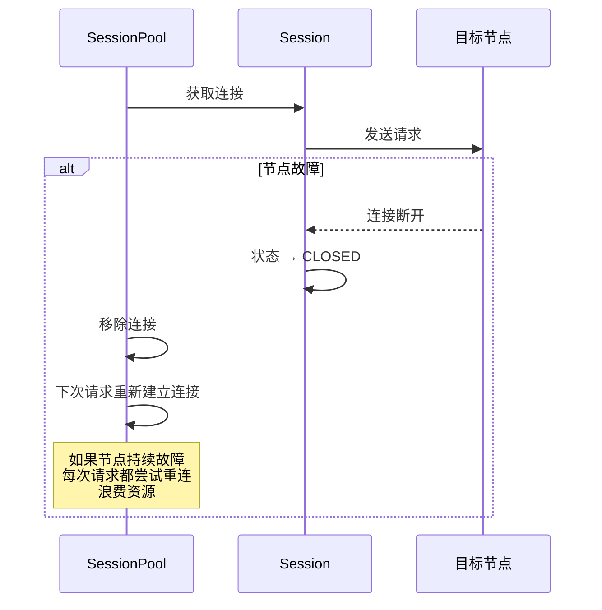
```mermaid
sequenceDiagram
    participant Pool as SessionPool
    participant Session as Session
    participant Node as 目标节点

    Pool->>Session: 获取连接
    Session->>Node: 发送请求

    alt 节点故障
        Node-->>Session: 连接断开
        Session->>Session: 状态 → CLOSED
        Pool->>Pool: 移除连接

        Pool->>Pool: 下次请求重新建立连接
        Note over Pool: 如果节点持续故障<br/>每次请求都尝试重连<br/>浪费资源
    end
```

**隐患**：
- 节点持续故障时，每次请求都尝试重连，浪费资源
- 缺少退避机制（backoff），可能导致频繁重连
- 建议：加入指数退避，避免频繁重连

**具体例子**：

连接池单点故障的影响：

```
场景：Node2 持续故障（宕机 10 分钟）

每次查询请求：
  GetSession("Node2:8080")
  → 连接失败，创建新 Session
  → TCP 连接超时（默认 5 秒）
  → 返回错误

10 分钟内的影响：
  → 每秒 100 个查询请求
  → 每个请求等待 5 秒超时
  → 总共浪费：100 × 5 × 600 = 300,000 秒的等待时间
  → 用户体验极差

优化方案：指数退避
  → 第 1 次失败：等待 1 秒
  → 第 2 次失败：等待 2 秒
  → 第 3 次失败：等待 4 秒
  → 第 4 次失败：等待 8 秒
  → ...最大等待 60 秒
  → 减少无效重连，节省资源
```

### 10.2 Scatter-Gather 结果合并瓶颈

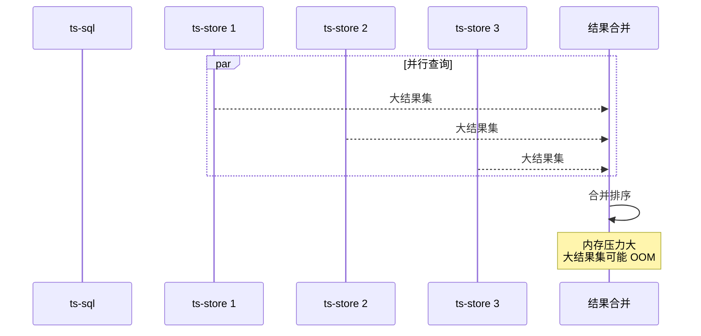
```mermaid
sequenceDiagram
    participant SQL as ts-sql
    participant Store1 as ts-store 1
    participant Store2 as ts-store 2
    participant Store3 as ts-store 3
    participant Merge as 结果合并

    par 并行查询
        Store1-->>Merge: 大结果集
        Store2-->>Merge: 大结果集
        Store3-->>Merge: 大结果集
    end

    Merge->>Merge: 合并排序
    Note over Merge: 内存压力大<br/>大结果集可能 OOM
```

**隐患**：
- 大结果集并行返回时，合并阶段内存压力大
- 如果结果集总和超过内存，可能 OOM
- 建议：流式合并，边接收边合并，减少内存占用

**具体例子**：

Scatter-Gather 结果合并的内存压力：

```
场景：查询 3 个节点，每个节点返回 1GB 数据

Step 1: Scatter 阶段
  → ts-sql 并行发送查询到 3 个节点

Step 2: Gather 阶段
  → Node1 返回 1GB 数据
  → Node2 返回 1GB 数据
  → Node3 返回 1GB 数据

Step 3: 合并阶段
  → 需要同时加载 3GB 数据到内存
  → 合并排序：需要额外 3GB 内存
  → 总内存需求：6GB

如果服务器只有 4GB 内存：
  → OOM（Out of Memory）
  → 查询失败

优化方案：
  → 流式合并：边接收边合并
  → 分批处理：每次处理 100MB
  → 限制结果集大小：LIMIT 1000
```

### 10.3 PtView 一致性问题

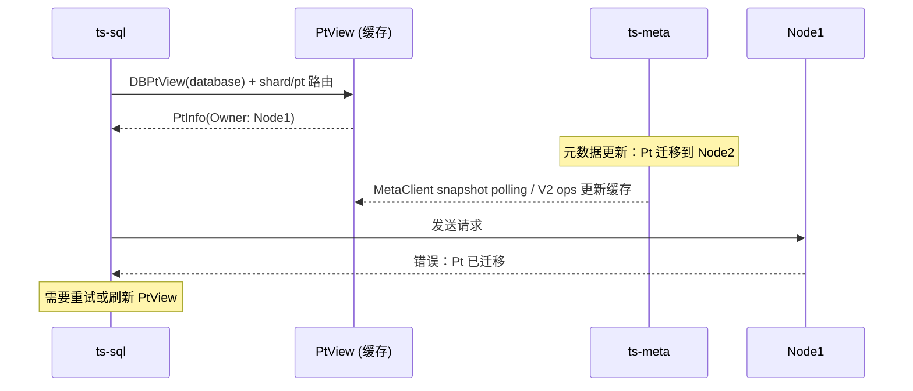
```mermaid
sequenceDiagram
    participant SQL as ts-sql
    participant PtView as PtView (缓存)
    participant Meta as ts-meta

    SQL->>PtView: DBPtView(database) + shard/pt 路由
    PtView-->>SQL: PtInfo(Owner: Node1)

    Note over Meta: 元数据更新：Pt 迁移到 Node2
    Meta-->>PtView: MetaClient snapshot polling / V2 ops 更新缓存

    SQL->>Node1: 发送请求
    Node1-->>SQL: 错误：Pt 已迁移

    Note over SQL: 需要重试或刷新 PtView
```

**隐患**：
- PtView 缓存可能过期，导致请求发送到错误的节点
- PtView 更新来自 MetaClient 的 snapshot polling 或 Snapshot V2 增量/全量兜底同步，不是固定每 10 秒刷新
- 建议：错误时自动刷新 PtView 并重试

**具体例子**：

PtView 一致性问题：

```
场景：Pt1 从 Node1 迁移到 Node2

Step 1: ts-sql 缓存 PtView
  → PtView{PtId: 1, Owner: Node1, Status: Online}

Step 2: ts-meta 更新 Pt1 的 Owner
  → UpdatePtOwnerCommand{PtId: 1, NewOwner: Node2}
  → PtView{PtId: 1, Owner: Node2, Status: Online}

Step 3: ts-sql 发送请求到 Node1（旧 Owner）
  → ts-sql: DBPtView("db") + shardId→ptId→owner 路由
  → 返回缓存的 PtView{Owner: Node1}
  → ts-sql → Node1: 查询请求

Step 4: Node1 返回错误
  → Node1: "Pt1 已迁移到 Node2"
  → ts-sql 收到错误

Step 5: ts-sql 刷新 PtView
  → MetaClient pollForUpdates / pollForUpdatesV2 同步到新元数据
  → PtView{PtId: 1, Owner: Node2}
  → ts-sql → Node2: 查询请求

Step 6: Node2 处理请求
  → 返回结果

优化方案：
  → 错误时自动刷新 PtView
  → 依赖 MetaClient snapshot polling / Snapshot V2 ops 推进本地 cacheData
  → 使用版本号检测 PtView 是否过期
```

---

## 11. 端到端实战：一次 SPDY 会话建立的完整生命周期

> 追踪 ts-sql 节点与 ts-store 节点之间建立 SPDY 连接的完整过程。

### 11.1 初始状态

```
集群拓扑：
ts-sql (协调节点)  ←→  ts-meta (元数据节点)
    ↕
ts-store 1 (存储节点)
ts-store 2 (存储节点)
ts-store 3 (存储节点)
```

### 11.2 SPDY 会话建立时序图

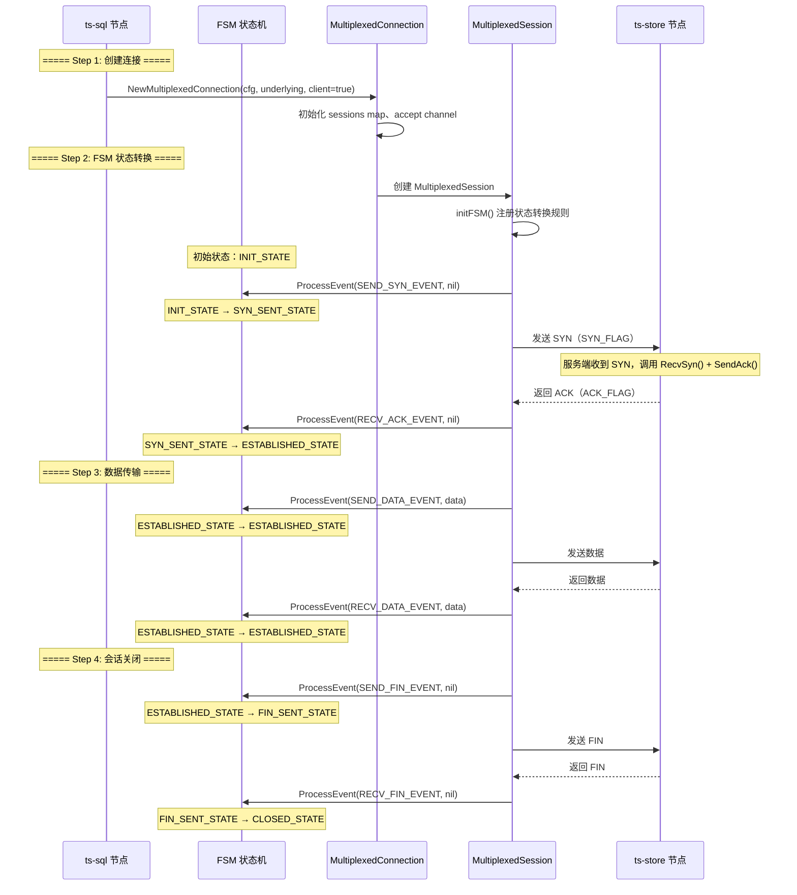
```mermaid
sequenceDiagram
    participant SQL as ts-sql 节点
    participant FSM as FSM 状态机
    participant Conn as MultiplexedConnection
    participant Session as MultiplexedSession
    participant Store as ts-store 节点

    Note over SQL: ===== Step 1: 创建连接 =====
    SQL->>Conn: NewMultiplexedConnection(cfg, underlying, client=true)
    Conn->>Conn: 初始化 sessions map、accept channel

    Note over SQL: ===== Step 2: FSM 状态转换 =====
    Conn->>Session: 创建 MultiplexedSession
    Session->>Session: initFSM() 注册状态转换规则
    Note over FSM: 初始状态：INIT_STATE

    Session->>FSM: ProcessEvent(SEND_SYN_EVENT, nil)
    Note over FSM: INIT_STATE → SYN_SENT_STATE
    Session->>Store: 发送 SYN（SYN_FLAG）

    Note over Store: 服务端收到 SYN，调用 RecvSyn() + SendAck()
    Store-->>Session: 返回 ACK（ACK_FLAG）
    Session->>FSM: ProcessEvent(RECV_ACK_EVENT, nil)
    Note over FSM: SYN_SENT_STATE → ESTABLISHED_STATE

    Note over SQL: ===== Step 3: 数据传输 =====
    Session->>FSM: ProcessEvent(SEND_DATA_EVENT, data)
    Note over FSM: ESTABLISHED_STATE → ESTABLISHED_STATE
    Session->>Store: 发送数据

    Store-->>Session: 返回数据
    Session->>FSM: ProcessEvent(RECV_DATA_EVENT, data)
    Note over FSM: ESTABLISHED_STATE → ESTABLISHED_STATE

    Note over SQL: ===== Step 4: 会话关闭 =====
    Session->>FSM: ProcessEvent(SEND_FIN_EVENT, nil)
    Note over FSM: ESTABLISHED_STATE → FIN_SENT_STATE
    Session->>Store: 发送 FIN

    Store-->>Session: 返回 FIN
    Session->>FSM: ProcessEvent(RECV_FIN_EVENT, nil)
    Note over FSM: FIN_SENT_STATE → CLOSED_STATE
```

### 11.3 Step 1 详解：FSM 状态机 — 状态与事件定义

**代码路径**：`lib/spdy/fsm.go:24-53`

```go
// FSM 事件类型（int 枚举）
type event int

const (
    SEND_SYN_EVENT      event = iota  // 0: 发送 SYN
    RECV_SYN_EVENT                     // 1: 接收 SYN
    SEND_ACK_EVENT                     // 2: 发送 ACK
    RECV_ACK_EVENT                     // 3: 接收 ACK
    SEND_DATA_EVENT                    // 4: 发送数据
    RECV_DATA_EVENT                    // 5: 接收数据
    SEND_FIN_EVENT                     // 6: 发送 FIN
    RECV_FIN_EVENT                     // 7: 接收 FIN
    SEND_RST_EVENT                     // 8: 发送 RST
    RECV_RST_EVENT                     // 9: 接收 RST
    SEND_DATA_ACK_EVENT               // 10: 发送数据 ACK
    RECV_DATA_ACK_EVENT               // 11: 接收数据 ACK
    UNKNOWN_EVENT                      // 12: 未知事件
)

// FSM 状态类型（int 枚举）
type state int

const (
    INIT_STATE        state = iota  // 0: 初始状态
    SYN_SENT_STATE                  // 1: 已发送 SYN
    SYN_RECV_STATE                  // 2: 已接收 SYN
    ESTABLISHED_STATE               // 3: 连接已建立
    FIN_SENT_STATE                  // 4: 已发送 FIN
    FIN_RECV_STATE                  // 5: 已接收 FIN
    CLOSED_STATE                    // 6: 已关闭
    UNKNOWN_STATE                   // 7: 未知状态
)
```

**逐行解释**：
- `event` 和 `state` 都是 `int` 类型（非 string），使用 `iota` 枚举
- 事件分为发送/接收两组：`SEND_SYN_EVENT` / `RECV_SYN_EVENT`、`SEND_ACK_EVENT` / `RECV_ACK_EVENT` 等
- 状态从 `INIT_STATE` 到 `CLOSED_STATE`，共 7 个有效状态
- `FSMEventAction` 回调签名：`func(event, *FSMTransition, []byte) error`

### 11.4 Step 2 详解：initFSM — 注册状态转换规则

**代码路径**：`lib/spdy/multiplexed_session.go:100-168`

```go
func (s *MultiplexedSession) initFSM() {
    // 创建各状态（可带进入/退出回调）
    initState      := NewFSMState(INIT_STATE, nil, nil)
    synSentState   := NewFSMState(SYN_SENT_STATE, nil, nil)
    synRecvState   := NewFSMState(SYN_RECV_STATE, nil, nil)
    establishState := NewFSMState(ESTABLISHED_STATE, nil, nil)
    finSentState   := NewFSMState(FIN_SENT_STATE, nil, nil)
    finRecvState   := NewFSMState(FIN_RECV_STATE, nil, nil)
    closedState    := NewFSMState(CLOSED_STATE, s.enterClosed, nil)

    // 注册状态转换：INIT_STATE + SEND_SYN_EVENT → SYN_SENT_STATE
    s.fsm.Build(initState, SEND_SYN_EVENT, synSentState, s.sendSyn)

    // 注册状态转换：INIT_STATE + RECV_SYN_EVENT → SYN_RECV_STATE
    s.fsm.Build(initState, RECV_SYN_EVENT, synRecvState, s.recvSyn)

    // 注册状态转换：SYN_RECV_STATE + SEND_ACK_EVENT → ESTABLISHED_STATE
    s.fsm.Build(synRecvState, SEND_ACK_EVENT, establishState, s.sendAck)

    // 注册状态转换：SYN_SENT_STATE + RECV_ACK_EVENT → ESTABLISHED_STATE
    s.fsm.Build(synSentState, RECV_ACK_EVENT, establishState, s.recvAck)

    // 数据传输：ESTABLISHED_STATE + SEND_DATA_EVENT → ESTABLISHED_STATE
    s.fsm.Build(establishState, SEND_DATA_EVENT, establishState, s.sendData)

    // 数据接收：ESTABLISHED_STATE + RECV_DATA_EVENT → ESTABLISHED_STATE
    s.fsm.Build(establishState, RECV_DATA_EVENT, establishState, s.recvData)

    // 数据 ACK：ESTABLISHED_STATE + SEND_DATA_ACK_EVENT → ESTABLISHED_STATE
    s.fsm.Build(establishState, SEND_DATA_ACK_EVENT, establishState, s.sendDataACK)

    // 关闭流程：ESTABLISHED_STATE + SEND_FIN_EVENT → FIN_SENT_STATE
    // ... 更多状态转换规则
}
```

**逐行解释**：
- `initFSM` 是 `*MultiplexedSession` 的方法（非独立函数）
- `NewFSMState(state, enterAction, exitAction)`：创建状态，可配置进入/退出回调
- `s.fsm.Build(start, event, next, action)`：注册转换规则（非 `AddTransition`）
  - `start`：起始状态
  - `event`：触发事件
  - `next`：目标状态
  - `action`：事件处理回调，签名为 `FSMEventAction func(event, *FSMTransition, []byte) error`
- `closedState` 的进入回调 `s.enterClosed`：关闭时执行清理

### 11.5 Step 3 详解：MultiplexedConnection 结构体

**代码路径**：`lib/spdy/multiplexed_connection.go:119-140`

```go
type MultiplexedConnection struct {
    cfg           config.Spdy            // SPDY 配置
    underlying    io.ReadWriteCloser     // 底层连接（非 net.Conn）
    sessions      map[uint64]*MultiplexedSession  // 会话映射
    sessionsGuard sync.Mutex             // 会话锁（非 sync.RWMutex）
    input         io.Reader              // 输入流
    output        BuffWriter             // 带缓冲的输出流
    outputGuard   sync.Mutex             // 输出锁
    handlers      []handlerFunc          // 处理函数列表
    dataBp        bufferpool.Pool        // 数据缓冲池
    client        bool                   // 是否是客户端
    nextSessionId uint64                 // 下一个会话 ID
    accept        chan *MultiplexedSession // 接受的会话 channel
    openTimeout   time.Duration          // 打开超时
    closed        chan struct{}           // 关闭信号
    closeOnce     sync.Once              // 关闭一次
    logger        *logger.Logger         // 日志
}
```

**与早期版本的关键差异**：
- `underlying io.ReadWriteCloser`：底层连接是接口，支持任意 IO 实现（非 `net.Conn`）
- `sessionsGuard sync.Mutex`：使用互斥锁（非 `sync.RWMutex`），因为会话操作需要独占访问
- `output BuffWriter`：带缓冲的写入器，减少系统调用次数
- `accept chan *MultiplexedSession`：服务端通过此 channel 接受新会话

### 11.6 分布式查询的 Scatter-Gather

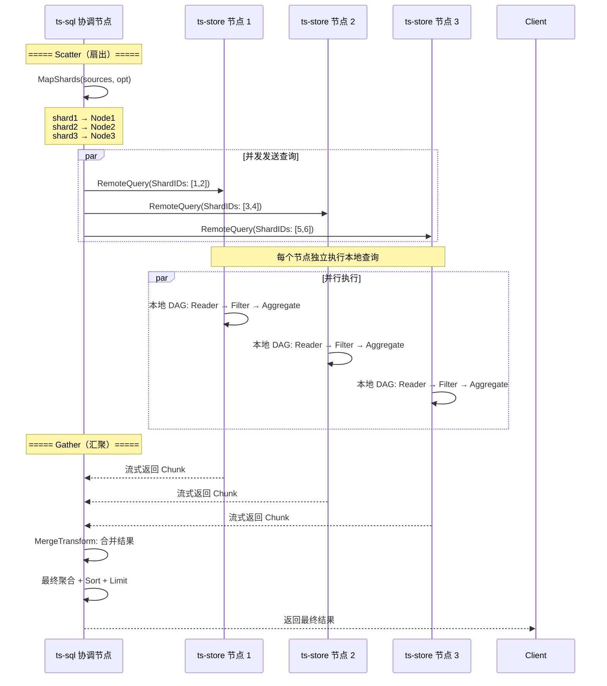
```mermaid
sequenceDiagram
    participant SQL as ts-sql 协调节点
    participant S1 as ts-store 节点 1
    participant S2 as ts-store 节点 2
    participant S3 as ts-store 节点 3

    Note over SQL: ===== Scatter（扇出）=====
    SQL->>SQL: MapShards(sources, opt)
    Note over SQL: shard1 → Node1<br/>shard2 → Node2<br/>shard3 → Node3

    par 并发发送查询
        SQL->>S1: RemoteQuery(ShardIDs: [1,2])
        SQL->>S2: RemoteQuery(ShardIDs: [3,4])
        SQL->>S3: RemoteQuery(ShardIDs: [5,6])
    end

    Note over S1,S3: 每个节点独立执行本地查询
    par 并行执行
        S1->>S1: 本地 DAG: Reader → Filter → Aggregate
        S2->>S2: 本地 DAG: Reader → Filter → Aggregate
        S3->>S3: 本地 DAG: Reader → Filter → Aggregate
    end

    Note over SQL: ===== Gather（汇聚）=====
    S1-->>SQL: 流式返回 Chunk
    S2-->>SQL: 流式返回 Chunk
    S3-->>SQL: 流式返回 Chunk

    SQL->>SQL: MergeTransform: 合并结果
    SQL->>SQL: 最终聚合 + Sort + Limit

    SQL-->>Client: 返回最终结果
```

**关键设计点**：
- **SPDY 多路复用**：一个 TCP 连接上可以同时传输多个请求/响应
- **FSM 状态机**：管理连接的生命周期（INIT_STATE → ESTABLISHED_STATE → CLOSED_STATE）
- **DataACK 流控**：通过 ACK 信号实现窗口/背压控制，避免接收队列被打满；可靠性仍主要来自 TCP、SPDY 错误传播和上层重试/错误处理
- **Scatter-Gather**：分布式查询的核心模式（扇出 + 汇聚）
- **会话池**：复用已建立的会话，减少连接建立开销
