# Module 7: State Machine (Raft / Meta) 深度审计报告（庖丁解牛版 v3）

> 时序图优先，逐步拆解。每个流程都有 Mermaid 时序图 + 核心代码逐行解释。

---

## 1. 状态机是什么？为什么需要它？

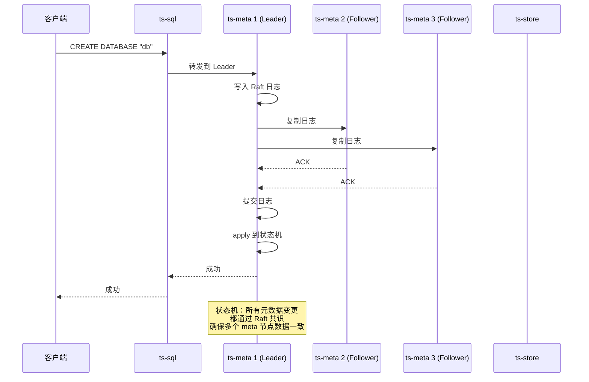
```mermaid
sequenceDiagram
    participant Client as 客户端
    participant SQL as ts-sql
    participant Meta1 as ts-meta 1 (Leader)
    participant Meta2 as ts-meta 2 (Follower)
    participant Meta3 as ts-meta 3 (Follower)
    participant Store as ts-store

    Client->>SQL: CREATE DATABASE "db"
    SQL->>Meta1: 转发到 Leader

    Meta1->>Meta1: 写入 Raft 日志
    Meta1->>Meta2: 复制日志
    Meta1->>Meta3: 复制日志

    Meta2-->>Meta1: ACK
    Meta3-->>Meta1: ACK

    Meta1->>Meta1: 提交日志
    Meta1->>Meta1: apply 到状态机

    Meta1-->>SQL: 成功
    SQL-->>Client: 成功

    Note over Meta1: 状态机：所有元数据变更<br/>都通过 Raft 共识<br/>确保多个 meta 节点数据一致
```

**通俗解释**：
- 状态机是 ts-meta 节点的核心，管理所有元数据
- 元数据变更（创建数据库、创建 RP、创建 shard 等）都通过 Raft 共识
- Raft 确保多个 meta 节点的数据一致性
- 状态机负责把 Raft 日志应用到本地元数据

**核心代码**：`app/ts-meta/meta/store.go:437-472`

```go
// 第 437 行：NewStore — 创建 Store 实例
func NewStore(c *config.Meta, httpAddr, rpcAddr, raftAddr string) *Store {
    s := Store{
        data: &meta.Data{
            Index:                          1,           // Raft 日志 index，从 1 开始
            PtNumPerNode:                   c.PtNumPerNode,
            TakeOverEnabled:                true,        // 启用分区接管
            BalancerEnabled:                true,        // 启用负载均衡
            NumOfShards:                    c.NumOfShards,
            UpdateNodeTmpIndexCommandStart: 1,
        },
        cacheData:        &meta.Data{},                  // 缓存的元数据快照
        closing:          make(chan struct{}),            // 关闭信号
        dataChanged:      make(chan struct{}),            // 数据变更通知
        cacheDataChanged: make(chan struct{}),            // 缓存变更通知
        path:             c.Dir,                         // 数据目录
        config:           c,                             // 配置
        httpAddr:         httpAddr,
        rpcAddr:          rpcAddr,
        raftAddr:         raftAddr,
        dbStatistics:     make(map[string]*dbInfo),
        notifyCh:         make(chan bool, 1),             // Leader 变更通知
    }
    if c.UseIncSyncData {
        s.data.OpsMap = make(map[uint64]*meta.Op)        // 初始化 OpsMap
        s.data.OpsMapMinIndex = math.MaxUint64
        s.data.OpsMapMaxIndex = 0
        s.UseIncSyncData = true
    }
    return &s
}
```

**逐行解释**：
- **第 438 行**：`data: &meta.Data{Index: 1}` 初始化元数据，Index 从 1 开始（Raft 日志的初始 index）
- **第 449 行**：`dataChanged: make(chan struct{})` 用于通知数据变更，FSM 每次 apply 后 close 此 channel
- **第 457 行**：`notifyCh: make(chan bool, 1)` 用于接收 Hashicorp Raft 的 Leader 变更通知
- **第 463-467 行**：如果启用增量同步（UseIncSyncData），初始化 OpsMap 用于存储增量操作

**核心代码**：`app/ts-meta/meta/store_fsm.go:31`

```go
// 第 31 行：storeFSM 是基于 Store 定义的新类型，不是别名
type storeFSM Store
```

**逐行解释**：
- **第 31 行**：这是 Go 的新类型定义语法，不是 `type storeFSM = Store`；它和 `Store` 共享底层结构，但不共享方法集
- 通过类型转换 `(*storeFSM)(s)` 和 `(*Store)(fsm)` 可以互相转换
- FSM 接口方法显式定义在 `*storeFSM` 上，方法体内部再转成 `*Store` 使用 Store 的锁和运行时字段

**核心代码**：`lib/raftconn/node.go:57-106`（ts-store 侧的 RaftNode 结构体）

```go
// 第 57 行：RaftNode — ts-store 侧的 Raft 节点，用于数据分区级别的 Raft 共识
type RaftNode struct {
    once        sync.Once
    proposeC    chan []byte            // 提议消息的 channel
    confChangeC chan raftpb.ConfChange // 集群配置变更的 channel
    commitC     chan *Commit           // 已提交的日志条目
    ReplayC     chan *Commit           // 重放用的已提交日志条目
    errorC      chan<- error           // 错误 channel
    Messages    chan *raftpb.Message   // Raft 消息 channel

    nodeId   uint64                    // 真实的 data node ID
    database string                    // 数据库名
    ptId     uint32                    // 分区 ID
    id       uint64                    // Raft 节点 ID（ptId + 1）
    peers    map[uint32]uint64         // key=ptId, value=nodeId

    tick *time.Ticker                  // 心跳定时器

    ctx      context.Context
    cancelFn context.CancelFunc

    appliedIndex uint64                // 已应用的日志 index

    // lock(RWMutex) is for fields which can be changed after init.
    lock      sync.RWMutex
    confState *raftpb.ConfState        // 集群配置状态
    node      raft.Node                // etcd Raft 节点实例

    // Fields which are never changed after init.
    startTime time.Time
    Cfg       *raft.Config             // Raft 配置
    Store     *raftlog.RaftDiskStorage // 持久化存储
    RaftPeers []raft.Peer              // 初始 peer 列表

    ISend      SendRaftMessageToStorage // 消息发送接口
    MetaClient metaclient.MetaClient    // MetaClient 引用
    SnapShotter *raftlog.SnapShotter    // 快照管理器

    logger *logger.Logger              // 日志

    proposeId atomic.Uint64            // 提议 ID（原子操作）

    dataCommittedMu sync.RWMutex       // DataCommittedC 的读写锁
    DataCommittedC  map[uint64]chan error // 提议 ID → 提交通知 channel

    Identity string                     // 标识：db_ptId

    tolerateStartTime atomic.Int64     // 容忍启动时间
}
```

**逐行解释**：
- **第 59 行**：`proposeC` 是提议 channel，上层写入数据后通过此 channel 提交给 Raft
- **第 61 行**：`commitC` 是已提交日志的 channel，Raft 共识完成后通过此 channel 通知上层应用
- **第 69 行**：`id` 是 Raft 节点 ID，值为 ptId + 1（Raft 要求 ID > 0）
- **第 82 行**：`node` 是 etcd Raft 库的节点实例，负责选举、日志复制等核心逻辑
- **第 87 行**：ts-meta 的 Hashicorp Raft 可使用 Bolt store 持久化元数据 Raft 日志/快照；ts-store 分区级 Raft 使用 `raftlog.RaftDiskStorage` 的自定义 entry/meta/snapshot 文件，两者不要混淆
- **第 101 行**：`DataCommittedC` 用于等待特定提议的提交确认，key 是提议 ID

**具体例子**：

假设用户执行 `CREATE DATABASE "mydb"`

```
Raft 共识流程：

步骤 1：客户端请求
  用户 → ts-sql → ts-meta 1 (Leader)

步骤 2：Leader 写入 Raft 日志
  ts-meta 1 写入日志：
    LogEntry = {
      Type: LogCommand,
      Data: CreateDatabaseCommand{Database: "mydb"},
      Index: 100,
      Term: 5
    }

步骤 3：Leader 复制日志到 Follower
  ts-meta 1 → ts-meta 2: 复制 LogEntry{Index=100, Term=5}
  ts-meta 1 → ts-meta 3: 复制 LogEntry{Index=100, Term=5}

步骤 4：Follower 确认
  ts-meta 2 → ts-meta 1: ACK (Index=100)
  ts-meta 3 → ts-meta 1: ACK (Index=100)

步骤 5：Leader 提交日志
  ts-meta 1: 收到多数派 ACK (2/3)
  ts-meta 1: 提交 LogEntry{Index=100}

步骤 6：Leader 应用到状态机
  storeFSM.Apply(LogEntry)
  → 反序列化：CreateDatabaseCommand{Database: "mydb"}
  → 执行：s.Data.CreateDatabase("mydb")
  → 更新：Term=5, Index=100
  → 通知：close(dataChanged)

步骤 7：Follower 应用到状态机
  ts-meta 2: storeFSM.Apply(LogEntry) → 创建数据库 "mydb"
  ts-meta 3: storeFSM.Apply(LogEntry) → 创建数据库 "mydb"

步骤 8：返回结果
  ts-meta 1 → ts-sql → 用户: 创建成功

结果：
  所有 3 个 meta 节点都有数据库 "mydb" 的元数据
  即使 Leader 崩溃，其他节点也能继续服务
```

---

## 2. Raft 共识协议

### 2.1 raftWrapper 结构体

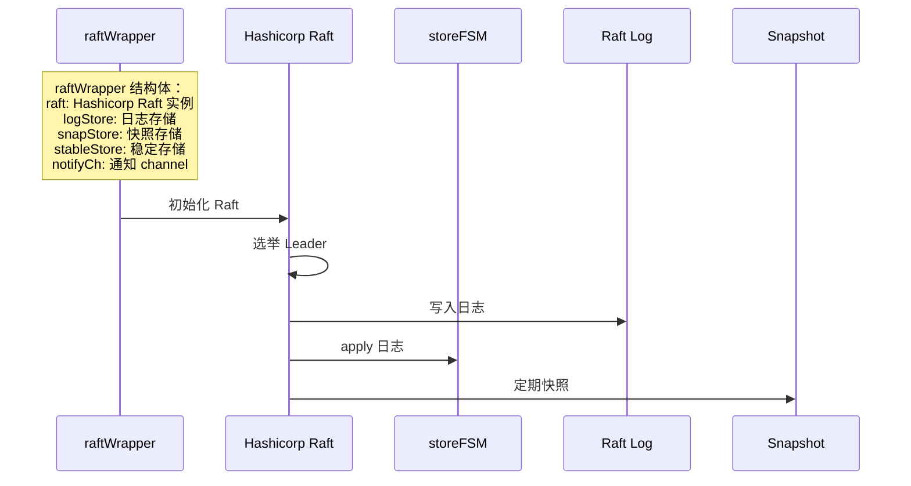
```mermaid
sequenceDiagram
    participant RW as raftWrapper
    participant Raft as Hashicorp Raft
    participant FSM as storeFSM
    participant Log as Raft Log
    participant Snap as Snapshot

    Note over RW: raftWrapper 结构体：<br/>raft: Hashicorp Raft 实例<br/>logStore: 日志存储<br/>snapStore: 快照存储<br/>stableStore: 稳定存储<br/>notifyCh: 通知 channel

    RW->>Raft: 初始化 Raft
    Raft->>Raft: 选举 Leader
    Raft->>Log: 写入日志
    Raft->>FSM: apply 日志
    Raft->>Snap: 定期快照
```

**核心代码**：`app/ts-meta/meta/raft_wrapper.go:37-80`

```go
// 第 37 行：raftWrapper 结构体
type raftWrapper struct {
    ln          net.Listener        // 网络监听器
    raft        *raft.Raft          // Hashicorp Raft 实例
    logStore    raft.LogStore       // 日志存储
    snapStore   raft.SnapshotStore  // 快照存储
    stableStore raft.StableStore    // 稳定存储（key-value）
    notifyCh    chan bool            // Leader 变更通知
}

// 第 46 行：构造函数
func newRaftWrapper(s *Store, ln net.Listener, peers []string) (*raftWrapper, error) {
    rw := &raftWrapper{ln: ln, notifyCh: s.notifyCh}

    // 第 48 行：创建 Raft 配置
    raftConf := rw.raftConfig(s.config)

    // 第 49 行：创建传输层
    trans := newRaftTrans(ln)
    if trans == nil {
        return nil, ErrRaftTransOpenFailed
    }

    // 第 54 行：初始化存储
    var err error
    err = rw.raftStore(s.config)
    if err != nil {
        return nil, err
    }

    // 第 59 行：构建集群配置
    configuration := raft.Configuration{}
    for i := range peers {
        configuration.Servers = append(configuration.Servers,
            raft.Server{ID: raft.ServerID(peers[i]), Address: raft.ServerAddress(peers[i])})
    }

    // 第 65 行：首次启动时引导集群
    hasExistState, _ := raft.HasExistingState(rw.logStore, rw.stableStore, rw.snapStore)
    if !hasExistState && bootFirst(s.config) {
        logger.GetLogger().Info("bootstrap from first peer!!!")
        err = raft.BootstrapCluster(raftConf, rw.logStore, rw.stableStore, rw.snapStore, trans, configuration)
        if err != nil {
            return nil, err
        }
    }

    // 第 73 行：创建 Raft 实例，storeFSM 作为状态机
    rw.raft, err = raft.NewRaft(raftConf, (*storeFSM)(s), rw.logStore, rw.stableStore, rw.snapStore, trans)

    if err != nil {
        return nil, err
    }

    return rw, nil
}
```

**逐行解释**：
- **第 39 行**：`raft` 是 Hashicorp Raft 库的实例，负责共识协议
- **第 40 行**：`logStore` 存储 Raft 日志，用于日志复制和崩溃恢复
- **第 41 行**：`snapStore` 存储快照，用于快速恢复
- **第 42 行**：`stableStore` 存储稳定的 key-value 数据（如当前 term、投票信息）
- **第 43 行**：`notifyCh` 用于通知 Leader 变更
- **第 59-63 行**：构建集群配置，列出所有 peer 的地址
- **第 65-72 行**：首次启动时引导集群（bootstrap），只有第一个节点执行
- **第 73 行**：`raft.NewRaft` 创建 Raft 实例，`(*storeFSM)(s)` 把 Store 转换为 FSM

**通俗解释**：
raftWrapper 就像"公司的管理层"：
- **raft**（Raft 实例）：CEO，负责决策和协调
- **logStore**（日志存储）：会议记录本，记录所有决策
- **snapStore**（快照存储）：定期拍照存档，方便快速恢复
- **stableStore**（稳定存储）：公司营业执照等重要文件
- **notifyCh**（通知 channel）：内部通讯系统，通知 Leader 变更

**具体例子**：

3 节点集群的初始化过程：

```
Node1 启动（第一个节点）：
  Step 1: 创建 raftWrapper
    → raftConf = 配置（选举超时 150ms，心跳 50ms）
    → trans = TCP 传输层
    → logStore = BoltDB（持久化日志）
    → snapStore = 文件系统快照

  Step 2: 引导集群（bootstrap）
    → hasExistState = false（首次启动）
    → bootFirst = true（第一个节点）
    → BootstrapCluster(peers: [Node1, Node2, Node3])
    → 写入初始配置到日志

  Step 3: 创建 Raft 实例
    → raft.NewRaft(conf, storeFSM, logStore, stableStore, snapStore, trans)
    → storeFSM 作为状态机，处理 Raft 日志

Node2 启动：
  → 不执行 bootstrap（hasExistState = false, bootFirst = false）
  → 直接创建 Raft 实例
  → 连接到 Node1，加入集群

Node3 启动：
  → 同 Node2
```

---

## 3. storeFSM 状态机实现

### 3.1 Apply — 应用 Raft 日志

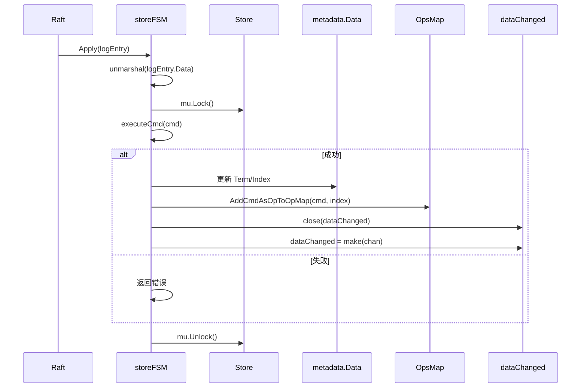
```mermaid
sequenceDiagram
    participant Raft as Raft
    participant FSM as storeFSM
    participant Store as Store
    participant Data as metadata.Data
    participant OpsMap as OpsMap
    participant Chan as dataChanged

    Raft->>FSM: Apply(logEntry)
    FSM->>FSM: unmarshal(logEntry.Data)

    FSM->>Store: mu.Lock()
    FSM->>FSM: executeCmd(cmd)

    alt 成功
        FSM->>Data: 更新 Term/Index
        FSM->>OpsMap: AddCmdAsOpToOpMap(cmd, index)
        FSM->>Chan: close(dataChanged)
        FSM->>Chan: dataChanged = make(chan)
    else 失败
        FSM->>FSM: 返回错误
    end

    FSM->>Store: mu.Unlock()
```

**核心代码**：`app/ts-meta/meta/store_fsm.go:31-110`

```go
// 第 31 行：storeFSM 是基于 Store 定义的新类型，实现 Raft FSM 接口
type storeFSM Store

// 第 33 行：ApplyBatch — 批量应用 Raft 日志
func (fsm *storeFSM) ApplyBatch(logs []*raft.Log) []interface{} {
    s := (*Store)(fsm)
    var dataChanged bool

    // 第 36 行：加锁保护元数据
    s.mu.Lock()
    defer s.mu.Unlock()

    if fsm.UseIncSyncData {
        s.cacheMu.Lock()
        defer s.cacheMu.Unlock()
    }

    ret := make([]interface{}, len(logs))
    for i := range logs {
        switch logs[i].Type {
        case raft.LogCommand:
        default:
            continue  // 只处理 LogCommand 类型
        }

        // 第 50 行：反序列化命令
        var cmd proto2.Command
        if err := proto.Unmarshal(logs[i].Data, &cmd); err != nil {
            panic(fmt.Errorf("cannot marshal command: %s err %+v", string(logs[i].Data), err))
        }

        // 第 56 行：执行命令
        ret[i] = fsm.executeCmd(cmd)

        // 第 57 行：成功时记录到 OpsMap
        if ret[i] == nil {
            dataChanged = true
            fsm.data.AddCmdAsOpToOpMap(cmd, logs[i].Index)
        }
    }

    // 第 66 行：更新 Term 和 Index
    fsm.data.Term = logs[len(logs)-1].Term
    fsm.data.Index = logs[len(logs)-1].Index

    // 第 69 行：通知等待者
    if dataChanged {
        close(s.dataChanged)
        s.dataChanged = make(chan struct{})
    }

    return ret
}

// 第 77 行：Apply — 单条应用 Raft 日志
func (fsm *storeFSM) Apply(l *raft.Log) interface{} {
    // 第 78 行：反序列化命令
    var cmd proto2.Command
    if err := proto.Unmarshal(l.Data, &cmd); err != nil {
        panic(fmt.Errorf("cannot marshal command: %x", l.Data))
    }

    // 第 84 行：加锁
    s := (*Store)(fsm)
    s.mu.Lock()
    defer s.mu.Unlock()

    // 第 92 行：执行命令
    err := fsm.executeCmd(cmd)

    // 第 95 行：更新 Term 和 Index
    fsm.data.Term = l.Term
    fsm.data.Index = l.Index

    if err != nil {
        return err
    }

    // 第 101 行：记录到 OpsMap（用于增量同步）
    fsm.data.AddCmdAsOpToOpMap(cmd, l.Index)

    // 第 106 行：通知等待者
    close(s.dataChanged)
    s.dataChanged = make(chan struct{})

    return err
}
```

**逐行解释**：
- **第 31 行**：`type storeFSM Store` 是新定义类型，不是 `type storeFSM = Store` 这种别名；`storeFSM` 不共享 `Store` 的方法集，所以 FSM 方法需要显式定义在 `*storeFSM` 上
- **类型转换**：`ApplyBatch` 和 `Apply` 内部通过 `s := (*Store)(fsm)` 转回 `*Store`，这样才能使用 `Store` 上的锁、`dataChanged` 等字段和方法
- **第 36 行**：`s.mu.Lock()` 加锁，保护元数据的并发访问
- **第 50 行**：`proto.Unmarshal` 反序列化 Raft 日志中的命令
- **第 56 行**：`fsm.executeCmd(cmd)` 执行具体的元数据操作
- **第 57-60 行**：成功时把命令记录到 OpsMap，用于 MetaClient 的增量同步
- **第 69-72 行**：`close(s.dataChanged)` 唤醒 meta Store 内部 snapshot / SnapshotV2 服务，让它们刷新或发送缓存；MetaClient 通过 Snapshot/SnapshotV2 RPC 主动拉取更新，不是被该 channel 直接通知
- **第 101 行**：`AddCmdAsOpToOpMap` 把命令添加到 OpsMap，保留最近的操作

**通俗解释**：
storeFSM.Apply 就像"执行董事会决议"：
1. **收到决议**（Raft 日志）：董事会（Raft）已经通过了决议
2. **拆封**（反序列化）：把决议从信封里拿出来
3. **加锁**（mu.Lock）：确保同一时间只有一个决议在执行
4. **执行决议**（executeCmd）：按照决议内容修改公司数据
5. **记录备案**（AddCmdAsOpToOpMap）：把决议记录到 OpsMap，方便其他分公司同步
6. **通知各部门**（close(dataChanged)）：告诉所有人"数据更新了"
7. **解锁**（mu.Unlock）：允许下一个决议执行

**具体例子**：

执行 CREATE DATABASE "mydb" 的过程：

```
Step 1: Raft 日志到达
  logEntry = {Type: LogCommand, Data: CreateDatabaseCommand{Database: "mydb"}, Index: 100, Term: 5}

Step 2: 反序列化
  cmd = proto.Unmarshal(logEntry.Data)
  → cmd.Type = CreateDatabaseCommand
  → cmd.Data = {Database: "mydb"}

Step 3: 加锁
  s := (*Store)(fsm)
  s.mu.Lock()

Step 4: 执行命令
  fsm.executeCmd(cmd)
  → 查找 applyFunc[CreateDatabaseCommand]
  → 执行 applyCreateDatabase(fsm, cmd)
  → data.Databases["mydb"] = DatabaseInfo{Name: "mydb", ...}

Step 5: 记录到 OpsMap
  fsm.data.AddCmdAsOpToOpMap(cmd, index=100)
  → OpsMap[100] = Op{com: cmd, nextOpIndex: 0, cacheBytes: [...]}

Step 6: 更新 Term 和 Index
  fsm.data.Term = 5
  fsm.data.Index = 100

Step 7: 通知等待者
  close(s.dataChanged)
  s.dataChanged = make(chan struct{})

Step 8: 解锁
  s.mu.Unlock()
```

**类型语义案例**：

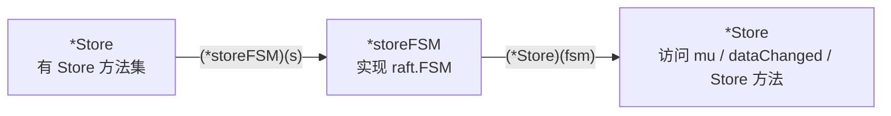
```mermaid
flowchart LR
    A["*Store<br/>有 Store 方法集"] -->|"(*storeFSM)(s)"| B["*storeFSM<br/>实现 raft.FSM"]
    B -->|"(*Store)(fsm)"| C["*Store<br/>访问 mu / dataChanged / Store 方法"]
```

```go
// 这是新类型定义，方法集不会从 Store 自动带过来。
type storeFSM Store

func (fsm *storeFSM) Apply(l *raft.Log) interface{} {
    s := (*Store)(fsm) // 显式转回 *Store 后再访问 Store 行为
    s.mu.Lock()
    defer s.mu.Unlock()
    return fsm.executeCmd(cmd)
}
```

### 3.2 executeCmd — 命令分发

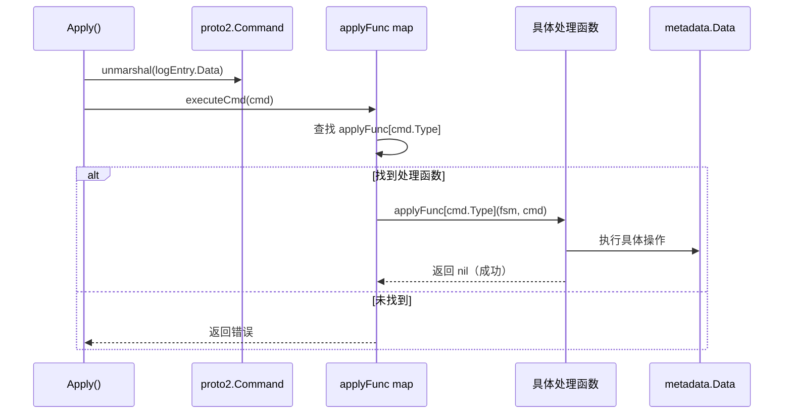
```mermaid
sequenceDiagram
    participant Apply as Apply()
    participant Cmd as proto2.Command
    participant Dispatch as applyFunc map
    participant Handler as 具体处理函数
    participant Data as metadata.Data

    Apply->>Cmd: unmarshal(logEntry.Data)
    Apply->>Dispatch: executeCmd(cmd)
    Dispatch->>Dispatch: 查找 applyFunc[cmd.Type]

    alt 找到处理函数
        Dispatch->>Handler: applyFunc[cmd.Type](fsm, cmd)
        Handler->>Data: 执行具体操作
        Handler-->>Dispatch: 返回 nil（成功）
    else 未找到
        Dispatch-->>Apply: 返回错误
    end
```

**核心代码**：`app/ts-meta/meta/store_fsm.go:112-178`

```go
// 第 112 行：applyFunc — 命令类型 → 处理函数的映射表
var applyFunc = map[proto2.Command_Type]func(fsm *storeFSM, cmd *proto2.Command) interface{}{
    proto2.Command_CreateDatabaseCommand:            applyCreateDatabase,
    proto2.Command_DropDatabaseCommand:              applyDropDatabase,
    proto2.Command_CreateRetentionPolicyCommand:     applyCreateRetentionPolicy,
    proto2.Command_DropRetentionPolicyCommand:       applyDropRetentionPolicy,
    proto2.Command_SetDefaultRetentionPolicyCommand: applySetDefaultRetentionPolicy,
    proto2.Command_UpdateRetentionPolicyCommand:     applyUpdateRetentionPolicy,
    proto2.Command_CreateShardGroupCommand:          applyCreateShardGroup,
    proto2.Command_DeleteShardGroupCommand:          applyDeleteShardGroup,
    proto2.Command_CreateSubscriptionCommand:        applyCreateSubscription,
    proto2.Command_DropSubscriptionCommand:          applyDropSubscription,
    proto2.Command_CreateUserCommand:                applyCreateUser,
    proto2.Command_DropUserCommand:                  applyDropUser,
    proto2.Command_UpdateUserCommand:                applyUpdateUser,
    proto2.Command_SetPrivilegeCommand:              applySetPrivilege,
    proto2.Command_SetAdminPrivilegeCommand:         applySetAdminPrivilege,
    proto2.Command_SetDataCommand:                   applySetData,
    proto2.Command_CreateMetaNodeCommand:            applyCreateMetaNode,
    proto2.Command_DeleteMetaNodeCommand:            applyDeleteMetaNode,
    proto2.Command_SetMetaNodeCommand:               applySetMetaNode,
    proto2.Command_CreateDataNodeCommand:            applyCreateDataNode,
    proto2.Command_CreateSqlNodeCommand:             applyCreateSqlNode,
    proto2.Command_DeleteDataNodeCommand:            applyDeleteDataNode,
    proto2.Command_MarkDatabaseDeleteCommand:        applyMarkDatabaseDelete,
    proto2.Command_MarkRetentionPolicyDeleteCommand: applyMarkRetentionPolicyDelete,
    proto2.Command_CreateMeasurementCommand:         applyCreateMeasurement,
    proto2.Command_ReShardingCommand:                applyReSharding,
    proto2.Command_UpdateSchemaCommand:              applyUpdateSchema,
    proto2.Command_AlterShardKeyCmd:                 applyAlterShardKey,
    proto2.Command_PruneGroupsCommand:               applyPruneGroups,
    proto2.Command_MarkMeasurementDeleteCommand:     applyMarkMeasurementDelete,
    proto2.Command_DropMeasurementCommand:           applyDropMeasurement,
    // ... 共 65 种命令类型
    proto2.Command_RecoverMetaData:                  applyRecoverMetaData,
}
```

**逐行解释**：
- **第 112 行**：`applyFunc` 是一个 map，key 是命令类型，value 是处理函数
- **共 65 种命令类型**，涵盖：数据库、RP、ShardGroup、Measurement、节点、分区、降采样、流、CQ 等所有元数据操作
- **设计意图**：使用 map 而不是 switch-case，O(1) 查找，代码更清晰

**通俗解释**：
applyFunc 就像"公司的部门电话簿"：
- 收到一个请求，先看是哪个部门的事（命令类型）
- 然后打电话给对应部门（处理函数）
- 比如：创建数据库 → 打给"数据库管理部"，创建 RP → 打给"策略管理部"

**具体例子**：

executeCmd 分发 CreateDatabaseCommand 的过程：

```
cmd = {Type: CreateDatabaseCommand, Data: {Database: "mydb"}}

Step 1: 查找处理函数
  handler = applyFunc[CreateDatabaseCommand]
  → handler = applyCreateDatabase

Step 2: 执行处理函数
  applyCreateDatabase(fsm, cmd)
  → 检查 "mydb" 是否已存在
  → 创建 DatabaseInfo
  → 创建默认 RP "autogen"
  → 返回 nil（成功）

Step 3: 记录到 OpsMap
  AddCmdAsOpToOpMap(cmd, index=100)
  → OpsMap[100] = Op{...}
```

**为什么用 map 而不是 switch-case？**

> 在 Go 中，switch-case 和 map 都可以实现"根据类型分发到不同处理函数"的逻辑。为什么 openGemini 选择 map？

**原因 1：O(1) 查找 vs O(n) 分支**
```
switch-case 的实现：
  switch cmd.Type {
  case CreateDatabase:  // 比较 1 次
  case DropDatabase:    // 比较 2 次
  case CreateRP:        // 比较 3 次
  ...
  case Command66:       // 比较 66 次
  }

  最坏情况：66 次比较（O(n)）
  编译器可能优化为跳转表，但不保证

map 的实现：
  handler := applyFunc[cmd.Type]  // 1 次哈希查找
  handler(cmd)

  固定：1 次哈希查找（O(1)）
```

**原因 2：代码更清晰，易于维护**
```
switch-case 方式：
  - 所有 case 挤在一个函数里，几百行代码
  - 添加新命令需要修改这个大函数
  - 容易遗漏 break 或 fallthrough

map 方式：
  - 每个命令类型对应一个独立的处理函数
  - 添加新命令只需要：1) 定义处理函数 2) 在 map 中注册
  - 职责清晰，易于测试
```

**原因 3：支持动态注册（虽然当前未使用）**
```
map 方式天然支持运行时注册新的命令类型：
  applyFunc[newCommandType] = newHandler

switch-case 方式无法在运行时添加新的 case
```

---

## 4. OpsMap — 增量同步机制

### 4.1 OpsMap 结构

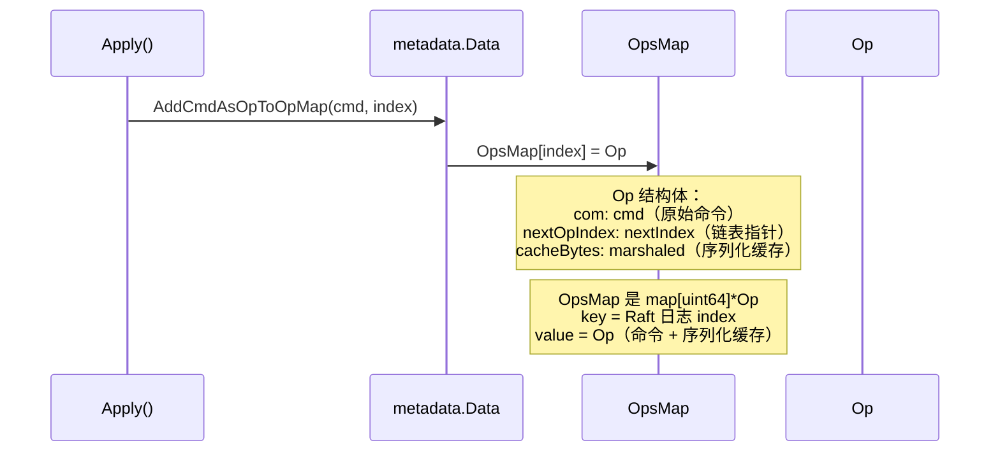
```mermaid
sequenceDiagram
    participant Apply as Apply()
    participant Data as metadata.Data
    participant OpsMap as OpsMap
    participant Op as Op

    Apply->>Data: AddCmdAsOpToOpMap(cmd, index)
    Data->>OpsMap: OpsMap[index] = Op
    Note over OpsMap: Op 结构体：<br/>com: cmd（原始命令）<br/>nextOpIndex: nextIndex（链表指针）<br/>cacheBytes: marshaled（序列化缓存）

    Note over OpsMap: OpsMap 是 map[uint64]*Op<br/>key = Raft 日志 index<br/>value = Op（命令 + 序列化缓存）
```

**核心代码**：`lib/util/lifted/influx/meta/data.go:246-258`

```go
// 第 246 行：Op 结构体 — 单个操作
type Op struct {
    com         *proto2.Command  // 命令（原始 protobuf）
    nextOpIndex uint64           // 下一个操作的 index（用于遍历）
    cacheBytes  []byte           // 序列化缓存（避免重复序列化）
}

// 第 252 行：构造函数
func NewOp(com *proto2.Command, nextOpIndex uint64, cacheBytes []byte) *Op {
    return &Op{
        com:         com,
        nextOpIndex: nextOpIndex,
        cacheBytes:  cacheBytes,
    }
}
```

**逐行解释**：
- **第 247 行**：`com` 是原始的 protobuf 命令，用于序列化传输
- **第 248 行**：`nextOpIndex` 指向下一个操作的 index，形成链表结构
- **第 249 行**：`cacheBytes` 是序列化后的字节，避免重复序列化

**通俗解释**：
OpsMap 就像"操作日志缓存"，记录了最近的所有元数据操作：
- **com**（命令）：操作的原始内容（比如"创建数据库 mydb"）
- **nextOpIndex**（下一个操作的 index）：形成链表，方便按顺序遍历
- **cacheBytes**（序列化缓存）：已经序列化好的字节，避免重复序列化

**具体例子**：

OpsMap 的链表结构：

```
OpsMap = {
  100: Op{com: CreateDatabase("mydb"), nextOpIndex: 101, cacheBytes: [...]},
  101: Op{com: CreateRP("mydb", "autogen"), nextOpIndex: 102, cacheBytes: [...]},
  102: Op{com: CreateShardGroup("mydb", "autogen", 1), nextOpIndex: 103, cacheBytes: [...]},
  103: Op{com: CreateMeasurement("mydb", "autogen", "cpu"), nextOpIndex: 0, cacheBytes: [...]}
}

链表结构：
  OpsMap[100] → OpsMap[101] → OpsMap[102] → OpsMap[103] → nil

MetaClient 请求 "从 index=101 开始的所有操作"：
  → 从 OpsMap[101] 开始
  → 沿着 nextOpIndex 链表遍历
  → 返回 [CreateRP, CreateShardGroup, CreateMeasurement]
```

### 4.2 ClearOpsMapV2 — 清理旧操作

**核心代码**：`lib/util/lifted/influx/meta/data.go:284-299`

```go
// 第 284 行：清理 OpsMap 中的旧操作
func (data *Data) ClearOpsMapV2(minAliveNodeTmpIndex uint64) {
    data.opsMapMu.Lock()
    defer data.opsMapMu.Unlock()

    // 第 287 行：如果 OpsMap 不大，不清理
    if len(data.OpsMap) <= OPMAPLIMITCAP {
        return
    }

    // 第 291 行：安全检查
    if minAliveNodeTmpIndex == math.MaxUint64 || data.OpsMapMinIndex >= minAliveNodeTmpIndex {
        return
    }

    // 第 297 行：遍历并删除旧操作
    var tmpOp *Op
    var next uint64
    var start uint64
    for start = data.OpsMapMinIndex; start < minAliveNodeTmpIndex && start != 0; {
        tmpOp, _ = data.OpsMap[start]
        next = tmpOp.nextOpIndex
        delete(data.OpsMap, start)  // 删除旧操作
        start = next
    }

    // 更新索引：根据 next 是否为 0 决定重置还是前进
    if next == 0 {
        data.OpsMapMinIndex = math.MaxUint64   // OpsMap 已空，重置为最大值
        data.OpsMapMaxIndex = 0
        data.OpsToMarshalIndex = 0
    } else {
        data.OpsMapMinIndex = next             // 更新最小 index
        if data.OpsToMarshalIndex < data.OpsMapMinIndex {
            data.OpsToMarshalIndex = data.OpsMapMinIndex  // 同步推进待序列化 index
        }
    }
}
```

**逐行解释**：
- **第 287 行**：`OPMAPLIMITCAP` 是清理触发阈值，实际值为 30；它不是硬上限，超过 30 后才尝试按 `minAliveNodeTmpIndex` 删除旧操作
- **第 291 行**：`minAliveNodeTmpIndex` 是所有存活节点中最小的 index，比它旧的操作可以删除
- **第 297-303 行**：遍历链表，删除旧操作，更新 OpsMapMinIndex
- **设计意图**：保留最近的操作供 MetaClient 增量同步，清理旧操作释放内存

**通俗解释**：
ClearOpsMapV2 就像"清理过期快递单"：
- 快递单（OpsMap）记录了所有快递操作
- 但不能无限保留，否则内存爆炸
- 清理规则：所有快递站（节点）都确认收到的快递单，就可以删了
- `minAliveNodeTmpIndex` 是最慢的快递站确认的编号
- 比它旧的快递单，所有快递站都确认了，可以安全删除

**具体例子**：

清理 OpsMap 的过程：

```
OpsMap = {
  100: Op{...}, 101: Op{...}, 102: Op{...}, ..., 200: Op{...}
}
OpsMapMinIndex = 100

各节点的 index：
  Node1: 180
  Node2: 175
  Node3: 170  ← 最慢的节点

minAliveNodeTmpIndex = 170

清理过程：
  → 删除 OpsMap[100] ~ OpsMap[169]（共 70 个操作）
  → 保留 OpsMap[170] ~ OpsMap[200]（共 31 个操作）
  → 更新 OpsMapMinIndex = 170

清理前后对比：
  清理前：101 个操作，占用内存约 10MB
  清理后：31 个操作，占用内存约 3MB
```

**为什么需要 OpsMap？直接用 Raft 日志不行吗？**

> Raft 日志本身就记录了所有操作，为什么还要额外维护一个 OpsMap？

**原因 1：Raft 日志会压缩，旧日志会被删除**

```
Raft 日志的生命周期：
  写入 → 复制到多数节点 → 提交 → 应用到状态机 → 可能被压缩/删除

问题：
  如果 MetaClient 的 index 落后太多（比如网络中断 10 分钟）
  需要的 Raft 日志可能已经被压缩了
  → 无法做增量同步，只能全量同步

OpsMap 的作用：
  保留尚未被所有存活节点确认的操作；OPMAPLIMITCAP=30 只决定何时触发清理
  即使 Raft 日志被压缩，OpsMap 中仍有这些操作
  → MetaClient 可以增量同步，不需要全量
```

**原因 2：OpsMap 缓存了序列化结果**

```
Raft 日志中的操作是原始的 protobuf 格式
发送给 MetaClient 时需要序列化为 bytes

如果没有 OpsMap：
  每次 MetaClient 请求增量同步
  → 遍历 Raft 日志
  → 对每个操作调用 marshal()
  → 发送

有了 OpsMap：
  操作应用时就缓存了 marshal() 结果（cacheBytes 字段）
  MetaClient 请求时直接读取缓存
  → 避免重复序列化
```

**原因 3：链表结构支持高效的范围查询**

```
OpsMap 是 map[uint64]*Op，但 Op 之间通过 nextOpIndex 形成链表：
  Op[100] → Op[101] → Op[102] → ... → Op[200]

MetaClient 请求 "从 index=150 开始的所有操作"：
  1. 从 OpsMap[150] 开始
  2. 沿着 nextOpIndex 链表遍历
  3. 直到链表末尾

这种结构比遍历整个 map 更高效（只需要遍历需要的部分）
```

---

## 5. MetaClient 更新机制

### 5.1 pollForUpdates — V1 全量同步

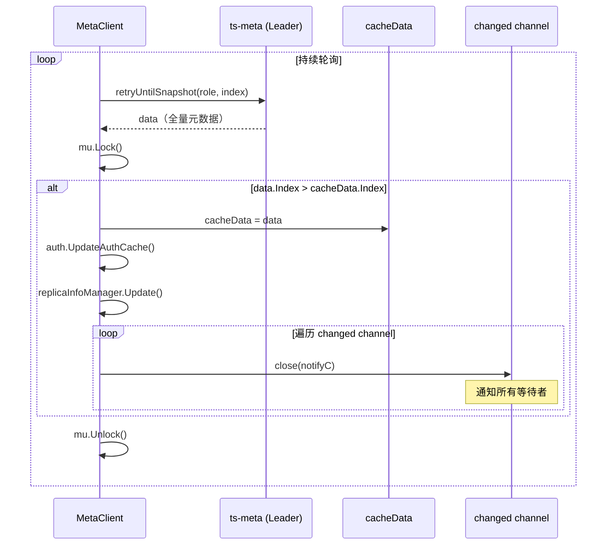
```mermaid
sequenceDiagram
    participant Client as MetaClient
    participant Meta as ts-meta (Leader)
    participant Cache as cacheData
    participant Changed as changed channel

    loop 持续轮询
        Client->>Meta: retryUntilSnapshot(role, index)
        Meta-->>Client: data（全量元数据）

        Client->>Client: mu.Lock()
        alt data.Index > cacheData.Index
            Client->>Cache: cacheData = data
            Client->>Client: auth.UpdateAuthCache()
            Client->>Client: replicaInfoManager.Update()

            loop 遍历 changed channel
                Client->>Changed: close(notifyC)
                Note over Changed: 通知所有等待者
            end
        end
        Client->>Client: mu.Unlock()
    end
```

**核心代码**：`lib/metaclient/meta_client_impl.go:2413-2436`

```go
// 第 2413 行：V1 全量同步
func (c *Client) pollForUpdates(role Role) {
    for {
        // 第 2415 行：从 ts-meta 获取全量元数据
        data := c.retryUntilSnapshot(role, c.index())
        if data == nil {
            c.logger.Error("client has been closed")
            return  // 客户端已关闭
        }

        // 第 2423 行：加锁更新缓存
        c.mu.Lock()
        idx := c.cacheData.Index
        if idx < data.Index {
            c.cacheData = data                              // 更新缓存
            c.auth.UpdateAuthCache(data.Users)              // 更新认证缓存
            c.replicaInfoManager.Update(data, c.nodeID, role)  // 更新副本信息

            // 第 2429 行：通知所有等待者
            for len(c.changed) > 0 {
                notifyC := <-c.changed
                close(notifyC)  // 关闭 channel，通知等待者
            }
        }
        c.mu.Unlock()
    }
}
```

**逐行解释**：
- **第 2415 行**：`retryUntilSnapshot` 从 ts-meta 获取全量元数据，包含重试逻辑
- **第 2425 行**：比较 index，只有新数据才更新
- **第 2426 行**：`cacheData = data` 替换整个缓存
- **第 2429-2432 行**：`changed` 是一个 chan-of-chan 模式，通知所有等待的 goroutine

**通俗解释**：
pollForUpdates V1 就像"每天去总部拿最新通讯录"：
- 每隔一段时间，去总部（ts-meta）拿一份完整的通讯录（全量元数据）
- 如果通讯录有更新（index 变大），就替换本地的旧版本
- 然后通知所有同事"通讯录更新了"

**具体例子**：

V1 全量同步的过程：

```
MetaClient 的 index = 100

循环 1：
  → retryUntilSnapshot() 返回 data{Index: 100}
  → 100 < 100？否，不更新

循环 2：
  → retryUntilSnapshot() 返回 data{Index: 150}
  → 100 < 150？是，更新
  → cacheData = data（替换整个缓存）
  → auth.UpdateAuthCache(data.Users)（更新认证缓存）
  → 通知所有等待者：close(notifyC)

循环 3：
  → retryUntilSnapshot() 返回 data{Index: 150}
  → 150 < 150？否，不更新

循环 4：
  → retryUntilSnapshot() 返回 data{Index: 200}
  → 150 < 200？是，更新
  → cacheData = data
  → 通知所有等待者
```

### 5.2 pollForUpdatesV2 — V2 增量同步

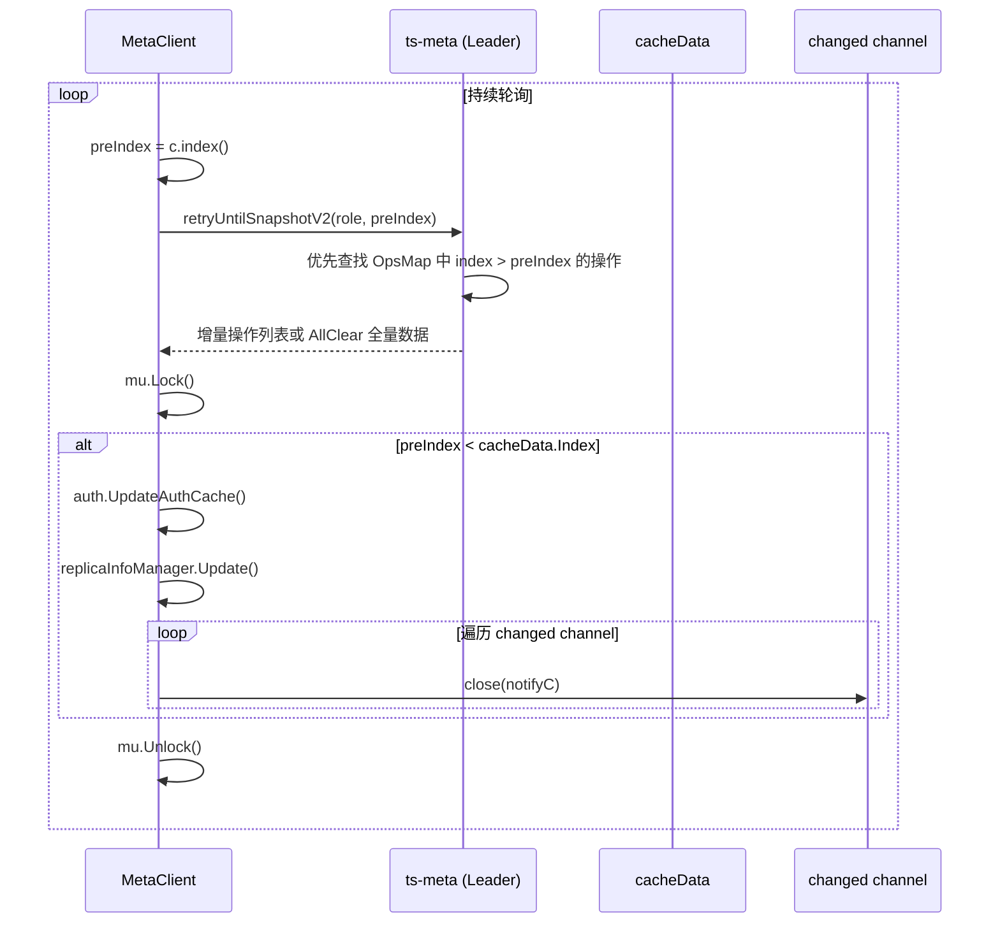
```mermaid
sequenceDiagram
    participant Client as MetaClient
    participant Meta as ts-meta (Leader)
    participant Cache as cacheData
    participant Changed as changed channel

    loop 持续轮询
        Client->>Client: preIndex = c.index()
        Client->>Meta: retryUntilSnapshotV2(role, preIndex)
        Meta->>Meta: 优先查找 OpsMap 中 index > preIndex 的操作
        Meta-->>Client: 增量操作列表或 AllClear 全量数据

        Client->>Client: mu.Lock()
        alt preIndex < cacheData.Index
            Client->>Client: auth.UpdateAuthCache()
            Client->>Client: replicaInfoManager.Update()

            loop 遍历 changed channel
                Client->>Changed: close(notifyC)
            end
        end
        Client->>Client: mu.Unlock()
    end
```

**核心代码**：`lib/metaclient/meta_client_impl.go:2438-2460`

```go
// 第 2438 行：V2 增量同步
func (c *Client) pollForUpdatesV2(role Role) {
    for {
        // 第 2440 行：记录当前 index
        preIndex := c.index()

        // 第 2441 行：从 ts-meta 获取增量操作
        err := c.retryUntilSnapshotV2(role, preIndex)
        if err != nil {
            c.logger.Error("client has been closed:", zap.String("err:", err.Error()))
            return  // 客户端已关闭
        }

        // 第 2449 行：加锁更新缓存
        c.mu.Lock()
        if preIndex < c.cacheData.Index {
            c.auth.UpdateAuthCache(c.cacheData.Users)
            c.replicaInfoManager.Update(c.cacheData, c.nodeID, role)

            // 第 2453 行：通知所有等待者
            for len(c.changed) > 0 {
                notifyC := <-c.changed
                close(notifyC)
            }
        }
        c.mu.Unlock()
    }
}
```

**逐行解释**：
- **第 2440 行**：`preIndex` 记录当前 index，用于增量同步
- **第 2441 行**：`retryUntilSnapshotV2` 优先获取 index > preIndex 的操作；如果服务端返回 AllClear，则应用全量数据兜底
- **第 2450 行**：比较 index，只有新数据才更新
- **设计意图**：V2 增量同步比 V1 全量同步更高效，减少数据传输量

**通俗解释**：
pollForUpdates V2 就像"只拿今天的快递"：
- V1 是每天去总部拿完整通讯录（全量同步），数据量大
- V2 是优先只拿"你还没有的快递"（增量同步），但如果旧快递单已被清理，就重新拿一份完整通讯录（全量兜底）
- `preIndex` 是你上次拿到的快递编号
- `retryUntilSnapshotV2` 只返回编号 > preIndex 的操作

**具体例子**：

V2 增量同步的过程：

```
MetaClient 的 index = 100

循环 1：
  → preIndex = 100
  → retryUntilSnapshotV2(role, preIndex=100)
  → ts-meta 优先查找 OpsMap 中 index > 100 的操作
  → 返回 [Op{101: CreateRP}, Op{102: CreateSG}, Op{103: CreateMst}]
  → MetaClient 应用这些操作，更新本地缓存
  → 通知所有等待者

兜底场景：
  → preIndex = 10，但 ts-meta 的 OpsMapMinIndex = 100
  → retryUntilSnapshotV2 收到 AllClear DataOps
  → MetaClient 用 DataOps.Data 替换 cacheData

循环 2：
  → preIndex = 103
  → retryUntilSnapshotV2(role, preIndex=103)
  → ts-meta 查找 OpsMap 中 index > 103 的操作
  → 返回 []（没有新操作）
  → 不更新

循环 3：
  → preIndex = 103
  → retryUntilSnapshotV2(role, preIndex=103)
  → ts-meta 查找 OpsMap 中 index > 103 的操作
  → 返回 [Op{104: CreateShardGroup}]
  → MetaClient 应用，更新本地缓存
```

---

## 6. serveSnapshot V1/V2

### 6.1 快照服务

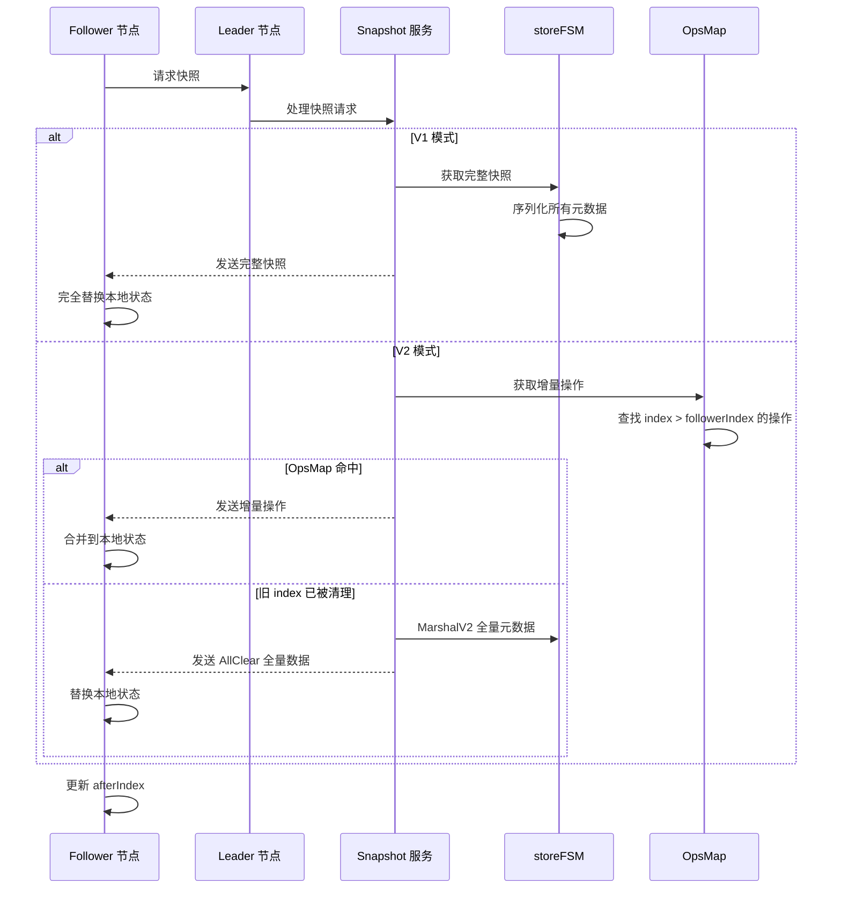
```mermaid
sequenceDiagram
    participant Follower as Follower 节点
    participant Leader as Leader 节点
    participant Snap as Snapshot 服务
    participant FSM as storeFSM
    participant OpsMap as OpsMap

    Follower->>Leader: 请求快照
    Leader->>Snap: 处理快照请求

    alt V1 模式
        Snap->>FSM: 获取完整快照
        FSM->>FSM: 序列化所有元数据
        Snap-->>Follower: 发送完整快照
        Follower->>Follower: 完全替换本地状态
    else V2 模式
        Snap->>OpsMap: 获取增量操作
        OpsMap->>OpsMap: 查找 index > followerIndex 的操作
        alt OpsMap 命中
            Snap-->>Follower: 发送增量操作
            Follower->>Follower: 合并到本地状态
        else 旧 index 已被清理
            Snap->>FSM: MarshalV2 全量元数据
            Snap-->>Follower: 发送 AllClear 全量数据
            Follower->>Follower: 替换本地状态
        end
    end

    Follower->>Follower: 更新 afterIndex
```

**通俗解释**：
- **V1 模式**：发送完整快照，Follower 完全替换本地状态
- **V2 模式**：增量优先；如果 OpsMap 中仍能覆盖 followerIndex，只发送变更部分，Follower 合并到本地状态
- **V2 兜底**：如果 followerIndex 早于 `OpsMapMinIndex`，说明增量链已经被清理，`getSnapshotV2` 会返回 `AllClear` 全量数据，让 Follower 替换本地状态
- V2 更高效，减少数据传输量
- 适用于大规模集群，元数据量大的场景

**核心代码**：`app/ts-meta/meta/store.go:980-998`

```go
// 第 980 行：serveSnapshot — V1 快照服务（全量同步）
func (s *Store) serveSnapshot() {
    defer s.wg.Done()
    checkTime := time.After(updateCacheInterval)          // 定时检查（100ms）
    for {
        select {
        case <-s.dataChanged:                             // 数据变更通知
            if s.index() > s.cacheIndex() {               // 有新数据
                s.updateCacheData()                       // 更新缓存（全量序列化）
            }
        case <-s.closing:
            return
        case <-checkTime:                                 // 定时检查
            if s.index() > s.cacheIndex() {
                s.updateCacheData()
            }
            checkTime = time.After(updateCacheInterval)
        }
    }
}
```

**逐行解释**：
- **第 985 行**：`s.dataChanged` 是 FSM apply 后 close 的 channel，通知快照服务有新数据
- **第 986 行**：`s.index() > s.cacheIndex()` 比较当前 index 和缓存 index，只有新数据才更新
- **第 987 行**：`s.updateCacheData()` 将整个元数据序列化为 bytes，供 MetaClient 拉取

**核心代码**：`app/ts-meta/meta/store.go:1017-1036`

```go
// 第 1017 行：serveSnapshotV2 — V2 快照服务（增量同步）
func (s *Store) serveSnapshotV2() {
    defer s.wg.Done()
    checkTime := time.After(updateCacheInterval)
    for {
        select {
        case _, ok := <-s.dataChanged:                    // 数据变更通知
            if ok {
                logger.GetLogger().Error("serveSnapshotV2 dataChanged err")
            }
            if s.index() > s.cacheIndex() {
                s.UpdateCacheDataV2()                     // 增量更新（只更新 OpsMap 缓存）
            }
        case <-s.closing:
            return
        case <-checkTime:
            s.UpdateCacheDataV2()                         // 定时更新 OpsMap 缓存
            checkTime = time.After(updateCacheInterval)
        }
    }
}
```

**逐行解释**：
- **第 1026 行**：`s.UpdateCacheDataV2()` 主要更新 OpsMap 的缓存 bytes，为增量同步做准备
- **设计意图**：V2 模式优先发送 OpsMap 中的增量操作；当增量链不可用时，`getSnapshotV2` 会用 `MarshalV2()` 生成全量数据兜底

**核心代码**：`app/ts-meta/meta/store.go:1000-1015`

```go
// 第 1000 行：ClearOpsMap — 定期清理 OpsMap 中的旧操作
func (s *Store) ClearOpsMap() {
    defer s.wg.Done()
    ticker := time.NewTicker(updateCacheInterval * 10)    // 每 1 秒检查一次
    defer ticker.Stop()
    for {
        select {
        case <-s.closing:
            return
        case <-ticker.C:
            s.mu.RLock()
            minAliveNodeTmpIndex := s.data.GetMinAliveNodeTmpIndex()  // 获取所有存活节点中最小的 index
            s.mu.RUnlock()
            s.data.ClearOpsMapV2(minAliveNodeTmpIndex)    // 清理比最小 index 旧的操作
        }
    }
}
```

**逐行解释**：
- **第 1010 行**：`GetMinAliveNodeTmpIndex()` 遍历所有存活的 sqlNode 和 dataNode，找到最小的 index
- **第 1012 行**：`ClearOpsMapV2(minAliveNodeTmpIndex)` 删除 index < minAliveNodeTmpIndex 的操作
- **设计意图**：所有节点都已消费的操作可以安全删除，释放内存

**OpsMap 清理的两层调用关系**：

```
Store.ClearOpsMap()                    ← Store 级：定时器 + 获取 minAliveNodeTmpIndex
  └─ s.data.ClearOpsMapV2(minIndex)   ← Data 级：实际遍历链表删除旧操作

调用链：
  Store.Start() 启动时
    → go s.ClearOpsMap()              // 每 1 秒执行一次
      → s.data.GetMinAliveNodeTmpIndex()  // 计算所有存活节点的最小 index
      → s.data.ClearOpsMapV2(minIndex)    // 删除比最小 index 旧的操作
```

**通俗解释**：
- **Store 级**（`Store.ClearOpsMap`）：定时巡检员，每 1 秒检查一次，计算"所有快递站中最新的确认编号"
- **Data 级**（`Data.ClearOpsMapV2`）：实际清理员，根据巡检员提供的编号，删除所有已确认的旧快递单
- 两层分离的设计意图：Store 负责调度和全局信息收集，Data 负责实际的数据操作，职责清晰

**具体例子**：

V1 vs V2 快照的对比：

```
场景：Follower 的 afterIndex = 100，Leader 的 currentIndex = 150

V1 快照（全量）：
  → Leader 序列化所有元数据（可能 10MB）
  → 发送给 Follower
  → Follower 完全替换本地状态
  → 耗时：~1 秒

V2 快照（增量）：
  → Leader 查找 OpsMap 中 index > 100 的操作
  → 找到 50 个操作（约 50KB）
  → 发送给 Follower
  → Follower 合并到本地状态
  → 耗时：~10ms

V2 快照（全量兜底）：
  → Follower afterIndex = 10
  → Leader 的 OpsMapMinIndex = 100，旧增量已被清理
  → GetOps(10) 返回 AllClear
  → Leader MarshalV2 全量元数据并放入 DataOps.Data
  → Follower 替换本地 cacheData

性能对比：
  V1：10MB 数据，1 秒
  V2：50KB 数据，10 毫秒
  → V2 比 V1 快 100 倍
```

### 6.2 核心代码：OpsMap — 增量操作缓存

**代码位置**：`lib/util/lifted/influx/meta/data.go:227` 中的 OpsMap 字段定义（`Data` 结构体上的 `map[uint64]*Op` 字段）

```go
// OpsMap 是 Data 结构体上的字段，类型为 map[uint64]*Op
// 定义位置：lib/util/lifted/influx/meta/data.go:227
// OpsMap           map[uint64]*Op   // key = Raft 日志 index，value = Op（命令 + 序列化缓存）
// OpsMapMinIndex   uint64           // OpsMap 中最小的 index
// OpsMapMaxIndex   uint64           // OpsMap 中最大的 index
// OpsToMarshalIndex uint64          // 待序列化的 index
// opsMapMu         sync.RWMutex     // OpsMap 的读写锁
```

**具体例子**：

V2 快照的增量同步流程：

```
Follower 的 afterIndex = 100
Leader 的 currentIndex = 150

V2 快照过程：
  → OpsMap 查找 index > 100 的操作
  → 找到操作 101~150（共 50 个）
  → 序列化并发送给 Follower
  → Follower 合并到本地状态

对比 V1：
  → 序列化所有元数据（可能几 MB）
  → 发送给 Follower
  → Follower 完全替换本地状态
```

**通俗解释**：
OpsMap 就像"操作日志缓存"。V2 快照时，只需要发送 Follower 缺少的操作，而不是全部数据，大大减少了数据传输量。

---

## 7. Leadership 管理

### 7.1 Leader 选举

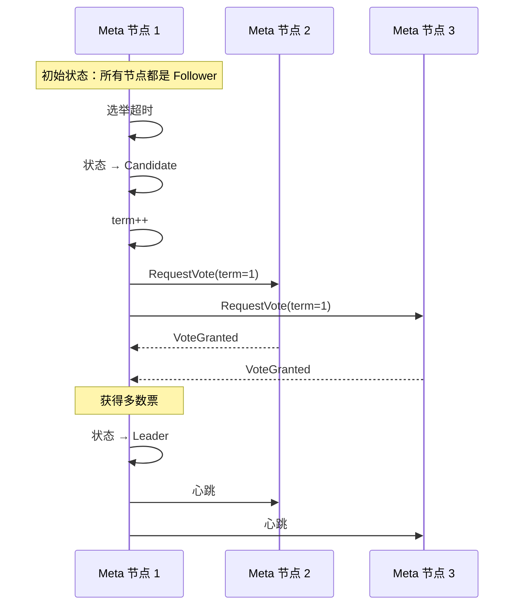
```mermaid
sequenceDiagram
    participant Node1 as Meta 节点 1
    participant Node2 as Meta 节点 2
    participant Node3 as Meta 节点 3

    Note over Node1: 初始状态：所有节点都是 Follower

    Node1->>Node1: 选举超时
    Node1->>Node1: 状态 → Candidate
    Node1->>Node1: term++
    Node1->>Node2: RequestVote(term=1)
    Node1->>Node3: RequestVote(term=1)

    Node2-->>Node1: VoteGranted
    Node3-->>Node1: VoteGranted

    Note over Node1: 获得多数票
    Node1->>Node1: 状态 → Leader
    Node1->>Node2: 心跳
    Node1->>Node3: 心跳
```

**通俗解释**：
- **选举触发**：Follower 超时没收到 Leader 心跳，发起选举
- **Candidate**：节点自荐为 Leader，term++（任期号递增）
- **投票**：其他节点投票，获得多数票成为 Leader
- **心跳**：Leader 定期发送心跳，维持权威

**核心代码**：`lib/config/meta.go:277-290`

```go
// 第 277 行：BuildRaft — 构建 Raft 配置
func (c *Meta) BuildRaft() *raft.Config {
    conf := raft.DefaultConfig()                          // 使用默认配置作为基础
    conf.HeartbeatTimeout = time.Duration(c.HeartbeatTimeout)   // 心跳超时（默认 1000ms）
    conf.ElectionTimeout = time.Duration(c.ElectionTimeout)     // 选举超时（默认 1000ms）
    conf.LeaderLeaseTimeout = time.Duration(c.LeaderLeaseTimeout) // Leader 租约超时
    conf.CommitTimeout = time.Duration(c.CommitTimeout)         // 提交超时
    conf.ShutdownOnRemove = false                         // 移除节点时不关闭
    conf.BatchApplyCh = c.BatchApplyCh                    // 批量 apply 开关
    return conf
}
```

**逐行解释**：
- **第 278 行**：`raft.DefaultConfig()` 使用 Hashicorp Raft 的默认配置
- **第 282 行**：`HeartbeatTimeout` 心跳超时，Leader 发送心跳的间隔，Follower 超过此时间没收到心跳就触发选举
- **第 283 行**：`ElectionTimeout` 选举超时，Follower 等待多久没收到心跳后发起选举
- **第 284 行**：`LeaderLeaseTimeout` 是 Hashicorp Raft 的 Leader 租约超时配置；当前读路径不应因此被描述成每次读取都执行严格读屏障
- **第 285 行**：`CommitTimeout` 提交超时，Leader 等待多数派 ACK 的超时时间

**核心代码**：`app/ts-meta/meta/store.go:474-526`

```go
// 第 474 行：checkLeaderChanged — 监听 Leader 变更
func (s *Store) checkLeaderChanged() {
    defer s.wg.Done()
    lastState := s.raft.State()                           // 记录初始状态
    for {
        select {
        case v := <-s.notifyCh:                           // 接收 Leader 变更通知
            if v {                                        // v=true 表示成为 Leader
                s.stepDown = make(chan struct{})
                if globalService.clusterManager != nil {
                    globalService.msm.Start()             // 启动迁移状态机
                    globalService.balanceManager.Start()  // 启动负载均衡
                    globalService.clusterManager.Start()  // 启动集群管理器
                }
                s.deleteWg.Add(3)
                go s.checkDelete(DeleteDatabase)          // 启动数据库删除检查
                go s.checkDelete(DeleteRp)                // 启动 RP 删除检查
                go s.checkDelete(DeleteMeasurement)       // 启动 Measurement 删除检查
                continue
            }
            // v=false 表示不再是 Leader（降级为 Follower）
            close(s.stepDown)                             // 通知所有依赖 Leader 的 goroutine 停止
            if globalService.clusterManager != nil {
                globalService.clusterManager.Stop()       // 停止集群管理器
                globalService.balanceManager.Stop()       // 停止负载均衡
            }
            s.deleteWg.Wait()                             // 等待删除检查完成
        case <-s.closing:
            return
        }
    }
}
```

**逐行解释**：
- **第 483 行**：`s.notifyCh` 是 Hashicorp Raft 的 `NotifyCh`，当 Leader 状态变化时会收到 bool 值
- **第 486 行**：`v=true` 表示本节点成为 Leader，需要启动各种管理器
- **第 488-493 行**：成为 Leader 后，启动迁移状态机、负载均衡器、集群管理器等
- **第 505 行**：`close(s.stepDown)` 通知所有等待的 goroutine "我不再是 Leader 了"
- **第 507-510 行**：降级为 Follower 后，停止所有 Leader 专属的管理器

**核心代码**：`app/ts-meta/meta/raft_wrapper.go:90-95`

```go
// 第 90 行：raftConfig — 构建 Raft 配置
func (r *raftWrapper) raftConfig(c *config.Meta) *raft.Config {
    conf := c.BuildRaft()                                 // 从 Meta 配置构建 Raft 配置
    conf.LocalID = raft.ServerID(c.CombineDomain(r.ln.Addr().String()))  // 设置本节点 ID
    conf.NotifyCh = r.notifyCh                            // 设置 Leader 变更通知 channel
    return conf
}
```

**逐行解释**：
- **第 91 行**：`c.BuildRaft()` 调用上面的配置构建函数
- **第 92 行**：`LocalID` 设置本节点的唯一标识，用于 Raft 协议中的节点识别
- **第 93 行**：`NotifyCh` 设置通知 channel，Hashicorp Raft 会在 Leader 状态变化时向此 channel 发送 bool 值

**核心代码**：`lib/raftconn/node.go:108-159`（ts-store 侧的 Raft 节点启动与选举配置）

```go
// 第 108 行：StartNode — 创建并启动 ts-store 侧的 Raft 节点
func StartNode(store *raftlog.RaftDiskStorage, nodeId uint64, database string, id uint64,
    peers []raft.Peer,
    client metaclient.MetaClient,
    transPeers map[uint32]uint64) *RaftNode {

    // 第 113 行：构建 Raft 配置
    c := raft.Config{
        ID:              id,                        // Raft 节点 ID（ptId + 1）
        ElectionTick:    config.ElectionTick,        // 选举超时 tick 数（默认 10）
        HeartbeatTick:   config.HeartbeatTick,       // 心跳间隔 tick 数（默认 1）
        Storage:         store,                      // 持久化存储
        MaxSizePerMsg:   maxSizePerMsg,              // 单条消息最大 4096 字节
        MaxInflightMsgs: maxInflightMsgs,            // 最大在途消息 256 条
        Logger:          logger.GetSrLogger(),
    }

    // 第 132 行：创建 RaftNode 实例
    n := &RaftNode{
        startTime: time.Now(),
        Cfg:       &c,
        Store:     store,
        RaftPeers: peers,
        proposeC:    make(chan []byte, 1),
        confChangeC: make(chan raftpb.ConfChange),
        commitC:     make(chan *Commit, config.RaftMsgCacheSize),
        nodeId:      nodeId,
        database:    database,
        ptId:        GetPtId(id),
        id:          id,
        peers:       transPeers,
        tick:        time.NewTicker(tickInterval),   // 400ms 定时器
        ...
    }
    return n
}
```

**逐行解释**：
- **第 115 行**：`ElectionTick` 是选举超时 tick 数。如果 Follower 在 ElectionTick 个 tick 内没收到心跳，就发起选举
- **第 116 行**：`HeartbeatTick` 是心跳间隔 tick 数。Leader 每 HeartbeatTick 个 tick 发送一次心跳
- **第 147 行**：`tickInterval = 400ms`，所以选举超时 = ElectionTick × 400ms = 10 × 400ms = 4 秒
- **设计意图**：ts-store 侧使用 etcd Raft（不是 Hashicorp Raft），用于数据分区级别的 Raft 共识

**核心代码**：`lib/raftconn/node.go:316-385`（Raft 消息处理与 Leader 状态检测）

```go
// 第 316 行：serveChannels — 处理 Raft 消息的主循环
func (n *RaftNode) serveChannels() {
    var leader bool

    for {
        select {
        case <-n.ctx.Done():
            n.node.Stop()
            return
        case <-n.tick.C:
            n.node.Tick()                              // 驱动 Raft 时钟

        case rd := <-n.node.Ready():
            // 第 330 行：检测 Leader 状态变化
            if rd.SoftState != nil {
                leader = rd.RaftState == raft.StateLeader  // 判断是否成为 Leader
            }

            if leader {
                // Leader 先发送消息（与磁盘写入并行）
                for i := range n.processMessages(rd.Messages) {
                    n.Messages <- &rd.Messages[i]
                }
            }

            // 第 344 行：写入 WAL（持久化日志）
            n.SaveToStorage(&rd.HardState, rd.Entries, &rd.Snapshot)

            // 第 365 行：发布已提交的日志条目
            ok := n.PublishEntries(n.entriesToApply(rd.CommittedEntries))
            if !ok {
                n.Stop()
                return
            }

            if !leader {
                // Follower 在持久化后再发送消息
                for i := range n.processMessages(rd.Messages) {
                    n.Messages <- &rd.Messages[i]
                }
            }

            n.node.Advance()                           // 通知 Raft 已处理完本轮 Ready
        }
    }
}
```

**逐行解释**：
- **第 326 行**：`n.node.Tick()` 驱动 Raft 内部时钟，每次 tick 会检查选举超时和心跳超时
- **第 330-332 行**：`rd.SoftState` 包含角色变化信息，`rd.RaftState == raft.StateLeader` 表示本节点成为 Leader
- **第 334-341 行**：Leader 优先发送消息（与 WAL 写入并行），提高吞吐量
- **第 344 行**：`SaveToStorage` 将日志和快照写入磁盘，确保持久化
- **第 365 行**：`PublishEntries` 将已提交的日志发送到 commitC，由上层应用到状态机
- **第 374-380 行**：Follower 在持久化完成后再发送消息，保证日志已安全存储

**具体例子**：

3 节点集群的 Leader 选举过程：

```
初始状态：所有节点都是 Follower，term = 0

Step 1: Node1 选举超时（150ms 没收到心跳）
  → Node1 状态变为 Candidate
  → Node1.term = 1
  → Node1 给自己投票
  → Node1 发送 RequestVote(term=1) 给 Node2, Node3

Step 2: Node2 收到 RequestVote
  → 检查 term=1 > 自己的 term=0 → 同意投票
  → Node2 发送 VoteGranted 给 Node1

Step 3: Node3 收到 RequestVote
  → 检查 term=1 > 自己的 term=0 → 同意投票
  → Node3 发送 VoteGranted 给 Node1

Step 4: Node1 获得多数票（2/3）
  → Node1 状态变为 Leader
  → Node1 开始发送心跳（每 50ms）
  → Node2, Node3 保持 Follower 状态

Step 5: Node1 发送心跳
  → Node1 → Node2: AppendEntries(term=1)
  → Node1 → Node3: AppendEntries(term=1)
  → Node2, Node3 重置选举超时
```

### 7.2 Leader 故障恢复

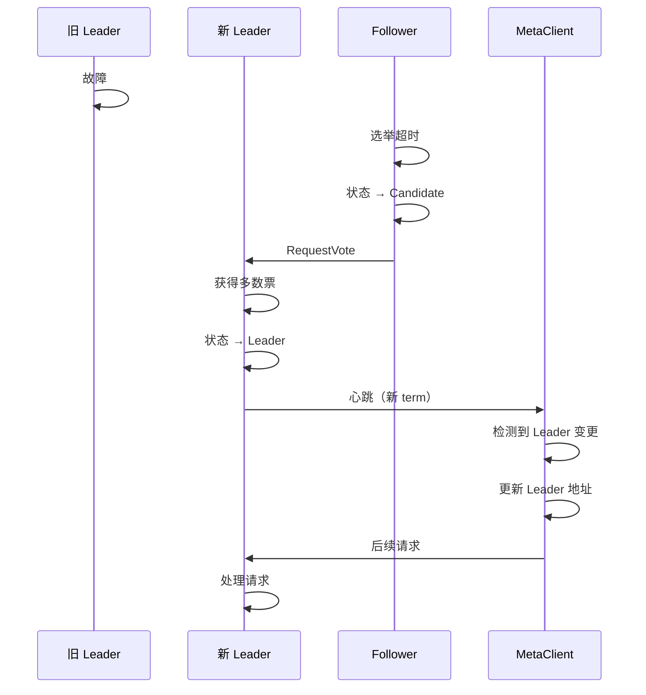
```mermaid
sequenceDiagram
    participant OldLeader as 旧 Leader
    participant NewLeader as 新 Leader
    participant Follower as Follower
    participant Client as MetaClient

    OldLeader->>OldLeader: 故障

    Follower->>Follower: 选举超时
    Follower->>Follower: 状态 → Candidate
    Follower->>NewLeader: RequestVote

    NewLeader->>NewLeader: 获得多数票
    NewLeader->>NewLeader: 状态 → Leader

    NewLeader->>Client: 心跳（新 term）
    Client->>Client: 检测到 Leader 变更
    Client->>Client: 更新 Leader 地址

    Client->>NewLeader: 后续请求
    NewLeader->>NewLeader: 处理请求
```

**通俗解释**：
- Leader 故障后，Follower 发起选举
- 新 Leader 获得多数票后，开始发送心跳
- MetaClient 检测到 Leader 变更，更新 Leader 地址
- 后续请求发送到新 Leader

**核心代码**：`app/ts-meta/meta/raft_wrapper.go:109-123`

```go
// 第 109 行：IsLeader — 检查本节点是否是 Leader
func (r *raftWrapper) IsLeader() bool {
    return r != nil && r.raft.State() == raft.Leader       // 检查 Raft 状态
}

// 第 117 行：Leader — 获取当前 Leader 的地址
func (r *raftWrapper) Leader() string {
    if r == nil || r.raft == nil {
        return ""
    }
    id, _ := r.raft.LeaderWithID()                         // 获取 Leader ID（包含地址）
    return string(id)
}
```

**逐行解释**：
- **第 110 行**：`r.raft.State() == raft.Leader` 检查 Raft 实例的当前状态是否为 Leader
- **第 121 行**：`r.raft.LeaderWithID()` 从 Hashicorp Raft 获取当前 Leader 的 ID 和地址

**核心代码**：`app/ts-meta/meta/store.go:1520-1533`

```go
// 第 1520 行：waitForLeader — 等待 Leader 选举完成
func (s *Store) waitForLeader() error {
    ticker := time.NewTicker(100 * time.Millisecond)        // 每 100ms 检查一次
    defer ticker.Stop()
    for {
        select {
        case <-s.closing:
            return errors.New("closing")                    // Store 正在关闭
        case <-ticker.C:
            if s.leader() != "" {                           // Leader 已选出
                return nil
            }
        }
    }
}
```

**逐行解释**：
- **第 1521 行**：`time.NewTicker(100 * time.Millisecond)` 每 100ms 检查一次 Leader 是否已选出
- **第 1528 行**：`s.leader()` 调用 `r.raft.Leader()` 获取 Leader 地址，非空表示 Leader 已选出
- **设计意图**：在 Store 启动时，必须等待 Leader 选举完成才能继续，否则无法处理请求

**核心代码**：`lib/raftconn/node.go:281-314`（ts-store 侧的 Leader 转移逻辑）

```go
// 第 281 行：TransferLeadership — 将 Leader 转移给指定节点
func (n *RaftNode) TransferLeadership(newLeader uint64) error {
    // 第 283 行：等待当前 Leader 选举完成
    for {
        select {
        case <-n.ctx.Done():
            return nil
        default:
        }
        if n.node.Status().Lead == 0 {
            time.Sleep(100 * time.Millisecond)
            continue                    // 还没有 Leader，继续等待
        }
        break
    }

    // 第 296 行：尝试转移 Leader
    oldLeader := n.node.Status().Lead
    if oldLeader != newLeader {
        n.node.TransferLeadership(n.ctx, oldLeader, newLeader)
    }

    // 第 302 行：等待新 Leader 生效（最多 10 秒）
    var timer = time.NewTimer(10 * time.Second)
    for n.node.Status().Lead != newLeader {
        select {
        case <-timer.C:
            return fmt.Errorf("try to transfer leadership timeout")
        default:
            time.Sleep(100 * time.Millisecond)
        }
    }
    return nil
}
```

**逐行解释**：
- **第 283-294 行**：先等待当前集群有 Leader（`Lead != 0`），如果还没有 Leader 则每 100ms 重试
- **第 296-298 行**：如果旧 Leader 不是目标节点，调用 `TransferLeadership` 发起 Leader 转移
- **第 302-311 行**：轮询等待新 Leader 生效，最多等待 10 秒，超时返回错误
- **设计意图**：ts-store 侧的 Leader 转移用于分区级别的 Leader 迁移，比如分区接管或负载均衡

**核心代码**：`lib/raftconn/node.go:387-390`（Leader 状态检查）

```go
// 第 387 行：isLeader — 检查当前节点是否是 Leader
func (n *RaftNode) isLeader() bool {
    r := n.node
    return r.Status().Lead == r.Status().ID  // Leader ID 等于自身 ID
}
```

**逐行解释**：
- **第 389 行**：`r.Status().Lead` 是当前 Leader 的 ID，`r.Status().ID` 是自身 ID
- 如果两者相等，说明自己就是 Leader
- 与 Hashicorp Raft 的 `r.raft.State() == raft.Leader` 不同，etcd Raft 通过比较 ID 判断

**具体例子**：

Leader 故障恢复的过程：

```
初始状态：Node1 是 Leader，Node2, Node3 是 Follower

Step 1: Node1 故障（宕机）
  → Node2, Node3 超时没收到心跳

Step 2: Node2 发起选举
  → Node2.term = 2
  → Node2 发送 RequestVote(term=2) 给 Node3

Step 3: Node3 投票
  → 检查 term=2 > 自己的 term=1 → 同意
  → Node3 发送 VoteGranted 给 Node2

Step 4: Node2 成为 Leader
  → Node2 获得多数票（2/3）
  → Node2 状态变为 Leader
  → Node2 开始发送心跳

Step 5: MetaClient 检测到 Leader 变更
  → MetaClient 发送请求到 Node1（旧 Leader）
  → 连接失败
  → MetaClient 重试其他节点
  → 发现 Node2 是新 Leader
  → 更新 Leader 地址为 Node2

Step 6: 后续请求发送到 Node2
  → MetaClient → Node2: 请求
  → Node2 处理请求
```

### 7.3 核心代码：Leader 选举

**代码位置**：`app/ts-meta/meta/raft_wrapper.go` 中的 Leader 检测逻辑

> **注意**：openGemini 使用两套 Raft 实现：
> - **Hashicorp Raft**（`app/ts-meta/meta/raft_wrapper.go`）：用于 ts-meta 元数据共识
> - **etcd Raft**（`lib/raftconn/node.go`）：用于 ts-store 数据分区共识
>
> 本节讨论的是 ts-meta 的 Leader 选举，使用 Hashicorp Raft。

```go
// raftWrapper 结构体（app/ts-meta/meta/raft_wrapper.go:37-80）
type raftWrapper struct {
    ln          net.Listener        // 网络监听器
    raft        *raft.Raft          // Hashicorp Raft 实例
    logStore    raft.LogStore       // 日志存储
    snapStore   raft.SnapshotStore  // 快照存储
    stableStore raft.StableStore    // 稳定存储（key-value）
    notifyCh    chan bool            // Leader 变更通知
}
```

**具体例子**：

3 节点集群的 Leader 选举过程：

```
初始状态：所有节点都是 Follower，term = 0

步骤 1: Node1 选举超时（150ms）
  → Node1 状态变为 Candidate
  → Node1.term = 1
  → Node1 给自己投票
  → Node1 发送 RequestVote(term=1) 给 Node2, Node3

步骤 2: Node2 收到 RequestVote
  → 检查 term=1 > 自己的 term=0 → 同意投票
  → Node2 发送 VoteGranted 给 Node1

步骤 3: Node3 收到 RequestVote
  → 检查 term=1 > 自己的 term=0 → 同意投票
  → Node3 发送 VoteGranted 给 Node1

步骤 4: Node1 获得多数票（2/3）
  → Node1 状态变为 Leader
  → Node1 开始发送心跳（每 50ms）
  → Node2, Node3 保持 Follower 状态
```

---

## 8. Partition Takeover 分区接管

### 8.1 分区接管流程

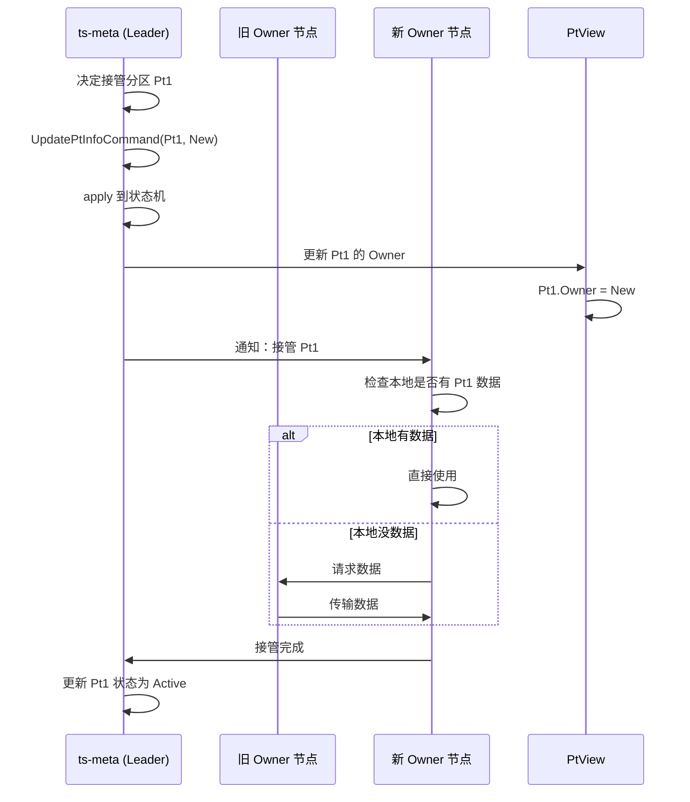
```mermaid
sequenceDiagram
    participant Meta as ts-meta (Leader)
    participant Old as 旧 Owner 节点
    participant New as 新 Owner 节点
    participant PtView as PtView

    Meta->>Meta: 决定接管分区 Pt1
    Meta->>Meta: UpdatePtInfoCommand(Pt1, New)
    Meta->>Meta: apply 到状态机

    Meta->>PtView: 更新 Pt1 的 Owner
    PtView->>PtView: Pt1.Owner = New

    Meta->>New: 通知：接管 Pt1
    New->>New: 检查本地是否有 Pt1 数据

    alt 本地有数据
        New->>New: 直接使用
    else 本地没数据
        New->>Old: 请求数据
        Old->>New: 传输数据
    end

    New->>Meta: 接管完成
    Meta->>Meta: 更新 Pt1 状态为 Active
```

**通俗解释**：
- 分区接管用于负载均衡或故障恢复
- ts-meta 发起接管，通过 Raft 共识传播

**核心代码**：`app/ts-meta/meta/store_fsm.go:336-338, 773-775`

```go
// 第 336 行：applyUpdatePtInfo — 应用分区信息更新命令
func applyUpdatePtInfo(fsm *storeFSM, cmd *proto2.Command) interface{} {
    return fsm.applyUpdatePtInfoCommand(cmd)
}

// 第 773 行：applyUpdatePtInfoCommand — 执行分区信息更新
func (fsm *storeFSM) applyUpdatePtInfoCommand(cmd *proto2.Command) interface{} {
    return meta2.ApplyUpdatePtInfo(fsm.data, cmd)
}
```

**逐行解释**：
- **第 337 行**：`applyUpdatePtInfo` 是 applyFunc 分发表中的处理函数，对应 `Command_UpdatePtInfoCommand` 类型
- **第 774 行**：调用 `meta2.ApplyUpdatePtInfo` 执行实际的分区信息更新

**核心代码**：`lib/util/lifted/influx/meta/apply_func_base.go:386-393`

```go
// 第 386 行：ApplyUpdatePtInfo — 更新分区的 Owner 和状态
func ApplyUpdatePtInfo(data *Data, cmd *proto2.Command) error {
    ext, _ := proto.GetExtension(cmd, proto2.E_UpdatePtInfoCommand_Command)
    v, ok := ext.(*proto2.UpdatePtInfoCommand)
    if !ok {
        DataLogger.Error("applyUpdatePtInfo err")
    }
    return data.UpdatePtInfo(v.GetDb(), v.GetPt(), v.GetOwnerNode(), v.GetStatus())
}
```

**逐行解释**：
- **第 387 行**：`proto.GetExtension` 从 protobuf 命令中提取扩展字段（UpdatePtInfoCommand）
- **第 392 行**：`data.UpdatePtInfo()` 更新 PtView 中指定分区的 Owner 和状态

**核心代码**：`lib/util/lifted/influx/meta/data.go:3766-3786`

```go
// 第 3766 行：UpdatePtInfo — 更新分区 Owner 和状态
func (data *Data) UpdatePtInfo(db string, info *proto2.PtInfo, ownerId uint64, status uint32) error {
    oldPtNum := len(data.PtView[db])
    if int(info.GetPtId()) >= oldPtNum {
        return errno.NewError(errno.PtNotFound)           // 分区不存在
    }

    curPtOwner := data.PtView[db][info.GetPtId()].Owner.NodeID
    // 检查分区信息是否已被其他操作修改（乐观锁）
    if curPtOwner != *(info.GetOwner().NodeID) ||
        data.PtView[db][info.GetPtId()].Status != PtStatus(info.GetStatus()) {
        return errno.NewError(errno.PtChanged)             // 分区已被修改，拒绝操作
    }
    if PtStatus(status) == Online {
        // 如果目标节点不存活，不设置为 Online
        if nodeStatus, exist := data.getNodeStatus(ownerId); exist && nodeStatus != serf.StatusAlive {
            return nil
        }
    }
    data.updatePtStatus(db, info.GetPtId(), ownerId, PtStatus(status))
    return nil
}
```

**逐行解释**：
- **第 3767-3769 行**：检查分区 ID 是否有效
- **第 3772-3776 行**：乐观锁检查，确保分区信息在读取后没有被其他操作修改
- **第 3778-3782 行**：如果目标状态是 Online，检查目标节点是否存活
- **第 3784 行**：`updatePtStatus` 更新 PtView 中分区的 Owner 和状态

**具体例子**：

分区接管的完整流程：

```
场景：Node2 故障，需要将 Pt1 迁移到 Node3

Step 1: ts-meta 检测到 Node2 故障
  → SWIM 协议标记 Node2 为 failed
  → ts-meta 决定将 Pt1 迁移到 Node3

Step 2: ts-meta 创建 Raft 命令
  → UpdatePtInfoCommand{Db: "mydb", Pt: {PtId: 1}, OwnerNode: 3, Status: Online}
  → 通过 Raft 共识传播到所有节点

Step 3: 所有节点应用命令
  → PtView 更新: Pt1.Owner = Node3
  → Node3 收到通知，开始接管 Pt1

Step 4: Node3 接管 Pt1
  → 检查本地是否有 Pt1 数据
  → 如果没有，从 Node1（旧 Owner）请求数据
  → 数据传输完成后，Pt1 状态变为 Active

Step 5: 更新 PtView
  → Pt1.Owner = Node3
  → Pt1.Status = Active
```

### 8.2 核心代码：UpdatePtInfoCommand — 分区信息变更

**代码位置**：`lib/util/lifted/influx/meta/proto/meta.pb.go:7421` 中的 protobuf 定义

```go
// UpdatePtInfoCommand — 更新分区信息（Owner、Status 等）
// 定义位置：lib/util/lifted/influx/meta/proto/meta.pb.go:7421
// Command 类型编号：67（Command_UpdatePtInfoCommand）
type UpdatePtInfoCommand struct {
    Db             *string  `protobuf:"bytes,1,req,name=Db" json:"Db,omitempty"`           // 数据库名
    Pt             *PtInfo  `protobuf:"bytes,2,req,name=Pt" json:"Pt,omitempty"`           // 分区信息（PtId、Owner 等）
    OwnerNode      *uint64  `protobuf:"varint,3,req,name=OwnerNode" json:"OwnerNode,omitempty"` // 新 Owner 节点 ID
    Status         *uint32  `protobuf:"varint,4,req,name=Status" json:"Status,omitempty"`  // 分区状态
    XXX_unrecognized []byte `json:"-"`
}
```

**具体例子**：

分区接管的完整流程：

```
场景：Node2 故障，需要将 Pt1 迁移到 Node3

步骤 1: ts-meta 检测到 Node2 故障
  → SWIM 协议标记 Node2 为 failed
  → ts-meta 决定将 Pt1 迁移到 Node3

步骤 2: ts-meta 创建 Raft 命令
  → UpdatePtInfoCommand{Db: "mydb", Pt: {PtId: 1, Owner: {NodeID: 2}}, OwnerNode: 3, Status: Online}
  → 通过 Raft 共识传播到所有节点

步骤 3: 所有节点应用命令
  → applyUpdatePtInfo → ApplyUpdatePtInfo → data.UpdatePtInfo()
  → PtView 更新: Pt1.Owner = Node3
  → Node3 收到通知，开始接管 Pt1

步骤 4: Node3 接管 Pt1
  → 检查本地是否有 Pt1 数据
  → 如果没有，从 Node1（旧 Owner）请求数据
  → 数据传输完成后，Pt1 状态变为 Active
```

---
- 新 Owner 检查本地是否有数据，没有则从旧 Owner 传输
- 接管完成后更新 PtView 的 Owner 指向

---

## 9. Leader 本地读与缓存一致性边界

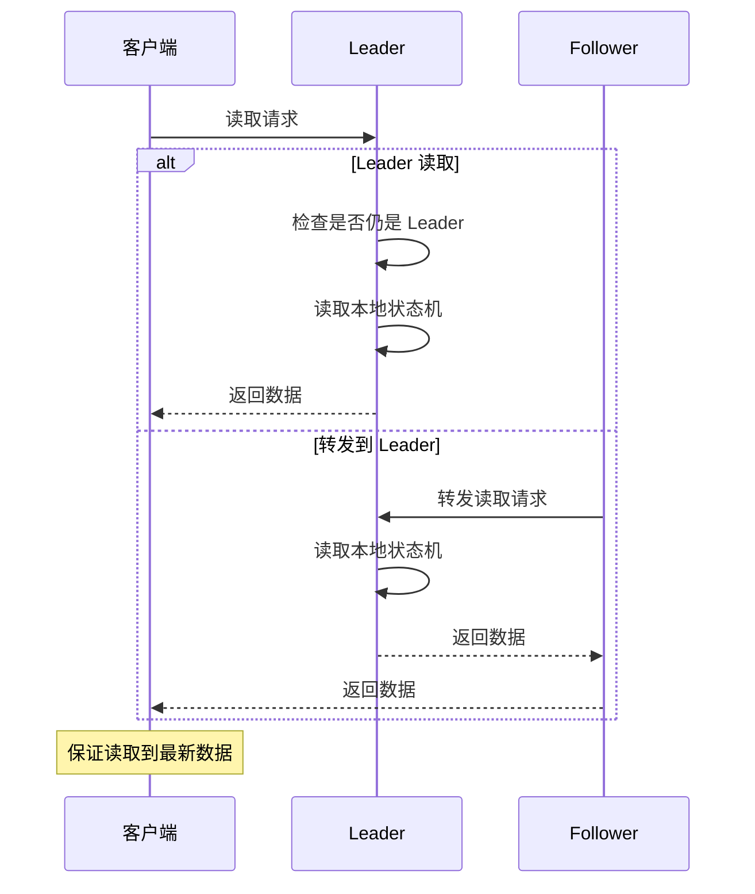
```mermaid
sequenceDiagram
    participant Client as 客户端
    participant Leader as Leader
    participant Follower as Follower

    Client->>Leader: 读取请求

    alt Leader 读取
        Leader->>Leader: 检查是否仍是 Leader
        Leader->>Leader: 读取本地状态机
        Leader-->>Client: 返回数据
    else 转发到 Leader
        Follower->>Leader: 转发读取请求
        Leader->>Leader: 读取本地状态机
        Leader-->>Follower: 返回数据
        Follower-->>Client: 返回数据
    end

    Note over Client: 保证读取到最新数据
```

**通俗解释**：
- Leader 本地读：读取请求通常面向 Leader 或 MetaClient 缓存，但不要把它等同于带 ReadIndex/Barrier 的严格线性一致性读
- Leader 检查自己是否仍是 Leader（防止网络分区导致的脑裂）
- 读取本地状态机，返回最新数据
- 这保证了读取到的是最新提交的数据

### 9.2 Leader 本地读实现边界

**代码位置**：`app/ts-meta/meta/raft_wrapper.go:149-169`（写命令通过 Hashicorp Raft 的 `Apply` 方法提交）

openGemini 的 ts-meta 侧使用 Hashicorp Raft，写入命令通过 `Apply` 进入 Raft 日志；读路径更多依赖 Leader 本地状态机或 MetaClient 本地缓存。当前文档应按以下边界理解：

1. **写请求线性化**：写请求通过 `raftWrapper.Apply()` 提交到 Raft 共识，非 Leader 会返回 `MetaIsNotLeader`
2. **Leader 本地读**：部分读请求由 Leader 直接读取本地状态机；代码没有为每次读额外执行 Hashicorp Raft `Barrier()` 或类似 ReadIndex 的确认步骤
3. **MetaClient 缓存读**：MetaClient 先通过 V1 全量或 V2 增量/全量兜底同步元数据，再在本地 `cacheData` 上执行读取，因此读到的是“缓存已同步到的版本”

**核心代码**：`app/ts-meta/meta/raft_wrapper.go:149-169`

```go
// Apply — 提交命令到 Raft（Hashicorp Raft 内部保证 Leader 身份）
func (r *raftWrapper) Apply(b []byte) error {
    if r == nil || r.raft == nil {
        return errno.NewError(errno.RaftIsNotOpen)
    }
    f := r.raft.Apply(b, 0)                              // 提交到 Raft 协议
    if err := f.Error(); err != nil {
        if err == raft.ErrNotLeader {
            return errno.NewError(errno.MetaIsNotLeader)  // 不是 Leader，拒绝请求
        }
        return err
    }
    resp := f.Response()
    if resp == nil {
        return nil
    }
    if err, ok := resp.(error); ok {
        return err
    }
    panic(fmt.Sprintf("unexpected response: %#v", resp))
}
```

**具体例子**：

Leader/缓存读的完整流程：

```
场景：读取 Pt1 的 Owner 信息

步骤 1: MetaClient 拉取最新元数据
  → MetaClient 调用 pollForUpdates 或 pollForUpdatesV2
  → 从 ts-meta Leader 获取最新元数据（全量或增量）
  → 更新本地缓存 cacheData

步骤 2: MetaClient 在本地缓存上执行读取
  → 读取 cacheData.PtView["mydb"][1].Owner
  → 返回 Pt1.Owner = Node3

一致性边界：
  → MetaClient 的缓存是通过 Raft 共识同步的
  → 缓存新鲜度取决于 pollForUpdates/pollForUpdatesV2 进度
  → Leader 本地读没有额外 Barrier/ReadIndex 步骤，不能称为严格线性一致性读
```

**为什么仍要优先读 Leader 或同步后的缓存？**

| 维度 | Leader/缓存读（当前实现） | 未同步缓存读 |
|------|---------------------|-----------|
| **数据新鲜度** | 取决于 Leader 状态机或缓存同步进度 | 可能明显过时 |
| **性能** | Leader 本地读或缓存读，性能较好 | 性能好但风险更高 |
| **一致性** | 已提交数据驱动，但不是严格线性读协议 | 最终一致 |
| **适用场景** | 元数据查询 | 时序数据查询 |

**通俗解释**：
Leader 本地读就像"去总部档案室查当前档案"，MetaClient 缓存读就像"查本地刚同步过的档案副本"。这些档案来自 Raft 已提交日志，但每次读取前没有再走一次专门的读屏障，所以不能把它描述成严格线性一致性读。

---

## 10. 潜在隐患

### 10.1 Leader 选举期间的服务中断

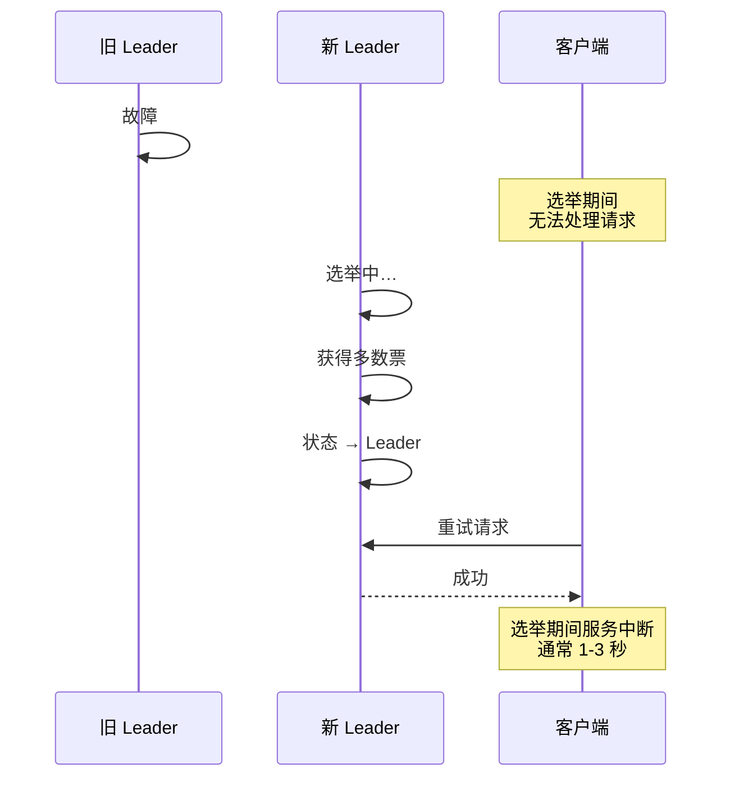
```mermaid
sequenceDiagram
    participant OldLeader as 旧 Leader
    participant NewLeader as 新 Leader
    participant Client as 客户端

    OldLeader->>OldLeader: 故障

    Note over Client: 选举期间<br/>无法处理请求

    NewLeader->>NewLeader: 选举中…
    NewLeader->>NewLeader: 获得多数票
    NewLeader->>NewLeader: 状态 → Leader

    Client->>NewLeader: 重试请求
    NewLeader-->>Client: 成功

    Note over Client: 选举期间服务中断<br/>通常 1-3 秒
```

**隐患**：
- Leader 选举期间，集群无法处理写入请求
- 选举时间通常 1-3 秒，但在网络不稳定时可能更长
- 建议：客户端实现重试机制，容忍短暂的服务中断

**核心代码**：`lib/config/meta.go:39-40`

```go
// 第 39 行：默认选举超时 1000ms
DefaultElectionTimeout  = 1000 * time.Millisecond
// 第 40 行：默认心跳超时 1000ms
DefaultHeartbeatTimeout = 1000 * time.Millisecond
```

**逐行解释**：
- **第 39 行**：`DefaultElectionTimeout` 选举超时，Follower 等待这么久没收到心跳后发起选举
- **第 40 行**：`DefaultHeartbeatTimeout` 心跳超时，Leader 发送心跳的间隔

**核心代码**：`app/ts-meta/meta/store.go:1520-1533`

```go
// 第 1520 行：waitForLeader — 等待 Leader 选举完成
func (s *Store) waitForLeader() error {
    ticker := time.NewTicker(100 * time.Millisecond)        // 每 100ms 检查一次
    defer ticker.Stop()
    for {
        select {
        case <-s.closing:
            return errors.New("closing")
        case <-ticker.C:
            if s.leader() != "" {                           // Leader 已选出
                return nil
            }
        }
    }
}
```

**逐行解释**：
- **第 1521 行**：`time.NewTicker(100 * time.Millisecond)` 每 100ms 检查一次 Leader 是否已选出
- **第 1528 行**：`s.leader() != ""` 表示 Leader 已选出，可以继续启动
- **问题**：如果 Leader 选举时间过长（比如网络不稳定），这里会一直阻塞

**核心代码**：`lib/raftconn/node.go:316-332`（选举期间的消息处理暂停）

```go
// 第 316 行：serveChannels — Raft 消息处理主循环
func (n *RaftNode) serveChannels() {
    var leader bool

    for {
        select {
        case <-n.tick.C:
            n.node.Tick()                              // 驱动选举时钟

        case rd := <-n.node.Ready():
            if rd.SoftState != nil {
                leader = rd.RaftState == raft.StateLeader
            }

            // 选举期间：leader = false，不会进入此分支
            if leader {
                for i := range n.processMessages(rd.Messages) {
                    n.Messages <- &rd.Messages[i]
                }
            }

            // 持久化日志（选举期间也需要）
            n.SaveToStorage(&rd.HardState, rd.Entries, &rd.Snapshot)

            // 发布已提交条目（选举期间没有已提交条目）
            ok := n.PublishEntries(n.entriesToApply(rd.CommittedEntries))
            ...
        }
    }
}
```

**逐行解释**：
- **第 326 行**：`n.node.Tick()` 每 400ms 触发一次，驱动选举超时计时器
- **第 330-332 行**：选举期间 `rd.RaftState` 不是 `StateLeader`，所以 `leader = false`
- **第 334-341 行**：`leader = false` 时跳过消息发送，只有成为 Leader 后才能发送消息
- **第 344 行**：选举期间日志仍会持久化，但不会有已提交的条目
- **第 365 行**：`PublishEntries` 返回的条目为空（选举期间没有提交），所以不会触发上层应用

**通俗解释**：

想象一个公司只有 CEO（Leader）才能签字审批文件。如果 CEO 突然离职了：
1. **选举新 CEO**：需要召开股东大会（选举），这期间没有人能签字
2. **选举时间**：正常情况 1-3 秒（网络好），但如果股东们意见不一致（网络抖动），可能需要 5-10 秒
3. **影响**：所有需要签字的文件（写入请求）都得等着
4. **解决方案**：客户端应该有重试机制，就像员工看到 CEO 不在，过一会儿再来问

**具体例子**：

Leader 选举期间的服务中断：

```
时间线：
t=0s: Node1（Leader）故障
t=0.15s: Node2 选举超时，发起选举
t=0.2s: Node2 获得多数票，成为 Leader
t=0.25s: Node2 开始发送心跳

服务中断时间：0.15s ~ 0.25s = 100ms

但如果网络不稳定：
t=0s: Node1 故障
t=0.15s: Node2 发起选举，但网络抖动
t=0.5s: Node2 重试选举
t=0.8s: Node2 获得多数票
t=0.85s: Node2 成为 Leader

服务中断时间：0.15s ~ 0.85s = 700ms

最坏情况：
  → 网络分区 + 多个节点同时发起选举
  → 选举超时 + 重试
  → 服务中断可能达到几秒

优化方案：
  → 客户端实现重试机制
  → 设置合理的选举超时（150-300ms）
  → 避免网络分区时的脑裂
```

### 10.2 OpsMap 内存增长

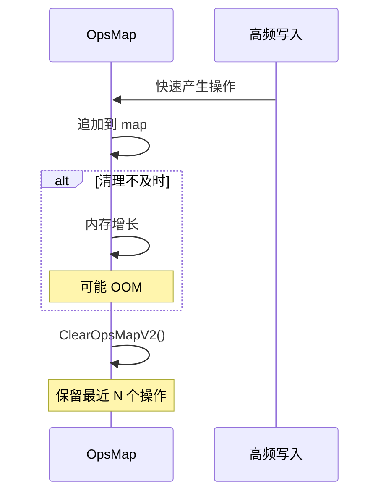
```mermaid
sequenceDiagram
    participant OpsMap as OpsMap
    participant Write as 高频写入

    Write->>OpsMap: 快速产生操作
    OpsMap->>OpsMap: 追加到 map

    alt 清理不及时
        OpsMap->>OpsMap: 内存增长
        Note over OpsMap: 可能 OOM
    end

    OpsMap->>OpsMap: ClearOpsMapV2()
    Note over OpsMap: 保留最近 N 个操作
```

**隐患**：
- 高频元数据变更时，OpsMap 可能快速增长
- 如果清理不及时，可能导致内存增长
- `ClearOpsMapV2` 基于 `minAliveNodeTmpIndex` 清理，但如果有慢节点，清理可能延迟

**核心代码**：`lib/util/lifted/influx/meta/data.go:269-282`

```go
// 第 269 行：GetMinAliveNodeTmpIndex — 获取所有存活节点中最小的 index
func (data *Data) GetMinAliveNodeTmpIndex() uint64 {
    var ret uint64 = math.MaxUint64
    for _, sqlNode := range data.SqlNodes {
        if sqlNode.Index < ret && sqlNode.Status == serf.StatusAlive {
            ret = sqlNode.Index                            // 找到最小的 sqlNode index
        }
    }
    for _, dataNode := range data.DataNodes {
        if dataNode.Index < ret && dataNode.Status == serf.StatusAlive {
            ret = dataNode.Index                           // 找到最小的 dataNode index
        }
    }
    return ret
}
```

**逐行解释**：
- **第 270 行**：初始化 `ret = math.MaxUint64`，表示还没有找到任何存活节点
- **第 271-275 行**：遍历所有 sqlNode，找到存活节点中最小的 index
- **第 276-280 行**：遍历所有 dataNode，找到存活节点中最小的 index
- **设计意图**：只有所有节点都消费过的操作才能被清理

**核心代码**：`lib/util/lifted/influx/meta/data.go:284-313`

```go
// 第 284 行：ClearOpsMapV2 — 清理 OpsMap 中的旧操作
func (data *Data) ClearOpsMapV2(minAliveNodeTmpIndex uint64) {
    data.opsMapMu.Lock()
    defer data.opsMapMu.Unlock()
    if len(data.OpsMap) <= OPMAPLIMITCAP {
        return                                             // OpsMap 不大，不清理
    }
    // 安全检查：不清理还未被所有节点消费的操作
    if minAliveNodeTmpIndex == math.MaxUint64 || data.OpsMapMinIndex >= minAliveNodeTmpIndex {
        return
    }
    // 沿链表遍历，删除 index < minAliveNodeTmpIndex 的操作
    var tmpOp *Op
    var next uint64
    var start uint64
    for start = data.OpsMapMinIndex; start < minAliveNodeTmpIndex && start != 0; {
        tmpOp, _ = data.OpsMap[start]
        next = tmpOp.nextOpIndex
        delete(data.OpsMap, start)                         // 删除旧操作
        start = next                                       // 沿链表前进
    }
    if next == 0 {
        data.OpsMapMinIndex = math.MaxUint64               // OpsMap 已空
        data.OpsMapMaxIndex = 0
        data.OpsToMarshalIndex = 0
    } else {
        data.OpsMapMinIndex = next                         // 更新最小 index
    }
}
```

**逐行解释**：
- **第 287 行**：`OPMAPLIMITCAP` 是清理触发阈值（实际值为 30，定义于 `lib/util/lifted/influx/meta/data.go:90`），不是容量硬上限；`len(OpsMap) <= 30` 时跳过清理，超过 30 后才尝试清理
- **第 291 行**：如果 `minAliveNodeTmpIndex = MaxUint64`，说明没有存活节点，不清理
- **第 297-301 行**：沿链表遍历删除旧操作，时间复杂度 O(n)，n 是要删除的操作数
- **问题**：如果有一个慢节点（index 落后很多），`minAliveNodeTmpIndex` 会很小，导致无法清理

**核心代码**：`app/ts-meta/meta/store.go:1000-1015`（OpsMap 清理的定时任务）

```go
// 第 1000 行：ClearOpsMap — 定期清理 OpsMap 中的旧操作
func (s *Store) ClearOpsMap() {
    defer s.wg.Done()
    ticker := time.NewTicker(updateCacheInterval * 10)    // 每 1 秒检查一次
    defer ticker.Stop()
    for {
        select {
        case <-s.closing:
            return
        case <-ticker.C:
            s.mu.RLock()
            minAliveNodeTmpIndex := s.data.GetMinAliveNodeTmpIndex()
            s.mu.RUnlock()
            s.data.ClearOpsMapV2(minAliveNodeTmpIndex)    // 清理旧操作
        }
    }
}
```

**逐行解释**：
- **第 1003 行**：`updateCacheInterval * 10` = 100ms × 10 = 1 秒，每秒检查一次
- **第 1010 行**：`GetMinAliveNodeTmpIndex()` 遍历所有存活的 sqlNode 和 dataNode，找到最小的 index
- **第 1012 行**：`ClearOpsMapV2` 删除 index < minAliveNodeTmpIndex 的操作
- **问题**：如果有一个节点长期离线或处理缓慢，minAliveNodeTmpIndex 会很小，OpsMap 无法清理

**核心代码**：`lib/util/lifted/influx/meta/data.go:269-282`（获取最小存活节点 index）

```go
// 第 269 行：GetMinAliveNodeTmpIndex — 获取所有存活节点中最小的 index
func (data *Data) GetMinAliveNodeTmpIndex() uint64 {
    var ret uint64 = math.MaxUint64
    for _, sqlNode := range data.SqlNodes {
        if sqlNode.Index < ret && sqlNode.Status == serf.StatusAlive {
            ret = sqlNode.Index                            // 找到最小的 sqlNode index
        }
    }
    for _, dataNode := range data.DataNodes {
        if dataNode.Index < ret && dataNode.Status == serf.StatusAlive {
            ret = dataNode.Index                           // 找到最小的 dataNode index
        }
    }
    return ret
}
```

**逐行解释**：
- **第 270 行**：初始化 `ret = math.MaxUint64`，表示还没有找到任何存活节点
- **第 271-275 行**：遍历所有 sqlNode，只考虑 `Status == serf.StatusAlive` 的节点
- **第 276-280 行**：遍历所有 dataNode，同样只考虑存活节点
- **关键逻辑**：只有存活的节点才参与计算。如果一个节点宕机了（Status != Alive），它的 index 不会阻塞清理
- **隐患**：如果一个节点存活但处理缓慢（Status == Alive，但 Index 很小），它会阻塞整个 OpsMap 清理

**通俗解释**：

OpsMap 就像一个快递站的待处理快递柜：
1. **清理触发线**：快递数量不超过 30 时先不清理；超过 30 才检查哪些能删
2. **清理规则**：只有所有收件人（存活节点）都取走的快递才能清理
3. **慢节点问题**：如果有一个收件人一直不来取快递（节点落后），超过 30 以后也只能少删或不删
4. **后果**：新快递不断进来，慢节点仍存活且 index 很小时，OpsMap 可能持续增长

就像一个小区的快递柜：
- 每天有 100 个新快递进来
- 快递超过 30 个后才开始触发清理检查
- 如果有 1 个住户出差 3 个月，他的快递占着柜子
- 100 天后，如果慢节点仍被认为存活，旧快递不能清理，新快递继续堆积
- 解决方案：设置快递过期时间，或者给慢节点发催促通知

**具体例子**：

OpsMap 内存增长的场景：

```
场景：高频创建 measurement（每秒 100 个）

OpsMap 增长速度：
  → 每秒 100 个操作
  → 每个操作约 1KB
  → 每秒增长 100KB

1 小时后：
  → OpsMap 大小：100KB × 3600 = 360MB
  → OpsMap 条目数：100 × 3600 = 360,000

清理条件：
  → OPMAPLIMITCAP = 30
  → 需要等所有节点消费到最新

如果有一个慢节点（index 落后 10,000）：
  → 无法清理 OpsMap
  → 内存持续增长
  → 可能 OOM

优化方案：
  → 增加 OPMAPLIMITCAP
  → 限制 OpsMap 最大内存
  → 强制清理过旧的操作
```

### 10.3 网络分区导致的脑裂

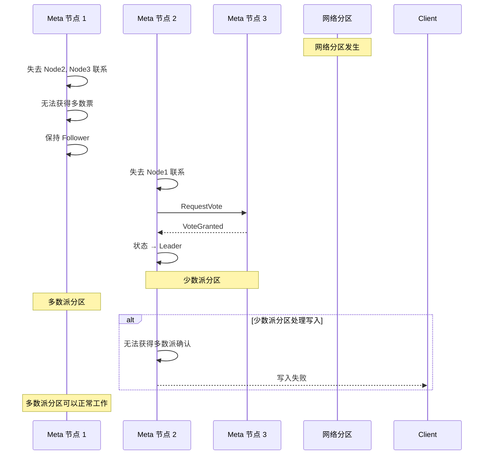
```mermaid
sequenceDiagram
    participant Node1 as Meta 节点 1
    participant Node2 as Meta 节点 2
    participant Node3 as Meta 节点 3
    participant Net as 网络分区

    Note over Net: 网络分区发生

    Node1->>Node1: 失去 Node2, Node3 联系
    Node1->>Node1: 无法获得多数票
    Node1->>Node1: 保持 Follower

    Node2->>Node2: 失去 Node1 联系
    Node2->>Node3: RequestVote
    Node3-->>Node2: VoteGranted
    Node2->>Node2: 状态 → Leader

    Note over Node2,Node3: 少数派分区
    Note over Node1: 多数派分区

    alt 少数派分区处理写入
        Node2->>Node2: 无法获得多数派确认
        Node2-->>Client: 写入失败
    end

    Note over Node1: 多数派分区可以正常工作
```

**隐患**：
- 网络分区可能导致脑裂（两个 Leader）
- Raft 协议保证：只有获得多数派的节点才能成为 Leader
- 少数派分区无法处理写入，但多数派分区正常工作
- 这是 Raft 协议的固有特性，不是 bug

**核心代码**：`app/ts-meta/meta/raft_wrapper.go:109-111`

```go
// 第 109 行：IsLeader — 检查本节点是否是 Leader
func (r *raftWrapper) IsLeader() bool {
    return r != nil && r.raft.State() == raft.Leader
}
```

**逐行解释**：
- **第 110 行**：`r.raft.State() == raft.Leader` 只检查本地 Raft 实例的状态
- **问题**：在网络分区场景下，旧 Leader 可能认为自己还是 Leader，但实际上已被新 Leader 替代

**核心代码**：`app/ts-meta/meta/raft_wrapper.go:149-169`

```go
// 第 149 行：Apply — 提交命令到 Raft
func (r *raftWrapper) Apply(b []byte) error {
    if r == nil || r.raft == nil {
        return errno.NewError(errno.RaftIsNotOpen)
    }
    f := r.raft.Apply(b, 0)                              // 提交到 Raft 协议
    if err := f.Error(); err != nil {
        if err == raft.ErrNotLeader {
            return errno.NewError(errno.MetaIsNotLeader)  // 不是 Leader，拒绝请求
        }
        return err
    }

    resp := f.Response()
    if resp == nil {
        return nil
    }
    if err, ok := resp.(error); ok {
        return err
    }
    panic(fmt.Sprintf("unexpected response: %#v", resp))
}
```

**逐行解释**：
- **第 153 行**：`r.raft.Apply(b, 0)` 将命令提交给 Hashicorp Raft 协议
- **第 155-157 行**：如果当前节点不是 Leader，Hashicorp Raft 会返回 `ErrNotLeader` 错误
- **第 161-168 行**：如果 FSM apply 返回错误，也会被传递给调用者
- **关键**：Hashicorp Raft 内部会检查 Leader 身份，防止旧 Leader 提交命令

**核心代码**：`lib/raftconn/node.go:573-585`（ts-store 侧的消息发送与分区隔离）

```go
// 第 573 行：send — 发送 Raft 消息到目标节点
func (n *RaftNode) send(msg raftpb.Message) {
    nodeId := n.peers[GetPtId(msg.To)]
    if nodeId == n.nodeId {
        n.logger.Error("sending message to itself")
        return                         // 不给自己发消息
    }
    err := n.ISend.SendRaftMessages(nodeId, n.database, GetPtId(msg.To), msg)
    if err != nil {
        n.logger.Error("send raft message error", zap.Error(err))
        // 网络分区时：发送失败，目标节点收不到消息
        // → 目标节点超时没收到心跳 → 发起选举
        // → 但因为只有少数派，无法获得多数票
        // → 无法选出新 Leader
    }
}
```

**逐行解释**：
- **第 576 行**：通过 peers 映射找到目标节点的 nodeId
- **第 577-579 行**：防止给自己发消息（会导致死循环）
- **第 581 行**：`SendRaftMessages` 通过网络发送 Raft 消息
- **第 582-584 行**：发送失败时只记录日志，不重试。网络分区时消息无法送达，这是 Raft 协议设计的一部分

**核心代码**：`lib/raftconn/node.go:715-729`（检测副本组健康状态）

```go
// 第 715 行：CheckAllRgMembers — 检查副本组所有成员是否存活
func (n *RaftNode) CheckAllRgMembers() (bool, []uint32) {
    peers := n.peers
    var activePtSlice []uint32
    for ptId, nodeId := range peers {
        node, _ := n.MetaClient.DataNode(nodeId)
        if node.Status == serf.StatusAlive {
            activePtSlice = append(activePtSlice, ptId)
        }
    }
    if len(activePtSlice) == len(peers) {
        return true, activePtSlice          // 所有成员都存活
    }
    return false, activePtSlice             // 有成员不存活
}
```

**逐行解释**：
- **第 719-723 行**：遍历副本组所有成员，通过 MetaClient 查询节点状态
- **第 724-725 行**：如果所有成员都存活，返回 true
- **第 727 行**：有成员不存活时返回 false，上层会根据此结果决定是否清理日志等操作
- **设计意图**：网络分区时，少数派分区的成员可能不存活，此函数帮助检测分区状态

**通俗解释**：

想象一个公司有 3 个分公司，只有总部（Leader）才能签合同：
1. **网络分区**：总部和分公司 B、C 之间的网络断了
2. **旧总部**：以为自己还是总部，但联系不到 B 和 C
3. **B 和 C**：发现联系不到总部，选举 B 为新总部
4. **旧总部签合同**：尝试签合同，但需要 2/3 分公司确认（多数派），只有自己 1 个，失败
5. **新总部签合同**：B 和 C 都确认，2/3 多数派，成功

这就是 Raft 协议的安全保证：**任何命令都需要多数派确认**，所以网络分区时：
- 少数派分区：无法获得多数派确认，无法处理写入
- 多数派分区：可以获得多数派确认，正常工作
- 不会出现"两个总部同时签合同"的脑裂情况

**具体例子**：

网络分区导致的脑裂：

```
初始状态：3 节点集群，Node1 是 Leader

网络分区发生：
  → 分区 A：Node1（单独）
  → 分区 B：Node2, Node3

分区 A（Node1）：
  → Node1 是 Leader，但无法联系 Node2, Node3
  → Node1 发送心跳，但收不到 ACK
  → Node1 无法获得多数派确认
  → Node1 无法处理写入请求
  → Node1 最终降级为 Follower

分区 B（Node2, Node3）：
  → Node2, Node3 超时没收到心跳
  → Node2 发起选举
  → Node2 获得多数票（2/3）
  → Node2 成为 Leader
  → Node2 可以处理写入请求

结果：
  → 分区 A：无法处理写入（少数派）
  → 分区 B：正常工作（多数派）
  → 没有真正的脑裂（只有一个 Leader）

网络恢复后：
  → Node1 重新加入集群
  → Node1 发现 Node2 是新 Leader（term 更大）
  → Node1 降级为 Follower
  → Node1 从 Node2 同步缺失的日志
```

---

## 9. 端到端实战：一次 Raft 命令提交的完整生命周期

> 以创建数据库命令 `CREATE DATABASE mydb` 为例，追踪它从客户端请求到所有节点同步的完整过程。

### 9.1 初始状态

```
Raft 集群状态：
Node1: Leader  (Raft Leader)
Node2: Follower
Node3: Follower

当前 Raft Log：
Index 1: CreateNode(node1)
Index 2: CreateNode(node2)
Index 3: CreateNode(node3)
```

### 9.2 Raft 命令提交时序图

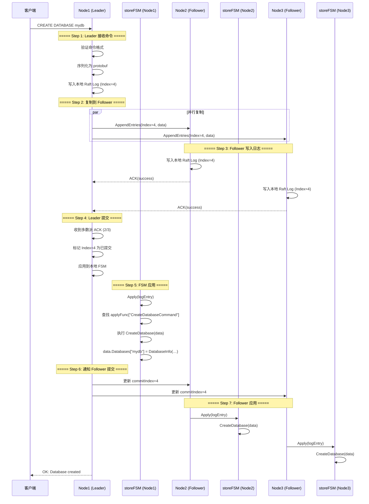
```mermaid
sequenceDiagram
    participant Client as 客户端
    participant Node1 as Node1 (Leader)
    participant FSM1 as storeFSM (Node1)
    participant Node2 as Node2 (Follower)
    participant FSM2 as storeFSM (Node2)
    participant Node3 as Node3 (Follower)
    participant FSM3 as storeFSM (Node3)

    Client->>Node1: CREATE DATABASE mydb

    Note over Node1: ===== Step 1: Leader 接收命令 =====
    Node1->>Node1: 验证命令格式
    Node1->>Node1: 序列化为 protobuf
    Node1->>Node1: 写入本地 Raft Log (Index=4)

    Note over Node1: ===== Step 2: 复制到 Follower =====
    par 并行复制
        Node1->>Node2: AppendEntries(Index=4, data)
        Node1->>Node3: AppendEntries(Index=4, data)
    end

    Note over Node2,Node3: ===== Step 3: Follower 写入日志 =====
    Node2->>Node2: 写入本地 Raft Log (Index=4)
    Node2-->>Node1: ACK(success)
    Node3->>Node3: 写入本地 Raft Log (Index=4)
    Node3-->>Node1: ACK(success)

    Note over Node1: ===== Step 4: Leader 提交 =====
    Node1->>Node1: 收到多数派 ACK (2/3)
    Node1->>Node1: 标记 Index=4 为已提交
    Node1->>Node1: 应用到本地 FSM

    Note over FSM1: ===== Step 5: FSM 应用 =====
    FSM1->>FSM1: Apply(logEntry)
    FSM1->>FSM1: 查找 applyFunc["CreateDatabaseCommand"]
    FSM1->>FSM1: 执行 CreateDatabase(data)
    FSM1->>FSM1: data.Databases["mydb"] = DatabaseInfo(…)

    Note over Node1: ===== Step 6: 通知 Follower 提交 =====
    Node1->>Node2: 更新 commitIndex=4
    Node1->>Node3: 更新 commitIndex=4

    Note over Node2,Node3: ===== Step 7: Follower 应用 =====
    Node2->>FSM2: Apply(logEntry)
    FSM2->>FSM2: CreateDatabase(data)
    Node3->>FSM3: Apply(logEntry)
    FSM3->>FSM3: CreateDatabase(data)

    Node1-->>Client: OK: Database created
```

### 9.3 Step 1 详解：Leader 接收命令

**代码路径**：`app/ts-meta/meta/raft_wrapper.go:149-169`

```go
func (r *raftWrapper) Apply(b []byte) error {
    if r == nil || r.raft == nil {
        return errno.NewError(errno.RaftIsNotOpen)
    }
    f := r.raft.Apply(b, 0)  // 提交命令到 Hashicorp Raft
    if err := f.Error(); err != nil {
        if err == raft.ErrNotLeader {
            return errno.NewError(errno.MetaIsNotLeader)
        }
        return err
    }

    resp := f.Response()
    if resp == nil {
        return nil
    }
    if err, ok := resp.(error); ok {
        return err
    }
    panic(fmt.Sprintf("unexpected response: %#v", resp))
}
```

**逐行解释**：
- `r.raft.Apply(b, 0)`：将命令提交给 Hashicorp Raft 协议（非 `Propose` 方法）
- `f.Error()`：检查 Raft 提交是否出错
- `raft.ErrNotLeader`：如果当前节点不是 Leader，返回 `MetaIsNotLeader` 错误
- `f.Response()`：获取 FSM 应用后的返回值（可能是 error 或 nil）
- 调用入口在 `app/ts-meta/meta/store.go:1614`：`s.raft.Apply(b)`

### 9.4 Step 2 详解：复制到 Follower

**Raft 协议的复制机制**：
1. Leader 将命令写入本地日志
2. Leader 将日志条目通过 AppendEntries RPC 发送给所有 Follower
3. Follower 将日志条目写入本地日志，返回 ACK
4. Leader 收到多数派 ACK 后，标记为已提交

### 9.5 Step 3 详解：FSM 应用 — applyFunc 分发表

**代码路径**：`app/ts-meta/meta/store_fsm.go:31-178`

```go
// storeFSM 类型定义（第 31 行）
type storeFSM Store

// ApplyBatch 批量应用日志条目（第 33 行）
func (fsm *storeFSM) ApplyBatch(logs []*raft.Log) []interface{} {
    s := (*Store)(fsm)
    s.mu.Lock()
    defer s.mu.Unlock()
    ret := make([]interface{}, len(logs))
    for i := range logs {
        switch logs[i].Type {
        case raft.LogCommand:
        default:
            continue
        }
        var cmd proto2.Command
        if err := proto.Unmarshal(logs[i].Data, &cmd); err != nil {
            panic(fmt.Errorf("cannot marshal command: %s err %+v", string(logs[i].Data), err))
        }
        ret[i] = fsm.executeCmd(cmd)
        // ... 错误处理和通知逻辑
    }
    return ret
}

// executeCmd 根据命令类型查找并执行处理函数
func (fsm *storeFSM) executeCmd(cmd proto2.Command) interface{} {
    fn, ok := applyFunc[cmd.GetType()]
    if !ok {
        return nil
    }
    return fn(fsm, &cmd)
}

// applyFunc 命令处理函数映射（第 112 行）
// 注意：key 类型是 proto2.Command_Type（非 uint64），
// value 签名是 func(fsm *storeFSM, cmd *proto2.Command) interface{}（非 func(*Data, []byte)）
var applyFunc = map[proto2.Command_Type]func(fsm *storeFSM, cmd *proto2.Command) interface{}{
    proto2.Command_CreateDatabaseCommand:            applyCreateDatabase,
    proto2.Command_DropDatabaseCommand:              applyDropDatabase,
    proto2.Command_CreateRetentionPolicyCommand:     applyCreateRetentionPolicy,
    proto2.Command_DropRetentionPolicyCommand:       applyDropRetentionPolicy,
    proto2.Command_SetDefaultRetentionPolicyCommand: applySetDefaultRetentionPolicy,
    proto2.Command_UpdateRetentionPolicyCommand:     applyUpdateRetentionPolicy,
    proto2.Command_CreateShardGroupCommand:          applyCreateShardGroup,
    proto2.Command_DeleteShardGroupCommand:          applyDeleteShardGroup,
    // ... 共 66 个命令类型
}
```

**逐行解释**：
- `type storeFSM Store`：`storeFSM` 是基于 `Store` 的新定义类型（不是别名），FSM 方法定义在 `*storeFSM` 上，方法内部通过 `(*Store)(fsm)` 转回 `Store`
- `proto.Unmarshal(logs[i].Data, &cmd)`：反序列化 protobuf 命令
- `fsm.executeCmd(cmd)`：根据 `cmd.GetType()` 查找 `applyFunc` 中的处理函数
- `applyFunc` 的 key 是 `proto2.Command_Type` 枚举（非 `uint64`）
- 处理函数签名是 `func(fsm *storeFSM, cmd *proto2.Command) interface{}`（非 `func(*Data, []byte)`）

### 9.6 Step 4 详解：applyCreateDatabase — 创建数据库

**代码路径**：`app/ts-meta/meta/store_fsm.go:180-182`

```go
func applyCreateDatabase(fsm *storeFSM, cmd *proto2.Command) interface{} {
    return fsm.applyCreateDatabaseCommand(cmd)
}
```

**逐行解释**：
- `applyCreateDatabase` 是 `applyFunc` 分发表中的处理函数
- 实际逻辑委托给 `fsm.applyCreateDatabaseCommand(cmd)`
- 最终调用 `lib/util/lifted/influx/meta/` 包中的 `Data.CreateDatabase()` 方法

### 9.7 Step 5 详解：增量同步 — OpsMap

**代码路径**：`lib/util/lifted/influx/meta/data.go:246-304`

```go
// 第 246 行：Op 结构体 — 单个操作（链表节点）
type Op struct {
    com         *proto2.Command  // 原始 protobuf 命令
    nextOpIndex uint64           // 下一个操作的 index（形成链表）
    cacheBytes  []byte           // 序列化缓存（避免重复序列化）
}

// 第 252 行：构造函数
func NewOp(com *proto2.Command, nextOpIndex uint64, cacheBytes []byte) *Op {
    return &Op{
        com:         com,
        nextOpIndex: nextOpIndex,
        cacheBytes:  cacheBytes,
    }
}

// 第 284 行：清理 OpsMap 中的旧操作
func (data *Data) ClearOpsMapV2(minAliveNodeTmpIndex uint64) {
    data.opsMapMu.Lock()
    defer data.opsMapMu.Unlock()

    if len(data.OpsMap) <= OPMAPLIMITCAP {
        return  // OpsMap 不大，不清理
    }

    if minAliveNodeTmpIndex == math.MaxUint64 || data.OpsMapMinIndex >= minAliveNodeTmpIndex {
        return  // 安全检查：不清理还未被所有节点消费的操作
    }

    // 沿链表遍历，删除 index < minAliveNodeTmpIndex 的操作
    var tmpOp *Op
    var next uint64
    var start uint64
    for start = data.OpsMapMinIndex; start < minAliveNodeTmpIndex && start != 0; {
        tmpOp, _ = data.OpsMap[start]
        next = tmpOp.nextOpIndex
        delete(data.OpsMap, start)
        start = next
    }

    // 更新最小 index
    if next == 0 {
        data.OpsMapMinIndex = math.MaxUint64
    } else {
        data.OpsMapMinIndex = next
    }
}
```

**逐行解释**：
- **第 247-249 行**：`Op` 是链表节点，`com` 是命令，`nextOpIndex` 指向下一个操作，`cacheBytes` 是序列化缓存
- **第 287 行**：`OPMAPLIMITCAP` 是清理触发阈值，OpsMap 不大时跳过清理；它不限制 OpsMap 最多只能有 30 个元素
- **第 291 行**：`minAliveNodeTmpIndex` 是所有存活节点中最小的 index，比它旧的操作可以安全删除
- **第 297-302 行**：沿链表遍历删除旧操作（不是简单的 for range，因为 OpsMap 是链表结构）
- **第 303-307 行**：更新 `OpsMapMinIndex`，指向下一个待消费的操作

### 9.8 MetaClient 增量同步

**代码路径**：`lib/metaclient/meta_client_impl.go:2438-2460`

```go
func (c *Client) pollForUpdatesV2(role Role) {
    for {
        preIndex := c.index()                          // 记录当前 index
        err := c.retryUntilSnapshotV2(role, preIndex)  // 拉取增量更新
        if err != nil {
            c.logger.Error("client has been closed:", zap.String("err:", err.Error()))
            return
        }

        // 如果 index 变了，说明有新数据
        c.mu.Lock()
        if preIndex < c.cacheData.Index {
            c.auth.UpdateAuthCache(c.cacheData.Users)              // 更新认证缓存
            c.replicaInfoManager.Update(c.cacheData, c.nodeID, role) // 更新副本信息
            for len(c.changed) > 0 {
                notifyC := <-c.changed  // 通知所有等待者
                close(notifyC)
            }
        }
        c.mu.Unlock()
    }
}
```

**逐行解释**：
- **第 2440 行**：`preIndex := c.index()` 记录当前已同步的 index
- **第 2441 行**：`retryUntilSnapshotV2()` 从 ts-meta 拉取 V2 更新，内部发送 `SnapshotV2Request`，可能返回增量 `DataOps`，也可能返回 AllClear 全量数据
- **第 2450 行**：`preIndex < c.cacheData.Index` 判断是否有新数据（index 增长了）
- **第 2451-2452 行**：更新认证缓存和副本信息
- **第 2453-2456 行**：通知所有等待 `changed` channel 的 goroutine

**逐行解释**：
- `c.index()`：获取当前已同步的 Index
- `c.getDataOps(role, server, index)`：发送 `SnapshotV2Request` 并解码 `DataOps`
- `c.applyDataOps(ops, index, maxCQChangeID)`：应用增量操作
- AllClear 时用 `DataOps.Data` 替换 `cacheData`，作为增量不可用时的全量兜底

### 9.9 完整流程总结

```
1. 客户端发送 CREATE DATABASE mydb 到 Leader
2. Leader 序列化命令，写入本地 Raft Log (Index=4)
3. Leader 通过 AppendEntries 复制到 Follower
4. Follower 写入本地日志，返回 ACK
5. Leader 收到多数派 ACK，标记为已提交
6. Leader 应用到本地 FSM → 创建数据库
7. Leader 通知 Follower 提交
8. Follower 应用到本地 FSM → 创建数据库
9. 所有节点的元数据一致
10. MetaClient 通过增量同步获取最新元数据
```

**关键设计点**：
- **Raft 共识**：保证所有节点的元数据一致
- **FSM 分发表**：66 个命令类型，每个命令有对应的处理函数
- **增量同步**：OpsMap 存储增量操作，MetaClient 通过 Index 增量同步
- **多数派提交**：只有收到多数派 ACK 才标记为已提交，保证数据不丢失
