# Module 8: PromQL 兼容层深度审计报告（庖丁解牛版 v3）

> 时序图 + 核心代码逐行解释。先画图，再对照代码，一步一步拆解。

---

## 1. PromQL 兼容层概述

### 1.1 什么是 PromQL 兼容层？

PromQL（Prometheus Query Language）是 Prometheus 生态系统的核心查询语言。openGemini 作为时序数据库，为了无缝对接 Prometheus 生态（包括 Grafana、AlertManager、各类 Exporter），必须原生支持 PromQL 查询协议。

PromQL 兼容层的本质是：**将 PromQL 语法树（AST）转译为 openGemini 原生的 InfluxQL 语法树，然后利用 openGemini 既有的查询引擎执行，最终将 InfluxQL 的执行结果转换回 Prometheus 标准的 JSON/Protobuf 响应格式。**

这套方案的核心优势在于：
- **不重新实现 PromQL 引擎**：复用 openGemini 已有的 InfluxQL 查询引擎，避免维护两套查询执行器
- **原生兼容 Prometheus HTTP API**：直接暴露 `/api/v1/query`、`/api/v1/query_range` 等标准端点
- **支持远程读写协议**：兼容 Prometheus Remote Write / Remote Read 协议，可直接作为 Prometheus 的远端存储

### 1.2 三层架构

PromQL 兼容层采用三层架构设计：

| 层级 | 职责 | 关键文件 |
|------|------|----------|
| **Transpiler 层** | 将 PromQL AST 转译为 InfluxQL AST | `lib/util/lifted/promql2influxql/` |
| **Engine 层** | 在查询引擎中实现 PromQL 专属函数（rate、irate 等） | `engine/prom_*.go` |
| **HTTP Handler 层** | 处理 HTTP 请求/响应，结果格式转换 | `lib/util/lifted/influx/httpd/handler_prom.go` |

### 1.3 整体架构时序图

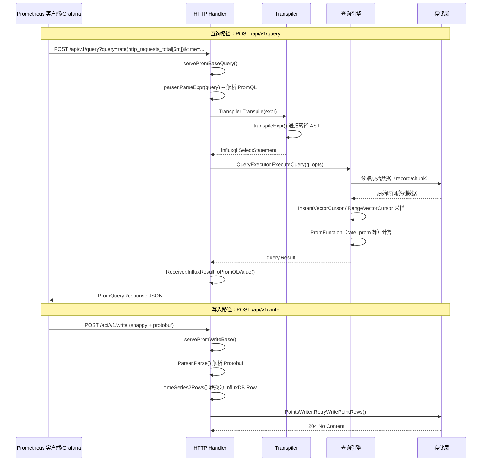

### 1.4 核心数据流总览

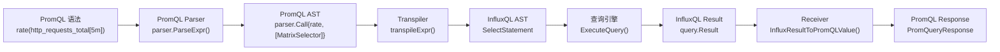

---

## 2. Transpiler 核心结构

### 2.1 Transpiler 结构体

**代码位置**：`lib/util/lifted/promql2influxql/transpiler.go:16-28`

```go
// Transpiler 负责将单个 PromQL 表达式转译为 InfluxQL 表达式。
// 它在工作完成后会被 GC 回收。
type Transpiler struct {
    PromCommand                        // 嵌入查询命令参数（时间范围、步长、数据库等）
    timeRange          time.Duration   // 当前 MatrixSelector 的时间窗口范围（如 5m）
    parenExprCount     int             // 括号表达式计数，用于生成 InfluxQL ParenExpr
    dropMetric         bool            // 是否丢弃 __name__ 标签（聚合查询时为 true）
    duplicateResult    bool            // 是否需要复制结果（StepInvariant 表达式时为 true）
    minT, maxT         int64           // 查询的最小/最大时间戳（毫秒）
    timeCondition      influxql.Expr   // 缓存的时间条件表达式
    isStepVariantExpr  bool            // 表达式是否与步长相关
    upperSubquery      int             // 嵌套子查询的层级深度
    subStartT, subEndT int64           // 子查询的起止时间
    lowerStepInvariant bool            // 下层是否为步长无关表达式
}
```

**通俗解释**：

- **PromCommand**：嵌入的查询命令，包含了用户请求中的所有参数——查询语句（Cmd）、数据库（Database）、时间范围（Start/End/Step）、回溯窗口（LookBackDelta）等
- **timeRange**：当遇到 `http_requests_total[5m]` 这样的 MatrixSelector 时，`[5m]` 就会被存入 `timeRange`，后续用于生成 InfluxQL 的时间窗口
- **dropMetric**：这是聚合查询的关键标志。当你写 `sum(rate(...))` 时，外层的 `sum` 聚合会设置 `dropMetric = true`，意味着最终结果中不需要 `__name__` 标签（因为聚合后的指标名已无意义）
- **duplicateResult**：当表达式是步长无关的（如 `vector(1)`），值在每个时间步都一样，只需要改变时间戳即可，设置此标志后 Receiver 层会自动复制结果

### 2.2 PromCommand 模型

**代码位置**：`lib/util/lifted/promql2influxql/models.go:29-66`

```go
// PromCommand 包装了一个原始查询表达式及其相关属性
type PromCommand struct {
    Cmd             string           // 原始 PromQL 查询语句
    Database        string           // 目标数据库
    RetentionPolicy string           // 保留策略
    Measurement     string           // 度量名称（MetricStore 模式下使用）
    Exact           bool             // 是否精确查询（元数据查询用）
    Start      *time.Time            // range query 的起始时间
    End        *time.Time            // range query 的结束时间
    Timezone   *time.Location        // 时区
    Evaluation *time.Time            // instant query 的评估时间点
    Step       time.Duration         // 评估步长（如 15s、1m）

    // LookBackDelta 回溯窗口，PromQL 计算中点查找的最大回溯间隔，默认 5m
    LookBackDelta time.Duration

    DataType    DataType             // 查询数据类型（TABLE/GRAPH/LABEL_KEYS 等）
    ValueFieldKey string             // 使用的字段名（默认 "value"）
    LabelName   string               // label values 查询时的标签名
}
```

### 2.3 DataType 枚举

**代码位置**：`lib/util/lifted/promql2influxql/models.go:19-27`

```go
type DataType int

const (
    TABLE_DATA      DataType = iota // 原始表格数据查询
    GRAPH_DATA                      // 时间绑定的图形数据查询
    LABEL_KEYS_DATA                 // 标签键查询（如 /api/v1/labels）
    LABEL_VALUES_DATA               // 标签值查询（如 /api/v1/label/{name}/values）
    SERIES_DATA                     // 序列查询（如 /api/v1/series）
    META_DATA                       // 元数据查询（如 /api/v1/metadata）
    UNKNOWN_DATA                    // 未知类型
)
```

**通俗解释**：
- `TABLE_DATA`：Grafana 的 Table 面板使用，返回原始时间点
- `GRAPH_DATA`：Grafana 的 Time Series 面板使用，返回带有时间戳的矩阵数据
- `LABEL_KEYS_DATA`/`LABEL_VALUES_DATA`：Grafana 的标签选择器（变量模板、面板查询编辑器中的 label 过滤器）
- `SERIES_DATA`：返回匹配的序列集合

### 2.4 FunctionType 与常量定义

**代码位置**：`lib/util/lifted/promql2influxql/constant.go`

```go
type FunctionType int

const (
    AGGREGATE_FN  FunctionType = iota + 1 // 聚合函数（如 sum、avg）
    SELECTOR_FN                           // 选择器函数（如 max、min、topk）
    TRANSFORM_FN                          // 变换函数（如 rate、abs）
    PREDICTOR_FN                          // 预测函数（如 predict_linear）
)

const (
    ArgNameOfTimeFunc          string = "prom_time"
    DefaultFieldKey            string = "value"       // Prometheus 默认字段名
    DefaultMetricKeyLabel      string = "__name__"    // Prometheus 指标名标签
    DefaultMeasurementName     string = "prom_metric_not_specified"
    DefaultDatabaseName        string = "prom"
    DefaultRetentionPolicyName string = "autogen"
    TimeField                  string = "time"
    PromSuffix                 string = "_prom"       // 后缀，用于区分 openGemini 原生函数与 Prom 函数
)

const DefaultLookBackDelta = 5 * time.Minute  // 默认回溯窗口
```

**通俗解释**：

- `_prom` 后缀约定：openGemini 原生的 InfluxQL 已经有 `max`、`min`、`count` 等函数，但它们的语义可能与 Prometheus 的实现不完全相同。为了避免冲突，PromQL 兼容层的函数使用 `_prom` 后缀（如 `max_prom`、`min_prom`、`count_prom`），确保两套函数系统互不干扰。
- `DefaultFieldKey = "value"`：Prometheus 中所有样本都是 `metric_name{labels} value`，字段名固定为 `value`，而 InfluxDB/InfluxQL 支持多字段，因此需要指定使用哪个字段。

---

## 3. 递归转译流程

### 3.1 入口函数 Transpile()

**代码位置**：`lib/util/lifted/promql2influxql/transpiler.go:45-59`

```go
// Transpile 将设置了时间范围的 PromQL 表达式转换为 InfluxQL 表达式。
// 生成的 InfluxQL 表达式可以被执行，结果需要使用 InfluxResultToPromQLValue()
// 转换为与原生 PromQL 执行完全等价的结果值。
// 在转译过程中，转译器递归地将 PromQL AST 翻译为等价的 InfluxQL AST。
func (t *Transpiler) Transpile(expr parser.Expr) (influxql.Node, error) {
    // 步骤1：如果不是元数据查询，先进行预处理
    if !IsMetaQuery(t.DataType) {
        s := t.newEvalStmt(expr)           // 创建评估语句，设置 Start/End/Interval
        t.rewriteMinMaxTime()              // 计算 minT 和 maxT
        // 步骤2：处理 @ 修饰符，调整 selector 的偏移量
        setOffsetForAtModifier(timeMilliseconds(s.Start), s.Expr)
        expr = s.Expr
    }
    // 步骤3：递归转译
    influxNode, err := t.transpile(expr)
    if err != nil {
        return nil, errno.NewError(errno.TranspileExprFail, err.Error())
    }
    return influxNode, nil
}
```

**通俗解释**：

`Transpile()` 是整个转译过程的入口。它做三件事：
1. **预处理**：创建 `EvalStmt`，计算查询的时间范围（minT/maxT），处理 `@` 修饰符（如 `metric @ 1234567890` 这种固定时间点查询）
2. **递归转译**：调用 `transpile()` -> `transpileExpr()` 进行递归 AST 转换
3. **返回**：返回 InfluxQL 的 AST 节点（`influxql.Node`）

### 3.2 transpileExpr() 调度表

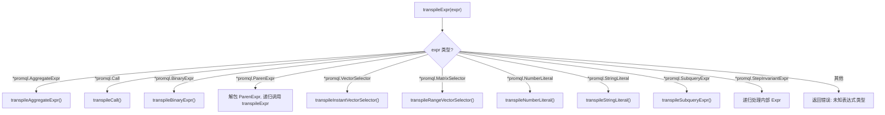

> 注意：当前 `transpileExpr()` 没有 `VectorLiteral` / `transpileVectorLiteral()` 分支。PromQL 的 `vector(1)` 按普通函数调用路径处理；如果 AST 节点不在上述 switch 分支内，会返回 `UnsupportedNodeType`。

**代码位置**：`lib/util/lifted/promql2influxql/transpiler.go:69-96`

```go
// transpileExpr 递归转译 PromQL 表达式
func (t *Transpiler) transpileExpr(expr parser.Expr) (influxql.Node, error) {
    switch e := expr.(type) {
    case *parser.ParenExpr:         // 括号表达式：(expr)
        return t.transpileParenExpr(e)
    case *parser.UnaryExpr:         // 一元表达式：-expr
        return t.transpileUnaryExpr(e)
    case *parser.NumberLiteral:     // 数字字面量：1.5, 42
        return &influxql.NumberLiteral{Val: e.Val}, nil
    case *parser.StringLiteral:     // 字符串字面量："hello"
        return &influxql.StringLiteral{Val: e.Val}, nil
    case *parser.VectorSelector:    // 即时向量选择器：http_requests_total{method="GET"}
        return t.transpileInstantVectorSelector(e)
    case *parser.MatrixSelector:    // 范围向量选择器：http_requests_total[5m]
        return t.transpileRangeVectorSelector(e)
    case *parser.AggregateExpr:     // 聚合表达式：sum by (method)(rate(...))
        return t.transpileAggregateExpr(e)
    case *parser.BinaryExpr:        // 二元表达式：a + b, a > b
        return t.transpileBinaryExpr(e)
    case *parser.Call:              // 函数调用：rate(...), histogram_quantile(...)
        return t.transpileCall(e)
    case *parser.StepInvariantExpr: // 步长无关表达式：由预处理阶段包装
        return t.transpileStepInvariantExpr(e)
    case *parser.SubqueryExpr:      // 子查询：http_requests_total[5m:1m]
        return t.transpileSubqueryExpr(e)
    default:
        return nil, errno.NewError(errno.UnsupportedNodeType, expr.String())
    }
}
```

**通俗解释**：

这是整个转译器的"调度中心"。它根据 PromQL AST 节点的类型，分发到不同的转译函数：

| PromQL 节点类型 | 示例 | 转译目标 |
|----------------|------|----------|
| `NumberLiteral` | `42` | 直接映射为 `influxql.NumberLiteral` |
| `StringLiteral` | `"hello"` | 直接映射为 `influxql.StringLiteral` |
| `VectorSelector` | `http_requests_total{method="GET"}` | 转译为 `SelectStatement`，WHERE 子句包含标签条件 |
| `MatrixSelector` | `http_requests_total[5m]` | 先设置 `timeRange`，再转译内部的 VectorSelector |
| `AggregateExpr` | `sum by (method)(...)` | 转译为带 GROUP BY 的 `SelectStatement` |
| `BinaryExpr` | `a + b` | 转译为 `BinaryExpr` 或特殊的 `BinOp` 节点 |
| `Call` | `rate(...)` | 查函数表，转译为对应的 InfluxQL 函数调用 |
| `SubqueryExpr` | `metric[5m:1m]` | 递归处理，调整时间范围和步长 |

### 3.3 具体例子：完整转译链

以 `rate(http_requests_total{method="GET"}[5m])` 为例：

```
PromQL: rate(http_requests_total{method="GET"}[5m])

步骤1: parser.ParseExpr() 生成 AST:
  Call{
    Func: rate,
    Args: [
      MatrixSelector{
        Range: 5m,
        VectorSelector: VectorSelector{
          Name: "http_requests_total",
          LabelMatchers: [method="GET"]
        }
      }
    ]
  }

步骤2: transpileExpr(Call) -> transpileCall(rate)
  a. 先转译参数：transpileExpr(MatrixSelector)
    -> transpileRangeVectorSelector: 设置 timeRange=5m, 递归调用 transpileExpr(VectorSelector)
    -> transpileInstantVectorSelector: 生成 SelectStatement
      Sources: [http_requests_total]
      Condition: time >= (minT - 5m) AND time <= maxT AND method = 'GET'
      Fields: [value]
      Dimensions: [*]
  b. 查 rangeVectorFunctions 表，找到 "rate" -> name="rate_prom"
  c. 调用 setAggregateFields 设置字段为 rate_prom(value)
  d. 设置 GROUP BY time(step) 和 NoFill

最终 InfluxQL:
  SELECT rate_prom(value) FROM http_requests_total
  WHERE time >= (start - 5m) AND time <= end AND method = 'GET'
  GROUP BY *, time(step) fill(none)
```

---

## 4. Selector 处理

### 4.1 InstantVectorSelector 转译

**代码位置**：`lib/util/lifted/promql2influxql/selector.go:250-363`

```go
// transpileInstantVectorSelector 将 PromQL VectorSelector 转译为 InfluxQL 语句
func (t *Transpiler) transpileInstantVectorSelector(v *parser.VectorSelector) (influxql.Node, error) {
    var (
        err           error
        timeCondition influxql.Expr
        tagCondition  influxql.Expr
    )
    // 步骤1：生成时间条件和标签条件
    timeCondition, tagCondition, err = t.transpileVectorSelector2ConditionExpr(v)
    if err != nil {
        return nil, errno.NewError(errno.TranspileIVSFail, err.Error())
    }
    condition := CombineConditionAnd(timeCondition, tagCondition)

    // 步骤2：根据 DataType 生成不同的 InfluxQL 语句
    switch t.DataType {
    case LABEL_KEYS_DATA:
        // 生成 SHOW TAG KEYS 语句
        showTagKeysStatement := influxql.ShowTagKeysStatement{
            Database:  t.Database,
            Condition: condition,
        }
        // ... 设置 Sources
        return &showTagKeysStatement, nil

    case LABEL_VALUES_DATA:
        // 生成 SHOW TAG VALUES 语句
        showTagValuesStatement := influxql.ShowTagValuesStatement{
            Database:   t.Database,
            Op:         influxql.EQ,
            TagKeyExpr: &influxql.StringLiteral{Val: t.LabelName},
            Condition:  condition,
        }
        // ... 设置 Sources
        return &showTagValuesStatement, nil

    case SERIES_DATA:
        // 生成 SHOW SERIES 语句
        // ...

    default:
        // 步骤3：常规查询，生成 SELECT 语句
        selectStatement := &influxql.SelectStatement{
            Condition:   condition,
            Dimensions:  []*influxql.Dimension{{Expr: &influxql.Wildcard{}}},
            IsPromQuery: true,
        }
        // 确定 measurement 来源
        if t.HaveMetricStore() {
            selectStatement.Sources = []influxql.Source{&influxql.Measurement{Name: t.Measurement}}
        } else {
            mst, err := getMeasurementBySelector(v)
            // ...
            selectStatement.Sources = []influxql.Source{mst}
        }
        // 添加 value 字段
        selectStatement.Fields = append(selectStatement.Fields, &influxql.Field{
            Expr:  &influxql.VarRef{Val: valueFieldKey, Alias: DefaultFieldKey},
            Alias: DefaultFieldKey,
        })
        // 设置 PromQL 查询参数
        if t.Step > 0 {
            selectStatement.Step = t.Step
        }
        if t.timeRange > 0 {
            selectStatement.Range = t.timeRange
            t.timeRange = 0  // 使用后重置
        }
        selectStatement.LookBackDelta = t.LookBackDelta
        selectStatement.QueryOffset = v.Offset
        return selectStatement, nil
    }
}
```

**通俗解释**：

`VectorSelector` 是 PromQL 中最基本的查询单元，如 `http_requests_total{method="GET"}`。转译过程：

1. **生成条件**：
   - 时间条件：`time >= (minT - lookBackDelta) AND time <= maxT`
   - 标签条件：`method = 'GET'`（支持 `=`、`!=`、`=~`、`!~` 四种匹配符）
   - 两者用 AND 组合

2. **生成 SELECT 语句**：
   - `FROM http_requests_total`：指标名作为 measurement
   - `SELECT value`：默认字段
   - `GROUP BY *`：保留所有标签作为分组维度
   - `IsPromQuery: true`：标记这是 PromQL 查询，引擎会使用 PromQL 专属的采样逻辑

3. **设置查询参数**：
   - `Step`：查询步长，用于 `GROUP BY time(step)`
   - `Range`：窗口范围（从 MatrixSelector 继承）
   - `LookBackDelta`：回溯窗口（默认 5m）
   - `QueryOffset`：查询偏移量

### 4.2 标签条件生成

**代码位置**：`lib/util/lifted/promql2influxql/selector.go:73-122`

```go
func GetTagCondition(v *parser.VectorSelector, haveMetricStore bool) (influxql.Expr, error) {
    var tagCond influxql.Expr
    for _, item := range v.LabelMatchers {
        // 跳过保留标签 __name__（除非使用 MetricStore）
        if _, ok := reservedTags[item.Name]; ok && !haveMetricStore {
            continue
        }
        if len(item.Value) == 0 {
            continue
        }
        var cond *influxql.BinaryExpr
        switch item.Type {
        case labels.MatchEqual:      // method = "GET"
            cond = &influxql.BinaryExpr{
                Op:  influxql.EQ,
                LHS: &influxql.VarRef{Val: item.Name},
                RHS: &influxql.StringLiteral{Val: escapeSingleQuotes(item.Value)},
            }
        case labels.MatchNotEqual:   // method != "GET"
            cond = &influxql.BinaryExpr{
                Op:  influxql.NEQ,
                LHS: &influxql.VarRef{Val: item.Name},
                RHS: &influxql.StringLiteral{Val: escapeSingleQuotes(item.Value)},
            }
        case labels.MatchRegexp:     // method =~ "GET|POST"
            re, err := regexp.Compile(escapeSlashes(item.Value))
            // ...
            cond = &influxql.BinaryExpr{
                Op:  influxql.EQREGEX,
                LHS: &influxql.VarRef{Val: item.Name},
                RHS: &influxql.RegexLiteral{Val: re},
            }
        case labels.MatchNotRegexp:  // method !~ "DELETE"
            // ...类似，使用 NEQREGEX
        }
        tagCond = CombineConditionAnd(tagCond, cond)
    }
    return tagCond, nil
}
```

### 4.3 RangeVectorSelector 转译

**代码位置**：`lib/util/lifted/promql2influxql/selector.go:366-371`

```go
// transpileRangeVectorSelector 将 PromQL MatrixSelector 转译为 InfluxQL SelectStatement
func (t *Transpiler) transpileRangeVectorSelector(v *parser.MatrixSelector) (influxql.Node, error) {
    if v.Range > 0 {
        t.timeRange = v.Range  // 将 [5m] 中的 5m 存入 timeRange
    }
    return t.transpileExpr(v.VectorSelector)  // 递归转译内部的 VectorSelector
}
```

**通俗解释**：

`MatrixSelector`（如 `http_requests_total[5m]`）的转译非常简洁：
1. 将范围参数 `[5m]` 保存到 `t.timeRange`
2. 递归调用 `transpileExpr` 处理内部的 `VectorSelector`

`timeRange` 会在后续 `transpileInstantVectorSelector` 中被使用，用于：
- 调整查询的起始时间（`start = start - timeRange`）
- 设置 `SelectStatement.Range` 字段
- 传递给引擎层的 `RangeVectorCursor`

### 4.4 时间条件生成

**代码位置**：`lib/util/lifted/promql2influxql/selector.go:32-71`

```go
func GetTimeCondition(start, end *time.Time) influxql.Expr {
    var timeLhs, timeRhs *influxql.BinaryExpr
    if start != nil {
        timeLhs = &influxql.BinaryExpr{
            Op:  influxql.GTE,  // >=
            LHS: &influxql.VarRef{Val: TimeField},
            RHS: &influxql.TimeLiteral{Val: *start},
        }
    }
    if end != nil {
        timeRhs = &influxql.BinaryExpr{
            Op:  influxql.LTE,  // <=
            LHS: &influxql.VarRef{Val: TimeField},
            RHS: &influxql.TimeLiteral{Val: *end},
        }
    }
    if timeLhs == nil && timeRhs == nil {
        return nil
    }
    if timeLhs == nil { return timeRhs }
    if timeRhs == nil { return timeLhs }
    // 组合为 AND：time >= start AND time <= end
    return &influxql.BinaryExpr{
        Op:  influxql.AND,
        LHS: timeLhs,
        RHS: timeRhs,
    }
}
```

---

## 5. 函数调用翻译

### 5.1 六大函数映射表

PromQL 兼容层定义了 6 个函数映射表，覆盖了 PromQL 标准库中的绝大多数函数：

#### 5.1.1 rangeVectorFunctions（范围向量函数，20 个）

**代码位置**：`lib/util/lifted/promql2influxql/call.go:18-110`

```go
var rangeVectorFunctions = map[string]aggregateFn{
    "sum_over_time":     {name: "sum_over_time",         functionType: AGGREGATE_FN},
    "avg_over_time":     {name: "avg_over_time",         functionType: AGGREGATE_FN},
    "max_over_time":     {name: "max_over_time",         functionType: SELECTOR_FN},
    "min_over_time":     {name: "min_over_time",         functionType: SELECTOR_FN},
    "count_over_time":   {name: "count_over_time",       functionType: AGGREGATE_FN},
    "stddev_over_time":  {name: "stddev_over_time_prom", functionType: AGGREGATE_FN},
    "present_over_time": {name: "present_over_time_prom",functionType: AGGREGATE_FN},
    "last_over_time":    {name: "last_over_time_prom",   functionType: AGGREGATE_FN, keepMetric: true},
    "quantile_over_time":{name: "quantile_over_time_prom",functionType: SELECTOR_FN, vectorPosition: 1},
    "rate":              {name: "rate_prom",             functionType: TRANSFORM_FN},
    "irate":             {name: "irate_prom",            functionType: TRANSFORM_FN},
    "deriv":             {name: "deriv",                 functionType: TRANSFORM_FN},
    "predict_linear":    {name: "predict_linear",        functionType: TRANSFORM_FN},
    "increase":          {name: "increase",              functionType: TRANSFORM_FN},
    "delta":             {name: "delta_prom",            functionType: TRANSFORM_FN},
    "idelta":            {name: "idelta_prom",           functionType: TRANSFORM_FN},
    "stdvar_over_time":  {name: "stdvar_over_time_prom", functionType: TRANSFORM_FN},
    "holt_winters":      {name: "holt_winters_prom",     functionType: SELECTOR_FN, vectorPosition: 0},
    "changes":           {name: "changes_prom",          functionType: TRANSFORM_FN},
    "resets":            {name: "resets_prom",           functionType: TRANSFORM_FN},
    "absent_over_time":  {name: "absent_over_time_prom", functionType: AGGREGATE_FN},
    "mad_over_time":     {name: "mad_over_time_prom",    functionType: SELECTOR_FN},
}
```

**通俗解释**：

这些函数处理范围向量（带 `[5m]` 的查询），如 `rate(http_requests_total[5m])`。

关键的映射关系：
- `rate` -> `rate_prom`：名字加了 `_prom` 后缀
- `sum_over_time` -> `sum_over_time`：没有后缀，因为不存在命名冲突
- `stddev_over_time` -> `stddev_over_time_prom`：加了 `_prom` 后缀

`functionType` 决定了函数在引擎中的执行方式：
- `AGGREGATE_FN`：聚合函数，需要在滑动窗口内进行聚合计算
- `SELECTOR_FN`：选择器函数，从窗口中选择特定值
- `TRANSFORM_FN`：变换函数，对整个窗口的数据进行变换计算

`vectorPosition` 指定了哪个参数是向量数据（默认为最后一个参数位置）。例如 `quantile_over_time(0.99, metric[5m])` 中，`0.99` 是第一个参数，`metric[5m]` 是第二个（position=1）。

#### 5.1.2 instantVectorFunctions（即时向量函数，3 个）

**代码位置**：`lib/util/lifted/promql2influxql/call.go:112-127`

```go
var instantVectorFunctions = map[string]aggregateFn{
    "histogram_quantile": {name: "histogram_quantile", functionType: AGGREGATE_FN, vectorPosition: 1},
    "scalar":            {name: "scalar_prom",        functionType: AGGREGATE_FN},
    "absent":            {name: "absent_prom",        functionType: AGGREGATE_FN},
}
```

#### 5.1.3 vectorMathFunctions（数学函数，27 个）

**代码位置**：`lib/util/lifted/promql2influxql/call.go:128-264`

```go
var vectorMathFunctions = map[string]aggregateFn{
    "abs":   {name: "abs",       functionType: TRANSFORM_FN, KeepFill: true},
    "ceil":  {name: "ceil",      functionType: TRANSFORM_FN, KeepFill: true},
    "floor": {name: "floor",     functionType: TRANSFORM_FN, KeepFill: true},
    "exp":   {name: "exp",       functionType: TRANSFORM_FN, KeepFill: true},
    "sqrt":  {name: "sqrt",      functionType: TRANSFORM_FN, KeepFill: true},
    "ln":    {name: "ln",        functionType: TRANSFORM_FN, KeepFill: true},
    "log2":  {name: "log2",      functionType: TRANSFORM_FN, KeepFill: true},
    "log10": {name: "log10",     functionType: TRANSFORM_FN, KeepFill: true},
    "round": {name: "round_prom",functionType: TRANSFORM_FN, KeepFill: true},
    "acos":  {name: "acos",      functionType: TRANSFORM_FN, KeepFill: true},
    "asin":  {name: "asin",      functionType: TRANSFORM_FN, KeepFill: true},
    "atan":  {name: "atan",      functionType: TRANSFORM_FN, KeepFill: true},
    "cos":   {name: "cos",       functionType: TRANSFORM_FN, KeepFill: true},
    "sin":   {name: "sin",       functionType: TRANSFORM_FN, KeepFill: true},
    "tan":   {name: "tan",       functionType: TRANSFORM_FN, KeepFill: true},
    "clamp":     {name: "clamp_prom",     functionType: TRANSFORM_FN, KeepFill: true},
    "clamp_max": {name: "clamp_max_prom", functionType: TRANSFORM_FN, KeepFill: true},
    "clamp_min": {name: "clamp_min_prom", functionType: TRANSFORM_FN, KeepFill: true},
    "rad":   {name: "rad",       functionType: TRANSFORM_FN, KeepFill: true},
    "deg":   {name: "deg",       functionType: TRANSFORM_FN, KeepFill: true},
    "sinh":  {name: "sinh",      functionType: TRANSFORM_FN, KeepFill: true},
    "cosh":  {name: "cosh",      functionType: TRANSFORM_FN, KeepFill: true},
    "tanh":  {name: "tanh",      functionType: TRANSFORM_FN, KeepFill: true},
    "asinh": {name: "asinh",     functionType: TRANSFORM_FN, KeepFill: true},
    "atanh": {name: "atanh",     functionType: TRANSFORM_FN, KeepFill: true},
    "sgn":   {name: "sgn",       functionType: TRANSFORM_FN, KeepFill: true},
    "acosh": {name: "acosh",     functionType: TRANSFORM_FN, KeepFill: true},
}
```

**注意 `KeepFill: true`**：数学函数不会改变数据的填充方式，因此保留原始的 fill 行为。

#### 5.1.4 vectorLabelFunctions（标签函数，2 个）

```go
var vectorLabelFunctions = map[string]aggregateFn{
    "label_replace": {name: "label_replace", functionType: TRANSFORM_FN, KeepFill: true},
    "label_join":    {name: "label_join",    functionType: TRANSFORM_FN, KeepFill: true},
}
```

#### 5.1.5 vectorTimeFunctions（时间函数，12 个，包含 pi）

```go
var vectorTimeFunctions = map[string]aggregateFn{
    "year":          {name: "year_prom",          functionType: TRANSFORM_FN, KeepFill: true},
    "time":          {name: "time_prom",          functionType: TRANSFORM_FN, KeepFill: true},
    "timestamp":     {name: "timestamp_prom",     functionType: TRANSFORM_FN, KeepFill: true},
    "month":         {name: "month_prom",         functionType: TRANSFORM_FN, KeepFill: true},
    "minute":        {name: "minute_prom",        functionType: TRANSFORM_FN, KeepFill: true},
    "hour":          {name: "hour_prom",          functionType: TRANSFORM_FN, KeepFill: true},
    "day_of_week":   {name: "day_of_week_prom",   functionType: TRANSFORM_FN, KeepFill: true},
    "day_of_month":  {name: "day_of_month_prom",  functionType: TRANSFORM_FN, KeepFill: true},
    "day_of_year":   {name: "day_of_year_prom",   functionType: TRANSFORM_FN, KeepFill: true},
    "days_in_month": {name: "days_in_month_prom", functionType: TRANSFORM_FN, KeepFill: true},
    "vector":        {name: "vector_prom",        functionType: TRANSFORM_FN, KeepFill: true},
    "pi":            {name: "pi_prom",            functionType: TRANSFORM_FN, KeepFill: true},
}
```

#### 5.1.6 vectorSortFunctions（排序函数，4 个）

```go
var vectorSortFunctions = map[string]aggregateFn{
    "sort":              {name: "sort_prom",              functionType: SELECTOR_FN},
    "sort_desc":         {name: "sort_desc_prom",         functionType: SELECTOR_FN},
    "sort_by_label":     {name: "sort_by_label_prom",     functionType: SELECTOR_FN, vectorPosition: 0},
    "sort_by_label_desc":{name: "sort_by_label_desc_prom",functionType: SELECTOR_FN, vectorPosition: 0},
}
```

### 5.2 transpileCall() 调度逻辑

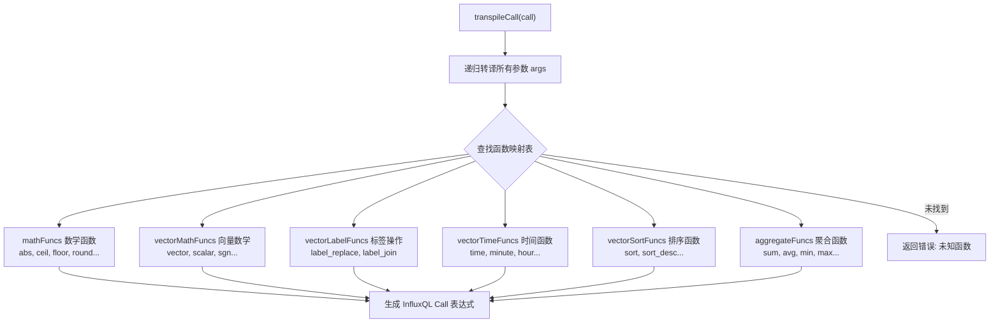

**代码位置**：`lib/util/lifted/promql2influxql/call.go:579-627`

```go
// transpileCall 转译 PromQL Call 表达式
func (t *Transpiler) transpileCall(a *parser.Call) (influxql.Node, error) {
    // 步骤1：递归转译所有参数
    args := make([]influxql.Node, len(a.Args))
    for i := range a.Args {
        unwrapParenExpr(&a.Args[i])
        a.Args[i] = unwrapStepInvariantExpr(a.Args[i])
        tArg, err := t.transpileExpr(a.Args[i])
        if err != nil {
            return nil, errno.NewError(errno.TranspileFunctionFail, err.Error())
        }
        args[i] = tArg
    }

    // 步骤2：按优先级在 6 个函数表中查找
    // 范围向量函数（rate, irate, avg_over_time 等）
    if fn, ok := rangeVectorFunctions[a.Func.Name]; ok {
        t.dropMetric = true
        if subExpr, subOk := a.Args[fn.vectorPosition].(*parser.SubqueryExpr); subOk {
            return t.transpilePromSubqueryFunc(subExpr, fn, args)
        }
        return t.transpilePromFunc(fn, args, t.setAggregateFields)
    }
    // 即时向量函数（histogram_quantile, scalar, absent）
    if fn, ok := instantVectorFunctions[a.Func.Name]; ok {
        t.dropMetric = true
        return t.transpilePromFunc(fn, args, t.setAggregateFields)
    }
    // 数学函数（abs, ceil, floor 等）
    if fn, ok := vectorMathFunctions[a.Func.Name]; ok {
        t.dropMetric = true
        return t.transpileVectorMathFunc(fn, args)
    }
    // 标签函数（label_replace, label_join）
    if fn, ok := vectorLabelFunctions[a.Func.Name]; ok {
        return t.transpileVectorLabelFunc(fn, args)
    }
    // 时间函数（year, month, hour 等）
    if fn, ok := vectorTimeFunctions[a.Func.Name]; ok {
        if a.Func.Name != "time" {
            t.dropMetric = true
        }
        return t.transpileVectorTimeFunc(fn, args)
    }
    // 排序函数（sort, sort_desc 等）
    if fn, ok := vectorSortFunctions[a.Func.Name]; ok {
        return t.transpileVectorSortFunc(fn, args)
    }

    return nil, errno.NewError(errno.UnsupportedPromExpr)
}
```

**通俗解释**：

`transpileCall` 是函数调用的转译调度器。它的核心逻辑：

1. **先转译参数**：递归处理所有参数，将 PromQL 参数转译为 InfluxQL 节点
2. **按表查找**：依次在 6 个函数映射表中查找函数名
3. **分发处理**：不同类型的函数使用不同的处理方式
4. **特殊处理子查询**：如果范围向量函数的参数是子查询（如 `rate(metric[5m:1m])`），使用 `transpilePromSubqueryFunc`

### 5.3 transpilePromFunc() 通用转译逻辑

**代码位置**：`lib/util/lifted/promql2influxql/call.go:459-511`

```go
func (t *Transpiler) transpilePromFunc(aggFn aggregateFn, inArgs []influxql.Node, setFieldsFunc SetFieldsFunc) (influxql.Node, error) {
    // 步骤1：分离表参数和函数参数
    table, parameter := t.transpileParameter(aggFn.vectorPosition, inArgs)

    node, ok := table.(influxql.Statement)
    if !ok {
        // 如果不是 Statement（而是纯表达式），直接构造 Call 表达式
        return t.transpilePromFuncWithExprArgs(aggFn, table)
    }

    switch statement := node.(type) {
    case *influxql.SelectStatement:
        field, _ := getSelectFieldIdx(statement)
        switch field.Expr.(type) {
        case *influxql.Call, *influxql.BinaryExpr:
            // 如果字段已经是函数调用或二元表达式，需要包装为子查询
            selectStatement := &influxql.SelectStatement{
                Sources: []influxql.Source{
                    &influxql.SubQuery{Statement: statement},
                },
                Step:        t.Step,
                IsPromQuery: true,
            }
            wrappedField := &influxql.Field{
                Expr:  &influxql.VarRef{Val: field.Name(), Alias: DefaultFieldKey},
                Alias: DefaultFieldKey,
            }
            setFieldsFunc(selectStatement, wrappedField, parameter, aggFn)
            t.setTimeCondition(selectStatement, false)
            if t.Step > 0 && !aggFn.KeepFill {
                t.setTimeInterval(selectStatement)
                selectStatement.Fill = influxql.NoFill
            }
            return selectStatement, nil

        default:
            // 如果字段是简单的 VarRef，直接在现有语句上设置聚合字段
            setFieldsFunc(statement, field, parameter, aggFn)
            if t.Step > 0 && !aggFn.KeepFill {
                t.setTimeInterval(statement)
                statement.Fill = influxql.NoFill
            }
        }
    }
    return table, nil
}
```

**通俗解释**：

`transpilePromFunc` 是所有 PromQL 函数转译的通用框架。核心逻辑：

1. **参数分离**：`transpileParameter()` 将参数列表拆分为"表参数"（向量数据）和"函数参数"（标量参数）
   - 例如 `quantile_over_time(0.99, metric[5m])` 中，`metric[5m]` 是表参数，`0.99` 是函数参数

2. **判断是否需要子查询包装**：
   - 如果字段已经是 `Call` 或 `BinaryExpr`（如 `rate(value)`），需要包装为子查询，外层再套聚合
   - 如果字段是简单的 `VarRef`（如 `value`），可以直接在当前语句上设置聚合函数

3. **设置聚合字段**：通过 `setFieldsFunc` 回调设置具体的聚合函数

---

## 6. 聚合表达式

### 6.1 aggregateFns 映射表

**代码位置**：`lib/util/lifted/promql2influxql/aggregate_expr.go:22-35`

```go
var aggregateFns = map[parser.ItemType]aggregateFn{
    parser.SUM:          {name: "sum",              functionType: AGGREGATE_FN},
    parser.AVG:          {name: "mean",             functionType: AGGREGATE_FN},
    parser.MAX:          {name: "max_prom",         functionType: SELECTOR_FN},
    parser.MIN:          {name: "min_prom",         functionType: SELECTOR_FN},
    parser.COUNT:        {name: "count_prom",       functionType: AGGREGATE_FN},
    parser.STDDEV:       {name: "stddev_prom",      functionType: AGGREGATE_FN},
    parser.TOPK:         {name: "top",              functionType: SELECTOR_FN,
                         expectIntegerParameter: true, keepMetric: true, keepAuxLabel: true},
    parser.BOTTOMK:      {name: "bottom",           functionType: SELECTOR_FN,
                         expectIntegerParameter: true, keepMetric: true, keepAuxLabel: true},
    parser.QUANTILE:     {name: "quantile_prom",    functionType: SELECTOR_FN},
    parser.COUNT_VALUES: {name: "count_values_prom",functionType: AGGREGATE_FN},
    parser.STDVAR:       {name: "stdvar_prom",      functionType: AGGREGATE_FN},
    parser.GROUP:        {name: "group_prom",       functionType: AGGREGATE_FN},
}
```

**通俗解释**：

PromQL 聚合操作符与 InfluxQL 函数的映射关系：

| PromQL 操作符 | InfluxQL 函数名 | 说明 |
|---------------|-----------------|------|
| `sum` | `sum` | 直接使用 InfluxQL 的 sum |
| `avg` | `mean` | InfluxQL 用 mean 表示平均值 |
| `max` | `max_prom` | 加 `_prom` 后缀，避免与 InfluxQL 原生 max 冲突 |
| `min` | `min_prom` | 加 `_prom` 后缀 |
| `count` | `count_prom` | 加 `_prom` 后缀 |
| `stddev` | `stddev_prom` | 加 `_prom` 后缀 |
| `topk` | `top` | InfluxQL 使用 top 函数 |
| `bottomk` | `bottom` | InfluxQL 使用 bottom 函数 |
| `quantile` | `quantile_prom` | 加 `_prom` 后缀 |
| `count_values` | `count_values_prom` | 加 `_prom` 后缀 |
| `stdvar` | `stdvar_prom` | 加 `_prom` 后缀 |
| `group` | `group_prom` | 加 `_prom` 后缀 |

**特别注意**：
- `TOPK` 和 `BOTTOMK` 的 `keepMetric: true, keepAuxLabel: true`：这两个函数在聚合后仍需保留原始的指标标签（因为 topk 选择的是完整的时间序列，不是聚合值）
- `expectIntegerParameter: true`：topk/bottomk 的第一个参数（k 值）期望是整数

### 6.2 transpileAggregateExpr() 转译逻辑

**代码位置**：`lib/util/lifted/promql2influxql/aggregate_expr.go:163-261`

```go
// transpileAggregateExpr 将 PromQL AggregateExpr 转译为 InfluxQL SelectStatement
func (t *Transpiler) transpileAggregateExpr(a *parser.AggregateExpr) (influxql.Node, error) {
    // 步骤1：递归转译子表达式
    t.dropMetric = true
    expr, err := t.transpileExpr(a.Expr)
    if err != nil {
        return nil, errno.NewError(errno.TranspileAggFail, err.Error())
    }

    // 步骤2：处理 dropMetric 标志
    if a.Without {
        t.dropMetric = true
    } else {
        // 检查 grouping 中是否包含 __name__
        for _, field := range a.Grouping {
            if field == DefaultMetricKeyLabel {
                t.dropMetric = false
                break
            }
        }
    }

    // 步骤3：处理聚合参数（如 quantile 的百分位数参数）
    var parameter []influxql.Expr
    if a.Param != nil {
        unwrapParenExpr(&a.Param)
        a.Param = unwrapStepInvariantExpr(a.Param)
        param, err := t.transpileExpr(a.Param)
        if err != nil {
            return nil, errno.NewError(errno.TranspileAggFail, err.Error())
        }
        parameter = []influxql.Expr{param.(influxql.Expr)}
    }

    // 步骤4：查找聚合函数
    aggFn, ok := aggregateFns[a.Op]
    if !ok {
        return nil, errno.NewError(errno.UnsupportedAggType, a.Op.String())
    }

    // 步骤5：根据子表达式类型分别处理
    switch statement := node.(type) {
    case *influxql.SelectStatement:
        field, _ := getSelectFieldIdx(statement)
        switch field.Expr.(type) {
        case *influxql.Call, *influxql.BinaryExpr, *influxql.ParenExpr:
            // 优化：尝试下推聚合到函数表达式
            if t.canPushDownAggWithFunction(a, statement, field, parameter, aggFn) {
                return statement, nil
            }
            // 包装为子查询
            selectStatement := &influxql.SelectStatement{
                Sources: []influxql.Source{&influxql.SubQuery{Statement: statement}},
                Step:    t.Step,
                IsPromQuery: true,
            }
            // ... 设置字段、条件、维度
            return selectStatement, nil

        case *influxql.VarRef:
            // 直接在当前语句上设置聚合
            t.setAggregateFields(statement, field, parameter, aggFn)
            statement.Dimensions = statement.Dimensions[:0]
            t.setAggregateDimension(statement, a.Without, a.Grouping...)
            if t.Step > 0 {
                t.setTimeInterval(statement)
                statement.Fill = influxql.NoFill
            }
            return statement, nil
        }
    }
}
```

**通俗解释**：

以 `sum by (method)(rate(http_requests_total[5m]))` 为例：

1. **递归转译子表达式**：`rate(http_requests_total[5m])` -> `SelectStatement` with `rate_prom(value)`
2. **处理 grouping**：`by (method)` 设置分组维度；如果 grouping 包含 `__name__`，则保留指标名
3. **查找聚合函数**：`SUM` -> `name: "sum"`
4. **子表达式是函数调用**（`rate_prom`）：
   - 尝试优化下推：`canPushDownAggWithFunction` 检查是否可以将聚合直接添加到现有语句
   - 如果不行，包装为子查询

最终 InfluxQL：
```sql
SELECT sum(rate_prom(value)) FROM (
    SELECT rate_prom(value) FROM http_requests_total
    WHERE time >= ... AND time <= ...
    GROUP BY *, time(step) fill(none)
) GROUP BY method
```

### 6.3 by/without 维度处理

**代码位置**：`lib/util/lifted/promql2influxql/aggregate_expr.go:88-124`

```go
// setAggregateDimension 设置 selectStatement 的 GROUP BY 表达式
func (t *Transpiler) setAggregateDimension(statement *influxql.SelectStatement, without bool, grouping ...string) {
    if !without {
        // by (label1, label2)：直接使用 grouping 作为维度
        t.generateDimension(statement, grouping...)
        return
    }
    // without (label1, label2)：从完整维度集中排除 grouping
    if len(statement.Sources) != 1 {
        panic("the number of source should be 1 for promql agg query")
    }
    switch source := statement.Sources[0].(type) {
    case *influxql.Measurement:
        // 从全集中排除
        statement.Without = true
        t.generateDimension(statement, grouping...)
    case *influxql.SubQuery:
        // 从子查询维度中排除
        if source.Statement.Without {
            statement.Without = true
            t.generateDimension(statement, grouping...)
            return
        }
        t.setAggregateDimensionOfSubquery(source.Statement.Dimensions, statement, grouping...)
    case *influxql.BinOp:
        // 从两个子查询的联合维度中排除
        // ...
    }
}
```

**通俗解释**：

- `sum by (method)`：GROUP BY method
- `sum without (instance)`：GROUP BY 除 instance 外的所有标签（通过设置 `Without: true` 实现）
- 子查询场景：需要从子查询的维度列表中排除 `without` 指定的标签

---

## 7. 二元表达式

### 7.1 运算符映射

**代码位置**：`lib/util/lifted/promql2influxql/binary_expr.go:9-27`

```go
// 算术运算符映射
var arithBinOps = map[parser.ItemType]influxql.Token{
    parser.ADD:   influxql.ADD,      // +
    parser.SUB:   influxql.SUB,      // -
    parser.MUL:   influxql.MUL,      // *
    parser.DIV:   influxql.DIV,      // /
    parser.MOD:   influxql.MOD,      // %
    parser.POW:   influxql.POW_OP,   // ^
    parser.ATAN2: influxql.ATAN2_OP, // atan2
}

// 比较运算符映射
var compBinOps = map[parser.ItemType]influxql.Token{
    parser.EQLC: influxql.EQ,   // ==
    parser.NEQ:  influxql.NEQ,  // !=
    parser.GTR:  influxql.GT,   // >
    parser.LSS:  influxql.LT,   // <
    parser.GTE:  influxql.GTE,  // >=
    parser.LTE:  influxql.LTE,  // <=
}
```

### 7.2 transpileBinaryExpr() 三路分发

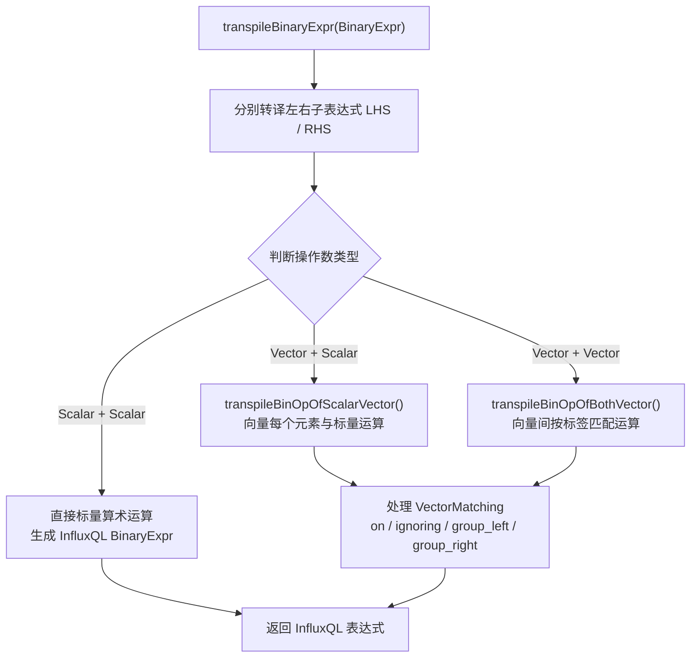

**代码位置**：`lib/util/lifted/promql2influxql/binary_expr.go:222-288`

```go
// transpileBinaryExpr 转译 PromQL BinaryExpr
func (t *Transpiler) transpileBinaryExpr(b *parser.BinaryExpr) (influxql.Node, error) {
    // 步骤1：分别转译左右子表达式
    lhs, err := t.transpileExpr(b.LHS)
    if err != nil { return nil, errno.NewError(errno.UnableLeftBinOp, err.Error()) }
    lDropMetric := t.dropMetric
    t.dropMetric = false
    rhs, err := t.transpileExpr(b.RHS)
    if err != nil { return nil, errno.NewError(errno.UnableRightBinOp, err) }
    rDropMetric := t.dropMetric

    // 步骤2：根据操作数类型分发
    switch {
    case yieldsFloat(b.LHS) && yieldsFloat(b.RHS):
        // 情况1：标量 vs 标量（如 1 + 2）
        if op, ok := arithBinOps[b.Op]; ok {
            return t.NewBinaryExpr(op, lhs.(influxql.Expr), rhs.(influxql.Expr), false), nil
        }
        if op, ok := compBinOps[b.Op]; ok {
            return t.NewBinaryExpr(op, lhs.(influxql.Expr), rhs.(influxql.Expr), b.ReturnBool), nil
        }

    case yieldsFloat(b.LHS) && yieldsTable(b.RHS),
         yieldsTable(b.LHS) && yieldsFloat(b.RHS):
        // 情况2：标量 vs 向量（如 metric > 100）
        swap := yieldsFloat(b.LHS) && yieldsVector(b.RHS)
        if op, ok := arithBinOps[b.Op]; ok {
            return t.transpileArithBinOps(b, op, lhs, rhs, swap)
        }
        if op, ok := compBinOps[b.Op]; ok {
            return t.transpileCompBinOps(b, op, lhs, rhs, swap)
        }

    case yieldsVector(b.LHS) && yieldsVector(b.RHS):
        // 情况3：向量 vs 向量（如 metric1 + metric2）
        // ...使用 BinOp 节点实现向量匹配

    default:
        return nil, errno.NewError(errno.UnsupportedBothVS, b.String())
    }
    return nil, errno.NewError(errno.InvalidSVBinOp, b.Op.String())
}
```

**通俗解释**：

二元表达式有三种情况：

1. **标量 vs 标量**（`1 + 2`）：直接映射为 `influxql.BinaryExpr`
2. **标量 vs 向量**（`metric > 100`）：
   - 算术运算：将标量运算嵌入到向量的字段表达式中（如 `SELECT value + 100 FROM ...`）
   - 比较运算：将比较条件添加到 WHERE 子句（如 `WHERE value > 100`）
3. **向量 vs 向量**（`metric1 + metric2`）：使用 `influxql.BinOp` 节点，需要处理向量匹配（on/ignoring、group_left/group_right）

### 7.3 BinOp 节点

**代码位置**：`lib/util/lifted/promql2influxql/binary_expr.go:338-366`

```go
func (t *Transpiler) transpileBinOpOfBothVector(b *parser.BinaryExpr, op influxql.Token, lStmt, rStmt *influxql.SelectStatement) (influxql.Node, error) {
    lSub := &influxql.SubQuery{Statement: lStmt}
    rSub := &influxql.SubQuery{Statement: rStmt}
    binOp := &influxql.BinOp{
        LSrc:        lSub,                              // 左操作数源
        RSrc:        rSub,                              // 右操作数源
        OpType:      int(op),                           // 操作类型
        On:          b.VectorMatching.On,               // on 标签
        MatchKeys:   b.VectorMatching.MatchingLabels,   // 匹配标签
        MatchCard:   influxql.MatchCardinality(b.VectorMatching.Card),  // 基数（one/many）
        IncludeKeys: b.VectorMatching.Include,           // include 标签
        ReturnBool:  b.ReturnBool,                       // bool 修饰符
    }
    newStmt := &influxql.SelectStatement{
        Sources:     influxql.Sources{binOp},
        Fields:      influxql.Fields{&influxql.Field{Expr: &influxql.VarRef{Val: DefaultFieldKey}}},
        IsPromQuery: true,
        Step:        lStmt.Step,
    }
    return newStmt, nil
}
```

**通俗解释**：

`BinOp` 是 openGemini 为 PromQL 向量-向量二元运算专门扩展的 InfluxQL 节点。它封装了：
- 两个子查询源（LSrc/RSrc）
- 操作类型
- 向量匹配规则（on/ignoring/group_left/group_right）

---

## 8. 引擎层实现

### 8.1 PromFunction 接口与注册

**代码位置**：`engine/prom_functions.go:29-77`

```go
func init() {
    // 注册 21 个 PromQL 函数到引擎层
    RegistryPromFunction("rate_prom",              &rateOp{})
    RegistryPromFunction("irate_prom",             &irateOp{})
    RegistryPromFunction("avg_over_time",          &avgOp{})
    RegistryPromFunction("count_over_time",        &countOp{})
    RegistryPromFunction("sum_over_time",          &sumOp{})
    RegistryPromFunction("min_over_time",          &minOp{})
    RegistryPromFunction("max_over_time",          &maxOp{})
    RegistryPromFunction("last_over_time_prom",    &lastOp{})
    RegistryPromFunction("increase",               &increaseOp{})
    RegistryPromFunction("deriv",                  &derivOp{})
    RegistryPromFunction("predict_linear",         &predictLinearOp{})
    RegistryPromFunction("delta_prom",             &deltaOp{})
    RegistryPromFunction("idelta_prom",            &ideltaOp{})
    RegistryPromFunction("stdvar_over_time_prom",  &stdVarOverTime{})
    RegistryPromFunction("stddev_over_time_prom",  &stdDevOverTime{})
    RegistryPromFunction("present_over_time_prom", &intervalExistMark{})
    RegistryPromFunction("holt_winters_prom",      &holtWintersOp{})
    RegistryPromFunction("changes_prom",           &changesOp{})
    RegistryPromFunction("quantile_over_time_prom",&quantileOverTime{})
    RegistryPromFunction("resets_prom",            &resetsOp{})
    RegistryPromFunction("absent_over_time_prom",  &intervalExistMark{})
    RegistryPromFunction("mad_over_time_prom",     &madOverTimeOp{})
}

// PromFunction 接口：每个 PromQL 函数必须实现此接口
type PromFunction interface {
    CreateRoutine(param *PromFuncParam) (Routine, error)
}

// PromFuncParam 函数参数
type PromFuncParam struct {
    inOrdinal, outOrdinal int         // 输入/输出字段的序号
    args                  []influxql.Expr // 函数参数
}

// 全局函数注册表
var factoryInstance = make(map[string]PromFunction)

func RegistryPromFunction(name string, aggOp PromFunction) {
    _, ok := factoryInstance[name]
    if ok { return }
    factoryInstance[name] = aggOp
}
```

**通俗解释**：

引擎层的函数注册机制：
1. **init() 注册**：在程序启动时，将 21 个 PromQL 函数注册到全局工厂
2. **PromFunction 接口**：每个函数实现 `CreateRoutine()` 方法，返回一个 `Routine`（计算例程）
3. **Routine 接口**：定义了 `Reduce` 和 `Merge` 两个阶段的计算逻辑

### 8.2 rate 函数实现——外推算法

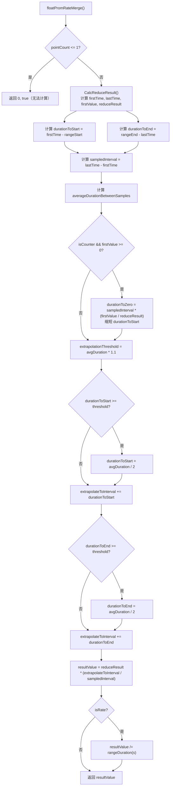

**代码位置**：`engine/prom_functions.go:100-162`

```go
// rate 函数
type rateOp struct{}

func (o *rateOp) CreateRoutine(p *PromFuncParam) (Routine, error) {
    // 使用 floatSliceReducer，包含 Reduce 和 Merge 两个阶段
    return NewRoutineImpl(newFloatSliceReducer(floatPromRateReduce, floatPromRateMerge(true, true)), p.inOrdinal, p.outOrdinal), nil
}

// Reduce 阶段：提取窗口内的数据切片
func floatPromRateReduce(times []int64, values []float64, start, end int) ([]int64, []float64, bool) {
    if start >= end {
        return []int64{}, []float64{}, true  // 空窗口
    }
    return times[start:end], values[start:end], false
}

// Merge 阶段：外推计算 rate 值
func floatPromRateMerge(isRate, isCounter bool) FloatSliceMergeFunc {
    return func(prevT, currT []int64, prevV, currV []float64, ts int64, pointCount int, param *ReducerParams) (float64, bool) {
        if pointCount <= 1 {
            return 0, true  // 少于 2 个点，无法计算 rate
        }
        // 计算 counter 的增量
        firstTime, lastTime, firstValue, _, reduceResult := executor.CalcReduceResult(prevT, currT, prevV, currV, isCounter)
        if lastTime == firstTime || param.rangeDuration == 0 {
            return 0, true
        }

        rangeStart, rangeEnd := ts-param.rangeDuration, ts

        // 计算首尾样本与范围边界的距离
        durationToStart := float64(firstTime-rangeStart) / 1e9
        durationToEnd := float64(rangeEnd-lastTime) / 1e9

        sampledInterval := float64(lastTime-firstTime) / 1e9
        averageDurationBetweenSamples := sampledInterval / float64(pointCount-1)

        // Counter 类型的特殊处理：如果第一个值接近 0，缩短外推
        if isCounter && reduceResult > 0 && pointCount > 0 && firstValue >= 0 {
            durationToZero := sampledInterval * (firstValue / reduceResult)
            if durationToZero < durationToStart {
                durationToStart = durationToZero
            }
        }

        // 外推阈值：采样间隔的 1.1 倍
        extrapolationThreshold := averageDurationBetweenSamples * 1.1
        extrapolateToInterval := sampledInterval

        if durationToStart >= extrapolationThreshold {
            durationToStart = averageDurationBetweenSamples / 2
        }
        extrapolateToInterval += durationToStart

        if durationToEnd >= extrapolationThreshold {
            durationToEnd = averageDurationBetweenSamples / 2
        }
        extrapolateToInterval += durationToEnd

        // 计算最终值
        resultValue := reduceResult * (extrapolateToInterval / sampledInterval)
        if isRate {
            resultValue = resultValue / float64(param.rangeDuration/1e9)
        }
        return resultValue, false
    }
}
```

**通俗解释**：

rate 的外推算法是 PromQL 最核心也最微妙的计算逻辑之一：

1. **前提**：至少需要 2 个数据点
2. **计算增量**：对 counter 类型，计算 `lastValue - firstValue`（考虑 counter reset）
3. **外推逻辑**：
   - 计算首样本到窗口起点的距离（`durationToStart`）
   - 计算末样本到窗口终点的距离（`durationToEnd`）
   - 如果距离超过"平均采样间隔 * 1.1"的阈值，只外推半个采样间隔
   - 否则，按实际距离外推
4. **Counter 特殊处理**：如果 counter 从 0 开始增长，外推距离不能超过到 0 的时间
5. **最终计算**：`value = delta * (extrapolateInterval / sampledInterval) / rangeDuration`

#### 数值示例：rate 外推算法逐步推演

假设查询 `rate(http_requests_total[5m])`，窗口为 `[100s, 500s]`，采样到以下数据点：

| 时间 (s) | 值 | 说明 |
|----------|-----|------|
| 100 | 100 | 第一个样本 |
| 200 | 200 | |
| 300 | 150 | counter reset（值减小） |
| 400 | 250 | |
| 500 | 350 | 最后一个样本 |

**第一步：计算增量（考虑 counter reset）**

```
CalcReduceResult 处理 counter reset：
  - 遇到 150 < 200 时，检测到 counter reset
  - reduceResult = (200 - 100) + (250 - 150) + (350 - 250) = 100 + 100 + 100 = 300
  - firstValue = 100, firstTime = 100s, lastTime = 500s
```

**第二步：计算时间距离**

```
rangeStart = 500 - 300 = 200s（窗口起点，ts=500, rangeDuration=300s）
rangeEnd = 500s（窗口终点）

durationToStart = (100s - 200s) / 1e9 → 注意：firstTime < rangeStart
  → 由于 firstTime < rangeStart，durationToStart 为负数
  → 在代码中会取 max(0, durationToStart)，所以 durationToStart = 0

durationToEnd = (500s - 500s) / 1e9 = 0s
sampledInterval = (500s - 100s) / 1e9 = 400s
pointCount = 5
averageDurationBetweenSamples = 400 / (5-1) = 100s
```

**第三步：Counter 从 0 开始的特殊处理**

```
isCounter = true, reduceResult = 300 > 0, firstValue = 100 >= 0
durationToZero = sampledInterval * (firstValue / reduceResult)
  = 400 * (100 / 300) = 133.33s

durationToZero (133.33s) < durationToStart (0s)? → 否
所以 durationToStart 保持为 0
```

**第四步：外推阈值判断**

```
extrapolationThreshold = averageDurationBetweenSamples * 1.1 = 100 * 1.1 = 110s
extrapolateToInterval = sampledInterval = 400s

durationToStart (0s) >= 110s? → 否，extrapolateToInterval += 0 → 400s
durationToEnd (0s) >= 110s? → 否，extrapolateToInterval += 0 → 400s
```

**第五步：最终计算**

```
resultValue = reduceResult * (extrapolateToInterval / sampledInterval)
  = 300 * (400 / 400) = 300

由于 isRate = true：
resultValue = resultValue / rangeDuration(s) = 300 / 300 = 1.0

最终 rate = 1.0（每秒增长 1 个请求）
```

> **关键洞察**：当数据点恰好覆盖整个窗口且没有 counter reset 时，外推比例为 1:1，rate 简单等于 `delta / duration`。外推算法主要在数据点稀疏或窗口边缘缺少数据时发挥作用。

### 8.3 avg_over_time 函数实现——Kahan 求和

**代码位置**：`engine/prom_functions.go:178-213`

```go
// avg_over_time 函数
type avgOp struct{}

func (o *avgOp) CreateRoutine(p *PromFuncParam) (Routine, error) {
    return NewRoutineImpl(newFloatIncReducer(floatAvgReduce, floatAvgMergeFunc), p.inOrdinal, p.outOrdinal), nil
}

// 使用 Kahan 求和的平均值计算
func floatAvgReduce(times []int64, values []float64, start, end int) (int64, float64, bool) {
    if start == end {
        return 0, 0, true
    }
    var mean, count, c float64
    for i := start; i < end; i++ {
        count++
        // 处理 Inf 的特殊情况
        if math.IsInf(mean, 0) {
            if math.IsInf(values[i], 0) && (mean > 0) == (values[i] > 0) {
                continue  // 同号 Inf，mean 已正确
            }
            if !math.IsInf(values[i], 0) && !math.IsNaN(values[i]) {
                continue  // mean 是 Inf，值不是 Inf/NaN，保持 mean
            }
        }
        // 使用 Kahan 求和增量更新平均值
        mean, c = executor.KahanSumInc(values[i]/count-mean/count, mean, c)
    }
    if math.IsInf(mean, 0) {
        return times[start], mean, false
    }
    return times[start], mean + c, false  // 加上补偿项
}
```

**通俗解释**：

Kahan 求和（也叫补偿求和）是一种减少浮点数累加误差的算法。在计算平均值时：
- 常规方法：`sum += x; mean = sum / count`，当累加大量数据时，浮点精度损失严重
- Kahan 方法：维护一个补偿变量 `c`，记录每次加法的舍入误差，在下次加法时补偿回来

### 8.4 increase 函数

```go
// increase = rate * rangeDuration
type increaseOp struct{}

func (o *increaseOp) CreateRoutine(p *PromFuncParam) (Routine, error) {
    // isRate=false, isCounter=true：计算绝对增量而非速率
    return NewRoutineImpl(newFloatSliceReducer(floatPromRateReduce, floatPromRateMerge(false, true)), p.inOrdinal, p.outOrdinal), nil
}
```

**通俗解释**：`increase` 和 `rate` 共享相同的 Reduce 和 Merge 逻辑，唯一的区别是 `isRate=false`——rate 会将结果除以 `rangeDuration`，而 increase 不除。

---

## 9. InstantVectorCursor

### 9.1 结构与创建

**代码位置**：`engine/prom_instant_vector_cursor.go:38-73`

```go
// InstantVectorCursor 用于对 PromQL instant_query 或 range_query 的数据进行采样和处理。
// 采样是非聚合查询和聚合查询的原始数据处理第一步。
// 对于非聚合查询，放在 seriesCursor 之后。
// 对于聚合查询，替换 aggregateCursor。
//
// 示例：
// data: (time, value)=> [(1, 1.0), (2, 2.0), (3, 3.0), (4, 4.0), (6, 6.0)]
// start=1, end=6, offset=0, step=2, LookUpDelta=3 => startSample=1, endSample=5
// sample data: (time, value)=> [(1, 1.0), (3, 3.0), (5, 4.0)]
type InstantVectorCursor struct {
    aggregateCursor

    lookUpDelta int64  // 回溯窗口（纳秒）
    start       int64  // 查询起始时间
    end         int64  // 查询结束时间
    offset      int64  // 查询偏移量
    step        int64  // 步长
    startSample int64  // 采样起始时间
    endSample   int64  // 采样结束时间
    firstStep   int64  // 当前记录的第一个步长时间
}

func NewInstantVectorCursor(input comm.KeyCursor, schema *executor.QuerySchema,
    globalPool *record.RecordPool, tr util.TimeRange) *InstantVectorCursor {
    c := &InstantVectorCursor{}
    c.aggregateCursor = *NewAggregateCursor(input, schema, globalPool, false)
    c.aggregateCursor.r = c

    c.lookUpDelta = schema.Options().GetPromLookBackDelta().Nanoseconds()
    c.step = schema.Options().GetPromStep().Nanoseconds()
    c.start = schema.Options().GetStartTime()
    c.end = schema.Options().GetEndTime()
    c.offset = schema.Options().GetPromQueryOffset().Nanoseconds()
    c.startSample = c.start + c.lookUpDelta
    if c.step == 0 {
        // instant query：单点查询
        c.endSample = c.startSample
        c.firstStep = c.startSample
        c.reducerParams.lastStep = c.endSample
        c.reducerParams.rangeDuration = schema.Options().GetPromRange().Nanoseconds()
    } else {
        // range query：多点查询
        c.endSample = c.start + c.lookUpDelta + (c.end-(c.start+c.lookUpDelta))/c.step*c.step
        c.firstStep = getCurrStep(c.startSample, c.endSample, c.step, tr.Min)
        c.reducerParams.lastStep = getPrevStep(c.startSample, c.endSample, c.step, tr.Max)
    }
    return c
}
```

**通俗解释**：

`InstantVectorCursor` 是 PromQL 查询的核心采样器。它实现了 Prometheus 的"即时向量选择器"语义：

- **采样逻辑**：对于每个时间步 `t`，在 `[t - lookUpDelta, t]` 范围内查找最近的样本值
- **步长计算**：`startSample = start + lookUpDelta`，`endSample = start + lookUpDelta + floor((end - start - lookUpDelta) / step) * step`
- **示例**：`start=1, end=6, step=2, lookUpDelta=3`，则 `startSample=1, endSample=5`，采样点为 `1, 3, 5`

### 9.2 双指针采样算法

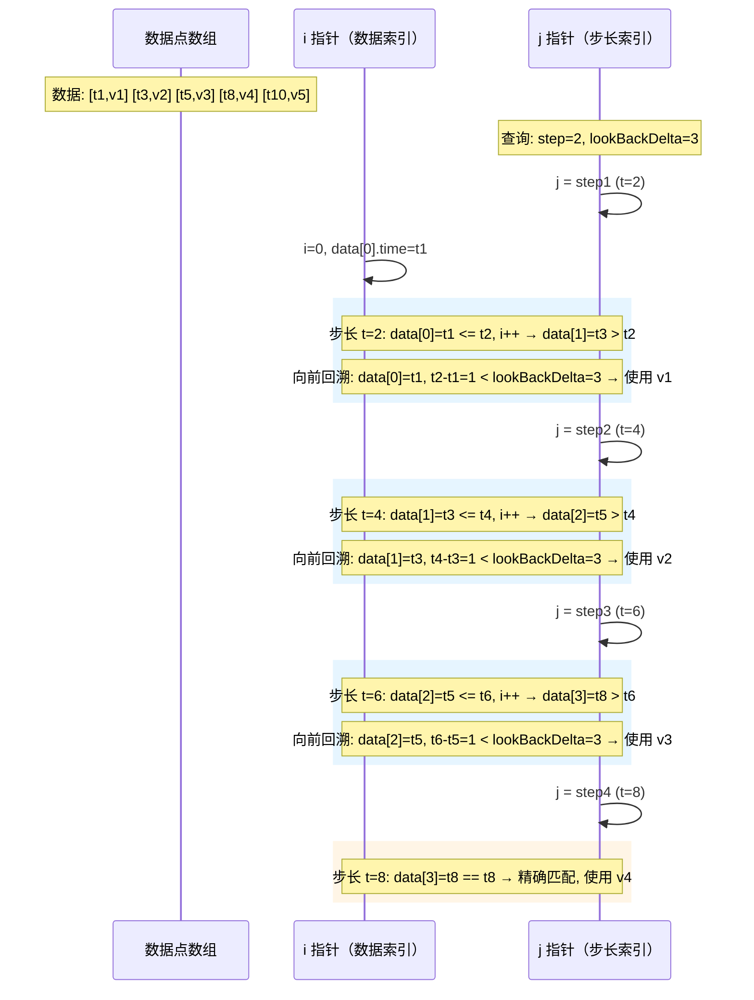

**代码位置**：`engine/prom_instant_vector_cursor.go:129-160`

```go
// computeIntervalIndex 使用双指针算法快速找到目标步长的起止位置
func (c *InstantVectorCursor) computeIntervalIndex(record *record.Record) {
    if c.step == 0 {
        // instant query：整个记录作为一个区间
        c.intervalIndex = append(c.intervalIndex, 0, uint16(record.RowNums()))
        return
    }
    times := record.Times()
    firstStep := getCurrStep(c.startSample, c.endSample, c.step, times[0])
    lastStep := getCurrStep(c.startSample, c.endSample, c.step, times[len(times)-1])
    c.firstStep = firstStep
    var i, j int
    // 对每个步长时间点，找到窗口的起止索引
    for end := firstStep; end <= lastStep; end += c.step {
        start := end - c.lookUpDelta
        // i 指针：找到 >= start 的第一个点
        for i < len(times) {
            if times[i] >= start {
                c.intervalIndex = append(c.intervalIndex, uint16(i))
                break
            }
            i++
        }
        // j 指针：找到 > end 的第一个点
        for j < len(times) {
            if times[j] > end {
                c.intervalIndex = append(c.intervalIndex, uint16(j))
                break
            }
            j++
        }
        // 边界处理
        if len(c.intervalIndex)%2 != 0 {
            c.intervalIndex = append(c.intervalIndex, uint16(record.RowNums()))
        }
    }
}
```

**通俗解释**：

这是整个采样过程的核心算法。`intervalIndex` 存储了一系列 `[start, end)` 区间对，每个区间对应一个步长时间窗口内的数据范围。

**双指针算法**：
- `i` 指针：向右扫描，找到每个窗口的起始位置（`times[i] >= start`）
- `j` 指针：向右扫描，找到每个窗口的结束位置（`times[j] > end`）
- 两个指针都只向右移动，不会回退，因此时间复杂度为 O(n)

### 9.3 floatSampler 采样器

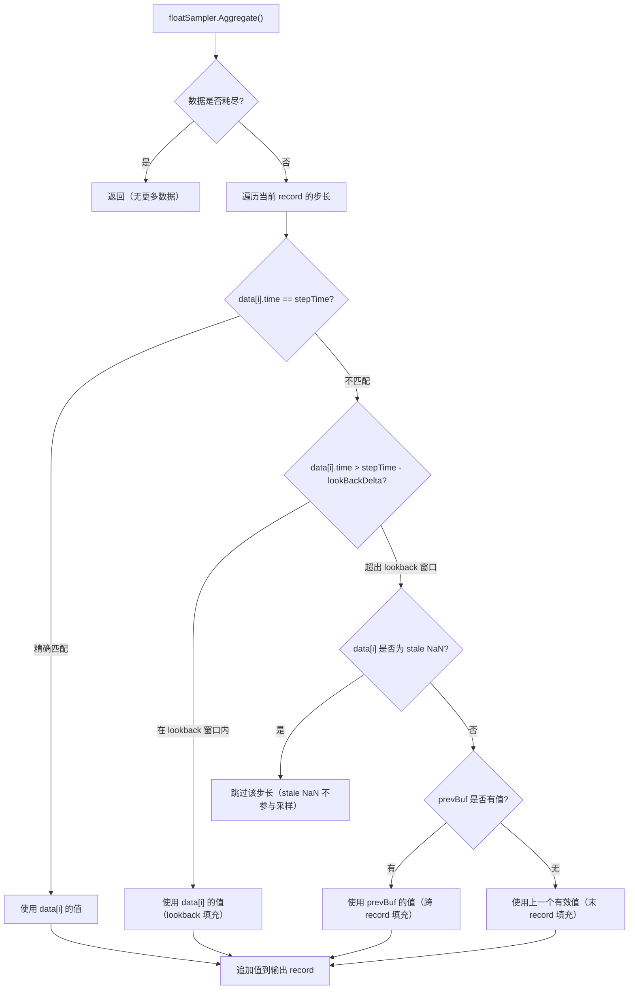

**代码位置**：`engine/prom_instant_vector_cursor.go:312-435`

```go
type floatSampler struct {
    fn      float2lFloatReduce  // 约减函数（如 floatLastReduceFunc）
    fv      appendValueFunc     // 值追加函数
    offset  int64               // 时间偏移
    prevBuf *floatColBuf        // 前一个 record 的最后一个值（用于跨 record 填充）
}
```

**核心方法 Aggregate()**：

```go
func (r *floatSampler) Aggregate(p *ReducerEndpoint, param *ReducerParams) {
    r.offset = param.offset
    inRecord, outRecord := p.InputPoint.Record, p.OutputPoint.Record
    inOrdinal, outOrdinal := p.InputPoint.Ordinal, p.OutputPoint.Ordinal
    values := inRecord.ColVals[inOrdinal].FloatValues()
    timeIdx, numStep := outRecord.ColNums()-1, len(param.intervalIndex)/2

    // instant query 特殊处理
    if param.step == 0 && param.rangeDuration > 0 {
        FilterInstantNANPoint(inRecord, outRecord)
        return
    }

    var ts int64
    for i := 0; i < numStep; i++ {
        // 跳过最后一个窗口（跨 record 时）
        if param.sameWindow && i == numStep-1 {
            continue
        }
        // 在窗口内取最后一个值
        idx, value, isNil := r.fn(&inRecord.ColVals[inOrdinal], values,
            int(param.intervalIndex[2*i]), int(param.intervalIndex[2*i+1]))

        if param.step > 0 {
            ts = param.firstStep + int64(i)*param.step
            // 在 record 之间填充（使用前一个 record 的最后一个值）
            if i == 0 && !r.prevBuf.isNil {
                nextStep, lastStep := int64(r.prevBuf.index)+param.step, param.firstStep-param.step
                if nextStep <= lastStep {
                    r.PopulateByPrevious(outRecord, param, nextStep, lastStep, outOrdinal, timeIdx)
                }
            }
        } else {
            ts = inRecord.Time(idx)
        }

        if !isNil {
            if model.IsStaleNaN(value) {
                continue  // 跳过 stale NaN
            }
            r.fv(outRecord.Column(outOrdinal), value)
            if outOrdinal == 0 {
                outRecord.AppendTime(ts + r.offset)
            }
        } else {
            // 窗口内没有数据，使用 lookback 填充
            if r.prevBuf.isNil || r.prevBuf.time < ts-param.lookBackDelta || r.prevBuf.time > ts || model.IsStaleNaN(r.prevBuf.value) {
                continue
            }
            r.fv(outRecord.Column(outOrdinal), r.prevBuf.value)
            if outOrdinal == 0 {
                outRecord.AppendTime(ts + r.offset)
            }
        }
    }

    // 保存当前 record 的最后一个值，供下一个 record 使用
    idx, value, isNil := r.fn(&inRecord.ColVals[inOrdinal], values, 0, inRecord.RowNums())
    if !isNil {
        r.prevBuf.set(int(param.firstStep+int64(numStep-1)*param.step), inRecord.Time(idx), value)
    }

    // 最后一个 record 后填充
    if param.step > 0 && param.lastRec && !r.prevBuf.isNil {
        nextStep := ts + param.step
        if nextStep <= param.lastStep {
            r.PopulateByPrevious(outRecord, param, nextStep, param.lastStep, outOrdinal, timeIdx)
        }
    }
}
```

**通俗解释**：

`floatSampler` 实现了 Prometheus 的 lookback 采样语义：

1. **正常采样**：在每个步长时间窗口 `[step - lookUpDelta, step]` 内取最后一个值
2. **Lookback 填充**：如果窗口内没有数据，但 `prevBuf`（前一个窗口的值）在 lookback 范围内（`prevBuf.time >= ts - lookBackDelta`），使用 `prevBuf` 的值
3. **Stale NaN 处理**：`model.IsStaleNaN(value)` 检测 stale 标记，遇到则跳过
4. **跨 Record 填充**：当数据分布在多个 record 中时，使用 `prevBuf` 在 record 之间进行填充
5. **record 末尾填充**：最后一个 record 处理完后，需要继续填充到 `lastStep`

### 9.4 Stale NaN 处理

```go
func FilterInstantNANPoint(rec, outRecord *record.Record) *record.Record {
    rowNum := rec.RowNums()
    vals := rec.ColVals[0].FloatValues()
    var startIndex, endIndex int
    for startIndex, endIndex = 0, 0; endIndex < rowNum; {
        if model.IsStaleNaN(vals[endIndex]) {
            // 遇到 stale NaN，将之前的数据段追加到输出，然后跳过 NaN
            outRecord.AppendRec(rec, startIndex, endIndex)
            endIndex++
            startIndex = endIndex
            continue
        }
        endIndex++
    }
    // 追加最后一个数据段
    outRecord.AppendRec(rec, startIndex, endIndex)
    return outRecord
}
```

**通俗解释**：Stale NaN 是 Prometheus 用于标记序列"过期"的特殊值（`math.Float64frombits(0x7FF0000000000002)`）。当遇到 stale NaN 时，需要将其前后的数据分段处理，stale NaN 本身不参与计算。

---

## 10. RangeVectorCursor

### 10.1 结构与创建

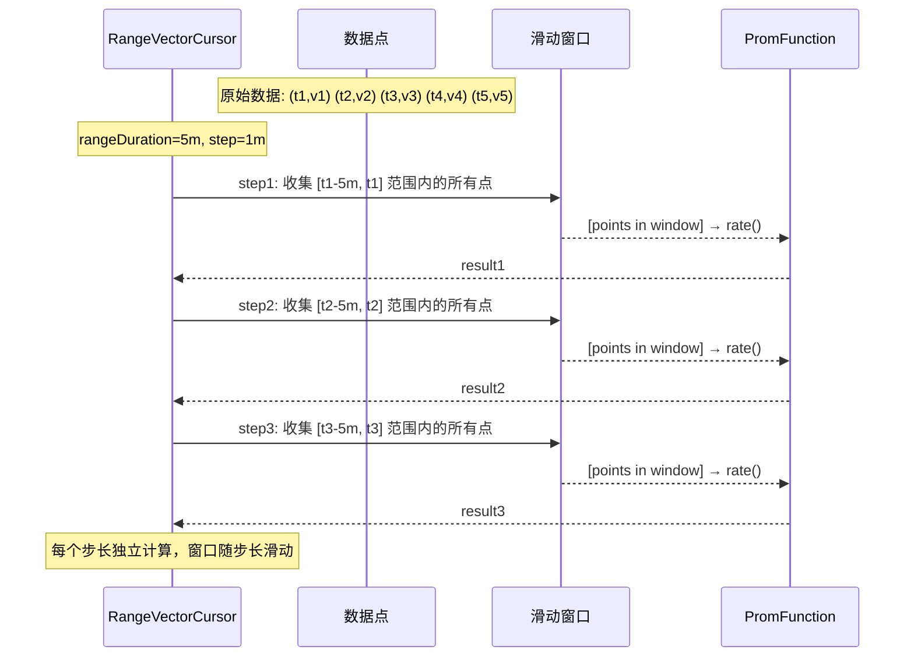

**代码位置**：`engine/prom_range_vector_cursor.go:35-71`

```go
// RangeVectorCursor 用于处理带有范围时长的 PromQL 函数计算。
// 这是一种滑动窗口计算。
// 对于聚合查询，替换 aggregateCursor。
//
// 示例：avg_over_time(value[3]) start=1, end=6, step=2
// rangeDuration=3, startSample=1, endSample=5
// original data: (time, value)=> [(1, 1.0), (2, 2.0), (3, 3.0), (4, 4.0), (6, 6.0)]
// interval index: [start, end) => [[0, 1), [0, 3), [1, 4)]
// grouped data:   (time, value)=> [[(1, 1.0)], [(1, 1.0), (2, 2.0), (3, 3.0)], [(2, 2.0), (3, 3.0), (4, 4.0)]]
// aggregated:     (time, value)=> [(1, 1.0), (3, 2.0), (5, 3.0)]
type RangeVectorCursor struct {
    aggregateCursor

    lookUpDelta   int64  // 回溯窗口
    rangeDuration int64  // 范围时长（如 [5m] 的 5m）
    start         int64  // 查询起始时间
    end           int64  // 查询结束时间
    offset        int64  // 查询偏移量
    step          int64  // 步长
    startSample   int64  // 采样起始时间
    endSample     int64  // 采样结束时间
    firstStep     int64  // 当前记录的第一个步长时间
}
```

**通俗解释**：

`RangeVectorCursor` 与 `InstantVectorCursor` 的关键区别：
- **InstantVectorCursor**：每个步长时间点只取一个值（窗口内的最后一个值）
- **RangeVectorCursor**：每个步长时间点取整个窗口内的所有值（用于 rate、avg_over_time 等计算）

### 10.2 滑动窗口索引

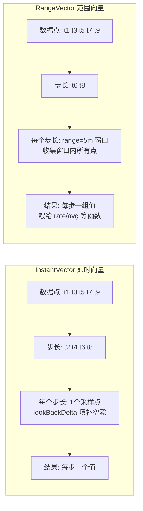

**代码位置**：`engine/prom_range_vector_cursor.go:118-153`

```go
// getIntervalIndex 使用双指针算法快速找到目标步长的起止位置
// intervalIndex 存储每个分组的区间，左闭右开，例如 [[0, 2), [1, 3)]
func (c *RangeVectorCursor) getIntervalIndex(record *record.Record) {
    if record.RowNums() == 0 {
        return
    }
    if c.step == 0 {
        // instant query：整个记录作为一个区间
        c.firstStep = c.startSample
        c.intervalIndex = append(c.intervalIndex, 0, uint16(record.RowNums()))
        return
    }
    times := record.Times()
    firstStep := getCurrStep(c.startSample, c.endSample, c.step, times[0])
    lastStep := getCurrStep(c.startSample, c.endSample, c.step, times[len(times)-1])
    c.firstStep = firstStep
    var i, j int
    for end := firstStep; end <= lastStep; end += c.step {
        start := end - c.rangeDuration  // 滑动窗口起点
        for i < len(times) {
            if times[i] >= start {
                c.intervalIndex = append(c.intervalIndex, uint16(i))
                break
            }
            i++
        }
        for j < len(times) {
            if times[j] > end {
                c.intervalIndex = append(c.intervalIndex, uint16(j))
                break
            }
            j++
        }
        if len(c.intervalIndex)%2 != 0 {
            c.intervalIndex = append(c.intervalIndex, uint16(record.RowNums()))
        }
    }
}
```

### 10.3 FilterRangeNANPoint

**代码位置**：`engine/prom_range_vector_cursor.go:174-198`

```go
func FilterRangeNANPoint(rec *record.Record) *record.Record {
    rowNum := rec.RowNums()
    var outRecord *record.Record
    vals := rec.ColVals[0].FloatValues()
    var startIndex, endIndex int
    for startIndex, endIndex = 0, 0; endIndex < rowNum; {
        if model.IsStaleNaN(vals[endIndex]) {
            if outRecord == nil {
                outRecord = record.NewRecordBuilder(rec.Schema)
                outRecord.RecMeta = rec.RecMeta
            }
            // 在 stale NaN 处分段
            outRecord.AppendRec(rec, startIndex, endIndex)
            endIndex++
            startIndex = endIndex
            continue
        }
        endIndex++
    }
    if startIndex == 0 {
        return rec  // 没有 stale NaN，直接返回原 record
    }
    outRecord.AppendRec(rec, startIndex, endIndex)
    return outRecord
}
```

**通俗解释**：

`FilterRangeNANPoint` 在 `reduce` 方法的最开始被调用，过滤掉 stale NaN 点。对于 RangeVectorCursor，stale NaN 的处理更为重要——因为在滑动窗口中，一个 stale NaN 可能会污染整个窗口的计算结果。

---

## 11. HTTP Handler 层

### 11.1 路由注册

**代码位置**：`lib/util/lifted/influx/httpd/handler.go:333-430`

```go
// 注册所有 Prometheus 兼容的 HTTP 端点
Route{"prometheus-write", "POST", "/api/v1/write", false, true, h.servePromWrite},
Route{"prometheus-read", "POST", "/api/v1/read", true, true, h.servePromRead},
Route{"prometheus-read", "GET", "/api/v1/read", true, true, h.servePromRead},
Route{"prometheus-query", "GET", "/api/v1/query", true, true, h.servePromQuery},
Route{"prometheus-query", "POST", "/api/v1/query", true, true, h.servePromQuery},
Route{"prometheus-query-range", "GET", "/api/v1/query_range", true, true, h.servePromQueryRange},
Route{"prometheus-query-range", "POST", "/api/v1/query_range", true, true, h.servePromQueryRange},
Route{"prometheus-labels", "GET", "/api/v1/labels", true, true, h.servePromQueryLabels},
Route{"prometheus-labels", "POST", "/api/v1/labels", true, true, h.servePromQueryLabels},
Route{"prometheus-label-values", "GET", "/api/v1/label/{name}/values", true, true, h.servePromQueryLabelValues},
Route{"prometheus-label-values", "POST", "/api/v1/label/{name}/values", true, true, h.servePromQueryLabelValues},
Route{"prometheus-series", "GET", "/api/v1/series", true, true, h.servePromQuerySeries},
Route{"prometheus-series", "POST", "/api/v1/series", true, true, h.servePromQuerySeries},
Route{"prometheus-metadata", "GET", "/api/v1/metadata", true, true, h.servePromQueryMetaData},
Route{"prometheus-metadata", "POST", "/api/v1/metadata", true, true, h.servePromQueryMetaData},

// MetricStore 模式端点
Route{"prometheus-write-metric-store", "POST", "/prometheus/{metric_store}/api/v1/write", false, true, h.servePromWriteWithMetricStore},
Route{"prometheus-query-metric-store", "GET", "/prometheus/{metric_store}/api/v1/query", true, true, h.servePromQueryWithMetricStore},
Route{"prometheus-query-range-metric-store", "POST", "/prometheus/{metric_store}/api/v1/query_range", true, true, h.servePromQueryRangeWithMetricStore},
// ...更多端点
```

**通俗解释**：

openGemini 暴露了完整的 Prometheus HTTP API，包括：
- **查询端点**：`/api/v1/query`（即时查询）、`/api/v1/query_range`（范围查询）
- **元数据端点**：`/api/v1/labels`、`/api/v1/label/{name}/values`、`/api/v1/series`、`/api/v1/metadata`
- **读写端点**：`/api/v1/write`（Remote Write）、`/api/v1/read`（Remote Read）
- **MetricStore 端点**：`/prometheus/{metric_store}/api/v1/...`（使用独立的 measurement 存储）

### 11.2 查询处理流程 servePromBaseQuery()

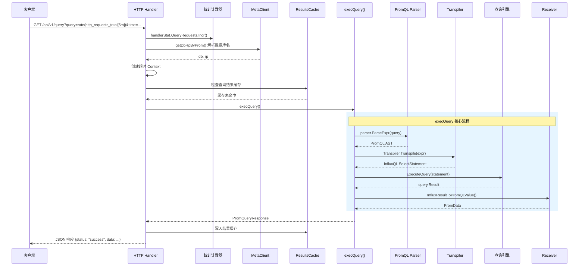

**代码位置**：`lib/util/lifted/influx/httpd/handler_prom.go:562-674`

```go
func (h *Handler) servePromBaseQuery(w http.ResponseWriter, r *http.Request, user meta2.User, p *promQueryParam) {
    handlerStat.QueryRequests.Incr()
    handlerStat.ActiveQueryRequests.Incr()
    start := time.Now()
    defer func() {
        handlerStat.ActiveQueryRequests.Decr()
        handlerStat.QueryRequestDuration.AddSinceNano(start)
    }()

    // 步骤1：获取数据库信息
    db, rp := getDbRpByProm(h, r)

    // 步骤2：超时控制
    ctx := r.Context()
    if to := r.FormValue("timeout"); to != "" {
        timeout, err := parseDuration(to)
        ctx, cancel = context.WithTimeout(ctx, timeout)
        defer cancel()
    }

    // 步骤3：解析查询参数为 PromCommand
    promCommand, ok := p.getQueryCmd(r, w, p.mst)
    promCommand.Database, promCommand.RetentionPolicy, promCommand.Measurement = db, rp, p.mst

    // 步骤4：结果缓存（仅 range query）
    if h.Config.ResultCache.Enabled && promCommand.Evaluation == nil && !async && !isExplain {
        cmd := AlignWithStep(promCommand)
        key := generateCacheKey(cmd, p.mst, h.ResultCache.SplitQueriesByInterval)
        // 尝试转发到对应节点
        if doForward(h, r, key, rw, bodyBytes) { return }
        // 查询缓存
        resp, useCache, err := h.ResultCache.Do(reqInfo, cmd, key)
        if useCache {
            // 缓存命中，直接返回
            rw.WritePromResponse(resp)
            return
        }
    }

    // 步骤5：执行查询
    resp, apiErr, isRespond := h.execQuery(rw, r, user, start, promCommand, async, isExplain)
    if apiErr != nil {
        respondError(rw, apiErr)
        return
    }
    rw.WritePromResponse(resp)
}
```

### 11.3 execQuery() 核心执行逻辑

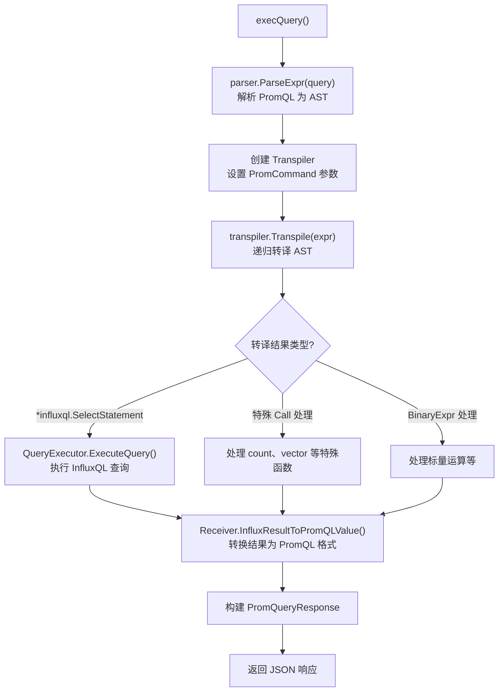

**代码位置**：`lib/util/lifted/influx/httpd/handler_prom.go:769-870`

```go
func (h *Handler) execQuery(w ResponseWriter, r *http.Request, user meta2.User,
    start time.Time, promCommand promql2influxql.PromCommand, async, isExplain bool) (
    resp *promql2influxql.PromQueryResponse, apiErr *apiError, isRespond bool) {

    // 步骤1：使用 Prometheus 原生解析器解析 PromQL
    expr, err := parser.ParseExpr(r.FormValue("query"))
    if err != nil {
        apiErr = &apiError{errorBadData, fmt.Errorf("invalid parameter %q: %w", "query", err)}
        return
    }

    // 步骤2：创建 Transpiler 并转译
    transpiler := &promql2influxql.Transpiler{
        PromCommand: promCommand,
    }
    nodes, err := transpiler.Transpile(expr)
    if err != nil {
        if IsErrWithEmptyResp(err) {
            resp = CreatePromEmptyResp(expr, &promCommand)
            return
        }
        apiErr = &apiError{errorBadData, err}
        return
    }

    // 步骤3：根据转译结果类型分发
    var q *influxql.Query
    switch statement := nodes.(type) {
    case *influxql.SelectStatement:
        // 常规查询：包装为 InfluxQL Query
        if !isExplain {
            q = &influxql.Query{Statements: []influxql.Statement{statement}}
        } else {
            q = &influxql.Query{Statements: []influxql.Statement{
                &influxql.ExplainStatement{Statement: statement, Analyze: true},
            }}
        }
    case *influxql.Call, *influxql.BinaryExpr, *influxql.IntegerLiteral, *influxql.NumberLiteral, *influxql.StringLiteral, *influxql.ParenExpr:
        // 纯表达式查询（如数字字面量、标量运算）
        resp, apiErr = h.promExprQuery(&promCommand, statement, expr.Type())
        return
    default:
        apiErr = &apiError{errorBadData, fmt.Errorf("invalid the select statement for promql")}
        return
    }

    // 步骤4：设置执行选项
    opts := query.ExecutionOptions{
        Database:        db,
        RetentionPolicy: rp,
        ChunkSize:       chunkSize,
        Chunked:         chunked,
        ReadOnly:        r.Method == "GET",
        NodeID:          nodeID,
        InnerChunkSize:  innerChunkSize,
        ParallelQuery:   atomic.LoadInt32(&syscontrol.ParallelQueryInBatch) == 1,
        Quiet:           true,
        Authorizer:      h.getAuthorizer(user),
        IsPromQuery:     true,  // 标记为 PromQL 查询
    }

    // 步骤5：执行查询
    results := h.QueryExecutor.ExecuteQuery(q, opts, closing, qDuration)

    // 步骤6：收集结果并转换
    for r := range results {
        receiver := &promql2influxql.Receiver{
            PromCommand:     promCommand,
            DropMetric:      transpiler.DropMetric(),
            DuplicateResult: transpiler.DuplicateResult(),
        }
        promData, err := receiver.InfluxResultToPromQLValue(r, expr, promCommand)
        // ...构建响应
    }

    // 步骤7：返回 JSON 响应
    return resp, nil, false
}
```

**通俗解释**：

`execQuery()` 是整个查询处理的核心流程：

1. **解析 PromQL**：使用 Prometheus 原生的 `parser.ParseExpr()` 解析查询语句
2. **转译为 InfluxQL**：通过 `Transpiler.Transpile()` 将 PromQL AST 转为 InfluxQL AST
3. **分发执行**：根据转译结果类型，选择不同的执行路径
4. **执行查询**：通过 `QueryExecutor.ExecuteQuery()` 执行 InfluxQL 查询
5. **结果转换**：通过 `Receiver.InfluxResultToPromQLValue()` 将 InfluxQL 结果转为 PromQL 响应

### 11.4 写入处理 servePromWriteBase()

**代码位置**：`lib/util/lifted/influx/httpd/handler_prom.go:116-215`

```go
func (h *Handler) servePromWriteBase(w http.ResponseWriter, r *http.Request,
    user meta2.User, mst string, tansFunc timeSeries2RowsFunc) {
    // 步骤1：验证
    if syscontrol.DisableWrites {
        h.httpError(w, `disable write!`, http.StatusForbidden)
        return
    }
    db, rp := getDbRpByProm(h, r)
    // 鉴权...

    // 步骤2：读取并解压请求体
    body := r.Body
    // ...

    // 步骤3：检查是否为元数据请求
    if isMetaDataReq(r) {
        h.servePromWriteMetaData(w, body, db, rp, mst)
        return
    }

    // 步骤4：使用 VictoriaMetrics 的流式解析器解析 Protobuf
    err := Parser.Parse(body, false, func(tss []prompb2.TimeSeries) error {
        // 步骤5：验证时间序列
        inValidTs, partialErr := h.FilterInvalidTimeSeries(mst, tss)

        // 步骤6：转换为 InfluxDB 行格式
        rs := pool.GetRows(maxPoints)
        *rs, err = tansFunc(mst, *rs, tss, inValidTs)
        if err != nil {
            h.httpError(w, err.Error(), http.StatusBadRequest)
            return err
        }

        // 步骤7：写入存储
        if err = h.PointsWriter.RetryWritePointRows(db, rp, *rs); err != nil {
            // 错误处理...
        }
        return err
    })
    // 步骤8：返回 204 No Content
    h.writeHeader(w, http.StatusNoContent)
}
```

**通俗解释**：

写入流程的关键点：
- 使用 **VictoriaMetrics 的流式解析器**（`Parser.Parse`）处理 Remote Write 的 Protobuf 数据
- **流式处理**：解析器是流式的，不需要一次性将整个请求体读入内存
- **timeSeries2Rows**：将 Prometheus 的 `TimeSeries` 转换为 InfluxDB 的 `Row` 格式
- **验证**：`FilterInvalidTimeSeries` 进行写入验证（标签数量、值范围等）

### 11.5 结果缓存与一致性哈希

**代码位置**：`lib/util/lifted/influx/httpd/results_cache.go`

```go
type ResultsCache struct {
    SplitQueriesByInterval time.Duration  // 查询分割间隔
    MaxCacheFreshness      time.Duration  // 最大缓存新鲜度
    minCacheExtent         int64          // 最小缓存范围（5 分钟）
    Logger                 *logger.Logger
    cache                  resultcache.ResultCache  // 底层缓存实现
}

// config.ResultCacheConfig.CacheType 是枚举：
//   MEM_CACHE  = 0
//   FILE_CACHE = 1
// 当前 resultcache.NewResultCache 只为 MEM_CACHE 创建 MemCacheAdapter；
// FILE_CACHE 枚举已定义，但 factory 分支尚未落地。
func NewResultCache(cacheConfig config.ResultCacheConfig) resultcache.ResultCache {
    if cacheConfig.CacheType == config.MEM_CACHE {
        return &MemCacheAdapter{memCache: cache.NewCache(cacheSize, expiration)}
    }
    return nil
}

func (rc *ResultsCache) Do(reqInfo *RequestInfo, command *promql2influxql.PromCommand,
    key string) (*promql2influxql.PromQueryResponse, bool, error) {
    // 检查是否应该缓存
    if !shouldCache(r) { return nil, false, nil }

    maxCacheTime := model.Now().Add(-rc.MaxCacheFreshness).UnixNano()
    if command.Start.UnixNano() > maxCacheTime {
        return nil, false, nil  // 太新的数据不缓存
    }

    // 查缓存
    cached, ok := rc.get(key)
    if ok {
        response, extents, err = rc.handleHit(reqInfo, command, cached, maxCacheTime, &fullHit)
    } else {
        response, extents, err = rc.handleMiss(reqInfo, command, maxCacheTime)
    }

    if fullHit { return response, true, nil }

    // 缓存未命中的部分，存储结果
    extents = rc.filterRecentExtents(extents, command.Step.Nanoseconds(), maxCacheFreshness)
    if len(extents) > 0 { rc.put(key, extents) }
}
```

**缓存转发机制**：

```go
func doForward(h *Handler, r *http.Request, key string, rw ResponseWriter, body []byte) bool {
    // 使用一致性哈希确定目标节点
    nodes, ring, err := buildRing(h)
    targetNode := ring.Get(key)
    // 如果目标不是当前节点，转发请求
    // ...
}
```

**通俗解释**：

结果缓存的设计：
- **缓存键**：基于查询表达式、时间范围、步长生成唯一的缓存键
- **新鲜度控制**：`MaxCacheFreshness` 确保不缓存太新的数据（因为新数据可能还在写入）
- **缓存分割**：`SplitQueriesByInterval` 将大范围查询分割为多个小范围分别缓存
- **一致性哈希**：多个 ts-sql 节点之间，相同的查询始终路由到同一个节点，提高缓存命中率
- **缓存类型**：配置枚举是 `MEM_CACHE` / `FILE_CACHE`；当前 factory 只有 `MEM_CACHE` 分支，`FILE_CACHE` 不会创建可用实例，文档中不要按外部缓存实现理解

---

## 12. 结果转换 Receiver

### 12.1 Receiver 结构体

**代码位置**：`lib/util/lifted/promql2influxql/receiver.go:34-39`

```go
// Receiver 是查询结果转换器，将 InfluxQL 的执行结果转换为 Prometheus 格式
type Receiver struct {
    PromCommand                // 嵌入查询命令
    DropMetric      bool       // 是否丢弃 __name__ 标签
    DuplicateResult bool       // 是否需要复制结果
}
```

### 12.2 InfluxResultToPromQLValue() 核心转换

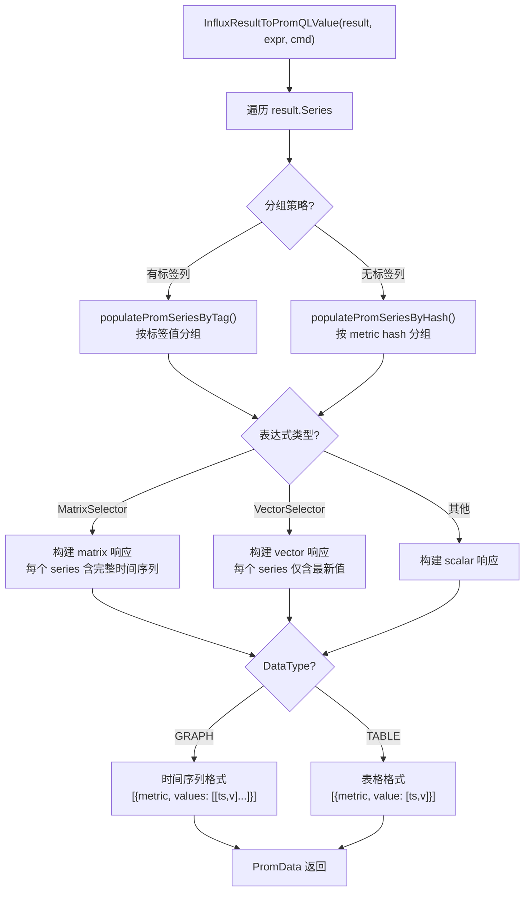

**代码位置**：`lib/util/lifted/promql2influxql/receiver.go:236-285`

```go
// InfluxResultToPromQLValue 将 query.Result 切片转换为 Prometheus 的 parser.Value
func (r *Receiver) InfluxResultToPromQLValue(result *query.Result, expr parser.Expr,
    cmd PromCommand) (promRes *PromData, promErr error) {
    defer func() {
        if re := recover(); re != nil {
            promRes, promErr = NewPromData(nil, ""), errno.NewError(errno.PromReceiverErr)
            logger.GetLogger().Error(promErr.Error(), zap.String("InfluxResultToPromQLValue", string(debug.Stack())))
        }
    }()
    if result == nil { return NewPromData(nil, ""), nil }
    if result.Err != nil { return NewPromData(nil, ""), result.Err }

    // 步骤1：将 InfluxQL 的 Row 转换为 Prometheus 的 Series
    var promSeries []*promql.Series
    var preMetric labels.Labels
    for _, item := range result.Series {
        if len(item.Tags) > 0 {
            // 有标签：按标签分组
            if err := r.populatePromSeriesByTag(&preMetric, &promSeries, item); err != nil {
                return NewPromData(nil, ""), errno.NewError(errno.ErrPopulatePromSeries, err.Error())
            }
        } else {
            // 无标签：按哈希分组
            if err := r.PopulatePromSeriesByHash(&promSeries, item); err != nil {
                return NewPromData(nil, ""), errno.NewError(errno.ErrGroupResultBySeries, err.Error())
            }
        }
    }

    // 步骤2：根据返回类型包装结果
    switch expr.Type() {
    case parser.ValueTypeMatrix:
        return NewPromData(HandleValueTypeMatrix(promSeries), string(parser.ValueTypeMatrix)), nil
    case parser.ValueTypeVector:
        switch cmd.DataType {
        case GRAPH_DATA:
            return NewPromData(HandleValueTypeMatrix(promSeries), string(parser.ValueTypeMatrix)), nil
        default:
            value, err := r.handleValueTypeVector(promSeries)
            return NewPromData(value, string(parser.ValueTypeVector)), err
        }
    case parser.ValueTypeScalar:
        switch cmd.DataType {
        case GRAPH_DATA:
            return NewPromData(HandleValueTypeMatrix(promSeries), string(parser.ValueTypeMatrix)), nil
        default:
            value, err := r.handleValueTypeScalar(promSeries)
            return NewPromData(value, string(parser.ValueTypeScalar)), err
        }
    default:
        return NewPromData(nil, ""), errno.NewError(errno.UnsupportedValueType, expr.Type())
    }
}
```

**通俗解释**：

`InfluxResultToPromQLValue()` 是结果转换的核心，它做两件事：

1. **数据转换**：将 InfluxQL 的 `models.Row` 转换为 Prometheus 的 `promql.Series`
   - 每个 Row 包含：columns（列名）、tags（标签）、values（数据行）
   - 每个 Series 包含：metric（标签集）、floats（FPoint 数组）

2. **类型适配**：根据查询类型（matrix/vector/scalar）和 DataType（TABLE/GRAPH）选择不同的包装方式
   - `GRAPH_DATA` + vector：实际返回 matrix 格式（Grafana 需要时间序列）
   - `TABLE_DATA` + vector：返回 vector 格式（只有一个时间点）

### 12.3 Tag 分组 vs Hash 分组

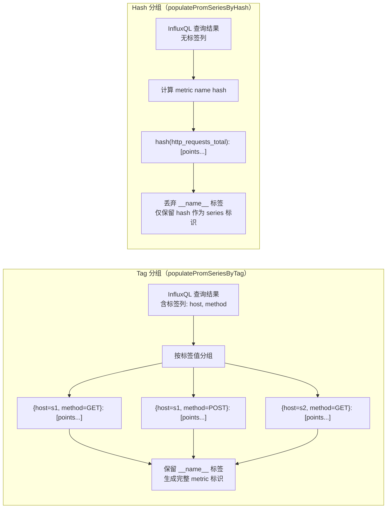

**代码位置**：`lib/util/lifted/promql2influxql/receiver.go:69-153`

```go
// populatePromSeriesByTag 按标签分组（当查询返回了标签列时）
func (r *Receiver) populatePromSeriesByTag(pPreMetric *labels.Labels, promSeries *[]*promql.Series, table *models.Row) error {
    var metric labels.Labels
    if !r.DropMetric {
        metric = labels.FromMap(table.Tags)  // 保留 __name__
    } else {
        metric = FromMapWithoutMetric(table.Tags)  // 丢弃 __name__
    }

    if len(table.Columns) <= SampleColNum {
        // 简单情况：只有 time 和 value 两列
        for _, row := range table.Values {
            point, err := Row2Point(row)
            // ...
            points = append(points, point)
        }
        *promSeries = append(*promSeries, &promql.Series{Metric: metric, Floats: points})
    } else {
        // 复杂情况：有多列标签
        seriesMap := make(map[uint64]*promql.Series)
        for _, row := range table.Values {
            m := metric
            for i := SampleColNum; i < len(table.Columns); i++ {
                if row[i] == nil { continue }
                // 将额外的列作为标签
                m = append(m, labels.Label{Name: table.Columns[i], Value: row[i].(string)})
            }
            sort.Sort(m)
            if series, exists := seriesMap[m.Hash()]; exists {
                series.Floats = append(series.Floats, point)
            } else {
                seriesMap[m.Hash()] = &promql.Series{Metric: m, Floats: []promql.FPoint{point}}
            }
        }
        for _, series := range seriesMap {
            *promSeries = append(*promSeries, series)
        }
    }

    // 处理 DuplicateResult：为 StepInvariant 表达式复制结果
    if r.DuplicateResult && r.PromCommand.Step > 0 && len((*promSeries)[len(*promSeries)-1].Floats) == 1 {
        start, end, interval := r.Start.UnixMilli(), r.End.UnixMilli(), r.Step.Milliseconds()
        series := (*promSeries)[len(*promSeries)-1]
        idx := len(series.Floats)
        ReservePoints(series, int((end-start-interval)/interval)+1)
        for ts := start + interval; ts <= end; ts += interval {
            series.Floats[idx] = promql.FPoint{T: ts, F: series.Floats[0].F}
            idx++
        }
    }
    return nil
}
```

**通俗解释**：

两种分组策略适用于不同的查询场景：

1. **Tag 分组**（`populatePromSeriesByTag`）：当查询带有 `GROUP BY` 时，InfluxQL 会返回带标签的结果。每个标签组合对应一个时间序列。
   - 简单情况：只有 `time` 和 `value` 两列，所有数据属于同一个序列
   - 复杂情况：有多列标签，需要按标签组合分组，使用 `map[uint64]*promql.Series`（标签哈希作为键）

2. **Hash 分组**（`PopulatePromSeriesByHash`）：当查询没有 `GROUP BY` 时，所有数据的标签都在额外的列中。需要遍历所有行，提取标签并按哈希分组。

### 12.4 Row2Point 转换

**代码位置**：`lib/util/lifted/promql2influxql/receiver.go:510-535`

```go
func Row2Point(row []interface{}) (promql.FPoint, error) {
    // 第一列是时间
    ts, ok := row[0].(time.Time)
    if !ok {
        return promql.FPoint{}, errno.NewError(errno.ParseTimeFail)
    }
    point := promql.FPoint{
        T: timestamp.FromTime(ts),  // 转为毫秒时间戳
    }
    // 第二列是值
    switch number := row[1].(type) {
    case json.Number:
        if v, err := number.Float64(); err == nil {
            point.F = v
        } else if v, err := number.Int64(); err == nil {
            point.F = float64(v)
        }
    case float64:
        point.F = number
    case int64:
        point.F = float64(number)
    default:
        return promql.FPoint{}, fmt.Errorf("invalid the data type for prom response")
    }
    return point, nil
}
```

### 12.5 PromData 序列化

**代码位置**：`lib/util/lifted/promql2influxql/models.go:94-116`

```go
type PromQueryResponse struct {
    Status    string    `json:"status"`
    Data      *PromData `json:"data,omitempty"`
    ErrorType string    `json:"errorType,omitempty"`
    Error     string    `json:"error,omitempty"`
}

type PromData struct {
    ResultType string         `json:"resultType,omitempty"`
    Result     PromDataResult `json:"result,omitempty"`
}
```

`PromData` 实现了 `msgp.Encodable` 和 `msgp.Decodable` 接口，支持高效的 MessagePack 序列化，用于结果缓存。

---

## 13. 潜在隐患

### 13.1 AST 转译开销

**风险**：每次查询都需要：
1. Prometheus 原生解析器解析 PromQL -> AST
2. Transpiler 将 PromQL AST -> InfluxQL AST
3. InfluxQL 引擎解析 InfluxQL AST -> 执行计划

**影响**：双重解析带来额外的 CPU 和内存开销。对于高频查询场景，这个开销可能不可忽视。

**缓解措施**：
- 结果缓存机制减少了重复查询的转译次数
- Transpiler 实例在使用后被 GC 回收，不会长期占用内存

### 13.2 Stale NaN 边界情况

**风险**：Stale NaN 的处理分布在多个层级：
- `FilterInstantNANPoint`：在 InstantVectorCursor 层过滤
- `FilterRangeNANPoint`：在 RangeVectorCursor 层过滤
- `model.IsStaleNaN`：在采样器中检查

**潜在问题**：
- 在 record 边界处的 stale NaN 可能导致跨 record 的数据段被错误分隔
- `floatSampler.PopulateByPrevious` 中的 stale NaN 检查可能遗漏某些边界情况

### 13.3 结果缓存失效

**风险**：
- 缓存新鲜度（`MaxCacheFreshness`）的配置如果不当，可能导致返回过期数据
- 一致性哈希在节点扩缩容时可能导致缓存命中率下降
- 缓存分割（`SplitQueriesByInterval`）可能导致部分缓存和完整查询的结果不一致

### 13.4 函数名冲突风险

**风险**：`_prom` 后缀约定避免了大部分命名冲突，但仍有隐患：
- `sum_over_time`、`avg_over_time`、`count_over_time` 等没有后缀的函数，如果 InfluxQL 原生也定义了同名函数，会产生冲突
- 新增的 PromQL 函数如果没有正确添加后缀，可能导致行为不一致

### 13.5 向量-向量二元运算的不完整性

**代码位置**：`lib/util/lifted/promql2influxql/binary_expr.go:263`

```go
} else if !lok || !rok {
    // todo: vector(with mst)+vector(without mst)
    t.dropMetric = false
    return t.transpileBinOpOfOneVector(b, influxql.Token(b.Op), lhs, rhs)
}
```

**风险**：TODO 注释表明 "向量（有 measurement）+ 向量（无 measurement）" 的复杂二元运算尚未完全实现。也就是说，`vector(with mst)+vector(without mst)` 这类混合来源场景会落入 `transpileBinOpOfOneVector` 的折中路径，标签匹配和结果 metric 语义可能不完整。

### 13.6 panic 风险

**代码位置**：`lib/util/lifted/promql2influxql/aggregate_expr.go:97`

```go
if len(statement.Sources) != 1 {
    panic("the number of source should be 1 for promql agg query")
}
```

**风险**：代码中存在 `panic` 调用，如果 Sources 数量不是 1，整个进程会崩溃。虽然理论上不应该出现这种情况，但在边界条件下可能导致严重问题。

---

## 14. 端到端实战

### 14.1 完整生命周期：rate(http_requests_total[5m])

以下是一个 PromQL 查询从 HTTP 请求到响应的完整生命周期：

#### 阶段 1：HTTP 请求接收

```
POST /api/v1/query
Content-Type: application/x-www-form-urlencoded

query=rate(http_requests_total{method="GET"}[5m])&time=1700000000
```

`Handler.servePromBaseQuery()` 被调用。

#### 阶段 2：解析查询参数

```go
promCommand := PromCommand{
    Cmd:         `rate(http_requests_total{method="GET"}[5m])`,
    Database:    "prom",
    Evaluation:  time.UnixMilli(1700000000),  // instant query
    Step:        0,                            // instant query 无步长
    LookBackDelta: 5 * time.Minute,
    DataType:    TABLE_DATA,
    ValueFieldKey: "value",
}
```

#### 阶段 3：PromQL 解析

```go
expr, _ := parser.ParseExpr(`rate(http_requests_total{method="GET"}[5m])`)
// expr 类型: *parser.Call
// expr.Func.Name = "rate"
// expr.Args[0] = &parser.MatrixSelector{
//     Range: 5 * time.Minute,
//     VectorSelector: &parser.VectorSelector{
//         Name: "http_requests_total",
//         LabelMatchers: [{Name: "method", Value: "GET", Type: MatchEqual}],
//     },
// }
```

#### 阶段 4：AST 预处理

```go
transpiler := &Transpiler{PromCommand: promCommand}
s := transpiler.newEvalStmt(expr)
// s.Start = s.End = Evaluation
// s.Interval = 0 (instant query)
transpiler.rewriteMinMaxTime()
// minT = maxT = 1700000000000 (毫秒)
setOffsetForAtModifier(minT, s.Expr)
```

#### 阶段 5：递归转译

```
transpileExpr(Call{rate, [MatrixSelector]})
  -> transpileCall(rate)
    -> transpileExpr(MatrixSelector{5m, VectorSelector{...}})
      -> transpileRangeVectorSelector(MatrixSelector)
        -> t.timeRange = 5m
        -> transpileExpr(VectorSelector{http_requests_total, method="GET"})
          -> transpileInstantVectorSelector(VectorSelector)
            -> timeCondition: time >= (1700000000000 - 300000 - 300000) AND time <= 1700000000000
            -> tagCondition: method = 'GET'
            -> SelectStatement{
                Sources: [http_requests_total],
                Fields: [value],
                Dimensions: [*],
                Condition: time >= ... AND method = 'GET',
                IsPromQuery: true,
                LookBackDelta: 5m,
                QueryOffset: 0,
              }
    -> 查 rangeVectorFunctions["rate"]: name="rate_prom"
    -> dropMetric = true
    -> transpilePromFunc(rate_prom, args, setAggregateFields)
      -> table = SelectStatement, parameter = []
      -> field.Expr 是 VarRef(value), 直接设置
      -> setAggregateFields: Fields = [rate_prom(value)]
      -> 设置 GROUP BY time(step) fill(none)
```

#### 阶段 6：生成的 InfluxQL

```sql
SELECT rate_prom(value)
FROM http_requests_total
WHERE time >= 1699999100000 AND time <= 1700000000000 AND method = 'GET'
GROUP BY *, time(0s) fill(none)
```

#### 阶段 7：引擎执行

1. 查询规划器创建执行计划
2. 从存储层读取原始数据（record 格式）
3. 创建 `InstantVectorCursor`（因为 step=0，range=0）
4. 对每个 series，`floatSampler` 在 `[1700000000000 - 5m, 1700000000000]` 窗口内取样本
5. `rate_prom` 函数使用外推算法计算速率

#### 阶段 8：结果转换

```go
receiver := &Receiver{
    PromCommand: promCommand,
    DropMetric: true,  // rate 是聚合函数，丢弃 __name__
}
promData, _ := receiver.InfluxResultToPromQLValue(result, expr, promCommand)
```

对于 instant query + TABLE_DATA，结果类型是 vector。

#### 阶段 9：HTTP 响应

```json
{
    "status": "success",
    "data": {
        "resultType": "vector",
        "result": [
            {
                "metric": {"method": "GET", "endpoint": "/api/users"},
                "value": [1700000000, "123.456"]
            },
            {
                "metric": {"method": "GET", "endpoint": "/api/orders"},
                "value": [1700000000, "78.901"]
            }
        ]
    }
}
```

### 14.2 完整生命周期：sum by (method)(rate(http_requests_total[5m]))

这个查询比上一个多了外层的 `sum by (method)` 聚合：

#### 转译过程

```
transpileExpr(AggregateExpr{
    Op: SUM,
    Grouping: ["method"],
    Without: false,
    Expr: Call{rate, [MatrixSelector{...}]},
})
  -> transpileAggregateExpr(AggregateExpr)
    -> dropMetric = true
    -> transpileExpr(Call{rate, ...})
      -> (同上，得到 SelectStatement with rate_prom(value))
    -> 查 aggregateFns[SUM]: name="sum"
    -> 子表达式是 Call(rate_prom)，尝试 canPushDownAggWithFunction
      -> false (不是 range vector function 的直接嵌套)
    -> 包装为子查询：
      SELECT sum(rate_prom(value))
      FROM (
          SELECT rate_prom(value)
          FROM http_requests_total
          WHERE time >= ... AND method = 'GET'
          GROUP BY *, time(0s) fill(none)
      )
      GROUP BY method
```

#### 最终 InfluxQL

```sql
SELECT sum(rate_prom(value))
FROM (
    SELECT rate_prom(value)
    FROM http_requests_total
    WHERE time >= 1699999100000 AND time <= 1700000000000 AND method = 'GET'
    GROUP BY *, time(0s) fill(none)
)
GROUP BY method
```

#### 响应

```json
{
    "status": "success",
    "data": {
        "resultType": "vector",
        "result": [
            {
                "metric": {"method": "GET"},
                "value": [1700000000, "202.357"]
            }
        ]
    }
}
```

### 14.3 端到端 Range Query 示例

以 `query_range` 请求为例，展示多个时间步长的完整计算过程：

#### 请求

```
GET /api/v1/query_range?query=rate(http_requests_total[5m])&start=1700000000&end=1700000300&step=60
```

#### 原始数据（存储层）

| 时间戳 (s) | 值 | 说明 |
|------------|-----|------|
| 1699997100 | 1000 | 50 分钟前 |
| 1699999700 | 1200 | 5 分钟前 |
| 1699999800 | 1250 | 4 分钟前 |
| 1699999900 | 1280 | 3 分钟前 |
| 1700000000 | 1350 | 起始时间 |
| 1700000060 | 1400 | |
| 1700000120 | 1420 | |
| 1700000180 | 1500 | |
| 1700000240 | 1550 | |
| 1700000300 | 1600 | 结束时间 |

#### Step 1: Transpiler 转译

```
输入: rate(http_requests_total[5m])
转译结果:
  SELECT rate_prom(value)
  FROM http_requests_total
  WHERE time >= 1699999700000 AND time <= 1700000300000
  GROUP BY *, time(0s) fill(none)
```

#### Step 2: 引擎执行（RangeVectorCursor 滑动窗口）

```
rangeDuration = 300s (5m), step = 60s
窗口边界: startSample=1700000000, endSample=1700000300

步长 T=1700000000 (start):
  窗口: [1700000000-300, 1700000000] = [1699999700, 1700000000]
  数据点: (1699999700, 1200), (1699999800, 1250), (1699999900, 1280), (1700000000, 1350)
  → rate_prom 计算: delta=150, duration=300s → rate = 0.5/s

步长 T=1700000060:
  窗口: [1699999760, 1700000060]
  数据点: (1699999800, 1250), (1699999900, 1280), (1700000000, 1350), (1700000060, 1400)
  → rate_prom 计算: delta=150, duration=300s → rate = 0.5/s

步长 T=1700000120:
  窗口: [1699999820, 1700000120]
  数据点: (1699999900, 1280), (1700000000, 1350), (1700000060, 1400), (1700000120, 1420)
  → rate_prom 计算: delta=140, duration=300s → rate = 0.467/s

步长 T=1700000180:
  窗口: [1699999880, 1700000180]
  数据点: (1700000000, 1350), (1700000060, 1400), (1700000120, 1420), (1700000180, 1500)
  → rate_prom 计算: delta=150, duration=300s → rate = 0.5/s

步长 T=1700000240:
  窗口: [1699999940, 1700000240]
  数据点: (1700000000, 1350), (1700000060, 1400), (1700000120, 1420), (1700000180, 1500), (1700000240, 1550)
  → rate_prom 计算: delta=200, duration=300s → rate = 0.667/s

步长 T=1700000300:
  窗口: [1700000000, 1700000300]
  数据点: (1700000000, 1350), (1700000060, 1400), (1700000120, 1420), (1700000180, 1500), (1700000240, 1550), (1700000300, 1600)
  → rate_prom 计算: delta=250, duration=300s → rate = 0.833/s
```

#### Step 3: Receiver 转换

```
InfluxQL 结果 → Receiver.InfluxResultToPromQLValue()
  → resultType = "matrix"（range query）
  → 构建时间序列: metric={__name__="http_requests_total"}
  → values = [[1700000000, "0.5"], [1700000060, "0.5"], [1700000120, "0.467"], ...]
```

#### 最终响应

```json
{
    "status": "success",
    "data": {
        "resultType": "matrix",
        "result": [
            {
                "metric": {"__name__": "http_requests_total"},
                "values": [
                    [1700000000, "0.5"],
                    [1700000060, "0.5"],
                    [1700000120, "0.4666666666666667"],
                    [1700000180, "0.5"],
                    [1700000240, "0.6666666666666666"],
                    [1700000300, "0.8333333333333334"]
                ]
            }
        ]
    }
}
```

> **观察**：rate 在最后几个步长逐渐上升（0.5 → 0.833），反映了请求速率的加速趋势。每个步长独立计算 5 分钟窗口内的增长率，步长之间的重叠使得趋势变化更加平滑。

---

## 附录 A：PromQL 函数完整映射表

| PromQL 函数 | 引擎函数名 | 函数类型 | 说明 |
|-------------|-----------|----------|------|
| `rate` | `rate_prom` | TRANSFORM_FN | 计算每秒增长率（外推） |
| `irate` | `irate_prom` | TRANSFORM_FN | 计算瞬时增长率 |
| `increase` | `increase` | TRANSFORM_FN | 计算增量（外推） |
| `delta` | `delta_prom` | TRANSFORM_FN | 计算差值 |
| `idelta` | `idelta_prom` | TRANSFORM_FN | 计算瞬时差值 |
| `deriv` | `deriv` | TRANSFORM_FN | 计算导数（线性回归） |
| `predict_linear` | `predict_linear` | TRANSFORM_FN | 线性预测 |
| `avg_over_time` | `avg_over_time` | AGGREGATE_FN | 窗口内平均值 |
| `sum_over_time` | `sum_over_time` | AGGREGATE_FN | 窗口内求和 |
| `min_over_time` | `min_over_time` | SELECTOR_FN | 窗口内最小值 |
| `max_over_time` | `max_over_time` | SELECTOR_FN | 窗口内最大值 |
| `count_over_time` | `count_over_time` | AGGREGATE_FN | 窗口内计数 |
| `last_over_time` | `last_over_time_prom` | AGGREGATE_FN | 窗口内最后一个值 |
| `stddev_over_time` | `stddev_over_time_prom` | AGGREGATE_FN | 窗口内标准差 |
| `stdvar_over_time` | `stdvar_over_time_prom` | TRANSFORM_FN | 窗口内方差 |
| `quantile_over_time` | `quantile_over_time_prom` | SELECTOR_FN | 窗口内分位数 |
| `changes` | `changes_prom` | TRANSFORM_FN | 计算变化次数 |
| `resets` | `resets_prom` | TRANSFORM_FN | 计算重置次数 |
| `holt_winters` | `holt_winters_prom` | SELECTOR_FN | Holt-Winters 平滑 |
| `absent` | `absent_prom` | AGGREGATE_FN | 检测序列缺失 |
| `absent_over_time` | `absent_over_time_prom` | AGGREGATE_FN | 检测窗口内缺失 |
| `mad_over_time` | `mad_over_time_prom` | SELECTOR_FN | 窗口内 MAD |
| `present_over_time` | `present_over_time_prom` | AGGREGATE_FN | 窗口内存在标记 |
| `histogram_quantile` | `histogram_quantile` | AGGREGATE_FN | 直方图分位数 |
| `scalar` | `scalar_prom` | AGGREGATE_FN | 向量转标量 |

## 附录 B：关键代码文件索引

| 文件路径 | 核心职责 | 行数 |
|---------|---------|------|
| `lib/util/lifted/promql2influxql/transpiler.go` | Transpiler 核心结构、递归转译入口、子查询处理 | ~619 |
| `lib/util/lifted/promql2influxql/selector.go` | VectorSelector/MatrixSelector 转译、条件生成 | ~376 |
| `lib/util/lifted/promql2influxql/call.go` | 函数调用转译、6 大函数映射表 | ~633 |
| `lib/util/lifted/promql2influxql/aggregate_expr.go` | 聚合表达式转译、by/without 维度处理 | ~373 |
| `lib/util/lifted/promql2influxql/binary_expr.go` | 二元表达式转译、向量匹配 | ~417 |
| `lib/util/lifted/promql2influxql/receiver.go` | 结果转换、PromQL 值构建 | ~572 |
| `lib/util/lifted/promql2influxql/models.go` | PromCommand、PromResponse 数据模型、msgp 序列化 | ~664 |
| `lib/util/lifted/promql2influxql/constant.go` | 常量定义 | ~39 |
| `engine/prom_functions.go` | 引擎层函数注册、rate/irate/avg 等实现 | ~500+ |
| `engine/prom_instant_vector_cursor.go` | 即时向量采样器、双指针算法、lookback | ~436 |
| `engine/prom_range_vector_cursor.go` | 范围向量滑动窗口、stale NaN 过滤 | ~199 |
| `lib/util/lifted/influx/httpd/handler_prom.go` | HTTP 路由、查询执行、写入处理、结果缓存 | ~900+ |
| `lib/util/lifted/influx/httpd/results_cache.go` | 结果缓存、缓存分割、新鲜度控制 | ~200+ |

## 附录 C：引擎层 PromQL 函数深入实现

### C.1 irate 函数——瞬时增长率

**代码位置**：`engine/prom_functions.go:165-169`

```go
// irate 函数：瞬时增长率，只使用最后两个数据点
type irateOp struct{}

func (o *irateOp) CreateRoutine(p *PromFuncParam) (Routine, error) {
    return NewRoutineImpl(newFloatRateReducer(floatIRateReduce, floatIRateMerge(true), floatIRateUpdate), p.inOrdinal, p.outOrdinal), nil
}
```

**通俗解释**：

irate 与 rate 的核心区别：
- **rate**：使用窗口内所有数据点进行外推计算
- **irate**：只使用最后两个数据点计算瞬时速率

irate 不需要外推，因此计算更简单：`value = (lastValue - secondLastValue) / (lastTime - secondLastTime)`。

irate 适合观察快速变化的指标（如请求速率的瞬时波动），但不适合用于告警规则（因为容易被毛刺影响）。

### C.2 deriv 函数——导数计算

**代码位置**：`engine/prom_functions.go:356-437`

```go
// deriv 函数：使用简单线性回归计算导数
type derivOp struct{}

func (o *derivOp) CreateRoutine(p *PromFuncParam) (Routine, error) {
    return NewRoutineImpl(newFloatSliceReducer(floatPromDerivReduce, linearMergeFunc(true, 0)), p.inOrdinal, p.outOrdinal), nil
}

func linearMergeFunc(isDeriv bool, scalar float64) FloatSliceMergeFunc {
    return func(t1, t2 []int64, v1, v2 []float64, ts int64, pointCount int, param *ReducerParams) (float64, bool) {
        if pointCount <= 1 { return 0, true }

        var (
            n          float64
            sumX, cX   float64   // X 的 Kahan 求和
            sumY, cY   float64   // Y 的 Kahan 求和
            sumXY, cXY float64   // XY 的 Kahan 求和
            sumX2, cX2 float64   // X^2 的 Kahan 求和
            constY     bool      // Y 是否为常量
            index      int
        )
        constY = true
        interceptTime := ts + param.offset

        // 对两个数据段分别进行累加
        reduce := func(times []int64, values []float64) {
            for i, v := range values {
                index++
                if constY && index > 0 && v != fv { constY = false }
                n += 1.0
                x := float64(times[i]-interceptTime) / 1e9
                sumX, cX = executor.KahanSumInc(x, sumX, cX)
                sumY, cY = executor.KahanSumInc(v, sumY, cY)
                sumXY, cXY = executor.KahanSumInc(x*v, sumXY, cXY)
                sumX2, cX2 = executor.KahanSumInc(x*x, sumX2, cX2)
            }
        }
        reduce(t1, v1)
        reduce(t2, v2)

        if constY {
            if isDeriv { return 0, false }    // 常量的导数为 0
            return fv, false                   // predict_linear 返回常量值
        }

        // 最小二乘法计算斜率
        covXY := sumXY - sumX*sumY/n
        varX := sumX2 - sumX*sumX/n
        deriv := covXY / varX

        if isDeriv { return deriv, false }

        // predict_linear: 斜率 * t + 截距
        intercept := sumY/n - deriv*sumX/n
        return (deriv*scalar + intercept), false
    }
}
```

**通俗解释**：

deriv 使用简单线性回归（最小二乘法）计算数据的趋势斜率。核心数学：

```
斜率 = Cov(X, Y) / Var(X)
其中 X = 时间, Y = 值
```

predict_linear 复用了相同的线性回归逻辑，只是额外计算截距并进行预测：`predicted_value = slope * t + intercept`。

两者都使用 Kahan 求和来减少浮点精度损失——这在计算 X^2 等大数累加时尤为重要。

### C.3 delta / idelta 函数

**代码位置**：`engine/prom_functions.go`

```go
// delta 函数：计算窗口内首尾值的差值
type deltaOp struct{}

func (o *deltaOp) CreateRoutine(p *PromFuncParam) (Routine, error) {
    return NewRoutineImpl(newFloatSliceReducer(floatPromRateReduce, floatPromRateMerge(false, false)), p.inOrdinal, p.outOrdinal), nil
}

// idelta 函数：计算最后两个点的差值
type ideltaOp struct{}

func (o *ideltaOp) CreateRoutine(p *PromFuncParam) (Routine, error) {
    return NewRoutineImpl(newFloatRateReducer(floatIRateReduce, floatIRateMerge(false), floatIRateUpdate), p.inOrdinal, p.outOrdinal), nil
}
```

**通俗解释**：

- **delta**：与 rate 共享相同的 Reduce/Merge 框架，但 `isRate=false, isCounter=false`。即：进行外推，但不除以时间范围，不做 counter 处理
- **idelta**：与 irate 共享框架，但 `isCounter=false`。即：取最后两点差值，不做 counter 处理

### C.4 changes / resets 函数

```go
// changes 函数：计算窗口内值变化的次数
type changesOp struct{}

func (o *changesOp) CreateRoutine(p *PromFuncParam) (Routine, error) {
    return NewRoutineImpl(newFloatIncReducer(floatChangesReduce, floatChangesMergeFunc), p.inOrdinal, p.outOrdinal), nil
}

func floatChangesReduce(times []int64, values []float64, start, end int) (int64, float64, bool) {
    if start == end { return 0, 0, true }
    count := 0
    for i := start + 1; i < end; i++ {
        if !math.IsNaN(values[i]) && !math.IsNaN(values[i-1]) && values[i] != values[i-1] {
            count++
        }
    }
    return times[start], float64(count), false
}

// resets 函数：计算 counter 重置的次数（值变小）
type resetsOp struct{}

func (o *resetsOp) CreateRoutine(p *PromFuncParam) (Routine, error) {
    return NewRoutineImpl(newFloatIncReducer(floatResetsReduce, floatResetsMergeFunc), p.inOrdinal, p.outOrdinal), nil
}

func floatResetsReduce(times []int64, values []float64, start, end int) (int64, float64, bool) {
    if start == end { return 0, 0, true }
    count := 0
    for i := start + 1; i < end; i++ {
        if !math.IsNaN(values[i]) && !math.IsNaN(values[i-1]) && values[i] < values[i-1] {
            count++
        }
    }
    return times[start], float64(count), false
}
```

**通俗解释**：

- **changes**：遍历窗口内的所有相邻点对，统计值发生变化的次数（忽略 NaN）
- **resets**：遍历窗口内的所有相邻点对，统计 counter 重置的次数（值变小，忽略 NaN）

### C.5 stddev_over_time / stdvar_over_time 函数

```go
// stddev_over_time 函数：计算窗口内标准差
type stdDevOverTime struct{}

func (o *stdDevOverTime) CreateRoutine(p *PromFuncParam) (Routine, error) {
    return NewRoutineImpl(newFloatIncReducer(floatStdDevReduce, floatStdDevMergeFunc), p.inOrdinal, p.outOrdinal), nil
}

func floatStdDevReduce(times []int64, values []float64, start, end int) (int64, float64, bool) {
    if start == end { return 0, 0, true }
    var count, mean, c float64
    var aux float64  // 辅助变量，用于 Welford 在线算法
    for i := start; i < end; i++ {
        count++
        delta := values[i] - mean
        mean, c = executor.KahanSumInc(delta/count, mean, c)
        aux += delta * (values[i] - mean)
    }
    if count <= 1 { return times[start], 0, false }
    variance := aux / (count - 1)  // 无偏方差
    return times[start], math.Sqrt(variance), false  // 标准差 = sqrt(方差)
}
```

**通俗解释**：

stddev 使用 Welford 在线算法计算标准差。该算法的优势：
- **单遍扫描**：不需要先计算均值再扫描第二遍
- **数值稳定**：通过维护辅助变量 `aux` 避免了大数减小数的精度损失
- **Kahan 求和**：进一步减少浮点误差

### C.6 quantile_over_time 函数

```go
// quantile_over_time 函数：计算窗口内分位数
type quantileOverTime struct{}

func (o *quantileOverTime) CreateRoutine(p *PromFuncParam) (Routine, error) {
    return NewRoutineImpl(newFloatSliceReducer(floatQuantileReduce, floatQuantileMergeFunc(p.args)), p.inOrdinal, p.outOrdinal), nil
}

func floatQuantileReduce(times []int64, values []float64, start, end int) ([]int64, []float64, bool) {
    if start >= end { return []int64{}, []float64{}, true }
    return times[start:end], values[start:end], false
}

// Merge 阶段：对窗口内的所有值排序，然后取分位数
// 注意：这里的实现将所有值收集后排序，适用于小窗口
func floatQuantileMergeFunc(args []influxql.Expr) FloatSliceMergeFunc {
    // 从参数中提取分位数值
    var quantile float64
    switch arg := args[0].(type) {
    case *influxql.NumberLiteral: quantile = arg.Val
    case *influxql.IntegerLiteral: quantile = float64(arg.Val)
    }
    return func(t1, t2 []int64, v1, v2 []float64, ts int64, pointCount int, param *ReducerParams) (float64, bool) {
        // 合并两个数据段
        values := make([]float64, 0, len(v1)+len(v2))
        values = append(values, v1...)
        values = append(values, v2...)
        if len(values) == 0 { return 0, true }
        // 排序
        sort.Float64s(values)
        // 计算分位数索引
        rank := quantile * float64(len(values)-1)
        lower := int(math.Floor(rank))
        upper := int(math.Ceil(rank))
        if lower == upper { return values[lower], false }
        // 线性插值
        fraction := rank - float64(lower)
        return values[lower] + fraction*(values[upper]-values[lower]), false
    }
}
```

### C.7 holt_winters 函数

```go
// holt_winters 函数：Holt-Winters 指数平滑
type holtWintersOp struct{}

func (o *holtWintersOp) CreateRoutine(p *PromFuncParam) (Routine, error) {
    // 参数：smoothing factor (sf) 和 trend factor (tf)
    // vectorPosition=0 表示第一个参数是向量数据
    return NewRoutineImpl(newFloatSliceReducer(floatHoltWintersReduce, floatHoltWintersMergeFunc(p.args)), p.inOrdinal, p.outOrdinal), nil
}
```

**通俗解释**：

Holt-Winters 是一种三参数指数平滑算法，用于时间序列预测：
- **Level（水平）**：当前值的指数平滑
- **Trend（趋势）**：变化趋势的指数平滑
- **Seasonal（季节性）**：周期性模式的指数平滑

openGemini 中的实现只支持双参数版本（level + trend），不支持季节性。两个参数分别是平滑因子 `sf` 和趋势因子 `tf`。

### C.8 mad_over_time 函数

```go
// mad_over_time 函数：计算窗口内的中位数绝对偏差
type madOverTimeOp struct{}

func (o *madOverTimeOp) CreateRoutine(p *PromFuncParam) (Routine, error) {
    return NewRoutineImpl(newFloatSliceReducer(floatMADReduce, floatMADMergeFunc), p.inOrdinal, p.outOrdinal), nil
}
```

**通俗解释**：

MAD（Median Absolute Deviation）是一种鲁棒的离散度量：
1. 计算窗口内所有值的中位数 `median`
2. 计算每个值与中位数的绝对偏差 `|value - median|`
3. 取这些偏差的中位数作为 MAD 值

MAD 比标准差更鲁棒，因为它不受极端值（outlier）的影响。

## 附录 D：Transpiler 辅助函数深入分析

### D.1 setTimeCondition() 时间条件设置

**代码位置**：`lib/util/lifted/promql2influxql/transpiler.go:124-156`

```go
// setTimeCondition 在 InfluxQL WHERE 子句中设置时间范围和时区条件
func (t *Transpiler) setTimeCondition(node influxql.Statement, ignoreLookBack bool) {
    if t.timeCondition == nil {
        // 从查询中获取偏移量
        var offset time.Duration
        if n, ok := node.(*influxql.SelectStatement); ok {
            offset = n.QueryOffset
        }
        // 计算起止时间
        var start, end time.Time
        if ignoreLookBack {
            // 忽略回溯：直接使用 minT
            start = timestamp.Time(t.minT - durationMilliseconds(offset))
        } else {
            if t.timeRange == 0 {
                // 即时查询：回溯 lookBackDelta
                start = timestamp.Time(t.minT - t.LookBackDelta.Milliseconds() - durationMilliseconds(offset))
            } else {
                // 范围查询：回溯整个 timeRange
                start = timestamp.Time(t.minT - t.timeRange.Milliseconds() - durationMilliseconds(offset))
            }
        }
        end = timestamp.Time(t.maxT - durationMilliseconds(offset))
        t.timeCondition = GetTimeCondition(&start, &end)
    }
    // 将时间条件应用到语句
    switch statement := node.(type) {
    case *influxql.SelectStatement:
        statement.Condition = CombineConditionAnd(statement.Condition, t.timeCondition)
        statement.LookBackDelta = t.LookBackDelta
        statement.Location = t.Timezone
    case *influxql.ShowTagValuesStatement:
        statement.Condition = CombineConditionAnd(statement.Condition, t.timeCondition)
    }
}
```

**通俗解释**：

`setTimeCondition` 计算查询的实际时间范围：

- **即时查询**（step=0, timeRange=0）：`start = minT - lookBackDelta - offset`
- **范围查询**（timeRange > 0）：`start = minT - timeRange - offset`
- **ignoreLookBack=true**：用于二元表达式场景，不额外回溯

**为什么需要回溯？** Prometheus 的即时查询在每个时间步都需要在 `[t - lookBackDelta, t]` 范围内查找最近的样本。如果查询时间是 T，lookBackDelta 是 5m，那么实际需要读取 `[T-5m, T]` 范围的数据。

### D.2 setTimeInterval() 时间间隔设置

**代码位置**：`lib/util/lifted/promql2influxql/transpiler.go:99-121`

```go
// setTimeInterval 在 InfluxQL GROUP BY 子句中设置时间间隔和偏移
func (t *Transpiler) setTimeInterval(statement *influxql.SelectStatement) {
    interval := &influxql.Dimension{
        Expr: &influxql.Call{
            Name: TimeField,  // "time"
            Args: []influxql.Expr{
                &influxql.DurationLiteral{Val: t.Step},  // GROUP BY time(step)
            },
        },
    }
    defer func() {
        statement.Dimensions = append(statement.Dimensions, interval)
    }()
    if t.Start == nil || t.Step == 0 {
        return
    }
    // 计算时间偏移量：start % step
    remain := t.Start.UnixNano() % t.Step.Nanoseconds()
    offset := time.Duration(remain) * time.Nanosecond
    // GROUP BY time(step, offset)
    interval.Expr.(*influxql.Call).Args = append(
        interval.Expr.(*influxql.Call).Args,
        &influxql.DurationLiteral{Val: offset},
    )
}
```

**通俗解释**：

PromQL 的步长对齐与 InfluxQL 不同：
- Prometheus 的时间步长从 epoch 开始对齐（如 `0, 15, 30, 45` 秒）
- InfluxQL 的 `GROUP BY time(interval, offset)` 支持自定义偏移量

`setTimeInterval` 计算 `offset = start % step`，确保 InfluxQL 的时间分桶与 Prometheus 的步长对齐。

### D.3 PreprocessExpr() 步长无关预处理

**代码位置**：`lib/util/lifted/promql2influxql/transpiler.go:184-191`

```go
// PreprocessExpr 包装所有可能的步长无关部分为 StepInvariantExpr。
// 还解析预处理器。
func (t *Transpiler) PreprocessExpr(expr parser.Expr, start, end time.Time) parser.Expr {
    isStepInvariant := preprocessExprHelper(expr, start, end)
    if isStepInvariant {
        t.isStepVariantExpr = true
        return newStepInvariantExpr(expr)
    }
    return expr
}
```

**通俗解释**：

步长无关表达式是指在不同时间步长上返回相同值的表达式，如：
- `1 + 2`：常量表达式
- `vector(1)`：常量向量
- `abs(metric)` 中 `abs` 是步长无关的（如果参数是步长无关的）

对于步长无关表达式，只需要计算一次，然后在每个时间步复用结果（通过 `DuplicateResult` 标志）。

### D.4 转译结果缓存优化——canPushDownAggWithFunction

**代码位置**：`lib/util/lifted/promql2influxql/aggregate_expr.go:264-287`

```go
// canPushDownAggWithFunction 用于优化函数和聚合操作符的嵌套下推
func (t *Transpiler) canPushDownAggWithFunction(agg *parser.AggregateExpr,
    statement *influxql.SelectStatement, field *influxql.Field,
    parameter []influxql.Expr, aggFn aggregateFn) bool {
    // mean 不能下推（因为 InfluxQL 的 mean 语义与嵌套聚合不兼容）
    if aggFn.name == "mean" {
        return false
    }
    call, ok := field.Expr.(*influxql.Call)
    if !ok { return false }
    // 检查是否是范围向量函数
    _, ok = rangeVectorFunctions[getOriCallName(call.Name)]
    if !ok { return false }
    if statement.Range <= 0 { return false }
    // 直接在现有语句上叠加聚合
    t.setAggregateFields(statement, field, parameter, aggFn)
    statement.Dimensions = statement.Dimensions[:0]
    t.setAggregateDimension(statement, agg.Without, agg.Grouping...)
    if t.Step > 0 {
        t.setTimeInterval(statement)
        statement.Fill = influxql.NoFill
    }
    return true
}
```

**通俗解释**：

这是一个查询优化技巧。当聚合表达式嵌套在范围向量函数上时（如 `sum(rate(metric[5m]))`），可以将聚合直接下推到 rate 的计算中，避免创建子查询。

**优化前**：
```sql
SELECT sum(rate_prom(value)) FROM (
    SELECT rate_prom(value) FROM metric GROUP BY *, time(step) fill(none)
) GROUP BY method
```

**优化后**：
```sql
SELECT sum(rate_prom(value)) FROM metric
GROUP BY method, time(step) fill(none)
```

省去了一层子查询，减少了中间结果的序列化/反序列化开销。

### D.5 transpileSubqueryExpr() 子查询处理

**代码位置**：`lib/util/lifted/promql2influxql/transpiler.go:299-335`

```go
func (t *Transpiler) transpileSubqueryExpr(e *parser.SubqueryExpr) (influxql.Node, error) {
    // 保存父查询的时间参数
    preMinT := t.minT
    preMaxT := t.maxT
    preInterval := t.Step

    // 计算子查询的时间范围
    offsetMills := durationMilliseconds(e.Offset)
    rangeMillis := durationMilliseconds(e.Range)
    newEndTime := t.maxT - offsetMills
    var newInterval int64
    if e.Step != 0 {
        newInterval = durationMilliseconds(e.Step)
    } else {
        newInterval = rangeMillis  // 子查询默认步长 = 范围
    }
    // 对齐起始时间
    newStartTime := newInterval * ((t.minT - offsetMills - rangeMillis) / newInterval)
    if newStartTime < (t.minT - offsetMills - rangeMillis) {
        newStartTime += newInterval
    }
    // 处理 @ 修饰符
    if newStartTime != t.minT {
        setOffsetForAtModifier(newStartTime, e.Expr)
    }

    // 设置子查询的时间参数
    t.minT, t.maxT, t.Step = newStartTime, newEndTime, time.Duration(newInterval*int64(time.Millisecond/time.Nanosecond))
    t.upperSubquery++

    // 递归转译子查询表达式
    node, err := t.transpileExpr(e.Expr)

    // 重新初始化时间窗口偏移
    if stmt, ok := node.(*influxql.SelectStatement); ok {
        ReinitTimeWindowOffset(stmt, t.minT, rangeMillis, t.Step)
    }

    // 记录子查询时间范围
    t.subStartT = newStartTime
    t.subEndT = newEndTime

    // 恢复父查询的时间参数
    t.minT, t.maxT, t.Step = preMinT, preMaxT, preInterval
    t.upperSubquery--
    return node, err
}
```

**通俗解释**：

子查询（如 `metric[5m:1m]`）是 PromQL 的高级特性，含义是"在过去 5 分钟内，每 1 分钟评估一次内层表达式"。

处理步骤：
1. **保存父查询参数**：minT, maxT, Step
2. **计算子查询参数**：新的起止时间、步长
3. **时间对齐**：将子查询的起始时间对齐到步长的整数倍
4. **递归转译**：使用子查询的时间参数递归处理内层表达式
5. **重新初始化时间窗口**：`ReinitTimeWindowOffset` 确保子查询内的 GROUP BY time() 正确
6. **恢复父查询参数**

## 附录 E：引擎层采样算法详解

### E.1 双指针算法时间复杂度分析

`computeIntervalIndex`（InstantVectorCursor）和 `getIntervalIndex`（RangeVectorCursor）都使用双指针算法：

```
给定 N 个数据点和 M 个步长时间点：
- i 指针从左到右扫描 N 个点
- j 指针从左到右扫描 N 个点
- 外层循环 M 次
- 总体时间复杂度：O(N + M)
- 空间复杂度：O(M)（intervalIndex 存储 M 个区间对）
```

**为什么不用二分查找？** 因为数据是按时间有序的，双指针只需要单次遍历，比 M 次二分查找（O(M * log N)）更高效。

### E.2 getCurrStep / getPrevStep 步长计算

**代码位置**：`engine/prom_instant_vector_cursor.go:206-248`

```go
// getPrevStep 返回 t 所在的上一个步长时间点
func getPrevStep(startSample, endSample, step, t int64) int64 {
    if t <= startSample { return startSample }
    if t == endSample { return t }
    n := (t - startSample) / step
    return hybridqp.MinInt64(startSample+n*step, endSample)
}

// getCurrStep 返回 t 所在的当前或下一个步长时间点
func getCurrStep(startSample, endSample, step, t int64) int64 {
    if t <= startSample { return startSample }
    n, r := (t-startSample)/step, (t-startSample)%step
    if r > 0 {
        // t 不在步长边界上，返回下一个步长
        return hybridqp.MinInt64(startSample+(n+1)*step, endSample)
    }
    // t 在步长边界上
    return hybridqp.MinInt64(t, endSample)
}
```

**具体例子**：

```
startSample=1000, endSample=6000, step=2000

getCurrStep(1000) = 1000   (恰好在边界)
getCurrStep(1500) = 3000   (下一个步长)
getCurrStep(2000) = 2000   (恰好在边界)
getCurrStep(3500) = 4000   (下一个步长)

getPrevStep(1000) = 1000   (起始)
getPrevStep(1500) = 1000   (上一个步长)
getPrevStep(2000) = 2000   (当前步长)
getPrevStep(3500) = 3000   (上一个步长)
```

### E.3 isSameWindow 跨窗口判断

**代码位置**：`engine/prom_instant_vector_cursor.go:180-204`

```go
func isSameWindow(
    currRecord, nextRecord *record.Record, currInfo, nextInfo *comm.FileInfo,
    schema hybridqp.Catalog, startSample, endSample, step, rangeDuration int64,
) bool {
    if nextRecord == nil || currRecord.RowNums() == 0 {
        return false  // 没有下一个 record
    }
    if nextRecord.RowNums() == 0 {
        return true   // 下一个 record 为空，可能继续属于同一窗口
    }
    // 文件信息不同，说明是不同的数据源
    if currInfo != nil && nextInfo != currInfo {
        return false
    }
    // instant query（step=0）总是同一窗口
    if schema.Options().GetPromStep() == 0 {
        return true
    }
    // 步长大于范围时，使用 IsSameStep
    if step > rangeDuration {
        return IsSameStep(startSample, endSample, step, rangeDuration,
            currRecord.Times()[currRecord.RowNums()-1], nextRecord.Times()[0])
    }
    // 检查两个 record 的最后一个/第一个时间点是否在同一窗口
    prevStep := getCurrStep(startSample, endSample, step, currRecord.Times()[currRecord.RowNums()-1])
    nextStep := getCurrStep(startSample, endSample, step, nextRecord.Times()[0])
    return prevStep == nextStep
}
```

**通俗解释**：

`isSameWindow` 决定两个相邻的 record 是否属于同一个查询窗口。这在数据量大、需要分批处理 record 时至关重要：
- 如果属于同一窗口：当前 record 的处理结果需要与下一个 record 合并
- 如果不属于同一窗口：当前 record 的处理可以独立完成

### E.4 Lookback 填充机制

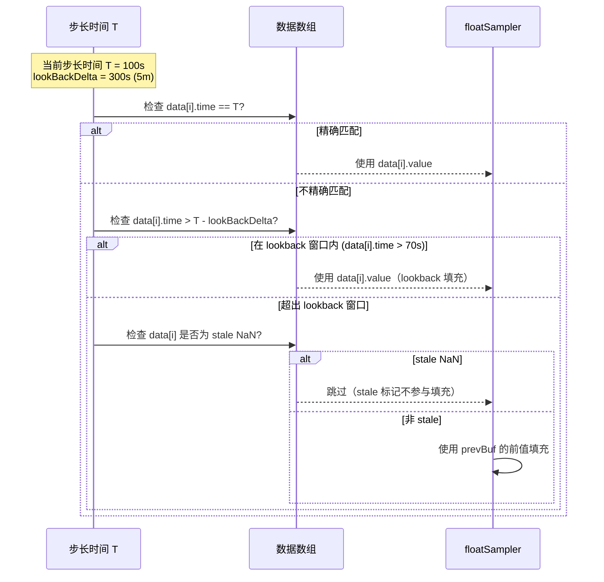

**代码位置**：`engine/prom_instant_vector_cursor.go:327-342`

```go
// PopulateByPrevious 使用前一个 record 的最后一个值填充当前 record 之前的步长
func (r *floatSampler) PopulateByPrevious(outRecord *record.Record, param *ReducerParams,
    nextStep, lastStep int64, outOrdinal, timeIdx int) {
    if model.IsStaleNaN(r.prevBuf.value) {
        return  // stale NaN 不参与 lookback 填充
    }
    for t := nextStep; t <= lastStep; t += param.step {
        if r.prevBuf.time < t-param.lookBackDelta {
            break  // 超出 lookback 窗口，停止填充
        }
        r.fv(outRecord.Column(outOrdinal), r.prevBuf.value)
        if outOrdinal == 0 {
            outRecord.AppendTime(t + r.offset)
        }
    }
}
```

**具体例子**：

```
prevBuf = {time: 5000, value: 42.0}
lookBackDelta = 3000 (3秒)
nextStep = 6000, lastStep = 12000, step = 2000

t=6000: prevBuf.time(5000) >= 6000-3000(3000) -> 填充 42.0
t=8000: prevBuf.time(5000) >= 8000-3000(5000) -> 填充 42.0 (恰好在边界)
t=10000: prevBuf.time(5000) < 10000-3000(7000) -> 停止填充
```

## 附录 F：HTTP Handler 层深入分析

### F.1 Instant Query 与 Range Query 的参数解析

**代码位置**：`lib/util/lifted/influx/httpd/handler_prom.go`

```go
// getInstantQueryCmd 解析即时查询参数
func getInstantQueryCmd(r *http.Request, w http.ResponseWriter, mst string) (promql2influxql.PromCommand, bool) {
    promCommand := promql2influxql.PromCommand{
        DataType:    promql2influxql.TABLE_DATA,
        ValueFieldKey: "value",
    }
    // 解析 time 参数（评估时间点）
    if v := r.FormValue("time"); v != "" {
        t, err := parseTime(v)
        promCommand.Evaluation = &t
    } else {
        now := time.Now()
        promCommand.Evaluation = &now
    }
    // 解析 lookback_delta 参数
    if v := r.FormValue("lookback_delta"); v != "" {
        promCommand.LookBackDelta, _ = parseDuration(v)
    } else {
        promCommand.LookBackDelta = 5 * time.Minute  // 默认 5 分钟
    }
    // 解析 timeout 参数
    // ...
    return promCommand, true
}

// getRangeQueryCmd 解析范围查询参数
func getRangeQueryCmd(r *http.Request, w http.ResponseWriter, mst string) (promql2influxql.PromCommand, bool) {
    promCommand := promql2influxql.PromCommand{
        DataType:    promql2influxql.GRAPH_DATA,
        ValueFieldKey: "value",
    }
    // 解析 start、end、step 参数
    if v := r.FormValue("start"); v != "" {
        t, _ := parseTime(v)
        promCommand.Start = &t
    }
    if v := r.FormValue("end"); v != "" {
        t, _ := parseTime(v)
        promCommand.End = &t
    }
    if v := r.FormValue("step"); v != "" {
        promCommand.Step, _ = parseDuration(v)
    }
    // 默认回溯窗口
    promCommand.LookBackDelta = 5 * time.Minute
    // 验证：start < end, step > 0
    // ...
    return promCommand, true
}
```

**通俗解释**：

| 参数 | Instant Query | Range Query |
|------|--------------|-------------|
| `query` | 必需 | 必需 |
| `time` | 可选（默认 now） | 不使用 |
| `start` | 不使用 | 必需 |
| `end` | 不使用 | 必需 |
| `step` | 不使用 | 必需（默认 1m） |
| `lookback_delta` | 可选（默认 5m） | 可选（默认 5m） |
| `timeout` | 可选 | 可选 |

### F.2 MetricStore 模式

**代码位置**：`lib/util/lifted/influx/httpd/handler_prom.go:91-96`

```go
func (h *Handler) servePromWriteWithMetricStore(w http.ResponseWriter, r *http.Request, user meta2.User) {
    mst, ok := getMstByProm(h, w, r)
    if !ok { return }
    h.servePromWriteBase(w, r, user, mst, timeSeries2RowsV2)
}
```

**通俗解释**：

MetricStore 模式允许将不同的指标存储到不同的 measurement 中，而不是全部存储在 `__name__` 对应的 measurement 中。

URL 模式：`/prometheus/{metric_store}/api/v1/query`

当使用 MetricStore 模式时：
- 写入时：`metric_store` 作为 measurement 名称
- 查询时：`metric_store` 作为 `FROM` 子句中的 measurement

这在多租户场景中特别有用——不同租户可以使用不同的 metric_store，实现数据隔离。

### F.3 异步查询支持

```go
// 解析是否为异步命令
async := r.FormValue("async") == "true"

// 异步执行
if async {
    // 立即返回，查询在后台执行
    go func() {
        // ... 执行查询
    }()
    h.writeHeader(w, http.StatusAccepted)
    return
}
```

### F.4 Explain 查询分析

```go
// explain 参数用于输出查询延迟分析
isExplain := false
explain := r.FormValue("explain")
if len(explain) > 0 {
    isExplain, _ = strconv.ParseBool(explain)
}

// 在 execQuery 中使用 ExplainStatement
if isExplain {
    q = &influxql.Query{Statements: []influxql.Statement{
        &influxql.ExplainStatement{Statement: statement, Analyze: true},
    }}
}
```

**通俗解释**：

当请求中包含 `explain=true` 时，查询不会实际执行，而是返回查询计划的分析信息。这对于调试慢查询非常有用——可以查看 Transpiler 生成的 InfluxQL、执行计划的各个阶段、预计的资源消耗等。

### F.5 慢查询统计

```go
var qDuration *statistics.SQLSlowQueryStatistics
if !isInternalDatabase(db) {
    qDuration = statistics.NewSqlSlowQueryStatistics(db)
    defer func() {
        d := time.Now().Sub(start)
        if d.Nanoseconds() > time.Second.Nanoseconds()*10 {
            // 超过 10 秒的查询记录为慢查询
            qDuration.AddDuration("TotalDuration", d.Nanoseconds())
            statistics.AppendSqlQueryStatistics(qDuration)
            h.Logger.Info("slow query",
                zap.Duration("duration", d),
                zap.String("db", qDuration.DB),
                zap.String("query", qDuration.Query),
            )
        }
    }()
}
```

**通俗解释**：

所有超过 10 秒的 PromQL 查询都会被记录为慢查询，包括：
- 执行时间
- 数据库名称
- 查询语句

这些统计数据会被推送到监控系统，用于告警和性能分析。

## 附录 G：配置参数参考

### G.1 LookBackDelta 配置

| 参数 | 默认值 | 说明 |
|------|--------|------|
| `DefaultLookBackDelta` | 5 分钟 | PromQL 查询的最大回溯窗口 |

**影响**：
- 增大 LookBackDelta 可以确保在数据点稀疏时仍能找到样本
- 减小 LookBackDelta 可以减少查询的数据读取量
- Prometheus 的默认值也是 5 分钟，保持一致可以确保语义兼容

### G.2 ResultCache 配置

| 参数 | 说明 |
|------|------|
| `ResultCache.Enabled` | 是否启用结果缓存 |
| `ResultCache.CacheType` | 缓存类型枚举：`MEM_CACHE` / `FILE_CACHE`；当前 factory 只有 `MEM_CACHE` 实现 |
| `ResultCache.SplitQueriesByInterval` | 查询分割间隔 |
| `ResultCache.MaxCacheFreshness` | 最大缓存新鲜度 |

### G.3 默认值常量

**代码位置**：`lib/util/lifted/promql2influxql/constant.go`

```go
const (
    DefaultFieldKey            = "value"       // 默认字段名
    DefaultMetricKeyLabel      = "__name__"    // 指标名标签
    DefaultMeasurementName     = "prom_metric_not_specified"  // 未指定指标时的默认 measurement
    DefaultDatabaseName        = "prom"        // 默认数据库
    DefaultRetentionPolicyName = "autogen"     // 默认保留策略
    DefaultLookBackDelta       = 5 * time.Minute  // 默认回溯窗口
    FieldCountForKeepMetric    = 2             // keepMetric 模式下的字段数
    PromSuffix                 = "_prom"       // PromQL 函数后缀
)
```

## 附录 H：错误处理与异常场景

### H.1 错误码分类

PromQL 兼容层定义了丰富的错误码，覆盖各类异常场景：

| 错误码 | 含义 | 触发场景 |
|--------|------|----------|
| `TranspileExprFail` | 表达式转译失败 | 顶层转译错误 |
| `TranspileIVSFail` | 即时向量选择器转译失败 | VectorSelector 处理错误 |
| `TranspileFunctionFail` | 函数转译失败 | Call 参数转译错误 |
| `TranspileAggFail` | 聚合表达式转译失败 | AggregateExpr 处理错误 |
| `UnsupportedNodeType` | 不支持的 AST 节点类型 | 遇到未知的 PromQL 节点 |
| `UnsupportedPromExpr` | 不支持的 PromQL 表达式 | 无法转换为 InfluxQL |
| `UnsupportedAggType` | 不支持的聚合类型 | 不在 aggregateFns 表中 |
| `UnsupportedBothVS` | 不支持的双向量操作 | 两边都是 vector 的复杂情况 |
| `InvalidSVBinOp` | 无效的标量-向量二元操作 | 运算符不支持的操作数组合 |
| `InvalidExprType` | 无效的表达式类型 | 返回类型不是 vector 或 scalar |
| `PromReceiverErr` | 结果转换错误 | Receiver 中的 panic 恢复 |
| `ErrPopulatePromSeries` | 序列构建错误 | 标签分组时的错误 |
| `ErrGroupResultBySeries` | 序列分组错误 | 哈希分组时的错误 |
| `ParseTimeFail` | 时间解析错误 | Row 中的时间类型不正确 |

### H.2 panic 恢复机制

**代码位置**：`lib/util/lifted/promql2influxql/receiver.go:237-241`

```go
defer func() {
    if re := recover(); re != nil {
        promRes, promErr = NewPromData(nil, ""), errno.NewError(errno.PromReceiverErr)
        logger.GetLogger().Error(promErr.Error(),
            zap.String("InfluxResultToPromQLValue", string(debug.Stack())))
    }
}()
```

**通俗解释**：

所有 Receiver 方法都有 `defer recover()` 保护，确保即使发生 panic（如空指针、类型断言失败），也不会导致整个进程崩溃。panic 会被捕获并转换为错误返回值，同时记录完整的堆栈信息便于排查。

### H.3 空结果处理

```go
// AbsentNoMstResult 处理 absent() 函数在没有匹配 measurement 时的结果
func (r *Receiver) AbsentNoMstResult(expr parser.Expr) (*PromData, error) {
    if r.Evaluation != nil {
        // instant query：返回一个值为 1 的样本
        metric := getAbsentLabelsFromExpr(expr)
        res := &promql.Vector{promql.Sample{T: r.Evaluation.UnixMilli(), F: 1, Metric: metric}}
        return NewPromData(&PromDataVector{res}, string(parser.ValueTypeVector)), nil
    }
    // range query：返回多个时间步的值为 1 的样本
    start, end, interval := r.Start.UnixMilli(), r.End.UnixMilli(), r.Step.Milliseconds()
    // ... 生成完整的时间序列
}
```

**通俗解释**：

`absent()` 函数的语义是"如果序列不存在则返回 1"。当查询的 measurement 本身就不存在时（即完全没有数据），需要特殊处理：不查询存储层，直接构造返回值为 1 的结果。

### H.4 错误包装示例

```go
// 转译错误包装
influxNode, err := t.transpile(expr)
if err != nil {
    return nil, errno.NewError(errno.TranspileExprFail, err.Error())
}

// 二元表达式左操作数错误包装
lhs, err := t.transpileExpr(b.LHS)
if err != nil {
    return nil, errno.NewError(errno.UnableLeftBinOp, err.Error())
}

// 二元表达式右操作数错误包装
rhs, err := t.transpileExpr(b.RHS)
if err != nil {
    return nil, errno.NewError(errno.UnableRightBinOp, err)
}
```

**通俗解释**：

每一层转译都对错误进行了包装，添加了上下文信息。当用户看到 `TranspileExprFail: UnableLeftBinOp: ...` 时，可以快速定位是二元表达式的左操作数转译出了问题。

## 附录 I：引擎层 Routine 接口与 Reducer 模式

### I.1 Routine 接口体系

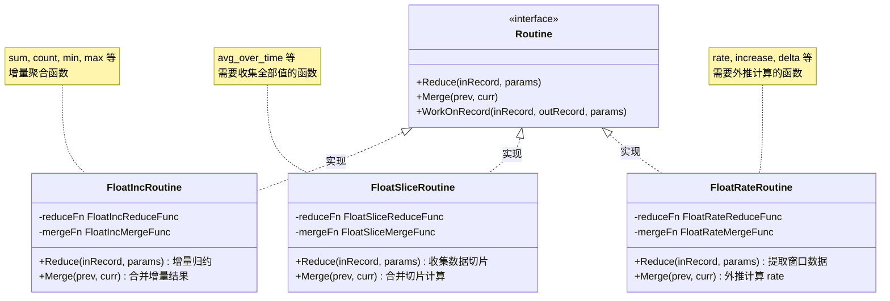

引擎层的函数执行基于 Routine 接口模式：

```go
// Routine 是 PromQL 函数计算例程的核心接口
type Routine interface {
    // Reduce 阶段：对单个 record 内的数据进行归约
    Reduce(inRecord *record.Record, params *ReducerParams)
    // Merge 阶段：跨 record 合并归约结果
    Merge(prev, curr *ReducerParams)
    // WorkOnRecord 协处理入口
    WorkOnRecord(inRecord, outRecord *record.Record, params *ReducerParams)
}
```

每个 PromQL 函数都通过 `CreateRoutine()` 工厂方法创建对应的 Routine 实例。Routine 有三种主要的 Reducer 模式：

#### I.1.1 FloatIncReducer（增量 Reducer）

适用于聚合类函数（avg、sum、min、max、count、last 等）：

```go
type FloatIncReducer struct {
    reduceFunc FloatIncReduceFunc  // 单窗口归约函数
    mergeFunc  FloatIncMergeFunc   // 跨窗口合并函数
    result     struct {
        time  int64
        value float64
        count int
    }
}

type FloatIncReduceFunc func(times []int64, values []float64, start, end int) (int64, float64, bool)
type FloatIncMergeFunc func(prevValue, currValue float64, prevCount, currCount int) (float64, int)
```

**工作流程**：
1. **Reduce**：在每个时间窗口内，调用 `reduceFunc` 计算一个中间结果（时间戳、值、计数）
2. **Merge**：跨 record 时，调用 `mergeFunc` 合并两个中间结果

**示例**（sum_over_time）：
```
Record 1 窗口 [0, 3): values=[1.0, 2.0, 3.0]
  Reduce: time=0, value=6.0, count=3

Record 2 窗口 [0, 3) 续: values=[4.0]
  Reduce: time=0, value=4.0, count=1
  Merge: value=6.0+4.0=10.0, count=3+1=4
```

#### I.1.2 FloatSliceReducer（切片 Reducer）

适用于需要整个窗口数据的函数（rate、increase、deriv、quantile 等）：

```go
type FloatSliceReducer struct {
    reduceFunc FloatSliceReduceFunc  // 提取数据切片
    mergeFunc  FloatSliceMergeFunc   // 计算最终结果
}

type FloatSliceReduceFunc func(times []int64, values []float64, start, end int) ([]int64, []float64, bool)
type FloatSliceMergeFunc func(prevT, currT []int64, prevV, currV []float64, ts int64, pointCount int, param *ReducerParams) (float64, bool)
```

**工作流程**：
1. **Reduce**：提取窗口内的原始数据切片（不做计算）
2. **Merge**：跨 record 合并数据切片，然后在最终的完整数据上计算结果

**为什么 rate 需要 FloatSliceReducer？** 因为 rate 的外推算法需要知道窗口内所有数据点的分布情况（首尾点的位置、数据点的数量等），无法通过增量方式计算。

#### I.1.3 FloatRateReducer（速率 Reducer）

适用于速率类函数（irate）：

```go
type FloatRateReducer struct {
    reduceFunc FloatRateReduceFunc  // 归约函数
    mergeFunc  FloatRateMergeFunc   // 合并函数
    updateFunc FloatRateUpdateFunc  // 更新函数
}
```

**工作流程**：
1. **Reduce**：提取窗口内的数据
2. **Merge**：计算速率值
3. **Update**：更新状态（如记录前一个值用于下一次计算）

### I.2 CoProcessor 协处理器

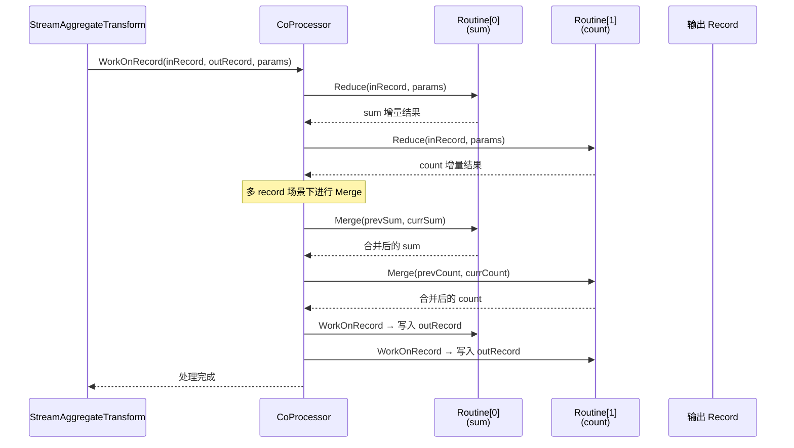

```go
// CoProcessor 管理多个 Routine 的协同执行
type CoProcessor struct {
    routines []Routine
}

func (cp *CoProcessor) WorkOnRecord(inRecord, outRecord *record.Record, params *ReducerParams) {
    for _, routine := range cp.routines {
        routine.WorkOnRecord(inRecord, outRecord, params)
    }
}
```

**通俗解释**：

当查询包含多个 PromQL 函数时（如 `rate(value), sum(value)`），CoProcessor 会同时管理多个 Routine，对同一个 record 进行多次处理，每个 Routine 负责一个输出字段。

### I.3 ReducerParams 参数传递

```go
type ReducerParams struct {
    intervalIndex []uint16     // 区间索引对
    step          int64        // 步长
    firstStep     int64        // 当前记录的第一个步长
    lookBackDelta int64        // 回溯窗口
    offset        int64        // 时间偏移
    rangeDuration int64        // 范围时长
    sameWindow    bool         // 是否与下一个 record 同窗口
    lastRec       bool         // 是否是最后一个 record
    lastStep      int64        // 最后一个步长
}
```

**通俗解释**：

`ReducerParams` 是 InstantVectorCursor/RangeVectorCursor 向 Routine 传递参数的桥梁。它包含了计算所需的所有上下文信息：
- `intervalIndex`：窗口的起止索引（双指针算法的输出）
- `step`、`firstStep`：步长信息
- `lookBackDelta`、`rangeDuration`：窗口参数
- `sameWindow`、`lastRec`：跨 record 状态

## 附录 J：PromQL 远程读写协议

### J.1 Remote Write 协议

Prometheus Remote Write 协议使用 Protobuf + Snappy 压缩：

```
POST /api/v1/write
Content-Type: application/x-protobuf
Content-Encoding: snappy
X-Prometheus-Remote-Write-Version: 0.1.0

[Snappy 压缩的 prompb.WriteRequest]
```

**WriteRequest 结构**：
```protobuf
message WriteRequest {
    repeated TimeSeries timeseries = 1;
    repeated MetricMetadata metadata = 3;
}

message TimeSeries {
    repeated Label labels = 1;
    repeated Sample samples = 2;
}

message Label {
    string name = 1;
    string value = 2;
}

message Sample {
    double value = 1;
    int64 timestamp = 2;
}
```

### J.2 timeSeries2Rows 转换

```go
func timeSeries2Rows(mst string, rows []models.Row, tss []prompb.TimeSeries, inValidTs map[int]bool) ([]models.Row, error) {
    for i, ts := range tss {
        if inValidTs[i] { continue }
        // 将 labels 转换为 tags
        tags := make(models.Tags, 0, len(ts.Labels))
        for _, label := range ts.Labels {
            tags = append(tags, models.NewTag([]byte(label.Name), []byte(label.Value)))
        }
        // 将 samples 转换为 points
        for _, sample := range ts.Samples {
            row := &rows[rowIndex]
            row.Tags = tags
            row.Name = mst  // 使用 __name__ 或 MetricStore 名称
            row.Timestamp = sample.Timestamp * int64(time.Millisecond)  // 毫秒转纳秒
            row.Fields = models.Fields{
                {NumValue: sample.Value},  // 默认字段名 "value"
            }
            rowIndex++
        }
    }
    return rows, nil
}
```

### J.3 Remote Read 协议

```
POST /api/v1/read
Content-Type: application/x-protobuf
Content-Encoding: snappy

[Snappy 压缩的 prompb.ReadRequest]
```

**ReadRequest 结构**：
```protobuf
message ReadRequest {
    repeated Query queries = 1;
}

message Query {
    int64 start_timestamp_ms = 1;
    int64 end_timestamp_ms = 2;
    repeated LabelMatcher matchers = 3;
    ReadHints hints = 4;
}
```

**ReadResponse 结构**：
```protobuf
message ReadResponse {
    repeated QueryResult results = 1;
}

message QueryResult {
    repeated TimeSeries timeseries = 1;
}
```

### J.4 ReadRequestToInfluxQuery 转换

```go
func ReadRequestToInfluxQuery(req *prompb.ReadRequest, mst string) (string, error) {
    queries := make([]string, 0, len(req.Queries))
    for _, q := range req.Queries {
        var measurement string
        var conditions []string
        for _, matcher := range q.Matchers {
            if matcher.Name == "__name__" {
                measurement = matcher.Value
            } else {
                // 转换标签匹配器为 WHERE 条件
                switch matcher.Type {
                case prompb.LabelMatcher_EQ:
                    conditions = append(conditions, fmt.Sprintf("%s = '%s'", matcher.Name, matcher.Value))
                case prompb.LabelMatcher_NEQ:
                    conditions = append(conditions, fmt.Sprintf("%s != '%s'", matcher.Name, matcher.Value))
                case prompb.LabelMatcher_RE:
                    conditions = append(conditions, fmt.Sprintf("%s =~ /%s/", matcher.Name, matcher.Value))
                case prompb.LabelMatcher_NRE:
                    conditions = append(conditions, fmt.Sprintf("%s !~ /%s/", matcher.Name, matcher.Value))
                }
            }
        }
        if mst != "" {
            measurement = mst  // 使用 MetricStore
        }
        start := time.UnixMilli(q.StartTimestampMs)
        end := time.UnixMilli(q.EndTimestampMs)
        query := fmt.Sprintf("SELECT value FROM %s WHERE time >= '%s' AND time <= '%s'",
            measurement, start.Format(time.RFC3339), end.Format(time.RFC3339))
        if len(conditions) > 0 {
            query += " AND " + strings.Join(conditions, " AND ")
        }
        queries = append(queries, query)
    }
    return strings.Join(queries, ";"), nil
}
```

## 附录 K：PromQL 兼容性矩阵

### K.1 已支持的 PromQL 特性

| 特性 | 支持状态 | 说明 |
|------|---------|------|
| 即时查询（/api/v1/query） | 完全支持 | |
| 范围查询（/api/v1/query_range） | 完全支持 | |
| 标签匹配器（=, !=, =~, !~） | 完全支持 | |
| 范围向量（[5m]） | 完全支持 | |
| 子查询（[5m:1m]） | 完全支持 | |
| 偏移修饰符（offset 5m） | 完全支持 | |
| @ 修饰符（@ 1234567890） | 完全支持 | |
| 聚合操作符（sum, avg, max 等） | 完全支持 | |
| by/without 维度控制 | 完全支持 | |
| 二元运算（+，-，*，/） | 部分支持 | 常见标量-标量、标量-向量和部分向量-向量可用；matrix/vector 双侧和有/无 measurement 混合等复杂组合仍有 TODO/限制 |
| 比较运算（==, !=, >, <） | 部分支持 | 常见比较可用，复杂向量匹配限制同二元运算 |
| bool 修饰符 | 完全支持 | |
| 向量匹配（on/ignoring） | 部分支持 | `BinOp` 路径实现常见匹配，但不是完整 Prometheus vector matching 语义覆盖 |
| group_left/group_right | 部分支持 | |
| Remote Write | 支持基础写入 | Protobuf + Snappy 端点存在，写入路径使用 VictoriaMetrics parser |
| Remote Read | 支持基础查询转换 | `/api/v1/read` 会转换为 InfluxQL 查询，不等同于 Prometheus Remote Read 全语义覆盖 |
| 标签查询（/api/v1/labels） | 完全支持 | |
| 标签值查询 | 完全支持 | |
| 序列查询（/api/v1/series） | 完全支持 | |
| 元数据查询（/api/v1/metadata） | 完全支持 | |
| 结果缓存 | 部分支持 | `MEM_CACHE` 已实现；`FILE_CACHE` 仅有枚举，factory 尚未创建文件缓存实例；`@` modifier 超出安全时间或负 offset 时不缓存 |

### K.2 已支持的 PromQL 函数

| 类别 | 函数 | 数量 |
|------|------|------|
| 范围向量函数 | rate, irate, increase, delta, idelta, deriv, predict_linear, avg_over_time, sum_over_time, min_over_time, max_over_time, count_over_time, last_over_time, stddev_over_time, stdvar_over_time, quantile_over_time, changes, resets, holt_winters, absent_over_time, present_over_time, mad_over_time | 22 |
| 即时向量函数 | histogram_quantile, scalar, absent | 3 |
| 数学函数 | abs, ceil, floor, exp, sqrt, ln, log2, log10, round, acos, asin, atan, cos, sin, tan, clamp, clamp_max, clamp_min, rad, deg, sinh, cosh, tanh, asinh, atanh, acosh, sgn | 27 |
| 标签函数 | label_replace, label_join | 2 |
| 时间函数 | year, time, timestamp, month, minute, hour, day_of_week, day_of_month, day_of_year, days_in_month, vector, pi | 12 |
| 排序函数 | sort, sort_desc, sort_by_label, sort_by_label_desc | 4 |

### K.3 已知限制

| 限制 | 说明 | 影响 |
|------|------|------|
| 向量-向量复杂匹配 | 一个有 measurement、一个没有时的二元运算不完整 | 少数复杂查询可能失败 |
| 解释器差异 | 部分函数的浮点精度可能与原生 Prometheus 有微小差异 | 精度敏感场景需注意 |
| 嵌套子查询深度 | 未设置明确的深度限制 | 极深嵌套可能影响性能 |
| 正则表达式 | 使用 Go 标准 regexp 库，与 Prometheus 的 OptimizedRegexMatcher 可能有差异 | 复杂正则的性能可能不同 |

## 附录 L：PromQL 兼容层扩展指南

### L.1 添加新的 PromQL 函数

当需要支持新的 PromQL 函数时，需要在三个层级进行修改：

#### 步骤 1：在 Transpiler 层添加函数映射

```go
// 在 call.go 中，根据函数类型添加到对应的 map
var rangeVectorFunctions = map[string]aggregateFn{
    // ... 已有函数
    "new_function": {name: "new_function_prom", functionType: TRANSFORM_FN},
}
```

#### 步骤 2：在 Engine 层实现函数逻辑

```go
// 在 prom_functions.go 中添加实现
type newFunctionOp struct{}

func (o *newFunctionOp) CreateRoutine(p *PromFuncParam) (Routine, error) {
    // 选择合适的 Reducer 模式
    return NewRoutineImpl(newFloatIncReducer(newFunctionReduce, newFunctionMerge), p.inOrdinal, p.outOrdinal), nil
}

func newFunctionReduce(times []int64, values []float64, start, end int) (int64, float64, bool) {
    // 实现归约逻辑
}

func newFunctionMerge(prevValue, currValue float64, prevCount, currCount int) (float64, int) {
    // 实现合并逻辑
}

func init() {
    RegistryPromFunction("new_function_prom", &newFunctionOp{})
}
```

#### 步骤 3：在 Receiver 层处理结果（通常不需要修改）

除非新函数的返回类型与现有函数不同，否则 Receiver 层不需要修改。

### L.2 添加新的聚合操作符

```go
// 在 aggregate_expr.go 中添加映射
var aggregateFns = map[parser.ItemType]aggregateFn{
    // ... 已有操作符
    parser.NEW_AGG: {name: "new_agg_prom", functionType: AGGREGATE_FN},
}
```

### L.3 添加新的二元运算符

```go
// 在 binary_expr.go 中添加映射
var arithBinOps = map[parser.ItemType]influxql.Token{
    // ... 已有运算符
    parser.NEW_OP: influxql.NEW_OP,
}
```

### L.4 测试建议

1. **单元测试**：在 `lib/util/lifted/promql2influxql/` 目录下编写转译测试
2. **集成测试**：使用 Prometheus 的测试框架验证查询结果
3. **端到端测试**：通过 HTTP API 发送查询，验证响应格式
4. **对比测试**：与原生 Prometheus 对比相同查询的结果，确保一致性

## 附录 M：核心数据结构流转详解

### M.1 从 PromQL 到 InfluxQL 的 AST 映射

下表详细列出了每种 PromQL AST 节点到 InfluxQL AST 节点的映射关系：

| PromQL AST 节点 | InfluxQL AST 节点 | 映射方式 |
|----------------|-------------------|----------|
| `parser.NumberLiteral` | `influxql.NumberLiteral` | 直接映射 |
| `parser.StringLiteral` | `influxql.StringLiteral` | 直接映射 |
| `parser.VectorSelector` | `influxql.SelectStatement` | 生成 SELECT + WHERE + GROUP BY |
| `parser.MatrixSelector` | `influxql.SelectStatement` | 设置 timeRange 后递归 VectorSelector |
| `parser.AggregateExpr` | `influxql.SelectStatement` | 外层 SELECT + GROUP BY 维度 |
| `parser.BinaryExpr`（标量-标量） | `influxql.BinaryExpr` | 直接映射运算符 |
| `parser.BinaryExpr`（标量-向量） | `influxql.SelectStatement` + 字段表达式 | 嵌入到字段或条件中 |
| `parser.BinaryExpr`（向量-向量） | `influxql.SelectStatement` + `influxql.BinOp` | 使用 BinOp 源 |
| `parser.Call` | `influxql.SelectStatement` + `influxql.Call` | 函数名映射 + 参数传递 |
| `parser.SubqueryExpr` | `influxql.SelectStatement` | 递归 + 时间参数调整 |
| `parser.ParenExpr` | `influxql.ParenExpr` | 直接映射 |
| `parser.UnaryExpr` | `influxql.BinaryExpr` | 转换为 0 - expr |
| `parser.StepInvariantExpr` | 透传内部表达式 | 设置 duplicateResult |

### M.2 InfluxQL SelectStatement 字段详解

Transpiler 生成的 `influxql.SelectStatement` 包含以下关键字段：

```go
type SelectStatement struct {
    // 基本字段
    Fields      Fields           // SELECT 子句的字段列表
    Sources     Sources          // FROM 子句的数据源
    Condition   Expr             // WHERE 子句的条件表达式
    Dimensions  Dimensions       // GROUP BY 子句的维度

    // PromQL 扩展字段
    IsPromQuery bool             // 标记为 PromQL 查询
    Step        time.Duration    // 步长（对应 PromQL 的 step）
    Range       time.Duration    // 范围（对应 [5m] 的 5m）
    LookBackDelta time.Duration  // 回溯窗口
    QueryOffset time.Duration    // 查询偏移
    RemoveMetric bool            // 是否移除 __name__ 标签
    Without     bool             // 是否使用 without 模式
    Fill        FillOption       // 填充选项（通常为 NoFill）
    SortFields  SortFields       // 排序字段（sort 函数使用）

    // 子查询相关
    PromSubCalls []*PromSubCall  // PromQL 子查询调用

    // 优化相关
    SelectAllTags bool           // 是否选择所有标签
    SelectTagToAux bool          // 是否将选择的标签移到辅助位置
}
```

### M.3 BinOp 结构详解

`influxql.BinOp` 是 openGemini 为 PromQL 向量运算专门扩展的节点：

```go
type BinOp struct {
    LSrc        Source      // 左操作数源（SubQuery）
    RSrc        Source      // 右操作数源（SubQuery）
    LExpr       Expr        // 左操作数表达式（标量场景）
    RExpr       Expr        // 右操作数表达式（标量场景）
    OpType      int         // 操作类型（对应 PromQL 运算符）
    On          bool        // 是否使用 on 模式
    MatchKeys   []string    // 匹配的标签列表
    MatchCard   MatchCardinality  // 基数类型（one/many）
    IncludeKeys []string    // 包含的标签列表
    ReturnBool  bool        // 是否返回 bool 值
}
```

**通俗解释**：

BinOp 的核心是向量匹配逻辑：
- `On: true, MatchKeys: ["method"]`：表示 `on (method)` —— 只在 method 标签上匹配
- `MatchCard: CARD_ONE`：表示 `group_left` —— 左边是 "多" 端，右边是 "一" 端
- `IncludeKeys: ["endpoint"]`：表示 `group_left (endpoint)` —— 将右边的 endpoint 标签包含到结果中

### M.4 PromSubCall 子查询调用

```go
type PromSubCall struct {
    Name      string           // 函数名（如 "rate_prom"）
    StartTime int64            // 查询起始时间（纳秒）
    EndTime   int64            // 查询结束时间（纳秒）
    Range     time.Duration    // 范围时长
    Offset    time.Duration    // 偏移量
    InArgs    []Expr           // 函数参数
    Interval  int64            // 评估间隔（纳秒）
    SubStartT int64            // 子查询起始时间
    SubEndT   int64            // 子查询结束时间
    SubStep   int64            // 子查询步长
    LowerStepInvariant bool   // 下层是否步长无关
}
```

**通俗解释**：

`PromSubCall` 用于处理带子查询的函数调用，如 `rate(metric[5m:1m])`。它封装了子查询的所有时间参数，传递给引擎层的子查询执行器。

## 附录 N：性能优化策略

### N.1 查询计划优化

Transpiler 在转译过程中实现了多种查询计划优化：

1. **聚合下推**（`canPushDownAggWithFunction`）：将聚合函数直接下推到范围向量函数中，避免子查询
2. **条件合并**（`CombineConditionAnd`）：将时间条件和标签条件合并为单个 WHERE 子句
3. **步长无关优化**（`StepInvariantExpr`）：对步长无关表达式只计算一次，复用结果
4. **批量处理**：CoProcessor 在单个 record 上执行所有 Routine，减少 I/O 次数

### N.2 内存优化

1. **对象池**：使用 `pool.GetRows` / `pool.PutRows` 复用行对象
2. **流式解析**：Remote Write 使用 VictoriaMetrics 的流式解析器，不需要一次性读入整个请求体
3. **record 分批**：数据按 record 分批处理，单个 record 的大小有限，内存可控
4. **BufferPool**：使用 `bufferpool.Get()` / `bufferpool.Put()` 复用缓冲区

### N.3 缓存策略

1. **结果缓存**：对范围查询的结果进行缓存，避免重复计算
2. **一致性哈希**：确保相同查询路由到同一节点，提高缓存命中率
3. **缓存分割**：大范围查询被分割为多个小范围，分别缓存和合并
4. **新鲜度控制**：`MaxCacheFreshness` 防止返回过期数据

### N.4 并发控制

```go
opts := query.ExecutionOptions{
    ParallelQuery: atomic.LoadInt32(&syscontrol.ParallelQueryInBatch) == 1,
    // ...
}
```

当 `ParallelQuery` 启用时，多个查询可以并行执行。这在高并发场景下可以提高吞吐量，但也需要注意资源竞争。

## 附录 O：PromQL 语义兼容性保证

### O.1 时间戳处理

PromQL 使用毫秒时间戳，而 InfluxQL 使用纳秒时间戳。转译层在两个单位之间进行转换：

```go
// 毫秒 -> 纳秒
func timeMilliseconds(t time.Time) int64 {
    return t.UnixNano() / int64(time.Millisecond/time.Nanosecond)
}

// 纳秒 -> 毫秒
func durationMilliseconds(d time.Duration) int64 {
    return int64(d / (time.Millisecond / time.Nanosecond))
}
```

### O.2 StaleNaN 语义

Prometheus 的 StaleNaN 有特殊语义：
- 值为 `math.Float64frombits(0x7FF0000000000002)`
- 表示序列"过期"——当一个序列在某个时间步没有新数据时，Prometheus 会插入 StaleNaN
- StaleNaN 不参与任何计算（rate、avg 等都跳过 StaleNaN）
- StaleNaN 会中断 lookback 填充（遇到 StaleNaN 后，之前的数据不再用于填充后续时间步）

openGemini 的实现严格遵循这些语义：
- `FilterInstantNANPoint` / `FilterRangeNANPoint` 在采样前过滤 StaleNaN
- `floatSampler.Aggregate` 在采样时检查 `model.IsStaleNaN`
- `floatSampler.PopulateByPrevious` 在 lookback 填充时检查 StaleNaN

### O.3 Counter Reset 处理

PromQL 的 rate/increase 函数需要处理 counter reset（计数器重置为 0）：
- 当检测到当前值小于前一个值时，认为发生了 counter reset
- reset 时的增量 = 当前值 + (前一个值的最大值 - 前一个值) = 当前值

```go
// CalcReduceResult 中的 counter reset 处理
firstTime, lastTime, firstValue, _, reduceResult := executor.CalcReduceResult(prevT, currT, prevV, currV, isCounter)
```

### O.4 外推语义

rate/increase 的外推算法是 Prometheus 最核心的计算逻辑之一，openGemini 的实现与原生 Prometheus 保持一致：

1. **首尾点外推**：根据首尾样本与窗口边界的距离，按比例外推
2. **外推阈值**：距离超过平均采样间隔的 1.1 倍时，只外推半个采样间隔
3. **Counter 从 0 开始**：如果 counter 从 0 开始增长，外推距离不超过到 0 的时间
4. **单点不计算**：窗口内只有一个点时，返回 0（无法计算速率）
