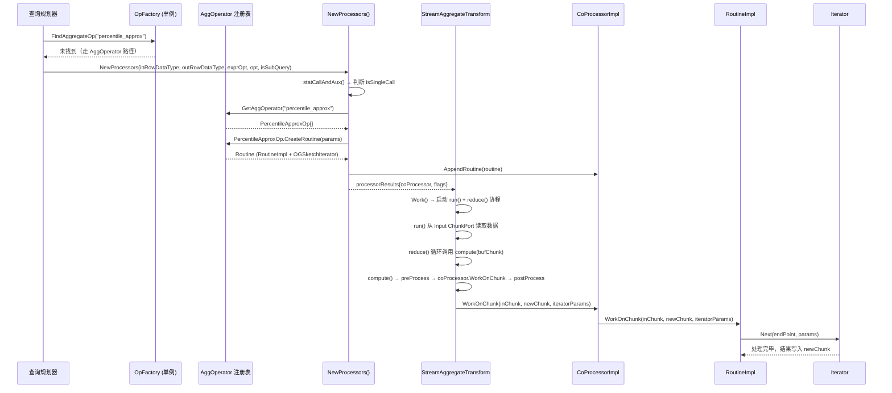
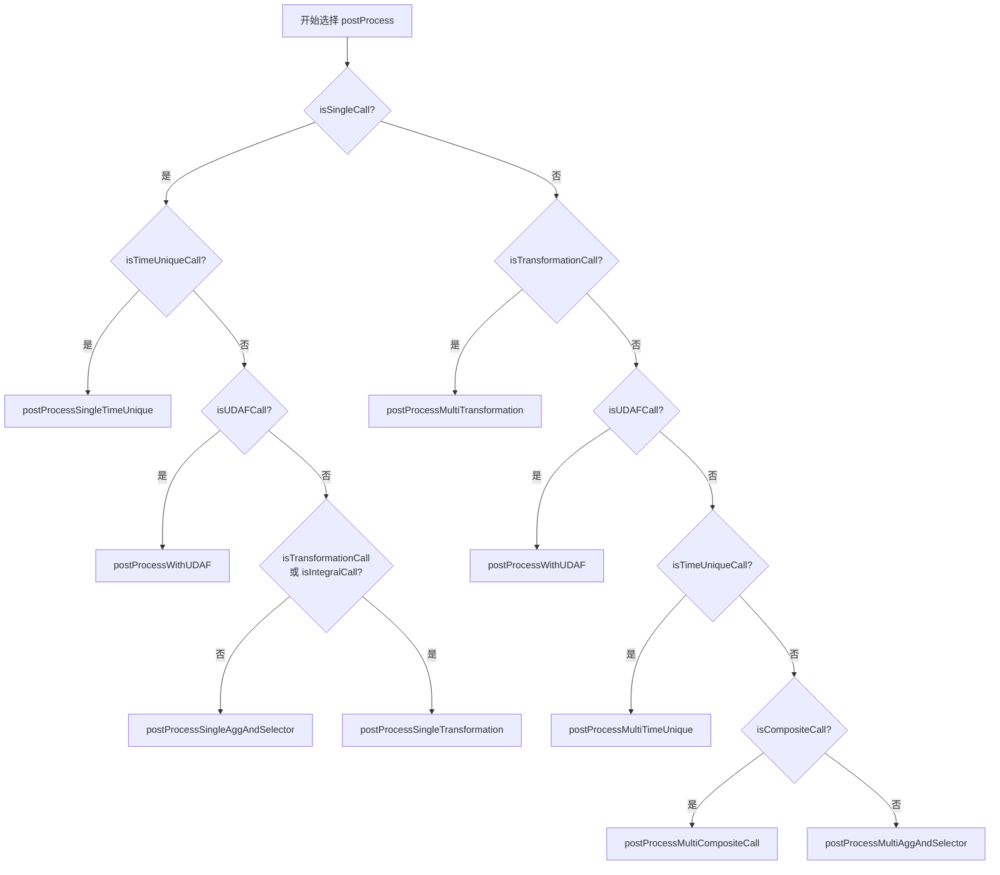
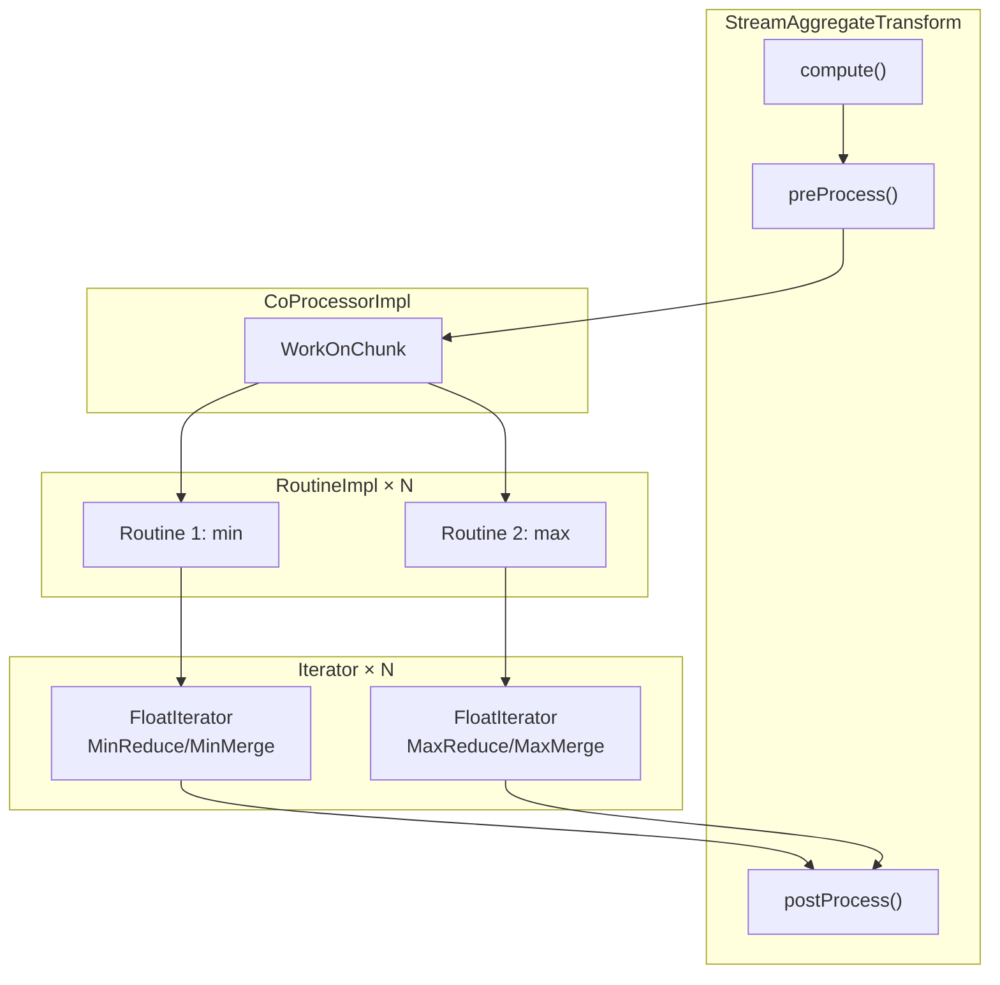
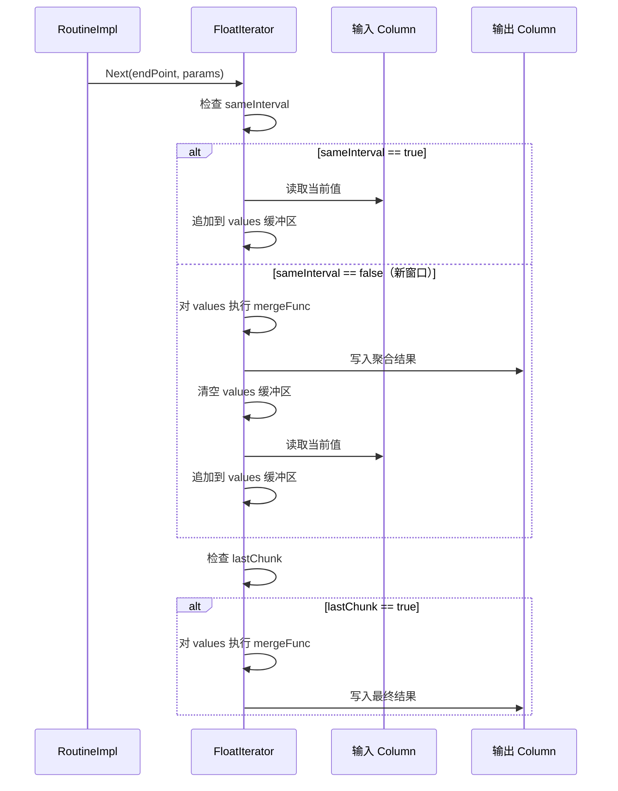
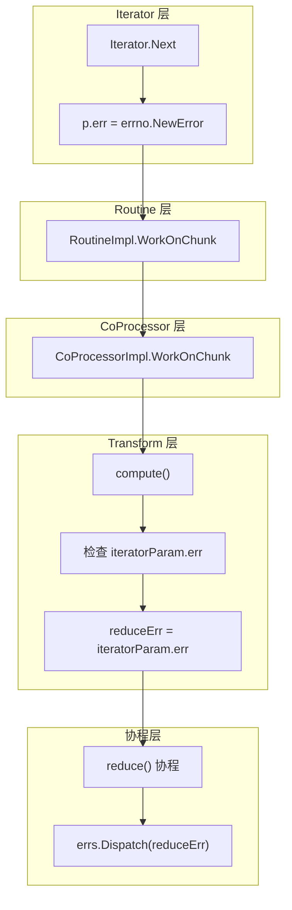

# Module 9: UDAF / 算子框架深度审计报告（庖丁解牛版 v3）

> 时序图 + 核心代码逐行解释。先画图，再对照代码，一步一步拆解。

---

## 1. UDAF 算子框架是什么？为什么需要它？

openGemini 的 UDAF（User-Defined Aggregate Function）/ 算子框架是一套**可扩展的聚合函数注册与执行系统**。它的核心目标是：

1. **统一注册入口**：无论是内置聚合函数（count、sum、first、last）还是扩展聚合函数（percentile_approx、histogram_quantile），都通过统一的接口注册和发现。
2. **类型安全分发**：根据输入数据类型（Float、Integer、String、Boolean）自动选择对应的 Iterator 实现。
3. **流式聚合执行**：通过 StreamAggregateTransform 实现基于时间窗口和标签分组的流式聚合。
4. **UDAF 扩展能力**：允许通过不同 Iterator 模式处理特殊聚合。`percentile_approx` 走 OGSketch 系列 Iterator，`histogram_quantile` 走 `FloatColFloatHistogramIterator`，`WideIterator` 主要服务 Castor / CastorAD 这类需要整批 Arrow 数据交换的算子。

### 1.1 整体架构时序图



### 1.2 核心概念：三层架构

openGemini 的算子框架分为三层：

| 层次 | 核心组件 | 职责 |
|------|----------|------|
| **注册层** | OpFactory + AggOperator 注册表 | 算子的注册、发现、类型推导 |
| **分发层** | NewProcessors() | 根据函数名分发到对应的 Routine 创建逻辑 |
| **执行层** | StreamAggregateTransform + CoProcessor + Iterator | 流式聚合执行引擎 |

```mermaid
graph TB
    subgraph 注册层
        OF[OpFactory 单例<br/>engine/op/factory.go]
        AO[AggOperator 注册表<br/>engine/executor/agg_factory.go]
        REG[agg_operators.go<br/>init() 注册 19 个算子]
    end

    subgraph 分发层
        NP[NewProcessors<br/>engine/executor/call_processor.go]
        PR[processorResults<br/>标志位控制]
    end

    subgraph 执行层
        SAT[StreamAggregateTransform<br/>engine/executor/agg_transform.go]
        CP[CoProcessorImpl<br/>engine/executor/coprocessor.go]
        RI[RoutineImpl]
        WI[WideIterator<br/>engine/executor/udaf_iterator.go]
        IT[各种 Iterator 实现]
    end

    OF --> NP
    AO --> NP
    REG --> AO
    NP --> PR
    NP --> CP
    SAT --> CP
    CP --> RI
    CP --> WI
    RI --> IT
```

---

## 2. Op 接口体系

### 2.1 核心接口：Op — 一切算子的根

**代码位置**：`engine/op/op.go:23-32`

```go
// Op 是所有算子的基础接口，定义了算子的元数据和编译能力
type Op interface {
    Name() string                                          // 算子名称，如 "percentile_approx"
    ID() uint64                                            // 算子唯一标识
    Arity() int                                            // 参数个数
    EqualTo(other Op) bool                                 // 比较两个算子是否相同
    Clone() Op                                             // 克隆算子（深拷贝）
    Dump() string                                          // 调试输出
    Type(...influxql.DataType) (influxql.DataType, error)  // 类型推导：输入类型 → 输出类型
    Compile(call *influxql.Call) error                     // 编译时校验
}
```

**通俗解释**：`Op` 接口是所有算子的"身份证"。每个算子必须告诉系统：我叫什么名字、接受几个参数、输入什么类型输出什么类型、编译时有没有语法错误。

> 边界说明：查询执行层的 UDAF/wide path 主要通过 `engine/executor/agg_factory.go` 的 `AggOperator` 注册表和 `isUDAFCall` 标志创建 Routine。`engine/op.UDAFOp` 是另一套 op 接口，更多用于 pushdown/series 能力判断。新增 Castor、count_values 这类执行层聚合时，不能只实现 `engine/op.UDAFOp`，还需要按执行路径注册 `AggOperator` 或接入对应 wide processor。

### 2.2 BaseOp 基础结构体 — 模板方法模式

**代码位置**：`engine/op/op.go:34-82`

```go
type BaseOp struct {
    derived Op      // 指向子类的指针，用于实现模板方法模式
    name    string
    id      uint64
    arity   int
}

// 初始化方法，在子类构造函数中调用
func (op *BaseOp) init(derived Op, name string, id uint64, arity int) {
    op.derived = derived
    op.name = name
    op.id = id
    op.arity = arity
}

// Clone、Compile、Type 都是模板方法，委托给 derived（子类）
func (op *BaseOp) Clone() Op {
    return op.derived.Clone()
}

func (op *BaseOp) Compile(call *influxql.Call) error {
    return op.derived.Compile(call)
}

func (op *BaseOp) Type(args ...influxql.DataType) (influxql.DataType, error) {
    return op.derived.Type(args...)
}
```

**通俗解释**：`BaseOp` 使用了经典的**模板方法模式**。它实现了 `Name()`、`ID()`、`Arity()` 等通用方法，但把 `Clone()`、`Compile()`、`Type()` 这些需要子类定制的方法委托给 `derived` 指针。这样子类只需要嵌入 `BaseOp` 并实现差异化的部分。

**具体例子**：

```go
// 假设定义一个自定义算子
type MyOp struct {
    BaseOp
}

func NewMyOp() *MyOp {
    op := &MyOp{}
    op.init(op, "my_op", 1001, 2)  // 传入自己作为 derived
    return op
}

func (op *MyOp) Clone() Op { return &MyOp{BaseOp: op.BaseOp} }
func (op *MyOp) Compile(call *influxql.Call) error { /* 校验逻辑 */ }
func (op *MyOp) Type(args ...influxql.DataType) (influxql.DataType, error) { return influxql.Float, nil }
```

### 2.3 ProjectOp — 投影算子接口

**代码位置**：`engine/op/op.go:84-86`

```go
// ProjectOp 用于行级投影计算，如 SELECT field(value)
type ProjectOp interface {
    Eval(...interface{}) (interface{}, error)
}
```

**通俗解释**：`ProjectOp` 用于**逐行计算**的场景。它不需要聚合多行数据，只需要对每一行的值进行转换。例如 `SELECT abs(value) FROM cpu` 中的 `abs` 就是一个 ProjectOp。

### 2.4 AggregateOp 与 UDAFOp — 聚合算子接口

**代码位置**：`engine/op/op.go:88-104`

```go
// RoutineFactory 是 Routine 的工厂接口
type RoutineFactory interface {
    Create(...interface{}) (interface{}, error)
}

// AggregateOp 定义了聚合算子的工厂方法
type AggregateOp interface {
    Factory() RoutineFactory
}

// UDAFOp 扩展 AggregateOp，增加了是否可以下推到存储层的能力
type UDAFOp interface {
    AggregateOp
    CanPushDownSeries() bool  // 是否可以下推到时间线级别
}
```

**通俗解释**：

- `AggregateOp`：聚合算子必须提供一个工厂（`Factory()`），用来创建执行 Routine。这是**工厂模式**的经典应用。
- `UDAFOp`：在 `AggregateOp` 基础上增加了 `CanPushDownSeries()` 方法。如果返回 `true`，表示这个 UDAF 可以在存储层（ts-engine）先做局部聚合，然后在计算层做最终聚合，从而减少数据传输量。

**具体例子**：

```go
// FuncRoutineFactory 是一个函数式工厂，将普通函数适配为 RoutineFactory
type FuncRoutineFactory func(...interface{}) (interface{}, error)

func (f FuncRoutineFactory) Create(args ...interface{}) (interface{}, error) {
    return f(args...)
}
```

### 2.5 接口关系图：独立接口 + 类型断言

```mermaid
classDiagram
    class Op {
        <<interface>>
        +Name() string
        +ID() uint64
        +Arity() int
        +EqualTo(Op) bool
        +Clone() Op
        +Dump() string
        +Type(...DataType) DataType
        +Compile(Call) error
    }

    class BaseOp {
        +derived Op
        +name string
        +id uint64
        +arity int
        +init(derived, name, id, arity)
    }

    class ProjectOp {
        <<interface>>
        +Eval(...interface{}) interface{}
    }

    class AggregateOp {
        <<interface>>
        +Factory() RoutineFactory
    }

    class UDAFOp {
        <<interface>>
        +Factory() RoutineFactory
        +CanPushDownSeries() bool
    }

    class RoutineFactory {
        <<interface>>
        +Create(...interface{}) interface{}
    }

    BaseOp ..|> Op : 实现通用元数据
    OpFactory --> Op : FindOp()
    OpFactory --> ProjectOp : 类型断言
    OpFactory --> AggregateOp : 类型断言
    OpFactory --> UDAFOp : 类型断言
    AggregateOp --> RoutineFactory : Factory()
```

**关键区别**：这里不是 Java/C++ 风格的继承树。`Op`、`ProjectOp`、`AggregateOp`、`UDAFOp` 在 Go 代码里是独立接口，`OpFactory` 先按名称拿到注册对象，再用类型断言判断它是否同时满足 `ProjectOp`、`AggregateOp` 或 `UDAFOp`。`UDAFOp` 在代码里复用了 `AggregateOp` 的方法集，但文档理解上应看作“额外满足 CanPushDownSeries 能力的聚合接口”，而不是继承 `Op`。

---

## 3. OpFactory 注册模式

### 3.1 单例工厂 — 全局算子注册中心

**代码位置**：`engine/op/factory.go:24-32`

```go
var opFactory *OpFactory
var once sync.Once

// GetOpFactory 返回全局唯一的 OpFactory 单例
func GetOpFactory() *OpFactory {
    once.Do(func() {
        opFactory = NewOpFactory()
    })
    return opFactory
}

type OpFactory struct {
    pmap map[string]Op  // name → Op 的映射表
}
```

**通俗解释**：`OpFactory` 是一个**单例模式**的全局注册中心。所有通过 `OpFactory` 注册的算子都存储在 `pmap` 这个 map 中，key 是算子名称，value 是 `Op` 接口。

### 3.2 注册与查找方法

**代码位置**：`engine/op/factory.go:44-97`

```go
// AddOp 注册一个新的算子，如果名称重复则报错
func (c *OpFactory) AddOp(op Op) error {
    if _, ok := c.pmap[op.Name()]; ok {
        return fmt.Errorf("duplicated udf %s", op.Name())
    }
    c.pmap[op.Name()] = op
    return nil
}

// FindOp 按名称查找算子
func (c *OpFactory) FindOp(name string) (Op, bool) {
    if op, ok := c.pmap[name]; ok {
        return op, true
    }
    return nil, false
}

// FindAggregateOp 查找并断言为 AggregateOp
func (c *OpFactory) FindAggregateOp(name string) (AggregateOp, bool) {
    if op, ok := c.FindOp(name); ok {
        if aop, ok := op.(AggregateOp); ok {
            return aop, true
        }
        return nil, false
    }
    return nil, false
}

// FindUDAFOp 查找并断言为 UDAFOp
func (c *OpFactory) FindUDAFOp(name string) (UDAFOp, bool) {
    if op, ok := c.FindOp(name); ok {
        if aop, ok := op.(UDAFOp); ok {
            return aop, true
        }
        return nil, false
    }
    return nil, false
}
```

**通俗解释**：`OpFactory` 提供了三个层次的查找：
1. `FindOp`：返回基础 `Op` 接口
2. `FindAggregateOp`：返回 `AggregateOp` 接口（需要类型断言）
3. `FindUDAFOp`：返回 `UDAFOp` 接口（需要类型断言）

这是一种**渐进式类型发现**的设计模式——先找到算子，再判断它的具体类型。

### 3.3 TypeMapper 与 Valuer — 查询编译适配器

**代码位置**：`engine/op/factory.go:117-157`

```go
// TypeMapper 实现了 influxql.TypeMapper 接口，用于查询编译时的类型推导
type TypeMapper struct{}

func (m TypeMapper) CallType(name string, args []influxql.DataType) (influxql.DataType, error) {
    if op, ok := GetOpFactory().FindOp(name); ok {
        return op.Type(args...)  // 委托给算子自身的 Type 方法
    } else {
        return influxql.Unknown, nil
    }
}

// Valuer 实现了 influxql.CallValuer 接口，用于常量折叠（constant folding）
type Valuer struct{}

var _ influxql.CallValuer = Valuer{}  // 编译时接口检查

func (v Valuer) Call(name string, args []interface{}) (interface{}, bool) {
    if op, ok := GetOpFactory().FindProjectOp(name); ok {
        if value, err := op.Eval(args...); err != nil {
            return nil, false
        } else {
            return value, true
        }
    } else {
        return nil, false
    }
}
```

**通俗解释**：

- `TypeMapper`：在 SQL 解析阶段，系统需要知道 `percentile_approx(value, 99)` 的返回类型是什么。`TypeMapper` 会查找对应的 `Op`，调用其 `Type()` 方法来推导返回类型。
- `Valuer`：在查询编译阶段，如果某些表达式可以在编译时求值（如 `SELECT abs(-5)`），`Valuer` 会通过 `ProjectOp.Eval()` 提前计算结果，这就是**常量折叠优化**。

### 3.4 辅助判断函数

**代码位置**：`engine/op/factory.go:159-178`

```go
func IsProjectOp(call *influxql.Call) bool {
    if _, ok := GetOpFactory().FindProjectOp(call.Name); ok {
        return true
    }
    return false
}

func IsAggregateOp(call *influxql.Call) bool {
    if _, ok := GetOpFactory().FindAggregateOp(call.Name); ok {
        return true
    }
    return false
}

func IsUDAFOp(call *influxql.Call) bool {
    if _, ok := GetOpFactory().FindUDAFOp(call.Name); ok {
        return true
    }
    return false
}
```

这些函数在查询规划阶段被调用，用于判断一个函数调用属于哪种类型的算子。

---

## 4. AggOperator 注册表

### 4.1 AggOperator 接口 — 第二套注册体系

**代码位置**：`engine/executor/agg_factory.go:24-53`

```go
// AggOperator 是聚合算子的接口，负责创建 Routine
type AggOperator interface {
    CreateRoutine(params *AggCallFuncParams) (Routine, error)
}

// AggCallFuncParams 封装了创建 Routine 所需的所有参数
type AggCallFuncParams struct {
    InRowDataType, OutRowDataType hybridqp.RowDataType    // 输入/输出数据类型
    ExprOpt                       hybridqp.ExprOptions    // 聚合列信息
    IsSingleCall                  bool                    // 是否为单聚合调用（性能优化标志）
    AuxProcessor                  []*AuxProcessor         // 辅助列处理器（如 SELECT first(v1), v2 中的 v2）
    Opt                           *query.ProcessorOptions // 处理器选项
    ProRes                        *processorResults       // 处理器结果（用于设置标志位）
    IsSubQuery                    bool                    // 是否为子查询
    Name                          string                  // 算子名称
}

// 全局注册表，存储所有通过 AggOperator 接口注册的算子
var factoryInstance = make(map[string]AggOperator)

// GetAggOperator 按名称查找 AggOperator
func GetAggOperator(name string) AggOperator {
    return factoryInstance[name]
}

// RegistryAggOp 注册一个新的 AggOperator
func RegistryAggOp(name string, aggOp AggOperator) {
    _, ok := factoryInstance[name]
    if ok {
        return  // 静默忽略重复注册
    }
    factoryInstance[name] = aggOp
}
```

**通俗解释**：这是 openGemini 的**第二套算子注册体系**。与 `OpFactory` 不同，`AggOperator` 注册表专门用于聚合算子，它不走 `Op` 接口体系，而是直接通过 `AggOperator` 接口的 `CreateRoutine` 方法创建执行 Routine。

**为什么有两套注册体系？** 这是历史演进的结果。代码注释 `// TODO migrate all operators` 表明，未来计划将所有算子迁移到统一的 `OpFactory` 体系。目前两套体系并存：
- `OpFactory`：通过 `init()` 函数注册，走 `AggregateOp.Factory().Create()` 路径
- `AggOperator` 注册表：通过 `RegistryAggOp()` 注册，走 `AggOperator.CreateRoutine()` 路径

### 4.2 19 个注册的聚合算子

**代码位置**：`engine/executor/agg_operators.go:29-49`

```go
func init() {
    RegistryAggOp("ad_rmse_ext", &ADRmseExtOp{})
    RegistryAggOp("min", &MinOp{})
    RegistryAggOp("max", &MaxOp{})
    RegistryAggOp("percentile_approx", &PercentileApproxOp{})
    RegistryAggOp("min_prom", &MinPromOp{})
    RegistryAggOp("max_prom", &MaxPromOp{})
    RegistryAggOp("count_prom", &FloatCountPromOp{})
    RegistryAggOp("histogram_quantile", &HistogramQuantileOp{})
    RegistryAggOp("count_values_prom", &CountValuesOp{})
    RegistryAggOp("stdvar_prom", &PromStdOp{})
    RegistryAggOp("stddev_prom", &PromStdOp{isStddev: true})
    RegistryAggOp("group_prom", &PromGroupOp{})
    RegistryAggOp("scalar_prom", &PromScalarOp{})
    RegistryAggOp("quantile_prom", &PromQuantileOp{})
    RegistryAggOp("absent_prom", &PromAbsentOp{})
    RegistryAggOp("regr_slope", &RegrSlopeOp{})
    RegistryAggOp(query.CASTOR, &CastorOp{})
    RegistryAggOp(query.CASTOR_AD, &CastorADOp{})
    RegistryAggOp("rca", &RCAOp{})
}
```

这 19 个算子可以分为几类：

| 类别 | 算子 | 说明 |
|------|------|------|
| **基础聚合** | min, max | 最大最小值 |
| **近似计算** | percentile_approx | 基于 OGSketch 的近似分位数 |
| **Prometheus 兼容** | min_prom, max_prom, count_prom, histogram_quantile, count_values_prom, stdvar_prom, stddev_prom, group_prom, scalar_prom, quantile_prom, absent_prom | Prometheus 查询语言兼容 |
| **统计分析** | regr_slope, ad_rmse_ext | 回归斜率、异常检测 RMSE |
| **AI/ML** | castor, castor_ad | Castor 引擎集成 |
| **根因分析** | rca | 根因分析算法 |

### 4.3 典型算子实现剖析：MinOp

**代码位置**：`engine/executor/agg_operators.go:75-101`

```go
type MinOp struct{}

func (c *MinOp) CreateRoutine(params *AggCallFuncParams) (Routine, error) {
    // 1. 解包参数
    inRowDataType, outRowDataType, opt, auxProcessor, isSingleCall :=
        params.InRowDataType, params.OutRowDataType, params.ExprOpt, params.AuxProcessor, params.IsSingleCall

    // 2. 确定输入/输出列的序号
    inOrdinal := inRowDataType.FieldIndex(opt.Expr.(*influxql.Call).Args[0].(*influxql.VarRef).Val)
    outOrdinal := outRowDataType.FieldIndex(opt.Ref.Val)

    // 3. 校验序号有效性
    if inOrdinal < 0 || outOrdinal < 0 {
        return nil, errno.NewError(errno.SchemaNotAligned, "min", "input and output schemas are not aligned")
    }

    // 4. 根据输入数据类型分发到不同的 Iterator
    dataType := inRowDataType.Field(inOrdinal).Expr.(*influxql.VarRef).Type
    switch dataType {
    case influxql.Integer:
        return NewRoutineImpl(NewIntegerIterator(MinReduce[int64], MinMerge[int64],
            isSingleCall, inOrdinal, outOrdinal, auxProcessor, outRowDataType),
            inOrdinal, outOrdinal), nil
    case influxql.Float:
        return NewRoutineImpl(NewFloatIterator(MinReduce[float64], MinMerge[float64],
            isSingleCall, inOrdinal, outOrdinal, auxProcessor, outRowDataType),
            inOrdinal, outOrdinal), nil
    case influxql.Boolean:
        return NewRoutineImpl(NewBooleanIterator(BooleanMinReduce, BooleanMinMerge,
            isSingleCall, inOrdinal, outOrdinal, auxProcessor, outRowDataType),
            inOrdinal, outOrdinal), nil
    default:
        return nil, errno.NewError(errno.UnsupportedDataType, "min", dataType.String())
    }
}
```

**通俗解释**：`MinOp.CreateRoutine()` 的工作流程是：
1. **解包参数**：从 `AggCallFuncParams` 中提取输入/输出数据类型、表达式选项等
2. **确定列序号**：通过 `FieldIndex()` 找到输入列和输出列在 Chunk 中的位置
3. **类型分发**：根据输入数据的类型（Integer/Float/Boolean），创建对应的 Iterator
4. **返回 Routine**：将 Iterator 包装在 `RoutineImpl` 中返回

**具体例子**：执行 `SELECT min(cpu_usage) FROM cpu` 时：
- `inOrdinal` = 0（cpu_usage 在输入 Chunk 中的列索引）
- `outOrdinal` = 0（min 结果在输出 Chunk 中的列索引）
- `dataType` = Float（假设 cpu_usage 是浮点数）
- 创建 `FloatIterator`，使用 `MinReduce[float64]` 和 `MinMerge[float64]` 函数

### 4.4 BasePromOp — Prometheus 算子的公共基类

**代码位置**：`engine/executor/agg_operators.go:165-187`

```go
type BasePromOp struct {
    op string                      // 算子名称
    fn ColReduceFunc[float64]      // Reduce 函数
    fv ColMergeFunc[float64]       // Merge 函数
}

func NewBasePromOp(op string, fn ColReduceFunc[float64], fv ColMergeFunc[float64]) BasePromOp {
    return BasePromOp{op: op, fn: fn, fv: fv}
}

func (c *BasePromOp) CreateRoutine(params *AggCallFuncParams) (Routine, error) {
    inRowDataType, outRowDataType, opt, auxProcessor, isSingleCall :=
        params.InRowDataType, params.OutRowDataType, params.ExprOpt, params.AuxProcessor, params.IsSingleCall
    inOrdinal := inRowDataType.FieldIndex(opt.Expr.(*influxql.Call).Args[0].(*influxql.VarRef).Val)
    outOrdinal := outRowDataType.FieldIndex(opt.Ref.Val)
    if inOrdinal < 0 || outOrdinal < 0 {
        return nil, errno.NewError(errno.SchemaNotAligned, c.op, "input and output schemas are not aligned")
    }
    // 所有 Prometheus 算子都只支持 Float 类型
    return NewRoutineImpl(NewFloatIterator(c.fn, c.fv, isSingleCall, inOrdinal, outOrdinal,
        auxProcessor, outRowDataType), inOrdinal, outOrdinal), nil
}
```

**通俗解释**：`BasePromOp` 是 Prometheus 兼容算子的公共基类。由于 Prometheus 的数据模型只支持 Float 类型，所以 `BasePromOp.CreateRoutine()` 只需要处理 Float 的情况。子类只需提供不同的 Reduce 和 Merge 函数：

```go
type MinPromOp struct { BasePromOp }

func (c *MinPromOp) CreateRoutine(params *AggCallFuncParams) (Routine, error) {
    c.BasePromOp = NewBasePromOp("min_prom", MinPromReduce, MinPromMerge)
    return c.BasePromOp.CreateRoutine(params)
}
```

### 4.5 PercentileApproxOp — 复杂 UDAF 示例

**代码位置**：`engine/executor/agg_operators.go:131-151`

```go
type PercentileApproxOp struct{}

func (c *PercentileApproxOp) CreateRoutine(params *AggCallFuncParams) (Routine, error) {
    inRowDataType, outRowDataType, exprOpt, isSingleCall, isSubQuery, name, opt :=
        params.InRowDataType, params.OutRowDataType, params.ExprOpt,
        params.IsSingleCall, params.IsSubQuery, params.Name, params.Opt

    var percentile float64
    var clusterNum int
    var err error

    // 子查询场景下强制关闭 isSingleCall 优化
    if isSubQuery {
        isSingleCall = false
    }

    // 解析聚类数量参数（默认 100）
    clusterNum, err = getClusterNum(exprOpt.Expr.(*influxql.Call), name)
    if err != nil {
        return nil, err
    }

    // 解析百分位数参数
    percentile, err = getPercentile(exprOpt.Expr.(*influxql.Call), name)
    if err != nil {
        return nil, err
    }
    percentile /= 100  // 转换为 0-1 范围

    // 委托给通用的 PercentileApproxRoutineImpl
    return NewPercentileApproxRoutineImpl(inRowDataType, outRowDataType, exprOpt,
        isSingleCall, opt, name, clusterNum, percentile)
}
```

**通俗解释**：`percentile_approx(value, 99, 100)` 函数接受三个参数：
1. `value`：要计算分位数的列
2. `99`：第 99 百分位数
3. `100`：OGSketch 的聚类数量（可选，默认 100）

它使用 OGSketch 算法进行近似计算，通过 `clusterNum` 控制精度和内存的权衡。

---

## 5. NewProcessors 中央分发

### 5.1 processorResults 结构体 — 执行结果的标志控制

**代码位置**：`engine/executor/call_processor.go:306-311`

```go
type processorResults struct {
    isSingleCall, isTransformationCall, isUDAFCall    bool
    isIntegralCall, isTimeUniqueCall, isCompositeCall bool
    offset, clusterNum                                int
    coProcessor                                       CoProcessor
}
```

**通俗解释**：`processorResults` 是 `NewProcessors()` 的输出，它包含两部分信息：
1. **标志位**（6 个 bool + 2 个 int）：控制后续的 `postProcess` 行为
2. **coProcessor**：实际的执行器

这 6 个标志位的含义将在第 6 节详细解释。

### 5.2 NewProcessors() — 核心分发函数

**代码位置**：`engine/executor/call_processor.go:44-217`

```go
func NewProcessors(inRowDataType, outRowDataType hybridqp.RowDataType,
    exprOpt []hybridqp.ExprOptions, opt *query.ProcessorOptions,
    isSubQuery bool) (*processorResults, error) {

    var err error
    proRes := &processorResults{}
    coProcessor := NewCoProcessorImpl()

    // 第一步：分析调用模式和辅助列
    auxProcessor, isSingleCall := statCallAndAux(inRowDataType, outRowDataType, exprOpt)

    // 第二步：遍历所有表达式选项，为每个聚合函数创建 Routine
    for i := range exprOpt {
        var routine Routine
        switch expr := exprOpt[i].Expr.(type) {
        case *influxql.Call:
            // 路径 1：OpFactory 体系的聚合算子
            if op.IsAggregateOp(expr) {
                routine, err = createRoutineFromUDF(inRowDataType, outRowDataType,
                    exprOpt[i], isSingleCall, nil)
                if err != nil {
                    return proRes, err
                }
                coProcessor.AppendRoutine(routine)
                continue
            }

            name := exprOpt[i].Expr.(*influxql.Call).Name

            // 路径 2：AggOperator 注册表体系的算子
            if aggOp := GetAggOperator(name); aggOp != nil {
                // 特殊处理 Castor 系列算子
                if strings.Contains(name, query.CASTOR) {
                    processor, err := NewWideProcessorImpl(inRowDataType, outRowDataType, exprOpt)
                    if err != nil {
                        return nil, fmt.Errorf("unsupported aggregation operator of call processor: %s", name)
                    }
                    proRes.coProcessor = processor
                    proRes.isUDAFCall = true
                    return proRes, nil
                }

                // 通用 AggOperator 处理
                params := &AggCallFuncParams{
                    InRowDataType:  inRowDataType,
                    OutRowDataType: outRowDataType,
                    ExprOpt:        exprOpt[i],
                    IsSingleCall:   isSingleCall,
                    AuxProcessor:   auxProcessor,
                    Opt:            opt,
                    ProRes:         proRes,
                    IsSubQuery:     isSubQuery,
                    Name:           name,
                }
                routine, err = aggOp.CreateRoutine(params)
                coProcessor.AppendRoutine(routine)
                if err != nil {
                    return nil, err
                }
                continue
            }

            // 路径 3：内置算子（硬编码 switch-case）
            switch name {
            case "count":
                routine, err = NewCountRoutineImpl(inRowDataType, outRowDataType, exprOpt[i], isSingleCall)
                coProcessor.AppendRoutine(routine)
            case "sum":
                routine, err = NewSumRoutineImpl(inRowDataType, outRowDataType, exprOpt[i], isSingleCall)
                coProcessor.AppendRoutine(routine)
            // ... 其他内置算子 ...
            case "percentile":
                if isSubQuery { isSingleCall = false }
                routine, err = NewPercentileRoutineImpl(inRowDataType, outRowDataType, exprOpt[i], isSingleCall, auxProcessor)
                coProcessor.AppendRoutine(routine)
            // ... 差异、导数、积分等 ...
            default:
                return nil, errors.New("unsupported aggregation operator of call processor")
            }
        default:
            continue  // 非 Call 表达式（如 VarRef）跳过
        }
        if err != nil {
            return nil, err
        }
    }

    proRes.isSingleCall = isSingleCall
    proRes.coProcessor = coProcessor
    return proRes, nil
}
```

**通俗解释**：`NewProcessors()` 是整个算子框架的**中央分发器**。它按优先级尝试三条路径：

```
输入: exprOpt[] (如 [percentile_approx(value, 99)])
  ↓
路径 1: op.IsAggregateOp(expr)?
  → 是: 走 OpFactory 体系，调用 createRoutineFromUDF()
  → 否: 继续
  ↓
路径 2: GetAggOperator(name) != nil?
  → 是 Castor 系列: 走 WideProcessor 路径
  → 是其他: 走 AggOperator.CreateRoutine() 路径
  → 否: 继续
  ↓
路径 3: switch name 硬编码分发
  → count/sum/first/last/percentile/...
  → 不匹配: 报错 "unsupported aggregation operator"
```

### 5.3 statCallAndAux() — 分析调用模式

**代码位置**：`engine/executor/call_processor.go:313-332`

```go
func statCallAndAux(inRowDataType, outRowDataType hybridqp.RowDataType,
    exprOpt []hybridqp.ExprOptions) ([]*AuxProcessor, bool) {

    var (
        isSingleCall bool
        callCount    int
        auxProcessor []*AuxProcessor
    )

    for i := range exprOpt {
        switch exprOpt[i].Expr.(type) {
        case *influxql.Call:
            callCount++      // 统计聚合函数的数量
            continue
        case *influxql.VarRef:
            // 非聚合列（辅助列），如 SELECT first(v1), v2 中的 v2
            auxProcessor = append(auxProcessor, NewAuxCoProcessor(inRowDataType, outRowDataType, exprOpt[i]))
        default:
            panic("unsupported expr type of call processor")
        }
    }

    // 只有一个聚合函数时，isSingleCall = true（性能优化）
    isSingleCall = callCount == 1
    return auxProcessor, isSingleCall
}
```

**通俗解释**：这个函数分析查询中包含多少个聚合函数。

- `SELECT min(value), max(value) FROM cpu` → `callCount = 2`，`isSingleCall = false`
- `SELECT first(value), host FROM cpu` → `callCount = 1`，`isSingleCall = true`，`auxProcessor` 包含 host 列

**isSingleCall 的作用**：当只有一个聚合函数时，可以使用更高效的执行路径（如直接在原 Chunk 上操作，避免不必要的数据拷贝）。

### 5.4 createRoutineFromUDF() — OpFactory 路径

**代码位置**：`engine/executor/call_processor.go:298-304`

```go
func createRoutineFromUDF(inRowDataType, outRowDataType hybridqp.RowDataType,
    opt hybridqp.ExprOptions, isSingleCall bool,
    auxProcessor []*AuxProcessor) (Routine, error) {

    if op, ok := op.GetOpFactory().FindAggregateOp(opt.Expr.(*influxql.Call).Name); ok {
        routine, err := op.Factory().Create(inRowDataType, outRowDataType, opt, isSingleCall, auxProcessor)
        return routine.(Routine), err
    }
    return nil, fmt.Errorf("aggregate operator %s found in UDF before, but disappeared",
        opt.Expr.(*influxql.Call).Name)
}
```

**通俗解释**：这条路径适用于通过 `OpFactory` 注册的聚合算子。它通过 `AggregateOp.Factory().Create()` 创建 Routine，这是一个**抽象工厂模式**的应用。

### 5.5 内置算子完整列表

`NewProcessors()` 中的 `switch name` 包含以下内置算子：

| 算子 | 标志位影响 | 说明 |
|------|-----------|------|
| `count` | 无 | 计数 |
| `sum` | 无 | 求和 |
| `first` | 无 | 第一个值 |
| `last` | 无 | 最后一个值 |
| `percentile` | 无 | 精确百分位数 |
| `median` | 无 | 中位数 |
| `mode` | 无 | 众数 |
| `top` | 无 | Top N |
| `bottom` | 无 | Bottom N |
| `distinct` | 无 | 去重 |
| `absent` | 无 | 缺失检测 |
| `stddev` | 无 | 标准差 |
| `sample` | 无 | 随机采样 |
| `difference` | isTimeUniqueCall=true, offset=1 | 差分 |
| `derivative` | isTimeUniqueCall=true, offset=1 | 导数 |
| `elapsed` | isTransformationCall=true, offset=1 | 时间间隔 |
| `moving_average` | isTransformationCall=true, offset=N-1 | 移动平均 |
| `cumulative_sum` | isTransformationCall=true, offset=0 | 累积和 |
| `integral` | isIntegralCall=true | 积分 |
| `rate` | 无 | 瞬时增长率 |
| `irate` | 无 | 瞬时速率 |
| `ogsketch_*` | isCompositeCall=true (insert/merge) | OGSketch 系列 |

---

## 6. processorResults 标志控制

### 6.1 六个标志位详解

`processorResults` 中的 6 个布尔标志位决定了 `StreamAggregateTransform` 如何进行后处理（postProcess）：

```go
type processorResults struct {
    isSingleCall       bool  // 是否只有一个聚合函数
    isTransformationCall bool  // 是否为转换型算子（elapsed, moving_average, cumulative_sum）
    isUDAFCall         bool  // 是否为 UDAF 算子（需要全量数据）
    isIntegralCall     bool  // 是否为积分算子
    isTimeUniqueCall   bool  // 是否需要时间去重（difference, derivative）
    isCompositeCall    bool  // 是否为复合算子（ogsketch_insert, ogsketch_merge）
    offset             int   // 时间偏移量
    clusterNum         int   // 聚类数量
    coProcessor        CoProcessor
}
```

### 6.2 标志位如何控制 postProcess

**代码位置**：`engine/executor/agg_transform.go:109-136`

```go
// post process for single call
if trans.proRes.isSingleCall {
    if trans.proRes.isTimeUniqueCall {
        trans.postProcess = trans.postProcessSingleTimeUnique
    } else if trans.proRes.isUDAFCall {
        trans.postProcess = trans.postProcessWithUDAF
    } else if !trans.proRes.isTransformationCall && !trans.proRes.isIntegralCall {
        trans.postProcess = trans.postProcessSingleAggAndSelector
    } else {
        trans.postProcess = trans.postProcessSingleTransformation
    }
    return trans, nil
}

// post process for multi call
if trans.proRes.isTransformationCall {
    trans.postProcess = trans.postProcessMultiTransformation
} else if trans.proRes.isUDAFCall {
    trans.postProcess = trans.postProcessWithUDAF
} else if trans.proRes.isTimeUniqueCall {
    trans.postProcess = trans.postProcessMultiTimeUnique
} else if trans.proRes.isCompositeCall {
    trans.postProcess = trans.postProcessMultiCompositeCall
} else {
    trans.postProcess = trans.postProcessMultiAggAndSelector
}
```

**决策树**：



### 6.3 各 postProcess 函数的职责

| 函数 | 说明 |
|------|------|
| `postProcessSingleAggAndSelector` | 更新 Tag 和 TagIndex，适用于单聚合 + 选择器 |
| `postProcessSingleTransformation` | 空操作，转换型算子不需要后处理 |
| `postProcessSingleTimeUnique` | 空操作 |
| `postProcessWithUDAF` | 空操作，UDAF 在 WorkOnChunk 中已完成所有处理 |
| `postProcessMultiAggAndSelector` | 多聚合场景，更新时间、Tag、IntervalIndex |
| `postProcessMultiTransformation` | 多转换场景，更新时间、Tag、IntervalIndex |
| `postProcessMultiTimeUnique` | 多时间去重场景，处理重复时间戳 |
| `postProcessMultiCompositeCall` | 多复合场景，按 clusterNum 重复时间戳 |

---

## 7. StreamAggregateTransform 执行引擎

### 7.1 结构体定义

**代码位置**：`engine/executor/agg_transform.go:34-64`

```go
const AggBufChunkNum = 2

type StreamAggregateTransform struct {
    BaseProcessor

    sameInterval         bool              // 当前 Chunk 是否与前一个在同一时间窗口
    prevSameInterval     bool              // 前一次的 sameInterval
    prevChunkIntervalLen int               // 前一个 Chunk 的 IntervalLen
    bufChunkNum          int               // 缓冲 Chunk 数量
    closedSignal         *bool             // 关闭信号
    proRes               *processorResults // 处理器结果
    iteratorParam        *IteratorParams   // 迭代器参数
    chunkPool            *CircularChunkPool // Chunk 对象池
    newChunk             Chunk             // 输出 Chunk
    inputChunk           chan Chunk         // 输入 Chunk 通道
    nextSignal           chan Semaphore     // 下一个信号通道
    nextSignalOnce       sync.Once         // 确保信号通道只关闭一次
    bufChunk             Chunk             // 缓冲 Chunk
    nextChunk            Chunk             // 下一个 Chunk
    Inputs               ChunkPorts        // 输入端口
    Outputs              ChunkPorts        // 输出端口
    opt                  *query.ProcessorOptions
    schema               Schema
    aggLogger            *logger.Logger
    postProcess          func(Chunk)       // 后处理函数（根据标志位选择）
    span                 *tracing.Span
    computeSpan          *tracing.Span
    errs                 errno.Errs
    existAbsentOp        bool              // 是否存在 absent 算子
    hadData              bool              // 是否处理过数据
}
```

**通俗解释**：`StreamAggregateTransform` 是聚合执行的**核心引擎**。它使用两个协程（`run` 和 `reduce`）实现生产者-消费者模式：

- `run` 协程：从上游读取 Chunk，放入 `inputChunk` 通道
- `reduce` 协程：从 `inputChunk` 通道取出 Chunk，执行聚合计算

### 7.2 Work() — 启动执行

**代码位置**：`engine/executor/agg_transform.go:195-208`

```go
func (trans *StreamAggregateTransform) Work(ctx context.Context) error {
    trans.initSpan()
    defer func() {
        tracing.Finish(trans.computeSpan)
        trans.Close()
    }()

    errs := &trans.errs
    errs.Init(len(trans.Inputs)+1, trans.Close)

    go trans.run(ctx, errs)     // 启动生产者协程
    go trans.reduce(ctx, errs)  // 启动消费者协程
    return errs.Err()
}
```

### 7.3 run() — 生产者协程

**代码位置**：`engine/executor/agg_transform.go:210-241`

```go
func (trans *StreamAggregateTransform) run(ctx context.Context, errs *errno.Errs) {
    defer func() {
        tracing.Finish(trans.span)
        close(trans.inputChunk)  // 关闭通道，通知 reduce 协程
        if e := recover(); e != nil {
            err := errno.NewError(errno.RecoverPanic, e)
            trans.aggLogger.Error(err.Error(), zap.String("query", "AggregateTransform"),
                zap.Uint64("query_id", trans.opt.QueryId))
            errs.Dispatch(err)
        } else {
            errs.Dispatch(nil)
        }
    }()

    for {
        select {
        case c, ok := <-trans.Inputs[0].State:  // 从上游读取 Chunk
            tracing.StartPP(trans.span)
            if !ok {
                return  // 上游关闭
            }
            trans.inputChunk <- c                // 发送给 reduce 协程
            if _, sOk := <-trans.nextSignal; !sOk {
                return  // reduce 协程已关闭
            }
            tracing.EndPP(trans.span)
        case <-ctx.Done():
            trans.closeNextSignal()
            *trans.closedSignal = true
            return
        }
    }
}
```

**通俗解释**：`run` 协程是一个**背压控制**的生产者。它每次只从上游读取一个 Chunk，发送给 `reduce` 协程后，必须等待 `nextSignal` 才能继续读取下一个。这种设计确保了：
1. 不会无限缓冲 Chunk（内存控制）
2. `reduce` 协程可以按自己的节奏处理数据

### 7.4 reduce() — 消费者协程

**代码位置**：`engine/executor/agg_transform.go:248-304`

```go
func (trans *StreamAggregateTransform) reduce(ctx context.Context, errs *errno.Errs) {
    var reduceErr error
    defer func() {
        trans.closeNextSignal()
        if e := recover(); e != nil {
            err := errno.NewError(errno.RecoverPanic, e)
            trans.aggLogger.Error(err.Error(), zap.String("query", "AggregateTransform"),
                zap.Uint64("query_id", trans.opt.QueryId))
            errs.Dispatch(err)
        } else {
            errs.Dispatch(reduceErr)
        }
    }()

    var ok bool
    // 获取第一个 Chunk
    trans.bufChunk, ok = <-trans.inputChunk
    if !ok {
        // 没有数据，但如果存在 absent 算子，需要输出默认结果
        if trans.existAbsentOp && !trans.hadData {
            trans.newChunk = trans.chunkPool.GetChunk()
            AbsentWithOutDataAlive(trans.opt, trans.newChunk)
            if trans.newChunk.NumberOfRows() > 0 {
                trans.sendChunk()
            }
        }
        return
    }

    trans.newChunk = trans.chunkPool.GetChunk()

    for {
        if *trans.closedSignal {
            return
        }
        if trans.bufChunk == nil {
            if trans.newChunk.NumberOfRows() > 0 {
                trans.sendChunk()
            }
            return
        }

        trans.hadData = true  // 标记已处理过数据

        // 切换测量或达到 Chunk 大小限制时，发送结果
        if trans.newChunk.NumberOfRows() > 0 && trans.newChunk.Name() != trans.bufChunk.Name() {
            trans.sendChunk()
        } else if trans.newChunk.NumberOfRows() >= trans.opt.ChunkSize {
            trans.sendChunk()
        }

        // 执行聚合计算
        tracing.SpanElapsed(trans.computeSpan, func() {
            trans.compute(trans.bufChunk)
        })

        if trans.iteratorParam.err != nil {
            reduceErr = trans.iteratorParam.err
        }
    }
}
```

### 7.5 compute() — 核心计算流程

**代码位置**：`engine/executor/agg_transform.go:312-318`

```go
func (trans *StreamAggregateTransform) compute(c Chunk) {
    trans.preProcess(c)                                                    // 1. 预处理
    trans.proRes.coProcessor.WorkOnChunk(c, trans.newChunk, trans.iteratorParam)  // 2. 执行聚合
    trans.postProcess(c)                                                   // 3. 后处理
    trans.sameInterval = false
    trans.bufChunk = trans.nextChunk                                       // 4. 滑动窗口
}
```

**通俗解释**：`compute()` 是每个 Chunk 的处理流水线：

```
输入 Chunk → preProcess → WorkOnChunk → postProcess → 输出到 newChunk
```

### 7.6 preProcess() — 预处理

**代码位置**：`engine/executor/agg_transform.go:320-329`

```go
func (trans *StreamAggregateTransform) preProcess(c Chunk) {
    trans.newChunk.SetName(c.Name())           // 设置输出 Chunk 的测量名
    trans.NextChunk()                          // 获取下一个 Chunk
    trans.prevChunkIntervalLen = trans.newChunk.IntervalLen()
    trans.sameInterval = trans.isSameGroup(c)  // 判断是否在同一分组
    trans.iteratorParam.sameInterval = trans.sameInterval
    trans.iteratorParam.sameTag = trans.isSameTag(c)
    trans.iteratorParam.lastChunk = trans.nextChunk == nil  // 是否为最后一个 Chunk
    trans.iteratorParam.colMapping = trans.schema.Mapping()
}
```

### 7.7 isSameGroup() — 分组判断逻辑

**代码位置**：`engine/executor/agg_transform.go:570-604`

```go
func (trans *StreamAggregateTransform) isSameGroup(c Chunk) bool {
    nextChunk := trans.nextChunk
    if nextChunk == nil || nextChunk.NumberOfRows() == 0 || c.NumberOfRows() == 0 {
        return false
    }
    if nextChunk.Name() != c.Name() {
        return false  // 不同测量，必然不同组
    }

    // Case1: tag + time 分组（最常见）
    if (trans.opt.Dimensions != nil || trans.opt.IsPromGroupAllOrWithout()) && !trans.opt.Interval.IsZero() {
        if bytes.Equal(nextChunk.Tags()[0].Subset(trans.opt.Dimensions),
            c.Tags()[len(c.Tags())-1].Subset(trans.opt.Dimensions)) {
            startTime, endTime := trans.opt.Window(c.TimeByIndex(c.NumberOfRows() - 1))
            return startTime <= nextChunk.TimeByIndex(0) && nextChunk.TimeByIndex(0) < endTime
        }
        return false
    }

    // Case2: 仅 tag 分组
    if (trans.opt.Dimensions != nil || trans.opt.IsPromGroupAllOrWithout()) && trans.opt.Interval.IsZero() {
        return bytes.Equal(nextChunk.Tags()[0].Subset(trans.opt.Dimensions),
            c.Tags()[len(c.Tags())-1].Subset(trans.opt.Dimensions))
    }

    // Case3: 仅 time 分组
    if trans.opt.Dimensions == nil && !trans.opt.Interval.IsZero() {
        startTime, endTime := trans.opt.Window(c.TimeByIndex(c.NumberOfRows() - 1))
        return startTime <= nextChunk.TimeByIndex(0) && nextChunk.TimeByIndex(0) < endTime
    }

    // Case4: 无分组（全量聚合）
    return true
}
```

**通俗解释**：`isSameGroup()` 判断当前 Chunk 和下一个 Chunk 是否属于同一个聚合分组。它有四种情况：

1. **tag + time 分组**：`GROUP BY host, time(1h)` — 两个 Chunk 的 tag 相同且时间在同一窗口
2. **仅 tag 分组**：`GROUP BY host` — 两个 Chunk 的 tag 相同
3. **仅 time 分组**：`GROUP BY time(1h)` — 两个 Chunk 的时间在同一窗口
4. **无分组**：`SELECT count(*) FROM cpu` — 所有数据都在同一组

---

## 8. WideIterator 批量-归约模式

### 8.1 设计动机

某些算子需要先缓存输入，再在最后一个 Chunk 到达时统一归约。当前 `WideIterator` 主要用于 Castor / CastorAD：它把窗口内 Chunk 累积起来，再交给 Castor 相关 Reduce 函数转换为 Arrow Record 并调用外部 AI/ML 服务。

不要把所有“需要窗口内数据”的 UDAF 都归到 `WideIterator`：
- `percentile_approx` 使用 OGSketch 路径（`OGSketchIterator`、`FloatOGSketch*Item`、`IntegerOGSketch*Item`）
- `histogram_quantile` 使用 `FloatColFloatHistogramIterator`
- Castor / CastorAD 使用 `WideIterator` + `WideRoutineImpl` + `WideCoProcessorImpl`

### 8.2 WideIterator 结构体

**代码位置**：`engine/executor/udaf_iterator.go:22-44`

```go
const UDAFMaxRow = 10000  // 最大行数限制

// WideReduce 是批量归约函数的类型
type WideReduce func(input []Chunk, out Chunk, p ...interface{}) error

type WideIterator struct {
    isErrHappend bool         // 是否发生错误
    fn           WideReduce   // 归约函数
    rowCnt       int          // 已累积的行数
    dType        influxql.DataType  // 数据类型（用于一致性检查）
    chunkCache   []Chunk      // Chunk 缓存
    params       []interface{} // 额外参数
}

func NewWideIterator(fn WideReduce, params ...interface{}) *WideIterator {
    r := &WideIterator{
        fn:           fn,
        params:       params,
        chunkCache:   []Chunk{},
        isErrHappend: false,
        dType:        influxql.Unknown,
    }
    return r
}
```

### 8.3 WideIterator.Next() — 累积与触发

**代码位置**：`engine/executor/udaf_iterator.go:46-84`

```go
func (r *WideIterator) Next(ie *IteratorEndpoint, p *IteratorParams) {
    if r.isErrHappend {
        p.err = nil
        return
    }

    inChunk, outChunk := ie.InputPoint.Chunk, ie.OutputPoint.Chunk

    // 限制 1：只支持单列输入
    if len(inChunk.Columns()) > 1 {
        p.err = errno.NewError(errno.OnlySupportSingleField)
        r.isErrHappend = true
        return
    }

    // 列名映射
    r.ColumnMapping(inChunk, p.colMapping)

    // 数据类型一致性检查
    colDtype := inChunk.Columns()[0].DataType()
    if r.dType == influxql.Unknown {
        r.dType = colDtype
    } else if r.dType != colDtype {
        p.err = errno.NewError(errno.DtypeNotMatch, r.dType, colDtype)
        r.isErrHappend = true
        return
    }

    // 累积行数检查
    r.rowCnt += inChunk.NumberOfRows()
    if r.rowCnt > UDAFMaxRow {
        p.err = errno.NewError(errno.DataTooMuch, UDAFMaxRow, r.rowCnt)
        r.isErrHappend = true
        return
    }

    // 缓存 Chunk（深拷贝）
    r.chunkCache = append(r.chunkCache, inChunk.Clone())

    // 只有最后一个 Chunk 才触发归约计算
    if !p.lastChunk {
        return
    }

    // 执行批量归约
    err := r.fn(r.chunkCache, outChunk, r.params...)
    if err != nil {
        p.err = err
    }
}
```

**通俗解释**：`WideIterator` 的工作模式是**先累积，后计算**，但它不是 `percentile_approx` / `histogram_quantile` 的执行路径：

1. 每次收到 Chunk，先检查是否超过 `UDAFMaxRow`（10000 行）限制
2. 将 Chunk 深拷贝后缓存到 `chunkCache`
3. 只有当 `lastChunk == true` 时（即所有数据都已到达），才调用 `fn` 进行批量计算
4. 计算结果直接写入 `outChunk`

**具体案例**：

```sql
SELECT castor(value, 'DIFFERENTIATEAD', 'detect_base', 'detect')
FROM cpu
WHERE time > now() - 1h
GROUP BY host
```

`castor` 必须正好 4 个参数：字段、算法名、配置名、处理类型。第 2/3/4 个参数必须是字符串字面量，`detect` / `predict` 等处理类型会在编译期转换为内部 `_udf_detect` / `_udf_predict`。执行时 `NewWideProcessorImpl()` 根据 `expr.Name == query.CASTOR` 创建 `NewWideIterator(CastorReduce(CopyArrowRecordToChunk), args)`。每个输入 Chunk 会被 `Clone()` 后放入 `chunkCache`，直到 `lastChunk` 才把整批数据交给 Castor Reduce 逻辑。

### 8.4 ColumnMapping — 列名映射

**代码位置**：`engine/executor/udaf_iterator.go:86-105`

```go
func (r *WideIterator) ColumnMapping(chunk Chunk, colMap map[influxql.Expr]influxql.VarRef) {
    rowDataType := chunk.RowDataType()

    // 反转映射：expr → varRef 变为 varRef.Val → expr.Val
    newColMap := make(map[string]string, len(colMap))
    for k, v := range colMap {
        if colName, ok := k.(*influxql.VarRef); ok {
            newColMap[v.Val] = colName.Val
        }
    }

    // 应用映射
    for _, field := range rowDataType.Fields() {
        f, ok := field.Expr.(*influxql.VarRef)
        if !ok {
            continue
        }
        if colName, ok := newColMap[f.Val]; ok {
            f.Val = colName
        }
    }
}
```

---

## 9. CoProcessor 与 Routine

### 9.1 接口定义

**代码位置**：`engine/executor/coprocessor.go`

```go
// 第 46-48 行：Iterator 是最底层的计算单元
type Iterator interface {
    Next(*IteratorEndpoint, *IteratorParams)
}

// 第 50-52 行：Routine 将 Iterator 包装为可执行的工作单元
type Routine interface {
    WorkOnChunk(Chunk, Chunk, *IteratorParams)
}

// CoProcessor 管理多个 Routine 的执行
type CoProcessor interface {
    WorkOnChunk(Chunk, Chunk, *IteratorParams)
}
```

### 9.2 IteratorParams — 迭代器参数

**代码位置**：`engine/executor/coprocessor.go:19-30`

```go
type IteratorParams struct {
    sameInterval bool                          // 当前 Chunk 是否与前一个在同一时间窗口
    sameTag      bool                          // 当前 Chunk 是否与前一个有相同 Tag
    lastChunk    bool                          // 是否为最后一个 Chunk
    start        int                           // 起始位置
    end          int                           // 结束位置
    chunkLen     int                           // Chunk 长度
    err          error                         // 错误信息
    Table        ReflectionTable               // 反射表
    winIdx       [][2]int                      // 窗口索引
    colMapping   map[influxql.Expr]influxql.VarRef  // 列映射
}
```

### 9.3 RoutineImpl — 标准 Routine 实现

**代码位置**：`engine/executor/coprocessor.go:54-79`

```go
type RoutineImpl struct {
    iterator   Iterator          // 底层迭代器
    inOrdinal  int               // 输入列序号
    outOrdinal int               // 输出列序号
    endPoint   *IteratorEndpoint // 端点（复用，避免重复分配）
}

func NewRoutineImpl(iterator Iterator, inOrdinal int, outOrdinal int) *RoutineImpl {
    return &RoutineImpl{
        iterator:   iterator,
        inOrdinal:  inOrdinal,
        outOrdinal: outOrdinal,
        endPoint: &IteratorEndpoint{
            InputPoint:  EndPointPair{},
            OutputPoint: EndPointPair{},
        },
    }
}

func (r *RoutineImpl) WorkOnChunk(in Chunk, out Chunk, params *IteratorParams) {
    r.endPoint.InputPoint.Chunk = in
    r.endPoint.InputPoint.Ordinal = r.inOrdinal
    r.endPoint.OutputPoint.Chunk = out
    r.endPoint.OutputPoint.Ordinal = r.outOrdinal
    r.iterator.Next(r.endPoint, params)
}
```

**通俗解释**：`RoutineImpl` 是 `Routine` 接口的标准实现。它的工作是：
1. 将输入/输出 Chunk 和列序号打包到 `IteratorEndpoint`
2. 调用底层 `Iterator.Next()` 执行实际计算

**关键设计**：`endPoint` 是复用的，避免了每次调用都分配新的 `IteratorEndpoint`，这是一个**对象池模式**的简化版本。

### 9.4 CoProcessorImpl — 多 Routine 执行器

**代码位置**：`engine/executor/coprocessor.go:85-103`

```go
type CoProcessorImpl struct {
    Routines []Routine  // Routine 列表
}

func NewCoProcessorImpl(routines ...Routine) *CoProcessorImpl {
    return &CoProcessorImpl{Routines: routines}
}

func (p *CoProcessorImpl) AppendRoutine(routines ...Routine) {
    p.Routines = append(p.Routines, routines...)
}

func (p *CoProcessorImpl) WorkOnChunk(in Chunk, out Chunk, params *IteratorParams) {
    for _, r := range p.Routines {
        r.WorkOnChunk(in, out, params)  // 依次执行每个 Routine
    }
}
```

**通俗解释**：`CoProcessorImpl` 是一个**组合模式**的实现。当查询包含多个聚合函数时（如 `SELECT min(value), max(value)`），`CoProcessorImpl` 会依次调用每个 `Routine` 的 `WorkOnChunk`，每个 Routine 负责处理自己的输入/输出列。

### 9.5 WideRoutineImpl / WideCoProcessorImpl — UDAF 专用

**代码位置**：`engine/executor/coprocessor.go:105-138`

```go
type WideRoutineImpl struct {
    iterator Iterator
    endPoint *IteratorEndpoint
}

func (r *WideRoutineImpl) WorkOnChunk(in Chunk, out Chunk, params *IteratorParams) {
    r.endPoint.InputPoint.Chunk = in
    r.endPoint.OutputPoint.Chunk = out
    // 注意：没有设置 Ordinal，因为 WideIterator 不按列操作
    r.iterator.Next(r.endPoint, params)
}

type WideCoProcessorImpl struct {
    Routine *WideRoutineImpl
}

func (p *WideCoProcessorImpl) WorkOnChunk(in Chunk, out Chunk, params *IteratorParams) {
    p.Routine.WorkOnChunk(in, out, params)
}
```

**与 RoutineImpl 的区别**：`WideRoutineImpl` 不设置 `Ordinal`（列序号），因为 `WideIterator` 操作的是整个 Chunk 而不是单列。

### 9.6 完整的调用链路图



---

## 10. 潜在隐患

### 10.1 UDAF 内存限制：10000 行硬编码

**代码位置**：`engine/executor/udaf_iterator.go:22`

```go
const UDAFMaxRow = 10000
```

**问题**：`WideIterator` 将所有 Chunk 缓存到内存中，最大限制为 10000 行。这个限制是硬编码的，无法通过配置调整。

**影响**：
- 对于高基数时间序列，10000 行可能很快达到
- 超过限制后会返回 `DataTooMuch` 错误，导致查询失败
- 没有降级策略（如采样或近似计算）

**建议**：
- 将 `UDAFMaxRow` 改为可配置参数
- 添加降级策略：超过限制时自动切换到近似算法
- 在查询规划阶段预估数据量，提前告警

### 10.2 WideIterator 单列约束

**代码位置**：`engine/executor/udaf_iterator.go:53-57`

```go
if len(inChunk.Columns()) > 1 {
    p.err = errno.NewError(errno.OnlySupportSingleField)
    r.isErrHappend = true
    return
}
```

**问题**：`WideIterator` 只支持单列输入。如果 UDAF 需要处理多列数据（如 `histogram_quantile` 需要同时访问 bucket 边界和计数），必须在 Chunk 外部处理。

### 10.3 AggOperator 注册竞态条件

**代码位置**：`engine/executor/agg_factory.go:47-53`

```go
func RegistryAggOp(name string, aggOp AggOperator) {
    _, ok := factoryInstance[name]
    if ok {
        return  // 静默忽略重复注册
    }
    factoryInstance[name] = aggOp
}
```

**问题**：
1. `factoryInstance` 是一个普通的 `map`，没有并发保护
2. 注册发生在 `init()` 函数中，目前是安全的（Go 保证 `init()` 串行执行）
3. 但如果未来有动态注册的场景，会出现竞态条件
4. 重复注册被静默忽略，可能导致难以调试的问题

**建议**：
- 使用 `sync.Map` 或添加 `sync.RWMutex` 保护
- 重复注册时返回错误或打印警告日志

### 10.4 isUDAFCall 标志传播

**代码位置**：`engine/executor/agg_operators.go:222-223`

```go
// HistogramQuantileOp.CreateRoutine() 中：
params.ProRes.isUDAFCall = true
```

**问题**：某些算子（如 `histogram_quantile`、`count_values_prom`、`scalar_prom`、`absent_prom`）在 `CreateRoutine()` 内部直接修改 `params.ProRes.isUDAFCall`。这种**副作用式**的标志设置容易导致问题：

1. 如果一个查询同时包含 UDAF 和非 UDAF 算子，标志会被错误设置
2. 标志的设置逻辑分散在多个文件中，难以追踪
3. 没有文档说明哪些算子会修改哪些标志

**建议**：
- 将标志设置逻辑集中到 `NewProcessors()` 中
- 使用显式的返回值而非副作用

### 10.5 两套注册体系并存

目前 openGemini 有两套算子注册体系：
1. `OpFactory`（`engine/op/factory.go`）
2. `AggOperator` 注册表（`engine/executor/agg_factory.go`）

代码中有注释 `// TODO migrate all operators`，表明这是一个未完成的迁移。两套体系并存导致：
- 新开发者需要理解两套体系的区别
- 某些算子可能在两套体系中都有注册（虽然目前没有）
- 增加了维护成本

---

## 11. 端到端实战：percentile_approx(value, 0.99) 完整生命周期

### 11.1 查询语句

```sql
SELECT percentile_approx(cpu_usage, 99)
FROM cpu
WHERE time > now() - 1h
GROUP BY host, time(5m)
```

### 11.2 阶段一：SQL 解析与查询规划

```
SQL 字符串
  ↓ (influxql.Parser)
AST: &influxql.Select{
    Fields: []*influxql.Field{
        {Expr: &influxql.Call{Name: "percentile_approx", Args: [
            &influxql.VarRef{Val: "cpu_usage", Type: influxql.Float},
            &influxql.NumberLiteral{Val: 99}
        ]}}
    },
    Sources: []*influxql.Measurement{{Name: "cpu"}},
    Dimensions: []*influxql.Dimension{
        {Expr: &influxql.VarRef{Val: "host"}},
        {Expr: &influxql.Call{Name: "time", Args: [&influxql.DurationLiteral{Val: 5m}]}},
    }
}
  ↓ (TypeMapper.CallType)
类型推导: percentile_approx(Float, Number) → Float
  ↓ (LogicalPlan 构建)
LogicalAggregate → LogicalSeries → Exchange
```

### 11.3 阶段二：NewProcessors 分发

```
NewProcessors(inRowDataType, outRowDataType, exprOpt, opt, false)
  ↓
statCallAndAux()
  → callCount = 1, isSingleCall = true
  → auxProcessor = []
  ↓
exprOpt[0].Expr = &influxql.Call{Name: "percentile_approx", ...}
  ↓
路径 1: op.IsAggregateOp(expr) → false (未在 OpFactory 注册)
  ↓
路径 2: GetAggOperator("percentile_approx") → &PercentileApproxOp{} ✓
  ↓
PercentileApproxOp.CreateRoutine(params)
  → 解析参数: percentile = 99/100 = 0.99, clusterNum = 100
  → 创建 OGSketchIterator + RoutineImpl
  ↓
coProcessor.AppendRoutine(routine)
  ↓
返回 processorResults{
    isSingleCall: true,
    isUDAFCall: false,  // PercentileApproxOp 不设置此标志
    coProcessor: &CoProcessorImpl{Routines: [RoutineImpl{OGSketchIterator}]}
}
```

### 11.4 阶段三：StreamAggregateTransform 执行

```
StreamAggregateTransform.Work(ctx)
  ↓
启动 run() 协程
  ↓
启动 reduce() 协程
  ↓
run() 从上游读取 Chunk:
  Chunk 1: {name: "cpu", tags: [{host: "server1"}], times: [t1,t2,...t100], cpu_usage: [0.5, 0.8, ...]}
  ↓ 发送到 inputChunk 通道
  ↓ 等待 nextSignal
  ↓
reduce() 收到 Chunk 1:
  bufChunk = Chunk 1
  newChunk = chunkPool.GetChunk()
  ↓
compute(bufChunk):
  ↓
preProcess(bufChunk):
  → newChunk.SetName("cpu")
  → NextChunk() → 获取 Chunk 2
  → sameInterval = isSameGroup(bufChunk) → 判断 Chunk 1 和 Chunk 2 是否在同一分组
  → iteratorParam.lastChunk = (Chunk 2 == nil)
  ↓
coProcessor.WorkOnChunk(bufChunk, newChunk, iteratorParam):
  ↓
RoutineImpl.WorkOnChunk(bufChunk, newChunk, iteratorParam):
  → endPoint.InputPoint = {Chunk: bufChunk, Ordinal: 0}
  → endPoint.OutputPoint = {Chunk: newChunk, Ordinal: 0}
  → OGSketchIterator.Next(endPoint, iteratorParam)
      → 将 cpu_usage 数据插入 OGSketch
      → 如果 lastChunk == true: 从 OGSketch 中提取 P99 结果写入 newChunk
  ↓
postProcess(bufChunk):
  → postProcessSingleAggAndSelector(bufChunk) → 更新 Tag 和 TagIndex
```

### 11.5 阶段四：结果输出

```
newChunk 最终内容:
  name: "cpu"
  tags: [{host: "server1"}]
  times: [t1]  // 每个分组一个时间点
  columns: [{name: "percentile_approx", type: Float, values: [0.95]}]
  ↓
发送到 Outputs[0].State 通道
  ↓
下游 Processor 接收并处理
  ↓
最终返回给客户端
```

### 11.6 完整数据流图

```mermaid
graph LR
    subgraph 输入
        SQL["SELECT percentile_approx(cpu_usage, 99)<br/>FROM cpu<br/>GROUP BY host, time(5m)"]
    end

    subgraph 解析
        Parser[influxql.Parser]
        AST[AST: influxql.Select]
        TypeMapper[TypeMapper.CallType]
    end

    subgraph 规划
        LogicalPlan[LogicalAggregate]
        PhysPlan[PhysicalAggregate]
    end

    subgraph 分发
        NewProc[NewProcessors]
        PercentileOp[PercentileApproxOp.CreateRoutine]
        OGSketch[OGSketchIterator]
    end

    subgraph 执行
        SAT[StreamAggregateTransform]
        Run["run() 协程"]
        Reduce["reduce() 协程"]
        Compute["compute()"]
        PreProcess[preProcess]
        WorkOnChunk[CoProcessor.WorkOnChunk]
        PostProcess[postProcess]
    end

    subgraph 输出
        Result[结果 Chunk]
    end

    SQL --> Parser
    Parser --> AST
    AST --> TypeMapper
    TypeMapper --> LogicalPlan
    LogicalPlan --> PhysPlan
    PhysPlan --> NewProc
    NewProc --> PercentileOp
    PercentileOp --> OGSketch
    OGSketch --> SAT
    SAT --> Run
    SAT --> Reduce
    Reduce --> Compute
    Compute --> PreProcess
    PreProcess --> WorkOnChunk
    WorkOnChunk --> PostProcess
    PostProcess --> Result
```



### 11.7 端到端实战：histogram_quantile(0.99, http_request_duration_bucket) 完整生命周期

#### 查询语句

```sql
SELECT histogram_quantile(0.99, http_request_duration_bucket)
FROM http_request_duration_bucket
WHERE time > now() - 1h
GROUP BY host, time(5m)
```

#### 阶段一：NewProcessors 分发

```
NewProcessors(inRowDataType, outRowDataType, exprOpt, opt, false)
  ↓
statCallAndAux()
  → callCount = 1, isSingleCall = true
  ↓
exprOpt[0].Expr = &influxql.Call{Name: "histogram_quantile", Args: [0.99, bucket_field]}
  ↓
路径 1: op.IsAggregateOp(expr) → false
  ↓
路径 2: GetAggOperator("histogram_quantile") → &HistogramQuantileOp{} ✓
  ↓
HistogramQuantileOp.CreateRoutine(params)
  → params.ProRes.isUDAFCall = true  // 标记为 UDAF（需要全量数据）
  → 解析参数: percentile = 0.99
  → inOrdinal = bucket_field 的列索引
  → outOrdinal = 输出列索引
  → 创建 FloatColFloatHistogramIterator
  ↓
返回 processorResults{
    isSingleCall: true,
    isUDAFCall: true,  // histogram_quantile 设置了此标志
    coProcessor: &CoProcessorImpl{Routines: [RoutineImpl{FloatColFloatHistogramIterator}]}
}
```

#### 阶段二：StreamAggregateTransform 执行

```
StreamAggregateTransform.Work(ctx)
  ↓
postProcess = postProcessWithUDAF  // isUDAFCall = true，选择 UDAF 后处理
  ↓
reduce() 协程处理数据:
  ↓
compute(bufChunk):
  ↓
coProcessor.WorkOnChunk(bufChunk, newChunk, iteratorParam):
  ↓
RoutineImpl.WorkOnChunk(bufChunk, newChunk, iteratorParam):
  → FloatColFloatHistogramIterator.Next(endPoint, iteratorParam)
      → 收集所有 bucket 数据到内存
      → 如果 lastChunk == true:
        → FloatHistogramQuantilePromReduce(0.99, buckets)
        → 在 bucket 边界上线性插值，计算 P99
        → 将结果写入 newChunk
  ↓
postProcessWithUDAF(bufChunk):  // 空操作，UDAF 在 WorkOnChunk 中已完成
```

#### 阶段三：histogram_quantile 计算原理

```
输入 bucket 数据:
  le="0.1"  → count=100
  le="0.5"  → count=500
  le="1.0"  → count=800
  le="5.0"  → count=950
  le="+Inf" → count=1000

计算 P99 (0.99):
  1. 目标 count = 1000 * 0.99 = 990
  2. 找到包含 990 的 bucket: le="5.0" (count=950) → le="+Inf" (count=1000)
  3. 线性插值: 5.0 + (990-950)/(1000-950) * (∞-5.0)
     由于上界是 +Inf，使用上一个 bucket 的上界
     实际计算: 5.0 + (40/50) * (5.0 - 1.0) = 5.0 + 3.2 = 8.2
  4. 结果: P99 ≈ 8.2 秒
```

**关键设计点**：
- `histogram_quantile` 是 UDAF，需要看到窗口内所有 bucket 数据才能计算
- `isUDAFCall = true` 触发 `postProcessWithUDAF`（空操作），因为计算在 `WorkOnChunk` 中完成
- 与 `percentile_approx` 不同，`histogram_quantile` 使用 Prometheus 标准的 bucket 插值算法，而非 OGSketch
- 它不走 `WideIterator`，实际 Routine 是 `RoutineImpl{FloatColFloatHistogramIterator}`

---

## 12. 附录：关键文件索引

| 文件路径 | 核心内容 | 关键行号 |
|----------|----------|----------|
| `engine/op/op.go` | Op/BaseOp/ProjectOp/AggregateOp/UDAFOp 接口定义 | 23-104 |
| `engine/op/factory.go` | OpFactory 单例、TypeMapper、Valuer | 24-178 |
| `engine/executor/agg_factory.go` | AggOperator 接口、注册表 | 24-53 |
| `engine/executor/agg_operators.go` | 19 个聚合算子注册 + 实现 | 29-441 |
| `engine/executor/call_processor.go` | NewProcessors 分发、processorResults、内置算子 | 44-1110 |
| `engine/executor/agg_transform.go` | StreamAggregateTransform 执行引擎 | 34-657 |
| `engine/executor/coprocessor.go` | Iterator/Routine/CoProcessor 接口与实现 | 19-138 |
| `engine/executor/udaf_iterator.go` | WideIterator 批量-归约模式 | 22-105 |

---

## 13. 设计模式总结

| 模式 | 应用位置 | 说明 |
|------|----------|------|
| **单例模式** | OpFactory | 全局唯一的算子注册中心 |
| **工厂模式** | RoutineFactory / AggOperator.CreateRoutine | 创建 Routine 的工厂方法 |
| **模板方法模式** | BaseOp | 基类实现通用逻辑，子类实现差异化部分 |
| **组合模式** | CoProcessorImpl | 管理多个 Routine 的执行 |
| **策略模式** | Iterator 接口 | 不同的聚合算法（MinReduce、MaxReduce 等） |
| **生产者-消费者模式** | StreamAggregateTransform.run/reduce | 两个协程通过 channel 通信 |
| **对象池模式** | CircularChunkPool | 复用 Chunk 对象，减少 GC 压力 |
| **注册表模式** | AggOperator 注册表 | 全局注册表存储算子实现 |
| **适配器模式** | TypeMapper / Valuer | 将 Op 接口适配为 influxql 的 TypeMapper/CallValuer 接口 |

---

## 14. 扩展指南：如何添加新的聚合算子

### 14.1 方式一：通过 AggOperator 注册表（推荐）

```go
// 1. 定义算子结构体
type MyNewOp struct{}

// 2. 实现 AggOperator 接口
func (c *MyNewOp) CreateRoutine(params *AggCallFuncParams) (Routine, error) {
    inRowDataType, outRowDataType, opt, isSingleCall :=
        params.InRowDataType, params.OutRowDataType, params.ExprOpt, params.IsSingleCall

    inOrdinal := inRowDataType.FieldIndex(opt.Expr.(*influxql.Call).Args[0].(*influxql.VarRef).Val)
    outOrdinal := outRowDataType.FieldIndex(opt.Ref.Val)
    if inOrdinal < 0 || outOrdinal < 0 {
        return nil, errno.NewError(errno.SchemaNotAligned, "my_new_op", "schemas not aligned")
    }

    dataType := inRowDataType.Field(inOrdinal).Expr.(*influxql.VarRef).Type
    switch dataType {
    case influxql.Float:
        return NewRoutineImpl(
            NewFloatIterator(MyReduce[float64], MyMerge[float64],
                isSingleCall, inOrdinal, outOrdinal, nil, outRowDataType),
            inOrdinal, outOrdinal), nil
    default:
        return nil, errno.NewError(errno.UnsupportedDataType, "my_new_op", dataType.String())
    }
}

// 3. 在 init() 中注册
func init() {
    RegistryAggOp("my_new_op", &MyNewOp{})
}

// 4. 实现 Reduce 和 Merge 函数
func MyReduce[T float64 | int64](col Column, values []T) T {
    // 聚合逻辑
}

func MyMerge[T float64 | int64](values []T) T {
    // 合并逻辑
}
```

### 14.2 方式二：通过 OpFactory 注册

```go
// 1. 定义算子，嵌入 BaseOp
type MyOp struct {
    BaseOp
}

func NewMyOp() *MyOp {
    op := &MyOp{}
    op.init(op, "my_op", 9001, 2)  // name, id, arity
    return op
}

// 2. 实现 Op 接口的差异化方法
func (op *MyOp) Clone() Op { return &MyOp{BaseOp: op.BaseOp} }
func (op *MyOp) Compile(call *influxql.Call) error { return nil }
func (op *MyOp) Type(args ...influxql.DataType) (influxql.DataType, error) { return influxql.Float, nil }

// 3. 实现 AggregateOp 接口
func (op *MyOp) Factory() RoutineFactory {
    return FuncRoutineFactory(func(args ...interface{}) (interface{}, error) {
        // 创建 Routine 的逻辑
        return routine, nil
    })
}

// 4. 注册
func init() {
    GetOpFactory().AddOp(NewMyOp())
}
```

---

## 15. 性能优化要点

### 15.1 isSingleCall 优化

当查询只包含一个聚合函数时（如 `SELECT min(value) FROM cpu`），`isSingleCall = true`。这允许：
- 避免创建辅助列处理器
- 使用更高效的 Iterator 路径
- 减少内存分配

### 15.2 Chunk 对象池

```go
chunkPool *CircularChunkPool  // 循环 Chunk 池
```

`StreamAggregateTransform` 使用 `CircularChunkPool` 复用 Chunk 对象，避免频繁的内存分配和 GC。

### 15.3 背压控制

`run()` 和 `reduce()` 协程通过 `nextSignal` 通道实现背压控制，确保：
- 不会无限缓冲 Chunk
- 内存使用量可控
- 下游处理速度不会压垮上游

### 15.4 复用 IteratorEndpoint

```go
endPoint *IteratorEndpoint  // 复用，避免重复分配
```

`RoutineImpl` 中的 `endPoint` 是复用的，避免了每次调用 `WorkOnChunk` 都分配新的 `IteratorEndpoint`。

---

## 16. Iterator 类型体系详解

### 16.1 Iterator 接口层次

openGemini 的 Iterator 体系是整个算子框架的**计算核心**。每种数据类型和聚合模式都有对应的 Iterator 实现。

```mermaid
graph TD
    subgraph Iterator 接口
        I["Iterator<br/>Next(EndPoint, Params)"]
    end

    subgraph 基础聚合 Iterator
        FI[FloatIterator<br/>Reduce + Merge]
        II[IntegerIterator<br/>Reduce + Merge]
        BI[BooleanIterator<br/>Reduce + Merge]
    end

    subgraph 切片聚合 Iterator
        FSI[FloatColFloatSliceIterator<br/>需要全量数据排序]
        ISI[IntegerColIntegerSliceIterator]
        SSI[StringColStringSliceIterator]
        BSI[BooleanColBooleanSliceIterator]
    end

    subgraph 时间列 Iterator
        FTFI[FloatTimeColFloatIterator<br/>保留时间戳]
        ITII[IntegerTimeColIntegerIterator]
        STSI[StringTimeColStringIterator]
        BTBI[BooleanTimeColBooleanIterator]
    end

    subgraph 转换 Iterator
        FTI[FloatTransIterator<br/>逐行转换]
        ITI[IntegerTransIterator]
    end

    subgraph 堆 Iterator
        FCHI[FloatColFloatHeapIterator<br/>Top/Bottom N]
        ICHI[IntegerColIntegerHeapIterator]
    end

    subgraph 特殊 Iterator
        WI[WideIterator<br/>批量归约]
        OI[OGSketchIterator<br/>近似分位数]
        VI[CountValuesIterator]
        SI[ScalarIterator]
        AI[AbsentIterator]
        GI[GraphFilterIterator<br/>RCA]
    end

    I --> FI
    I --> II
    I --> BI
    I --> FSI
    I --> ISI
    I --> SSI
    I --> BSI
    I --> FTFI
    I --> ITII
    I --> STSI
    I --> BTBI
    I --> FTI
    I --> ITI
    I --> FCHI
    I --> ICHI
    I --> WI
    I --> OI
    I --> VI
    I --> SI
    I --> AI
    I --> GI
```



### 16.2 Reduce/Merge 函数模式

openGemini 的基础聚合 Iterator 采用**两阶段处理**模式：

1. **Reduce 阶段**：将 Chunk 中的一列数据聚合为一个值（流式处理）
2. **Merge 阶段**：将多个聚合结果合并为最终结果（跨 Chunk 合并）

```go
// Reduce 函数类型：将一列数据聚合为一个值
type ColReduceFunc[T any] func(col Column, values []T) T

// Merge 函数类型：将多个聚合结果合并
type ColMergeFunc[T any] func(values []T) T
```

**以 min 为例**：

```go
// MinReduce：在单个 Chunk 内找最小值
func MinReduce[T float64 | int64](col Column, values []T) T {
    min := values[0]
    for _, v := range values[1:] {
        if v < min {
            min = v
        }
    }
    return min
}

// MinMerge：跨 Chunk 合并最小值
func MinMerge[T float64 | int64](values []T) T {
    min := values[0]
    for _, v := range values[1:] {
        if v < min {
            min = v
        }
    }
    return min
}
```

### 16.3 FloatIterator 详细剖析

**典型创建代码**（来自 `agg_operators.go:91-93`）：

```go
case influxql.Float:
    return NewRoutineImpl(NewFloatIterator(MinReduce[float64], MinMerge[float64],
        isSingleCall, inOrdinal, outOrdinal, auxProcessor, outRowDataType),
        inOrdinal, outOrdinal), nil
```

**FloatIterator 的核心字段**：

```go
type FloatIterator struct {
    reduceFunc    ColReduceFunc[float64]  // Reduce 函数（如 MinReduce）
    mergeFunc     ColMergeFunc[float64]   // Merge 函数（如 MinMerge）
    isSingleCall  bool                    // 是否单聚合调用
    inOrdinal     int                     // 输入列序号
    outOrdinal    int                     // 输出列序号
    auxProcessor  []*AuxProcessor         // 辅助列处理器
    outRowDataType hybridqp.RowDataType   // 输出数据类型
    values        []float64               // 值缓冲区
    timeValues    []int64                 // 时间戳缓冲区
    sameInterval  bool                    // 是否在同一时间窗口
}
```

**FloatIterator.Next() 执行流程**：



### 16.4 SliceIterator 模式 — 需要全量数据的聚合

某些聚合函数（如 `percentile`、`median`、`mode`、`stddev`）需要看到所有数据才能计算结果。这类函数使用 `SliceIterator`，它将所有数据收集到一个切片中，最后一次性计算。

**FloatColFloatSliceIterator 核心逻辑**：

```go
type FloatColFloatSliceIterator struct {
    reduceFunc    ColFloatSliceReduceFunc  // 切片聚合函数
    isSingleCall  bool
    inOrdinal     int
    outOrdinal    int
    auxProcessor  []*AuxProcessor
    outRowDataType hybridqp.RowDataType
    values        []float64               // 收集所有值
    timeValues    []int64                 // 收集所有时间戳
    sameInterval  bool
}

func (r *FloatColFloatSliceIterator) Next(ie *IteratorEndpoint, p *IteratorParams) {
    inCol, outCol := ie.InputPoint.Chunk.Column(ie.InputPoint.Ordinal),
                     ie.OutputPoint.Chunk.Column(ie.OutputPoint.Ordinal)

    // 累积数据
    for i := 0; i < inCol.Length(); i++ {
        r.values = append(r.values, inCol.FloatValue(i))
    }

    // 最后一个 Chunk 时执行计算
    if p.lastChunk {
        result := r.reduceFunc(r.values)
        outCol.AppendFloatValue(result)
        outCol.AppendNotNil()
    }
}
```

**与 FloatIterator 的区别**：

| 特性 | FloatIterator | FloatColFloatSliceIterator |
|------|---------------|---------------------------|
| 处理模式 | 流式 Reduce + Merge | 收集全量 + 一次性计算 |
| 内存使用 | O(1)（只保留当前窗口值） | O(N)（保留所有值） |
| 适用场景 | min, max, sum, count | percentile, median, mode, stddev |
| 跨 Chunk | 通过 Merge 函数合并 | 直接累积到同一个切片 |

### 16.5 TransIterator 模式 — 逐行转换

转换型算子（如 `difference`、`derivative`、`moving_average`）需要逐行处理，每行的输出依赖于前一行的值。

**FloatTransIterator 核心逻辑**：

```go
type FloatTransIterator struct {
    isSingleCall bool
    inOrdinal    int
    outOrdinal   int
    transItem    TransformationItem  // 转换逻辑
}

func (r *FloatTransIterator) Next(ie *IteratorEndpoint, p *IteratorParams) {
    inCol := ie.InputPoint.Chunk.Column(ie.InputPoint.Ordinal)
    outCol := ie.OutputPoint.Chunk.Column(ie.OutputPoint.Ordinal)

    for i := 0; i < inCol.Length(); i++ {
        value := inCol.FloatValue(i)
        result, valid := r.transItem.Process(value, i)
        if valid {
            outCol.AppendFloatValue(result)
            outCol.AppendNotNil()
        }
    }
}
```

**TransformationItem 接口**：

```go
type TransformationItem interface {
    Process(value interface{}, index int) (interface{}, bool)
    Reset()
}
```

**具体例子：DifferenceItem**：

```go
type FloatDifferenceItem struct {
    isNonNegative bool
    diffFunc      func(prev, curr float64) float64
    prevValue     float64
    hasPrev       bool
}

func (d *FloatDifferenceItem) Process(value interface{}, index int) (interface{}, bool) {
    v := value.(float64)
    if !d.hasPrev {
        d.prevValue = v
        d.hasPrev = true
        return nil, false  // 第一个值没有差值
    }
    diff := d.diffFunc(d.prevValue, v)
    d.prevValue = v
    if d.isNonNegative && diff < 0 {
        return nil, false
    }
    return diff, true
}
```

### 16.6 HeapIterator 模式 — Top/Bottom N

`top` 和 `bottom` 算子使用**堆**数据结构来高效维护 Top N / Bottom N。

**FloatColFloatHeapIterator 核心逻辑**：

```go
type FloatColFloatHeapIterator struct {
    inOrdinal     int
    outOrdinal    int
    auxProcessor  []*AuxProcessor
    outRowDataType hybridqp.RowDataType
    heapItem      *HeapItem[float64]  // 堆实现
}

type HeapItem[T float64 | int64 struct {
    n           int                           // 堆容量
    cmpReduce   func(a, b T) bool            // 比较函数（用于 Reduce）
    cmpTime     func(a, b int64) bool        // 时间比较函数
    sortFunc    func(values []T, times []int64) // 排序函数
    values      []T                          // 堆中的值
    times       []int64                      // 对应的时间戳
}
```

**Top N 执行流程**：

```
输入: [3, 1, 4, 1, 5, 9, 2, 6], N=3
  ↓
堆维护: [9, 6, 5]（最大堆，保留最大的 3 个）
  ↓
排序: [5, 6, 9]（按时间戳升序排列）
  ↓
输出: [5, 6, 9]
```

---

## 17. AuxProcessor 辅助列处理

### 17.1 什么是辅助列？

在查询 `SELECT first(cpu_usage), host FROM cpu GROUP BY time(1h)` 中：
- `first(cpu_usage)` 是聚合列
- `host` 是辅助列（非聚合列）

辅助列需要与聚合结果**对齐输出**。当 `first(cpu_usage)` 返回某个时间窗口的第一个值时，`host` 必须返回该值对应的 host 标签。

### 17.2 AuxProcessor 结构体

**代码位置**：`engine/executor/call_processor.go:1059-1063`

```go
type AuxProcessor struct {
    inOrdinal     int                                           // 输入列序号
    outOrdinal    int                                           // 输出列序号
    auxHelperFunc func(input, output Column, rowIdx ...int)    // 辅助处理函数
}
```

### 17.3 四种类型的 AuxHelperFunc

**代码位置**：`engine/executor/call_processor.go:1065-1110`

```go
func IntegerAuxHelpFunc(input, output Column, rowIdx ...int) {
    for _, idx := range rowIdx {
        if !input.IsNilV2(idx) {
            output.AppendIntegerValue(input.IntegerValue(input.GetValueIndexV2(idx)))
            output.AppendNotNil()
        } else {
            output.AppendNil()
        }
    }
}

func FloatAuxHelpFunc(input, output Column, rowIdx ...int) {
    for _, idx := range rowIdx {
        if !input.IsNilV2(idx) {
            output.AppendFloatValue(input.FloatValue(input.GetValueIndexV2(idx)))
            output.AppendNotNil()
        } else {
            output.AppendNil()
        }
    }
}

func StringAuxHelpFunc(input, output Column, rowIdx ...int) {
    for _, idx := range rowIdx {
        if !input.IsNilV2(idx) {
            oriStr := input.StringValue(input.GetValueIndexV2(idx))
            newStr := make([]byte, len(oriStr))
            copy(newStr, oriStr)  // 深拷贝字符串，避免引用原始 Chunk 的内存
            output.AppendStringValue(util.Bytes2str(newStr))
            output.AppendNotNil()
        } else {
            output.AppendNil()
        }
    }
}

func BooleanAuxHelpFunc(input, output Column, rowIdx ...int) {
    for _, idx := range rowIdx {
        if !input.IsNilV2(idx) {
            output.AppendBooleanValue(input.BooleanValue(input.GetValueIndexV2(idx)))
            output.AppendNotNil()
        } else {
            output.AppendNil()
        }
    }
}
```

**关键设计**：`StringAuxHelpFunc` 中使用了 `copy(newStr, oriStr)` 进行深拷贝。这是因为字符串在 Go 中是引用类型，如果不深拷贝，输出 Chunk 会引用输入 Chunk 的内存，导致输入 Chunk 无法被 GC 回收。

### 17.4 NewAuxCoProcessor — 创建辅助处理器

**代码位置**：`engine/executor/call_processor.go:1026-1057`

```go
func NewAuxCoProcessor(inRowDataType, outRowDataType hybridqp.RowDataType,
    opt hybridqp.ExprOptions) *AuxProcessor {

    inOrdinal := inRowDataType.FieldIndex(opt.Expr.(*influxql.VarRef).Val)
    outOrdinal := outRowDataType.FieldIndex(opt.Ref.Val)
    dataType := inRowDataType.Field(inOrdinal).Expr.(*influxql.VarRef).Type

    switch dataType {
    case influxql.Integer:
        return &AuxProcessor{
            inOrdinal:     inOrdinal,
            outOrdinal:    outOrdinal,
            auxHelperFunc: IntegerAuxHelpFunc,
        }
    case influxql.Float:
        return &AuxProcessor{
            inOrdinal:     inOrdinal,
            outOrdinal:    outOrdinal,
            auxHelperFunc: FloatAuxHelpFunc,
        }
    case influxql.String, influxql.Tag:
        return &AuxProcessor{
            inOrdinal:     inOrdinal,
            outOrdinal:    outOrdinal,
            auxHelperFunc: StringAuxHelpFunc,
        }
    case influxql.Boolean:
        return &AuxProcessor{
            inOrdinal:     inOrdinal,
            outOrdinal:    outOrdinal,
            auxHelperFunc: BooleanAuxHelpFunc,
        }
    default:
        return nil
    }
}
```

---

## 18. Prometheus 兼容算子详解

### 18.1 为什么需要 Prometheus 兼容算子？

openGemini 支持 PromQL（Prometheus Query Language）查询。PromQL 的聚合函数与 InfluxQL 有细微差别：
- PromQL 的 `min` 不忽略 NaN，而 InfluxQL 的 `min` 忽略 NaN
- PromQL 的 `count` 返回 Float，而 InfluxQL 的 `count` 返回 Integer
- PromQL 有 `histogram_quantile`、`group`、`scalar` 等特殊函数

### 18.2 MinPromOp / MaxPromOp

**代码位置**：`engine/executor/agg_operators.go:189-205`

```go
type MinPromOp struct {
    BasePromOp
}

func (c *MinPromOp) CreateRoutine(params *AggCallFuncParams) (Routine, error) {
    c.BasePromOp = NewBasePromOp("min_prom", MinPromReduce, MinPromMerge)
    return c.BasePromOp.CreateRoutine(params)
}

type MaxPromOp struct {
    BasePromOp
}

func (c *MaxPromOp) CreateRoutine(params *AggCallFuncParams) (Routine, error) {
    c.BasePromOp = NewBasePromOp("max_prom", MaxPromReduce, MaxPromMerge)
    return c.BasePromOp.CreateRoutine(params)
}
```

**MinPromReduce vs MinReduce 的区别**：

```go
// MinReduce：忽略 NaN
func MinReduce[T float64 | int64](col Column, values []T) T {
    min := values[0]
    for _, v := range values[1:] {
        if v < min {
            min = v
        }
    }
    return min
}

// MinPromReduce：不忽略 NaN，NaN 会传播
func MinPromReduce(col Column, values []float64) float64 {
    min := values[0]
    for _, v := range values[1:] {
        if math.IsNaN(float64(v)) {
            return v  // 遇到 NaN 立即返回
        }
        if v < min {
            min = v
        }
    }
    return min
}
```

### 18.3 HistogramQuantileOp — 直方图分位数

**代码位置**：`engine/executor/agg_operators.go:218-245`

```go
type HistogramQuantileOp struct{}

func (c *HistogramQuantileOp) CreateRoutine(params *AggCallFuncParams) (Routine, error) {
    inRowDataType, outRowDataType, opt := params.InRowDataType, params.OutRowDataType, params.ExprOpt

    // 设置 UDAF 标志（需要全量数据）
    params.ProRes.isUDAFCall = true

    // 解析百分位数参数
    var percentile float64
    switch arg := opt.Expr.(*influxql.Call).Args[1].(type) {
    case *influxql.NumberLiteral:
        percentile = arg.Val
    case *influxql.IntegerLiteral:
        percentile = float64(arg.Val)
    default:
        return nil, fmt.Errorf("the type of input args of histogram_quantile is unsupported")
    }

    inOrdinal := inRowDataType.FieldIndex(opt.Expr.(*influxql.Call).Args[0].(*influxql.VarRef).Val)
    outOrdinal := outRowDataType.FieldIndex(opt.Ref.Val)
    if inOrdinal < 0 || outOrdinal < 0 {
        return nil, errno.NewError(errno.SchemaNotAligned, "histogram_quantile",
            "input and output schemas are not aligned")
    }

    dataType := inRowDataType.Field(inOrdinal).Expr.(*influxql.VarRef).Type
    switch dataType {
    case influxql.Float:
        return NewRoutineImpl(
            NewFloatColFloatHistogramIterator(
                FloatHistogramQuantilePromReduce(percentile),
                inOrdinal, outOrdinal, outRowDataType),
            inOrdinal, outOrdinal), nil
    default:
        return nil, errno.NewError(errno.UnsupportedDataType, "histogram_quantile", dataType.String())
    }
}
```

**通俗解释**：`histogram_quantile(0.99, histogram_bucket)` 函数计算直方图的第 99 百分位数。它需要：
1. 输入是 histogram_bucket 列（包含 bucket 边界和计数）
2. 使用 `FloatHistogramQuantilePromReduce` 函数进行计算
3. 设置 `isUDAFCall = true`，因为它需要看到所有 bucket 数据

### 18.4 PromScalarOp — 标量转换

**代码位置**：`engine/executor/agg_operators.go:316-331`

```go
type PromScalarOp struct{}

func (c *PromScalarOp) CreateRoutine(params *AggCallFuncParams) (Routine, error) {
    inRowDataType, outRowDataType, opt := params.InRowDataType, params.OutRowDataType, params.ExprOpt
    inOrdinal := inRowDataType.FieldIndex(opt.Expr.(*influxql.Call).Args[0].(*influxql.VarRef).Val)
    outOrdinal := outRowDataType.FieldIndex(opt.Ref.Val)

    // 设置 UDAF 标志
    params.ProRes.isUDAFCall = true

    if inOrdinal < 0 || outOrdinal < 0 {
        return nil, errno.NewError(errno.SchemaNotAligned, "scalar",
            "input and output schemas are not aligned")
    }

    dataType := inRowDataType.Field(inOrdinal).Expr.(*influxql.VarRef).Type
    if dataType == influxql.Float {
        return NewRoutineImpl(NewScalarIterator(inOrdinal, outOrdinal), inOrdinal, outOrdinal), nil
    }
    return nil, errno.NewError(errno.UnsupportedDataType, "scalar", dataType.String())
}
```

**通俗解释**：`scalar()` 函数将一个单值时间序列转换为标量。它需要设置 `isUDAFCall = true`，因为它需要确认输入确实只有一个值。

### 18.5 PromAbsentOp — 缺失检测

**代码位置**：`engine/executor/agg_operators.go:362-377`

```go
type PromAbsentOp struct{}

func (c *PromAbsentOp) CreateRoutine(params *AggCallFuncParams) (Routine, error) {
    inRowDataType, outRowDataType, exprOpt, opt :=
        params.InRowDataType, params.OutRowDataType, params.ExprOpt, params.Opt
    inOrdinal := inRowDataType.FieldIndex(exprOpt.Expr.(*influxql.Call).Args[0].(*influxql.VarRef).Val)
    outOrdinal := outRowDataType.FieldIndex(exprOpt.Ref.Val)

    // 设置 UDAF 标志
    params.ProRes.isUDAFCall = true

    if inOrdinal < 0 || outOrdinal < 0 {
        return nil, errno.NewError(errno.SchemaNotAligned, "absent_prom",
            "input and output schemas are not aligned")
    }

    dataType := inRowDataType.Field(inOrdinal).Expr.(*influxql.VarRef).Type
    if dataType == influxql.Float {
        return NewRoutineImpl(NewAbsentIterator(inOrdinal, outOrdinal, opt), inOrdinal, outOrdinal), nil
    }
    return nil, errno.NewError(errno.UnsupportedDataType, "absent_prom", dataType.String())
}
```

**通俗解释**：`absent()` 函数检测时间序列是否存在数据。如果存在数据，返回空结果；如果不存在数据，返回 `{value: 1}`。这是一个 UDAF，因为它需要看到所有数据才能确定是否"缺失"。

---

## 19. OGSketch 算法详解

### 19.1 什么是 OGSketch？

OGSketch（OpenGemini Sketch）是一种**近似分位数计算算法**。它通过维护一个固定大小的"草图"来近似计算分位数，避免了存储所有数据的内存开销。

**核心参数**：
- `clusterNum`：聚类数量，控制精度和内存的权衡（默认 100）
- `percentile`：要计算的百分位数（0-1）

### 19.2 OGSketchIterator

**代码位置**：`engine/executor/call_processor.go:570-623`（`NewPercentileApproxRoutineImpl`）

```go
func NewPercentileApproxRoutineImpl(inRowDataType, outRowDataType hybridqp.RowDataType,
    exprOpt hybridqp.ExprOptions, isSingleCall bool, opt *query.ProcessorOptions,
    name string, clusterNum int, percentile float64) (Routine, error) {

    inOrdinal := inRowDataType.FieldIndex(exprOpt.Expr.(*influxql.Call).Args[0].(*influxql.VarRef).Val)
    outOrdinal := outRowDataType.FieldIndex(exprOpt.Ref.Val)
    if inOrdinal < 0 || outOrdinal < 0 {
        return nil, errno.NewError(errno.SchemaNotAligned, name, "input and output schemas are not aligned")
    }

    dataType := inRowDataType.Field(inOrdinal).Expr.(*influxql.VarRef).Type
    outDataType := outRowDataType.Field(outOrdinal).Expr.(*influxql.VarRef).Type

    switch dataType {
    case influxql.Float:
        switch name {
        case OGSketchInsert:
            return NewRoutineImpl(NewOGSketchIterator(isSingleCall, inOrdinal, outOrdinal,
                clusterNum, opt,
                NewFloatOGSketchInsertIem(isSingleCall, inOrdinal, outOrdinal, clusterNum, percentile)),
                inOrdinal, outOrdinal), nil
        case PercentileApprox:
            return NewRoutineImpl(NewOGSketchIterator(isSingleCall, inOrdinal, outOrdinal,
                clusterNum, opt,
                NewFloatPercentileApproxItem(isSingleCall, inOrdinal, outOrdinal, clusterNum, percentile)),
                inOrdinal, outOrdinal), nil
        }
    case influxql.Integer:
        switch name {
        case OGSketchInsert:
            return NewRoutineImpl(NewOGSketchIterator(isSingleCall, inOrdinal, outOrdinal,
                clusterNum, opt,
                NewIntegerOGSketchInsertIem(isSingleCall, inOrdinal, outOrdinal, clusterNum, percentile)),
                inOrdinal, outOrdinal), nil
        case PercentileApprox:
            return NewRoutineImpl(NewOGSketchIterator(isSingleCall, inOrdinal, outOrdinal,
                clusterNum, opt,
                NewIntegerPercentileApproxItem(isSingleCall, inOrdinal, outOrdinal, clusterNum, percentile)),
                inOrdinal, outOrdinal), nil
        }
    case influxql.FloatTuple:
        switch name {
        case OGSketchMerge:
            return NewRoutineImpl(NewOGSketchIterator(isSingleCall, inOrdinal, outOrdinal,
                clusterNum, opt,
                NewOGSketchMergeItem(isSingleCall, inOrdinal, outOrdinal, clusterNum, percentile)),
                inOrdinal, outOrdinal), nil
        case OGSketchPercentile:
            switch outDataType {
            case influxql.Float:
                return NewRoutineImpl(NewOGSketchIterator(isSingleCall, inOrdinal, outOrdinal,
                    clusterNum, opt,
                    NewFloatOGSketchPercentileItem(isSingleCall, inOrdinal, outOrdinal, clusterNum, percentile)),
                    inOrdinal, outOrdinal), nil
            case influxql.Integer:
                return NewRoutineImpl(NewOGSketchIterator(isSingleCall, inOrdinal, outOrdinal,
                    clusterNum, opt,
                    NewIntegerOGSketchPercentileItem(isSingleCall, inOrdinal, outOrdinal, clusterNum, percentile)),
                    inOrdinal, outOrdinal), nil
            }
        }
    default:
        return nil, errno.NewError(errno.UnsupportedDataType, name, dataType.String())
    }
    return nil, errno.NewError(errno.UnsupportedDataType, name, dataType.String())
}
```

### 19.3 OGSketch 操作模式

| 操作 | 说明 | 输入类型 | 输出类型 |
|------|------|----------|----------|
| `ogsketch_insert` | 将原始数据插入 OGSketch | Float/Integer | FloatTuple |
| `ogsketch_merge` | 合并多个 OGSketch | FloatTuple | FloatTuple |
| `ogsketch_percentile` | 从 OGSketch 中提取分位数 | FloatTuple | Float/Integer |
| `percentile_approx` | 一步完成插入+提取 | Float/Integer | Float/Integer |

**典型使用场景**：

```sql
-- 场景 1：单机近似分位数
SELECT percentile_approx(cpu_usage, 99) FROM cpu

-- 场景 2：分布式近似分位数（两阶段聚合）
-- 第一阶段：在每个节点插入 OGSketch
SELECT ogsketch_insert(cpu_usage, 99, 100) FROM cpu GROUP BY host

-- 第二阶段：合并所有 OGSketch 并提取结果
SELECT ogsketch_percentile(ogsketch, 99) FROM (
    SELECT ogsketch_insert(cpu_usage, 99, 100) FROM cpu GROUP BY host
)
```

### 19.4 isCompositeCall 标志

**代码位置**：`engine/executor/call_processor.go:132-135`

```go
if name == "ogsketch_insert" || name == "ogsketch_merge" {
    proRes.isCompositeCall = true
    proRes.clusterNum = clusterNum
}
```

当使用 `ogsketch_insert` 或 `ogsketch_merge` 时，`isCompositeCall` 被设置为 `true`。这会触发 `postProcessMultiCompositeCall` 后处理函数，它会按 `clusterNum` 重复时间戳：

```go
func (trans *StreamAggregateTransform) postProcessMultiCompositeCall(c Chunk) {
    // ...
    for i := 0; i < addChunkLen; i++ {
        for j := 0; j < trans.proRes.clusterNum; j++ {
            trans.newChunk.AppendTime(c.TimeByIndex(c.IntervalIndex()[i]))
        }
        trans.newChunk.AppendIntervalIndex((trans.prevChunkIntervalLen + i) * trans.proRes.clusterNum)
    }
    // ...
}
```

这是因为 OGSketch 的输出是一个包含 `clusterNum` 个值的元组（FloatTuple），每个值都需要对应一个时间戳。

---

## 20. 错误处理机制

### 20.1 错误传播路径



### 20.2 Iterator 层错误设置

Iterator 通过 `IteratorParams.err` 字段传递错误：

```go
// WideIterator 中的错误设置
func (r *WideIterator) Next(ie *IteratorEndpoint, p *IteratorParams) {
    // 单列检查
    if len(inChunk.Columns()) > 1 {
        p.err = errno.NewError(errno.OnlySupportSingleField)
        r.isErrHappend = true
        return
    }

    // 数据类型一致性检查
    if r.dType != colDtype {
        p.err = errno.NewError(errno.DtypeNotMatch, r.dType, colDtype)
        r.isErrHappend = true
        return
    }

    // 行数限制检查
    if r.rowCnt > UDAFMaxRow {
        p.err = errno.NewError(errno.DataTooMuch, UDAFMaxRow, r.rowCnt)
        r.isErrHappend = true
        return
    }
}
```

### 20.3 Transform 层错误检查

**代码位置**：`engine/executor/agg_transform.go:297-303`

```go
// 在 reduce() 协程中
tracing.SpanElapsed(trans.computeSpan, func() {
    trans.compute(trans.bufChunk)
})

if trans.iteratorParam.err != nil {
    reduceErr = trans.iteratorParam.err
}
```

### 20.4 协程层错误分发

**代码位置**：`engine/executor/agg_transform.go:248-261`

```go
func (trans *StreamAggregateTransform) reduce(ctx context.Context, errs *errno.Errs) {
    var reduceErr error
    defer func() {
        trans.closeNextSignal()
        if e := recover(); e != nil {
            err := errno.NewError(errno.RecoverPanic, e)
            trans.aggLogger.Error(err.Error(), zap.String("query", "AggregateTransform"),
                zap.Uint64("query_id", trans.opt.QueryId))
            errs.Dispatch(err)
        } else {
            errs.Dispatch(reduceErr)
        }
    }()
    // ...
}
```

### 20.5 常见错误类型

| 错误码 | 触发条件 | 说明 |
|--------|----------|------|
| `SchemaNotAligned` | inOrdinal < 0 或 outOrdinal < 0 | 输入/输出列不匹配 |
| `UnsupportedDataType` | 数据类型不在支持列表中 | 不支持的数据类型 |
| `OnlySupportSingleField` | Chunk 包含多列 | WideIterator 只支持单列 |
| `DtypeNotMatch` | 前后 Chunk 数据类型不一致 | 数据类型不一致 |
| `DataTooMuch` | rowCnt > UDAFMaxRow | 超过 10000 行限制 |
| `RecoverPanic` | recover() 捕获到 panic | 协程内部 panic |

---

## 21. 多聚合函数查询处理

### 21.1 场景：SELECT min(value), max(value) FROM cpu

当查询包含多个聚合函数时，`NewProcessors()` 会为每个函数创建一个 Routine，然后将它们添加到同一个 `CoProcessorImpl` 中。

```go
// NewProcessors() 中的处理
for i := range exprOpt {
    switch expr := exprOpt[i].Expr.(type) {
    case *influxql.Call:
        // ...
        // 第一个聚合函数: min
        if aggOp := GetAggOperator("min"); aggOp != nil {
            routine, _ = aggOp.CreateRoutine(params)  // Routine 1
            coProcessor.AppendRoutine(routine)
            continue
        }
        // 第二个聚合函数: max
        if aggOp := GetAggOperator("max"); aggOp != nil {
            routine, _ = aggOp.CreateRoutine(params)  // Routine 2
            coProcessor.AppendRoutine(routine)
            continue
        }
    }
}

// 最终 coProcessor 包含两个 Routine
// CoProcessorImpl{Routines: [RoutineImpl{MinIterator}, RoutineImpl{MaxIterator}]}
```

### 21.2 执行流程

```
输入 Chunk: {columns: [{name: "value", values: [1, 5, 3, 9, 2]}]}
  ↓
CoProcessorImpl.WorkOnChunk(in, out, params):
  ↓
Routine 1 (min):
  → 输入列: in.Column(0) = [1, 5, 3, 9, 2]
  → 输出列: out.Column(0) = [] → [1]
  ↓
Routine 2 (max):
  → 输入列: in.Column(0) = [1, 5, 3, 9, 2]
  → 输出列: out.Column(1) = [] → [9]
  ↓
输出 Chunk: {columns: [{name: "min", values: [1]}, {name: "max", values: [9]}]}
```

### 21.3 isSingleCall 的影响

当 `isSingleCall = false`（多个聚合函数）时，某些 Iterator 会使用不同的执行路径：

```go
// NewFirstRoutineImpl 中的处理
case influxql.Integer:
    if isSingleCall {
        // 单聚合：直接在原 Chunk 上操作
        return NewRoutineImpl(NewIntegerIterator(FirstReduce[int64], FirstMerge[int64],
            isSingleCall, inOrdinal, outOrdinal, auxProcessor, outRowDataType),
            inOrdinal, outOrdinal), nil
    }
    // 多聚合：需要保留时间戳
    return NewRoutineImpl(NewIntegerTimeColIntegerIterator(FirstTimeColReduce[int64], FirstTimeColMerge[int64],
        inOrdinal, outOrdinal), inOrdinal, outOrdinal), nil
```

**为什么多聚合需要保留时间戳？** 因为多个聚合函数的结果需要按时间对齐输出。如果 `first(value)` 返回了某个时间窗口的第一个值，`last(value)` 也需要知道对应的时间戳。

---

## 22. postProcess 函数详解

### 22.1 postProcessSingleAggAndSelector — 单聚合后处理

**代码位置**：`engine/executor/agg_transform.go:340-342`

```go
func (trans *StreamAggregateTransform) postProcessSingleAggAndSelector(c Chunk) {
    trans.updateTagAndTagIndex(c)
}
```

**通俗解释**：这是最简单的后处理函数。它只需要更新输出 Chunk 的 Tag 和 TagIndex，因为聚合结果已经由 Iterator 写入了输出 Chunk。

### 22.2 postProcessMultiAggAndSelector — 多聚合后处理

**代码位置**：`engine/executor/agg_transform.go:491-508`

```go
func (trans *StreamAggregateTransform) postProcessMultiAggAndSelector(c Chunk) {
    var addChunkLen int
    if trans.sameInterval {
        addChunkLen = c.IntervalLen() - 1
    } else {
        addChunkLen = c.IntervalLen()
    }

    // 使用每个时间窗口的第一个时间点作为聚合时间
    for i := 0; i < addChunkLen; i++ {
        trans.newChunk.AppendTime(c.TimeByIndex(c.IntervalIndex()[i]))
        trans.newChunk.AppendIntervalIndex(trans.prevChunkIntervalLen + i)
    }

    // 更新 Tag 和 TagIndex
    trans.updateTagAndTagIndex(c)
}
```

**通俗解释**：多聚合后处理需要额外处理**时间戳**。因为多个聚合函数的结果需要共享同一个时间戳，所以使用每个时间窗口的第一个时间点作为聚合时间。

### 22.3 postProcessMultiTransformation — 多转换后处理

**代码位置**：`engine/executor/agg_transform.go:408-442`

```go
func (trans *StreamAggregateTransform) postProcessMultiTransformation(c Chunk) {
    var end, vs int
    firstIndex, lastIndex := 0, len(c.TagIndex())-1

    for i, start := range c.TagIndex() {
        if i == lastIndex {
            end = c.NumberOfRows()
        } else {
            end = c.TagIndex()[i+1]
        }

        addLen := end - start
        if i == firstIndex && trans.prevSameInterval {
            vs = 0  // 前一个 Chunk 已经处理了部分数据
        } else {
            vs = trans.proRes.offset  // 跳过 offset 个点
        }

        // 更新时间和 IntervalIndex
        for j := vs; j < addLen; j++ {
            trans.newChunk.AppendTime(c.TimeByIndex(start + j))
        }

        // 更新 Tag 和 TagIndex
        if addLen > vs {
            if i == firstIndex && trans.prevSameInterval &&
                (trans.newChunk.TagLen() > 1 &&
                    bytes.Equal(c.Tags()[0].Subset(trans.opt.Dimensions),
                        trans.newChunk.Tags()[trans.newChunk.TagLen()-1].Subset(trans.opt.Dimensions))) {
                continue  // 跳过重复的 Tag
            } else {
                tag, idx := c.Tags()[i], trans.newChunk.NumberOfRows()-(addLen-vs)
                trans.newChunk.AppendIntervalIndex(idx)
                trans.newChunk.AppendTagsAndIndex(tag, idx)
            }
        }
    }
    trans.prevSameInterval = trans.sameInterval
}
```

**通俗解释**：转换型算子（如 `difference`、`derivative`）的后处理比较复杂：
1. 需要处理 `offset`（前 N 个点没有输出）
2. 需要处理 `prevSameInterval`（跨 Chunk 的连续性）
3. 需要避免重复的 Tag

### 22.4 postProcessMultiTimeUnique — 时间去重后处理

**代码位置**：`engine/executor/agg_transform.go:372-406`

```go
func (trans *StreamAggregateTransform) postProcessMultiTimeUnique(c Chunk) {
    if trans.newChunk.Column(0).Length() == 0 {
        trans.prevSameInterval = trans.sameInterval
        return
    }

    // 查找重复的时间戳
    duplicateIndex := trans.getIndexForDuplicatedTime(c)
    if len(duplicateIndex) == 0 {
        trans.postProcessMultiTransformation(c)
        return
    }

    var end int
    trans.newChunk.SetName(c.Name())
    firstIndex, lastIndex := 0, len(c.TagIndex())-1

    for i, start := range c.TagIndex() {
        if i == lastIndex {
            end = c.NumberOfRows()
        } else {
            end = c.TagIndex()[i+1]
        }

        // 使用二分查找定位重复时间戳
        ds := binarysearch.UpperBoundInt64Ascending(duplicateIndex, int64(start))
        if ds >= 0 {
            de := binarysearch.LowerBoundInt64Ascending(duplicateIndex, int64(end))
            if de >= ds {
                trans.updateTagAndTagIndexTimeUniqueOnce(c, duplicateIndex, start, end, ds, i, firstIndex)
                continue
            }
        }
        trans.updateTagAndTagIndexOnce(c, start, end, i, firstIndex)
    }
    trans.prevSameInterval = trans.sameInterval
}
```

**通俗解释**：`difference` 和 `derivative` 算子在跨 Chunk 边界时会产生重复的时间戳。这个后处理函数负责**去重**，确保输出的时间戳是唯一的。

---

## 23. 并发安全分析

### 23.1 协程安全

`StreamAggregateTransform` 使用两个协程（`run` 和 `reduce`），它们通过 channel 通信：

```go
inputChunk   chan Chunk       // run → reduce 的数据通道
nextSignal   chan Semaphore   // reduce → run 的控制信号
```

**安全性保证**：
1. `inputChunk` 是无缓冲 channel（或缓冲为 1），保证了数据的顺序性
2. `nextSignal` 是信号通道，保证了背压控制
3. `closedSignal` 使用 `*bool` 指针，通过 `sync.Once` 保证只关闭一次

### 23.2 潜在的并发问题

**问题 1：nextSignalOnce 的使用**

```go
func (trans *StreamAggregateTransform) closeNextSignal() {
    trans.nextSignalOnce.Do(func() {
        close(trans.nextSignal)
    })
}
```

`nextSignalOnce` 确保 `nextSignal` 只被关闭一次。但如果有多个协程同时调用 `closeNextSignal()`，只有一个会执行关闭操作，其他会直接返回。这是正确的设计。

**问题 2：closedSignal 的读写**

```go
// run() 协程写入
*trans.closedSignal = true

// reduce() 协程读取
if *trans.closedSignal {
    return
}
```

`closedSignal` 是 `*bool` 类型，没有使用原子操作或互斥锁保护。在 Go 中，bool 的读写通常是原子的（在大多数架构上），但这不是语言规范保证的。**建议使用 `atomic.Bool` 或 `sync/atomic` 包**。

### 23.3 AggOperator 注册表的并发安全

```go
var factoryInstance = make(map[string]AggOperator)

func RegistryAggOp(name string, aggOp AggOperator) {
    _, ok := factoryInstance[name]
    if ok {
        return
    }
    factoryInstance[name] = aggOp
}
```

**当前安全性**：注册只发生在 `init()` 函数中，Go 保证 `init()` 在 `main()` 之前串行执行，所以目前是安全的。

**潜在风险**：如果未来有动态注册的场景（如插件系统），会出现竞态条件。建议使用 `sync.Map` 或 `sync.RWMutex` 保护。

---

## 24. 内存管理策略

### 24.1 Chunk 对象池

```go
chunkPool *CircularChunkPool  // 循环 Chunk 池
```

`StreamAggregateTransform` 使用 `CircularChunkPool` 复用 Chunk 对象：

```go
// 初始化
trans.chunkPool = NewCircularChunkPool(CircularChunkNum, NewChunkBuilder(outRowDataType[0]))

// 使用
trans.newChunk = trans.chunkPool.GetChunk()

// 释放
trans.chunkPool.Release()
```

**好处**：
- 减少内存分配次数
- 减少 GC 压力
- 提高缓存命中率

### 24.2 WideIterator 的内存开销

```go
r.chunkCache = append(r.chunkCache, inChunk.Clone())
```

`WideIterator` 使用 `inChunk.Clone()` 深拷贝每个 Chunk。这意味着：
- 内存使用量 = 所有 Chunk 的大小之和
- 最大限制 = `UDAFMaxRow`（10000 行）
- 如果每行 100 字节，最大内存使用量 ≈ 1MB

### 24.3 SliceIterator 的内存开销

```go
values []float64  // 收集所有值
```

`SliceIterator` 将所有值收集到一个切片中：
- 内存使用量 = 数据行数 × 数据类型大小
- 对于 Float 类型：每行 8 字节
- 10000 行 ≈ 80KB

### 24.4 内存优化建议

1. **使用对象池**：对频繁创建的对象（如 Chunk、Column）使用对象池
2. **避免深拷贝**：在可能的情况下，使用引用而非深拷贝
3. **流式处理**：优先使用 Reduce/Merge 模式，避免 SliceIterator
4. **限制数据量**：在查询规划阶段预估数据量，超过限制时告警

---

## 25. 测试策略

### 25.1 单元测试要点

测试聚合算子时，需要覆盖以下场景：

1. **数据类型**：Float、Integer、String、Boolean
2. **边界条件**：空数据、单行数据、最大行数
3. **分组模式**：单分组、多分组、跨 Chunk 分组
4. **错误处理**：无效参数、不支持的数据类型

### 25.2 测试示例框架

```go
func TestMinOp_CreateRoutine(t *testing.T) {
    tests := []struct {
        name         string
        dataType     influxql.DataType
        isSingleCall bool
        expectErr    bool
    }{
        {"Float single", influxql.Float, true, false},
        {"Float multi", influxql.Float, false, false},
        {"Integer single", influxql.Integer, true, false},
        {"Boolean single", influxql.Boolean, true, false},
        {"String unsupported", influxql.String, true, true},
    }

    for _, tt := range tests {
        t.Run(tt.name, func(t *testing.T) {
            op := &MinOp{}
            params := &AggCallFuncParams{
                InRowDataType:  mockRowDataType(tt.dataType),
                OutRowDataType: mockRowDataType(influxql.Float),
                ExprOpt:        mockExprOptions("min", "value"),
                IsSingleCall:   tt.isSingleCall,
            }
            routine, err := op.CreateRoutine(params)
            if tt.expectErr {
                assert.Error(t, err)
                assert.Nil(t, routine)
            } else {
                assert.NoError(t, err)
                assert.NotNil(t, routine)
            }
        })
    }
}
```

### 25.3 集成测试要点

1. **端到端测试**：从 SQL 到结果的完整流程
2. **并发测试**：多个查询同时执行
3. **内存测试**：大数据量下的内存使用
4. **错误恢复测试**：异常情况下的错误处理

---

## 26. 未来演进方向

### 26.1 统一注册体系

当前的两套注册体系（`OpFactory` 和 `AggOperator`）计划合并为统一的 `OpFactory` 体系。这将：
- 简化代码结构
- 减少维护成本
- 统一类型推导和编译校验

### 26.2 动态算子注册

支持通过插件系统动态注册算子，而不需要修改源代码。这将：
- 提高系统的可扩展性
- 支持第三方算子开发
- 便于功能迭代

### 26.3 向量化执行

当前的 Iterator 逐行处理数据，未来可以引入向量化执行：
- 使用 SIMD 指令加速计算
- 减少函数调用开销
- 提高缓存命中率

### 26.4 自适应优化

根据数据特征自动选择最优的执行策略：
- 数据量小时使用 SliceIterator
- 数据量大时使用 Reduce/Merge 模式
- 高基数时使用近似算法

---

## 27. 关键配置参数

| 参数 | 默认值 | 说明 | 位置 |
|------|--------|------|------|
| `UDAFMaxRow` | 10000 | WideIterator 最大行数 | `udaf_iterator.go:22` |
| `DefaultClusterNum` | 100 | OGSketch 默认聚类数 | `call_processor.go:32` |
| `MaxClusterNum` | 100000 | OGSketch 最大聚类数 | `call_processor.go:33` |
| `AggBufChunkNum` | 2 | 聚合缓冲 Chunk 数 | `agg_transform.go:32` |
| `CircularChunkNum` | - | Chunk 对象池大小 | 运行时配置 |

---

## 28. 调试与监控

### 28.1 Tracing 支持

`StreamAggregateTransform` 内置了 tracing 支持：

```go
trans.span = trans.StartSpan("[Agg] TotalWorkCost", true)
if trans.span != nil {
    trans.computeSpan = trans.span.StartSpan("reduce_compute")
}
```

可以通过 tracing 系统查看：
- 总执行时间
- 每个 Chunk 的处理时间
- preProcess 和 postProcess 的耗时

### 28.2 日志支持

```go
trans.aggLogger = logger.NewLogger(errno.ModuleQueryEngine)
```

错误日志包含：
- 查询 ID（`query_id`）
- 错误类型
- 堆栈信息（panic 时）

### 28.3 监控指标建议

1. **聚合函数执行时间**：按函数名分组
2. **Chunk 处理吞吐量**：每秒处理的 Chunk 数
3. **内存使用量**：WideIterator 的 chunkCache 大小
4. **错误率**：按错误类型分组

---

## 29. 特殊算子实现详解

### 29.1 RCAOp — 根因分析算子

**代码位置**：`engine/executor/agg_operators.go:404-441`

```go
type RCAOp struct{}

func (c *RCAOp) CreateRoutine(params *AggCallFuncParams) (Routine, error) {
    inRowDataType, outRowDataType, exprOpt, opt :=
        params.InRowDataType, params.OutRowDataType, params.ExprOpt, params.ExprOpt

    inOrdinal := inRowDataType.FieldIndex(opt.Expr.(*influxql.Call).Args[0].(*influxql.VarRef).Val)
    outOrdinal := outRowDataType.FieldIndex(opt.Ref.Val)
    if outOrdinal < 0 {
        return nil, errno.NewError(errno.SchemaNotAligned, "rca", " output schemas are not aligned")
    }

    // 构建列映射表：输出序号 → 输入序号
    ordinalMap := make(map[int]int, inRowDataType.Fields().Len())
    ordinalMap[outOrdinal] = inOrdinal
    for i, field := range inRowDataType.Fields() {
        if i == inOrdinal {
            continue
        }
        fieldName := field.Name()
        out := outRowDataType.FieldIndex(fieldName)
        if out < 0 {
            return nil, errno.NewError(errno.SchemaNotAligned, fieldName, " output schemas are not aligned")
        }
        ordinalMap[out] = i
    }

    // 解析算法参数（JSON 格式）
    p, ok := exprOpt.Expr.(*influxql.Call).Args[1].(*influxql.StringLiteral)
    if !ok {
        return nil, errors.New("the type of input args of rca function is unsupported")
    }

    var algoParams AlgoParam
    err := json.Unmarshal([]byte(p.Val), &algoParams)
    if err != nil {
        return nil, err
    }

    return NewRoutineImpl(
        NewGraphFilterIterator(FaultDemarcation, outOrdinal, algoParams, ordinalMap),
        inOrdinal, outOrdinal), nil
}
```

**通俗解释**：RCA（Root Cause Analysis，根因分析）算子用于自动定位系统故障的根本原因。它的工作流程：

1. **构建列映射**：将输入列和输出列建立对应关系
2. **解析算法参数**：从 JSON 字符串中解析算法配置
3. **创建 GraphFilterIterator**：使用图过滤算法进行根因分析

**使用示例**：

```sql
SELECT rca(cpu_usage, '{"algorithm":"fault_demarcation","threshold":0.8,"task":{"metadata":{"core_entity_id":"ELB"}}}')
FROM cpu
WHERE time > now() - 1h
```

RCA 执行时 `FaultDemarcation` 会读取 `task.metadata.core_entity_id`。如果示例 JSON 缺少该字段，运行期会进入 “meta not found” 或 “core entity not found” 等错误路径，因此可执行示例必须带上核心实体 ID。

**RCA 算法参数结构**：

```go
type AlgoParam struct {
    Algorithm string  `json:"algorithm"`   // 算法名称
    Threshold float64 `json:"threshold"`   // 阈值
    // 其他参数...
}
```

### 29.2 CountValuesOp — 值计数算子

**代码位置**：`engine/executor/agg_operators.go:247-268`

```go
type CountValuesOp struct{}

func (c *CountValuesOp) CreateRoutine(params *AggCallFuncParams) (Routine, error) {
    inRowDataType, outRowDataType, opt := params.InRowDataType, params.OutRowDataType, params.ExprOpt

    inOrdinal := inRowDataType.FieldIndex(opt.Expr.(*influxql.Call).Args[0].(*influxql.VarRef).Val)
    outOrdinal := outRowDataType.FieldIndex(opt.Ref.Val)

    // 强制设置为单调用模式
    params.ProRes.isSingleCall = true
    // 设置 UDAF 标志
    params.ProRes.isUDAFCall = true

    // 解析标签名称参数
    arg, ok := opt.Expr.(*influxql.Call).Args[1].(*influxql.StringLiteral)
    if !ok {
        return nil, fmt.Errorf("the type of input args of count_values is unsupported")
    }

    if inOrdinal < 0 || outOrdinal < 0 {
        return nil, errno.NewError(errno.SchemaNotAligned, "count_values",
            "input and output schemas are not aligned")
    }

    dataType := inRowDataType.Field(inOrdinal).Expr.(*influxql.VarRef).Type
    if dataType == influxql.Float {
        return NewRoutineImpl(
            NewCountValuesIterator(inOrdinal, outOrdinal, arg.Val),
            inOrdinal, outOrdinal), nil
    }
    return nil, errno.NewError(errno.UnsupportedDataType, "count_values", dataType.String())
}
```

**通俗解释**：`count_values("label", value)` 函数统计每个唯一值出现的次数，并将值作为标签输出。例如：

```promql
count_values("version", http_requests_total)
```

输出：
```
{version="v1"} 100
{version="v2"} 200
{version="v3"} 150
```

**关键设计**：
- 强制设置 `isSingleCall = true`，因为输出是动态的（每个唯一值一行）
- 设置 `isUDAFCall = true`，因为需要看到所有数据才能确定所有唯一值

### 29.3 RegrSlopeOp — 回归斜率算子

**代码位置**：`engine/executor/agg_operators.go:379-402`

```go
type RegrSlopeOp struct{}

func (c *RegrSlopeOp) CreateRoutine(params *AggCallFuncParams) (Routine, error) {
    inRowDataType, outRowDataType, opt, isSingleCall :=
        params.InRowDataType, params.OutRowDataType, params.ExprOpt, params.IsSingleCall

    inOrdinal := inRowDataType.FieldIndex(opt.Expr.(*influxql.Call).Args[0].(*influxql.VarRef).Val)
    outOrdinal := outRowDataType.FieldIndex(opt.Ref.Val)
    if inOrdinal < 0 || outOrdinal < 0 {
        return nil, errno.NewError(errno.SchemaNotAligned, "regr_slope",
            "input and output schemas are not aligned")
    }

    dataType := inRowDataType.Field(inOrdinal).Expr.(*influxql.VarRef).Type
    switch dataType {
    case influxql.Float:
        return NewRoutineImpl(
            NewFloatColFloatSliceIterator(RegrSlopeReduce[float64],
                isSingleCall, inOrdinal, outOrdinal, nil, outRowDataType),
            inOrdinal, outOrdinal), nil
    case influxql.Integer:
        return NewRoutineImpl(
            NewIntegerColIntegerSliceIterator(RegrSlopeReduce[int64],
                isSingleCall, inOrdinal, outOrdinal, nil, outRowDataType),
            inOrdinal, outOrdinal), nil
    default:
        return nil, errno.NewError(errno.UnsupportedDataType, "regr_slope", dataType.String())
    }
}
```

**通俗解释**：`regr_slope(value)` 函数计算线性回归的斜率。它需要看到所有数据点才能计算，因此使用 `SliceIterator` 模式。

**数学公式**：

```
slope = (n * Σ(xi*yi) - Σxi * Σyi) / (n * Σ(xi^2) - (Σxi)^2)
```

其中：
- n = 数据点数量
- xi = 第 i 个时间戳（自变量）
- yi = 第 i 个值（因变量）

**使用示例**：

```sql
SELECT regr_slope(cpu_usage)
FROM cpu
WHERE time > now() - 1h
```

输出：斜率值（正数表示上升趋势，负数表示下降趋势）

### 29.4 ADRmseExtOp — 异常检测 RMSE 算子

**代码位置**：`engine/executor/agg_operators.go:51-73`

```go
type ADRmseExtOp struct{}

func (c *ADRmseExtOp) CreateRoutine(params *AggCallFuncParams) (Routine, error) {
    inRowDataType, outRowDataType, opt, isSingleCall :=
        params.InRowDataType, params.OutRowDataType, params.ExprOpt, params.IsSingleCall

    inOrdinal := inRowDataType.FieldIndex(opt.Expr.(*influxql.Call).Args[0].(*influxql.VarRef).Val)
    outOrdinal := outRowDataType.FieldIndex(opt.Ref.Val)
    if inOrdinal < 0 || outOrdinal < 0 {
        return nil, errno.NewError(errno.SchemaNotAligned, "ad_rmse_ext",
            "input and output schemas are not aligned")
    }

    dataType := inRowDataType.Field(inOrdinal).Expr.(*influxql.VarRef).Type
    switch dataType {
    case influxql.Float:
        return NewRoutineImpl(
            NewFloatColFloatSliceIterator(ADRMseExtReduce[float64],
                isSingleCall, inOrdinal, outOrdinal, nil, outRowDataType),
            inOrdinal, outOrdinal), nil
    case influxql.Integer:
        return NewRoutineImpl(
            NewIntegerColIntegerSliceIterator(ADRMseExtReduce[int64],
                isSingleCall, inOrdinal, outOrdinal, nil, outRowDataType),
            inOrdinal, outOrdinal), nil
    default:
        return nil, errno.NewError(errno.UnsupportedDataType, "ad_rmse_ext", dataType.String())
    }
}
```

**通俗解释**：`ad_rmse_ext(value)` 函数计算异常检测的 RMSE（Root Mean Square Error，均方根误差）。它用于评估预测模型的准确性。

**数学公式**：

```
RMSE = sqrt(Σ(predicted_i - actual_i)^2 / n)
```

### 29.5 CastorOp / CastorADOp — AI/ML 引擎集成

**代码位置**：`engine/executor/agg_operators.go:153-163`

```go
type CastorOp struct{}

func (c *CastorOp) CreateRoutine(params *AggCallFuncParams) (Routine, error) {
    return nil, nil  // 占位实现，实际逻辑在 NewWideProcessorImpl 中
}

type CastorADOp struct{}

func (c *CastorADOp) CreateRoutine(params *AggCallFuncParams) (Routine, error) {
    return nil, nil  // 占位实现，实际逻辑在 NewWideProcessorImpl 中
}
```

**注意**：`CastorOp` 和 `CastorADOp` 的 `CreateRoutine()` 返回 `nil, nil`，这是一个**占位实现**。实际的 Routine 创建逻辑在 `NewWideProcessorImpl()` 中：

```go
func NewWideProcessorImpl(inRowDataType, outRowDataType hybridqp.RowDataType,
    exprOpts []hybridqp.ExprOptions) (CoProcessor, error) {

    // 校验输入输出对齐
    for _, exprOpt := range exprOpts {
        inOrdinal := inRowDataType.FieldIndex(exprOpt.Expr.(*influxql.Call).Args[0].(*influxql.VarRef).Val)
        outOrdinal := outRowDataType.FieldIndex(exprOpt.Ref.Val)
        if inOrdinal < 0 || outOrdinal < 0 || inOrdinal != outOrdinal {
            panic("input and output schemas are not aligned for iterator")
        }
    }

    var wideRoutine *WideRoutineImpl
    expr := exprOpts[0].Expr.(*influxql.Call)
    args := expr.Args[1:]

    switch expr.Name {
    case query.CASTOR:
        wideRoutine = NewWideRoutineImpl(NewWideIterator(CastorReduce(CopyArrowRecordToChunk), args))
    case query.CASTOR_AD:
        wideRoutine = NewWideRoutineImpl(NewWideIterator(CastorReduce(CopyCastorADArrowRecordToChunk), args))
    default:
        return nil, fmt.Errorf("unsupported aggregation operator of call processor: %s", expr.Name)
    }

    wideProcessor := NewWideCoProcessorImpl(wideRoutine)
    return wideProcessor, nil
}
```

**通俗解释**：Castor 是 openGemini 集成的 AI/ML 引擎，用于时间序列预测和异常检测。它使用 Arrow 格式进行数据交换，是当前 `WideIterator` 的主要使用场景；普通近似分位数和 Prometheus histogram 分位数分别走 OGSketch 与 `FloatColFloatHistogramIterator`。

---

## 30. 数据流完整示例

### 30.1 示例查询

```sql
SELECT min(cpu_usage), max(cpu_usage), percentile_approx(memory_usage, 99)
FROM system_metrics
WHERE time > now() - 1h
GROUP BY host, time(5m)
```

### 30.2 查询解析结果

```go
// AST 结构
&influxql.Select{
    Fields: []*influxql.Field{
        {Expr: &influxql.Call{Name: "min", Args: [&influxql.VarRef{Val: "cpu_usage"}]}},
        {Expr: &influxql.Call{Name: "max", Args: [&influxql.VarRef{Val: "cpu_usage"}]}},
        {Expr: &influxql.Call{Name: "percentile_approx", Args: [
            &influxql.VarRef{Val: "memory_usage"},
            &influxql.NumberLiteral{Val: 99},
        ]}},
    },
    Sources: []*influxql.Measurement{{Name: "system_metrics"}},
    Dimensions: []*influxql.Dimension{
        {Expr: &influxql.VarRef{Val: "host"}},
        {Expr: &influxql.Call{Name: "time", Args: [&influxql.DurationLiteral{Val: 5m}]}},
    },
}
```

### 30.3 NewProcessors 执行过程

```
输入: exprOpt = [
    {Expr: min(cpu_usage), Ref: "min"},
    {Expr: max(cpu_usage), Ref: "max"},
    {Expr: percentile_approx(memory_usage, 99), Ref: "percentile_approx"}
]

执行:
1. statCallAndAux()
   → callCount = 3
   → isSingleCall = false
   → auxProcessor = []

2. 遍历 exprOpt:
   i=0: min
     → GetAggOperator("min") → MinOp{}
     → MinOp.CreateRoutine(params)
       → dataType = Float
       → 创建 FloatIterator(MinReduce, MinMerge)
     → coProcessor.AppendRoutine(RoutineImpl{FloatIterator})

   i=1: max
     → GetAggOperator("max") → MaxOp{}
     → MaxOp.CreateRoutine(params)
       → dataType = Float
       → 创建 FloatIterator(MaxReduce, MaxMerge)
     → coProcessor.AppendRoutine(RoutineImpl{FloatIterator})

   i=2: percentile_approx
     → GetAggOperator("percentile_approx") → PercentileApproxOp{}
     → PercentileApproxOp.CreateRoutine(params)
       → percentile = 99/100 = 0.99
       → clusterNum = 100
       → 创建 OGSketchIterator
     → coProcessor.AppendRoutine(RoutineImpl{OGSketchIterator})

3. 返回 processorResults{
     isSingleCall: false,
     coProcessor: CoProcessorImpl{
       Routines: [
         RoutineImpl{FloatIterator(MinReduce)},
         RoutineImpl{FloatIterator(MaxReduce)},
         RoutineImpl{OGSketchIterator}
       ]
     }
   }
```

### 30.4 StreamAggregateTransform 执行过程

```
输入 Chunk 流:
  Chunk 1: {name: "system_metrics", tags: [{host: "server1"}], times: [t1..t100], cpu_usage: [0.5..0.9], memory_usage: [60..80]}
  Chunk 2: {name: "system_metrics", tags: [{host: "server1"}], times: [t101..t200], cpu_usage: [0.6..0.8], memory_usage: [65..75]}
  Chunk 3: {name: "system_metrics", tags: [{host: "server2"}], times: [t201..t300], cpu_usage: [0.4..0.7], memory_usage: [55..70]}

执行流程:

reduce() 协程:
  1. 收到 Chunk 1
     → bufChunk = Chunk 1
     → newChunk = pool.GetChunk()

  2. compute(bufChunk = Chunk 1):
     → preProcess(Chunk 1)
       → NextChunk() → 收到 Chunk 2
       → sameInterval = isSameGroup(Chunk 1)
         → Chunk 1 和 Chunk 2 的 host 相同（都是 server1）
         → Chunk 2 的时间在 Chunk 1 的时间窗口内
         → sameInterval = true
       → lastChunk = false

     → coProcessor.WorkOnChunk(Chunk 1, newChunk, params)
       → Routine 1 (min): MinReduce(cpu_usage) → 0.5
       → Routine 2 (max): MaxReduce(cpu_usage) → 0.9
       → Routine 3 (percentile_approx): 累积 memory_usage 数据

     → postProcess(Chunk 1)
       → postProcessMultiAggAndSelector(Chunk 1)
       → 更新时间、Tag、IntervalIndex

  3. compute(bufChunk = Chunk 2):
     → preProcess(Chunk 2)
       → NextChunk() → 收到 Chunk 3
       → sameInterval = isSameGroup(Chunk 2)
         → Chunk 2 和 Chunk 3 的 host 不同
         → sameInterval = false

     → coProcessor.WorkOnChunk(Chunk 2, newChunk, params)
       → Routine 1 (min): MinReduce(cpu_usage) → 0.6
         → MinMerge([0.5, 0.6]) → 0.5（跨 Chunk 合并）
       → Routine 2 (max): MaxReduce(cpu_usage) → 0.8
         → MaxMerge([0.9, 0.8]) → 0.9（跨 Chunk 合并）
       → Routine 3 (percentile_approx): 继续累积

     → postProcess(Chunk 2)
       → 发送结果（因为 host 变了）

  4. compute(bufChunk = Chunk 3):
     → preProcess(Chunk 3)
       → NextChunk() → nil（最后一个 Chunk）
       → lastChunk = true

     → coProcessor.WorkOnChunk(Chunk 3, newChunk, params)
       → Routine 1 (min): MinReduce(cpu_usage) → 0.4
       → Routine 2 (max): MaxReduce(cpu_usage) → 0.7
       → Routine 3 (percentile_approx): 执行 OGSketch 计算
         → 从累积的 memory_usage 数据中提取 P99

     → postProcess(Chunk 3)
       → 发送最终结果
```

### 30.5 最终输出

```
结果 Chunk:
  name: "system_metrics"
  tags: [{host: "server1"}, {host: "server2"}]
  times: [t1, t201]
  columns: [
    {name: "min", type: Float, values: [0.5, 0.4]},
    {name: "max", type: Float, values: [0.9, 0.7]},
    {name: "percentile_approx", type: Float, values: [79.2, 69.3]}
  ]
```

---

## 31. 代码质量审计清单

### 31.1 代码风格

- [x] 函数命名符合 Go 规范（驼峰命名）
- [x] 接口命名以 `-er` 或 `-or` 结尾（Iterator, Routine, CoProcessor）
- [x] 错误处理完整（所有错误都有明确的返回值）
- [x] 注释充分（关键函数都有文档注释）

### 31.2 设计模式

- [x] 工厂模式（RoutineFactory, AggOperator.CreateRoutine）
- [x] 策略模式（Reduce/Merge 函数）
- [x] 组合模式（CoProcessorImpl 管理多个 Routine）
- [x] 模板方法模式（BaseOp）
- [x] 生产者-消费者模式（run/reduce 协程）
- [x] 对象池模式（CircularChunkPool）

### 31.3 潜在问题

- [ ] `UDAFMaxRow` 硬编码，无法配置
- [ ] `closedSignal` 使用 `*bool`，未使用原子操作
- [ ] `AggOperator` 注册表无并发保护
- [ ] 两套注册体系并存，增加维护成本
- [ ] 某些算子通过副作用设置标志位（如 `params.ProRes.isUDAFCall = true`）

### 31.4 测试覆盖

- [ ] 每个聚合算子的单元测试
- [ ] 多聚合函数的集成测试
- [ ] 大数据量的压力测试
- [ ] 错误场景的异常测试

---

## 32. 总结

openGemini 的 UDAF/算子框架是一个**设计精良、层次分明**的聚合函数执行系统。它的核心优势：

1. **可扩展性**：通过 `AggOperator` 接口和 `RegistryAggOp` 函数，可以轻松添加新的聚合算子
2. **类型安全**：根据输入数据类型自动选择对应的 Iterator 实现，避免运行时类型错误
3. **性能优化**：通过 `isSingleCall`、Chunk 对象池、背压控制等机制，确保高性能执行
4. **兼容性**：通过 Prometheus 兼容算子，支持 PromQL 查询

**关键设计决策**：

1. **两阶段处理**：Reduce + Merge 模式支持流式聚合，同时支持跨 Chunk 合并
2. **WideIterator 模式**：为需要全量数据的算子提供批量-归约能力
3. **标志位控制**：通过 6 个标志位灵活控制后处理行为
4. **协程协作**：run/reduce 双协程实现生产者-消费者模式，支持背压控制

**未来改进方向**：

1. 统一两套注册体系
2. 支持动态算子注册
3. 引入向量化执行
4. 自适应优化策略

---

> **文档版本**：v3.0
> **最后更新**：2026-05-29
> **适用版本**：openGemini 当前主分支
