# Module 10: Stream Processing 深度审计报告（庖丁解牛版 v3）

> 时序图优先，逐步拆解。每个流程都有 Mermaid 时序图 + 核心代码逐行解释。

---

## 1. 流式处理概述：是什么？为什么需要它？

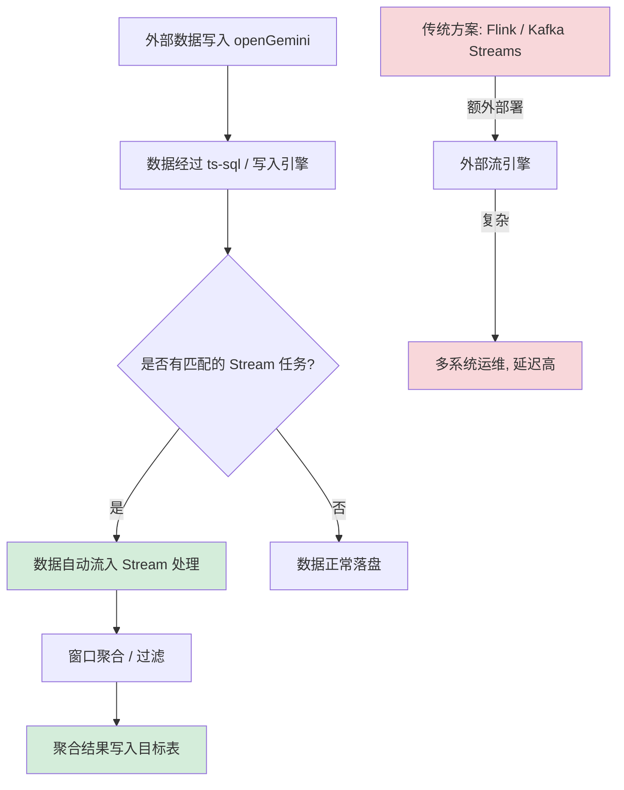

**通俗解释**：
- Stream Processing 是 openGemini 内置的流式计算引擎，**不需要外部组件**（如 Flink、Kafka Streams）
- 用户通过 `CREATE STREAM` 语句定义一个流任务：从源表读取数据，按时间窗口聚合，将结果写入目标表
- 当前 Stream 聚合函数白名单只有 `min` / `max` / `sum` / `count`。`mean`、`avg` 等函数不会通过 `BuildConcurrencyFunc` / `BuildSingleThreadFunc` 的校验，不应作为 Stream 示例。
- 整个过程在数据库内部完成，避免外部流系统链路；实际延迟取决于窗口大小、`maxDelay`、flush 周期和并发参数。

**具体例子**：

```sql
-- 创建流任务：每 1 分钟从 cpu 表聚合数据到 cpu_agg 表
CREATE STREAM cpu_stream
INTO cpu_agg
ON SELECT sum(usage_user) AS sum_user, count(usage_user) AS cnt_user, max(usage_system) AS max_sys
FROM cpu
GROUP BY time(1m), host
```

这个 SQL 会：
1. 从 `cpu` 表读取数据
2. 按 `host` 标签分组，每 1 分钟窗口计算 `sum_user`、`cnt_user` 和 `max_sys`
3. 将聚合结果写入 `cpu_agg` 表

**为什么需要内置 Stream？**

| 维度 | 外部流引擎 (Flink) | openGemini 内置 Stream |
|------|-------------------|----------------------|
| 部署复杂度 | 需要单独集群 | 零部署，数据库内置 |
| 数据延迟 | 毫秒~秒级 | 低延迟，但受窗口、flush 周期和调度参数影响 |
| 运维成本 | 高（多系统） | 低（单一系统） |
| 适用场景 | 复杂 ETL、多源聚合 | 简单窗口聚合、降采样 |

---

## 2. 整体架构：两层设计

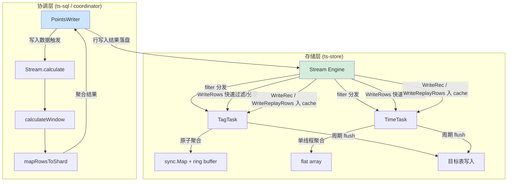

**通俗解释**：
- **协调层**（`coordinator/stream.go`）：在行模式写入时触发，负责窗口计算、分组聚合和目标 shard 映射，聚合结果回到 `PointsWriter` 写入链路。
- **存储层异步 Stream 服务**（`app/ts-store/stream/`）：运行独立 Stream Engine，周期同步任务，按任务类型分发到 TagTask 或 TimeTask，执行窗口聚合、WAL 回放和周期性 flush。
- 两条链路不是同一个入口：协调层 `Stream.calculate()` 直接在写入协调流程中生成目标行；存储层 `WriteRows()` 走快速过滤/任务分发，`WriteRec()` 和 `WriteReplayRows()` 才会把 `CacheRecord` / `ReplayRow` 放入 Engine 级 `s.cache`。

**协调侧链路：`coordinator/stream.go` 写入协调聚合**

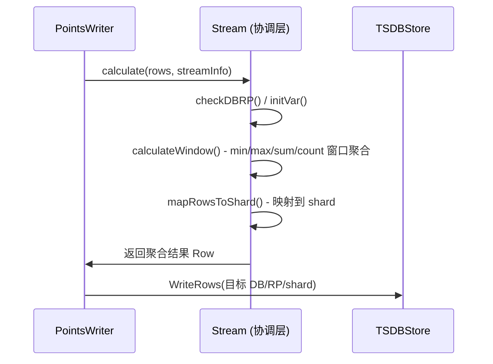

**存储侧链路：`app/ts-store/stream` 异步 Stream 服务**

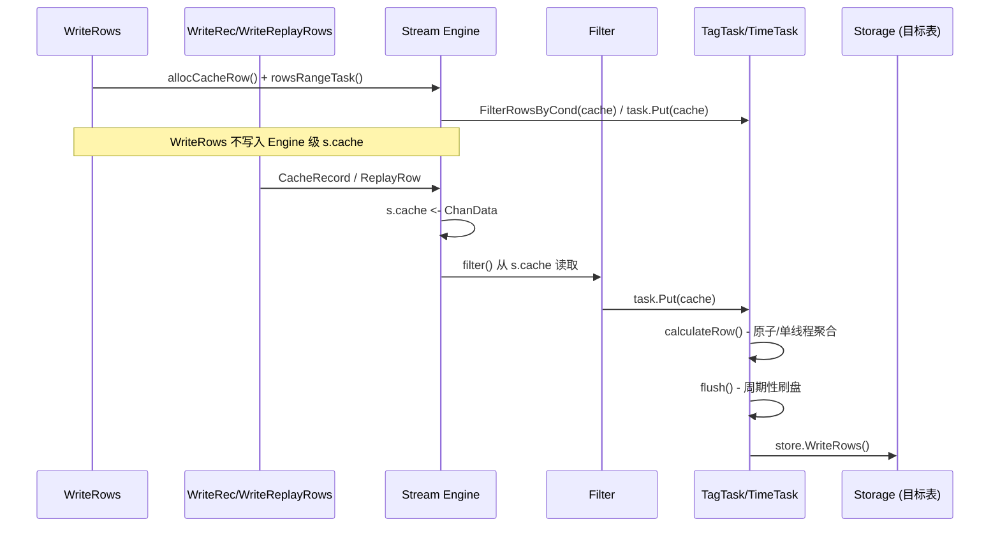

**核心代码**：`coordinator/stream.go:70-87`

```go
// 第 70 行：Stream — 协调层的流处理引擎
type Stream struct {
    TSDBStore TSDBStore              // 底层存储接口，用于写入聚合结果
    MetaClient PWMetaClient          // 元数据客户端
    logger     *logger.Logger        // 日志
    timeout    time.Duration         // 超时
    tasks      map[string]*streamTask // 任务名 -> 任务映射
}

// 第 79 行：NewStream — 创建协调层 Stream 实例
func NewStream(tsdbStore TSDBStore, metaClient PWMetaClient, logger *logger.Logger, timeout time.Duration) *Stream {
    return &Stream{
        TSDBStore:  tsdbStore,
        MetaClient: metaClient,
        logger:     logger,
        timeout:    timeout,
        tasks:      map[string]*streamTask{},
    }
}
```

**逐行解释**：
- **第 71 行**：`TSDBStore` 是写入聚合结果的存储接口
- **第 76 行**：`tasks` 是一个 map，key 是 Stream 任务名，value 是对应的 `streamTask` 结构体
- **第 79-87 行**：构造函数，初始化所有依赖

**核心代码**：`app/ts-store/stream/stream.go:123-144`

```go
// 第 123 行：Stream — 存储层的流处理引擎
type Stream struct {
    cache           chan ChanData          // Record/replay 路径输入 channel；WriteRows 行模式快速路径直接分发到 task
    rowPool         *CacheRowPool         // CacheRow 对象池
    bp              *strings2.BuilderPool  // 字符串 Builder 池
    windowCachePool *TaskCachePool        // 窗口缓存池
    goPool          *ants.Pool            // 协程池

    tasks   sync.Map     // streamID -> Task 映射（并发安全）
    taskNum int32        // 当前任务数量
    stats   *statistics.StreamStatistics  // 统计信息
    abort   chan struct{} // 关闭信号

    Logger       Logger
    cli          MetaClient
    store        Storage
    conf         stream.Config
    dataPath     string
    walPath      string
    ptNumPerNode uint32
    initTask     bool
}
```

**逐行解释**：
- **第 124 行**：`cache` 是一个带缓冲的 channel，所有需要处理的数据（CacheRow、CacheRecord、ReplayRow）都进入此 channel
- **第 131 行**：`tasks` 使用 `sync.Map` 而非普通 map，因为多个 goroutine 会并发读写（filter goroutine 读取，updateTask 写入）
- **第 132 行**：`taskNum` 用于快速判断是否有活跃任务，避免遍历 sync.Map

---

## 3. FieldCall 抽象：聚合函数的统一接口

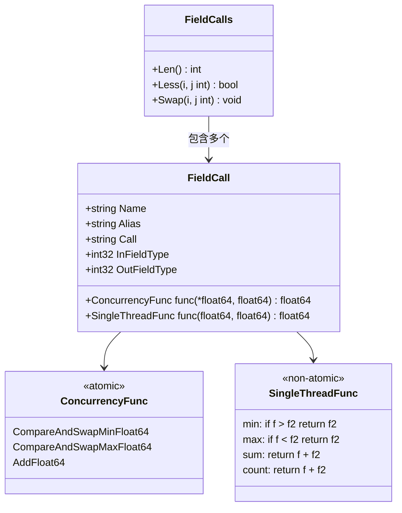

**通俗解释**：
- `FieldCall` 是流处理中聚合函数的抽象，封装了两种执行模式：
  - **ConcurrencyFunc**：原子操作，用于 TagTask（多 goroutine 并发写入同一窗口）
  - **SingleThreadFunc**：普通函数，用于 TimeTask（单 goroutine 顺序写入）和协调层
- 同一个聚合操作（如 min）在两种模式下的实现不同：
  - 原子模式：`CompareAndSwapMinFloat64`（CAS 循环）
  - 单线程模式：直接比较返回较小值

**核心代码**：`lib/stream/stream.go:37-45`

```go
// 第 37 行：FieldCall — 聚合函数抽象
type FieldCall struct {
    Name             string                                      // 源字段名
    Alias            string                                      // 输出字段别名
    Call             string                                      // 聚合函数名：min/max/sum/count
    InFieldType      int32                                       // 输入字段类型
    OutFieldType     int32                                       // 输出字段类型
    ConcurrencyFunc  func(*float64, float64) float64            // 原子聚合函数
    SingleThreadFunc func(float64, float64) float64             // 单线程聚合函数
}
```

**逐行解释**：
- **第 43 行**：`ConcurrencyFunc` 接收 `*float64` 指针，因为原子操作需要修改原始内存地址
- **第 44 行**：`SingleThreadFunc` 接收值类型，因为单线程场景无需原子操作

**核心代码**：`lib/stream/stream.go:69-83`

```go
// 第 69 行：BuildConcurrencyFunc — 构建原子聚合函数映射
func BuildConcurrencyFunc(fieldCall *FieldCall) error {
    switch fieldCall.Call {
    case "min":
        fieldCall.ConcurrencyFunc = atomic2.CompareAndSwapMinFloat64   // CAS 循环取最小值
    case "max":
        fieldCall.ConcurrencyFunc = atomic2.CompareAndSwapMaxFloat64   // CAS 循环取最大值
    case "sum":
        fieldCall.ConcurrencyFunc = atomic2.AddFloat64                 // CAS 循环累加
    case "count":
        fieldCall.ConcurrencyFunc = atomic2.AddFloat64                 // 同 sum，但值固定为 1
    default:
        return fmt.Errorf("not support stream func %v", fieldCall.Call)
    }
    return nil
}
```

**逐行解释**：
- **第 72 行**：`min` 映射到 `CompareAndSwapMinFloat64`，该函数使用 CAS 循环原子地更新最小值
- **第 76 行**：`sum` 和 `count` 都映射到 `AddFloat64`，区别在于 count 操作的输入值固定为 1

**核心代码**：`lib/atomic/float64.go:23-33`

```go
// 第 23 行：AddFloat64 — 原子浮点数累加
func AddFloat64(a *float64, b float64) float64 {
    p := (*uint64)(unsafe.Pointer(a))       // 将 float64 指针转为 uint64 指针
    for {
        v := atomic.LoadUint64(p)            // 原子读取当前值
        u := math.Float64frombits(v)         // 将 uint64 位模式转回 float64
        r := u + b                           // 计算新值
        if atomic.CompareAndSwapUint64(p, v, math.Float64bits(r)) {  // CAS 更新
            return r                         // 成功则返回
        }
        // CAS 失败，重试（其他 goroutine 修改了值）
    }
}
```

**逐行解释**：
- Go 的 `sync/atomic` 不直接支持 float64，所以通过 `unsafe.Pointer` 将 float64 转为 uint64 进行原子操作
- CAS 循环：读取当前值 -> 计算新值 -> 尝试原子更新，失败则重试
- 这种模式保证了多 goroutine 并发写入同一内存地址的正确性

**核心代码**：`lib/atomic/float64.go:56-68`

```go
// 第 56 行：CompareAndSwapMinFloat64 — 原子地更新最小值
func CompareAndSwapMinFloat64(a *float64, b float64) float64 {
    p := (*uint64)(unsafe.Pointer(a))
    for {
        v := atomic.LoadUint64(p)            // 读取当前值
        u := math.Float64frombits(v)         // 转为 float64
        if math.Min(u, b) == u {             // 如果当前值已经是最小，无需更新
            return u
        }
        if atomic.CompareAndSwapUint64(p, v, math.Float64bits(b)) {  // 否则尝试 CAS 更新
            return b                         // 更新成功
        }
        // CAS 失败，重试
    }
}
```

**具体例子**：
假设有 3 个 goroutine 同时向同一个窗口的 min 聚合写入值：
- Goroutine A: 值 = 10.0
- Goroutine B: 值 = 5.0
- Goroutine C: 值 = 8.0

初始值 = `math.MaxFloat64`（1.7976931348623157e+308）

执行过程：
1. A 读到 MaxFloat64，CAS 更新为 10.0，成功
2. B 读到 10.0，CAS 更新为 5.0，成功
3. C 读到 5.0，5.0 < 8.0，无需更新，返回 5.0

最终结果：5.0

---

## 4. 协调层 Stream 计算

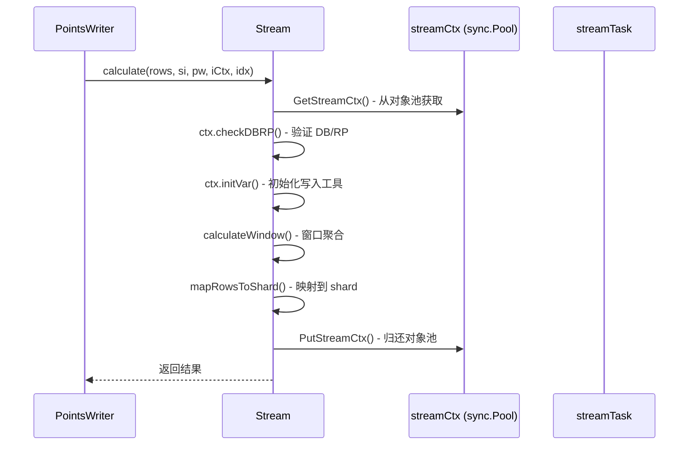

**通俗解释**：
- 协调层的 `calculate()` 是流处理的入口，在每次数据写入时被调用
- 它使用 `sync.Pool` 管理 `streamCtx` 对象，避免频繁内存分配
- `calculateWindow()` 按窗口聚合数据，`mapRowsToShard()` 将聚合结果映射到目标 shard

**核心代码**：`coordinator/stream.go:183-214`

```go
// 第 183 行：calculate — 协调层流处理入口
func (s *Stream) calculate(
    rows []*influx.Row, si *meta2.StreamInfo, pw *PointsWriter, iCtx *injestionCtx, idx int,
) error {
    ctx := GetStreamCtx()           // 从 sync.Pool 获取上下文
    defer PutStreamCtx(ctx)         // 函数结束时归还

    task, ok := s.tasks[si.Name]    // 获取对应的任务
    if !ok {
        return fmt.Errorf("%s have no task", si.Name)
    }

    err := ctx.checkDBRP(si.DesMst.Database, si.DesMst.RetentionPolicy, s)  // 验证目标 DB/RP
    if err != nil {
        return err
    }

    err = ctx.initVar(pw, si)       // 初始化写入工具
    if err != nil {
        return err
    }

    err = s.calculateWindow(rows, si, task, ctx)   // 窗口聚合
    if err != nil {
        return err
    }

    err = s.mapRowsToShard(si, task, ctx, iCtx, idx)  // 映射到 shard
    if err != nil {
        return err
    }
    return nil
}
```

**逐行解释**：
- **第 186 行**：`GetStreamCtx()` 从 `sync.Pool` 获取一个 `streamCtx`，避免每次调用都分配新对象
- **第 187 行**：`defer PutStreamCtx(ctx)` 确保函数结束时归还对象
- **第 194 行**：`checkDBRP` 验证目标数据库和保留策略是否存在
- **第 204 行**：`calculateWindow` 执行窗口内聚合
- **第 209 行**：`mapRowsToShard` 将聚合结果映射到目标 shard

### 4.1 窗口聚合：calculateWindow

**核心代码**：`coordinator/stream.go:216-259`

```go
// 第 216 行：calculateWindow — 按窗口聚合数据
func (s *Stream) calculateWindow(rows []*influx.Row, si *meta2.StreamInfo, task *streamTask, ctx *streamCtx) error {
    for _, r := range rows {
        groupKey := s.GenerateGroupKey(ctx, si.Dims, r)   // 生成分组 key
        // 获取该时间对应的窗口结束时间，减 1 避免过期
        _, et := ctx.opt.Window(r.Timestamp)
        et = et - 1
        v, ok := ctx.dataCache[groupKey]                  // 按 groupKey 查找缓存
        if !ok {
            ctx.dataCache[groupKey] = make(map[int64][]*float64)
            v = ctx.dataCache[groupKey]
            ctx.dataCache[groupKey][et] = make([]*float64, len(task.calls))
        } else if _, ok := v[et]; !ok {
            v[et] = make([]*float64, len(task.calls))
        }
        for i := range task.calls {
            id, ok := r.ColumnToIndex[task.calls[i].Name]  // 查找字段索引
            if !ok {
                continue                                    // 字段不存在，跳过
            }
            fv := r.Fields[id-r.Tags.Len()]
            if fv.Type == influx.Field_Type_String {
                return fmt.Errorf("the %s string type is not supported for stream task %s", fv.Key, si.Name)
            }
            curVal := fv.NumValue
            if task.calls[i].Call == "count" {
                curVal = 1                                   // count 操作值固定为 1
            }
            if v[et][i] == nil {
                var t float64
                if task.calls[i].Call == "min" {
                    t = math.MaxFloat64                      // min 初始值为最大浮点数
                } else if task.calls[i].Call == "max" {
                    t = -math.MaxFloat64                     // max 初始值为最小浮点数
                }
                v[et][i] = &t
            }
            *v[et][i] = task.calls[i].SingleThreadFunc(*v[et][i], curVal)  // 单线程聚合
        }
    }
    return nil
}
```

**逐行解释**：
- **第 219 行**：`GenerateGroupKey` 生成分组 key，格式如 `"host1|region1"`
- **第 222 行**：`ctx.opt.Window(r.Timestamp)` 计算该时间戳所属的窗口，返回窗口的开始和结束时间
- **第 223 行**：`et = et - 1` 减 1 是为了避免边界时间被下一个窗口"抢走"
- **第 224-231 行**：按 groupKey + 窗口结束时间查找或创建聚合数组 `[]*float64`
- **第 255 行**：使用 `SingleThreadFunc` 执行聚合（协调层是单线程的，不需要原子操作）

### 4.2 分组 Key 生成：GenerateGroupKey

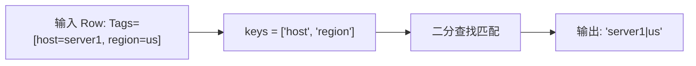

**核心代码**：`coordinator/stream.go:442-469`

```go
// 第 442 行：GenerateGroupKey — 生成分组 key
func (s *Stream) GenerateGroupKey(ctx *streamCtx, keys []string, value *influx.Row) string {
    if len(keys) == 0 {
        return ""                                       // 无分组维度，返回空字符串
    }
    builder := ctx.bp.Get()                             // 从 BuilderPool 获取 Builder
    defer func() {
        builder.Reset()
        ctx.bp.Put(builder)                             // 用完归还
    }()

    tagIndex := 0
    for i := range keys {
        // 二分查找：从 tagIndex 开始搜索 keys[i] 对应的 Tag
        idx := util.Search(tagIndex, len(value.Tags), func(j int) bool { return value.Tags[j].Key >= keys[i] })
        if idx < len(value.Tags) && value.Tags[idx].Key == keys[i] {
            builder.AppendString(value.Tags[idx].Value)  // 找到，追加 tag 值
            if i < len(keys)-1 {
                builder.AppendByte(config.StreamGroupValueSeparator)  // 追加分隔符
            }
            tagIndex = idx + 1                            // 下次从下一个位置开始搜索
            continue
        }
        if i < len(keys)-1 {
            builder.AppendByte(config.StreamGroupValueSeparator)  // 未找到，追加空分隔符
        }
        tagIndex = idx + 1
    }
    return builder.NewString()
}
```

**逐行解释**：
- **第 454 行**：`util.Search` 是二分查找，利用了 Tags 已按 key 排序的特性
- **第 456 行**：`builder.AppendString` 追加 tag 值
- **第 458 行**：`config.StreamGroupValueSeparator` 是分隔符（`|`）
- **第 462 行**：`tagIndex = idx + 1` 确保下次搜索从当前匹配位置之后开始，保持 O(n) 复杂度

**具体例子**：
假设 Row 的 Tags = `[host=server1, region=us, zone=a]`，keys = `["host", "zone"]`

执行过程：
1. i=0, keys[0]="host", 二分查找找到 index=0, 追加 "server1|"
2. i=1, keys[1]="zone", 从 index=1 开始查找, 找到 index=2, 追加 "a"

结果：`"server1|a"`

### 4.3 聚合结果映射：mapRowsToShard

**核心代码**：`coordinator/stream.go:261-358`

```go
// 第 261 行：mapRowsToShard — 将聚合结果映射到目标 shard
func (s *Stream) mapRowsToShard(
    si *meta2.StreamInfo, task *streamTask, ctx *streamCtx, iCtx *injestionCtx, idx int,
) error {
    wRows := iCtx.getPRowsPool()

    size := 0
    dimLen := len(task.tagDimKeys) + len(task.fieldIndexKeys)
    callLen := len(task.calls)
    srcStreamDstShardIdMap := iCtx.getSrcStreamDstShardIdMap()
    mstName := iCtx.streamMSTs[idx].Name
    // ... 省略部分代码 ...

    for k, tv := range ctx.dataCache {                   // 遍历所有分组
        var groupValue []string
        if len(k) != 0 {
            groupValue = strings.Split(k, config.StreamGroupValueStrSeparator)  // 解析分组值
        }
        if len(groupValue) != dimLen {
            s.logger.Error("group value is missing for stream task", ...)
            continue
        }
        for t, v := range tv {                           // 遍历每个时间窗口
            size++
            if len(*wRows) < size {
                *wRows = append(*wRows, &influx.Row{})
            }
            r := (*wRows)[size-1]
            r.Reset()

            // 更新聚合字段
            r.Fields = r.Fields[:len(task.calls)]
            var fieldCount int
            for i := range task.calls {
                if v[i] == nil {
                    continue
                }
                r.Fields[i].Key = task.calls[i].Alias      // 设置字段名（别名）
                r.Fields[i].NumValue = *v[i]               // 设置聚合值
                r.Fields[i].Type = task.calls[i].OutFieldType
                fieldCount++
            }
            // ... 设置 Tags, Timestamp, StreamId 等 ...
            r.Name = mstName
            r.Timestamp = t
            r.StreamOnly = true                            // 标记为流任务产生的数据

            // 更新 shard 信息
            err, sh, pErr := s.updateShardGroupAndShardKey(...)
            r.StreamId = append(r.StreamId, si.ID)
            iCtx.setShardRow(sh, r)                        // 将 Row 关联到目标 shard
        }
    }
    return nil
}
```

**逐行解释**：
- **第 276 行**：遍历 `dataCache`，key 是 groupKey，value 是 `map[int64][]*float64`（时间 -> 聚合值数组）
- **第 278-280 行**：解析 groupKey 得到各个维度的值
- **第 299-311 行**：将聚合值写入 Row 的 Fields
- **第 318 行**：`r.StreamOnly = true` 标记此数据来自流任务，防止循环触发

---

## 5. 存储层 Stream 引擎

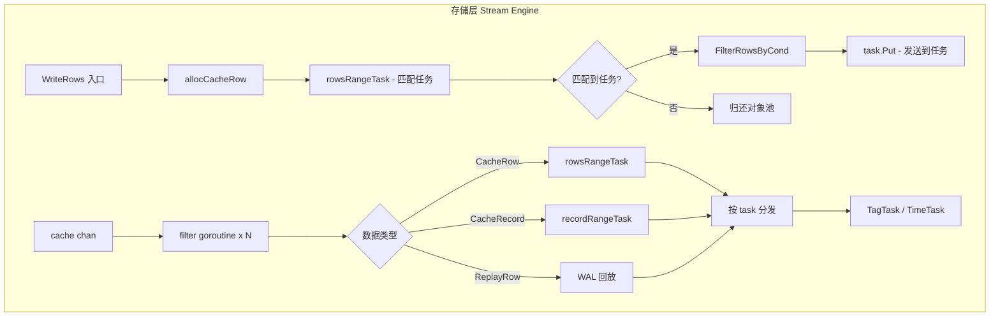

**通俗解释**：
- 存储层 Stream Engine 是一个独立的 goroutine 池，通过 `cache` channel 接收数据
- 数据类型有 4 种：`CacheRow`（行写入）、`CacheRecord`（Record 写入）、`ReplayRow`（WAL 回放）、`LastReplayRow`（回放结束标记）
- `filter()` 函数是主循环，从 channel 读取数据，按类型分发

**核心代码**：`app/ts-store/stream/stream.go:70-109`

```go
// 第 70 行：NewStream — 创建存储层 Stream 引擎
func NewStream(store Storage, Logger Logger, cli MetaClient, conf stream.Config, dataPath, walPath string, ptNumPerNode uint32) (Engine, error) {
    stream.SetWriteStreamPointsEnabled(conf.WriteEnabled)   // 设置全局写入开关
    cache := make(chan ChanData, conf.FilterCache)           // 创建带缓冲的 channel
    rowPool := NewCacheRowPool()                             // 创建对象池
    bp := strings2.NewBuilderPool()
    windowCachePool := NewTaskCachePool()
    goPool, err := ants.NewPool(conf.FilterConcurrency)      // 创建协程池
    if err != nil {
        return nil, err
    }
    s := &Stream{
        cache:           cache,
        abort:           make(chan struct{}),
        rowPool:         rowPool,
        bp:              bp,
        store:           store,
        stats:           statistics.NewStreamStatistics(),
        Logger:          Logger,
        windowCachePool: windowCachePool,
        goPool:          goPool,
        cli:             cli,
        conf:            conf,
        dataPath:        dataPath,
        walPath:         walPath,
        ptNumPerNode:    ptNumPerNode,
    }
    for i := 0; i < conf.FilterConcurrency; i++ {           // 启动 N 个 filter goroutine
        go func() {
            for {
                select {
                case <-s.abort:
                    return
                default:
                    s.runFilter()
                }
            }
        }()
    }
    return s, nil
}
```

**逐行解释**：
- **第 71 行**：`SetWriteStreamPointsEnabled` 是一个全局开关，控制是否处理流任务
- **第 72 行**：`cache` channel 的大小由 `conf.FilterCache` 决定（默认 4 * CPU 数）
- **第 77 行**：`ants.NewPool` 创建协程池，大小由 `conf.FilterConcurrency` 决定
- **第 96-108 行**：启动 N 个 filter goroutine，每个都从 `cache` channel 读取并处理数据

### 5.1 数据类型体系

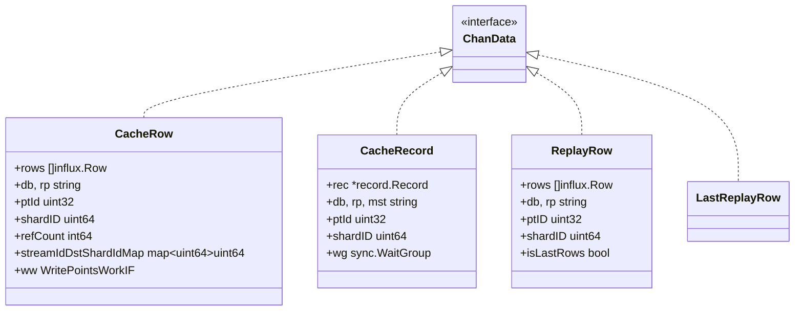

**通俗解释**：
- `ChanData` 是所有数据类型的接口，实际使用空接口（`interface{}`）
- `CacheRow`：行模式写入，来自 `WriteRows`，带有引用计数（`refCount`）用于多任务分发
- `CacheRecord`：列模式写入，来自 `WriteRec`，使用 `sync.WaitGroup` 等待处理完成
- `ReplayRow`：WAL 回放数据，来自 `detectReplay`
- `LastReplayRow`：标记回放结束，触发 replay 数据 flush

**核心代码**：`app/ts-store/stream/stream.go:578-675`

```go
// 第 588 行：filter — 主循环，从 channel 读取数据并分发
func (s *Stream) filter() {
    for {
        select {
        case c := <-s.cache:                          // 从 channel 读取数据
            switch r := c.(type) {
            case *CacheRow:                           // 行写入
                s.stats.AddStreamFilter(1)
                release := func() {                   // 释放函数：引用计数归零时回收
                    if atomic.AddInt64(&r.refCount, -1) == 0 {
                        r.ww.PutWritePointsWork()
                        s.rowPool.Put(r)
                        return
                    }
                }
                ref, indexes := s.rowsRangeTask(r)     // 匹配所有任务
                if !ref {
                    r.ww.PutWritePointsWork()
                    s.rowPool.Put(r)                   // 无任务匹配，直接回收
                    continue
                }
                // 为每个匹配的任务增加引用计数
                for _, vs := range indexes {
                    for j := 0; j < len(vs); j = j + 2 {
                        atomic.AddInt64(&r.refCount, 1)
                    }
                }
                // 分发到各个任务
                for i, vs := range indexes {
                    for j := 0; j < len(vs); j = j + 2 {
                        cache := s.windowCachePool.Get()
                        cache.ptId = r.ptId
                        cache.shardId = r.streamIdDstShardIdMap[i]
                        cache.rows = r.rows[vs[j]:vs[j+1]]   // 切片：只取匹配的行
                        cache.release = release
                        v, ok := s.tasks.Load(i)
                        if ok {
                            w, _ := v.(Task)
                            w.Put(cache)                       // 发送到任务
                        }
                    }
                }

            case *CacheRecord:                        // Record 写入
                ref, indexes := s.recordRangeTask(r)
                if !ref {
                    continue
                }
                r.RetainNum(len(indexes))
                for i := range indexes {
                    v, ok := s.tasks.Load(i)
                    if ok {
                        w, _ := v.(Task)
                        w.Put(r)                              // 发送到任务
                    }
                }

            case *ReplayRow:                          // WAL 回放
                _, indexes := s.rowsRangeTask(r)
                if r.isLastRows {                     // 最后一批回放数据
                    for i := range indexes {
                        newRows := &LastReplayRow{}   // 发送回放结束标记
                        v, ok := s.tasks.Load(i)
                        if ok {
                            w, _ := v.(Task)
                            w.Put(newRows)
                        }
                    }
                    continue
                }
                // 正常回放数据，按任务切片分发
                for i, vs := range indexes {
                    for j := 0; j+1 < len(vs); j = j + 2 {
                        newRows := &ReplayRow{}
                        newRows.ptID = r.ptID
                        newRows.shardID = r.shardID
                        newRows.rows = r.rows[vs[j]:vs[j+1]]
                        v, ok := s.tasks.Load(i)
                        if ok {
                            w, _ := v.(Task)
                            w.Put(newRows)
                        }
                    }
                }
            default:
                continue
            }
        case <-s.abort:
            return
        }
    }
}
```

**逐行解释**：
- **第 593-600 行**：`release` 函数是一个闭包，通过引用计数管理 `CacheRow` 的生命周期
- **第 601 行**：`rowsRangeTask` 返回每个任务匹配的行范围（start, end 对）
- **第 608-612 行**：为每个匹配的任务段增加引用计数
- **第 615-626 行**：将匹配的行切片分发到对应任务
- **第 628-639 行**：`CacheRecord` 使用 `WaitGroup` 等待所有任务处理完成
- **第 641-667 行**：`ReplayRow` 的处理，最后一批数据发送 `LastReplayRow` 标记

### 5.2 WriteRows 快速路径

**核心代码**：`app/ts-store/stream/stream.go:767-823`

```go
// 第 767 行：WriteRows — 写入路径的快速入口
func (s *Stream) WriteRows(writeCtx *WriteStreamRowsCtx) (bool, error) {
    r := s.allocCacheRow(writeCtx)                     // 分配 CacheRow

    s.stats.AddStreamIn(1)
    s.stats.AddStreamInNum(int64(len(r.rows)))
    ref, indexes := s.rowsRangeTask(r)                 // 匹配任务
    if !ref {
        s.rowPool.Put(r)                               // 无任务匹配，直接回收
        return false, nil
    }
    // 为每个匹配的任务增加引用计数
    for _, vs := range indexes {
        for j := 0; j < len(vs); j = j + 2 {
            atomic.AddInt64(&r.refCount, 1)
            r.ww.Ref()                                 // 同时增加 WritePointsWork 的引用
        }
    }

    release := func() {                                // 释放函数
        wwRef := r.ww.UnRef()
        if wwRef == 0 {
            r.ww.PutWritePointsWork()
        }
        cur := atomic.AddInt64(&r.refCount, -1)
        if cur == 0 {
            s.rowPool.Put(r)                           // 引用计数归零，回收
        }
    }

    var inUse bool
    for i, vs := range indexes {
        for j := 0; j < len(vs); j = j + 2 {
            cache := s.windowCachePool.Get()
            cache.ptId = r.ptId
            cache.shardId = r.streamIdDstShardIdMap[i]
            cache.rows = r.rows[vs[j]:vs[j+1]]
            cache.release = release
            cache.streamRows = writeCtx.StreamRows      // 用于 filter-only 模式直接写入

            v, ok := s.tasks.Load(i)
            if !ok {
                s.windowCachePool.Put(cache)             // 任务不存在，回收缓存
                continue
            }
            w, _ := v.(Task)
            needAgg, err := w.FilterRowsByCond(cache)   // 条件过滤 + 决定是否需要聚合
            if err != nil {
                return needAgg, err
            }
            inUse = inUse || needAgg
        }
    }
    return inUse, nil
}
```

**逐行解释**：
- **第 769 行**：`allocCacheRow` 从对象池分配 `CacheRow`，避免频繁内存分配
- **第 773 行**：`rowsRangeTask` 是关键的匹配函数，返回每个任务匹配的行范围
- **第 782-785 行**：`r.ww.Ref()` 增加 `WritePointsWork` 的引用，确保写入路径不会过早释放
- **第 815 行**：`FilterRowsByCond` 是关键入口，决定数据是直接写入还是进入聚合窗口
- **第 822 行**：返回 `inUse` 告诉调用方是否需要聚合（用于决定是否等待 flush）

**关键区别**：`WriteRows()` 是行模式快速路径，它在函数内部完成 `rowsRangeTask()` 和 `FilterRowsByCond()`，再通过 `task.Put(cache)` 把匹配数据交给具体任务；它不会执行 `s.cache <- CacheRow`。Engine 级 `s.cache` 主要接收 `WriteRec()` 产生的 `CacheRecord` 和 `WriteReplayRows()` 产生的 `ReplayRow`。

---

## 6. TagTask：带 GROUP BY 的原子聚合

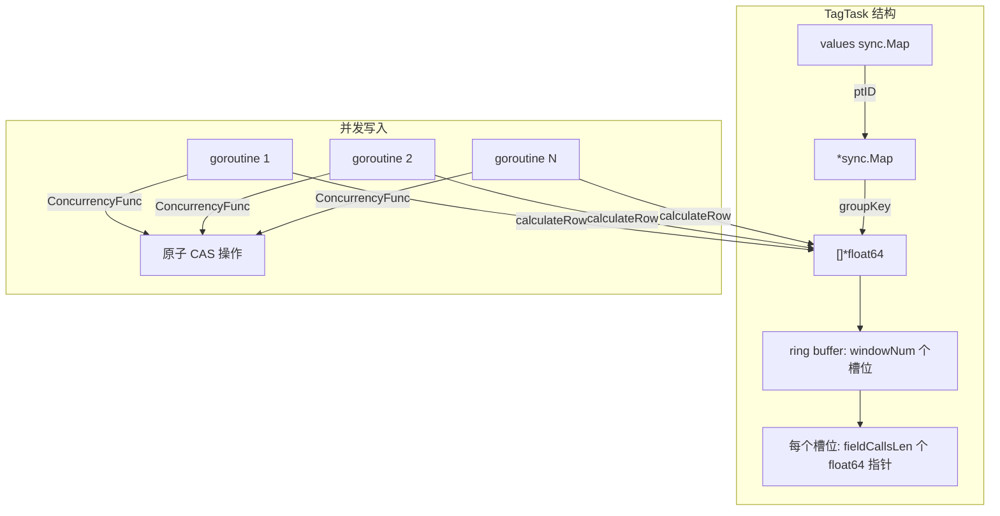

**通俗解释**：
- TagTask 用于有 GROUP BY 的场景，多个 goroutine 可能同时写入同一个窗口
- 数据结构是三层嵌套：`sync.Map[ptID] -> sync.Map[groupKey] -> []*float64`
- `[]*float64` 是一个环形缓冲区，大小 = `fieldCallsLen * windowNum`
- 每个槽位通过原子操作（ConcurrencyFunc）更新，无需加锁

**核心代码**：`app/ts-store/stream/tag_task.go:56-93`

```go
// 第 56 行：TagTask — 带 GROUP BY 的流任务
type TagTask struct {
    stringDict *stringinterner.StringDict  // 字符串字典，用于压缩 groupKey
    values sync.Map                         // ptID -> *sync.Map -> groupKey -> []*float64
    lock   sync.Mutex                       // 保护 values 的初始化
    shardIds map[uint32][]*uint64           // ptID -> windowID -> shardID

    groupKeys []string                      // GROUP BY 的维度字段名
    nodePts []uint32                        // 当前节点的所有 ptID

    innerCache     chan ChanData            // 内部计算 channel
    innerRes       chan error               // 计算结果 channel
    cleanPreWindow chan struct{}            // 清理旧窗口通知

    bp              *strings2.BuilderPool   // 字符串 Builder 池
    windowCachePool *TaskCachePool          // 窗口缓存池
    *TaskDataPool                           // 数据池

    concurrency int                         // 并发度
    goPool *ants.Pool                       // 协程池

    replayValues    sync.Map                // WAL 回放数据
    replayWindowNum int64                   // 回放窗口数
    replayShardIds  map[uint32][]*uint64    // 回放 shard 映射
    replayOver      bool                    // 回放是否结束
    replayCount     int32                   // 回放计数器

    ptLoadStatus map[uint32]*flushStatus    // ptID -> 最后 flush 时间
    *BaseTask
}
```

**逐行解释**：
- **第 59 行**：`values` 是外层 `sync.Map`，key 是 `ptID`（数据分区 ID），value 是内层 `sync.Map`
- **第 66 行**：`groupKeys` 是 GROUP BY 的维度，如 `["host", "region"]`
- **第 68-69 行**：`innerCache` 和 `innerRes` 用于并行计算的通道
- **第 84-88 行**：WAL 回放相关的状态

### 6.1 并行计算：parallelCalculate

**核心代码**：`app/ts-store/stream/tag_task.go:316-376`

```go
// 第 316 行：parallelCalculate — 并行计算 goroutine
func (s *TagTask) parallelCalculate() {
    for i := 0; i < s.concurrency; i++ {               // 启动 concurrency 个 goroutine
        go func() {
            for {
                select {
                case cache := <-s.innerCache:            // 从 innerCache 读取数据
                    switch v := cache.(type) {
                    case *TaskCache:
                        err := s.calculateRow(v)         // 行模式计算
                        s.innerRes <- err
                    case *CacheRecord:
                        err := s.calculateRec(v)         // Record 模式计算
                        s.innerRes <- err
                    case *ReplayRow:
                        atomic.AddInt32(&s.replayCount, 1)
                        s.resetReplayVar()               // 重置回放变量
                        err := s.replayWalRow(v)         // WAL 回放计算
                        atomic.AddInt32(&s.replayCount, -1)
                        s.innerRes <- err
                    case *LastReplayRow:                 // 回放结束标记
                        for {
                            if atomic.LoadInt32(&s.replayCount) == 0 {
                                go func() {
                                    s.replayOver = true  // 标记回放结束
                                }()
                                break
                            }
                            time.Sleep(1 * time.Second)  // 等待所有回放完成
                        }
                    default:
                        s.Logger.Error(fmt.Sprintf("not support type %T", cache))
                    }
                case <-s.abort:
                    return
                }
            }
        }()
    }
}
```

**逐行解释**：
- **第 318 行**：启动 `concurrency` 个 goroutine，从 `innerCache` channel 读取数据
- **第 324 行**：`calculateRow` 是行模式的原子聚合
- **第 333 行**：`replayWalRow` 处理 WAL 回放数据
- **第 344-356 行**：`LastReplayRow` 触发回放结束，等待所有回放计数归零

### 6.2 核心聚合：calculateRow

**核心代码**：`app/ts-store/stream/tag_task.go:698-769`

```go
// 第 698 行：calculateRow — 行模式的原子聚合
func (s *TagTask) calculateRow(cache *TaskCache) error {
    if cache == nil {
        return ErrEmptyCache
    }
    defer func() {
        cache.release()                                  // 释放 CacheRow 引用
        cache.rows = nil
        s.windowCachePool.Put(cache)                     // 归还缓存
    }()
    rows := cache.rows
    s.stats.AddWindowIn(int64(len(rows)))
    s.stats.StatWindowStartTime(s.startTimeStamp)
    s.stats.StatWindowEndTime(s.endTimeStamp)

    values := s.getValue(cache.ptId)                     // 获取该 ptID 的 sync.Map
    if !s.ptIDExist(cache.ptId) {
        return fmt.Errorf("ptId not found,calculateRow")
    }
    for i := range rows {
        row := rows[i]
        // 时间范围检查
        if row.Timestamp < s.startTimeStamp || row.Timestamp >= s.maxTimeStamp {
            if row.Timestamp >= s.endTimeStamp {
                atomic2.CompareAndSwapMaxInt64(&s.stats.WindowOutMaxTime, row.Timestamp)
            } else {
                atomic2.CompareAndSwapMinInt64(&s.stats.WindowOutMinTime, row.Timestamp)
            }
            s.stats.AddWindowSkip(1)
            continue
        }
        key := s.generateGroupKeyUint(s.groupKeys, &row) // 生成 groupKey（压缩格式）
        vv, exist := values.Load(key)                    // 查找该 groupKey 的聚合数组
        var vs []*float64
        if !exist {
            vs = make([]*float64, s.fieldCallsLen*int(s.windowNum))  // 创建新的聚合数组
            values.Store(key, vs)
            s.stats.AddWindowGroupKeyCount(1)
        } else {
            vs, _ = vv.([]*float64)
        }
        // 计算窗口 ID
        windowId := int(((row.Timestamp-s.start.UnixNano())/s.window.Nanoseconds() + atomic.LoadInt64(&s.startWindowID)) % s.windowNum)
        for c := range s.fieldCalls {
            var curVal float64
            if s.fieldCalls[c].Call == "count" && !row.StreamOnly {
                curVal = 1                               // count 操作，值固定为 1
            } else {
                for f := range row.Fields {
                    if row.Fields[f].Key == s.fieldCalls[c].Name || row.Fields[f].Key == s.fieldCalls[c].Alias {
                        curVal = row.Fields[f].NumValue  // 读取字段值
                        break
                    }
                }
            }
            id := s.fieldCallsLen*windowId + c           // 计算在数组中的索引
            if vs[id] == nil {
                var t float64
                if s.fieldCalls[c].Call == "min" {
                    t = math.MaxFloat64                  // min 初始值
                } else if s.fieldCalls[c].Call == "max" {
                    t = -math.MaxFloat64                 // max 初始值
                }
                atomic2.SetAndSwapPointerFloat64(&vs[id], &t)  // 原子设置指针
            }
            s.fieldCalls[c].ConcurrencyFunc(vs[id], curVal)   // 原子聚合
        }
        atomic.SwapUint64(s.shardIds[cache.ptId][windowId], cache.shardId)  // 更新 shardID
        s.stats.AddWindowProcess(1)
    }
    return nil
}
```

**逐行解释**：
- **第 713 行**：`getValue(cache.ptId)` 获取该 ptID 对应的 `sync.Map`
- **第 728 行**：`generateGroupKeyUint` 生成压缩格式的 groupKey（使用字符串字典）
- **第 738 行**：`windowId` 计算公式：`((timestamp - startTime) / windowSize + startWindowID) % windowNum`
- **第 752-761 行**：初始化聚合槽位，使用 `SetAndSwapPointerFloat64` 原子设置指针
- **第 763 行**：`ConcurrencyFunc(vs[id], curVal)` 执行原子聚合操作

**具体例子**：
假设一个 TagTask：
- `fieldCallsLen` = 2（min(temperature), max(humidity)）
- `windowNum` = 3（3 个窗口槽位）
- `startWindowID` = 0
- 窗口大小 = 1 分钟

聚合数组大小 = 2 * 3 = 6 个 float64 指针：
```
索引: [0]  [1]  [2]  [3]  [4]  [5]
含义: w0_min w0_max w1_min w1_max w2_min w2_max
```

假设有一行数据 timestamp 对应 windowId = 1，temperature = 25.0：
1. 计算 id = 2*1 + 0 = 2（w1_min）
2. 如果 `vs[2]` 为 nil，初始化为 `math.MaxFloat64`
3. 调用 `ConcurrencyFunc(vs[2], 25.0)`，原子地将 `vs[2]` 更新为 25.0

### 6.3 周期性 Flush：cycleFlush + flush

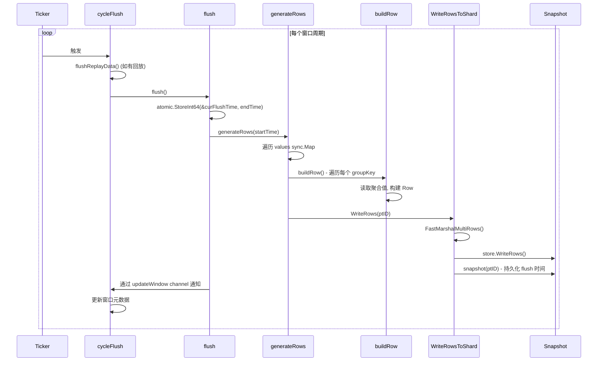

**核心代码**：`app/ts-store/stream/tag_task.go:272-312`

```go
// 第 272 行：cycleFlush — 周期性 flush goroutine
func (s *TagTask) cycleFlush() {
    var err error
    defer func() {
        if r := recover(); r != nil {
            err := errno.NewError(errno.RecoverPanic, r)
            s.Logger.Error(err.Error())
        }
        s.err = err
    }()
    reset := false
    now := time.Now()
    next := now.Truncate(s.window).Add(s.window).Add(s.maxDelay)  // 首次触发时间
    ticker := time.NewTicker(next.Sub(now))
    for {
        select {
        case <-ticker.C:
            if !reset {
                reset = true
                ticker.Reset(s.window)                             // 后续按窗口周期触发
                continue
            }
            if reset && s.replayOver {                             // 回放结束，先 flush 回放数据
                err := s.flushReplayData()
                if err != nil {
                    s.Logger.Error("stream flush replay data error", zap.Error(err))
                }
                s.cleanReplayData()
                s.replayOver = false
            }
            s.Logger.Info("stream replay data flush over")
            err = s.flush()                                        // flush 当前窗口数据
            if err != nil {
                s.Logger.Error("stream flush error", zap.Error(err))
            }
        case <-s.abort:
            return
        }
    }
}
```

**逐行解释**：
- **第 285 行**：首次触发时间 = 当前时间截断到窗口边界 + 窗口大小 + 最大延迟
- **第 290-293 行**：第一次触发是校准时间，不执行 flush，后续按窗口周期触发
- **第 294-301 行**：如果回放结束，先 flush 回放数据

**核心代码**：`app/ts-store/stream/tag_task.go:901-924`

```go
// 第 901 行：flush — 刷盘当前窗口数据
func (s *TagTask) flush() error {
    var err error
    s.Logger.Info("stream start flush", zap.Int64("endTime", s.endTimeStamp))
    t := time.Now()
    s.indexKeyPool = bufferpool.GetPoints()
    defer func() {
        bufferpool.Put(s.indexKeyPool)
        s.indexKeyPool = nil
        s.stats.StatWindowFlushCost(int64(time.Since(t)))
        s.stats.Push()
        select {
        case s.updateWindow <- struct{}{}:               // 通知 consumeDataAndUpdateMeta 更新窗口
            return
        case <-s.abort:
            return
        }
    }()

    atomic.StoreInt64(&s.curFlushTime, s.endTimeStamp)   // 更新当前 flush 时间

    s.generateRows(s.startTimeStamp)                     // 生成并写入所有分组的聚合结果
    s.Logger.Info("stream flush over", zap.Int64("flushTime", s.curFlushTime))
    return err
}
```

**逐行解释**：
- **第 919 行**：`atomic.StoreInt64(&s.curFlushTime, s.endTimeStamp)` 原子更新 flush 时间，供 WAL 回放使用
- **第 921 行**：`generateRows` 遍历所有分组，构建 Row 并写入目标 shard
- **第 911 行**：`s.updateWindow <- struct{}{}` 通知 `consumeDataAndUpdateMeta` 更新窗口元数据

### 6.4 窗口元数据更新：consumeDataAndUpdateMeta

**核心代码**：`app/ts-store/stream/tag_task.go:424-481`

```go
// 第 424 行：consumeDataAndUpdateMeta — 消费数据并更新窗口元数据
func (s *TagTask) consumeDataAndUpdateMeta() {
    defer func() {
        if r := recover(); r != nil {
            err := errno.NewError(errno.RecoverPanic, r)
            s.Logger.Error(err.Error())
        }
    }()
    for {
        select {
        case _, open := <-s.updateWindow:                // 收到 flush 完成通知
            if !open {
                return
            }
            s.start = s.end                              // 滑动窗口
            s.end = s.end.Add(s.window)
            s.startTimeStamp = s.start.UnixNano()
            s.endTimeStamp = s.end.UnixNano()
            s.maxTimeStamp = s.startTimeStamp + s.maxDuration
            atomic2.SetModInt64AndADD(&s.startWindowID, 1, int64(s.windowNum))  // 环形指针前进
            s.stats.Reset()
            s.stats.StatWindowOutMinTime(s.startTimeStamp)
            s.stats.StatWindowOutMaxTime(s.maxTimeStamp)
            select {
            case s.cleanPreWindow <- struct{}{}:          // 通知 cleanWindow 清理旧数据
                continue
            case <-s.abort:
                return
            }
        case <-s.abort:
            return
        case cache := <-s.cache:                         // 从外部 cache 接收数据
            s.IncreaseChan()
            count := 0
            s.innerCache <- cache                        // 转发到 innerCache
            count++
            if count < s.concurrency {                   // 批量读取，最多 concurrency 个
                loop := true
                for loop {
                    select {
                    case c := <-s.cache:
                        s.IncreaseChan()
                        s.innerCache <- c
                        count++
                        if count >= s.concurrency {
                            loop = false
                        }
                    default:
                        loop = false
                    }
                }
            }
            for i := 0; i < count; i++ {                 // 等待所有计算完成
                <-s.innerRes
            }
        }
    }
}
```

**逐行解释**：
- **第 431-451 行**：收到 flush 完成通知后，滑动窗口：`start = end, end = end + window`
- **第 442 行**：`SetModInt64AndADD` 原子地将 `startWindowID` 前进 1（模 windowNum），实现环形缓冲区
- **第 454-478 行**：从外部 `cache` 接收数据，批量转发到 `innerCache`，等待所有计算完成

### 6.5 清理旧窗口：cleanWindow

**核心代码**：`app/ts-store/stream/tag_task.go:380-402`

```go
// 第 380 行：cleanWindow — 清理旧窗口的聚合数据
func (s *TagTask) cleanWindow() {
    for {
        select {
        case _, open := <-s.cleanPreWindow:              // 收到清理通知
            if !open {
                return
            }
            t := time.Now()
            offset := atomic2.LoadModInt64AndADD(&s.startWindowID, -1, int64(s.windowNum))  // 计算旧窗口 ID
            s.values.Range(func(key, value any) bool {   // 遍历所有 ptID
                v, ok := value.(*sync.Map)
                if !ok {
                    return false
                }
                v.Range(s.walkUpdate(offset))            // 遍历所有 groupKey，清理旧窗口槽位
                return true
            })
            s.stats.StatWindowUpdateCost(int64(time.Since(t)))
        case <-s.abort:
            return
        }
    }
}
```

**逐行解释**：
- **第 389 行**：`LoadModInt64AndADD` 计算旧窗口的 offset（`startWindowID - 1` 模 windowNum）
- **第 390-396 行**：遍历所有 ptID 和 groupKey，将旧窗口槽位的指针置为 nil

**核心代码**：`app/ts-store/stream/tag_task.go:483-493`

```go
// 第 483 行：walkUpdate — 遍历清理函数
func (s *TagTask) walkUpdate(offset int64) func(k, vv interface{}) bool {
    return func(k, vv interface{}) bool {
        v, _ := vv.([]*float64)
        vs := v[int(offset)*s.fieldCallsLen : int(offset)*s.fieldCallsLen+s.fieldCallsLen]
        for i := range vs {
            vs[i] = nil                                  // 将旧窗口的指针置为 nil
        }
        return true
    }
}
```

**逐行解释**：
- **第 487 行**：计算旧窗口在数组中的起始位置
- **第 488-490 行**：将该窗口的所有字段槽位置为 nil

---

## 7. TimeTask：无 GROUP BY 的单线程聚合

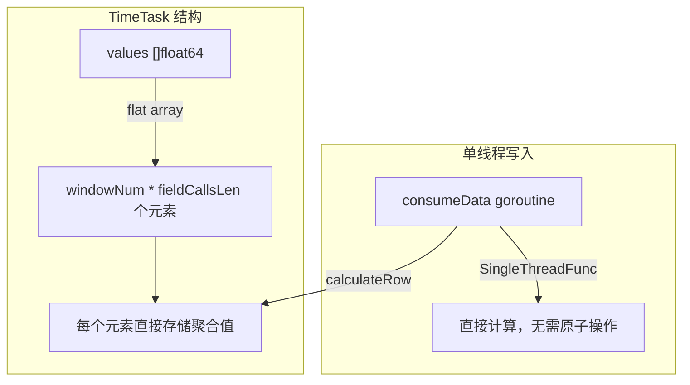

**通俗解释**：
- TimeTask 用于无 GROUP BY 的场景，只有一个 goroutine 写入
- 数据结构是扁平的 `[]float64` 数组，大小 = `windowNum * fieldCallsLen`
- 使用 `SingleThreadFunc` 直接计算，无需原子操作，性能更高

**核心代码**：`app/ts-store/stream/time_task.go:39-56`

```go
// 第 39 行：TimeTask — 无 GROUP BY 的流任务
type TimeTask struct {
    values      []float64        // 扁平数组，存储所有窗口的聚合值
    validValues []bool           // 标记哪些槽位有有效数据

    ptIds     []int32            // 窗口对应的 ptID
    shardIds  []int64            // 窗口对应的 shardID
    windowOffset []int           // 每个窗口在 values 中的偏移量

    windowCachePool *TaskCachePool
    *TaskDataPool

    row *influx.Row              // 复用的 Row 对象
    *BaseTask
}
```

**逐行解释**：
- **第 41 行**：`values` 是扁平数组，索引 = `windowId * fieldCallsLen + callIndex`
- **第 42 行**：`validValues` 标记哪些槽位有数据，flush 时只输出有数据的字段
- **第 45 行**：`windowOffset` 是预计算的偏移量，避免重复计算

### 7.1 核心聚合：calculateRow

**核心代码**：`app/ts-store/stream/time_task.go:704-735`

```go
// 第 704 行：calculateRow — 行模式的单线程聚合
func (s *TimeTask) calculateRow(cache *TaskCache) {
    var skip int
    var curVal float64
    for i := range cache.rows {
        row := &cache.rows[i]
        if s.skipRow(row) {                              // 时间范围检查
            skip++
            continue
        }
        windowId := s.windowId(row.Timestamp)            // 计算窗口 ID
        base := s.windowOffset[windowId]                 // 获取窗口在数组中的偏移
        for c, call := range s.fieldCalls {
            f := getFieldValue(row, call.Name, call.Alias)  // 查找字段索引
            if f < 0 {
                continue
            }
            if call.Call == "count" && !row.StreamOnly {
                curVal = 1                               // count 操作值固定为 1
            } else {
                curVal = row.Fields[f].NumValue
            }
            id := base + c                               // 计算在数组中的索引
            s.values[id] = call.SingleThreadFunc(s.values[id], curVal)  // 直接计算
            s.validValues[id] = true                     // 标记为有效
        }
        if s.shardIds[windowId] < 0 {
            s.shardIds[windowId] = int64(cache.shardId)  // 记录 shardID
            s.ptIds[windowId] = int32(cache.ptId)        // 记录 ptID
        }
    }
    s.stats.AddWindowProcess(int64(len(cache.rows) - skip))
}
```

**逐行解释**：
- **第 712 行**：`windowId` 计算公式与 TagTask 相同
- **第 713 行**：`base = s.windowOffset[windowId]` 是预计算的偏移量
- **第 726 行**：`s.values[id] = call.SingleThreadFunc(s.values[id], curVal)` 直接计算，无需原子操作
- **第 727 行**：`s.validValues[id] = true` 标记该槽位有数据

### 7.2 Filter-Only 模式

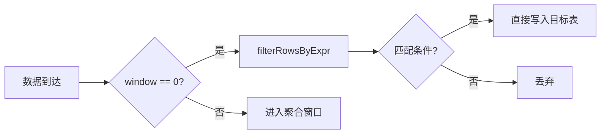

**通俗解释**：
- 当 `window == 0` 时，TimeTask 进入 filter-only 模式
- 不做聚合，只做条件过滤，满足条件的行直接写入目标表
- 适用于简单的数据转发场景（如 `SELECT * FROM cpu WHERE temperature > 50`）

**核心代码**：`app/ts-store/stream/time_task.go:274-341`

```go
// 第 274 行：calculateFilterOnly — filter-only 模式
func (s *TimeTask) calculateFilterOnly(data ChanData) error {
    if data == nil {
        return ErrEmptyCache
    }
    cache, ok := data.(*TaskCache)
    if !ok {
        return fmt.Errorf("not support type %T", cache)
    }

    defer func() {
        if len(s.indexKeyPool) > 0 {
            s.indexKeyPool = s.indexKeyPool[:0]
        }
        if len(s.rows) > 0 {
            s.rows = s.rows[:0]
        }
        if cache.release != nil {
            cache.release()
        }
        cache.rows = nil
        s.windowCachePool.Put(cache)
    }()

    s.rows = s.rows[:0]
    matchedIndexes := filterRowsByExpr(cache.rows, s.condition)  // 条件过滤
    if len(matchedIndexes) == 0 {
        return nil                                                // 无匹配，直接返回
    }

    for _, idx := range matchedIndexes {
        rrow := &cache.rows[idx]
        var row *influx.Row
        if cap(s.rows) == len(s.rows) {
            s.rows = append(s.rows, influx.Row{})
        } else {
            s.rows = s.rows[:len(s.rows)+1]
        }
        row = &s.rows[len(s.rows)-1]
        row.Clone(rrow)                                           // 克隆行
        row.Name = s.info.Name                                    // 设置目标表名
        s.indexKeyPool = row.UnmarshalIndexKeys(s.indexKeyPool)

        if s.isSelectAll {
            continue                                              // select * 模式，保留所有字段
        }

        fs := make(influx.Fields, 0, s.info.Schema.Len())
        for i := range row.Fields {
            field := &row.Fields[i]
            if _, ok = s.info.Schema.GetTyp(field.Key); ok {
                fs = append(fs, *field)                           // 只保留目标表有的字段
            }
        }
        if len(fs) == 0 {
            s.rows = s.rows[:len(s.rows)-1]                       // 无匹配字段，丢弃
            continue
        }
        row.Fields = fs
    }
    if len(s.rows) == 0 {
        return nil
    }

    return s.doWrite(cache.shardId, cache.ptId, s.des.Database, s.des.RetentionPolicy, s.rows)
}
```

**逐行解释**：
- **第 299 行**：`filterRowsByExpr` 使用条件表达式过滤行
- **第 305-316 行**：克隆匹配的行，设置目标表名
- **第 322-333 行**：如果不是 `select *`，只保留目标表有的字段
- **第 340 行**：`doWrite` 将结果写入目标 shard

### 7.3 条件评估：filterRowsByExpr

**核心代码**：`app/ts-store/stream/time_task.go:415-445`

```go
// 第 415 行：filterRowsByExpr — 递归评估条件表达式
func filterRowsByExpr(rows []influx.Row, expr influxql.Expr) []int {
    switch cond := expr.(type) {
    case *influxql.BinaryExpr:
        var resIndex []int
        varRef, op, value, ok := getVarRefOpValue(cond)   // 解析左值、操作符、右值
        if ok {
            for i := range rows {
                row := &rows[i]
                if isMatchCond(row, varRef, value, op) {  // 单条件匹配
                    resIndex = append(resIndex, i)
                }
            }
            return resIndex
        }

        lIndexes := filterRowsByExpr(rows, cond.LHS)      // 递归评估左子树
        rIndexes := filterRowsByExpr(rows, cond.RHS)      // 递归评估右子树
        switch cond.Op {
        case influxql.AND:
            return util.IntersectSortedSliceInt(lIndexes, rIndexes)  // AND：交集
        case influxql.OR:
            return util.UnionSortedSliceInt(lIndexes, rIndexes)      // OR：并集
        default:
            return []int{}
        }
    case *influxql.ParenExpr:
        return filterRowsByExpr(rows, cond.Expr)           // 括号表达式，递归处理
    default:
        return []int{}
    }
}
```

**逐行解释**：
- **第 419 行**：`getVarRefOpValue` 解析二元表达式为 `左值(VarRef)` + `操作符(Token)` + `右值(Expr)`
- **第 422-427 行**：如果是叶子节点（单条件），直接评估
- **第 430-431 行**：递归评估左右子树
- **第 433 行**：AND 操作取交集
- **第 435 行**：OR 操作取并集

**具体例子**：
条件：`temperature > 50 AND humidity < 80`

评估过程：
1. 解析为 BinaryExpr(AND)
2. 左子树：`temperature > 50`，匹配行 [0, 2, 5]
3. 右子树：`humidity < 80`，匹配行 [0, 1, 5, 7]
4. AND 取交集：[0, 5]

---

## 8. WAL 回放：崩溃恢复的关键

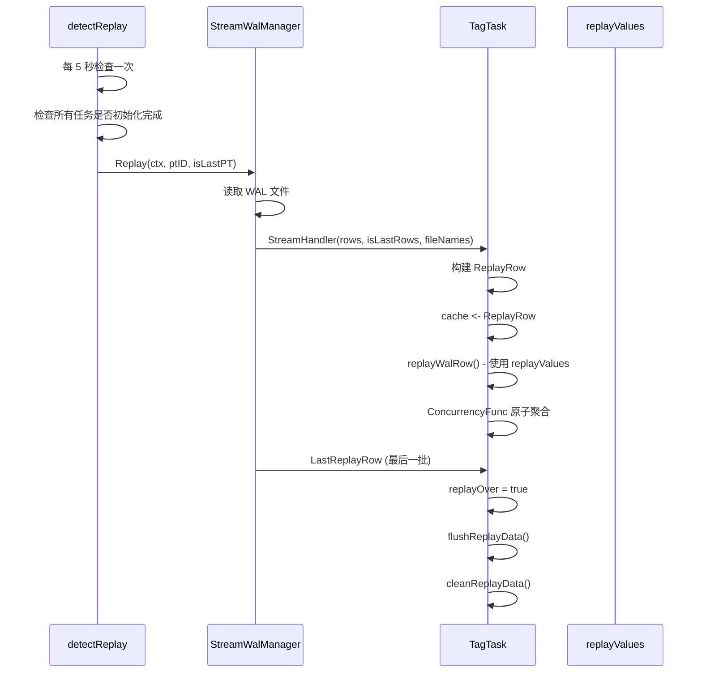

**通俗解释**：
- WAL 回放是崩溃恢复的关键机制
- 当 Stream 任务重启时，`detectReplay` 会检查每个 ptID 的最后 flush 时间
- 从 WAL 中读取 flush 时间之后、当前窗口开始之前的数据
- 使用独立的 `replayValues` 聚合，完成后一次性 flush

**核心代码**：`app/ts-store/stream/stream.go:353-407`

```go
// 第 353 行：detectReplay — 检测并执行 WAL 回放
func (s *Stream) detectReplay() {
    ticker := time.NewTicker(5 * time.Second)
    defer ticker.Stop()

    engine.NewStreamWalManager().InitStreamHandler(s.StreamHandler)
    for {
        select {
        case <-s.abort:
            s.AbortFunc()
            return
        case <-ticker.C:
            ctx := context.Background()
            init := true
            initTime := map[uint32]int64{}               // ptID -> 最小 flush 时间
            s.tasks.Range(func(key, value any) bool {
                w, _ := value.(Task)
                if w.IsInit() {                           // 任务是否已初始化
                    lastFlushes := w.getLoadStatus()      // 获取每个 ptID 的最后 flush 时间
                    if lastFlushes == nil {
                        return true
                    }
                    for u, status := range lastFlushes {
                        v, ok := initTime[u]
                        if !ok {
                            initTime[u] = status.Timestamp
                        } else {
                            if v > status.Timestamp {
                                initTime[u] = status.Timestamp  // 取最小值
                            }
                        }
                    }
                    return true
                }
                init = false                              // 有任务未初始化，跳过本次
                return false
            })
            if !init {
                continue
            }
            s.Logger.Debug("stream replay task init", zap.Any("initTime", initTime))
            var replayCount int
            for ptID := range initTime {
                var err error
                isLastPT := replayCount == len(initTime)-1
                replayCount++
                err = engine.NewStreamWalManager().Replay(ctx, ptID, isLastPT)  // 回放 WAL
                if err != nil {
                    s.Logger.Error("replay task init error", zap.Error(err))
                }
            }
            s.Logger.Debug("stream replay task init over")
        }
    }
}
```

**逐行解释**：
- **第 365 行**：`initTime` 记录每个 ptID 的最小 flush 时间，用于确定回放范围
- **第 370-382 行**：遍历所有任务，检查是否已初始化，收集 flush 时间
- **第 398 行**：`Replay` 从 WAL 中读取数据，通过 `StreamHandler` 回调发送给 Stream

### 8.1 回放数据处理：replayWalRow

**核心代码**：`app/ts-store/stream/tag_task.go:635-696`

```go
// 第 635 行：replayWalRow — 处理 WAL 回放数据
func (s *TagTask) replayWalRow(cache *ReplayRow) error {
    if cache == nil {
        return ErrEmptyCache
    }
    flushTime, ok1 := s.ptLoadStatus[cache.ptID]         // 获取该 ptID 的 flush 时间
    _, ok2 := s.replayShardIds[cache.ptID]
    if !ok1 || !ok2 {
        return fmt.Errorf("replay ptId not found")
    }
    values := s.genReplayValues(cache.ptID)               // 获取回放专用的聚合数组

    rows := cache.rows
    for _, row := range rows {
        // 只处理 flush 时间之后、initTime 之前的数据
        if row.Timestamp >= s.initTime.UnixNano() || row.Timestamp < flushTime.Timestamp {
            continue
        }
        key := s.generateGroupKeyUint(s.groupKeys, &row)  // 生成 groupKey

        vv, exist := values.Load(key)
        var vs []*float64
        if !exist {
            vs = make([]*float64, s.fieldCallsLen*int(s.replayWindowNum))  // 回放专用窗口数
            values.Store(key, vs)
        } else {
            vs, _ = vv.([]*float64)
        }

        // 计算回放窗口 ID
        windowId := int(((row.Timestamp - flushTime.Timestamp) / s.window.Nanoseconds()) % s.replayWindowNum)
        if windowId < 0 {
            s.Logger.Error("wrong windowID", ...)
            continue
        }
        for c := range s.fieldCalls {
            var curVal float64
            if s.fieldCalls[c].Call == "count" && !row.StreamOnly {
                curVal = 1
            } else {
                for f := range row.Fields {
                    if row.Fields[f].Key == s.fieldCalls[c].Name || row.Fields[f].Key == s.fieldCalls[c].Alias {
                        curVal = row.Fields[f].NumValue
                        break
                    }
                }
            }
            id := s.fieldCallsLen*windowId + c
            if vs[id] == nil {
                var t float64
                if s.fieldCalls[c].Call == "min" {
                    t = math.MaxFloat64
                } else if s.fieldCalls[c].Call == "max" {
                    t = -math.MaxFloat64
                }
                atomic2.SetAndSwapPointerFloat64(&vs[id], &t)
            }
            s.fieldCalls[c].ConcurrencyFunc(vs[id], curVal)   // 原子聚合
        }
        s.replayShardIds[cache.ptID][windowId] = &cache.shardID
    }
    return nil
}
```

**逐行解释**：
- **第 641 行**：获取该 ptID 的 flush 时间，确定回放范围
- **第 649 行**：只处理 `flushTime <= timestamp < initTime` 范围的数据
- **第 663 行**：使用 `replayWindowNum`（可能与 `windowNum` 不同）计算回放窗口 ID
- **第 690 行**：使用 `ConcurrencyFunc` 原子聚合，因为多个回放 goroutine 可能并发写入

### 8.2 回放数据 Flush：flushReplayData

**核心代码**：`app/ts-store/stream/tag_task.go:852-884`

```go
// 第 852 行：flushReplayData — flush 回放数据
func (s *TagTask) flushReplayData() error {
    var err error
    s.Logger.Info("stream replay data start flush", zap.Int64("endTime", s.endTimeStamp))
    s.indexKeyPool = bufferpool.GetPoints()

    s.generateReplayRows()                               // 生成并写入回放数据

    return err
}

// 第 862 行：generateReplayRows — 生成回放数据的 Row
func (s *TagTask) generateReplayRows() {
    s.replayValues.Range(func(key, value any) bool {
        v, ok := value.(*sync.Map)
        if !ok {
            return false
        }
        ptID, ok := key.(uint32)
        if !ok {
            return true
        }
        flushTime, ok := s.ptLoadStatus[ptID]
        if !ok {
            return false
        }
        for i := 0; i < int(s.replayWindowNum); i++ {    // 遍历每个回放窗口
            s.offset = i * s.fieldCallsLen
            timeStamp := flushTime.Timestamp + int64(i)*s.window.Nanoseconds()  // 计算窗口时间戳
            v.Range(s.buildRow(timeStamp))                // 构建 Row
            s.WriteReplayRows(i, ptID)                    // 写入目标 shard
        }
        return true
    })
}
```

**逐行解释**：
- **第 876-883 行**：遍历每个回放窗口，计算时间戳，构建 Row 并写入
- **第 878 行**：`timeStamp = flushTime + i * window` 是回放窗口的时间戳

---

## 9. 崩溃恢复机制

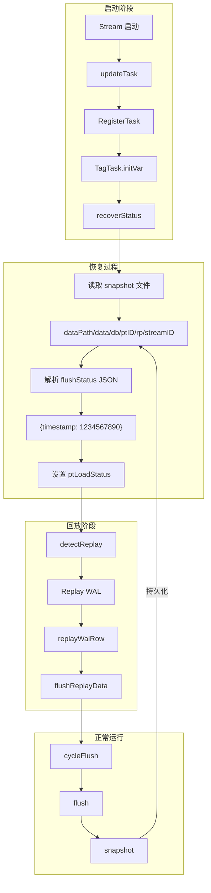

**通俗解释**：
- 崩溃恢复分为三个阶段：
  1. **启动恢复**：读取 snapshot 文件，获取每个 ptID 的最后 flush 时间
  2. **WAL 回放**：从 WAL 中读取 flush 时间之后的数据，重新聚合
  3. **正常运行**：每次 flush 成功后，更新 snapshot 文件

### 9.1 状态恢复：recoverStatus

**核心代码**：`app/ts-store/stream/tag_task.go:960-985`

```go
// 第 960 行：recoverStatus — 恢复 ptID 的 flush 状态
func (s *TagTask) recoverStatus() {
    s.ptLoadStatus = map[uint32]*flushStatus{}
    pts := s.cli.GetNodePT(s.des.Database)               // 获取当前节点的所有 ptID
    s.nodePts = pts
    for _, ptID := range pts {
        s.recoverPTStatus(ptID)                           // 恢复每个 ptID 的状态
    }
    s.setInit()                                           // 标记为已初始化
}

// 第 970 行：recoverPTStatus — 恢复单个 ptID 的状态
func (s *TagTask) recoverPTStatus(ptID uint32) {
    // 文件路径：dataPath/data/db/ptID/rp/streamID
    p := path.Join(s.dataPath, "data", s.des.Database, strconv.Itoa(int(ptID)),
        s.des.RetentionPolicy, strconv.FormatUint(s.id, 10))
    by, err := os.ReadFile(p)
    if err != nil {
        s.Logger.Error("recoverStatus read file error", zap.Error(err))
        return
    }
    st := &flushStatus{}
    err = json.Unmarshal(by, st)                          // 解析 JSON
    if err != nil {
        s.Logger.Error("recoverStatus Unmarshal error", zap.Error(err))
        return
    }
    s.ptLoadStatus[ptID] = st                            // 设置 flush 状态
    s.Logger.Info("recoverPTStatus", zap.Uint32("ptID", ptID), zap.Int64("time", st.Timestamp))
}
```

**逐行解释**：
- **第 971 行**：snapshot 文件路径格式：`{dataPath}/data/{db}/{ptID}/{rp}/{streamID}`
- **第 976 行**：读取 snapshot 文件内容
- **第 981 行**：解析 JSON 得到 `flushStatus{Timestamp: xxx}`
- **第 983 行**：将 flush 时间记录到 `ptLoadStatus`

### 9.2 状态持久化：snapshot

**核心代码**：`app/ts-store/stream/tag_task.go:987-1001`

```go
// 第 987 行：snapshot — 持久化 flush 状态
func (s *TagTask) snapshot(ptID uint32) {
    st := &flushStatus{Timestamp: atomic.LoadInt64(&s.curFlushTime)}  // 获取当前 flush 时间
    by, err := json.Marshal(st)                                       // 序列化为 JSON
    if err != nil {
        s.Logger.Error("Marshal flushStatus fail", zap.Error(err))
        return
    }

    p := path.Join(s.dataPath, "data", s.des.Database, strconv.Itoa(int(ptID)),
        s.des.RetentionPolicy, strconv.FormatUint(s.id, 10))
    if err := os.WriteFile(p, by, 0600); err != nil {                 // 写入文件
        s.Logger.Error("write file error", zap.Error(err))
    }

    s.Logger.Info("stream snapshot suc", zap.String("task", s.name))
}
```

**逐行解释**：
- **第 988 行**：`curFlushTime` 是当前 flush 的结束时间（窗口右边界）
- **第 995-996 行**：写入 JSON 格式的 snapshot 文件
- **第 995 行**：文件权限 0600（只有 owner 可读写）

**具体例子**：
假设一个 Stream 任务 ID = 123，数据库 = "mydb"，ptID = 1，rp = "autogen"：

snapshot 文件路径：
```
/data/mydb/1/autogen/123
```

文件内容：
```json
{"timestamp":1717000000000000000}
```

---

## 10. 潜在隐患与风险分析

### 10.1 原子操作竞争

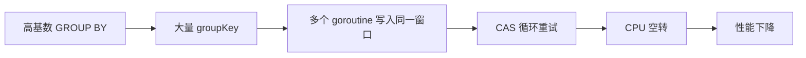

**问题描述**：
- TagTask 使用 `sync.Map` 存储 groupKey，每个 groupKey 对应一个 `[]*float64` 数组
- 当 GROUP BY 的基数很高（如 millions of unique keys）时：
  - `sync.Map` 的 Load/Store 操作开销增大
  - 多个 goroutine 可能同时 CAS 更新同一个窗口槽位，导致频繁重试
  - CAS 重试会消耗 CPU，降低吞吐量

**核心代码**：`lib/atomic/float64.go:23-33`

```go
// 第 23 行：AddFloat64 — CAS 循环可能在高并发下频繁重试
func AddFloat64(a *float64, b float64) float64 {
    p := (*uint64)(unsafe.Pointer(a))
    for {
        v := atomic.LoadUint64(p)
        u := math.Float64frombits(v)
        r := u + b
        if atomic.CompareAndSwapUint64(p, v, math.Float64bits(r)) {
            return r
        }
        // 高并发下，这里可能循环多次
    }
}
```

**风险等级**：中等

**缓解建议**：
- 对于高基数场景，考虑使用 TimeTask（无 GROUP BY）或减少并发度
- 监控 `WindowGroupKeyCount` 指标，及时发现基数异常

### 10.2 Ring Buffer 窗口溢出

**问题描述**：
- `windowNum` 是环形缓冲区的大小，默认 = `maxWindowNum = 5`
- 如果 `maxDelay` 很大，`windowNum = maxDelay/window + 2` 可能超过 5
- 超过时会返回错误：`"maxDelay too big, exceed the maxWindowNum"`

**核心代码**：`app/ts-store/stream/stream.go:494-499`

```go
// 第 494 行：检查 windowNum 是否超过限制
if info.Interval > 0 {
    //base windowNum is 2, one window for current window, other window for delay data
    windowNum := info.Delay/info.Interval + 2
    if int64(windowNum) > int64(maxWindowNum) {
        return errors.New("maxDelay too big, exceed the maxWindowNum")
    }
}
```

**风险等级**：低（有明确的错误提示）

**缓解建议**：
- 合理设置 `maxDelay`，避免超过 `maxWindowNum * window`
- 如果需要更大的延迟，修改 `maxWindowNum` 常量

### 10.3 WAL 回放顺序

**问题描述**：
- WAL 回放时，`detectReplay` 会遍历所有 ptID 并依次回放
- 如果某个 ptID 的回放耗时很长，会阻塞其他 ptID 的回放
- 回放期间，新到达的数据可能会与回放数据产生竞争

**核心代码**：`app/ts-store/stream/stream.go:393-404`

```go
// 第 393 行：依次回放所有 ptID
for ptID := range initTime {
    var err error
    isLastPT := replayCount == len(initTime)-1
    replayCount++
    err = engine.NewStreamWalManager().Replay(ctx, ptID, isLastPT)
    if err != nil {
        s.Logger.Error("replay task init error", zap.Error(err))
    }
}
```

**风险等级**：中等

**缓解建议**：
- 监控回放耗时，如果过长考虑优化 WAL 文件大小
- 回放期间使用独立的 `replayValues`，与正常数据隔离

### 10.4 Stream Task 元数据刷新延迟

**问题描述**：
- `updateTask` 每 10 秒执行一次，检查是否有新任务或已删除的任务
- 如果任务刚创建，最多需要等待 10 秒才能被发现
- 如果任务被删除，最多需要等待 10 秒才能停止处理

**核心代码**：`app/ts-store/stream/stream.go:343-351`

```go
// 第 343 行：Run — 启动 Stream 引擎
func (s *Stream) Run() {
    s.Logger.Info("start stream")
    s.updateTask()                                        // 首次立即执行
    go s.cleanStreamWal()
    go s.detectReplay()

    d := 10 * time.Second                                 // 每 10 秒刷新一次
    util.TickerRun(d, s.abort, s.updateTask, s.AbortFunc)
}
```

**风险等级**：低（10 秒延迟通常可接受）

**缓解建议**：
- 如果需要更快的任务发现，可以减小 `d` 的值
- 或者使用通知机制（如 meta 节点推送）

---

## 11. 端到端实战：Stream 任务的完整生命周期

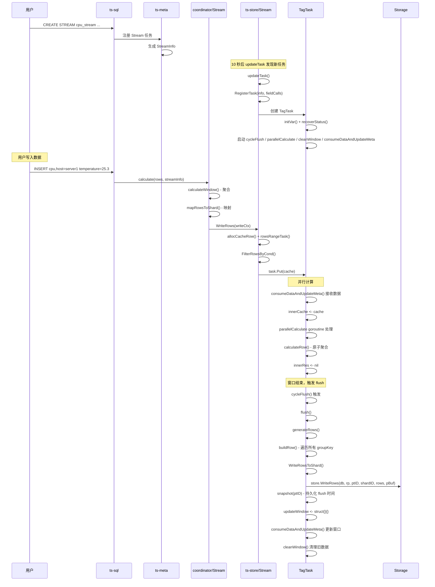

**通俗解释**：

让我们以一个完整的例子来说明 Stream 任务的生命周期：

**第一步：创建 Stream 任务**

```sql
CREATE STREAM cpu_agg_stream
INTO monitor.autogen.cpu_agg
ON SELECT max(temperature) AS max_temp, min(temperature) AS min_temp, count(temperature) AS cnt
FROM monitor.autogen.cpu
GROUP BY time(1m), host
DELAY 30s
```

这个 SQL 会：
1. 在 ts-meta 中注册一个 StreamInfo：
   - Name: "cpu_agg_stream"
   - SrcMst: monitor.autogen.cpu
   - DesMst: monitor.autogen.cpu_agg
   - Interval: 1m
   - Dims: ["host"]
   - Calls: [max(temperature), min(temperature), count(temperature)]
   - Delay: 30s

**第二步：任务注册**

存储层 Stream Engine 的 `updateTask()` 每 10 秒执行一次：
1. 从 ts-meta 获取所有 StreamInfo
2. 对比本地 tasks，发现新任务
3. 创建 TagTask（因为有 GROUP BY host）
4. 启动 4 个 goroutine：cycleFlush、parallelCalculate、cleanWindow、consumeDataAndUpdateMeta

**第三步：数据到达**

用户写入：`cpu,host=server1 temperature=25.3`

1. 协调层 `calculate()` 被触发
2. `calculateWindow()` 按 host 分组，1 分钟窗口聚合
3. `mapRowsToShard()` 映射到目标 shard
4. 存储层 `WriteRows()` 接收数据
5. `rowsRangeTask()` 匹配到 TagTask
6. `FilterRowsByCond()` 条件过滤
7. `task.Put(cache)` 发送到 TagTask

**第四步：窗口内聚合**

TagTask 的 `consumeDataAndUpdateMeta()` 接收数据：
1. 从 `cache` 读取数据
2. 转发到 `innerCache`
3. `parallelCalculate` goroutine 处理：
   - `calculateRow()` 计算 groupKey = "server1"（压缩格式）
   - windowId = 当前窗口在环形缓冲区的位置
   - `ConcurrencyFunc(vs[id], 25.3)` 原子更新 max_temp

**第五步：窗口结束 Flush**

1 分钟后，`cycleFlush()` 触发：
1. `flush()` 被调用
2. `atomic.StoreInt64(&curFlushTime, endTime)` 更新 flush 时间
3. `generateRows()` 遍历所有 groupKey：
   - groupKey = "server1"，聚合值 max_temp=25.3, min_temp=25.3, cnt=1
   - `buildRow()` 构建 Row：host=server1, max_temp=25.3, min_temp=25.3, cnt=1
4. `WriteRowsToShard()` 写入目标 shard
5. `snapshot(ptID)` 持久化 flush 时间
6. `updateWindow <- struct{}{}` 通知更新窗口
7. `consumeDataAndUpdateMeta()` 更新窗口元数据
8. `cleanWindow()` 清理旧窗口数据

**第六步：崩溃恢复**

如果在 flush 过程中崩溃：
1. 重启后，`recoverStatus()` 读取 snapshot 文件
2. 获取每个 ptID 的最后 flush 时间
3. `detectReplay()` 从 WAL 中读取 flush 时间之后的数据
4. `replayWalRow()` 使用 `replayValues` 重新聚合
5. `flushReplayData()` 将回放数据写入目标表
6. 恢复正常运行

---

## 附录：关键数据结构速查表

| 结构体 | 文件 | 用途 |
|--------|------|------|
| `FieldCall` | `lib/stream/stream.go:37` | 聚合函数抽象 |
| `Stream` (协调层) | `coordinator/stream.go:70` | 协调层流处理引擎 |
| `streamTask` | `coordinator/stream.go:41` | 协调层任务 |
| `streamCtx` | `coordinator/stream.go:104` | 协调层上下文（sync.Pool） |
| `Stream` (存储层) | `app/ts-store/stream/stream.go:123` | 存储层流处理引擎 |
| `BaseTask` | `app/ts-store/stream/stream_task.go:28` | 任务基类 |
| `TagTask` | `app/ts-store/stream/tag_task.go:56` | 带 GROUP BY 的任务 |
| `TimeTask` | `app/ts-store/stream/time_task.go:39` | 无 GROUP BY 的任务 |
| `CacheRow` | `app/ts-store/stream/stream.go:171` | 行模式缓存 |
| `CacheRecord` | `app/ts-store/stream/stream.go:224` | Record 模式缓存 |
| `ReplayRow` | `app/ts-store/stream/stream.go:197` | WAL 回放数据 |
| `TaskCache` | `app/ts-store/stream/tag_task.go:95` | 任务缓存 |
| `flushStatus` | `app/ts-store/stream/tag_task.go:1003` | flush 状态持久化 |
| `StreamInfo` | `lib/util/lifted/influx/meta/stream.go:29` | Stream 任务元数据 |
| `Config` | `services/stream/conf.go:26` | Stream 配置 |

## 附录：关键函数调用链

```
写入路径:
  PointsWriter.WritePoints()
    -> Stream.calculate()                    [协调层]
      -> Stream.calculateWindow()
        -> Stream.GenerateGroupKey()
        -> FieldCall.SingleThreadFunc()
      -> Stream.mapRowsToShard()
    -> StreamEngine.WriteRows()              [存储层]
      -> Stream.allocCacheRow()
      -> Stream.rowsRangeTask()
      -> Task.FilterRowsByCond()
      -> Task.Put(cache)

聚合路径 (TagTask):
  TagTask.consumeDataAndUpdateMeta()
    -> cache <- ChanData
    -> innerCache <- ChanData
    -> TagTask.parallelCalculate()
      -> TagTask.calculateRow()
        -> TagTask.generateGroupKeyUint()
        -> FieldCall.ConcurrencyFunc()

Flush 路径:
  TagTask.cycleFlush()
    -> TagTask.flush()
      -> TagTask.generateRows()
        -> TagTask.buildRow()
      -> TagTask.WriteRowsToShard()
      -> TagTask.snapshot()

WAL 回放:
  Stream.detectReplay()
    -> StreamWalManager.Replay()
      -> Stream.StreamHandler()
        -> cache <- ReplayRow
        -> TagTask.replayWalRow()
      -> cache <- LastReplayRow
        -> TagTask.flushReplayData()
          -> TagTask.generateReplayRows()

窗口更新:
  TagTask.consumeDataAndUpdateMeta()
    -> updateWindow 通知
    -> 更新窗口元数据
    -> cleanPreWindow 通知
    -> TagTask.cleanWindow()
      -> walkUpdate() 清理旧窗口
```

## 附录：配置参数

| 参数 | 默认值 | 说明 |
|------|--------|------|
| `check-interval` | 10s | 任务刷新间隔 |
| `windowConcurrency` | CPU/2 | 窗口计算并发度 |
| `filterConcurrency` | CPU/2 | Filter goroutine 数量 |
| `filterCache` | 4 * CPU/2 | Cache channel 缓冲大小 |
| `write-enabled` | true | 是否启用流处理写入 |
| `maxWindowNum` | 5 | 环形缓冲区最大窗口数 |
| `maxReplayWindowNum` | 100 | 回放最大窗口数 |
| `FlushParallelMinRowNum` | 10000 | 并行 flush 最小行数 |

---

## 12. 深入分析：Record 模式处理

### 12.1 CacheRecord 与列式存储

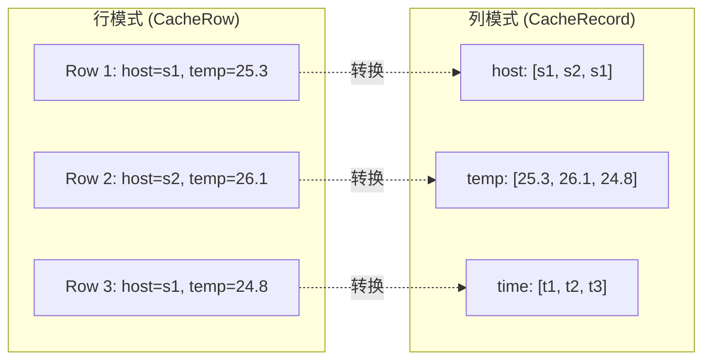

**通俗解释**：
- openGemini 内部使用列式存储（Record），数据以列的形式组织
- 当数据通过 Record 格式写入时，Stream 引擎使用 `CacheRecord` 类型
- 列式模式的优势：同一列的数据连续存储，CPU 缓存友好，聚合计算更快
- `CacheRecord` 使用 `sync.WaitGroup` 等待所有任务处理完成后才返回

**核心代码**：`app/ts-store/stream/stream.go:224-246`

```go
// 第 224 行：CacheRecord — Record 模式的数据缓存
type CacheRecord struct {
    rec         *record.Record    // 列式 Record 对象
    db, rp, mst string           // 数据库、保留策略、表名
    ptId        uint32           // 分区 ID
    shardID     uint64           // Shard ID
    wg          sync.WaitGroup   // 等待组，用于同步
}

// 第 232 行：Wait — 等待所有任务处理完成
func (r *CacheRecord) Wait() {
    r.wg.Wait()
}

// 第 236 行：Retain — 增加等待计数
func (r *CacheRecord) Retain() {
    r.wg.Add(1)
}

// 第 240 行：RetainNum — 批量增加等待计数
func (r *CacheRecord) RetainNum(num int) {
    r.wg.Add(num)
}

// 第 244 行：Release — 减少等待计数
func (r *CacheRecord) Release() {
    r.wg.Done()
}
```

**逐行解释**：
- **第 225 行**：`rec *record.Record` 是列式存储的核心对象，包含多个列（ColVal）
- **第 233 行**：`r.wg.Wait()` 会阻塞直到所有任务调用 `Release()`
- **第 241 行**：`RetainNum(num)` 批量增加计数，用于多个任务并发处理同一个 Record

**核心代码**：`app/ts-store/stream/stream.go:838-856`

```go
// 第 838 行：WriteRec — Record 模式的写入入口
func (s *Stream) WriteRec(db, rp, mst string, ptId uint32, shardID uint64, rec *record.Record, binaryRec []byte) error {
    err := s.store.WriteRec(db, rp, mst, ptId, shardID, rec, binaryRec)  // 先写入存储
    if err == nil {
        s.stats.AddStreamIn(1)
        s.stats.AddStreamInNum(int64(rec.RowNums()))
        r := &CacheRecord{          // 创建 CacheRecord
            rec:     rec,
            db:      db,
            rp:      rp,
            mst:     mst,
            ptId:    ptId,
            shardID: shardID,
        }
        s.cache <- r                // 发送到 cache channel
        r.Wait()                    // 等待所有流任务处理完成
        return nil
    }
    return err
}
```

**逐行解释**：
- **第 840 行**：先将数据写入存储层，确保持久化
- **第 848 行**：创建 `CacheRecord` 并发送到 `cache` channel
- **第 852 行**：`r.Wait()` 会阻塞当前 goroutine，直到所有流任务完成处理

### 12.2 TagTask 的 Record 处理：calculateRec

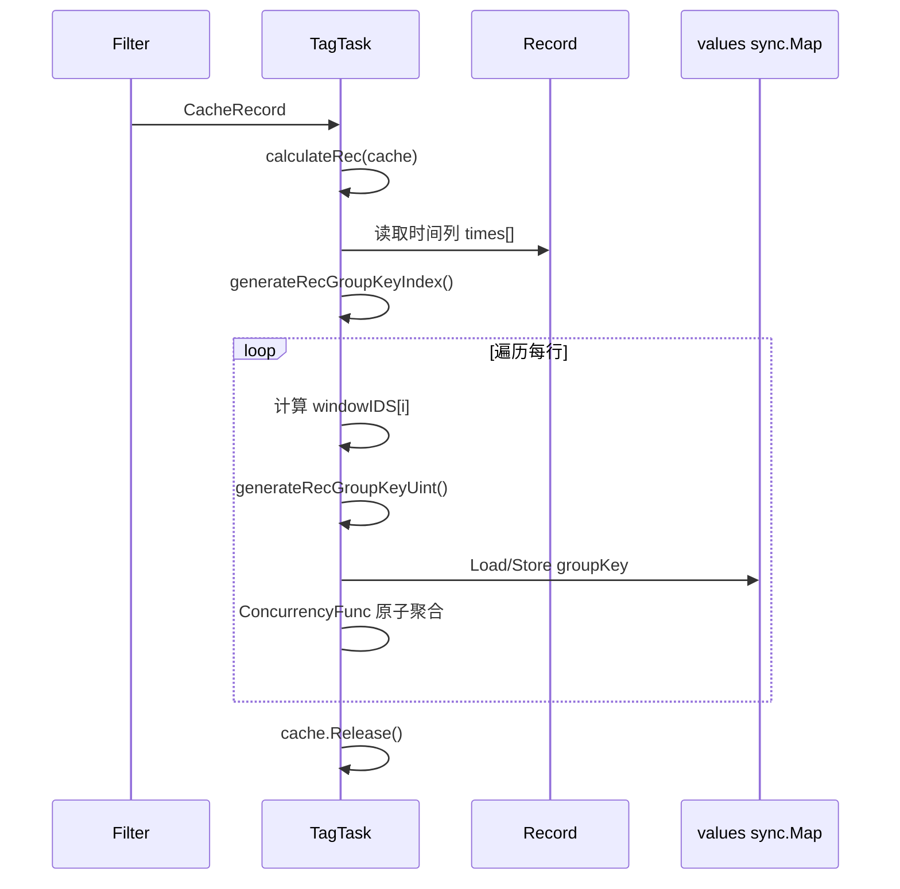

**核心代码**：`app/ts-store/stream/tag_task.go:530-624`

```go
// 第 530 行：calculateRec — Record 模式的原子聚合
func (s *TagTask) calculateRec(cache *CacheRecord) error {
    if cache == nil {
        return ErrEmptyCache
    }
    defer func() {
        cache.Release()                                  // 处理完成，释放 WaitGroup
    }()
    rec := cache.rec
    var skip int
    windowIDS := make([]int8, rec.RowNums())             // 预分配窗口 ID 数组
    timeCol := rec.Column(rec.ColNums() - 1)             // 获取时间列（最后一列）
    times := timeCol.IntegerValues()                     // 获取时间值数组
    columnIDs := s.generateRecGroupKeyIndex(s.groupKeys, rec.Schema)  // 预计算 groupKey 列索引
    s.stats.AddWindowIn(int64(rec.RowNums()))
    s.stats.StatWindowStartTime(s.startTimeStamp)
    s.stats.StatWindowEndTime(s.endTimeStamp)
    var lastWindowID int = -1
    callIds := make([]int, len(s.fieldCalls))             // 预计算聚合字段列索引
    for c, call := range s.fieldCalls {
        id := rec.Schema.FieldIndex(call.Name)
        if id == -1 {
            id = rec.Schema.FieldIndex(call.Alias)
        }
        callIds[c] = id
    }

    if !s.ptIDExist(cache.ptId) {
        return fmt.Errorf("ptId not found,calculateRec")
    }
    for i := 0; i < rec.RowNums(); i++ {
        t := times[i]
        if t < s.startTimeStamp || t >= s.maxTimeStamp {  // 时间范围检查
            if t >= s.endTimeStamp {
                atomic2.CompareAndSwapMaxInt64(&s.stats.WindowOutMaxTime, t)
            } else {
                atomic2.CompareAndSwapMinInt64(&s.stats.WindowOutMinTime, t)
            }
            windowIDS[i] = -1
            skip++
            continue
        }

        values := s.getValue(cache.ptId)                 // 获取该 ptID 的 sync.Map
        key := s.generateRecGroupKeyUint(columnIDs, rec, i)  // 生成 groupKey
        vv, exist := values.Load(key)
        var vs []*float64
        if !exist {
            vs = make([]*float64, s.fieldCallsLen*int(s.windowNum))
            values.Store(key, vs)
            s.stats.AddWindowGroupKeyCount(1)
        } else {
            vs, _ = vv.([]*float64)
        }
        windowId := s.windowId(t)                        // 计算窗口 ID
        for c := range s.fieldCalls {
            var curVal float64
            if s.fieldCalls[c].Call == "count" {
                curVal = 1                               // count 操作值固定为 1
            } else {
                val := rec.Column(callIds[c])            // 直接从 Record 列读取
                if val == nil {
                    continue
                }
                if rec.Schema.Field(callIds[c]).Type == influx.Field_Type_UInt ||
                    rec.Schema.Field(callIds[c]).Type == influx.Field_Type_Int {
                    v, _ := val.IntegerValue(i)          // 整数列
                    curVal = float64(v)
                } else if rec.Schema.Field(callIds[c]).Type == influx.Field_Type_Float {
                    curVal, _ = val.FloatValue(i)        // 浮点列
                } else {
                    continue
                }
            }
            id := s.fieldCallsLen*windowId + c
            if vs[id] == nil {
                var v float64
                if s.fieldCalls[c].Call == "min" {
                    v = math.MaxFloat64
                } else if s.fieldCalls[c].Call == "max" {
                    v = -math.MaxFloat64
                }
                atomic2.SetAndSwapPointerFloat64(&vs[id], &v)  // 原子设置指针
            }
            s.fieldCalls[c].ConcurrencyFunc(vs[id], curVal)   // 原子聚合
        }
        if windowId != lastWindowID {
            atomic.SwapUint64(s.shardIds[cache.ptId][windowId], cache.shardID)
            lastWindowID = windowId
        }
        s.stats.AddWindowProcess(1)
    }
    s.stats.AddWindowSkip(int64(skip))
    return nil
}
```

**逐行解释**：
- **第 541 行**：`timeCol.IntegerValues()` 获取时间列的整数值数组，时间以纳秒存储
- **第 542 行**：`generateRecGroupKeyIndex` 预计算 groupKey 对应的列索引，避免每行重复查找
- **第 547-554 行**：预计算聚合字段的列索引 `callIds`
- **第 593-599 行**：直接从 Record 的列中读取值，CPU 缓存友好
- **第 605 行**：`SetAndSwapPointerFloat64` 原子设置指针，确保并发安全

**具体例子**：
假设一个 Record 有 1000 行数据，GROUP BY host，聚合 max(temperature)：

行模式 vs 列模式对比：
- 行模式：每行需要查找 temperature 字段，可能跳过其他字段
- 列模式：temperature 列连续存储，直接遍历数组，CPU 预取命中率高

### 12.3 generateRecGroupKeyIndex：预计算列索引

**核心代码**：`app/ts-store/stream/tag_task.go:1050-1072`

```go
// 第 1050 行：generateRecGroupKeyIndex — 预计算 groupKey 的列索引
func (s *TagTask) generateRecGroupKeyIndex(keys []string, schema record.Schemas) []int {
    if len(keys) == 0 {
        return nil
    }

    columnIDs := make([]int, len(keys))
    tagIndex := 0
    for i := range keys {
        // 二分查找：从 tagIndex 开始搜索 keys[i]
        idx := util.Search(tagIndex, len(schema), func(j int) bool { return schema[j].Name >= keys[i] })
        if idx < len(schema) && schema[idx].Name == keys[i] {
            tagIndex = idx + 1
            if schema[idx].IsString() {
                columnIDs[i] = idx              // 字符串类型，记录列索引
            } else {
                columnIDs[i] = -1               // 非字符串类型，不支持作为 groupKey
            }
            continue
        }
        tagIndex = idx + 1
        columnIDs[i] = -1                       // 未找到，标记为 -1
    }
    return columnIDs
}
```

**逐行解释**：
- **第 1058 行**：`util.Search` 是二分查找，利用了 Schema 已按 Name 排序的特性
- **第 1061 行**：只有字符串类型的列才能作为 groupKey（tag 类型）
- **第 1064 行**：非字符串类型标记为 -1，在 `generateRecGroupKeyUint` 中会被跳过

**核心代码**：`app/ts-store/stream/tag_task.go:1074-1104`

```go
// 第 1074 行：generateRecGroupKeyUint — 生成 Record 的 groupKey
func (s *TagTask) generateRecGroupKeyUint(columnIDs []int, value *record.Record, row int) string {
    builder := s.bp.Get()
    defer func() {
        builder.Reset()
        s.bp.Put(builder)
    }()

    for i, id := range columnIDs {
        if id == -1 {                               // 非字符串列或未找到
            if i < len(columnIDs)-1 {
                builder.AppendByte(config.StreamGroupValueSeparator)  // 追加空分隔符
            }
            continue
        }
        val := value.Column(id)                     // 获取列
        if val == nil {
            if i < len(columnIDs)-1 {
                builder.AppendByte(config.StreamGroupValueSeparator)
            }
            continue
        }
        str, _ := val.StringValue(row)              // 获取第 row 行的字符串值
        v := s.stringDict.LoadIndex(string(str))    // 压缩为整数索引
        builder.AppendString(strconv.FormatUint(v, 10))
        if i < len(columnIDs)-1 {
            builder.AppendByte(config.StreamGroupValueSeparator)
        }
    }

    return builder.NewString()
}
```

**逐行解释**：
- **第 1095 行**：`val.StringValue(row)` 获取第 `row` 行的字符串值
- **第 1096 行**：`stringDict.LoadIndex` 将字符串压缩为整数索引，减少内存占用
- **第 1097 行**：将整数索引转为字符串追加到 groupKey

---

## 13. 深入分析：对象池与内存管理

### 13.1 CacheRowPool

```mermaid
graph TB
    subgraph "CacheRowPool"
        A[sync.Pool] -->|"Get()"| B{池中有对象?}
        B -->|是| C[返回已有对象]
        B -->|否| D[创建新对象]
        D --> E[RowsPool.Get() - 获取 rows 切片]
        E --> F[返回 CacheRow]

        G[Put(r)] --> H[RowsPool.Put(&r.rows)]
        H --> I[清空 rows 和 ww]
        I --> J[sync.Pool.Put(r)]
    end
```

**核心代码**：`app/ts-store/stream/cache.go:25-55`

```go
// 第 25 行：NewCacheRowPool — 创建 CacheRow 对象池
func NewCacheRowPool() *CacheRowPool {
    rowsPool := NewRowsPool()
    p := &CacheRowPool{rowsPool: rowsPool}
    return p
}

// 第 31 行：CacheRowPool — CacheRow 对象池
type CacheRowPool struct {
    pool     sync.Pool    // 底层 sync.Pool
    size     int64        // 总创建的对象数
    length   int64        // 当前池中的对象数
    rowsPool *RowsPool    // rows 切片池
}

// 第 38 行：Get — 从池中获取 CacheRow
func (p *CacheRowPool) Get() *CacheRow {
    c := p.pool.Get()
    if c == nil {
        atomic.AddInt64(&p.size, 1)               // 增加总创建数
        return &CacheRow{rows: *p.rowsPool.Get()} // 创建新对象，从 RowsPool 获取 rows
    }
    atomic.AddInt64(&p.length, -1)                // 减少池中对象数
    return c.(*CacheRow)
}

// 第 48 行：Put — 归还 CacheRow 到池中
func (p *CacheRowPool) Put(r *CacheRow) {
    p.rowsPool.Put(&r.rows)                       // 归还 rows 切片
    r.rows = nil                                  // 清空引用
    r.ww = nil                                    // 清空 WritePointsWork 引用
    p.pool.Put(r)                                 // 归还到 sync.Pool
    atomic.AddInt64(&p.length, 1)                 // 增加池中对象数
}
```

**逐行解释**：
- **第 39-45 行**：`Get` 先尝试从 `sync.Pool` 获取，如果没有则创建新对象
- **第 49-54 行**：`Put` 先归还 rows 切片到 RowsPool，清空引用，再归还到 sync.Pool
- **第 43 行**：`rowsPool.Get()` 返回一个空的 `[]influx.Row` 切片，避免频繁分配

### 13.2 TaskCachePool

**核心代码**：`app/ts-store/stream/cache.go:124-150`

```go
// 第 124 行：TaskCachePool — TaskCache 对象池
type TaskCachePool struct {
    pool  sync.Pool
    count int64           // 当前池外的对象数
}

// 第 134 行：Get — 从池中获取 TaskCache
func (p *TaskCachePool) Get() *TaskCache {
    atomic.AddInt64(&p.count, 1)      // 增加池外计数
    c := p.pool.Get()
    if c == nil {
        return &TaskCache{}            // 池为空，创建新对象
    }
    return c.(*TaskCache)
}

// 第 143 行：Put — 归还 TaskCache 到池中
func (p *TaskCachePool) Put(r *TaskCache) {
    atomic.AddInt64(&p.count, -1)     // 减少池外计数
    p.pool.Put(r)
}

// 第 148 行：Count — 获取池外对象数
func (p *TaskCachePool) Count() int64 {
    return atomic.LoadInt64(&p.count)
}
```

**逐行解释**：
- **第 136 行**：`atomic.AddInt64(&p.count, 1)` 在 Get 时增加计数
- **第 144 行**：`atomic.AddInt64(&p.count, -1)` 在 Put 时减少计数
- **第 148 行**：`Count()` 返回当前池外的对象数，用于 `Drain()` 等待所有对象归还

### 13.3 TaskDataPool：任务级数据池

**核心代码**：`app/ts-store/stream/cache.go:85-122`

```go
// 第 85 行：TaskDataPool — 任务级数据池
type TaskDataPool struct {
    cache  chan ChanData    // 带缓冲的 channel
    length int64           // 当前缓冲中的数据量
}

// 第 90 行：NewTaskDataPool — 创建任务数据池
func NewTaskDataPool() *TaskDataPool {
    n := cpu.GetCpuNum() * 8    // 默认大小 = CPU 数 * 8
    if n < 4 {
        n = 4                   // 最小 4
    }
    if n > 256 {
        n = 256                 // 最大 256
    }

    p := &TaskDataPool{
        cache: make(chan ChanData, n),    // 创建带缓冲的 channel
    }
    return p
}

// 第 105 行：Get — 从池中获取数据（阻塞）
func (p *TaskDataPool) Get() ChanData {
    cache := <-p.cache            // 从 channel 读取（阻塞）
    p.IncreaseChan()              // 增加可用容量
    return cache
}

// 第 111 行：IncreaseChan — 增加可用容量
func (p *TaskDataPool) IncreaseChan() {
    atomic.AddInt64(&p.length, -1)
}

// 第 115 行：Put — 归还数据到池中
func (p *TaskDataPool) Put(cache ChanData) {
    p.cache <- cache              // 写入 channel（阻塞）
    atomic.AddInt64(&p.length, 1)
}

// 第 120 行：Len — 获取当前缓冲量
func (p *TaskDataPool) Len() int64 {
    return atomic.LoadInt64(&p.length)
}
```

**逐行解释**：
- **第 91 行**：缓冲大小 = `CPU 数 * 8`，范围 [4, 256]
- **第 106-107 行**：`Get` 从 channel 读取，如果没有数据会阻塞
- **第 116-117 行**：`Put` 写入 channel，如果缓冲满会阻塞
- 这种设计实现了背压机制：当处理速度跟不上时，写入端会自动阻塞

---

## 14. 深入分析：Filter 匹配逻辑

### 14.1 rowsRangeTask：行范围匹配

```mermaid
graph TB
    subgraph "rowsRangeTask 匹配过程"
        A["输入: CacheRow (rows[0..N])"] --> B["遍历所有 tasks"]
        B --> C{"db/rp 匹配?"}
        C -->|否| D[跳过]
        C -->|是| E["遍历 rows"]
        E --> F{"name 匹配 且 StreamId 匹配?"}
        F -->|是| G[记录 startIndex]
        F -->|否| H{consecutive?}
        H -->|是| I["记录 [startIndex, j]"]
        H -->|否| J[继续]
        I --> K["indexes[taskID] = [[s1,e1], [s2,e2]...]"]
    end
```

**核心代码**：`app/ts-store/stream/stream.go:677-722`

```go
// 第 677 行：rowsRangeTask — 匹配行范围
func (s *Stream) rowsRangeTask(r Rows) (bool, map[uint64][]int) {
    ref := false
    indexes := make(map[uint64][]int)       // taskID -> [start, end, start, end, ...]
    db := r.GetDB()
    rp := r.GetRP()
    rows := r.GetRows()
    s.tasks.Range(func(key, value interface{}) bool {
        i, _ := key.(uint64)                // task ID
        v, _ := value.(Task)
        // 数据库和保留策略必须匹配
        if db != v.getSrcInfo().Database || rp != v.getSrcInfo().RetentionPolicy {
            return true
        }
        s.stats.AddStreamFilterNum(int64(len(rows)))
        index, exist := indexes[i]
        if !exist {
            index = []int{}
            indexes[i] = index
        }
        con := false                        // 是否连续匹配
        startIndex := 0

        for j := range rows {
            name := influx.GetOriginMstName(rows[j].Name)
            if r.IsStreamRow(name, v, rows[j], i) {   // 表名匹配 且 StreamId 匹配
                if !con {
                    startIndex = j          // 记录连续区间的开始
                    con = true
                }
            } else {
                if !con {
                    continue
                }
                ref = true
                con = false
                index = append(index, startIndex, j)    // 记录连续区间 [start, end)
            }
        }
        if con {                            // 处理最后一个连续区间
            ref = true
            index = append(index, startIndex, len(rows))
        }
        indexes[i] = index
        return true
    })
    return ref, indexes
}
```

**逐行解释**：
- **第 686-688 行**：先检查数据库和保留策略是否匹配
- **第 700 行**：`IsStreamRow` 检查表名是否匹配，且 StreamId 是否包含该任务的 ID
- **第 701-707 行**：追踪连续匹配的行范围
- **第 708-712 行**：当连续中断时，记录 `[startIndex, j]` 区间
- **第 716-718 行**：处理最后一个连续区间

**具体例子**：
假设 CacheRow 有 5 行数据，任务 A 匹配表 "cpu"：
```
rows[0]: cpu (匹配)
rows[1]: cpu (匹配)
rows[2]: mem (不匹配)
rows[3]: cpu (匹配)
rows[4]: cpu (匹配)
```

结果：`indexes[A] = [0, 2, 3, 5]`，表示两个区间 [0, 2) 和 [3, 5)

### 14.2 IsStreamRow：Stream 数据检测

**核心代码**：`app/ts-store/stream/stream.go:193-195`

```go
// 第 193 行：IsStreamRow — 检查是否为 Stream 产生的数据
func (r *CacheRow) IsStreamRow(name string, v Task, row influx.Row, key uint64) bool {
    return (name == v.getSrcInfo().Name || name == v.getDesInfo().Name) && util.Include(row.StreamId, key)
}
```

**逐行解释**：
- **第 194 行**：两个条件都满足才返回 true：
  1. 表名匹配源表或目标表
  2. 行的 StreamId 包含该任务的 ID
- `util.Include(row.StreamId, key)` 检查该行是否由该 Stream 任务产生
- 这个检查防止了流任务的输出数据再次触发同一个流任务（避免无限循环）

**核心代码**：`app/ts-store/stream/stream.go:220-222`

```go
// 第 220 行：ReplayRow 的 IsStreamRow — 回放数据不检查 StreamId
func (r *ReplayRow) IsStreamRow(name string, v Task, row influx.Row, key uint64) bool {
    return name == v.getSrcInfo().Name || name == v.getDesInfo().Name
}
```

**逐行解释**：
- 回放数据不检查 StreamId，因为回放数据可能没有 StreamId 标记
- 只检查表名是否匹配

---

## 15. 深入分析：时间窗口计算

### 15.1 windowId 计算公式

```mermaid
graph LR
    A["timestamp"] --> B["(t - startTimeStamp) / window"]
    B --> C["+ startWindowID"]
    C --> D["% windowNum"]
    D --> E["windowId"]
```

**核心代码**：`app/ts-store/stream/tag_task.go:631-633`

```go
// 第 631 行：windowId — 计算时间戳对应的窗口 ID
func (s *TagTask) windowId(t int64) int {
    return int(((t-s.startTimeStamp)/s.window.Nanoseconds() + atomic.LoadInt64(&s.startWindowID)) % s.windowNum)
}
```

**逐行解释**：
- `(t - startTimeStamp) / window`：计算相对于当前窗口开始的窗口偏移量
- `+ startWindowID`：加上环形缓冲区的起始窗口 ID
- `% windowNum`：取模，实现环形缓冲区

**具体例子**：
假设：
- `startTimeStamp` = 1000 (纳秒)
- `window` = 100 (纳秒)
- `startWindowID` = 2
- `windowNum` = 5
- `timestamp` = 1250

计算过程：
1. `(1250 - 1000) / 100` = 2（偏移量）
2. `2 + 2` = 4（绝对窗口 ID）
3. `4 % 5` = 4（环形索引）

```
环形缓冲区: [0] [1] [2] [3] [4]
                   ^startWindowID=2
                              ^windowId=4
```

### 15.2 环形缓冲区滑动

```mermaid
sequenceDiagram
    participant CW as consumeDataAndUpdateMeta
    participant CW2 as cleanWindow
    participant V as values sync.Map

    Note over V: 初始状态: startWindowID=0
    Note over V: 窗口: [w0] [w1] [w2] [w3] [w4]

    CW->>CW: updateWindow 收到通知
    CW->>CW: startWindowID = (0 + 1) % 5 = 1
    CW->>CW2: cleanPreWindow 通知
    CW2->>CW2: offset = (1 - 1 + 5) % 5 = 0
    CW2->>V: walkUpdate(0) - 清理 w0
    Note over V: 窗口: [__] [w1] [w2] [w3] [w4]

    CW->>CW: updateWindow 收到通知
    CW->>CW: startWindowID = (1 + 1) % 5 = 2
    CW->>CW2: cleanPreWindow 通知
    CW2->>CW2: offset = (2 - 1 + 5) % 5 = 1
    CW2->>V: walkUpdate(1) - 清理 w1
    Note over V: 窗口: [__] [__] [w2] [w3] [w4]
```

**通俗解释**：
- 环形缓冲区有 `windowNum` 个槽位（默认 5）
- `startWindowID` 指向当前窗口的起始位置
- 每次 flush 后，`startWindowID` 前进 1（模 windowNum）
- `cleanWindow` 清理 `startWindowID - 1` 位置的旧数据

**核心代码**：`app/ts-store/stream/tag_task.go:431-451`

```go
// 第 431 行：consumeDataAndUpdateMeta — 更新窗口元数据
case _, open := <-s.updateWindow:                // 收到 flush 完成通知
    if !open {
        return
    }
    s.start = s.end                              // 滑动窗口
    s.end = s.end.Add(s.window)
    s.startTimeStamp = s.start.UnixNano()
    s.endTimeStamp = s.end.UnixNano()
    s.maxTimeStamp = s.startTimeStamp + s.maxDuration
    // 原子地将 startWindowID 前进 1（模 windowNum）
    atomic2.SetModInt64AndADD(&s.startWindowID, 1, int64(s.windowNum))
    s.stats.Reset()
    s.stats.StatWindowOutMinTime(s.startTimeStamp)
    s.stats.StatWindowOutMaxTime(s.maxTimeStamp)
    select {
    case s.cleanPreWindow <- struct{}{}:          // 通知 cleanWindow 清理旧数据
        continue
    case <-s.abort:
        return
    }
```

**逐行解释**：
- **第 437 行**：`s.start = s.end` 将窗口起点移到当前终点
- **第 438 行**：`s.end = s.end.Add(s.window)` 计算新的窗口终点
- **第 442 行**：`SetModInt64AndADD(&s.startWindowID, 1, int64(s.windowNum))` 原子地将 startWindowID 前进 1（模 windowNum）

**核心代码**：`lib/atomic/int64.go:21-32`

```go
// 第 21 行：SetModInt64AndADD — 原子模加操作
func SetModInt64AndADD(a *int64, b, mod int64) int64 {
    for {
        v := atomic.LoadInt64(a)            // 读取当前值
        s := v + b + mod                    // 计算新值（加 mod 防止负数）
        if s >= mod {
            s = s % mod                     // 取模
        }
        if atomic.CompareAndSwapInt64(a, v, s) {  // CAS 更新
            return s                        // 成功
        }
        // CAS 失败，重试
    }
}
```

**逐行解释**：
- **第 24 行**：`s := v + b + mod` 加 mod 是为了处理 `v + b` 为负数的情况
- **第 25-26 行**：如果 `s >= mod`，取模得到正确的环形索引

---

## 16. 深入分析：字符串字典压缩

### 16.1 stringinterner.StringDict

```mermaid
graph LR
    A["tag value: 'server1'"] --> B["stringDict.LoadIndex('server1')"]
    B --> C["返回整数索引: 42"]
    C --> D["groupKey 中存储 '42' 而非 'server1'"]

    E["flush 时"] --> F["stringDict.LoadValue(42)"]
    F --> G["返回原始字符串: 'server1'"]
    G --> H["构建输出 Row"]
```

**通俗解释**：
- TagTask 使用 `stringinterner.StringDict` 将 tag value 压缩为整数索引
- 优势：减少内存占用（整数 vs 字符串），加速 groupKey 比较
- groupKey 存储整数索引序列（如 "42|7"），而非原始字符串（如 "server1|us"）

**核心代码**：`app/ts-store/stream/tag_task.go:1107-1135`

```go
// 第 1107 行：generateGroupKeyUint — 生成压缩格式的 groupKey
func (s *TagTask) generateGroupKeyUint(keys []string, value *influx.Row) string {
    if len(keys) == 0 {
        return EmptyGroupKey
    }
    builder := s.bp.Get()
    defer func() {
        builder.Reset()
        s.bp.Put(builder)
    }()

    tagIndex := 0
    for i := range keys {
        // 二分查找：从 tagIndex 开始搜索 keys[i]
        idx := util.Search(tagIndex, len(value.Tags), func(j int) bool { return value.Tags[j].Key >= keys[i] })
        if idx < len(value.Tags) && value.Tags[idx].Key == keys[i] {
            v := s.stringDict.LoadIndex(value.Tags[idx].Value)  // 压缩为整数索引
            builder.AppendString(strconv.FormatUint(v, 10))     // 追加整数索引
            if i < len(keys)-1 {
                builder.AppendByte(config.StreamGroupValueSeparator)
            }
            tagIndex = idx + 1
            continue
        }
        if i < len(keys)-1 {
            builder.AppendByte(config.StreamGroupValueSeparator)
        }
        tagIndex = idx + 1
    }
    return builder.NewString()
}
```

**逐行解释**：
- **第 1120 行**：`stringDict.LoadIndex(value.Tags[idx].Value)` 将 tag value 压缩为整数索引
- **第 1121 行**：将整数索引转为字符串追加到 groupKey
- **第 1134 行**：返回压缩格式的 groupKey，如 "42|7"

### 16.2 unCompressDictKey：解压缩

**核心代码**：`app/ts-store/stream/tag_task.go:1030-1040`

```go
// 第 1030 行：unCompressDictKey — 解压缩 groupKey 中的整数索引
func (s *TagTask) unCompressDictKey(key string) (string, error) {
    if key == EmptyTagValue {
        return EmptyTagValue, nil
    }
    intV, err := strconv.Atoi(key)               // 将字符串转为整数
    if err != nil {
        s.Logger.Error(fmt.Sprintf("invalid corpus key %v", key))
        return "", err
    }
    return s.stringDict.LoadValue(intV)           // 从字典中查找原始字符串
}
```

**逐行解释**：
- **第 1035 行**：`strconv.Atoi(key)` 将整数索引字符串转为整数
- **第 1039 行**：`stringDict.LoadValue(intV)` 从字典中查找原始字符串

**具体例子**：
假设 tag values: ["server1", "server2", "us", "eu"]

字典映射：
- "server1" -> 0
- "server2" -> 1
- "us" -> 2
- "eu" -> 3

groupKey 生成：
- Row: host=server1, region=us
- 压缩后: "0|2"

flush 时解压缩：
- "0" -> "server1"
- "2" -> "us"
- 输出 Row: host=server1, region=us

---

## 17. 深入分析：Task 更新与删除

### 17.1 updateTask：任务同步

```mermaid
sequenceDiagram
    participant T as Ticker (10s)
    participant S as Stream
    participant MC as MetaClient
    participant Task as TagTask/TimeTask

    loop 每 10 秒
        T->>S: updateTask()
        S->>MC: GetStreamInfos()
        MC-->>S: map[name]*StreamInfo

        S->>S: 遍历 streams
        loop 每个 StreamInfo
            S->>S: tasks.Load(info.ID)
            alt 任务不存在
                S->>MC: Measurement(src)
                S->>MC: Measurement(dst)
                S->>S: BuildFieldCall()
                S->>S: RegisterTask(info, calls)
                S->>Task: 创建 TagTask/TimeTask
                S->>Task: task.run()
                S->>S: tasks.Store(info.ID, task)
            end
        end

        S->>S: 遍历现有 tasks
        loop 每个现有任务
            S->>S: 检查是否还在 streams 中
            alt 任务已删除
                S->>S: DeleteTask(id)
                S->>Task: task.stop()
                S->>S: tasks.Delete(id)
                S->>S: store.UninstallOnPTOffload(id)
            end
        end

        S->>S: initTask = true
        S->>S: atomic.StoreInt32(&taskNum, cnt)
    end
```

**核心代码**：`app/ts-store/stream/stream.go:248-341`

```go
// 第 248 行：updateTask — 同步任务
func (s *Stream) updateTask() {
    streams := s.cli.GetStreamInfos()                  // 从 meta 获取所有 Stream 任务
    if streams == nil {
        return
    }
    for _, info := range streams {
        _, exist := s.tasks.Load(info.ID)              // 检查任务是否已存在
        if exist {
            continue
        }
        // 获取源表和目标表的元数据
        srcMst, err := s.cli.Measurement(info.SrcMst.Database, info.SrcMst.RetentionPolicy, info.SrcMst.Name)
        if err != nil || srcMst == nil {
            // ... 错误处理 ...
            continue
        }
        dstMst, err := s.cli.Measurement(info.DesMst.Database, info.DesMst.RetentionPolicy, info.DesMst.Name)
        if err != nil || dstMst == nil {
            // ... 错误处理 ...
            continue
        }
        srcSchema := srcMst.CloneSchema()
        dstSchema := dstMst.CloneSchema()
        canRegisterTask := true
        calls := make([]*streamLib.FieldCall, len(info.Calls))
        for i, v := range info.Calls {
            inFieldType, ok := srcSchema.GetTyp(v.Field)
            if !ok {
                canRegisterTask = false
                break
            }
            outFieldType, ok := dstSchema.GetTyp(v.Alias)
            if !ok {
                canRegisterTask = false
                break
            }
            if len(info.Dims) == 0 && info.Interval == 0 {
                // filter-only 模式：不需要聚合函数
                calls[i] = &streamLib.FieldCall{
                    InFieldType:  inFieldType,
                    OutFieldType: outFieldType,
                    Name:         v.Field,
                    Alias:        v.Alias,
                }
            } else {
                calls[i], err = streamLib.NewFieldCall(inFieldType, outFieldType, v.Field, v.Alias, v.Call, len(info.Dims) != 0)
                if err != nil {
                    canRegisterTask = false
                    break
                }
            }
        }
        // 验证 Dims 是否为 tag 类型
        for i := range info.Dims {
            ty, ok := srcSchema.GetTyp(info.Dims[i])
            if !ok || influx.Field_Type_Tag != ty {
                canRegisterTask = false
                break
            }
        }
        if canRegisterTask {
            sort.Sort(streamLib.FieldCalls(calls))     // 排序 FieldCalls
            err = s.RegisterTask(info, calls)          // 注册任务
            if err != nil {
                s.Logger.Error("register stream task fail", zap.Error(err))
            }
        }
    }
    // 删除不再存在的任务
    var cnt int32
    s.tasks.Range(func(key, value interface{}) bool {
        cnt++
        id, _ := key.(uint64)
        w, _ := value.(Task)
        _, exist := streams[w.getName()]
        if exist {
            return true
        }
        s.DeleteTask(id)                               // 删除任务
        return true
    })
    s.initTask = true
    atomic.StoreInt32(&s.taskNum, cnt)
}
```

**逐行解释**：
- **第 249 行**：`GetStreamInfos` 从 meta 获取所有 Stream 任务的元数据
- **第 253-254 行**：如果任务已存在，跳过
- **第 258-275 行**：获取源表和目标表的元数据，验证字段类型
- **第 293-299 行**：filter-only 模式（无 GROUP BY 且无 Interval）不需要聚合函数
- **第 319 行**：`sort.Sort(streamLib.FieldCalls(calls))` 排序 FieldCalls，确保字段顺序一致
- **第 328-338 行**：遍历现有任务，删除不再存在的任务

### 17.2 RegisterTask：任务注册

**核心代码**：`app/ts-store/stream/stream.go:483-576`

```go
// 第 483 行：RegisterTask — 注册流任务
func (s *Stream) RegisterTask(info *meta.StreamInfo, fieldCalls []*streamLib.FieldCall) error {
    s.Logger.Info("register stream task", zap.String("streamName", info.Name), zap.String("streamId", strconv.FormatUint(info.ID, 10)))
    start := time.Now().Truncate(info.Interval).Add(info.Interval)  // 窗口开始时间
    var logger Logger
    l, ok := s.Logger.(*Logger2.Logger)
    if ok {
        logger = l.With(zap.String("windowName", info.Name))
    } else {
        logger = s.Logger
    }

    if info.Interval > 0 {
        windowNum := info.Delay/info.Interval + 2      // 基础窗口数 = delay/interval + 2
        if int64(windowNum) > int64(maxWindowNum) {
            return errors.New("maxDelay too big, exceed the maxWindowNum")
        }
    }

    var cond influxql.Expr
    if info.Cond != "" && info.Interval == 0 && len(info.Dims) == 0 {
        // filter-only 模式：解析条件表达式
        expr, err := influxql.ParseExpr(info.Cond)
        if err != nil {
            return err
        }
        valuer := influxql.NowValuer{Now: time.Now()}
        cond, _, err = influxql.ConditionExpr(expr, &valuer)
        if err != nil {
            return err
        }
    }

    baseTask := &BaseTask{
        windowNum:    int64(maxWindowNum),
        id:           info.ID,
        src:          info.SrcMst,
        des:          info.DesMst,
        initTime:     start,
        start:        start,
        end:          start.Add(info.Interval),
        window:       info.Interval,
        fieldCalls:   fieldCalls,
        store:        s.store,
        maxDelay:     info.Delay,
        rows:         []influx.Row{},
        Logger:       logger,
        name:         info.Name,
        stats:        statistics.NewStreamWindowStatItem(info.ID),
        cli:          s.cli,
        dataPath:     s.dataPath,
        ptNumPerNode: s.ptNumPerNode,
        condition:    cond,
        isSelectAll:  info.IsSelectAll,
    }
    var task Task
    if len(info.Dims) == 0 {
        // 无 GROUP BY：创建 TimeTask
        task = &TimeTask{
            TaskDataPool:    NewTaskDataPool(),
            windowCachePool: s.windowCachePool,
            BaseTask:        baseTask,
        }
    } else {
        // 有 GROUP BY：创建 TagTask
        tagTask := &TagTask{
            TaskDataPool:    NewTaskDataPool(),
            goPool:          s.goPool,
            groupKeys:       info.Dims,
            bp:              s.bp,
            windowCachePool: s.windowCachePool,
            concurrency:     s.conf.WindowConcurrency,
            BaseTask:        baseTask,
        }
        tagTask.curFlushTime = start.UnixNano()
        if s.initTask {
            // 如果是新任务（非首次启动），需要写入初始 flush 时间
            pts := s.cli.GetNodePT(baseTask.des.Database)
            for _, pt := range pts {
                tagTask.snapshot(pt)
            }
        }
        task = tagTask
        s.store.RegisterOnPTOffload(info.ID, task.cleanPtInfo)  // 注册 PT 卸载回调
    }
    go func() {
        err := task.run()                              // 启动任务
        if err != nil {
            s.Logger.Error("task run fail", zap.String("name", task.getName()), zap.Error(err))
        }
    }()
    s.tasks.Store(info.ID, task)                       // 存储到 tasks map
    return nil
}
```

**逐行解释**：
- **第 486 行**：`start = time.Now().Truncate(info.Interval).Add(info.Interval)` 计算下一个窗口的开始时间
- **第 494-499 行**：检查 `maxDelay` 是否超过 `maxWindowNum * window`
- **第 539-544 行**：无 GROUP BY 创建 TimeTask
- **第 545-565 行**：有 GROUP BY 创建 TagTask
- **第 556-563 行**：如果是新任务（非首次启动），需要为每个 ptID 写入初始 flush 时间
- **第 565 行**：`RegisterOnPTOffload` 注册 PT 卸载回调，当 PT 被卸载时清理任务数据

---

## 18. 深入分析：WriteRowsToShard 与序列化

### 18.1 行序列化

**核心代码**：`app/ts-store/stream/tag_task.go:1007-1027`

```go
// 第 1007 行：WriteRowsToShard — 将行写入目标 shard
func (s *TagTask) WriteRowsToShard(start, end int, ptID uint32, shardID uint64) error {
    pBuf := bufferpool.GetPoints()                     // 获取序列化缓冲区
    defer func() {
        bufferpool.PutPoints(pBuf)                     // 归还缓冲区
    }()

    var err error
    pBuf, err = influx.FastMarshalMultiRows(pBuf, s.rows[start:end])  // 快速序列化
    if err != nil {
        s.Logger.Error("stream FastMarshalMultiRows fail", zap.Error(err))
        return err
    }

    err = s.store.WriteRows(s.des.Database, s.des.RetentionPolicy, ptID, shardID, s.rows[start:end], pBuf)
    if err != nil {
        s.Logger.Error("stream flush fail", zap.Error(err))
    }
    return nil
}
```

**逐行解释**：
- **第 1008 行**：`bufferpool.GetPoints()` 从缓冲池获取序列化缓冲区
- **第 1015 行**：`influx.FastMarshalMultiRows` 快速序列化多行数据
- **第 1022 行**：`s.store.WriteRows` 将序列化后的数据写入存储

### 18.2 buildRow：构建输出行

**核心代码**：`app/ts-store/stream/tag_task.go:771-849`

```go
// 第 771 行：buildRow — 构建输出行
func (s *TagTask) buildRow(flushTime int64) func(k, vv any) bool {
    return func(k any, vv any) bool {
        key, _ := k.(string)                           // groupKey（压缩格式）
        v, _ := vv.([]*float64)                        // 聚合值数组
        if s.validNum >= len(s.rows) {
            s.rows = append(s.rows, influx.Row{Name: s.info.Name})  // 扩展 rows 切片
        }
        s.rows[s.validNum].ReFill()                    // 重置 Row
        fields := &s.rows[s.validNum].Fields
        // 初始化 Fields
        if fields.Len() < len(s.fieldCalls) {
            *fields = make([]influx.Field, len(s.fieldCalls))
            for i := 0; i < fields.Len(); i++ {
                (*fields)[i] = influx.Field{
                    Key:  s.fieldCalls[i].Alias,       // 使用别名作为字段名
                    Type: s.fieldCalls[i].OutFieldType,
                }
            }
        }
        validNum := 0
        for i := range s.fieldCalls {
            if v[s.offset+i] == nil {                  // 跳过无数据的字段
                continue
            }
            (*fields)[validNum].NumValue = atomic2.LoadFloat64(v[s.offset+i])  // 原子读取聚合值
            validNum++
        }

        if validNum == 0 {
            return true                                // 无有效字段，跳过
        }

        *fields = (*fields)[:validNum]
        tags := &s.rows[s.validNum].Tags
        if key == EmptyGroupKey {
            if len(s.groupKeys) != 0 {
                s.Logger.Error("buildRow fail", ...)
                return true
            }
        } else {
            var err error
            values := strings.Split(key, config.StreamGroupValueStrSeparator)  // 解压缩 groupKey
            if len(values) != len(s.groupKeys) {
                s.Logger.Error("buildRow fail", ...)
                return true
            }
            validNum = 0
            if tags.Len() < len(s.groupKeys) {
                *tags = make([]influx.Tag, len(s.groupKeys))
            }
            for i := range s.groupKeys {
                value := values[i]
                value, err = s.unCompressDictKey(value)  // 解压缩字典索引
                if err != nil {
                    s.Logger.Error("unCompressDictKey fail", zap.Error(err))
                    return true
                }
                if value == EmptyTagValue {
                    continue                             // 跳过空值
                }
                (*tags)[validNum].Value = value
                (*tags)[validNum].Key = s.groupKeys[i]
                validNum++
            }
            *tags = (*tags)[:validNum]
        }
        s.Logger.Info("flush stream point", ...)
        s.rows[s.validNum].Timestamp = flushTime       // 设置时间戳
        s.indexKeyPool = s.rows[s.validNum].UnmarshalIndexKeys(s.indexKeyPool)
        s.validNum++
        return true
    }
}
```

**逐行解释**：
- **第 780 行**：`ReFill()` 重置 Row 对象，保留底层内存
- **第 793 行**：`atomic2.LoadFloat64(v[s.offset+i])` 原子读取聚合值
- **第 815 行**：`strings.Split(key, config.StreamGroupValueStrSeparator)` 将压缩格式的 groupKey 分割
- **第 829 行**：`unCompressDictKey(value)` 将整数索引解压缩为原始字符串
- **第 844 行**：`s.rows[s.validNum].Timestamp = flushTime` 设置时间戳为窗口的 flush 时间

---

## 19. 深入分析：条件过滤

### 19.1 filterRowsByExpr 递归评估

```mermaid
graph TB
    subgraph "条件表达式树"
        A["AND"] --> B["temperature > 50"]
        A --> C["OR"]
        C --> D["humidity < 80"]
        C --> E["pressure > 1000"]
    end

    subgraph "评估过程"
        F["filterRowsByExpr(AND)"] --> G["filterRowsByExpr(temperature > 50)"]
        F --> H["filterRowsByExpr(OR)"]
        H --> I["filterRowsByExpr(humidity < 80)"]
        H --> J["filterRowsByExpr(pressure > 1000)"]
        I --> K["IntersectSortedSliceInt"]
        J --> K
        G --> L["IntersectSortedSliceInt"]
        K --> L
    end
```

**核心代码**：`app/ts-store/stream/time_task.go:415-445`

```go
// 第 415 行：filterRowsByExpr — 递归评估条件表达式
func filterRowsByExpr(rows []influx.Row, expr influxql.Expr) []int {
    switch cond := expr.(type) {
    case *influxql.BinaryExpr:
        var resIndex []int
        varRef, op, value, ok := getVarRefOpValue(cond)   // 解析为 VarRef + Op + Value
        if ok {
            for i := range rows {
                row := &rows[i]
                if isMatchCond(row, varRef, value, op) {
                    resIndex = append(resIndex, i)
                }
            }
            return resIndex
        }

        lIndexes := filterRowsByExpr(rows, cond.LHS)      // 递归评估左子树
        rIndexes := filterRowsByExpr(rows, cond.RHS)      // 递归评估右子树
        switch cond.Op {
        case influxql.AND:
            return util.IntersectSortedSliceInt(lIndexes, rIndexes)  // 交集
        case influxql.OR:
            return util.UnionSortedSliceInt(lIndexes, rIndexes)      // 并集
        default:
            return []int{}
        }
    case *influxql.ParenExpr:
        return filterRowsByExpr(rows, cond.Expr)           // 括号：递归处理内部表达式
    default:
        return []int{}
    }
}
```

**逐行解释**：
- **第 419 行**：`getVarRefOpValue` 尝试将二元表达式解析为 `VarRef Op Value` 形式
- **第 420-427 行**：如果是叶子节点，直接评估每个行
- **第 430-431 行**：递归评估左右子树
- **第 433 行**：AND 操作取交集
- **第 435 行**：OR 操作取并集

### 19.2 isMatchCond：单条件匹配

**核心代码**：`app/ts-store/stream/time_task.go:343-394`

```go
// 第 343 行：isMatchCond — 检查行是否匹配条件
func isMatchCond(row *influx.Row, varRef *influxql.VarRef, value influxql.Expr, op influxql.Token) bool {
    idx, found := sort.Find(len(row.Fields), func(i int) int {
        return strings.Compare(varRef.Val, row.Fields[i].Key)  // 二分查找字段
    })
    if !found {
        return false                                // 字段不存在
    }
    field := &row.Fields[idx]

    switch v := value.(type) {
    case *influxql.IntegerLiteral:
        if field.Type != influx.Field_Type_Int && field.Type != influx.Field_Type_Float {
            return false                            // 类型不匹配
        }
        return isNumberFieldMatchCond(field, float64(v.Val), op)
    case *influxql.NumberLiteral:
        if field.Type != influx.Field_Type_Int && field.Type != influx.Field_Type_Float {
            return false
        }
        return isNumberFieldMatchCond(field, v.Val, op)
    case *influxql.BooleanLiteral:
        if field.Type != influx.Field_Type_Boolean {
            return false
        }
        var fieldValue bool
        if field.NumValue == 1 {
            fieldValue = true
        }
        switch op {
        case influxql.EQ:
            return fieldValue == v.Val
        case influxql.NEQ:
            return fieldValue != v.Val
        default:
            return false
        }
    case *influxql.StringLiteral:
        if field.Type != influx.Field_Type_String {
            return false
        }
        switch op {
        case influxql.EQ:
            return field.StrValue == v.Val
        case influxql.NEQ:
            return field.StrValue != v.Val
        default:
            return false
        }
    default:
        return false
    }
}
```

**逐行解释**：
- **第 345-348 行**：使用 `sort.Find` 二分查找字段，利用了 Fields 已按 Key 排序的特性
- **第 354-358 行**：整数字面量：字段类型必须是 Int 或 Float
- **第 365-375 行**：布尔字面量：支持 EQ 和 NEQ 操作
- **第 377-387 行**：字符串字面量：支持 EQ 和 NEQ 操作

**核心代码**：`app/ts-store/stream/time_task.go:396-413`

```go
// 第 396 行：isNumberFieldMatchCond — 数字字段条件匹配
func isNumberFieldMatchCond(field *influx.Field, value float64, op influxql.Token) bool {
    switch op {
    case influxql.EQ:
        return field.NumValue == value              // 等于
    case influxql.NEQ:
        return field.NumValue != value              // 不等于
    case influxql.GT:
        return field.NumValue > value               // 大于
    case influxql.GTE:
        return field.NumValue >= value              // 大于等于
    case influxql.LT:
        return field.NumValue < value               // 小于
    case influxql.LTE:
        return field.NumValue <= value              // 小于等于
    default:
        return false
    }
}
```

---

## 20. 深入分析：Task 任务接口

### 20.1 Task 接口定义

**核心代码**：`app/ts-store/stream/stream.go:146-159`

```go
// 第 146 行：Task — 流任务接口
type Task interface {
    run() error                                      // 启动任务
    Drain()                                          // 排空所有数据
    stop() error                                     // 停止任务
    getName() string                                 // 获取任务名
    Put(r ChanData)                                  // 接收数据
    getSrcInfo() *meta.StreamMeasurementInfo         // 获取源表信息
    getDesInfo() *meta.StreamMeasurementInfo         // 获取目标表信息
    getCurrentTimestamp() int64                       // 获取当前 flush 时间
    getLoadStatus() map[uint32]*flushStatus          // 获取加载状态
    IsInit() bool                                    // 是否已初始化
    FilterRowsByCond(cache ChanData) (bool, error)   // 条件过滤
    cleanPtInfo(ptID uint32)                         // 清理 PT 信息
}
```

**逐行解释**：
- **第 148 行**：`run()` 启动任务的所有 goroutine
- **第 149 行**：`Drain()` 排空所有数据，用于测试
- **第 150 行**：`stop()` 停止任务，关闭 abort channel
- **第 152 行**：`Put(r ChanData)` 接收数据，通过 TaskDataPool 的 channel
- **第 156 行**：`FilterRowsByCond` 条件过滤 + 决定是否需要聚合

### 20.2 BaseTask 基类

**核心代码**：`app/ts-store/stream/stream_task.go:28-78`

```go
// 第 28 行：BaseTask — 任务基类
type BaseTask struct {
    // 环形缓冲区相关
    startWindowID int64              // 环形缓冲区起始窗口 ID
    offset        int                // 当前 flush 的数组偏移

    // 时间窗口相关
    initTime       time.Time         // 初始窗口开始时间
    start          time.Time         // 当前窗口开始时间
    startTimeStamp int64             // 当前窗口开始时间戳（纳秒）
    end            time.Time         // 当前窗口结束时间
    endTimeStamp   int64             // 当前窗口结束时间戳（纳秒）
    maxTimeStamp   int64             // 最大有效时间戳（startTimeStamp + maxDuration）
    curFlushTime   int64             // 当前 flush 时间

    // 元数据（不可变）
    src         *meta2.StreamMeasurementInfo   // 源表信息
    des         *meta2.StreamMeasurementInfo   // 目标表信息
    info        *meta2.MeasurementInfo         // 目标表元数据
    fieldCalls  []*streamLib.FieldCall          // 聚合函数列表
    condition   influxql.Expr                   // 过滤条件
    isSelectAll bool                            // 是否 select *

    // 进程间通信
    abort        chan struct{}       // 关闭信号
    err          error               // 错误信息
    updateWindow chan struct{}       // 窗口更新通知

    indexKeyPool []byte              // 索引键缓冲区

    // 配置
    id           uint64             // 任务 ID
    name         string             // 任务名
    dataPath     string             // 数据路径
    windowNum    int64              // 环形缓冲区窗口数
    ptNumPerNode uint32             // 每节点 PT 数
    window       time.Duration      // 窗口大小
    maxDelay     time.Duration      // 最大延迟

    // 临时数据（复用）
    fieldCallsLen int                // fieldCalls 长度
    rows          []influx.Row       // 输出行缓冲区
    validNum      int                // 有效行数
    maxDuration   int64              // 最大有效时长

    // 工具
    stats  *statistics.StreamWindowStatItem  // 统计信息
    store  Storage                           // 存储接口
    Logger Logger                            // 日志
    cli    MetaClient                        // 元数据客户端
    init   bool                              // 是否已初始化
}
```

**逐行解释**：
- **第 30-31 行**：`startWindowID` 和 `offset` 用于环形缓冲区定位
- **第 34-40 行**：时间窗口的各个时间点
- **第 51-53 行**：进程间通信的 channel
- **第 68-71 行**：临时数据，每次 flush 后复用
- **第 80 行**：`getCurrentTimestamp()` 返回 `curFlushTime`，供 WAL 回放使用

---

## 21. 深入分析：统计与监控

### 21.1 Stream 统计指标

**通俗解释**：
- Stream 引擎收集了丰富的统计指标，用于监控和调优
- 指标分为两类：
  - **Stream 级别**：总输入/输出行数、过滤行数等
  - **Window 级别**：窗口输入/输出/跳过行数、flush 耗时、窗口更新耗时等

**关键统计指标**：

| 指标名称 | 含义 | 类型 |
|----------|------|------|
| `StreamIn` | 输入批次计数 | Stream 级别 |
| `StreamInNum` | 输入行数 | Stream 级别 |
| `StreamFilter` | 过滤批次计数 | Stream 级别 |
| `StreamFilterNum` | 过滤行数 | Stream 级别 |
| `WindowIn` | 窗口输入行数 | Window 级别 |
| `WindowProcess` | 窗口处理行数 | Window 级别 |
| `WindowSkip` | 窗口跳过行数 | Window 级别 |
| `WindowGroupKeyCount` | groupKey 数量 | Window 级别 |
| `WindowFlushCost` | flush 耗时（纳秒） | Window 级别 |
| `WindowUpdateCost` | 窗口更新耗时（纳秒） | Window 级别 |
| `WindowStartTime` | 窗口开始时间 | Window 级别 |
| `WindowEndTime` | 窗口结束时间 | Window 级别 |
| `WindowOutMinTime` | 跳过行的最小时间 | Window 级别 |
| `WindowOutMaxTime` | 跳过行的最大时间 | Window 级别 |

### 21.2 统计收集点

```mermaid
graph TB
    subgraph "数据写入"
        A[WriteRows] -->|AddStreamIn| B[StreamIn]
        A -->|AddStreamInNum| C[StreamInNum]
    end

    subgraph "Filter 过滤"
        D[filter] -->|AddStreamFilter| E[StreamFilter]
        F[rowsRangeTask] -->|AddStreamFilterNum| G[StreamFilterNum]
    end

    subgraph "窗口计算"
        H[calculateRow] -->|AddWindowIn| I[WindowIn]
        H -->|AddWindowProcess| J[WindowProcess]
        H -->|AddWindowSkip| K[WindowSkip]
        H -->|AddWindowGroupKeyCount| L[WindowGroupKeyCount]
    end

    subgraph "Flush"
        M[flush] -->|StatWindowFlushCost| N[WindowFlushCost]
        O[cleanWindow] -->|StatWindowUpdateCost| P[WindowUpdateCost]
    end
```

---

## 22. 深入分析：并发模型与 Goroutine 组织

### 22.1 Goroutine 全景图

```mermaid
graph TB
    subgraph "存储层 Stream Engine"
        A["Run() goroutine"] -->|updateTask 每 10s| B[任务同步]
        C["cleanStreamWal goroutine"] -->|deleteStreamWal 每 30s| D[WAL 清理]
        E["detectReplay goroutine"] -->|每 5s| F[WAL 回放检测]
        G["filter goroutine x N"] -->|从 cache 读取| H[数据分发]
    end

    subgraph "TagTask (每个任务)"
        I["cycleFlush goroutine"] -->|每个窗口周期| J[Flush]
        K["parallelCalculate goroutine x M"] -->|从 innerCache 读取| L[并行计算]
        M["cleanWindow goroutine"] -->|从 cleanPreWindow 读取| N[清理旧窗口]
        O["consumeDataAndUpdateMeta goroutine"] -->|从 cache 和 updateWindow 读取| P[数据消费 + 窗口更新]
    end

    subgraph "TimeTask (每个任务)"
        Q["cycleFlush goroutine"] -->|每个窗口周期| R[Flush]
        S["consumeData goroutine"] -->|从 cache 和 updateWindow 读取| T[数据消费 + 窗口更新]
    end

    H -->|task.Put| O
    H -->|task.Put| S
```

**通俗解释**：
- 存储层 Stream Engine 有 N+3 个 goroutine：
  - N 个 `filter` goroutine：从 `cache` channel 读取数据并分发
  - 1 个 `Run` goroutine：周期性同步任务
  - 1 个 `cleanStreamWal` goroutine：清理过期 WAL
  - 1 个 `detectReplay` goroutine：检测 WAL 回放

- 每个 TagTask 有 M+3 个 goroutine：
  - M 个 `parallelCalculate` goroutine：并行计算
  - 1 个 `cycleFlush` goroutine：周期性 flush
  - 1 个 `cleanWindow` goroutine：清理旧窗口
  - 1 个 `consumeDataAndUpdateMeta` goroutine：数据消费 + 窗口更新

- 每个 TimeTask 有 2 个 goroutine：
  - 1 个 `cycleFlush` goroutine：周期性 flush
  - 1 个 `consumeData` goroutine：数据消费 + 窗口更新

### 22.2 Channel 通信模式

```mermaid
graph LR
    subgraph "外部 -> Stream Engine"
        A[WriteRows] -->|"rowsRangeTask + task.Put"| E["TaskDataPool.cache"]
        C[WriteRec] -->|"Stream.s.cache <- CacheRecord"| B["Stream.s.cache"]
        D[WriteReplayRows / StreamHandler] -->|"Stream.s.cache <- ReplayRow"| B
    end

    subgraph "Stream Engine -> TagTask"
        B -->|"filter -> task.Put(cache)"| E["TaskDataPool.cache"]
        E -->|"consumeDataAndUpdateMeta"| F[innerCache chan]
        F -->|"parallelCalculate"| G[innerRes chan]
        G -->|"consumeDataAndUpdateMeta"| H["等待完成"]
    end

    subgraph "TagTask 内部通信"
        I[cycleFlush] -->|"updateWindow <- struct{}{}"| J[updateWindow chan]
        J -->|"consumeDataAndUpdateMeta"| K[窗口更新]
        K -->|"cleanPreWindow <- struct{}{}"| L[cleanPreWindow chan]
        L -->|"cleanWindow"| M[清理旧窗口]
    end
```

**通俗解释**：
- 数据流通过多层 channel 传递：
  1. `Stream.s.cache`（Stream Engine 级别）：接收 `CacheRecord` 和 `ReplayRow`；`WriteRows` 不进入这个 channel
  2. `TaskDataPool.cache`（任务级别）：每个任务独立的 channel
  3. `innerCache`：TagTask 内部的并行计算 channel
  4. `innerRes`：计算结果 channel
- 窗口更新通过 `updateWindow` channel 通知
- 旧窗口清理通过 `cleanPreWindow` channel 通知

---

## 23. 总结：Stream 处理的核心设计思想

### 23.1 设计原则

1. **两层架构**：协调层负责窗口计算和分组，存储层负责真正的流式聚合
2. **无锁设计**：使用原子操作（CAS）代替互斥锁，提高并发性能
3. **对象池**：大量使用 sync.Pool 和 channel 池，减少 GC 压力
4. **环形缓冲区**：使用固定大小的数组实现滑动窗口，避免内存持续增长
5. **背压机制**：通过带缓冲的 channel 实现自然背压，防止数据积压
6. **崩溃恢复**：通过 snapshot + WAL 回放实现精确恢复

### 23.2 性能优化点

| 优化点 | 实现方式 | 效果 |
|--------|----------|------|
| 原子聚合 | CAS 循环代替互斥锁 | 减少锁竞争 |
| 对象池 | sync.Pool + channel 池 | 减少 GC 压力 |
| 字符串压缩 | stringinterner.StringDict | 减少内存占用 |
| 二分查找 | util.Search + 已排序的 Tags/Schema | O(log n) 查找 |
| 批量处理 | consumeDataAndUpdateMeta 批量读取 | 减少 channel 操作次数 |
| 环形缓冲区 | 固定大小数组 + 模运算 | O(1) 窗口定位 |
| 列式处理 | Record 模式连续内存访问 | CPU 缓存友好 |

### 23.3 适用场景

| 场景 | 推荐任务类型 | 原因 |
|------|-------------|------|
| 简单窗口聚合（无分组） | TimeTask | 单线程，无锁开销 |
| 带 GROUP BY 的窗口聚合 | TagTask | 多线程原子聚合 |
| 数据过滤转发 | TimeTask (window=0) | filter-only 模式 |
| 高基数 GROUP BY | TagTask | 注意原子操作竞争 |
| 大延迟窗口 | TagTask | 环形缓冲区大小限制 |

---

## 附录：关键数据结构速查表

| 结构体 | 文件 | 用途 |
|--------|------|------|
| `FieldCall` | `lib/stream/stream.go:37` | 聚合函数抽象 |
| `FieldCalls` | `lib/stream/stream.go:23` | FieldCall 切片，支持排序 |
| `Stream` (协调层) | `coordinator/stream.go:70` | 协调层流处理引擎 |
| `streamTask` | `coordinator/stream.go:41` | 协调层任务 |
| `streamCtx` | `coordinator/stream.go:104` | 协调层上下文（sync.Pool） |
| `Stream` (存储层) | `app/ts-store/stream/stream.go:123` | 存储层流处理引擎 |
| `Task` | `app/ts-store/stream/stream.go:146` | 流任务接口 |
| `BaseTask` | `app/ts-store/stream/stream_task.go:28` | 任务基类 |
| `TagTask` | `app/ts-store/stream/tag_task.go:56` | 带 GROUP BY 的任务 |
| `TimeTask` | `app/ts-store/stream/time_task.go:39` | 无 GROUP BY 的任务 |
| `CacheRow` | `app/ts-store/stream/stream.go:171` | 行模式缓存 |
| `CacheRecord` | `app/ts-store/stream/stream.go:224` | Record 模式缓存 |
| `ReplayRow` | `app/ts-store/stream/stream.go:197` | WAL 回放数据 |
| `LastReplayRow` | `app/ts-store/stream/stream.go:206` | 回放结束标记 |
| `TaskCache` | `app/ts-store/stream/tag_task.go:95` | 任务缓存 |
| `CacheRowPool` | `app/ts-store/stream/cache.go:31` | CacheRow 对象池 |
| `TaskCachePool` | `app/ts-store/stream/cache.go:124` | TaskCache 对象池 |
| `TaskDataPool` | `app/ts-store/stream/cache.go:85` | 任务数据池 |
| `flushStatus` | `app/ts-store/stream/tag_task.go:1003` | flush 状态持久化 |
| `StreamInfo` | `lib/util/lifted/influx/meta/stream.go:29` | Stream 任务元数据 |
| `StreamCall` | `lib/util/lifted/influx/meta/stream.go:42` | 聚合函数定义 |
| `StreamMeasurementInfo` | `lib/util/lifted/influx/meta/stream.go:48` | 流任务表信息 |
| `Config` | `services/stream/conf.go:26` | Stream 配置 |
| `WriteStreamRowsCtx` | `app/ts-store/stream/stream.go:757` | 写入上下文 |
| `Engine` | `app/ts-store/stream/stream.go:45` | 存储层引擎接口 |
| `Storage` | `app/ts-store/stream/stream.go:56` | 存储接口 |
| `ChanData` | `app/ts-store/stream/stream.go:161` | 数据类型接口 |
| `Rows` | `app/ts-store/stream/stream.go:164` | 行数据接口 |

## 附录：关键函数调用链

```
写入路径:
  PointsWriter.WritePoints()
    -> Stream.calculate()                       [协调层]
      -> Stream.calculateWindow()
        -> Stream.GenerateGroupKey()
        -> FieldCall.SingleThreadFunc()
      -> Stream.mapRowsToShard()
    -> StreamEngine.WriteRows()                 [存储层]
      -> Stream.allocCacheRow()
      -> Stream.rowsRangeTask()
      -> Task.FilterRowsByCond()
      -> Task.Put(cache)

聚合路径 (TagTask):
  TagTask.consumeDataAndUpdateMeta()
    -> cache <- ChanData
    -> innerCache <- ChanData
    -> TagTask.parallelCalculate()
      -> TagTask.calculateRow()
        -> TagTask.getValue(ptID)
        -> TagTask.generateGroupKeyUint()
        -> FieldCall.ConcurrencyFunc()

聚合路径 (TimeTask):
  TimeTask.consumeData()
    -> cache <- ChanData
    -> TimeTask.calculate()
      -> TimeTask.calculateRow()
        -> TimeTask.windowId()
        -> FieldCall.SingleThreadFunc()

Flush 路径:
  TagTask.cycleFlush()
    -> TagTask.flush()
      -> TagTask.generateRows()
        -> TagTask.buildRow()
      -> TagTask.WriteRowsToShard()
        -> influx.FastMarshalMultiRows()
        -> store.WriteRows()
      -> TagTask.snapshot()

WAL 回放:
  Stream.detectReplay()
    -> StreamWalManager.Replay()
      -> Stream.StreamHandler()
        -> cache <- ReplayRow
        -> TagTask.replayWalRow()
      -> cache <- LastReplayRow
        -> TagTask.flushReplayData()
          -> TagTask.generateReplayRows()

窗口更新:
  TagTask.cycleFlush()
    -> flush() 完成
    -> updateWindow <- struct{}{}
    -> TagTask.consumeDataAndUpdateMeta()
      -> 更新窗口元数据
      -> cleanPreWindow <- struct{}{}
      -> TagTask.cleanWindow()
        -> walkUpdate() 清理旧窗口

任务同步:
  Stream.Run()
    -> Stream.updateTask()
      -> MetaClient.GetStreamInfos()
      -> Stream.RegisterTask()
        -> TagTask/TimeTask 创建
        -> task.run()
      -> Stream.DeleteTask()
        -> task.stop()

条件过滤:
  Task.FilterRowsByCond()
    -> filterRowsByExpr()
      -> getVarRefOpValue()
      -> isMatchCond()
        -> isNumberFieldMatchCond()
      -> IntersectSortedSliceInt() (AND)
      -> UnionSortedSliceInt() (OR)
```

## 附录：配置参数

| 参数 | 默认值 | 说明 |
|------|--------|------|
| `check-interval` | 10s | 任务刷新间隔 |
| `windowConcurrency` | CPU/2 | 窗口计算并发度（TagTask 的 parallelCalculate goroutine 数） |
| `filterConcurrency` | CPU/2 | Filter goroutine 数量 |
| `filterCache` | 4 * CPU/2 | Cache channel 缓冲大小 |
| `write-enabled` | true | 是否启用流处理写入 |
| `maxWindowNum` | 5 | 环形缓冲区最大窗口数 |
| `maxReplayWindowNum` | 100 | 回放最大窗口数 |
| `FlushParallelMinRowNum` | 10000 | 并行 flush 最小行数 |
| `TaskDataPool.cache` | CPU*8, [4,256] | 任务数据池 channel 缓冲大小 |
