# Module 11: 列存（Column Store）存储引擎深度审计报告（庖丁解牛版 v3）

> 时序图 + 核心代码逐行解释。先画图，再对照代码，一步一步拆解。

---

## 1. 列存引擎概述

### 1.1 什么是列存引擎

openGemini 的列存引擎（Column Store，简称 CS）是专门为**分析型查询场景**设计的存储引擎。与行存引擎（TSSP）将一行数据的所有字段连续存储不同，列存引擎将**同一列的数据连续存储**，天然适合聚合扫描类查询。

**核心设计理念**：

| 维度 | 行存（TSSP） | 列存（CS） |
|------|-------------|-----------|
| 存储方式 | 一行数据的所有字段连续存放 | 同一列的数据连续存放 |
| 适用场景 | 点查、写入密集 | 聚合扫描、分析查询 |
| 编码方式 | 按 series 组织 block | 按列独立编码 |
| 索引 | SeriesKey + BlockIndex | PrimaryKey(COLX) + 二级索引 |
| NULL 支持 | Bitmap 标记 | 数据列使用 bitmap / nil 标记表达 NULL；PK 列通过 `nil_indicator` 编码 NULL |
| Schema 演进 | 动态扩展 | `padCol` 填充 |

### 1.2 为什么需要列存

时序数据库不仅需要高速写入，还需要支持复杂分析查询。传统行存引擎在做 `SELECT avg(cpu) FROM host` 这类全表扫描聚合时，需要读取所有字段的数据，浪费大量 I/O。列存引擎只读取 `cpu` 这一列，大幅减少磁盘读取量。

**通俗解释**：
- 行存像 Excel 按行存储，查一列平均值需要跳过大量无关列
- 列存像 CSV 按列存储，查一列平均值只需顺序读取该列数据

### 1.3 列存引擎在 openGemini 中的位置

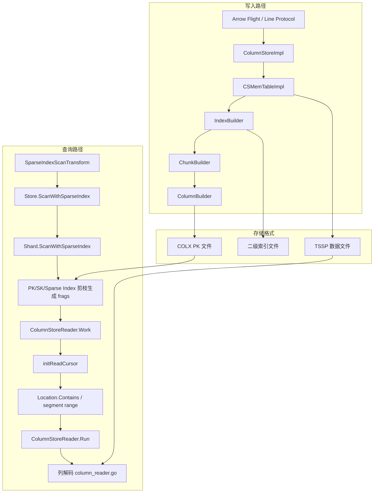

**通俗解释**：
- 写入时：数据经过 ColumnStoreImpl -> CSMemTableImpl -> IndexBuilder -> ChunkBuilder -> ColumnBuilder 逐层编码
- 存储时：PK 信息写入 COLX 文件，数据写入 TSSP 文件，索引单独存储
- 查询时：端到端 sparse index scan 先在 Store/Shard 侧生成 fragment 结果；`ColumnStoreReader.Work()` / `Run()` 消费这些 frags，并在 `initReadCursor` 中通过 `Location.Contains` 和 segment range 映射定位数据。PK/SK/Sparse Index 是 Reader 前置剪枝组件，不是 Reader 内部的顶层入口。

---

## 2. 整体架构

### 2.1 组件总览

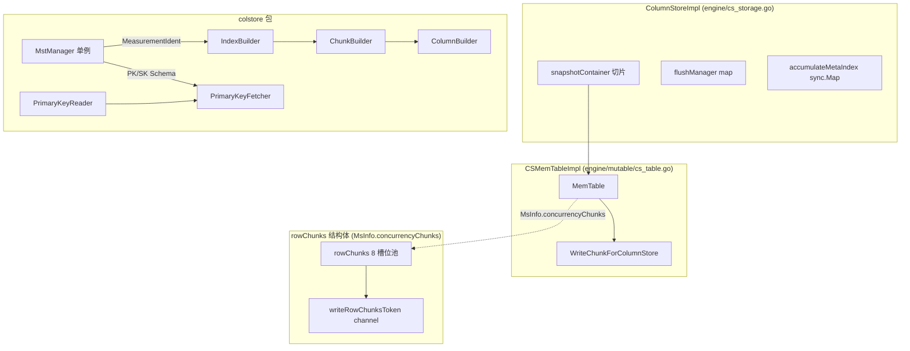

### 2.2 核心结构体关系

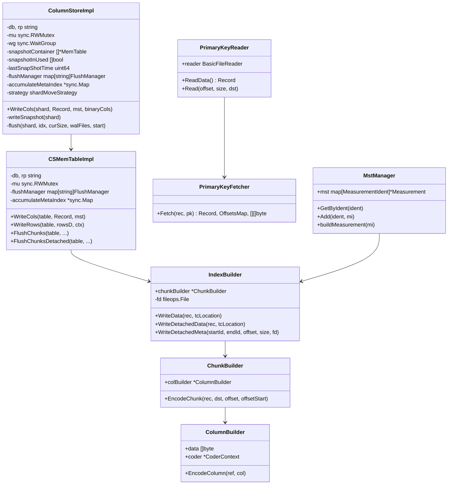

**通俗解释**：
- `ColumnStoreImpl` 是列存引擎的顶层控制器，管理快照和刷盘
- `CSMemTableImpl` 是内存表实现，管理并发写入和数据合并
- `IndexBuilder` 负责构建 PK 索引，内部使用 `ChunkBuilder` 编码数据块
- `ChunkBuilder` 逐列调用 `ColumnBuilder` 编码
- `MstManager` 是全局单例，管理所有 measurement 的元数据

---

## 3. ColumnStoreImpl 写入路径

### 3.1 WriteCols 入口

**源码文件**：`engine/cs_storage.go`

```go
// 第 192 行：列存写入主入口
func (storage *ColumnStoreImpl) WriteCols(s *shard, cols *record.Record,
    mst string, binaryCols []byte) error {

    // 第 193 行：空值检查
    if cols == nil {
        return errors.New("write rec can not be nil")
    }

    // 第 196-200 行：WaitGroup 保护，确保写入期间 shard 不被关闭
    s.wg.Add(1)
    s.writeWg.Add(1)
    defer func() {
        s.wg.Done()
        s.writeWg.Done()
    }()

    // 第 203-215 行：只读检查（降采样 shard 禁止写入）
    if s.ident.ReadOnly {
        err := errors.New("can not write cols to downSampled shard")
        log.Error("write into shard failed", zap.Error(err))
        if !getDownSampleWriteDrop() {
            return fmt.Errorf("shard is readonly and drop is disabled: %w", err)
        }
        // ... 冷写入检查
        return nil
    }

    // 第 217 行：更新最后写入时间
    atomic.StoreUint64(&s.lastWriteTime, fasttime.UnixTimestamp())

    // 第 218 行：获取写入上下文（带超时）
    mw := getMstWriteRecordCtx(nodeMutableLimit.timeOut, s.engineType)
    defer putMstWriteRecordCtx(mw)

    // 第 222-227 行：分配内存资源（限流）
    start := time.Now()
    curSize := int64(cols.Size())
    err := nodeMutableLimit.allocResource(curSize, mw.timer)
    if err != nil {
        s.log.Info("Alloc resource failed, need retry", ...)
        return fmt.Errorf("failed to allocate mutable resource: %w", err)
    }

    // 第 231-239 行：异步写入索引
    var indexErr error
    var indexWg sync.WaitGroup
    indexWg.Add(1)
    go func() {
        writeIndexStart := time.Now()
        indexErr = storage.WriteIndexForCols(s, cols, mst)
        indexWg.Done()
        atomic.AddInt64(&statistics.PerfStat.WriteIndexDurationNs, ...)
    }()

    // 第 243 行：同步写入数据和 WAL
    err = s.writeCols(cols, binaryCols, mst)

    // 第 244 行：等待索引写入完成
    indexWg.Wait()

    if err != nil {
        return fmt.Errorf("failed to write cols: %w", err)
    }

    // 第 248 行：累加内存使用量
    s.activeTbl.AddMemSize(curSize)
    return indexErr
}
```

**逐行解释**：
- **第 192 行**：`WriteCols` 是列存写入的总入口，接收 `record.Record`（列式数据）。`binaryCols` 参数用于 Arrow Flight 路径传递预编码的二进制列数据（如某些列已由客户端完成编码），在 `shard.writeCols` 中传递给 WAL 持久化（`s.wal.Write(binaryCols, WriteWalArrowFlight, 0)`），用于崩溃恢复；`binaryCols` 不会传递给 CSMemTableImpl，内存表写入仅使用解码后的 `record.Record`。
- **第 196-200 行**：使用 `WaitGroup` 确保写入期间 shard 不会被强制关闭
- **第 203-215 行**：降采样 shard 标记为只读，禁止直接写入
- **第 218 行**：`getMstWriteRecordCtx` 从对象池获取写入上下文，带超时计时器
- **第 222-227 行**：`allocResource` 是内存限流机制，防止内存溢出
- **第 231-239 行**：索引写入在独立 goroutine 中异步执行，与数据写入并行
- **第 243 行**：数据写入是同步的，必须在当前 goroutine 完成
- **第 248 行**：写入成功后累加内存使用量，用于后续快照决策

**具体例子**：

写入一条列存记录的完整流程：

```
Step 1: WriteCols 接收 Record
  → Record {
      Schema: [{Name: "cpu", Type: Float}, {Name: "host", Type: String}, {Name: "time", Type: Int}],
      ColVals: [ColVal(cpu数据), ColVal(host数据), ColVal(time数据)],
      RowNums: 100
    }

Step 2: 内存限流
  → curSize = Record.Size() = 1024 bytes
  → nodeMutableLimit.allocResource(1024, timer) → 等待或成功

Step 3: 并行执行
  → goroutine: WriteIndexForCols → 构建 PK 索引
  → 主协程: writeCols → 写入 CSMemTableImpl

Step 4: 等待完成
  → indexWg.Wait() → 确保索引写入完成
  → activeTbl.AddMemSize(1024) → 更新内存统计
```

### 3.2 writeSnapshot 快照流程

```go
// 第 65 行：快照写入
func (storage *ColumnStoreImpl) writeSnapshot(s *shard) {
    // 第 66-68 行：重置 Raft 标志
    if s.SnapShotter != nil {
        atomic.StoreUint32(&s.SnapShotter.RaftFlag, 0)
    }

    // 第 69 行：获取快照锁
    s.snapshotLock.Lock()

    // 第 70-73 行：检查活跃表是否存在
    if s.activeTbl == nil {
        s.snapshotLock.Unlock()
        return
    }

    // 第 74-78 行：切换 WAL（获取旧 WAL 文件列表）
    walFiles, err := s.wal.Switch()
    if err != nil {
        s.snapshotLock.Unlock()
        panic("wal switch failed")
    }

    // 第 80-84 行：获取空闲快照槽位
    idx := storage.getFreeSnapShotTbl()
    if idx == -1 {
        s.snapshotLock.Unlock()
        panic("error: there is not free snapShotTbl")
    }

    // 第 86-88 行：设置刷盘管理器，交换 MemTable
    s.activeTbl.MTable.SetFlushManagerInfo(storage.flushManager,
        storage.accumulateMetaIndex)
    storage.snapshotContainer[idx] = s.activeTbl
    storage.snapshotInUsed[idx] = true

    // 第 89-95 行：创建新的 CSMemTableImpl 替换活跃表
    curSize := storage.snapshotContainer[idx].GetMemSize()
    tbl := s.memTablePool.Get(s.engineType)
    tbl.MTable = mutable.NewCSMemTableImpl(storage.db, storage.rp)
    s.activeTbl = tbl
    s.activeTbl.SetIdx(s.skIdx)
    s.snapshotLock.Unlock()

    // 第 97-101 行：通知 Raft 快照完成
    atomic.StoreUint64(&storage.lastSnapShotTime, fasttime.UnixTimestamp())
    if s.SnapShotter != nil {
        s.SnapShotter.RaftFlushC <- true
        atomic.StoreUint32(&s.SnapShotter.RaftFlag, 1)
    }

    // 第 103-111 行：异步刷盘
    start := time.Now()
    s.indexBuilder.Flush()
    storage.wg.Add(1)
    go func() {
        defer storage.wg.Done()
        storage.flush(s, idx, curSize, walFiles, start)
    }()
}
```

**通俗解释**：
1. **切换 WAL**：获取旧 WAL 文件列表，后续清理
2. **获取快照槽位**：`snapshotContainer` 有固定数量的槽位，最多同时支持 N 个快照
3. **交换 MemTable**：将当前活跃表放入快照槽位，创建新的 CSMemTableImpl 替换
4. **异步刷盘**：在独立 goroutine 中将快照数据写入磁盘

**Mermaid 时序图**：

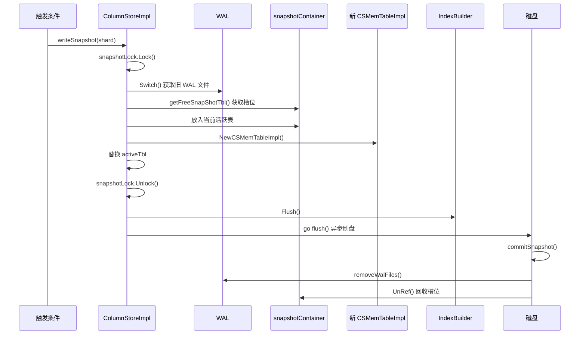

### 3.3 writeCols 内部实现

```go
// 第 252 行：内部写入方法
func (storage *ColumnStoreImpl) writeCols(s *shard, cols *record.Record,
    binaryCols []byte, mst string) error {

    // 第 254-256 行：更新行数统计
    storage.mu.Lock()
    mutable.UpdateMstRowCount(s.msRowCount, mst, int64(cols.RowNums()))
    storage.mu.Unlock()

    // 第 257 行：先写入 CSMemTableImpl
    if err := s.activeTbl.MTable.WriteCols(s.activeTbl, cols, mst); err != nil {
        return err
    }

    // 第 260 行：Arrow Flight 路径再写 WAL，用于崩溃恢复
    return s.wal.Write(binaryCols, WriteWalArrowFlight, 0)
}
```

**逐行解释**：
- **第 254-256 行**：使用互斥锁保护行数统计更新，避免并发竞争
- **第 257 行**：先委托给 `CSMemTableImpl.WriteCols` 写入列存 MemTable，保证查询可见的内存结构先完成
- **第 260 行**：随后写 Arrow Flight WAL。`binaryCols` 只用于 WAL 持久化和崩溃恢复，不传给 `CSMemTableImpl`

**流程图**：

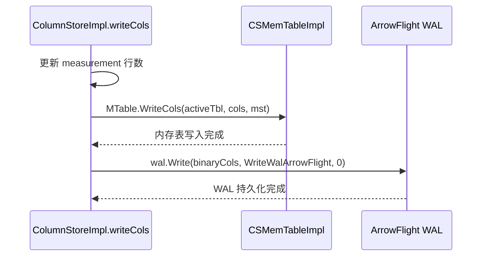

**具体例子**：

```text
Arrow Flight 写入 cpu 100 行:
  1. WriteCols 收到解码后的 record.Record 和原始 binaryCols
  2. writeCols 先把 record.Record 追加到 CSMemTableImpl
  3. 再把 binaryCols 写入 WAL，崩溃恢复时直接回放 ArrowFlight WAL
  4. binaryCols 不参与 MemTable 写入，避免重复解码路径混淆
```

---

## 4. CSMemTableImpl 并发控制

### 4.1 8 槽位并发池

**源码文件**：`engine/mutable/cs_table.go`

```go
// 第 43 行：默认并发写入槽数
const defaultWriteRecNum = 8
```

**通俗解释**：`defaultWriteRecNum = 8` 意味着每个 measurement 最多支持 8 个并发写入协程同时操作不同的 WriteChunk。这是通过 channel 信号量实现的。

### 4.2 WriteCols Arrow Flight 路径

```go
// 第 473 行：Arrow Flight 写入入口
func (c *CSMemTableImpl) WriteCols(table *MemTable, rec *record.Record,
    mst string) error {

    // 第 474-475 行：字符串驻留，减少内存分配
    start := time.Now()
    mst = stringinterner.InternSafe(mst)

    // 第 476 行：获取或创建 MsInfo
    msInfo := table.CreateMsInfo(mst, nil, rec)
    atomic.AddInt64(&Statistics.PerfStat.WriteGetMstInfoNs, ...)

    // 第 479-483 行：从 MstManager 获取 measurement 元数据
    mi, ok := colstore.MstManagerIns().Get(c.db, c.rp, mst)
    if !ok {
        logger.GetLogger().Info("mstInfo is nil", ...)
        return errors.New("measurement info is not found")
    }

    // 第 485-486 行：创建 WriteChunkForColumnStore
    start = time.Now()
    msInfo.CreateWriteChunkForColumnStore(mi.ColStoreInfo().SortKey)

    // 第 487-488 行：加锁保护写入
    msInfo.writeChunk.Mu.Lock()
    defer msInfo.writeChunk.Mu.Unlock()

    // 第 489 行：追加记录
    c.appendRec(msInfo, rec, &msInfo.writeChunk.WriteRec)
    atomic.AddInt64(&Statistics.PerfStat.WriteMstInfoNs, ...)

    return nil
}
```

**逐行解释**：
- **第 475 行**：`stringinterner.InternSafe` 对 measurement 名称做字符串驻留，相同字符串只存储一份
- **第 476 行**：`CreateMsInfo` 在 `msInfoMap` 中查找或创建 MsInfo 条目
- **第 487 行**：对 `writeChunk` 加互斥锁，保证单个 measurement 的并发安全

### 4.3 WriteRows Line Protocol 路径

```go
// 第 324 行：Line Protocol 写入入口
func (c *CSMemTableImpl) WriteRows(table *MemTable, rowsD *dictpool.Dict,
    ctx WriteRowsCtx) error {

    for _, mapp := range rowsD.D {
        rows, ok := mapp.Value.(*[]influx.Row)
        msName := stringinterner.InternSafe(mapp.Key)

        // 第 340-341 行：获取 MsInfo
        msInfo := table.CreateMsInfo(msName, &rs[0], nil)

        // 第 345-349 行：获取 measurement 元数据
        ident.SetName(msName)
        mstInfo, ok := colstore.MstManagerIns().GetByIdent(ident)

        // 第 351 行：创建并发写入槽
        createRowChunks(msInfo, mstInfo.ColStoreInfo().SortKey)

        // 第 352 行：获取写入令牌（channel 信号量，最多 8 个）
        msInfo.concurrencyChunks.writeRowChunksToken <- struct{}{}

        // 第 354 行：获取空闲 WriteChunk
        writeChunk, idx = getFreeWriteChunk(msInfo)

        // 第 355-360 行：追加字段数据
        for index := range rs {
            _, err = c.appendFields(table, writeChunk, rs[index].Timestamp,
                rs[index].Fields, rs[index].Tags)
        }

        // 第 369-370 行：释放写入令牌
        msInfo.concurrencyChunks.rowChunksStatus[idx] = 0
        <-msInfo.concurrencyChunks.writeRowChunksToken
    }
    return err
}
```

**Mermaid 并发控制流程图**：

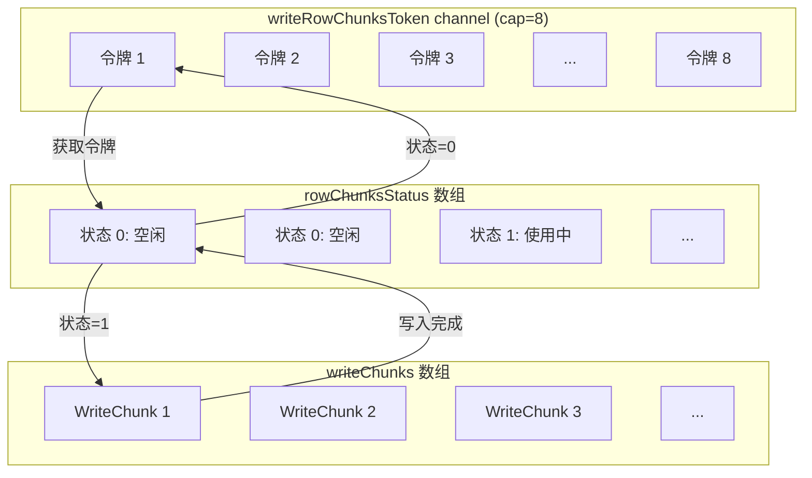

**通俗解释**：
- `writeRowChunksToken` 是一个容量为 8 的 channel，充当信号量
- 每个写入协程必须先获取令牌才能写入，超过 8 个协程会阻塞等待
- `getFreeWriteChunk` 遍历 `rowChunksStatus` 找到空闲槽位（状态为 0）
- 写入完成后将状态重置为 0，并从 channel 取出令牌释放

### 4.4 MergeSchema Schema 合并（包级函数）

> 注意：`MergeSchema` 和 `JoinWriteRec` 均为 `mutable` 包的包级函数（无接收者），而非 `CSMemTableImpl` 的方法。

```go
// 第 280 行：合并多个写入槽的 Schema
func MergeSchema(table *MemTable, msName string) {
    // 第 282-284 行：Arrow Flight 路径直接返回（Schema 已固定）
    if table.msInfoMap[msName].writeChunk.WriteRec.rec != nil {
        return
    }

    // 第 286-298 行：检查是否有 Schema 变化
    schemaMap := dictpool.Dict{}
    concurrencyChunks := table.msInfoMap[msName].concurrencyChunks
    schemaChanged := false
    for i := 0; i < len(concurrencyChunks.writeChunks) &&
        concurrencyChunks.writeChunks[i] != nil; i++ {
        if concurrencyChunks.writeChunks[i].sameSchema {
            continue
        }
        schemaChanged = true
        for j := range table.msInfoMap[msName].Schema {
            schemaMap.Set(table.msInfoMap[msName].Schema[j].Name, struct{}{})
        }
        break
    }

    // 第 300-301 行：没有变化则直接返回
    if !schemaChanged {
        return
    }

    // 第 304-318 行：收集所有新字段
    schema := table.msInfoMap[msName].Schema[:len(table.msInfoMap[msName].Schema)-1]
    for i := 0; i < len(concurrencyChunks.writeChunks) &&
        concurrencyChunks.writeChunks[i] != nil; i++ {
        if concurrencyChunks.writeChunks[i].sameSchema {
            continue
        }
        s := concurrencyChunks.writeChunks[i].WriteRec.rec.Schema
        for j := 0; j < len(s); j++ {
            if !schemaMap.Has(s[j].Name) {
                ref := record.Field{Name: s[j].Name, Type: s[j].Type}
                schemaMap.Set(s[j].Name, struct{}{})
                schema = append(schema, ref)
            }
        }
    }

    // 第 319-321 行：排序并添加时间列
    sort.Sort(schema)
    schema = append(schema, record.Field{
        Name: record.TimeField, Type: influx.Field_Type_Int})
    table.msInfoMap[msName].Schema = schema
}
```

**具体例子**：

假设两个并发写入协程分别写入不同 Schema 的数据：

```
协程 1: cpu,host=server1 value=99.5 1234567890
  → Schema: [{Name: "value", Type: Float}, {Name: "time", Type: Int}]

协程 2: cpu,host=server1 value=88.3,load=0.5 1234567891
  → Schema: [{Name: "value", Type: Float}, {Name: "load", Type: Float}, {Name: "time", Type: Int}]

MergeSchema 结果:
  → Schema: [{Name: "load", Type: Float}, {Name: "value", Type: Float}, {Name: "time", Type: Int}]
```

### 4.5 JoinWriteRec 记录合并

```go
// 第 560 行：合并多个写入槽的 Record
func JoinWriteRec(table *MemTable, msName string) {
    // 第 562-564 行：Arrow Flight 路径直接返回
    if table.msInfoMap[msName].writeChunk.WriteRec.rec != nil {
        return
    }

    // 第 567-576 行：将所有写入槽的 Record 合并到主 writeChunk
    var rec *record.Record
    table.msInfoMap[msName].writeChunk.WriteRec.initForReuse(
        table.msInfoMap[msName].Schema)
    writeChunk := table.msInfoMap[msName].writeChunk
    rks := table.msInfoMap[msName].concurrencyChunks
    for i := 0; i < len(rks.writeChunks) && rks.writeChunks[i] != nil; i++ {
        rec = rks.writeChunks[i].WriteRec.rec
        if rec != nil {
            writeChunk.WriteRec.rec.AppendRec(rec, 0, rec.RowNums())
        }
    }
    table.msInfoMap[msName].writeChunk = writeChunk
}
```

**通俗解释**：
- `JoinWriteRec` 在刷盘前调用，将 8 个并发写入槽的数据合并到主 `writeChunk`
- 合并顺序按照槽位索引，保证数据时序一致性
- 合并后所有数据都在一个 Record 中，便于后续编码

### 4.6 padCol Schema 演进

```go
// 第 506 行：Schema 演进填充
func padCol(rec *record.Record, writeRec *WriteRec, idx []int) {
    oldRowNum, oldColNum := writeRec.rec.RowNums(), writeRec.rec.ColNums()

    // 第 508 行：扩展 Schema 和 ColVal
    writeRec.rec.ReserveSchemaAndColVal(len(idx))

    // 第 509-513 行：为新列填充空值
    for i := 0; i < len(idx); i++ {
        writeRec.rec.Schema[oldColNum+i].Name = stringinterner.InternSafe(
            rec.Schema[idx[i]].Name)
        writeRec.rec.Schema[oldColNum+i].Type = rec.Schema[idx[i]].Type
        writeRec.rec.ColVals[oldColNum+i].PadColVal(
            rec.Schema[idx[i]].Type, oldRowNum)
    }

    // 第 514 行：重新排序 Schema
    sort.Sort(writeRec.rec)
}
```

**具体例子**：

```
已有 Record: Schema=[cpu:Float, time:Int], 100 行
新 Record:   Schema=[cpu:Float, mem:Float, time:Int], 1 行

padCol 执行过程:
  1. idx = [1] (mem 是新列)
  2. oldRowNum = 100, oldColNum = 2
  3. ReserveSchemaAndColVal(1) → 扩展 1 列
  4. ColVals[2].PadColVal(Float, 100) → 填充 100 个 NULL/零值
  5. sort.Sort → 重排为 [cpu:Float, mem:Float, time:Int]
```

---

## 5. ChunkBuilder 编码

### 5.1 EncodeChunk 整体编码

**源码文件**：`engine/immutable/colstore/chunk_builder.go`

```go
// 第 28 行：ChunkBuilder 结构体
type ChunkBuilder struct {
    chunk      []byte
    log        *Log.Logger
    colBuilder *ColumnBuilder
}

// 第 43 行：编码整个 Chunk
func (b *ChunkBuilder) EncodeChunk(rec *record.Record, dst []byte,
    offset []byte, offsetStart uint32) ([]byte, error) {

    b.reset(dst)

    var err error
    var ref *record.Field
    var col *record.ColVal

    // 第 50 行：遍历所有列
    for i := range rec.Schema[:len(rec.Schema)] {
        ref = &rec.Schema[i]
        col = rec.Column(i)

        // 第 53-55 行：局部 nil 校验；列存整体 NULL 由 bitmap / nil 标记表达
        if col.NilCount != 0 {
            return nil, errors.New("not support for column with nil value")
        }

        // 第 56 行：记录当前列在 chunk 中的起始位置
        pos := len(b.chunk)

        // 第 57 行：写入列偏移量到 offset 数组
        numberenc.MarshalUint32Copy(
            offset[i*util.Uint32SizeBytes:(i+1)*util.Uint32SizeBytes],
            offsetStart+uint32(pos))

        // 第 58 行：写入 CRC32 校验和
        b.chunk = numberenc.MarshalUint32Append(b.chunk,
            crc32.ChecksumIEEE(col.Val))

        // 第 59-63 行：调用 ColumnBuilder 编码列数据
        b.colBuilder.set(b.chunk)
        if b.chunk, err = b.colBuilder.EncodeColumn(ref, col); err != nil {
            b.log.Error("encode column fail", zap.Error(err))
            return nil, err
        }
    }

    return b.chunk, nil
}
```

**逐行解释**：
- **第 53-55 行**：这里描述的是 `engine/immutable/colstore/chunk_builder.go` 的历史/局部校验逻辑；列存整体并不是“不支持 NULL”。NULL 通过 `record.ColVal` 的 nil bitmap / nil 标记保存，PK 文件还会在 `FetchKeyAtRow` 中写入 `nil_indicator`
- **第 57 行**：`offset` 数组记录每列在 chunk 中的起始偏移，用于后续随机访问
- **第 58 行**：每列数据前附加 CRC32 校验和，用于数据完整性验证
- **第 59-63 行**：调用 `ColumnBuilder.EncodeColumn` 编码单列数据

**Chunk 内存布局**：

```
+-------------------+-------------------+-------------------+
| Column 0          | Column 1          | Column 2          |
+-------------------+-------------------+-------------------+
| CRC32 (4 bytes)   | CRC32 (4 bytes)   | CRC32 (4 bytes)   |
| TypeTag (1 byte)  | TypeTag (1 byte)  | TypeTag (1 byte)  |
| Encoded Data...   | Encoded Data...   | Encoded Data...   |
+-------------------+-------------------+-------------------+

offset[] = [0, 45, 89, ...]  // 每列的起始偏移
```

**具体例子**：

编码一个包含 3 列的 Record：

```
Record {
  Schema: [{Name: "cpu", Type: Float}, {Name: "host", Type: String}, {Name: "time", Type: Int}],
  ColVals: [ColVal(3 个浮点数), ColVal(3 个字符串), ColVal(3 个时间戳)]
}

编码过程:
  1. i=0 (cpu:Float)
     - pos = 0
     - offset[0] = offsetStart + 0
     - chunk += CRC32(col.Val)
     - chunk += ColumnBuilder.EncodeColumn → BlockFloat64 tag + 编码数据

  2. i=1 (host:String)
     - pos = len(chunk) = 45
     - offset[1] = offsetStart + 45
     - chunk += CRC32(col.Val)
     - chunk += ColumnBuilder.EncodeColumn → BlockString tag + 编码数据

  3. i=2 (time:Int)
     - pos = len(chunk) = 89
     - offset[2] = offsetStart + 89
     - chunk += CRC32(col.Val)
     - chunk += ColumnBuilder.EncodeColumn → BlockInteger tag + 编码数据
```

---

## 6. ColumnBuilder 编码

### 6.1 类型分发编码

**源码文件**：`engine/immutable/colstore/column_builder.go`

```go
// 第 26 行：ColumnBuilder 结构体
type ColumnBuilder struct {
    data  []byte
    log   *Log.Logger
    coder *encoding.CoderContext
}

// 第 97 行：根据类型分发编码
func (b *ColumnBuilder) EncodeColumn(ref *record.Field,
    col *record.ColVal) ([]byte, error) {

    var err error

    // 第 101-114 行：类型分发
    switch ref.Type {
    case influx.Field_Type_Int:
        err = b.encIntegerColumn(col)
    case influx.Field_Type_Float:
        err = b.encFloatColumn(col)
    case influx.Field_Type_String:
        err = b.encStringColumn(col)
    case influx.Field_Type_Boolean:
        err = b.encBooleanColumn(col)
    case influx.Field_Type_Tag:
        err = b.encTagColumn(col)
    default:
        return nil, fmt.Errorf("invalid column type %v", ref.Type)
    }

    if err != nil {
        return nil, err
    }
    return b.data, nil
}
```

**逐行解释**：
- **第 101-114 行**：根据 `ref.Type` 类型标记分发到对应的编码方法
- 每种类型的编码方法都会先写入 1 字节的类型标记（TypeTag），再写入编码后的数据

### 6.2 各类型编码实现

```go
// 第 37 行：整数列编码
func (b *ColumnBuilder) encIntegerColumn(col *record.ColVal) error {
    b.data = append(b.data, encoding.BlockInteger)  // 1 字节类型标记
    var err error
    b.data, err = encoding.EncodeIntegerBlock(col.Val, b.data, b.coder)
    return err
}

// 第 49 行：浮点数列编码
func (b *ColumnBuilder) encFloatColumn(col *record.ColVal) error {
    b.data = append(b.data, encoding.BlockFloat64)  // 1 字节类型标记
    var err error
    b.data, err = encoding.EncodeFloatBlock(col.Val, b.data, b.coder)
    return err
}

// 第 61 行：字符串列编码
func (b *ColumnBuilder) encStringColumn(col *record.ColVal) error {
    b.data = append(b.data, encoding.BlockString)  // 1 字节类型标记
    var err error
    b.data, err = encoding.EncodeStringBlock(col.Val, col.Offset, b.data, b.coder)
    return err
}

// 第 73 行：Tag 列编码（与字符串相同格式）
func (b *ColumnBuilder) encTagColumn(col *record.ColVal) error {
    b.data = append(b.data, encoding.BlockTag)  // 1 字节类型标记
    var err error
    b.data, err = encoding.EncodeStringBlock(col.Val, col.Offset, b.data, b.coder)
    return err
}

// 第 85 行：布尔列编码
func (b *ColumnBuilder) encBooleanColumn(col *record.ColVal) error {
    b.data = append(b.data, encoding.BlockBoolean)  // 1 字节类型标记
    var err error
    b.data, err = encoding.EncodeBooleanBlock(col.Val, b.data, b.coder)
    return err
}
```

**类型标记常量**：

```go
// encoding 包中定义（别名于 influx.Field_Type_*）
BlockInteger  = 1  // 整数（byte(influx.Field_Type_Int)）
BlockFloat64  = 3  // 浮点数（byte(influx.Field_Type_Float)）
BlockString   = 4  // 字符串（byte(influx.Field_Type_String)）
BlockBoolean  = 5  // 布尔（byte(influx.Field_Type_Boolean)）
BlockTag      = 6  // Tag（byte(influx.Field_Type_Tag)）
```

**列数据内存布局**：

```
+------------+---------------------+
| TypeTag    | Encoded Block Data  |
| (1 byte)   | (variable length)   |
+------------+---------------------+

整数列: [0x01] [delta-of-delta 编码的时间序列]
浮点列: [0x03] [XOR 编码的浮点序列]
字符串列: [0x04] [offset 数组 + 字符串数据]
布尔列: [0x05] [位压缩的布尔序列]
Tag 列:  [0x06] [offset 数组 + 字符串数据]
```

---

## 7. 列解码

### 7.1 解码分发表

**源码文件**：`engine/immutable/colstore/column_reader.go`

```go
// 第 77 行：解码函数分发表
var decFuncs = make(map[int]func(encData []byte, col *record.ColVal,
    coder *encoding.CoderContext) error, 4)

// 第 79 行：初始化解码函数
func InitDecFunctions() {
    decFuncs[influx.Field_Type_Int]     = appendIntegerColumn
    decFuncs[influx.Field_Type_Float]   = appendFloatColumn
    decFuncs[influx.Field_Type_Boolean] = appendBooleanColumn
    decFuncs[influx.Field_Type_String]  = appendStringColumn
    decFuncs[influx.Field_Type_Tag]     = appendStringColumn
}
```

**通俗解释**：`decFuncs` 是一个全局的解码函数映射表，根据列类型查找对应的解码函数。`InitDecFunctions` 在 `init()` 中调用，确保程序启动时就注册好所有解码函数。

### 7.2 各类型解码实现

```go
// 第 25 行：整数列解码
func appendIntegerColumn(encData []byte, col *record.ColVal,
    coder *encoding.CoderContext) error {
    col.Init()
    if len(encData) != 0 {
        values, err := encoding.DecodeIntegerBlock(encData, &col.Val, coder)
        if err != nil {
            return err
        }
        col.Len += len(values)
    }
    return nil
}

// 第 38 行：浮点列解码
func appendFloatColumn(encData []byte, col *record.ColVal,
    coder *encoding.CoderContext) error {
    col.Init()
    if len(encData) != 0 {
        values, err := encoding.DecodeFloatBlock(encData, &col.Val, coder)
        if err != nil {
            return err
        }
        col.Len += len(values)
    }
    return nil
}

// 第 51 行：布尔列解码
func appendBooleanColumn(encData []byte, col *record.ColVal,
    coder *encoding.CoderContext) error {
    col.Init()
    if len(encData) != 0 {
        values, err := encoding.DecodeBooleanBlock(encData, &col.Val, coder)
        if err != nil {
            return err
        }
        col.Len += len(values)
    }
    return nil
}

// 第 64 行：字符串列解码
func appendStringColumn(encData []byte, col *record.ColVal,
    coder *encoding.CoderContext) error {
    col.Init()
    if len(encData) != 0 {
        values, _, err := encoding.DecodeStringBlock(encData, &col.Val,
            &col.Offset, coder)
        if err != nil {
            return err
        }
        col.Len += len(values)
    }
    return nil
}
```

### 7.3 decodeColumnData 入口

```go
// 第 96 行：列数据解码入口
func decodeColumnData(ref *record.Field, data []byte, col *record.ColVal,
    coder *encoding.CoderContext) error {

    pos := 0

    // 第 98-99 行：读取 1 字节类型标记
    dataType := int(data[0])
    pos += 1

    // 第 100-102 行：验证类型匹配
    if dataType != ref.Type {
        return fmt.Errorf("type(%v) in table not eq select type(%v)",
            dataType, ref.Type)
    }

    // 第 104 行：调用对应的解码函数
    return appendColumnData(dataType, data[pos:], col, coder)
}
```

**逐行解释**：
- **第 98-99 行**：每个列数据的第一个字节是类型标记，用于验证数据类型一致性
- **第 100-102 行**：类型验证防止 Schema 不匹配导致的数据损坏
- **第 104 行**：跳过类型标记字节，将剩余数据交给具体的解码函数

**解码流程图**：

```mermaid
graph TD
    A[data 字节数组] --> B[读取 data[0] 类型标记]
    B --> C{类型验证}
    C --> |不匹配| D[返回错误]
    C --> |匹配| E[查找 decFuncs]
    E --> F{类型分发}
    F --> |Int| G[appendIntegerColumn]
    F --> |Float| H[appendFloatColumn]
    F --> |String| I[appendStringColumn]
    F --> |Boolean| J[appendBooleanColumn]
    F --> |Tag| K[appendStringColumn]
    G --> L[DecodeIntegerBlock]
    H --> M[DecodeFloatBlock]
    I --> N[DecodeStringBlock]
    J --> O[DecodeBooleanBlock]
    K --> N
```

---

## 8. PK 文件格式

### 8.1 文件布局

**源码文件**：`engine/immutable/colstore/writer.go` 和 `engine/immutable/colstore/meta.go`

```go
// writer.go 第 31-42 行：PK 文件布局注释
/*
layout for primaryKey file:

header:
  - magic number: "COLX" (4 bytes).
  - version: version of layout (4 bytes).
  - meta: total length, field name, field type, field offset, etc.

data:
  - data: col1 data, col2 data, ... colN data
  - col data: data encoded as chunk@tssp file.
*/
```

**COLX 文件二进制布局**：

```
+--------------------------------------------------+
| Header (8 bytes)                                  |
|   Magic: "COLX" (4 bytes)                        |
|   Version: uint32 (4 bytes)                       |
+--------------------------------------------------+
| Meta (variable length)                            |
|   Total Length: uint32 (4 bytes)                  |
|   Schema Size: uint32 (4 bytes)                   |
|   Row Num: uint32 (4 bytes)                       |
|   TC Location: int8 (1 byte)                      |
|   Field Name Sizes: []uint32 (N * 4 bytes)        |
|   Field Types: []uint32 (N * 4 bytes)             |
|   Data Offsets: []uint32 (N * 4 bytes)            |
|   Field Names: concatenated string                |
+--------------------------------------------------+
| Data Columns                                      |
|   Column 0: CRC32 (4) + TypeTag (1) + Encoded    |
|   Column 1: CRC32 (4) + TypeTag (1) + Encoded    |
|   ...                                             |
|   Column N: CRC32 (4) + TypeTag (1) + Encoded    |
+--------------------------------------------------+
```

### 8.2 Meta 序列化

```go
// meta.go 第 39 行：序列化 Meta
func marshalMeta(schemas *record.Schemas, rowNum int, tcLocation int8) []byte {
    sInfo := getSchemaInfo(*schemas)
    schemaByteSize := len(*schemas) * util.Uint32SizeBytes

    // 第 43 行：预分配数据偏移数组（初始为 0，编码后更新）
    dataOffset := make([]byte, schemaByteSize)

    // 第 45-46 行：计算总长度
    totalLength := util.Uint32SizeBytes*3 + util.Int8SizeBytes +
        schemaByteSize*3 + len(sInfo.fields)

    // 第 47-55 行：按顺序序列化
    meta := make([]byte, 0, totalLength)
    meta = numberenc.MarshalUint32Append(meta, uint32(totalLength))
    meta = numberenc.MarshalUint32Append(meta, uint32(len(*schemas)))
    meta = numberenc.MarshalUint32Append(meta, uint32(rowNum))
    meta = append(meta, byte(tcLocation))
    meta = append(meta, sInfo.fieldNameSize...)
    meta = append(meta, sInfo.fieldType...)
    meta = append(meta, dataOffset...)
    meta = append(meta, sInfo.fields...)
    return meta
}
```

**通俗解释**：
- `totalLength` 记录整个 Meta 块的长度，便于跳过
- `schemaSize` 记录列数
- `rowNum` 记录行数
- `tcLocation` 记录时间簇位置（用于时序优化）
- `fieldNameSize` 记录每列名称的长度，用于解析
- `fieldType` 记录每列的数据类型
- `dataOffset` 记录每列数据在文件中的偏移，初始为 0，在编码过程中更新

### 8.3 Meta 反序列化

```go
// meta.go 第 58 行：反序列化 Meta
func unmarshalMeta(meta []byte, version uint32) (record.Schemas, []uint32, int, int8) {
    // 第 59 行：跳过 totalLength
    meta = meta[util.Uint32SizeBytes:]

    // 第 60-61 行：读取 schemaSize
    schemaSize := numberenc.UnmarshalUint32(meta[0:util.Uint32SizeBytes])
    meta = meta[util.Uint32SizeBytes:]

    // 第 62-63 行：读取 rowNum
    rowNum := int(numberenc.UnmarshalUint32(meta[0:util.Uint32SizeBytes]))
    meta = meta[util.Uint32SizeBytes:]

    // 第 64-65 行：读取 tcLocation
    tcLocation := int8(meta[0])
    meta = meta[util.Int8SizeBytes:]

    // 第 66-74 行：读取 fieldNameSize, fieldType, dataOffset
    schemaByteSize := util.Uint32SizeBytes * int(schemaSize)
    fieldNameSize := make([]uint32, schemaSize)
    fieldNameSize = numberenc.UnmarshalUint32Slice(meta[:schemaByteSize], fieldNameSize)
    meta = meta[schemaByteSize:]
    fieldType := make([]uint32, schemaSize)
    fieldType = numberenc.UnmarshalUint32Slice(meta[:schemaByteSize], fieldType)
    meta = meta[schemaByteSize:]
    dataOffset := make([]uint32, schemaSize)
    dataOffset = numberenc.UnmarshalUint32Slice(meta[:schemaByteSize], dataOffset)
    meta = meta[schemaByteSize:]

    // 第 75-81 行：读取字段名称
    schemas := make(record.Schemas, schemaSize)
    for i, size := range fieldNameSize {
        schemas[i].Name = string(meta[:int(size)])
        schemas[i].Type = int(fieldType[i])
        meta = meta[int(size):]
    }

    return schemas, dataOffset, rowNum, tcLocation
}
```

### 8.4 写入限流

```go
// writer.go 第 27 行：快照写入限流器
var snapshotWriteLimiter = fileops.NewLimiter(48*1024*1024, 64*1024*1024)
```

**通俗解释**：
- `snapshotWriteLimiter` 限制快照写入速度为 **48 MB/s**（突发最大 64 MB/s）
- 使用 `fileops.NewLimitWriter` 包装文件写入器，自动限速
- 目的是防止快照刷盘时占用过多磁盘 I/O，影响正常写入

**限流实现**：

```go
// writer.go 第 50 行：创建限流写入器
func newIndexWriter(fd fileops.File, lockPath *string) fileops.FileWriter {
    lw := fileops.NewLimitWriter(fd, snapshotWriteLimiter)  // 限流包装
    w := &indexWriter{
        fd:         fd,
        fileWriter: fileops.NewFileWriter(lw, defaultWriterBufferSize, lockPath),
    }
    return w
}
```

---

## 9. IndexBuilder

### 9.1 Attached 模式

**源码文件**：`engine/immutable/colstore/index_builder.go`

```go
// 第 70 行：Attached 模式写入数据
func (b *IndexBuilder) WriteData(rec *record.Record, tcLocation int8) error {
    b.encodeChunk = b.encodeChunk[:0]

    // 第 72-77 行：首次写入，初始化 header 和 meta
    if !b.inited {
        b.inited = true
        b.encodeChunk = append(b.encodeChunk, primaryKeyMagic...)  // "COLX"
        b.encodeChunk = numberenc.MarshalUint32Append(b.encodeChunk, version)
        b.meta = marshalMeta(&rec.Schema, rec.RowNums(), tcLocation)
    }

    // 第 79-89 行：计算列偏移量在 meta 中的位置
    schemaByteSize := len(rec.Schemas()) * util.Uint32SizeBytes
    offset := b.meta[util.Uint32SizeBytes*3+util.Int8SizeBytes+schemaByteSize*2 :
        util.Uint32SizeBytes*3+util.Int8SizeBytes+schemaByteSize*3]

    // 第 91-93 行：编码数据块
    data := make([]byte, 0)
    data, err = b.chunkBuilder.EncodeChunk(rec, data, offset,
        uint32(len(b.meta)+headerSize))
    if err != nil {
        b.log.Error("encode chunk fail", zap.Error(err))
        return err
    }

    // 第 97-99 行：拼接 header + meta + data
    b.encodeChunk = append(b.encodeChunk, b.meta...)
    b.encodeChunk = append(b.encodeChunk, data...)

    // 第 101 行：写入文件
    return b.writeData()
}
```

**Attached 模式文件布局**：

```
+------------------+
| Header (8 bytes) |
| "COLX" + version |
+------------------+
| Meta (N bytes)   |
| schema, offsets  |
+------------------+
| Data Columns     |
| col0, col1, ...  |
+------------------+
```

### 9.2 Detached 模式

```go
// 第 113 行：Detached 模式写入数据
func (b *IndexBuilder) WriteDetachedData(rec *record.Record,
    tcLocation int8) error {

    b.encodeChunk = b.encodeChunk[:0]
    schemas := rec.Schemas()
    schemaByteSize := len(schemas) * util.Uint32SizeBytes

    // 第 118 行：预分配列偏移数组
    b.colsOffset = make([]byte, schemaByteSize)

    // 第 120-123 行：首次写入，初始化 header
    if !b.inited {
        b.inited = true
        b.firstFlush(schemas, tcLocation)
    }

    // 第 125-127 行：编码数据块（offset 从 0 开始）
    data := make([]byte, 0)
    data, err = b.chunkBuilder.EncodeChunk(rec, data, b.colsOffset, 0)
    if err != nil {
        b.log.Error("encode pkIndex data fail", zap.Error(err))
        return err
    }

    // 第 131-132 行：只写入数据（不含 header/meta）
    b.encodeChunk = append(b.encodeChunk, data...)
    return b.writeData()
}

// 第 103 行：首次刷盘初始化
func (b *IndexBuilder) firstFlush(schemas record.Schemas, tcLocation int8) {
    b.encodeChunk = append(b.encodeChunk, primaryKeyMagic...)
    b.encodeChunk = numberenc.MarshalUint32Append(b.encodeChunk, version)
    schemaByteSize := len(schemas) * util.Uint32SizeBytes
    b.meta = marshalDetachedMetaHeader(schemas, tcLocation, schemaByteSize)
}
```

**Detached 模式文件布局**：

```
+------------------+
| Header (8 bytes) |
| "COLX" + version |
+------------------+
| Meta Header      |
| schema info      |
+------------------+
| Data Block 1     |
| CRC + col data   |
+------------------+
| Data Block 2     |
| CRC + col data   |
+------------------+
| ...              |
+------------------+
| Meta Block       |
| block ranges     |
| col offsets      |
+------------------+
```

### 9.3 WriteDetachedMeta 写入元数据块

```go
// 第 135 行：写入 Detached 模式的 Meta 块
func (b *IndexBuilder) WriteDetachedMeta(startId, endId uint64,
    offset, size uint32, fd fileops.File) error {

    // 第 136 行：预分配 meta 空间
    b.reserveMeta()

    // 第 138 行：序列化 PK Meta 块
    b.meta = MarshalPkMetaBlock(startId, endId, offset, size,
        b.meta, b.colsOffset)

    // 第 140-143 行：关闭旧 writer
    if b.writer != nil {
        _ = b.writer.Close()
    }

    // 第 145-146 行：创建新 writer（写入到指定 fd）
    lockPath := ""
    b.writer = newIndexWriter(fd, &lockPath)

    // 第 148-161 行：写入并验证
    var num int
    var err error
    if num, err = b.writer.WriteData(b.meta); err != nil {
        return err
    }
    if num != len(b.meta) {
        return io.ErrShortWrite
    }
    return nil
}
```

**通俗解释**：
- **Attached 模式**：PK 数据和 Meta 在同一个文件中，结构简单但不灵活
- **Detached 模式**：PK 数据和 Meta 分离存储，支持按块范围索引，便于查询优化
- **WriteDetachedMeta** 将每个数据块的范围信息（startBlockId, endBlockId）和列偏移写入 Meta 块

---

## 10. PrimaryKeyFetcher

### 10.1 Fetch 提取主键

**源码文件**：`engine/immutable/colstore/pk_fetcher.go`

```go
// 第 27 行：PrimaryKeyFetcher 结构体
type PrimaryKeyFetcher struct {
    dec codec.BinaryDecoder
}

// 第 31 行：从 Record 中提取主键
func (pke *PrimaryKeyFetcher) Fetch(rec *record.Record,
    pk []record.Field) (*record.Record, *OffsetsMap, [][]byte) {

    // 第 32-33 行：初始化排序器和去重映射
    ks := &KeySorter{}
    om := NewOffsetsMap()

    // 第 36-38 行：创建 PK Record
    pkRec := &record.Record{}
    pkRec.SetSchema(pk)
    pkRec.ReserveColVal(len(pk))

    // 第 40 行：提取 PK 列数据
    pkCols := record.FetchColVals(rec, pk)

    // 第 41-48 行：遍历每一行，提取 PK 值
    var buf []byte
    for i := range rec.RowNums() {
        buf = FetchKeyAtRow(buf[:0], pkCols, pk, i)
        ok := om.Add(util.Bytes2str(buf), int64(i))
        if ok {
            // 新主键，添加到排序器
            ks.Add(buf)
            buf = buf[len(buf):]
        }
    }

    // 第 51 行：排序主键
    sort.Sort(ks)

    // 第 53-55 行：构建 PK Record
    for i := range ks.Keys {
        BuildPkRecord(&pke.dec, pkRec, ks.Keys[i])
    }

    return pkRec, om, ks.Keys
}
```

**逐行解释**：
- **第 32-33 行**：`KeySorter` 用于排序主键，`OffsetsMap` 用于去重和记录行偏移
- **第 41-48 行**：遍历 Record 的每一行，提取 PK 列的值，编码为二进制格式
- **第 43 行**：`OffsetsMap.Add` 返回 `true` 表示是新主键，需要添加到排序器
- **第 51 行**：排序后的主键用于构建有序的 PK Record

### 10.2 FetchKeyAtRow 二进制编码

```go
// 第 89 行：提取单行 PK 值并编码
func FetchKeyAtRow(dst []byte, cols []*record.ColVal,
    schema record.Schemas, rowNum int) []byte {

    for i := range schema {
        typ := schema[i].Type

        // 第 97-99 行：列不存在
        if cols[i] == nil {
            dst = append(dst, []byte{uint8(typ), 0}...)
            continue
        }

        // 第 102 行：写入类型标记
        dst = append(dst, uint8(typ))

        // 第 103 行：提取列值
        b, isNil := ColValBytesAtRow(cols[i], rowNum, typ)

        // 第 104-106 行：NULL 值标记
        if isNil {
            dst = append(dst, 0)
            continue
        }

        // 第 108 行：非 NULL 标记
        dst = append(dst, 1)

        // 第 109-113 行：编码值
        if typ == influx.Field_Type_String || typ == influx.Field_Type_Tag {
            dst = codec.AppendBytes(dst, b)  // 字符串带长度前缀
        } else {
            dst = append(dst, b...)  // 固定长度直接追加
        }
    }

    return dst
}
```

**PK 二进制编码格式**：

```
每个字段: [type_flag (1 byte)] [nil_indicator (1 byte)] [value (variable)]

type_flag:    字段类型 (Int=1, Float=3, String=4, Boolean=5, Tag=6)
nil_indicator: 0=nil, 1=非nil
value:
  - Int:     8 bytes (int64)
  - Float:   8 bytes (float64)
  - String:  [length (4 bytes)] [data (variable)]
  - Boolean: 1 byte
  - Tag:     [length (4 bytes)] [data (variable)]
```

**具体例子**：

```
PK = [{Name: "host", Type: String}, {Name: "region", Type: Tag}]
行数据: host="server1", region="us-west"

编码结果:
  [0x04] [0x01] [0x07] [s,e,r,v,e,r,1]   ← host 字段（String=4）
  [0x06] [0x01] [0x07] [u,s,-,w,e,s,t]   ← region 字段（Tag=6）
```

### 10.3 KeySorter 排序实现

```go
// 第 181 行：KeySorter 结构体
type KeySorter struct {
    desc    bool
    decI    codec.BinaryDecoder
    decJ    codec.BinaryDecoder
    Keys    [][]byte
}

// 第 205 行：比较两个 Key
func (ks *KeySorter) less(i, j int) bool {
    decI, decJ := &ks.decI, &ks.decJ
    decI.Reset(ks.Keys[i])
    decJ.Reset(ks.Keys[j])

    for {
        if decI.RemainSize() == 0 {
            break
        }

        // 第 215-216 行：读取类型标记
        flag1 := decI.Uint16()
        flag2 := decJ.Uint16()

        // 第 218-220 行：两个都是 NULL，跳过
        if flag1&1 == 0 && flag2&1 == 0 {
            continue
        }
        // 第 221-223 行：j 是 NULL，i 更大
        if flag2&1 == 0 {
            return false
        }
        // 第 224-226 行：i 是 NULL，i 更小
        if flag1&1 == 0 {
            return true
        }

        // 第 228-256 行：按类型比较值
        switch flag1 >> 8 {
        case influx.Field_Type_String, influx.Field_Type_Tag:
            s1, s2 := util.Bytes2str(decI.BytesNoCopy()),
                util.Bytes2str(decJ.BytesNoCopy())
            if s1 != s2 {
                return s1 < s2
            }
        case influx.Field_Type_Int:
            var i1, i2 int64
            util.Bytes2Value(decI.BytesNoCopyN(8), &i1)
            util.Bytes2Value(decJ.BytesNoCopyN(8), &i2)
            if i1 != i2 {
                return i1 < i2
            }
        case influx.Field_Type_Float:
            var f1, f2 float64
            util.Bytes2Value(decI.BytesNoCopyN(8), &f1)
            util.Bytes2Value(decJ.BytesNoCopyN(8), &f2)
            if f1 != f2 {
                return f1 < f2
            }
        case influx.Field_Type_Boolean:
            b1, b2 := decI.Uint8(), decJ.Uint8()
            if b1 != b2 {
                return b1 == 0
            }
        }
    }
    return false
}
```

**通俗解释**：
- `KeySorter` 实现了 `sort.Interface`，用于对主键进行字典序排序
- 排序规则：逐字段比较，NULL 值最小，非 NULL 值按类型比较
- 字符串按字典序，整数按数值序，浮点按数值序，布尔 false < true

### 10.4 OffsetKeySorter 时间段合并

```go
// 第 272 行：OffsetKeySorter 用于时间段合并
type OffsetKeySorter struct {
    KeySorter
    Times   []int64
    Offsets []int64
    segmentIndex []int  // 记录每个段的结束位置
}

// 第 307 行：追加数据并分段
func (oks *OffsetKeySorter) Append(other *OffsetKeySorter,
    maxRowPreSegment int) int {

    oks.Times = append(oks.Times, other.Times...)
    oks.Offsets = append(oks.Offsets, other.Offsets...)

    rowIdx := 0
    if len(oks.segmentIndex) > 0 {
        rowIdx = oks.segmentIndex[len(oks.segmentIndex)-1]
    }

    // 第 316-328 行：按 maxRowPreSegment 分段
    n := util.DivisionCeil(len(other.Times), maxRowPreSegment)
    segRow := len(other.Times) / n
    remain := len(other.Times) - segRow*n

    for i := range n {
        rowIdx += segRow
        if i < remain {
            rowIdx++
        }
        oks.segmentIndex = append(oks.segmentIndex, rowIdx)
    }
    return n
}

// 第 331 行：迭代每个段
func (oks *OffsetKeySorter) IteratorSegment(
    fn func([]int64, []int64) bool) {

    start := 0
    for _, end := range oks.segmentIndex {
        ok := fn(oks.Times[start:end], oks.Offsets[start:end])
        if !ok {
            return
        }
        start = end
    }
}
```

**通俗解释**：
- `OffsetKeySorter` 在 `KeySorter` 基础上增加了时间和偏移量
- 用于合并多个时间段的 PK 数据，按 `maxRowPreSegment` 分段
- 每段独立排序和索引，支持按段查询

---

## 11. PrimaryKeyReader

### 11.1 文件读取与验证

**源码文件**：`engine/immutable/colstore/reader.go`

```go
// 第 34 行：PrimaryKeyReader 结构体
type PrimaryKeyReader struct {
    inited   int32
    version  uint32
    fileSize int64
    reader   fileops.BasicFileReader
}

// 第 41-57 行：sync.Pool 复用
var fileReaderPool = sync.Pool{}

func getPrimaryKeyReader() *PrimaryKeyReader {
    v := fileReaderPool.Get()
    if v == nil {
        return &PrimaryKeyReader{}
    }
    r, ok := v.(*PrimaryKeyReader)
    if !ok {
        return &PrimaryKeyReader{}
    }
    return r
}

func putPrimaryKeyReader(r *PrimaryKeyReader) {
    r.reset()
    fileReaderPool.Put(r)
}
```

### 11.2 NewPrimaryKeyReader 创建读取器

```go
// 第 64 行：创建 PrimaryKeyReader
func NewPrimaryKeyReader(name string, lockPath *string) (*PrimaryKeyReader, error) {
    var header [headerSize]byte

    // 第 66-68 行：检查文件大小
    fi, err := fileops.Stat(name)
    if err != nil {
        return nil, err
    }
    if fi.Size() < int64(headerSize) {
        // 第 76 行：文件太小，删除并报错
        _ = fileops.Remove(name, fileops.FileLockOption(*lockPath))
        return nil, err
    }

    // 第 79-82 行：打开文件
    pri := fileops.FilePriorityOption(fileops.IO_PRIORITY_NORMAL)
    lock := fileops.FileLockOption("")
    fd, err := fileops.Open(name, lock, pri)
    if err != nil {
        return nil, err
    }

    // 第 87-90 行：创建文件读取器并读取 header
    dr := fileops.NewFileReader(fd, lockPath)
    hb := header[:]
    _, err = dr.ReadAt(0, uint32(headerSize), &hb,
        fileops.IO_PRIORITY_ULTRA_HIGH)
    if err != nil {
        _ = dr.Close()
        return nil, err
    }

    // 第 95-101 行：验证 Magic Number
    if util.Bytes2str(header[:fileMagicSize]) != primaryKeyMagic {
        _ = dr.Close()
        err = fmt.Errorf("invalid file(%v) magic: %v", name,
            util.Bytes2str(header[:fileMagicSize]))
        return nil, err
    }

    // 第 103-108 行：初始化 Reader
    r := getPrimaryKeyReader()
    r.fileSize = fi.Size()
    r.version = numberenc.UnmarshalUint32(header[fileMagicSize:])
    r.reader = dr
    atomic.StoreInt32(&r.inited, 1)

    return r, nil
}
```

**逐行解释**：
- **第 66-68 行**：先 `Stat` 获取文件大小，防止读取损坏的文件
- **第 87-90 行**：使用 `IO_PRIORITY_ULTRA_HIGH` 优先级读取 header，确保快速响应
- **第 95-101 行**：验证 Magic Number 是否为 "COLX"，不匹配则认为文件损坏
- **第 103-108 行**：从 `sync.Pool` 获取 Reader 对象复用，减少内存分配

### 11.3 ReadData 读取完整数据

```go
// 第 148 行：读取完整 PK 数据
func (r *PrimaryKeyReader) ReadData() (*record.Record, int8, error) {
    var err error
    buf := []byte{}

    // 第 151-153 行：读取整个文件
    data, err := r.Read(0, uint32(r.FileSize()), &buf)
    if err != nil {
        return nil, DefaultTCLocation, err
    }

    // 第 155 行：解析 Meta 大小
    metaSize := int(numberenc.UnmarshalUint32(
        data[headerSize : headerSize+util.Uint32SizeBytes]))

    // 第 156 行：反序列化 Meta
    schema, offset, rowNum, tcLocation := unmarshalMeta(
        data[headerSize:headerSize+metaSize], version)

    // 第 157 行：创建 Record
    dst := record.NewRecord(schema, false)

    // 第 159-162 行：解码 PK 数据（含 CRC 校验）
    _, err = decodePKData(data, dst, offset, rowNum)
    if err != nil {
        return nil, DefaultTCLocation, err
    }

    return dst, tcLocation, nil
}
```

### 11.4 decodePKData CRC 校验

```go
// meta.go 第 207 行：解码 PK 数据
func decodePKData(src []byte, rec *record.Record, colOffset []uint32,
    rowNum int) ([]byte, error) {

    var err error
    coder := encoding.NewCoderContext()

    // 第 211-229 行：逐列解码
    for i := range colOffset {
        ref := &rec.Schema[i]
        colBuilder := rec.Column(i)

        // 第 214-216 行：解码列数据（跳过 CRC 校验和）
        if i < len(colOffset)-1 {
            err = decodeColumnData(ref,
                src[colOffset[i]+crcSize:colOffset[i+1]], colBuilder, coder)
        } else {
            err = decodeColumnData(ref,
                src[colOffset[i]+crcSize:], colBuilder, coder)
        }

        colBuilder.Len = rowNum
        colBuilder.InitBitMap(rowNum)
        if err != nil {
            log.Error("decode column fail", zap.Error(err))
            return nil, err
        }

        // 第 224-228 行：CRC32 校验
        crc := crc32.ChecksumIEEE(colBuilder.Val)
        crcWritten := numberenc.UnmarshalUint32(
            src[colOffset[i] : colOffset[i]+crcSize])
        if crc != crcWritten {
            return nil, fmt.Errorf("failed to verify checksum")
        }
    }
    return src, nil
}
```

**解码流程图**：

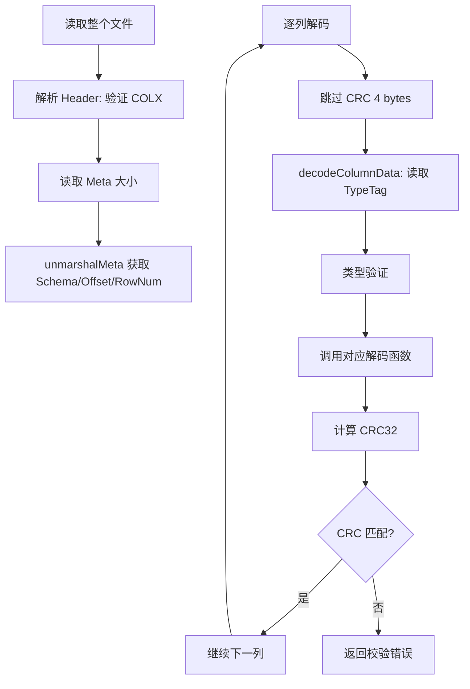

---

## 12. Measurement 元数据管理

### 12.1 MstManager 单例

**源码文件**：`engine/immutable/colstore/measurement.go`

```go
// 第 28 行：全局单例
var mstManagerIns *MstManager

func init() {
    mstManagerIns = &MstManager{
        mst: make(map[MeasurementIdent]*Measurement),
    }
}

// 第 87 行：获取单例
func MstManagerIns() *MstManager {
    return mstManagerIns
}
```

### 12.2 MeasurementIdent 标识

```go
// 第 36 行：Measurement 三元组标识
type MeasurementIdent struct {
    DB   string
    RP   string
    Name string
}

// 第 42 行：创建标识
func NewMeasurementIdent(db, rp string) MeasurementIdent {
    return MeasurementIdent{
        DB: db,
        RP: rp,
    }
}

// 第 49 行：安全设置名称（字符串驻留）
func (t *MeasurementIdent) SetSafeName(name string) {
    t.Name = stringinterner.InternSafe(name)
}

// 第 57 行：字符串表示
func (t *MeasurementIdent) String() string {
    return fmt.Sprintf("%s.%s.%s", t.DB, t.RP, t.Name)
}
```

**通俗解释**：
- `MeasurementIdent` 是 measurement 的唯一标识，由 `数据库.保留策略.名称` 三元组组成
- `SetSafeName` 使用字符串驻留，相同名称只存储一份，节省内存

### 12.3 Measurement 结构

```go
// 第 61 行：Measurement 结构体
type Measurement struct {
    mi       *meta.MeasurementInfo
    pkSchema []record.Field  // 主键 Schema
    skSchema []record.Field  // 排序键 Schema
}

// 第 67 行：获取列存配置
func (m *Measurement) ColStoreInfo() *meta.ColStoreInfo {
    return m.mi.ColStoreInfo
}

// 第 75 行：获取主键 Schema
func (m *Measurement) PrimaryKey() []record.Field {
    return m.pkSchema
}

// 第 80 行：获取排序键 Schema
func (m *Measurement) SortKey() []record.Field {
    return m.skSchema
}
```

### 12.4 buildMeasurement 构建 Measurement

```go
// 第 168 行：构建 Measurement
func (m *MstManager) buildMeasurement(mi *meta.MeasurementInfo) *Measurement {
    mi.SchemaLock.RLock()
    defer mi.SchemaLock.RUnlock()

    pk := mi.ColStoreInfo.PrimaryKey
    sk := mi.ColStoreInfo.SortKey
    mst := &Measurement{mi: mi}

    // 第 176 行：构建 PK Schema
    mst.pkSchema = m.buildKeySchema(mi.Schema, pk)

    // 第 177 行：构建 SK Schema（排除 PK 中已有的字段）
    mst.skSchema = m.buildSortKeySchema(mi.Schema, pk, sk)

    return mst
}

// 第 182 行：构建排序键 Schema
func (m *MstManager) buildSortKeySchema(schema *meta.CleanSchema,
    pk, sk []string) record.Schemas {

    // 第 183-185 行：收集 PK 字段名
    pkMap := make(map[string]struct{}, len(pk))
    for i := range pk {
        pkMap[pk[i]] = struct{}{}
    }

    // 第 187-197 行：过滤掉 PK 中已有的字段
    newSk := make([]string, 0, 1)
    hasTime := false
    for i := range sk {
        if sk[i] == record.TimeField {
            hasTime = true
        }
        if _, ok := pkMap[sk[i]]; !ok {
            newSk = append(newSk, sk[i])
        }
    }

    // 第 198-200 行：确保包含时间字段
    if !hasTime {
        newSk = append(newSk, record.TimeField)
    }

    return m.buildKeySchema(schema, newSk)
}

// 第 205 行：构建字段 Schema
func (m *MstManager) buildKeySchema(schema *meta.CleanSchema,
    keys []string) record.Schemas {

    dst := make([]record.Field, len(keys))
    for i, key := range keys {
        f := &dst[i]
        f.Name = key

        if key == record.TimeField {
            f.Type = influx.Field_Type_Int
        } else {
            v, _ := schema.GetTyp(key)
            f.Type = record.ToPrimitiveType(v)
        }
    }
    return dst
}
```

**具体例子**：

```
MeasurementInfo:
  Schema: cpu(Float), host(String), region(String), time(Int)
  PrimaryKey: [host, region]
  SortKey: [time]

构建结果:
  pkSchema: [{Name: "host", Type: String}, {Name: "region", Type: String}]
  skSchema: [{Name: "time", Type: Int}]
```

---

## 13. FlushManager 策略模式

### 13.1 策略接口

```go
// cs_table.go 第 45 行：FlushManager 接口
type FlushManager interface {
    SetDBInfo(db string, rp string)
    flushChunk(primaryKey record.Schemas, msName string,
        indexRelation *influxql.IndexRelation, tbStore immutable.TablesStore,
        chunk *WriteChunkForColumnStore, writeMs *immutable.MsBuilder,
        tcLocation int8)
    updateAccumulateMetaIndex(accumulateMetaIndex *immutable.AccumulateMetaIndex)
    getAccumulateMetaIndex() *immutable.AccumulateMetaIndex
}
```

### 13.2 writeDetached 策略

```go
// cs_table.go 第 53 行：Detached 模式刷盘
type writeDetached struct {
    accumulateMetaIndex *immutable.AccumulateMetaIndex
    firstFlush          bool
    localBFCount        int64  // 局部布隆过滤器块数
}

// 第 69 行：Detached 模式刷盘实现
func (w *writeDetached) flushChunk(pkSchema record.Schemas, msName string,
    indexRelation *influxql.IndexRelation, tbStore immutable.TablesStore,
    chunk *WriteChunkForColumnStore, writeMs *immutable.MsBuilder,
    tcLocation int8) {

    writeRec := chunk.WriteRec.GetRecord()
    w.WriteDetached(writeRec, writeMs, 0, pkSchema)
    atomic.AddInt64(&Statistics.PerfStat.FlushRowsCount,
        int64(writeRec.RowNums()))
}

// 第 76 行：Detached 写入实现
func (w *writeDetached) WriteDetached(rec *record.Record,
    msb *immutable.MsBuilder, id uint64, pkSchema record.Schemas) {

    msb.SetLocalBfCount(w.localBFCount)
    err := msb.WriteDetached(id, rec, pkSchema, w.firstFlush,
        w.accumulateMetaIndex)
    if err != nil {
        panic(err)
    }
    w.localBFCount = msb.GetLocalBfCount()
    w.firstFlush = false
}
```

### 13.3 WriteAttached 策略

```go
// attached.go 第 34 行：Attached 模式刷盘
type WriteAttached struct {
    db            string
    rp            string
    mst           string
    primaryKey    record.Schemas
    sortKey       record.Schemas
    indexRelation *influxql.IndexRelation
}

// attached.go 第 65 行：Attached 模式刷盘实现
func (w *WriteAttached) flushChunk(primaryKey record.Schemas, msName string,
    indexRelation *influxql.IndexRelation, tbStore immutable.TablesStore,
    chunk *WriteChunkForColumnStore, writeMs *immutable.MsBuilder,
    tcLocation int8) {

    writeRec := chunk.WriteRec.GetRecord()
    writeMs = w.WriteRecordForFlush(writeRec, writeMs, tbStore, 0, true,
        math.MinInt64, primaryKey, indexRelation)
    // ... 后续处理
}

// attached.go 第 115 行：刷盘记录
func (w *WriteAttached) FlushRecord(tbStore immutable.TablesStore,
    rec *record.Record) {

    err := w.flushRecord(tbStore, rec)
    if err != nil {
        logger.GetLogger().Error("failed to flush memory data to disk",
            zap.Error(err))
        panic(err)
    }
}
```

### 13.4 AccumulateMetaIndex 累积索引

```go
// cs_table.go 第 127 行：获取累积 Meta 索引
func (c *CSMemTableImpl) getAccumulateMetaIndex(name string) *immutable.AccumulateMetaIndex {
    aMetaIndex, ok := c.accumulateMetaIndex.Load(name)
    if !ok {
        return &immutable.AccumulateMetaIndex{}
    }
    return aMetaIndex.(*immutable.AccumulateMetaIndex)
}

// cs_table.go 第 135 行：更新累积 Meta 索引
func (c *CSMemTableImpl) updateAccumulateMetaIndexInfo(name string,
    index *immutable.AccumulateMetaIndex) {
    c.accumulateMetaIndex.Store(name, index)
}
```

**通俗解释**：
- `AccumulateMetaIndex` 记录每个 measurement 已刷盘的块数和偏移量
- Detached 模式下，每次刷盘都会更新 `AccumulateMetaIndex`
- 累积信息用于后续查询时快速定位数据块

### 13.5 getFlushManager 策略选择

```go
// cs_table.go 第 139 行：获取刷盘管理器
func (c *CSMemTableImpl) getFlushManager(detachedEnabled bool,
    writeMs *immutable.MsBuilder, recSchema record.Schemas,
    msName, lockPath string) FlushManager {

    // 第 141-143 行：先从缓存中查找
    c.mu.RLock()
    fManager, ok := c.flushManager[msName]
    c.mu.RUnlock()

    aMetaIndex := c.getAccumulateMetaIndex(msName)

    if !ok {
        if detachedEnabled {
            // 第 148-152 行：Detached 模式
            localBFCount := sparseindex.GetLocalBloomFilterBlockCnts(
                writeMs.Path, msName, lockPath, recSchema,
                writeMs.GetIndexBuilder().GetBfFirstSchemaIdx(),
                writeMs.GetFullTextIdx())
            fManager = &writeDetached{
                accumulateMetaIndex: aMetaIndex,
                firstFlush:          aMetaIndex.GetBlockId() == 0,
                localBFCount:        localBFCount,
            }
        } else {
            // 第 153-155 行：Attached 模式
            fManager = &WriteAttached{}
        }

        // 第 156-158 行：缓存到 flushManager map
        c.mu.Lock()
        c.flushManager[msName] = fManager
        c.mu.Unlock()
        return fManager
    }

    // 第 161 行：更新累积索引
    fManager.updateAccumulateMetaIndex(aMetaIndex)
    return fManager
}
```

**策略选择流程图**：

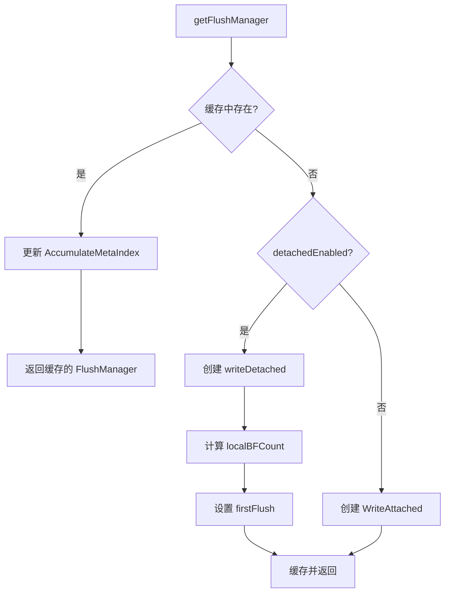

---

## 14. 查询路径

列存引擎的查询路径从 `ColumnStoreReader.Work()` 开始，经过游标初始化、Schema 构建、数据读取、时间/字段过滤，最终将结果转换为 Chunk 输出。本节逐层拆解整个查询流水线。

### 14.1 ColumnStoreReader 查询入口

`Work()` 方法是列存查询的总入口，执行三步初始化后进入 `Run()` 主循环：

1. `initReadCursor` — 构建 Location 游标，定位到目标 TSSP 文件和 Segment 范围
2. `initSchemaAndPool` — 构建输入/输出 Schema 映射、过滤条件、对象池
3. `Run` — 循环读取数据、过滤、转换并发送 Chunk

**源码文件**：`engine/column_store_reader.go`

```go
// 第 380-432 行：Work 方法 — 列存查询总入口
func (r *ColumnStoreReader) Work(ctx context.Context) error {
    ctxValue := ctx.Value(query.QueryDurationKey)
    if ctxValue != nil {
        qDuration, ok := ctxValue.(*statistics.StoreSlowQueryStatistics)
        if !ok {
            return errno.NewError(errno.InvalidQueryStat)
        }
        if qDuration != nil {
            start := time.Now()
            defer func() {
                qDuration.AddChunkReaderCount(1)
                qDuration.AddDuration("ColumnStoreReader", time.Since(start).Nanoseconds())
            }()
        }
    }

    statistics.ExecutorStat.SourceWidth.Push(int64(r.output.RowDataType.NumColumn()))

    var err error
    var iterCount, rowCountBeforeFilter, rowCountAfterFilter, fragCountBeforeFilter, fragCountAfterFilter int

    r.initSpan()

    tracing.StartPP(r.initReaderSpan)
    err = r.initReadCursor(ctx)       // Step 1: 构建 Location 游标
    if err != nil {
        return err
    }
    err = r.initSchemaAndPool()       // Step 2: 构建 Schema 和对象池
    if err != nil {
        return err
    }
    fragCountBeforeFilter = r.FragmentCount()
    fragCountAfterFilter = r.readCursor.FragmentCount()
    tracing.EndPP(r.initReaderSpan)

    defer func() {
        if r.span != nil {
            rowCountBeforeFilter = r.readCursor.RowCount()
            r.span.SetNameValue(fmt.Sprintf("frag_count_bf=%d", fragCountBeforeFilter))
            r.span.SetNameValue(fmt.Sprintf("frag_count_af=%d", fragCountAfterFilter))
            r.span.SetNameValue(fmt.Sprintf("row_count_bf=%d", rowCountBeforeFilter))
            r.span.SetNameValue(fmt.Sprintf("row_count_af=%d", rowCountAfterFilter))
            r.span.SetNameValue(fmt.Sprintf("iter_count=%d", iterCount))
            tracing.Finish(r.span, r.initReaderSpan, r.readSpan, r.filterSpan, r.recToChunkSpan, r.outputSpan)
        }
        r.Close()
    }()

    tracing.StartPP(r.span)
    iterCount, rowCountAfterFilter, err = r.Run(ctx)  // Step 3: 进入主循环
    tracing.EndPP(r.span)
    return err
}
```

**逐行解释**：

| 行号 | 代码 | 说明 |
|------|------|------|
| 381-394 | `ctxValue := ctx.Value(...)` | 从 Context 获取慢查询统计对象，记录 Chunk 读取耗时 |
| 396 | `statistics.ExecutorStat.SourceWidth.Push(...)` | 上报源数据宽度（列数） |
| 401 | `r.initSpan()` | 初始化 tracing span 用于性能追踪 |
| 403-407 | `tracing.StartPP / initReadCursor` | **Step 1**：构建 Location 游标，定位目标文件和 Segment |
| 408-411 | `initSchemaAndPool` | **Step 2**：构建输入/输出 Schema、过滤条件、对象池 |
| 412-413 | `FragmentCount()` | 记录过滤前后的 Fragment 数量，用于性能分析 |
| 416-427 | `defer func()` | 查询结束后上报统计信息并关闭资源 |
| 429-431 | `r.Run(ctx)` | **Step 3**：进入主循环，读取→过滤→输出 |

---

**`initReadCursor` 方法**：遍历所有 Fragment 文件，为每个文件创建 `Location` 对象，最终构建 `LocationCursor` 游标。

```go
// 第 226-278 行：initReadCursor — 构建 Location 游标
func (r *ColumnStoreReader) initReadCursor(queryCtx context.Context) (err error) {
    var tr util.TimeRange
    var readCtx *immutable.ReadContext
    tr, readCtx, err = r.initQueryCtx()
    if err != nil {
        return
    }
    readCtx.SetClosedSignal(r.closedSignal)
    if !r.schema.Options().IsTimeSorted() {
        tr = util.TimeRange{Min: influxql.MinTime, Max: influxql.MaxTime}
    }
    var locs []*immutable.Location

    ctx := immutable.NewChunkMetaContext(nil)
    defer ctx.Release()

    var segmentRanges fragment.FragmentRanges
    for _, shardFrags := range r.frags {
        for _, fileFrags := range shardFrags.FileMarks {
            file := fileFrags.GetFile()
            loc := immutable.NewLocation(file, readCtx)
            chunkMeta, ok := immutable.GetChunkMeta(file.Path())
            if ok {
                loc.SetChunkMeta(chunkMeta)
            } else {
                ok, err = loc.Contains(colstore.SeriesID, tr, ctx)
                if err != nil {
                    return
                }
                if !ok {
                    continue
                }
                immutable.PutChunkMeta(file.Path(), loc.GetChunkMeta())
            }
            pkMark := file.GetPkInfo().GetMark()
            allSegmentRanges := pkMark.GetSegmentsFromFragmentRange()
            fragmentRanges := fileFrags.GetFragmentRanges()
            segmentRanges, err = getSegmentRanges(fragmentRanges, allSegmentRanges)
            if err != nil {
                return
            }
            loc.SetFragmentRanges(segmentRanges)
            locs = append(locs, loc)
        }
    }

    // build the read cursor
    r.readCursor = immutable.NewLocationCursor(len(locs))
    for i := range locs {
        r.readCursor.AddLocation(locs[i])
    }
    return
}
```

**逐行解释**：

| 行号 | 代码 | 说明 |
|------|------|------|
| 227-232 | `initQueryCtx()` | 初始化查询上下文，获取时间范围和 ReadContext |
| 233 | `readCtx.SetClosedSignal(...)` | 设置查询取消信号 |
| 234-236 | `IsTimeSorted()` | 非时间排序时，使用全量时间范围 `[MinTime, MaxTime]` |
| 243-269 | `for _, shardFrags := range r.frags` | 遍历所有 Shard 的 Fragment 文件 |
| 246 | `immutable.NewLocation(file, readCtx)` | 为每个 TSSP 文件创建 Location 对象 |
| 247-258 | `GetChunkMeta / Contains` | 先查缓存获取 ChunkMeta；缓存未命中则通过 bloom filter 和时间范围过滤 |
| 260-267 | `getSegmentRanges` | 将 Fragment 范围映射为 Segment 范围 |
| 273-276 | `NewLocationCursor / AddLocation` | 构建 LocationCursor 游标，汇总所有有效 Location |

---

**`initSchemaAndPool` 方法**：构建输入/输出 Schema 映射关系，初始化过滤条件和对象池。

```go
// 第 295-378 行：initSchemaAndPool — 构建 Schema 和对象池
func (r *ColumnStoreReader) initSchemaAndPool() (err error) {
    // init the input schema
    useIdxMap := make(map[int]struct{})
    r.inSchema = append(r.inSchema, r.queryCtx.schema[:len(r.queryCtx.schema)-1]...)
    for i := range r.opt.GetOptDimension() {
        if idx := r.inSchema.FieldIndex(r.opt.Dimensions[i]); idx < 0 {
            r.inSchema = append(r.inSchema, record.Field{Name: r.opt.Dimensions[i], Type: influx.Field_Type_String})
            useIdxMap[len(r.inSchema)-1] = struct{}{}
        } else {
            useIdxMap[idx] = struct{}{}
        }
    }
    r.inSchema = append(r.inSchema, record.Field{Name: record.TimeField, Type: influx.Field_Type_Int})

    for i := range r.ops {
        if in, ok := r.ops[i].Expr.(*influxql.VarRef); ok {
            inIdx, outIdx := r.inSchema.FieldIndex(in.Val), r.outSchema.FieldIndex(r.ops[i].Ref.Val)
            if inIdx >= 0 && outIdx >= 0 {
                r.outInIdxMap[outIdx], useIdxMap[inIdx] = inIdx, struct{}{}
                r.inOutIdxMap[inIdx] = outIdx
            }
        }
    }
    useIdxMap[len(r.inSchema)-1] = struct{}{} // time field

    // init the redundant columns
    r.queryCtx.filterOption.RedIdxMap = make(map[int]struct{})
    for idx := range r.inSchema {
        if _, ok := useIdxMap[idx]; !ok {
            r.queryCtx.filterOption.RedIdxMap[idx] = struct{}{}
        }
    }

    // if TIME column is the first column of the sort KEY, it would be filter by binary search
    if !r.schema.Options().IsTimeSorted() {
        startTime, endTime := r.schema.Options().GetStartTime(), r.schema.Options().GetEndTime()
        timeCond := binaryfilterfunc.GetTimeCondition(util.TimeRange{Min: startTime, Max: endTime}, r.inSchema, len(r.inSchema)-1)
        r.queryCtx.filterOption.CondFunctions, err = binaryfilterfunc.NewCondition(timeCond, r.schema.Options().GetCondition(), r.inSchema, &r.opt)
    } else {
        r.queryCtx.filterOption.CondFunctions, err = binaryfilterfunc.NewCondition(nil, r.schema.Options().GetCondition(), r.inSchema, &r.opt)
    }
    if err != nil {
        return err
    }

    // init the filter functions
    r.filterOpt.SetCondFuncs(&r.queryCtx.filterOption)

    recordNum := ColumnStoreReaderRecordNum
    chunkNum := ColumnStoreReaderChunkNum
    if _, ok := r.schema.HasTopN(); ok {
        recordNum = ColumnStoreReaderNoCopyRecordNum
        chunkNum = ColumnStoreReaderNoCopyChunkNum
    }
    r.recordPool = record.NewCircularRecordPool(record.NewRecordPool(record.ColumnReaderPool), recordNum, r.inSchema, false)

    if r.queryCtx.filterOption.CondFunctions.HaveFilter() {
        r.readCursor.AddFilterRecPool(
            record.NewCircularRecordPool(record.NewRecordPool(record.ColumnReaderPool), recordNum, r.inSchema, false))
    }

    if len(r.opt.Dimensions) > 0 {
        refs := make([]influxql.VarRef, 0, len(r.opt.Dimensions))
        for i := range r.opt.Dimensions {
            index := r.inSchema.FieldIndex(r.opt.Dimensions[i])
            if index < 0 || index >= r.inSchema.Len() {
                err = errno.NewError(errno.NoDimSelected, r.opt.Dimensions[i])
                return
            }
            refs = append(refs, influxql.VarRef{Val: r.opt.Dimensions[i], Type: record.ToInfluxqlTypes(r.inSchema[index].Type)})
        }
        b := executor.NewChunkBuilder(r.outSchema)
        b.SetDim(hybridqp.NewRowDataTypeImpl(refs...))
        r.chunkPool = executor.NewCircularChunkPool(chunkNum, b)
        return
    }
    r.chunkPool = executor.NewCircularChunkPool(chunkNum, executor.NewChunkBuilder(r.outSchema))
    return
}
```

**逐行解释**：

| 行号 | 代码 | 说明 |
|------|------|------|
| 298-309 | `r.inSchema = append(...)` | 构建输入 Schema：查询字段 + GROUP BY 维度 + 时间列 |
| 311-319 | `for i := range r.ops` | 建立输入列与输出列的索引映射（`outInIdxMap` / `inOutIdxMap`） |
| 323-328 | `RedIdxMap` | 标记冗余列（过滤后不再需要的列），用于过滤时裁剪 |
| 331-337 | `IsTimeSorted()` | 非时间排序时，为时间列构建二分搜索条件 |
| 342-343 | `SetCondFuncs` | 将过滤条件函数设置到 FilterOptions |
| 348-351 | `HasTopN()` | TopN 查询使用更小的对象池以减少内存占用 |
| 352 | `NewCircularRecordPool` | 创建数据 Record 循环池 |
| 355-358 | `HaveFilter()` | 有过滤条件时，额外创建过滤 Record 池 |
| 361-377 | `Dimensions` | GROUP BY 场景下，构建带维度的 ChunkBuilder |

### 14.2 LocationCursor 与 Location 数据读取

`LocationCursor` 是查询游标的核心，负责遍历所有 `Location` 对象。每个 `Location` 对应一个 TSSP 文件中的一个 ChunkMeta，内部按 Segment 逐段读取数据。

**读取流程**：
1. `LocationCursor.ReadData()` 遍历 Location 列表
2. 对每个 Location，调用 `Location.readData()` 读取当前 Segment
3. `Location.readData()` 内部调用 `TSSPFile.ReadAt()` 从磁盘读取原始数据
4. 读取后依次执行 `FilterByTime` 和 `FilterByField` 过滤

**源码文件**：`engine/immutable/location_cursor.go`

```go
// 第 183-229 行：LocationCursor.ReadData — 遍历 Location 读取数据
func (l *LocationCursor) ReadData(filterOpts *FilterOptions, dst *record.Record, filterBitmap *bitmap.FilterBitmap,
    unnestOperator UnnestOperator) (*record.Record, error) {
    if len(l.lcs) == 0 {
        return nil, nil
    }

    var err error
    var rowNum int
    var rec *record.Record
    var filterRec *record.Record
    var readCtx = l.lcs[0].ctx

    if len(readCtx.ops) > 0 {
        return l.ReadMeta(filterOpts, dst, filterBitmap)  // 预聚合读取走元数据路径
    }

    if l.filterRecPool != nil {
        filterRec = l.filterRecPool.Get()
    }
    for {
        if l.pos >= len(l.lcs) {
            return nil, nil  // 所有 Location 遍历完毕
        }
        loc := l.lcs[l.pos]
        if !loc.hasNext() {
            l.pos++
            continue  // 当前 Location 无更多 Segment，跳到下一个
        }
        if loc.ctx.IsAborted() {
            return nil, nil  // 查询已取消
        }
        rec, rowNum, err = loc.readData(filterOpts, dst, filterRec, filterBitmap, unnestOperator)
        if err != nil {
            return nil, err
        }
        l.rowNum += rowNum

        if rec != nil {
            return rec, nil  // 读到有效数据，返回
        }
        dst.Reuse()
        if filterRec != nil {
            filterRec.Reuse()
        }
        l.pos++  // 当前 Location 无数据，移动到下一个
    }
}
```

**逐行解释**：

| 行号 | 代码 | 说明 |
|------|------|------|
| 185-187 | `len(l.lcs) == 0` | 无 Location 时直接返回 nil |
| 195-197 | `len(readCtx.ops) > 0` | 预聚合查询（min/max/count/sum）走 `ReadMeta` 元数据路径 |
| 199-201 | `filterRecPool.Get()` | 从池中获取过滤用的临时 Record |
| 203-205 | `l.pos >= len(l.lcs)` | 所有 Location 遍历完毕，返回 nil |
| 206-210 | `!loc.hasNext()` | 当前 Location 的 Segment 已读完，pos++ 移到下一个 |
| 214 | `loc.readData(...)` | 调用 Location.readData 读取当前 Segment 数据 |
| 220-222 | `rec != nil` | 读到有效数据立即返回，外层 Run 循环会继续调用 ReadData |

---

**源码文件**：`engine/immutable/location.go`

```go
// 第 261-315 行：Location.readData — 读取单个 Segment 并过滤
func (l *Location) readData(filterOpts *FilterOptions, dst, filterRec *record.Record, filterBitmap *bitmap.FilterBitmap,
    unnestOperator UnnestOperator) (*record.Record, int, error) {
    var rec *record.Record
    var err error
    var oriRowCount int

    if !l.ctx.tr.Overlaps(l.meta.MinMaxTime()) {
        l.nextSegment(true)
        return nil, 0, nil  // ChunkMeta 整体不在时间范围内，跳过所有 Segment
    }

    for rec == nil && l.hasNext() {
        if l.ctx.IsAborted() {
            return nil, oriRowCount, nil
        }
        if (!l.ctx.tr.Overlaps(l.getCurSegMinMax())) ||
            (!l.overlapsForRowFilter(filterOpts.rowFilters)) {
            l.nextSegment(false)
            continue  // 当前 Segment 不在时间范围内或不满足行过滤器，跳过
        }

        tracing.StartPP(l.ctx.readSpan)
        rec, err = l.r.ReadAt(l.meta, l.segPos, dst, l.ctx, fileops.IO_PRIORITY_ULTRA_HIGH)
        if err != nil {
            return nil, 0, err
        }
        l.nextSegment(false)

        if l.isPreAggRead() {
            return rec, 0, nil  // 预聚合读取直接返回
        }
        tracing.EndPP(l.ctx.readSpan)

        if unnestOperator != nil {
            unnestOperator.Compute(rec)
        }
        tracing.SpanElapsed(l.ctx.filterSpan, func() {
            if rec != nil {
                oriRowCount += rec.RowNums()
                if l.ctx.Ascending {
                    rec = FilterByTime(rec, l.ctx.tr)      // 时间过滤
                } else {
                    rec = FilterByTimeDescend(rec, l.ctx.tr)
                }
            }

            if rec != nil {
                rec = FilterByField(rec, filterRec, filterOpts.options, filterOpts.cond,
                    filterOpts.rowFilters, filterOpts.pointTags, filterBitmap, &filterOpts.colAux)
            }  // 字段过滤
        })
    }

    return rec, oriRowCount, nil
}
```

**逐行解释**：

| 行号 | 代码 | 说明 |
|------|------|------|
| 267-270 | `Overlaps(meta.MinMaxTime())` | 快速判断 ChunkMeta 时间范围是否与查询范围有交集 |
| 272-280 | `for rec == nil && l.hasNext()` | 循环读取直到拿到有效数据或所有 Segment 读完 |
| 276-279 | `Overlaps(getCurSegMinMax())` | 逐 Segment 检查时间范围和行过滤器 |
| 283 | `l.r.ReadAt(...)` | **核心 I/O**：从 TSSP 文件读取 Segment 原始数据并解码 |
| 287 | `l.nextSegment(false)` | 移动到下一个 Segment |
| 289-291 | `isPreAggRead()` | 预聚合读取直接返回，不需要过滤 |
| 298-306 | `FilterByTime(...)` | **时间过滤**：二分搜索裁剪时间范围外的行 |
| 308-309 | `FilterByField(...)` | **字段过滤**：按 WHERE 条件评估每行，保留满足条件的行 |

### 14.3 过滤流水线

过滤流水线由两级过滤器组成：`FilterByTime` 和 `FilterByField`。两者配合实现从粗粒度到细粒度的数据裁剪。

**源码文件**：`engine/immutable/reader.go`

#### FilterByTime — 时间过滤（二分搜索）

`FilterByTime` 利用时间列的有序性，通过二分搜索快速定位时间范围 `[tr.Min, tr.Max]` 内的行，避免全表扫描。

```go
// 第 754-771 行：FilterByTime — 升序时间过滤
func FilterByTime(rec *record.Record, tr util.TimeRange) *record.Record {
    times := rec.Times()
    // all data in time ranges
    if tr.Min <= times[0] && times[len(times)-1] <= tr.Max {
        return rec  // 全部数据在范围内，直接返回
    }
    startIndex := record.GetTimeRangeStartIndex(times, 0, tr.Min)
    endIndex := record.GetTimeRangeEndIndex(times, 0, tr.Max)
    // part of data in time ranges, slice from record
    if startIndex <= endIndex {
        sliceRec := record.Record{}
        sliceRec.RecMeta = rec.RecMeta
        sliceRec.SliceFromRecord(rec, startIndex, endIndex+1)
        return &sliceRec  // 部分数据在范围内，切片返回
    }
    // all data out of time ranges, continue to read data
    return nil  // 全部数据不在范围内，返回 nil
}
```

**逐行解释**：

| 行号 | 代码 | 说明 |
|------|------|------|
| 755 | `times := rec.Times()` | 获取时间列的所有值 |
| 757-759 | `tr.Min <= times[0] && times[len-1] <= tr.Max` | 快速路径：全部数据在时间范围内 |
| 760-761 | `GetTimeRangeStartIndex / EndIndex` | **二分搜索**定位范围起止行索引 |
| 763-768 | `SliceFromRecord(rec, startIndex, endIndex+1)` | 零拷贝切片：共享底层数据，仅调整偏移 |
| 770 | `return nil` | 全部数据超出时间范围 |

#### FilterByField — 字段过滤（条件评估 + Bitmap）

`FilterByField` 对时间过滤后的数据逐行评估 WHERE 条件，使用 Bitmap 记录满足条件的行号，最终按行号提取有效数据。

```go
// 第 895-974 行：FilterByField — 字段条件过滤
func FilterByField(rec *record.Record, filterRec *record.Record, filterOption *BaseFilterOptions,
    con influxql.Expr, rowFilters *[]clv.RowFilter,
    tags *influx.PointTags, filterBitmap *bitmap.FilterBitmap, colAux **ColAux) *record.Record {
    haveFilter := filterOption.CondFunctions != nil && filterOption.CondFunctions.HaveFilter()
    if rec == nil || (!haveFilter && con == nil && rowFilters == nil) {
        return rec
    }

    if haveFilter {
        return FilterByFieldFuncs(rec, filterRec, filterOption, filterBitmap)
        // 走编译后的过滤函数路径（高性能）
    }

    if len(filterOption.FieldsIdx) == 0 && len(filterOption.FilterTags) == 0 {
        return rec
    }

    // 设置 Tag 过滤值
    for _, id := range filterOption.FilterTags {
        tag := tags.FindPointTag(id)
        if tag == nil {
            filterOption.FiltersMap.SetFilterMapValue(id, (*string)(nil))
        } else {
            filterOption.FiltersMap.SetFilterMapValue(id, tag.Value)
        }
    }

    valuer := influxql.ValuerEval{
        Valuer: influxql.MultiValuer(
            query.MathValuer{},
            influxql.FilterMapValuer(filterOption.FiltersMap),
        ),
    }

    var reserveId []int
    times := rec.Times()
    rowNum := rec.RowNums()
    // 逐行评估 WHERE 条件
    for i := 0; i < rowNum; i++ {
        rowCon = getRowCondition(con, rowFilters, times[i])
        // ... 设置字段值到 FiltersMap ...
        if filterOption.FiltersMap.FilterMapEvalBool(valuer, rowCon) {
            reserveId = append(reserveId, i)  // 满足条件的行号
        }
    }
    if len(reserveId) == rec.ColVals[len(rec.ColVals)-1].Len {
        return rec  // 全部满足，直接返回
    }
    if len(reserveId) == 0 {
        return nil  // 无满足条件的行
    }

    return genRecByRowNumbers(rec, filterRec, reserveId, c.colPos, c.colPosValidCount)
    // 按行号提取有效数据到新 Record
}
```

**逐行解释**：

| 行号 | 代码 | 说明 |
|------|------|------|
| 897-898 | `haveFilter` | 检查是否有编译后的过滤函数 |
| 902-904 | `FilterByFieldFuncs(...)` | 高性能路径：使用预编译的过滤函数 + Bitmap |
| 910-917 | `FilterTags` | 设置 Tag 过滤值到 FilterMap |
| 919-924 | `ValuerEval` | 构建表达式求值器 |
| 928-965 | `for i := 0; i < rowNum; i++` | 逐行评估 WHERE 条件，收集满足条件的行号 |
| 962 | `FilterMapEvalBool` | 对当前行的字段值求值 WHERE 表达式 |
| 963 | `reserveId = append(reserveId, i)` | 记录满足条件的行号 |
| 973 | `genRecByRowNumbers(...)` | 按行号从原始 Record 中提取有效数据 |

### 14.4 结果转换与输出

`Run()` 方法是查询的主循环，反复调用 `ReadData` 读取数据，经过 `KickNilRow` 清理空行后，通过 `tranRecToChunk` 转换为 Chunk 格式，最终通过 `sendChunk` 发送给查询执行器。

**源码文件**：`engine/column_store_reader.go`

```go
// 第 435-482 行：Run — 查询主循环
func (r *ColumnStoreReader) Run(ctx context.Context) (iterCount, rowCountAfterFilter int, err error) {
    var ch executor.Chunk
    filterBitmap := bitmap.NewFilterBitmap(r.queryCtx.filterOption.CondFunctions.NumFilter())
    colAux := record.ColAux{}
    for {
        select {
        case <-r.closedCh:
            return  // 查询已关闭
        case <-ctx.Done():
            return  // Context 超时或取消
        default:
            rec := r.recordPool.Get()
            rec, err = r.readCursor.ReadData(r.filterOpt, rec, filterBitmap, nil)
            if err != nil {
                return
            }
            if rec == nil {
                return  // 无更多数据
            }
            rec.KickNilRow(nil, &colAux)
            if rec.RowNums() == 0 {
                continue  // 过滤后无有效行，继续下一轮
            }

            iterCount++
            rowCountAfterFilter += rec.RowNums()

            if r.limit > 0 && rowCountAfterFilter >= r.limit {
                err = r.runLimit(rec, ch, rowCountAfterFilter)
                if err != nil {
                    return
                }
                return  // 达到 LIMIT 限制
            }

            tracing.StartPP(r.recToChunkSpan)
            ch, err = r.tranRecToChunk(rec)
            if err != nil {
                return
            }
            tracing.EndPP(r.recToChunkSpan)

            tracing.SpanElapsed(r.outputSpan, func() {
                r.sendChunk(ch)  // 发送 Chunk 给查询执行器
            })
        }
    }
}
```

**逐行解释**：

| 行号 | 代码 | 说明 |
|------|------|------|
| 437 | `filterBitmap` | 创建过滤 Bitmap，用于 FilterByField 记录满足条件的行 |
| 441-444 | `closedCh / ctx.Done()` | 检查查询取消和 Context 超时 |
| 446 | `r.recordPool.Get()` | 从循环池获取空 Record |
| 447 | `r.readCursor.ReadData(...)` | 调用 LocationCursor 读取数据（含过滤） |
| 451-453 | `rec == nil` | 无更多数据，结束循环 |
| 454 | `rec.KickNilRow(...)` | 清理空行（过滤后可能产生 NIL 行） |
| 462-468 | `r.limit > 0` | LIMIT 子句优化：达到行数限制时提前终止 |
| 470-475 | `tranRecToChunk(rec)` | 将 Record 转换为 Chunk 格式（适配查询执行器） |
| 477-479 | `sendChunk(ch)` | **输出**：将 Chunk 发送给上游查询执行器 |

### 14.5 端到端查询时序图

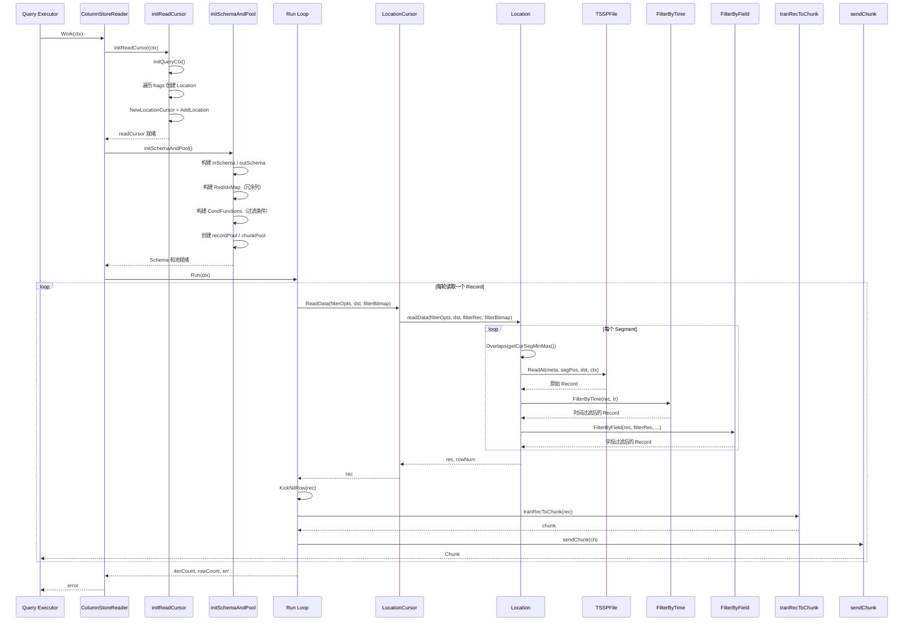

### 14.6 端到端查询实战

**场景**：查询某台服务器在一小时内的 CPU 平均值

```sql
SELECT mean(value) FROM cpu
WHERE host='server1'
  AND time >= '2024-01-01T00:00:00Z'
  AND time < '2024-01-01T01:00:00Z'
```

**Step 1: initReadCursor — 定位文件和 Segment**

```
输入:
  frags = [
    ShardFrags {
      FileMarks: [
        {File: TSSPFile_001, FragmentRanges: [{Start:0, End:5}]},
        {File: TSSPFile_002, FragmentRanges: [{Start:2, End:8}]}
      ]
    }
  ]
  SeriesID = 42
  tr = {Min: 1704067200000000000, Max: 1704070800000000000}

执行:
  1. 遍历 FileMarks:
     - TSSPFile_001:
       - 查缓存 GetChunkMeta("001.tssp") → 未命中
       - loc.Contains(42, tr) → bloom filter 匹配 ✓
       - 读取 ChunkMeta，时间范围 [23:30, 01:30] 与查询范围有交集 ✓
       - 缓存 ChunkMeta: PutChunkMeta("001.tssp", meta)
       - Segment 范围: [{Start:0, End:5}]
       - → 创建 Location_001
     - TSSPFile_002:
       - loc.Contains(42, tr) → bloom filter 不匹配 ✗
       - → 跳过

  2. 构建 LocationCursor:
     readCursor = NewLocationCursor(1)
     readCursor.AddLocation(Location_001)
```

**Step 2: initSchemaAndPool — 构建 Schema 和过滤条件**

```
输入:
  queryCtx.schema = [{Name:"value", Type:Float}, {Name:"host", Type:String}, {Name:"time", Type:Int}]
  opt.Dimensions = []  (无 GROUP BY)
  opt.Condition = BinaryExpr{LHS:"host", Op:EQ, RHS:"server1"}

执行:
  1. 构建 inSchema:
     inSchema = [{Name:"value", Type:Float}, {Name:"host", Type:String}, {Name:"time", Type:Int}]

  2. 构建 useIdxMap:
     useIdxMap = {0: {}, 1: {}, 2: {}}  // value, host, time 都被使用

  3. RedIdxMap = {}  // 无冗余列

  4. 构建过滤条件:
     IsTimeSorted() = true
     → CondFunctions = NewCondition(nil, "host='server1'", inSchema, opt)

  5. 创建对象池:
     recordPool = NewCircularRecordPool(16, inSchema)
     chunkPool = NewCircularChunkPool(8, NewChunkBuilder(outSchema))
```

**Step 3: Run 主循环 — 第一轮读取**

```
Run() 主循环 第 1 轮:

  1. recordPool.Get() → dst (空 Record)

  2. readCursor.ReadData(filterOpts, dst, filterBitmap):
     → LocationCursor.pos = 0
     → Location_001.hasNext() = true (segPos=0 < End=5)

     → Location_001.readData():
       - meta.MinMaxTime() = [23:30, 01:30]
       - tr.Overlaps([23:30, 01:30]) = true ✓
       - getCurSegMinMax() = [23:30, 23:45]  (Segment 0)
       - tr.Overlaps([23:30, 23:45]) = true ✓
       - TSSPFile_001.ReadAt(meta, segPos=0, dst):
           读取 Segment 0 的所有列数据
           dst = Record {
             Schema: [{value,Float}, {host,String}, {time,Int}],
             ColVals: [
               [65.2, 70.1, 68.5, ...],       // value 列, 1000 行
               ["server1","server1","server2",...],  // host 列
               [1704067200000000000, 1704067260000000000, ...]  // time 列
             ],
             RowNums: 1000
           }
       - nextSegment() → segPos=1

       - FilterByTime(dst, tr):
           times = [1704067200000000000, 1704067260000000000, ..., 1704070740000000000]
           tr.Min=1704067200000000000, tr.Max=1704070800000000000
           全部数据在范围内 → 直接返回 dst (无裁剪)

       - FilterByField(dst, nil, options, "host='server1'", ...):
           CondFunctions.HaveFilter() = true
           → FilterByFieldFuncs(dst, filterRec, options, filterBitmap):
              filterBitmap.Reset()
              CondFunctions.Filter(dst, filterBitmap):
                逐行评估 host='server1':
                  row 0: host="server1" → match ✓
                  row 1: host="server1" → match ✓
                  row 2: host="server2" → no match ✗
                  ...
              filterBitmap.ReserveId = [0, 1, 5, 8, 12, ...]  // 满足条件的行号

              ReserveId 数量 = 250 (不等于全部 1000 行)
              → GenRecByReserveIds(dst, filterRec, [0,1,5,8,...], RedIdxMap):
                 提取行 0, 1, 5, 8, 12, ... 的数据到新 Record
                 返回 Record {
                   RowNums: 250,
                   ColVals: [
                     [65.2, 70.1, 69.3, ...],      // value, 250 行
                     ["server1", "server1", ...],    // host, 250 行
                     [1704067200000000000, ...]       // time, 250 行
                   ]
                 }

     → LocationCursor 返回 rec (250 行), rowNum=1000 (过滤前行数)

  3. rec.KickNilRow() → 无 NIL 行，rec.RowNums() = 250

  4. rowCountAfterFilter = 250

  5. tranRecToChunk(rec):
     将 Record 转换为 Chunk 格式
     → chunk 包含 250 行 value 和 time 数据

  6. sendChunk(chunk):
     → 发送给 Query Executor
     → Query Executor 收集 value 列: [65.2, 70.1, 69.3, ...]
```

**Step 4: 后续轮次与聚合**

```
Run() 主循环 第 2~N 轮:

  重复上述流程，读取 Segment 1~4 的数据:
    Segment 1: 250 行过滤后数据
    Segment 2: 300 行过滤后数据
    Segment 3: 200 行过滤后数据
    Segment 4: 150 行过滤后数据

  所有 Segment 读完后:
    Location_001.hasNext() = false
    LocationCursor.pos = 1
    LocationCursor.pos >= len(l.lcs) = 1
    → ReadData 返回 nil，Run 循环结束

Query Executor 聚合:
  收集所有 Chunk 的 value 列: [65.2, 70.1, ..., 72.8]
  总行数: 250 + 250 + 300 + 200 + 150 = 1150 行
  sum(value) = 79350.0
  count(value) = 1150
  mean(value) = 79350.0 / 1150 = 69.0
  → 返回结果: 69.0
```

**过滤效果统计**：

| 阶段 | 数据量 | 说明 |
|------|--------|------|
| 原始 Segment 数据 | 5000 行 (5 Segment × 1000 行) | 磁盘读取的全部数据 |
| FilterByTime 裁剪 | 5000 行 | 时间范围覆盖全部 Segment，无裁剪 |
| FilterByField 裁剪 | 1150 行 | host='server1' 过滤掉 77% 的数据 |
| 最终输出 | 1150 行 | 发送给聚合算子 |

---

## 15. 潜在隐患

### 15.1 NULL 编码路径容易混淆

**问题**：列存文档和源码里有两套相近的 builder 名称，容易把局部校验误读成“列存不支持 NULL”。

```go
// chunk_builder.go 第 53-55 行
if col.NilCount != 0 {
    return nil, errors.New("not support for column with nil value")
}
```

PK 文件的编码路径 `FetchKeyAtRow`（pk_fetcher.go 第 89-118 行）支持 NULL 值处理：通过 `nil_indicator`（0=nil, 1=非nil）标记每个字段是否为 NULL，在 `KeySorter.less` 中 NULL 值被视为最小值参与排序。数据列侧则依赖 `record.ColVal` 的 nil bitmap / nil 标记表达 NULL。

```go
// pk_fetcher.go 第 103-106 行：PK 列的 NULL 处理
b, isNil := ColValBytesAtRow(cols[i], rowNum, typ)
if isNil {
    dst = append(dst, 0)  // nil_indicator = 0，标记为 NULL
    continue
}
dst = append(dst, 1)      // nil_indicator = 1，标记为非 NULL
```

**影响**：
- `engine/immutable/column_builder.go`：普通 TSSP 列编码 builder，处理时序存储的列块编码
- `engine/immutable/colstore/column_builder.go`：列存 detached/PK 相关的列编码 builder，配合 `ChunkBuilder`、`IndexBuilder` 使用
- `record.ColVal` 保存 NULL bitmap / nil 标记，读取和过滤时按 bitmap 还原 NULL
- PK 文件可以正确编码和排序含 NULL 的主键，数据列也不能简单描述为“不支持 NULL”

**流程图**：

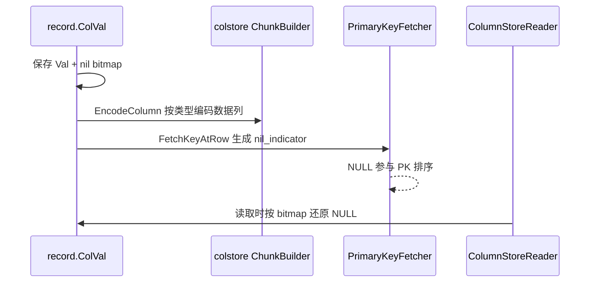

**具体例子**：

```text
Record:
  time:  [1, 2, 3]
  value: [10.0, NULL, 12.0]

编码:
  value.Val 保存 10.0 和 12.0 的实际值
  value nil bitmap 标记第 2 行为 NULL
  如果 value 是 PK 字段，PK 文件额外写 nil_indicator=0

查询:
  ColumnStoreReader 读取列块后按 bitmap 还原第 2 行 NULL
```

### 15.2 48MB/s 写入限流瓶颈

**问题**：`snapshotWriteLimiter` 限制快照写入速度为 48 MB/s。

```go
// writer.go 第 27 行
var snapshotWriteLimiter = fileops.NewLimiter(48*1024*1024, 64*1024*1024)
```

**影响**：
- 高吞吐场景下，快照刷盘可能成为瓶颈
- 突发数据量大时，内存积压风险增加
- 硬编码限流值无法根据硬件能力动态调整

**建议**：
- 将限流值改为可配置参数
- 根据磁盘 I/O 能力动态调整
- 考虑使用自适应限流算法

### 15.3 Schema 演进 padCol 开销

**问题**：`padCol` 需要为已有数据填充新列的空值。

```go
// cs_table.go 第 506-515 行
func padCol(rec *record.Record, writeRec *WriteRec, idx []int) {
    oldRowNum, oldColNum := writeRec.rec.RowNums(), writeRec.rec.ColNums()
    writeRec.rec.ReserveSchemaAndColVal(len(idx))
    for i := 0; i < len(idx); i++ {
        writeRec.rec.ColVals[oldColNum+i].PadColVal(
            rec.Schema[idx[i]].Type, oldRowNum)
    }
    sort.Sort(writeRec.rec)
}
```

**影响**：
- 每次 Schema 变化都需要填充大量空值
- 高频 Schema 变化场景下性能下降明显
- `sort.Sort(writeRec.rec)` 每次都重新排序

**建议**：
- 批量处理 Schema 变化，减少 `padCol` 调用次数
- 考虑延迟填充策略，在刷盘时统一处理
- 优化排序算法，避免全量重排

### 15.4 Detached vs Attached 模式复杂性

**问题**：两种刷盘模式增加了代码复杂度。

```go
// cs_table.go 第 172-176 行
if immutable.GetDetachedFlushEnabled() || config.GetProductType() == config.LogKeeper {
    c.FlushChunksDetached(table, dataPath, mstIdent, lock, tbStore, msRowCount, fileInfos)
    return
}
```

**影响**：
- 两套代码路径维护成本高
- 测试覆盖难度大
- 配置切换可能导致数据不一致

**建议**：
- 统一刷盘接口，减少代码分支
- 增加模式切换的集成测试
- 考虑渐进式迁移，逐步废弃 Attached 模式

### 15.5 8 槽位并发池固定大小

**问题**：`defaultWriteRecNum = 8` 硬编码，无法动态调整。

```go
// cs_table.go 第 43 行
const defaultWriteRecNum = 8
```

**影响**：
- 高并发场景下可能成为瓶颈
- 低并发场景下浪费内存
- 无法根据负载动态调整

**建议**：
- 将槽位数改为可配置参数
- 实现动态伸缩机制
- 监控槽位使用率，自动调整

---

## 16. 端到端实战

### 16.1 完整生命周期

以下是一个通过 Arrow Flight 写入列存记录的完整生命周期：

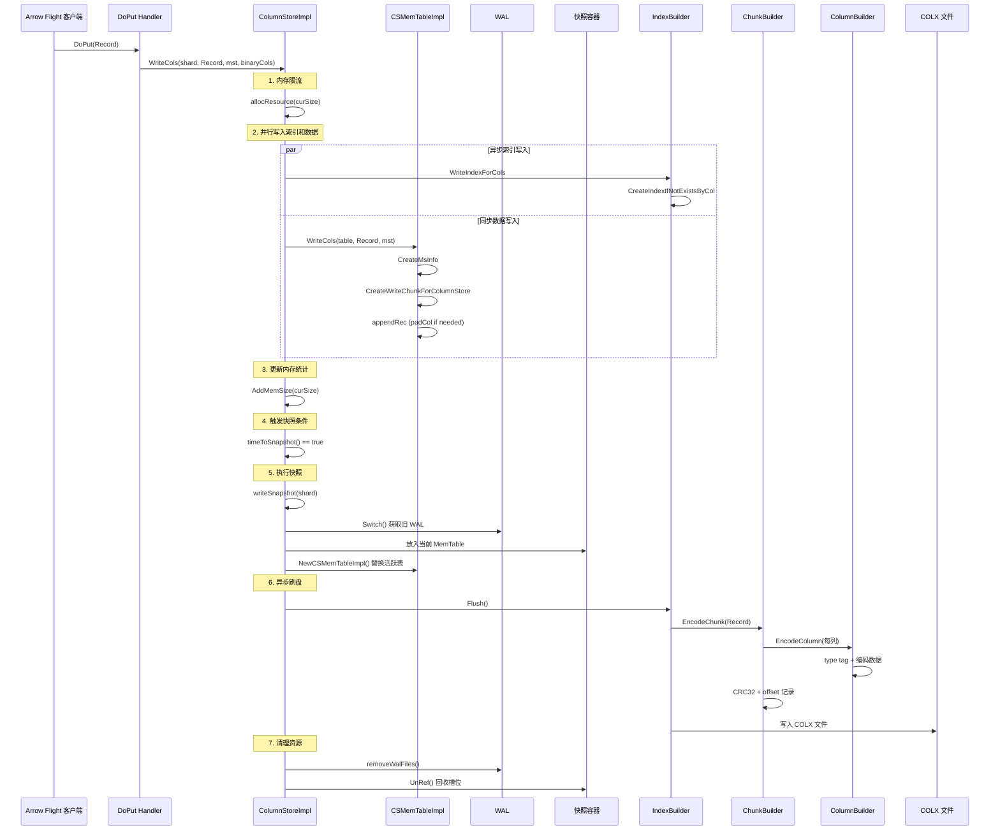

### 16.2 具体例子

**场景**：通过 Arrow Flight 写入 1000 行 CPU 监控数据

```
输入数据:
  Record {
    Schema: [
      {Name: "cpu", Type: Float},
      {Name: "host", Type: String},
      {Name: "time", Type: Int}
    ],
    ColVals: [
      ColVal(1000 个浮点数),
      ColVal(1000 个字符串),
      ColVal(1000 个时间戳)
    ],
    RowNums: 1000
  }
```

**Step 1: WriteCols 入口**

```
// engine/cs_storage.go 第 192 行
WriteCols(shard, Record, "cpu_monitor", binaryCols)

执行:
  1. 空值检查: Record != nil ✓
  2. 只读检查: shard.ReadOnly == false ✓
  3. 更新最后写入时间: lastWriteTime = now
  4. 获取写入上下文: mw = getMstWriteRecordCtx()
  5. 内存限流: allocResource(Record.Size() = 24000 bytes) ✓
```

**Step 2: 异步索引写入**

```
// goroutine 中执行
WriteIndexForCols(shard, Record, "cpu_monitor")

执行:
  1. 创建 MeasurementIdent: {DB: "mydb", RP: "autogen", Name: "cpu_monitor"}
  2. 从 MstManager 获取 Measurement
  3. 获取 PK Schema: [{Name: "host", Type: String}]
  4. 调用 indexBuilder.CreateIndexIfNotExistsByCol()
```

**Step 3: 同步数据写入**

```
// 主协程中执行
CSMemTableImpl.WriteCols(table, Record, "cpu_monitor")

执行:
  1. 字符串驻留: mst = "cpu_monitor" (驻留后)
  2. 获取 MsInfo: table.CreateMsInfo("cpu_monitor", nil, Record)
  3. 从 MstManager 获取 Measurement
  4. 创建 WriteChunkForColumnStore
  5. 加锁: writeChunk.Mu.Lock()
  6. 追加记录: appendRec(msInfo, Record, writeRec)
     - 检查 Schema: checkSchemaIsSameForCol()
     - 如果不同: padCol() 填充空值
     - 追加: writeRec.rec.AppendRec(Record, 0, 1000)
  7. 解锁: writeChunk.Mu.Unlock()
```

**Step 4: 触发快照**

```
// 检查快照条件
timeToSnapshot(shard) == true  // 超过 writeColdDuration

执行 writeSnapshot(shard):
  1. 重置 Raft 标志: SnapShotter.RaftFlag = 0
  2. 获取快照锁: snapshotLock.Lock()
  3. 切换 WAL: walFiles = s.wal.Switch()
  4. 获取空闲槽位: idx = getFreeSnapShotTbl() → 0
  5. 设置刷盘管理器: SetFlushManagerInfo(flushManager, accumulateMetaIndex)
  6. 放入快照容器: snapshotContainer[0] = activeTbl
  7. 创建新活跃表: activeTbl = NewCSMemTableImpl()
  8. 释放锁: snapshotLock.Unlock()
  9. 通知 Raft: SnapShotter.RaftFlushC <- true
  10. 异步刷盘: go flush(shard, 0, curSize, walFiles, start)
```

**Step 5: 异步刷盘**

```
// goroutine 中执行
flush(shard, idx=0, curSize, walFiles, start)

执行:
  1. 提交快照: commitSnapshot(snapshotContainer[0])
  2. 释放内存资源: nodeMutableLimit.freeResource(curSize)
  3. 删除 WAL 文件: removeWalFiles(walFiles)
  4. 回收槽位:
     - snapshotLock.Lock()
     - snapshotContainer[0].UnRef()
     - snapshotContainer[0] = nil
     - snapshotInUsed[0] = false
     - snapshotLock.Unlock()
  5. 更新统计:
     - FlushSnapshotDurationNs += duration
     - FlushSnapshotCount += 1
```

**Step 6: FlushChunksDetached**

```
// commitSnapshot 内部调用
CSMemTableImpl.FlushChunksDetached(table, dataPath, ident, ...)

执行:
  1. 获取 measurement 元数据
  2. 更新 SeqId 列（LogKeeper 模式）
  3. 获取 PK Schema 和时间簇配置
  4. 排序记录: chunk.SortRecord(timeClusterDuration)
  5. 创建 MsBuilder: NewDetachedMsBuilder()
  6. 设置 TC Location
  7. 创建 PK Index Writer
  8. 创建二级索引 Writer
  9. 获取 FlushManager: getFlushManager(detached=true)
  10. 执行刷盘: fManager.flushChunk(...)
```

**Step 7: ChunkBuilder 编码**

```
// IndexBuilder.WriteDetachedData 内部调用
ChunkBuilder.EncodeChunk(Record, dst, colsOffset, 0)

执行:
  1. 遍历所有列:
     - i=0 (cpu:Float)
       - NilCount = 0 ✓
       - pos = 0
       - colsOffset[0] = 0
       - chunk += CRC32(col.Val)  // 4 bytes
       - chunk += ColumnBuilder.EncodeColumn(ref, col)
         → data[0] = BlockFloat64 (0x03)
         → data += EncodeFloatBlock(col.Val)
     - i=1 (host:String)
       - pos = len(chunk) = 8045
       - colsOffset[1] = 8045
       - chunk += CRC32(col.Val)
       - chunk += ColumnBuilder.EncodeColumn(ref, col)
         → data[0] = BlockString (0x04)
         → data += EncodeStringBlock(col.Val, col.Offset)
     - i=2 (time:Int)
       - pos = len(chunk) = 16089
       - colsOffset[2] = 16089
       - chunk += CRC32(col.Val)
       - chunk += ColumnBuilder.EncodeColumn(ref, col)
         → data[0] = BlockInteger (0x01)
         → data += EncodeIntegerBlock(col.Val)

  2. 返回编码后的 chunk 数据
```

**Step 8: 写入 COLX 文件**

```
// IndexBuilder.writeData 内部调用
indexWriter.WriteData(encodeChunk)

执行:
  1. 创建限流写入器: NewLimitWriter(fd, snapshotWriteLimiter)
  2. 写入文件:
     - 第一次写入: header (8 bytes) + meta + data
     - 后续写入: data only
  3. 同步到磁盘: fd.Sync()

文件内容:
  [COLX][version=0][meta...][col0_data][col1_data][col2_data]
```

### 16.3 性能指标

```
写入延迟:
  - WriteCols 入口到写入完成: ~50-200 μs
  - 内存限流等待: ~0-100 μs（取决于内存压力）
  - 索引写入: ~20-80 μs（异步）
  - 数据写入: ~30-120 μs（同步）

快照延迟:
  - writeSnapshot 执行: ~10-50 μs
  - 异步刷盘: ~100 ms - 1 s（取决于数据量）

内存使用:
  - 每个 measurement: ~1 KB 基础开销
  - 每行数据: ~24 bytes (3 列 × 8 bytes)
  - 8 槽位池: ~200 bytes 固定开销

磁盘 I/O:
  - 限流速度: 48 MB/s（突发 64 MB/s）
  - CRC 校验: ~0.1 μs / 列
  - 文件同步: ~1-10 ms
```

---

## 17. 附录

### 17.0 Detached 模式详细数据结构

### 17.0.1 DetachedPKMetaInfo

**源码文件**：`engine/immutable/colstore/meta.go`

```go
// 第 102 行：Detached PK Meta 信息头
type DetachedPKMetaInfo struct {
    Schema     record.Schemas
    TCLocation int8
    Offset     int64
}

// 第 108 行：计算大小
func (m *DetachedPKMetaInfo) Size() int {
    fInfo := getSchemaInfo(m.Schema)
    return headerSize + util.Uint32SizeBytes*2 + util.Int8SizeBytes +
        len(fInfo.fieldNameSize) + len(fInfo.fieldType) + len(fInfo.fields)
}

// 第 113 行：反序列化
func (m *DetachedPKMetaInfo) Unmarshal(src []byte) ([]byte, error) {
    src = src[headerSize+util.Uint32SizeBytes:]
    schemaSize := numberenc.UnmarshalUint32(src[:util.Uint32SizeBytes])
    src = src[util.Uint32SizeBytes:]
    m.TCLocation, src = int8(src[0]), src[util.Int8SizeBytes:]
    schemaByteSize := util.Uint32SizeBytes * int(schemaSize)
    fieldNameSize := make([]uint32, schemaSize)
    fieldNameSize = numberenc.UnmarshalUint32Slice(src[:schemaByteSize], fieldNameSize)
    src = src[schemaByteSize:]
    fieldType := make([]uint32, schemaSize)
    fieldType = numberenc.UnmarshalUint32Slice(src[:schemaByteSize], fieldType)
    src = src[schemaByteSize:]
    m.Schema = make(record.Schemas, schemaSize)
    for i, size := range fieldNameSize {
        m.Schema[i].Name = string(src[:int(size)])
        m.Schema[i].Type = int(fieldType[i])
        src = src[int(size):]
    }
    return src, nil
}
```

**通俗解释**：
- `DetachedPKMetaInfo` 是 Detached 模式文件的公共头部信息
- 包含 Schema 定义和时间簇位置
- 与 Attached 模式的 meta 区别在于没有 dataOffset（数据偏移在每个 Meta 块中独立记录）

### 17.0.2 DetachedPKMeta 块元数据

```go
// 第 142 行：Detached PK Meta 块
type DetachedPKMeta struct {
    StartBlockId uint64    // 起始块 ID
    EndBlockId   uint64    // 结束块 ID
    Offset       uint32    // 数据在文件中的偏移
    Length       uint32    // 数据长度
    ColOffset    []byte    // 各列偏移数组
}

// 第 150 行：计算大小
func (m *DetachedPKMeta) Size() int {
    return pKMetaItemSize + len(m.ColOffset)
}

// 第 154 行：反序列化
func (m *DetachedPKMeta) Unmarshal(src []byte) ([]byte, error) {
    if len(src) < pKMetaItemSize {
        return nil, fmt.Errorf("the size of pk meta is invalid to unmarshal")
    }
    m.StartBlockId = numberenc.UnmarshalUint64(src[:util.Uint64SizeBytes])
    src = src[util.Uint64SizeBytes:]
    m.EndBlockId = numberenc.UnmarshalUint64(src[:util.Uint64SizeBytes])
    src = src[util.Uint64SizeBytes:]
    m.Offset = numberenc.UnmarshalUint32(src[:util.Uint32SizeBytes])
    src = src[util.Uint32SizeBytes:]
    m.Length = numberenc.UnmarshalUint32(src[:util.Uint32SizeBytes])
    src = src[util.Uint32SizeBytes:]
    m.ColOffset = append(m.ColOffset, src...)
    return src, nil
}
```

**Detached Meta 块布局**：

```
+----------------------------------+
| StartBlockId: uint64 (8 bytes)   |
+----------------------------------+
| EndBlockId:   uint64 (8 bytes)   |
+----------------------------------+
| Offset:       uint32 (4 bytes)   |
+----------------------------------+
| Length:       uint32 (4 bytes)   |
+----------------------------------+
| ColOffset:    []byte (variable)  |
|   col0_offset: uint32            |
|   col1_offset: uint32            |
|   ...                            |
+----------------------------------+
```

### 17.0.3 DetachedPKInfo 查询结构

```go
// 第 170 行：Detached PK 查询信息
type DetachedPKInfo struct {
    StartBlockId uint64
    EndBlockId   uint64
    TcLocation   int8
    Data         *record.Record
}

// 第 177 行：检查块是否存在于范围内
func (d *DetachedPKInfo) IsBlockExist(start, end uint64) bool {
    return !(end < d.StartBlockId || start > d.EndBlockId)
}

// 第 189 行：从 Meta 和 Data 构建 Info
func GetPKInfoByPKMetaData(meta *DetachedPKMeta, data *DetachedPKData,
    tcLocation int8) *DetachedPKInfo {
    return &DetachedPKInfo{
        StartBlockId: meta.StartBlockId,
        EndBlockId:   meta.EndBlockId,
        TcLocation:   tcLocation,
        Data:         data.Data,
    }
}
```

**通俗解释**：
- `DetachedPKInfo` 是查询时使用的结构，包含块范围和解码后的 Record
- `IsBlockExist` 判断给定的块 ID 范围是否与当前 PK 信息有交集
- 这个方法在查询优化器中用于快速跳过不相关的数据块

### 17.0.4 DetachedPKData 数据解码

```go
// 第 193 行：Detached PK 数据
type DetachedPKData struct {
    Offset int64           // 临时变量，用于排序
    Data   *record.Record  // 解码后的 Record
}

// 第 198 行：反序列化
func (m *DetachedPKData) Unmarshal(src []byte, meta *DetachedPKMeta,
    info *DetachedPKMetaInfo) ([]byte, error) {

    // 第 199 行：创建 Record
    m.Data = record.NewRecord(info.Schema, false)

    // 第 201-203 行：解析列偏移和行数
    colOffset := make([]uint32, info.Schema.Len())
    colOffset = numberenc.UnmarshalUint32Slice(meta.ColOffset, colOffset)
    rowNum := int(meta.EndBlockId-meta.StartBlockId) + 1

    // 第 204 行：解码 PK 数据
    return decodePKData(src, m.Data, colOffset, rowNum)
}
```

**具体例子**：

```
Detached 文件中的数据块:

Meta Block 1:
  StartBlockId = 0
  EndBlockId   = 99
  Offset       = 1024
  Length       = 8192
  ColOffset    = [0, 4096, 6144]

Meta Block 2:
  StartBlockId = 100
  EndBlockId   = 199
  Offset       = 9216
  Length       = 8192
  ColOffset    = [0, 4096, 6144]

查询 blockId=50 时:
  → 匹配 Meta Block 1 (0 <= 50 <= 99)
  → 读取 offset=1024 处的数据
  → 按 ColOffset 解码各列
```

### 17.0.5 PK Files 序列化

**源码文件**：`engine/immutable/colstore/pk_files.go`

```go
// 第 27 行：常量定义
const (
    PKMetaPrefixSize = util.Uint64SizeBytes*2 + util.Uint32SizeBytes*2  // 24 bytes
    CRCLen           = 4
)

// 第 32 行：PKInfo 查询信息
type PKInfo struct {
    tcLocation int8
    rec        *record.Record
    mark       fragment.IndexFragment
}

// 第 38 行：创建 PKInfo
func NewPKInfo(rec *record.Record, mark fragment.IndexFragment,
    tcLocation int8) *PKInfo {
    return &PKInfo{
        tcLocation: tcLocation,
        rec:        rec,
        mark:       mark,
    }
}

// 第 58 行：PkMetaBlock 结构
type PkMetaBlock struct {
    StartBlockId uint64
    EndBlockId   uint64
    Offset       uint32
    Size         uint32
}

// 第 65 行：序列化 PK Meta Block
func MarshalPkMetaBlock(startId, endId uint64, offset, size uint32,
    meta, colsOffset []byte) []byte {

    pos := uint32(len(meta))
    meta = numberenc.MarshalUint32Append(meta, 0) // 预留 CRC32 空间
    meta = numberenc.MarshalUint64Append(meta, startId)
    meta = numberenc.MarshalUint64Append(meta, endId)
    meta = numberenc.MarshalUint32Append(meta, offset)
    meta = numberenc.MarshalUint32Append(meta, size)
    meta = append(meta, colsOffset...)

    // 第 73-74 行：计算并写入 CRC32
    crc := crc32.ChecksumIEEE(meta[pos+crcSize:])
    numberenc.MarshalUint32Copy(meta[pos:pos+crcSize], crc)

    return meta
}

// 第 78 行：反序列化 PK Meta Block
func UnmarshalPkMetaBlock(src []byte) (*PkMetaBlock, error) {
    if len(src) < PKMetaPrefixSize {
        return nil, fmt.Errorf("not enough data for unmarshal PkMetaBlock")
    }

    pk := &PkMetaBlock{}
    src = src[CRCLen:]  // 跳过 CRC32
    pk.StartBlockId, src = numberenc.UnmarshalUint64(src), src[util.Uint64SizeBytes:]
    pk.EndBlockId, src = numberenc.UnmarshalUint64(src), src[util.Uint64SizeBytes:]
    pk.Offset, src = numberenc.UnmarshalUint32(src), src[util.Uint32SizeBytes:]
    pk.Size = numberenc.UnmarshalUint32(src)
    return pk, nil
}
```

**PK Meta Block 二进制布局**：

```
+----------------------------------+
| CRC32:        uint32 (4 bytes)   |
+----------------------------------+
| StartBlockId: uint64 (8 bytes)   |
+----------------------------------+
| EndBlockId:   uint64 (8 bytes)   |
+----------------------------------+
| Offset:       uint32 (4 bytes)   |
+----------------------------------+
| Size:         uint32 (4 bytes)   |
+----------------------------------+
| ColOffset:    []byte (variable)  |
+----------------------------------+

总大小: 4 + 8 + 8 + 4 + 4 + len(ColOffset) = 28 + len(ColOffset)
```

### 17.0.6 Index 文件后缀管理

**源码文件**：`engine/immutable/colstore/util.go`

```go
// 第 46-51 行：索引文件后缀常量
const (
    IndexFileSuffix            string = ".idx"   // PK 索引文件
    MinMaxIndexFileSuffix      string = ".mm"    // MinMax 索引
    SetIndexFileSuffix         string = ".set"   // Set 索引
    BloomFilterIndexFileSuffix string = ".bf"    // 布隆过滤器
    TextIndexDataFileSuffix    string = ".pos"   // 全文索引 posting list
    TextIndexHeadFileSuffix    string = ".bh"    // 全文索引 block header
    TextIndexPartFileSuffix    string = ".ph"    // 全文索引 part header
)

// 第 53 行：追加 PK 索引后缀
func AppendPKIndexSuffix(dataPath string) string {
    return dataPath + IndexFileSuffix
}

// 第 58 行：追加二级索引后缀
func AppendSecondaryIndexSuffix(dataPath string, fieldName string,
    indexType index.IndexType, fileType int) string {

    var indexFileSuffix string
    switch indexType {
    case index.MinMax:
        indexFileSuffix = MinMaxIndexFileSuffix
    case index.Set:
        indexFileSuffix = SetIndexFileSuffix
    case index.BloomFilter, index.BloomFilterFullText, index.BloomFilterIp:
        indexFileSuffix = BloomFilterIndexFileSuffix
    case index.Text:
        switch fileType {
        case TextIndexData:
            indexFileSuffix = TextIndexDataFileSuffix
        case TextIndexHead:
            indexFileSuffix = TextIndexHeadFileSuffix
        case TextIndexPart:
            indexFileSuffix = TextIndexPartFileSuffix
        }
    }
    return dataPath + "." + fieldName + indexFileSuffix
}
```

**文件后缀示例**：

```
measurement: cpu_monitor

PK 索引文件:
  /data/mydb/autogen/0/cpu_monitor.idx

MinMax 索引文件:
  /data/mydb/autogen/0/cpu_monitor.cpu.mm
  /data/mydb/autogen/0/cpu_monitor.host.mm

Set 索引文件:
  /data/mydb/autogen/0/cpu_monitor.region.set

布隆过滤器文件:
  /data/mydb/autogen/0/cpu_monitor.host.bf

全文索引文件:
  /data/mydb/autogen/0/cpu_monitor.message.pos
  /data/mydb/autogen/0/cpu_monitor.message.bh
  /data/mydb/autogen/0/cpu_monitor.message.ph
```

### 17.0.7 getAllFiles 与 Shard Move 策略

**源码文件**：`engine/cs_storage.go`

```go
// 第 310 行：获取所有 CS 文件
func (storage *ColumnStoreImpl) getAllFiles(s *shard, mstName string) ([]immutable.TSSPFile, []string, error) {
    csFiles, existCsFiles := s.immTables.GetCSFiles(mstName)
    csFiles.RLock()
    defer csFiles.RUnlock()
    leased := immutable.UnrefFilesReader(csFiles.Files()...)
    immutable.UnrefFilesWithLease(leased, csFiles.Files()...)

    if !existCsFiles {
        return nil, nil, nil
    }

    files := make([]immutable.TSSPFile, 0, csFiles.Len())
    coldTmpFilesPath := make([]string, 0, csFiles.Len())
    return genAllFiles(s, csFiles.Files(), files, coldTmpFilesPath)
}

// 第 331 行：Shard Move 策略接口
type shardMoveStrategy interface {
    doShardMove(s *shard) error
}

// 第 335 行：创建策略
func newShardMoveStrategy(layoutSwitchEnabled bool) shardMoveStrategy {
    if layoutSwitchEnabled {
        return &compactStrategy{}
    }
    return &writeStrategy{}
}

// 第 342 行：压缩策略（空实现）
type compactStrategy struct{}
func (c *compactStrategy) doShardMove(s *shard) error {
    return nil
}

// 第 349 行：写入策略
type writeStrategy struct{}
func (w *writeStrategy) doShardMove(s *shard) error {
    return s.doShardMove()
}
```

**通俗解释**：
- `getAllFiles` 获取某个 measurement 的所有 CS 文件，用于查询或迁移
- `shardMoveStrategy` 是策略模式，控制 shard 迁移行为
- `compactStrategy` 在布局切换启用时不执行迁移（数据已在新布局中）
- `writeStrategy` 在布局切换未启用时执行标准迁移

### 17.0.8 createMsBuilder MsBuilder 创建

**源码文件**：`engine/mutable/cs_table.go`

```go
// 第 254 行：创建 MsBuilder
func (c *CSMemTableImpl) createMsBuilder(tbStore immutable.TablesStore,
    lockPath *string, dataPath string, msName string, totalChunks int,
    size int, conf *immutable.Config, engineType config.EngineType,
    mstInfo *meta.MeasurementInfo, fullTextIdx bool) *immutable.MsBuilder {

    seq := tbStore.Sequencer()
    defer seq.UnRef()

    // 第 259 行：创建 TSSP 文件名
    FileName := immutable.NewTSSPFileName(tbStore.NextSequence(), 0, 0, 0,
        true, lockPath)

    var msb *immutable.MsBuilder
    var err error

    if immutable.GetDetachedFlushEnabled() {
        // 第 263-268 行：Detached 模式
        lock := fileops.FileLockOption(*lockPath)
        dir := filepath.Join(dataPath, msName)
        _ = fileops.MkdirAll(dir, 0750, lock)
        bfCols := mstInfo.IndexRelation.GetBloomFilterColumns()
        msb, err = immutable.NewDetachedMsBuilder(dataPath, msName, lockPath,
            conf, totalChunks, FileName, tbStore.Tier(), seq, size, engineType,
            mstInfo.ObsOptions, bfCols, fullTextIdx)
    } else {
        // 第 273-274 行：Attached 模式
        msb = immutable.NewMsBuilder(dataPath, msName, lockPath, conf,
            totalChunks, FileName, tbStore.Tier(), seq, size, engineType,
            mstInfo.ObsOptions, tbStore.GetShardID())
    }

    msb.SetFullTextIdx(fullTextIdx)
    return msb
}
```

**通俗解释**：
- `createMsBuilder` 根据刷盘模式创建对应的 MsBuilder
- Detached 模式会创建独立的目录，支持布隆过滤器列
- Attached 模式使用标准的 MsBuilder
- MsBuilder 负责构建最终的 TSSP 文件

### 17.0.9 FlushChunksDetached 完整流程

```go
// cs_table.go 第 199 行：Detached 模式刷盘
func (c *CSMemTableImpl) FlushChunksDetached(table *MemTable, dataPath string,
    ident colstore.MeasurementIdent, lock *string, tbStore immutable.TablesStore,
    msRowCount int64, fileInfos chan []immutable.FileInfoExtend) {

    // 第 200-202 行：获取 MsInfo
    msInfo, ok := table.msInfoMap[ident.Name]
    if !ok {
        return
    }

    // 第 204-206 行：检查是否有数据
    rec := msInfo.writeChunk.WriteRec.GetRecord()
    if rec.RowNums() == 0 {
        return
    }

    // 第 209 行：更新 SeqId 列（LogKeeper 模式）
    c.updateSeqIdCol(msRowCount-int64(msInfo.writeChunk.WriteRec.rec.RowNums()), rec)

    // 第 211-216 行：获取 measurement 元数据
    var indexRelation influxql.IndexRelation
    var timeClusterDuration time.Duration
    mst, ok := colstore.MstManagerIns().GetByIdent(ident)
    if !ok || mst == nil {
        logger.GetLogger().Error("measurement is not exits", ...)
        return
    }

    // 第 222-225 行：获取 PK 和时间簇配置
    indexRelation = mst.IndexRelation()
    timeClusterDuration = mst.ColStoreInfo().TimeClusterDuration
    primaryKey := mst.PrimaryKey()

    // 第 226-228 行：排序记录
    chunk := msInfo.writeChunk
    chunk.SortRecord(timeClusterDuration)
    timeSorted := chunk.TimeSorted()

    // 第 230-240 行：创建 MsBuilder
    conf := immutable.GetColStoreConfig()
    writeMs := c.createMsBuilder(tbStore, lock, dataPath, ident.Name, 1,
        rec.Len(), conf, config.COLUMNSTORE, mst.MeasurementInfo(),
        logstore.IsFullTextIdx(&indexRelation))

    var tcLocation = colstore.DefaultTCLocation
    if timeClusterDuration > 0 {
        tcLocation = 0
    }

    // 第 239-242 行：设置 MsBuilder 属性
    writeMs.SetTCLocation(tcLocation)
    writeMs.SetTimeSorted(timeSorted)
    writeMs.NewPKIndexWriter()
    writeMs.NewIndexWriterBuilder(rec.Schema, indexRelation)

    // 第 244-246 行：获取 FlushManager 并执行刷盘
    fManager := c.getFlushManager(immutable.GetDetachedFlushEnabled(), writeMs,
        rec.Schema, ident.Name, *lock)
    fManager.SetDBInfo(ident.DB, ident.RP)
    fManager.flushChunk(primaryKey, ident.Name, &indexRelation, tbStore,
        chunk, writeMs, tcLocation)

    // 第 247-249 行：发送文件信息
    if fileInfos != nil {
        fileInfos <- writeMs.FilesInfo
    }

    // 第 251 行：更新累积 Meta 索引
    c.updateAccumulateMetaIndexInfo(ident.Name, fManager.getAccumulateMetaIndex())
}
```

### 17.0.10 updateSeqIdCol LogKeeper 支持

```go
// cs_table.go 第 375 行：更新 SeqId 列
func (c *CSMemTableImpl) updateSeqIdCol(startSeqId int64, rec *record.Record) {
    if !config.IsLogKeeper() {
        return
    }
    record.UpdateSeqIdCol(startSeqId, rec)
}
```

**通俗解释**：
- `updateSeqIdCol` 仅在 LogKeeper 模式下生效
- 为每行数据添加序列 ID，用于日志场景下的精确消费
- `startSeqId` 基于已写入的行数计算，保证全局唯一递增

### 17.0.11 WriteChunkForColumnStore 排序与时间簇

**源码文件**：`engine/mutable/table.go`

```go
// 第 93 行：WriteChunkForColumnStore 结构体
type WriteChunkForColumnStore struct {
    Mu         sync.Mutex
    WriteRec   WriteRec
    sortKeys   []record.PrimaryKey
    sameSchema bool
}

// 第 104 行：按排序键排序
func (chunk *WriteChunkForColumnStore) SortRecord(tcDuration time.Duration) {
    hlp := record.NewSortHelper()
    chunk.Mu.Lock()
    chunk.WriteRec.rec = hlp.SortForColumnStore(chunk.WriteRec.rec,
        chunk.sortKeys, false, tcDuration)
    chunk.Mu.Unlock()
    hlp.Release()
}

// 第 112 行：检查是否按时间排序
func (chunk *WriteChunkForColumnStore) TimeSorted() bool {
    if len(chunk.sortKeys) == 0 {
        return false
    }
    return chunk.sortKeys[0].Key == record.TimeField
}
```

**通俗解释**：
- `SortRecord` 根据 `sortKeys` 对 Record 排序
- `tcDuration` 控制时间簇的粒度（例如每小时一个簇）
- `TimeSorted` 检查第一个排序键是否是时间字段，用于判断是否需要额外排序

### 17.0.12 ForceFlush 强制刷盘

```go
// cs_storage.go 第 165 行：强制刷盘
func (storage *ColumnStoreImpl) ForceFlush(s *shard) {
    if s.indexBuilder == nil {
        return
    }

    // 第 169-170 行：设置强制刷盘标志
    s.enableForceFlush()
    defer s.disableForceFlush()

    // 第 172 行：等待所有快照完成
    s.waitSnapshot()

    // 第 173-177 行：获取空闲槽位
    idx := storage.getFreeSnapShotTbl()
    if idx == -1 {
        log.Debug("there is no free snapshot table", ...)
        return
    }

    // 第 178-180 行：执行快照
    s.prepareSnapshot()
    s.storage.writeSnapshot(s)
    s.endSnapshot()
}
```

**通俗解释**：
- `ForceFlush` 在 shard 关闭或迁移时调用
- 先等待所有正在进行的快照完成
- 然后强制触发一次快照，确保所有内存数据刷盘

### 17.0.13 schemaInfo 辅助结构

```go
// index_builder.go 第 210 行：Schema 信息辅助结构
type schemaInfo struct {
    fields        string   // 所有字段名拼接
    fieldNameSize []byte   // 每个字段名的长度
    fieldType     []byte   // 每个字段的类型
}

// 第 216 行：构建 Schema 信息
func getSchemaInfo(schemas record.Schemas) *schemaInfo {
    schemaByteSize := len(schemas) * util.Uint32SizeBytes
    sInfo := &schemaInfo{
        fields:        "",
        fieldNameSize: make([]byte, 0, schemaByteSize),
        fieldType:     make([]byte, 0, schemaByteSize),
    }
    for _, schema := range schemas {
        fieldName := schema.Name
        sInfo.fieldNameSize = numberenc.MarshalUint32Append(
            sInfo.fieldNameSize, uint32(len(fieldName)))
        sInfo.fieldType = numberenc.MarshalUint32Append(
            sInfo.fieldType, uint32(schema.Type))
        sInfo.fields += fieldName
    }
    return sInfo
}
```

**具体例子**：

```
Schema: [{Name: "cpu", Type: Float}, {Name: "host", Type: String}]

schemaInfo {
  fields: "cpuhost"
  fieldNameSize: [3, 4]  // "cpu" 长度 3, "host" 长度 4
  fieldType: [3, 4]      // Float=3, String=4
}
```

### 17.0.14 MergeSchema 与 JoinWriteRec 调用时序

```go
// cs_table.go 第 165 行：FlushChunks 入口
func (c *CSMemTableImpl) FlushChunks(table *MemTable, dataPath, msName, db,
    rp string, lock *string, tbStore immutable.TablesStore, msRowCount int64,
    fileInfos chan []immutable.FileInfoExtend) {

    mstIdent := colstore.NewMeasurementIdent(db, rp)
    mstIdent.SetName(msName)

    // 第 169-170 行：先合并 Schema，再合并 Record
    MergeSchema(table, msName)
    JoinWriteRec(table, msName)

    // 第 172-175 行：根据模式选择刷盘路径
    if immutable.GetDetachedFlushEnabled() || config.GetProductType() == config.LogKeeper {
        c.FlushChunksDetached(table, dataPath, mstIdent, lock, tbStore,
            msRowCount, fileInfos)
        return
    }

    // 第 177-197 行：Attached 模式
    msInfo, ok := table.msInfoMap[msName]
    if !ok {
        return
    }

    mst, ok := colstore.MstManagerIns().GetByIdent(mstIdent)
    if !ok || mst == nil {
        return
    }

    chunk := msInfo.writeChunk
    rec := chunk.WriteRec.GetRecord()
    if rec.RowNums() == 0 {
        return
    }

    indexRelation := mst.IndexRelation()
    at := NewWriteAttached(msName, mst.PrimaryKey(), mst.SortKey(), &indexRelation)
    at.FlushRecord(tbStore, chunk.WriteRec.GetRecord())
}
```

**调用时序**：

```
FlushChunks 被调用时机: 快照刷盘时

执行顺序:
  1. MergeSchema(table, msName)
     → 合并所有并发槽的 Schema
     → 处理 Schema 演进

  2. JoinWriteRec(table, msName)
     → 将 8 个并发槽的 Record 合并到主 writeChunk
     → 保证数据完整性

  3. FlushChunksDetached / FlushRecord
     → 根据模式选择刷盘路径
     → Detached: 写入独立的 PK 文件 + TSSP 文件
     → Attached: 写入嵌入式的 TSSP 文件
```

### 17.1 关键源码文件索引

| 文件路径 | 功能 | 行数 |
|---------|------|------|
| `engine/cs_storage.go` | ColumnStoreImpl 写入入口 | ~354 |
| `engine/mutable/cs_table.go` | CSMemTableImpl 并发控制 | ~635 |
| `engine/immutable/colstore/chunk_builder.go` | ChunkBuilder 编码 | ~67 |
| `engine/immutable/colstore/column_builder.go` | ColumnBuilder 类型编码 | ~129 |
| `engine/immutable/column_builder.go` | 普通 TSSP ColumnBuilder 类型编码 | ~通用行存路径 |
| `engine/immutable/colstore/column_reader.go` | 列解码分发 | ~106 |
| `engine/immutable/colstore/index_builder.go` | IndexBuilder PK 索引构建 | ~231 |
| `engine/immutable/colstore/measurement.go` | MstManager 元数据管理 | ~220 |
| `engine/immutable/colstore/meta.go` | PK Meta 序列化 | ~232 |
| `engine/immutable/colstore/pk_fetcher.go` | PrimaryKeyFetcher 主键提取 | ~341 |
| `engine/immutable/colstore/reader.go` | PrimaryKeyReader 文件读取 | ~165 |
| `engine/immutable/colstore/writer.go` | PK 文件写入与限流 | ~172 |
| `engine/immutable/colstore/util.go` | 常量定义 | ~87 |
| `engine/immutable/colstore/pk_files.go` | PK Meta Block 序列化 | ~92 |

### 17.2 常量定义

```go
// engine/immutable/colstore/util.go
primaryKeyMagic            string = "COLX"           // Magic Number
fileMagicSize              int    = 4                 // Magic 长度
version                    uint32 = 0                 // 文件版本
headerSize                 int    = 8                 // Header 长度 (4+4)
accMetaSize                int    = 24                // 累积 Meta 大小 (8+8+4+4)
DefaultTCLocation          int8   = -1                // 默认时间簇位置
crcSize                    uint32 = 4                 // CRC32 长度
pKMetaItemSize             int    = 24                // PK Meta 项大小 (8+8+4+4)
defaultWriteRecNum                              = 8   // 默认并发写入槽数
defaultWriterBufferSize                         = 1MB // 默认写入缓冲区
snapshotWriteLimiter                            = 48MB/s (burst 64MB/s)
```

### 17.3 类型标记

```go
// encoding 包（别名于 influx.Field_Type_*）
BlockInteger  = 1  // 整数（byte(influx.Field_Type_Int)）
BlockFloat64  = 3  // 浮点数（byte(influx.Field_Type_Float)）
BlockString   = 4  // 字符串（byte(influx.Field_Type_String)）
BlockBoolean  = 5  // 布尔（byte(influx.Field_Type_Boolean)）
BlockTag      = 6  // Tag（byte(influx.Field_Type_Tag)）

// influx 包
Field_Type_Unknown = 0
Field_Type_Int     = 1
Field_Type_UInt    = 2
Field_Type_Float   = 3
Field_Type_String  = 4
Field_Type_Boolean = 5
Field_Type_Tag     = 6
Field_Type_Last    = 7
```
