# Module 12: Cluster Migration / Rebalance State Machine 深度审计报告（庖丁解牛版 v3）

> 时序图优先，逐步拆解。每个流程都有 Mermaid 时序图 + 核心代码逐行解释。

---

## 1. 集群迁移状态机概述

### 1.1 什么是集群迁移状态机？

集群迁移状态机负责 PT（Partition Table）在不同 ts-store 节点间的分配、迁移和均衡。它服务 HA PT 分配/迁移场景，策略覆盖 WAF、SharedStorage 和 Replication；其中自动均衡逻辑更偏 SharedStorage 模式。

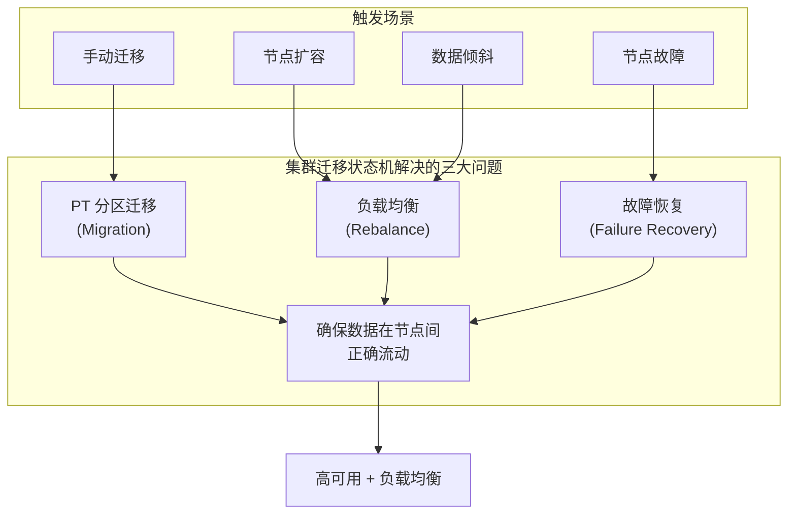
```mermaid
graph TB
    subgraph "集群迁移状态机解决的三大问题"
        A["PT 分区迁移<br/>(Migration)"] --> D["确保数据在节点间<br/>正确流动"]
        B["负载均衡<br/>(Rebalance)"] --> D
        C["故障恢复<br/>(Failure Recovery)"] --> D
    end

    subgraph "触发场景"
        E["节点故障"] --> C
        F["节点扩容"] --> B
        G["手动迁移"] --> A
        H["数据倾斜"] --> B
    end

    D --> I["高可用 + 负载均衡"]
```

**通俗解释**：

- **PT 分区迁移**：当用户执行 `MOVE PT` 命令时，将某个 PT 从一个 store 节点搬到另一个节点
- **负载均衡**：系统自动检测 PT 分布不均，将多余的 PT 从"富裕"节点搬到"贫瘠"节点
- **故障恢复**：当某个 store 节点宕机时，将其上的 PT 重新分配给存活节点

**为什么需要状态机？**

PT 迁移不是简单的"复制粘贴"，它涉及多个步骤（预卸载 → 预分配 → 卸载 → 分配），每一步都可能失败，需要：
1. **状态跟踪**：记录当前走到哪一步
2. **错误恢复**：失败时能回滚或重试
3. **持久化**：Leader 切换后事件不丢失；当前恢复工厂主要重建事件和 op id，不应理解成完整恢复所有运行时状态字段
4. **去重**：同一个 PT 不要重复迁移

**具体例子**：

```
场景：3 个 store 节点，6 个 PT

初始分布：
  Node 1: PT0, PT1, PT2  (3个，偏多)
  Node 2: PT3, PT4       (2个)
  Node 3: PT5            (1个，偏少)

均衡后：
  Node 1: PT0, PT1       (2个)
  Node 2: PT3, PT4       (2个)
  Node 3: PT5, PT2       (2个)
  
  PT2 从 Node1 迁移到 Node3，这就是迁移状态机的工作
```

---

### 1.2 核心组件关系

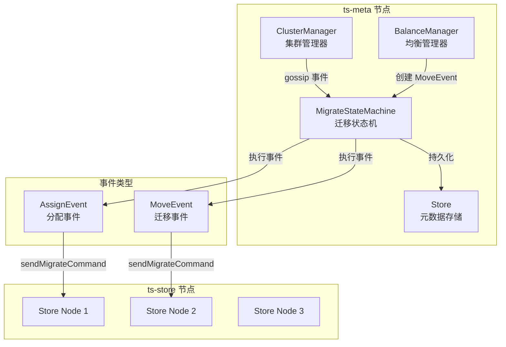
```mermaid
graph TB
    subgraph "ts-meta 节点"
        CM["ClusterManager<br/>集群管理器"]
        MSM["MigrateStateMachine<br/>迁移状态机"]
        BM["BalanceManager<br/>均衡管理器"]
        Store["Store<br/>元数据存储"]
    end

    subgraph "事件类型"
        AE["AssignEvent<br/>分配事件"]
        ME["MoveEvent<br/>迁移事件"]
    end

    subgraph "ts-store 节点"
        S1["Store Node 1"]
        S2["Store Node 2"]
        S3["Store Node 3"]
    end

    CM -->|"gossip 事件"| MSM
    MSM -->|"执行事件"| AE
    MSM -->|"执行事件"| ME
    BM -->|"创建 MoveEvent"| MSM
    AE -->|"sendMigrateCommand"| S1
    ME -->|"sendMigrateCommand"| S2
    MSM -->|"持久化"| Store
```

---

## 2. 整体架构

### 2.1 事件驱动架构

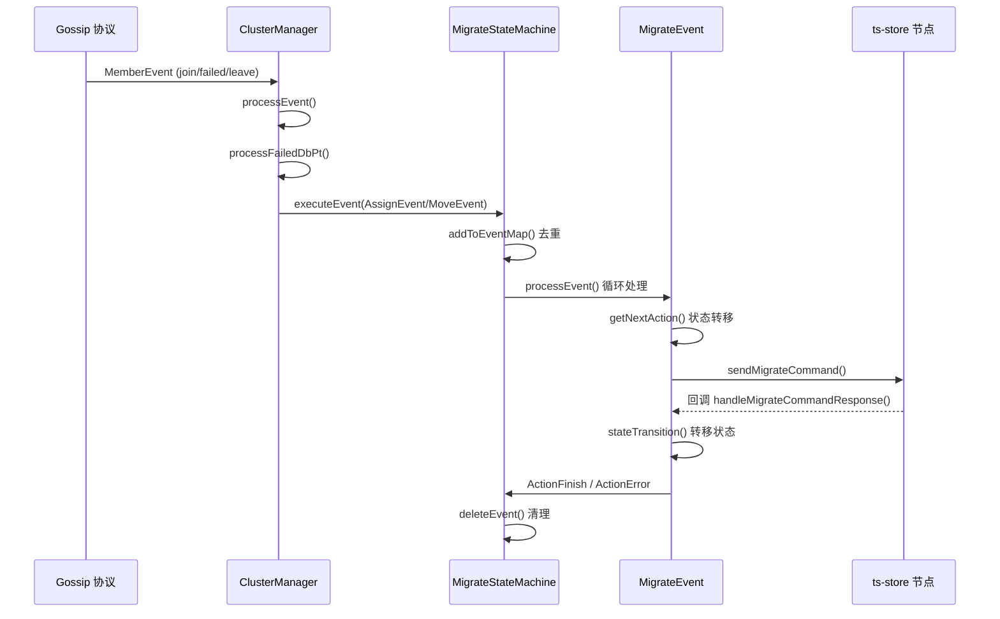
```mermaid
sequenceDiagram
    participant Gossip as Gossip 协议
    participant CM as ClusterManager
    participant MSM as MigrateStateMachine
    participant Event as MigrateEvent
    participant Store as ts-store 节点

    Gossip->>CM: MemberEvent (join/failed/leave)
    CM->>CM: processEvent()
    CM->>CM: processFailedDbPt()
    CM->>MSM: executeEvent(AssignEvent/MoveEvent)
    MSM->>MSM: addToEventMap() 去重
    MSM->>Event: processEvent() 循环处理
    Event->>Event: getNextAction() 状态转移
    Event->>Store: sendMigrateCommand()
    Store-->>Event: 回调 handleMigrateCommandResponse()
    Event->>Event: stateTransition() 转移状态
    Event->>MSM: ActionFinish / ActionError
    MSM->>MSM: deleteEvent() 清理
```

**通俗解释**：

整个迁移流程就像一个流水线：
1. **Gossip 协议**发现节点变化（加入/故障/离开）
2. **ClusterManager** 收到事件，判断需要迁移哪些 PT
3. **MigrateStateMachine** 接收迁移任务，去重后开始执行
4. **MigrateEvent**（AssignEvent 或 MoveEvent）逐步推进状态
5. 每一步向 **ts-store** 发送命令，等待回调
6. 根据回调结果决定下一步（继续/重试/完成/失败）

---

### 2.2 核心文件结构

| 文件 | 职责 | 行数 |
|------|------|------|
| `migrate_state_machine.go` | 迁移状态机主体，事件调度 | ~460 行 |
| `migrate_event.go` | MigrateEvent 接口和 BaseEvent 基类 | ~234 行 |
| `assign_event.go` | PT 分配事件（故障恢复） | ~260 行 |
| `move_event.go` | PT 迁移事件（均衡/手动迁移） | ~325 行 |
| `balance_store.go` | 均衡算法，决定哪些 PT 需要移动 | ~818 行 |
| `cluster_manager.go` | 集群管理器，Gossip 事件处理 | ~690 行 |

**核心代码**：`app/ts-meta/meta/migrate_state_machine.go:40-56`

```go
// 第 40 行：MigrateStateMachine — 迁移状态机主体结构
type MigrateStateMachine struct {
    retryMu        sync.RWMutex
    retryingEvents []MigrateEvent           // 等待重试的事件列表
    mu              sync.RWMutex             // 保护 state 和 eventsRecovered
    state           MSMState                 // 状态机状态：Stopped/Running/Stopping
    eventsRecovered bool                     // 是否已完成事件恢复
    wg              sync.WaitGroup           // 等待 retry 和 recover 协程结束
    recoverNotify chan struct{}              // 恢复完成通知 channel
    eventMapMu    sync.RWMutex
    eventMap      map[string]MigrateEvent    // 事件去重 map，key = eventId (db.ptId)
    eventsWg      sync.WaitGroup            // 等待所有事件处理完成
    logger *logger.Logger
}
```

**逐行解释**：
- **第 42 行**：`retryingEvents` 存储需要重试的事件，由 `retryMigrateCmd()` 协程定期处理
- **第 44 行**：`state` 是状态机的运行状态，`Stopped(0)` / `Running(1)` / `Stopping(2)`
- **第 46 行**：`eventsRecovered` 标记是否已完成从持久化存储恢复事件
- **第 48 行**：`recoverNotify` channel 用于通知 ClusterManager "恢复完成，可以开始处理新事件"
- **第 52 行**：`eventMap` 是去重机制的核心，保证同一个 PT 同时只有一个事件在处理

---

## 3. MigrateStateMachine 详解

### 3.1 状态机生命周期

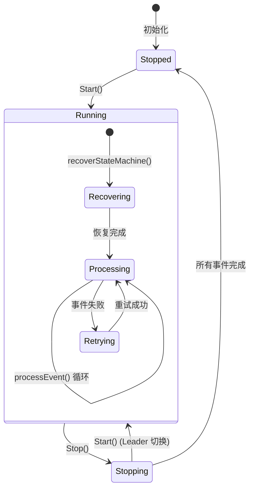
```mermaid
stateDiagram-v2
    [*] --> Stopped: 初始化
    Stopped --> Running: Start()
    Running --> Stopping: Stop()
    Stopping --> Stopped: 所有事件完成
    Stopping --> Running: Start() (Leader 切换)

    state Running {
        [*] --> Recovering: recoverStateMachine()
        Recovering --> Processing: 恢复完成
        Processing --> Processing: processEvent() 循环
        Processing --> Retrying: 事件失败
        Retrying --> Processing: 重试成功
    }
```

**核心代码**：`app/ts-meta/meta/migrate_state_machine.go:34-38`

```go
// 第 34 行：MSMState 定义状态机的三种状态
type MSMState int

const (
    Stopped  = iota  // 0: 已停止
    Running          // 1: 运行中
    Stopping         // 2: 正在停止
)
```

**通俗解释**：
- **Stopped**：初始状态，或主动停止后的状态
- **Running**：正常运行，可以处理迁移事件
- **Stopping**：正在停止，等待当前事件完成

---

### 3.2 Start() 启动流程

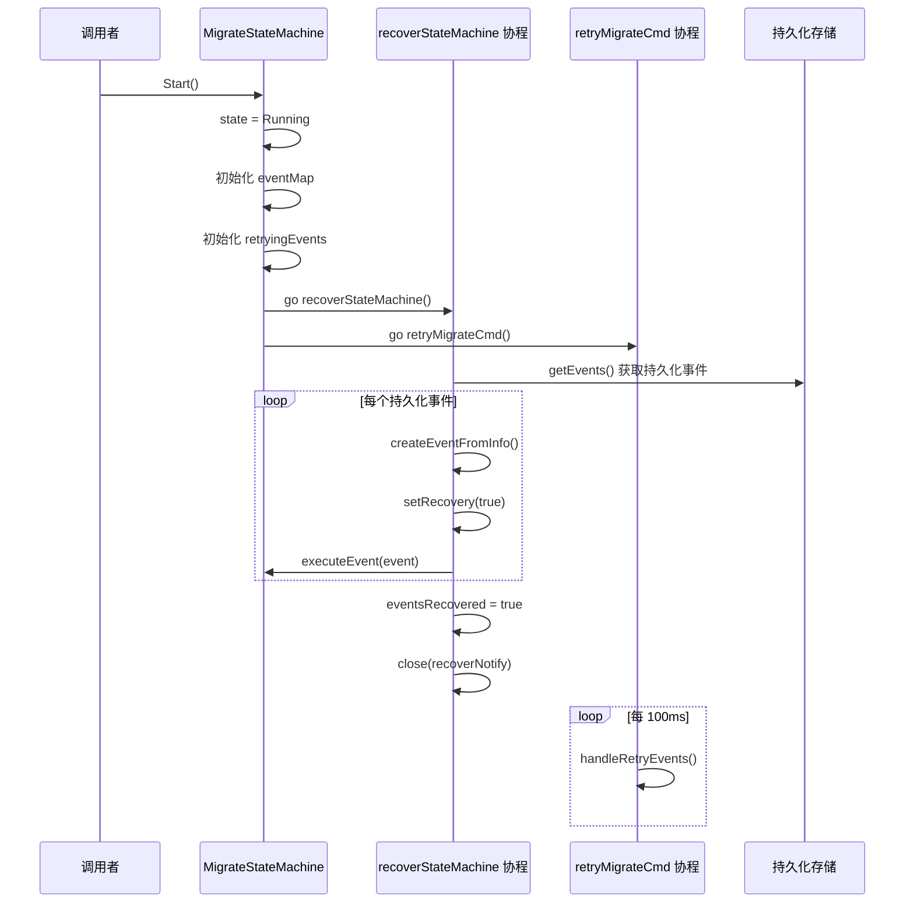
```mermaid
sequenceDiagram
    participant Caller as 调用者
    participant MSM as MigrateStateMachine
    participant Recover as recoverStateMachine 协程
    participant Retry as retryMigrateCmd 协程
    participant Store as 持久化存储

    Caller->>MSM: Start()
    MSM->>MSM: state = Running
    MSM->>MSM: 初始化 eventMap
    MSM->>MSM: 初始化 retryingEvents

    MSM->>Recover: go recoverStateMachine()
    MSM->>Retry: go retryMigrateCmd()

    Recover->>Store: getEvents() 获取持久化事件
    loop 每个持久化事件
        Recover->>Recover: createEventFromInfo()
        Recover->>Recover: setRecovery(true)
        Recover->>MSM: executeEvent(event)
    end
    Recover->>Recover: eventsRecovered = true
    Recover->>Recover: close(recoverNotify)

    loop 每 100ms
        Retry->>Retry: handleRetryEvents()
    end
```

**核心代码**：`app/ts-meta/meta/migrate_state_machine.go:66-82`

```go
// 第 66 行：Start — 启动迁移状态机
func (m *MigrateStateMachine) Start() {
    m.logger.Info("migrate state machine start")
    m.mu.Lock()
    m.state = Running                      // 设置状态为运行中
    m.eventsRecovered = false              // 标记尚未完成恢复
    m.mu.Unlock()

    m.eventMapMu.Lock()
    m.eventMap = make(map[string]MigrateEvent)  // 清空事件 map
    m.eventMapMu.Unlock()
    m.retryMu.Lock()
    m.retryingEvents = make([]MigrateEvent, 0, 64)  // 初始化重试队列
    m.retryMu.Unlock()
    m.wg.Add(2)
    go m.recoverStateMachine()  // 启动恢复协程
    go m.retryMigrateCmd()      // 启动重试协程
}
```

**逐行解释**：
- **第 69 行**：`state = Running` 开启状态机，允许处理新事件
- **第 70 行**：`eventsRecovered = false` 在恢复完成前，用户命令需要等待
- **第 74 行**：重新初始化 `eventMap`，确保干净的去重状态
- **第 77 行**：重新初始化 `retryingEvents`，容量 64 预分配
- **第 80 行**：`recoverStateMachine()` 从持久化存储恢复未完成的事件
- **第 81 行**：`retryMigrateCmd()` 定期重试失败的命令

---

### 3.3 Stop() 停止流程

**核心代码**：`app/ts-meta/meta/migrate_state_machine.go:84-93`

```go
// 第 84 行：Stop — 停止迁移状态机
func (m *MigrateStateMachine) Stop() {
    m.logger.Info("migrate state machine stop")
    m.mu.Lock()
    m.state = Stopping                    // 设置状态为正在停止
    m.recoverNotify = make(chan struct{})  // 重建 recoverNotify channel
    m.mu.Unlock()

    m.eventsWg.Wait()  // 等待所有正在处理的事件完成
    m.wg.Wait()        // 等待 retry 和 recover 协程结束
}
```

**逐行解释**：
- **第 88 行**：`state = Stopping` 阻止新事件进入
- **第 89 行**：重建 `recoverNotify` channel，为下次 Start() 做准备
- **第 92 行**：`eventsWg.Wait()` 阻塞直到所有正在执行的事件完成
- **第 93 行**：`wg.Wait()` 阻塞直到 retry 和 recover 两个协程退出

---

### 3.4 executeEvent() 事件执行入口

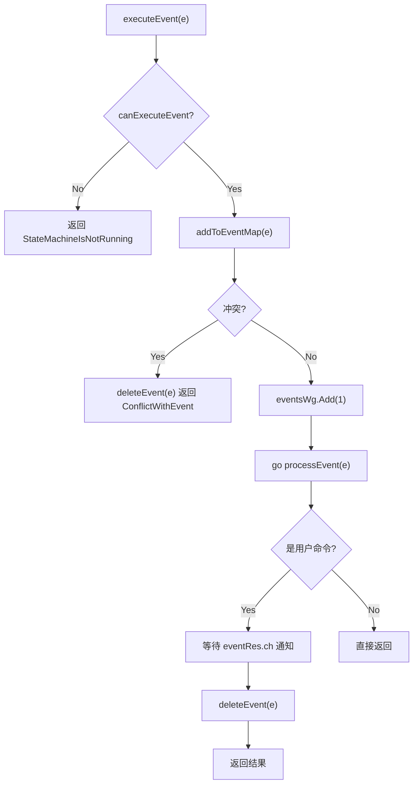
```mermaid
flowchart TD
    A["executeEvent(e)"] --> B{canExecuteEvent?}
    B -->|No| C["返回 StateMachineIsNotRunning"]
    B -->|Yes| D["addToEventMap(e)"]
    D --> E{冲突?}
    E -->|Yes| F["deleteEvent(e) 返回 ConflictWithEvent"]
    E -->|No| G["eventsWg.Add(1)"]
    G --> H["go processEvent(e)"]
    H --> I{是用户命令?}
    I -->|Yes| J["等待 eventRes.ch 通知"]
    I -->|No| K["直接返回"]
    J --> L["deleteEvent(e)"]
    L --> M["返回结果"]
```

**核心代码**：`app/ts-meta/meta/migrate_state_machine.go:328-348`

```go
// 第 328 行：executeEvent — 事件执行入口
func (m *MigrateStateMachine) executeEvent(e MigrateEvent) error {
    if !m.canExecuteEvent(!e.isInRecovery() && e.getUserCommand()) {
        return errno.NewError(errno.StateMachineIsNotRunning)
    }

    err := m.addToEventMap(e)  // 去重检查
    if err != nil {
        m.deleteEvent(e)
        return err
    }

    m.eventsWg.Add(1)
    go m.processEvent(e)       // 异步处理事件
    if e.getUserCommand() {
        err = <-e.getEventRes().ch  // 用户命令同步等待结果
        m.deleteEvent(e)
        err = e.handleCommandErr(err)
    }
    return err
}
```

**逐行解释**：
- **第 329 行**：`canExecuteEvent` 检查状态机是否在运行，以及（对于非恢复模式的用户命令）恢复是否完成
- **第 333 行**：`addToEventMap` 去重，如果同一个 PT 已有事件在处理，返回冲突错误
- **第 339 行**：`eventsWg.Add(1)` 增加等待计数，Stop() 时会等待所有事件完成
- **第 340 行**：`go processEvent(e)` 异步启动事件处理
- **第 341-345 行**：如果是用户命令（如手动 MOVE PT），同步等待结果返回

---

### 3.5 processEvent() 事件处理循环

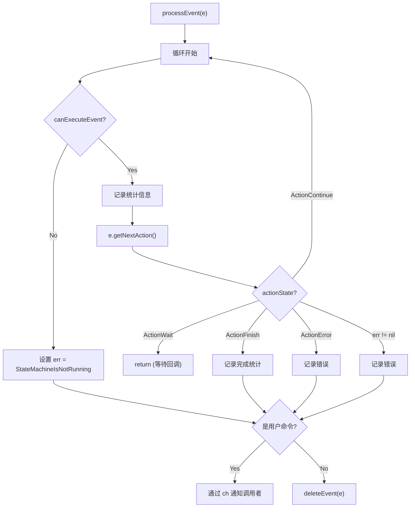
```mermaid
flowchart TD
    A["processEvent(e)"] --> B["循环开始"]
    B --> C{canExecuteEvent?}
    C -->|No| D["设置 err = StateMachineIsNotRunning"]
    C -->|Yes| E["记录统计信息"]
    E --> F["e.getNextAction()"]
    F --> G{actionState?}
    G -->|ActionContinue| B
    G -->|ActionWait| H["return (等待回调)"]
    G -->|ActionFinish| I["记录完成统计"]
    G -->|ActionError| J["记录错误"]
    G -->|err != nil| K["记录错误"]
    I --> L{是用户命令?}
    J --> L
    K --> L
    D --> L
    L -->|Yes| M["通过 ch 通知调用者"]
    L -->|No| N["deleteEvent(e)"]
```

**核心代码**：`app/ts-meta/meta/migrate_state_machine.go:252-308`

```go
// 第 252 行：processEvent — 事件处理主循环
func (m *MigrateStateMachine) processEvent(e MigrateEvent) {
    defer m.eventsWg.Done()
    var actionState NextAction
    var err error
    for {
        if !m.canExecuteEvent(false) {
            err = errno.NewError(errno.StateMachineIsNotRunning)
            // ... 记录统计信息
            break
        }

        // 记录步骤统计
        if e.getCurrState() != 0 {
            statistics.MetaDBPTStepDuration(...)
            e.setStartTime(time.Now())
        }
        actionState, err = e.getNextAction()  // 获取下一步动作
        if err != nil {
            break
        }
        if actionState == ActionFinish {
            // 最后一步，记录完成统计
        }
        if actionState == ActionWait {
            return  // 已发送命令到 store，等待回调
        }
        if actionState != ActionContinue {
            break
        }
    }

    // ActionError 或 err != nil 的处理
    if actionState == ActionError {
        m.logger.Error("migrate state machine handle dbpt event occurs ActionError", ...)
    }
    if !e.getUserCommand() {
        m.deleteEvent(e)  // 非用户命令，自动清理
    } else {
        e.getEventRes().ch <- e.getEventRes().err  // 通知用户命令完成
    }
}
```

**逐行解释**：
- **第 257 行**：`canExecuteEvent(false)` 不检查恢复状态，只检查是否 Running
- **第 270 行**：`e.getNextAction()` 是核心，调用具体事件的状态处理器
- **第 282 行**：`ActionWait` 表示已向 store 发送命令，等待异步回调，此时 return 释放协程
- **第 288 行**：`ActionContinue` 表示继续处理下一个状态
- **第 295-298 行**：`ActionError` 表示事件执行失败（如分配失败），记录日志
- **第 303-307 行**：用户命令通过 channel 通知调用者，非用户命令直接删除

---

### 3.6 sendMigrateCommand() 发送迁移命令

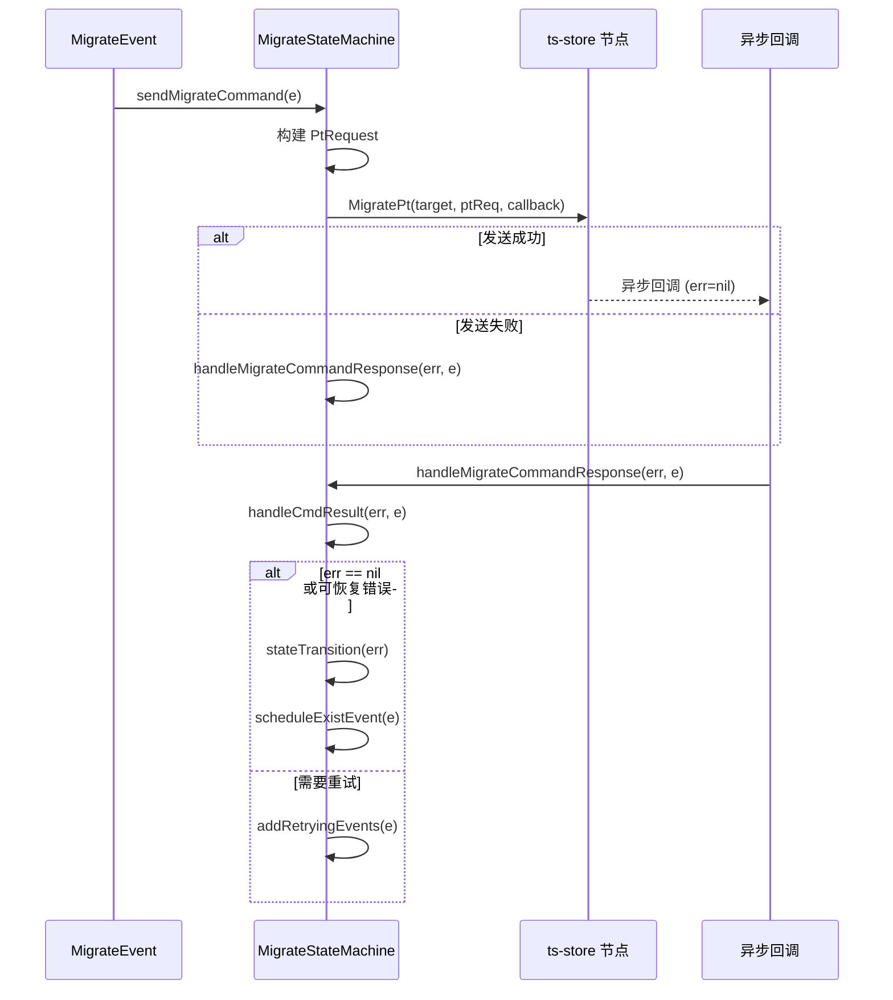
```mermaid
sequenceDiagram
    participant Event as MigrateEvent
    participant MSM as MigrateStateMachine
    participant Store as ts-store 节点
    participant CB as 异步回调

    Event->>MSM: sendMigrateCommand(e)
    MSM->>MSM: 构建 PtRequest
    MSM->>Store: MigratePt(target, ptReq, callback)
    
    alt 发送成功
        Store-->>CB: 异步回调 (err=nil)
    else 发送失败
        MSM->>MSM: handleMigrateCommandResponse(err, e)
    end
    
    CB->>MSM: handleMigrateCommandResponse(err, e)
    MSM->>MSM: handleCmdResult(err, e)
    
    alt err == nil 或可恢复错误
        MSM->>MSM: stateTransition(err)
        MSM->>MSM: scheduleExistEvent(e)
    else 需要重试
        MSM->>MSM: addRetryingEvents(e)
    end
```

**核心代码**：`app/ts-meta/meta/migrate_state_machine.go:166-196`

```go
// 第 166 行：sendMigrateCommand — 向 ts-store 发送迁移命令
func (m *MigrateStateMachine) sendMigrateCommand(e MigrateEvent) (NextAction, error) {
    pti := e.getPtInfo()
    ptReq := msgservice.NewPtRequest()
    ptReq.Pt = pti.Marshal()                        // 序列化 PT 信息
    ptReq.MigrateType = proto.Int(e.getCurrState())  // 当前状态决定操作类型
    ptReq.OpId = proto.Uint64(e.getOpId())           // 操作 ID
    ptReq.AliveConnId = proto.Uint64(e.getAliveConnId())

    cb := &msgservice.MigratePtCallback{}
    cb.SetCallbackFn(func(err error) {
        m.handleMigrateCommandResponse(err, e)  // 异步回调处理
    })
    err := globalService.store.NetStore.MigratePt(e.getTarget(), ptReq, cb)
    if err != nil {
        if errno.Equal(err, errno.NoNodeAvailable) {
            // 尝试重新添加节点连接
            node := globalService.store.data.DataNode(e.getTarget())
            if node != nil {
                transport.NewNodeManager().Add(e.getTarget(), node.TCPHost)
            }
        }
        m.handleMigrateCommandResponse(err, e)  // 同步处理错误
    }
    return ActionWait, nil  // 返回 Wait，等待回调
}
```

**逐行解释**：
- **第 170 行**：`ptReq.MigrateType` 使用当前状态值作为操作类型，store 端根据此值决定执行什么操作
- **第 176-178 行**：设置异步回调函数，store 处理完成后调用
- **第 180 行**：`MigratePt` 是网络调用，将命令发送到目标 store 节点
- **第 181-185 行**：如果发送失败且原因是 `NoNodeAvailable`，尝试重新建立连接
- **第 195 行**：无论成功失败，都返回 `ActionWait`，因为回调会继续处理

---

### 3.7 handleCmdResult() 错误容忍

**核心代码**：`app/ts-meta/meta/migrate_state_machine.go:213-233`

```go
// 第 213 行：handleCmdResult — 处理命令结果，决定调度类型
func (m *MigrateStateMachine) handleCmdResult(err error, e MigrateEvent) ScheduleType {
    // 如果节点不存活，替换错误为 DataNoAlive
    if err != nil && !globalService.clusterManager.isNodeAlive(e.getTarget()) {
        err = errno.NewError(errno.DataNoAlive)
    }
    // 以下错误认为是"可恢复"的，触发状态转移
    if err == nil || errno.Equal(err, errno.DataNoAlive) ||
        errno.Equal(err, errno.NeedChangeStore) ||
        errno.Equal(err, errno.NoConnectionAvailable) ||
        errno.Equal(err, errno.MemUsageExceeded) {
        e.stateTransition(err)
        return ScheduleNormal
    }

    // 以下错误不计入重试次数
    if !errno.Equal(err, errno.SelectClosedConn) &&
        !errno.Equal(err, errno.PtIsAlreadyMigrating) &&
        !errno.Equal(err, errno.SessionSelectTimeout) {
        e.increaseRetryCnt()
    }
    if e.exhaustRetries() {
        // 当前实现只记录错误日志；后面仍会 return ScheduleRetry
        m.logger.Error("fail to handle migration", ...)
    }
    time.Sleep(100 * time.Millisecond)  // 重试前等待 100ms
    return ScheduleRetry
}
```

**逐行解释**：
- **第 215-217 行**：如果目标节点不存活，将错误统一为 `DataNoAlive`，触发状态转移（而不是重试）
- **第 218-221 行**：`nil`（成功）、`DataNoAlive`、`NeedChangeStore`、`NoConnectionAvailable`、`MemUsageExceeded` 这些错误都会触发状态转移，让事件进入下一步（可能进入回滚流程）
- **第 223-225 行**：`SelectClosedConn`、`PtIsAlreadyMigrating`、`SessionSelectTimeout` 是临时性错误，不增加重试计数
- **第 227-229 行**：重试次数达到上限（100 次）时只记录错误日志，当前实现不会在这里停止重试或隔离 PT
- **第 231 行**：重试前等待 100ms，避免频繁重试

**通俗解释**：

这个函数是错误处理的核心决策器：
- **可恢复错误**（如节点宕机、连接断开）→ 触发状态转移，可能进入回滚流程
- **临时错误**（如连接超时、PT 正在迁移）→ 不计数，直接重试
- **其他错误** → 计数重试；达到 100 次后记录错误日志，但仍返回 `ScheduleRetry`

---

## 4. MigrateEvent 接口

### 4.1 接口定义

**核心代码**：`app/ts-meta/meta/migrate_event.go:25-59`

```go
// 第 25 行：MigrateEvent — 迁移事件接口，定义所有迁移事件必须实现的方法
type MigrateEvent interface {
    // 状态管理
    getCurrState() int                    // 获取当前状态
    getCurrStateString() string           // 获取当前状态的字符串表示
    getPreState() int                     // 获取前一个状态
    getPreStateString() string            // 获取前一个状态的字符串表示
    stateTransition(err error)            // 根据错误执行状态转移

    // 导航
    getNextAction() (NextAction, error)   // 获取下一步动作
    storeTransitionState() error          // 持久化状态转移
    rollbackLastTransition()              // 回滚上一次状态转移

    // 生命周期
    getStartTime() time.Time
    setStartTime(time.Time)
    increaseRetryCnt()                    // 增加重试计数
    exhaustRetries() bool                 // 是否耗尽重试次数

    // 事件标识
    getEventId() string                   // 事件唯一标识 (db.ptId)
    getOpId() uint64                      // 操作 ID
    setOpId(opId uint64)
    getEventType() EventType              // AssignType / MoveType

    // PT 信息
    getPtInfo() *meta.DbPtInfo            // 获取 PT 信息
    getSrc() uint64                       // 源节点 ID
    getDst() uint64                       // 目标节点 ID
    setSrc(src uint64)
    setDest(dst uint64)
    getTarget() uint64                    // 当前命令的目标节点
    getAliveConnId() uint64               // 目标节点的活跃连接 ID

    // 用户命令
    setUserCommand(isUser bool)
    getUserCommand() bool
    handleCommandErr(err error) error     // 处理用户命令的错误

    // 恢复
    isInRecovery() bool
    setRecovery(inRecover bool)

    // 存储
    removeEventFromStore()                // 从持久化存储删除事件
    getEventRes() *EventResultInfo        // 获取事件结果
    isReassignNeeded() bool               // 是否需要重新分配
    marshalEvent() *mproto.MigrateEventInfo  // 序列化
    String() string
}
```

---

### 4.2 BaseEvent 基类

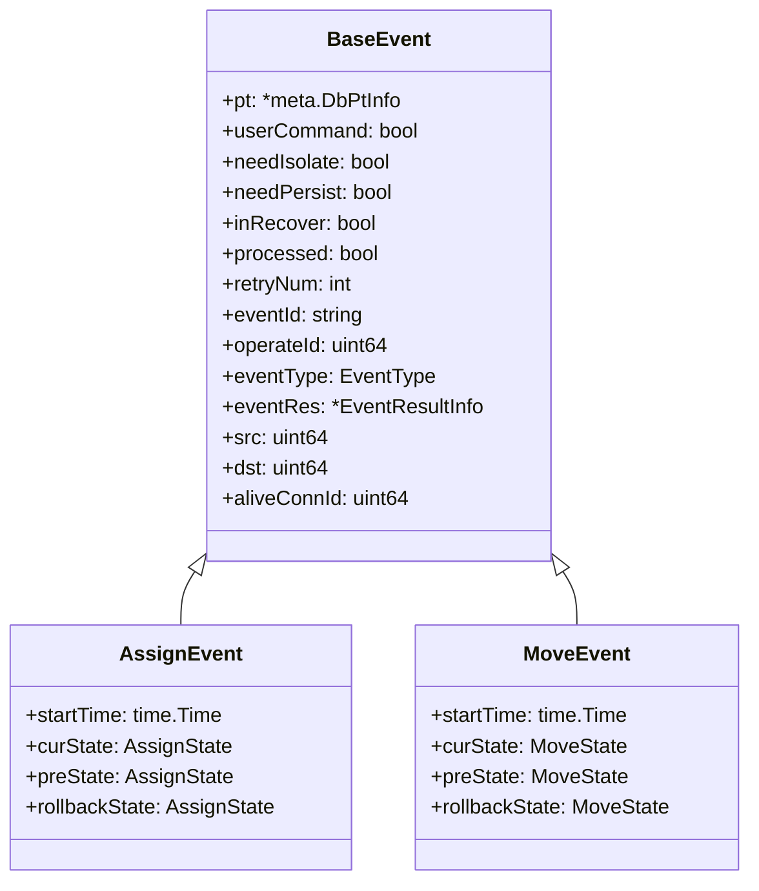
```mermaid
classDiagram
    class BaseEvent {
        +pt: *meta.DbPtInfo
        +userCommand: bool
        +needIsolate: bool
        +needPersist: bool
        +inRecover: bool
        +processed: bool
        +retryNum: int
        +eventId: string
        +operateId: uint64
        +eventType: EventType
        +eventRes: *EventResultInfo
        +src: uint64
        +dst: uint64
        +aliveConnId: uint64
    }

    class AssignEvent {
        +startTime: time.Time
        +curState: AssignState
        +preState: AssignState
        +rollbackState: AssignState
    }

    class MoveEvent {
        +startTime: time.Time
        +curState: MoveState
        +preState: MoveState
        +rollbackState: MoveState
    }

    BaseEvent <|-- AssignEvent
    BaseEvent <|-- MoveEvent
```

**核心代码**：`app/ts-meta/meta/migrate_event.go:106-124`

```go
// 第 106 行：BaseEvent — 所有迁移事件的基类
type BaseEvent struct {
    pt          *meta.DbPtInfo    // PT 信息（数据库名 + PT ID + Owner 等）
    userCommand bool              // 是否是用户命令（如手动 MOVE PT）
    needIsolate bool              // 是否需要隔离（失败时设为 Disabled）
    needPersist bool              // 是否需要持久化状态变更
    inRecover   bool              // 是否处于恢复模式
    processed   bool              // 是否已被处理过（未处理则不从 store 删除）
    retryNum    int               // 重试计数

    eventId   string              // 事件标识 = db.ptId
    operateId uint64              // 操作 ID（由 store 分配）

    eventType EventType           // AssignType / MoveType
    eventRes  *EventResultInfo    // 事件结果（错误 + 通知 channel）

    src         uint64            // 源节点 ID
    dst         uint64            // 目标节点 ID
    aliveConnId uint64            // 目标节点的活跃连接 ID
}
```

**逐行解释**：
- **第 108 行**：`pt` 包含数据库名、PT ID、Owner 节点、Shard 信息等
- **第 109 行**：`userCommand` 区分系统自动触发（如故障恢复）和用户手动触发（如 MOVE PT）
- **第 110 行**：`needIsolate` 表示失败时是否需要将 PT 置为 Disabled；当前代码没有在普通分配失败路径自动设置该标志，只有该字段已为 true 时失败处理器才隔离 PT
- **第 111 行**：`needPersist` 标记状态变更后是否需要写入持久化存储
- **第 112 行**：`inRecover` 恢复模式下跳过某些检查
- **第 113 行**：`processed` 防止未处理的事件在 deleteEvent 时误删持久化数据
- **第 114 行**：`retryNum` 记录非临时错误的重试次数；达到 `maxRetryNum(100)` 后当前实现只记录错误日志，仍会继续调度重试

---

### 4.3 NextAction 枚举

**核心代码**：`app/ts-meta/meta/migrate_event.go:89-96`

```go
// 第 89 行：NextAction — 事件处理器返回的动作类型
type NextAction int

const (
    ActionContinue NextAction = iota  // 0: 继续处理下一个状态
    ActionWait                        // 1: 已发送命令，等待回调
    ActionFinish                      // 2: 事件完成
    ActionError                       // 3: 事件失败
)
```

**通俗解释**：
- **ActionContinue**：状态转移已完成，继续执行下一个状态的处理器
- **ActionWait**：已向 store 发送命令，暂停处理，等待异步回调
- **ActionFinish**：事件成功完成，清理资源
- **ActionError**：事件失败（如分配失败），进入失败处理流程

---

### 4.4 removeEventFromStore() 持久化清理

**核心代码**：`app/ts-meta/meta/migrate_event.go:179-195`

```go
// 第 179 行：removeEventFromStore — 从持久化存储删除事件
func (e *BaseEvent) removeEventFromStore() {
    if !e.processed && !e.inRecover {
        return  // 未处理且非恢复模式，不删除
    }
    // 循环重试删除，直到成功或状态机停止
    for {
        if !globalService.msm.canExecuteEvent(false) {
            break
        }
        err := globalService.store.removeEvent(e.eventId)
        if err == nil || errno.Equal(err, errno.MetaIsNotLeader) {
            break  // 成功或不再是 Leader，停止重试
        }
        time.Sleep(100 * time.Millisecond)
    }
}
```

**逐行解释**：
- **第 180-182 行**：如果事件未被处理（`processed=false`）且不是恢复模式，直接返回。这防止了未执行的事件被误删
- **第 185-186 行**：如果状态机已停止，退出循环
- **第 188-191 行**：重试删除直到成功或不再是 Leader

---

## 5. AssignEvent 分配事件

### 5.1 状态定义

**核心代码**：`app/ts-meta/meta/assign_event.go:38-46`

```go
// 第 38 行：AssignState — 分配事件的状态
type AssignState int

const (
    Init         AssignState = 0   // 初始化
    StartAssign  AssignState = 8   // 开始分配
    AssignFailed AssignState = 9   // 分配失败
    Assigned     AssignState = 10  // 分配成功
    Final        AssignState = 11  // 终态
)
```

---

### 5.2 状态转移图

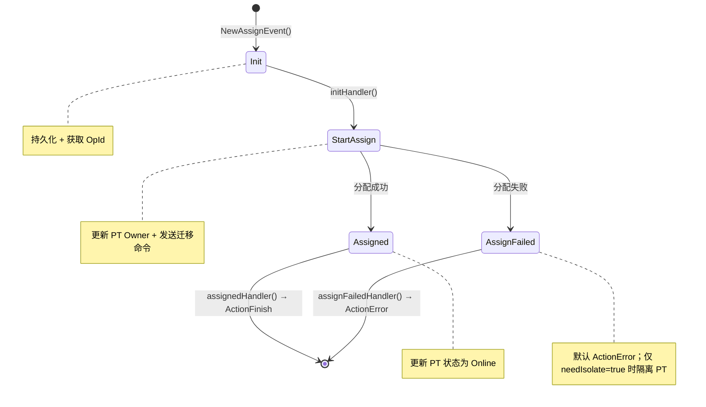
```mermaid
stateDiagram-v2
    [*] --> Init: NewAssignEvent()
    Init --> StartAssign: initHandler()
    StartAssign --> Assigned: 分配成功
    StartAssign --> AssignFailed: 分配失败
    Assigned --> [*]: assignedHandler() → ActionFinish
    AssignFailed --> [*]: assignFailedHandler() → ActionError

    note right of Init: 持久化 + 获取 OpId
    note right of StartAssign: 更新 PT Owner + 发送迁移命令
    note right of Assigned: 更新 PT 状态为 Online
    note right of AssignFailed: 默认 ActionError；仅 needIsolate=true 时隔离 PT
```

---

### 5.3 Handler Map

**核心代码**：`app/ts-meta/meta/assign_event.go:63-72`

```go
// 第 63 行：assignHandlerMap — 状态处理器映射
var assignHandlerMap map[AssignState]func(e *AssignEvent) (NextAction, error)

func init() {
    assignHandlerMap = map[AssignState]func(e *AssignEvent) (NextAction, error){
        Init:         initHandler,           // 初始化处理
        StartAssign:  startAssignHandler,    // 开始分配处理
        AssignFailed: assignFailedHandler,   // 分配失败处理
        Assigned:     assignedHandler,       // 分配成功处理
    }
}
```

---

### 5.4 initHandler — 初始化处理

**核心代码**：`app/ts-meta/meta/assign_event.go:210-226`

```go
// 第 210 行：initHandler — 初始化处理器
func initHandler(e *AssignEvent) (NextAction, error) {
    if !e.inRecover {
        err := globalService.store.createMigrateEvent(e)  // 持久化事件
        if err != nil {
            return ActionContinue, err
        }
        e.processed = true
        e.operateId = globalService.store.getEventOpId(e)  // 获取操作 ID
        if e.operateId == 0 {
            return ActionContinue, errno.NewError(errno.OpIdIsInvalid)
        }
    }
    statistics.MetaDBPTTaskInit(e.operateId, e.pt.Db, e.pt.Pti.PtId)
    e.startTime = time.Now()
    e.curState = StartAssign  // 转移到 StartAssign 状态
    return ActionContinue, nil
}
```

**逐行解释**：
- **第 211 行**：恢复模式下跳过持久化（已在存储中）
- **第 212 行**：`createMigrateEvent` 将事件写入 Raft 状态机，确保 Leader 切换后事件不丢失；当前恢复工厂主要重建事件和 op id，不应理解成完整恢复所有运行时状态字段
- **第 215 行**：`processed = true` 标记已处理，deleteEvent 时可以删除持久化数据
- **第 216 行**：`operateId` 由 store 分配，用于关联操作
- **第 224 行**：转移到 `StartAssign` 状态，下次 `getNextAction()` 会调用 `startAssignHandler`

---

### 5.5 startAssignHandler — 开始分配

**核心代码**：`app/ts-meta/meta/assign_event.go:228-240`

```go
// 第 228 行：startAssignHandler — 开始分配处理器
func startAssignHandler(e *AssignEvent) (NextAction, error) {
    // 更新 dbPT owner 为目标节点
    err := globalService.store.updatePtInfo(e.pt.Db, e.pt.Pti, e.dst, e.pt.Pti.Status)
    if errno.Equal(err, errno.PtChanged) {
        globalService.store.refreshDbPt(e.pt)  // PT 已变更，刷新
    }
    if err != nil {
        return ActionContinue, err
    }
    // 更新事件中的 PT owner
    e.pt.Pti.Owner.NodeID = e.dst
    // 发送迁移命令到 store
    return globalService.msm.sendMigrateCommand(e)
}
```

**逐行解释**：
- **第 230 行**：`updatePtInfo` 在 Raft 状态机中更新 PT 的 Owner 为目标节点
- **第 231-233 行**：如果 PT 已被其他操作变更（`PtChanged`），刷新本地缓存
- **第 237 行**：更新事件对象中的 Owner，保持一致
- **第 239 行**：`sendMigrateCommand` 向目标 store 发送命令，让它加载 PT 数据

---

### 5.6 stateTransition — 状态转移逻辑

**核心代码**：`app/ts-meta/meta/assign_event.go:141-166`

```go
// 第 141 行：stateTransition — AssignEvent 的状态转移
func (e *AssignEvent) stateTransition(err error) {
    nextState := Init
    switch e.curState {
    case StartAssign:
        if err == nil {
            nextState = Assigned      // 成功 → Assigned
        } else {
            nextState = AssignFailed  // 失败 → AssignFailed
            e.eventRes.err = err
        }
    case AssignFailed:
        nextState = AssignFailed  // 终态，不再转移
    case Assigned:
        nextState = Assigned      // 终态，不再转移
    default:
        logger.GetLogger().Error("Fail to transit the state, state is invalid")
    }

    e.rollbackState = e.preState   // 保存回滚状态
    e.preState = e.curState        // 保存前状态
    e.curState = nextState         // 设置新状态

    if e.curState != e.preState {
        e.setNeedPersist(true)     // 状态变更，需要持久化
    }
}
```

**通俗解释**：

AssignEvent 的状态转移很简单：
- `StartAssign` + 成功 → `Assigned`（分配完成）
- `StartAssign` + 失败 → `AssignFailed`（分配失败）
- `Assigned` 和 `AssignFailed` 是终态，不再转移

每次转移都会记录 `preState` 和 `rollbackState`，用于回滚。

---

## 6. MoveEvent 迁移事件

### 6.1 状态定义

MoveEvent 比 AssignEvent 复杂得多，因为它涉及**源节点卸载**和**目标节点加载**两个阶段。

**核心代码**：`lib/util/lifted/influx/meta/data.go:2155-2168`

```go
const (
    MoveInit               MoveState = 0
    MovePreOffload         MoveState = 1   // 预卸载（通知源节点准备）
    MoveRollbackPreOffload MoveState = 2   // 回滚预卸载（预分配失败时回滚源节点）
    MovePreAssign          MoveState = 3   // 预分配（通知目标节点准备）
    MoveRollbackPreAssign  MoveState = 4   // 回滚预分配（卸载失败时回滚目标节点）
    MoveOffload            MoveState = 5   // 卸载（源节点释放 PT）
    MoveOffloadFailed      MoveState = 6   // 卸载失败
    MoveOffloaded          MoveState = 7   // 已卸载（源节点已释放）
    MoveAssign             MoveState = 8   // 分配（目标节点加载 PT）
    MoveAssignFailed       MoveState = 9   // 分配失败
    MoveAssigned           MoveState = 10  // 已分配（目标节点已加载）
    MoveFinal              MoveState = 11  // 终态
)
```

| 状态值 | 状态名 | 含义 | 目标节点 |
|--------|--------|------|---------|
| 0 | MoveInit | 初始化 | 本地 |
| 1 | MovePreOffload | 预卸载（通知源节点准备） | src |
| 2 | MoveRollbackPreOffload | 回滚预卸载（预分配失败时） | src |
| 3 | MovePreAssign | 预分配（通知目标节点准备） | dst |
| 4 | MoveRollbackPreAssign | 回滚预分配（卸载失败时） | dst |
| 5 | MoveOffload | 卸载（源节点释放 PT） | src |
| 6 | MoveOffloadFailed | 卸载失败 | 本地 |
| 7 | MoveOffloaded | 已卸载（源节点已释放） | 本地 |
| 8 | MoveAssign | 分配（目标节点加载 PT） | dst |
| 9 | MoveAssignFailed | 分配失败 | 本地 |
| 10 | MoveAssigned | 已分配（目标节点已加载） | 本地 |
| 11 | MoveFinal | 终态 | 本地 |

---

### 6.2 完整状态转移图

```mermaid
stateDiagram-v2
    [*] --> MoveInit: NewMoveEvent()
    MoveInit --> MovePreOffload: initHandler()

    state "正常流程" as Normal {
        MovePreOffload --> MovePreAssign: 成功
        MovePreAssign --> MoveOffload: 成功
        MoveOffload --> MoveOffloaded: 成功/源节点宕机
        MoveOffloaded --> MoveAssign: 更新 PT 状态为 Offline
        MoveAssign --> MoveAssigned: 成功
    }

    state "回滚流程" as Rollback {
        MovePreOffload --> MoveOffloaded: 失败（源节点不可用）
        MovePreAssign --> MoveRollbackPreOffload: 失败（回滚源节点）
        MoveRollbackPreOffload --> MoveFinal: 回滚成功
        MoveRollbackPreOffload --> MoveOffloaded: 回滚失败（源节点宕机）
        MoveAssign --> MoveAssignFailed: 失败
    }

    MoveAssigned --> MoveFinal: assignedHandler()
    MoveFinal --> [*]: finalHandler()
    MoveAssignFailed --> [*]: 默认 ActionError；仅 needIsolate=true 时隔离 PT

    note right of MoveRollbackPreAssign: meta moveHandlerMap 不包含该状态<br/>当前 meta stateTransition 不会进入它
```

> **注意**：`MoveRollbackPreAssign`（值=4）不在 meta 侧 `moveHandlerMap` 中，当前 `stateTransition()` 也不会从 `MoveOffload` 进入它。`isDstEvent()` 能识别该状态，但这不是 meta move handler 的实际推进路径。

---

### 6.3 isDstEvent / isSrcEvent 路由

MoveEvent 的关键设计是**区分目标节点事件和源节点事件**，因为同一个迁移操作在源节点和目标节点上执行不同的命令。

**核心代码**：`app/ts-meta/meta/move_event.go:105-112`

```go
// 第 105 行：isDstEvent — 判断当前状态是否需要发送到目标节点
func (e *MoveEvent) isDstEvent() bool {
    return e.curState == meta.MovePreAssign ||
        e.curState == meta.MoveAssign ||
        e.curState == meta.MoveRollbackPreAssign
}

// 第 110 行：isSrcEvent — 判断当前状态是否需要发送到源节点
func (e *MoveEvent) isSrcEvent() bool {
    return e.curState == meta.MovePreOffload ||
        e.curState == meta.MoveOffload ||
        e.curState == meta.MoveRollbackPreOffload
}
```

**getTarget() 路由逻辑**：

```go
// 第 98 行：getTarget — 根据当前状态决定命令发送到哪个节点
func (e *MoveEvent) getTarget() uint64 {
    if e.isDstEvent() {
        return e.dst   // 目标节点事件 → 发送到 dst
    }
    return e.src       // 源节点事件 → 发送到 src
}
```

**通俗解释**：

```
迁移 PT 从 Node A (src) 到 Node B (dst)：

1. MovePreOffload → 发送到 Node A (src): "准备卸载 PT"
2. MovePreAssign  → 发送到 Node B (dst): "准备加载 PT"  
3. MoveOffload    → 发送到 Node A (src): "执行卸载 PT"
4. MoveOffloaded  → 本地操作：更新 PT 状态为 Offline
5. MoveAssign     → 发送到 Node B (dst): "执行加载 PT"
6. MoveAssigned   → 本地操作：更新 PT 状态为 Online
```

---

### 6.4 Handler Map

**核心代码**：`app/ts-meta/meta/move_event.go:208-224`

```go
// 第 208 行：moveHandlerMap — 状态处理器映射（11 个状态）
var moveHandlerMap map[meta.MoveState]func(e *MoveEvent) (NextAction, error)

func init() {
    moveHandlerMap = map[meta.MoveState]func(e *MoveEvent) (NextAction, error){
        meta.MoveInit:               moveInitHandler,              // 0: 初始化
        meta.MovePreOffload:         movePreOffloadHandler,        // 1: 预卸载
        meta.MoveRollbackPreOffload: moveRollbackPreOffloadHander, // 2: 回滚预卸载
        meta.MovePreAssign:          movePreAssignHandler,         // 3: 预分配
        // 注意：MoveRollbackPreAssign(4) 不在 handler map 中
        // 当前 meta stateTransition 不会进入该状态
        meta.MoveOffload:            moveOffloadHandler,           // 5: 卸载
        meta.MoveOffloadFailed:      moveOffloadFailedHandler,     // 6: 卸载失败
        meta.MoveOffloaded:          moveOffloadedHandler,         // 7: 已卸载
        meta.MoveAssign:             moveAssignHandler,            // 8: 分配
        meta.MoveAssignFailed:       moveAssignFailedHandler,      // 9: 分配失败
        meta.MoveAssigned:           moveAssignedHandler,          // 10: 已分配
        meta.MoveFinal:              moveFinalHandler,             // 11: 终态
    }
}
```

> **注意**：`MoveRollbackPreAssign`（值=4）不在 handler map 中。当前 meta 侧 `stateTransition` 不会把 `MoveOffload` 的错误转到该状态；文档不要把它写成 meta moveHandlerMap 的一环。

---

### 6.5 关键 Handler 详解

#### moveInitHandler — 初始化

**核心代码**：`app/ts-meta/meta/move_event.go:226-249`

```go
// 第 226 行：moveInitHandler — MoveEvent 初始化处理器
func moveInitHandler(e *MoveEvent) (NextAction, error) {
    if !e.inRecover {
        err := globalService.store.createMigrateEvent(e)  // 持久化
        if err != nil {
            return ActionContinue, err
        }
        e.processed = true
        e.operateId = globalService.store.getEventOpId(e)
        if e.operateId == 0 {
            return ActionContinue, errno.NewError(errno.OpIdIsInvalid)
        }
    }

    // 更新 PT 版本号（用于冲突检测）
    err := globalService.store.updatePtVersion(e.pt.Db, e.pt.Pti.PtId)
    if err != nil {
        return ActionContinue, err
    }
    e.pt.Pti.Ver = globalService.store.getPtVersion(e.pt.Db, e.pt.Pti.PtId)
    e.startTime = time.Now()
    e.curState = meta.MovePreOffload  // 转移到预卸载状态
    return ActionContinue, nil
}
```

**逐行解释**：
- **第 227-236 行**：非恢复模式下，持久化事件并获取操作 ID
- **第 239-243 行**：更新 PT 版本号，这是冲突检测的关键。如果在迁移过程中 PT 被其他操作修改，版本号会不匹配
- **第 245 行**：转移到 `MovePreOffload`，开始迁移流程

---

#### moveOffloadedHandler — 已卸载处理

**核心代码**：`app/ts-meta/meta/move_event.go:273-285`

```go
// 第 273 行：moveOffloadedHandler — 源节点已卸载 PT 后的处理
func moveOffloadedHandler(e *MoveEvent) (NextAction, error) {
    // 更新 db pt 状态为 offline
    err := globalService.store.updatePtInfo(e.pt.Db, e.pt.Pti, e.src, meta.Offline)
    if errno.Equal(err, errno.PtChanged) {
        globalService.store.refreshDbPt(e.pt)
    }
    if err != nil {
        return ActionContinue, err
    }
    e.pt.Pti.Status = meta.Offline
    e.stateTransition(nil)  // 成功，转移到 MoveAssign
    return ActionContinue, nil
}
```

**逐行解释**：
- **第 275 行**：在 Raft 状态机中将 PT 状态更新为 `Offline`，表示源节点已释放
- **第 282 行**：`stateTransition(nil)` 表示成功，转移到 `MoveAssign` 状态

---

#### moveAssignHandler — 目标节点分配

**核心代码**：`app/ts-meta/meta/move_event.go:287-300`

```go
// 第 287 行：moveAssignHandler — 目标节点分配 PT
func moveAssignHandler(e *MoveEvent) (NextAction, error) {
    // 更新 PT owner 为目标节点
    err := globalService.store.updatePtInfo(e.pt.Db, e.pt.Pti, e.dst, e.pt.Pti.Status)
    if errno.Equal(err, errno.PtChanged) {
        globalService.store.refreshDbPt(e.pt)
    }
    if err != nil {
        return ActionContinue, err
    }
    // 更新事件中的 PT owner
    e.pt.Pti.Owner.NodeID = e.dst
    // 刷新 shard 信息（避免写入时创建新 shard）
    globalService.store.refreshShards(e)
    // 发送迁移命令到目标节点
    return globalService.msm.sendMigrateCommand(e)
}
```

**逐行解释**：
- **第 289 行**：将 PT 的 Owner 更新为目标节点
- **第 296 行**：`refreshShards` 刷新 shard 信息，确保目标节点知道需要加载哪些 shard
- **第 298 行**：发送命令到目标节点，让它实际加载 PT 数据

---

### 6.6 stateTransition — MoveEvent 状态转移

**核心代码**：`app/ts-meta/meta/move_event.go:123-167`

```go
// 第 123 行：stateTransition — MoveEvent 的状态转移逻辑
func (e *MoveEvent) stateTransition(err error) {
    nextState := e.curState
    switch e.curState {
    case meta.MovePreOffload:
        if err == nil {
            nextState = meta.MovePreAssign    // 成功 → 预分配
            break
        }
        nextState = meta.MoveOffloaded        // 失败 → 直接标记已卸载

    case meta.MovePreAssign:
        if err == nil {
            nextState = meta.MoveOffload      // 成功 → 卸载
            break
        }
        nextState = meta.MoveRollbackPreOffload  // 失败 → 回滚预卸载

    case meta.MoveOffload:
        nextState = meta.MoveOffloaded         // 无论 err 是否为 nil → 已卸载

    case meta.MoveOffloaded:
        nextState = meta.MoveAssign            // → 分配

    case meta.MoveAssign:
        if err == nil {
            nextState = meta.MoveAssigned      // 成功 → 已分配
            break
        }
        nextState = meta.MoveAssignFailed      // 失败 → 分配失败
        e.eventRes.err = err

    case meta.MoveRollbackPreOffload:
        if err == nil {
            nextState = meta.MoveFinal          // 回滚成功 → 终态
            break
        }
        nextState = meta.MoveOffloaded          // 回滚失败 → 标记已卸载
    }

    e.rollbackState = e.preState
    e.preState = e.curState
    e.curState = nextState

    if e.curState != e.preState {
        e.setNeedPersist(true)
    }
}
```

**状态转移表**：

| 当前状态 | 错误 | 下一状态 | 说明 |
|----------|------|----------|------|
| MovePreOffload | nil | MovePreAssign | 源节点准备完成 |
| MovePreOffload | err | MoveOffloaded | 源节点不可用，跳过卸载 |
| MovePreAssign | nil | MoveOffload | 目标节点准备完成 |
| MovePreAssign | err | MoveRollbackPreOffload | 目标节点不可用，回滚源节点 |
| MoveOffload | nil | MoveOffloaded | 卸载完成 |
| MoveOffload | err | MoveOffloaded | 卸载失败也标记已卸载，继续后续本地离线处理 |
| MoveRollbackPreAssign | any | - | 不由 meta `stateTransition()` 进入，也不在 `moveHandlerMap` 中 |
| MoveOffloaded | - | MoveAssign | 更新状态后继续 |
| MoveAssign | nil | MoveAssigned | 目标节点加载成功 |
| MoveAssign | err | MoveAssignFailed | 目标节点加载失败 |
| MoveRollbackPreOffload | nil | MoveFinal | 回滚成功 |
| MoveRollbackPreOffload | err | MoveOffloaded | 回滚失败，源节点已不可用 |

---

### 6.7 回滚流程详解

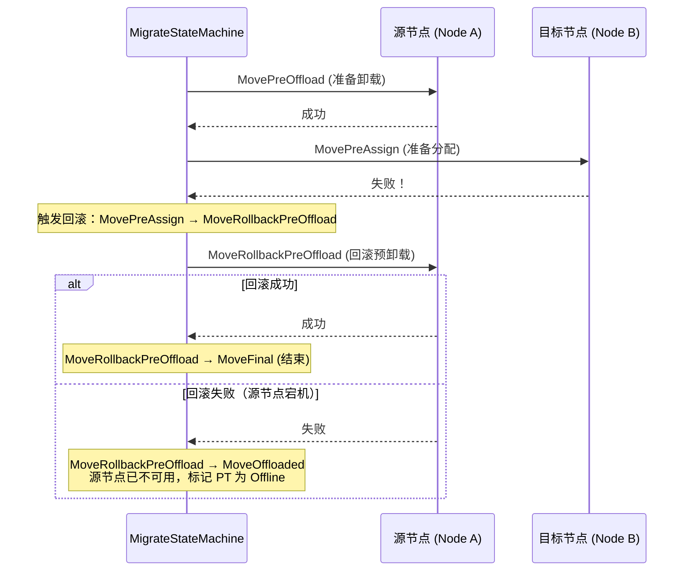
```mermaid
sequenceDiagram
    participant MSM as MigrateStateMachine
    participant Src as 源节点 (Node A)
    participant Dst as 目标节点 (Node B)

    MSM->>Src: MovePreOffload (准备卸载)
    Src-->>MSM: 成功
    MSM->>Dst: MovePreAssign (准备分配)
    Dst-->>MSM: 失败！

    Note over MSM: 触发回滚：MovePreAssign → MoveRollbackPreOffload

    MSM->>Src: MoveRollbackPreOffload (回滚预卸载)
    
    alt 回滚成功
        Src-->>MSM: 成功
        Note over MSM: MoveRollbackPreOffload → MoveFinal (结束)
    else 回滚失败（源节点宕机）
        Src-->>MSM: 失败
        Note over MSM: MoveRollbackPreOffload → MoveOffloaded<br/>源节点已不可用，标记 PT 为 Offline
    end
```

**通俗解释**：

回滚流程处理的是"半途而废"的情况：
1. 源节点已经准备好卸载（`MovePreOffload` 成功）
2. 但目标节点准备失败（`MovePreAssign` 失败）
3. 此时需要告诉源节点"取消卸载"（`MoveRollbackPreOffload`）
4. 如果源节点还能通信，回滚成功，迁移取消
5. 如果源节点也挂了，只能标记 PT 为 Offline

---

## 7. BalanceStore 均衡算法

### 7.1 概述

均衡算法是 openGemini 在共享存储模式下自动平衡 PT 分布的核心逻辑。

**核心代码**：`app/ts-meta/meta/balance_store.go:113-150`

```go
// 第 113 行：balanceDBPts — 均衡所有数据库的 PT 分布
func (s *Store) balanceDBPts() []*MoveEvent {
    var moveEvents []*MoveEvent
    s.mu.RLock()
    defer s.mu.RUnlock()

    // 仅在共享存储模式且均衡器启用时执行
    if config.GetHaPolicy() != config.SharedStorage || !s.data.BalancerEnabled {
        return nil
    }

    // 收集存活的节点
    var aliveNodes []uint64
    for _, dataNode := range s.data.DataNodes {
        if dataNode.SegregateStatus == meta.Normal &&
            dataNode.Status == serf.StatusAlive &&
            dataNode.AliveConnID == dataNode.ConnID {
            aliveNodes = append(aliveNodes, dataNode.ID)
        }
    }
    if len(aliveNodes) == 0 {
        return nil
    }
    sort.Slice(aliveNodes, func(i, j int) bool {
        return aliveNodes[i] < aliveNodes[j]  // 排序确保一致性
    })

    // 遍历所有数据库
    var dbLst []string
    for k := range s.data.PtView {
        dbLst = append(dbLst, k)
    }
    sort.Strings(dbLst)
    for _, db := range dbLst {
        if err := s.data.CheckCanMoveDb(db); err != nil {
            continue  // 跳过不可迁移的数据库
        }
        dbInfo := s.data.GetDBBriefInfo(db)
        moveEvents = s.balanceOneDBPts(db, &aliveNodes, moveEvents, dbInfo)
    }
    return moveEvents
}
```

**逐行解释**：
- **第 119 行**：仅在 `SharedStorage` 模式且 `BalancerEnabled` 时执行均衡
- **第 122-127 行**：筛选条件：`SegregateStatus == Normal`（未隔离）、`Status == Alive`（存活）、`AliveConnID == ConnID`（连接正常）
- **第 130-133 行**：排序确保遍历顺序一致，避免不同节点产生不同的均衡决策
- **第 143 行**：`CheckCanMoveDb` 检查数据库是否允许迁移（如正在删除的数据库不允许）

---

### 7.2 dbBalanceBasicData 均衡基础数据

**核心代码**：`app/ts-meta/meta/balance_store.go:100-111`

```go
// 第 100 行：dbBalanceBasicData — 均衡算法的基础数据结构
type dbBalanceBasicData struct {
    dbName                      string
    totalNumOfPt, aliveDnNum    int   // PT 总数、存活节点数
    halfPtId, max, min, ptTHNum int   // 中位数、最大值、最小值、阈值
    highLvlNum                  int   // 可以分配 max 个 PT 的节点数
    minOfLH                     int   // 低半区/高半区每节点最小 PT 数
    dnPtIds                     map[uint64]DbPtIds  // 节点 → PT 分布
    aliveDns                    *[]uint64            // 存活节点列表
}
```

**通俗解释**：

假设 6 个 PT 分布在 3 个节点上：
```
totalNumOfPt = 6
aliveDnNum = 3
halfPtId = 3          (PT ID 0-2 为低半区，3-5 为高半区)
min = 2               (每节点最少 2 个 PT)
max = 2               (每节点最多 2 个 PT，6/3=2)
ptTHNum = 1           (阈值 = max/2 + max%2 = 1)
highLvlNum = 0        (6 % 3 = 0，没有节点需要多分一个)
minOfLH = 1           (每节点在低/高半区至少 1 个 PT)
```

---

### 7.3 genDBBalanceBasicData — 生成均衡数据

**核心代码**：`app/ts-meta/meta/balance_store.go:459-515`

```go
// 第 459 行：genDBBalanceBasicData — 生成均衡基础数据
func (s *Store) genDBBalanceBasicData(bbd *dbBalanceBasicData) error {
    // 按节点分组 PT
    dnPts := make(map[uint64]meta.DBPtInfos)
    for _, ptInfo := range s.data.PtView[bbd.dbName] {
        dnId := ptInfo.Owner.NodeID
        dnPts[dnId] = append(dnPts[dnId], ptInfo)
    }

    bbd.totalNumOfPt = len(s.data.PtView[bbd.dbName])
    // 计算存活节点上的 PT 总数
    totalPts := func(pts map[uint64]meta.DBPtInfos) int {
        var num int
        for _, dnId := range *(bbd.aliveDns) {
            num += len(pts[dnId])
        }
        return num
    }(dnPts)

    // 检查存活节点是否加载了所有 PT
    if totalPts != bbd.totalNumOfPt {
        return fmt.Errorf("alive node load all pts is not complete, %d != %d",
            totalPts, bbd.totalNumOfPt)
    }

    bbd.aliveDnNum = len(*bbd.aliveDns)
    bbd.halfPtId = bbd.totalNumOfPt / 2
    bbd.highLvlNum = bbd.totalNumOfPt % bbd.aliveDnNum
    avgPtNum := bbd.totalNumOfPt / bbd.aliveDnNum
    bbd.min = avgPtNum
    if bbd.highLvlNum > 0 {
        avgPtNum += 1
    }
    bbd.max = avgPtNum
    bbd.ptTHNum = avgPtNum/2 + avgPtNum%2
    bbd.minOfLH = bbd.halfPtId / bbd.aliveDnNum

    // 将 PT 按 halfPtId 分为低半区和高半区
    bbd.dnPtIds = func(pts map[uint64]meta.DBPtInfos) map[uint64]DbPtIds {
        dnPtIds := make(map[uint64]DbPtIds)
        for _, dnId := range *(bbd.aliveDns) {
            if _, ok := pts[dnId]; !ok {
                dnPtIds[dnId] = DbPtIds{}
                continue
            }
            for _, pt := range pts[dnId] {
                low := dnPtIds[dnId].lowIds
                high := dnPtIds[dnId].highIds
                if pt.PtId < uint32(bbd.halfPtId) {
                    low = append(low, pt.PtId)   // 低半区 [0, half)
                } else {
                    high = append(high, pt.PtId)  // 高半区 [half, ptNum)
                }
                dnPtIds[dnId] = DbPtIds{lowIds: low, highIds: high}
            }
        }
        return dnPtIds
    }(dnPts)

    return nil
}
```

**逐行解释**：
- **第 461-464 行**：按节点 ID 分组所有 PT
- **第 475-477 行**：验证所有 PT 都在存活节点上，如果有 PT 在已宕机的节点上，返回错误
- **第 480-488 行**：计算均衡参数：`min`（每节点最少 PT 数）、`max`（每节点最多 PT 数）
- **第 488 行**：`ptTHNum` 是阈值，用于判断某个节点的 PT 是否"过多"
- **第 492-512 行**：将 PT 按 `halfPtId` 分为低半区和高半区，这是为了确保 PT ID 的均匀分布

---

### 7.4 balanceOneDBPts — 单数据库均衡

**核心代码**：`app/ts-meta/meta/balance_store.go:224-242`

```go
// 第 224 行：balanceOneDBPts — 均衡单个数据库的 PT
func (s *Store) balanceOneDBPts(db string, aliveNodes *[]uint64,
    moveEvents []*MoveEvent, dbBriefInfo *meta.DatabaseBriefInfo) []*MoveEvent {

    st := time.Now()
    bbd := dbBalanceBasicData{dbName: db, aliveDns: aliveNodes}
    if err := s.genDBBalanceBasicData(&bbd); err != nil {
        return nil
    }

    // 提取需要移动的 PT
    mvlowPts, mvhighPts := s.extractNeedMovePtLst(&bbd)
    // 分配 PT 到目标节点
    tasks := s.balanceAssignPts(&bbd, &mvlowPts, &mvhighPts)
    // 创建 MoveEvent
    moveEvents = s.addMovePtTasks(db, &tasks, moveEvents, dbBriefInfo)

    return moveEvents
}
```

**流程图**：

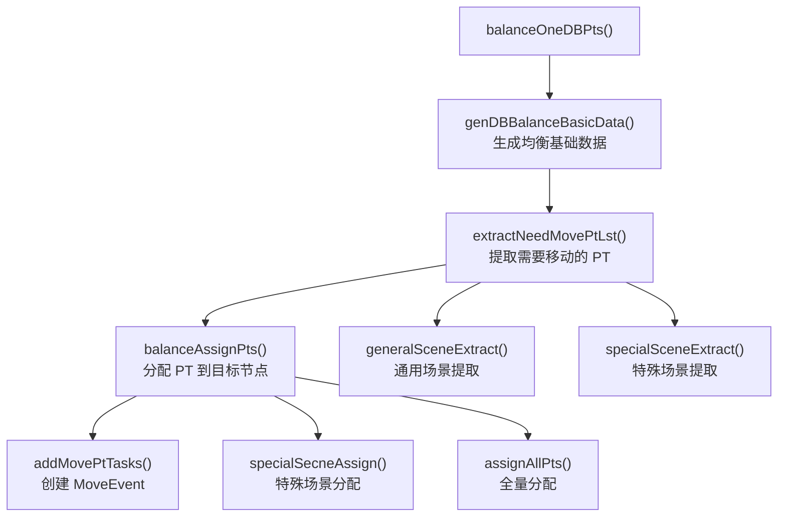
```mermaid
flowchart TD
    A["balanceOneDBPts()"] --> B["genDBBalanceBasicData()<br/>生成均衡基础数据"]
    B --> C["extractNeedMovePtLst()<br/>提取需要移动的 PT"]
    C --> D["balanceAssignPts()<br/>分配 PT 到目标节点"]
    D --> E["addMovePtTasks()<br/>创建 MoveEvent"]

    C --> C1["generalSceneExtract()<br/>通用场景提取"]
    C --> C2["specialSceneExtract()<br/>特殊场景提取"]

    D --> D1["specialSecneAssign()<br/>特殊场景分配"]
    D --> D2["assignAllPts()<br/>全量分配"]
```

---

### 7.5 generalSceneExtract — 通用场景提取

**核心代码**：`app/ts-meta/meta/balance_store.go:373-420`

```go
// 第 373 行：generalSceneExtract — 通用场景下提取需要移动的 PT
func generalSceneExtract(bbd *dbBalanceBasicData, toLowPts, toHighPts *mvPtInfos) {
    selFir, selSec := true, true
    highNum := bbd.highLvlNum
    retainNum := bbd.max

    for _, dn := range *(bbd.aliveDns) {
        if highNum <= 0 {
            retainNum = bbd.min  // 已分配完 highLvlNum 个节点，后续节点用 min
        }

        low := bbd.dnPtIds[dn].lowIds
        high := bbd.dnPtIds[dn].highIds
        ptTotalNum := len(low) + len(high)

        if ptTotalNum >= retainNum {
            mvNum := ptTotalNum - retainNum  // 需要移出的 PT 数量
            // 使用阈值规则提取
            redTH := ruleExtrData{selLow: &selFir, ...}
            redSupp := ruleExtrData{selLow: &selSec, ..., ptTH: 0}
            for mvNum > 0 {
                if ruleExtract(&redTH) { continue }
                if ruleExtract(&redSupp) { continue }
            }
            if highNum > 0 { highNum-- }
        }

        // 处理数据倾斜场景
        mvNum := math.MaxInt32
        epdLow := extractPtData{from: &low, to: toLowPts, mvNum: &mvNum, ptTH: bbd.ptTHNum, dnId: dn}
        epdHigh := extractPtData{from: &high, to: toHighPts, mvNum: &mvNum, ptTH: bbd.ptTHNum, dnId: dn}
        for {
            if extractPtId(&epdLow) || extractPtId(&epdHigh) { continue }
            break
        }
        bbd.dnPtIds[dn] = DbPtIds{lowIds: low, highIds: high}
    }
}
```

**通俗解释**：

这个函数的工作是找出"哪个节点的 PT 太多了，需要移出"：
1. 遍历每个存活节点
2. 如果某节点的 PT 数量超过 `retainNum`（max 或 min），多出的部分需要移出
3. 移出时优先从低半区和高半区交替提取，保持 ID 分布均匀
4. 阈值 `ptTHNum` 确保每个节点在低/高半区至少保留一定数量的 PT

---

### 7.6 特殊场景处理 (Old/New PT)

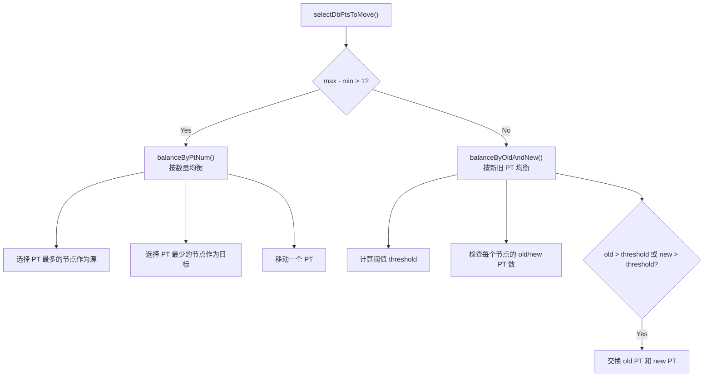
```mermaid
flowchart TD
    A["selectDbPtsToMove()"] --> B{max - min > 1?}
    B -->|Yes| C["balanceByPtNum()<br/>按数量均衡"]
    B -->|No| D["balanceByOldAndNew()<br/>按新旧 PT 均衡"]

    C --> E["选择 PT 最多的节点作为源"]
    C --> F["选择 PT 最少的节点作为目标"]
    C --> G["移动一个 PT"]

    D --> H["计算阈值 threshold"]
    D --> I["检查每个节点的 old/new PT 数"]
    D --> J{old > threshold 或 new > threshold?}
    J -->|Yes| K["交换 old PT 和 new PT"]
```

**核心代码**：`app/ts-meta/meta/balance_store.go:517-571`

```go
// 第 517 行：selectDbPtsToMove — 选择需要移动的 PT（简化版均衡）
func (s *Store) selectDbPtsToMove() []*MoveEvent {
    // ... 省略前置检查

    for db := range s.data.PtView {
        // ... 省略检查
        // 找出 PT 最多和最少的节点
        maxPtNum := -1
        minPtNum := math.MaxInt32
        var from, to uint64
        for i := range aliveNodes {
            if minPtNum > len(nodePtsMap[aliveNodes[i]]) {
                minPtNum = len(nodePtsMap[aliveNodes[i]])
                to = aliveNodes[i]
            }
            if maxPtNum < len(nodePtsMap[aliveNodes[i]]) {
                maxPtNum = len(nodePtsMap[aliveNodes[i]])
                from = aliveNodes[i]
            }
        }

        if maxPtNum-minPtNum > 1 {
            moveEvents = s.balanceByPtNum(db, from, to, ...)  // 差距 > 1，按数量均衡
        } else {
            moveEvents = s.balanceByOldAndNew(db, aliveNodes, ...)  // 差距 = 1，按新旧均衡
        }
    }
    return moveEvents
}
```

**具体例子**：

```
场景 1：按数量均衡
  Node 1: 4 个 PT (max)
  Node 2: 2 个 PT (min)
  差距 = 2 > 1
  → 从 Node 1 移动 1 个 PT 到 Node 2

场景 2：按新旧 PT 均衡
  Node 1: PT0(old), PT1(old)  → 2 个 old, 0 个 new
  Node 2: PT2(new), PT3(new)  → 0 个 old, 2 个 new
  threshold = 1
  → 交换：Node 1 的 PT1(old) 移到 Node 2，Node 2 的 PT2(new) 移到 Node 1
  结果：Node 1: PT0(old), PT2(new)  Node 2: PT1(old), PT3(new)
```

---

## 8. ClusterManager Gossip 事件分发

### 8.1 架构概览

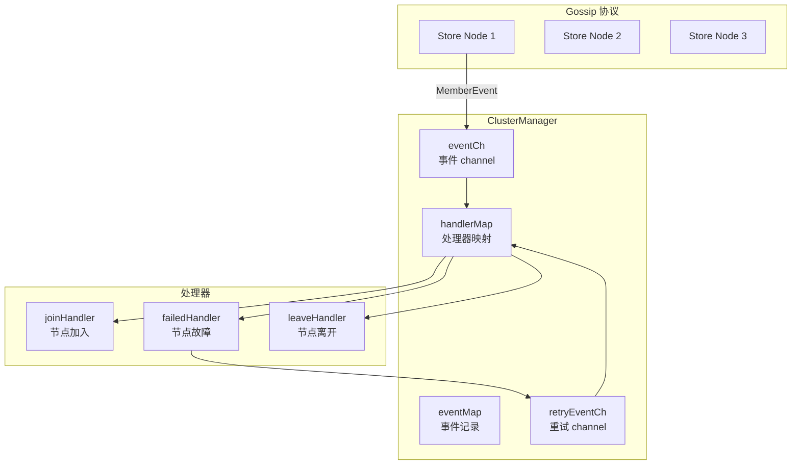
```mermaid
graph TB
    subgraph "Gossip 协议"
        S1["Store Node 1"]
        S2["Store Node 2"]
        S3["Store Node 3"]
    end

    subgraph "ClusterManager"
        EC["eventCh<br/>事件 channel"]
        HM["handlerMap<br/>处理器映射"]
        EM["eventMap<br/>事件记录"]
        RE["retryEventCh<br/>重试 channel"]
    end

    subgraph "处理器"
        JH["joinHandler<br/>节点加入"]
        FH["failedHandler<br/>节点故障"]
        LH["leaveHandler<br/>节点离开"]
    end

    S1 -->|"MemberEvent"| EC
    EC --> HM
    HM --> JH
    HM --> FH
    HM --> LH
    FH --> RE
    RE --> HM
```

**核心代码**：`app/ts-meta/meta/cluster_manager.go:69-86`

```go
// 第 69 行：ClusterManager — 集群管理器结构体
type ClusterManager struct {
    store           storeInterface          // 存储接口
    eventCh         chan serf.Event          // Gossip 事件 channel
    retryEventCh    chan serf.Event          // 重试事件 channel
    closing         chan struct{}            // 关闭信号
    reOpen          chan struct{}            // Leader 切换时重新打开
    handlerMap      map[serf.EventType]memberEventHandler  // 事件处理器映射
    wg              sync.WaitGroup
    mu              sync.RWMutex
    eventMap        map[string]*serf.MemberEvent  // 事件记录（用于 Leader 切换重放）
    eventWg         sync.WaitGroup
    memberIds       map[uint64]struct{}     // 存活的 ts-store 成员
    stop            int32                   // 停止标志
    takeover        chan bool               // 接管信号
    getTakeOverNode chooseTakeoverNodeFn    // 选择接管节点的函数
    pingFailedNode  bool
}
```

---

### 8.2 checkEvents() 主循环

**核心代码**：`app/ts-meta/meta/cluster_manager.go:268-316`

```go
// 第 268 行：checkEvents — 事件处理主循环
func (cm *ClusterManager) checkEvents() {
    defer cm.wg.Done()
    check := time.After(10 * time.Second)
    sendFailedEvent := false

    var preEventType serf.EventType
    var processEvent = func(event serf.Event, from eventFrom) {
        et := event.EventType()
        if et == preEventType {
            cm.eventWg.Add(1)
            go cm.processEvent(event, from)  // 同类型事件并行处理
            return
        }
        preEventType = et
        cm.eventWg.Wait()          // 不同类型事件串行处理
        cm.eventWg.Add(1)
        cm.processEvent(event, from)
    }

    for {
        select {
        case <-cm.reOpen:
            // Leader 切换，重新处理所有事件
            for i := 0; i < len(cm.eventCh); i++ {
                e := <-cm.eventCh
                processEvent(e, fromReopen)
            }
            return
        case <-cm.closing:
            return
        case event := <-cm.eventCh:
            processEvent(event, fromGossip)
        case event := <-cm.retryEventCh:
            processEvent(event, fromRetryChan)
        case <-check:
            if !sendFailedEvent {
                sendFailedEvent = true
                cm.checkFailedNode()  // 自检：是否有遗漏的故障节点
            }
        case takeoverEnable := <-cm.takeover:
            if takeoverEnable {
                go cm.checkTakeover()
            }
        }
    }
}
```

**逐行解释**：
- **第 274-282 行**：`processEvent` 闭包实现了"同类事件并行，异类事件串行"的策略
- **第 289-295 行**：`reOpen` 触发时，清空 channel 中的事件并重新处理，这是 Leader 切换后的恢复机制
- **第 301-304 行**：正常的 Gossip 事件和重试事件都通过 `processEvent` 处理
- **第 305-309 行**：10 秒后触发一次自检，确保没有遗漏的故障节点

---

### 8.3 processEvent() 事件处理

**核心代码**：`app/ts-meta/meta/cluster_manager.go:404-421`

```go
// 第 404 行：processEvent — 处理单个 Gossip 事件
func (cm *ClusterManager) processEvent(event serf.Event, from eventFrom) {
    defer cm.eventWg.Done()
    if cm.handlerMap[event.EventType()] == nil {
        return  // 忽略 update 和 reap 事件
    }
    e := event.(serf.MemberEvent)
    me := initMemberEvent(from, e, cm.handlerMap[event.EventType()])
    err := me.handle()
    if err == raft.ErrNotLeader || errno.Equal(err, errno.MetaIsNotLeader) {
        return  // 不是 Leader，不处理
    }
    if err != nil {
        cm.retryEventCh <- e  // 处理失败，放入重试 channel
    }
}
```

**逐行解释**：
- **第 407 行**：只处理 Join、Failed、Leave 三种事件
- **第 413 行**：`initMemberEvent` 创建具体的事件处理器
- **第 414 行**：`me.handle()` 执行事件处理，可能触发 PT 迁移
- **第 419 行**：处理失败的事件放入 `retryEventCh`，等待下次重试

---

### 8.4 resendPreviousEvent() Leader 切换重放

**核心代码**：`app/ts-meta/meta/cluster_manager.go:184-253`

```go
// 第 184 行：resendPreviousEvent — Leader 切换时重放之前的事件
func (cm *ClusterManager) resendPreviousEvent(from eventFrom) {
    dataNodes := globalService.store.dataNodes()
    sqlNodes := globalService.store.sqlNodes()
    metaNodes := globalService.store.metaNodes()
    cm.mu.RLock()

    // 遍历所有数据节点
    for i := range dataNodes {
        if dataNodes[i].Status == serf.StatusAlive {
            cm.memberIds[dataNodes[i].ID] = struct{}{}
        }
        e := cm.eventMap[strconv.FormatUint(dataNodes[i].ID, 10)]
        if e == nil || uint64(e.EventTime) < dataNodes[i].LTime {
            continue
        }
        // 如果事件已处理，不重复处理
        if uint64(e.EventTime) == dataNodes[i].LTime {
            if e.Type == serf.EventMemberJoin && dataNodes[i].Status == serf.StatusAlive {
                continue
            }
            if e.Type == serf.EventMemberFailed && dataNodes[i].Status == serf.StatusFailed {
                continue
            }
        }
        // 重放事件
        cm.eventWg.Add(1)
        go cm.processEvent(*e, from)
    }
    // ... 类似处理 sqlNodes 和 metaNodes
    cm.mu.RUnlock()
}
```

**逐行解释**：
- **第 193-195 行**：更新 `memberIds`，记录存活的节点
- **第 196-197 行**：从 `eventMap` 中查找该节点的最新事件
- **第 199-206 行**：如果事件已经处理过（状态匹配），跳过
- **第 209-210 行**：否则重放事件，确保 Leader 切换期间的事件不丢失

**通俗解释**：

当 Leader 切换时，新 Leader 可能遗漏了一些 Gossip 事件。`resendPreviousEvent` 的作用是：
1. 遍历所有节点
2. 对比 `eventMap` 中的事件和节点当前状态
3. 如果有未处理的事件，重新执行

---

### 8.5 processFailedDbPt() 故障 PT 处理

**核心代码**：`app/ts-meta/meta/cluster_manager.go:541-560`

```go
// 第 541 行：processFailedDbPtNormal — 处理故障 PT（非复制模式）
func (cm *ClusterManager) processFailedDbPtNormal(dbPt *meta.DbPtInfo,
    nodePtNumMap *map[uint64]uint32, isRetry bool) error {

    // 检查 PT 状态
    status, err := globalService.store.getPtStatus(dbPt.Db, dbPt.Pti.PtId)
    if err != nil {
        return err
    }
    if status == meta.Online {
        return nil  // 已在线，无需处理
    }

    // 选择接管节点
    targetId, err := cm.getTakeOverNode(cm, dbPt.Pti.Owner.NodeID, nodePtNumMap, isRetry)
    if err != nil {
        return err
    }

    // 获取目标节点的活跃连接
    aliveConnId, err := globalService.store.getDataNodeAliveConnId(targetId)
    if err != nil {
        return err
    }

    // 创建 AssignEvent 并执行
    return globalService.balanceManager.assignDbPt(dbPt, targetId, aliveConnId, false)
}
```

**逐行解释**：
- **第 547-549 行**：如果 PT 已经是 Online 状态，说明已被其他节点接管，跳过
- **第 552 行**：`getTakeOverNode` 根据策略选择接管节点：
  - **WriteAvailableFirst**：选择 PT 的原 Owner 节点（等待它恢复）
  - **SharedStorage**：选择 PT 数量最少的节点
- **第 558 行**：`assignDbPt` 创建 AssignEvent 并提交给 MigrateStateMachine

---

## 9. 事件恢复与重试

### 9.1 recoverStateMachine() 恢复流程

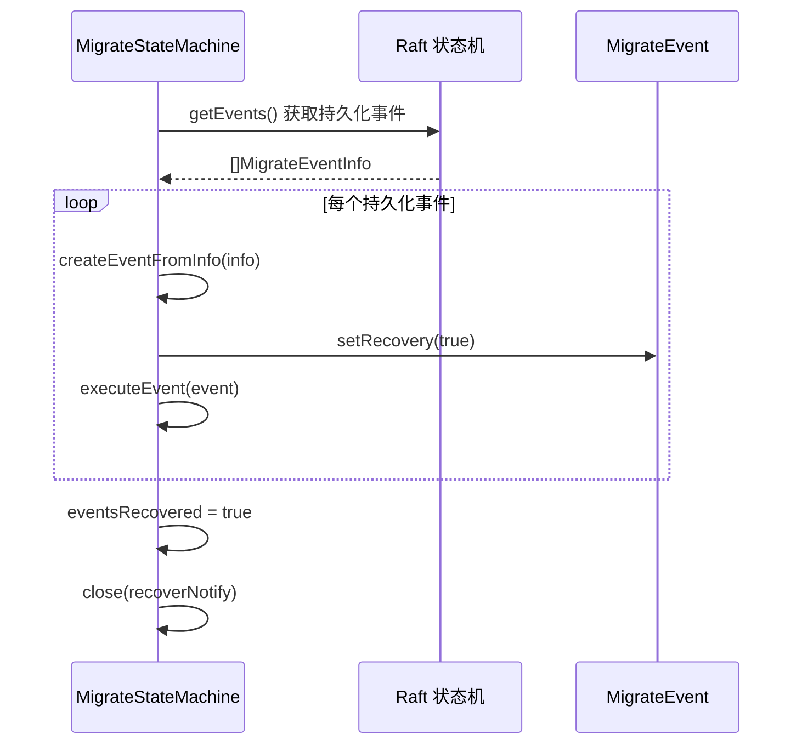
```mermaid
sequenceDiagram
    participant MSM as MigrateStateMachine
    participant Store as Raft 状态机
    participant Event as MigrateEvent

    MSM->>Store: getEvents() 获取持久化事件
    Store-->>MSM: []MigrateEventInfo

    loop 每个持久化事件
        MSM->>MSM: createEventFromInfo(info)
        MSM->>Event: setRecovery(true)
        MSM->>MSM: executeEvent(event)
    end

    MSM->>MSM: eventsRecovered = true
    MSM->>MSM: close(recoverNotify)
```

**核心代码**：`app/ts-meta/meta/migrate_state_machine.go:100-116`

```go
// 第 100 行：recoverStateMachine — 从持久化存储恢复事件
func (m *MigrateStateMachine) recoverStateMachine() {
    defer m.wg.Done()

    events := globalService.store.getEvents()  // 从 Raft 状态机获取未完成的事件
    for _, e := range events {
        event := m.createEventFromInfo(e)
        event.setRecovery(true)  // 标记为恢复模式
        err := m.executeEvent(event)
        if err != nil {
            m.logger.Error("[MSM] failed to execute event", ...)
        }
    }
    m.eventsRecovered = true     // 标记恢复完成
    close(m.recoverNotify)       // 通知 ClusterManager
}
```

**逐行解释**：
- **第 104 行**：`getEvents()` 从 Raft 状态机中读取所有未完成的迁移事件
- **第 106-107 行**：`createEventFromInfo` 根据事件类型创建 AssignEvent 或 MoveEvent
- **第 108 行**：`setRecovery(true)` 标记为恢复模式，跳过持久化步骤（已在存储中）
- **第 114 行**：`eventsRecovered = true` 允许用户命令开始执行
- **第 115 行**：`close(recoverNotify)` 通知等待的 ClusterManager

**恢复 factory 的实际分支**：`app/ts-meta/meta/migrate_state_machine.go:118-129`

```go
func (m *MigrateStateMachine) createEventFromInfo(e *meta.MigrateEventInfo) MigrateEvent {
    var me MigrateEvent
    switch EventType(e.GetEventType()) {
    case AssignType:
        me = NewAssignEvent(e.GetPtInfo(), e.GetDst(), e.GetAliveConnId(), false)
    case MoveType:
        me = NewMoveEvent(e.GetPtInfo(), e.GetSrc(), e.GetDst(), e.GetAliveConnId(), false)
    default:
    }
    me.setOpId(e.GetOpId())
    return me
}
```

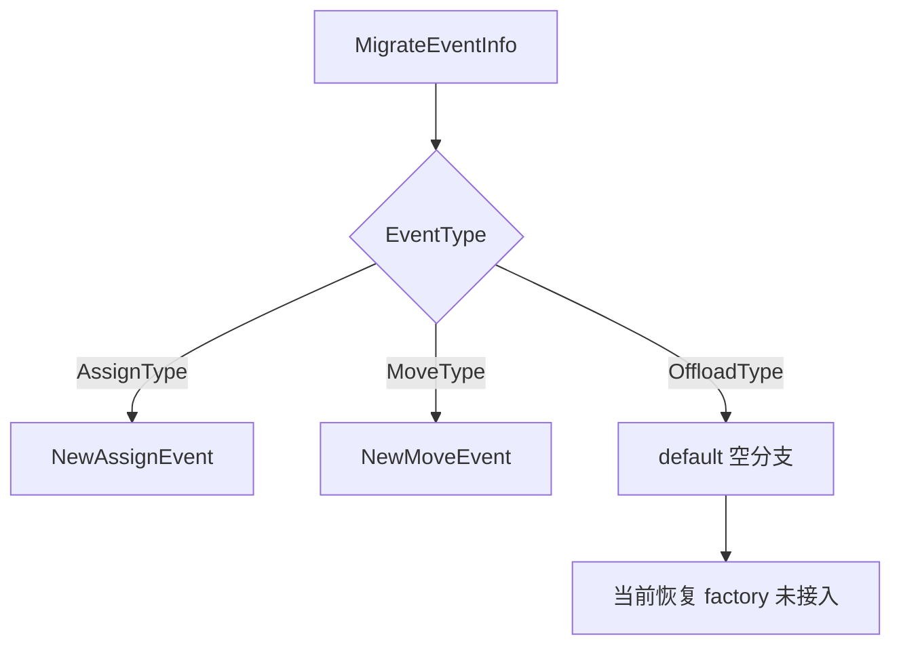
```mermaid
flowchart TD
    A[MigrateEventInfo] --> B{EventType}
    B -->|AssignType| C[NewAssignEvent]
    B -->|MoveType| D[NewMoveEvent]
    B -->|OffloadType| E[default 空分支]
    E --> F[当前恢复 factory 未接入]
```

**案例**：
```
持久化事件 EventType=MoveType:
  recoverStateMachine()
    -> createEventFromInfo()
    -> NewMoveEvent(...)
    -> setRecovery(true)
    -> executeEvent()

持久化事件 EventType=OffloadType:
  switch 没有 case OffloadType
  -> 当前恢复 factory 未创建 OffloadEvent
  -> 文档不能写成 OffloadType 已被恢复链路支持
```

---

### 9.2 retryMigrateCmd() 重试机制

**核心代码**：`app/ts-meta/meta/migrate_state_machine.go:133-148`

```go
// 第 133 行：retryMigrateCmd — 定期重试失败的迁移命令
func (m *MigrateStateMachine) retryMigrateCmd() {
    defer m.wg.Done()

    handleEvents := make([]MigrateEvent, len(m.retryingEvents))
    for {
        if m.isStopped() {
            break
        }
        handleEvents = m.handleRetryEvents(handleEvents)
        time.Sleep(100 * time.Millisecond)  // 每 100ms 重试一次
    }

    // 停止前再处理一次所有重试事件
    m.handleRetryEvents(handleEvents)
}
```

**handleRetryEvents()**：

```go
// 第 150 行：handleRetryEvents — 处理重试队列中的事件
func (m *MigrateStateMachine) handleRetryEvents(handleEvents []MigrateEvent) []MigrateEvent {
    m.retryMu.Lock()
    if cap(handleEvents) < len(m.retryingEvents) {
        handleEvents = make([]MigrateEvent, len(m.retryingEvents))
    }
    handleEvents = handleEvents[:len(m.retryingEvents)]
    copy(handleEvents, m.retryingEvents)    // 复制到本地
    m.retryingEvents = m.retryingEvents[:0]  // 清空队列
    m.retryMu.Unlock()

    for _, e := range handleEvents {
        _, _ = m.sendMigrateCommand(e)  // 重新发送命令
    }
    return handleEvents
}
```

**逐行解释**：
- **第 152-157 行**：加锁复制重试队列到本地，然后清空队列
- **第 160-162 行**：对每个事件重新调用 `sendMigrateCommand`
- **第 147 行**：停止前再处理一次，确保 Leader 切换时不会丢失事件

---

### 9.3 deleteEvent() 失败重分配

**核心代码**：`app/ts-meta/meta/migrate_state_machine.go:366-396`

```go
// 第 366 行：deleteEvent — 删除事件，失败时触发重新分配
func (m *MigrateStateMachine) deleteEvent(e MigrateEvent) {
    if e == nil || reflect.ValueOf(e).IsNil() {
        return
    }

    m.removeFromEventMap(e)
    res := e.getEventRes()

    // 数据库正在删除，直接清理
    if errno.Equal(res.err, errno.PtNotFound) || errno.Equal(res.err, errno.DatabaseIsBeingDelete) {
        e.removeEventFromStore()
        return
    }

    // 如果事件失败且需要重新分配
    if res.err != nil && e.isReassignNeeded() {
        if m.canExecuteEvent(false) {
            e.removeEventFromStore()
            time.Sleep(100 * time.Millisecond)
            nodePtNumMap := globalService.store.getDbPtNumPerAliveNode()
            go func() {
                // 重新触发 processFailedDbPt，选择新的目标节点
                err := globalService.clusterManager.processFailedDbPt(
                    e.getPtInfo(), nodePtNumMap, true,
                    e.getPtInfo().DBBriefInfo.Replicas > 1)
            }()
        }
    } else {
        e.removeEventFromStore()
    }
}
```

**逐行解释**：
- **第 373-376 行**：如果数据库已被删除，直接清理事件
- **第 382-391 行**：如果事件失败且 `isReassignNeeded()` 返回 true：
  1. 删除旧事件
  2. 等待 100ms
  3. 异步调用 `processFailedDbPt`，选择新的目标节点重新分配
- **第 393 行**：正常完成或不需要重新分配，直接删除事件

**isReassignNeeded() 逻辑**：

```go
// AssignEvent: 未完成且非用户命令且未隔离 → 需要重新分配
func (e *AssignEvent) isReassignNeeded() bool {
    if e.curState != Assigned && e.curState != Final {
        if !e.userCommand && !e.needIsolate {
            return true
        }
    }
    return false
}

// MoveEvent: 未完成且未隔离 → 需要重新分配
func (e *MoveEvent) isReassignNeeded() bool {
    if e.curState != meta.MoveInit && e.curState != meta.MoveAssigned && e.curState != meta.MoveFinal {
        if !e.needIsolate {
            return true
        }
    }
    return false
}
```

---

## 10. 潜在隐患

### 10.1 重试耗尽后仍继续调度

**问题**：`maxRetryNum = 100` 是硬编码常量，但当前 `handleCmdResult` 在 `exhaustRetries()` 为 true 时只记录错误日志，随后仍然 `return ScheduleRetry`。

**核心代码**：`app/ts-meta/meta/migrate_event.go:67`

```go
const maxRetryNum = 100
```

**风险**：
- 如果网络持续不稳定，100 次后不会自动停止，事件仍会被放回重试队列
- 日志会持续报错，但状态机不会在该分支自动隔离 PT 或给出终止状态

**建议**：
- 将 `maxRetryNum` 改为可配置参数
- 增加指数退避策略（exponential backoff）
- 明确重试耗尽后的终止、告警或隔离策略，避免只记录日志但继续 ScheduleRetry

---

### 10.2 事件去重 key 碰撞风险

**问题**：`eventMap` 的 key 是 `eventId = db.ptId`，但同一个 PT 可能同时有 AssignEvent 和 MoveEvent。

**核心代码**：`app/ts-meta/meta/migrate_state_machine.go:398-421`

```go
// addToEventMap 使用 eventId 作为 key
currentEvent := m.eventMap[e.getEventId()]
if currentEvent == nil {
    m.eventMap[e.getEventId()] = e
    return nil
}
return errno.NewError(errno.ConflictWithEvent)  // 冲突
```

**风险**：
- 如果一个 PT 同时触发了 AssignEvent（故障恢复）和 MoveEvent（均衡），会产生冲突
- 当前设计是"后者被拒绝"，但可能丢失重要的迁移任务

**建议**：
- key 中加入事件类型：`eventId = db.ptId.eventType`
- 或者实现事件优先级队列

---

### 10.3 Leader 切换事件重放正确性

**问题**：`resendPreviousEvent` 依赖 `eventMap` 和节点 `LTime` 的比较，但 `LTime` 是 Lamport 时间戳，不保证因果关系。

**核心代码**：`app/ts-meta/meta/cluster_manager.go:196-206`

```go
e := cm.eventMap[strconv.FormatUint(dataNodes[i].ID, 10)]
if e == nil || uint64(e.EventTime) < dataNodes[i].LTime {
    continue
}
if uint64(e.EventTime) == dataNodes[i].LTime {
    if e.Type == serf.EventMemberJoin && dataNodes[i].Status == serf.StatusAlive {
        continue
    }
}
```

**风险**：
- Lamport 时间戳只保证偏序关系，不同节点的 LTime 可能不一致
- 如果新 Leader 的 `eventMap` 不完整，可能遗漏需要重放的事件

**建议**：
- 使用 Raft 日志 index 作为事件版本号
- 增加事件重放的幂等性保证

---

### 10.4 异构节点下的均衡算法偏差

**问题**：均衡算法假设所有节点能力相同（PT 数量相等即均衡），但实际场景中节点可能有不同的 CPU、内存、磁盘配置。

**核心代码**：`app/ts-meta/meta/balance_store.go:480-488`

```go
bbd.aliveDnNum = len(*bbd.aliveDns)
bbd.min = avgPtNum                        // 假设所有节点能力相同
bbd.max = avgPtNum
if bbd.highLvlNum > 0 {
    avgPtNum += 1
}
```

**风险**：
- 在异构集群中，PT 数量相等不等于负载均衡
- 高性能节点可能应该承担更多 PT

**建议**：
- 引入节点权重因子
- 根据节点资源（CPU、内存、磁盘 I/O）动态调整 PT 分配

---

### 10.5 并发安全问题

**问题**：`eventMap` 的读写使用了 `eventMapMu` 锁，但在 `processEvent` 协程中访问事件状态时，没有额外的锁保护。

**风险**：
- 事件的状态转移和回调处理可能并发执行
- 虽然 `handleCmdResult` 中有 `retryMu` 保护重试队列，但事件本身的状态可能被并发修改

**建议**：
- 为每个事件增加独立的锁
- 或者确保事件的状态转移只在单个协程中执行

---

## 11. 端到端实战

### 11.1 完整生命周期：节点故障恢复

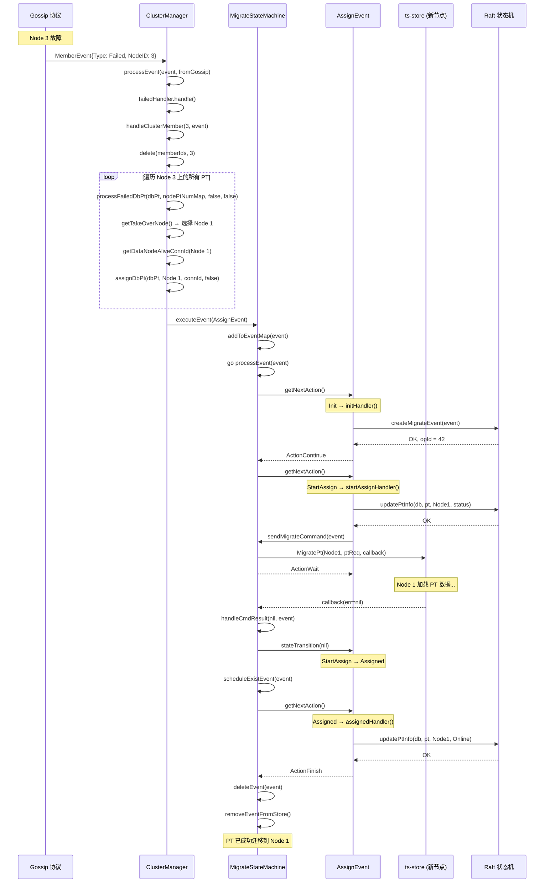
```mermaid
sequenceDiagram
    participant Gossip as Gossip 协议
    participant CM as ClusterManager
    participant MSM as MigrateStateMachine
    participant Event as AssignEvent
    participant Store as ts-store (新节点)
    participant Raft as Raft 状态机

    Note over Gossip: Node 3 故障

    Gossip->>CM: MemberEvent{Type: Failed, NodeID: 3}
    CM->>CM: processEvent(event, fromGossip)
    CM->>CM: failedHandler.handle()
    CM->>CM: handleClusterMember(3, event)
    CM->>CM: delete(memberIds, 3)

    loop 遍历 Node 3 上的所有 PT
        CM->>CM: processFailedDbPt(dbPt, nodePtNumMap, false, false)
        CM->>CM: getTakeOverNode() → 选择 Node 1
        CM->>CM: getDataNodeAliveConnId(Node 1)
        CM->>CM: assignDbPt(dbPt, Node 1, connId, false)
    end

    CM->>MSM: executeEvent(AssignEvent)
    MSM->>MSM: addToEventMap(event)
    MSM->>MSM: go processEvent(event)

    MSM->>Event: getNextAction()
    Note over Event: Init → initHandler()
    Event->>Raft: createMigrateEvent(event)
    Raft-->>Event: OK, opId = 42
    Event-->>MSM: ActionContinue

    MSM->>Event: getNextAction()
    Note over Event: StartAssign → startAssignHandler()
    Event->>Raft: updatePtInfo(db, pt, Node1, status)
    Raft-->>Event: OK
    Event->>MSM: sendMigrateCommand(event)
    MSM->>Store: MigratePt(Node1, ptReq, callback)
    MSM-->>Event: ActionWait

    Note over Store: Node 1 加载 PT 数据...
    Store-->>MSM: callback(err=nil)

    MSM->>MSM: handleCmdResult(nil, event)
    MSM->>Event: stateTransition(nil)
    Note over Event: StartAssign → Assigned

    MSM->>MSM: scheduleExistEvent(event)
    MSM->>Event: getNextAction()
    Note over Event: Assigned → assignedHandler()
    Event->>Raft: updatePtInfo(db, pt, Node1, Online)
    Raft-->>Event: OK
    Event-->>MSM: ActionFinish

    MSM->>MSM: deleteEvent(event)
    MSM->>MSM: removeEventFromStore()
    Note over MSM: PT 已成功迁移到 Node 1
```

---

### 11.2 完整生命周期：负载均衡

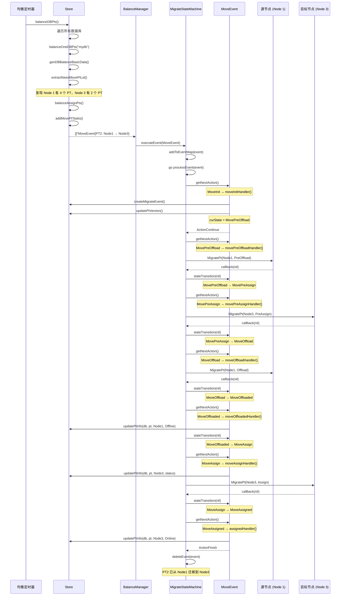
```mermaid
sequenceDiagram
    participant Timer as 均衡定时器
    participant Store as Store
    participant BM as BalanceManager
    participant MSM as MigrateStateMachine
    participant Event as MoveEvent
    participant Src as 源节点 (Node 1)
    participant Dst as 目标节点 (Node 3)

    Timer->>Store: balanceDBPts()
    Store->>Store: 遍历所有数据库
    Store->>Store: balanceOneDBPts("mydb")
    Store->>Store: genDBBalanceBasicData()
    Store->>Store: extractNeedMovePtLst()
    Note over Store: 发现 Node 1 有 4 个 PT，Node 3 有 2 个 PT
    Store->>Store: balanceAssignPts()
    Store->>Store: addMovePtTasks()
    Store-->>BM: []*MoveEvent{PT2: Node1 → Node3}

    BM->>MSM: executeEvent(MoveEvent)
    MSM->>MSM: addToEventMap(event)
    MSM->>MSM: go processEvent(event)

    MSM->>Event: getNextAction()
    Note over Event: MoveInit → moveInitHandler()
    Event->>Store: createMigrateEvent()
    Event->>Store: updatePtVersion()
    Note over Event: curState = MovePreOffload
    Event-->>MSM: ActionContinue

    MSM->>Event: getNextAction()
    Note over Event: MovePreOffload → movePreOffloadHandler()
    MSM->>Src: MigratePt(Node1, PreOffload)
    Src-->>MSM: callback(nil)
    MSM->>Event: stateTransition(nil)
    Note over Event: MovePreOffload → MovePreAssign

    MSM->>Event: getNextAction()
    Note over Event: MovePreAssign → movePreAssignHandler()
    MSM->>Dst: MigratePt(Node3, PreAssign)
    Dst-->>MSM: callback(nil)
    MSM->>Event: stateTransition(nil)
    Note over Event: MovePreAssign → MoveOffload

    MSM->>Event: getNextAction()
    Note over Event: MoveOffload → moveOffloadHandler()
    MSM->>Src: MigratePt(Node1, Offload)
    Src-->>MSM: callback(nil)
    MSM->>Event: stateTransition(nil)
    Note over Event: MoveOffload → MoveOffloaded

    MSM->>Event: getNextAction()
    Note over Event: MoveOffloaded → moveOffloadedHandler()
    Event->>Store: updatePtInfo(db, pt, Node1, Offline)
    MSM->>Event: stateTransition(nil)
    Note over Event: MoveOffloaded → MoveAssign

    MSM->>Event: getNextAction()
    Note over Event: MoveAssign → moveAssignHandler()
    Event->>Store: updatePtInfo(db, pt, Node3, status)
    MSM->>Dst: MigratePt(Node3, Assign)
    Dst-->>MSM: callback(nil)
    MSM->>Event: stateTransition(nil)
    Note over Event: MoveAssign → MoveAssigned

    MSM->>Event: getNextAction()
    Note over Event: MoveAssigned → assignedHandler()
    Event->>Store: updatePtInfo(db, pt, Node3, Online)
    Event-->>MSM: ActionFinish

    MSM->>MSM: deleteEvent(event)
    Note over MSM: PT2 已从 Node1 迁移到 Node3
```

---

### 11.3 异常场景：迁移中途目标节点宕机

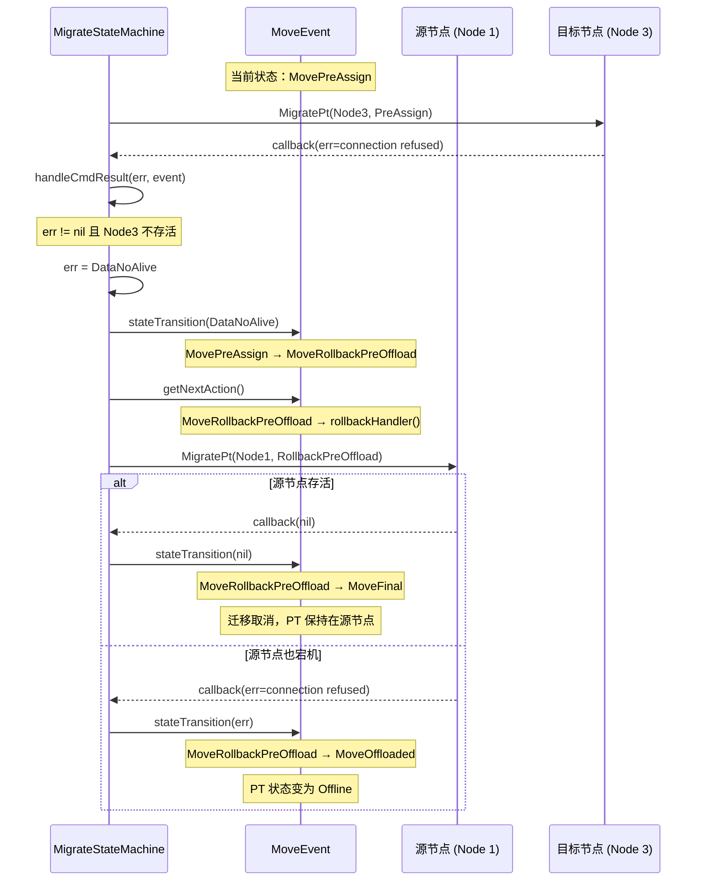
```mermaid
sequenceDiagram
    participant MSM as MigrateStateMachine
    participant Event as MoveEvent
    participant Src as 源节点 (Node 1)
    participant Dst as 目标节点 (Node 3)

    Note over Event: 当前状态：MovePreAssign

    MSM->>Dst: MigratePt(Node3, PreAssign)
    Dst-->>MSM: callback(err=connection refused)

    MSM->>MSM: handleCmdResult(err, event)
    Note over MSM: err != nil 且 Node3 不存活
    MSM->>MSM: err = DataNoAlive
    MSM->>Event: stateTransition(DataNoAlive)
    Note over Event: MovePreAssign → MoveRollbackPreOffload

    MSM->>Event: getNextAction()
    Note over Event: MoveRollbackPreOffload → rollbackHandler()
    MSM->>Src: MigratePt(Node1, RollbackPreOffload)
    
    alt 源节点存活
        Src-->>MSM: callback(nil)
        MSM->>Event: stateTransition(nil)
        Note over Event: MoveRollbackPreOffload → MoveFinal
        Note over Event: 迁移取消，PT 保持在源节点
    else 源节点也宕机
        Src-->>MSM: callback(err=connection refused)
        MSM->>Event: stateTransition(err)
        Note over Event: MoveRollbackPreOffload → MoveOffloaded
        Note over Event: PT 状态变为 Offline
    end
```

---

### 11.4 组件交互总图

```mermaid
graph TB
    subgraph "外部触发"
        Gossip["Gossip 协议<br/>节点状态变化"]
        User["用户命令<br/>MOVE PT / CREATE DB"]
        Timer["均衡定时器<br/>定期检查"]
    end

    subgraph "ts-meta 事件处理"
        CM["ClusterManager<br/>事件分发"]
        MSM["MigrateStateMachine<br/>事件调度"]
        BM["BalanceManager<br/>均衡管理"]
    end

    subgraph "事件类型"
        AE["AssignEvent<br/>故障恢复"]
        ME["MoveEvent<br/>均衡迁移"]
    end

    subgraph "持久化"
        Raft["Raft 状态机<br/>事件持久化"]
        Store["元数据存储<br/>PT 信息"]
    end

    subgraph "ts-store 执行"
        S1["Store Node 1"]
        S2["Store Node 2"]
        S3["Store Node 3"]
    end

    Gossip -->|MemberEvent| CM
    Timer -->|balanceDBPts| BM
    User -->|MOVE PT| BM

    CM -->|processFailedDbPt| MSM
    BM -->|assignDbPt / moveDbPt| MSM

    MSM -->|executeEvent| AE
    MSM -->|executeEvent| ME

    AE -->|sendMigrateCommand| S1
    ME -->|sendMigrateCommand| S2
    ME -->|sendMigrateCommand| S3

    MSM -->|持久化| Raft
    MSM -->|更新 PT 信息| Store

    S1 -->|回调| MSM
    S2 -->|回调| MSM
    S3 -->|回调| MSM
```

---

## 附录：关键错误码

| 错误码 | 含义 | 处理方式 |
|--------|------|----------|
| `DataNoAlive` | 目标节点不存活 | 触发状态转移（可能进入回滚） |
| `NeedChangeStore` | 需要更换目标节点 | 触发状态转移 |
| `NoConnectionAvailable` | 无可用连接 | 触发状态转移 |
| `MemUsageExceeded` | 内存使用超限 | 触发状态转移 |
| `SelectClosedConn` | 选择了已关闭的连接 | 不计重试，直接重试 |
| `PtIsAlreadyMigrating` | PT 正在迁移中 | 不计重试，直接重试 |
| `SessionSelectTimeout` | 会话选择超时 | 不计重试，直接重试 |
| `ConflictWithEvent` | 与已有事件冲突 | 拒绝新事件 |
| `StateMachineIsNotRunning` | 状态机未运行 | 返回错误 |
| `PtNotFound` | PT 不存在 | 删除事件 |
| `DatabaseIsBeingDelete` | 数据库正在删除 | 删除事件 |
| `PtChanged` | PT 已被其他操作修改 | 刷新 PT 信息 |

---

## 附录：状态值对照表

### AssignState

| 值 | 名称 | 说明 |
|----|------|------|
| 0 | Init | 初始化 |
| 8 | StartAssign | 开始分配 |
| 9 | AssignFailed | 分配失败 |
| 10 | Assigned | 分配成功 |
| 11 | Final | 终态 |

### MoveState

| 值 | 名称 | 说明 |
|----|------|------|
| 0 | MoveInit | 初始化 |
| 1 | MovePreOffload | 预卸载（通知源节点准备） |
| 2 | MoveRollbackPreOffload | 回滚预卸载（预分配失败时回滚源节点） |
| 3 | MovePreAssign | 预分配（通知目标节点准备） |
| 4 | MoveRollbackPreAssign | 回滚预分配（卸载失败时回滚目标节点） |
| 5 | MoveOffload | 卸载（源节点释放 PT） |
| 6 | MoveOffloadFailed | 卸载失败 |
| 7 | MoveOffloaded | 已卸载（源节点已释放） |
| 8 | MoveAssign | 分配（目标节点加载 PT） |
| 9 | MoveAssignFailed | 分配失败 |
| 10 | MoveAssigned | 已分配（目标节点已加载） |
| 11 | MoveFinal | 终态 |

### EventType

| 值 | 名称 | 说明 |
|----|------|------|
| 0 | AssignType | 分配事件（故障恢复） |
| 1 | OffloadType | 卸载事件（未使用） |
| 2 | MoveType | 迁移事件（均衡/手动） |

### NextAction

| 值 | 名称 | 说明 |
|----|------|------|
| 0 | ActionContinue | 继续处理下一个状态 |
| 1 | ActionWait | 等待异步回调 |
| 2 | ActionFinish | 事件完成 |
| 3 | ActionError | 事件失败 |

### MSMState

| 值 | 名称 | 说明 |
|----|------|------|
| 0 | Stopped | 已停止 |
| 1 | Running | 运行中 |
| 2 | Stopping | 正在停止 |

---

## 附录：事件持久化机制

### 持久化流程

迁移事件的持久化通过 Raft 状态机完成，确保 Leader 切换后事件不丢失。

```mermaid
sequenceDiagram
    participant Event as MigrateEvent
    participant MSM as MigrateStateMachine
    participant Store as Store (Raft)
    participant FSM as Raft FSM

    Event->>MSM: getNextAction()
    MSM->>Event: storeTransitionState()
    
    alt needPersist == true
        Event->>Store: updateMigrateEvent(event)
        Store->>FSM: Raft 共识
        FSM-->>Store: 持久化完成
        Store-->>Event: OK
        Event->>Event: needPersist = false
    end
    
    Event->>Event: 执行状态处理器
```

**核心代码**：`app/ts-meta/meta/assign_event.go:188-197`

```go
// 第 188 行：storeTransitionState — 持久化状态转移
func (e *AssignEvent) storeTransitionState() error {
    if e.needPersist {
        err := globalService.store.updateMigrateEvent(e)
        if err != nil {
            return err
        }
        e.setNeedPersist(false)  // 持久化成功，清除标记
    }
    return nil
}
```

**通俗解释**：

每次状态转移后，如果状态确实发生了变化（`needPersist = true`），就需要通过 Raft 共识持久化。这样即使 Leader 宕机，新 Leader 也能看到未完成事件；但当前 `createEventFromInfo` 恢复工厂没有完整回填 `CurrState/PreState` 等运行时状态，因此不要把它描述成可精确恢复到任意中间状态。

---

### 创建事件持久化

**核心代码**：`app/ts-meta/meta/assign_event.go:210-221`

```go
// initHandler 中的持久化逻辑
if !e.inRecover {
    err := globalService.store.createMigrateEvent(e)  // 通过 Raft 创建事件
    if err != nil {
        return ActionContinue, err
    }
    e.processed = true  // 标记已处理，允许后续删除
    e.operateId = globalService.store.getEventOpId(e)  // 获取操作 ID
    if e.operateId == 0 {
        return ActionContinue, errno.NewError(errno.OpIdIsInvalid)
    }
}
```

**具体例子**：

```
创建 AssignEvent 的持久化过程：

1. initHandler() 被调用
2. store.createMigrateEvent(event)
   → 序列化 event 为 MigrateEventInfo protobuf
   → 包装为 Raft 命令
   → 通过 Raft 共识写入所有 meta 节点
   → FSM.Apply() 执行：将事件写入 data.MigrateEvents
3. 返回成功，event.processed = true
4. store.getEventOpId(event)
   → 从 data.MigrateEvents 中获取刚创建的事件的 OpId
```

---

### 序列化格式

**核心代码**：`app/ts-meta/meta/assign_event.go:99-111`

```go
// 第 99 行：marshalEvent — 将 AssignEvent 序列化为 protobuf
func (e *AssignEvent) marshalEvent() *mproto.MigrateEventInfo {
    return &mproto.MigrateEventInfo{
        EventId:       proto.String(e.eventId),          // "db.ptId"
        EventType:     proto.Int(int(e.eventType)),      // AssignType = 0
        Pti:           e.pt.Marshal(),                   // PT 信息（protobuf）
        CurrState:     proto.Int(e.getCurrState()),      // 当前状态值
        PreState:      proto.Int(e.getPreState()),       // 前一状态值
        Src:           proto.Uint64(e.getSrc()),         // 源节点 ID
        Dest:          proto.Uint64(e.getDst()),         // 目标节点 ID
        OpId:          proto.Uint64(e.getOpId()),        // 操作 ID
        CheckConflict: proto.Bool(false),                // AssignEvent 不检查冲突
    }
}
```

**核心代码**：`app/ts-meta/meta/move_event.go:60-72`

```go
// 第 60 行：marshalEvent — 将 MoveEvent 序列化为 protobuf
func (e *MoveEvent) marshalEvent() *mproto.MigrateEventInfo {
    return &mproto.MigrateEventInfo{
        EventId:       proto.String(e.eventId),
        EventType:     proto.Int(int(e.eventType)),      // MoveType = 2
        Pti:           e.pt.Marshal(),
        CurrState:     proto.Int(e.getCurrState()),
        PreState:      proto.Int(e.getPreState()),
        Src:           proto.Uint64(e.getSrc()),
        Dest:          proto.Uint64(e.getDst()),
        OpId:          proto.Uint64(e.getOpId()),
        CheckConflict: proto.Bool(true),                 // MoveEvent 检查冲突
    }
}
```

**关键差异**：
- AssignEvent 的 `CheckConflict = false`：分配事件不检查 PT 版本冲突
- MoveEvent 的 `CheckConflict = true`：迁移事件检查 PT 版本冲突，因为迁移涉及源和目标两个节点
- `AliveConnID` 是运行时事件字段，底层 `MigrateEventInfo` 类型支持相关字段，但当前 `AssignEvent/MoveEvent` 的 `marshalEvent()` 没有把它写入持久化事件；`sendMigrateCommand` 使用的是内存事件里的 `aliveConnId`。

---

## 附录：均衡算法详解

### DbPtIds 结构

**核心代码**：`app/ts-meta/meta/balance_store.go:95-98`

```go
// 第 95 行：DbPtIds — PT ID 的低半区和高半区分布
type DbPtIds struct {
    lowIds  []uint32  // PT id 列表在 [0, half) 范围
    highIds []uint32  // PT id 列表在 [half, ptNum) 范围
}
```

**通俗解释**：

将 PT ID 空间一分为二：
- **低半区** `[0, halfPtId)`：PT ID 较小的分区
- **高半区** `[halfPtId, ptNum)`：PT ID 较大的分区

这种划分的目的是确保每个节点在两个半区都有 PT，避免某个节点只持有高 ID 或低 ID 的 PT，从而在写入时产生热点。

**具体例子**：

```
6 个 PT (PT0-PT5)，3 个节点：
halfPtId = 3

Node 1: lowIds=[PT0, PT1], highIds=[PT4]  → 低半区 2 个，高半区 1 个
Node 2: lowIds=[PT2], highIds=[PT3]        → 低半区 1 个，高半区 1 个
Node 3: lowIds=[], highIds=[PT5]           → 低半区 0 个，高半区 1 个

均衡后：
Node 1: lowIds=[PT0], highIds=[PT4]        → 低半区 1 个，高半区 1 个
Node 2: lowIds=[PT2], highIds=[PT3]        → 低半区 1 个，高半区 1 个
Node 3: lowIds=[PT1], highIds=[PT5]        → 低半区 1 个，高半区 1 个
```

---

### extractPtId() 提取逻辑

**核心代码**：`app/ts-meta/meta/balance_store.go:444-457`

```go
// 第 444 行：extractPtId — 从 PT 列表中提取一个 PT 到移动列表
func extractPtId(epd *extractPtData) bool {
    if *(epd.mvNum) <= 0 {
        return false  // 已提取足够数量
    }

    if len(*(epd.from)) > epd.ptTH {
        // 从列表末尾提取（后进先出）
        mpi := mvPtInfo{ptId: (*(epd.from))[len(*(epd.from))-1], dnId: epd.dnId}
        *(epd.to) = append(*(epd.to), mpi)
        *(epd.from) = (*(epd.from))[:len(*(epd.from))-1]
        *(epd.mvNum)--
        return true
    }
    return false  // 当前列表未超过阈值，不提取
}
```

**逐行解释**：
- **第 445-447 行**：如果已提取足够数量，返回 false
- **第 449 行**：只有当列表长度超过阈值 `ptTH` 时才提取
- **第 450 行**：从末尾提取（后进先出），这样可以保持 PT ID 的连续性
- **第 451-453 行**：将提取的 PT 添加到移动列表，从原列表删除

---

### assignDnPts() 分配逻辑

**核心代码**：`app/ts-meta/meta/balance_store.go:353-371`

```go
// 第 353 行：assignDnPts — 将一个 PT 分配到目标节点
func assignDnPts(apd *assignPtData) bool {
    if *(apd.needNum) <= 0 {
        return false  // 目标节点已满
    }

    if len(*(apd.from)) > 0 && len(*(apd.to)) < apd.ptTH {
        // 创建迁移任务
        t := taskData{
            ptId:   (*(apd.from))[0].ptId,   // 源 PT ID
            srcDn:  (*(apd.from))[0].dnId,    // 源节点 ID
            destDn: apd.dnId,                 // 目标节点 ID
        }
        *(apd.tasks) = append(*(apd.tasks), t)
        *(apd.to) = append(*(apd.to), (*(apd.from))[0].ptId)
        *(apd.from) = (*(apd.from))[1:]
        *(apd.needNum)--
        return true
    }
    return false
}
```

**逐行解释**：
- **第 354-356 行**：目标节点已满，不需要分配
- **第 358 行**：源列表有 PT 且目标列表未超过阈值
- **第 359-363 行**：创建 `taskData`，记录 PT ID、源节点、目标节点
- **第 364-366 行**：从源列表头部取出 PT，添加到目标列表
- **第 367 行**：减少还需分配的数量

---

### taskData 结构

**核心代码**：`app/ts-meta/meta/balance_store.go:40-49`

```go
// 第 40 行：taskData — 迁移任务数据
type taskData struct {
    ptId   uint32  // 要迁移的 PT ID
    srcDn  uint64  // 源节点 ID
    destDn uint64  // 目标节点 ID
}
type taskDatas []taskData

func (t taskData) String() string {
    return fmt.Sprintf("(%d:%d->%d)", t.ptId, t.srcDn, t.destDn)
}
```

**具体例子**：

```
taskDatas = [
    (2:1->3),   // PT2 从 Node1 迁移到 Node3
    (5:3->2),   // PT5 从 Node3 迁移到 Node2
]
```

---

### addMovePtTasks() 创建 MoveEvent

**核心代码**：`app/ts-meta/meta/balance_store.go:244-257`

```go
// 第 244 行：addMovePtTasks — 将迁移任务转换为 MoveEvent
func (s *Store) addMovePtTasks(db string, tasks *taskDatas,
    moveEvents []*MoveEvent, dbBriefInfo *meta.DatabaseBriefInfo) []*MoveEvent {

    for _, task := range *tasks {
        if task.srcDn == task.destDn {
            continue  // 源和目标相同，跳过
        }
        shardDurations := s.data.GetShardDurationsByDbPt(db, task.ptId)
        pt := s.data.GetPtInfo(db, task.ptId)
        dn := s.data.DataNode(task.destDn)
        moveEvents = append(moveEvents, NewMoveEvent(
            &meta.DbPtInfo{
                Db:          db,
                Pti:         pt,
                Shards:      shardDurations,
                DBBriefInfo: dbBriefInfo,
            },
            task.srcDn,       // 源节点
            task.destDn,      // 目标节点
            dn.AliveConnID,   // 目标节点的活跃连接 ID
            false,            // 非用户命令
        ))
    }
    return moveEvents
}
```

**逐行解释**：
- **第 249 行**：源和目标相同时跳过（理论上不应该出现）
- **第 251 行**：获取 PT 的 Shard 持续时间信息，用于目标节点加载数据
- **第 252 行**：获取 PT 的详细信息
- **第 253 行**：获取目标节点的信息，包括 `AliveConnID`
- **第 254-257 行**：创建 `MoveEvent`，`isUserCommand = false` 表示系统自动触发

---

## 附录：ClusterManager 事件处理器

### Handler Map 初始化

**核心代码**：`app/ts-meta/meta/cluster_manager.go:98-101`

```go
// 第 98 行：handlerMap — Gossip 事件类型到处理器的映射
c.handlerMap = map[serf.EventType]memberEventHandler{
    serf.EventMemberJoin:   &joinHandler{baseHandler{c}},    // 节点加入
    serf.EventMemberFailed: &failedHandler{baseHandler{c}},  // 节点故障
    serf.EventMemberLeave:  &leaveHandler{baseHandler{c}},   // 节点离开
}
```

**通俗解释**：

三种 Gossip 事件的处理逻辑：
- **Join**：节点加入集群，更新 memberIds，可能触发 PT 重新分配
- **Failed**：节点故障，将其上的 PT 标记为需要接管
- **Leave**：节点主动离开，类似 Failed 但更温和

---

### handleClusterMember() 成员管理

**核心代码**：`app/ts-meta/meta/cluster_manager.go:440-452`

```go
// 第 440 行：handleClusterMember — 更新存活成员列表
func (cm *ClusterManager) handleClusterMember(id uint64, e *serf.MemberEvent) {
    cm.mu.Lock()
    defer cm.mu.Unlock()
    gotEvent, ok := cm.eventMap[strconv.FormatUint(id, 10)]
    if ok && e.EventTime < gotEvent.EventTime {
        return  // 旧事件，忽略
    }
    if e.EventType() == serf.EventMemberJoin {
        cm.memberIds[id] = struct{}{}  // 加入存活列表
    } else if e.EventType() == serf.EventMemberFailed {
        delete(cm.memberIds, id)       // 从存活列表移除
    }
}
```

**逐行解释**：
- **第 443-446 行**：使用 Lamport 时间戳判断事件新旧，旧事件不处理
- **第 447-449 行**：Join 事件将节点加入 `memberIds`
- **第 450-451 行**：Failed 事件将节点从 `memberIds` 移除

---

### addEventMap() 事件记录

**核心代码**：`app/ts-meta/meta/cluster_manager.go:423-430`

```go
// 第 423 行：addEventMap — 记录事件到 eventMap（用于 Leader 切换重放）
func (cm *ClusterManager) addEventMap(name string, event *serf.MemberEvent) {
    cm.mu.Lock()
    e, ok := cm.eventMap[name]
    if !ok || e.EventTime <= event.EventTime {
        cm.eventMap[name] = event  // 只保留最新事件
    }
    cm.mu.Unlock()
}
```

**通俗解释**：

`eventMap` 是 Leader 切换时重放事件的关键数据结构：
- key 是节点 ID（字符串形式）
- value 是该节点的最新 Gossip 事件
- 新 Leader 通过对比 `eventMap` 和节点当前状态，判断是否有未处理的事件

---

## 附录：takeOverNodeChoose 接管节点选择

### WriteAvailableFirst 策略

**核心代码**：`app/ts-meta/meta/cluster_manager.go:455-472`

```go
// 第 455 行：getTakeOverNodeForWAF — WriteAvailableFirst 策略的接管节点选择
func getTakeOverNodeForWAF(cm *ClusterManager, oid uint64,
    nodePtNumMap *map[uint64]uint32, isRetry bool) (uint64, error) {

    for {
        if cm.isStopped() || cm.isClosed() {
            break
        }

        cm.mu.RLock()
        if _, ok := cm.memberIds[oid]; ok {
            cm.mu.RUnlock()
            return oid, nil  // 原节点已恢复，直接返回
        }
        cm.mu.RUnlock()
        time.Sleep(time.Second)
        // 等待原节点恢复
    }
    return 0, errno.NewError(errno.ClusterManagerIsNotRunning)
}
```

**通俗解释**：

WriteAvailableFirst 策略的核心思想是"等待原节点恢复"：
- 如果原节点（PT 的 Owner）已恢复，直接将 PT 分配回原节点
- 如果原节点未恢复，每秒检查一次，直到恢复或状态机停止
- 这种策略适用于节点临时重启的场景

---

### SharedStorage 策略

**核心代码**：`app/ts-meta/meta/cluster_manager.go:479-517`

```go
// 第 479 行：getTakeOverNodeForSS — SharedStorage 策略的接管节点选择
func getTakeOverNodeForSS(cm *ClusterManager, oid uint64,
    nodePtNumMap *map[uint64]uint32, isRetry bool) (uint64, error) {

    cm.mu.RLock()
    _, ok := cm.memberIds[oid]
    cm.mu.RUnlock()
    if ok && !isRetry {
        return oid, nil  // 原节点存活且非重试，使用原节点
    }

    // 选择 PT 数量最少的节点
    nodeId := cm.chooseNodeByPtNum(nodePtNumMap)
    cm.mu.RLock()
    if _, ok = cm.memberIds[nodeId]; ok {
        cm.mu.RUnlock()
        return nodeId, nil
    }
    // 随机选择一个存活节点
    for id := range cm.memberIds {
        cm.mu.RUnlock()
        return id, nil
    }
    cm.mu.RUnlock()
    time.Sleep(time.Second)
    return 0, errno.NewError(errno.ClusterManagerIsNotRunning)
}
```

**通俗解释**：

SharedStorage 策略的核心思想是"负载均衡"：
1. 如果原节点存活且非重试，优先使用原节点
2. 否则选择 PT 数量最少的节点，实现负载均衡
3. 如果首选节点不存活，随机选择一个存活节点

---

### chooseNodeByPtNum() 选择最少 PT 的节点

**核心代码**：`app/ts-meta/meta/cluster_manager.go:519-534`

```go
// 第 519 行：chooseNodeByPtNum — 选择 PT 数量最少的节点
func (cm *ClusterManager) chooseNodeByPtNum(nodePtNumMap *map[uint64]uint32) uint64 {
    var nodeId uint64
    minPtNum := uint32(math.MaxUint32)
    for id, ptNum := range *nodePtNumMap {
        if ptNum < minPtNum {
            minPtNum = ptNum
            nodeId = id
        }
    }
    cm.mu.RLock()
    if _, ok := cm.memberIds[nodeId]; ok {
        (*nodePtNumMap)[nodeId]++  // 增加该节点的 PT 计数
    }
    cm.mu.RUnlock()
    return nodeId
}
```

**逐行解释**：
- **第 521-526 行**：遍历 `nodePtNumMap`，找出 PT 数量最少的节点
- **第 527-530 行**：如果该节点存活，增加其 PT 计数（为下次选择做准备）
- 这样可以确保连续的 PT 分配会均匀分布到不同节点

---

## 附录：Replication 模式下的故障处理

### electRgMaster() 选举副本组主节点

**核心代码**：`app/ts-meta/meta/cluster_manager.go:601-622`

```go
// 第 601 行：electRgMaster — 选举副本组的新主节点
func electRgMaster(rg *meta.ReplicaGroup, ptInfo meta.DBPtInfos, db string) (uint32, []meta.Peer, bool) {
    var electSuccess bool
    var newMasterId uint32

    peers := rg.Peers
    newPeers := make([]meta.Peer, len(rg.Peers))
    for i := range peers {
        newPeers[i].ID = peers[i].ID
        newPeers[i].PtRole = peers[i].PtRole
        // 找到第一个在线的 Slave 节点作为新 Master
        if peers[i].PtRole == meta.Slave && ptInfo[peers[i].ID].Status == meta.Online && !electSuccess {
            newMasterId = peers[i].ID
            newPeers[i].ID = rg.MasterPtID  // 旧 Master 的 ID 给新 Slave
            newPeers[i].PtRole = meta.Slave
            electSuccess = true
        }
    }
    if !electSuccess {
        // 所有 PT 都离线，选举失败
        meta.DataLogger.Error("electRgMaster fail", zap.String("db", db), zap.Uint32("rg", rg.ID))
    }
    return newMasterId, newPeers, electSuccess
}
```

**通俗解释**：

在 Replication 模式下，每个副本组有一个 Master 和多个 Slave。当 Master 所在的节点故障时：
1. 遍历所有 Peer，找到第一个在线的 Slave
2. 将该 Slave 提升为新 Master
3. 旧 Master 的 ID 分配给某个 Slave（保持 ID 复用）
4. 如果所有 Slave 都离线，选举失败

**具体例子**：

```
副本组 RG1：
  PT0 (Master, Node1) ← 故障！
  PT1 (Slave, Node2)  ← 在线
  PT2 (Slave, Node3)  ← 在线

选举结果：
  PT1 → 新 Master (Node2)
  PT0 → Slave (Node1, 离线)
  PT2 → Slave (Node3)
```

---

### processReplication() 处理复制组

**核心代码**：`app/ts-meta/meta/cluster_manager.go:624-646`

```go
// 第 624 行：processReplication — 处理副本组的故障恢复
func (cm *ClusterManager) processReplication(dbPt *meta.DbPtInfo) error {
    rgs := globalService.store.getReplicationGroup(dbPt.Db)
    ptInfos := globalService.store.getDBPtInfos(dbPt.Db)
    if len(rgs) == 0 || len(ptInfos) == 0 {
        return nil
    }

    rgId := dbPt.Pti.RGID
    rg := &rgs[rgId]
    if rg.MasterPtID == dbPt.Pti.PtId {
        // Master 故障，需要选举新 Master
        masterId, newPeers, success := electRgMaster(rg, ptInfos, dbPt.Db)
        if success {
            return globalService.store.updateReplication(dbPt.Db, rgId, masterId, newPeers)
        }
        return nil
    }
    return nil
}
```

**逐行解释**：
- **第 632 行**：检查故障的 PT 是否是副本组的 Master
- **第 633 行**：如果是 Master，调用 `electRgMaster` 选举新 Master
- **第 635 行**：选举成功，更新副本组配置

---

## 附录：统计与监控

### MetaDBPTStepDuration 统计

在事件处理的每个阶段，都会记录统计信息：

**核心代码**（引用自 `migrate_state_machine.go`）：

```go
// 记录每个步骤的耗时
statistics.MetaDBPTStepDuration(
    e.getEventType().String(),  // 事件类型：assign_event / move_event
    e.getOpId(),                // 操作 ID
    e.getCurrStateString(),     // 当前状态名称
    e.getSrc(),                 // 源节点 ID
    e.getDst(),                 // 目标节点 ID
    time.Since(e.getStartTime()).Nanoseconds(),  // 步骤耗时（纳秒）
    statistics.DBPTLoading,     // 状态：loading / loaded / loadErr
    "",                         // 错误信息
)
```

**统计指标**：

| 指标 | 含义 |
|------|------|
| `MetaDBPTTaskInit` | 任务初始化 |
| `MetaDBPTStepDuration` + `DBPTLoading` | 步骤执行中 |
| `MetaDBPTStepDuration` + `DBPTLoaded` | 步骤完成 |
| `MetaDBPTStepDuration` + `DBPTLoadErr` | 步骤失败 |

**通俗解释**：

这些统计信息可以用于：
1. 监控迁移进度
2. 发现迁移瓶颈（某个阶段耗时过长）
3. 告警（迁移失败次数过多）
4. 性能调优

---

## 附录：代码行数统计

| 文件 | 行数 | 核心职责 |
|------|------|----------|
| `migrate_state_machine.go` | ~460 | 状态机主体：启动/停止、事件调度、重试、恢复 |
| `migrate_event.go` | ~234 | 接口定义、基类、通用方法 |
| `assign_event.go` | ~260 | 分配事件：4 个状态、3 个处理器 |
| `move_event.go` | ~325 | 迁移事件：11 个状态、11 个处理器 |
| `balance_store.go` | ~818 | 均衡算法：数据生成、PT 提取、任务分配 |
| `cluster_manager.go` | ~690 | 集群管理：Gossip 事件处理、故障检测 |
| **总计** | **~2787** | |

---

## 附录：设计模式总结

### 1. 状态机模式 (State Pattern)

每个 `MigrateEvent` 都是一个状态机，通过 `handlerMap` 将状态映射到处理器：

```go
// 状态 → 处理器 的映射
var assignHandlerMap = map[AssignState]func(e *AssignEvent) (NextAction, error){
    Init:         initHandler,
    StartAssign:  startAssignHandler,
    AssignFailed: assignFailedHandler,
    Assigned:     assignedHandler,
}
```

### 2. 策略模式 (Strategy Pattern)

接管节点的选择使用策略模式：

```go
// 根据 HA 策略选择不同的节点选择算法
takeOverNodeChoose[config.WriteAvailableFirst] = getTakeOverNodeForWAF
takeOverNodeChoose[config.SharedStorage] = getTakeOverNodeForSS
takeOverNodeChoose[config.Replication] = getTakeOverNodeForWAF
```

### 3. 模板方法模式 (Template Method)

`BaseEvent` 定义了事件处理的骨架，具体事件实现特定步骤：

```go
// BaseEvent 定义通用流程
func (m *MigrateStateMachine) processEvent(e MigrateEvent) {
    for {
        actionState, err = e.getNextAction()  // 调用具体事件的方法
        if actionState == ActionWait { return }
        if actionState != ActionContinue { break }
    }
}
```

### 4. 观察者模式 (Observer Pattern)

`sendMigrateCommand` 使用回调机制：

```go
cb := &msgservice.MigratePtCallback{}
cb.SetCallbackFn(func(err error) {
    m.handleMigrateCommandResponse(err, e)  // 异步回调
})
```

### 5. 去重模式 (Deduplication Pattern)

`eventMap` 确保同一个 PT 同时只有一个事件在处理：

```go
currentEvent := m.eventMap[e.getEventId()]
if currentEvent != nil {
    return errno.NewError(errno.ConflictWithEvent)  // 冲突
}
m.eventMap[e.getEventId()] = e  // 注册
```
