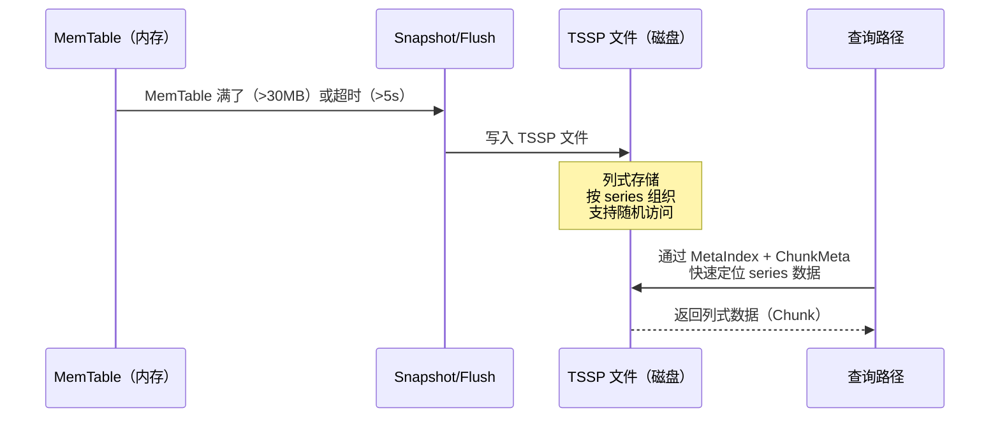
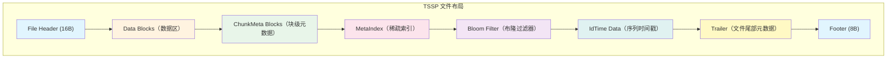
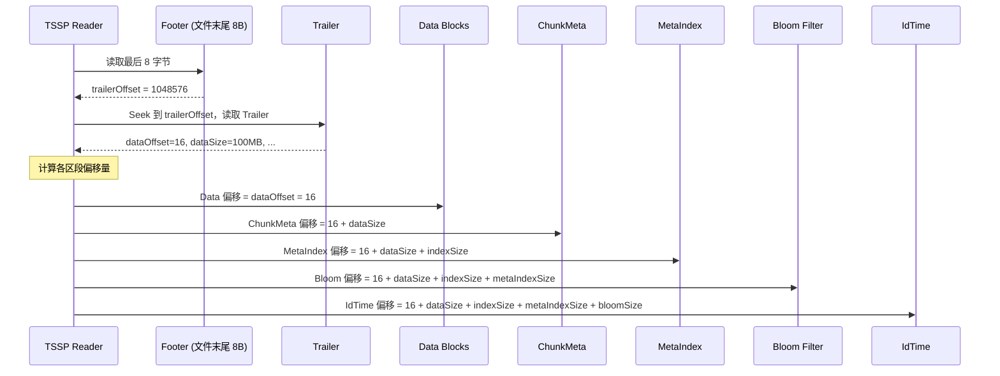
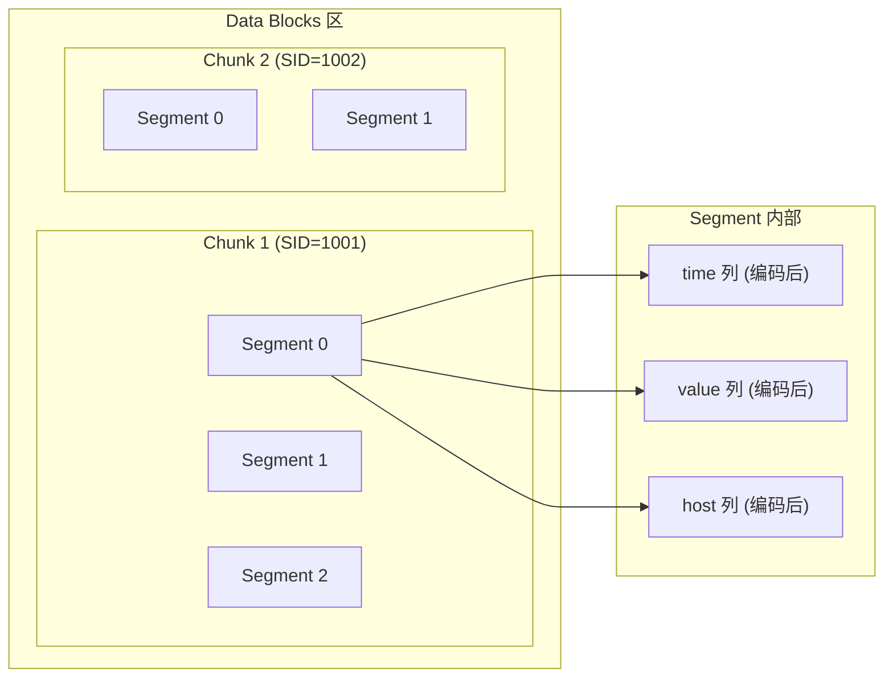
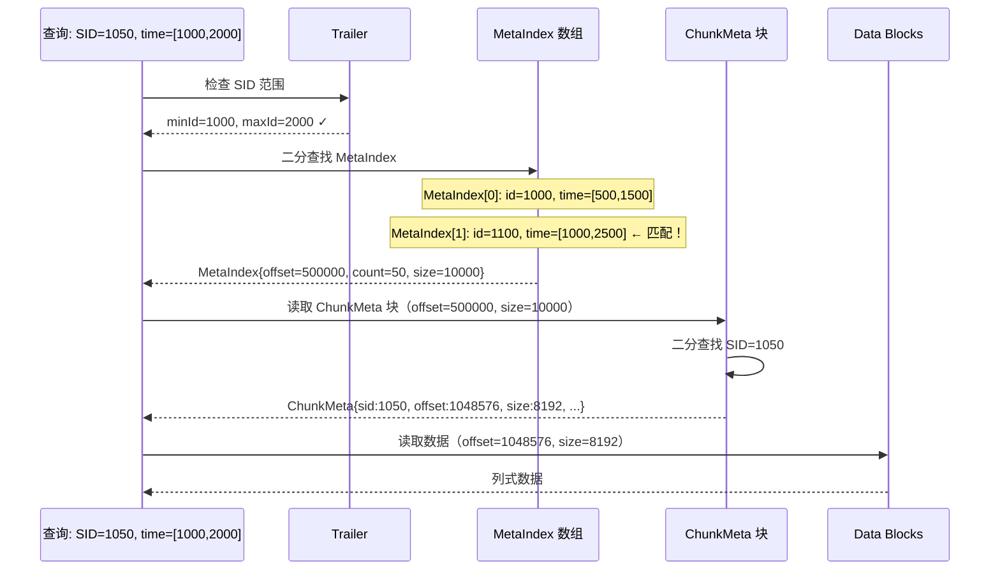
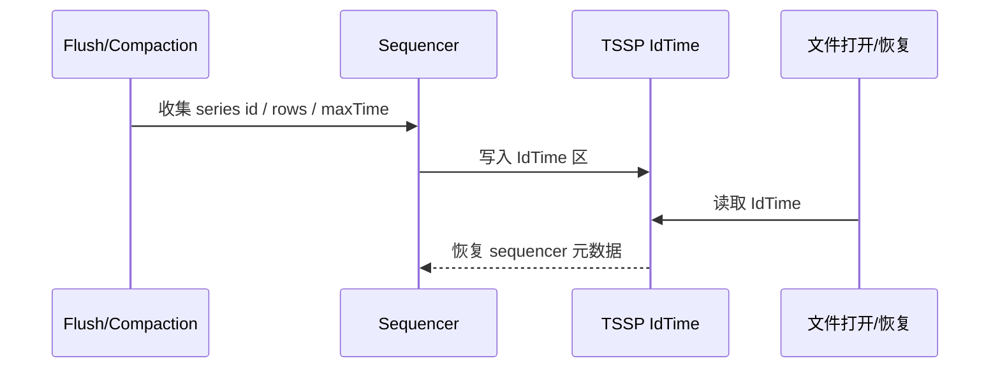
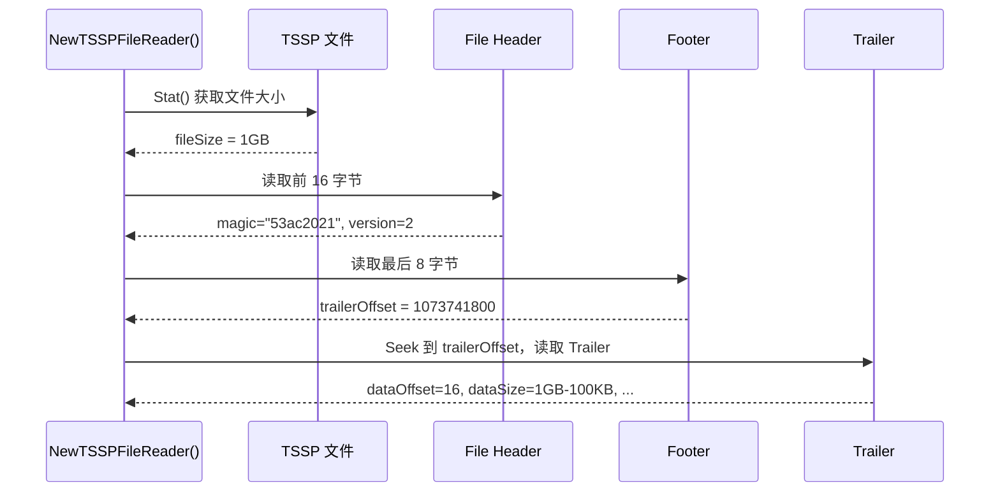
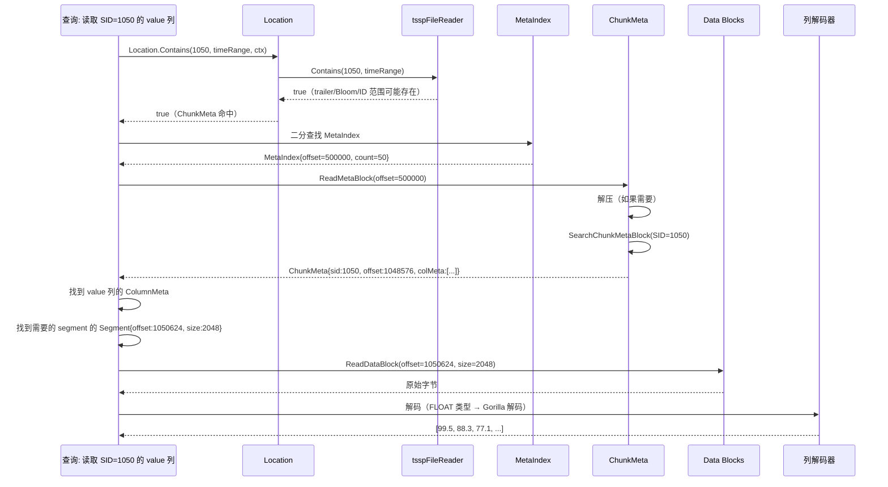
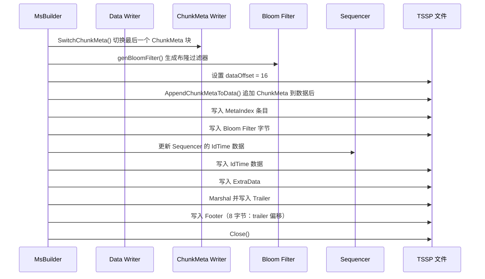
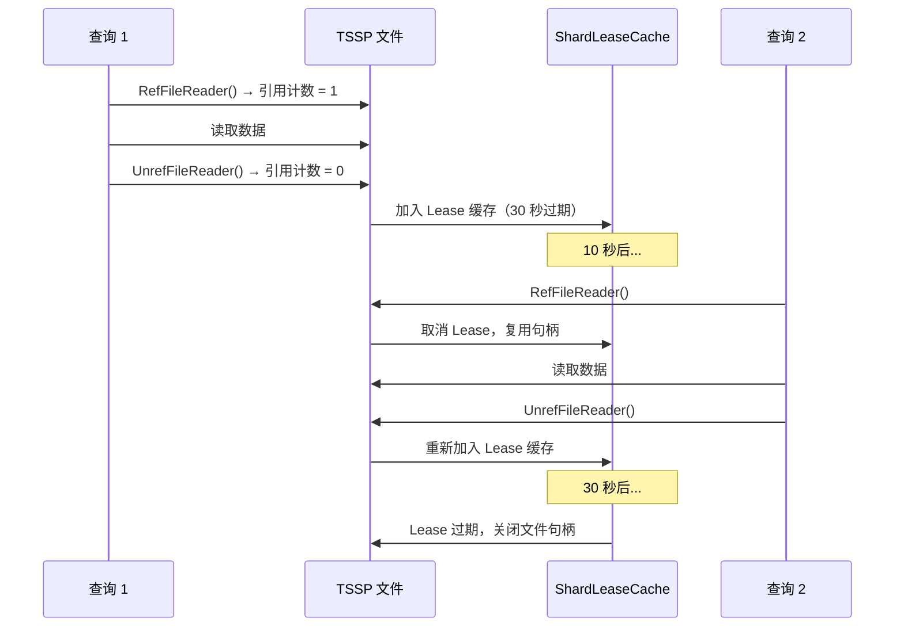

# Module 13: TSSP 文件格式深度审计报告（庖丁解牛版）

> TSSP（Time Series Store Partition）是 openGemini 的核心磁盘存储格式。所有 MemTable flush 和 Compaction 的最终产物都是 TSSP 文件。理解 TSSP 格式，就理解了 openGemini 存储引擎的"地基"。

---

## 1. TSSP 文件是什么？为什么需要它？



**通俗解释**：
TSSP 文件就像一本"按人名分类的日记本"。每个人（series）的日记（数据）连续存放，目录（MetaIndex + ChunkMeta）记录了每个人在第几页。查询时先查目录，再翻到对应的页，不用从头翻到尾。

**核心设计目标**：
1. **列式存储**：同一列的数据连续存放，聚合查询只需读取需要的列
2. **随机访问**：通过 MetaIndex + ChunkMeta 二级索引，O(logN) 定位任意 series
3. **不可变性**：文件一旦写入就不再修改，天然支持并发读取
4. **自描述**：Trailer 包含完整的文件元数据，无需外部索引

---

## 2. 文件命名规则

### 2.1 TSSPFileName 结构体

**代码位置**：`engine/immutable/tssp_file_name.go`

```go
type TSSPFileName struct {
    seq    uint64   // 单调递增的序列号，measurement + shard 内唯一
    level  uint16   // Compaction 层级（0 = MemTable flush，越高 = 压缩次数越多）
    extent uint16   // 文件扩展/代
    merge  uint16   // 合并迭代计数器（模 0xffff）
    order  bool     // true = 有序（按时间排序），false = 无序
    lock   *string  // 文件锁路径
}
```

### 2.2 文件名格式

```
格式：{seq}-{level}-{merge}{extent}.tssp
示例：00008250-0001-00010001.tssp

各字段含义：
  seq    = 00008250  （8-16 位十六进制，序列号）
  level  = 0001      （4 位十六进制，Compaction 层级 = 1）
  merge  = 0001      （4 位十六进制，合并迭代 = 1）
  extent = 0001      （4 位十六进制，扩展号 = 1）
```

**文件后缀**：
- `.tssp` — 正常文件
- `.tssp.init` — 临时文件（正在写入，尚未提交）
- `unordered/` 子目录 — 存放无序文件（迟到数据、乱序写入）

**验证正则**：`^[0-9a-f]{8,16}-[0-9a-f]{4}-[0-9a-f]{8}.tssp(.init)?`

**具体例子**：

```
一个 shard 的 TSSP 文件列表：

data/db0/0/cpu_0001/
  00000001-0000-00000001.tssp    ← L0，MemTable flush 产出
  00000002-0000-00000001.tssp    ← L0，第二次 flush
  00000003-0000-00000001.tssp    ← L0，第三次 flush
  00000001-0001-00010001.tssp    ← L1，Compaction L0→L1 产出
  00000001-0002-00020001.tssp    ← L2，Compaction L1→L2 产出

data/db0/0/cpu_0001/unordered/
  00000010-0000-00000001.tssp    ← 无序数据（迟到的数据点）
```

---

## 3. 文件磁盘布局

### 3.1 整体结构



**代码位置**：`engine/immutable/trailer.go`, `engine/immutable/msbuilder.go`

```
+------------------------------------------------------------------+
| [File Header] 16 字节                                             |
|   Magic: "53ac2021" (8B) + Version: uint64(2) (8B)               |
+------------------------------------------------------------------+
| [Data Blocks] 数据区                                              |
|   Series 1 的 Chunk（所有列，编码后）                              |
|   Series 2 的 Chunk                                               |
|   ...                                                             |
+------------------------------------------------------------------+
| [ChunkMeta Blocks] 块级元数据                                     |
|   Block 1: N 个 ChunkMeta 条目 + offset 表                       |
|   Block 2: ...                                                    |
+------------------------------------------------------------------+
| [MetaIndex] 稀疏索引                                              |
|   MetaIndex 1: {id, minTime, maxTime, offset, count, size}       |
|   MetaIndex 2: ...                                                |
+------------------------------------------------------------------+
| [Bloom Filter] 布隆过滤器                                         |
|   用于快速判断 series 是否存在                                     |
+------------------------------------------------------------------+
| [IdTime Data] 序列时间戳数据                                      |
|   Header: RowsCnt(4B) + BlocksCnt(4B)                            |
|   Block 0: encoded series-IDs + row counts + timestamps           |
+------------------------------------------------------------------+
| [Trailer] 文件尾部元数据                                          |
|   各区段大小和偏移量 + 统计信息 + measurement 名称                |
+------------------------------------------------------------------+
| [Footer] 8 字节                                                   |
|   int64: Trailer 的偏移量                                         |
+------------------------------------------------------------------+
```

**关键常量**：
- `tableMagic = "53ac2021"` — 魔数，用于验证文件格式
- `version = uint64(2)` — 当前版本号
- `fileHeaderSize = 16` 字节（8B magic + 8B version）
- `minTableSize = magic + trailerSize + 8 + 8`（最小合法文件大小）

### 3.2 为什么这样布局？

**通俗解释**：

想象一本字典：
- **File Header** = 封面（告诉你这是什么书）
- **Data Blocks** = 正文（实际的词条解释）
- **ChunkMeta** = 每页的页眉（告诉你这页有哪些词条）
- **MetaIndex** = 目录（告诉你"A 开头的在第几页"）
- **Bloom Filter** = 快速判断"这个词在不在字典里"
- **IdTime** = 附录（sequencer 的 series 元数据：series ID、行数、flush 时间）
- **Trailer** = 尾页（整本书的统计信息）
- **Footer** = 最后一行（告诉你"尾页在第几页"）

**查询时的访问模式**：
1. 打开文件 → 读 Header（16B）+ Footer（8B）→ 知道 Trailer 在哪
2. 读 Trailer → 知道各区段的位置和大小
3. 查 Bloom Filter → 快速判断 series 是否存在
4. 二分查找 MetaIndex → 定位到目标 ChunkMeta 块
5. 读 ChunkMeta 块 → 找到 series 的数据偏移量
6. 读 Data Blocks → 只读取需要的列数据

---

## 4. Trailer 结构详解

### 4.1 Trailer 结构体

**代码位置**：`engine/immutable/trailer.go`, `engine/immutable/table_stat.go`

```go
type Trailer struct {
    dataOffset    int64   // 数据区起始偏移（始终 = fileHeaderSize = 16）
    dataSize      int64   // 数据区总大小
    indexSize     int64   // ChunkMeta 区总大小
    metaIndexSize int64   // MetaIndex 区总大小
    bloomSize     int64   // Bloom Filter 区总大小
    idTimeSize    int64   // IdTime 区总大小
    TableStat               // 嵌入统计信息
}

type TableStat struct {
    ExtraData                    // 扩展数据（压缩标志、列名字典等）
    idCount          int64       // 文件中的 distinct series 数量
    minId, maxId     uint64      // 最小/最大 series ID
    minTime, maxTime int64       // 最小/最大时间戳
    metaIndexItemNum int64       // MetaIndex 条目数
    bloomM, bloomK   uint64      // Bloom Filter 参数（m 位，k 个哈希函数）
    name             []byte      // measurement 名称
}
```

### 4.2 各区段偏移量计算



**Trailer 序列化格式**：
```
dataOffset(8B) + dataSize(8B) + indexSize(8B) + metaIndexSize(8B)
+ bloomSize(8B) + idTimeSize(8B) + idCount(8B) + minId(8B) + maxId(8B)
+ minTime(8B) + maxTime(8B) + metaIndexItemNum(8B) + bloomM(8B) + bloomK(8B)
+ ExtraDataLen(2B) + ExtraData(变长) + nameLen(2B) + name(变长)
```

### 4.3 ExtraData 结构

```go
type ExtraData struct {
    hasMetaHeader         bool    // 是否有 ChunkMetaHeader（列名字典）
    TimeStoreFlag         uint8   // 1 = 时间戳存储在 IdTime 区
    ChunkMetaCompressFlag uint8   // ChunkMeta 压缩模式
    ChunkMetaHeader       *ChunkMetaHeader  // 列名字典（自压缩模式用）
}
```

**ChunkMetaCompressFlag 取值**：

| 值 | 含义 | 说明 |
|---|------|------|
| 0 | 无压缩 | 默认模式 |
| 1 | Snappy 压缩 | 整个 ChunkMeta 块用 Snappy 压缩 |
| 2 | LZ4 压缩 | 整个 ChunkMeta 块用 LZ4 压缩 |
| 3 | 自压缩 | 列名用字典索引替代，数值用 varint + delta 编码 |

**通俗解释**：
ExtraData 就像书的"版本说明"。它告诉读者：这本书用了什么压缩方式？列名存在哪里？时间戳存在哪里？

---

## 5. Data Blocks — 数据区详解

### 5.1 Chunk 组织方式

**代码位置**：`engine/immutable/msbuilder.go`

每个 series ID 在数据区有一个连续的 "Chunk"。Chunk 内部按列独立编码，每个列的数据在每个 segment 内连续存放。



**关键配置**：
- `DefaultMaxRowsPerSegment4TsStore = 1000` — 每个 segment 最多 1000 行
- `DefaultMaxChunkMetaItemSize = 256KB` — ChunkMeta 块最大 256KB
- `DefaultMaxChunkMetaItemCount = 512` — 每个 ChunkMeta 块最多 512 条目
- `DefaultFileSizeLimit = 8GB` — 单文件最大 8GB

### 5.2 列编码方式

openGemini 支持 5 种数据类型的列编码：

| 类型 | 编码方式 | 适用场景 |
|------|---------|---------|
| Integer (int64) | Delta + ZigZag + 变长编码 | 时间戳、整数字段 |
| Float (float64) | Gorilla 编码（XOR + 前导零压缩） | 浮点数字段 |
| Boolean | Bitmap 编码 | 布尔字段 |
| String | 字典编码 + 变长编码 | 字符串字段 |
| Timestamp | Delta 编码 + 变长编码 | 时间列 |

**具体例子**：

假设写入以下数据：
```
time=1000, value=99.5, host="server1"
time=1001, value=88.3, host="server1"
time=1002, value=77.1, host="server2"
```

Data Blocks 中的存储：
```
SID=1001 的 Chunk:
  Segment 0:
    time 列:    [Delta编码: 1000, +1, +1] → 变长字节
    value 列:   [Gorilla编码: 99.5, 88.3, 77.1] → 变长字节
    host 列:    [字典编码: "server1"→0, "server1"→0, "server2"→1] → 变长字节
```

---

## 6. ChunkMeta — 块级元数据详解

### 6.1 ChunkMeta 结构体

**代码位置**：`engine/immutable/tssp_file_meta.go`

```go
type ChunkMeta struct {
    sid         uint64          // series ID
    offset      int64           // 该 chunk 数据在文件中的绝对偏移
    size        uint32          // 该 chunk 数据的总字节大小
    columnCount uint32          // 列数（包含 time 列）
    segCount    uint32          // segment 数量
    timeRange   []SegmentRange  // 每个 segment 的时间范围 [segCount 个]
    colMeta     []ColumnMeta    // 每列的元数据 [columnCount 个]
}

type SegmentRange [2]int64  // [minTime, maxTime]，16 字节

type ColumnMeta struct {
    name    string      // 列名
    ty      byte        // 列类型（FLOAT/INTEGER/STRING/BOOLEAN）
    preAgg  []byte      // 预聚合数据（min/max/sum/count）
    entries []Segment   // 每个 segment 的数据位置 [segCount 个]
}

type Segment struct {
    offset int64   // 该列在该 segment 中的绝对文件偏移
    size   uint32  // 该列在该 segment 中的字节大小
}
```

### 6.2 ChunkMeta 序列化格式

**默认模式**：
```
sid (8B) + offset (8B) + size (4B) + columnCount (4B) + segCount (4B)
= 28 字节基础
+ timeRange: segCount × 16 字节
+ 每列:
    nameLen (2B) + name (变长) + type (1B) + preAggLen (2B) + preAgg (变长)
    + entries: segCount × 12 字节
```

**自压缩模式**（ChunkMetaCompressFlag = 3）：
- offset/size/columnCount/segCount 用 varint 编码（更紧凑）
- 列名用字典索引替代（字典存在 Trailer 的 ChunkMetaHeader 中）
- 时间范围用 delta + scale 编码
- Segment offset 只存第一个偏移 + 所有 size（偏移通过累加重构）

### 6.3 ChunkMeta 块内部结构

**代码位置**：`engine/immutable/tssp_reader.go`

一个 ChunkMeta 块包含多个 ChunkMeta 条目 + 末尾的 offset 表：

```
+----------------------------------------------------------+
| ChunkMeta entry 0 | ChunkMeta entry 1 | ... | entry N-1 |
+----------------------------------------------------------+
| uint32 offset 0   | uint32 offset 1   | ... | offset N-1|
+----------------------------------------------------------+

offset 表：每个 offset 指向对应 entry 在块内的起始位置
```

**块级压缩模式**：
- `ChunkMetaCompressNone` / `ChunkMetaCompressSelf`：块数据不压缩
- `ChunkMetaCompressSnappy`：整个块用 Snappy 压缩
- `ChunkMetaCompressLZ4`：整个块用 LZ4 压缩（前缀 4 字节为未压缩大小）

**具体例子**：

查找 SID=1001 的 ChunkMeta：
```
步骤 1: 读取 ChunkMeta 块（可能需要解压）
步骤 2: 读取末尾的 offset 表
步骤 3: 二分查找 offset 表，找到 SID=1001 对应的 entry
步骤 4: 读取该 entry，反序列化为 ChunkMeta 结构体

ChunkMeta{
    sid: 1001,
    offset: 1048576,      // 数据在文件偏移 1MB 处
    size: 8192,           // 数据大小 8KB
    columnCount: 3,       // 3 列：time, value, host
    segCount: 2,          // 2 个 segment
    timeRange: [[1000,1500], [1501,2000]],
    colMeta: [
        {name:"time",   type:INT,   entries:[{offset:1048576,size:2048}, ...]},
        {name:"value",  type:FLOAT, entries:[{offset:1050624,size:2048}, ...]},
        {name:"host",   type:STRING,entries:[{offset:1052672,size:2048}, ...]},
    ]
}
```

---

## 7. MetaIndex — 稀疏索引详解

### 7.1 MetaIndex 结构体

**代码位置**：`engine/immutable/tssp_file_meta.go`

```go
type MetaIndex struct {
    id      uint64   // 该元数据块中第一个 series 的 ID
    minTime int64    // 该元数据块中所有 series 的最小时间戳
    maxTime int64    // 该元数据块中所有 series 的最大时间戳
    offset  int64    // ChunkMeta 块在文件中的绝对偏移
    count   uint32   // 该 ChunkMeta 块中的条目数
    size    uint32   // 该 ChunkMeta 块的字节大小
}
```

**大小**：`MetaIndexLen = 40` 字节（8+8+8+8+4+4）

### 7.2 MetaIndex 查找流程



**通俗解释**：
MetaIndex 就像字典的"大目录"。它告诉你"A-F 在第几页到第几页"。查找时先查大目录，再查页眉（ChunkMeta），最后找到具体的词条（数据）。

---

## 8. Bloom Filter — 快速存在性检查

### 8.1 Bloom Filter 参数

**代码位置**：`engine/immutable/msbuilder.go`（`genBloomFilter()` 方法）

- **误判率**：8%（`falsePositiveRate = 0.08`）
- **缓冲区大小**：`pow2((m + 7) / 8)` 字节（始终为 2 的幂）
- **插入方式**：每个 series ID 作为 8 字节大端序 key 插入

### 8.2 查询时的使用

```go
// tssp_file.go
func (r *tsspFileReader) Contains(id uint64, tm util.TimeRange) bool {
    if r.trailer.minId > id || r.trailer.maxId < id {
        return false
    }
    if r.trailer.minTime > tm.Max || r.trailer.maxTime < tm.Min {
        return false
    }
    r.initMetaData()
    return r.ContainsId(id)
}

// location.go
func (l *Location) Contains(sid uint64, tr util.TimeRange, ctx *ChunkMetaContext) (bool, error) {
    if !l.r.Contains(sid, tr) {
        return false, nil
    }
    return l.readChunkMeta(sid, tr, ctx)
}
```

**通俗解释**：
Bloom Filter 就像一个"快速黑名单"。它能 100% 确定"这个人不在名单上"，但有 8% 的概率误判"这个人在名单上"。查询链路分两层：`tsspFileReader.Contains(id, tm)` 先用 trailer 的 series/time 范围和元数据/Bloom 信息判断文件是否可能命中；`Location.Contains(sid, tr, ctx)` 再读取 ChunkMeta，把可能命中的 series 映射到后续数据读取位置。

---

## 9. IdTime — 序列时间戳数据

### 9.1 IdTime 结构

**代码位置**：`engine/immutable/sequencer.go`

```go
type IdTimePairs struct {
    Name string     // measurement 名称
    Ids  []uint64   // series ID 列表
    Tms  []int64    // 每个 series 的最后 flush 时间戳
    Rows []int64    // 每个 series 的行数
}
```

**磁盘布局**：
```
Header: RowsCnt (4B) + BlocksCnt (4B)

Block 0:
  count (4B)
  encoded series-IDs (4B 大小前缀 + 编码后的无符号块)
  encoded row counts (4B 大小前缀 + 编码后的整数块)
  encoded timestamps (4B 大小前缀 + 编码后的整数块, 如果 TimeStoreFlag=1)

Block 1: ...
```

**具体例子**：

```
IdTime 区内容：
  Header: RowsCnt=1000, BlocksCnt=1

  Block 0:
    count = 1000
    series-IDs: [1001, 1002, 1003, ...]  ← Delta 编码
    row counts: [500, 300, 200, ...]      ← Delta 编码
    timestamps: [1234567890, 1234567891, ...] ← Delta 编码
```

**用途**：
- IdTime 是 sequencer 持久化元数据，用于恢复每个 series 的 ID、行数和最后 flush 时间
- Compaction/flush 时可根据 series 行数和时间信息更新 sequencer，辅助估算输出文件大小
- 它不是查询路径上“是否读取 WAL”的开关；查询是否读 WAL 由查询引擎、MemTable/WAL 可见性和具体存储路径决定



**代码讲解**：`IdTimePairs` 的 `Ids`、`Rows`、`Tms` 与 measurement 名称一起写入 TSSP 尾部区域。文件打开或恢复时读取这些元数据，更新 sequencer 对 series 的记账信息，避免只依赖内存状态。

**具体例子**：

```text
flush cpu:
  SID=1001 写出 500 行，最后时间=1700000000
  SID=1002 写出 300 行，最后时间=1700000300

IdTime:
  Ids  = [1001, 1002]
  Rows = [500, 300]
  Tms  = [1700000000, 1700000300]

节点重启:
  读取 IdTime -> sequencer 知道 cpu 已有 SID 和行数统计
```

---

## 10. 读取路径详解

### 10.1 文件打开流程

**代码位置**：`engine/immutable/tssp_reader.go`



### 10.2 延迟初始化（Lazy Init）

```go
func (r *tsspFileReader) LoadComponents() {
    // 1. 重新打开文件句柄（如果已关闭）
    r.loadDiskFileReader()
    // 2. 加载 Bloom Filter
    r.loadBloomFilter()
    // 3. 加载 MetaIndex 数组
    r.loadMetaIndex()
    // 4. 提取 ChunkMeta 压缩模式
    r.chunkMetaCompressMode = r.trailer.ExtraData.ChunkMetaCompressFlag
}
```

**为什么要延迟初始化？**
- Bloom Filter 和 MetaIndex 可能很大（几百 KB 到几 MB）
- 不是每次查询都需要访问所有文件
- 延迟加载可以节省内存和启动时间

### 10.3 完整数据读取路径



---

## 11. 写入路径详解

### 11.1 文件写入流程

**代码位置**：`engine/immutable/msbuilder.go`（`Flush()` 方法）



### 11.2 双缓冲写入策略

```go
type tsspFileWriter struct {
    fd         fileops.File            // 文件描述符
    fileWriter fileops.BasicFileWriter // 带缓冲的写入器
    dataN      int64                   // 已写入数据区的字节数
    cmw        IndexWriter             // ChunkMeta 写入器（可能是临时文件）
}
```

**为什么要双缓冲？**
- Data 直接写入主文件
- ChunkMeta 写入单独的 `IndexWriter`（如果太大，会缓冲到临时文件）
- 最后通过 `AppendChunkMetaToData()` 将 ChunkMeta 追加到主文件

**原因**：ChunkMeta 需要知道数据的最终偏移量，但数据还在写入中。双缓冲允许两者独立写入，最后合并。

---

## 12. Lease 机制 — 文件句柄复用

### 12.1 为什么需要 Lease？

**代码位置**：`engine/immutable/tssp_file.go`

```go
var leaseDuration = 30 * time.Second  // 默认 30 秒
```

TSSP 文件是不可变的，但频繁打开/关闭文件句柄的开销很大。Lease 机制允许：
1. 文件引用计数降为 0 时，不立即关闭文件句柄
2. 将文件放入 `ShardLeaseCache`，设置 30 秒过期
3. 如果 30 秒内再次访问，取消 Lease，复用句柄
4. 如果 30 秒后过期，关闭文件句柄

### 12.2 Lease 流程



---

## 13. 端到端实战：从写入到读取

### 13.1 写入场景

假设写入 3 行数据到 cpu measurement：
```
cpu,host=server1 value=99.5 1000
cpu,host=server1 value=88.3 1001
cpu,host=server2 value=77.1 1002
```

**MemTable flush 到 TSSP 文件的过程**：

```
步骤 1: MsBuilder 创建新文件
  → 文件名: 00000001-0000-00000001.tssp.init
  → 写入 Header: [magic="53ac2021"][version=2]

步骤 2: 写入 Data Blocks
  → SID=1001 的 Chunk:
    Segment 0:
      time 列:   [Delta编码: 1000, 1001] → 20 字节
      value 列:  [Gorilla编码: 99.5, 88.3] → 16 字节
      host 列:   [字典编码: "server1"→0, "server1"→0] → 8 字节

  → SID=1002 的 Chunk:
    Segment 0:
      time 列:   [Delta编码: 1002] → 8 字节
      value 列:  [Gorilla编码: 77.1] → 8 字节
      host 列:   [字典编码: "server2"→1] → 4 字节

步骤 3: 写入 ChunkMeta Blocks
  → ChunkMeta for SID=1001:
    {sid:1001, offset:16, size:44, columnCount:3, segCount:1, ...}
  → ChunkMeta for SID=1002:
    {sid:1002, offset:60, size:20, columnCount:3, segCount:1, ...}

步骤 4: 写入 MetaIndex
  → MetaIndex: {id:1001, minTime:1000, maxTime:1002, offset:80, count:2, size:200}

步骤 5: 写入 Bloom Filter
  → 插入 SID=1001 和 SID=1002

步骤 6: 写入 IdTime
  → Header: RowsCnt=2, BlocksCnt=1
  → Block 0: [1001, 1002], [2, 1], [1001, 1002]

步骤 7: 写入 Trailer
  → dataOffset=16, dataSize=64, indexSize=200, ...

步骤 8: 写入 Footer
  → trailerOffset = 360

步骤 9: 重命名文件
  → 00000001-0000-00000001.tssp.init → 00000001-0000-00000001.tssp
```

### 13.2 查询场景

假设查询：`SELECT value FROM cpu WHERE host='server1'`

```
步骤 1: 打开 TSSP 文件
  → 读取 Header (16B): magic ✓, version=2
  → 读取 Footer (8B): trailerOffset = 360
  → 读取 Trailer: 完整元数据

步骤 2: Bloom Filter 检查
  → 索引系统返回 SID=[1001, 1002]
  → tsspFileReader.Contains(1001, tr) = true ✓
  → Location.Contains(1001, tr, ctx) 读取 ChunkMeta ✓
  → tsspFileReader.Contains(1002, tr) = true ✓
  → Location.Contains(1002, tr, ctx) 读取 ChunkMeta ✓

步骤 3: MetaIndex 查找
  → 二分查找: SID=1001 在 MetaIndex[0] 范围内
  → MetaIndex[0] = {offset:80, count:2, size:200}

步骤 4: ChunkMeta 查找
  → 读取 ChunkMeta 块 (offset=80, size=200)
  → 二分查找: SID=1001 的 ChunkMeta
  → ChunkMeta = {sid:1001, offset:16, size:44, colMeta:[...]}

步骤 5: 读取 value 列数据
  → 找到 value 列的 ColumnMeta
  → Segment[0] = {offset:36, size:16}
  → ReadDataBlock(offset=36, size=16) → 原始字节

步骤 6: 解码
  → Gorilla 解码 → [99.5, 88.3]

步骤 7: 返回结果
  → time=[1000,1001], value=[99.5,88.3], host=["server1","server1"]
```

---

## 14. 总结：TSSP 文件格式的关键设计

| 设计 | 目的 | 效果 |
|------|------|------|
| 列式存储 | 只读取需要的列 | 减少 IO 50%+ |
| 二级索引（MetaIndex + ChunkMeta） | 快速定位 series | O(logN) 查找 |
| Bloom Filter | 快速排除不存在的 series | 避免无效 IO |
| Trailer + Footer | 自描述文件 | 无需外部索引 |
| Lease 机制 | 文件句柄复用 | 减少 open/close 开销 |
| 多种压缩模式 | 灵活的存储/性能权衡 | 自压缩模式节省 30%+ 空间 |
| 不可变性 | 天然并发安全 | 读取无需加锁 |
| .tssp.init 后缀 | 原子提交 | 崩溃不会产生半成品文件 |
