# Module 14: Compaction 合并策略深度审计报告（庖丁解牛版）

> Compaction 是存储引擎的"垃圾回收器"。它在后台自动合并小文件、消除重复数据、提升查询性能。理解 Compaction 策略，就理解了 openGemini 如何在高频写入下保持查询性能。

---

## 1. Compaction 是什么？为什么需要它？

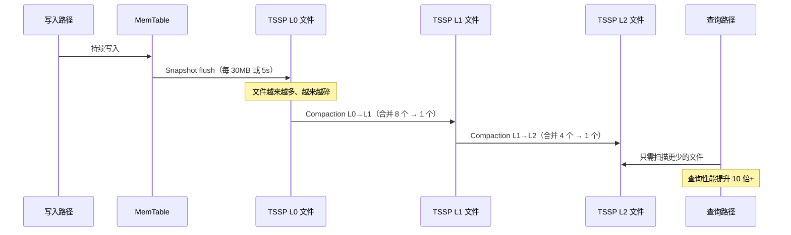

**通俗解释**：
想象你有很多小纸条（L0 文件），每张记录了一些数据。找东西时需要翻遍所有纸条，很慢。Compaction 就是定期把小纸条整理成大笔记本（L1、L2 文件），找东西时只需要翻几本笔记本就够了。

**Compaction 解决三个问题**：
1. **文件数量膨胀**：每次 flush 产生一个新文件，文件越来越多
2. **数据重复**：同一个 series 的数据分散在多个文件中
3. **查询性能下降**：文件越多，查询时需要合并的文件越多

---

## 2. 整体架构

### 2.1 两层架构

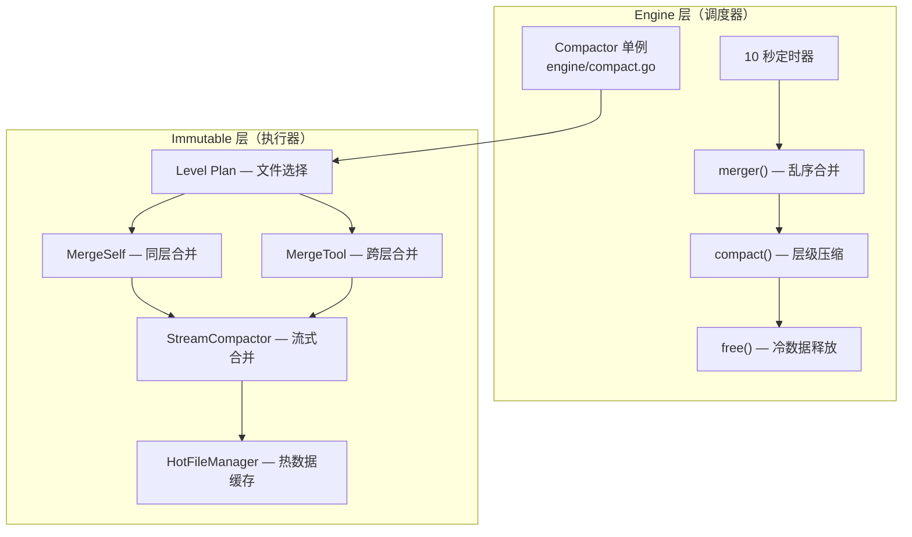

**代码位置**：`engine/compact.go`, `engine/immutable/compact.go`

### 2.2 核心结构体

```go
// engine/compact.go:47 — Compactor 调度器
type Compactor struct {
    mu sync.RWMutex
    wg sync.WaitGroup

    sources                  map[uint64]*shard  // shardId → shard 映射
    compactShards            []*shard           // 临时切片，每轮遍历前拷贝
    outOfOrderMergeNumberMin int               // 乱序文件合并最小数量（默认 2）
    outOfOrderMergeSizeMin   int               // 乱序文件合并最小大小（默认 1MB）

    plans map[uint64][immutable.CompactLevels]map[string][][]uint64  // 压缩计划缓存
}

// engine/immutable/compact.go — 层级常量
const CompactLevels = 7  // L0 ~ L6
```

---

## 3. Compaction 触发流程

### 3.1 Compactor 心跳循环

**代码位置**：`engine/compact.go:173`

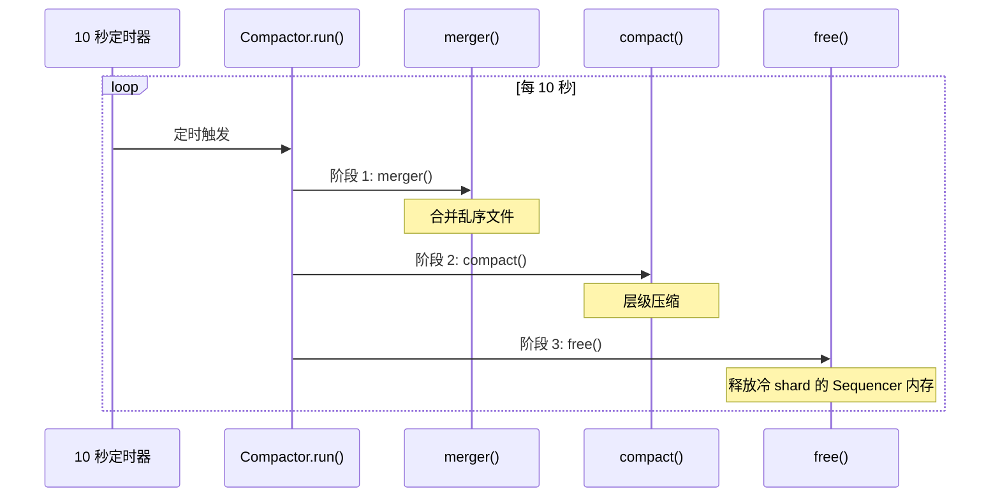

**核心代码**：`engine/compact.go:173-181`

```go
func (c *Compactor) run() {
    tm := time.NewTicker(time.Second * 10)
    defer tm.Stop()
    for range tm.C {
        c.merger()   // 阶段 1: 乱序合并
        c.compact()  // 阶段 2: 层级压缩
        c.free()     // 阶段 3: 冷数据释放
    }
}
```

> **注意**：`run()` 使用 `for range tm.C` 循环，没有 `select` 或 `stopCh` 通道。Compactor 的生命周期通过 goroutine 管理（`sync.WaitGroup`）而非显式停止信号控制。

### 3.2 层级压缩触发条件

**代码位置**：`engine/shard.go:703-744`

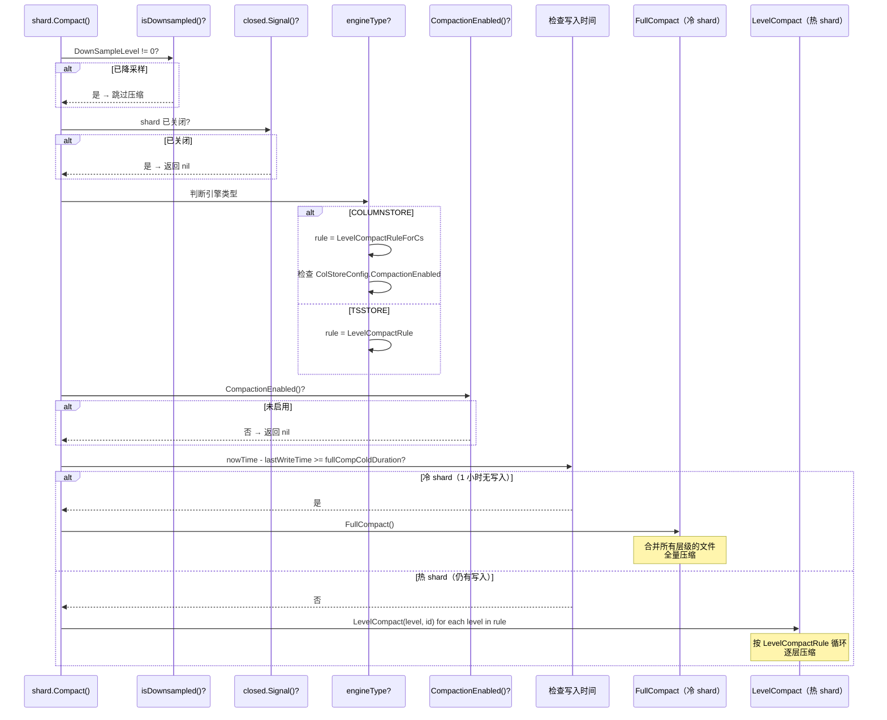

**关键常量**：
- `fullCompColdDuration = 3600` 秒（1 小时）— shard 冷却时间阈值
- `maxFullCompactor` 默认从 `cpu / 2` 推导，但会被 `SetMaxFullCompactor()` 夹紧：最小 1、最大 32；如果大于等于 `maxCompactor`，会调整为 `maxCompactor / 2`

**关键差异**：
- `isDownsampled()` 检查：降采样的 shard 跳过压缩
- `engineType` 判断：COLUMNSTORE 使用 `LevelCompactRuleForCs`，TSSTORE 使用 `LevelCompactRule`
- `CompactionEnabled()` 检查：可通过配置动态禁用压缩
- 使用 `select` 监听 `closed.Signal()` 检查 shard 是否已关闭

---

## 4. Level-Based 合并策略

### 4.1 层级结构

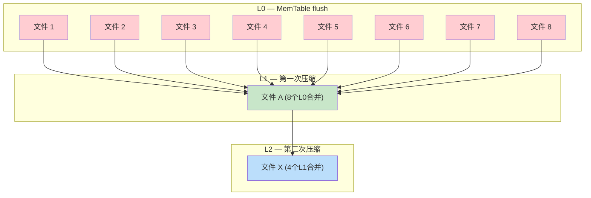

### 4.2 LevelCompactRule — 压缩循环规则

**代码位置**：`engine/immutable/compact.go`

```go
// 18 步循环规则
LevelCompactRule = []uint16{0, 1, 0, 2, 0, 3, 0, 1, 2, 3, 0, 4, 0, 5, 0, 1, 2, 6}

// 每个层级的最小文件数阈值
LeveLMinGroupFiles = [7]int{8, 4, 4, 4, 4, 4, 2}
```

**通俗解释**：

压缩循环就像"轮班表"：

```
第 1 轮：L0 → L1 → L0 → L2 → L0 → L3 → L0 → L1 → L2 → L3 → L0 → L4 → L0 → L5 → L0 → L1 → L2 → L6
         ↑                    ↑                    ↑                    ↑
         最频繁               较频繁               较少                 最少
```

- **L0 最频繁**：因为每次 flush 都产生 L0 文件，增长最快
- **L6 最少**：因为 L6 是最深层级，文件最大、最少变化

### 4.3 文件选择算法

**代码位置**：`engine/immutable/mms_tables.go:1148-1196`

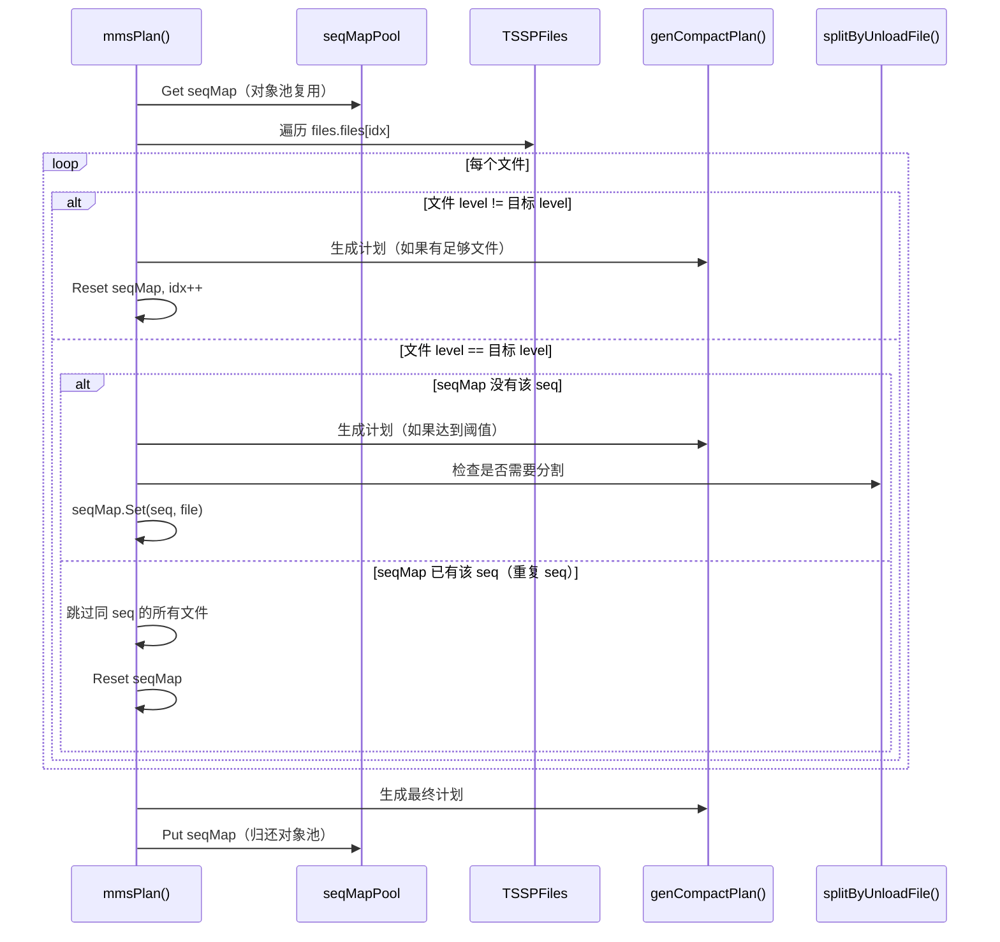

**核心代码**：`engine/immutable/mms_tables.go:1148-1196`（`mmsPlan` 方法）

```go
func (m *MmsTables) mmsPlan(name string, files *TSSPFiles, level uint16, minGroupFileN int,
    plans []*CompactGroup) []*CompactGroup {

    if m.isClosed() || m.isCompMergeStopped() || atomic.LoadInt64(&files.closing) > 0 {
        return plans
    }

    seqMap := seqMapPool.Get().(*dictpool.Dict)  // 从对象池获取，避免频繁分配
    seqMap.Reset()
    defer seqMapPool.Put(seqMap)

    idx := 0
    for idx < files.Len() {
        f := files.files[idx]
        lv, seq := f.LevelAndSequence()

        if lv != level {
            // 不同 level：生成计划并重置 seqMap
            plans = m.genCompactPlan(seqMap, minGroupFileN, name, level, files, plans)
            seqMap.Reset()
            idx++
            continue
        }

        seqByte := record.Uint64ToBytesUnsafe(seq)
        if !seqMap.HasBytes(seqByte) {
            // 新 seq：检查是否需要生成计划
            plans = m.genCompactPlan(seqMap, minGroupFileN, name, level, files, plans)
            if files.splitByUnloadFile(idx) {
                seqMap.Reset()  // 遇到 unload 文件时分割
            }
            seqMap.SetBytes(seqByte, f)
            idx++
        } else {
            // 重复 seq：跳过所有同 seq 文件
            i := idx + 1
            for i < files.Len() {
                f = files.files[i]
                if !levelSequenceEqual(level, seq, f) {
                    break
                }
                i++
            }
            idx = i
            seqMap.Reset()
        }
    }

    plans = m.genCompactPlan(seqMap, minGroupFileN, name, level, files, plans)
    return plans
}
```

> **关键设计**：
> - 使用 `seqMapPool` 对象池复用 `dictpool.Dict`，减少 GC 压力
> - `genCompactPlan()` 在 seqMap 长度达到 `minGroupFileN` 时生成压缩计划
> - `splitByUnloadFile()` 检测 unload 文件，在此处分割文件组
> - 重复 seq 的文件会被跳过（避免重复处理）

### 4.4 具体例子：L0 → L1 压缩

假设一个 measurement 有 10 个 L0 文件：

```
L0 文件列表：
  00000001-0000-00000001.tssp  (seq=1, level=0)
  00000002-0000-00000001.tssp  (seq=2, level=0)
  00000003-0000-00000001.tssp  (seq=3, level=0)
  00000004-0000-00000001.tssp  (seq=4, level=0)
  00000005-0000-00000001.tssp  (seq=5, level=0)
  00000006-0000-00000001.tssp  (seq=6, level=0)
  00000007-0000-00000001.tssp  (seq=7, level=0)
  00000008-0000-00000001.tssp  (seq=8, level=0)
  00000009-0000-00000001.tssp  (seq=9, level=0)  ← 多余
  00000010-0000-00000001.tssp  (seq=10, level=0) ← 多余

压缩触发：
  minGroupFileN = 8（L0 的阈值）
  seqMap.Len() = 8 ≥ 8 → 触发！

CompactGroup{
    name: "cpu_0001",
    toLevel: 1,
    group: [file1, file2, ..., file8]  // 前 8 个文件
}

执行合并：
  8 个 L0 文件 → 合并 → 1 个 L1 文件
  00000001-0001-00010001.tssp (seq=1, level=1)

结果：
  L0: [file9, file10]（剩余 2 个）
  L1: [file_new]（新合并的 1 个）
```

---

## 5. 乱序合并（Out-of-Order Merge）

### 5.1 什么是乱序数据？

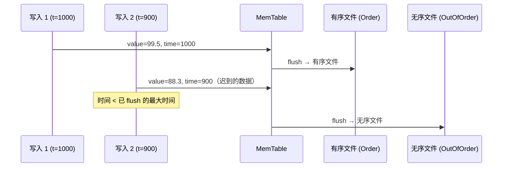

**通俗解释**：
时序数据通常按时间顺序写入，但有时会"迟到"（比如网络延迟）。迟到的数据不能追加到已有的有序文件中（因为有序文件的时间范围已经确定），只能写入单独的"无序文件"。乱序合并就是把无序文件中的数据合并回有序文件。

### 5.2 乱序合并触发条件

**代码位置**：`engine/immutable/merge_out_of_order.go:182-212`

```go
// 选择需要合并的 measurement
func (m *MmsTables) getMstToMerge(limit int, full bool, force bool) []string {
    conf := &config.GetStoreConfig().Merge
    ret := make([]string, 0, limit)
    m.mu.RLock()
    defer m.mu.RUnlock()

    for mst, files := range m.OutOfOrder {
        if len(ret) >= limit {
            break
        }

        files.RLock()
        num := files.Len()
        files.RUnlock()

        if num == 0 || files.closing > 0 || m.inMerge.Has(mst) {
            continue
        }

        // 触发条件：
        // 1. full 或 force 模式
        // 2. 无序文件数 >= DefaultLevelMergeFileNum (4)
        // 3. !Nearly(mst, MinInterval) — 距上次合并时间 > MinInterval
        if full || force {
            ret = append(ret, mst)
            continue
        }

        if num >= DefaultLevelMergeFileNum || !m.lmt.Nearly(mst, time.Duration(conf.MinInterval)) {
            ret = append(ret, mst)
        }
    }

    return ret
}
```

> **关键差异**：
> - 使用 `limit` 参数限制返回数量，不是 `maxCompactor`
> - 使用 `m.inMerge.Has(mst)` 检查是否正在合并，不是 `MeasurementInProcess`
> - `Nearly()` 函数逻辑：`Nearly(mst, d)` 返回 `true` 表示距上次合并时间 <= d（即"最近刚合并过"）
> - `!Nearly(mst, MinInterval)` 表示距上次合并时间 > MinInterval（即"足够久没合并了"）
> - 触发条件是 `!Nearly`（时间间隔足够大），不是 `elapsed >= MinInterval`

### 5.3 合并模式选择

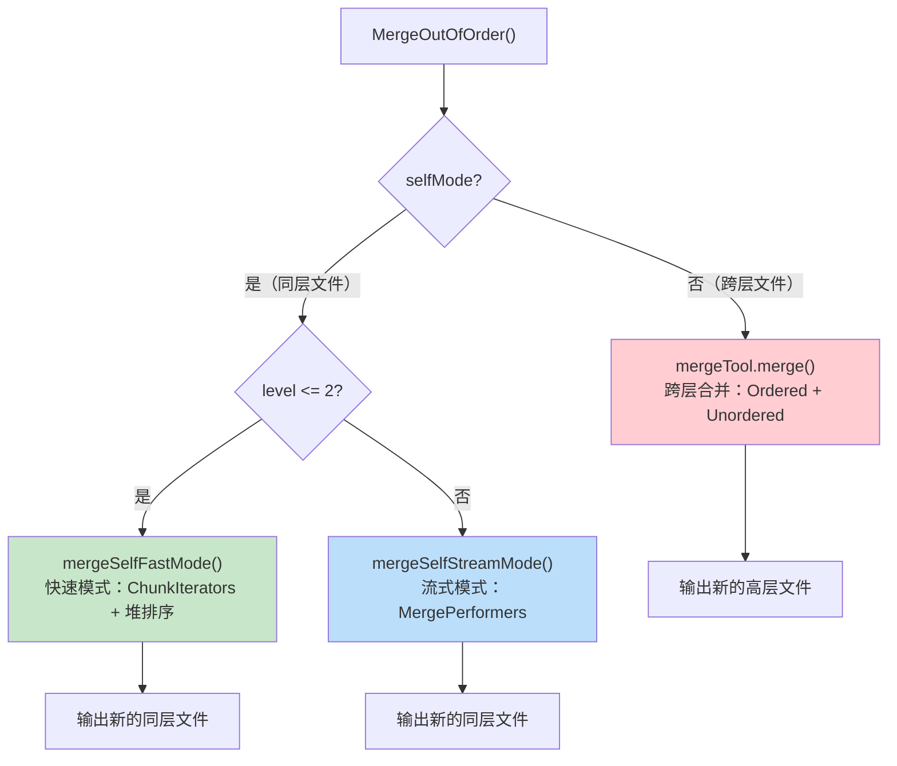

---

## 6. Self-Merge（同层合并）

### 6.1 快速模式（Fast Mode）

**代码位置**：`engine/immutable/merge_tool.go:217-260`

**适用条件**（`MergeSelfFast()` 函数，`engine/immutable/merge_util.go:112-114`）：
```go
func (ctx *MergeContext) MergeSelfFast() bool {
    return ctx.ToLevel() == config.TSSPToParquetLevel() ||
           int(ctx.ToLevel()) <= config.GetStoreConfig().Merge.StreamMergeModeLevel
}
```

**触发条件**（满足任一即可）：
1. `ToLevel() == TSSPToParquetLevel()` — 目标层级是 Parquet 转换层级
2. `ToLevel() <= StreamMergeModeLevel` — 目标层级 <= 流式合并阈值（默认 level <= 2）

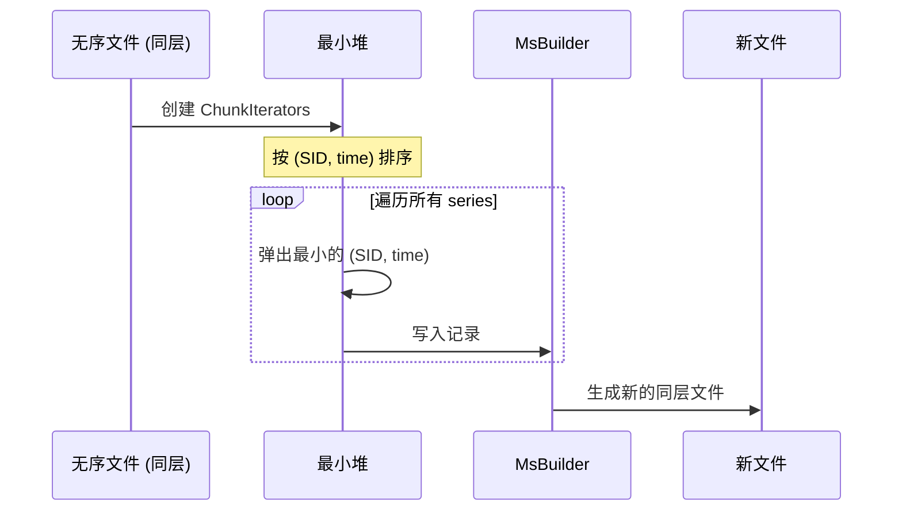

**通俗解释**：
快速模式就像"多路归并排序"。把多个无序文件的内容按 (SID, time) 排序，直接写入一个新文件。因为所有文件都在同一层，不需要和有序文件合并，所以很快。

### 6.2 流式模式（Stream Mode）

**代码位置**：`engine/immutable/merge_tool.go:262`

**适用条件**：`ToLevel() > StreamMergeModeLevel`（默认 level > 2）

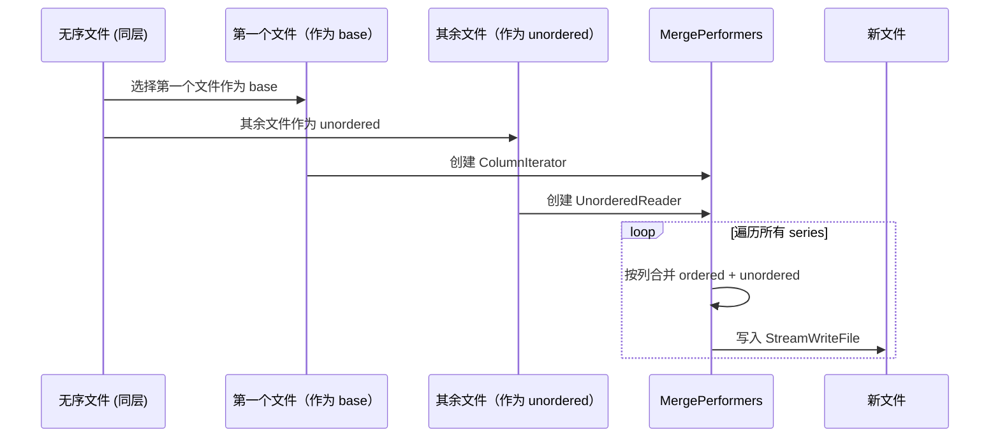

---

## 7. Cross-Level Merge（跨层合并）

### 7.1 合并流程

**代码位置**：`engine/immutable/merge_tool.go:77`

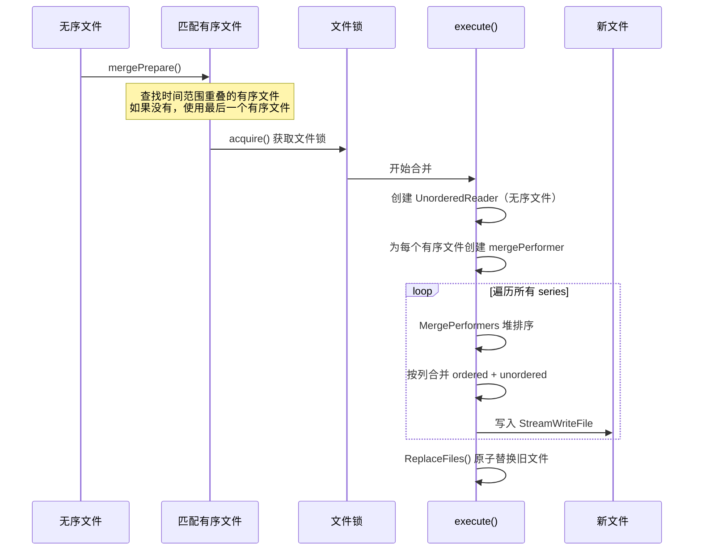

### 7.2 mergePerformer — 列级合并

**代码位置**：`engine/immutable/merge_performer.go:32`

```go
type mergePerformer struct {
    mh   *record.MergeHelper       // 合并辅助器
    ur   *UnorderedReader          // 无序数据读取器
    sw   *StreamWriteFile          // 流式写入器
    cw   *columnWriter             // 列写入器
    itr  *ColumnIterator           // 有序数据迭代器
    stat *statistics.MergeStatItem // 合并统计信息

    lastFile          bool           // 是否是最后一个有序文件（剩余无序数据写入此文件）
    lastSeries        bool           // 是否是最后一个 series
    noUnorderedSeries bool           // 当前有序数据的 series 在无序数据中不存在
    noUnorderedColumn bool           // 当前列在无序数据中不存在

    sid              uint64         // 当前 series ID
    ref              *record.Field  // 当前列 schema
    unorderedSchemas record.Schemas // 无序数据的 schema

    mergedTimes   []int64          // 合并后的时间数组
    mergedTimeCol *record.ColVal   // 合并后的时间列
    nilCol        record.ColVal    // 空列（用于填充缺失列）
}
```

**列级合并逻辑**：

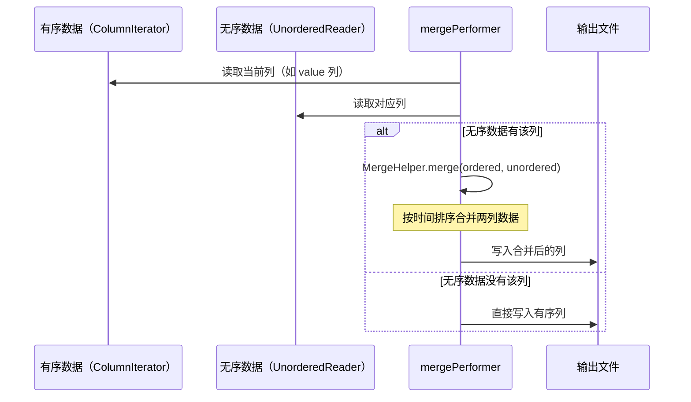

**具体例子**：

```
有序文件 (L1): SID=1001
  time: [1000, 1001, 1002]
  value: [99.5, 88.3, 77.1]

无序文件 (L0): SID=1001
  time: [999, 1001]
  value: [66.0, 55.5]  ← time=1001 有重复

合并过程：
  1. 合并时间数组: MergeTimes([1000,1001,1002], [999,1001]) = [999,1000,1001,1002]
  2. 合并 value 列:
     - time=999: 无序 → 66.0
     - time=1000: 有序 → 99.5
     - time=1001: 无序覆盖有序 → 55.5（无序更新）
     - time=1002: 有序 → 77.1
  3. 输出: time=[999,1000,1001,1002], value=[66.0,99.5,55.5,77.1]
```

---

## 8. Streaming Compaction — 流式合并

### 8.1 为什么需要流式合并？

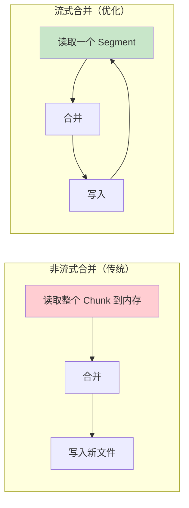

**问题**：非流式合并需要将整个 Chunk（可能几百 MB）加载到内存，容易 OOM。

**解决**：流式合并每次只处理一个 Segment（~1000 行），内存占用恒定。

### 8.2 流式 vs 非流式决策

**代码位置**：`engine/immutable/stream_compact.go:54`

```go
func NonStreamingCompaction(fi FilesInfo) bool {
    // 优先检查：启用了时间校正 → 必须使用非流式（需要全局排序）
    if config.GetStoreConfig().Compact.CorrectTimeDisorder {
        return true
    }

    // 其次检查：显式配置的合并模式
    flag := GetMergeFlag4TsStore()
    if flag == util.NonStreamingCompact {
        return true  // 强制非流式
    } else if flag == util.StreamingCompact {
        return false // 强制流式
    } else {
        // 自动决策：基于内存估算和行数
        n := fi.avgChunkRows * fi.maxColumns * 8 * len(fi.compIts)
        if n >= streamCompactMemThreshold {
            return false // 内存估算 >= 128MB → 流式
        }

        if fi.maxChunkRows > GetMaxRowsPerSegment4TsStore()*streamCompactSegmentThreshold {
            return false // 行数过多 → 流式
        }

        return true // 内存和行数都合理 → 非流式（更快）
    }
}
```

**决策阈值**：
- `streamCompactMemThreshold = 128MB` — 内存阈值
- `streamCompactSegmentThreshold = 500` — 行数阈值
- 如果估算内存 < 128MB 且行数合理 → 非流式（更快）
- 否则 → 流式（更安全）

### 8.3 StreamIterators 架构

**代码位置**：`engine/immutable/stream_compact.go:144`

```go
type StreamIterators struct {
    closed        chan struct{}       // 关闭信号
    stopCompMerge chan struct{}       // 停止合并信号
    closeStat     bool               // 是否已关闭统计
    dropping      *int64             // 是否正在丢弃数据
    dir           string             // 文件目录
    name          string             // measurement name with version
    lock          *string            // 文件锁
    itrs          []*StreamIterator  // 所有迭代器
    chunkItrs     []*StreamIterator  // 当前 chunk 的迭代器
    segmentIndex  int                // 当前 segment 索引
    iteratorStart int                // 迭代器起始位置
    estimateSize  int                // 估算大小
    maxN          int                // 最大数量
    fields        record.Schemas     // 合并后的 schema

    TableData                      // 表数据（内嵌）
    mIndex     MetaIndex           // 元数据索引
    keys       map[uint64]struct{} // 已处理的 key 集合
    bf         *bloom.Filter       // 布隆过滤器

    Conf       *Config             // 配置
    ctx        *ReadContext        // 读取上下文
    colBuilder *ColumnBuilder      // 增量列编码器
    trailer    Trailer             // 文件尾部
    fd         fileops.File        // 文件描述符
    writer     fileops.FileWriter  // 文件写入器
    pair       IdTimePairs         // ID-时间对
    tier       uint64              // 数据分层标识
    dstMeta    ChunkMeta           // 目标 chunk 元数据
    schemaMap  map[string]struct{} // schema 去重 map
}
```

**流式合并流程**：

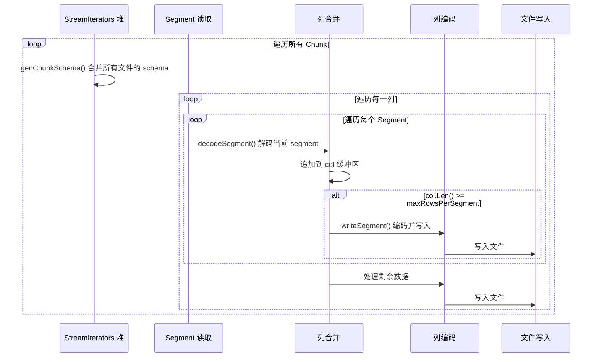

### 8.4 具体例子：流式合并 3 个文件

```
文件 A (L0): SID=1001, Segment 0: time=[1000,1001], value=[99.5,88.3]
文件 B (L0): SID=1001, Segment 0: time=[999,1000], value=[66.0,55.0]
文件 C (L1): SID=1001, Segment 0: time=[1000,1001,1002], value=[77.1,44.2,33.1]

流式合并过程：

步骤 1: 合并 schema
  fields = [{time, INT}, {value, FLOAT}]

步骤 2: 合并 time 列
  读取 A.time = [1000,1001]
  读取 B.time = [999,1000]
  读取 C.time = [1000,1001,1002]
  合并排序: [999,1000,1001,1002]  ← 4 行

步骤 3: 合并 value 列
  对齐到合并后的 time:
    time=999:  B → 66.0
    time=1000: B 覆盖 → 55.0（B 是无序，更新优先）
    time=1001: A → 88.3
    time=1002: C → 33.1

步骤 4: 写入新文件
  time=[999,1000,1001,1002], value=[66.0,55.0,88.3,33.1]
```

---

## 9. Hot Data — 热数据缓存

### 9.1 HotFileManager

**代码位置**：`engine/immutable/hot.go:161`

```go
type HotFileManager struct {
    signal chan struct{}
    wg     sync.WaitGroup
    mu     sync.RWMutex
    conf   *config.HotMode

    files       map[int64]*HotFiles // key is the time window
    timeWindows []int64             // reverse order

    maxMemorySize   int64
    totalMemorySize int64

    // Used only during shard loading
    loadMemorySize int64
}
```

**热数据策略**：
- 合并后的文件可能立即被查询（"热数据"）
- `HotFileManager` 只在 HotMode 开启且文件满足 `InMemSize()`、hot duration 和内存条件时保留内存 reader；不是所有 compaction 结果都会同时保存在内存中
- 查询时直接从内存读取，避免刚写入就立即读取的 IO 开销

### 9.2 HotFileWriter 和 HotFileReader

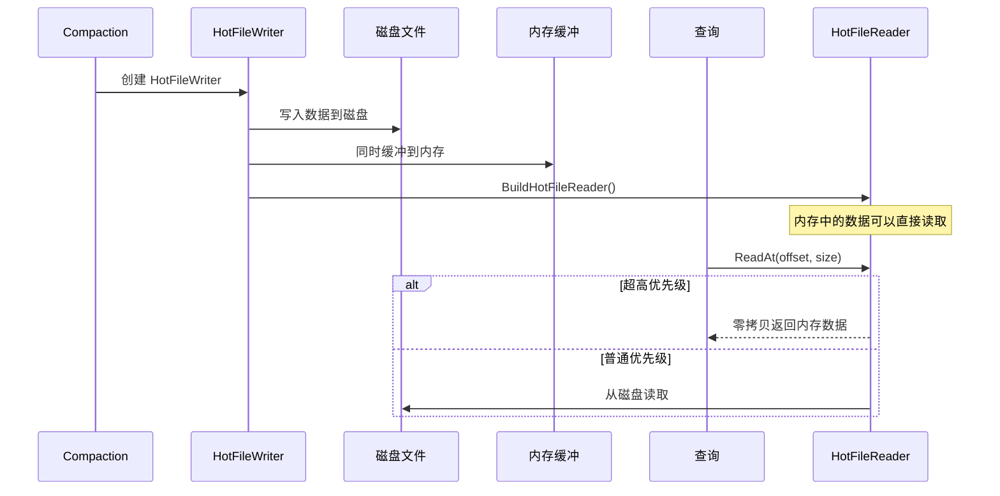

### 9.3 数据分层（Hot/Warm）

**代码位置**：`engine/immutable/hot.go:370-392`

```go
func FilesMergedTire(files []TSSPFile) uint64 {
    tire := util.Warm                        // 默认 Warm
    maxSize := int64(config.GetStoreConfig().HotMode.MaxFileSize)
    var totalFileSize int64
    for _, f := range files {
        totalFileSize += f.FileSize()
    }

    // 优先检查：总大小超过阈值 → Warm（不再检查内存）
    if config.HotModeEnabled() && totalFileSize/2 >= maxSize {
        return util.Warm
    }

    // 遍历文件：任一文件在内存中 → Hot
    for _, f := range files {
        if f.FileSize() >= maxSize {
            return util.Warm                 // 单文件过大 → Warm
        }
        if f.InMemSize() > 0 {
            tire = util.Hot                  // 有内存文件 → Hot
        }
    }
    return uint64(tire)
}
```

> **关键差异**：
> - 默认值为 `util.Warm`，不是 `Cold`
> - 先检查总大小（`totalFileSize/2 >= maxSize`），再遍历文件
> - 永远不会返回 `util.Cold` — 只有 `Hot` 和 `Warm` 两层
> - 如果 `HotModeEnabled()` 为 false，仍然可能返回 `Hot`（通过内存文件检查）

---

## 10. 并发控制与 IO 限速

### 10.1 并发限制

```go
// 全局并发限制
compLimiter = limiter.NewFixed(cpu.GetCpuNum())      // 压缩并发数 = CPU 核数
maxFullCompactor = cpu.GetCpuNum() / 2                // 初始值，后续会被 SetMaxFullCompactor 夹紧

// 写入限速
compWriteLimiter = fileops.NewLimiter(48MB/s, 64MB/s) // 压缩写入限速
snapshotWriteLimiter = fileops.NewLimiter(48MB/s, 64MB/s) // Snapshot 写入限速

// 文件加载限速
fileLoadLimiter = limiter.NewFixed(cpu * 4)            // 文件读取并发数 = CPU*4
```

**真实代码规则**：`engine/immutable/compact.go:86-108` 的 `SetMaxFullCompactor()` 不是简单固定 `CPU/2`。当配置值为 0 时使用 `cpu/2`；随后如果 `maxFullCompactor >= maxCompactor`，改成 `maxCompactor/2`；最后再限制到 `[1, 32]`。因此文档和调参时应把 `CPU/2` 理解为默认推导值，不是最终不变值。

### 10.2 Measurement 级去重

**代码位置**：`engine/immutable/merge_util.go:331`

```go
// 防止同一个 measurement 并发合并
type MeasurementInProcess struct {
    m sync.Map  // name → bool
}

func (m *MeasurementInProcess) Add(name string) bool {
    _, loaded := m.m.LoadOrStore(name, true)
    return !loaded  // 返回 false 表示已经在处理中
}

func (m *MeasurementInProcess) Del(name string) {
    m.m.Delete(name)
}
```

**通俗解释**：
就像一个"工位牌"系统。每个 measurement 只有一个工位牌，拿到牌的 goroutine 可以开始合并，其他 goroutine 看到牌被拿走了就跳过。

---

## 11. Compaction 崩溃恢复

### 11.1 预写日志

**代码位置**：`engine/immutable/compaction_file_info.go`

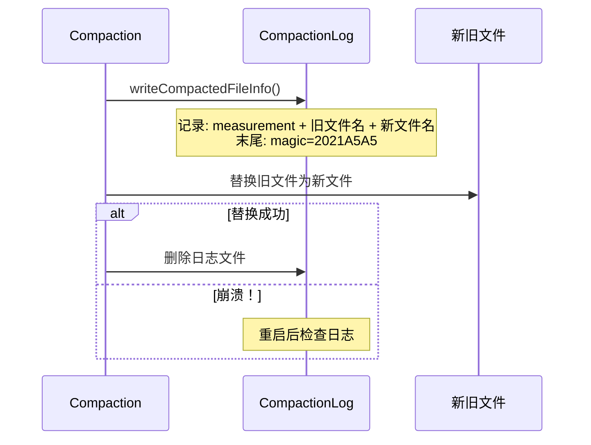

### 11.2 恢复流程

**代码位置**：`engine/immutable/compaction_file_info.go`（`procCompactLog` 方法）

```
启动时检查：

场景 1: 新文件全部存在
  → 进入 processFiles()
  → finalize 新文件名（去掉 .tmp），删除旧文件
  → 删除或完成日志清理

场景 2: 新文件未全部存在，旧文件全部存在
  → Compaction 未完成
  → 调用 renameFile(oName + ".tmp")
  → 语义是把旧文件的 .tmp 临时名恢复为正常旧文件名
  → 返回 nil，保留旧文件继续提供数据

场景 3: 新文件未全部存在，旧文件也不完整
  → 日志与目录状态不一致
  → 返回 invalid compact log 错误
```

**代码细节**：`processLog()` 先统计 `info.NewFile` 是否全部存在；只要新文件不完整，就检查旧文件是否全部存在。旧文件完整时不会删除旧文件，而是恢复旧文件名后直接返回。只有新文件完整时，才调用 `processFiles()` 完成新文件并清理旧文件。

**恢复案例**：

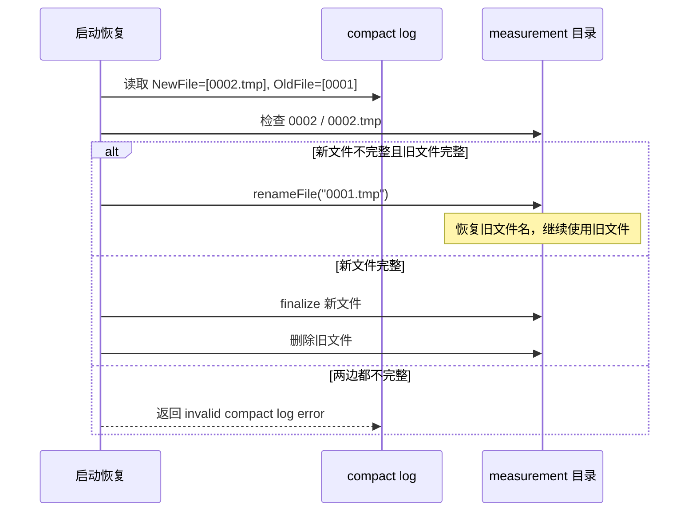

---

## 12. 总结：Compaction 策略的关键设计

| 设计 | 目的 | 效果 |
|------|------|------|
| 7 级层级结构 | 渐进式合并，避免一次性合并过多文件 | 写入放大可控 |
| LevelCompactRule 循环 | L0 最频繁，L6 最少 | 低层级文件快速合并 |
| 冷热分离 | 冷 shard 全量压缩，热 shard 逐层压缩 | 资源分配合理 |
| 乱序合并 | 处理迟到的数据 | 数据完整性保证 |
| 流式合并 | 内存占用恒定 | 避免大文件合并 OOM |
| HotFileManager | 符合 HotMode 条件的热文件可保留内存 reader | 减少磁盘 IO；不保证所有合并结果零延迟查询 |
| 并发控制 | CPU 核数限制 + IO 限速 | 不影响正常读写 |
| 崩溃恢复 | 预写日志 + 启动时检查 | 崩溃不会丢失数据 |
| Measurement 级去重 | 防止并发合并同一 measurement | 避免数据损坏 |
