# Module 15: Raft 分区级共识深度审计报告（庖丁解牛版）

> openGemini 的 Raft 共识分为两层：**元数据级 Raft**（ts-meta，管理集群元数据）和**分区级 Raft**（ts-store，管理数据副本）。本模块聚焦于分区级 Raft — 它是分布式数据一致性的基石。

---

## 1. 分区级 Raft 是什么？为什么需要它？

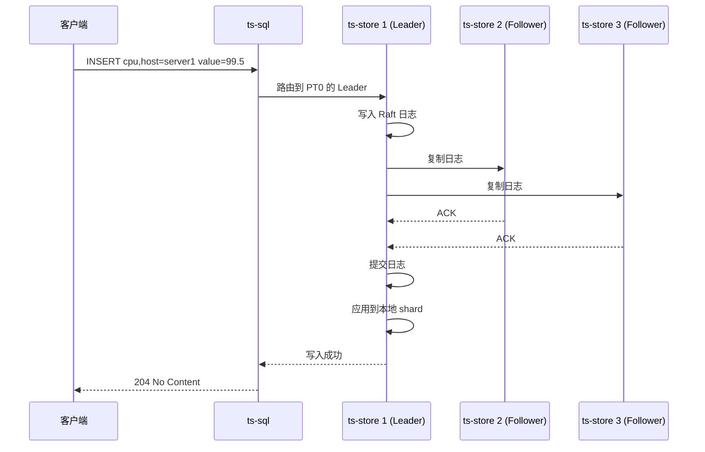

**通俗解释**：
假设某个 PT 只有单副本且 owner 节点宕机，该 PT 会不可用并存在数据丢失风险。分区级 Raft 作用于 Replication/RG 副本场景，通过"复制"机制让同一个数据分区在多个节点上有副本。写入时，Leader 先把日志复制到 Follower，多数派确认后才提交，从而降低单节点故障风险。

**与 ts-meta Raft 的区别**：

| 维度 | ts-meta Raft | ts-store 分区级 Raft |
|------|-------------|---------------------|
| 管理对象 | 集群元数据（DB、RP、Shard） | 实际数据（数据点） |
| Raft 组数量 | 1 个（全局） | 每个分区 1 个 |
| 数据量 | 小（KB 级） | 大（GB 级） |
| 持久化 | BoltDB | 自定义 .entry 文件 |
| 快照 | 元数据快照 | 轻量级标记（不含数据） |

---

## 2. 核心概念：分区与复制组

### 2.1 层级关系

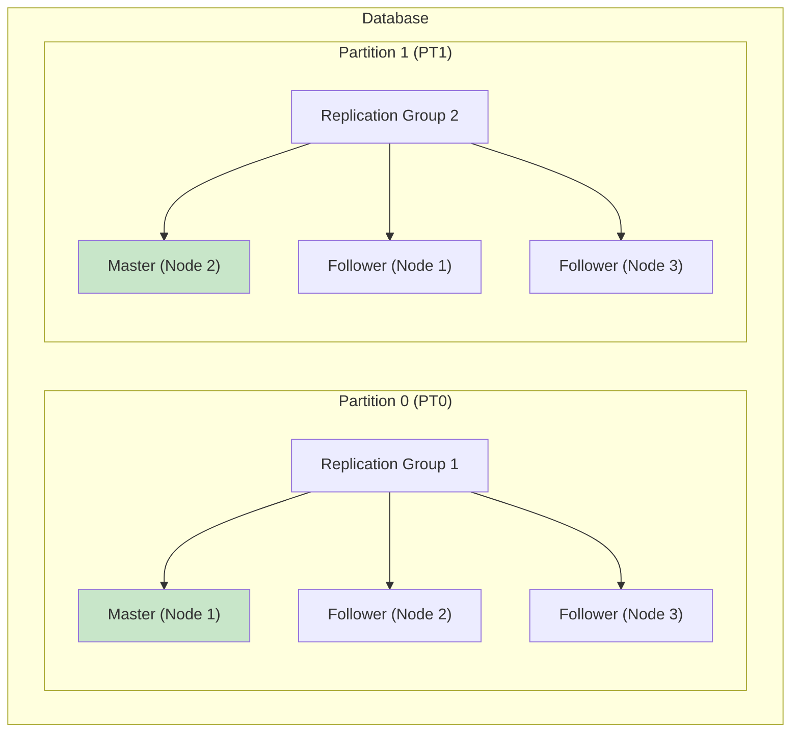

**代码位置**：`lib/util/lifted/influx/meta/replication.go`

```go
// 复制组
type ReplicaGroup struct {
    ID         uint32     // 复制组 ID
    MasterPtID uint32     // Master 分区 ID
    Peers      []Peer     // 其他成员
    Status     RGStatus   // Health / SubHealth / UnFull
    Term       uint64     // Master 的任期
}

// 复制组状态
type RGStatus uint8
const (
    Health    RGStatus = iota  // 健康：所有副本都在线
    SubHealth                  // 亚健康：只有 Master 在线
    UnFull                     // 不完整：正在重建
)
```

**通俗解释**：
- **Database** = 一栋楼
- **Partition** = 楼层（每个楼层有独立的 Raft 组）
- **Replication Group** = 每层楼的保安团队（3 个人，1 个队长 + 2 个队员）
- **Master** = 队长（负责接收和分发任务）
- **Follower** = 队员（负责复制队长的任务）

### 2.2 Raft 节点 ID 映射

**代码位置**：`lib/raftconn/node.go`

```go
// Raft 节点 ID = 分区 ID + 1（Raft 要求 ID > 0）
func GetRaftNodeId(ptId uint32) uint64 { return uint64(ptId) + 1 }
func GetPtId(raftNode uint64) uint32   { return uint32(raftNode) - 1 }
```

**具体例子**：

```
PT0 的 Raft 节点 ID = 0 + 1 = 1
PT1 的 Raft 节点 ID = 1 + 1 = 2
PT2 的 Raft 节点 ID = 2 + 1 = 3
```

---

## 3. 核心结构体

### 3.1 DBPTInfo — 分区信息

**代码位置**：`engine/partition.go`

```go
type DBPTInfo struct {
    replicaInfo *message.ReplicaInfo  // 复制信息
    node        raftNodeRequest       // Raft 节点（nil = 无复制）
    proposeC    chan<- []byte         // 提议 channel
    ReplayC     chan *raftconn.Commit // 重放 channel

    mu          sync.RWMutex
    database    string                // 数据库名
    id          uint32                // 分区 ID
    shards      map[uint64]Shard      // shardID → Shard
    path        string                // 数据目录
    walPath     string                // WAL 目录
}
```

### 3.2 RaftNode — Raft 节点封装

**代码位置**：`lib/raftconn/node.go:57-106`

```go
type RaftNode struct {
    once        sync.Once
    proposeC    chan []byte            // 提议 channel
    confChangeC chan raftpb.ConfChange // 集群配置变更提议 channel
    commitC     chan *Commit           // 已提交日志 channel
    ReplayC     chan *Commit           // 重放 channel
    errorC      chan<- error           // 错误 channel
    Messages    chan *raftpb.Message   // Raft 消息 channel

    nodeId   uint64                    // 物理节点 ID
    database string                    // 数据库名
    ptId     uint32                    // 分区 ID
    id       uint64                    // Raft 节点 ID = ptId + 1
    peers    map[uint32]uint64         // ptId → nodeId 映射

    tick *time.Ticker                  // 心跳定时器

    ctx      context.Context
    cancelFn context.CancelFunc

    appliedIndex uint64                // 已应用的日志索引

    lock      sync.RWMutex             // 读写锁
    confState *raftpb.ConfState        // 集群配置状态
    node      raft.Node                // etcd Raft 节点实例

    startTime time.Time                // 启动时间
    Cfg       *raft.Config             // Raft 配置
    Store     *raftlog.RaftDiskStorage // 持久化存储
    RaftPeers []raft.Peer              // Raft Peer 列表

    ISend SendRaftMessageToStorage     // 消息发送接口

    MetaClient metaclient.MetaClient   // 元数据客户端

    SnapShotter *raftlog.SnapShotter   // 快照跟踪器

    logger *logger.Logger

    proposeId atomic.Uint64            // 提议 ID（原子操作）

    dataCommittedMu sync.RWMutex
    DataCommittedC  map[uint64]chan error // 已提交数据的确认 channel

    Identity string                    // db_ptId

    tolerateStartTime atomic.Int64
}
```

### 3.3 DataWrapper — 提议序列化

**代码位置**：`lib/raftlog/datawrapper.go`

```go
type DataType uint32
const (
    Normal        DataType = iota  // 普通数据写入
    Snapshot                       // 快照标记
    ClearEntryLog                  // 日志清理命令
)

type DataWrapper struct {
    Data      []byte    // 实际数据
    DataType  DataType  // 类型标识
    Identity  string    // "database_ptId"
    ProposeId uint64    // 单调递增的提议 ID
}
```

**序列化格式**：
```
[4B: DataType] [1B: identity 长度] [NB: identity] [8B: ProposeId] [剩余: Data]
```

---

## 4. 写入提案完整流程

### 4.1 端到端时序图

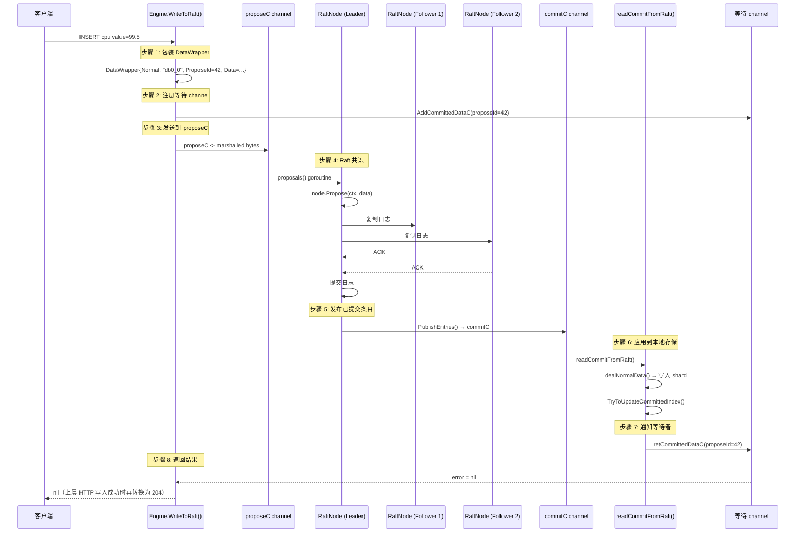

### 4.2 核心代码：WriteToRaft

**代码位置**：`engine/engine.go:1154`

```go
func (e *EngineImpl) WriteToRaft(db, rp string, ptId uint32, tail []byte) error {
    // 步骤 1: 包装 DataWrapper
    wrapper := &raftlog.DataWrapper{
        Data:      tail,
        DataType:  raftlog.Normal,
        Identity:  fmt.Sprintf("%s_%d", database, ptId),
        ProposeId: node.NextProposeId(),
    }
    data := wrapper.Marshal()

    // 步骤 2: 注册等待 channel
    ch := node.AddCommittedDataC(wrapper)

    // 步骤 3: 发送到 proposeC
    dbpt.proposeC <- data

    // 步骤 4: 等待提交确认（超时 20 秒）
    select {
    case commitedErr := <-ch:
        if commitedErr != nil {
            logger.GetLogger().Error("raftNode commitedErr err", zap.Error(commitedErr))
        }
        return commitedErr
    case <-time.After(config.WaitCommitTimeout):
        return errno.NewError(errno.WriteToRaftTimeoutAfterPropose, wrapper.Identity, wrapper.ProposeId)
    }
}
```

**返回语义说明**：
- `EngineImpl.WriteToRaft` 和 Raft/engine 层只返回 `nil` 或 `error`
- `204 No Content` 是 HTTP 写入入口在收到成功结果后的协议层表现，不是 Raft 层直接返回的状态码
- 如果 `dealNormalData` 写 shard 失败，错误会通过 `RetCommittedDataC(dw, committedErr)` 回传给等待中的 `WriteToRaft`

**失败案例**：

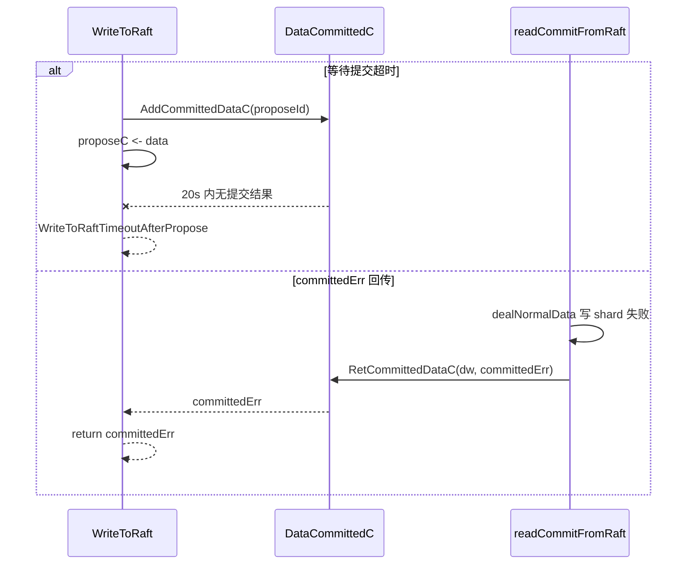

```
场景 1：多数派无法提交
  WriteToRaft 注册 proposeId=42
  -> proposeC 已发送
  -> 20 秒内没有 RetCommittedDataC
  -> 返回 WriteToRaftTimeoutAfterPropose(db_0, 42)

场景 2：日志已提交但本地应用失败
  readCommitFromRaft 收到 committed entry
  -> dealNormalData() 写 shard 返回 "mem write err"
  -> RetCommittedDataC(dw, committedErr)
  -> WriteToRaft 返回该 error，不返回 204
```

### 4.3 核心代码：serveChannels — Raft 事件循环

**代码位置**：`lib/raftconn/node.go`（`serveChannels` 方法）

```go
func (n *RaftNode) serveChannels() {
    for {
        select {
        case rd := <-n.node.Ready():
            // Leader: 先发送消息（乐观复制）
            if n.isLeader() {
                n.sendMessages(rd.Messages)
            }

            // 保存到磁盘
            n.Store.Save(rd.HardState, rd.Entries, rd.Snapshot)

            // Follower: 后发送消息（确保已持久化）
            if !n.isLeader() {
                n.sendMessages(rd.Messages)
            }

            // 发布已提交条目
            n.PublishEntries(rd.CommittedEntries)

            // 处理快照元数据
            if !raft.IsEmptySnap(rd.Snapshot) {
                n.confState = rd.Snapshot.Metadata.ConfState
                n.appliedIndex = rd.Snapshot.Metadata.Index
            }

        case <-n.ctx.Done():
            return
        }
    }
}
```

**关键设计**：
- **Leader 先发消息后写盘**：降低写入延迟（乐观复制）
- **Follower 先写盘后发消息**：确保数据已持久化再确认

---

## 5. Raft 日志持久化

### 5.1 文件布局

```
<walPath>/__raft_entries__/
    raft.meta           ← 1MB 元数据文件（HardState、Snapshot）
    00001.entry         ← 日志文件 #1
    00002.entry         ← 日志文件 #2
    ...
```

### 5.2 .entry 文件格式

**代码位置**：`lib/raftlog/log.go`

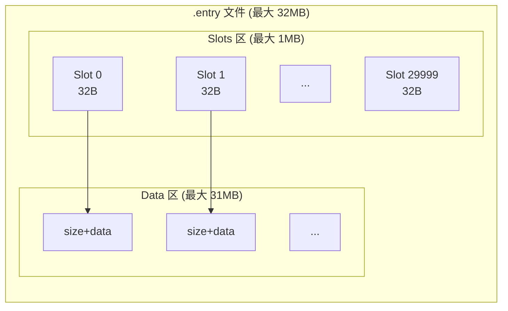

**Slot 格式**（每个 32 字节）：
```
|--- 8 bytes ---|--- 8 bytes ---|--- 8 bytes ---|--- 8 bytes ---|
|    Term       |    Index      |    Type       |    Offset     |
```

- **Term**：Raft 任期号
- **Index**：日志条目索引
- **Type**：条目类型
- **Offset**：数据在 Data 区的偏移量

**Data 格式**：
```
[4B: 数据大小] [NB: 实际数据]
```

**关键常量**：
- `maxNumEntries = 30000` — 每个文件最多 30000 条目
- `maxLogFileSize = 32MB` — 每个文件最大 32MB
- `logFileOffset = 1MB` — Data 区起始偏移

### 5.3 raft.meta 文件格式

**代码位置**：`lib/raftlog/meta.go`

```
偏移 0:     RaftId (8B)
偏移 8:     GroupId (8B)
偏移 16:    CheckpointIndex (8B)
偏移 512:   HardState (protobuf, 变长)
偏移 1024:  SnapshotIndex (8B)
偏移 1032:  SnapshotTerm (8B)
偏移 1040:  Snapshot (protobuf, 变长)
```

**通俗解释**：
raft.meta 就像 Raft 节点的"身份证"。它记录了：我是谁（RaftId）、我的任期是什么（HardState）、我最新的快照在哪里（Snapshot）。

### 5.4 RaftDiskStorage.Save() — 核心持久化方法

**代码位置**：`lib/raftlog/storage.go`

```go
func (rds *RaftDiskStorage) Save(h *raftpb.HardState, entries []raftpb.Entry, snap *raftpb.Snapshot) error {
    rds.lock.Lock()
    defer rds.lock.Unlock()

    // 写入日志条目
    rds.entryLog.AddEntries(entries)

    // 写入 HardState
    rds.meta.StoreHardState(h)

    // 写入 Snapshot
    rds.meta.StoreSnapshot(snap)

    return nil
}
```

### 5.5 Sync 策略

```go
func (rds *RaftDiskStorage) TrySync() {
    if rds.firstSync || rds.SyncInterval == 0 {
        // 立即同步（第一次或配置为 0）
        rds.meta.Sync()
        rds.entryLog.current.Sync()
        rds.firstSync = false
        return nil
    }
    // 当前实现不会为每次 MustSync 启动延迟 goroutine；
    // SyncInterval 非 0 且不是首次同步时直接返回 nil。
    return nil
}
```

---

## 6. 快照机制

### 6.1 轻量级快照

**关键设计**：openGemini 的 Raft 快照是**轻量级的** — 它不包含实际数据，只记录一个"日志压缩标记"。

```go
func (rds *RaftDiskStorage) CreateSnapshot(i uint64, cs *raftpb.ConfState, data []byte) error {
    snap := raftpb.Snapshot{
        Metadata: raftpb.SnapshotMetadata{
            Index:     i,
            Term:      term,
            ConfState: cs,
        },
        Data: []byte("snapshot"),  // 占位符，不含实际数据
    }
    rds.meta.StoreSnapshot(&snap)
    return nil
}
```

**为什么是轻量级的？**
- 实际数据由存储引擎独立管理（TSSP 文件）
- Raft 快照只用于**日志压缩** — 记录"这个 index 之前的数据已经全部应用了"
- 不需要复制大量数据，创建和恢复都非常快

### 6.2 快照触发流程

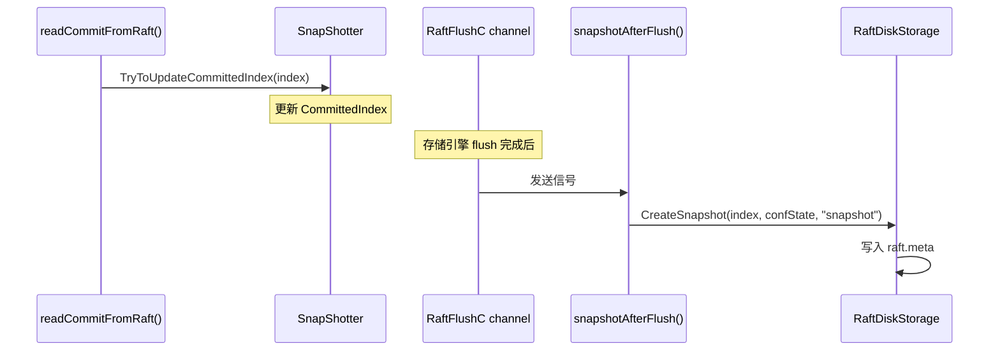

### 6.3 重启恢复流程

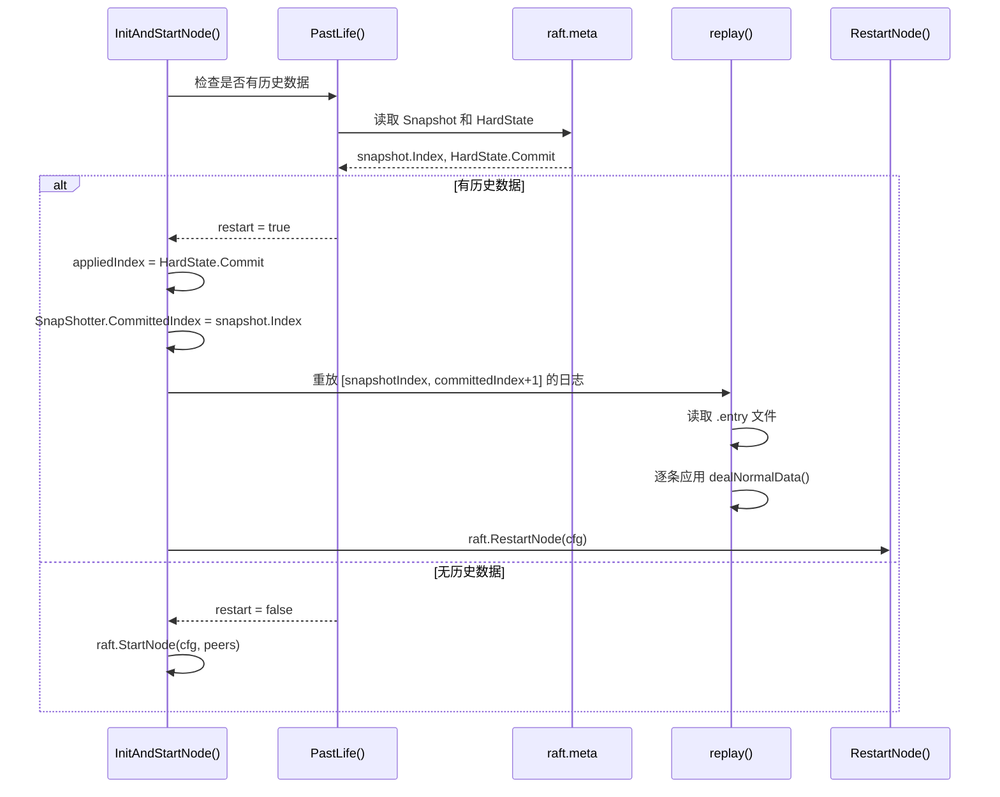

**具体例子**：

```
假设 PT0 有以下日志：
  Index 1-100: 已提交，已应用
  Index 101-150: 已提交，未应用
  Index 151-200: 未提交

快照：snapshot.Index = 100
HardState: Commit = 150

重启后：
  1. appliedIndex = 150（从 HardState）
  2. SnapShotter.CommittedIndex = 100（从 Snapshot）
  3. replay() 重放 [101, 151) 的日志
  4. 逐条应用 dealNormalData() → 写入 shard
  5. RestartNode() 恢复 Raft 状态
```

---

## 7. 日志压缩

### 7.1 周期性清理

**代码位置**：`lib/raftconn/node.go`（`deleteEntryLogPeriodically` 方法）

```go
func (n *RaftNode) deleteEntryLogPeriodically() {
    ticker := time.NewTicker(time.Minute)
    for {
        select {
        case <-ticker.C:
            n.deleteEntryLog()       // 通过 Raft 提议清理
            n.deleteEntryLogBySize() // 本地紧急清理
        case <-n.ctx.Done():
            return
        }
    }
}
```

### 7.2 通过 Raft 提议清理（所有副本一致）

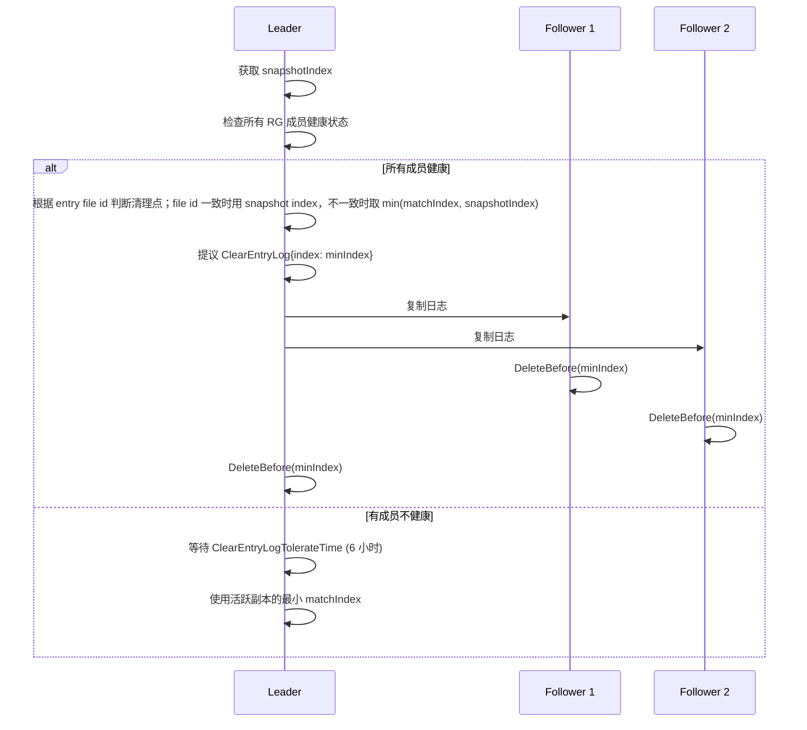

**通俗解释**：
日志清理就像"清理快递单"。快递送达后（数据已应用），快递单就没用了。但清理时必须确保所有分店（副本）都确认了，才能统一清理。

### 7.3 本地紧急清理

```go
func (n *RaftNode) deleteEntryLogBySize() {
    size := n.Store.EntrySize()
    if uint64(size) > ClearEntryLogTolerateSize {  // 默认 20GB
        // 强制本地清理，不通过 Raft
        n.forceDeleteEntryLogBySize(snapshotIndex)
    }
}
```

**触发条件**：节点本地日志总大小超过 20GB 时，本节点执行紧急本地清理（不通过 Raft，不限定 Leader）。这条路径直接调用本地 `Store.DeleteBefore(index)`，用于避免单节点磁盘被 EntryLog 撑爆。

---

## 8. 节点间通信

### 8.1 消息传输

**代码位置**：`lib/raftconn/message.go`

```go
type SendRaftMessageToStorage interface {
    SendRaftMessages(nodeID uint64, database string, pt uint32, msgs raftpb.Message) error
}
```

```go
func (n *RaftNode) send(msg raftpb.Message) {
    nodeId := n.peers[GetPtId(msg.To)]  // Raft ID → 物理节点 ID
    if nodeId == n.store.ID() {          // 目标是本节点时不走网络
        return
    }
    if err := n.ISend.SendRaftMessages(nodeId, n.database, GetPtId(msg.To), msg); err != nil {
        n.logger.Error("send raft message failed", zap.Error(err))
    }
}
```

**代码细节**：
- `RaftNode.send()` 会跳过发给本节点的消息。
- `SendRaftMessages()` 返回错误时，这一层只记录日志，不在 `send()` 中向上返回或重试。
- 如果目标节点不存在或状态不是 `Alive`，`RaftConnStore.SendRaftMessages()` 内部会直接返回 `nil`；真正向上传出的错误主要来自请求失败、响应类型错误或响应中的 `ErrMsg`。

### 8.2 发送顺序

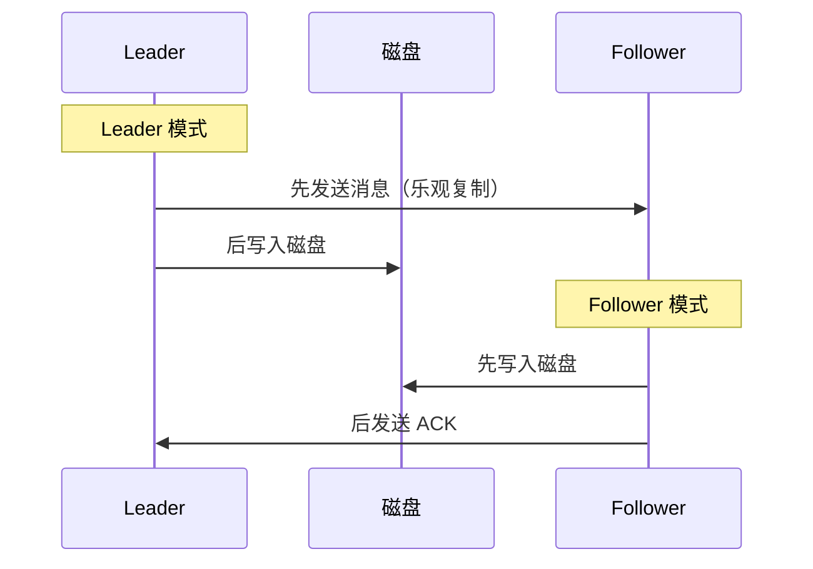

---

## 9. 配置参数

| 参数 | 默认值 | 说明 |
|------|--------|------|
| `ElectionTick` | 10 | 选举超时 tick 数 |
| `HeartbeatTick` | 1 | 心跳间隔 tick 数 |
| `tickInterval` | 400ms | 每个 tick 的时间 |
| `RaftMsgTimeout` | 15s | Raft 消息发送超时 |
| `WaitCommitTimeout` | 20s | 等待提交确认超时 |
| `MaxSizePerMsg` | 4096 | 每条消息最大字节数 |
| `MaxInflightMsgs` | 256 | 最大在途消息数 |
| `RaftEntrySyncInterval` | 100ms | 后台 fsync 间隔 |
| `ClearEntryLogTolerateTime` | 6h | 容忍不健康 RG 的最长时间 |
| `ClearEntryLogTolerateSize` | 20GB | 日志大小紧急清理阈值 |

**有效选举超时**：`10 × 400ms = 4 秒`

---

## 10. 故障恢复

### 10.1 Leader 宕机

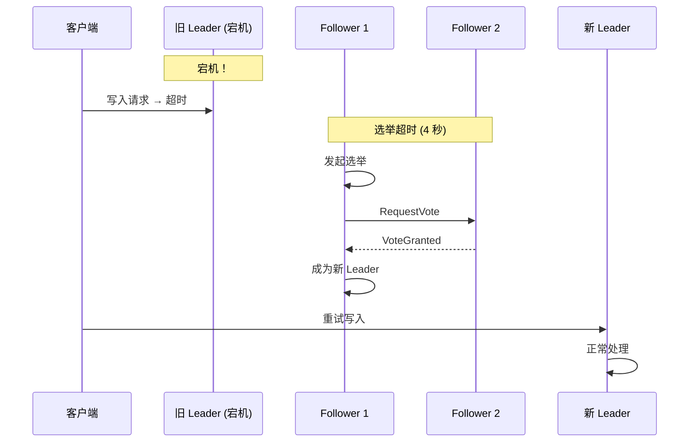

### 10.2 Follower 宕机

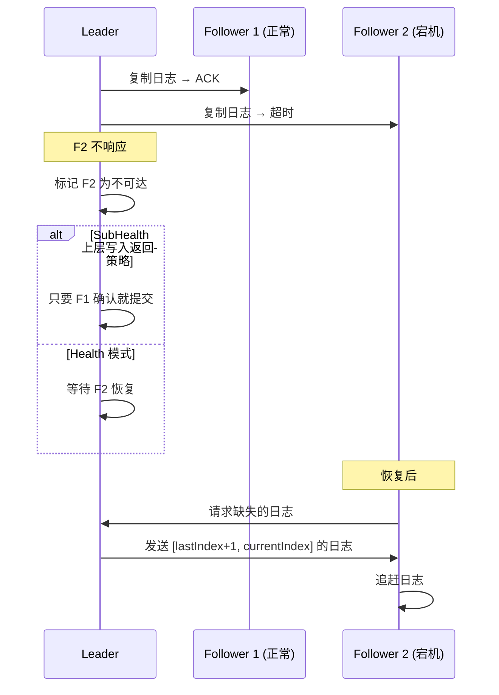

### 10.3 Replication Group 重建

当某个节点长时间不可用时，ts-meta 会触发 RG 重建：

```
初始状态：Node1(PT0-Master), Node2(PT0-Follower1), Node3(PT0-Follower2)
Node3 宕机：
  → RG 状态变为 SubHealth
  → 等待 ClearEntryLogTolerateTime (6h)
  → ts-meta 创建新的 RG
  → Node4 加入 RG
  → Node4 从 Leader 同步数据
  → RG 状态恢复为 Health
```

---

## 11. 端到端实战：一次分布式写入

### 11.1 完整流程

假设 3 节点集群，PT0 的 Leader 在 Node1：

```
步骤 1: 客户端写入
  INSERT cpu,host=server1 value=99.5
  → ts-sql 路由到 Node1 (PT0 Leader)

步骤 2: 包装 DataWrapper
  DataWrapper{
      DataType:  Normal,
      Identity:  "db0_0",
      ProposeId: 42,
      Data:      序列化的行数据
  }
  → Marshal → 100 字节

步骤 3: 注册等待 channel
  ch := node.AddCommittedDataC(wrapper)
  → DataCommittedC[42] = make(chan error, 1)

步骤 4: 发送到 proposeC
  proposeC <- marshalledData

步骤 5: Raft 共识
  Leader 收到提议
  → 写入本地日志 (Index=201, Term=5)
  → 发送给 Follower 1 (Node2)
  → 发送给 Follower 2 (Node3)

步骤 6: Follower 确认
  Node2: 保存日志 → ACK
  Node3: 保存日志 → ACK

步骤 7: Leader 提交
  收到多数派 ACK (2/3)
  → 提交 Index=201
  → PublishEntries → commitC

步骤 8: 应用到本地存储
  readCommitFromRaft()
  → dealCommitData()
  → dealNormalData() → shard.WriteRows()

步骤 9: 通知等待者
  retCommittedDataC(proposeId=42)
  → ch <- nil

步骤 10: 返回成功
  WriteToRaft 收到 nil
  → engine/Raft 层返回 nil
  → 上层 HTTP 写入处理再映射为 204 No Content
```

---

## 12. 总结：分区级 Raft 的关键设计

| 设计 | 目的 | 效果 |
|------|------|------|
| 每个分区独立 Raft 组 | 细粒度复制，避免全局瓶颈 | 支持大规模集群 |
| 轻量级快照 | 只记录日志压缩标记 | 快照创建和恢复极快 |
| 自定义 .entry 文件 | Slot + Data 双区设计 | 高效的随机访问和顺序写入 |
| Leader 先发后写 | 乐观复制 | 降低写入延迟 |
| Follower 先写后发 | 确保持久化 | 数据不丢失 |
| 周期性日志清理 | 通过 Raft 提议 | 所有副本一致压缩 |
| 紧急本地清理 | 日志超 20GB 时强制 | 防止磁盘爆满 |
| ProposeId 机制 | 单调递增 ID | 精确匹配请求和响应 |
| SubHealth 模式 | 上层 RG 写策略可在亚健康场景降低等待范围 | 不改变 etcd Raft 本身的多数派提交语义 |
| 6 小时容忍时间 | 等待故障节点恢复 | 避免不必要的 RG 重建 |
