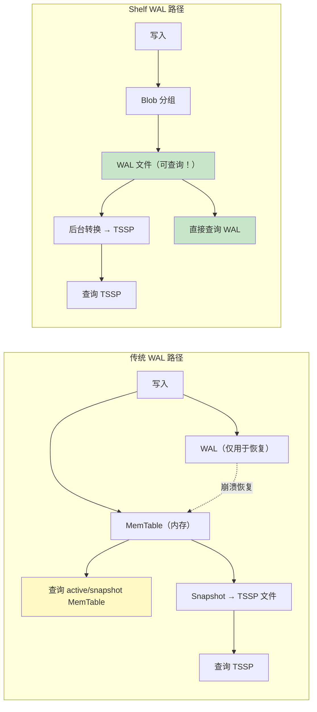
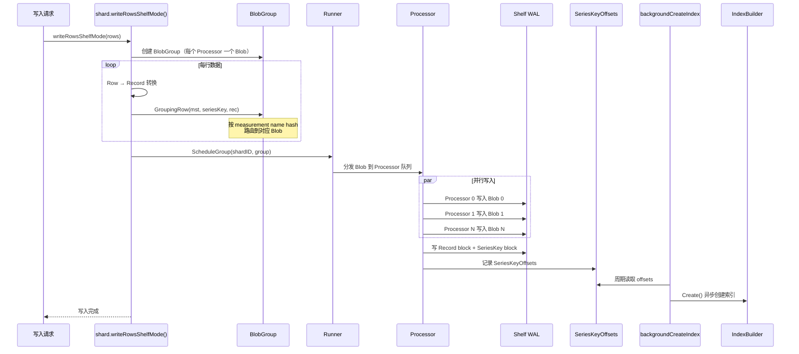
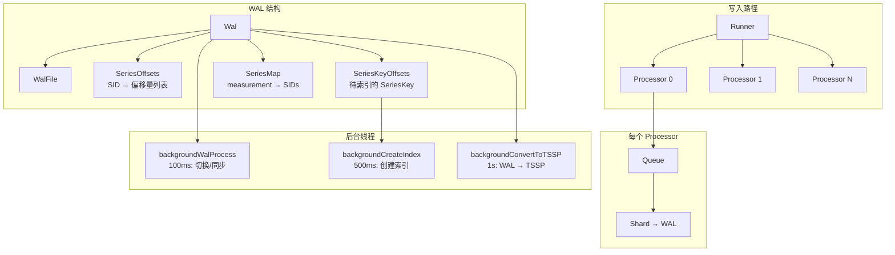
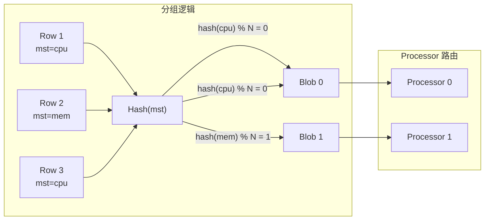
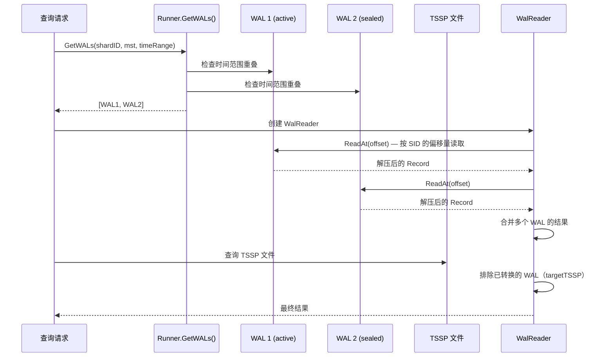
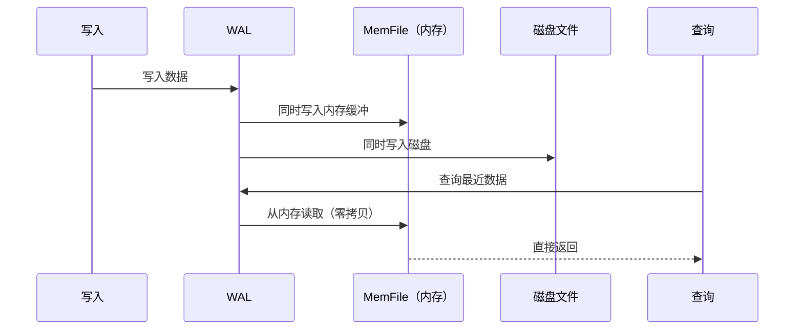
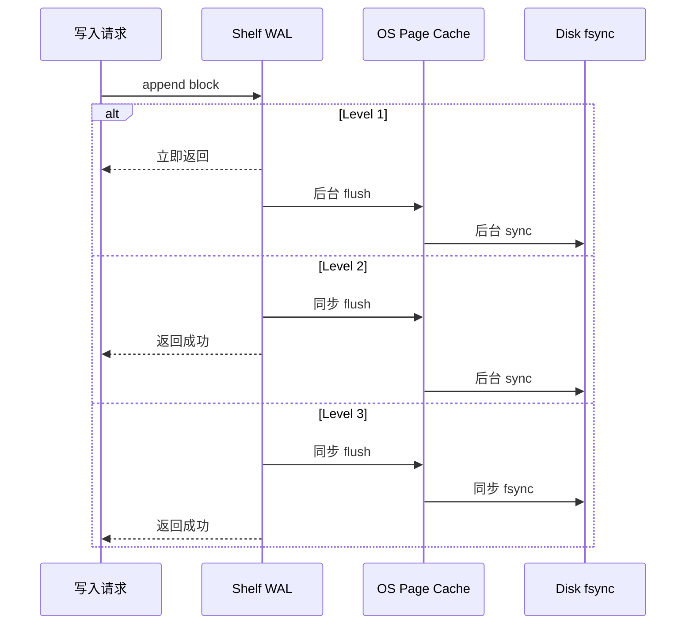
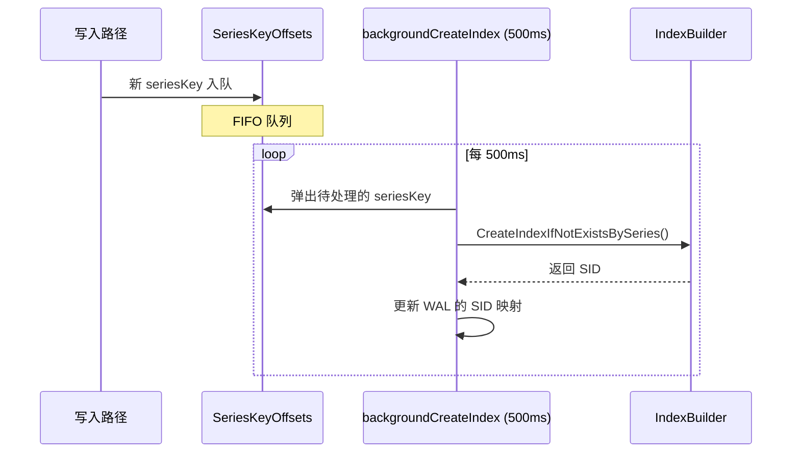
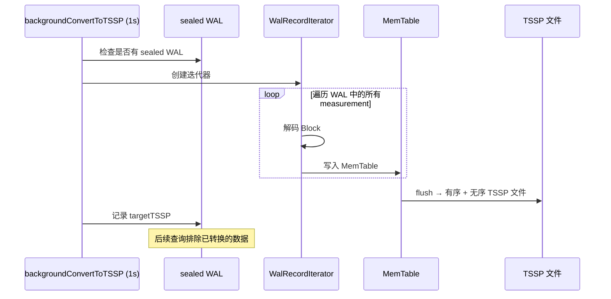

# Module 16: Shelf WAL 存储引擎深度审计报告（庖丁解牛版）

> Shelf WAL 是 openGemini 2025 年新增的第二套存储引擎，与传统 TSSP 并行存在。它的最大特点是：**WAL 本身就是可查询的数据存储**。传统路径中未 flush 的数据也可以通过 active/snapshot MemTable 查询可见，但传统 WAL 只用于崩溃恢复，不作为查询数据源；Shelf WAL 则可以在转 TSSP 之前直接被查询。

---

## 1. Shelf WAL 是什么？与传统 WAL 的区别



| 维度 | 传统 WAL | Shelf WAL |
|------|---------|-----------|
| WAL 用途 | 仅用于崩溃恢复 | 同时用于崩溃恢复和数据查询 |
| 内存缓冲 | MemTable（30MB 阈值触发 flush） | 无 MemTable，直接写 WAL 文件 |
| 查询可见性 | 未 flush 数据通过 active/snapshot MemTable 可见；WAL 本身不可查 | 写入后 WAL 文件即可作为查询数据源 |
| 热数据支持 | 无 | HotMode：WAL 数据同时缓存在内存 |
| 写入模式 | 单线程写入 | Blob 分组 + 多 Processor 并行写入 |
| 可靠性级别 | 固定（fsync） | 3 级可配（Low/Medium/High） |

---

## 2. 整体架构

### 2.1 写入路径



**代码位置**：`engine/shard.go:573-603`

```go
func (s *shard) writeRowsShelfMode(rows []influx.Row) error {
    // 创建 BlobGroup：每个 Processor 一个 Blob
    group, release := shelf.NewBlobGroup(runner.Size())
    defer release()

    // 按 measurement hash 分组
    for i := range rows {
        rec := rowToRecord(rows[i])
        group.GroupingRow(mst, seriesKey, rec, 0)
    }

    // 分发到 Processor 队列（ScheduleGroup 内部等待完成）
    return runner.ScheduleGroup(s.ident.ShardID, group)
}
```

### 2.2 核心组件关系



---

## 3. WAL 文件格式

### 3.1 Block 结构

**代码位置**：`engine/shelf/wal.go:539-545`

每个 WAL 条目由 16 字节 Header + 变长 Payload 组成：

```
+----------------------------------------------------------+
| WalBlockHeader (16 字节)                                  |
|   uint64[0]: size(32) | mstLen(16) | typeFlag(8) | comp(8) |
|   uint64[1]: sid(64)                                      |
+----------------------------------------------------------+
| measurement name (mstLen 字节)                            |
+----------------------------------------------------------+
| compressed payload (size 字节)                            |
+----------------------------------------------------------+
```

**typeFlag 取值**：
- `flagRecord = 0` — 数据记录
- `flagSeriesKey = 1` — SeriesKey 记录（用于异步索引创建）

**compressFlag 取值**：
- `0` — 无压缩
- `1` — LZ4 压缩（默认）
- `2` — Snappy 压缩

### 3.2 SeriesKey Block

```
+----------------------------------------------------------+
| WalBlockHeader (16 字节)                                  |
|   typeFlag = flagSeriesKey (1)                            |
|   sid = 0（尚未分配）                                     |
+----------------------------------------------------------+
| seriesKey bytes（是否压缩由内存 SeriesMap 策略决定，WAL block 本身按 Header 的 comp 字段解释） |
+----------------------------------------------------------+
```

**通俗解释**：
WAL 文件就像一本"流水账"。每条记录有一个"信封"（Header），上面写着：这封信多大（size）、寄给哪个 measurement（mstLen）、是什么类型（typeFlag）、用了什么压缩（compressFlag）、SID 是多少。SeriesKey block 不应简单理解为“已经按 seriesKey 压缩模式写了压缩内容”。当前 `engine/shelf/wal.go` 的 `compressSeriesKey` 在 LZ4/Snappy 分支后没有提前返回，实际会落回 `walCompressNone` 并写未压缩 seriesKey block；内存里的 `SeriesKeyOffsets.compressKey` 是另一套内存节省策略。如果后续代码修复了该 return 行为，文档中的当前实现限制也需要同步更新。

---

## 4. Blob 分组写入机制

### 4.1 Blob 和 BlobGroup

**代码位置**：`engine/shelf/blob.go`

```go
// Blob — 一个 Processor 的写入批次
type Blob struct {
    tm      time.Time      // 写入时间（用于统计写入延迟）
    err     error          // 写入错误
    done    func()         // 完成回调
    shardID uint64
    hash    uint64         // 用于 Processor 路由
    data    []byte         // [4B大小 | seriesKey | 编码后的record] ...
    tr      util.TimeRange // 时间范围
}

// BlobGroup — 所有 Processor 的 Blob 集合
type BlobGroup struct {
    wg    sync.WaitGroup
    tm    time.Time
    size  uint64
    blobs []Blob   // 每个 Processor 一个 Blob（值切片，非指针切片）
    rec   *record.Record
}
```

### 4.2 分组路由



**为什么按 measurement hash 分组？**
- 同一个 measurement 的数据总是去同一个 Processor
- 避免多个 Processor 同时写同一个 WAL 文件的锁竞争
- 如果配置了 `SeriesHashFactor`，还会按 seriesKey 二次 hash，进一步细化分组

---

## 5. 直接 WAL 查询

### 5.1 查询流程



**代码位置**：`engine/shelf/wal_reader.go`

### 5.2 去重机制

```go
// Wal 结构体中的 targetTSSP
targetTSSP map[uint64]struct{}  // 已转换的 TSSP 文件 ID 集合
```

**去重逻辑**：
1. 每个 WAL 记录它被转换成了哪些 TSSP 文件
2. 查询时，如果某个 WAL 的数据已经在 TSSP 中，就跳过 WAL，只读 TSSP
3. 如果 WAL 还没被转换，就读 WAL 的数据

**通俗解释**：
就像你有两个笔记本：一个旧的（TSSP），一个新的（WAL）。查东西时，如果旧笔记本已经有了，就只查旧的。如果新笔记本有旧笔记本没有的内容，就两个都查，然后合并结果。

---

## 6. HotMode — 热数据内存缓存

### 6.1 工作原理



**代码位置**：`engine/shelf/wal_file.go`

```go
// HotMode 配置（lib/config/store.go）
type HotMode struct {
    Enabled              bool    // 是否启用
    ShelfOnly            bool    // 仅在 Shelf 模式下使用（为 true 时 HotModeEnabled() 返回 false）
    MemoryAllowedPercent uint8   // 内存占比限制（默认 5%）
    TimeWindow           Duration // 时间窗口（默认 1 分钟）
    Duration             Duration // 缓存持续时间（默认 1 小时）
    MaxFileSize          Size     // 单文件最大缓存（默认 2GB）
}
```

**注意**：`HotModeEnabled()` 仅在 `HotMode.Enabled == true && HotMode.ShelfOnly == false` 时返回 true。若 `ShelfOnly` 为 true，则 HotMode 不生效（此时应使用 `ShelfHotModeEnabled()` 判断）。

**通俗解释**：
HotMode 就像"缓存热区"。最近写入的数据不仅存在磁盘上，还同时缓存在内存里。查询最近的数据时，直接从内存读取，不需要磁盘 IO，延迟极低。

---

## 7. 可靠性级别

### 7.1 三级可靠性

**代码位置**：`lib/config/memtable.go`

| 级别 | backgroundFlush | backgroundSync | 说明 |
|------|----------------|----------------|------|
| Level 1 (Low) | true | true | 写入路径不等待 flush/fsync，进程故障可能丢数据 |
| Level 2 (Medium) | false | true | 写入路径等待 flush 到 OS 缓冲区，但不等待 fsync；进程故障一般可恢复，容器/VM/宿主机故障仍可能丢 |
| Level 3 (High) | false | false | 写入路径等待 flush + fsync；只有存储介质或底层持久化故障仍可能丢 |

**边界条件**：
- `ReliabilityLevel` 被 `LimitRange(..., 1, 3, 2)` 限制在 1~3，非法值会回退到默认 Level 2
- `backgroundFlush = (level == Low)`，只有 Level 1 不同步 flush
- `backgroundSync = (level < High)`，Level 1/2 都不在写入路径同步 fsync

**通俗解释**：
- **Level 1**：写入后不等磁盘确认就返回成功。像寄快递不要回执，快但可能丢。
- **Level 2**：写入后等 flush 但不等 fsync。像寄快递要回执但不保价。
- **Level 3**：写入后等 fsync。像寄快递要回执且保价，最安全但最慢。



**代码讲解**：`NewWal` 根据 `conf.ReliabilityLevel` 设置 `backgroundFlush` 和 `backgroundSync`。`Wal.Flush()` 在 `backgroundFlush=true` 时直接返回；`Wal.Sync()` 在 `backgroundSync=true` 时直接返回。因此 Level 2 与 Level 3 的关键差异不是是否写入 WAL，而是是否在写入路径等待 `fsync`。

**具体例子**：

```text
场景：写入一批日志后容器被强制 kill

Level 1:
  append 返回后可能还没有 flush，进程故障可能丢最近 block

Level 2:
  append 后已 flush 到 OS 缓冲区，普通进程崩溃可通过 WAL 恢复；
  如果容器/VM 同时丢失 page cache，仍可能丢

Level 3:
  append 后已 fsync 到存储设备，除非磁盘/底层存储故障，通常可恢复
```

---

## 8. 异步索引创建

### 8.1 流程



**为什么异步？**
- 索引创建涉及磁盘 IO（写入 MergeSet）
- 如果在写入热路径上同步创建索引，会降低写入吞吐
- 异步创建允许写入路径不等待索引完成

---

## 9. WAL → TSSP 转换

### 9.1 转换流程



**代码位置**：`engine/shelf/shard.go:307-368`

---

## 10. 空闲 Shard 管理

**代码位置**：`engine/shelf/shard.go:283-305`

```
空闲检测：freeDuration（可配置，默认 600 秒）无写入 → 释放后台 goroutine
重新激活：下次写入时 → 重启后台 goroutine
```

**通俗解释**：
就像"下班关灯"。如果一个 shard 在 freeDuration 时间内没有写入，就关闭它的后台线程（省 CPU）。下次有写入时，再重新启动。freeDuration 通过 `NewShard(workerID, info, freeDuration)` 传入，默认值为 `DefaultShardFreeDuration = 600`（秒）。

---

## 11. 总结：Shelf WAL 的关键设计

| 设计 | 目的 | 效果 |
|------|------|------|
| WAL 可查询 | 写入成功后 WAL 文件可作为查询数据源 | 降低查询新写数据的落盘等待，不承诺固定零延迟 |
| Blob 分组写入 | 按 measurement hash 路由 | 多 Processor 并行无锁 |
| HotMode | 内存缓存最近数据 | 热数据零 IO 查询 |
| 三级可靠性 | 灵活的持久化策略 | 适配不同场景 |
| 异步索引 | 解耦索引创建和写入 | 写入吞吐提升 |
| WAL → TSSP 转换 | 后台异步转换 | 长期存储优化 |
| 空闲 Shard 释放 | 600 秒无写入释放资源 | 节省 CPU |
| SeriesKey 内存压缩 | 超过阈值后压缩内存中的 seriesKey | 减少内存占用 |
