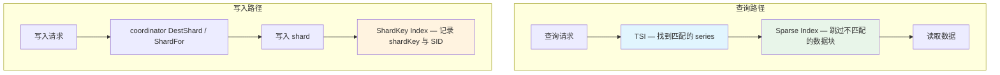
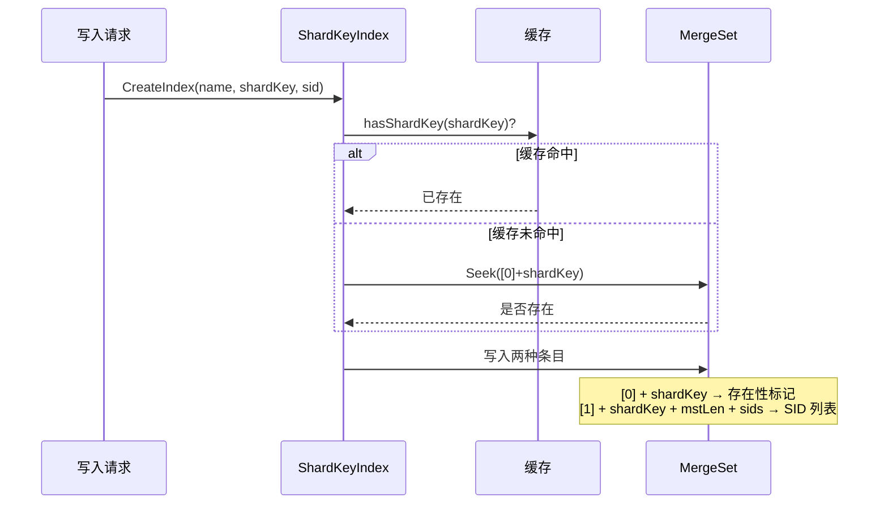
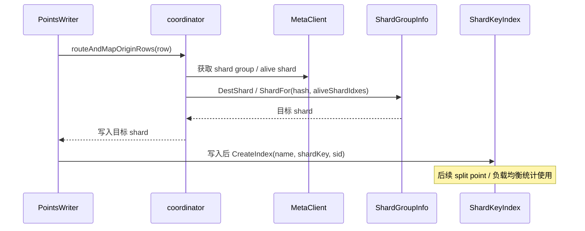
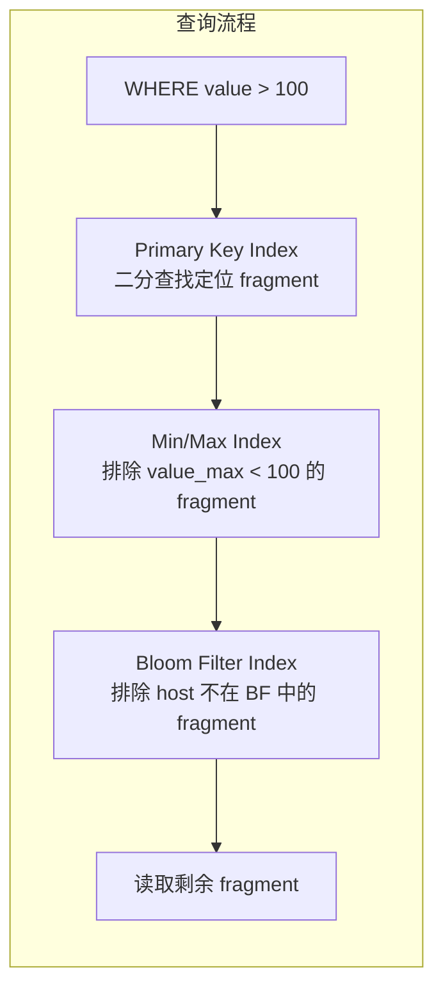
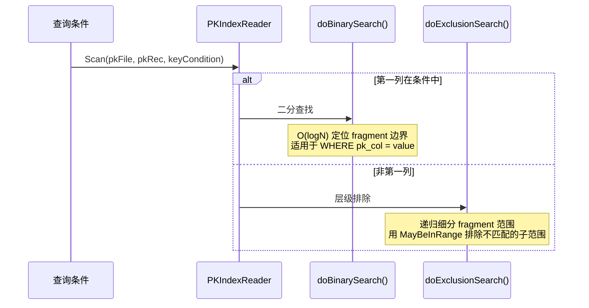
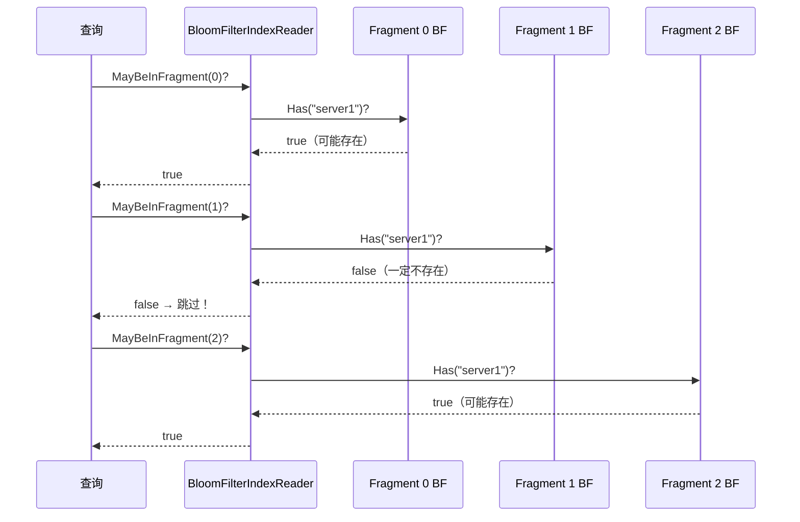

# Module 17: ShardKey Index 与 Sparse Index 深度审计报告（庖丁解牛版）

> openGemini 的索引系统不止 TSI（Tag Series Index）。还有 **ShardKey Index**（分片键索引）和 **Sparse Index**（稀疏索引）两个重要组件。ShardKey Index 主要服务 range shard 分裂和负载均衡评估；真正的写入路由在 coordinator 的 `DestShard` / `ShardFor` 流程中完成。Sparse Index 用于判断哪些数据块可以跳过。

---

## 1. 三种索引的定位



| 索引 | 粒度 | 用途 | 后端 |
|------|------|------|------|
| **TSI** | Series | 查询时找到匹配的 series ID | MergeSet (LSM) |
| **ShardKey Index** | ShardKey | range shard 分裂点计算、series/行数统计、负载均衡辅助 | MergeSet (LSM) |
| **Sparse Index** | Fragment | 查询时跳过不匹配的数据块 | TSSP 旁路 sidecar/索引文件 |

---

## 2. ShardKey Index（分片键索引）

### 2.1 结构体

**代码位置**：`engine/index/ski/shardkey_index.go`

```go
type ShardKeyIndex struct {
    tb       *mergeset.Table    // LSM 存储引擎
    logger   *zap.Logger
    path     string
    lock     *string
    cache    *workingsetcache.Cache  // 缓存
    sidCount uint64                  // series 总数
}
```

### 2.2 数据模型



**两种命名空间**：

| 前缀 | Key | Value | 用途 |
|------|-----|-------|------|
| `[0]` (nsPrefixShardKey) | shardKey | 空 | 判断 shardKey 是否存在 |
| `[1]` (nsPrefixShardKeyToSid) | shardKey + mstName | SID 列表 | shardKey → series ID 映射 |

### 2.3 分裂点查找

**代码位置**：`engine/index/ski/shardkey_index.go`（`GetSplitPointsWithSeriesCount` 方法）

```go
func (idx *ShardKeyIndex) GetSplitPointsWithSeriesCount(poses []int64) ([]string, error) {
    // 遍历所有 shardKey，按序统计 series 数量
    // 当累计数量超过阈值时，记录分裂点
    // 返回分裂点的 shardKey 列表
}
```

**具体例子**：

假设 shardKey 按字节序排列，每个 shardKey 对应的 series 数量：
```
shardKey="cpu,host=s1"  → 100 个 series
shardKey="cpu,host=s2"  → 150 个 series
shardKey="cpu,host=s3"  → 200 个 series
shardKey="mem,host=s1"  → 50 个 series
shardKey="mem,host=s2"  → 300 个 series

累计：100, 250, 450, 500, 800

如果要在 series 数量 = 400 处分裂：
  → 分裂点 = "cpu,host=s3"（累计 450 > 400）
  → 左半部分: [cpu,host=s1, cpu,host=s2]（250 个 series）
  → 右半部分: [cpu,host=s3, mem,host=s1, mem,host=s2]（550 个 series）
```

**通俗解释**：
ShardKey Index 就像"快递分区表"。它记录了每个地址前缀（shardKey）有多少个收件人（series）。当需要把一个大区分成两个小区时，查这个表就能找到合适的分割线。

### 2.4 与写入路由的边界



**代码讲解**：写入路由按 shard group、时间范围、hash 和存活 shard 计算，核心在 coordinator 的 `DestShard` / `ShardFor`。`ShardKeyIndex.CreateIndex` 在 TSSTORE MemTable 新建 series 时记录 shardKey 到 SID 的关系，供 `GetSplitPointsWithSeriesCount` / `GetSplitPointsByRowCount` 估算 range shard 分裂点。它不要和列存 sparse index 的查询裁剪链路混为一条路径。

**具体例子**：

```text
写入 cpu,host=s1:
  1. coordinator 根据时间和 hash 调 ShardFor -> shard 3
  2. 数据写入 shard 3
  3. MemTable 新建 series 时写 ShardKeyIndex: shardKey(cpu,host=s1) -> SID=1001
  4. 后续 range shard 太大时，ShardKeyIndex 统计累计 series 数，建议 split point
```

### 2.4 按行数分裂点查找

**代码位置**：`engine/index/ski/shardkey_index.go`（`GetSplitPointsByRowCount` 方法）

```go
func (idx *ShardKeyIndex) GetSplitPointsByRowCount(poses []int64, f func(name string, sid uint64) (int64, error)) ([]string, error)
```

与 `GetSplitPointsWithSeriesCount` 按 series 数量统计不同，`GetSplitPointsByRowCount` 按实际行数统计分裂点。它接受一个回调函数 `f`，用于根据 measurement name 和 SID 计算行数，当累计行数超过阈值时记录分裂点。

---

## 3. Sparse Index（稀疏索引）

### 3.1 概述

Sparse Index 是列存（Column Store）文件的**片段级索引**。它不存储 series 信息，而是回答一个问题："这个 fragment 中有没有可能包含满足条件的数据？"



### 3.2 索引类型总览

| 类型 | 文件 | 用途 | 原理 |
|------|------|------|------|
| **Primary Key** | `primary_index.go` | 排序列的范围查询 | 二分查找 / 层级排除 |
| **Min/Max** | `min_max_index.go` | 数值/字符串范围查询 | 比较 fragment 的 min/max 值 |
| **Bloom Filter** | `bloom_filter_index.go` | 字符串等值/子串查询 | 概率性判断值是否存在于 fragment |
| **Set** | `set_index.go` | IN 列表查询 | （占位，未实现） |

### 3.3 Primary Key Index — 二分查找

**代码位置**：`engine/index/sparseindex/primary_index.go`

```go
type PKIndexReaderImpl struct {
    property *IndexProperty
    logger   *logger.Logger
}
```

**两种查找策略**：



**通俗解释**：
Primary Key Index 就像"字典的页码索引"。如果你要找"A 开头的单词"，直接翻到 A 的起始页（二分查找）。如果你要找"包含 z 的单词"，就需要逐页检查（层级排除）。

### 3.4 Min/Max Index — 范围裁剪

> 当前实现限制：Reader/factory 侧存在 `MinMaxIndexReader` 等裁剪逻辑，但 `MinMaxWriter.CreateAttachIndex/CreateDetachIndex` 目前是空实现。因此不能把 Min/Max 描述成完整可用的写入链路；只有在索引数据实际生成后，Reader 裁剪路径才有数据可用。

**代码位置**：`engine/index/sparseindex/min_max_index.go`

```go
type MinMaxIndexReader struct {
    initial    bool
    isCache    bool
    indexRange []*Range
    indexCols  []*ColumnRef
    indexType  []int
    rec        *record.Record  // 存储每个 fragment 的 min/max 值
    condition  KeyCondition
    option     hybridqp.Options
    schema     record.Schemas
    ReadFunc   func(file interface{}, rec *record.Record, isCache bool) (*record.Record, error)
    sk         SKCondition
    span       *tracing.Span
}
```

**索引结构**：

```
Index Record:
  列: [value_min, value_max, host_min, host_max]
  行 0 (fragment 0): [1.0, 99.5, "server1", "server9"]
  行 1 (fragment 1): [50.0, 200.0, "server2", "server8"]
  行 2 (fragment 2): [10.0, 80.0, "server1", "server5"]
```

**查询 `WHERE value > 100`**：
```
Fragment 0: max=99.5 < 100 → 跳过！
Fragment 1: max=200.0 > 100 → 可能匹配
Fragment 2: max=80.0 < 100 → 跳过！

结果：只读取 Fragment 1
```

### 3.5 Bloom Filter Index — 概率性裁剪

**代码位置**：`engine/index/sparseindex/bloom_filter_index.go`

```go
type BloomFilterIndexReader struct {
    isCache   bool               // 是否使用缓存
    version   uint32             // 索引版本
    schema    record.Schemas     // 列 schema
    option    hybridqp.Options   // 查询选项
    bf        rpn.SKBaseReader   // Bloom Filter 读取器
    sk        SKCondition        // SK 条件
    span      *tracing.Span      // 追踪 span
    indexType index.IndexType    // 索引类型
}
```

**查询 `WHERE host = 'server1'`**：



**通俗解释**：
Bloom Filter Index 就像"每本书的关键词索引"。如果你要找提到"server1"的章节，先看关键词索引。如果索引里没有"server1"，这章肯定没有，直接跳过。如果有，可能存在（有一定误判率，取决于布隆过滤器参数），需要实际读取确认。

### 3.6 三种索引的协作

```mermaid
graph TB
    subgraph "查询: WHERE host='server1' AND value > 100"
        Q["查询条件"] --> PK["Primary Key Index"]
        PK -->|"定位 fragment 范围"| MM["Min/Max Index"]
        MM -->|"排除 value_max < 100"| BF["Bloom Filter Index"]
        BF -->|"排除 host 不在 BF 中"| Read["读取剩余 fragment"]
    end

    subgraph "效果"
        R1["100 个 fragment"] -->|"PK: 50"| R2["50 个 fragment"]
        R2 -->|"MM: 20"| R3["20 个 fragment"]
        R3 -->|"BF: 10"| R4["10 个 fragment"]
    end

    style R1 fill:#ffcdd2
    style R4 fill:#c8e6c9
```



---

## 4. 与 TSI 的对比

| 维度 | TSI | ShardKey Index | Sparse Index |
|------|-----|----------------|--------------|
| **粒度** | Series | ShardKey | Fragment |
| **存储位置** | 独立 MergeSet 文件 | 独立 MergeSet 文件 | TSSP sidecar/索引文件 |
| **用途** | 查询时找 series | range shard 分裂/均衡辅助 | 查询时裁剪数据块 |
| **数据结构** | Tag → TSID 映射 | ShardKey → SID 映射 | Bloom Filter / Min-Max / PK |
| **查询时机** | 查询开始时 | 分裂/均衡评估时 | 数据读取前 |

**Set Index 说明**：当前文档中的 Set Index 属于预留/占位能力，不应按完整可用索引理解。现有稀疏索引主要关注 Primary Key、Min/Max 和 Bloom Filter。

**Sparse Index 文件形态**：Sparse Index 不应简单描述为“完全内联在 TSSP 数据块中”。列存/Detached 路径下 PK、SK、Bloom/MinMax 等索引通常以 sidecar 或独立索引文件维护，查询阶段先用这些文件裁剪 Fragment，再读取 TSSP 数据列。

---

## 5. 总结

| 组件 | 关键设计 | 效果 |
|------|---------|------|
| ShardKey Index | MergeSet 存储 + 缓存 | range shard 分裂点和负载均衡依据 |
| 分裂点查找 | 按 series 数量或行数统计 | 负载均衡依据 |
| Primary Key Index | 二分查找 / 层级排除 | O(logN) fragment 定位 |
| Min/Max Index | Reader 侧支持 fragment 级 min/max 裁剪；writer 当前为空实现 | 不能承诺固定裁剪比例，需先有实际 min/max 索引文件 |
| Bloom Filter Index | fragment 级布隆过滤器 | 等值查询裁剪 80%+ fragment |
| 三级协作 | PK → MM → BF 逐层过滤 | 最终只读取 10% 的 fragment |
