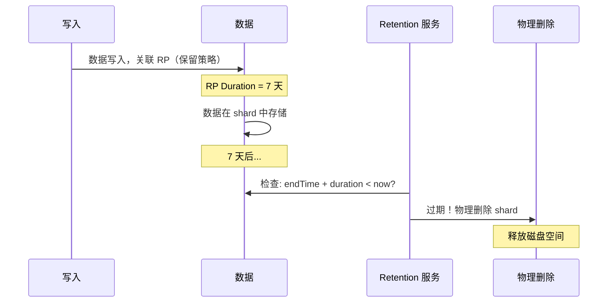
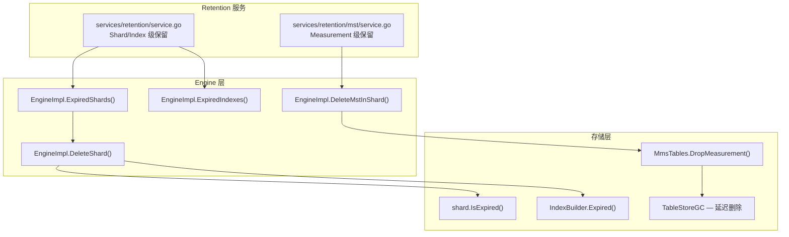
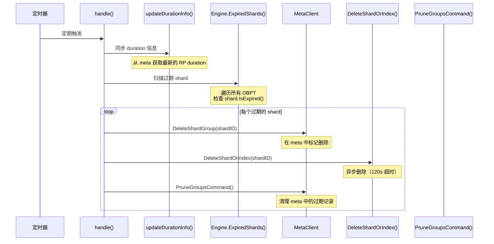
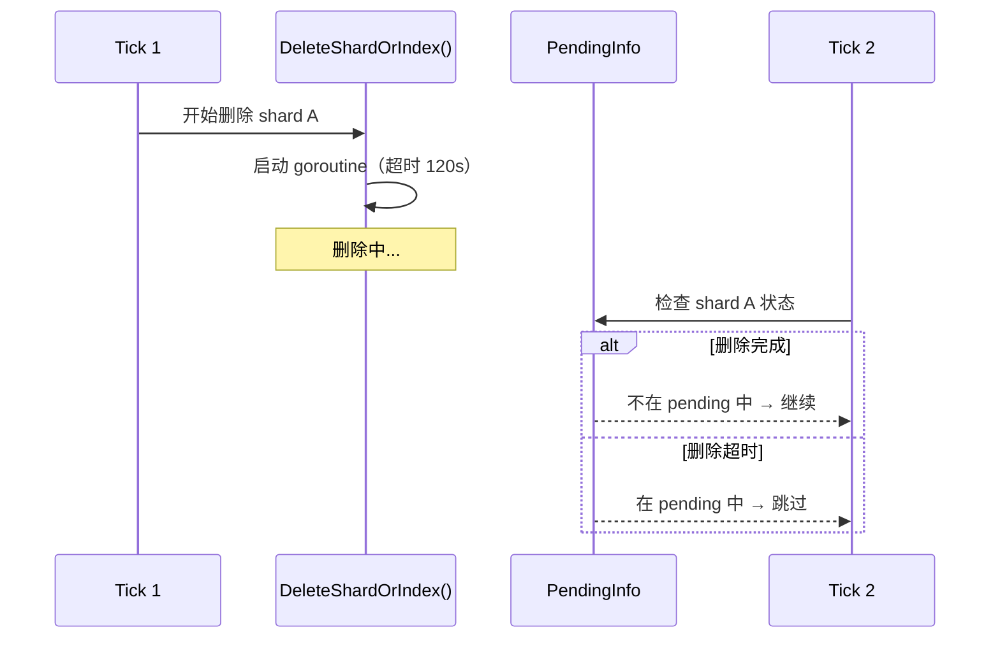
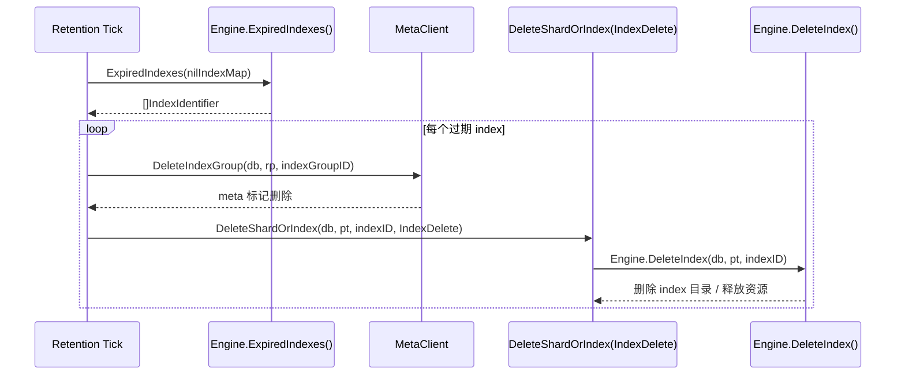
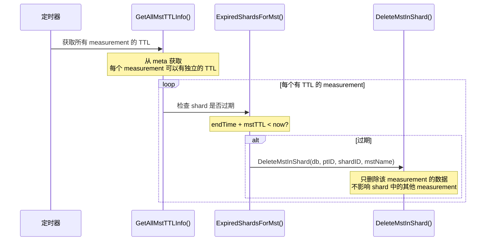
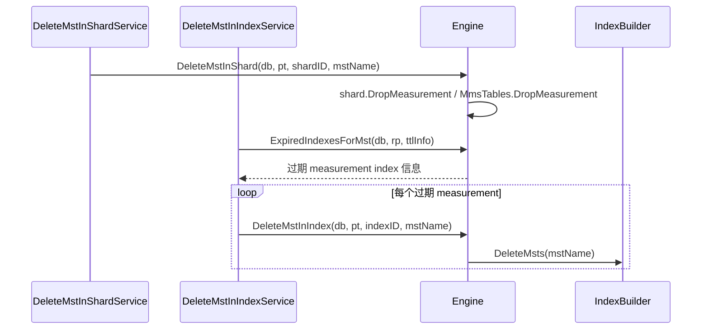
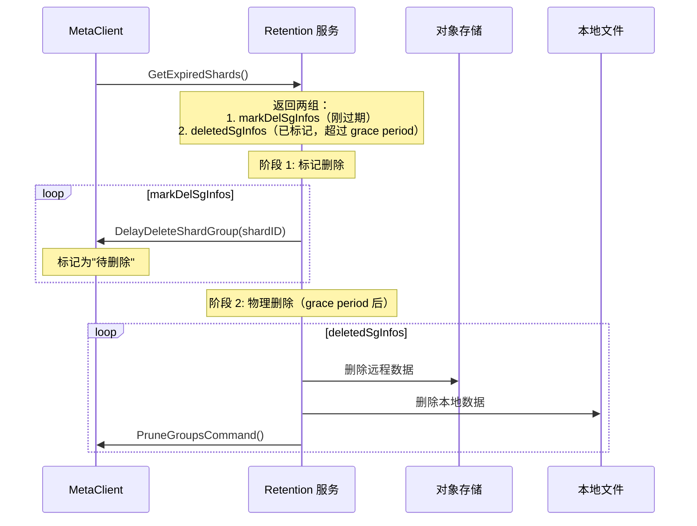

# Module 18: Retention 数据保留策略深度审计报告（庖丁解牛版）

> Retention 是数据生命周期的最后一环。它负责将过期数据物理删除，释放存储空间。openGemini 支持两种粒度的保留策略：**Shard 级**（整个 shard 过期删除）和 **Measurement 级**（单个 measurement 过期删除）。

---

## 1. 数据保留策略是什么？



**通俗解释**：
保留策略就像"冰箱的保鲜期"。每个 RP（保留策略）有一个"保鲜期"（Duration）。超过保鲜期的数据（shard）会被自动清理掉。

---

## 2. 整体架构

### 2.1 两个服务



### 2.2 服务周期

```
Retention 服务：定期执行（可配置间隔）
  → 每次执行：扫描所有 shard/index → 找到过期的 → 删除

Measurement Retention 服务：独立周期
  → 每次执行：扫描所有 measurement 的 TTL → 找到过期的 → 删除
```

---

## 3. 过期判断公式

### 3.1 核心公式

```go
expired = (duration != 0) && (endTime + duration < now)
```

**代码位置**：`engine/shard.go:1571`

```go
func (s *shard) IsExpired() bool {
    now := time.Now().UTC()
    if s.durationInfo.Duration != 0 && s.endTime.Add(s.durationInfo.Duration).Before(now) {
        return true
    }
    return false
}
```

**关键点**：
- `duration == 0` 表示永久保留（不过期）
- `endTime` 是 shard 覆盖的时间范围的结束时间
- 公式：`endTime + duration < now` → 过期

### 3.2 具体例子

```
Shard 信息：
  endTime = 2024-01-01 00:00:00
  duration = 7 天

当前时间 = 2024-01-05 00:00:00
  endTime + duration = 2024-01-08 00:00:00
  2024-01-08 > 2024-01-05 → 未过期

当前时间 = 2024-01-10 00:00:00
  endTime + duration = 2024-01-08 00:00:00
  2024-01-08 < 2024-01-10 → 已过期！
```

---

## 4. Shard 级保留流程

### 4.1 HandleLocalStorage

**代码位置**：`services/retention/service.go:239`



### 4.2 DeleteShard — 物理删除

**代码位置**：`engine/engine.go:747`

```go
func (e *EngineImpl) DeleteShard(db string, ptId uint32, shardID uint64) error {
    // 1. 获取分区引用
    e.mu.RLock()
    if err := e.checkAndAddRefPTNoLock(db, ptId); err != nil {
        e.mu.RUnlock()
        return err
    }
    dbPtInfo := e.DBPartitions[db][ptId]
    e.mu.RUnlock()
    defer e.unrefDBPT(db, ptId)

    dbPtInfo.mu.Lock()
    // 2. 检查分区是否正在迁移（防止迁移中的分区被删除）
    if !dbPtInfo.bgrEnabled {
        dbPtInfo.mu.Unlock()
        return errno.NewError(errno.PtIsAlreadyMigrating)
    }
    // 3. 检查 shard 是否存在
    sh, ok := dbPtInfo.shards[shardID]
    if !ok {
        dbPtInfo.mu.Unlock()
        return errno.NewError(errno.ShardNotFound, shardID)
    }
    // 4. 防止重复删除
    if _, ok := dbPtInfo.pendingShardDeletes[shardID]; ok {
        dbPtInfo.mu.Unlock()
        return fmt.Errorf("shard %d already in deleting", shardID)
    }
    // 5. 从 shard map 中移除，加入 pending 删除集合
    delete(dbPtInfo.shards, shardID)
    dbPtInfo.pendingShardDeletes[shardID] = struct{}{}
    dbPtInfo.mu.Unlock()

    // 6. defer 清理 pendingShardDeletes
    defer func(pt *DBPTInfo) {
        pt.mu.Lock()
        delete(pt.pendingShardDeletes, shardID)
        pt.mu.Unlock()
    }(dbPtInfo)

    // 7. 关闭 shard（释放文件句柄、WAL 等）
    if err := sh.Close(); err != nil {
        return err
    }

    // 8. 删除 OBS 远程数据（如果配置了对象存储）
    lock := fileops.FileLockOption(*dbPtInfo.lockPath)
    obsOption := sh.GetObsOption()
    if obsOption != nil {
        if err := fileops.RemoveAll(fileops.GetRemoteDataPath(obsOption, sh.GetDataPath()), lock); err != nil {
            return err
        }
    }
    // 9. 删除本地数据目录和 WAL
    fileops.RemoveAll(sh.GetDataPath(), lock)
    fileops.RemoveAll(sh.GetWalPath(), lock)
}
```

### 4.3 Pending State 机制



**通俗解释**：
Pending 机制就像"正在施工"的标志。如果一个 shard 正在被删除（超过 120 秒），就在它门口挂一个"正在施工"的牌子。下次检查时看到牌子就跳过，避免重复删除。

---

### 4.4 Index Retention — 索引组过期删除

Shard 过期之外，retention 服务还会清理过期的 index group。流程与 shard 类似：先从 meta 找到过期 index group，删除 meta 记录，再调用 engine 删除本地 index。



**代码讲解**：`services/retention/service.go` 在本地存储路径中调用 `Engine.ExpiredIndexes(nilIndexMap)`。每个过期 index 先通过 `MetaClient.DeleteIndexGroup` 从元数据层删除，再通过 `DeleteShardOrIndex(..., IndexDelete)` 进入统一 pending/超时保护，最终调用 `Engine.DeleteIndex` 删除本地索引资源。

**具体例子**：

```text
RP=7d，index group 100 的 EndTime=2024-01-01
当前时间=2024-01-10:
  1. Engine.ExpiredIndexes -> indexID=1001, indexGroupID=100
  2. Meta.DeleteIndexGroup(db0, rp0, 100)
  3. DeleteShardOrIndex(db0, pt=0, id=1001, IndexDelete)
  4. Engine.DeleteIndex 删除本地 MergeSet/索引目录
```

---

## 5. Measurement 级保留

### 5.1 独立服务

**代码位置**：`services/retention/mst/service.go`



### 5.2 DropMeasurement — 删除单个 measurement

**代码位置**：`engine/immutable/mms_tables.go:611`

```go
func (m *MmsTables) DropMeasurement(_ context.Context, name string) error {
    // 1. 停止所有文件的读取
    m.Order[mst].StopFiles()
    m.OutOfOrder[mst].StopFiles()
    m.CSFiles[mst].StopFiles()

    // 2. 删除文件
    for _, f := range m.Order[mst].files {
        if f.Inuse() {
            f.Rename(f.Path() + ".tmp")  // 重命名为 .tmp
            nodeTableStoreGC.Add(f)       // 加入延迟删除队列
        } else {
            f.Remove()                     // 立即删除
        }
    }

    // 3. 清理内存
    delete(m.Order, mst)
    delete(m.OutOfOrder, mst)
    delete(m.CSFiles, mst)

    // 4. 删除目录
    fileops.RemoveAll(mstDir)
}
```

### 5.3 TableStoreGC — 延迟删除

**代码位置**：`engine/immutable/evict.go:87-134`

```go
type TableStoreGC struct {
    removeFiles map[string]TSSPFile  // 待删除的文件
    mu          sync.Mutex
}

func (gc *TableStoreGC) GC() {
    ticker := time.NewTicker(200 * time.Millisecond)
    for range ticker.C {
        gc.mu.Lock()
        for name, f := range gc.removeFiles {
            if !f.Inuse() {
                f.Remove()              // 引用计数为 0，删除
                delete(gc.removeFiles, name)
            }
        }
        gc.mu.Unlock()
    }
}
```

**通俗解释**：
TableStoreGC 就像"垃圾回收站"。有些文件正在被查询（Inuse=true），不能立即删除。就把它们重命名为 `.tmp`，放进"垃圾回收站"。每 200ms 检查一次，如果没人用了（Inuse=false），就真正删除。

---

### 5.4 Measurement Index 删除流程

Measurement 级 TTL 不只删除 TSSP 数据文件，也会清理该 measurement 关联的 index。但当前实现是两个独立 service 分别处理 shard 内 measurement 删除和 index 内 measurement 删除，不能理解成同一个函数里严格先 index 后 data 的顺序链路。



**代码讲解**：`services/retention/mst/service.go` 中 `NewDeleteMstInShardService/HandleLocalStorageInShard` 负责 shard 内 measurement 数据删除；`NewDeleteMstInIndexService/HandleLocalStorageInIndex` 负责 index 内 measurement 条目删除。这里不是 index group retention，不会通过 `DeleteIndexGroup` 删除整个 index group；measurement 级 index 路径调用 `Engine.DeleteMstInIndex`，最终进入 `IndexBuilder.DeleteMsts`。数据文件路径通过 `Engine.DeleteMstInShard` 进入 `shard.DropMeasurement` 和 `MmsTables.DropMeasurement`。

**具体例子**：

```text
measurement cpu TTL=3d:
  shard 10 中 cpu 已过期，mem 未过期

删除由两个 service 覆盖:
  - DeleteMstInShardService: DeleteMstInShard(db0, pt0, shard10, "cpu")
    -> DropMeasurement 只移除 cpu 的 order/unordered/csFiles，不影响 mem
  - DeleteMstInIndexService: ExpiredIndexesForMst(cpu) -> indexID=3001
    -> DeleteMstInIndex(db0, pt0, indexID=3001, "cpu") 清理 cpu 的索引条目
```

---

## 6. Shared Storage / LogKeeper 模式的保留

### 6.1 两阶段删除

该分支由 `config.IsLogKeeper()` 控制，不是普通本地存储 retention 的默认路径。



**通俗解释**：
Shared Storage / LogKeeper 模式就像"先贴封条，再拆房子"。当 `config.IsLogKeeper()` 为 true 时，过期 shard 先在 meta 中标记为"待删除"（贴封条），等 grace period 过后，再真正删除文件（拆房子）。普通本地存储路径仍走 `ExpiredShards` / `DeleteShardOrIndex`。

**代码讲解**：`services/retention/service.go` 的 `handle()` 会先判断 `config.IsLogKeeper()`。LogKeeper 分支使用 meta 返回的 delayed delete 信息做两阶段删除；非 LogKeeper 分支直接扫描 engine 里的过期 shard/index 并删除。

**具体例子**：

```text
config.IsLogKeeper() = true:
  Tick 1: DelayDeleteShardGroup(shardID=10)，只标记 meta
  grace period 后:
  Tick 2: 删除远程/本地文件，再 PruneGroupsCommand 清理 meta

config.IsLogKeeper() = false:
  Tick: Engine.ExpiredShards -> DeleteShardOrIndex -> Engine.DeleteShard
```

---

## 7. 总结：RetentionPolicy 的关键设计

| 设计 | 目的 | 效果 |
|------|------|------|
| `endTime + duration < now` | 简单明确的过期公式 | 无歧义判断 |
| `duration = 0` 永久保留 | 灵活的保留策略 | 支持永久数据 |
| Pending State | 防止并发删除 | 避免重复操作 |
| 异步删除（120s 超时） | 不阻塞主循环 | 服务持续运行 |
| Measurement 级 TTL | 细粒度保留控制 | 不同 measurement 不同保留期 |
| Index Retention | 清理过期 index group | 避免索引目录膨胀 |
| Measurement Index 删除 | TTL 删除数据同时清理索引 | 防止孤儿索引 |
| TableStoreGC | 延迟删除正在使用的文件 | 查询不中断 |
| LogKeeper 两阶段 | `config.IsLogKeeper()` 下标记删除 + grace period | 防止误删 |
| Meta 清理 | PruneGroupsCommand | 元数据不膨胀 |
