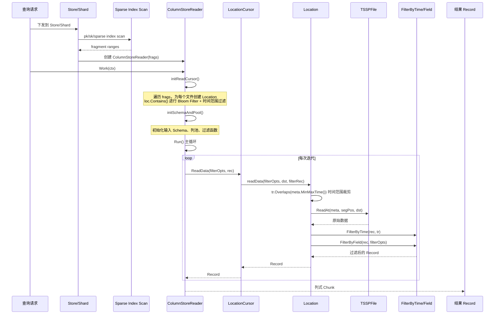
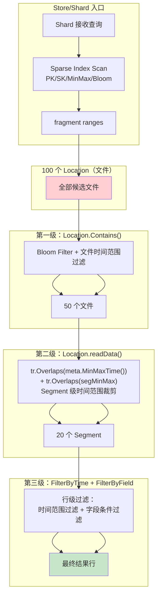
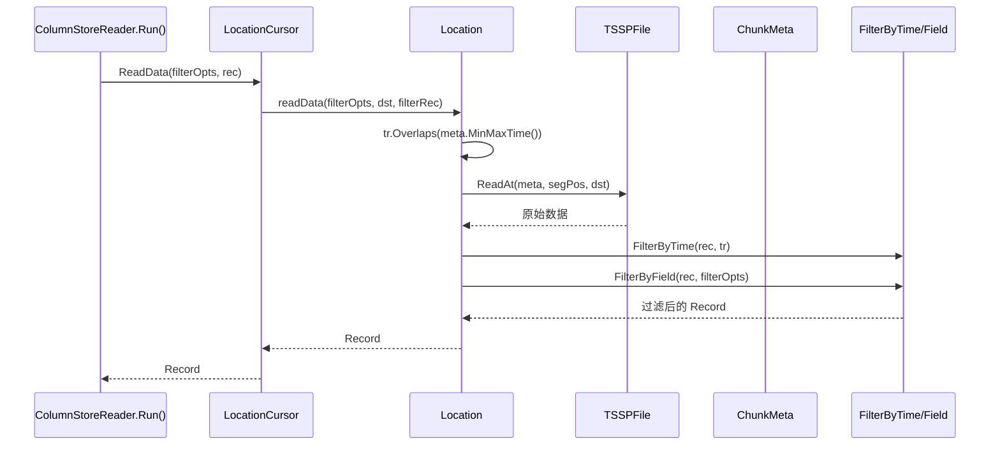
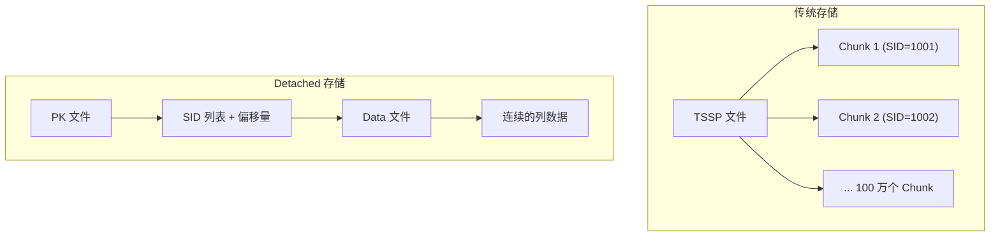
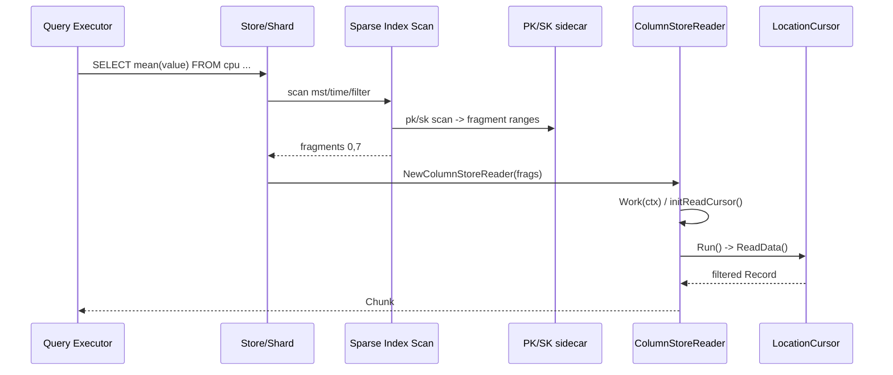

# Module 19: 列存查询路径深度审计报告（庖丁解牛版）

> 本文档是 Module 11（列存存储引擎）的补充，聚焦于**查询路径**。Module 11 覆盖了写入路径，本文档覆盖从 `ColumnStoreReader.Work()` 到列解码的完整查询流程。

---

## 1. 列存查询总览



> **说明**：Store/Shard 层会先做 sparse index scan，得到列存 fragment ranges，再创建 `ColumnStoreReader`。Reader 侧入口是 `ColumnStoreReader.Work()`（代码位置：`engine/column_store_reader.go`）。PrimaryKeyReader 只负责读取 COLX/PK 文件，不是端到端查询入口。实际 Reader 路径为：`ColumnStoreReader.Work()` → `initReadCursor()` → `initSchemaAndPool()` → `Run()` 主循环 → `readCursor.ReadData()` → `Location.readData()` → `TSSPFile.ReadAt()` → `FilterByTime` → `FilterByField`。

---

## 2. PrimaryKeyReader — COLX 主键文件读取辅助

> **注意**：PrimaryKeyReader 只负责读取 COLX 主键文件，可能被 PK/SK sparse index 扫描使用，但它不是端到端查询入口。Reader 侧入口是 `ColumnStoreReader.Work()`（见第 1 节）。

### 2.1 结构体

**代码位置**：`engine/immutable/colstore/reader.go`（PrimaryKeyReader）, `engine/immutable/colstore/pk_fetcher.go`（PrimaryKeyFetcher）

```go
// PrimaryKeyReader — 读取 COLX 主键文件
type PrimaryKeyReader struct {
    reader BasicFileReader  // 底层文件读取器
}

// PrimaryKeyFetcher — 从 PK 数据中定位 fragment
type PrimaryKeyFetcher struct {
    dec codec.BinaryDecoder  // 二进制解码器
}
```

### 2.2 PK 文件结构

```
COLX 文件（Primary Key 文件）:
+--------------------------------------------------+
| Fragment 0 边界值                                  |
|   pk_col1: min_val, max_val                      |
|   pk_col2: min_val, max_val                      |
+--------------------------------------------------+
| Fragment 1 边界值                                  |
|   pk_col1: min_val, max_val                      |
|   pk_col2: min_val, max_val                      |
+--------------------------------------------------+
| ...                                               |
+--------------------------------------------------+
```

### 2.3 Fetch 流程

```go
func (pke *PrimaryKeyFetcher) Fetch(rec *record.Record, pk []record.Field) (*record.Record, *OffsetsMap, [][]byte) {
    // 1. 遍历记录，提取主键并构建 OffsetsMap
    // 2. 对主键排序（KeySorter）
    // 3. 构建 PK Record 并返回
}
```

**通俗解释**：
Primary Key 文件就像"电话簿的索引页"。每页记录了一个 fragment 的起始和结束值。查找时先翻索引页，找到目标 fragment，再去读实际数据。

---

## 3. Sparse Index 裁剪

### 3.1 查询路径的三级裁剪

查询路径中的裁剪先发生在 Store/Shard 的 sparse index scan，再发生在 `initReadCursor()` 和 `Location.readData()` 中：



**各级裁剪详解**：

| 级别 | 裁剪位置 | 裁剪方式 | 代码位置 |
|------|---------|---------|---------|
| 入口级 | Store/Shard sparse index scan | PK/SK/MinMax/Bloom 等 sidecar 索引扫描，得到 fragment ranges | column store 查询规划 / sparseindex |
| 第一级 | `initReadCursor()` 中 `loc.Contains()` | Bloom Filter 检查 series 是否存在 + 文件级时间范围过滤 | `engine/immutable/location.go` → `Contains()` |
| 第二级 | `Location.readData()` | `tr.Overlaps(meta.MinMaxTime())` 文件级裁剪 + `tr.Overlaps(segMinMax)` Segment 级裁剪 | `engine/immutable/location.go` → `readData()` |
| 第三级 | `Location.readData()` 尾部 | `FilterByTime()` 按时间范围过滤行 + `FilterByField()` 按字段条件过滤行 | `engine/immutable/location.go` → `readData()` |

> **注意**：PrimaryKeyReader 不是端到端查询入口；PK/SK sparse index 在 Store/Shard 侧参与 fragment 裁剪，Reader 侧只消费已经裁剪出的 `frags`。

**代码位置**：`engine/immutable/location.go`（`Contains`、`readData`），`engine/immutable/reader.go`（`FilterByTime`、`FilterByField`）

---

## 4. Column Reader — 列解码

### 4.1 读取流程



### 4.2 列编码类型

| 类型 | 编码 | 解码方式 |
|------|------|---------|
| Integer | Delta + ZigZag + 变长 | 反向解码 |
| Float | Gorilla (XOR) | 反向解码 |
| String | 字典 + 变长 | 字典查找 |
| Tag | 字符串块编码 | 字符串块解码 |
| Boolean | Bitmap | 位读取 |
| Timestamp | Delta + 变长 | 反向解码 |

---

## 5. Detached Storage — 高基数场景

### 5.1 什么是 Detached Storage？

当 series 数量非常高（高基数）时，每个 series 的数据量很小，如果每个 series 都在 TSSP 文件中占一个 Chunk，文件碎片化会很严重。Detached Storage 将 PK 数据和实际数据分离存储。



### 5.2 相关文件

| 文件 | 用途 |
|------|------|
| `detached_pk_data.go` | Detached PK 数据管理 |
| `detached_pk_meta.go` | Detached PK 元数据 |
| `detached_metadata.go` | Detached 文件级元数据 |
| `detached_chunkmeta.go` | Detached ChunkMeta |
| `detached_cache.go` | Detached 数据缓存 |

**通俗解释**：
Detached Storage 就像"图书馆的索引卡柜"。传统方式是每本书里夹一张索引卡，书很多时索引卡散落各处。Detached 方式是把所有索引卡集中放在一个卡片柜里（PK 文件），书放在另一个地方（Data 文件）。找书时先查卡片柜，再去拿书。

---

## 6. 端到端查询示例

### 6.1 查询场景

```sql
SELECT mean(value) FROM cpu
WHERE host = 'server1' AND value > 100
GROUP BY time(1m)
```

### 6.2 执行流程

```
步骤 1: Store/Shard 接收查询
  → 根据 db/rp/mst/time range 找到目标 shard
  → 调用 sparse index scan，准备 PK/SK/MinMax/Bloom 裁剪

步骤 2: PK/SK Sparse Index 裁剪
  → PK/SK sidecar 文件包含 fragment 边界值
  → 扫描得到 host = "server1" 可能在 fragment 0, 3, 7

步骤 3: Sparse Index 二次裁剪
  → Min/Max Index: value_max > 100?
    Fragment 0: value_max = 200 ✓
    Fragment 3: value_max = 80  ✗ → 跳过！
    Fragment 7: value_max = 150 ✓
  → Bloom Filter: "server1" 在 BF 中?
    Fragment 0: ✓
    Fragment 7: ✓

步骤 4: 创建 ColumnStoreReader
  → frags = {fragment 0, fragment 7}
  → ColumnStoreReader.Work(ctx)
  → initReadCursor 把 fragment range 映射为 segment range

步骤 5: Column Reader 读取匹配的 fragment
  → 读取 Fragment 0 的 value 列和 host 列
  → 读取 Fragment 7 的 value 列和 host 列

步骤 6: 列解码
  → value 列: Gorilla 解码 → [150.0, 200.0, 120.0, ...]
  → host 列: 字符串块解码 → ["server1", "server1", "server2", ...]

步骤 7: 过滤
  → WHERE host = 'server1' AND value > 100
  → 结果: [150.0, 200.0, 120.0, ...]

步骤 8: 聚合
  → GROUP BY time(1m): mean(value) = 156.7
```



**代码讲解**：端到端查询先在 Store/Shard 层做 sparse index scan，输出 `fragment.FragmentRanges`。`ColumnStoreReader` 不重新决定全局路由，也不从 `PrimaryKeyReader` 开始；它拿到 `frags` 后，在 `initReadCursor` 中创建 `Location`、执行 `Contains(colstore.SeriesID, tr, ctx)` 和 segment range 映射，最后由 `Run` 循环读列、过滤并输出 Chunk。

---

## 7. 总结

| 组件 | 作用 | 优化效果 |
|------|------|---------|
| PK/SK Sparse Index | Store/Shard 侧定位 fragment | 减少进入 Reader 的 fragment |
| Sparse Index 裁剪 | 排除不匹配的 fragment | 减少 80%+ IO |
| Column Reader | 按列解码 | 只读需要的列 |
| Detached Storage | 高基数优化 | 减少文件碎片化 |
| 列式编码 | 压缩存储 | 节省 50%+ 空间 |
