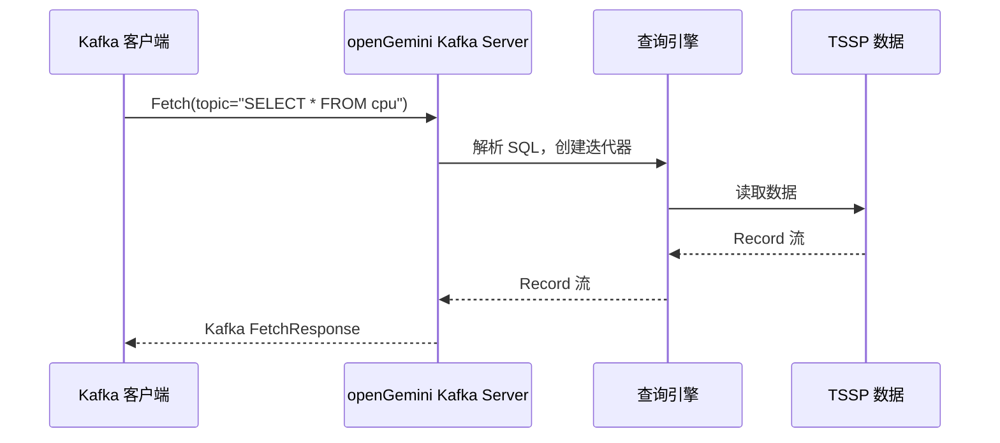
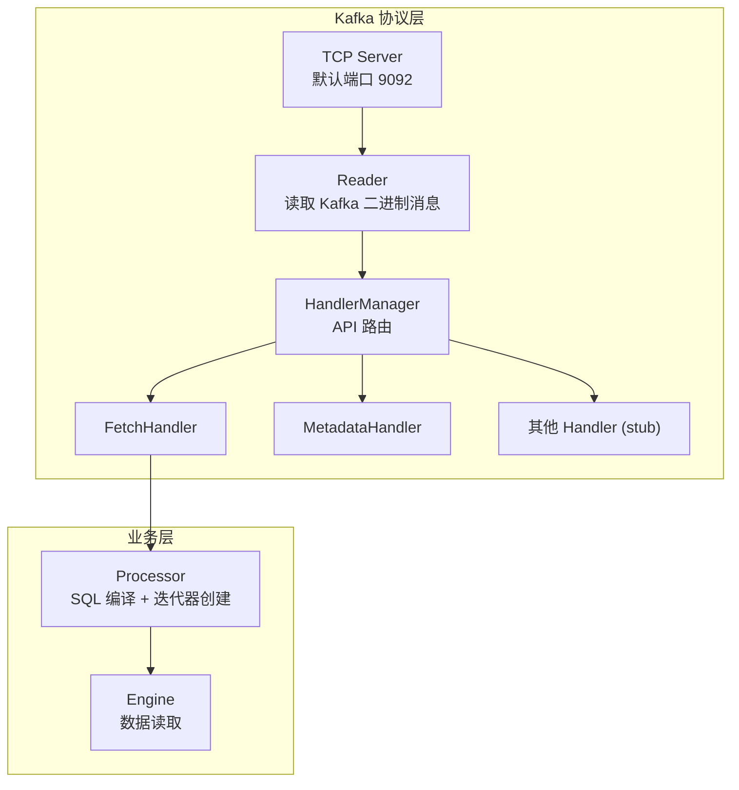
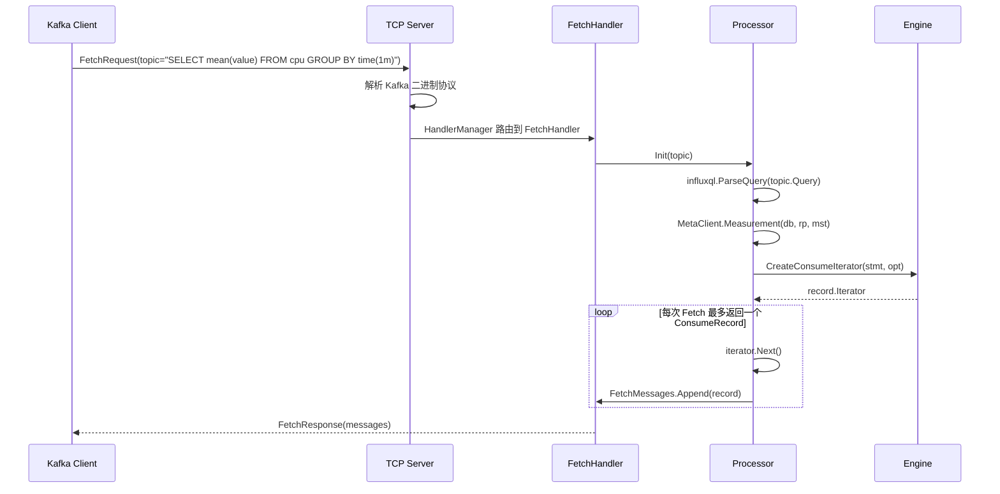

# Module 20: Kafka 协议兼容层深度审计报告（庖丁解牛版）

> openGemini 实现了 **Kafka 协议兼容层**，允许标准 Kafka 客户端像读取 Kafka Topic 一样读取 openGemini 中的数据。注意：这不是"从 Kafka 消费数据"，而是"用 Kafka 协议暴露 openGemini 数据"。

---

## 1. 概述



**通俗解释**：
openGemini 假装自己是一个 Kafka Broker。Kafka 客户端发 Fetch 请求时，openGemini 把 topic 名当作 SQL 查询来执行，然后把结果包装成 Kafka 消息格式返回。

---

## 2. 架构



### 2.1 支持的 Kafka API

| API | 版本 | 状态 | 说明 |
|-----|------|------|------|
| Fetch | v2 | **完整实现** | 读取数据（核心功能） |
| Metadata | v1 | **完整实现** | 返回 topic/broker 信息 |
| ListOffsets | v1 | Stub | 始终返回 offset=0 |
| OffsetCommit | v2 | Stub | 始终返回成功 |
| HeartBeat | v1 | Stub | 始终返回成功，`NewHeartbeatV0` 是命名不一致 |
| ApiVersions | v1 | **完整实现** | 返回支持的 API 列表 |

> 当前只实现 Fetch、Metadata、ListOffsets、OffsetCommit、Heartbeat、ApiVersions 这几个 API。完整的 consumer group 协议（如 JoinGroup、SyncGroup、FindCoordinator、OffsetFetch 等）没有实现，所以依赖 consumer group 的高阶消费者不能当成兼容性承诺。
>
> 代码证据：`services/consume/service.go` 注册的是 `handle.HeartBeat` 的处理器：
> `factory.RegisterV1(handle.HeartBeat, func() handle.Handler { return NewHeartbeatV0() })`。
> 这里的 `NewHeartbeatV0` 是构造函数命名不一致；协议注册和 `ApiVersions` 暴露的是 Heartbeat v1。

---

## 3. Fetch 流程详解

### 3.1 数据流



> 代码细节：`services/consume/fetch.go` 中 `MessageCount = 1`，`Process()` 找到第一条可返回记录后就结束本次 Fetch；如果当前 iterator 全部读完，`Processor.IteratorReset()` 会释放并清空 iterator，下一次 Fetch 再重新初始化。

### 3.2 核心代码

**代码位置**：`services/consume/fetch.go`

```go
func (h *FetchHandleV2) Handle(header protocol.RequestHeader, body []byte, onMessage handle.OnMessage) error {
    req := &protocol.RequestFetchV2{}
    err := protocol.Unmarshal(body, req)
    if err != nil {
        return err
    }

    if len(req.Topics) == 0 {
        return errno.NewError(errno.MissTopic)
    }
    if len(req.Partitions) == 0 {
        return errno.NewError(errno.MissPartitions)
    }

    return h.handle(header, req, onMessage)
}
```

---

## 4. 配置

```toml
[data.consume]
  consume-enabled = false          # 默认关闭
  consume-host = "127.0.0.1"
  consume-port = 9092              # Kafka 默认端口
  consume-max-read-size = 1048576  # 1MB 最大请求大小
```

**代码位置**：`app/ts-store/run/server.go:273-274` 只有 `s.config.Data.Consume.ConsumeEnable` 为 true 时才启动 `consume.NewService(...)`；`services/consume/service.go:74-77` 从 `config.GetStoreConfig().Consume` 读取 host、port 和最大读取大小。

---

## 5. 使用示例

高阶 `KafkaConsumer` 通常会自动发起 consumer group 相关 API。由于当前服务端没有实现完整 consumer group 协议，不建议把下面这种方式作为可用示例：

```python
# 不建议：KafkaConsumer 会依赖 group coordinator / join group 等 API
# openGemini 当前没有实现完整 consumer group 协议
```

更贴近当前实现的是低阶 Fetch：把 topic 名写成 InfluxQL 查询，直接发送 FetchRequest v2。示意代码如下，实际项目中应按所用 Kafka 库的低阶协议 API 组装 Metadata + Fetch 请求：

```python
query_topic = 'SELECT mean(value) FROM cpu WHERE time > now() - 1h GROUP BY time(1m)'

# 低阶流程：
# 1. 连接 opengemini-server:9092
# 2. 发送 MetadataRequest v1，topic=query_topic
# 3. 发送 FetchRequest v2，topic=query_topic, partition=0, fetch_offset=0
# 4. 解析 FetchResponse 中的 message payload
```

---

## 6. 总结

| 设计 | 目的 | 效果 |
|------|------|------|
| Kafka 协议兼容 | 复用 Kafka 生态工具 | 无缝对接 Kafka 客户端 |
| Topic = SQL 查询 | 灵活的数据访问 | 支持任意 InfluxQL 查询 |
| Stub API | 客户端兼容性 | Kafka 客户端不报错 |
| 默认关闭 | 安全性 | 不暴露不必要的端口 |
