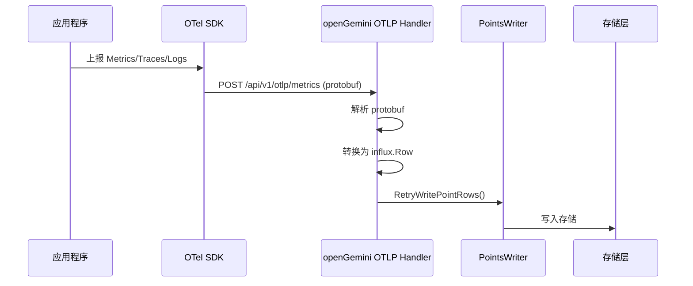
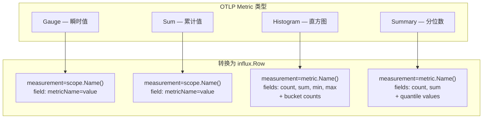

# Module 21: OpenTelemetry 集成深度审计报告（庖丁解牛版）

> openGemini 原生支持 OpenTelemetry 协议（OTLP），可以直接接收 Traces、Metrics、Logs 三种信号，无需外部转换器。

---

## 1. 概述



**支持的三种信号**：

| 信号 | 端点 | 说明 |
|------|------|------|
| Metrics | `/api/v1/otlp/metrics` | Gauge、Sum、Histogram、Summary |
| Traces | `/api/v1/otlp/traces` | Span 数据 |
| Logs | `/api/v1/otlp/logs` | 日志数据 |

---

## 2. Metrics 转换流程

### 2.1 四种 Metric 类型



### 2.2 转换代码

**代码位置**：`lib/opentelemetry/otlp_metrics_writer.go`

```go
func (c *OtlpMetricWriter) enqueueMetrics(ctx context.Context, resource pcommon.Resource, scope pcommon.InstrumentationScope, metrics pmetric.MetricSlice, batch otel2influx.InfluxWriterBatch) error {
    // 遍历 ResourceMetrics → ScopeMetrics → Metric
    for _, sm := range scopeMetrics {
        switch metric.Type() {
        case pmetric.MetricTypeGauge:
            // Gauge: 每个数据点 → 一个 influx.Row
            // tags = 数据点属性 + resource 属性 + instrumentation scope tags
            // field = metricName → value (float64/int64)
        case pmetric.MetricTypeSum:
            // Sum: 同 Gauge，但有 cumulative/delta 区分
        case pmetric.MetricTypeHistogram:
            // Histogram: count, sum, min, max + 每个 bound 的累计 bucket count
        case pmetric.MetricTypeSummary:
            // Summary: count, sum + 每个 quantile 的值
        }
    }
}
```

**真实写入规则**：

- Gauge/Sum：`enqueueGauges()`、`enqueueSums()` 先按 datapoint attributes + resource attributes + instrumentation scope tags 分组，把多个 metric name 合并为同一行的多个 field；最后通过 `batch.EnqueuePoint(ctx, scope.Name(), tags, fields, ts, ...)` 写入，因此 measurement 是 `scope.Name()`。
- Histogram/Summary：`enqueueHistogram()`、`enqueueSummary()` 直接以 `metric.Name()` 作为 measurement；Histogram 写 count、sum、min/max 以及每个 bound 的累计 bucket count，Summary 写 count、sum 和 quantile 字段。
- Resource attributes、datapoint attributes 和 instrumentation scope tags 会进入 tags；`scope.Name()` 同时用于 Gauge/Sum 的 measurement。

### 2.3 具体例子

```
OTLP Metric 输入:
  metric: http_requests_total
  type: Sum
  value: 1000
  labels: {method="GET", status="200"}
  scope: {name="runtime"}
  resource: {service.name="my-service"}

转换后的 influx.Row:
  Name: "runtime"             ← Gauge/Sum 使用 scope.Name() 作为 measurement
  Tags: [
    {method, GET},
    {status, 200},
    {service.name, my-service},
    {telemetry.sdk.language, go}
  ]
  Fields: [
    {http_requests_total, 1000, INTEGER}
  ]
  Timestamp: 数据点的时间戳
```

Histogram 示例：

```
OTLP Histogram 输入:
  metric: http_request_duration_seconds
  count: 145320
  sum: 53423
  explicit_bounds: [0.05, 0.1, 0.2]
  bucket_counts: [24054, 9390, 66948, 44928]

转换后的 influx.Row:
  Name: "http_request_duration_seconds"   ← Histogram 使用 metric.Name()
  Fields: count, sum, min/max(若存在), "0.05", "0.1", "0.2", "Inf"
```

Histogram 的 bucket 字段名直接使用 bound 字符串，最后一个正无穷 bucket 使用 `Inf` key；当前实现不会添加 Prometheus 风格的 `le_` 前缀。
字段值是累计 bucket count：`"0.05"=24054`，`"0.1"=24054+9390`，`"0.2"=24054+9390+66948`，`"Inf"=145320`。

---

## 3. 配置

```
URL: http://opengemini-server:8086/api/v1/otlp/metrics?db=mydb&rp=autogen

查询参数:
  db — 目标数据库（必填，服务端会校验数据库存在）
  rp — 保留策略（可选，透传给 RetryWritePointRows）
```

端点注册在 `lib/util/lifted/influx/httpd/handler.go`：`/api/v1/otlp/traces`、`/api/v1/otlp/metrics`、`/api/v1/otlp/logs` 均为 POST。

---

## 4. 总结

| 设计 | 目的 | 效果 |
|------|------|------|
| 原生 OTLP 支持 | 无需外部转换器 | 简化部署 |
| 三种信号全覆盖 | Metrics/Traces/Logs | 完整可观测性 |
| protobuf 解码 | 高效序列化 | 低开销 |
| 对象池复用 | OtelContext 池化 | 减少 GC 压力 |
| 自动标签合并 | 相同属性的数据点合并 | 减少写入量 |
