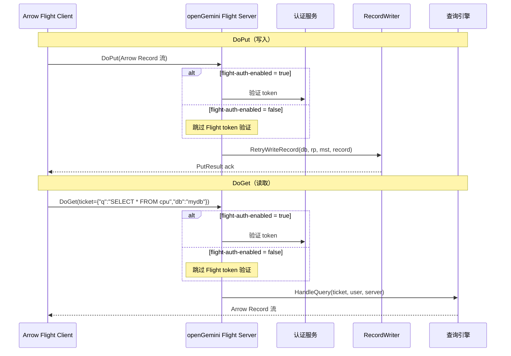
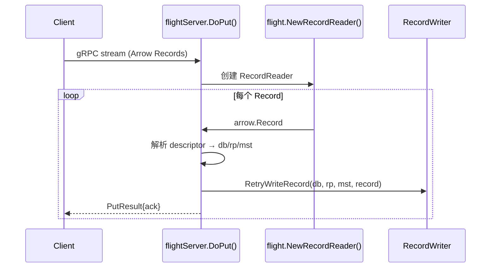
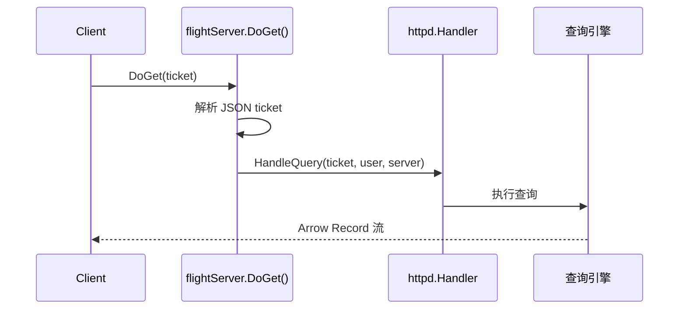
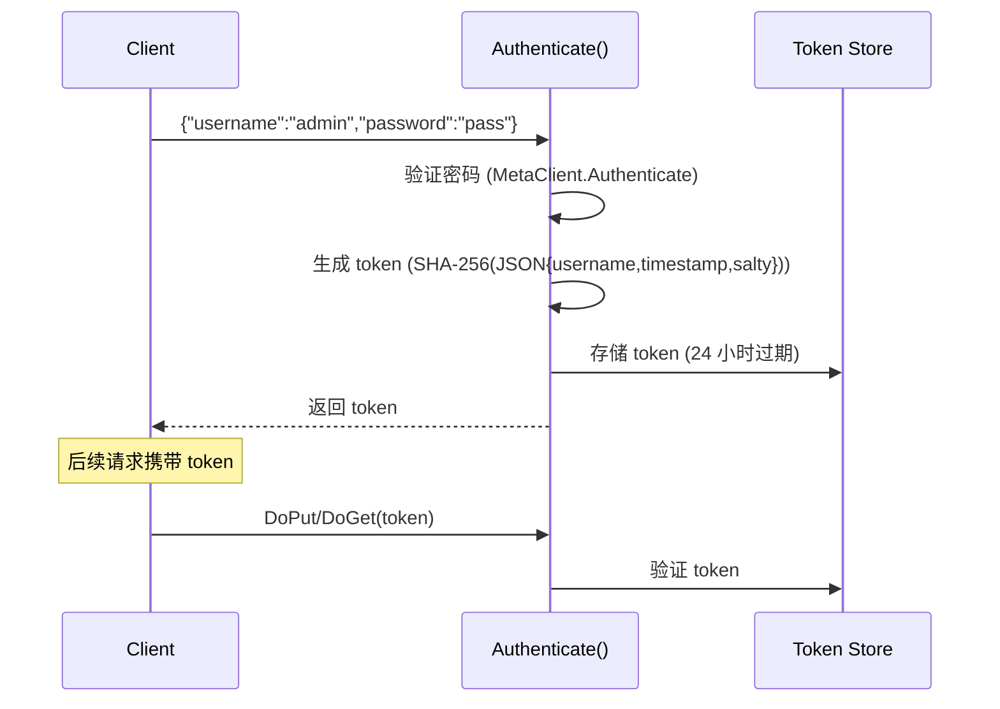

# Module 22: Arrow Flight 协议深度审计报告（庖丁解牛版）

> Arrow Flight 是 Apache Arrow 的高性能数据传输协议，基于 gRPC。openGemini 实现了 Arrow Flight 的 DoPut（写入）和 DoGet（读取）两个核心操作。

---

## 1. 概述



---

## 2. 核心结构

**代码位置**：`services/arrowflight/service.go`

```go
type Service struct {
    server           flight.Server                // gRPC 服务器
    service          *flightServer                // Flight 协议处理器
    authHandler      *authServer                  // 认证服务
    Config           *config.Config               // 配置
    Logger           *logger.Logger               // 日志
    err              chan error                    // 错误通道
    StatisticsPusher *statisticsPusher.StatisticsPusher // 统计推送
    MetaClient       FlightMetaClient             // 元数据客户端

    RecordWriter interface {                      // 写入接口
        RetryWriteRecord(database, retentionPolicy, measurement string, rec arrow.Record) error
    }
}
```

### 2.1 协议约束

```
1. 写入必须保证负载均衡
2. 同一批次内时间必须有序
3. 一个批次只能属于一个 db/rp/mst
4. time 字段必须是最后一列
```

---

## 3. DoPut（写入）



---

## 4. DoGet（读取）

```go
// Ticket 格式（JSON）:
{
  "q": "SELECT * FROM cpu WHERE time > now() - 1h",
  "db": "mydb",
  "rp": "autogen",
  "node_id": "1",
  "params": "{\"precision\":\"ns\"}",
  "chunked": "true",
  "chunkSize": "10000",
  "innerChunkSize": "1000",
  "is_query_series_limit": "false"
}
```



DoGet 会把解析后的 ticket 连同 user、server 传给 `HandleQuery(ticket, user, server)`。ticket 当前支持的关键字段包括：`q`、`db`、`rp`、`node_id`、`params`、`chunked`、`chunkSize`、`innerChunkSize`、`is_query_series_limit`。当前 `handler_arrowflight.go` 的 `request` 结构体把这些控制字段都定义为 `string`，所以 ticket 中的数字、布尔值和 `params` 对象都要写成字符串；`params` 是 JSON 字符串，后续再二次解析。

---

## 5. 认证



---

## 6. 配置

```toml
[http]
  flight-address = ":8087"           # Flight 服务端口
  flight-enabled = false             # 是否启动 Arrow Flight 服务
  flight-auth-enabled = false        # 是否启用 Flight 认证
  flight-ch-factor = 2               # Arrow Record 写入并行通道系数
  max-body-size = 25000000           # gRPC MaxRecvMsgSize，<=0 时使用默认值
```

**代码位置**：`lib/util/lifted/influx/httpd/config/config.go` 定义默认值；`app/ts-sql/sql/server.go` 只有在 `c.HTTP.FlightEnabled` 为 true 时初始化 `arrowflight.NewService(c.HTTP)`。

---

## 7. 总结

| 设计 | 目的 | 效果 |
|------|------|------|
| Arrow IPC 格式 | 高效列式序列化 | 零拷贝传输 |
| gRPC 传输 | 双向流 | 低延迟 |
| SHA-256 token 认证 | 安全性 | token 由 username、timestamp、随机 salty 生成，24 小时自动过期 |
| db/rp/mst 路由 | 灵活写入 | descriptor 中指定目标 |
