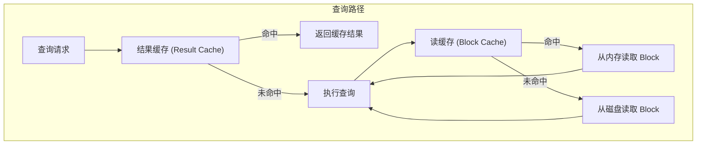
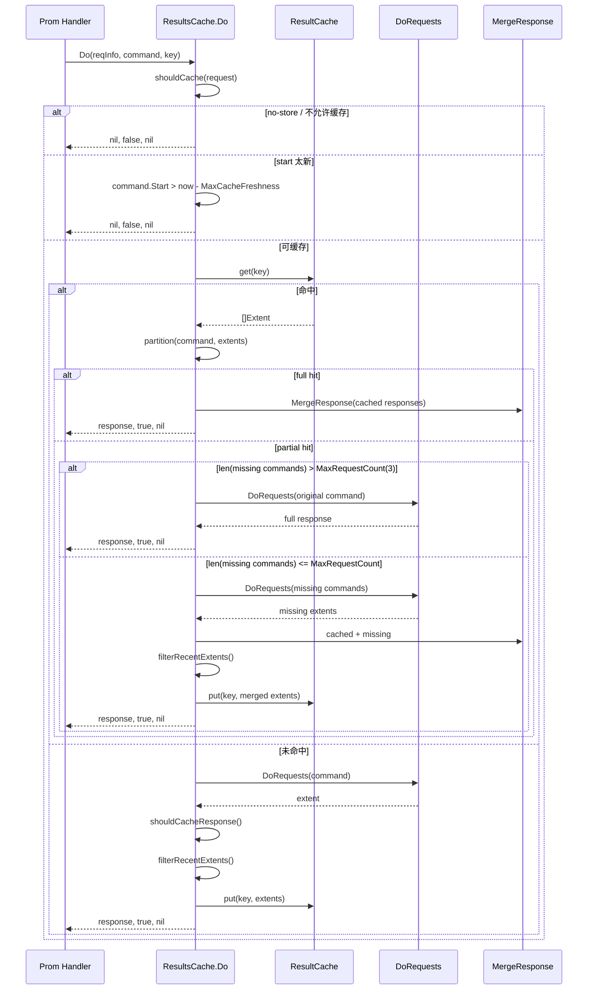
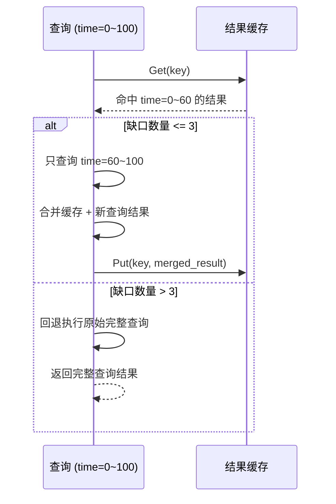
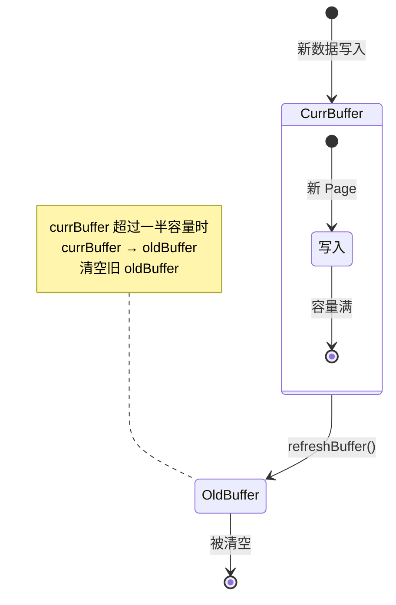

# Module 23: 查询缓存深度审计报告（庖丁解牛版）

> openGemini 有两层缓存：**结果缓存**（PromQL 查询结果）和**读缓存**（磁盘 Block/Page 级别）。

---

## 1. 两层缓存架构



---

## 2. 结果缓存（PromQL 层）

**代码位置**：`lib/resultcache/`, `lib/util/lifted/influx/httpd/results_cache.go`

### 2.1 缓存策略

```go
type ResultCache interface {
    Get(key string) ([]byte, bool)   // 查找
    Put(key string, value []byte)    // 写入
}
```

**缓存 Key**：`mst:db:rp:cmd:step:startBucket`

```go
func generateCacheKey(command *promql2influxql.PromCommand, mst string, interval time.Duration) string {
    currentInterval := command.Start.UnixNano() / int64(interval)
    return fmt.Sprintf("%s:%s:%s:%s:%s:%d",
        mst,
        command.Database,
        command.RetentionPolicy,
        command.Cmd,
        command.Step.String(),
        currentInterval,
    )
}
```

**具体例子**：

```
mst = "cpu"
db = "prom"
rp = "autogen"
cmd = "rate(cpu_usage[5m])"
step = "10s"
SplitQueriesByInterval = 5m
start = 1970-01-01 00:08:00

key = cpu:prom:autogen:rate(cpu_usage[5m]):10s:1
```

`startBucket` 不是原始 start 时间，而是 `command.Start.UnixNano() / SplitQueriesByInterval` 的整数桶号。这样同一时间桶内的相同 PromQL 请求会路由到同一个结果缓存 key。

**淘汰策略**：LRU（Least Recently Used）

**TTL 机制**：惰性检查 — Get 时检查是否过期，无后台清理

### 2.2 ResultsCache.Do 真实流程



**核心代码讲解**：

```go
func (rc *ResultsCache) Do(reqInfo *RequestInfo, command *promql2influxql.PromCommand,
    key string) (*promql2influxql.PromQueryResponse, bool, error) {
    if !shouldCache(reqInfo.r) {
        return nil, false, nil
    }

    maxCacheTime := model.Now().Add(-rc.MaxCacheFreshness).UnixNano()
    if command.Start.UnixNano() > maxCacheTime {
        return nil, false, nil
    }

    cached, ok := rc.get(key)
    if ok {
        response, extents, err = rc.handleHit(reqInfo, command, cached, maxCacheTime, &fullHit)
    } else {
        response, extents, err = rc.handleMiss(reqInfo, command, maxCacheTime)
    }
    if fullHit {
        return response, true, nil
    }

    extents = rc.filterRecentExtents(extents, command.Step.Nanoseconds(), rc.MaxCacheFreshness)
    if len(extents) > 0 {
        rc.put(key, extents)
    }
    return response, true, nil
}
```

**逐行解释**：
- `shouldCache(reqInfo.r)`：遵守 HTTP cache-control，遇到 no-store 等场景直接绕过缓存
- `maxCacheTime`：用 `MaxCacheFreshness` 避免缓存过新的数据
- `rc.get(key)`：读取并反序列化 `CachedResponse`，同时校验响应内的 key
- `handleHit()`：把已有 Extent 与请求范围做 `partition()`；缺口数量不超过 `MaxRequestCount(3)` 时才逐段补查并合并，超过时回退执行原始完整查询
- `handleMiss()`：完整执行一次查询，并把结果作为一个 Extent 返回
- `shouldCacheResponse()`：除新鲜度外，还会检查 PromQL `@` modifier 是否落在可缓存时间内，以及负 `offset` 是否会导致不安全缓存
- `filterRecentExtents()`：裁掉太新的区间、空响应和无效响应
- `rc.put(key, extents)`：序列化 `CachedResponse{Key, Extents}` 写入底层 `ResultCache`

### 2.3 部分命中



**通俗解释**：
如果你查询"最近 100 分钟的数据"，缓存中有"前 60 分钟"的结果，系统只查询"后 40 分钟"，然后合并。这样避免了重复计算。

---

## 3. 读缓存（Block/Page 层）

**代码位置**：`lib/readcache/`

### 3.1 结构

```go
type blockCache struct {
    blocks []mapLruCache  // 分片数组，减少锁竞争
}

type lruCache struct {
    currBuffer *buffer  // 当前代
    oldBuffer  *buffer  // 上一代
    bufferSize int
}
```

### 3.2 代际淘汰（Generational Eviction）



**通俗解释**：
读缓存就像"两代仓库"。新数据先进"当前仓库"，当前仓库满了，就把"当前仓库"变成"上一代仓库"，同时清空旧的"上一代仓库"。查询时先查"当前仓库"，没找到再查"上一代仓库"。

### 3.3 缓存 Key

```
格式：filePath&&offset 或 filePath&&blockId
示例：/data/db0/0/cpu_0001/00000001-0000-00000001.tssp&&1048576
```

### 3.4 配置

```
Meta Cache: 2GB 默认
Data Cache: 2GB 默认
```

---

## 4. 总结

| 缓存层 | 粒度 | 淘汰策略 | TTL |
|--------|------|---------|-----|
| 结果缓存 | 查询结果 | LRU | 惰性检查 |
| 读缓存 | Block/Page | 代际淘汰 | 无（按容量） |
| MetaIndex 缓存 | 文件元数据 | 代际淘汰 | 无（按容量） |

| 设计 | 效果 |
|------|------|
| 结果缓存部分命中 | 避免重复计算 |
| 256 分片读缓存 | 减少锁竞争 |
| 代际淘汰 | 简单高效，无链表维护 |
| 引用计数 Page | 安全并发访问 |
