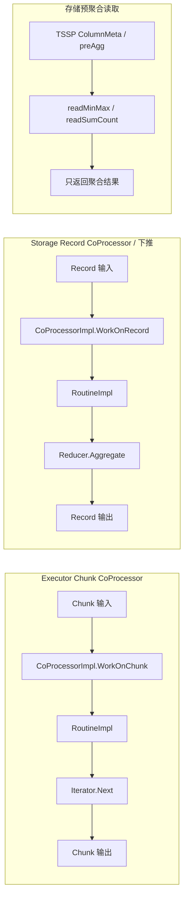
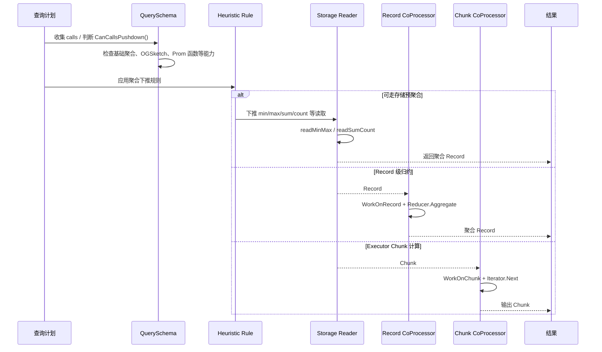

# Module 24: Coprocessor / 计算下推深度审计报告（庖丁解牛版）

> CoProcessor 有两套语境：Executor 层的 Chunk CoProcessor 是流水线内的列计算框架；Storage/Engine 层的 Record CoProcessor 才和聚合下推、Record 级归约直接相关。不要把普通 filter 统一称为 CoProcessor 下推。

---

## 1. 概述



**通俗解释**：
- Executor 层 `engine/executor/coprocessor.go` 面向 `Chunk`，用于 Filter、Interval、Aggregate 等 Transform 内部的列处理。
- Storage/Engine 层 `engine/coprocessor.go` 面向 `record.Record`，用于 AggregateCursor、Prom Range/Instant Cursor、RecordPlan 等 Record 级聚合。
- 真正的“存储下推”还包括读 TSSP 时利用 `ColumnMeta.preAgg` 直接算 `min/max/sum/count` 的预聚合路径；该路径还要求查询时间范围完整覆盖列 chunk，读侧通过 `cm.allRowsInRange(ctx.tr)` 判断，不满足时回退读取数据计算。
- filter 条件可以被规划器尽量推近 Reader，用于减少读取/传输，但它不是统一的 CoProcessor 聚合下推。

---

## 2. 两套 CoProcessor 接口

### 2.1 Executor 层：Chunk CoProcessor

**代码位置**：`engine/executor/coprocessor.go`

```go
type Iterator interface {
    Next(*IteratorEndpoint, *IteratorParams)
}

type Routine interface {
    WorkOnChunk(Chunk, Chunk, *IteratorParams)
}

type CoProcessor interface {
    WorkOnChunk(Chunk, Chunk, *IteratorParams)
}

type CoProcessorImpl struct {
    Routines []Routine
}
```

**代码讲解**：
- `CoProcessorImpl` 管理多个 `Routine`，每个 Routine 通常对应一个输出表达式或辅助列。
- `WorkOnChunk(in, out, params)` 只在 Executor 的 Chunk 流水线里工作，不直接读取 TSSP 文件。
- 典型使用场景是 `StreamAggregateTransform.compute()`、`FilterTransform.filterHelper()`、`IntervalTransform.work()`。

### 2.2 Storage/Engine 层：Record CoProcessor

**代码位置**：`engine/coprocessor.go`

```go
type Reducer interface {
    Aggregate(*ReducerEndpoint, *ReducerParams)
}

type Routine interface {
    WorkOnRecord(*record.Record, *record.Record, *ReducerParams)
}

type CoProcessor interface {
    WorkOnRecord(*record.Record, *record.Record, *ReducerParams)
}
```

**代码讲解**：
- `WorkOnRecord()` 面向列式 `record.Record`，由 `aggregateCursor`、`RangeVectorCursor`、`InstantVectorCursor` 等调用。
- `ReducerParams` 保存窗口、step、range、offset 等状态。
- 这套 CoProcessor 更接近“Record 级下推/归约”，但仍不等同于所有 filter 下推。

---

## 3. 下推支持范围要收窄

### 3.1 预聚合白名单

**代码位置**：`engine/executor/schema.go`

```go
mapping.mapCalls["count"] = struct{}{}
mapping.mapCalls["sum"] = struct{}{}
mapping.mapCalls["max"] = struct{}{}
mapping.mapCalls["min"] = struct{}{}
mapping.mapCalls["first"] = struct{}{}
mapping.mapCalls["last"] = struct{}{}
mapping.mapCalls["mean"] = struct{}{}
```

**说明**：这是查询 Schema 层用于判断预聚合/模板快速路径的一组基础聚合函数。不要把 `median`、`mode`、`top`、`bottom`、`distinct`、`stddev`、`sample`、`absent` 等统称为已支持存储下推。

### 3.2 TSSP 读取侧预聚合

**代码位置**：`engine/immutable/reader.go`

```go
func readMinMax(...)
func readSumCount(...)
```

**说明**：
- `readMinMax` 可利用列元数据定位 `min/max` 及对应时间/辅助列。
- `readSumCount` 可利用 `ColumnMeta.preAgg` 读取 `sum/count`。
- `mean` 不是直接从文件里读一个 mean 值，而是依赖查询层改写后的 `sum/count` 组合语义。
- 即使函数命中白名单，带 `GROUP BY time(...)` 的 interval 查询也不会走 `MatchPreAgg()`；读侧还要求 `cm.allRowsInRange(ctx.tr)` 为 true。

### 3.3 OGSketch 路径

`percentile_approx` 对应的可优化路径是 OGSketch 复合算子：

```
percentile_ogsketch
  -> ogsketch_insert
  -> ogsketch_merge
  -> ogsketch_percentile
```

这和普通 `percentile`、`median` 不是一回事，也不应扩大描述为所有分位数函数都能下推。

### 3.4 filter 的边界

filter 谓词优化是把条件尽量推近 Reader 或索引读取侧，减少后续 Chunk/Record 处理量。它可以和聚合下推配合，但不要把“WHERE 条件下推”都称为 `CoProcessor` 下推；CoProcessor 关注的是列/Record 计算框架，filter 是计划与读取路径的筛选能力。

---

## 4. 工作流程



---

## 5. 具体案例

### 5.1 基础聚合下推

```sql
SELECT min(value), max(value), sum(value), count(value)
FROM cpu
WHERE time > now() - 1h
```

```
1. QuerySchema 收集 calls:
   min / max / sum / count 均命中 PreAggregateCallMapping

2. 规划器判断可下推:
   CanCallsPushdown() == true

3. 存储读取侧:
   若时间范围完整覆盖对应 ColumnMeta 范围，min/max 尝试走 readMinMax，
   sum/count 尝试走 readSumCount；否则回退读取数据列计算

4. 上层合并:
   Record/Chunk 层只处理预聚合结果，不再传输所有原始点
```

如果保留 `GROUP BY time(1m)`，查询仍可能使用聚合下推或 Record/Chunk 级归约，但不属于 `readMinMax/readSumCount` 这条 TSSP preAgg meta-read 路径。

### 5.2 OGSketch 近似分位数

```sql
SELECT percentile_approx(value, 99)
FROM cpu
WHERE time > now() - 1h
GROUP BY time(1m)
```

```
1. QuerySchema 识别 percentile_ogsketch 复合算子
2. 计划拆成 ogsketch_insert / ogsketch_merge / ogsketch_percentile
3. 存储侧先构建或合并 sketch
4. Executor 层取 percentile，输出近似 P99
```

### 5.3 filter 不是统一 CoProcessor 下推

```sql
SELECT max(value)
FROM cpu
WHERE host = 'server1' AND value > 10
```

```
host/value 条件用于减少读取或进入后续算子的行数；
max(value) 才进入聚合下推判断。
```

---

## 6. 总结

| 设计 | 真实边界 | 效果 |
|------|----------|------|
| Chunk CoProcessor | Executor 内部 Chunk 列处理 | 向量化执行、复用 Iterator |
| Record CoProcessor | Engine/Storage Record 级归约 | 降低 Chunk 转换与上层计算成本 |
| TSSP 预聚合 | `min/max/sum/count` 等基础统计 | 减少原始点读取 |
| OGSketch | `percentile_approx` 特定优化路径 | 支持近似分位数优化 |
| filter 推近 Reader | 计划/读取侧筛选，不等同 CoProcessor 聚合下推 | 减少参与计算的数据量 |
