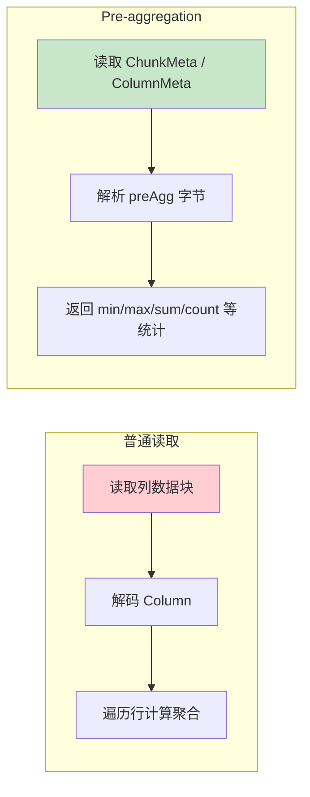
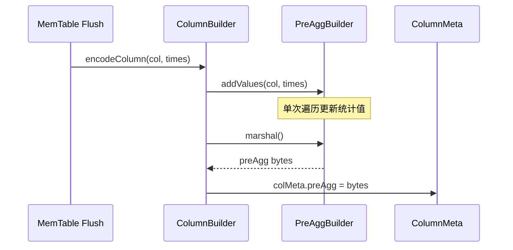
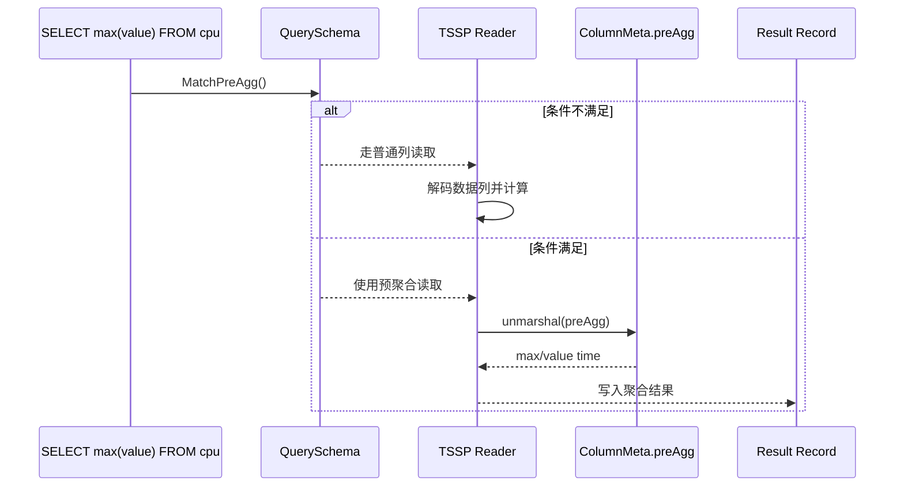

# Module 25: Pre-aggregation 预聚合深度审计报告（庖丁解牛版）

> Pre-aggregation 在列的 `ColumnMeta.preAgg` 字节中保存列 chunk 级统计值。它能让部分简单聚合少读或不读数据列，但是否命中取决于查询形态、函数白名单、字段条件、配置开关，以及读取时查询时间范围是否完整覆盖该列 chunk。

---

## 1. 概述



**通俗解释**：
Pre-aggregation 像每个列 chunk 附带一张“小统计卡”。查询 `min(value)`、`max(value)`、`sum(value)`、`count(value)` 等简单统计时，如果查询形态和读取范围都满足，就可以优先读统计卡，而不是把整个列块都解码出来。

---

## 2. 命中条件

### 2.1 QuerySchema.MatchPreAgg()：查询形态判断

**代码位置**：`engine/executor/schema.go`

```go
func (qs *QuerySchema) MatchPreAgg() bool {
    if !config.GetCommon().PreAggEnabled {
        return false
    }
    if !qs.HasCall() {
        return false
    }
    if qs.HasNonPreCall() {
        return false
    }
    if qs.HasInterval() {
        return false
    }
    if qs.HasFieldCondition() {
        return false
    }
    if qs.Options().IsPromQuery() {
        return false
    }
    return true
}
```

**逐行解释**：
- `PreAggEnabled` 必须开启。
- 查询必须包含聚合函数。
- 所有 call 都必须属于预聚合白名单。
- 不能有 `GROUP BY time(...)` interval。
- 不能有字段条件；字段过滤会改变参与聚合的数据集合，不能直接使用列 chunk 级统计。
- PromQL 查询不走这条 InfluxQL 预聚合匹配路径。

### 2.2 读取侧覆盖判断

`MatchPreAgg()` 只说明查询形态允许尝试预聚合。真正读取 `preAgg` 时，`readMinMax` / `readSumCount` 还会检查 `cm.allRowsInRange(ctx.tr)`：只有查询时间范围完整覆盖该 `ColumnMeta` 的时间范围，才能直接使用统计值；否则必须回退读取数据列并逐行/逐段计算。

### 2.3 函数白名单

**代码位置**：`engine/executor/schema.go`

```go
mapping.mapCalls["count"] = struct{}{}
mapping.mapCalls["sum"] = struct{}{}
mapping.mapCalls["max"] = struct{}{}
mapping.mapCalls["min"] = struct{}{}
mapping.mapCalls["first"] = struct{}{}
mapping.mapCalls["last"] = struct{}{}
mapping.mapCalls["mean"] = struct{}{}
```

**注意**：
- 白名单是 `MatchPreAgg()` 的条件之一，不代表每个函数都能从同一种 preAgg 字节直接读出结果。
- `mean` 依赖 `sum/count` 语义。
- `first/last` 会结合时间信息和 reader 逻辑处理，不是额外存储 first/last 值。

---

## 3. 存储内容与类型矩阵

**代码位置**：`engine/immutable/pre_aggregation.go`

```go
const (
    minIndex   = 0
    maxIndex   = 1
    minTIndex  = 2
    maxTIndex  = 3
    sumIndex   = 4
    countIndex = 5
)
```

| 类型 | 完整 preAgg 内容 | 完整大小 | 单行优化 | 可直接支持的统计 |
|------|------------------|----------|----------|------------------|
| Integer | min, max, minTime, maxTime, sum, count | 48 bytes | 16 bytes | min/max/sum/count |
| Float | min, max, minTime, maxTime, sum, count | 48 bytes | 16 bytes | min/max/sum/count |
| String | count | 8 bytes | 无 | count |
| Boolean | count, minTime, maxTime, minV, maxV | 26 bytes | 无 | min/max/count |
| Time | count | 4 bytes | 无 | count |

**代码讲解**：
- Integer/Float 保存 6 个 8 字节字段，所以完整格式是 48 bytes。
- String 只保存非空计数，`min()` / `max()` 会 panic，不能按字符串预聚合 min/max 理解。
- Boolean 保存 min/max 的布尔编码和对应时间，不保存 sum。
- Time 列只保存 count，时间范围另有 segment/chunk 元数据维护。

---

## 4. 写入流程



**代码示例**：

```go
func (m *FloatPreAgg) addValues(col *record.ColVal, times []int64) {
    values := col.FloatValues()
    for i := range values {
        v := values[i]
        if v < m.minV { m.minV = v; m.minTime = times[i] }
        if v > m.maxV { m.maxV = v; m.maxTime = times[i] }
        m.sumV += v
    }
    m.countV += int64(len(values))
}
```

---

## 5. 单行优化：PreAggOnlyOneRow 是 16 bytes

```go
func PreAggOnlyOneRow(buf []byte) bool {
    // only one row: minimum value + corresponding time
    return len(buf) == 16
}
```

当 Integer/Float segment 只有一行时，`marshal()` 只写：

```
value   : 8 bytes
minTime : 8 bytes
total   : 16 bytes
```

`unmarshal()` 读到 16 bytes 后会重构：

```
max = min
maxTime = minTime
sum = min
count = 1
```

**具体案例**：

```
原始点: time=1000, value=42.5

FloatPreAgg marshal:
  minV=42.5      -> 8 bytes
  minTime=1000   -> 8 bytes

unmarshal:
  minV=maxV=sumV=42.5
  minTime=maxTime=1000
  countV=1
```

---

## 6. 查询读取流程



**读取侧代码位置**：

```go
func readMinMax(...)
func readSumCount(...)
```

**说明**：
- `readMinMax` 用于 min/max 及其时间定位。
- `readSumCount` 用于 sum/count。
- 查询存在字段条件、PromQL 语义、interval 分组或非白名单函数时，不能直接套用这个流程。

---

## 7. 总结

| 设计 | 真实边界 | 效果 |
|------|----------|------|
| `MatchPreAgg()` | 配置开启、有聚合、无 interval、无字段条件、非 PromQL、函数全在白名单 | 决定是否匹配预聚合路径 |
| 类型矩阵 | Integer/Float 完整 48B；String 8B；Boolean 26B；Time 4B | 避免把所有类型都当 6 值统计 |
| 单行优化 | `PreAggOnlyOneRow(buf)` 判断 `len(buf) == 16` | Integer/Float 单行 segment 少存字段 |
| 读取侧预聚合 | `readMinMax` / `readSumCount` | 减少部分简单聚合的数据列读取 |
| 性能收益 | 取决于 segment 大小、命中条件和 IO/解码成本 | 不给无依据的固定倍数承诺 |
