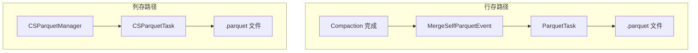
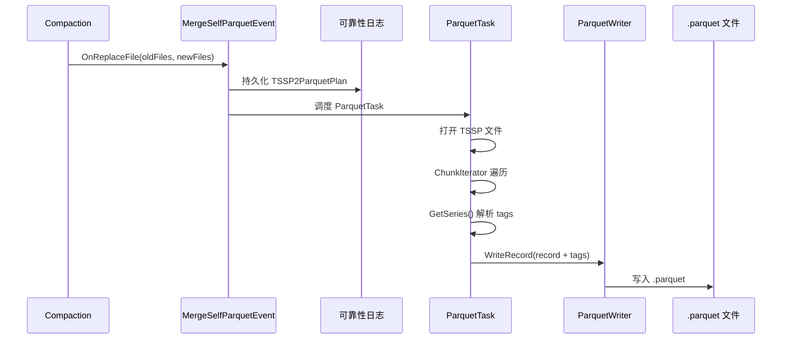
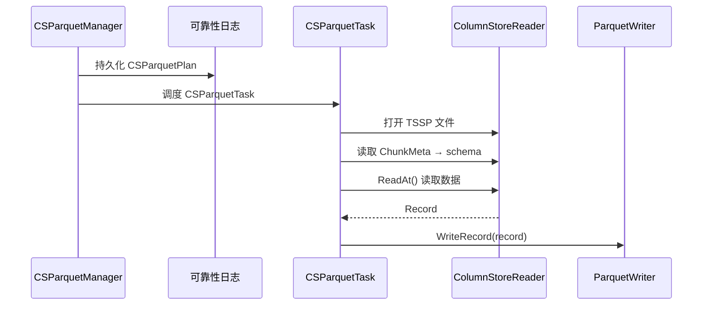
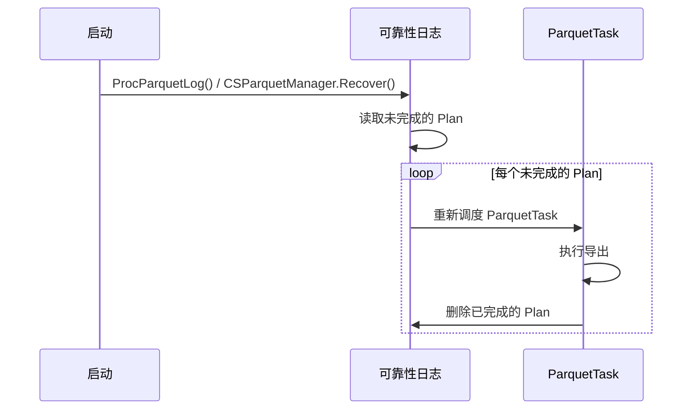
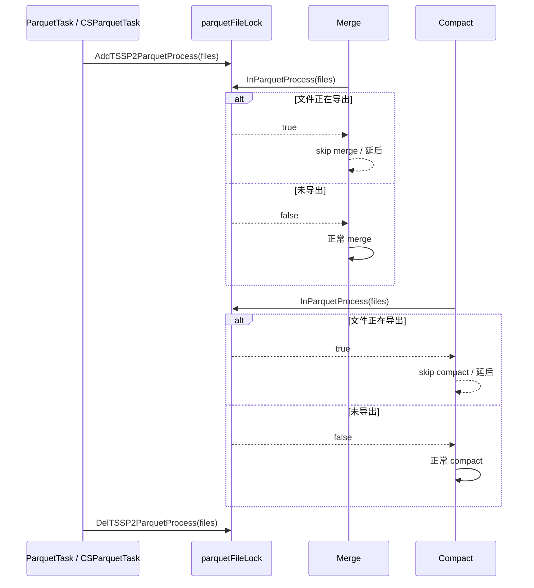

# Module 26: Parquet 导出深度审计报告（庖丁解牛版）

> openGemini 支持将 TSSP 文件异步导出为 Apache Parquet 格式，用于与大数据生态（Spark、Presto、Hive）集成。

---

## 1. 概述



---

## 2. 两条导出路径

### 2.1 行存路径（Compaction 触发）



### 2.2 列存路径（独立管理器）



---

## 3. Parquet Writer

**代码位置**：`lib/parquet/writer.go`

### 3.1 类型映射

| openGemini 类型 | Arrow/Parquet 类型 |
|----------------|-------------------|
| Field_Type_String | String |
| Field_Type_Int | Int64 |
| Field_Type_Float | Float64 |
| Field_Type_Boolean | Boolean |
| time (int64) | Timestamp(ns) |

### 3.2 压缩

使用 **Zstd** 压缩算法。

---

## 4. 输出路径

```
/tsdb/{instanceId}/parquet/{db}/{rp}/{mst}/dt=YYYY-MM-DD/{shardId}_{filename}.parquet
```

**示例**：
```
/tsdb/node1/parquet/mydb/autogen/cpu/dt=2024-01-15/1_00000001-0001-00010001.parquet
```

---

## 5. 配置

```toml
[data.parquet-task]
  enabled = false                        # 主要控制列存 CSParquetManager
  tssp-to-parquet-level = 0              # 行存 TSSP 转 Parquet 的 Compaction 层级（0=关闭）
  max-group-len = 65536                  # Parquet row group 大小
  page-size = 65536                      # Parquet data page 大小
  write-batch-size = 512                 # Arrow write batch 大小
  output-dir = "/data/openGemini/parquet_output"  # 列存导出目录；行存目录从 TSSP 路径派生
  reliability-log-dir = "/data/openGemini/parquet_reliability_log"
```

**代码位置**：`lib/config/store.go`, `lib/config/parquet_task.go`

```go
type Store struct {
    ParquetTask *ParquetTaskConfig `toml:"parquet-task"`
}

type ParquetTaskConfig struct {
    Enabled              bool   `toml:"enabled"`
    TSSPToParquetLevel   uint16 `toml:"tssp-to-parquet-level"`
    MaxRowGroupLen       int    `toml:"max-group-len"`
    PageSize             int    `toml:"page-size"`
    WriteBatchSize       int    `toml:"write-batch-size"`
    OutputDir            string `toml:"output-dir"`
    ReliabilityLogDir    string `toml:"reliability-log-dir"`
}
```

配置挂在 `data` 下，因此示例应写成 `[data.parquet-task]`。行存和列存的开关不同：行存 TSSP 转 Parquet 由 `tssp-to-parquet-level > 0` 且 compaction level 匹配触发；列存转换由 `enabled` 控制 `CSParquetManager`。`output-dir` 主要用于列存导出，行存输出目录从原 TSSP 文件路径派生到 `parquet/{db}/{rp}/{mst}/dt=...`。

---

## 6. 崩溃恢复



---

## 7. 对 merge/compact 的影响



**代码讲解**：

```go
func InParquetProcess(files ...string) bool {
    for i := range files {
        if parquetFileLock.Has(files[i]) {
            return true
        }
    }
    return false
}
```

行存 `ParquetTask.LockFiles()` 和列存 `CSParquetTask.LockFiles()` 都会调用 `AddTSSP2ParquetProcess`。merge/compact 侧会检查这个状态：

```go
if InParquetProcess(item.unordered.path...) {
    // in parquet process skip merge
    continue
}

if m.busy(group.group) || InParquetProcess(group.group...) {
    return nil
}

if InParquetProcess(group.oldFids...) {
    // in parquet process skip compact
    return nil
}
```

因此 Parquet 导出是异步的，但仍会影响后台任务调度。它避免阻塞主写入路径，不过正在导出的 TSSP 文件会让相关 merge/compact 跳过或延后，影响后台整理节奏。

---

## 8. 行存与列存差异

| 路径 | 调度入口 | 任务 | 读取方式 | 输出特征 |
|------|----------|------|----------|----------|
| 行存 | `MergeSelfParquetEvent` / `StreamCompactParquetEvent` | `ParquetTask` | 打开行存 TSSP，遍历 Chunk，结合 series/tag 信息 | 从 TSSP 路径派生，路径含 `parquet/{db}/{rp}/{mst}/dt=...` |
| 列存 | `CSParquetManager.Convert()` | `CSParquetTask` | `CSParquetPlan.BeforeRun()` 后按 Record 迭代 | 输出到配置的 `output-dir` 下 db/rp/mst 目录 |

**具体案例**：

```
行存:
  compaction 到达 tssp-to-parquet-level
  -> MergeSelfParquetEvent 保存 TSSP2ParquetPlan
  -> ParquetTask 锁定 files
  -> export2TSSPFile() 读取 TSSP + tags
  -> 写出 .parquet

列存:
  mutable attached/列存写入完成后调用 CSParquetManager.Convert()
  -> 保存 CSParquetPlan
  -> CSParquetTask 锁定单个 TSSP 文件
  -> plan.IterRecord() 逐 Record 写 Parquet
```

---

## 9. 总结

| 设计 | 目的 | 效果 |
|------|------|------|
| 异步导出 | 避免阻塞主写入路径 | 后台执行，但会让相关 merge/compact 跳过或延后 |
| 可靠性日志 | 崩溃恢复 | 不丢失导出任务 |
| Zstd 压缩 | 高压缩率 | 节省存储空间 |
| 分区路径 | dt=YYYY-MM-DD | 兼容 Hive 分区 |
| 两条路径 | 行存 `ParquetTask` + 列存 `CSParquetManager`/`CSParquetTask` | 覆盖两种存储形态，但调度入口不同 |
