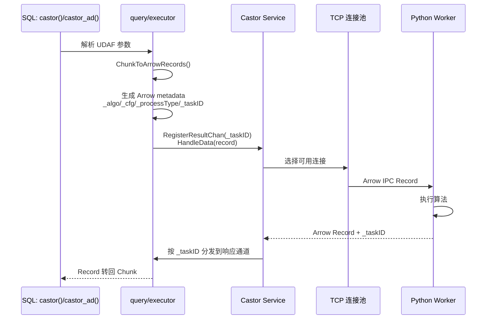
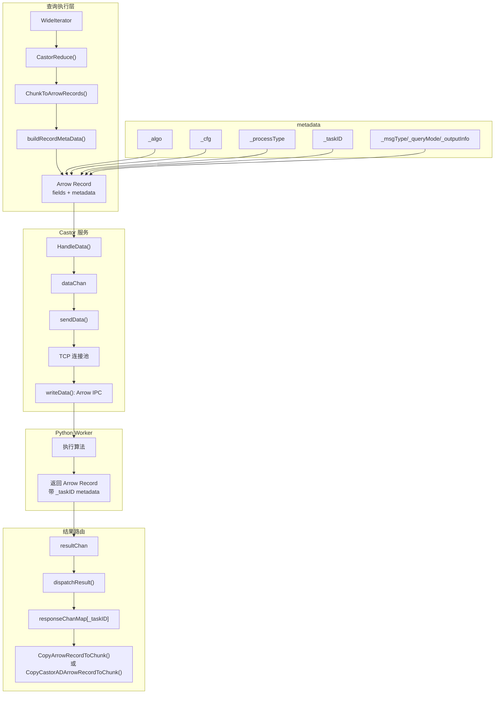
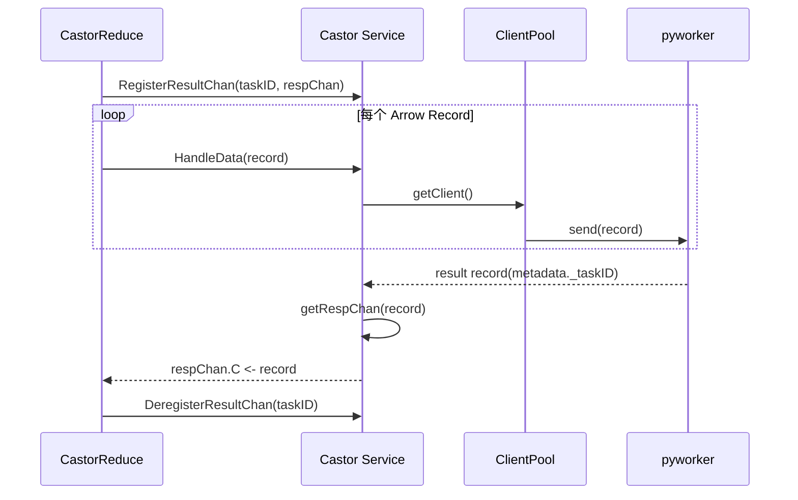
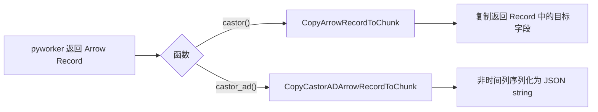

# Module 27: Castor 异常检测深度审计报告（庖丁解牛版）

> Castor 是 openGemini 内置的异常检测服务。查询层通过 `castor()` / `castor_ad()` UDAF 把 Chunk 转成 Arrow Record，Castor 服务再调用外部 Python Worker（pyworker）完成预测、检测或自定义异常检测。

---

## 1. 概述



关键点：

- `_algo` / `_cfg` / `_processType` / `_taskID` 等元数据在 `engine/executor/chunk_arrow_transform.go` 的 `buildRecordMetaData()` 生成。
- `services/castor/service.go` 不负责生成 `_algo` / `_cfg`，它负责队列、连接池、发送、接收和按 `_taskID` 路由结果。
- 输出字段不是完全透传。普通 `castor()` 当前通过 `DesiredFieldKeySet` 过滤期望字段，核心字段是 `anomalyLevel`，且 `_anomalyNum == 0` 时可能跳过输出；`castor_ad()` 会把返回 Record 的非时间列组装成字符串 JSON。

---

## 2. 四种操作类型

**代码位置**：`lib/config/castor.go`、`lib/util/lifted/influx/query/agg_functions.go`

| 类型 | SQL 参数 | 内部值 | 算法示例 |
|------|----------|--------|----------|
| **Fit** | `fit` | `_udf_fit` | METROPD |
| **Predict** | `predict` | `_udf_predict` | METROPD |
| **Detect** | `detect` | `_udf_detect` | DIFFERENTIATEAD |
| **FitDetect** | `fit_detect` | `_udf_fit_detect` | DIFFERENTIATEAD |

`castor()` 需要 4 个参数，`castor_ad()` 需要 5 个参数：

```go
func (f *CastorFunc) GetRules(name string) []CheckRule {
    return []CheckRule{
        &ArgNumberCheckRule{Name: name, Min: 4, Max: 4},
        &TypeCheckRule{Name: name, Index: 1, Asserts: []func(interface{}) bool{AssertStringLiteral}},
        &TypeCheckRule{Name: name, Index: 2, Asserts: []func(interface{}) bool{AssertStringLiteral}},
        &TypeCheckRule{Name: name, Index: 3, Asserts: []func(interface{}) bool{AssertStringLiteral}},
    }
}

func (f *CastorADFunc) GetRules(name string) []CheckRule {
    return []CheckRule{
        &ArgNumberCheckRule{Name: name, Min: 5, Max: 5},
        &TypeCheckRule{Name: name, Index: 1, Asserts: []func(interface{}) bool{AssertStringLiteral}},
        &TypeCheckRule{Name: name, Index: 2, Asserts: []func(interface{}) bool{AssertStringLiteral}},
        &TypeCheckRule{Name: name, Index: 3, Asserts: []func(interface{}) bool{AssertStringLiteral}},
        &TypeCheckRule{Name: name, Index: 4, Asserts: []func(interface{}) bool{AssertStringLiteral}},
    }
}
```

---

## 3. 数据流



核心代码说明：

```go
func buildRecordMetaData(c ChunkTags, castorParams *CastorParams, metric, taskId string) arrow.Metadata {
    metaKeys = append(metaKeys, string(castor.Algorithm))
    metaVals = append(metaVals, castorParams.algo)
    metaKeys = append(metaKeys, string(castor.ConfigFile))
    metaVals = append(metaVals, castorParams.cfg)
    metaKeys = append(metaKeys, string(castor.ProcessType))
    metaVals = append(metaVals, castorParams.typeOfProcess)
    metaKeys = append(metaKeys, string(castor.TaskID))
    metaVals = append(metaVals, string(taskId))
    return arrow.NewMetadata(metaKeys, metaVals)
}
```

这段逻辑发生在查询执行层。`_taskID` 由 `CastorReduce()` 创建，所有同一批输入 Record 共用该 ID，用来等待并收集 pyworker 返回的多份结果。

---

## 4. 核心结构

**代码位置**：`services/castor/service.go`

```go
type Service struct {
    Config          config.Castor
    clientPool      []*pool
    dataChan        chan *data
    dataFailureChan chan *data
    resultChan      chan arrow.Record
    responseChanMap sync.Map
}
```

职责边界：

| 组件 | 职责 |
|------|------|
| `CastorReduce()` | 生成 `_taskID`，注册响应通道，发送 Arrow Record，等待结果 |
| `ChunkToArrowRecords()` | 按 series / interval 把 Chunk 拆成 Arrow Record |
| `buildRecordMetaData()` | 生成 `_algo`、`_cfg`、`_processType`、`_taskID` 等 metadata |
| `Service.HandleData()` | 把 Record 放入 `dataChan` |
| `Service.sendData()` | 从连接池取连接并发送到 pyworker |
| `Service.dispatchResult()` | 从返回 Record metadata 读取 `_taskID`，分发到对应响应通道 |

---

## 5. 连接池与结果分发



代码路径：

```go
func (s *Service) getRespChan(rec arrow.Record) (*respChan, *errno.Error) {
    id, err := GetMetaValueFromRecord(rec, string(TaskID))
    if err != nil {
        return nil, err
    }
    nodeResultChan, exist := s.responseChanMap.Load(id)
    if !exist {
        return nil, errno.NewError(errno.ResponseTimeout)
    }
    return nodeResultChan.(*respChan), nil
}

func (s *Service) dispatchResult(rec arrow.Record) *errno.Error {
    ch, err := s.getRespChan(rec)
    if err != nil {
        return err
    }
    ch.C <- rec
    return nil
}
```

因此 `_taskID` 是 Castor 并发查询隔离的核心键。服务侧收到结果后不按算法名、配置名或 series 分发，而是按 `_taskID` 找回 `CastorReduce()` 注册的响应通道。

---

## 6. 配置

```toml
[castor]
  enabled = true
  pyworker-addr = ["127.0.0.1:6666"]  # Python Worker 地址
  connect-pool-size = 30               # 每个地址的连接池大小
  result-wait-timeout = 30             # 结果等待超时（秒）

[castor.detect]
  algorithm = ['DIFFERENTIATEAD']
  config_filename = ['detect_base']

[castor.predict]
  algorithm = ['METROPD']
  config_filename = ['predict_base']

[castor.fit]
  algorithm = ['METROPD']
  config_filename = ['fit_base']

[castor.fit_detect]
  algorithm = ['DIFFERENTIATEAD']
  config_filename = ['detect_base']
```

`castor()` 编译阶段会校验算法、配置和处理类型：

```go
if !checkAlgoType(aType.Val) {
    return errno.NewError(errno.AlgoTypeNotFound)
}
if err := c.CheckAlgoAndConfExistence(algo.Val, conf.Val, aType.Val); err != nil {
    return err
}
aType.Val = convertToInternalTagVal(aType.Val)
```

---

## 7. 使用示例

### 7.1 castor() 检测

```sql
SELECT castor(value, 'DIFFERENTIATEAD', 'detect_base', 'detect') AS value
FROM cpu
WHERE host = 'server1' AND time > now() - 1h
GROUP BY host
```

执行过程：

1. SQL 参数中的 `DIFFERENTIATEAD`、`detect_base`、`detect` 在 executor 中转成 Arrow metadata。
2. `detect` 会被编译期转换为内部 `_udf_detect`。
3. pyworker 返回的 Arrow Record 由 `CopyArrowRecordToChunk()` 按 `DesiredFieldKeySet` 复制回结果 Chunk。

普通 `castor()` 不是透传任意 pyworker 数值字段；当前 `CastorReduce()` 传入 `DesiredFieldKeySet`，核心期望字段是 `anomalyLevel`。如果返回元数据中的 `_anomalyNum == 0`，转换路径可能跳过输出。

### 7.2 castor_ad() 自定义检测

```sql
SELECT castor_ad(value, 'DIFFERENTIATEAD', 'detect_base', 'detect', '{"window":60}') AS detail
FROM cpu
WHERE host = 'server1' AND time > now() - 1h
GROUP BY host
```

`castor_ad()` 的第 5 个参数必须是字符串，会进入 `_algoParams`，并在 `buildRecordMetaData()` 中随 `_metric` 一起传给 pyworker。返回结果由 `CopyCastorADArrowRecordToChunk()` 处理：它遍历返回 Record 的非时间列，把每行组装成 JSON 字符串写入 string 列，因此输出列应按 string/JSON detail 理解，不是数值异常分数列。

示例结果形态：

```text
time                  detail
2026-06-12T10:00:00Z  {"score":"0.95","reason":"spike"}
2026-06-12T10:01:00Z  {"score":"0.10","reason":"normal"}
```

字段名如 `score`、`reason` 只是 pyworker 返回 schema 的示例，不是 openGemini 固定字段。

---

## 8. 输出字段边界



`services/castor/const.go` 中存在 `AnomalyLevel = "anomalyLevel"` 和 `DesiredFieldKeySet`，当前 `CastorReduce()` 会把该集合传给普通 `castor()` 的 `CopyArrowRecordToChunk()`。但服务返回的 Arrow Record schema 仍由 pyworker 决定，`castor_ad()` 更明确地把返回列作为可变 JSON 内容处理。因此文档只能把 `anomalyLevel` 作为常见字段或过滤目标，不能描述成所有 Castor 输出的固定 schema。

---

## 9. 总结

| 设计 | 目的 | 当前实现边界 |
|------|------|--------------|
| `castor()` / `castor_ad()` | SQL 入口 | SQL 使用 UDAF，metadata 键由 executor 生成 |
| executor 生成 metadata | 把 SQL 参数转成 Arrow metadata | `_algo/_cfg/_taskID` 在 `buildRecordMetaData()` 生成 |
| 外部 Python Worker | 复用 Python ML 生态 | 返回 schema 由 pyworker / 算法决定 |
| Arrow IPC 传输 | 高效序列化 | 输入输出都依赖 Arrow Record metadata |
| TCP 连接池 | 复用连接 | `monitorConn()` 自动补充连接 |
| `_taskID` 路由 | 并发查询隔离 | `Service.dispatchResult()` 按 `_taskID` 分发 |
| 输出转换 | Record 转 Chunk | `castor()` 复制字段，`castor_ad()` 输出 JSON string |
