# Module 28: SPDY Network Transport 深度审计报告（庖丁解牛版）

> 时序图 + 核心代码逐行解释。先画图，再对照代码，一步一步拆解。

---

## 1. SPDY 传输层是什么？为什么需要它？

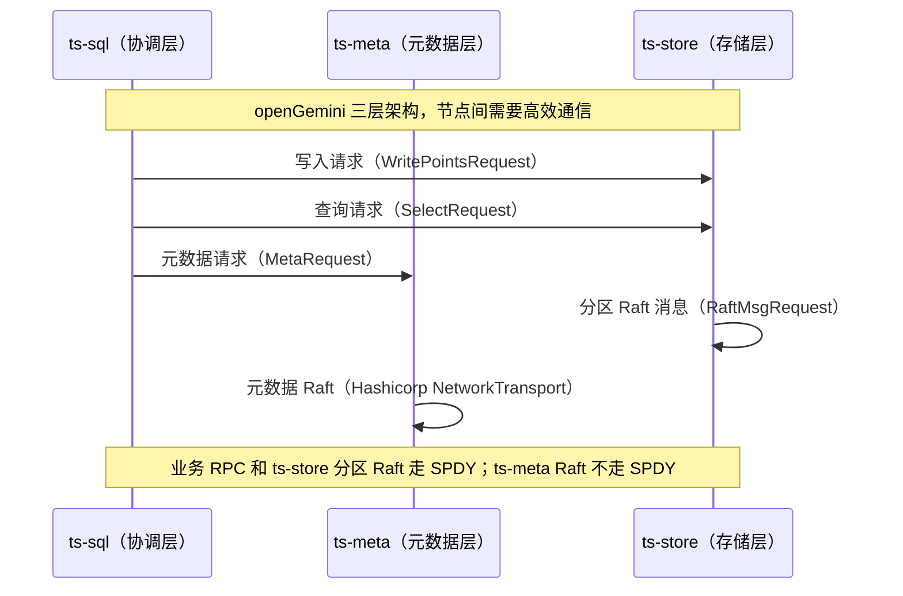
```mermaid
sequenceDiagram
    participant SQL as ts-sql（协调层）
    participant Meta as ts-meta（元数据层）
    participant Store as ts-store（存储层）

    Note over SQL,Store: openGemini 三层架构，节点间需要高效通信

    SQL->>Store: 写入请求（WritePointsRequest）
    SQL->>Store: 查询请求（SelectRequest）
    SQL->>Meta: 元数据请求（MetaRequest）
    Store->>Store: 分区 Raft 消息（RaftMsgRequest）
    Meta->>Meta: 元数据 Raft（Hashicorp NetworkTransport）

    Note over SQL,Store: 业务 RPC 和 ts-store 分区 Raft 走 SPDY；ts-meta Raft 不走 SPDY
```

**通俗解释**：
- openGemini 是三层架构：ts-sql（协调）、ts-meta（元数据）、ts-store（存储）
- 节点间通信需要高效、可靠、低延迟的传输层
- SPDY 模块实现了**连接多路复用**：一个 TCP 连接上承载多个逻辑会话（Session）
- 类似 HTTP/2 的多路复用，但更轻量，专为 RPC 场景设计
- 注意区分两套 Raft 传输：ts-meta 的元数据 Raft 使用 Hashicorp `raft.NetworkTransport`；ts-store 的分区级 Raft 才通过 `msgservice.RaftMessagesRequest` 包装后走 SPDY `RaftMsgRequest`

**为什么不用 gRPC？**
- SPDY 更轻量，减少了序列化/反序列化开销
- 自定义协议头只有 16 字节，比 HTTP/2 帧头更紧凑
- 支持 Snappy 压缩和 TLS 加密
- 专为 openGemini 的 RPC 模式优化

**核心代码位置**：
- 底层多路复用：`lib/spdy/multiplexed_connection.go`
- 会话管理：`lib/spdy/multiplexed_session.go`
- 状态机：`lib/spdy/fsm.go`
- 流控机制：`lib/spdy/data_ack.go`
- 连接池：`lib/spdy/multiplexed_session_pool.go`
- RPC 传输层：`lib/spdy/transport/transport.go`
- 服务端：`lib/spdy/rrc_server.go`

---

## 2. 协议头格式 — 16 字节二进制帧

### 2.1 帧头结构

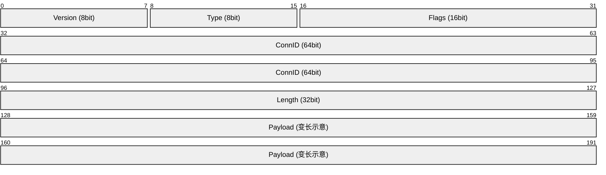
```mermaid
packet-beta
    0-7: "Version (8bit)"
    8-15: "Type (8bit)"
    16-31: "Flags (16bit)"
    32-95: "ConnID (64bit)"
    96-127: "Length (32bit)"
    128-191: "Payload (变长示意)"
```

**SPDY 帧头只有 16 字节**，比 HTTP/2 的 9 字节帧头多了连接 ID 和长度字段，但省去了流控和优先级等复杂机制。

**核心代码**：`lib/spdy/multiplexed_connection.go:37-55`

```go
// 第 37 行：协议版本常量
const (
    SPDY_VERSION uint8 = 0
)

// 第 42 行：帧头各字段大小（字节）
const (
    SIZE_OF_VERSION = 1   // 版本号：1 字节
    SIZE_OF_TYPE    = 1   // 帧类型：1 字节
    SIZE_OF_FLAGS   = 2   // 标志位：2 字节
    SIZE_OF_CONNID  = 8   // 连接 ID：8 字节
    SIZE_OF_LENGTH  = 4   // 载荷长度：4 字节
    HEADER_SIZE     = SIZE_OF_VERSION + SIZE_OF_TYPE + SIZE_OF_FLAGS +
        SIZE_OF_CONNID + SIZE_OF_LENGTH  // 总计 16 字节
)

// 第 52 行：帧类型定义
const (
    DATA_TYPE  uint8 = iota  // 0: 数据帧
    CLOSE_TYPE               // 1: 关闭帧
    UNKNOWN_TYPE             // 2: 未知类型（哨兵值）
)

// 第 57 行：标志位定义（位掩码）
const (
    SYN_FLAG      uint16 = 1 << iota  // 0x01: 同步标志（建立连接）
    ACK_FLAG                           // 0x02: 确认标志
    FIN_FLAG                           // 0x04: 结束标志（关闭连接）
    RST_FLAG                           // 0x08: 重置标志
    DATA_ACK_FLAG                      // 0x10: 数据确认标志（流控）
)
```

**逐行解释**：
- **Version**：协议版本号，当前为 0
- **Type**：帧类型，只有 `DATA_TYPE`（数据帧）和 `CLOSE_TYPE`（关闭帧）
- **Flags**：标志位，用于连接建立/关闭/流控的控制信号
- **ConnID**：连接 ID，用于多路复用时标识不同的逻辑会话
- **Length**：载荷长度，表示 Payload 的字节数

### 2.2 帧头解析

**核心代码**：`lib/spdy/multiplexed_connection.go:70-111`

```go
// 第 70 行：header 类型定义（字节切片的类型别名）
type header []byte

// 第 72 行：获取版本号
func (h header) Version() uint8 {
    return h[0]
}

// 第 76 行：校验版本号
func (h header) CheckVersion() bool {
    return h[0] == SPDY_VERSION
}

// 第 88 行：获取标志位（BigEndian 编码）
func (h header) Flags() uint16 {
    return binary.BigEndian.Uint16(h[2:4])
}

// 第 92 行：获取连接 ID
func (h header) ConnID() uint64 {
    return binary.BigEndian.Uint64(h[4:12])
}

// 第 96 行：获取载荷长度
func (h header) Length() uint32 {
    return binary.BigEndian.Uint32(h[12:16])
}

// 第 105 行：编码帧头
func (h header) encode(typ uint8, flags uint16, connID uint64, length uint32) {
    h[0] = SPDY_VERSION                          // 版本号
    h[1] = typ                                    // 帧类型
    binary.BigEndian.PutUint16(h[2:4], flags)     // 标志位
    binary.BigEndian.PutUint64(h[4:12], connID)   // 连接 ID
    binary.BigEndian.PutUint32(h[12:16], length)  // 载荷长度
}
```

**逐行解释**：
- 帧头使用 BigEndian 字节序（网络字节序）
- `encode` 方法将各字段写入 16 字节的缓冲区
- `ConnID` 占 8 字节，支持 2^64 个会话 ID

**具体例子**：

```
发送一个 SYN 数据帧，ConnID=1，载荷 100 字节：

帧头编码结果：
  [0] = 0x00          // Version = 0
  [1] = 0x00          // Type = DATA_TYPE
  [2-3] = 0x0001      // Flags = SYN_FLAG
  [4-11] = 0x0000000000000001  // ConnID = 1
  [12-15] = 0x00000064         // Length = 100

总计：16 字节帧头 + 100 字节载荷 = 116 字节
```

---

## 3. MultiplexedConnection — 连接多路复用

### 3.1 核心结构

```mermaid
classDiagram
    class MultiplexedConnection {
        +cfg: config.Spdy
        +underlying: io.ReadWriteCloser
        +sessions: map[uint64]*MultiplexedSession
        +sessionsGuard: sync.Mutex
        +input: io.Reader
        +output: BuffWriter
        +outputGuard: sync.Mutex
        +handlers: []handlerFunc
        +dataBp: bufferpool.Pool
        +client: bool
        +nextSessionId: uint64
        +accept: chan *MultiplexedSession
        +openTimeout: time.Duration
        +closed: chan struct{}
        +closeOnce: sync.Once
        +ListenAndServed() error
        +Write(hdr, data []byte) error
        +OpenSession() func()
        +AcceptSession() func()
        +Close() error
    }

    class MultiplexedSession {
        +id: uint64
        +fsm: *FSM
        +recvQueue: chan []byte
        +dataAck: *DataACK
        +Handle(flags, data) error
        +Send(data) error
        +Select() ([]byte, error)
        +Close() error
    }

    MultiplexedConnection "1" --> "*" MultiplexedSession : sessions map
```

**核心代码**：`lib/spdy/multiplexed_connection.go:119-140`

```go
// 第 119 行：MultiplexedConnection 结构体
type MultiplexedConnection struct {
    cfg           config.Spdy              // SPDY 配置
    underlying    io.ReadWriteCloser       // 底层 TCP 连接
    sessions      map[uint64]*MultiplexedSession  // 会话表（ConnID → Session）
    sessionsGuard sync.Mutex               // 会话表锁
    input         io.Reader                // 输入缓冲区（带缓冲的 Reader）
    output        BuffWriter               // 输出缓冲区（带缓冲的 Writer）
    outputGuard   sync.Mutex               // 输出锁（保证写入原子性）
    handlers      []handlerFunc            // 帧类型处理器数组
    dataBp        bufferpool.Pool          // 字节缓冲池（减少 GC 压力）
    client        bool                     // 是否是客户端
    nextSessionId uint64                   // 下一个会话 ID（原子递增）

    accept chan *MultiplexedSession         // 接受会话的通道

    openTimeout time.Duration              // 打开会话超时时间

    closed    chan struct{}                 // 关闭信号通道
    closeOnce sync.Once                    // 保证只关闭一次

    logger *logger.Logger                  // 日志器
}
```

**逐行解释**：
- **sessions**：核心数据结构，用 `map[uint64]` 存储所有活跃的逻辑会话
- **input/output**：带缓冲的读写器，减少系统调用次数
- **outputGuard**：互斥锁，保证多个 Session 并发写入时的原子性
- **dataBp**：字节缓冲池，复用 `[]byte` 减少内存分配
- **client**：客户端使用奇数 Session ID，服务端使用偶数 Session ID
- **accept**：通道式队列，服务端通过此通道接收新会话

### 3.2 创建连接

**核心代码**：`lib/spdy/multiplexed_connection.go:142-172`

```go
// 第 142 行：创建 MultiplexedConnection
func NewMultiplexedConnection(cfg config.Spdy, underlying io.ReadWriteCloser, client bool) *MultiplexedConnection {
    conn := &MultiplexedConnection{
        cfg:         cfg,
        underlying:  underlying,
        sessions:    make(map[uint64]*MultiplexedSession),
        input:       bufio.NewReader(underlying),           // 4KB 缓冲读取
        output:      bufio.NewWriter(underlying),           // 4KB 缓冲写入
        handlers:    make([]handlerFunc, UNKNOWN_TYPE),     // 帧类型处理器数组
        dataBp:      *bufferpool.NewByteBufferPool(...),    // 字节缓冲池
        accept:      make(chan *MultiplexedSession, cfg.ConcurrentAcceptSession),
        client:      client,
        openTimeout: cfg.GetOpenSessionTimeout(),
        closed:      make(chan struct{}, 1),
        logger:      logger.NewLogger(errno.ModuleNetwork),
    }

    // 第 158 行：如果启用 Snappy 压缩，替换读写器
    if cfg.CompressEnable {
        conn.output = snappy.NewBufferedWriter(underlying)
        conn.input = snappy.NewReader(underlying)
    }

    // 第 163 行：客户端用奇数 ID，服务端用偶数 ID
    if client {
        conn.nextSessionId = 1   // 客户端：1, 3, 5, 7, ...
    } else {
        conn.nextSessionId = 2   // 服务端：2, 4, 6, 8, ...
    }

    conn.initHandlers()  // 注册帧类型处理器
    return conn
}
```

**逐行解释**：
- **bufio.NewReader/Writer**：默认 4KB 缓冲区，减少 TCP 系统调用
- **snappy 压缩**：如果启用，用 Snappy 替换标准缓冲器，减少网络带宽
- **Session ID 分配**：客户端奇数、服务端偶数，避免 ID 冲突
- **ConcurrentAcceptSession**：accept 通道的缓冲区大小，默认 4096

### 3.3 帧类型处理器注册

**核心代码**：`lib/spdy/multiplexed_connection.go:193-196`

```go
// 第 193 行：初始化帧类型处理器
func (c *MultiplexedConnection) initHandlers() {
    c.handlers[DATA_TYPE]  = (*MultiplexedConnection).handleData   // 数据帧处理器
    c.handlers[CLOSE_TYPE] = (*MultiplexedConnection).handleClose  // 关闭帧处理器
}
```

**逐行解释**：
- 只有两种帧类型：`DATA_TYPE`（数据帧）和 `CLOSE_TYPE`（关闭帧）
- `handleData` 处理所有数据传输（包括 SYN/ACK/FIN/RST 等控制信号）
- `handleClose` 处理连接关闭

### 3.4 读取循环 — ListenAndServed

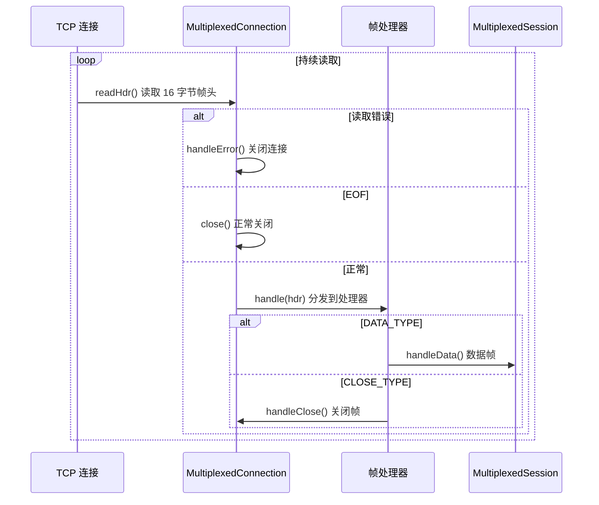
```mermaid
sequenceDiagram
    participant TCP as TCP 连接
    participant Conn as MultiplexedConnection
    participant Handler as 帧处理器
    participant Session as MultiplexedSession

    loop 持续读取
        TCP->>Conn: readHdr() 读取 16 字节帧头
        alt 读取错误
            Conn->>Conn: handleError() 关闭连接
        else EOF
            Conn->>Conn: close() 正常关闭
        else 正常
            Conn->>Handler: handle(hdr) 分发到处理器
            alt DATA_TYPE
                Handler->>Session: handleData() 数据帧
            else CLOSE_TYPE
                Handler->>Conn: handleClose() 关闭帧
            end
        end
    end
```

**核心代码**：`lib/spdy/multiplexed_connection.go:239-264`

```go
// 第 239 行：主读取循环
func (c *MultiplexedConnection) ListenAndServed() error {
    hdr := make([]byte, HEADER_SIZE)  // 16 字节帧头缓冲区
    for {
        // 第 242 行：读取帧头
        if _, err := c.readHdr(hdr); err != nil {
            if err == io.EOF {
                _ = c.close()  // 对端正常关闭
                return nil
            }
            c.handleError(err)  // 读取错误，关闭连接
            return err
        }

        // 第 252 行：处理帧
        if err := c.handle(hdr); err != nil {
            c.handleError(err)
            return err
        }
    }
}

// 第 259 行：帧分发
func (c *MultiplexedConnection) handle(hdr []byte) error {
    if err := c.handlers[header(hdr).Type()](c, hdr); err != nil {
        return err
    }
    return nil
}
```

**逐行解释**：
- **第 242 行**：`readHdr` 读取恰好 16 字节，并校验版本号和类型
- **第 243 行**：`io.EOF` 表示对端正常关闭，不视为错误
- **第 252 行**：根据帧类型调用对应的处理器（数组索引，O(1) 查找）

### 3.5 数据帧处理 — handleData

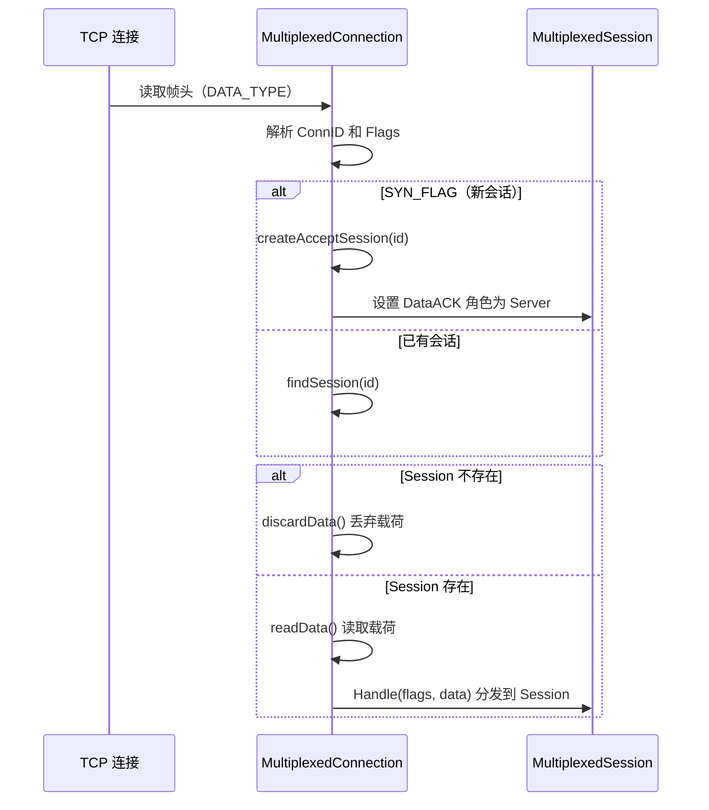
```mermaid
sequenceDiagram
    participant TCP as TCP 连接
    participant Conn as MultiplexedConnection
    participant Session as MultiplexedSession

    TCP->>Conn: 读取帧头（DATA_TYPE）
    Conn->>Conn: 解析 ConnID 和 Flags

    alt SYN_FLAG（新会话）
        Conn->>Conn: createAcceptSession(id)
        Conn->>Session: 设置 DataACK 角色为 Server
    else 已有会话
        Conn->>Conn: findSession(id)
    end

    alt Session 不存在
        Conn->>Conn: discardData() 丢弃载荷
    else Session 存在
        Conn->>Conn: readData() 读取载荷
        Conn->>Session: Handle(flags, data) 分发到 Session
    end
```

**核心代码**：`lib/spdy/multiplexed_connection.go:266-299`

```go
// 第 266 行：数据帧处理器
func (c *MultiplexedConnection) handleData(hdr []byte) error {
    id := header(hdr).ConnID()  // 获取会话 ID

    var session *MultiplexedSession
    var err error

    // 第 272 行：如果是 SYN 标志，创建新会话
    if header(hdr).Flags()&SYN_FLAG == SYN_FLAG {
        if session, err = c.createAcceptSession(id); err != nil {
            return err
        }
        session.dataAck.SetRole(RoleServer)  // 服务端角色
    } else {
        // 第 278 行：查找已有会话
        session = c.findSession(id)
    }

    // 第 281 行：会话不存在，丢弃载荷
    if session == nil {
        if err = c.discardData(hdr); err != nil {
            return err
        }
        return nil
    }

    // 第 288 行：读取载荷数据
    data, err := c.readData(hdr)
    if err != nil {
        return err
    }

    // 第 294 行：交给 Session 处理
    if err := session.Handle(header(hdr).Flags(), data); err != nil {
        return err
    }

    return nil
}
```

**逐行解释**：
- **第 272 行**：`SYN_FLAG` 表示新会话请求，服务端创建 `MultiplexedSession`
- **第 278 行**：非 SYN 帧，根据 ConnID 查找已有会话
- **第 281 行**：会话不存在（可能已关闭），丢弃载荷避免数据泄漏
- **第 294 行**：将帧交给 Session 的状态机处理

### 3.6 写入 — Write（原子性保证）

**核心代码**：`lib/spdy/multiplexed_connection.go:383-423`

```go
// 第 383 行：写入帧（线程安全）
func (c *MultiplexedConnection) Write(hdr []byte, data []byte) error {
    c.outputGuard.Lock()           // 加锁，保证原子性
    defer func() {
        c.outputGuard.Unlock()     // 解锁
        c.FreeData(data)           // 归还缓冲区到池
    }()

    // 第 390 行：设置写超时
    if err := c.setWriteDeadline(); err != nil {
        return err
    }

    // 第 394 行：写入帧头（16 字节）
    n, err := c.output.Write(hdr)
    if err != nil {
        HandleError(c.close())
        return err
    }
    if n != HEADER_SIZE {
        HandleError(c.close())
        return errno.NewError(errno.InvalidHeaderSize, HEADER_SIZE, n)
    }

    // 第 405 行：写入载荷
    n, err = c.output.Write(data)
    if err != nil {
        HandleError(c.close())
        return err
    }
    if n != len(data) {
        HandleError(c.close())
        return errno.NewError(errno.InvalidDataSize, len(data), n)
    }

    // 第 416 行：刷新缓冲区到 TCP 连接
    err = c.output.Flush()
    if err != nil {
        HandleError(c.close())
        return err
    }

    return nil
}
```

**逐行解释**：
- **第 384 行**：`outputGuard.Lock()` 保证帧头+载荷的写入是原子的
- **第 394 行**：先写帧头，再写载荷，最后 Flush
- **第 416 行**：`Flush()` 将缓冲区数据发送到 TCP 连接
- 任何写入错误都会触发 `close()`，防止半关闭状态

**关键设计**：帧头+载荷在同一个锁内写入，保证了多个 Session 并发写入时不会出现帧交错。

### 3.7 打开会话 — OpenSession

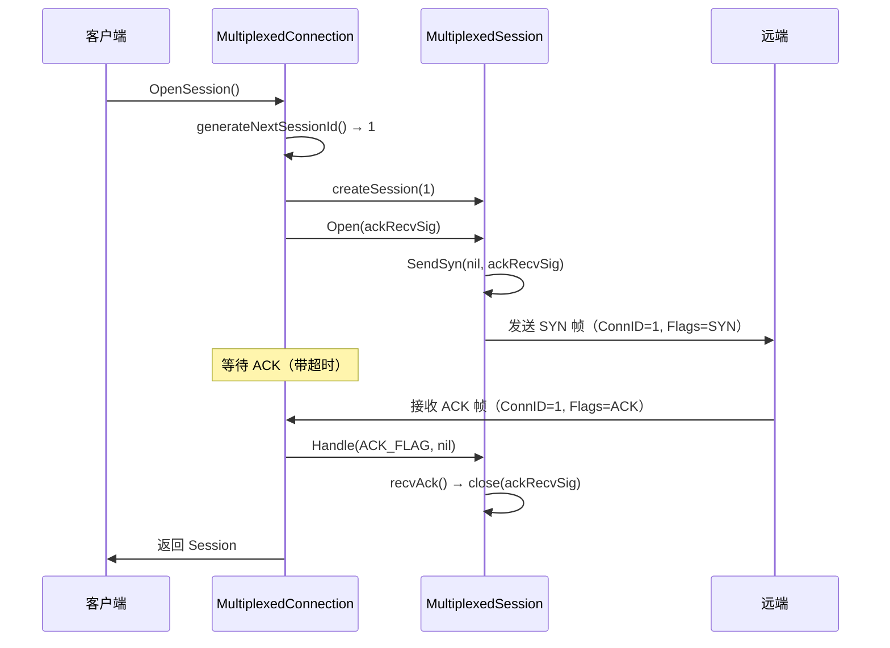
```mermaid
sequenceDiagram
    participant Client as 客户端
    participant Conn as MultiplexedConnection
    participant Session as MultiplexedSession
    participant Remote as 远端

    Client->>Conn: OpenSession()
    Conn->>Conn: generateNextSessionId() → 1
    Conn->>Session: createSession(1)
    Conn->>Session: Open(ackRecvSig)
    Session->>Session: SendSyn(nil, ackRecvSig)
    Session->>Remote: 发送 SYN 帧（ConnID=1, Flags=SYN）

    Note over Conn: 等待 ACK（带超时）

    Remote->>Conn: 接收 ACK 帧（ConnID=1, Flags=ACK）
    Conn->>Session: Handle(ACK_FLAG, nil)
    Session->>Session: recvAck() → close(ackRecvSig)

    Conn->>Client: 返回 Session
```

**核心代码**：`lib/spdy/multiplexed_connection.go:436-466`

```go
// 第 436 行：打开会话（返回 Future 函数）
func (c *MultiplexedConnection) OpenSession() func() (*MultiplexedSession, error) {
    return MultiplexedSessionFuture(c.openSession)
}

// 第 440 行：实际的打开会话逻辑
func (c *MultiplexedConnection) openSession() (session *MultiplexedSession, err error) {
    id := c.generateNextSessionId()  // 原子递增生成会话 ID
    if session, err = c.createSession(id); err != nil {
        return nil, err
    }

    timer := timerPool.GetTimer(c.openTimeout)  // 获取定时器
    defer timerPool.PutTimer(timer)              // 归还定时器

    ackRecvSig := make(chan struct{}, 1)
    if err := session.Open(ackRecvSig); err != nil {  // 发送 SYN
        c.deleteSession(session)
        return nil, err
    }

    // 第 455 行：等待 ACK（三选一）
    select {
    case <-ackRecvSig:           // 收到 ACK，成功
    case <-c.closed:             // 连接关闭
        return nil, errno.NewError(errno.ConnectionClosed)
    case <-timer.C:              // 超时
        c.deleteSession(session)
        return nil, errno.NewError(errno.OpenSessionTimeout)
    }

    session.dataAck.SetRole(RoleClient)  // 客户端角色
    return session, nil
}
```

**逐行解释**：
- **第 441 行**：`generateNextSessionId` 使用 CAS 原子操作递增，客户端生成奇数 ID
- **第 450 行**：`session.Open` 发送 SYN 帧到远端
- **第 455 行**：`select` 等待三个信号之一：ACK 到达、连接关闭、超时
- **第 464 行**：设置 DataACK 角色为客户端

### 3.8 接受会话 — AcceptSession

**核心代码**：`lib/spdy/multiplexed_connection.go:468-479`

```go
// 第 468 行：接受会话（返回 Future 函数）
func (c *MultiplexedConnection) AcceptSession() func() (*MultiplexedSession, error) {
    return MultiplexedSessionFuture(c.acceptSession)
}

// 第 472 行：实际的接受会话逻辑
func (c *MultiplexedConnection) acceptSession() (*MultiplexedSession, error) {
    select {
    case session := <-c.accept:  // 从 accept 通道获取新会话
        return session, nil
    case <-c.closed:             // 连接关闭
        return nil, errno.NewError(errno.ConnectionClosed)
    }
}
```

**逐行解释**：
- 服务端通过 `accept` 通道接收新会话
- 当 `handleData` 检测到 `SYN_FLAG` 时，会创建会话并放入 `accept` 通道
- `ConcurrentAcceptSession` 控制通道缓冲区大小（默认 4096）

### 3.9 Future 模式

**核心代码**：`lib/spdy/multiplexed_session.go:28-49`

```go
// 第 28 行：Future 模式包装器
func MultiplexedSessionFuture(f func() (*MultiplexedSession, error)) func() (*MultiplexedSession, error) {
    var session *MultiplexedSession
    var err error

    c := make(chan struct{}, 1)
    go func() {
        defer close(c)
        session, err = f()  // 在 goroutine 中执行实际操作
        if err != nil {
            if errno.Equal(err, errno.ConnectionClosed) {
                return
            }
            logger.GetLogger().Error("failed to call future function", zap.Error(err))
        }
    }()

    return func() (*MultiplexedSession, error) {
        <-c            // 阻塞直到操作完成
        return session, err
    }
}
```

**逐行解释**：
- **Future 模式**：异步执行操作，返回一个闭包函数
- 调用闭包函数时阻塞，直到异步操作完成
- 避免阻塞调用线程，提高并发性能

### 3.10 关闭连接

**核心代码**：`lib/spdy/multiplexed_connection.go:481-507`

```go
// 第 481 行：内部关闭（只执行一次）
func (c *MultiplexedConnection) close() error {
    var err error
    c.closeOnce.Do(func() {
        close(c.closed)              // 发送关闭信号
        err = c.underlying.Close()   // 关闭底层 TCP 连接
        c.sessionsGuard.Lock()
        defer c.sessionsGuard.Unlock()

        // 第 489 行：关闭所有会话
        for _, s := range c.sessions {
            s.closeOnly()
        }
    })
    return err
}

// 第 497 行：外部关闭（发送 CLOSE 帧）
func (c *MultiplexedConnection) Close() error {
    if c.IsClosed() {
        return nil
    }
    if err := c.closeRemote(0); err != nil {  // 发送 CLOSE 帧
        c.logger.Error(err.Error(), zap.String("SPDY", "MultiplexedConnection"))
        return err
    }
    return c.close()  // 关闭底层连接
}
```

**逐行解释**：
- **closeOnce.Do**：保证只关闭一次，避免重复关闭
- **closeRemote**：先发送 CLOSE 帧通知对端
- **close**：关闭底层 TCP 连接和所有会话

---

## 4. MultiplexedSession — 会话生命周期

### 4.1 核心结构

```mermaid
classDiagram
    class MultiplexedSession {
        +cfg: config.Spdy
        +conn: *MultiplexedConnection
        +id: uint64
        +sequence: uint64
        +fsm: *FSM
        +recvQueue: chan []byte
        +hdr: header
        +dataAck: *DataACK
        +ackRecvSig: chan struct{}
        +selectTimeout: time.Duration
        +closed: chan struct{}
        +closeOnce: sync.Once
        +onClose: []func()
        +Open(ackSig) error
        +Close() error
        +Send(data) error
        +Select() ([]byte, error)
        +Handle(flags, data) error
    }
```

**核心代码**：`lib/spdy/multiplexed_session.go:51-67`

```go
// 第 51 行：MultiplexedSession 结构体
type MultiplexedSession struct {
    cfg       config.Spdy              // 配置
    conn      *MultiplexedConnection   // 所属连接
    id        uint64                   // 会话 ID
    sequence  uint64                   // 序列号（用于 RPC 消息匹配）
    fsm       *FSM                     // 有限状态机
    recvQueue chan []byte               // 接收队列（带缓冲）
    hdr       header                   // 帧头缓冲区（复用）

    dataAck       *DataACK             // 数据确认机制（流控）
    ackRecvSig    chan struct{}         // ACK 接收信号
    selectTimeout time.Duration        // Select 超时时间

    closed    chan struct{}             // 关闭信号
    closeOnce sync.Once                // 保证只关闭一次
    onClose   []func()                 // 关闭回调函数列表
}
```

**逐行解释**：
- **recvQueue**：带缓冲的通道，大小为 `RecvWindowSize`（默认 8）
- **dataAck**：基于 ACK 的流控机制，防止发送端淹没接收端
- **ackRecvSig**：用于 SYN-ACK 握手的信号通道
- **onClose**：关闭时触发的回调函数列表

### 4.2 创建会话

**核心代码**：`lib/spdy/multiplexed_session.go:69-90`

```go
// 第 69 行：创建 MultiplexedSession
func NewMultiplexedSession(cfg config.Spdy, conn *MultiplexedConnection, id uint64) *MultiplexedSession {
    session := &MultiplexedSession{
        cfg:           cfg,
        conn:          conn,
        id:            id,
        sequence:      0,
        fsm:           NewFSM(INIT_STATE),           // 初始状态为 INIT
        recvQueue:     make(chan []byte, cfg.RecvWindowSize),  // 缓冲通道
        hdr:           make(header, HEADER_SIZE),     // 复用帧头缓冲区
        ackRecvSig:    nil,
        selectTimeout: cfg.GetSessionSelectTimeout(),  // 默认 300 秒
        closed:        make(chan struct{}),
    }

    // 第 83 行：创建 DataACK 流控机制
    session.dataAck = NewDataACK(func() {
        HandleError(session.SendDataACK(nil))  // 发送 ACK 帧
    }, int64(cfg.RecvWindowSize))
    session.dataAck.SetBlockTimeout(time.Duration(cfg.DataAckTimeout))

    session.initFSM()  // 初始化状态机
    return session
}
```

**逐行解释**：
- **第 75 行**：`NewFSM(INIT_STATE)` 创建初始状态为 INIT 的状态机
- **第 76 行**：`recvQueue` 缓冲区大小为 `RecvWindowSize`（默认 8）
- **第 83 行**：`DataACK` 的回调函数会发送 ACK 帧，`size` 为窗口大小

### 4.3 会话状态机 — initFSM

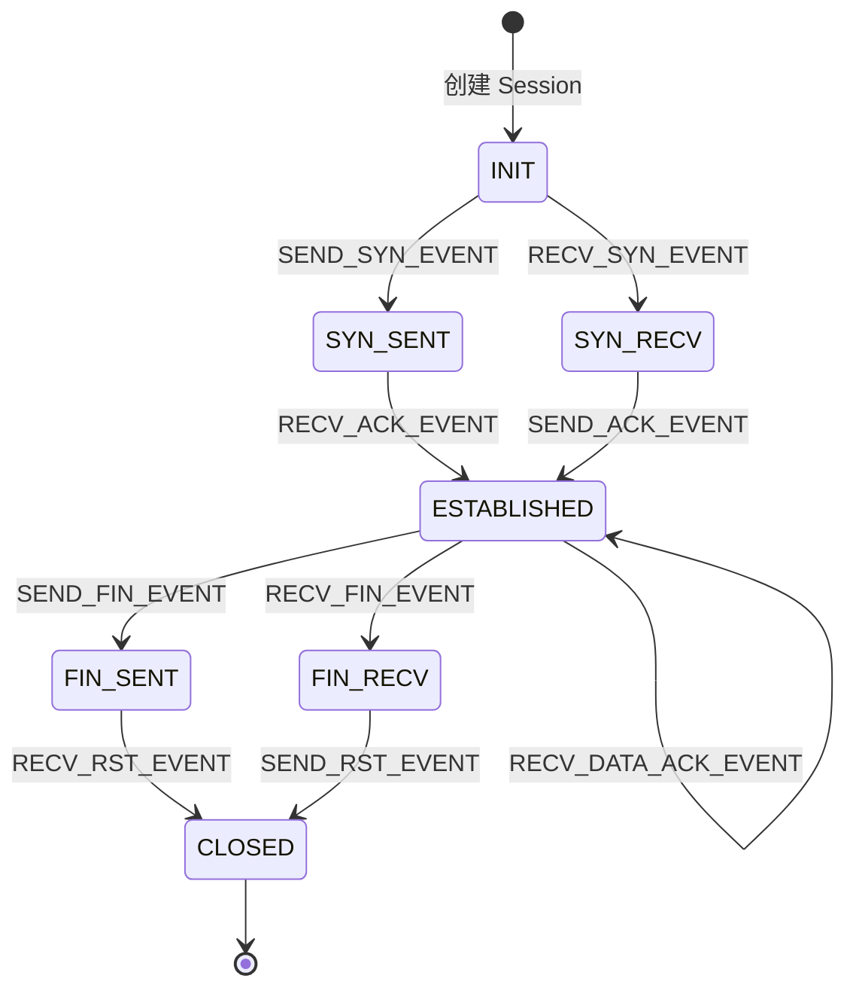
```mermaid
stateDiagram-v2
    [*] --> INIT: 创建 Session
    INIT --> SYN_SENT: SEND_SYN_EVENT
    INIT --> SYN_RECV: RECV_SYN_EVENT
    SYN_SENT --> ESTABLISHED: RECV_ACK_EVENT
    SYN_RECV --> ESTABLISHED: SEND_ACK_EVENT

    ESTABLISHED --> ESTABLISHED: SEND_DATA_EVENT
    ESTABLISHED --> ESTABLISHED: RECV_DATA_EVENT
    ESTABLISHED --> ESTABLISHED: SEND_DATA_ACK_EVENT
    ESTABLISHED --> ESTABLISHED: RECV_DATA_ACK_EVENT
    ESTABLISHED --> FIN_SENT: SEND_FIN_EVENT
    ESTABLISHED --> FIN_RECV: RECV_FIN_EVENT

    FIN_SENT --> CLOSED: RECV_RST_EVENT
    FIN_RECV --> CLOSED: SEND_RST_EVENT

    CLOSED --> [*]
```

**核心代码**：`lib/spdy/multiplexed_session.go:100-168`

```go
// 第 100 行：初始化状态机转换表
func (s *MultiplexedSession) initFSM() {
    // 第 101 行：定义所有状态
    initState     := NewFSMState(INIT_STATE, nil, nil)
    synSentState  := NewFSMState(SYN_SENT_STATE, nil, nil)
    synRecvState  := NewFSMState(SYN_RECV_STATE, nil, nil)
    establishState := NewFSMState(ESTABLISHED_STATE, nil, nil)
    finSentState  := NewFSMState(FIN_SENT_STATE, nil, nil)
    finRecvState  := NewFSMState(FIN_RECV_STATE, nil, nil)
    closedState   := NewFSMState(CLOSED_STATE, s.enterClosed, nil)  // 进入 CLOSED 时触发回调

    // 第 109 行：定义状态转换
    s.fsm.Build(initState,      SEND_SYN_EVENT,  synSentState,   s.sendSyn)
    s.fsm.Build(initState,      RECV_SYN_EVENT,  synRecvState,   s.recvSyn)
    s.fsm.Build(synRecvState,   SEND_ACK_EVENT,  establishState, s.sendAck)
    s.fsm.Build(synSentState,   RECV_ACK_EVENT,  establishState, s.recvAck)

    // 第 129 行：数据传输（ESTABLISHED → ESTABLISHED）
    s.fsm.Build(establishState, SEND_DATA_EVENT, establishState, s.sendData)
    s.fsm.Build(establishState, RECV_DATA_EVENT, establishState, s.recvData)

    // 第 139 行：数据确认（流控）
    s.fsm.Build(establishState, SEND_DATA_ACK_EVENT, establishState, s.sendDataACK)
    s.fsm.Build(establishState, RECV_DATA_ACK_EVENT, establishState, s.recvDataACK)

    // 第 149 行：关闭连接
    s.fsm.Build(establishState, SEND_FIN_EVENT, finSentState, s.sendFin)
    s.fsm.Build(establishState, RECV_FIN_EVENT, finRecvState, s.recvFin)
    s.fsm.Build(finRecvState,   SEND_RST_EVENT, closedState, s.sendRst)
    s.fsm.Build(finSentState,   RECV_RST_EVENT, closedState, s.recvRst)
}
```

**逐行解释**：
- 每个 `Build` 调用定义一条转换规则：`(当前状态, 事件) → (下一状态, 动作)`
- `enterClosed` 是 CLOSED 状态的进入动作，会清理会话资源
- 数据传输事件（SEND/RECV_DATA）不改变状态，保持在 ESTABLISHED

### 4.4 帧处理 — Handle

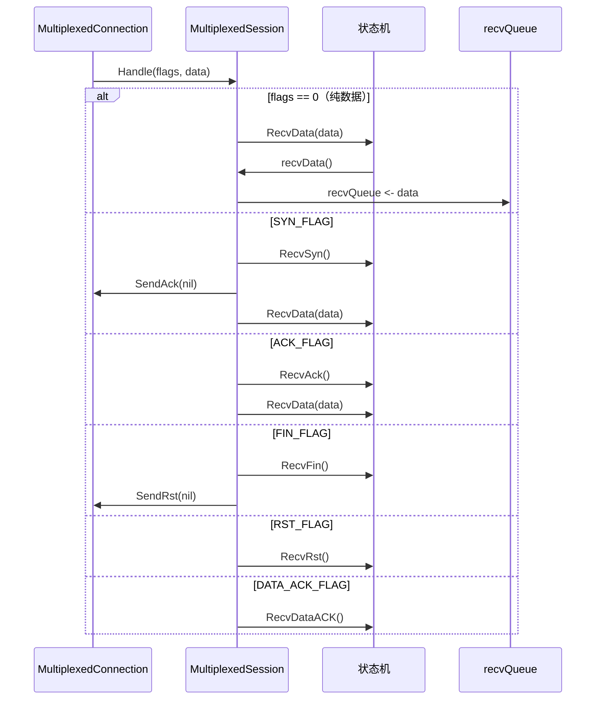
```mermaid
sequenceDiagram
    participant Conn as MultiplexedConnection
    participant Session as MultiplexedSession
    participant FSM as 状态机
    participant Queue as recvQueue

    Conn->>Session: Handle(flags, data)

    alt flags == 0（纯数据）
        Session->>FSM: RecvData(data)
        FSM->>Session: recvData()
        Session->>Queue: recvQueue <- data
    else SYN_FLAG
        Session->>FSM: RecvSyn()
        Session->>Conn: SendAck(nil)
        Session->>FSM: RecvData(data)
    else ACK_FLAG
        Session->>FSM: RecvAck()
        Session->>FSM: RecvData(data)
    else FIN_FLAG
        Session->>FSM: RecvFin()
        Session->>Conn: SendRst(nil)
    else RST_FLAG
        Session->>FSM: RecvRst()
    else DATA_ACK_FLAG
        Session->>FSM: RecvDataACK()
    end
```

**核心代码**：`lib/spdy/multiplexed_session.go:206-266`

```go
// 第 206 行：帧处理入口
func (s *MultiplexedSession) Handle(flags uint16, data []byte) error {
    if err := s.handle(Flags(flags), data); err != nil {
        return s.handleError(err)  // FSMError 会触发会话关闭
    }
    return nil
}

// 第 213 行：帧处理逻辑
func (s *MultiplexedSession) handle(flags Flags, data []byte) error {
    // 第 214 行：flags == 0，纯数据帧
    if flags == 0 {
        if err := s.RecvData(data); err != nil {
            return err
        }
        return nil
    }

    // 第 221 行：SYN 标志（连接建立）
    if flags.has(SYN_FLAG) {
        if err := s.RecvSyn(); err != nil { return err }
        if err := s.SendAck(nil); err != nil { return err }
        if err := s.RecvData(data); err != nil { return err }
        return nil
    }

    // 第 234 行：ACK 标志（连接确认）
    if flags.has(ACK_FLAG) {
        if err := s.RecvAck(); err != nil { return err }
        if err := s.RecvData(data); err != nil { return err }
        return nil
    }

    // 第 244 行：FIN 标志（关闭请求）
    if flags.has(FIN_FLAG) {
        if err := s.RecvFin(); err != nil { return err }
        if err := s.SendRst(nil); err != nil { return err }
        return nil
    }

    // 第 254 行：RST 标志（重置）
    if flags.has(RST_FLAG) {
        if err := s.RecvRst(); err != nil { return err }
        return nil
    }

    // 第 261 行：DATA_ACK 标志（数据确认）
    if flags.has(DATA_ACK_FLAG) {
        return s.RecvDataACK()
    }

    return errno.NewError(errno.UnsupportedFlags, flags)
}
```

**逐行解释**：
- **第 214 行**：`flags == 0` 表示纯数据帧（ESTABLISHED 状态下的正常数据传输）
- **第 221 行**：`SYN_FLAG` 表示新会话请求，需要回复 ACK
- **第 234 行**：`ACK_FLAG` 表示连接确认，可能携带初始数据
- **第 244 行**：`FIN_FLAG` 表示关闭请求，回复 RST 完成四次挥手
- **第 261 行**：`DATA_ACK_FLAG` 表示数据确认，用于流控

### 4.5 发送数据 — Send

**核心代码**：`lib/spdy/multiplexed_session.go:344-360`

```go
// 第 344 行：发送数据
func (s *MultiplexedSession) Send(data []byte) error {
    // 第 345 行：流控检查（可能阻塞）
    if err := s.dataAck.Block(); err != nil {
        return err
    }

    // 第 349 行：通过状态机发送
    if err := s.fsm.ProcessEvent(SEND_DATA_EVENT, data); err != nil {
        return err
    }
    return nil
}

// 第 355 行：状态机动作 — 发送数据
func (s *MultiplexedSession) sendData(event event, transition *FSMTransition, data []byte) error {
    if err := s.sendDataInternal(0, data); err != nil {  // flags=0（纯数据）
        return err
    }
    return nil
}

// 第 268 行：内部发送（编码帧头+写入连接）
func (s *MultiplexedSession) sendDataInternal(flags uint16, data []byte) error {
    s.hdr.encode(DATA_TYPE, flags, s.id, uint32(len(data)))  // 编码帧头
    if err := s.conn.Write(s.hdr, data); err != nil {        // 写入连接
        return err
    }
    return nil
}
```

**逐行解释**：
- **第 345 行**：`dataAck.Block()` 检查流控窗口，如果窗口已满则阻塞
- **第 349 行**：通过状态机确保只在 ESTABLISHED 状态下发送
- **第 268 行**：`sendDataInternal` 编码帧头并写入连接

### 4.6 接收数据 — Select

**核心代码**：`lib/spdy/multiplexed_session.go:182-195`

```go
// 第 182 行：从会话接收数据（阻塞式）
func (s *MultiplexedSession) Select() ([]byte, error) {
    timer := timerPool.GetTimer(s.selectTimeout)  // 获取定时器
    defer timerPool.PutTimer(timer)                // 归还定时器

    select {
    case data := <-s.recvQueue:    // 从接收队列获取数据
        s.dataAck.Dispatch()       // 触发流控计数
        return data, nil
    case <-s.closed:               // 会话已关闭
        return nil, errno.NewError(errno.SelectClosedConn, s.conn.RemoteAddr(), s.conn.LocalAddr())
    case <-timer.C:                // 超时
        return nil, errno.NewError(errno.SessionSelectTimeout, s.selectTimeout, s.conn.RemoteAddr(), s.conn.LocalAddr())
    }
}
```

**逐行解释**：
- **第 186 行**：从 `recvQueue` 通道接收数据，如果队列为空则阻塞
- **第 188 行**：`dataAck.Dispatch()` 增加计数器，达到窗口大小时发送 ACK
- **第 191 行**：超时时间由 `SessionSelectTimeout` 控制（默认 300 秒）

### 4.7 会话关闭

**核心代码**：`lib/spdy/multiplexed_session.go:469-490`

```go
// 第 469 行：关闭会话（发送 FIN）
func (s *MultiplexedSession) Close() error {
    if err := s.SendFin(nil); err != nil {  // 发送 FIN 帧
        return err
    }
    s.close()  // 清理资源
    return nil
}

// 第 477 行：内部关闭
func (s *MultiplexedSession) close() {
    s.conn.deleteSession(s)  // 从连接的会话表中删除
    s.closeOnly()            // 关闭通道和回调
    s.fsm.Close()            // 关闭状态机
}

// 第 483 行：只关闭资源（不发送帧）
func (s *MultiplexedSession) closeOnly() {
    s.closeOnce.Do(func() {
        s.TriggerOnClose()    // 触发关闭回调
        close(s.closed)       // 发送关闭信号
        s.dataAck.Close()     // 关闭流控
        s.onClose = nil       // 清空回调列表
    })
}
```

**逐行解释**：
- **第 470 行**：`SendFin` 发送 FIN 帧通知对端
- **第 478 行**：从连接的会话表中删除，避免内存泄漏
- **第 483 行**：`closeOnce.Do` 保证只关闭一次

---

## 5. FSM — 有限状态机

### 5.1 核心结构

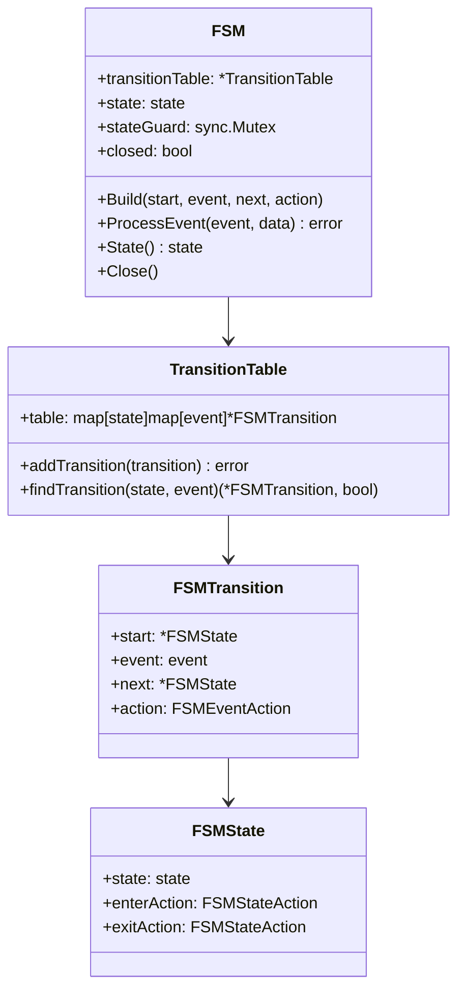
```mermaid
classDiagram
    class FSM {
        +transitionTable: *TransitionTable
        +state: state
        +stateGuard: sync.Mutex
        +closed: bool
        +Build(start, event, next, action)
        +ProcessEvent(event, data) error
        +State() state
        +Close()
    }

    class TransitionTable {
        +table: map[state]map[event]*FSMTransition
        +addTransition(transition) error
        +findTransition(state, event) (*FSMTransition, bool)
    }

    class FSMTransition {
        +start: *FSMState
        +event: event
        +next: *FSMState
        +action: FSMEventAction
    }

    class FSMState {
        +state: state
        +enterAction: FSMStateAction
        +exitAction: FSMStateAction
    }

    FSM --> TransitionTable
    TransitionTable --> FSMTransition
    FSMTransition --> FSMState
```

**核心代码**：`lib/spdy/fsm.go:24-53`

```go
// 第 24 行：事件类型定义
type event int

const (
    SEND_SYN_EVENT      event = iota  // 0: 发送 SYN
    RECV_SYN_EVENT                     // 1: 接收 SYN
    SEND_ACK_EVENT                     // 2: 发送 ACK
    RECV_ACK_EVENT                     // 3: 接收 ACK
    SEND_DATA_EVENT                    // 4: 发送数据
    RECV_DATA_EVENT                    // 5: 接收数据
    SEND_FIN_EVENT                     // 6: 发送 FIN
    RECV_FIN_EVENT                     // 7: 接收 FIN
    SEND_RST_EVENT                     // 8: 发送 RST
    RECV_RST_EVENT                     // 9: 接收 RST
    SEND_DATA_ACK_EVENT                // 10: 发送数据 ACK
    RECV_DATA_ACK_EVENT                // 11: 接收数据 ACK
    UNKNOWN_EVENT                      // 12: 未知事件（哨兵值）
)

// 第 42 行：状态类型定义
type state int

const (
    INIT_STATE       state = iota  // 0: 初始状态
    SYN_SENT_STATE                  // 1: SYN 已发送
    SYN_RECV_STATE                  // 2: SYN 已接收
    ESTABLISHED_STATE               // 3: 已建立连接
    FIN_SENT_STATE                  // 4: FIN 已发送
    FIN_RECV_STATE                  // 5: FIN 已接收
    CLOSED_STATE                    // 6: 已关闭
    UNKNOWN_STATE                   // 7: 未知状态（哨兵值）
)
```

**逐行解释**：
- **事件**：12 种事件，覆盖连接建立、数据传输、连接关闭的完整生命周期
- **状态**：7 种状态，类似 TCP 的状态机设计

### 5.2 状态转换表

**核心代码**：`lib/spdy/fsm.go:112-145`

```go
// 第 112 行：状态转换表
type TransitionTable struct {
    table map[state]map[event]*FSMTransition  // 二维映射：状态 → 事件 → 转换
}

// 第 123 行：添加转换规则
func (t *TransitionTable) addTransition(transition *FSMTransition) error {
    eventTable, ok := t.table[transition.start.State()]
    if !ok {
        eventTable = make(map[event]*FSMTransition)
        t.table[transition.start.State()] = eventTable
    }

    // 第 130 行：检查重复转换
    if _, ok := eventTable[transition.event]; ok {
        return errno.NewError(errno.DuplicateEvent, transition.start.State(), transition.event, transition.next.State())
    }

    eventTable[transition.event] = transition
    return nil
}

// 第 138 行：查找转换规则
func (t *TransitionTable) findTransition(state state, event event) (*FSMTransition, bool) {
    eventTable, ok := t.table[state]
    if !ok {
        return nil, ok
    }
    transition, ok := eventTable[event]
    return transition, ok
}
```

**逐行解释**：
- **二维映射**：`state → event → transition`，O(1) 查找
- **重复检查**：同一状态+事件只能有一条转换规则

### 5.3 事件处理 — ProcessEvent

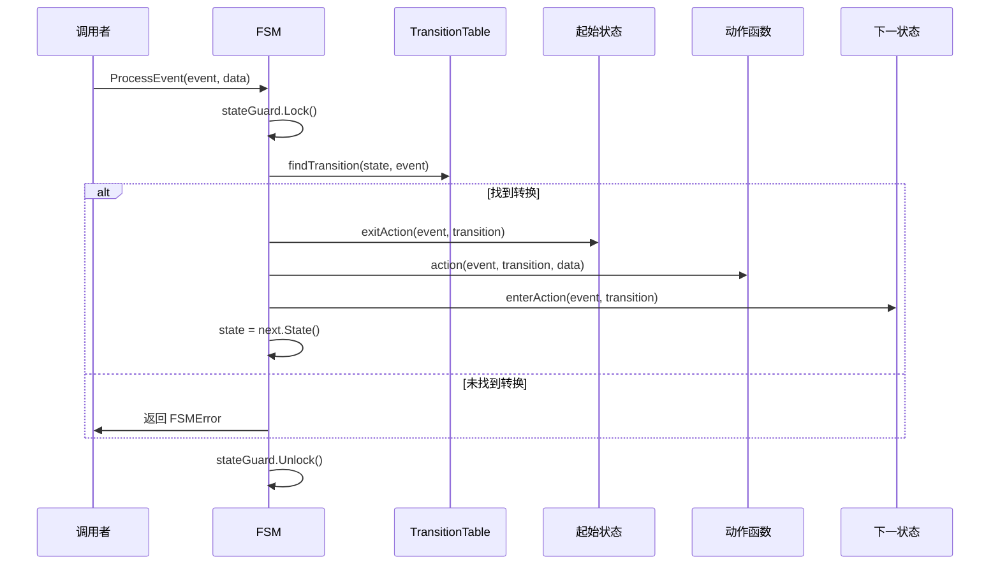
```mermaid
sequenceDiagram
    participant Caller as 调用者
    participant FSM as FSM
    participant Table as TransitionTable
    participant Start as 起始状态
    participant Action as 动作函数
    participant Next as 下一状态

    Caller->>FSM: ProcessEvent(event, data)
    FSM->>FSM: stateGuard.Lock()
    FSM->>Table: findTransition(state, event)

    alt 找到转换
        FSM->>Start: exitAction(event, transition)
        FSM->>Action: action(event, transition, data)
        FSM->>Next: enterAction(event, transition)
        FSM->>FSM: state = next.State()
    else 未找到转换
        FSM->>Caller: 返回 FSMError
    end

    FSM->>FSM: stateGuard.Unlock()
```

**核心代码**：`lib/spdy/fsm.go:170-202`

```go
// 第 170 行：处理事件
func (fsm *FSM) ProcessEvent(event event, data []byte) error {
    fsm.stateGuard.Lock()          // 加锁，保证线程安全
    defer fsm.stateGuard.Unlock()

    if fsm.closed {
        return fmt.Errorf("session closed")
    }

    // 第 178 行：查找转换规则
    transition, ok := fsm.transitionTable.findTransition(fsm.state, event)
    if !ok {
        return NewFSMError(event, fsm.state)  // 无效转换
    }

    // 第 183 行：执行起始状态的退出动作
    if transition.start.exitAction != nil {
        err := transition.start.exitAction(event, transition)
        if err != nil {
            return err
        }
    }

    // 第 190 行：执行转换动作
    err := transition.action(event, transition, data)

    // 第 192 行：执行下一状态的进入动作
    if transition.next.enterAction != nil {
        err := transition.next.enterAction(event, transition)
        if err != nil {
            return err
        }
    }

    // 第 199 行：更新当前状态
    fsm.state = transition.next.State()

    return err
}
```

**逐行解释**：
- **第 171 行**：`stateGuard.Lock()` 保证状态转换的原子性
- **第 178 行**：查找 `(当前状态, 事件)` 对应的转换规则
- **第 183 行**：执行退出动作（如清理资源）
- **第 190 行**：执行转换动作（如发送帧）
- **第 199 行**：更新当前状态

---

## 6. DataACK — 流控机制

### 6.1 设计原理

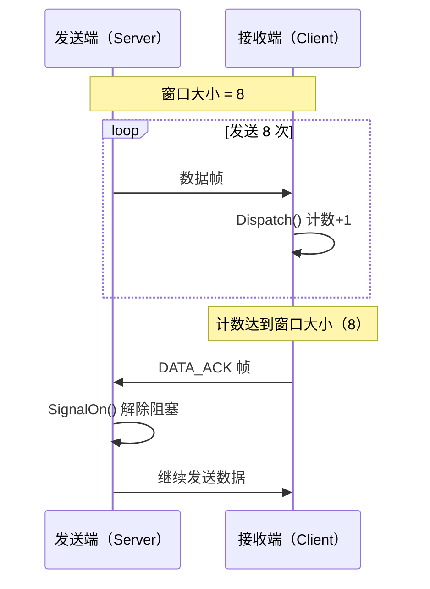
```mermaid
sequenceDiagram
    participant Sender as 发送端（Server）
    participant Receiver as 接收端（Client）

    Note over Sender,Receiver: 窗口大小 = 8

    loop 发送 8 次
        Sender->>Receiver: 数据帧
        Receiver->>Receiver: Dispatch() 计数+1
    end

    Note over Receiver: 计数达到窗口大小（8）
    Receiver->>Sender: DATA_ACK 帧

    Sender->>Sender: SignalOn() 解除阻塞
    Sender->>Receiver: 继续发送数据
```

**通俗解释**：
- **问题**：发送端发送太快，接收端处理不过来，导致数据积压
- **解决方案**：基于窗口的流控机制
  - 发送端每发送 `size`（窗口大小）个数据帧后，阻塞等待 ACK
  - 接收端每接收 `size` 个数据帧后，发送一个 ACK 帧
  - 发送端收到 ACK 后，解除阻塞继续发送

**核心代码**：`lib/spdy/data_ack.go:33-41`

```go
// 第 33 行：DataACK 结构体
type DataACK struct {
    role         SessionRole    // 角色（客户端/服务端）
    enable       bool           // 是否启用
    size         int64          // 窗口大小
    incr         int64          // 计数器
    signal       chan struct{}   // ACK 信号通道
    handler      func()         // 发送 ACK 的回调函数
    blockTimeout time.Duration  // 阻塞超时时间
}
```

### 6.2 客户端：接收数据并发送 ACK — Dispatch

**核心代码**：`lib/spdy/data_ack.go:84-93`

```go
// 第 84 行：分发计数（客户端调用）
func (a *DataACK) Dispatch() {
    if !a.enable || a.role == RoleServer {
        return  // 服务端不发送 ACK
    }

    a.incr++
    if a.incr%a.size == 0 && a.handler != nil {
        go a.handler()  // 达到窗口大小，异步发送 ACK
    }
}
```

**逐行解释**：
- **第 85 行**：只有启用且是客户端角色时才发送 ACK
- **第 90 行**：每接收 `size` 个数据帧，触发一次 ACK 发送
- **第 91 行**：`go a.handler()` 异步发送，不阻塞接收循环

### 6.3 服务端：发送数据前检查窗口 — Block

**核心代码**：`lib/spdy/data_ack.go:106-125`

```go
// 第 106 行：阻塞检查（服务端调用）
func (a *DataACK) Block() error {
    if a.role == RoleClient || !a.enable {
        return nil  // 客户端不阻塞
    }
    defer func() {
        a.incr++  // 发送成功后计数+1
    }()

    // 第 114 行：如果计数为 0 或未达到窗口大小，不阻塞
    if a.incr == 0 || a.incr%a.size != 0 {
        return nil
    }

    // 第 118 行：阻塞等待 ACK（带超时）
    tm := time.NewTimer(a.blockTimeout)
    select {
    case <-a.signal:    // 收到 ACK
    case <-tm.C:        // 超时
        return errno.NewError(errno.DataACKTimeout)
    }
    return nil
}
```

**逐行解释**：
- **第 107 行**：只有服务端角色才阻塞
- **第 114 行**：`incr%a.size != 0` 表示还没达到窗口大小，继续发送
- **第 118 行**：`a.signal` 通道被 `SignalOn()` 填充时解除阻塞

### 6.4 接收 ACK — SignalOn

**核心代码**：`lib/spdy/data_ack.go:95-104`

```go
// 第 95 行：接收到 ACK 信号
func (a *DataACK) SignalOn() {
    if !a.enable {
        return
    }
    defer func() {
        _ = recover()  // 防止 channel 已关闭的 panic
    }()

    a.signal <- struct{}{}  // 发送信号，解除 Block()
}
```

**逐行解释**：
- 当接收到 `DATA_ACK_FLAG` 帧时，调用此方法
- 向 `signal` 通道发送信号，解除 `Block()` 中的阻塞

### 6.5 启用/禁用

**核心代码**：`lib/spdy/data_ack.go:63-76`

```go
// 第 63 行：启用 DataACK
func (a *DataACK) Enable() {
    if a.enable {
        return
    }

    a.closeSignal()           // 关闭旧的信号通道
    a.signal = make(chan struct{})  // 创建新的信号通道
    a.incr = 0                // 重置计数器
    a.enable = true
}

// 第 74 行：禁用 DataACK
func (a *DataACK) Disable() {
    a.enable = false
}
```

**逐行解释**：
- `Enable()` 重置计数器和信号通道，启用流控
- `Disable()` 只设置标志位，不清理资源
- 在 `SessionPool.Put()` 时调用 `Disable()`，因为归还的会话不需要流控

---

## 7. SessionPool — 连接池

### 7.1 核心结构

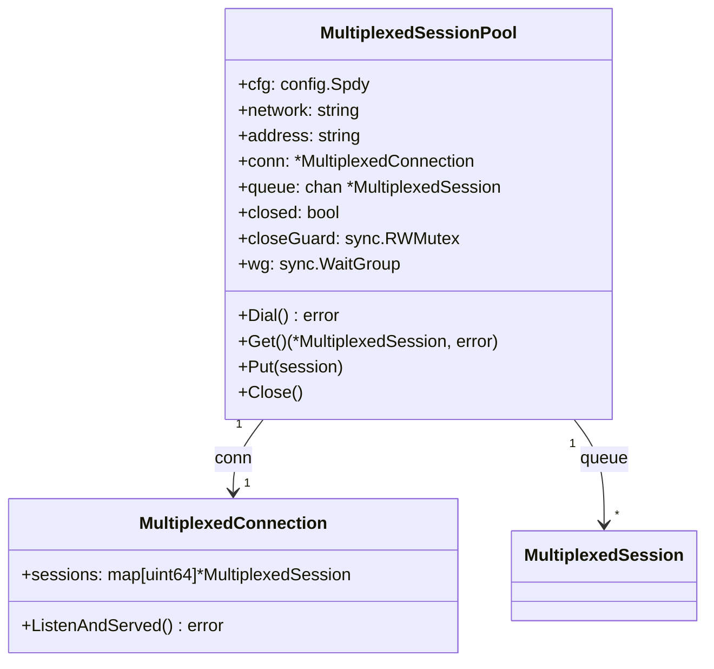
```mermaid
classDiagram
    class MultiplexedSessionPool {
        +cfg: config.Spdy
        +network: string
        +address: string
        +conn: *MultiplexedConnection
        +queue: chan *MultiplexedSession
        +closed: bool
        +closeGuard: sync.RWMutex
        +wg: sync.WaitGroup
        +Dial() error
        +Get() (*MultiplexedSession, error)
        +Put(session)
        +Close()
    }

    class MultiplexedConnection {
        +sessions: map[uint64]*MultiplexedSession
        +ListenAndServed() error
    }

    MultiplexedSessionPool "1" --> "1" MultiplexedConnection : conn
    MultiplexedSessionPool "1" --> "*" MultiplexedSession : queue
```

**核心代码**：`lib/spdy/multiplexed_session_pool.go:30-47`

```go
// 第 30 行：连接池结构体
type MultiplexedSessionPool struct {
    cfg       config.Spdy   // 配置
    network   string        // 网络类型（"tcp"）
    address   string        // 地址（"host:port"）
    mspLogger *logger.Logger

    conn  *MultiplexedConnection      // 底层多路复用连接
    queue chan *MultiplexedSession     // 会话复用队列

    closed     bool           // 是否已关闭
    closeGuard sync.RWMutex   // 关闭锁

    wg sync.WaitGroup         // 等待组

    successJob *statistics.SpdyJob  // 统计：成功创建会话
    failedJob  *statistics.SpdyJob  // 统计：失败创建会话
    closeJob   *statistics.SpdyJob  // 统计：关闭会话
}
```

### 7.2 建立连接 — Dial

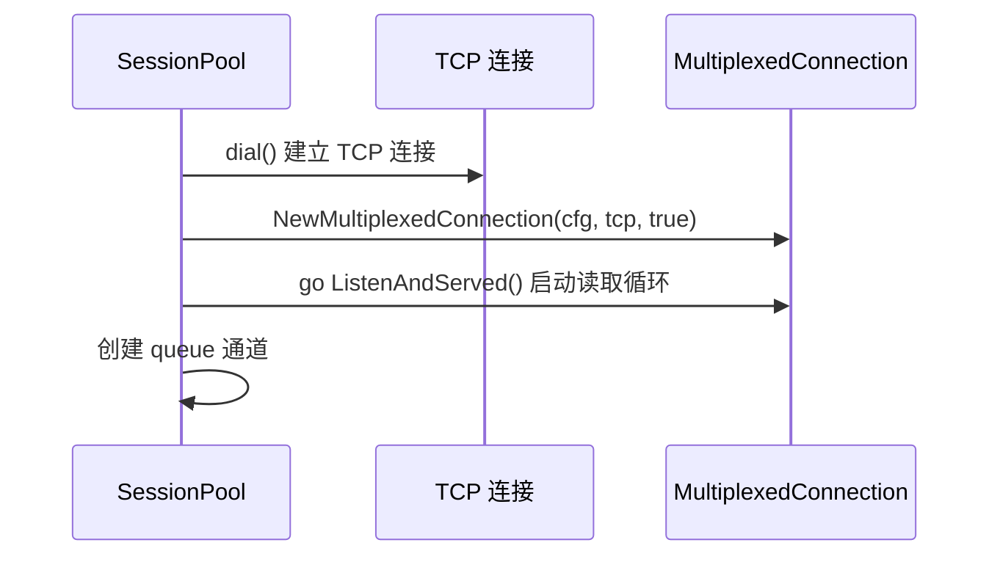
```mermaid
sequenceDiagram
    participant Pool as SessionPool
    participant TCP as TCP 连接
    participant Conn as MultiplexedConnection

    Pool->>TCP: dial() 建立 TCP 连接
    Pool->>Conn: NewMultiplexedConnection(cfg, tcp, true)
    Pool->>Conn: go ListenAndServed() 启动读取循环
    Pool->>Pool: 创建 queue 通道
```

**核心代码**：`lib/spdy/multiplexed_session_pool.go:74-90`

```go
// 第 74 行：建立连接
func (c *MultiplexedSessionPool) Dial() error {
    conn, err := c.dail()  // 建立 TCP 连接
    if err != nil {
        return err
    }

    c.wg.Add(1)
    c.conn = NewMultiplexedConnection(c.cfg, conn, true)  // 创建多路复用连接
    go func() {
        if err := c.conn.ListenAndServed(); err != nil {  // 启动读取循环
            c.mspLogger.Warn(err.Error(), zap.String("SPDY", "MultiplexedSessionPool"))
        }
    }()

    c.queue = make(chan *MultiplexedSession, c.cfg.ConcurrentAcceptSession+1)  // 会话队列
    return nil
}
```

**逐行解释**：
- **第 76 行**：`dail()` 建立 TCP 连接，支持 TLS
- **第 81 行**：`NewMultiplexedConnection` 创建客户端连接（`client=true`）
- **第 82 行**：`ListenAndServed` 在 goroutine 中运行，持续读取远端数据
- **第 88 行**：`queue` 通道缓冲区大小为 `ConcurrentAcceptSession+1`

### 7.3 获取会话 — Get

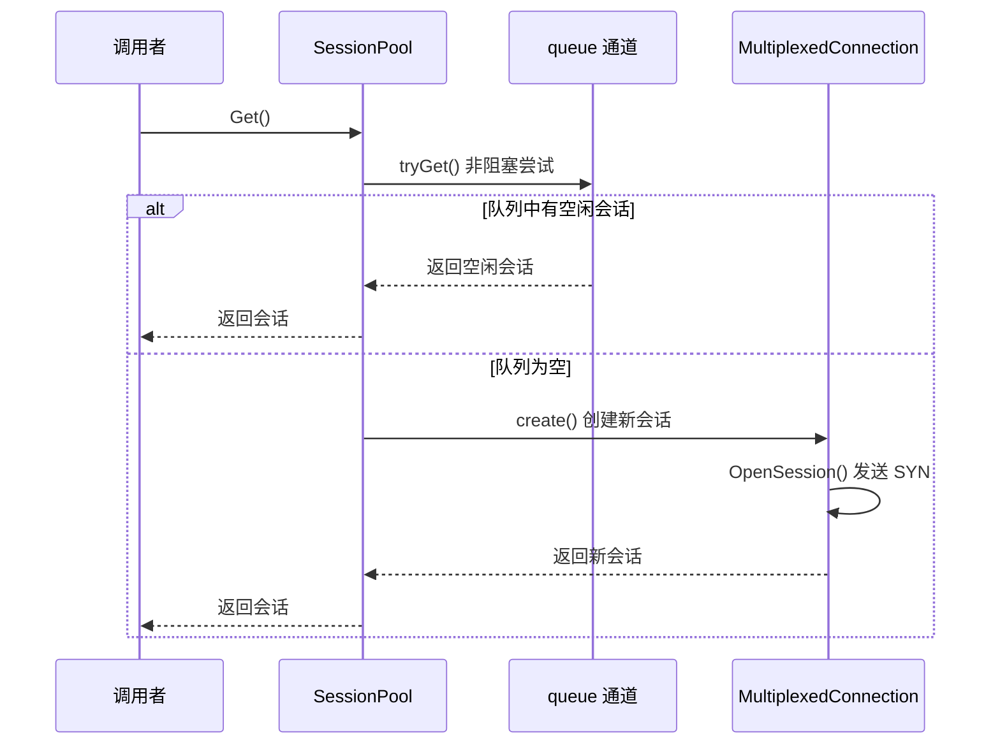
```mermaid
sequenceDiagram
    participant Caller as 调用者
    participant Pool as SessionPool
    participant Queue as queue 通道
    participant Conn as MultiplexedConnection

    Caller->>Pool: Get()
    Pool->>Queue: tryGet() 非阻塞尝试

    alt 队列中有空闲会话
        Queue-->>Pool: 返回空闲会话
        Pool-->>Caller: 返回会话
    else 队列为空
        Pool->>Conn: create() 创建新会话
        Conn->>Conn: OpenSession() 发送 SYN
        Conn-->>Pool: 返回新会话
        Pool-->>Caller: 返回会话
    end
```

**核心代码**：`lib/spdy/multiplexed_session_pool.go:107-123`

```go
// 第 107 行：获取会话
func (c *MultiplexedSessionPool) Get() (*MultiplexedSession, error) {
    session, err := c.tryGet()  // 非阻塞尝试获取

    if err != nil {
        return nil, err
    }

    if session == nil {
        session, err = c.create()  // 创建新会话
        if err != nil {
            return nil, err
        }
        return session, nil
    }

    return session, nil
}

// 第 125 行：非阻塞尝试获取
func (c *MultiplexedSessionPool) tryGet() (*MultiplexedSession, error) {
    select {
    case conn, ok := <-c.queue:
        if !ok {
            return nil, errno.NewError(errno.PoolClosed)
        }
        return conn, nil
    default:
        return nil, nil  // 队列为空
    }
}
```

**逐行解释**：
- **第 109 行**：`tryGet()` 非阻塞，如果队列中有空闲会话则直接返回
- **第 118 行**：队列为空时，调用 `create()` 创建新会话
- **第 125 行**：`select` 的 `default` 分支保证非阻塞

### 7.4 归还会话 — Put

**核心代码**：`lib/spdy/multiplexed_session_pool.go:137-148`

```go
// 第 137 行：归还会话
func (c *MultiplexedSessionPool) Put(session *MultiplexedSession) {
    session.DisableDataACK()  // 禁用流控（归还不需要）
    c.sendToQueue(session)
}

// 第 142 行：发送到队列
func (c *MultiplexedSessionPool) sendToQueue(session *MultiplexedSession) {
    select {
    case c.queue <- session:  // 队列未满，放入
    default:
        session.close()       // 队列已满，关闭会话
    }
}
```

**逐行解释**：
- **第 138 行**：`DisableDataACK()` 禁用流控，因为归还的会话不处于活跃传输状态
- **第 145 行**：如果队列已满（`default` 分支），直接关闭会话

### 7.5 创建新会话

**核心代码**：`lib/spdy/multiplexed_session_pool.go:150-163`

```go
// 第 150 行：创建新会话
func (c *MultiplexedSessionPool) create() (*MultiplexedSession, error) {
    feature := c.conn.OpenSession()  // 异步打开会话
    session, err := feature()        // 等待完成
    if err != nil {
        statistics.NewSpdyStatistics().Add(c.failedJob)
        return nil, err
    }

    // 第 158 行：注册关闭回调
    session.SetOnClose(func() {
        statistics.NewSpdyStatistics().Add(c.closeJob)
    })
    statistics.NewSpdyStatistics().Add(c.successJob)
    return session, nil
}
```

**逐行解释**：
- **第 151 行**：`OpenSession()` 返回 Future 函数
- **第 152 行**：调用 Future 函数阻塞等待 SYN-ACK 握手完成
- **第 158 行**：注册关闭回调，用于统计

---

## 8. RRCServer — 服务端

### 8.1 核心结构

```mermaid
classDiagram
    class RRCServer {
        +cfg: config.Spdy
        +network: string
        +address: string
        +listener: net.Listener
        +factories: []EventHandlerFactory
        +stopped: bool
        +stopGuard: sync.Mutex
        +stopSignal: chan struct{}
        +err: error
        +RegisterEHF(factory)
        +Start() error
        +Stop()
    }

    class MultiplexedServer {
        +cfg: config.Spdy
        +conn: *MultiplexedConnection
        +reactors: map[uint64]*Reactor
        +factories: []EventHandlerFactory
        +run()
        +Start()
        +Stop()
    }

    class Reactor {
        +cfg: config.Spdy
        +session: *MultiplexedSession
        +dispatcher: []EventHandler
        +HandleEvents()
        +Close()
    }

    RRCServer "1" --> "*" MultiplexedServer : 每个连接
    MultiplexedServer "1" --> "*" Reactor : 每个会话
    Reactor "1" --> "*" EventHandler : 每种请求类型
```

### 8.2 启动流程

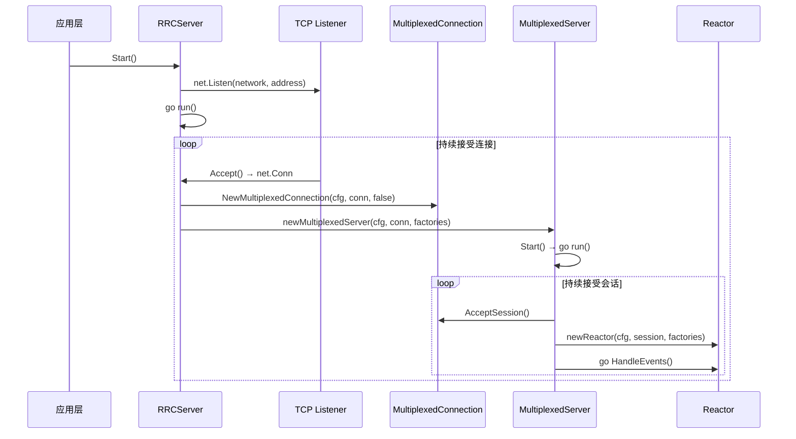
```mermaid
sequenceDiagram
    participant App as 应用层
    participant Server as RRCServer
    participant Listener as TCP Listener
    participant Conn as MultiplexedConnection
    participant MS as MultiplexedServer
    participant Reactor as Reactor

    App->>Server: Start()
    Server->>Listener: net.Listen(network, address)
    Server->>Server: go run()

    loop 持续接受连接
        Listener->>Server: Accept() → net.Conn
        Server->>Conn: NewMultiplexedConnection(cfg, conn, false)
        Server->>MS: newMultiplexedServer(cfg, conn, factories)
        MS->>MS: Start() → go run()

        loop 持续接受会话
            MS->>Conn: AcceptSession()
            MS->>Reactor: newReactor(cfg, session, factories)
            MS->>Reactor: go HandleEvents()
        end
    end
```

**核心代码**：`lib/spdy/rrc_server.go:64-91`

```go
// 第 64 行：服务端主循环
func (s *RRCServer) run() {
    for {
        if s.isStoped() {
            return
        }

        // 第 70 行：接受 TCP 连接
        uconn, err := s.listener.Accept()
        if err != nil {
            s.stopWithErr(err)
            return
        }

        // 第 76 行：为每个连接启动处理协程
        go func(nc net.Conn) {
            conn := NewMultiplexedConnection(s.cfg, nc, false)  // 服务端连接
            ms := newMultiplexedServer(s.cfg, conn, s.factories) // 创建 MultiplexedServer
            ms.Start()  // 启动会话接受循环

            if err := conn.ListenAndServed(); err != nil {  // 启动帧读取循环
                s.logger.Warn(err.Error(), ...)
            }

            ms.Stop()  // 停止 MultiplexedServer
        }(uconn)
    }
}
```

**逐行解释**：
- **第 70 行**：`Accept()` 阻塞等待新的 TCP 连接
- **第 77 行**：`NewMultiplexedConnection` 创建服务端连接（`client=false`）
- **第 78 行**：`MultiplexedServer` 管理该连接上的所有会话
- **第 80 行**：`ListenAndServed` 在同一 goroutine 中运行帧读取循环

### 8.3 MultiplexedServer — 会话管理

**核心代码**：`lib/spdy/multiplexed_server.go:51-89`

```go
// 第 51 行：MultiplexedServer 主循环
func (s *MultiplexedServer) run() {
    defer func() {
        s.closeReactors()  // 关闭所有 Reactor
    }()

    for {
        if s.isStopped() {
            return
        }

        // 第 61 行：接受新会话
        feature := s.conn.AcceptSession()
        session, err := feature()
        if err != nil {
            s.stopWithErr(err)
            return
        }

        // 第 68 行：检查重复会话
        s.reactorsGuard.RLock()
        _, ok := s.reactors[session.ID()]
        s.reactorsGuard.RUnlock()
        if ok {
            s.stopWithErr(errno.NewError(errno.DuplicateConnection))
            return
        }

        // 第 76 行：创建 Reactor
        reactor := newReactor(s.cfg, session, s.factories)
        s.reactorsGuard.Lock()
        s.reactors[session.ID()] = reactor
        s.reactorsGuard.Unlock()

        // 第 81 行：为每个会话启动 Reactor 协程
        go func(r *Reactor) {
            defer func() {
                s.reactorsGuard.Lock()
                delete(s.reactors, r.session.ID())
                s.reactorsGuard.Unlock()
            }()
            r.HandleEvents()  // 处理事件循环
        }(reactor)
    }
}
```

**逐行解释**：
- **第 61 行**：`AcceptSession()` 阻塞等待新会话（SYN 帧触发）
- **第 76 行**：`Reactor` 是会话的事件处理器
- **第 81 行**：每个会话一个 goroutine，通过 `HandleEvents` 循环处理请求

### 8.4 Reactor — 事件处理循环

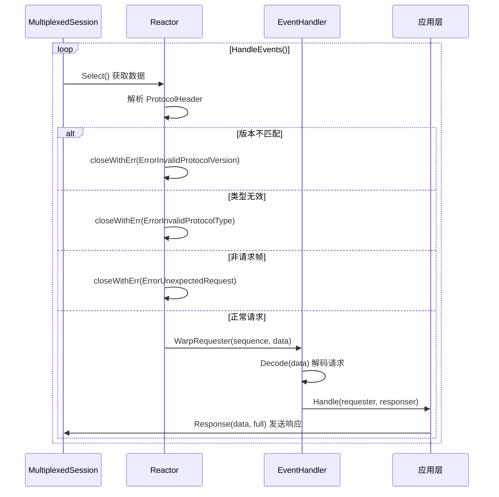
```mermaid
sequenceDiagram
    participant Session as MultiplexedSession
    participant Reactor as Reactor
    participant Handler as EventHandler
    participant App as 应用层

    loop HandleEvents()
        Session->>Reactor: Select() 获取数据
        Reactor->>Reactor: 解析 ProtocolHeader

        alt 版本不匹配
            Reactor->>Reactor: closeWithErr(ErrorInvalidProtocolVersion)
        else 类型无效
            Reactor->>Reactor: closeWithErr(ErrorInvalidProtocolType)
        else 非请求帧
            Reactor->>Reactor: closeWithErr(ErrorUnexpectedRequest)
        else 正常请求
            Reactor->>Handler: WarpRequester(sequence, data)
            Handler->>Handler: Decode(data) 解码请求
            Handler->>App: Handle(requester, responser)
            App->>Session: Response(data, full) 发送响应
        end
    end
```

**核心代码**：`lib/spdy/reactor.go:73-139`

```go
// 第 73 行：事件处理循环
func (r *Reactor) HandleEvents() {
    for {
        if r.isClose() {
            return
        }

        // 第 79 行：从会话获取数据
        data, err := r.session.Select()
        if err != nil {
            if r.isClose() || r.session.IsClosed() {
                return
            }
            if errno.Equal(err, errno.SessionSelectTimeout) {
                continue  // 超时，继续等待
            }
            r.closeWithErr(err)
            return
        }

        if data == nil {
            return
        }

        // 第 97 行：解析协议头
        header := ProtocolHeader(data)

        if header.Version() != ProtocolVersion {
            r.closeWithErr(ErrorInvalidProtocolVersion)
            return
        }

        if header.Type() >= Unknown || header.Type() < Prototype {
            r.closeWithErr(ErrorInvalidProtocolType)
            return
        }

        // 第 113 行：校验请求标志
        if header.Flags()&ReqFlag != ReqFlag {
            r.closeWithErr(ErrorUnexpectedRequest)
            return
        }

        // 第 120 行：分发到对应的处理器
        typ := header.Type()
        handler := r.dispatcher[typ]
        if handler == nil {
            r.closeWithErr(errno.NewError(errno.NoReactorHandler, header.Type()))
            return
        }

        // 第 127 行：解码请求并处理
        if requester, err := handler.WarpRequester(header.Sequence(), data[ProtocolHeaderSize:]); err != nil {
            r.closeWithErr(err)
            return
        } else {
            r.session.conn.FreeData(data)
            responser := requester.WarpResponser()
            err := handler.Handle(requester, responser)
            if err != nil {
                r.reactorLogger.Error("failed to handler response", ...)
            }
        }
    }
}
```

**逐行解释**：
- **第 79 行**：`Select()` 阻塞等待数据，超时会继续循环
- **第 97 行**：`ProtocolHeader` 解析 16 字节的 RPC 协议头
- **第 120 行**：根据请求类型分发到对应的 `EventHandler`
- **第 127 行**：`WarpRequester` 解码请求数据，`Handle` 调用应用层处理

---

## 9. Transport 层 — RPC 传输

### 9.1 核心结构

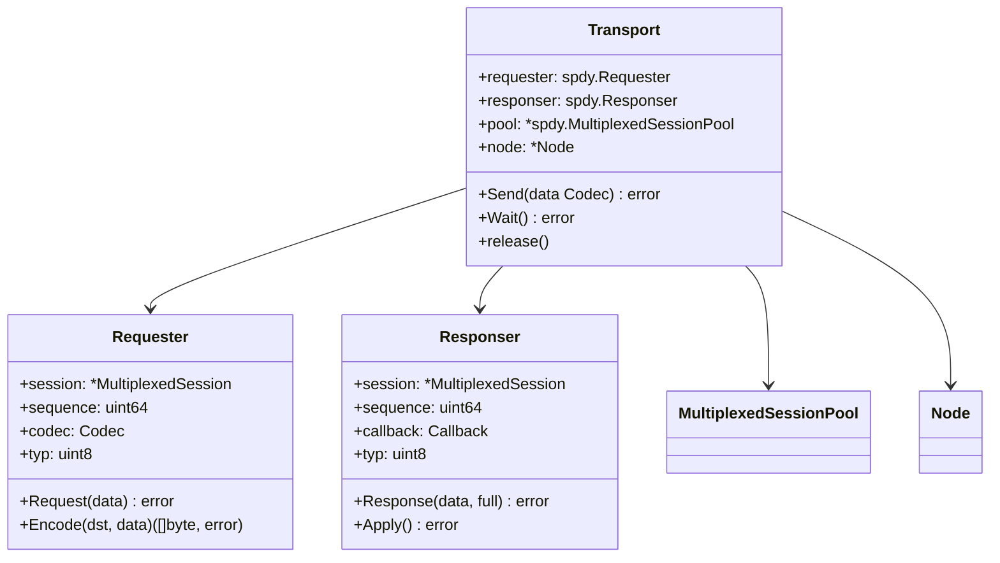
```mermaid
classDiagram
    class Transport {
        +requester: spdy.Requester
        +responser: spdy.Responser
        +pool: *spdy.MultiplexedSessionPool
        +node: *Node
        +Send(data Codec) error
        +Wait() error
        +release()
    }

    class Requester {
        +session: *MultiplexedSession
        +sequence: uint64
        +codec: Codec
        +typ: uint8
        +Request(data) error
        +Encode(dst, data) ([]byte, error)
    }

    class Responser {
        +session: *MultiplexedSession
        +sequence: uint64
        +callback: Callback
        +typ: uint8
        +Response(data, full) error
        +Apply() error
    }

    Transport --> Requester
    Transport --> Responser
    Transport --> MultiplexedSessionPool
    Transport --> Node
```

### 9.2 创建 Transport

**核心代码**：`lib/spdy/transport/transport.go:52-119`

```go
// 第 52 行：创建查询 Transport
func NewTransport(nodeId uint64, typ uint8, callback Callback) (*Transport, error) {
    node := NewNodeManager().Get(nodeId)  // 获取节点
    if node == nil {
        return nil, errno.NewError(errno.NoNodeAvailable, nodeId)
    }
    return newTransport(node, typ, callback, readTimeOut)  // 30 分钟超时
}

// 第 74 行：创建写入 Transport
func NewWriteTransport(nodeId uint64, typ uint8, callback Callback) (*Transport, error) {
    node := NewWriteNodeManager().Get(nodeId)
    if node == nil {
        return nil, errno.NewError(errno.NoNodeAvailable, nodeId)
    }
    return newTransport(node, typ, callback, writeTimeOut)  // 10 秒超时
}

// 第 90 行：内部创建 Transport
func newTransport(node *Node, typ uint8, callback Callback, timeout time.Duration) (*Transport, error) {
    p := node.GetPool()  // 获取连接池
    if p == nil || !p.Available() {
        return nil, errno.NewError(errno.NoConnectionAvailable, node.nodeID, node.address)
    }

    mc, err := p.Get()  // 从池中获取会话
    if err != nil {
        p.Close()
        return nil, err
    }
    mc.SetTimeout(timeout)  // 设置超时

    req := NewRequester(mc, typ, atomic.AddUint64(&globalUniqueIDSequence, 1), nil)
    rsp := req.WarpResponser()
    rsp.(*Responser).SetCallback(callback)

    return &Transport{
        requester: req,
        responser: rsp,
        pool:      p,
        node:      node,
    }, nil
}
```

**逐行解释**：
- **第 52 行**：`NewTransport` 用于查询请求，超时 30 分钟
- **第 74 行**：`NewWriteTransport` 用于写入请求，超时 10 秒
- **第 90 行**：`newTransport` 从连接池获取会话，创建 Requester 和 Responser

### 9.3 发送请求 — Send

**核心代码**：`lib/spdy/transport/transport.go:136-142`

```go
// 第 136 行：发送请求
func (s *Transport) Send(data Codec) error {
    if err := s.requester.Request(data); err != nil {
        s.pool.Close()  // 发送失败，关闭连接池
        return err
    }
    return nil
}
```

### 9.4 等待响应 — Wait

**核心代码**：`lib/spdy/transport/transport.go:144-159`

```go
// 第 144 行：等待响应
func (s *Transport) Wait() error {
    err := s.responser.Apply()  // 阻塞等待响应
    if err != nil {
        spdy.HandleError(s.responser.Session().Close())  // 错误时关闭会话
        return err
    }

    s.release()  // 归还会话到连接池
    return nil
}

// 第 155 行：归还会话
func (s *Transport) release() {
    if s.requester != nil && s.pool.Available() {
        s.pool.Put(s.requester.Session())  // 归还到池
    }
}
```

### 9.5 Requester — 请求发送

**核心代码**：`lib/spdy/mux.go:158-176`

```go
// 第 158 行：发送请求
func (base *BaseRequester) Request(request interface{}) error {
    begin := time.Now()
    buf := base.session.conn.AllocData(ProtocolHeaderSize)  // 分配缓冲区
    buf, err := base.derive.Encode(buf, request)             // 编码请求
    if err != nil {
        return err
    }

    // 第 166 行：编码协议头
    ProtocolHeader(buf).encode(base.derive.Type(), base.sendFlags(), base.sequence, uint32(len(buf)-ProtocolHeaderSize))
    tracing.AddPP(base.encodeSpan, begin)

    begin = time.Now()
    if err := base.session.Send(buf); err != nil {  // 发送数据
        return err
    }
    tracing.AddPP(base.sendSpan, begin)

    return nil
}
```

### 9.6 Responser — 响应接收

**核心代码**：`lib/spdy/mux.go:253-304`

```go
// 第 253 行：等待并处理响应
func (base *BaseResponser) Apply() error {
    defer func() {
        tracing.Finish(base.waitSpan, base.decodeSpan)
    }()

    for {
        tracing.StartPP(base.waitSpan)
        data, err := base.session.Select()  // 从会话获取数据
        tracing.EndPP(base.waitSpan)

        if err != nil {
            return err
        }
        if data == nil {
            return errno.NewError(errno.ResponserClosed)
        }

        // 第 269 行：解析协议头
        header := ProtocolHeader(data)
        if header.Sequence() != base.sequence {
            continue  // 序列号不匹配，跳过
        }
        if header.Version() != ProtocolVersion {
            return ErrorInvalidProtocolVersion
        }
        if header.Type() != base.derive.Type() {
            return ErrorInvalidProtocolType
        }
        if header.Flags()&RspFlag != RspFlag {
            return ErrorUnexpectedResponse
        }

        // 第 282 行：检查是否完成
        completes := false
        if header.Flags()&FullFlag == FullFlag {
            completes = true
        }

        // 第 287 行：解码响应
        tracing.StartPP(base.decodeSpan)
        response, err := base.derive.Decode(data[ProtocolHeaderSize:])
        base.session.conn.FreeData(data)
        tracing.EndPP(base.decodeSpan)

        if err != nil {
            return err
        }

        // 第 296 行：调用回调
        if err := base.derive.Callback(response); err != nil {
            return err
        }

        if completes {
            return nil  // 完成
        }
    }
}
```

**逐行解释**：
- **第 262 行**：`Select()` 阻塞等待数据
- **第 270 行**：`Sequence()` 匹配请求和响应（RPC 消息关联）
- **第 282 行**：`FullFlag` 表示这是最后一个响应分片
- **第 287 行**：解码响应数据
- **第 296 行**：调用 `Callback` 处理响应

---

## 10. ProtocolHeader — RPC 协议头

### 10.1 帧格式

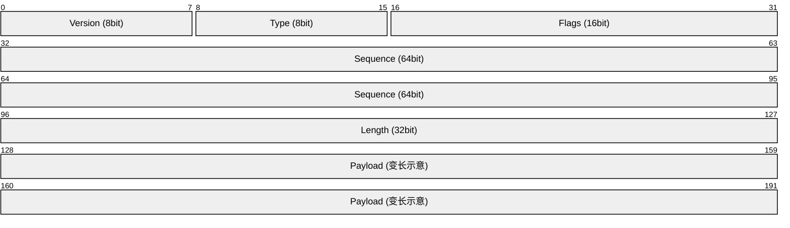
```mermaid
packet-beta
    0-7: "Version (8bit)"
    8-15: "Type (8bit)"
    16-31: "Flags (16bit)"
    32-95: "Sequence (64bit)"
    96-127: "Length (32bit)"
    128-191: "Payload (变长示意)"
```

**核心代码**：`lib/spdy/mux.go:27-64`

```go
// 第 27 行：RPC 协议常量
const (
    ProtocolVersion        uint8 = 0
    SizeOfProtocolVersion        = 1
    SizeOfProtocolType           = 1
    SizeOfProtocolFlags          = 2
    SizeOfProtocolSequence       = 8
    SizeOfProtocolLength         = 4
    ProtocolHeaderSize           = SizeOfProtocolVersion + SizeOfProtocolType +
        SizeOfProtocolFlags + SizeOfProtocolSequence + SizeOfProtocolLength  // 16 字节
)

// 第 37 行：RPC 标志位
const (
    ReqFlag  uint16 = 1 << iota  // 0x01: 请求标志
    RspFlag                       // 0x02: 响应标志
    FullFlag                      // 0x04: 完整标志（最后一个分片）
)

// 第 43 行：请求类型定义
const (
    Prototype                uint8 = iota  // 0: 原型
    Echo                                    // 1: 回显
    Partial                                 // 2: 部分
    FaultPartial                            // 3: 故障部分
    SelectRequest                           // 4: 查询请求
    AbortRequest                            // 5: 中止请求
    DDLRequest                              // 6: DDL 请求
    SysCtrlRequest                          // 7: 系统控制请求
    MetaRequest                             // 8: 元数据请求
    WritePointsRequest                      // 9: 写入请求
    PtRequest                               // 10: 分区请求
    WriteStreamPointsRequest                // 11: 流写入请求
    SegregateNodeRequest                    // 12: 隔离节点请求
    TransferLeadershipRequest               // 13: 转移领导权请求
    CrashRequest                            // 14: 崩溃请求
    RaftMsgRequest                          // 15: Raft 消息请求
    PingRequest                             // 16: Ping 请求
    WriteBlobsRequest                       // 17: 写入 Blobs 请求
    SendClearEvent                          // 18: 清除事件请求
    Unknown                                 // 19: 未知类型（哨兵值）
)
```

**逐行解释**：
- **ProtocolHeader** 和 SPDY 帧头格式相同（都是 16 字节），但字段含义不同
- **Sequence**：用于 RPC 请求-响应匹配（替代 ConnID），在协议头中也是 8 字节
- **Flags**：`ReqFlag`（请求）、`RspFlag`（响应）、`FullFlag`（完整）

### 10.2 Raft 传输边界：ts-meta 与 ts-store 不同

```mermaid
flowchart LR
    subgraph Meta["ts-meta 元数据 Raft"]
        M1[Store.Apply / Hashicorp raft] --> M2[newRaftTrans]
        M2 --> M3["raft.NewNetworkTransport(layer, 3, 10s, nil)"]
        M3 --> M4[TCP listener]
    end

    subgraph Store["ts-store 分区 Raft"]
        S1[RaftNode.send] --> S2[RaftConnStore.SendRaftMessages]
        S2 --> S3[msgservice.RaftMessagesRequest]
        S3 --> S4["Requester.RaftMsg()"]
        S4 --> S5["SPDY RaftMsgRequest"]
    end
```

**代码讲解**：
- `app/ts-meta/meta/raft_wrapper.go:198-213` 的 `newRaftTrans` 返回 `raft.NewNetworkTransport(...)`，这是 Hashicorp Raft 自带的网络传输，不经过 `lib/spdy` 的 `RaftMsgRequest`
- `lib/raftconn/message.go:40-75` 的 `SendRaftMessages` 构造 `msgservice.RaftMessagesRequest`，再调用 `Requester.RaftMsg()`，最终使用 SPDY mux 类型 `spdy.RaftMsgRequest`
- 因此文档中看到 `RaftMsgRequest` 时，要先判断上下文：它只表示 ts-store 分区级 etcd Raft 消息通道，不表示 ts-meta 元数据 Raft

**案例**：
```
创建数据库:
  ts-meta Store.Apply()
    -> Hashicorp raft.Apply()
    -> raft.NetworkTransport 复制日志
    -> storeFSM.Apply() 修改 metadata.Data

写入分区副本:
  ts-store RaftNode 产生 raftpb.Message
    -> RaftConnStore.SendRaftMessages()
    -> msgservice.RaftMessagesRequest
    -> SPDY mux typ = RaftMsgRequest
```

---

## 11. NodeManager — 节点管理

### 11.1 三层节点管理器

```mermaid
classDiagram
    class NodeManager {
        +nodes: map[uint64]*Node
        +mu: sync.RWMutex
        +job: *statistics.SpdyJob
        +Add(nodeID, address)
        +Get(nodeID) *Node
        +Clear()
    }

    class Node {
        +nodeID: uint64
        +address: string
        +pools: []*MultiplexedSessionPool
        +cursor: uint64
        +GetPool() *MultiplexedSessionPool
        +dial(idx) error
        +Close()
    }

    NodeManager "1" --> "*" Node : nodes map
    Node "1" --> "*" MultiplexedSessionPool : pools
```

**核心代码**：`lib/spdy/transport/node_manager.go:27-57`

```go
// 第 27 行：三个全局节点管理器
var nm = &NodeManager{
    nodes: make(map[uint64]*Node),
}
var wnm = &NodeManager{
    nodes: make(map[uint64]*Node),
}
var mnm = &NodeManager{
    nodes: make(map[uint64]*Node),
}

// 第 44 行：获取节点管理器
func NewNodeManager() *NodeManager { return nm }        // 查询/DDL
func NewWriteNodeManager() *NodeManager { return wnm }  // 写入
func NewMetaNodeManager() *NodeManager { return mnm }   // 元数据
```

**逐行解释**：
- **三个管理器**：查询/DDL、写入、元数据，分别管理不同类型的连接
- **节点 ID 映射**：`map[uint64]*Node`，通过节点 ID 查找节点

### 11.2 Node — 节点连接池

**核心代码**：`lib/spdy/transport/node.go:42-58`

```go
// 第 42 行：获取连接池（轮询负载均衡）
func (n *Node) GetPool() *spdy.MultiplexedSessionPool {
    poolSize := uint64(spdy.ConnPoolSize())
    if poolSize == 0 {
        logger.GetLogger().Error("Node poolSize = 0")
        return nil
    }
    idx := atomic.AddUint64(&n.cursor, 1) % poolSize  // 轮询
    if err := n.dial(idx); err != nil {
        logger.GetLogger().Error("dial failed", zap.Error(err))
        return nil
    }

    n.mu.RLock()
    defer n.mu.RUnlock()
    return n.pools[idx]
}
```

**逐行解释**：
- **轮询负载均衡**：`cursor` 原子递增，取模 `poolSize` 得到索引
- **按需连接**：`dial(idx)` 检查连接池是否可用，不可用则新建

---

## 12. Codec — 编解码接口

### 12.1 Codec 接口

**核心代码**：`lib/spdy/transport/codec.go:23-28`

```go
// 第 23 行：Codec 接口
type Codec interface {
    Size() int                          // 序列化后的大小
    Marshal([]byte) ([]byte, error)     // 序列化
    Unmarshal([]byte) error             // 反序列化
    Instance() Codec                    // 创建新实例（用于反序列化）
}
```

**逐行解释**：
- **Size()**：返回序列化后的字节数，用于预分配缓冲区
- **Marshal()**：将数据序列化到字节切片
- **Unmarshal()**：从字节切片反序列化数据
- **Instance()**：创建一个新的空实例，用于反序列化

### 12.2 Message — RPC 消息封装

**核心代码**：`lib/spdy/rpc/message.go:27-95`

```go
// 第 27 行：Message 结构体
type Message struct {
    typ      uint8               // 消息类型
    data     transport.Codec     // 消息数据
    clientID uint64              // 客户端 ID
    handler  MessageNewHandler   // 消息工厂函数
}

// 第 76 行：序列化
func (m *Message) Marshal(buf []byte) ([]byte, error) {
    buf = append(buf, m.typ)                    // 1 字节类型
    buf = codec.AppendUint64(buf, m.clientID)   // 8 字节客户端 ID
    return m.data.Marshal(buf)                  // 序列化数据
}

// 第 82 行：反序列化
func (m *Message) Unmarshal(buf []byte) error {
    if len(buf) < 1+codec.SizeOfUint64() {
        return errno.NewError(errno.ShortBufferSize, 1+codec.SizeOfUint64(), len(buf))
    }

    m.typ = buf[0]                              // 1 字节类型
    m.data = m.handler(m.typ)                   // 通过工厂函数创建具体类型
    if m.data == nil {
        return errno.NewError(errno.UnknownMessageType, m.typ)
    }
    m.clientID = binary.BigEndian.Uint64(buf[1:9])  // 8 字节客户端 ID

    return m.data.Unmarshal(buf[9:])            // 反序列化数据
}
```

**逐行解释**：
- **Marshal**：`类型(1B) + 客户端ID(8B) + 数据(变长)`
- **Unmarshal**：先读取类型，通过工厂函数创建具体类型实例，再反序列化数据
- **工厂模式**：`handler` 函数根据类型创建对应的 Codec 实例

---

## 13. 完整生命周期示例

### 13.1 场景：ts-sql 向 ts-store 发送写入请求

```mermaid
sequenceDiagram
    participant SQL as ts-sql
    participant Pool as SessionPool
    participant Conn as MultiplexedConnection
    participant Store as ts-store
    participant RRC as RRCServer
    participant MS as MultiplexedServer
    participant Reactor as Reactor
    participant Handler as EventHandler

    Note over SQL,Store: 1. 建立连接（启动时）
    SQL->>Pool: Dial()
    Pool->>Store: TCP 三次握手
    Pool->>Conn: NewMultiplexedConnection(cfg, tcp, true)
    Pool->>Conn: go ListenAndServed()

    Note over SQL,Store: 2. 获取会话（写入时）
    SQL->>Pool: Get()
    Pool->>Pool: tryGet() → 队列为空
    Pool->>Conn: OpenSession()
    Conn->>Conn: generateNextSessionId() → 1
    Conn->>Store: 发送 SYN 帧（ConnID=1, Flags=SYN）

    Store->>RRC: Accept() → net.Conn
    RRC->>Conn: NewMultiplexedConnection(cfg, conn, false)
    RRC->>MS: newMultiplexedServer(cfg, conn, factories)
    MS->>Conn: AcceptSession()
    Conn->>Conn: createAcceptSession(1)
    Conn->>Store: 发送 ACK 帧（ConnID=1, Flags=ACK）

    SQL->>Pool: 返回 Session

    Note over SQL,Store: 3. 发送请求
    SQL->>Conn: Send(WritePointsRequest)
    Conn->>Conn: sendDataInternal(0, data)
    Conn->>Store: 发送 DATA 帧（ConnID=1, Flags=0）

    Store->>Conn: ListenAndServed() 读取帧
    Conn->>Conn: handleData(hdr)
    Conn->>Session: Handle(0, data)
    Session->>Session: recvData(data)
    Session->>Session: recvQueue <- data

    MS->>Reactor: AcceptSession()
    Reactor->>Session: Select()
    Session->>Reactor: 返回 data
    Reactor->>Handler: WarpRequester(seq, data)
    Handler->>Handler: Decode(data)
    Handler->>Handler: Handle(requester, responser)
    Handler->>Session: Response(data, full=true)
    Session->>Conn: sendDataInternal(RspFlag, data)
    Conn->>SQL: 发送 RSP 帧

    Note over SQL,Store: 4. 接收响应
    SQL->>Conn: ListenAndServed() 读取帧
    Conn->>Session: Handle(0, data)
    Session->>Session: recvQueue <- data

    Pool->>Session: Select()
    Session->>Pool: 返回 data
    Pool->>Pool: Apply() 解码响应
    Pool->>Pool: release() 归还会话

    Note over SQL,Store: 5. 关闭连接（关闭时）
    SQL->>Pool: Close()
    Pool->>Conn: Close()
    Conn->>Store: 发送 CLOSE 帧
    Conn->>Conn: close()
```

### 13.2 代码调用链

```
1. 建立连接：
   transport.InitStatistics(AppSql)
   → NewNodeManager().Add(nodeID, address)
   → Node.GetPool()
   → MultiplexedSessionPool.Dial()
   → MultiplexedConnection.ListenAndServed()

2. 获取会话：
   transport.NewWriteTransport(nodeId, WritePointsRequest, callback)
   → Node.GetPool()
   → MultiplexedSessionPool.Get()
   → MultiplexedConnection.OpenSession()
   → MultiplexedSession.SendSyn(nil, ackRecvSig)
   → MultiplexedConnection.Write(hdr, data)

3. 发送请求：
   Transport.Send(codec)
   → BaseRequester.Request(data)
   → MultiplexedSession.Send(buf)
   → DataACK.Block()  // 流控检查
   → FSM.ProcessEvent(SEND_DATA_EVENT, data)
   → MultiplexedSession.sendDataInternal(0, data)
   → MultiplexedConnection.Write(hdr, data)

4. 接收响应：
   Transport.Wait()
   → BaseResponser.Apply()
   → MultiplexedSession.Select()
   → recvQueue <- data
   → ProtocolHeader.Parse()
   → Codec.Decode()
   → Callback.Handle(response)

5. 归还会话：
   Transport.release()
   → MultiplexedSessionPool.Put(session)
   → session.DisableDataACK()
   → queue <- session
```

---

## 14. 错误处理与重连

### 14.1 错误类型

**核心代码**：`lib/spdy/errors.go:30-114`

```go
// 第 30 行：错误码常量
const (
    INTERNAL_ERROR = iota  // 0: 内部错误
    FSM_ERROR              // 1: 状态机错误
)

// 第 31 行：预定义错误
var (
    ErrorInvalidProtocolVersion = NewInternalError(INTERNAL_ERROR, "invalid protocol version")
    ErrorInvalidProtocolType    = NewInternalError(INTERNAL_ERROR, "invalid protocol type")
    ErrorUnexpectedResponse     = NewInternalError(INTERNAL_ERROR, "unexpected response")
    ErrorUnexpectedRequest      = NewInternalError(INTERNAL_ERROR, "unexpected request")
)

// 第 81 行：FSM 错误
type FSMError struct {
    BaseError
    event event
    state state
}

// 第 87 行：创建 FSM 错误
func NewFSMError(event event, state state) *FSMError {
    e := &FSMError{
        event: event,
        state: state,
    }
    e.super(e, FSM_ERROR)
    return e
}

// 第 104 行：错误信息
func (e *FSMError) Error() string {
    return fmt.Sprintf("can't process event(%d) on state(%d)", e.event, e.state)
}

// 第 108 行：全局错误处理器
func HandleError(err error) {
    if err == nil {
        return
    }
    logger.NewLogger(errno.ModuleNetwork).
        Error("", zap.Error(err), zap.String("SPDY", "HandleError"))
}
```

### 14.2 重连机制

**核心代码**：`lib/spdy/transport/node.go:60-85`

```go
// 第 60 行：按需连接（带超时）
func (n *Node) dial(idx uint64) error {
    start := fasttime.UnixTimestamp()
    n.mu.Lock()
    defer n.mu.Unlock()

    p := n.pools[idx]
    if p != nil && p.Available() {
        return nil  // 连接可用，直接返回
    }

    // 第 70 行：检查是否超时
    if (fasttime.UnixTimestamp() - start) >= uint64(spdy.TCPDialTimeout().Seconds()) {
        statistics.NewSpdyStatistics().Add(n.failedJob)
        return errno.NewError(errno.NoConnectionAvailable, n.nodeID, n.address)
    }

    // 第 75 行：创建新连接池
    mcp := spdy.NewMultiplexedSessionPool(spdy.DefaultConfiguration(), "tcp", n.address)
    if err := mcp.Dial(); err != nil {
        statistics.NewSpdyStatistics().Add(n.failedJob)
        return err
    }
    mcp.SetStatisticsJob(n.successJob)
    n.pools[idx] = mcp

    statistics.NewSpdyStatistics().Add(n.successJob)
    return nil
}
```

**逐行解释**：
- **第 66 行**：检查连接池是否可用，可用则直接返回
- **第 70 行**：超过 TCP 超时时间则返回错误
- **第 75 行**：创建新的连接池，替换旧的

### 14.3 连接错误处理

**核心代码**：`lib/spdy/multiplexed_connection.go:221-237`

```go
// 第 221 行：处理错误
func (c *MultiplexedConnection) handleError(err error) {
    if c.IsClosed() {
        return
    }

    c.logger.Error("", zap.Error(err),
        zap.String("remote_addr", c.RemoteAddr().String()),
        zap.String("local_addr", c.LocalAddr().String()),
        zap.String("SPDY", "MultiplexedConnection"))

    var code uint32
    if e, ok := err.(MultiplexedError); ok {
        code = e.Code()  // 获取错误码
    }
    HandleError(c.closeRemote(code))  // 发送 CLOSE 帧
    HandleError(c.close())            // 关闭连接
}
```

**逐行解释**：
- 记录错误日志（包含远端/本地地址）
- 如果是 `MultiplexedError`，提取错误码
- 发送 CLOSE 帧通知对端
- 关闭底层 TCP 连接

---

## 15. 性能优化

### 15.1 缓冲区池

**核心代码**：`lib/spdy/multiplexed_connection.go:183-191`

```go
// 第 183 行：分配缓冲区
func (c *MultiplexedConnection) AllocData(n int) []byte {
    b := c.dataBp.Get()          // 从池中获取
    b = bufferpool.Resize(b, n)  // 调整大小
    return b
}

// 第 189 行：归还缓冲区
func (c *MultiplexedConnection) FreeData(data []byte) {
    c.dataBp.Put(data)  // 归还到池
}
```

**逐行解释**：
- **字节缓冲池**：复用 `[]byte`，减少内存分配和 GC 压力
- **Resize**：如果池中的缓冲区太小，重新分配

### 15.2 定时器池

**核心代码**：`lib/spdy/multiplexed_connection.go:113-115`

```go
// 第 113 行：全局定时器池
var (
    timerPool = util.NewTimePool()
)
```

**逐行解释**：
- 定时器池复用 `time.Timer`，减少定时器创建开销
- 在 `OpenSession`、`Select` 等方法中使用

### 15.3 Snappy 压缩

**核心代码**：`lib/spdy/multiplexed_connection.go:158-161`

```go
// 第 158 行：启用 Snappy 压缩
if cfg.CompressEnable {
    conn.output = snappy.NewBufferedWriter(underlying)
    conn.input = snappy.NewReader(underlying)
}
```

**逐行解释**：
- Snappy 是 Google 开发的快速压缩算法
- 压缩比适中，但压缩/解压速度极快
- 适合网络带宽受限的场景

### 15.4 TLS 支持

**核心代码**：`lib/spdy/rrc_server.go:111-129`

```go
// 第 111 行：打开监听器
func (s *RRCServer) openListener() error {
    if s.cfg.TLSEnable {
        tlsCfg, err := s.cfg.NewTLSConfig()
        if err != nil {
            return err
        }

        if len(tlsCfg.Certificates) > 0 {
            statistics.RuntimeIns().SetSpdyCertExpireAt(config.GetCertLeaf(&tlsCfg.Certificates[0]))
        }

        s.listener, err = tls.Listen(s.network, s.address, tlsCfg)
        return err
    }

    var err error
    s.listener, err = net.Listen(s.network, s.address)
    return err
}
```

**逐行解释**：
- 支持 TLS 1.3 加密
- 支持客户端证书认证（双向 TLS）
- 证书过期时间会被记录到统计信息

---

## 16. 统计监控

### 16.1 统计指标

**核心代码**：`lib/spdy/transport/statistics.go:19-38`

```go
// 第 19 行：应用类型常量
const (
    AppSql   = iota  // 0: SQL 节点
    AppMeta          // 1: Meta 节点
    AppStore         // 2: Store 节点
)

// 第 25 行：初始化统计
func InitStatistics(app int) {
    switch app {
    case AppSql:
        NewNodeManager().SetJob(stat.NewSpdyJob(stat.Sql2Store))
        NewWriteNodeManager().SetJob(stat.NewSpdyJob(stat.Sql2Store))
        NewMetaNodeManager().SetJob(stat.NewSpdyJob(stat.Sql2Meta))
    case AppMeta:
        NewNodeManager().SetJob(stat.NewSpdyJob(stat.Meta2Store))
        NewMetaNodeManager().SetJob(stat.NewSpdyJob(stat.Meta2Meta))
    case AppStore:
        NewNodeManager().SetJob(stat.NewSpdyJob(stat.Store2Meta))
        NewMetaNodeManager().SetJob(stat.NewSpdyJob(stat.Store2Meta))
    }
}
```

**统计指标**：
- `ConnTotal`：连接总数
- `FailedConnTotal`：连接失败总数
- `ClosedConnTotal`：关闭连接总数
- `SuccessCreateSessionTotal`：成功创建会话总数
- `FailedCreateSessionTotal`：失败创建会话总数
- `ClosedSessionTotal`：关闭会话总数

---

## 17. 配置参数

**核心代码**：`lib/config/spdy.go:27-71`

```go
// 第 27 行：Spdy 配置结构体
type Spdy struct {
    ByteBufferPoolDefaultSize uint64  // 字节缓冲池默认大小

    RecvWindowSize          int  // 接收窗口大小（默认 8）
    ConcurrentAcceptSession int  // 并发接受会话数（默认 4096）
    ConnPoolSize            int  // 连接池大小（默认 4）

    OpenSessionTimeout   toml.Duration  // 打开会话超时（默认 2 秒）
    SessionSelectTimeout toml.Duration  // 会话选择超时（默认 300 秒）
    TCPDialTimeout       toml.Duration  // TCP 拨号超时（默认 1 秒）
    DataAckTimeout       toml.Duration  // 数据确认超时

    CompressEnable bool  // 启用 Snappy 压缩
    TLSEnable      bool  // 启用 TLS
    // ... TLS 配置 ...
}

// 第 52 行：默认值
const (
    DefaultRecvWindowSize          = 8
    DefaultConcurrentAcceptSession = 4096
    DefaultOpenSessionTimeout      = 2 * Second
    DefaultSessionSelectTimeout    = 300 * Second
    DefaultTCPDialTimeout          = Second
    DefaultConnPoolSize            = 4

    TCPWriteTimeout = 120 * time.Second  // TCP 写超时
    TCPReadTimeout  = 300 * time.Second  // TCP 读超时
)
```

**参数说明**：

| 参数 | 默认值 | 说明 |
|------|--------|------|
| RecvWindowSize | 8 | 接收队列缓冲区大小，影响流控窗口 |
| ConcurrentAcceptSession | 4096 | 服务端并发接受的会话数上限 |
| ConnPoolSize | 4 | 每个节点的连接池大小 |
| OpenSessionTimeout | 2s | SYN-ACK 握手超时时间 |
| SessionSelectTimeout | 300s | 等待数据的超时时间 |
| TCPDialTimeout | 1s | TCP 连接建立超时 |
| TCPWriteTimeout | 120s | TCP 写操作超时 |
| TCPReadTimeout | 300s | TCP 读操作超时 |
| CompressEnable | false | 启用 Snappy 压缩 |
| TLSEnable | false | 启用 TLS 加密 |

---

## 18. 架构总结

```mermaid
graph TB
    subgraph "应用层"
        SQL[ts-sql]
        Meta[ts-meta]
        Store[ts-store]
    end

    subgraph "Transport 层"
        TT[Transport]
        REQ[Requester]
        RSP[Responser]
        NM[NodeManager]
        NODE[Node]
    end

    subgraph "SPDY 核心层"
        POOL[SessionPool]
        CONN[MultiplexedConnection]
        SESSION[MultiplexedSession]
        FSM[FSM 状态机]
        DACK[DataACK 流控]
    end

    subgraph "服务端"
        RRC[RRCServer]
        MS[MultiplexedServer]
        REACT[Reactor]
        EHF[EventHandler]
    end

    subgraph "传输层"
        TCP[TCP 连接]
        TLS[TLS 加密]
        SNAPPY[Snappy 压缩]
    end

    SQL --> TT
    Meta --> TT
    Store --> TT

    TT --> REQ
    TT --> RSP
    TT --> NM
    NM --> NODE
    NODE --> POOL

    POOL --> CONN
    CONN --> SESSION
    SESSION --> FSM
    SESSION --> DACK

    RRC --> MS
    MS --> REACT
    REACT --> EHF

    CONN --> TCP
    TCP --> TLS
    TCP --> SNAPPY
```

**分层说明**：
1. **应用层**：ts-sql、ts-meta、ts-store 使用 Transport 层发送 RPC 请求
2. **Transport 层**：封装 Requester/Responser，管理节点和连接池
3. **SPDY 核心层**：实现多路复用、状态机、流控
4. **服务端**：RRCServer 接受连接，Reactor 处理请求
5. **传输层**：TCP 连接，可选 TLS 加密和 Snappy 压缩

---

## 19. 关键设计决策

### 19.1 为什么用状态机？

- **连接生命周期管理**：SYN-ACK 握手、FIN-RST 关闭，类似 TCP
- **防止非法状态转换**：FSM 保证只在合法状态下执行操作
- **线程安全**：`stateGuard` 互斥锁保证状态转换的原子性

### 19.2 为什么用 Future 模式？

- **异步操作**：`OpenSession` 和 `AcceptSession` 返回 Future 函数
- **避免阻塞**：调用者可以在需要时才阻塞等待结果
- **超时控制**：通过 `select` 实现超时

### 19.3 为什么用连接池？

- **减少连接开销**：TCP 三次握手 + TLS 握手开销很大
- **会话复用**：归还的会话可以被其他请求复用
- **负载均衡**：轮询多个连接池，分散请求

### 19.4 为什么用字节缓冲池？

- **减少 GC 压力**：频繁分配 `[]byte` 会触发 GC
- **复用内存**：从池中获取和归还，避免重复分配
- **性能提升**：减少内存分配次数，提高吞吐量

---

## 20. 文件清单

| 文件 | 行数 | 说明 |
|------|------|------|
| `lib/spdy/multiplexed_connection.go` | 550 | 连接多路复用核心 |
| `lib/spdy/multiplexed_session.go` | 528 | 会话管理 |
| `lib/spdy/fsm.go` | 222 | 有限状态机 |
| `lib/spdy/data_ack.go` | 143 | 流控机制 |
| `lib/spdy/multiplexed_session_pool.go` | 193 | 连接池 |
| `lib/spdy/multiplexed_server.go` | 132 | 服务端会话管理 |
| `lib/spdy/reactor.go` | 151 | 事件处理循环 |
| `lib/spdy/rrc_server.go` | 160 | RPC 服务器 |
| `lib/spdy/mux.go` | 367 | RPC 协议头和 Requester/Responser |
| `lib/spdy/errors.go` | 115 | 错误处理 |
| `lib/spdy/configuration.go` | 47 | 配置管理 |
| `lib/spdy/transport/transport.go` | 168 | Transport 层 |
| `lib/spdy/transport/node.go` | 116 | 节点管理 |
| `lib/spdy/transport/node_manager.go` | 98 | 节点管理器 |
| `lib/spdy/transport/requester.go` | 72 | 请求发送 |
| `lib/spdy/transport/responser.go` | 74 | 响应接收 |
| `lib/spdy/transport/codec.go` | 51 | 编解码接口 |
| `lib/spdy/transport/event_handler.go` | 68 | 事件处理器 |
| `lib/spdy/transport/statistics.go` | 38 | 统计监控 |
| `lib/spdy/rpc/message.go` | 96 | RPC 消息封装 |
| `lib/config/spdy.go` | 216 | 配置结构体 |
