# Module 29: 文件操作抽象层深度解析（lib/fileops）

> `lib/fileops/` 是 openGemini 的文件操作抽象层，它将本地文件系统、OBS 对象存储、StreamFS 分布式文件系统统一在同一套接口之下。上层存储引擎（TSSP、WAL、Index）只需调用 `fileops.Open()`、`fileops.Create()` 等包级函数，无需关心底层存储是本地磁盘还是云端对象存储。

---

## 1. 为什么需要文件操作抽象层？

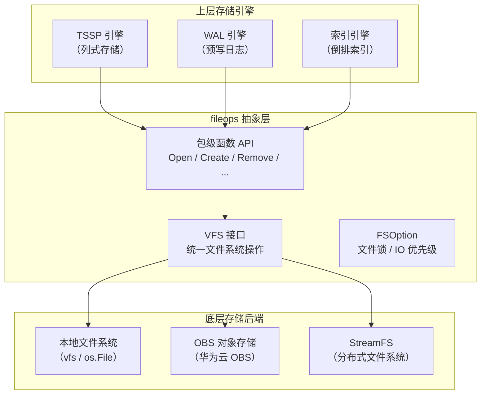

**通俗解释**：
想象你去银行办业务。你不需要知道银行用的是什么操作系统、数据存在哪个机房。你只需要到窗口（`fileops` API）说"我要存钱"（`Create`）、"我要取钱"（`ReadAt`），柜员（VFS 接口）会帮你处理一切。背后的金库可能是本地的（Local FS），也可能是远程的（OBS），你完全不用关心。

**核心设计目标**：
1. **存储后端透明**：上层代码零修改即可切换本地/云端存储
2. **统一接口**：`File` 和 `VFS` 两个接口覆盖所有文件操作
3. **IO 优先级控制**：通过 `FilePriorityOption` 区分前台查询和后台 Compaction 的 IO 权重
4. **IO 统计埋点**：所有读写操作自动采集延迟和吞吐量指标
5. **流式批量读取**：`StreamReadBatch` 支持 OBS 的 HTTP Range 请求合并

---

## 2. 核心接口设计

### 2.1 File 接口 — 单文件操作

**代码位置**：`lib/fileops/file_ops.go`

```go
type File interface {
    io.Closer
    io.Reader
    io.Seeker
    io.Writer
    io.ReaderAt
    Name() string
    Truncate(size int64) error
    Sync() error
    Stat() (os.FileInfo, error)
    SyncUpdateLength() error
    Fd() uintptr
    Size() (int64, error)
    StreamReadBatch([]int64, []int64, int64, chan *request.StreamReader, int, bool)
}
```

**接口方法说明**：

| 方法 | 来源接口 | 说明 |
|------|---------|------|
| `Close()` | `io.Closer` | 关闭文件句柄，释放资源 |
| `Read(b)` | `io.Reader` | 顺序读取数据 |
| `ReadAt(b, off)` | `io.ReaderAt` | 从指定偏移量读取数据（随机访问） |
| `Write(b)` | `io.Writer` | 写入数据 |
| `Seek(offset, whence)` | `io.Seeker` | 移动文件指针 |
| `Name()` | 自定义 | 返回文件完整路径 |
| `Truncate(size)` | 自定义 | 截断文件到指定大小 |
| `Sync()` | 自定义 | 将缓冲区数据刷写到持久存储 |
| `Stat()` | 自定义 | 获取文件元信息（大小、修改时间等） |
| `SyncUpdateLength()` | 自定义 | 同步并更新文件长度（OBS 特化） |
| `Fd()` | 自定义 | 返回底层文件描述符（mmap 使用） |
| `Size()` | 自定义 | 获取文件大小 |
| `StreamReadBatch(...)` | 自定义 | 流式批量读取（OBS HTTP Range 合并） |

**通俗解释**：
`File` 接口就像一把"万能钥匙"。不管门后面是本地磁盘文件、OBS 对象，还是 StreamFS 分布式文件，你都可以用同样的方式开门（Open）、读东西（Read）、写东西（Write）、关门（Close）。

### 2.2 VFS 接口 — 文件系统级操作

**代码位置**：`lib/fileops/file_ops.go`

```go
type VFS interface {
    Open(name string, opt ...FSOption) (File, error)
    OpenFile(name string, flag int, perm os.FileMode, opt ...FSOption) (File, error)
    Create(name string, opt ...FSOption) (File, error)
    CreateV1(name string, opt ...FSOption) (File, error)
    CreateV2(name string, opt ...FSOption) (File, error)
    Remove(name string, opt ...FSOption) error
    RemoveLocal(name string, opt ...FSOption) error
    RemoveLocalEnabled(obsOptValid bool) bool
    RemoveAll(path string, opt ...FSOption) error
    RemoveAllWithOutDir(path string, opt ...FSOption) error
    Mkdir(path string, perm os.FileMode, opt ...FSOption) error
    MkdirAll(path string, perm os.FileMode, opt ...FSOption) error
    NormalizeDirPath(path string) string
    ReadDir(dirname string) ([]fs.FileInfo, error)
    Glob(pattern string) ([]string, error)
    RenameFile(oldPath, newPath string, opt ...FSOption) error
    Stat(name string) (os.FileInfo, error)
    WriteFile(filename string, data []byte, perm os.FileMode, opt ...FSOption) error
    ReadFile(filename string, opt ...FSOption) ([]byte, error)
    CopyFile(srcFile, dstFile string, opt ...FSOption) (written int64, err error)
    CreateTime(name string) (*time.Time, error)
    Truncate(name string, size int64, opt ...FSOption) error
    IsObsFile(path string) (bool, error)
    CopyFileFromDFVToOBS(srcPath, dstPath string, opt ...FSOption) error
    GetAllFilesSizeInPath(path string) (int64, int64, int64, error)
    GetOBSTmpFileName(path string, obsOption *obs.ObsOptions) string
    GetOBSTmpIndexFileName(path string, obsOption *obs.ObsOptions) string
    DecodeRemotePathToLocal(path string) (string, error)
}
```

**方法分类**：

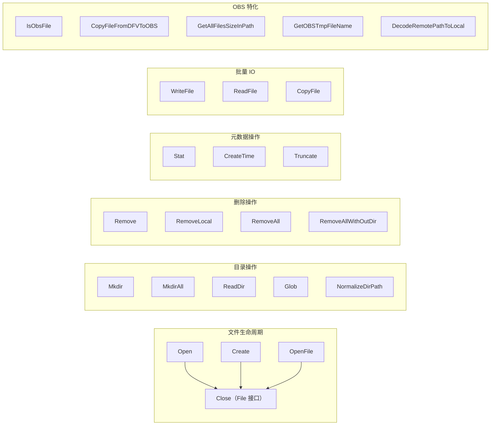

---

## 3. FSOption — 文件操作选项

### 3.1 选项类型

**代码位置**：`lib/fileops/file_ops.go`

```go
type FSOption interface {
    Parameter() interface{}
}

type FilePriorityOption int      // IO 优先级
type FileLockOption string       // 文件锁路径
```

### 3.2 IO 优先级

```go
IO_PRIORITY_ULTRA_HIGH = 0  // 超高优先级（前台查询）
IO_PRIORITY_HIGH       = 1  // 高优先级
IO_PRIORITY_NORMAL     = 2  // 普通优先级
IO_PRIORITY_LOW        = 3  // 低优先级
IO_PRIORITY_LOW_READ   = 4  // 低优先级读取（后台 Compaction）
```

**通俗解释**：
IO 优先级就像高速公路上的"应急车道"。前台查询是救护车（ULTRA_HIGH），必须优先通过；后台 Compaction 是货车（LOW），只能在空闲时走。这样即使后台任务繁忙，用户查询也能快速响应。

### 3.3 使用示例

```go
// 打开文件，指定高优先级和文件锁
lock := fileops.FileLockOption("/path/to/lock")
pri := fileops.FilePriorityOption(fileops.IO_PRIORITY_HIGH)
fd, err := fileops.Open("/data/cpu_0001/00000001-0000-00000001.tssp", lock, pri)
```

---

## 4. 存储后端路由

### 4.1 路径前缀路由

**代码位置**：`lib/fileops/file_ops.go`

```go
type FsType uint32

const (
    Unknown FsType = 0
    Local   FsType = 1
    Obs     FsType = 2
    Hdfs    FsType = 3   // 未实现
)

func GetFsType(path string) FsType {
    switch path[0] {
    case 'o':
        if strings.HasPrefix(path, "obs:/") {
            return Obs
        }
    case 'h':
        if strings.HasPrefix(path, "hdfs://") {
            return Hdfs
        }
    }
    return Local
}
```

上面代码片段展示的是当前源码中 `ObsPrefix` 对应的前缀判断形式。不同产品类型可能把 `ObsPrefix` 编译/配置为 `obs:/` 或 `obs://`，但运行时仍只按一个全局前缀识别 OBS。

### 4.2 路由流程

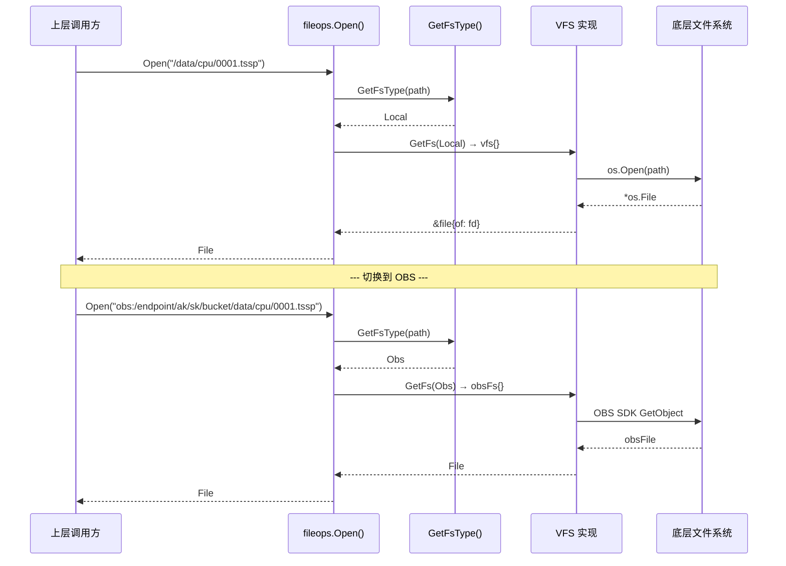

**关键常量**：

| 前缀 | 存储类型 | 说明 |
|------|---------|------|
| `obs:/` 或 `obs://` | OBS | 随产品类型二选一：TimeSeries 场景通常使用 `obs:/`，LogKeeper 场景通常使用 `obs://` |
| `hdfs://` | HDFS | 未实现 |
| 其他 | Local | 本地文件系统 |

注意：代码里的全局 `ObsPrefix` 当前只识别一个 OBS 前缀，不是同时接受 `obs:/` 和 `obs://` 两套格式。文档和配置应以实际编译/产品类型下的 `ObsPrefix` 为准。

### 4.3 OBS 路径编码格式

```
格式：obs:/{endpoint}/{ak}/{sk}/{bucket}/{basePath}

示例：obs:/obs.cn-north-4.myhuaweicloud.com/ACCESS_KEY/SECRET_KEY/my-bucket/data/db0/0/cpu_0001/00000001.tssp

各字段含义：
  endpoint  = obs.cn-north-4.myhuaweicloud.com  （OBS 服务端点）
  ak        = ACCESS_KEY                         （访问密钥 ID）
  sk        = SECRET_KEY                         （访问密钥，加密存储）
  bucket    = my-bucket                          （存储桶名称）
  basePath  = data/db0/0/cpu_0001/00000001.tssp  （对象键）
```

---

## 5. 本地文件系统实现（vfs）

### 5.1 文件包装器

**代码位置**：`lib/fileops/os_fs.go`

```go
type file struct {
    of *os.File
}
```

本地文件系统的 `File` 实现是对 `os.File` 的薄包装，主要增加了：
1. **IO 统计埋点**：每次 Read/Write/Sync 自动记录延迟和字节数
2. **StreamReadBatch**：将批量读取转化为多次 `ReadAt` 调用

### 5.2 IO 统计埋点

```go
func (f *file) Write(b []byte) (int, error) {
    begin := time.Now()
    atomic.AddInt64(&statistics.IOStat.IOWriteTotalCount, 1)
    atomic.AddInt64(&statistics.IOStat.IOWriteTotalBytes, int64(len(b)))
    res, err := f.of.Write(b)
    opsStatEnd(begin.UnixNano(), opsTypeWrite, int64(res))
    return res, err
}
```

**采集的指标**：

| 操作类型 | 指标 | 说明 |
|---------|------|------|
| Write | IOWriteDuration | 写入总耗时（纳秒） |
| Write | IOWriteOkBytes | 成功写入字节数 |
| Write | IOWriteOkCount | 成功写入次数 |
| Write | IOWriteTotalCount | 写入请求总数 |
| Read | IOReadDuration | 读取总耗时（纳秒） |
| Read | IOReadOkBytes | 成功读取字节数 |
| Read | IOReadOkCount | 成功读取次数 |
| Read | IOReadTotalCount | 读取请求总数 |
| Sync | IOSyncDuration | 同步总耗时（纳秒） |
| Sync | IOSyncOkCount | 同步成功次数 |

### 5.3 StreamReadBatch 实现

```go
func (f *file) StreamReadBatch(offs []int64, sizes []int64, minBlockSize int64,
    c chan *request.StreamReader, obsRangeSize int, isStat bool) {
    for i, offset := range offs {
        content := make([]byte, sizes[i])
        _, err := f.ReadAt(content, offset)
        c <- &request.StreamReader{
            Offset:  offset,
            Err:     err,
            Content: content,
        }
        if err != nil {
            break
        }
    }
    close(c)
}
```

本地文件系统的 `StreamReadBatch` 是逐块顺序读取。而在 OBS 实现中，它会合并相邻的读取范围，通过 HTTP Range 请求一次性获取多个数据块（详见第 7 节）。

---

## 6. 内存映射文件（mmap）

### 6.1 平台实现差异

mmap 功能通过构建标签（build tags）实现平台隔离：

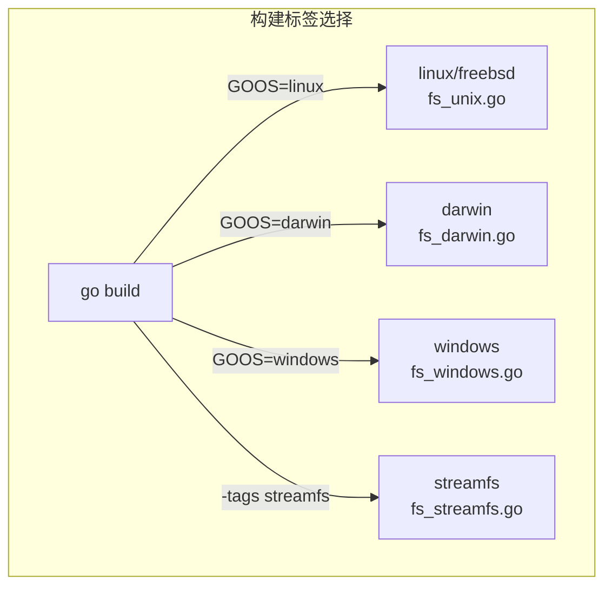

| 平台 | 文件 | Mmap 支持 | Fadvise 支持 | Fdatasync 支持 |
|------|------|-----------|-------------|---------------|
| Linux/FreeBSD | `fs_unix.go` | 完整支持 | 完整支持 | 完整支持 |
| macOS | `fs_darwin.go` | 不支持（空实现） | 不支持 | 不支持 |
| Windows | `fs_windows.go` | 不支持（空实现） | 不支持 | 不支持 |
| StreamFS | `fs_streamfs.go` | 不支持（空实现） | 不支持 | 通过 StreamFS Sync |

### 6.2 Linux mmap 实现

**代码位置**：`lib/fileops/fs_unix.go`

```go
func Mmap(fd int, offset int64, length int) (data []byte, err error) {
    if length <= 0 {
        length = 4 * 1024  // 最小 4KB
    }
    data, err = syscall.Mmap(fd, offset, length, syscall.PROT_READ, syscall.MAP_SHARED)
    if err != nil {
        return
    }
    // 设置随机访问提示，避免预读
    if err = Fadvise(fd, offset, int64(length), syscall.MADV_RANDOM); err != nil {
        return nil, fmt.Errorf("madvise: %+v", err)
    }
    return
}
```

### 6.3 mmap 读取路径

**代码位置**：`lib/fileops/fs_reader.go`

```go
type fileReader struct {
    fd       File
    name     string
    fileSize int64
    lock     *string
    mmapData []byte       // mmap 映射的数据
    once     *sync.Once
}
```

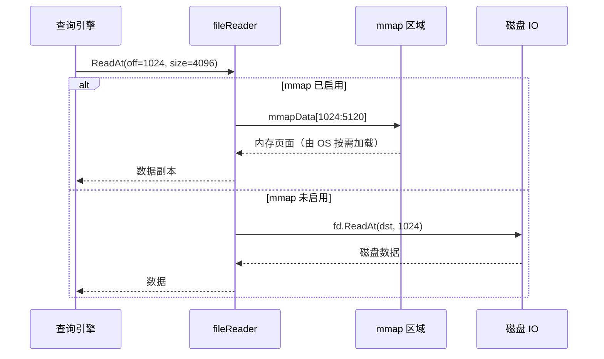

**mmap 读取的优势**：
- **零拷贝**：数据直接从页面缓存映射到进程地址空间
- **按需加载**：OS 按页面（4KB）按需加载，不预读
- **共享缓存**：多个进程可以共享同一文件的页面缓存
- **随机访问友好**：配合 `MADV_RANDOM` 提示，避免无效预读

**mmap 读取的劣势**：
- **仅限 Linux**：Windows 和 macOS 不支持
- **TLB 压力**：大量 mmap 映射会增加 TLB miss
- **不适合写入**：openGemini 中 mmap 仅用于只读场景（`PROT_READ`）

### 6.4 Fadvise — 预读策略控制

```go
// FADV_RANDOM: 随机访问模式，关闭预读（mmap 默认使用）
// FADV_SEQUENTIAL: 顺序访问模式，增加预读
// FADV_WILLNEED: 提示内核即将访问的区域
// FADV_DONTNEED: 提示内核不再需要的区域，释放页面缓存
// FADV_NOREUSE: 数据只会访问一次，不保留在页面缓存
```

---

## 7. OBS 对象存储集成

### 7.1 架构概览

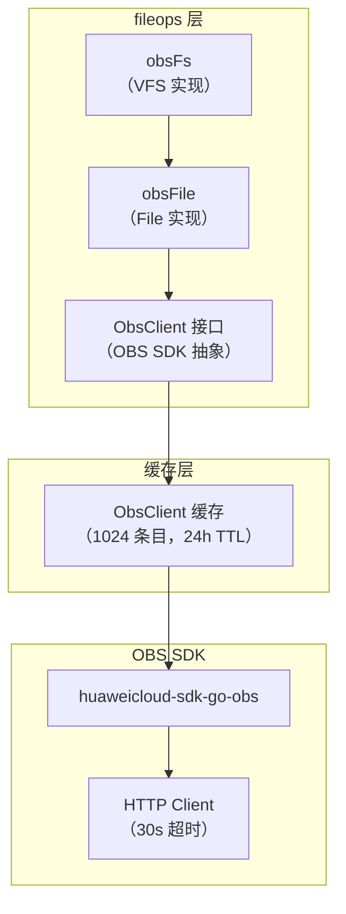

### 7.2 ObsClient 接口

**代码位置**：`lib/fileops/obs_client.go`

```go
type ObsClient interface {
    ListBuckets(input *obs.ListBucketsInput) (*obs.ListBucketsOutput, error)
    ListObjects(input *obs.ListObjectsInput) (*obs.ListObjectsOutput, error)
    GetObject(input *obs.GetObjectInput) (*obs.GetObjectOutput, error)
    DeleteObject(input *obs.DeleteObjectInput) (*obs.DeleteObjectOutput, error)
    DeleteObjects(input *obs.DeleteObjectsInput) (*obs.DeleteObjectsOutput, error)
    ModifyObject(input *obs.ModifyObjectInput) (*obs.ModifyObjectOutput, error)
    PutObject(input *obs.PutObjectInput) (*obs.PutObjectOutput, error)
    GetObjectMetadata(input *obs.GetObjectMetadataInput) (*obs.GetObjectMetadataOutput, error)
    RenameFile(input *obs.RenameFileInput) (*obs.RenameFileOutput, error)
    IsObsFile(input *obs.HeadObjectInput) (*obs.BaseModel, error)
    Do(r *http.Request) (*http.Response, error)
}
```

**通俗解释**：
`ObsClient` 接口是对华为云 OBS SDK 的二次抽象。为什么要再包一层？因为这样可以：
1. 缓存客户端实例，避免重复创建连接
2. 方便单元测试时注入 Mock 客户端
3. 统一重试策略和错误处理

### 7.3 客户端缓存

```go
const (
    ObsClientCacheSize = 1024        // 最多缓存 1024 个客户端
    ObsClientCacheTTL  = 24 * time.Hour  // 24 小时过期
)

func GetObsClient(conf *obsConf) (ObsClient, error) {
    entry, ok := obsClientCache.Get(conf.cacheKey())
    if !ok {
        newClient, err := newObsClient(conf)  // 创建新客户端
        obsClientCache.Put(conf.cacheKey(), newClientEntry(newClient), updateClientFunc)
        return newClient, nil
    }
    return entry.(*clientEntry).client, nil
}
```

缓存键格式：`{ak}|{endpoint}|{bucket}`

### 7.4 obsFile — OBS 文件实现

**代码位置**：`lib/fileops/obs_fs.go`

```go
type obsFile struct {
    key, fullPath string      // 对象键和完整路径
    client        ObsClient   // OBS 客户端
    conf          *obsConf    // 连接配置
    offset        int64       // 当前文件指针位置
    flag          int         // 打开标志（O_RDWR / O_APPEND 等）
}
```

**关键行为差异**：

| 操作 | 本地文件 | OBS 文件 |
|------|---------|---------|
| Write | `os.File.Write()` | `ObsClient.ModifyObject()`（追加写入） |
| Read | `os.File.Read()` | `ObsClient.GetObject()`（HTTP Range） |
| ReadAt | `os.File.ReadAt()` | `ObsClient.GetObject()`（RangeStart/RangeEnd） |
| Seek | `os.File.Seek()` | 仅更新内存 offset，不发起网络请求 |
| Sync | `os.File.Sync()` | 空操作（OBS 写入即持久化） |
| Truncate | `os.File.Truncate()` | HTTP PUT 请求（`?length=N&truncate`） |
| Close | `os.File.Close()` | 重置 offset，调用 Sync |
| Stat | `os.File.Stat()` | `ObsClient.GetObjectMetadata()` |

### 7.5 OBS 写入重试机制

```go
func (o *obsFile) Write(src []byte) (int, error) {
    for i := 0; i < ObsWriteRetryTimes; i++ {  // 最多重试 3 次
        modifyObjectInput := &obs.ModifyObjectInput{
            Bucket:        o.conf.bucket,
            Key:           o.key,
            Position:      o.offset,
            Body:          bytes.NewReader(src),
            ContentLength: int64(len(src)),
        }
        _, err = o.client.ModifyObject(modifyObjectInput)
        if err == nil {
            break
        }
    }
    // ...
}
```

**通俗解释**：
OBS 写入就像寄快递。快递员（网络）可能丢包裹（网络抖动），所以我们会重试最多 3 次。如果 3 次都失败了，才报告错误。

### 7.6 OBS 流式批量读取（StreamReadBatch）

**代码位置**：`lib/fileops/obs_fs.go`, `lib/fileops/reqeuest.go`

OBS 的 `StreamReadBatch` 是整个 fileops 模块中最复杂的部分。它的核心思想是：**将多个小的读取请求合并为少量大的 HTTP Range 请求**。

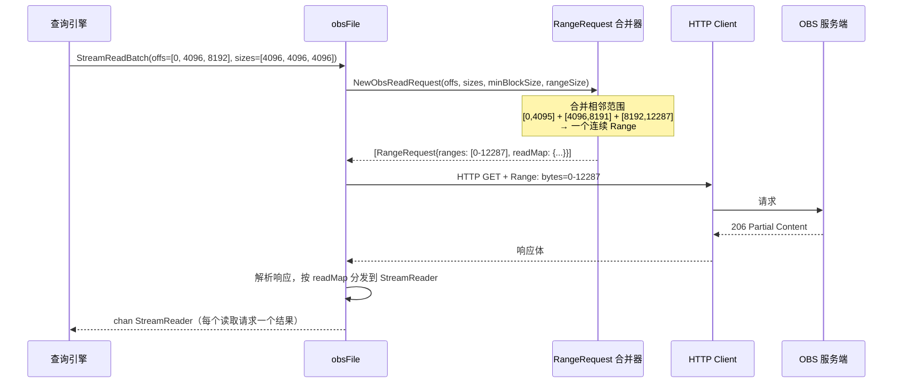

**合并策略**：

```go
// 单次请求最大 9MB
var ObsSingleRequestSize int64 = 9 * 1024 * 1024

// 默认合并 32 个 Range
var defaultObsRangeSize = 32
```

合并规则：
1. 相邻的读取范围（offset 连续）合并为一个 Range
2. 单个 RangeRequest 总大小不超过 9MB
3. 单个 RangeRequest 最多包含 32 个 Range 段
4. 超大读取（>9MB）自动拆分为多个 RangeRequest

**重试机制**：
- 读取失败时，将失败的范围加入 `retryCtx`
- 递归重试，最多 3 次
- 每次重试会重新合并失败的范围

---

## 8. StreamFS 分布式文件系统

### 8.1 概述

**代码位置**：`lib/fileops/fs_streamfs.go`

StreamFS 是通过 CGo 调用的分布式文件系统库（`libstream`），仅在构建时通过 `-tags streamfs` 启用。

```go
// #cgo CFLAGS: -I./../../c-deps/stream
// #cgo LDFLAGS: -lstdc++ -L/usr/lib64/libstream/lib -lstream
// #include "stream.h"
import "C"
```

### 8.2 架构

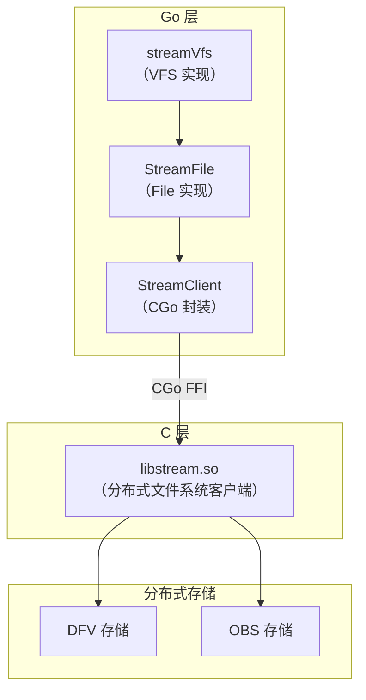

### 8.3 存储策略

StreamFS 支持两种存储策略：

| 策略 | 常量 | 说明 |
|------|------|------|
| DFV | `DfvStoragePolicy` | 分布式文件卷（默认） |
| OBS | `ObsStoragePolicy` | 对象存储（冷数据） |

```go
// 创建 DFV 文件
fd, err := sc.OpenFileV2(name, os.O_WRONLY, lockFilePath, priority)

// 创建 OBS 文件
fd, err := sc.OpenFileV3(name, os.O_WRONLY, lockFilePath, priority)

// 从 DFV 复制到 OBS
err := sc.CopyFileFromDFVToOBS(srcPath, dstPath, lockPath)
```

### 8.4 文件锁机制

StreamFS 中的文件操作都支持 `lockFilePath` 参数，用于分布式环境下的文件锁协调：

```go
type StreamFile struct {
    mu       sync.RWMutex   // 本地并发保护
    fd       C.streamFile   // C 层文件句柄
    name     string
    flag     int
    closed   bool
    lockFile string         // 分布式锁文件路径
}
```

**锁文件的使用场景**：
- `OpenFileV2` / `OpenFileV3`：打开文件时持有锁
- `closeFileV2`：关闭文件时释放锁
- `RenameFileV2`：重命名时需要锁
- `fsyncV2`：同步时需要锁
- `RemoveV2`：删除时需要锁

---

## 9. 文件读取器（BasicFileReader）

### 9.1 接口定义

**代码位置**：`lib/fileops/fs_reader.go`

```go
type BasicFileReader interface {
    Name() string
    Size() (int64, error)
    ReadAt(off int64, size uint32, dst *[]byte, ioPriority int) ([]byte, error)
    StreamReadBatch(off, length []int64, c chan *request.StreamReader, limit int, isStat bool)
    Rename(newName string) error
    RenameOnObs(newName string, tmp bool, obsOpt *obs.ObsOptions) error
    ReOpen() error
    IsMmapRead() bool
    IsOpen() bool
    FreeFileHandle() error
    Close() error
    ReadAll(dst []byte) ([]byte, error)
}
```

### 9.2 fileReader 实现

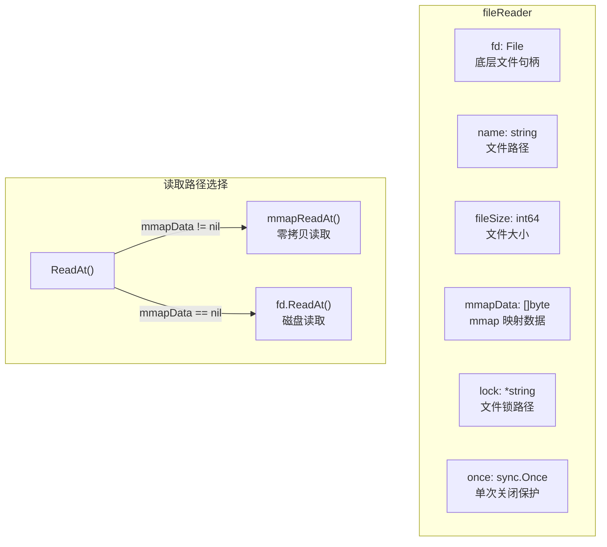

### 9.3 ReadAt 读取流程

```go
func (r *fileReader) ReadAt(off int64, size uint32, dstPtr *[]byte, ioPriority int) ([]byte, error) {
    // 边界检查
    if off < 0 || off > r.fileSize {
        return nil, fmt.Errorf("invalid read offset")
    }

    // mmap 路径
    if len(r.mmapData) > 0 {
        return r.mmapReadAt(off, size, dstPtr)
    }

    // 磁盘读取路径
    *dstPtr = bufferpool.Resize(*dstPtr, int(size))
    n, err := r.fd.ReadAt(dst, off)

    // IO 优先级统计
    if ioPriority == IO_PRIORITY_LOW_READ {
        // 后台读取统计
        BackGroundReaderWait(int(size))  // 限速等待
    } else {
        // 前台读取统计
    }
    return dst[:n], nil
}
```

### 9.4 文件句柄管理

**ReOpen — 重新打开文件**：
```go
func (r *fileReader) ReOpen() error {
    lock := FileLockOption("")
    pri := FilePriorityOption(IO_PRIORITY_NORMAL)
    r.fd, err = Open(r.name, lock, pri)
    if MmapEn {
        r.mmapData, err = Mmap(int(r.fd.Fd()), 0, int(r.fileSize))
    }
    r.once = new(sync.Once)
    return nil
}
```

**FreeFileHandle — 释放文件句柄（保留元数据）**：
```go
func (r *fileReader) FreeFileHandle() error {
    if err := r.close(); err != nil {
        return err
    }
    r.fd = nil  // 句柄释放，但 name/fileSize 等元数据保留
    return nil
}
```

**Close — 完全关闭**：
```go
func (r *fileReader) Close() error {
    // 清除读缓存
    if ReadMetaCacheEn {
        readcache.GetReadMetaCacheIns().Remove(r.Name())
    }
    if ReadDataCacheEn {
        readcache.GetReadDataCacheIns().RemovePageCache(r.Name())
    }
    return r.close()
}
```

---

## 10. 文件写入器（BasicFileWriter）

### 10.1 接口定义

**代码位置**：`lib/fileops/fs_writer.go`

```go
type BasicFileWriter interface {
    Write(b []byte) (int, error)
    Close() error
    Size() int
    Reset(lw NameReadWriterCloser)
    Bytes() []byte
    CopyTo(w io.Writer) (int, error)
    SwitchMetaBuffer()
    MetaDataBlocks(dst [][]byte) [][]byte
    GetWriter() *bufio.Writer
}
```

### 10.2 fileWriter 实现

```go
type fileWriter struct {
    lw   NameReadWriterCloser   // 底层文件（带名称的 ReadWriteCloser）
    w    *bufio.Writer          // 带缓冲的写入器
    n    int                    // 已写入字节数
    lock *string                // 文件锁路径
}
```

**缓冲区大小**：

| 常量 | 值 | 说明 |
|------|---|------|
| DefaultWriterBufferSize | 1MB | 默认写入缓冲区 |
| DefaultBufferSize | 256KB | 默认通用缓冲区 |
| maxBufferSize | 1MB | 最大缓冲区 |
| minBufferSize | 4KB | 最小缓冲区 |

### 10.3 CopyTo — 写入后复制

```go
func (w *fileWriter) CopyTo(to io.Writer) (int, error) {
    // 1. 刷新缓冲区
    w.w.Flush()
    // 2. 关闭当前文件
    w.lw.Close()
    // 3. 以只读方式重新打开
    fd, _ := Open(name, lock)
    // 4. 复制到目标 writer
    wn, _ := io.CopyBuffer(to, fd, buf)
    // 5. 关闭并删除临时文件
    fd.Close()
    Remove(fn, FileLockOption(*w.lock))
    return int(wn), nil
}
```

### 10.4 FileWriter 和 MetaWriter 接口

```go
type FileWriter interface {
    WriteData(b []byte) (int, error)
    WriteChunkMeta(b []byte) (int, error)
    Close() error
    DataSize() int64
    ChunkMetaSize() int64
    GetFileWriter() BasicFileWriter
    AppendChunkMetaToData() error
    // ...
}

type MetaWriter interface {
    WriteMetaIndex(b []byte) (int, error)
    WritePrimaryKey(b []byte) (int, error)
    WriteBloomFilter(bfIdx int, b []byte) (int, error)
    // ...
}
```

这两个接口是 TSSP 文件写入器的抽象，分别用于写入数据区和元数据区。

---

## 11. 内存文件（MemFile）

### 11.1 结构体

**代码位置**：`lib/fileops/mem_file.go`

```go
type MemFile struct {
    maxSize int64    // 最大容量
    size    int64    // 当前大小
    data    []byte   // 数据缓冲区
}
```

### 11.2 使用场景

`MemFile` 是一个纯内存的文件模拟器，用于：
1. **Shelf WAL / HotMode 缓存**：在 Shelf WAL 相关路径中作为内存读写缓存
2. **测试辅助**：单元测试中模拟文件操作
3. **小数据缓冲**：适合受控大小的数据块；当前没有看到 compaction 主流程把它作为通用临时文件抽象使用

```go
// 创建最大 1MB 的内存文件
mf := fileops.NewMemFile(1024 * 1024)

// 写入数据
mf.Write([]byte("hello"))

// 读取数据
buf := make([]byte, 5)
n, err := mf.ReadAt(buf, 0)  // 读取 "hello"

// 从磁盘文件加载
mf.Load(diskFile, fileSize)
```

---

## 12. IO 限速器（Limiter）

### 12.1 设计

**代码位置**：`lib/fileops/limiter.go`

```go
var BackgroundReadLimiter = NewLimiter(64*1024*1024, 64*1024*1024)  // 64MB/s

type Limiter interface {
    SetBurst(newBurst int)
    SetLimit(newLimit rate.Limit)
    WaitN(ctx context.Context, n int) (err error)
    Limit() rate.Limit
    Burst() int
}
```

### 12.2 LimitWriter — 限速写入器

```go
type LimitWriter struct {
    w       NameReadWriterCloser
    limiter Limiter
}

func (w *LimitWriter) Write(p []byte) (int, error) {
    buf := p
    for len(buf) > 0 {
        writeN := min(len(buf), w.limiter.Burst())
        wn, err := w.w.Write(buf[:writeN])
        w.limiter.WaitN(w.ctx, wn)  // 等待令牌桶补充
        buf = buf[wn:]
    }
    return n, nil
}
```

**通俗解释**：
限速器就像水管上的阀门。后台 Compaction 读取数据时，阀门会控制水流速度（64MB/s），确保不会把水管（磁盘 IO 带宽）全部占满，留出空间给前台查询。

### 12.3 后台读取限速

```go
func (r *fileReader) ReadAt(off int64, size uint32, dstPtr *[]byte, ioPriority int) ([]byte, error) {
    // ... 读取逻辑 ...

    if ioPriority == IO_PRIORITY_LOW_READ {
        err = BackGroundReaderWait(int(size))  // 限速等待
        // 统计后台读取指标
        atomic.AddInt64(&statistics.IOStat.IOBackReadDuration, time.Since(start).Nanoseconds())
    } else {
        // 统计前台读取指标
        atomic.AddInt64(&statistics.IOStat.IOFrontReadDuration, time.Since(start).Nanoseconds())
    }
}
```

---

## 13. 目录操作

### 13.1 OBS 目录模拟

OBS 是扁平的对象存储，没有真正的"目录"概念。`obsFs` 通过以下方式模拟目录：

```go
// 创建目录 = 创建一个以 "/" 结尾的空对象
func (o *obsFs) MkdirAll(path string, perm os.FileMode, opt ...FSOption) error {
    input := &obs.PutObjectInput{
        Body: bytes.NewReader([]byte{}),
    }
    input.Key = o.NormalizeDirPath(key)  // 确保以 "/" 结尾
    _, err = client.PutObject(input)
    return err
}

// 路径标准化
func (o *obsFs) NormalizeDirPath(path string) string {
    i := 0
    for path[i] == '/' { i++ }
    return filepath.Clean(path[i:]) + "/"
}
```

### 13.2 目录读取

```go
func (o *obsFs) ReadDir(path string) ([]os.FileInfo, error) {
    listInput := &obs.ListObjectsInput{
        Bucket: conf.bucket,
        Prefix: o.NormalizeDirPath(key),
    }
    objs, err := client.ListObjects(listInput)
    // 将 OBS 对象列表转换为 []os.FileInfo
}
```

### 13.3 目录删除

```go
func (o *obsFs) RemoveAll(path string, opt ...FSOption) error {
    // 1. 列出所有对象
    objs, _ := client.ListObjects(listInput)
    // 2. 按键倒序排列（先删子对象，再删父目录）
    sort.Slice(objs.Contents, func(i, j int) bool {
        return objs.Contents[i].Key > objs.Contents[j].Key
    })
    // 3. 逐个删除
    for _, obj := range objs.Contents {
        client.DeleteObject(delInput)
    }
}
```

---

## 14. 辅助工具函数

### 14.1 路径操作

| 函数 | 说明 |
|------|------|
| `Join(path...)` | 智能路径拼接（OBS 用字符串拼接，Local 用 filepath.Join） |
| `Clean(path)` | 路径清理（OBS 不清理，Local 用 filepath.Clean） |
| `GetLocalFileName(fName)` | 将 OBS 路径转换为本地路径 |
| `GetRemoteDataPath(obsOpt, dataPath)` | 将本地路径转换为 OBS 路径 |
| `GetRemotePrefixPath(obsOpt)` | 获取 OBS 路径前缀 |

### 14.2 文件信息工具

| 函数 | 说明 |
|------|------|
| `FindDir(dirs, dirName)` | 在目录列表中查找指定目录 |
| `DirNotExists(err)` | 判断错误是否为"目录不存在" |
| `GetSubDirNamesForObsReadDirs(fis, prefix)` | 从 OBS 目录列表提取子目录名 |
| `GetSubDirFiles(fis, prefix)` | 从 OBS 目录列表提取子目录文件 |

### 14.3 OBS 路径编解码

```go
// 编码：将 OBS 配置编码为路径字符串
func EncodeObsPath(endpoint, bucket, path, ak, sk string) string {
    return fmt.Sprintf("%s%s/%s/%s/%s/%s", ObsPrefix, endpoint, ak, sk, bucket, path)
}

// 解码：从路径字符串解析 OBS 配置
func decodeObsPath(path string) (endpoint, ak, sk, bucket, basePath string, err error) {
    // 解析 ObsPrefix + endpoint/ak/sk/bucket/basePath 格式
}
```

`ObsPrefix` 是全局前缀，当前实现只按一个前缀判断 OBS 路径。TimeSeries 和 LogKeeper 的前缀差异属于产品类型差异，不能在同一个运行时里假设两种格式都可被 `GetFsType()` 识别。

---

## 15. 读缓存集成

### 15.1 缓存开关

```go
var MmapEn = false          // mmap 读取开关
var ReadMetaCacheEn = false // 元数据缓存开关
var ReadDataCacheEn = false // 数据缓存开关
```

### 15.2 缓存层级

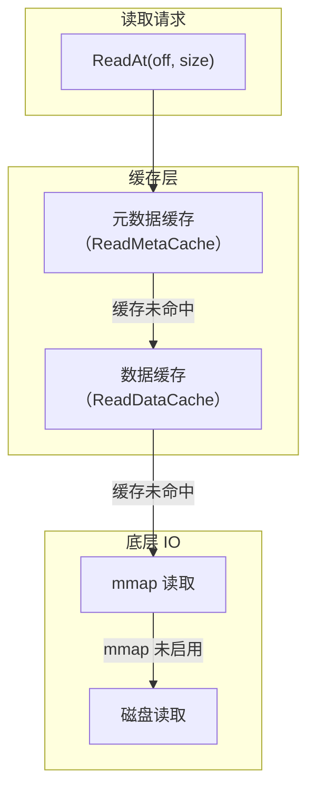

---

## 16. 端到端数据流

### 16.1 写入场景：MemTable flush 到 TSSP 文件

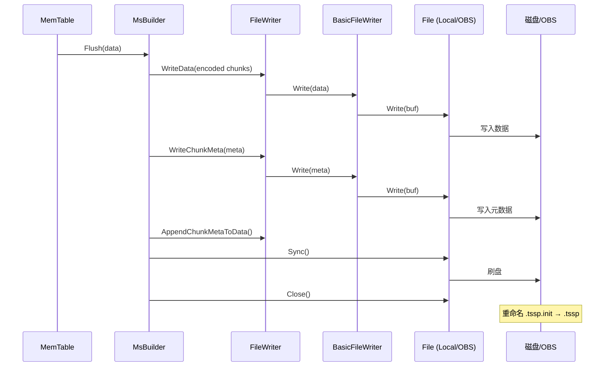

### 16.2 查询场景：读取 TSSP 数据块

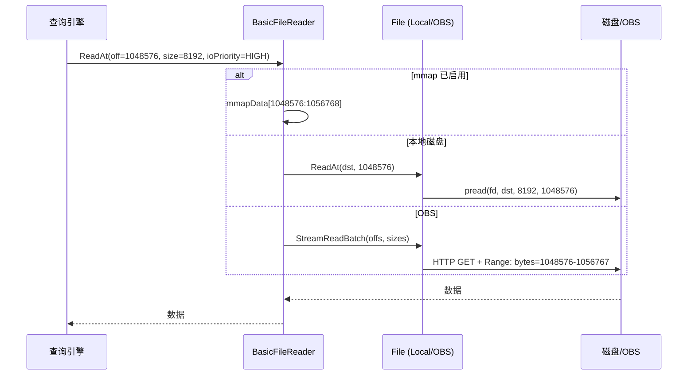

---

## 17. 总结：文件操作抽象层的关键设计

| 设计 | 目的 | 效果 |
|------|------|------|
| File + VFS 双接口 | 统一文件和文件系统操作 | 上层代码零修改切换存储后端 |
| 路径前缀路由 | 根据路径自动选择存储后端 | 透明的多存储支持 |
| FSOption 可选参数 | IO 优先级和文件锁 | 前台查询优先，后台任务限速 |
| IO 统计埋点 | 所有读写操作自动采集指标 | 实时监控 IO 性能 |
| mmap 支持 | 零拷贝随机读取 | Linux 上 TSSP 查询性能提升 |
| OBS Range 合并 | 将多个小读取合并为少量大请求 | 减少 OBS HTTP 请求次数 |
| ObsClient 缓存 | 复用 OBS 连接 | 避免重复创建连接的开销 |
| IO 限速器 | 控制后台读取带宽 | 避免后台 Compaction 影响前台查询 |
| StreamFS CGo 集成 | 支持分布式文件系统 | 冷热数据分层存储 |
| MemFile | 纯内存文件模拟 | Shelf WAL / HotMode 内存缓存和测试辅助 |
| 文件锁机制 | 分布式环境下的文件协调 | 防止并发写入冲突 |
| 读缓存集成 | 元数据和数据缓存 | 减少重复 IO，提升查询性能 |
