# Module 30: Metadata Client 深度设计文档

> 元数据客户端是 openGemini 三层架构中连接 ts-sql/ts-store 与 ts-meta 的核心桥梁。每个流程都配有 Mermaid 时序图 + 核心代码逐行解释。

---

## 1. MetaClient 是什么？为什么需要它？

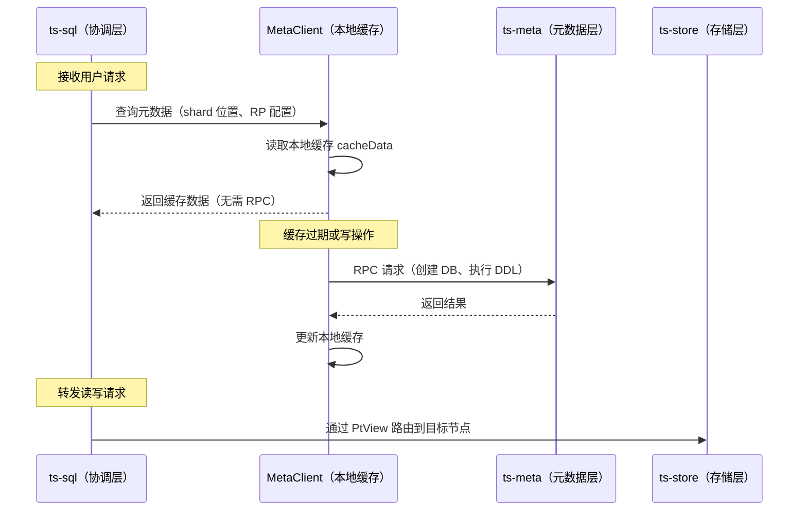
```mermaid
sequenceDiagram
    participant SQL as ts-sql（协调层）
    participant MC as MetaClient（本地缓存）
    participant Meta as ts-meta（元数据层）
    participant Store as ts-store（存储层）

    Note over SQL: 接收用户请求
    SQL->>MC: 查询元数据（shard 位置、RP 配置）
    MC->>MC: 读取本地缓存 cacheData
    MC-->>SQL: 返回缓存数据（无需 RPC）

    Note over MC: 缓存过期或写操作
    MC->>Meta: RPC 请求（创建 DB、执行 DDL）
    Meta-->>MC: 返回结果
    MC->>MC: 更新本地缓存

    Note over SQL: 转发读写请求
    SQL->>Store: 通过 PtView 路由到目标节点
```

**通俗解释**：

openGemini 是三层架构：ts-sql（协调）、ts-meta（元数据）、ts-store（存储）。MetaClient 是运行在每个 ts-sql 和 ts-store 节点上的**本地元数据缓存客户端**。它的核心价值在于：

1. **减少 RPC 开销**：元数据查询（如 shard 位置、数据库配置）直接从本地缓存读取，无需每次都访问 ts-meta
2. **统一 DDL 入口**：所有 DDL 操作（创建数据库、表、RP）通过 MetaClient 转发到 ts-meta Leader
3. **保证一致性**：通过版本号（Index）和快照机制，确保本地缓存与 ts-meta 保持最终一致
4. **故障容错**：自动重试、Leader 发现、服务器轮换

**核心代码**：`lib/metaclient/meta_client.go:129-144` — MetaClient 接口定义

```go
// MetaClient 是访问元数据的接口
type MetaClient interface {
    MetadataManager      // 元数据查询：Databases, Measurements, Schema, PtView
    DatabaseManager      // 数据库管理：Create/MarkDelete Database, RP
    NodeManager          // 节点管理：ShowCluster, CreateDataNode, DeleteDataNode
    ShardManager         // Shard 管理：ShowShards, ShardOwner, GetAliveShards
    UserManager          // 用户管理：CreateUser, Authenticate, SetPrivilege
    SystemManager        // 系统管理：SendSysCtrlToMeta, InsertFiles
    SubscriptionManager // 订阅管理：CreateSubscription, DropSubscription
    ContinuousQueryManager // 连续查询：CreateCQ, ShowCQs, DropCQ
    DownSampleManager    // 降采样：NewDownSamplePolicy, DropDownSamplePolicy
    RepManager           // 复制管理：ThermalShards, DBRepGroups
    MeasurementManager   // 表管理：CreateMeasurement, AlterShardKey
    StreamManager        // 流处理：CreateStreamPolicy, DropStream
    OpenAtStore() error  // ts-store 专用初始化
    RetryRegisterQueryIDOffset(host string) (uint64, error)
}
```

**逐行解释**：
- **第 129 行**：`MetaClient` 是一个组合接口，由 12 个子接口组成
- **第 130-141 行**：12 个子接口覆盖了元数据管理的所有方面
- **第 142 行**：`OpenAtStore` 是 ts-store 节点专用的初始化方法，启动数据节点验证
- **第 143 行**：`RetryRegisterQueryIDOffset` 为 ts-sql 节点注册全局唯一的查询 ID 偏移量

**具体例子**：

```
用户执行：CREATE DATABASE monitor

通信流程：
  1. 用户 → ts-sql
     → 接收 DDL 请求

  2. ts-sql → MetaClient.CreateDatabase("monitor", ...)
     → 先检查本地缓存：数据库是否已存在？
     → 不存在，构建 CreateDatabaseCommand
     → 通过 RPC 发送到 ts-meta Leader

  3. ts-meta Leader
     → 执行 CreateDatabaseCommand
     → 通过 Raft 复制到 Follower
     → 返回成功 + 新的 Index

  4. MetaClient
     → waitForIndex(index)
     → 通过 pollForUpdates 获取最新快照
     → 更新本地缓存 cacheData

  5. MetaClient → ts-sql
     → 返回 DatabaseInfo

用户后续查询：SELECT * FROM cpu
  → MetaClient 直接从本地缓存读取 shard 位置
  → 无需访问 ts-meta（零 RPC 开销）
```

---

## 2. Client 结构体 — 核心实现

### 2.1 结构体总览

```mermaid
classDiagram
    class Client {
        +tls bool
        +logger *Logger
        +nodeID uint64
        +Clock uint64
        +ShardDurations map
        +DBBriefInfos map
        -mu sync.RWMutex
        -metaServers []string
        -closing chan struct{}
        -changed chan chan struct{}
        -cacheData *Data
        -auth *Auth
        -weakPwdPath string
        +ShardTier uint64
        -replicaInfoManager *ReplicaInfoManager
        +UseSnapshotV2 bool
        +RetentionAutoCreate bool
        +SendRPCMessage
    }

    class MetaClient {
        <<interface>>
        +MetadataManager
        +DatabaseManager
        +NodeManager
        +ShardManager
        +UserManager
        +SystemManager
        +SubscriptionManager
        +ContinuousQueryManager
        +DownSampleManager
        +RepManager
        +MeasurementManager
        +StreamManager
        +OpenAtStore() error
        +RetryRegisterQueryIDOffset() uint64
    }

    MetaClient <|.. Client : implements
```

**核心代码**：`lib/metaclient/meta_client_impl.go:59-85`

```go
// Client 用于执行命令和读取 meta 服务集群的数据
type Client struct {
    tls            bool                 // 是否启用 TLS
    logger         *logger.Logger       // 日志
    nodeID         uint64               // 本节点 ID
    Clock          uint64               // 逻辑时钟
    ShardDurations map[uint64]*meta2.ShardDurationInfo  // Shard 持续时间信息
    DBBriefInfos   map[string]*meta2.DatabaseBriefInfo   // 数据库简要信息

    mu          sync.RWMutex    // 保护 cacheData 的读写锁
    metaServers []string        // ts-meta 服务器地址列表
    closing     chan struct{}    // 关闭信号
    changed     chan chan struct{}  // 数据变更通知通道
    cacheData   *meta2.Data     // 本地元数据缓存（核心）

    auth        *Auth           // 认证模块
    weakPwdPath string          // 弱密码字典路径
    ShardTier   uint64          // 存储层标识

    replicaInfoManager *ReplicaInfoManager  // 复制信息管理器

    UseSnapshotV2       bool    // 是否使用 V2 快照协议
    RetentionAutoCreate bool    // 是否自动创建默认 RP

    SendRPCMessage              // RPC 消息发送接口
}
```

**逐行解释**：
- **第 67 行**：`mu sync.RWMutex` 保护 `cacheData` 的并发读写。读操作（查询元数据）用 `RLock`，写操作（更新缓存）用 `Lock`
- **第 68 行**：`metaServers` 是 ts-meta 节点地址列表，客户端会轮换尝试连接
- **第 70 行**：`changed` 是一个 channel 的 channel，用于通知等待数据变更的 goroutine
- **第 71 行**：`cacheData *meta2.Data` 是整个元数据缓存的核心，包含所有数据库、RP、Shard、节点信息
- **第 74 行**：`auth` 负责密码哈希、认证缓存、登录失败锁定
- **第 82 行**：`UseSnapshotV2` 启用 Snapshot V2 协议，优先传输增量命令；当服务端 OpsMap 无法覆盖客户端 index 时，返回 AllClear 全量数据兜底

**通俗解释**：
Client 就像一个"元数据秘书"：
- **cacheData** 是秘书的"笔记本"，记录了所有数据库、表、Shard 的信息
- **metaServers** 是秘书需要联系的"总部"（ts-meta）的电话号码
- **mu** 是"笔记本的锁"，防止多人同时读写
- **changed** 是"通知铃"，当笔记本更新时响铃通知等待的人
- **auth** 是"门禁卡系统"，验证用户身份

### 2.2 构造函数

**核心代码**：`lib/metaclient/meta_client_impl.go:151-167`

```go
// NewClient 返回一个新的 *Client
func NewClient(weakPwdPath string, retentionAutoCreate bool, maxConcurrentWriteLimit int) *Client {
    cli := &Client{
        cacheData:          &meta2.Data{},                        // 初始化空缓存
        closing:            make(chan struct{}),                   // 关闭信号
        changed:            make(chan chan struct{}, maxConcurrentWriteLimit), // 变更通知
        weakPwdPath:        weakPwdPath,                          // 弱密码字典路径
        logger:             logger.NewLogger(errno.ModuleMetaClient).With(zap.String("service", "metaclient")),
        replicaInfoManager: NewReplicaInfoManager(),              // 复制信息管理器
        SendRPCMessage:     &RPCMessageSender{},                  // RPC 发送器
    }
    cli.auth = NewAuth(cli.logger)                                // 初始化认证模块
    cliOnce.Do(func() {
        DefaultMetaClient = cli                                   // 全局单例
    })
    return cli
}
```

**逐行解释**：
- **第 153 行**：`cacheData` 初始化为空的 `meta2.Data`，后续通过 `Open()` 从 ts-meta 加载
- **第 155 行**：`changed` 的 buffer 大小 = `maxConcurrentWriteLimit`，限制并发写入数
- **第 162 行**：`cliOnce.Do` 确保 `DefaultMetaClient` 只初始化一次（全局单例）

---

## 3. 连接管理 — 与 ts-meta 的通信

### 3.1 初始化流程

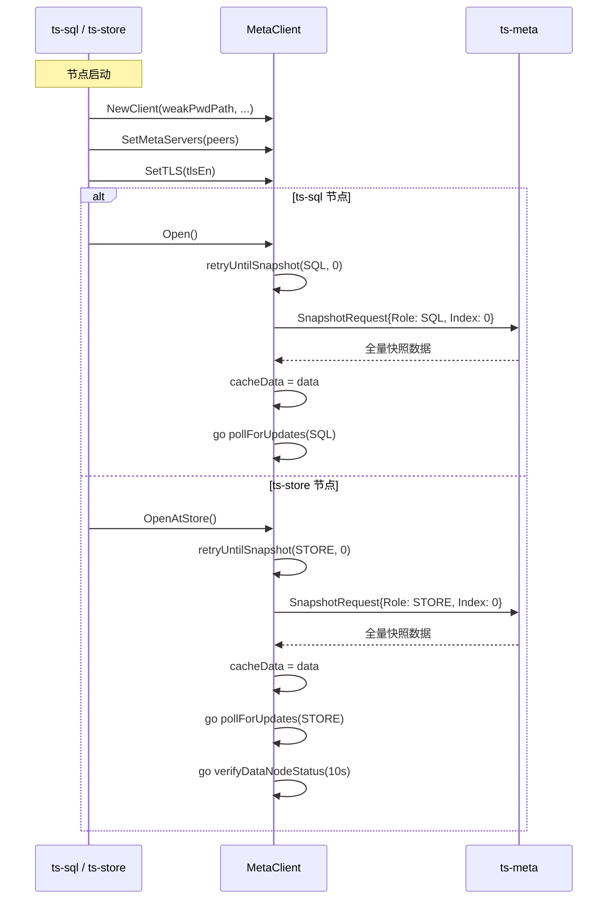
```mermaid
sequenceDiagram
    participant Node as ts-sql / ts-store
    participant MC as MetaClient
    participant Meta as ts-meta

    Note over Node: 节点启动
    Node->>MC: NewClient(weakPwdPath, ...)
    Node->>MC: SetMetaServers(peers)
    Node->>MC: SetTLS(tlsEn)

    alt ts-sql 节点
        Node->>MC: Open()
        MC->>MC: retryUntilSnapshot(SQL, 0)
        MC->>Meta: SnapshotRequest{Role: SQL, Index: 0}
        Meta-->>MC: 全量快照数据
        MC->>MC: cacheData = data
        MC->>MC: go pollForUpdates(SQL)
    else ts-store 节点
        Node->>MC: OpenAtStore()
        MC->>MC: retryUntilSnapshot(STORE, 0)
        MC->>Meta: SnapshotRequest{Role: STORE, Index: 0}
        Meta-->>MC: 全量快照数据
        MC->>MC: cacheData = data
        MC->>MC: go pollForUpdates(STORE)
        MC->>MC: go verifyDataNodeStatus(10s)
    end
```

**核心代码**：`lib/metaclient/meta_client_impl.go:195-234`

```go
// Open 打开与 meta 服务集群的连接
func (c *Client) Open() error {
    if c.auth == nil {
        c.auth = NewAuth(c.logger)
    }
    if c.UseSnapshotV2 {
        meta2.DataLogger = logger.GetLogger().With(zap.String("service", "data"))
        err := c.retryUntilSnapshotV2(SQL, 0)  // V2 协议：增量优先，全量兜底
        if err != nil {
            c.logger.Error("client has been closed:", zap.String("err:", err.Error()))
            return err
        }
        go c.pollForUpdatesV2(SQL)             // 后台轮询增量更新
    } else {
        c.cacheData = c.retryUntilSnapshot(SQL, 0)  // V1 协议：全量快照
        go c.pollForUpdates(SQL)               // 后台轮询全量更新
    }
    return nil
}

// OpenAtStore 是 ts-store 节点的初始化
func (c *Client) OpenAtStore() error {
    if c.UseSnapshotV2 {
        meta2.DataLogger = logger.GetLogger().With(zap.String("service", "data"))
        err := c.retryUntilSnapshotV2(STORE, 0)
        if err != nil {
            c.logger.Error("client has been closed:", zap.String("err:", err.Error()))
            return err
        }
        go c.pollForUpdatesV2(STORE)
    } else {
        c.cacheData = c.retryUntilSnapshot(STORE, 0)
        go c.pollForUpdates(STORE)
    }
    go c.verifyDataNodeStatus(time.Second * 10)  // 每 10 秒验证节点状态
    return nil
}
```

**逐行解释**：
- **第 199-208 行**：V2 协议使用 `retryUntilSnapshotV2`，优先传输增量变更；如果增量链不可用，则通过 AllClear 全量数据替换缓存
- **第 209-212 行**：V1 协议使用 `retryUntilSnapshot`，传输全量元数据快照
- **第 229 行**：`verifyDataNodeStatus` 是 ts-store 特有的，定期验证本节点在 ts-meta 中的状态，防止网络分区后数据不一致

**通俗解释**：
- **Open()** 是 ts-sql 节点的初始化，从 ts-meta 加载全量元数据，然后后台持续同步
- **OpenAtStore()** 是 ts-store 节点的初始化，除了加载元数据，还启动节点状态验证
- **V1 vs V2**：V1 每次传输全量快照（简单但数据量大），V2 增量优先、全量兜底（高效但实现复杂）

### 3.2 RPC 消息发送

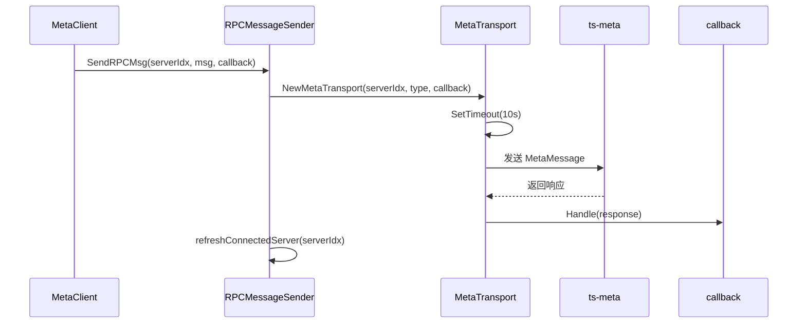
```mermaid
sequenceDiagram
    participant MC as MetaClient
    participant Sender as RPCMessageSender
    participant Transport as MetaTransport
    participant Meta as ts-meta

    MC->>Sender: SendRPCMsg(serverIdx, msg, callback)
    Sender->>Transport: NewMetaTransport(serverIdx, type, callback)
    Transport->>Transport: SetTimeout(10s)
    Transport->>Meta: 发送 MetaMessage
    Meta-->>Transport: 返回响应
    Transport->>callback: Handle(response)
    Sender->>Sender: refreshConnectedServer(serverIdx)
```

**核心代码**：`lib/metaclient/meta_client.go:332-346`

```go
type RPCMessageSender struct{}

func (s *RPCMessageSender) SendRPCMsg(currentServer int, msg *message.MetaMessage, callback transport.Callback) error {
    trans, err := transport.NewMetaTransport(uint64(currentServer), spdy.MetaRequest, callback)
    if err != nil {
        return err
    }
    trans.SetTimeout(RPCReqTimeout)  // 10 秒超时
    if err = trans.Send(msg); err != nil {
        return err
    }
    if err = trans.Wait(); err != nil {
        return err
    }
    refreshConnectedServer(currentServer)  // 更新当前连接的服务器索引
    return nil
}
```

**逐行解释**：
- **第 334 行**：`NewMetaTransport` 创建一个 SPDY 传输通道，`currentServer` 是 metaServers 数组的索引
- **第 337 行**：超时 10 秒，防止无限等待
- **第 345 行**：`refreshConnectedServer` 更新全局 `connectedServer` 变量，下次请求优先使用这个服务器

### 3.3 设置 Meta 服务器

**核心代码**：`lib/metaclient/meta_client_impl.go:274-282`

```go
// SetMetaServers 更新客户端的 meta 服务器列表
func (c *Client) SetMetaServers(a []string) {
    c.mu.Lock()
    defer c.mu.Unlock()
    c.metaServers = a

    for i, server := range a {
        transport.NewMetaNodeManager().Add(uint64(i), server)  // 注册到节点管理器
    }
}
```

**逐行解释**：
- **第 280 行**：将每个 meta 服务器地址注册到 `MetaNodeManager`，后续 RPC 通过索引查找地址

---

## 4. 缓存更新机制 — V1 全量快照 vs V2 增量更新

### 4.1 V1 全量快照轮询

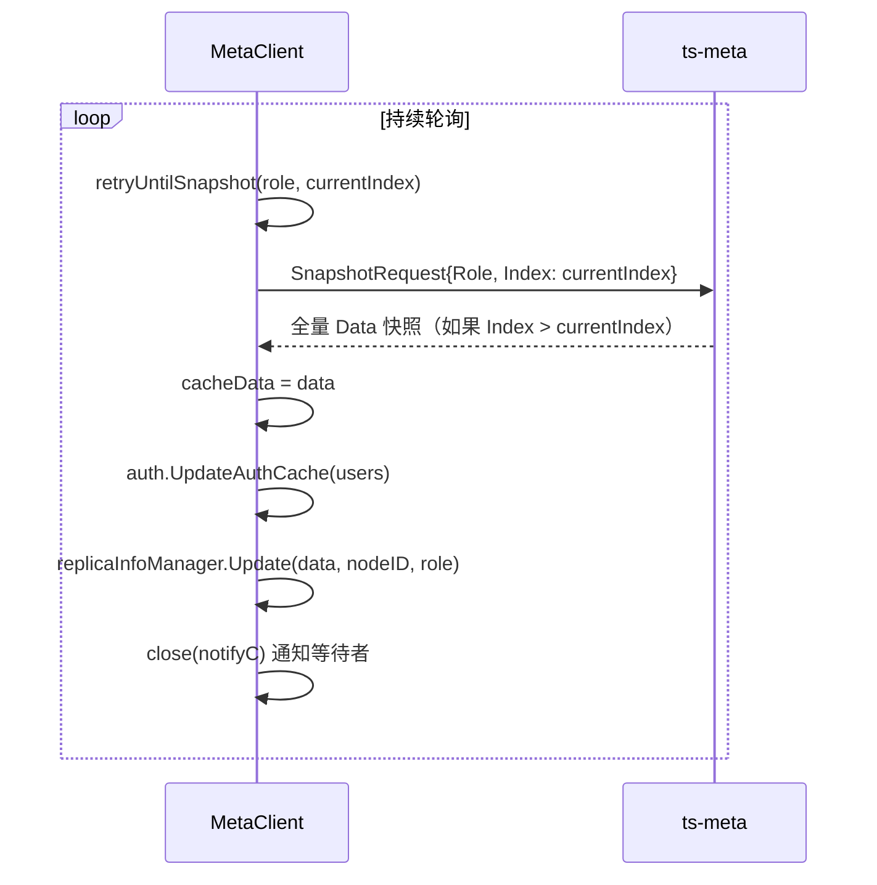
```mermaid
sequenceDiagram
    participant MC as MetaClient
    participant Meta as ts-meta

    loop 持续轮询
        MC->>MC: retryUntilSnapshot(role, currentIndex)
        MC->>Meta: SnapshotRequest{Role, Index: currentIndex}
        Meta-->>MC: 全量 Data 快照（如果 Index > currentIndex）
        MC->>MC: cacheData = data
        MC->>MC: auth.UpdateAuthCache(users)
        MC->>MC: replicaInfoManager.Update(data, nodeID, role)
        MC->>MC: close(notifyC) 通知等待者
    end
```

**核心代码**：`lib/metaclient/meta_client_impl.go:2413-2436`

```go
// pollForUpdates 后台轮询元数据更新
func (c *Client) pollForUpdates(role Role) {
    for {
        data := c.retryUntilSnapshot(role, c.index())  // 获取最新快照
        if data == nil {
            c.logger.Error("client has been closed")
            return
        }
        c.mu.Lock()
        idx := c.cacheData.Index
        if idx < data.Index {                           // 新快照的 Index 更大
            c.cacheData = data                          // 替换整个缓存
            c.auth.UpdateAuthCache(data.Users)          // 更新认证缓存
            c.replicaInfoManager.Update(data, c.nodeID, role)  // 更新复制信息
            for len(c.changed) > 0 {                    // 通知所有等待者
                notifyC := <-c.changed
                close(notifyC)
            }
        }
        c.mu.Unlock()
    }
}
```

**逐行解释**：
- **第 2416 行**：`retryUntilSnapshot` 从 ts-meta 获取最新快照，自动重试直到成功
- **第 2423 行**：比较 Index，只有新快照的 Index 更大才更新（防止旧数据覆盖新数据）
- **第 2424 行**：直接替换整个 `cacheData`（原子操作）
- **第 2427-2430 行**：通过 `close(notifyC)` 通知所有调用 `WaitForDataChanged()` 的 goroutine

### 4.2 V2 增量更新轮询

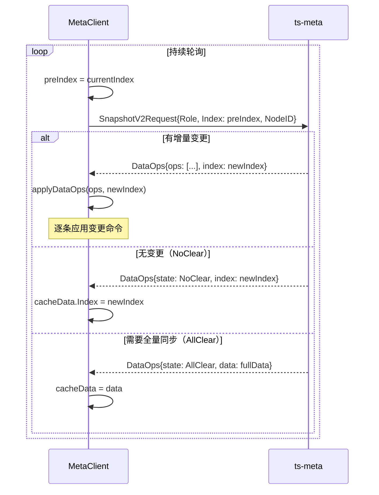
```mermaid
sequenceDiagram
    participant MC as MetaClient
    participant Meta as ts-meta

    loop 持续轮询
        MC->>MC: preIndex = currentIndex
        MC->>Meta: SnapshotV2Request{Role, Index: preIndex, NodeID}
        alt 有增量变更
            Meta-->>MC: DataOps{ops: [...], index: newIndex}
            MC->>MC: applyDataOps(ops, newIndex)
            Note over MC: 逐条应用变更命令
        else 无变更（NoClear）
            Meta-->>MC: DataOps{state: NoClear, index: newIndex}
            MC->>MC: cacheData.Index = newIndex
        else 需要全量同步（AllClear）
            Meta-->>MC: DataOps{state: AllClear, data: fullData}
            MC->>MC: cacheData = data
        end
    end
```

**核心代码**：`lib/metaclient/meta_client_impl.go:2438-2460`

```go
// pollForUpdatesV2 后台轮询增量更新（V2 协议）
func (c *Client) pollForUpdatesV2(role Role) {
    for {
        preIndex := c.index()
        err := c.retryUntilSnapshotV2(role, preIndex)  // 获取增量更新
        if err != nil {
            c.logger.Error("client has been closed:", zap.String("err:", err.Error()))
            return
        }
        c.mu.Lock()
        if preIndex < c.cacheData.Index {               // Index 已更新
            c.auth.UpdateAuthCache(c.cacheData.Users)
            c.replicaInfoManager.Update(c.cacheData, c.nodeID, role)
            for len(c.changed) > 0 {
                notifyC := <-c.changed
                close(notifyC)
            }
        }
        c.mu.Unlock()
    }
}
```

**核心代码**：`lib/metaclient/meta_client_impl.go:2691-2714` — applyDataOps

```go
// applyDataOps 逐条应用增量变更命令
func (c *Client) applyDataOps(dataOps []string, index uint64, MaxCQChangeID uint64) error {
    c.mu.Lock()
    defer c.mu.Unlock()
    c.cacheData.Index = index                    // 更新 Index
    c.cacheData.MaxCQChangeID = MaxCQChangeID   // 更新 CQ 变更 ID
    for _, op := range dataOps {
        opcmd := proto2.Command{}
        if err := proto.Unmarshal(util.Str2bytes(op), &opcmd); err != nil {
            return err
        }
        if handler, ok := applyFunc[*opcmd.Type]; ok {  // 查找命令处理器
            if err := handler(c, &opcmd); err != nil {
                if errno.Equal(err, errno.ApplyFuncErr) {
                    c.logger.Error("sql apply dataops err", zap.String("msg", err.Error()))
                    continue  // 非致命错误，跳过继续
                }
                return err
            }
        } else {
            panic(fmt.Errorf("cannot apply command: %x", *opcmd.Type))
        }
    }
    return nil
}
```

**逐行解释**：
- **第 2694 行**：先更新 Index 和 MaxCQChangeID
- **第 2696-2713 行**：遍历每条变更命令，查找对应的 `applyFunc` 处理器执行
- **第 2700 行**：`applyFunc` 是一个 map，映射 `Command_Type` 到处理函数（约 50 种命令类型）
- **第 2704 行**：`ApplyFuncErr` 是非致命错误（如数据库已存在），跳过继续处理

**通俗解释**：
- **V1（全量快照）**：每次轮询都传输完整的元数据，简单但网络开销大
- **V2（增量更新）**：优先传输自上次 Index 以来的变更命令，高效但需要逐条应用
- **三种状态**：
  - 有增量变更 → 逐条应用命令
  - 无变更（NoClear）→ 只更新 Index
  - 需要全量同步（AllClear）→ 替换整个缓存

---

## 5. Schema 操作 — Database / RP / Measurement CRUD

### 5.1 创建数据库

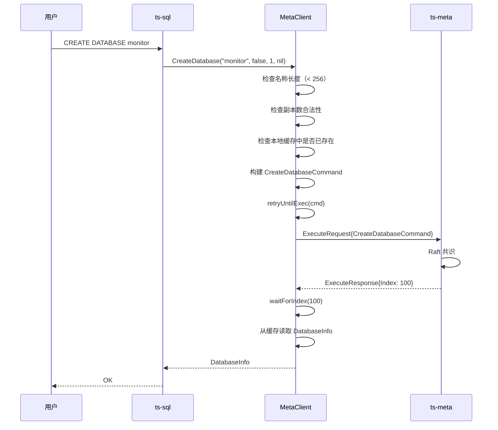
```mermaid
sequenceDiagram
    participant User as 用户
    participant SQL as ts-sql
    participant MC as MetaClient
    participant Meta as ts-meta

    User->>SQL: CREATE DATABASE monitor
    SQL->>MC: CreateDatabase("monitor", false, 1, nil)
    MC->>MC: 检查名称长度（< 256）
    MC->>MC: 检查副本数合法性
    MC->>MC: 检查本地缓存中是否已存在
    MC->>MC: 构建 CreateDatabaseCommand
    MC->>MC: retryUntilExec(cmd)
    MC->>Meta: ExecuteRequest{CreateDatabaseCommand}
    Meta->>Meta: Raft 共识
    Meta-->>MC: ExecuteResponse{Index: 100}
    MC->>MC: waitForIndex(100)
    MC->>MC: 从缓存读取 DatabaseInfo
    MC-->>SQL: DatabaseInfo
    SQL-->>User: OK
```

**核心代码**：`lib/metaclient/meta_client_impl.go:1039-1071`

```go
// CreateDatabase 创建数据库，如果已存在则返回
func (c *Client) CreateDatabase(name string, enableTagArray bool, replicaN uint32, options *obs.ObsOptions) (*meta2.DatabaseInfo, error) {
    // 第 1041 行：检查名称长度
    if strings.Count(name, "") > maxDbOrRpName {
        return nil, ErrNameTooLong
    }

    // 第 1044-1047 行：检查副本数合法性（必须为奇数，且与 HA 策略一致）
    var err error
    replicaN, _, err = checkAndUpdateReplication(replicaN, nil)
    if err != nil {
        return nil, err
    }

    // 第 1049-1051 行：检查本地缓存中是否已存在
    db, err := c.Database(name)
    if db != nil || !errno.Equal(err, errno.DatabaseNotFound) {
        return db, err
    }

    // 第 1053-1060 行：构建 protobuf 命令
    cmd := &proto2.CreateDatabaseCommand{
        Name:           proto.String(name),
        EnableTagArray: proto.Bool(enableTagArray),
        ReplicaNum:     proto.Uint32(replicaN),
    }
    if options != nil && options.Enabled {
        cmd.Options = meta2.MarshalObsOptions(options)
    }

    // 第 1063 行：发送到 ts-meta 并等待缓存更新
    err = c.retryUntilExec(proto2.Command_CreateDatabaseCommand, proto2.E_CreateDatabaseCommand_Command, cmd)
    if err != nil {
        return nil, err
    }

    // 第 1068 行：从更新后的缓存中读取结果
    return c.Database(name)
}
```

**逐行解释**：
- **第 1041 行**：数据库名称最长 256 字符
- **第 1044 行**：`checkAndUpdateReplication` 校验副本数：必须为奇数，且与 HA 策略兼容
- **第 1049 行**：先查本地缓存，如果已存在直接返回（幂等性）
- **第 1063 行**：`retryUntilExec` 是核心方法，发送命令到 ts-meta 并等待本地缓存更新

### 5.2 创建 RetentionPolicy

**核心代码**：`lib/metaclient/meta_client_impl.go:1359-1380`

```go
// CreateRetentionPolicy 在指定数据库上创建保留策略
func (c *Client) CreateRetentionPolicy(database string, spec *meta2.RetentionPolicySpec, makeDefault bool) (*meta2.RetentionPolicyInfo, error) {
    // 最小持续时间检查
    if spec.Duration != nil && *spec.Duration < meta2.MinRetentionPolicyDuration && *spec.Duration != 0 {
        return nil, meta2.ErrRetentionPolicyDurationTooLow
    }

    rpi := spec.NewRetentionPolicyInfo()
    // 名称长度检查
    if strings.Count(rpi.Name, "") > maxDbOrRpName {
        return nil, ErrNameTooLong
    }

    // 构建命令并发送
    cmd := &proto2.CreateRetentionPolicyCommand{
        Database:        proto.String(database),
        RetentionPolicy: rpi.Marshal(),
        DefaultRP:       proto.Bool(makeDefault),
    }

    if err := c.retryUntilExec(proto2.Command_CreateRetentionPolicyCommand,
        proto2.E_CreateRetentionPolicyCommand_Command, cmd); err != nil {
        return nil, err
    }

    // 从缓存读取结果
    return c.RetentionPolicy(database, rpi.Name)
}
```

### 5.3 创建 Measurement

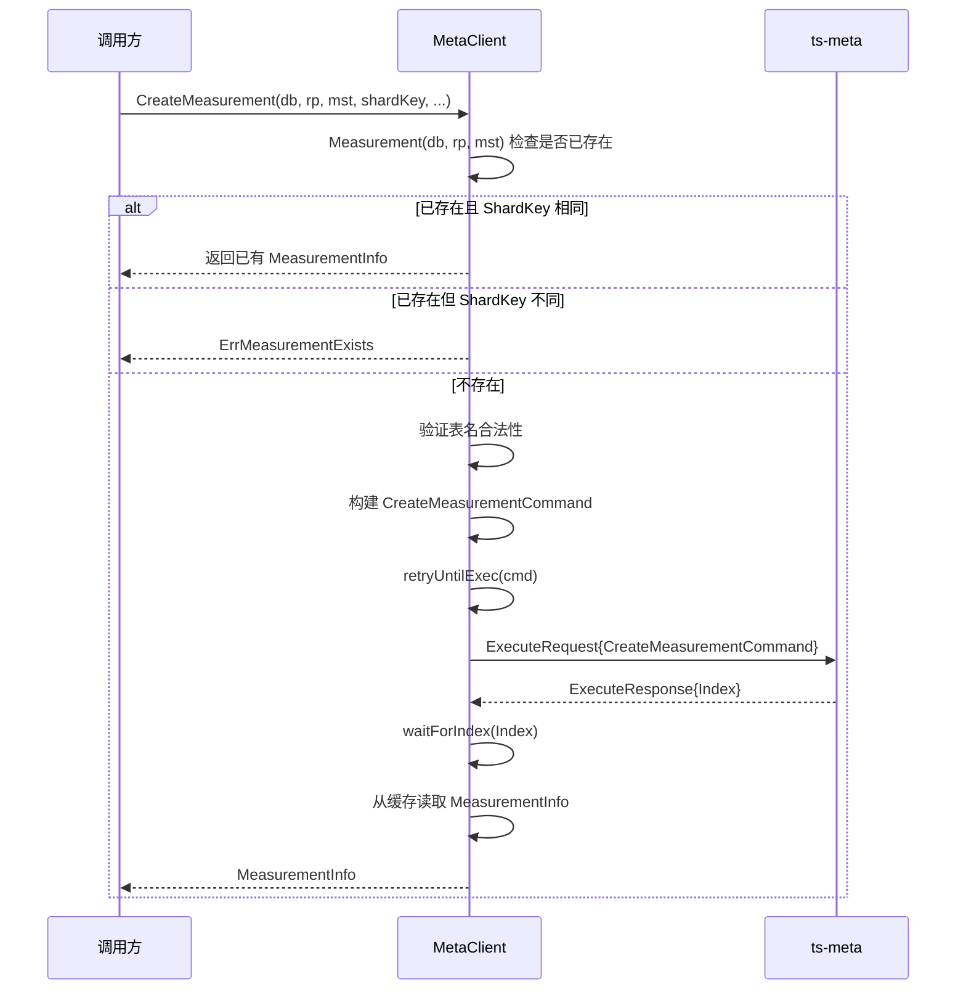
```mermaid
sequenceDiagram
    participant Caller as 调用方
    participant MC as MetaClient
    participant Meta as ts-meta

    Caller->>MC: CreateMeasurement(db, rp, mst, shardKey, ...)
    MC->>MC: Measurement(db, rp, mst) 检查是否已存在
    alt 已存在且 ShardKey 相同
        MC-->>Caller: 返回已有 MeasurementInfo
    else 已存在但 ShardKey 不同
        MC-->>Caller: ErrMeasurementExists
    else 不存在
        MC->>MC: 验证表名合法性
        MC->>MC: 构建 CreateMeasurementCommand
        MC->>MC: retryUntilExec(cmd)
        MC->>Meta: ExecuteRequest{CreateMeasurementCommand}
        Meta-->>MC: ExecuteResponse{Index}
        MC->>MC: waitForIndex(Index)
        MC->>MC: 从缓存读取 MeasurementInfo
        MC-->>Caller: MeasurementInfo
    end
```

**核心代码**：`lib/metaclient/meta_client_impl.go:925-989`

```go
func (c *Client) CreateMeasurement(database, retentionPolicy, mst string,
    shardKey *meta2.ShardKeyInfo, NumOfShards int32, indexR *influxql.IndexRelation,
    engineType config.EngineType, colStoreInfo *meta2.ColStoreInfo,
    schemaInfo []*proto2.FieldSchema, options *meta2.Options) (*meta2.MeasurementInfo, error) {

    // 检查是否已存在
    msti, err := c.Measurement(database, retentionPolicy, mst)
    if msti != nil {
        n := len(msti.ShardKeys)
        if n == 0 || !shardKey.EqualsToAnother(&msti.ShardKeys[n-1]) {
            return nil, meta2.ErrMeasurementExists  // ShardKey 不匹配
        }
        return msti, nil  // 幂等返回
    }

    // 验证表名
    if !meta2.ValidMeasurementName(mst) {
        return nil, errno.NewError(errno.InvalidMeasurement, mst)
    }

    // 构建命令
    cmd := &proto2.CreateMeasurementCommand{
        DBName:          proto.String(database),
        RpName:          proto.String(retentionPolicy),
        Name:            proto.String(mst),
        EngineType:      proto.Uint32(uint32(engineType)),
        InitNumOfShards: proto.Int32(NumOfShards),
    }

    // 设置 ShardKey、IndexRelation、ColStoreInfo、SchemaInfo、Options
    if shardKey != nil { cmd.Ski = shardKey.Marshal() }
    if indexR != nil { cmd.IR = meta2.EncodeIndexRelation(indexR) }
    if colStoreInfo != nil { cmd.ColStoreInfo = colStoreInfo.Marshal() }
    if len(schemaInfo) > 0 { cmd.SchemaInfo = schemaInfo }
    if options != nil {
        // 验证 TTL 不超过 RP Duration
        rpi, err := c.RetentionPolicy(database, retentionPolicy)
        if err != nil { return nil, err }
        if time.Duration(options.Ttl) > rpi.Duration {
            return nil, errno.NewError(errno.InvalidMeasurementTTL, ...)
        }
        cmd.Options = options.Marshal()
    }

    // 发送命令
    err = c.retryUntilExec(proto2.Command_CreateMeasurementCommand,
        proto2.E_CreateMeasurementCommand_Command, cmd)
    if err != nil { return nil, err }
    return c.Measurement(database, retentionPolicy, mst)
}
```

### 5.4 命令应用函数表

**核心代码**：`lib/metaclient/meta_client_impl.go:91-148` — applyFunc 注册表

```go
var applyFunc = map[proto2.Command_Type]func(c *Client, op *proto2.Command) error{
    proto2.Command_CreateDatabaseCommand:            applyCreateDatabase,
    proto2.Command_DropDatabaseCommand:              applyDropDatabase,
    proto2.Command_CreateRetentionPolicyCommand:     applyCreateRetentionPolicy,
    proto2.Command_DropRetentionPolicyCommand:       applyDropRetentionPolicy,
    proto2.Command_SetDefaultRetentionPolicyCommand: applySetDefaultRetentionPolicy,
    proto2.Command_UpdateRetentionPolicyCommand:     applyUpdateRetentionPolicy,
    proto2.Command_CreateShardGroupCommand:          applyCreateShardGroup,
    proto2.Command_DeleteShardGroupCommand:          applyDeleteShardGroup,
    proto2.Command_CreateMeasurementCommand:         applyCreateMeasurement,
    proto2.Command_AlterShardKeyCmd:                 applyAlterShardKey,
    proto2.Command_UpdateSchemaCommand:              applyUpdateSchema,
    proto2.Command_CreateDataNodeCommand:            applyCreateDataNode,
    proto2.Command_DeleteDataNodeCommand:            applyDeleteDataNode,
    proto2.Command_CreateDbPtViewCommand:            applyCreateDbPtView,
    proto2.Command_UpdatePtInfoCommand:              applyUpdatePtInfo,
    proto2.Command_UpdateReplicationCommand:         applyUpdateReplication,
    // ... 共约 50 种命令类型
}
```

**逐行解释**：
- 这是一个 `Command_Type → handler` 的映射表
- 每个 handler 函数负责将 protobuf 命令应用到本地 `cacheData`
- V2 协议的 `applyDataOps` 遍历增量命令时，通过此表查找对应的 handler

---

## 6. Shard 映射 — 获取 Shard 位置信息

### 6.1 ShardGroup 创建

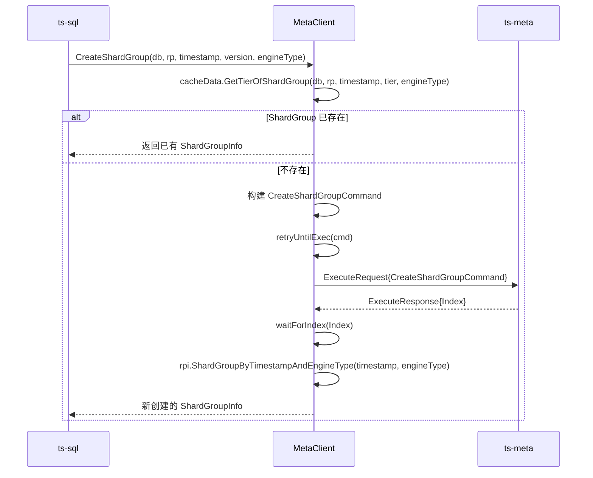
```mermaid
sequenceDiagram
    participant SQL as ts-sql
    participant MC as MetaClient
    participant Meta as ts-meta

    SQL->>MC: CreateShardGroup(db, rp, timestamp, version, engineType)
    MC->>MC: cacheData.GetTierOfShardGroup(db, rp, timestamp, tier, engineType)
    alt ShardGroup 已存在
        MC-->>SQL: 返回已有 ShardGroupInfo
    else 不存在
        MC->>MC: 构建 CreateShardGroupCommand
        MC->>MC: retryUntilExec(cmd)
        MC->>Meta: ExecuteRequest{CreateShardGroupCommand}
        Meta-->>MC: ExecuteResponse{Index}
        MC->>MC: waitForIndex(Index)
        MC->>MC: rpi.ShardGroupByTimestampAndEngineType(timestamp, engineType)
        MC-->>SQL: 新创建的 ShardGroupInfo
    end
```

**核心代码**：`lib/metaclient/meta_client_impl.go:1851-1889`

```go
// CreateShardGroup 为指定数据库和 RP 创建 ShardGroup
func (c *Client) CreateShardGroup(database, policy string, timestamp time.Time,
    version uint32, engineType config.EngineType) (*meta2.ShardGroupInfo, error) {

    c.mu.RLock()
    // 第 1853 行：检查 ShardGroup 是否已存在
    sg, tier, err := c.cacheData.GetTierOfShardGroup(database, policy, timestamp, c.ShardTier, engineType)
    if err != nil {
        c.mu.RUnlock()
        return nil, err
    }
    if sg != nil {
        sgi := *sg  // 复制一份，避免返回指针到缓存数据
        c.mu.RUnlock()
        return &sgi, nil
    }
    c.mu.RUnlock()

    // 第 1865 行：构建命令
    cmd := &proto2.CreateShardGroupCommand{
        Database:   proto.String(database),
        Policy:     proto.String(policy),
        Timestamp:  proto.Int64(timestamp.UnixNano()),
        ShardTier:  proto.Uint64(tier),
        EngineType: proto.Uint32(uint32(engineType)),
        Version:    proto.Uint32(version),
    }

    // 第 1874 行：发送到 ts-meta
    if err := c.retryUntilExec(proto2.Command_CreateShardGroupCommand,
        proto2.E_CreateShardGroupCommand_Command, cmd); err != nil {
        return nil, err
    }

    // 第 1878 行：从更新后的缓存读取
    rpi, err := c.RetentionPolicy(database, policy)
    // ...
    sgi := *(rpi.ShardGroupByTimestampAndEngineType(timestamp, engineType))
    return &sgi, nil
}
```

### 6.2 获取存活的 Shard 列表

**核心代码**：`lib/metaclient/meta_client_impl.go:2017-2022`

```go
// GetAliveShards 获取存活的 Shard 索引列表（用于写入和查询路由）
func (c *Client) GetAliveShards(database string, sgi *meta2.ShardGroupInfo, isRead bool) []int {
    if config.GetHaPolicy() != config.WriteAvailableFirst {
        return c.getAliveShardsForSSAndRep(database, sgi)  // 共享存储/复制模式
    }
    return c.getAliveShardsForWAF(database, sgi, isRead)   // WAF 模式
}
```

**核心代码**：`lib/metaclient/meta_client_impl.go:1933-1946` — WAF 模式

```go
func (c *Client) getAliveShardsForWAF(database string, sgi *meta2.ShardGroupInfo, read bool) []int {
    c.mu.RLock()
    defer c.mu.RUnlock()
    if !read && config.IsHardWrite() {
        return c.getAliveShardsForHardWrite(database, sgi)  // 硬写模式：返回所有 shard
    }
    aliveShardIdxes := make([]int, 0, len(sgi.Shards))
    for i := range sgi.Shards {
        // 检查 Pt 的 Owner 节点是否在线
        if c.cacheData.PtView[database][sgi.Shards[i].Owners[0]].Status == meta2.Online {
            aliveShardIdxes = append(aliveShardIdxes, i)
        }
    }
    return aliveShardIdxes
}
```

**核心代码**：`lib/metaclient/meta_client_impl.go:1974-1998` — 复制模式

```go
func (c *Client) getAliveShardsForRepDB(database string, sgi *meta2.ShardGroupInfo, replicaN int) []int {
    repGroups := c.DBRepGroups(database)
    aliveShardIdxes := make([]int, 0, len(sgi.Shards)/replicaN)
    addedRGID := make(map[uint32]interface{}, 0)

    c.mu.RLock()
    ptView := c.cacheData.PtView[database]
    for i := range sgi.Shards {
        for _, ptId := range sgi.Shards[i].Owners {
            // 复制组健康且是 Master Pt
            if repGroups[ptView[ptId].RGID].Status == meta2.Health &&
                repGroups[ptView[ptId].RGID].IsMasterPt(ptId) {
                aliveShardIdxes = append(aliveShardIdxes, i)
                addedRGID[ptView[ptId].RGID] = nil
                break
            // 复制组亚健康且 Pt 在线
            } else if repGroups[ptView[ptId].RGID].Status == meta2.SubHealth &&
                ptView[ptId].Status == meta2.Online {
                if _, ok := addedRGID[ptView[ptId].RGID]; !ok {
                    aliveShardIdxes = append(aliveShardIdxes, i)
                    addedRGID[ptView[ptId].RGID] = nil
                    break
                }
            }
        }
    }
    c.mu.RUnlock()
    return aliveShardIdxes
}
```

**通俗解释**：
- **ShardGroup** 是按时间范围分片的逻辑单元（如每 7 天一个 ShardGroup）
- **Shard** 是 ShardGroup 内的物理分片，由 Pt（Partition）拥有
- **GetAliveShards** 根据 HA 策略返回可用的 Shard 列表：
  - **WAF 模式**：Pt 在线即可
  - **复制模式**：需要复制组健康且是 Master Pt
  - **硬写模式**：返回所有 Shard（不检查状态）

---

## 7. PtView 分区视图 — 分区到节点的映射

### 7.1 PtView 数据结构

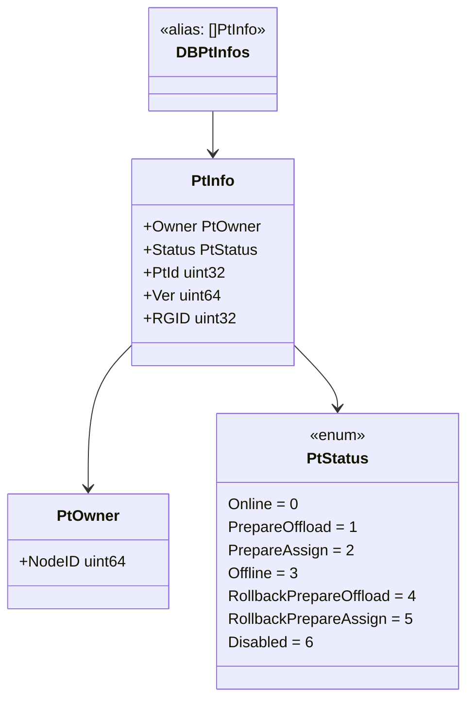
```mermaid
classDiagram
    class DBPtInfos {
        <<alias: []PtInfo>>
    }

    class PtInfo {
        +Owner PtOwner
        +Status PtStatus
        +PtId uint32
        +Ver uint64
        +RGID uint32
    }

    class PtOwner {
        +NodeID uint64
    }

    class PtStatus {
        <<enum>>
        Online = 0
        PrepareOffload = 1
        PrepareAssign = 2
        Offline = 3
        RollbackPrepareOffload = 4
        RollbackPrepareAssign = 5
        Disabled = 6
    }

    DBPtInfos --> PtInfo
    PtInfo --> PtOwner
    PtInfo --> PtStatus
```

**核心代码**：`lib/metaclient/meta_client_impl.go:1418-1428`

```go
// DBPtView 获取数据库的分区视图
func (c *Client) DBPtView(database string) (meta2.DBPtInfos, error) {
    c.mu.RLock()
    defer c.mu.RUnlock()

    pts := c.cacheData.DBPtView(database)
    if pts == nil {
        return nil, errno.NewError(errno.DatabaseNotFound, database)
    }
    return pts, nil
}
```

**逐行解释**：
- **第 1422 行**：`cacheData.DBPtView(database)` 从缓存中获取 PtView
- **返回值**：`DBPtInfos` 是 `[]PtInfo` 的别名，索引即 PtId

### 7.2 PtView 在写入路由中的应用

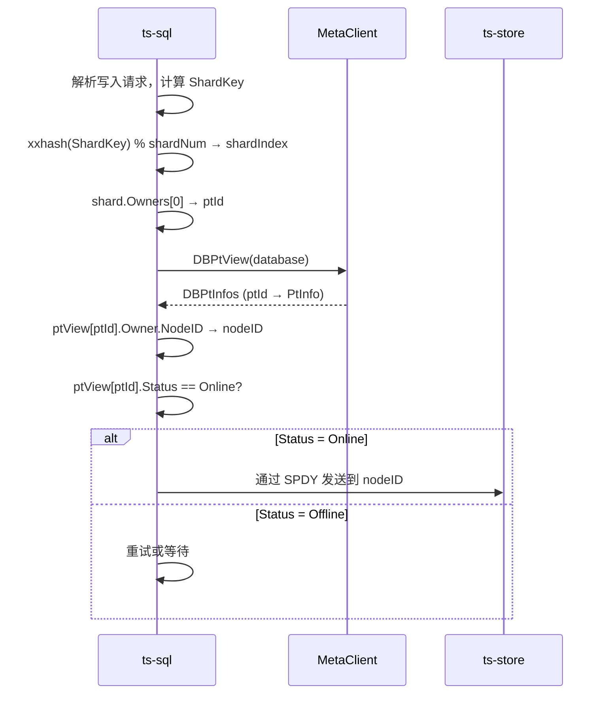
```mermaid
sequenceDiagram
    participant SQL as ts-sql
    participant MC as MetaClient
    participant Store as ts-store

    SQL->>SQL: 解析写入请求，计算 ShardKey
    SQL->>SQL: xxhash(ShardKey) % shardNum → shardIndex
    SQL->>SQL: shard.Owners[0] → ptId

    SQL->>MC: DBPtView(database)
    MC-->>SQL: DBPtInfos (ptId → PtInfo)

    SQL->>SQL: ptView[ptId].Owner.NodeID → nodeID
    SQL->>SQL: ptView[ptId].Status == Online?

    alt Status = Online
        SQL->>Store: 通过 SPDY 发送到 nodeID
    else Status = Offline
        SQL->>SQL: 重试或等待
    end
```

**核心代码**：`lib/metaclient/meta_client_impl.go:1395-1416` — GetNodePtsMap

```go
// GetNodePtsMap 获取数据库的 NodeID → PtId 列表映射
func (c *Client) GetNodePtsMap(database string) (map[uint64][]uint32, error) {
    c.mu.RLock()
    defer c.mu.RUnlock()

    if c.cacheData == nil || len(c.cacheData.PtView[database]) == 0 {
        return nil, errno.NewError(errno.DatabaseNotFound, database)
    }

    nodePtMap := make(map[uint64][]uint32, len(c.cacheData.DataNodes))
    repGroups := c.cacheData.DBRepGroups(database)
    ptInfo := c.cacheData.DBPtView(database)
    repGroupN := uint32(len(repGroups))

    for i := range ptInfo {
        // WAF 模式下跳过 Offline 的 Pt
        if config.GetHaPolicy() == config.WriteAvailableFirst &&
            c.cacheData.PtView[database][i].Status == meta2.Offline {
            continue
        }
        // 复制模式下跳过非 Master Pt
        if config.GetHaPolicy() == config.Replication &&
            ptInfo[i].RGID < repGroupN &&
            !repGroups[ptInfo[i].RGID].IsMasterPt(ptInfo[i].PtId) {
            continue
        }
        nodePtMap[ptInfo[i].Owner.NodeID] = append(nodePtMap[ptInfo[i].Owner.NodeID], ptInfo[i].PtId)
    }
    return nodePtMap, nil
}
```

**通俗解释**：
- **PtView** 是数据库级别的分区路由表：`PtId → PtInfo{Owner: NodeID, Status: Online/Offline}`
- 每个 Pt（Partition）是一个数据分区，拥有一个或多个 Shard
- **GetNodePtsMap** 返回 `NodeID → []PtId` 的映射，用于确定每个节点负责哪些分区
- 写入时先计算 ShardKey → ShardIndex → PtId → PtView[PtId].Owner.NodeID → 目标节点

---

## 8. 集群拓扑缓存 — 节点发现与管理

### 8.1 节点注册

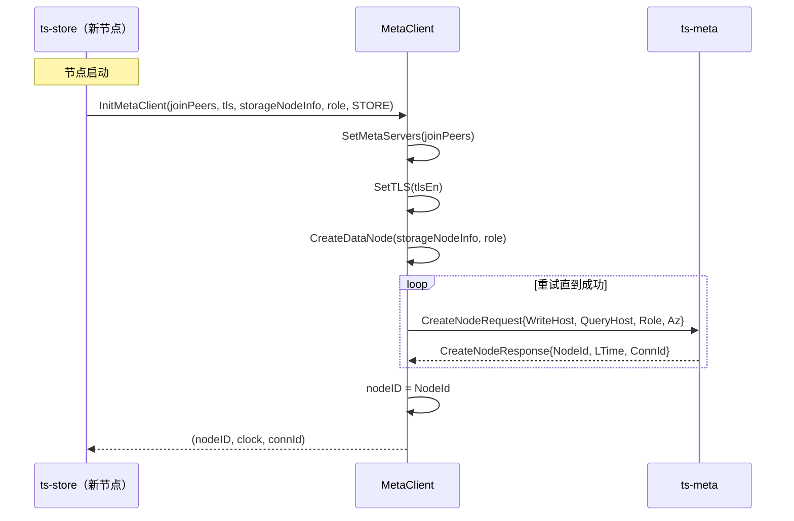
```mermaid
sequenceDiagram
    participant Store as ts-store（新节点）
    participant MC as MetaClient
    participant Meta as ts-meta

    Note over Store: 节点启动
    Store->>MC: InitMetaClient(joinPeers, tls, storageNodeInfo, role, STORE)
    MC->>MC: SetMetaServers(joinPeers)
    MC->>MC: SetTLS(tlsEn)
    MC->>MC: CreateDataNode(storageNodeInfo, role)

    loop 重试直到成功
        MC->>Meta: CreateNodeRequest{WriteHost, QueryHost, Role, Az}
        Meta-->>MC: CreateNodeResponse{NodeId, LTime, ConnId}
    end

    MC->>MC: nodeID = NodeId
    MC-->>Store: (nodeID, clock, connId)
```

**核心代码**：`lib/metaclient/meta_client_impl.go:384-418` — CreateDataNode

```go
// CreateDataNode 在元数据存储中创建新的数据节点
func (c *Client) CreateDataNode(storageNodeInfo *StorageNodeInfo, role string) (uint64, uint64, uint64, error) {
    writeHost, queryHost, az := storageNodeInfo.InsertAddr, storageNodeInfo.SelectAddr, storageNodeInfo.Az
    retryTime, retryNumber := storageNodeInfo.RetryTime, storageNodeInfo.RetryNumber
    var retryCount int
    currentServer := connectedServer

    for {
        // 退出检查
        select {
        case <-c.closing:
            return 0, 0, 0, meta2.ErrClientClosed
        default:
        }

        // 重试次数检查
        if retryCount >= retryNumber {
            return 0, 0, 0, errors.New("data: retry number exceeds the limit")
        }

        // 服务器索引循环
        c.mu.RLock()
        if currentServer >= len(c.metaServers) {
            currentServer = 0
        }
        c.mu.RUnlock()

        // 发送注册请求
        node, err := c.getNode(currentServer, writeHost, queryHost, role, az)
        if err == nil && node.NodeId > 0 {
            c.nodeID = node.NodeId  // 设置本节点 ID
            return c.nodeID, node.LTime, node.ConnId, nil
        }

        c.logger.Warn("get node failed", zap.Error(err), ...)
        time.Sleep(retryTime)
        currentServer++
        retryCount++
    }
}
```

**逐行解释**：
- **第 388 行**：无限循环重试，直到成功或达到重试次数上限
- **第 390-393 行**：检查 `closing` channel，如果客户端已关闭则退出
- **第 396-399 行**：`currentServer` 超过 metaServers 数量时回到 0（轮换）
- **第 403 行**：`getNode` 发送 RPC 到 ts-meta，请求注册节点
- **第 406 行**：成功后设置 `c.nodeID`，后续所有操作使用此 ID

### 8.2 节点查询

**核心代码**：`lib/metaclient/meta_client_impl.go:315-365`

```go
// DataNode 根据 ID 返回节点信息
func (c *Client) DataNode(id uint64) (*meta2.DataNode, error) {
    c.mu.RLock()
    defer c.mu.RUnlock()
    for i := range c.cacheData.DataNodes {
        if c.cacheData.DataNodes[i].ID == id {
            return &c.cacheData.DataNodes[i], nil
        }
    }
    return nil, meta2.ErrNodeNotFound
}

// AliveReadNodes 返回可用的读节点列表（优先 Reader → Default → Writer）
func (c *Client) AliveReadNodes() ([]meta2.DataNode, error) {
    c.mu.RLock()
    defer c.mu.RUnlock()
    var aliveReaders, aliveDefault, aliveWriters []meta2.DataNode
    for _, n := range c.cacheData.DataNodes {
        if n.Status != serf.StatusAlive { continue }
        switch n.Role {
        case meta2.NodeReader:  aliveReaders = append(aliveReaders, n)
        case meta2.NodeDefault: aliveDefault = append(aliveDefault, n)
        case meta2.NodeWriter:  aliveWriters = append(aliveWriters, n)
        }
    }
    // 优先级：Reader > Default > Writer
    if len(aliveReaders) != 0 { return aliveReaders, nil }
    if len(aliveDefault) != 0 { return aliveDefault, nil }
    if len(aliveWriters) != 0 { return aliveWriters, nil }
    return nil, fmt.Errorf("there is no data nodes for querying")
}
```

---

## 9. 重试与故障转移逻辑

### 9.1 retryUntilExec — DDL 命令的重试机制

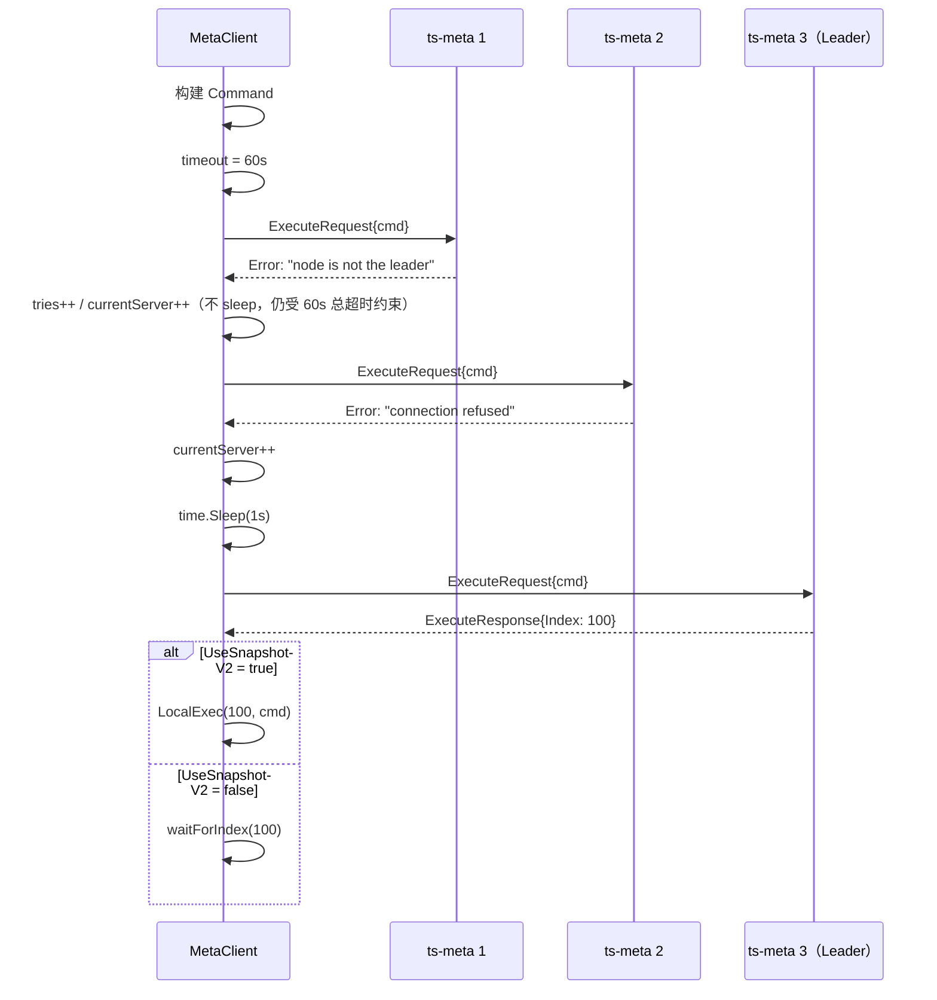
```mermaid
sequenceDiagram
    participant MC as MetaClient
    participant Meta1 as ts-meta 1
    participant Meta2 as ts-meta 2
    participant Meta3 as ts-meta 3（Leader）

    MC->>MC: 构建 Command
    MC->>MC: timeout = 60s

    MC->>Meta1: ExecuteRequest{cmd}
    Meta1-->>MC: Error: "node is not the leader"
    MC->>MC: tries++ / currentServer++（不 sleep，仍受 60s 总超时约束）

    MC->>Meta2: ExecuteRequest{cmd}
    Meta2-->>MC: Error: "connection refused"
    MC->>MC: currentServer++
    MC->>MC: time.Sleep(1s)

    MC->>Meta3: ExecuteRequest{cmd}
    Meta3-->>MC: ExecuteResponse{Index: 100}
    alt UseSnapshotV2 = true
        MC->>MC: LocalExec(100, cmd)
    else UseSnapshotV2 = false
        MC->>MC: waitForIndex(100)
    end
```

**核心代码**：`lib/metaclient/meta_client_impl.go:2299-2363`

```go
// retryUntilExec 尝试在 meta 服务器之间轮询执行命令，直到成功、关闭或 RetryExecTimeout
func (c *Client) retryUntilExec(typ proto2.Command_Type, desc *proto.ExtensionDesc, value interface{}) error {
    index, err := c.retryExec(typ, desc, value)
    if err != nil {
        return err
    }
    if c.UseSnapshotV2 {
        return c.LocalExec(index, typ, desc, value)  // V2：本地应用命令
    }
    c.waitForIndex(index)  // V1：等待 pollForUpdates 更新缓存
    return nil
}

func (c *Client) retryExec(typ proto2.Command_Type, desc *proto.ExtensionDesc, value interface{}) (index uint64, err error) {
    tries := 0
    currentServer := connectedServer
    timeout := time.After(RetryExecTimeout)  // 60 秒超时

    for {
        c.mu.RLock()
        select {
        case <-timeout:
            c.mu.RUnlock()
            return c.index(), meta2.ErrCommandTimeout
        case <-c.closing:
            c.mu.RUnlock()
            return c.index(), meta2.ErrClientClosed
        default:
        }
        c.mu.RUnlock()

        // 获取当前服务器地址
        c.mu.RLock()
        if currentServer >= len(c.metaServers) {
            currentServer = 0
        }
        c.mu.RUnlock()

        // 执行命令
        index, err = c.exec(currentServer, typ, desc, value, message.ExecuteRequestMessage)
        if err == nil {
            return index, nil  // 成功
        }

        tries++
        currentServer++

        // "node is not the leader" 不 sleep，立即重试下一个服务器；仍受 RetryExecTimeout 总超时约束
        if strings.Contains(err.Error(), "node is not the leader") {
            continue
        }

        // 命令级错误（如数据库已存在），立即返回
        if _, ok := err.(errCommand); ok {
            return c.index(), err
        }

        c.logger.Info("retryUntilExec retry", ...)
        time.Sleep(errSleep)  // 等待 1 秒后重试
    }
}
```

**逐行解释**：
- **第 2317 行**：`RetryExecTimeout = 60s`，整个重试过程的超时时间
- **tries 语义**：`tries` 只用于日志输出，不作为停止条件；`retryExec` 不是按最大次数停止，而是在 `RetryExecTimeout` 的总时间窗口内轮询
- **第 2352 行**：`"node is not the leader"` 是特殊错误，表示请求发到了 Follower，需要立即尝试下一个服务器（不 sleep，但仍在 60s 总超时内）
- **第 2355 行**：`errCommand` 是命令级错误（如参数非法），不需要重试
- **第 2359 行**：其他错误（如网络超时），等待 1 秒后重试

**案例**：
```
Meta1 返回 not leader:
  tries = 1
  currentServer = Meta2
  不 sleep，继续下一轮
  但 timeout := time.After(RetryExecTimeout) 没有重置

Meta2 一直 connection refused:
  tries 只出现在 retryUntilExec retry 日志里
  不会因为 tries 达到某个最大次数而停止
  60s 总超时到达后返回 ErrCommandTimeout

UseSnapshotV2=true:
  retryExec 返回 index=100
  retryUntilExec 调用 LocalExec(100, typ, desc, value)
  如果本地 applyFunc 支持该命令，则 waitForIndex(100)
  不走无条件 waitForIndex 分支
```

### 9.2 waitForIndex — 等待缓存更新

**核心代码**：`lib/metaclient/meta_client_impl.go:2399-2410`

```go
// waitForIndex 等待本地缓存的 Index 达到指定值
func (c *Client) waitForIndex(idx uint64) {
    for {
        ch := c.WaitForDataChanged()  // 注册等待通知
        c.mu.RLock()
        if c.cacheData.Index >= idx {  // 缓存已更新
            c.mu.RUnlock()
            return
        }
        c.mu.RUnlock()
        <-ch  // 阻塞等待通知
    }
}
```

**逐行解释**：
- **第 2401 行**：`WaitForDataChanged()` 将一个 channel 注册到 `c.changed`
- **第 2403 行**：检查缓存 Index 是否已达到目标值
- **第 2408 行**：如果未达到，阻塞在 `<-ch` 上，直到 `pollForUpdates` close 这个 channel

### 9.3 retryUntilSnapshot — 快照获取的重试

**核心代码**：`lib/metaclient/meta_client_impl.go:2575-2608`

```go
func (c *Client) retryUntilSnapshot(role Role, idx uint64) *meta2.Data {
    currentServer := connectedServer
    for {
        c.mu.RLock()
        select {
        case <-c.closing:
            c.mu.RUnlock()
            return nil
        default:
        }
        if currentServer >= len(c.metaServers) {
            currentServer = 0
        }
        server := c.metaServers[currentServer]
        c.mu.RUnlock()

        data, err := c.getSnapshot(role, currentServer, idx)
        if err == nil && data != nil {
            return data  // 成功获取快照
        } else if err == nil && data == nil {
            continue  // 没有新数据，继续轮询
        }

        c.logger.Debug("failure getting snapshot from", zap.String("server", server), zap.Error(err))
        time.Sleep(errSleep)
        currentServer++  // 切换到下一个服务器
    }
}
```

---

## 10. 认证与安全

### 10.1 认证流程

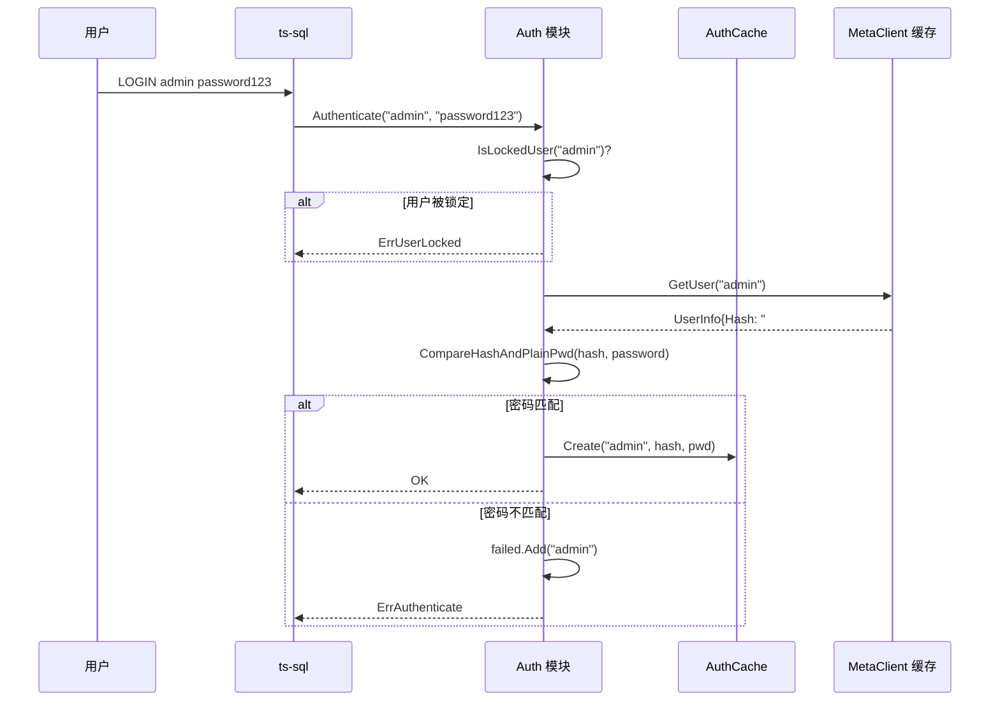
```mermaid
sequenceDiagram
    participant User as 用户
    participant SQL as ts-sql
    participant Auth as Auth 模块
    participant Cache as AuthCache
    participant Meta as MetaClient 缓存

    User->>SQL: LOGIN admin password123
    SQL->>Auth: Authenticate("admin", "password123")

    Auth->>Auth: IsLockedUser("admin")?
    alt 用户被锁定
        Auth-->>SQL: ErrUserLocked
    end

    Auth->>Meta: GetUser("admin")
    Meta-->>Auth: UserInfo{Hash: "#Ver:002#..."}
    Auth->>Auth: CompareHashAndPlainPwd(hash, password)

    alt 密码匹配
        Auth->>Cache: Create("admin", hash, pwd)
        Auth-->>SQL: OK
    else 密码不匹配
        Auth->>Auth: failed.Add("admin")
        Auth-->>SQL: ErrAuthenticate
    end
```

**核心代码**：`lib/metaclient/auth.go:382-407`

```go
// Authenticate 验证用户名和密码
func (a *Auth) Authenticate(user *meta.UserInfo, password string) error {
    err := a.authenticate(user, password)
    if err == nil {
        a.failed.Clean(user.Name)  // 认证成功，清除失败记录
    } else {
        a.failed.Add(user.Name)    // 认证失败，记录失败次数
    }
    return err
}

func (a *Auth) authenticate(user *meta.UserInfo, password string) error {
    pwd := util.Str2bytes(password)

    // 先检查本地认证缓存（HMAC-SHA256，1 小时过期）
    if a.cache.Compare(user.Name, pwd) {
        return nil
    }

    // 缓存未命中，比较密码哈希
    if err := a.CompareHashAndPlainPwd(user.Hash, password); err != nil {
        return meta.ErrAuthenticate
    }

    // 认证成功，创建缓存
    a.cache.Create(user.Name, user.Hash, pwd)
    return nil
}
```

### 10.2 密码哈希算法

**核心代码**：`lib/metaclient/auth.go:263-286` — PBKDF2 哈希

```go
// GenPbkdf2PwdVal 使用 PBKDF2 生成密码哈希
func (a *Auth) GenPbkdf2PwdVal(password string) (string, error) {
    salt, hashed, err := a.saltedPbkdf2(password, a.optAlgoVer)
    if err != nil {
        return "", err
    }

    var rstVal string
    switch a.optAlgoVer {
    case algoVer02:
        rstVal = hashAlgoVerTwo    // "#Ver:002#" — PBKDF2 4096 次迭代
    case algoVer03:
        rstVal = hashAlgoVerThree  // "#Ver:003#" — PBKDF2 1000 次迭代
    default:
        rstVal = hashAlgoVerTwo
    }
    rstVal += fmt.Sprintf("%02X", salt)   // 盐值（32 字节，十六进制编码）
    rstVal += fmt.Sprintf("%02X", hashed) // 哈希值（32 字节，十六进制编码）
    return rstVal, nil
}
```

**三种哈希算法**：
| 版本 | 标识 | 算法 | 迭代次数 |
|------|------|------|---------|
| V1 | `#Ver:001#` | SHA-256 + Salt | 1 |
| V2 | `#Ver:002#` | PBKDF2-SHA256 | 4096 |
| V3 | `#Ver:003#` | PBKDF2-SHA256 | 1000 |

### 10.3 登录失败锁定

**核心代码**：`lib/metaclient/auth.go:126-175`

```go
type AuthFailedLog struct {
    lastTime uint64  // 最后一次失败时间
    count    uint64  // 失败次数
}

func (log *AuthFailedLog) Add() {
    // 超过锁定时间（30 秒），重置计数
    if (log.lastTime + lockUserTime) < fasttime.UnixTimestamp() {
        log.count = 0
    }
    log.count++
    log.lastTime = fasttime.UnixTimestamp()
}

func (log *AuthFailedLog) Locked() bool {
    // 失败次数 >= 5 且在锁定时间内
    return log.count >= maxLoginLimit &&
        (log.lastTime+lockUserTime) > fasttime.UnixTimestamp()
}
```

---

## 11. 复制信息管理

### 11.1 ReplicaInfoManager

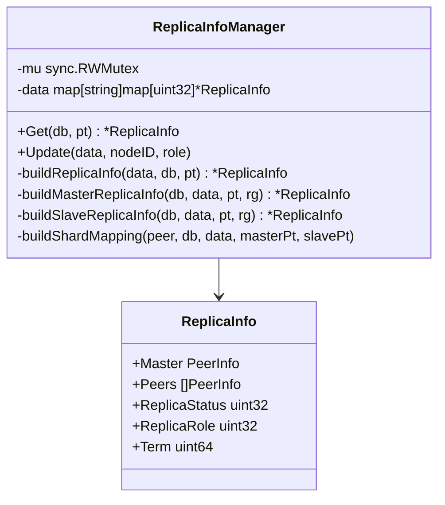
```mermaid
classDiagram
    class ReplicaInfoManager {
        -mu sync.RWMutex
        -data map[string]map[uint32]*ReplicaInfo
        +Get(db, pt) *ReplicaInfo
        +Update(data, nodeID, role)
        -buildReplicaInfo(data, db, pt) *ReplicaInfo
        -buildMasterReplicaInfo(db, data, pt, rg) *ReplicaInfo
        -buildSlaveReplicaInfo(db, data, pt, rg) *ReplicaInfo
        -buildShardMapping(peer, db, data, masterPt, slavePt)
    }

    class ReplicaInfo {
        +Master PeerInfo
        +Peers []PeerInfo
        +ReplicaStatus uint32
        +ReplicaRole uint32
        +Term uint64
    }

    ReplicaInfoManager --> ReplicaInfo
```

**核心代码**：`lib/metaclient/replica.go:54-81`

```go
// Update 从元数据快照更新复制信息
func (m *ReplicaInfoManager) Update(data *meta.Data, nodeID uint64, role Role) {
    var replicaInfo = make(map[string]map[uint32]*message.ReplicaInfo)
    if role == SQL {
        m.update(replicaInfo)  // ts-sql 不需要复制信息
        return
    }

    // 遍历所有数据库的 PtView
    for db, ptView := range data.PtView {
        for i := range ptView {
            pt := &ptView[i]
            if pt.Owner.NodeID != nodeID {
                continue  // 只关注本节点拥有的 Pt
            }

            info := m.buildReplicaInfo(data, db, pt)
            if info == nil {
                continue
            }

            if _, ok := replicaInfo[db]; !ok {
                replicaInfo[db] = make(map[uint32]*message.ReplicaInfo)
            }
            replicaInfo[db][pt.PtId] = info
        }
    }

    m.update(replicaInfo)
}
```

**逐行解释**：
- **第 57 行**：ts-sql 节点不需要复制信息，直接返回空 map
- **第 60 行**：遍历所有数据库的 PtView
- **第 63 行**：只处理本节点拥有的 Pt（`pt.Owner.NodeID == nodeID`）
- **第 67 行**：`buildReplicaInfo` 根据 Pt 的角色（Master/Slave）构建不同的复制信息

---

## 12. 连续查询（Continuous Query）管理

### 12.1 CQ 生命周期

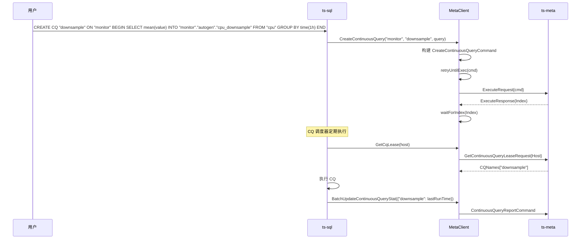
```mermaid
sequenceDiagram
    participant User as 用户
    participant SQL as ts-sql
    participant MC as MetaClient
    participant Meta as ts-meta

    User->>SQL: CREATE CQ "downsample" ON "monitor" BEGIN SELECT mean(value) INTO "monitor"."autogen"."cpu_downsample" FROM "cpu" GROUP BY time(1h) END
    SQL->>MC: CreateContinuousQuery("monitor", "downsample", query)
    MC->>MC: 构建 CreateContinuousQueryCommand
    MC->>MC: retryUntilExec(cmd)
    MC->>Meta: ExecuteRequest{cmd}
    Meta-->>MC: ExecuteResponse{Index}
    MC->>MC: waitForIndex(Index)

    Note over SQL: CQ 调度器定期执行
    SQL->>MC: GetCqLease(host)
    MC->>Meta: GetContinuousQueryLeaseRequest{Host}
    Meta-->>MC: CQNames["downsample"]
    SQL->>SQL: 执行 CQ

    SQL->>MC: BatchUpdateContinuousQueryStat({"downsample": lastRunTime})
    MC->>Meta: ContinuousQueryReportCommand
```

**核心代码**：`lib/metaclient/metaclient_cq.go:65-87`

```go
func (c *Client) CreateContinuousQuery(database, name, query string) error {
    cmd := &proto2.CreateContinuousQueryCommand{
        Database: proto.String(database),
        Name:     proto.String(name),
        Query:    proto.String(query),
    }
    return c.retryUntilExec(proto2.Command_CreateContinuousQueryCommand,
        proto2.E_CreateContinuousQueryCommand_Command, cmd)
}

func (c *Client) DropContinuousQuery(name string, database string) error {
    cmd := &proto2.DropContinuousQueryCommand{
        Name:     proto.String(name),
        Database: proto.String(database),
    }
    return c.retryUntilExec(proto2.Command_DropContinuousQueryCommand,
        proto2.E_DropContinuousQueryCommand_Command, cmd)
}
```

---

## 13. Callback 机制 — RPC 响应处理

### 13.1 Callback 体系

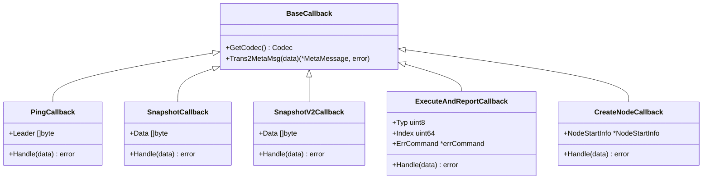
```mermaid
classDiagram
    class BaseCallback {
        +GetCodec() Codec
        +Trans2MetaMsg(data) (*MetaMessage, error)
    }

    class PingCallback {
        +Leader []byte
        +Handle(data) error
    }

    class SnapshotCallback {
        +Data []byte
        +Handle(data) error
    }

    class SnapshotV2Callback {
        +Data []byte
        +Handle(data) error
    }

    class ExecuteAndReportCallback {
        +Typ uint8
        +Index uint64
        +ErrCommand *errCommand
        +Handle(data) error
    }

    class CreateNodeCallback {
        +NodeStartInfo *NodeStartInfo
        +Handle(data) error
    }

    BaseCallback <|-- PingCallback
    BaseCallback <|-- SnapshotCallback
    BaseCallback <|-- SnapshotV2Callback
    BaseCallback <|-- ExecuteAndReportCallback
    BaseCallback <|-- CreateNodeCallback
```

**核心代码**：`lib/metaclient/meta_callback.go:198-241` — ExecuteAndReportCallback

```go
// ExecuteAndReportCallback 处理 DDL 命令的响应
type ExecuteAndReportCallback struct {
    BaseCallback
    Typ   uint8         // 消息类型（Execute 或 Report）
    Index uint64        // 返回的元数据 Index
    ErrCommand *errCommand  // 命令级错误
}

func (c *ExecuteAndReportCallback) Handle(data interface{}) error {
    metaMsg, err := c.Trans2MetaMsg(data)
    if err != nil { return err }

    switch c.Typ {
    case message.ExecuteRequestMessage:
        msg, ok := metaMsg.Data().(*message.ExecuteResponse)
        if !ok { return errors.New("data is not a ExecuteResponse") }
        if msg.Err != "" { return errors.New(msg.Err) }
        if msg.ErrCommand != "" {
            c.ErrCommand = &errCommand{msg: msg.ErrCommand}  // 命令级错误
        }
        c.Index = msg.Index
    case message.ReportRequestMessage:
        msg, ok := metaMsg.Data().(*message.ReportResponse)
        // ... 类似处理
    }
    return nil
}
```

---

## 14. 节点状态验证 — ts-store 自保机制

### 14.1 verifyDataNodeStatus

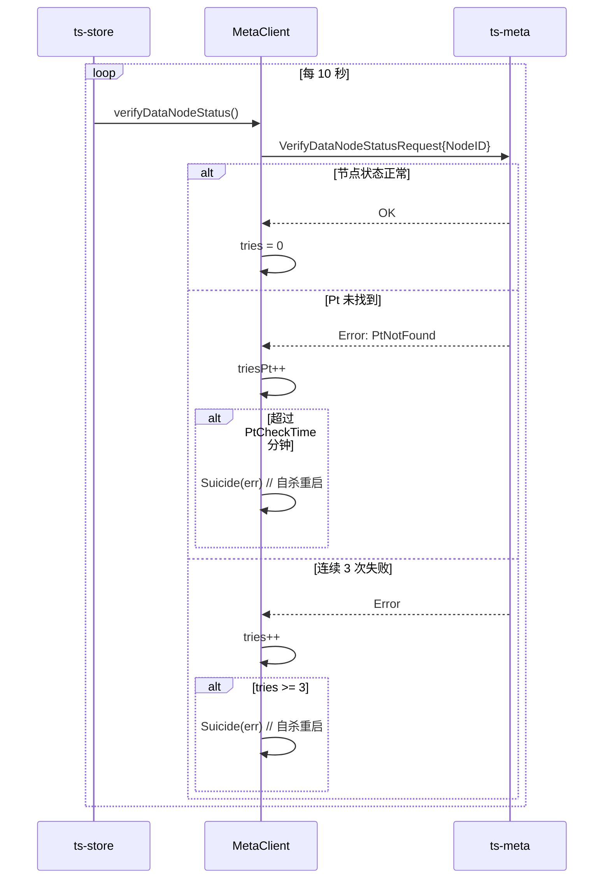
```mermaid
sequenceDiagram
    participant Store as ts-store
    participant MC as MetaClient
    participant Meta as ts-meta

    loop 每 10 秒
        Store->>MC: verifyDataNodeStatus()
        MC->>Meta: VerifyDataNodeStatusRequest{NodeID}

        alt 节点状态正常
            Meta-->>MC: OK
            MC->>MC: tries = 0
        else Pt 未找到
            Meta-->>MC: Error: PtNotFound
            MC->>MC: triesPt++
            alt 超过 PtCheckTime 分钟
                MC->>MC: Suicide(err)  // 自杀重启
            end
        else 连续 3 次失败
            Meta-->>MC: Error
            MC->>MC: tries++
            alt tries >= 3
                MC->>MC: Suicide(err)  // 自杀重启
            end
        end
    end
```

**核心代码**：`lib/metaclient/meta_client_impl.go:3699-3735`

```go
// verifyDataNodeStatus 定期验证本节点在 ts-meta 中的状态
func (c *Client) verifyDataNodeStatus(t time.Duration) {
    if !VerifyNodeEn { return }

    var check = func() {
        err := c.retryVerifyDataNodeStatus()
        if err == nil {
            return  // 状态正常
        }

        if errno.Equal(err, errno.PtNotFound) {
            // Pt 未找到，可能是网络分区后数据迁移
            // 超过配置的时间后自杀重启
            if time.Since(begin) >= (time.Duration(checkTime) * time.Minute) {
                c.Suicide(err)
            }
            return
        }

        // 连续 3 次失败，自杀重启
        tries++
        if tries >= 3 {
            c.Suicide(err)
        }
    }
    check()
    util.TickerRun(t, c.closing, check, func(){})
}
```

**通俗解释**：
- ts-store 节点定期（每 10 秒）向 ts-meta 验证自己的状态
- 如果发现 Pt 已被迁移到其他节点（网络分区后），自杀重启以避免数据不一致
- 连续 3 次验证失败也会自杀重启
- 这是防止"脑裂"的最后一道防线

---

## 15. 潜在隐患与优化建议

### 15.1 全局 connectedServer 变量

```go
var connectedServer int  // 全局变量，非线程安全
```

**隐患**：
- `connectedServer` 是包级全局变量，多个 Client 实例共享
- 在 `retryExec` 和 `retryUntilSnapshot` 中读写，但没有加锁
- 可能导致不同 Client 实例的服务器选择互相干扰

**建议**：将 `connectedServer` 改为 Client 的成员变量

### 15.2 waitForIndex 的自旋风险

```go
func (c *Client) waitForIndex(idx uint64) {
    for {
        ch := c.WaitForDataChanged()
        c.mu.RLock()
        if c.cacheData.Index >= idx {
            c.mu.RUnlock()
            return
        }
        c.mu.RUnlock()
        <-ch
    }
}
```

**隐患**：
- 如果 ts-meta 持续故障，`pollForUpdates` 无法更新缓存
- `waitForIndex` 将永远阻塞（虽然有 `RetryExecTimeout` 保护 `retryExec`，但 `waitForIndex` 本身没有超时）
- `changed` channel 的 buffer 大小 = `maxConcurrentWriteLimit`，如果并发写入超过此值，`WaitForDataChanged` 会阻塞

**建议**：为 `waitForIndex` 添加超时机制

### 15.3 缓存一致性窗口

```
时间线：
  t0: ts-sql 执行 DDL（CreateDatabase）
  t1: ts-meta 执行成功，返回 Index=100
  t2: ts-sql 调用 waitForIndex(100)
  t3: pollForUpdates 获取快照 Index=99（旧快照）
  t4: pollForUpdates 获取快照 Index=100（新快照）
  t5: waitForIndex 返回
  t6: ts-sql 从缓存读取 DatabaseInfo

  在 t1-t5 之间，其他请求可能读到旧数据
```

**隐患**：
- 从 DDL 命令执行成功到本地缓存更新之间存在时间窗口
- 在此窗口内，其他请求可能读到旧数据
- 对于需要强一致性的场景（如 CREATE DATABASE 后立即查询），可能有问题

**建议**：对于 DDL 操作，可以在 `retryUntilExec` 返回后强制等待缓存更新

### 15.4 认证缓存的 TTL 过短

```go
const authCacheExpire = 3600 // 1 小时
```

**隐患**：
- 高并发认证场景下，1 小时的 TTL 可能导致频繁的密码哈希计算
- PBKDF2 4096 次迭代的计算开销较大

**建议**：根据实际负载调整 TTL，或使用更高效的缓存策略
