# Module 31: Network Storage Layer (netstorage) 深度设计文档

> 时序图优先，逐步拆解。每个流程都有 Mermaid 时序图 + 核心代码逐行解释。

---

## 1. netstorage 是什么？为什么需要它？

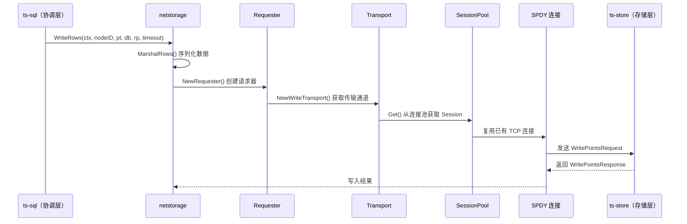
```mermaid
sequenceDiagram
    participant SQL as ts-sql（协调层）
    participant NS as netstorage
    participant Req as Requester
    participant Trans as Transport
    participant Pool as SessionPool
    participant SPDY as SPDY 连接
    participant Store as ts-store（存储层）

    SQL->>NS: WriteRows(ctx, nodeID, pt, db, rp, timeout)
    NS->>NS: MarshalRows() 序列化数据
    NS->>Req: NewRequester() 创建请求器
    Req->>Trans: NewWriteTransport() 获取传输通道
    Trans->>Pool: Get() 从连接池获取 Session
    Pool->>SPDY: 复用已有 TCP 连接
    SPDY->>Store: 发送 WritePointsRequest
    Store-->>SPDY: 返回 WritePointsResponse
    SPDY-->>NS: 写入结果
```

**通俗解释**：
- `netstorage` 是 openGemini 的**网络存储抽象层**，位于 `lib/netstorage/`
- 它是 ts-sql（协调节点）与 ts-store（存储节点）之间的通信桥梁
- 核心职责：将上层的读写请求通过 SPDY 协议发送到正确的存储节点
- 屏蔽了底层网络细节（连接管理、序列化、超时控制），对上层提供简洁的 `Storage` 接口

**为什么需要 netstorage？**

openGemini 是三层架构（ts-sql / ts-meta / ts-store），数据分散在多个存储节点上。ts-sql 需要：
1. **写入路由**：将数据发送到持有目标 Shard 的 ts-store 节点
2. **查询扇出**：将分布式查询并行发送到多个 ts-store 节点
3. **DDL 操作**：在远程节点上执行删除、分裂等管理操作
4. **节点管理**：健康检查、故障隔离、领导权转移

netstorage 将这些能力统一封装，对 coordinator 层暴露干净的 `Storage` 接口。

**核心代码**：`lib/netstorage/storage.go`

```go
// 第 47 行：Storage 接口 — netstorage 的核心抽象
type Storage interface {
    WriteRows(ctx *WriteContext, nodeID uint64, pt uint32, database, rpName string, timeout time.Duration) error
    DropShard(nodeID uint64, database, rpName string, dbPts []uint32, shardID uint64) error
    TagValues(nodeID uint64, db string, ptIDs []uint32, tagKeys map[string]map[string]struct{}, cond influxql.Expr, limit int, exact bool) (influxql.TablesTagSets, error)
    ShowTagKeys(nodeID uint64, db string, ptId []uint32, measurements []string, condition influxql.Expr) ([]string, error)
    ShowSeries(nodeID uint64, db string, ptId []uint32, measurements []string, condition influxql.Expr, exact bool) ([]string, error)
    DropSeries(nodeID uint64, db string, ptId []uint32, measurements []string, condition influxql.Expr) error
    MigratePt(nodeID uint64, data transport.Codec, cb transport.Callback) error
    GetQueriesOnNode(nodeID uint64) ([]*msgservice.QueryExeInfo, error)
    KillQueryOnNode(nodeID, queryID uint64) error
    SendSegregateNodeCmds(nodeIDs []uint64, address []string) (int, error)
    TransferLeadership(database string, nodeId uint64, oldMasterPtId, newMasterPtId uint32) error
    SendClearEvents(nodeId uint64, data transport.Codec) error
    // ... 更多方法
}
```

**逐行解释**：
- **WriteRows**：将数据写入指定节点的指定 Pt（数据分区），是写入路径的核心
- **DropShard**：接口存在，但当前 `NetStorage.DropShard` 直接 `return nil`，没有构造请求或发送远程删除命令；不要把它当成已实现远程删除能力
- **TagValues / ShowTagKeys / ShowSeries**：元数据查询，用于 `SHOW TAG KEYS`、`SHOW SERIES` 等命令
- **DropSeries**：远程删除时间线
- **MigratePt**：Pt 迁移（数据搬迁）
- **GetQueriesOnNode / KillQueryOnNode**：查询管理（`SHOW QUERIES`、`KILL QUERY`）
- **TransferLeadership**：Pt 主节点转移
- **SendSegregateNodeCmds**：节点隔离（下线维护）

**具体例子**：

ts-sql 写入一条数据的完整流程：

```
用户执行：INSERT cpu,host=server1 value=99.5

Step 1: ts-sql 解析 Line Protocol
  → 生成 Row{Name: "cpu", Tags: [host=server1], Fields: [value=99.5]}

Step 2: 路由计算
  → xxhash(ShardKey) → 确定目标 Shard → 查 PtView → 确定目标节点 Node3

Step 3: 调用 netstorage
  → store.WriteRows(ctx, nodeID=3, pt=2, database="db0", rp="autogen", timeout=30s)

Step 4: netstorage 内部
  → MarshalRows() 序列化数据
  → NewRequester() → NewWriteTransport() → 从连接池获取 SPDY Session
  → 通过 SPDY 发送 WritePointsRequest 到 Node3

Step 5: Node3 处理
  → 接收数据 → 写入 Shard → 返回成功

Step 6: 返回结果
  → netstorage → ts-sql → 用户：写入成功
```

---

## 2. 核心数据结构

### 2.1 NetStorage 结构体

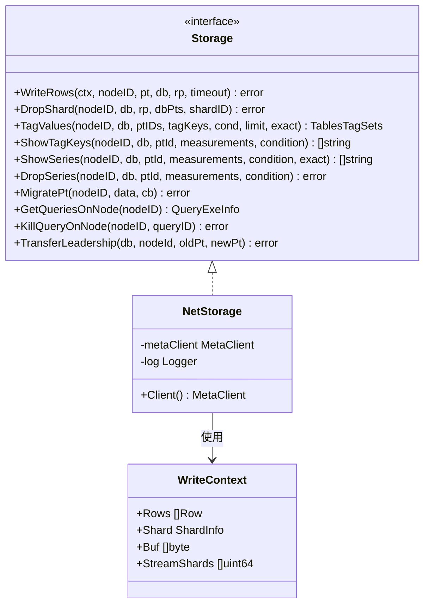
```mermaid
classDiagram
    class Storage {
        <<interface>>
        +WriteRows(ctx, nodeID, pt, db, rp, timeout) error
        +DropShard(nodeID, db, rp, dbPts, shardID) error
        +TagValues(nodeID, db, ptIDs, tagKeys, cond, limit, exact) TablesTagSets
        +ShowTagKeys(nodeID, db, ptId, measurements, condition) []string
        +ShowSeries(nodeID, db, ptId, measurements, condition, exact) []string
        +DropSeries(nodeID, db, ptId, measurements, condition) error
        +MigratePt(nodeID, data, cb) error
        +GetQueriesOnNode(nodeID) QueryExeInfo
        +KillQueryOnNode(nodeID, queryID) error
        +TransferLeadership(db, nodeId, oldPt, newPt) error
    }

    class NetStorage {
        -metaClient MetaClient
        -log Logger
        +Client() MetaClient
    }

    class WriteContext {
        +Rows []Row
        +Shard ShardInfo
        +Buf []byte
        +StreamShards []uint64
    }

    Storage <|.. NetStorage
    NetStorage --> WriteContext : 使用
```

**核心代码**：`lib/netstorage/storage.go:76-93`

```go
// 第 76 行：NetStorage 结构体 — Storage 接口的唯一实现
type NetStorage struct {
    metaClient meta.MetaClient  // 元数据客户端，用于查询 Shard 归属、节点信息
    log        *logger.Logger   // 日志器
}

// 第 81 行：WriteContext — 写入上下文，承载待写入的数据
type WriteContext struct {
    Rows         []influx.Row     // 待写入的行数据
    Shard        *meta2.ShardInfo // 目标 Shard 的元数据
    Buf          []byte           // 序列化缓冲区（可复用，减少内存分配）
    StreamShards []uint64         // 流式计算关联的 Shard ID 列表
}

// 第 88 行：构造函数
func NewNetStorage(mcli meta.MetaClient) Storage {
    return &NetStorage{
        metaClient: mcli,
        log:        logger.NewLogger(errno.ModuleNetwork).With(zap.String("service", "netstorage")),
    }
}
```

**逐行解释**：
- **第 77 行**：`metaClient` 是元数据客户端接口，用于查询 Shard 归属（`ShardOwner`）、节点信息（`DataNode`）、PtView 等
- **第 82 行**：`Rows` 是待写入的数据行，每行包含 measurement、tags、fields、timestamp
- **第 83 行**：`Shard` 包含目标 Shard 的 ID、Owner 列表等元数据
- **第 84 行**：`Buf` 是序列化缓冲区，通过复用减少 GC 压力
- **第 85 行**：`StreamShards` 用于流式计算场景，关联 Stream Shard ID

**通俗解释**：
- `NetStorage` 是一个"网络存储代理"，它知道每个 Shard 在哪个节点上
- `WriteContext` 是一个"数据包裹"，装着要写入的数据和目标地址信息
- `Buf` 就像一个可重复使用的"信封"，每次写入后不丢弃，下次继续用

### 2.2 Schema 辅助结构

**核心代码**：`lib/netstorage/schema.go`

```go
// 第 21 行：ColumnKeys — 列键信息（用于列存查询）
type ColumnKeys struct {
    Name string               // 表名
    Keys []metaclient.FieldKey // 字段键列表
}

// 第 26 行：TableColumnKeys — 支持排序的列键切片
type TableColumnKeys []ColumnKeys
func (a TableColumnKeys) Len() int           { return len(a) }
func (a TableColumnKeys) Swap(i, j int)      { a[i], a[j] = a[j], a[i] }
func (a TableColumnKeys) Less(i, j int) bool { return a[i].Name < a[j].Name }

// 第 32 行：TagKeys — Tag 键信息
type TagKeys struct {
    Name string   // 表名
    Keys []string // Tag 键列表
}

// 第 37 行：TableTagKeys — 支持排序的 Tag 键切片
type TableTagKeys []TagKeys
```

**逐行解释**：
- `ColumnKeys` 和 `TagKeys` 是查询结果的中间表示，用于 `SHOW TAG KEYS`、`SHOW FIELD KEYS` 等命令
- 实现了 `sort.Interface`，支持按表名排序，确保结果有序

---

## 3. 写入路径详解

### 3.1 写入全流程

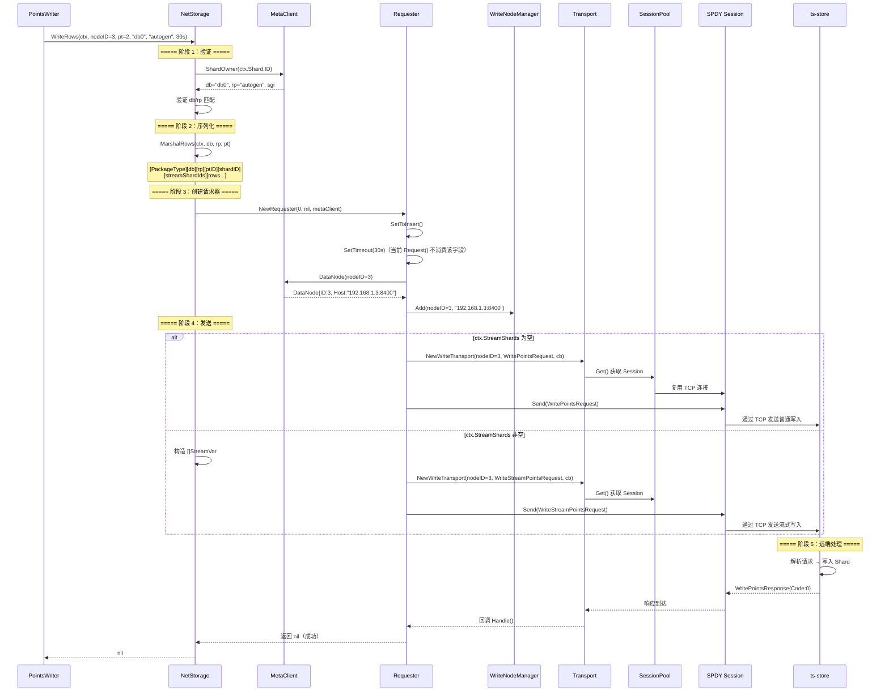
```mermaid
sequenceDiagram
    participant PW as PointsWriter
    participant NS as NetStorage
    participant MC as MetaClient
    participant Req as Requester
    participant NM as WriteNodeManager
    participant Trans as Transport
    participant Pool as SessionPool
    participant SPDY as SPDY Session
    participant Store as ts-store

    PW->>NS: WriteRows(ctx, nodeID=3, pt=2, "db0", "autogen", 30s)

    Note over NS: ===== 阶段 1：验证 =====
    NS->>MC: ShardOwner(ctx.Shard.ID)
    MC-->>NS: db="db0", rp="autogen", sgi
    NS->>NS: 验证 db/rp 匹配

    Note over NS: ===== 阶段 2：序列化 =====
    NS->>NS: MarshalRows(ctx, db, rp, pt)
    Note over NS: [PackageType][db][rp][ptID][shardID]<br/>[streamShardIds][rows...]

    Note over NS: ===== 阶段 3：创建请求器 =====
    NS->>Req: NewRequester(0, nil, metaClient)
    Req->>Req: SetToInsert()
    Req->>Req: SetTimeout(30s)（当前 Request() 不消费该字段）
    Req->>MC: DataNode(nodeID=3)
    MC-->>Req: DataNode{ID:3, Host:"192.168.1.3:8400"}
    Req->>NM: Add(nodeID=3, "192.168.1.3:8400")

    Note over NS: ===== 阶段 4：发送 =====
    alt ctx.StreamShards 为空
        Req->>Trans: NewWriteTransport(nodeID=3, WritePointsRequest, cb)
        Trans->>Pool: Get() 获取 Session
        Pool->>SPDY: 复用 TCP 连接
        Req->>SPDY: Send(WritePointsRequest)
        SPDY->>Store: 通过 TCP 发送普通写入
    else ctx.StreamShards 非空
        NS->>NS: 构造 []StreamVar
        Req->>Trans: NewWriteTransport(nodeID=3, WriteStreamPointsRequest, cb)
        Trans->>Pool: Get() 获取 Session
        Req->>SPDY: Send(WriteStreamPointsRequest)
        SPDY->>Store: 通过 TCP 发送流式写入
    end

    Note over Store: ===== 阶段 5：远端处理 =====
    Store->>Store: 解析请求 → 写入 Shard

    Store-->>SPDY: WritePointsResponse{Code:0}
    SPDY-->>Trans: 响应到达
    Trans-->>Req: 回调 Handle()
    Req-->>NS: 返回 nil（成功）
    NS-->>PW: nil
```

**核心代码**：`lib/netstorage/storage.go:167-217`

```go
// 第 167 行：WriteRows — 写入数据到远程节点
func (s *NetStorage) WriteRows(ctx *WriteContext, nodeID uint64, pt uint32, database, rp string, timeout time.Duration) error {
    rows := ctx.Rows
    if len(rows) == 0 {
        return nil  // 空数据直接返回
    }

    // 第 174 行：验证 Shard 归属
    db, rpName, sgi := s.metaClient.ShardOwner(ctx.Shard.ID)
    if sgi == nil {
        return fmt.Errorf("shard group not found, shardID: %d", ctx.Shard.ID)
    }
    if db != database || rpName != rp {
        return fmt.Errorf("exp db: %v, rp: %v, but got: %v, %v", database, rp, db, rpName)
    }

    // 第 183 行：序列化行数据
    pBuf, err := MarshalRows(ctx, db, rp, pt)
    if err != nil {
        return err
    }

    // 第 188 行：创建请求器
    r := msgservice.NewRequester(0, nil, s.metaClient)
    r.SetToInsert()          // 标记为写入请求（使用 WriteNodeManager）
    r.SetTimeout(timeout)    // 设置 Requester.timeout 字段；当前 Request() 不消费

    // 第 192 行：初始化目标节点
    err = r.InitWithNodeID(nodeID)
    if err != nil {
        return err
    }

    // 第 197 行：区分普通写入和流式写入
    if len(ctx.StreamShards) > 0 {
        // 流式写入路径
        streamVars := make([]*msgservice.StreamVar, len(rows))
        for i := range rows {
            streamVars[i] = &msgservice.StreamVar{}
            streamVars[i].Only = rows[i].StreamOnly
            streamVars[i].Id = rows[i].StreamId
        }
        cb := &msgservice.WriteStreamPointsCallback{}
        err = r.Request(spdy.WriteStreamPointsRequest, msgservice.NewWriteStreamPointsRequest(pBuf, streamVars), cb)
        return err
    }

    // 第 212 行：普通写入路径
    cb := &msgservice.WritePointsCallback{}
    err = r.Request(spdy.WritePointsRequest, msgservice.NewWritePointsRequest(pBuf), cb)
    return err
}
```

**逐行解释**：
- **第 174 行**：`ShardOwner` 查询该 Shard 属于哪个数据库和 RP，验证请求的正确性
- **第 183 行**：`MarshalRows` 将行数据序列化为二进制格式（见 3.2 节）
- **第 188-191 行**：创建 `Requester`，`SetToInsert()` 表示使用写入专用的连接池（`WriteNodeManager`）；`SetTimeout(timeout)` 当前只写入 `Requester.timeout` 字段，`Request()` 没有把它传给 transport
- **第 192 行**：`InitWithNodeID` 通过 MetaClient 查询节点地址，并注册到 `WriteNodeManager`
- **第 197-209 行**：如果有关联的 StreamShard，走流式写入路径（`WriteStreamPointsRequest`）
- **第 212-216 行**：普通写入路径，使用 `WritePointsRequest` 类型

**StreamShards 案例**：

```
普通写入:
  ctx.StreamShards = nil
  -> NewWritePointsRequest(pBuf)
  -> Request(spdy.WritePointsRequest, ..., WritePointsCallback)

流式写入:
  ctx.StreamShards = [101, 102]
  -> rows[i].StreamOnly / StreamId 被转成 StreamVar
  -> NewWriteStreamPointsRequest(pBuf, streamVars)
  -> Request(spdy.WriteStreamPointsRequest, ..., WriteStreamPointsCallback)
```

### 3.2 数据序列化 — MarshalRows

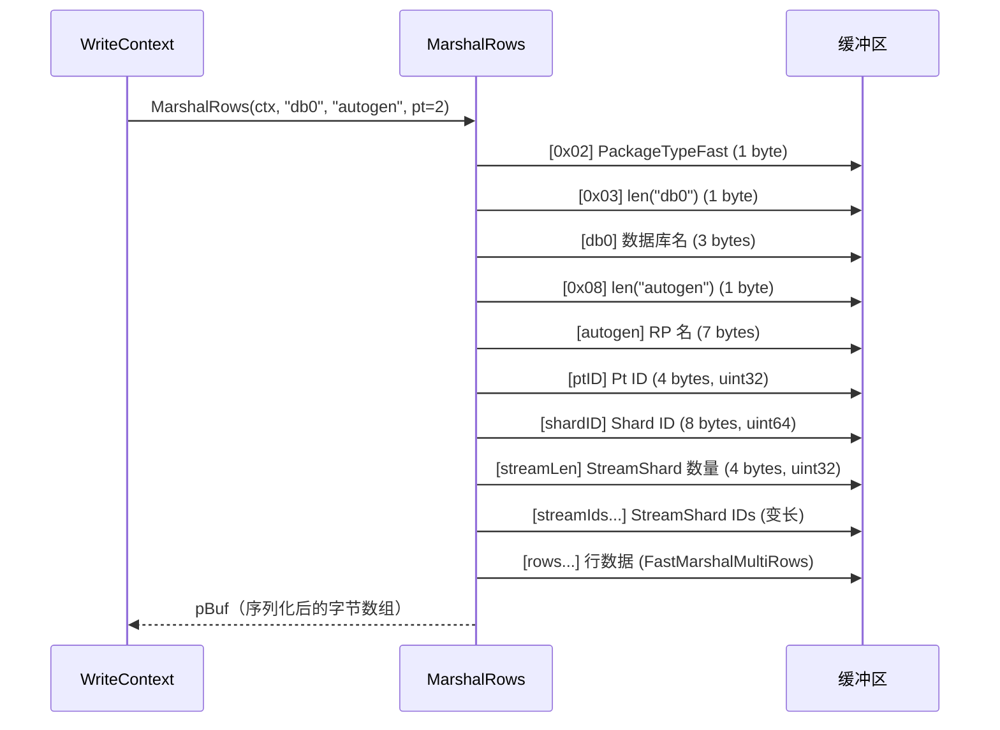
```mermaid
sequenceDiagram
    participant Ctx as WriteContext
    participant Marshal as MarshalRows
    participant Buf as 缓冲区

    Ctx->>Marshal: MarshalRows(ctx, "db0", "autogen", pt=2)

    Marshal->>Buf: [0x02] PackageTypeFast (1 byte)
    Marshal->>Buf: [0x03] len("db0") (1 byte)
    Marshal->>Buf: [db0] 数据库名 (3 bytes)
    Marshal->>Buf: [0x08] len("autogen") (1 byte)
    Marshal->>Buf: [autogen] RP 名 (7 bytes)
    Marshal->>Buf: [ptID] Pt ID (4 bytes, uint32)
    Marshal->>Buf: [shardID] Shard ID (8 bytes, uint64)
    Marshal->>Buf: [streamLen] StreamShard 数量 (4 bytes, uint32)
    Marshal->>Buf: [streamIds...] StreamShard IDs (变长)
    Marshal->>Buf: [rows...] 行数据 (FastMarshalMultiRows)

    Marshal-->>Ctx: pBuf（序列化后的字节数组）
```

**核心代码**：`lib/netstorage/storage.go:474-497`

```go
// 第 474 行：MarshalRows — 序列化写入数据
func MarshalRows(ctx *WriteContext, db, rp string, pt uint32) ([]byte, error) {
    // 第 475 行：以 PackageTypeFast 开头（值为 2），标识这是快速写入协议
    pBuf := append(ctx.Buf[:0], PackageTypeFast)

    // 第 477-478 行：序列化数据库名（长度前缀 + 内容）
    pBuf = append(pBuf, uint8(len(db)))
    pBuf = append(pBuf, db...)

    // 第 480-481 行：序列化 RP 名（长度前缀 + 内容）
    pBuf = append(pBuf, uint8(len(rp)))
    pBuf = append(pBuf, rp...)

    // 第 483-484 行：序列化 PtID 和 ShardID（固定长度，小端序）
    pBuf = numenc.MarshalUint32(pBuf, pt)
    pBuf = numenc.MarshalUint64(pBuf, ctx.Shard.ID)

    // 第 487-488 行：序列化 StreamShard 列表
    pBuf = numenc.MarshalUint32(pBuf, uint32(len(ctx.StreamShards)))
    pBuf = numenc.MarshalVarUint64s(pBuf, ctx.StreamShards)

    // 第 491 行：序列化行数据（高性能二进制格式）
    var err error
    pBuf, err = influx.FastMarshalMultiRows(pBuf, ctx.Rows)
    if err != nil {
        return nil, err
    }

    // 第 496 行：保存缓冲区引用，供下次复用
    ctx.Buf = pBuf
    return pBuf, err
}
```

**逐行解释**：
- **第 475 行**：`PackageTypeFast`（值为 2）是协议标识，接收端据此判断数据格式
- **第 477-481 行**：数据库名和 RP 名使用"长度前缀"编码，`uint8(len)` 表示最长 255 字符
- **第 483-484 行**：PtID（uint32）和 ShardID（uint64）使用固定长度编码，便于快速解析
- **第 487-488 行**：StreamShard 列表使用变长编码（VarUint64），节省空间
- **第 491 行**：`FastMarshalMultiRows` 是 VictoriaMetrics 的高性能序列化方法，比 Protobuf 快 3-5 倍
- **第 496 行**：将缓冲区引用保存到 `ctx.Buf`，下次写入时复用（`append(ctx.Buf[:0], ...)`）

**通俗解释**：
序列化就像"打包快递"：
- **PackageTypeFast**：快递单上的"加急"标签
- **db/rp**：收件地址（数据库 + 保留策略）
- **ptID/shardID**：具体门牌号（分区 + 分片）
- **rows**：包裹内容（实际数据）
- **Buf 复用**：快递袋不丢，下次继续用

**具体例子**：

序列化 `INSERT cpu,host=server1 value=99.5` 的二进制格式：

```
字节布局：
[0x02]                           PackageTypeFast = 2
[0x03]                           len("db0") = 3
[0x64 0x62 0x30]                 "db0"
[0x08]                           len("autogen") = 8
[0x61 0x75 0x74 0x6f 0x67 0x65 0x6e]  "autogen"
[0x02 0x00 0x00 0x00]            ptID = 2 (little-endian uint32)
[0x64 0x00 0x00 0x00 0x00 0x00 0x00 0x00]  shardID = 100 (little-endian uint64)
[0x00 0x00 0x00 0x00]            streamShardCount = 0
[...]                            FastMarshalMultiRows 编码的行数据
```

### 3.3 Requester 请求器

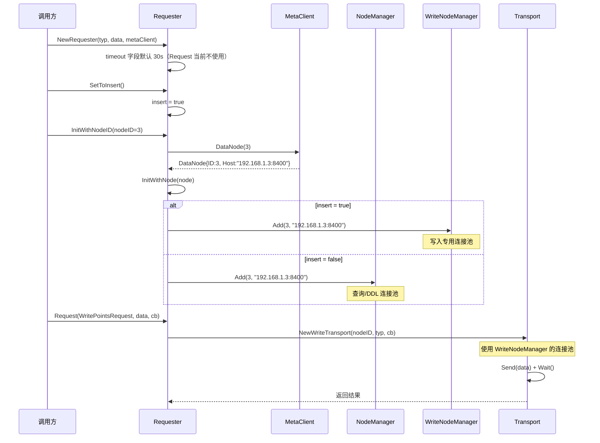
```mermaid
sequenceDiagram
    participant Caller as 调用方
    participant Req as Requester
    participant MC as MetaClient
    participant NM as NodeManager
    participant WNM as WriteNodeManager
    participant Trans as Transport

    Caller->>Req: NewRequester(typ, data, metaClient)
    Req->>Req: timeout 字段默认 30s（Request 当前不使用）

    Caller->>Req: SetToInsert()
    Req->>Req: insert = true

    Caller->>Req: InitWithNodeID(nodeID=3)
    Req->>MC: DataNode(3)
    MC-->>Req: DataNode{ID:3, Host:"192.168.1.3:8400"}
    Req->>Req: InitWithNode(node)

    alt insert = true
        Req->>WNM: Add(3, "192.168.1.3:8400")
        Note over WNM: 写入专用连接池
    else insert = false
        Req->>NM: Add(3, "192.168.1.3:8400")
        Note over NM: 查询/DDL 连接池
    end

    Caller->>Req: Request(WritePointsRequest, data, cb)
    Req->>Trans: NewWriteTransport(nodeID, typ, cb)
    Note over Trans: 使用 WriteNodeManager 的连接池
    Trans->>Trans: Send(data) + Wait()
    Trans-->>Req: 返回结果
```

**核心代码**：`lib/msgservice/requester.go`

```go
// 第 32 行：Requester 结构体 — 封装单次远程请求的完整上下文
type Requester struct {
    msgTyp  uint8             // 消息类型（如 DDL、WritePoints）
    data    codec.BinaryCodec // 请求数据
    mc      meta.MetaClient   // 元数据客户端
    node    *meta2.DataNode   // 目标节点信息

    insert  bool              // 是否为写入请求
    timeout time.Duration     // 超时时间
}

// 第 59 行：InitWithNodeID — 通过节点 ID 初始化
func (r *Requester) InitWithNodeID(nodeID uint64) error {
    node, err := r.mc.DataNode(nodeID)  // 查询节点信息
    if err != nil {
        return err
    }
    r.InitWithNode(node)
    return nil
}

// 第 68 行：InitWithNode — 初始化目标节点
func (r *Requester) InitWithNode(node *meta2.DataNode) {
    r.node = node
    if r.insert {
        // 写入请求：注册到 WriteNodeManager（独立的连接池）
        transport.NewWriteNodeManager().Add(node.ID, node.Host)
    } else {
        // 查询/DDL 请求：注册到 NodeManager（共享的连接池）
        transport.NewNodeManager().Add(node.ID, node.TCPHost)
    }
}

// 第 128 行：Request — 发送请求并等待响应
func (r *Requester) Request(queryTyp uint8, data transport.Codec, cb transport.Callback) error {
    var trans *transport.Transport
    var err error

    if r.insert {
        trans, err = transport.NewWriteTransport(r.node.ID, queryTyp, cb)
    } else {
        trans, err = transport.NewTransport(r.node.ID, queryTyp, cb)
    }
    if err != nil {
        return err
    }
    if err := trans.Send(data); err != nil {
        return err
    }
    if err := trans.Wait(); err != nil {
        return err
    }
    return nil
}
```

**逐行解释**：
- **第 59-66 行**：`InitWithNodeID` 通过 MetaClient 查询节点的网络地址，然后调用 `InitWithNode`
- **第 68-75 行**：`InitWithNode` 将节点注册到对应的 NodeManager。写入请求使用 `WriteNodeManager`（`node.Host`，端口 8400），查询/DDL 使用 `NodeManager`（`node.TCPHost`，端口 8088）
- **第 128-149 行**：`Request` 方法根据 `insert` 标志选择不同的 Transport 工厂方法。写入使用 `NewWriteTransport`（10s 超时），查询/DDL 使用 `NewTransport`（30min 超时）
- **超时边界**：`Requester.timeout` / `SetTimeout()` 当前没有在 `Request()` 中传给 `NewWriteTransport` 或 `NewTransport`；普通 `Request()` 的有效超时来自 transport 工厂：写入 10s，查询/DDL 30min。`RaftMsg()` 走 `NewRaftMsgTransport`，有效超时是 15s。

**通俗解释**：
- `Requester` 是一个"快递员"，知道：
  - 送什么（`data`）
  - 送给谁（`node`）
  - 用什么方式送（`insert` 标志决定用哪个连接池）
  - `timeout` 字段（当前普通 `Request()` 不消费）
- 写入和查询使用**独立的连接池**，互不干扰

### 3.4 WritePointsCallback 写入回调

**核心代码**：`lib/msgservice/callback.go:68-91`

```go
// 第 68 行：WritePointsCallback — 写入响应的回调处理
type WritePointsCallback struct {
    data *WritePointsResponse
}

// 第 72 行：Handle — 处理响应数据
func (c *WritePointsCallback) Handle(data interface{}) error {
    msg, ok := data.(*WritePointsResponse)
    if !ok {
        return errno.NewInvalidTypeError("*msgservice.WritePointsResponse", data)
    }

    c.data = msg
    if c.data.Code == 0 {
        return nil  // 成功
    } else if c.data.ErrCode != 0 {
        err := errno.NewError(c.data.ErrCode)
        err.SetMessage(c.data.Message)
        return err  // 带错误码的失败
    }
    return errors.New(c.data.Message)  // 普通失败
}

// 第 89 行：GetCodec — 返回响应的反序列化模板
func (c *WritePointsCallback) GetCodec() transport.Codec {
    return &WritePointsResponse{}
}
```

**逐行解释**：
- **第 79 行**：`Code == 0` 表示写入成功
- **第 81-83 行**：`ErrCode != 0` 表示有结构化错误（如 `ShardMetaNotFound`），使用 `errno.NewError` 创建带错误码的错误
- **第 85 行**：其他错误使用普通 `errors.New`
- **第 89 行**：`GetCodec` 返回 `WritePointsResponse` 的空实例，Transport 层用它来反序列化响应数据

---

## 4. DDL 请求路径

### 4.1 DDL 请求流程

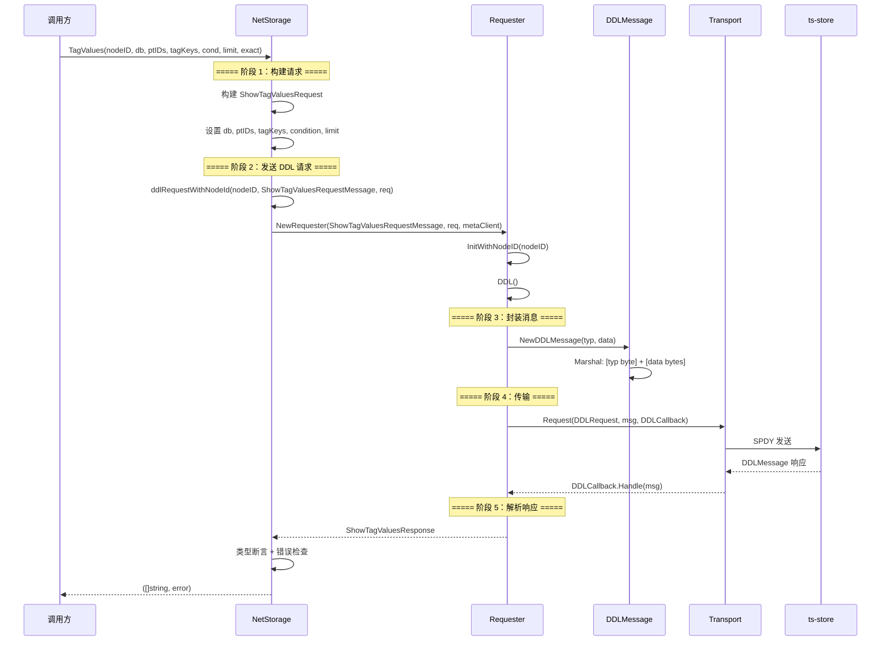
```mermaid
sequenceDiagram
    participant Caller as 调用方
    participant NS as NetStorage
    participant Req as Requester
    participant Msg as DDLMessage
    participant Trans as Transport
    participant Store as ts-store

    Caller->>NS: TagValues(nodeID, db, ptIDs, tagKeys, cond, limit, exact)

    Note over NS: ===== 阶段 1：构建请求 =====
    NS->>NS: 构建 ShowTagValuesRequest
    NS->>NS: 设置 db, ptIDs, tagKeys, condition, limit

    Note over NS: ===== 阶段 2：发送 DDL 请求 =====
    NS->>NS: ddlRequestWithNodeId(nodeID, ShowTagValuesRequestMessage, req)
    NS->>Req: NewRequester(ShowTagValuesRequestMessage, req, metaClient)
    Req->>Req: InitWithNodeID(nodeID)
    Req->>Req: DDL()

    Note over Req: ===== 阶段 3：封装消息 =====
    Req->>Msg: NewDDLMessage(typ, data)
    Msg->>Msg: Marshal: [typ byte] + [data bytes]

    Note over Req: ===== 阶段 4：传输 =====
    Req->>Trans: Request(DDLRequest, msg, DDLCallback)
    Trans->>Store: SPDY 发送
    Store-->>Trans: DDLMessage 响应
    Trans-->>Req: DDLCallback.Handle(msg)

    Note over Req: ===== 阶段 5：解析响应 =====
    Req-->>NS: ShowTagValuesResponse
    NS->>NS: 类型断言 + 错误检查
    NS-->>Caller: ([]string, error)
```

**核心代码**：`lib/netstorage/storage.go:219-234`

```go
// 第 219 行：ddlRequestWithNodeId — 通过节点 ID 发送 DDL 请求
func (s *NetStorage) ddlRequestWithNodeId(nodeID uint64, typ uint8, data codec.BinaryCodec) (interface{}, error) {
    r := msgservice.NewRequester(typ, data, s.metaClient)
    err := r.InitWithNodeID(nodeID)
    if err != nil {
        return nil, err
    }
    return r.DDL()  // 发送 DDL 请求并等待响应
}

// 第 229 行：ddlRequestWithNode — 通过节点对象发送 DDL 请求
func (s *NetStorage) ddlRequestWithNode(node *meta2.DataNode, typ uint8, data codec.BinaryCodec) (interface{}, error) {
    r := msgservice.NewRequester(typ, data, s.metaClient)
    r.InitWithNode(node)  // 直接使用节点对象，无需查询 MetaClient
    return r.DDL()
}
```

**逐行解释**：
- **第 219-227 行**：`ddlRequestWithNodeId` 先通过 `MetaClient.DataNode(nodeID)` 查询节点地址，再发送请求
- **第 229-234 行**：`ddlRequestWithNode` 直接使用已知的节点对象，适用于调用方已经持有节点信息的场景（如 `GetShardSplitPoints`、`DeleteMeasurement`）

**核心代码**：`lib/msgservice/requester.go:77-86`

```go
// 第 77 行：DDL — 发送 DDL 请求
func (r *Requester) DDL() (interface{}, error) {
    data := NewDDLMessage(r.msgTyp, r.data)  // 封装为 DDLMessage
    cb := &DDLCallback{}                      // 创建回调

    if err := r.Request(spdy.DDLRequest, data, cb); err != nil {
        return nil, err
    }
    return cb.GetResponse(), nil  // 返回响应数据
}
```

**逐行解释**：
- **第 78 行**：`NewDDLMessage` 将消息类型和数据封装为 `DDLMessage`，序列化格式为 `[typ byte][data bytes]`
- **第 79 行**：`DDLCallback` 负责解析响应，提取实际的业务数据
- **第 81 行**：使用 `spdy.DDLRequest` 类型发送，走 NodeManager 的连接池（非 WriteNodeManager）

### 4.2 DDL 消息类型注册

**核心代码**：`lib/msgservice/message_types.go:21-112`

```go
// 第 21 行：消息类型常量定义
const (
    UnknownMessage uint8 = iota  // 0: 未知
    SeriesKeysRequestMessage     // 1: 查询 Series
    SeriesKeysResponseMessage    // 2: Series 响应
    // ... 更多类型
    ShowTagKeysRequestMessage    // 22: 查询 Tag Keys
    ShowTagKeysResponseMessage   // 23: Tag Keys 响应
    DropSeriesRequestMessage     // 24: 删除 Series
    DropSeriesResponseMessage    // 25: 删除 Series 响应
)

// 第 64 行：消息编解码器注册表
var MessageBinaryCodec = make(map[uint8]func() codec.BinaryCodec, 20)

// 第 65 行：请求-响应类型映射表
var MessageResponseTyp = make(map[uint8]uint8, 20)

func init() {
    // 注册每种消息类型的构造函数
    MessageBinaryCodec[SeriesKeysRequestMessage] = func() codec.BinaryCodec { return &SeriesKeysRequest{} }
    MessageBinaryCodec[SeriesKeysResponseMessage] = func() codec.BinaryCodec { return &SeriesKeysResponse{} }
    // ... 更多注册

    // 注册请求-响应类型映射
    MessageResponseTyp = map[uint8]uint8{
        SeriesKeysRequestMessage:     SeriesKeysResponseMessage,
        ShowTagValuesRequestMessage:  ShowTagValuesResponseMessage,
        DeleteRequestMessage:         DeleteResponseMessage,
        // ... 更多映射
    }
}
```

**逐行解释**：
- **第 64 行**：`MessageBinaryCodec` 是一个工厂函数表，根据消息类型创建对应的 Codec 实例
- **第 65 行**：`MessageResponseTyp` 映射请求类型到响应类型，用于响应路由
- **init 函数**：在包加载时注册所有消息类型，确保运行时可以正确反序列化

**通俗解释**：
消息类型注册就像"快递公司的分类系统"：
- 每种消息类型有一个编号（如 `ShowTagKeysRequestMessage = 22`）
- 每种类型都有对应的"拆包工具"（构造函数）
- 请求和响应有固定的配对关系（如 22 对应 23）

### 4.3 具体 DDL 操作示例

**SHOW TAG KEYS 流程**：

```
用户执行：SHOW TAG KEYS ON db0 FROM cpu

Step 1: ts-sql 解析 SQL
  → 构建 ShowTagKeysRequest{Db: "db0", PtIDs: [0,1,2], Measurements: ["cpu"]}

Step 2: 路由到目标节点
  → 查 PtView → 确定 Pt 0 在 Node1，Pt 1 在 Node2，Pt 2 在 Node3

Step 3: 并行发送 DDL 请求
  → Node1: ddlRequestWithNodeId(1, ShowTagKeysRequestMessage, req)
  → Node2: ddlRequestWithNodeId(2, ShowTagKeysRequestMessage, req)
  → Node3: ddlRequestWithNodeId(3, ShowTagKeysRequestMessage, req)

Step 4: 每个节点本地执行
  → Node1: 查询 Pt 0 的 Tag Keys → ["host", "region"]
  → Node2: 查询 Pt 1 的 Tag Keys → ["host", "rack"]
  → Node3: 查询 Pt 2 的 Tag Keys → ["host", "dc"]

Step 5: ts-sql 合并结果
  → 去重合并 → ["dc", "host", "rack", "region"]
  → 返回给用户
```

---

## 5. 删除操作

### 5.1 删除请求流程

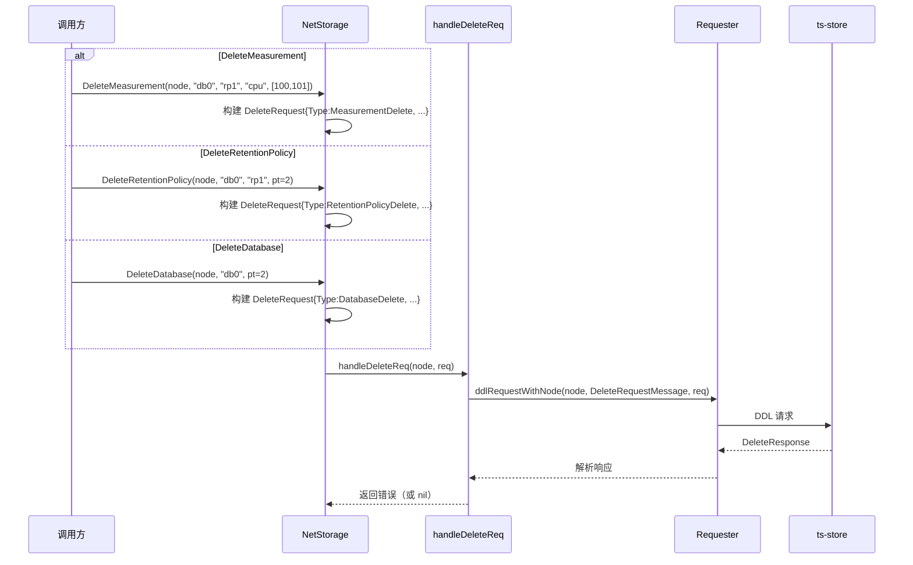
```mermaid
sequenceDiagram
    participant Caller as 调用方
    participant NS as NetStorage
    participant Handler as handleDeleteReq
    participant Req as Requester
    participant Store as ts-store

    alt DeleteMeasurement
        Caller->>NS: DeleteMeasurement(node, "db0", "rp1", "cpu", [100,101])
        NS->>NS: 构建 DeleteRequest{Type:MeasurementDelete, ...}
    else DeleteRetentionPolicy
        Caller->>NS: DeleteRetentionPolicy(node, "db0", "rp1", pt=2)
        NS->>NS: 构建 DeleteRequest{Type:RetentionPolicyDelete, ...}
    else DeleteDatabase
        Caller->>NS: DeleteDatabase(node, "db0", pt=2)
        NS->>NS: 构建 DeleteRequest{Type:DatabaseDelete, ...}
    end

    NS->>Handler: handleDeleteReq(node, req)
    Handler->>Req: ddlRequestWithNode(node, DeleteRequestMessage, req)
    Req->>Store: DDL 请求
    Store-->>Req: DeleteResponse
    Req-->>Handler: 解析响应
    Handler-->>NS: 返回错误（或 nil）
```

**核心代码**：`lib/netstorage/storage.go:121-165`

```go
// 第 121 行：handleDeleteReq — 处理删除请求的通用方法
func (s *NetStorage) handleDeleteReq(node *meta2.DataNode, req *msgservice.DeleteRequest) error {
    v, err := s.ddlRequestWithNode(node, msgservice.DeleteRequestMessage, req)
    if err != nil {
        return err
    }
    resp, ok := v.(*msgservice.DeleteResponse)
    if !ok {
        return errno.NewInvalidTypeError("*msgservice.DeleteResponse", v)
    }
    return resp.Err
}

// 第 135 行：DeleteMeasurement — 删除指定 Measurement
func (s *NetStorage) DeleteMeasurement(node *meta2.DataNode, db string, rp string, name string, shardIds []uint64) error {
    deleteReq := &msgservice.DeleteRequest{
        Type:        msgservice.MeasurementDelete,
        Database:    db,
        ShardIds:    shardIds,
        Rp:          rp,
        Measurement: name,
    }
    return s.handleDeleteReq(node, deleteReq)
}

// 第 146 行：DeleteRetentionPolicy — 删除保留策略
func (s *NetStorage) DeleteRetentionPolicy(node *meta2.DataNode, db string, rp string, pt uint32) error {
    deleteReq := &msgservice.DeleteRequest{
        Type:     msgservice.RetentionPolicyDelete,
        Database: db,
        Rp:       rp,
        PtId:     pt,
    }
    return s.handleDeleteReq(node, deleteReq)
}

// 第 157 行：DeleteDatabase — 删除数据库
func (s *NetStorage) DeleteDatabase(node *meta2.DataNode, database string, pt uint32) error {
    deleteReq := &msgservice.DeleteRequest{
        Type:     msgservice.DatabaseDelete,
        Database: database,
        PtId:     pt,
    }
    return s.handleDeleteReq(node, deleteReq)
}
```

**逐行解释**：
- 三种删除操作共享 `handleDeleteReq` 通用方法，通过 `DeleteType` 区分
- `DeleteMeasurement` 需要指定 ShardID 列表（精确删除）
- `DeleteRetentionPolicy` 和 `DeleteDatabase` 只需指定 PtID（范围删除）
- 使用 `ddlRequestWithNode`（非 `ddlRequestWithNodeId`），因为调用方已持有节点对象

---

## 6. 节点管理操作

### 6.1 Pt 迁移

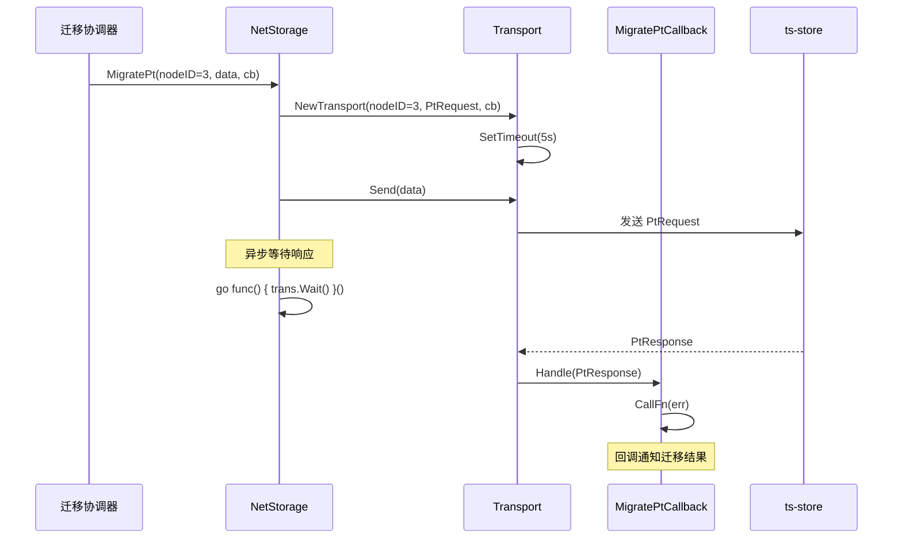
```mermaid
sequenceDiagram
    participant Caller as 迁移协调器
    participant NS as NetStorage
    participant Trans as Transport
    participant CB as MigratePtCallback
    participant Store as ts-store

    Caller->>NS: MigratePt(nodeID=3, data, cb)
    NS->>Trans: NewTransport(nodeID=3, PtRequest, cb)
    Trans->>Trans: SetTimeout(5s)
    NS->>Trans: Send(data)
    Trans->>Store: 发送 PtRequest

    Note over NS: 异步等待响应
    NS->>NS: go func() { trans.Wait() }()

    Store-->>Trans: PtResponse
    Trans->>CB: Handle(PtResponse)
    CB->>CB: CallFn(err)
    Note over CB: 回调通知迁移结果
```

**核心代码**：`lib/netstorage/storage.go:404-420`

```go
// 第 404 行：MigratePt — Pt 迁移（异步操作）
func (s *NetStorage) MigratePt(nodeID uint64, data transport.Codec, cb transport.Callback) error {
    trans, err := transport.NewTransport(nodeID, spdy.PtRequest, cb)
    if err != nil {
        return err
    }
    trans.SetTimeout(migrateTimeout)  // 5 秒超时

    if err = trans.Send(data); err != nil {
        return err
    }

    // 第 414 行：异步等待响应
    // 调用方必须传 *msgservice.MigratePtCallback，否则这里会 panic
    mcb := cb.(*msgservice.MigratePtCallback)
    go func() {
        if err := trans.Wait(); err != nil {
            mcb.CallFn(err)  // 出错时回调通知
        }
    }()
    return nil  // 立即返回，不阻塞调用方
}
```

**逐行解释**：
- **第 409 行**：迁移超时设置为 5 秒（`migrateTimeout`）
- **第 414-418 行**：使用 goroutine 异步等待响应，调用方不阻塞
- **第 416 行**：`mcb.CallFn(err)` 通过回调函数通知迁移结果
- **Callback 类型要求**：`MigratePt` 内部直接执行 `cb.(*msgservice.MigratePtCallback)`，调用方必须传 `*msgservice.MigratePtCallback`
- **设计意图**：Pt 迁移是长时间操作，同步等待会阻塞调用方

**Callback 案例**：

```
正确:
  cb := &msgservice.MigratePtCallback{}
  cb.SetCallbackFn(func(err error) { ... })
  NetStorage.MigratePt(nodeID, ptReq, cb)

错误:
  cb := &msgservice.WritePointsCallback{}
  NetStorage.MigratePt(nodeID, ptReq, cb)
  -> cb.(*msgservice.MigratePtCallback) 断言失败
```

### 6.2 节点隔离

**核心代码**：`lib/netstorage/storage.go:422-440`

```go
// 第 422 行：SendSegregateNodeCmds — 发送节点隔离命令
func (s *NetStorage) SendSegregateNodeCmds(nodeIDs []uint64, address []string) (int, error) {
    for i, nodeId := range nodeIDs {
        segregateNodeReq := msgservice.NewSegregateNodeRequest()
        segregateNodeReq.NodeId = &nodeId

        // 第 426 行：使用地址创建 Transport（绕过 MetaClient 查询，但仍注册/使用 NodeManager）
        trans, err := transport.NewTransportByAddress(nodeId, address[i], spdy.SegregateNodeRequest, nil)
        if err != nil {
            return i, err  // 返回失败的节点索引
        }
        trans.SetTimeout(segregateTimeout)  // 5 秒超时

        if err := trans.Send(segregateNodeReq); err != nil {
            return i, err
        }
        if err := trans.Wait(); err != nil {
            return i, err
        }
    }
    return -1, nil  // 全部成功
}
```

**逐行解释**：
- **第 426 行**：`NewTransportByAddress` 用显式地址创建 Transport，因为隔离操作可能在节点注册之前执行；它绕过的是 MetaClient 节点查询，但内部仍会把地址注册到 `NodeManager` 并复用连接池
- **第 433 行**：返回失败节点的索引 `i`，调用方可以知道哪个节点隔离失败
- **第 439 行**：返回 `-1` 表示全部成功

### 6.3 领导权转移

**核心代码**：`lib/netstorage/storage.go:442-458`

```go
// 第 442 行：TransferLeadership — Pt 主节点转移
func (s *NetStorage) TransferLeadership(database string, nodeId uint64, oldMasterPtId, newMasterPtId uint32) error {
    transferLeadershipReq := msgservice.NewTransferLeadershipRequest()
    transferLeadershipReq.NodeId = &nodeId
    transferLeadershipReq.Database = &database
    transferLeadershipReq.PtId = &oldMasterPtId
    transferLeadershipReq.NewMasterPtId = &newMasterPtId

    trans, err := transport.NewTransport(nodeId, spdy.TransferLeadershipRequest, nil)
    if err != nil {
        return err
    }
    trans.SetTimeout(transferLeadershipTimeout)  // 20 秒超时

    if err := trans.Send(transferLeadershipReq); err != nil {
        return err
    }
    err = trans.Wait()
    return err
}
```

**逐行解释**：
- 领导权转移超时设置为 20 秒（`transferLeadershipTimeout`），因为涉及 Raft 选主
- 使用 `spdy.TransferLeadershipRequest` 类型，走 NodeManager 连接池

### 6.4 健康检查 — PingNode

**核心代码**：`lib/netstorage/storage.go:526-536`

```go
// 第 526 行：PingNode — 节点健康检查（包级别函数，非 Storage 接口方法）
func PingNode(nodeID uint64, address string, timeout time.Duration) error {
    trans, err := transport.NewTransportByAddress(nodeID, address, spdy.PingRequest, nil)
    if err != nil {
        return err
    }
    trans.SetTimeout(timeout)
    if err = trans.Send(msgservice.NewPingRequest()); err != nil {
        return err
    }
    return trans.Wait()
}
```

**逐行解释**：
- `PingNode` 是包级别的函数（非 `Storage` 接口方法），用于节点健康检查
- 使用 `NewTransportByAddress` 直接通过地址连接，适用于节点尚未注册的场景
- `PingRequest` 是空消息，不携带任何数据

---

## 7. 查询管理操作

### 7.1 查询管理流程

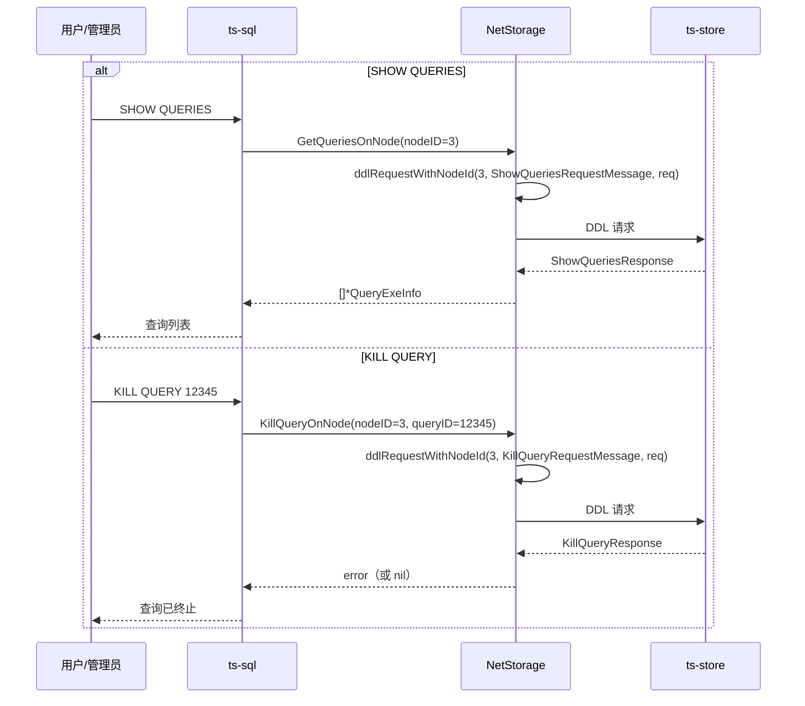
```mermaid
sequenceDiagram
    participant User as 用户/管理员
    participant SQL as ts-sql
    participant NS as NetStorage
    participant Store as ts-store

    alt SHOW QUERIES
        User->>SQL: SHOW QUERIES
        SQL->>NS: GetQueriesOnNode(nodeID=3)
        NS->>NS: ddlRequestWithNodeId(3, ShowQueriesRequestMessage, req)
        NS->>Store: DDL 请求
        Store-->>NS: ShowQueriesResponse
        NS-->>SQL: []*QueryExeInfo
        SQL-->>User: 查询列表
    else KILL QUERY
        User->>SQL: KILL QUERY 12345
        SQL->>NS: KillQueryOnNode(nodeID=3, queryID=12345)
        NS->>NS: ddlRequestWithNodeId(3, KillQueryRequestMessage, req)
        NS->>Store: DDL 请求
        Store-->>NS: KillQueryResponse
        NS-->>SQL: error（或 nil）
        SQL-->>User: 查询已终止
    end
```

**核心代码**：`lib/netstorage/storage.go:499-524`

```go
// 第 499 行：GetQueriesOnNode — 获取指定节点上正在执行的查询列表
func (s *NetStorage) GetQueriesOnNode(nodeID uint64) ([]*msgservice.QueryExeInfo, error) {
    req := &msgservice.ShowQueriesRequest{}
    v, err := s.ddlRequestWithNodeId(nodeID, msgservice.ShowQueriesRequestMessage, req)
    if err != nil {
        return nil, err
    }
    resp, ok := v.(*msgservice.ShowQueriesResponse)
    if !ok {
        return nil, errno.NewInvalidTypeError("*msgservice.ShowQueriesResponse", v)
    }
    return resp.QueryExeInfos, nil
}

// 第 512 行：KillQueryOnNode — 终止指定节点上的查询
func (s *NetStorage) KillQueryOnNode(nodeID, queryID uint64) error {
    req := &msgservice.KillQueryRequest{}
    req.QueryID = proto.Uint64(queryID)
    v, err := s.ddlRequestWithNodeId(nodeID, msgservice.KillQueryRequestMessage, req)
    if err != nil {
        return err
    }
    resp, ok := v.(*msgservice.KillQueryResponse)
    if !ok {
        return errno.NewInvalidTypeError("*msgservice.KillQueryResponse", v)
    }
    return errno.NewError(errno.Errno(resp.GetErrCode()))
}
```

**逐行解释**：
- **第 499-510 行**：`GetQueriesOnNode` 发送空的 `ShowQueriesRequest`，返回节点上所有正在执行的查询信息
- **第 512-524 行**：`KillQueryOnNode` 携带 `QueryID`，请求目标节点终止指定查询
- 两者都使用 `ddlRequestWithNodeId`，走 NodeManager 连接池

---

## 8. 与 SPDY 传输层的集成

### 8.1 三层连接管理

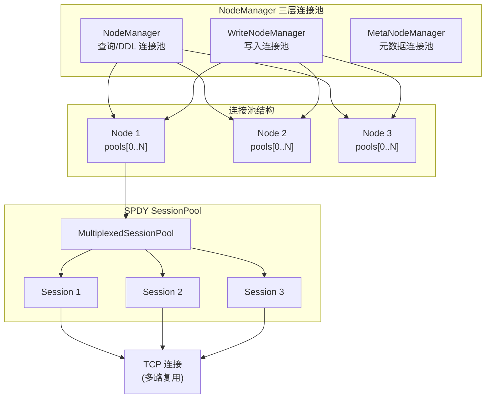
```mermaid
graph TD
    subgraph "NodeManager 三层连接池"
        NM["NodeManager<br/>查询/DDL 连接池"]
        WNM["WriteNodeManager<br/>写入连接池"]
        MNM["MetaNodeManager<br/>元数据连接池"]
    end

    subgraph "连接池结构"
        Node1["Node 1<br/>pools[0..N]"]
        Node2["Node 2<br/>pools[0..N]"]
        Node3["Node 3<br/>pools[0..N]"]
    end

    subgraph "SPDY SessionPool"
        Pool1["MultiplexedSessionPool"]
        Session1["Session 1"]
        Session2["Session 2"]
        Session3["Session 3"]
    end

    NM --> Node1
    NM --> Node2
    NM --> Node3
    WNM --> Node1
    WNM --> Node2
    WNM --> Node3

    Node1 --> Pool1
    Pool1 --> Session1
    Pool1 --> Session2
    Pool1 --> Session3

    Session1 --> TCP["TCP 连接<br/>(多路复用)"]
    Session2 --> TCP
    Session3 --> TCP
```

**核心代码**：`lib/spdy/transport/node_manager.go:27-57`

```go
// 第 27-35 行：三个全局单例 NodeManager
var nm = &NodeManager{nodes: make(map[uint64]*Node)}   // 查询/DDL
var wnm = &NodeManager{nodes: make(map[uint64]*Node)}  // 写入
var mnm = &NodeManager{nodes: make(map[uint64]*Node)}  // 元数据

// 第 45 行：NewNodeManager — 查询/DDL 连接池
func NewNodeManager() *NodeManager { return nm }

// 第 50 行：NewWriteNodeManager — 写入连接池
func NewWriteNodeManager() *NodeManager { return wnm }

// 第 55 行：NewMetaNodeManager — 元数据连接池
func NewMetaNodeManager() *NodeManager { return mnm }
```

**逐行解释**：
- 三个独立的 NodeManager 分别管理查询/DDL、写入、元数据的连接
- **为什么要分开？** 写入和查询有不同的超时策略（写入 10s，查询/DDL 30min），分开管理避免相互影响
- 每个 NodeManager 维护 `nodeID → Node` 的映射，Node 内部有连接池数组

**核心代码**：`lib/spdy/transport/node.go:42-58`

```go
// 第 42 行：GetPool — 从 Node 获取连接池
func (n *Node) GetPool() *spdy.MultiplexedSessionPool {
    poolSize := uint64(spdy.ConnPoolSize())
    if poolSize == 0 {
        return nil
    }
    // 第 48 行：轮询选择连接池（Round-Robin）
    idx := atomic.AddUint64(&n.cursor, 1) % poolSize
    if err := n.dial(idx); err != nil {
        return nil
    }
    n.mu.RLock()
    defer n.mu.RUnlock()
    return n.pools[idx]
}

// 第 60 行：dial — 建立 TCP 连接
func (n *Node) dial(idx uint64) error {
    n.mu.Lock()
    defer n.mu.Unlock()

    p := n.pools[idx]
    if p != nil && p.Available() {
        return nil  // 已有可用连接
    }

    // 第 75 行：创建新的 SessionPool 并建立 TCP 连接
    mcp := spdy.NewMultiplexedSessionPool(spdy.DefaultConfiguration(), "tcp", n.address)
    if err := mcp.Dial(); err != nil {
        return err
    }
    n.pools[idx] = mcp
    return nil
}
```

**逐行解释**：
- **第 48 行**：使用原子计数器实现 Round-Robin 轮询，均匀分配请求到多个连接池
- **第 66-68 行**：如果连接池已存在且可用，直接复用
- **第 75-76 行**：首次连接时创建 `MultiplexedSessionPool`，调用 `Dial()` 建立 TCP 连接

### 8.2 Transport 创建流程

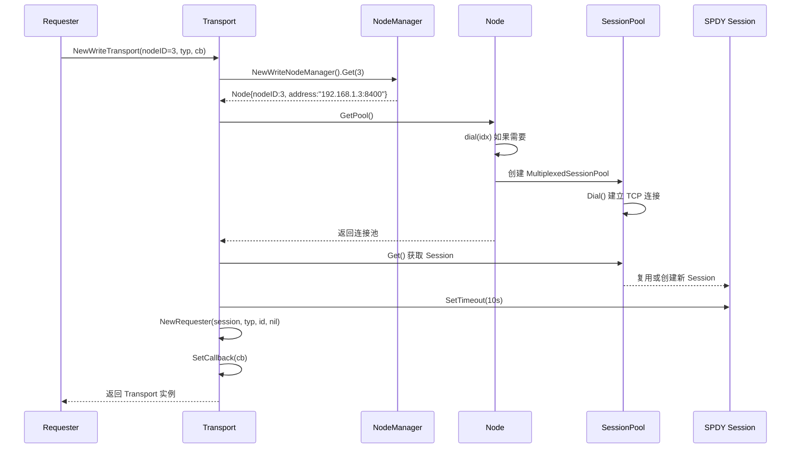
```mermaid
sequenceDiagram
    participant Req as Requester
    participant Trans as Transport
    participant NM as NodeManager
    participant Node as Node
    participant Pool as SessionPool
    participant Session as SPDY Session

    Req->>Trans: NewWriteTransport(nodeID=3, typ, cb)
    Trans->>NM: NewWriteNodeManager().Get(3)
    NM-->>Trans: Node{nodeID:3, address:"192.168.1.3:8400"}

    Trans->>Node: GetPool()
    Node->>Node: dial(idx) 如果需要
    Node->>Pool: 创建 MultiplexedSessionPool
    Pool->>Pool: Dial() 建立 TCP 连接
    Node-->>Trans: 返回连接池

    Trans->>Pool: Get() 获取 Session
    Pool-->>Session: 复用或创建新 Session

    Trans->>Session: SetTimeout(10s)
    Trans->>Trans: NewRequester(session, typ, id, nil)
    Trans->>Trans: SetCallback(cb)
    Trans-->>Req: 返回 Transport 实例
```

**核心代码**：`lib/spdy/transport/transport.go:52-119`

```go
// 第 74 行：NewWriteTransport — 创建写入专用 Transport
func NewWriteTransport(nodeId uint64, typ uint8, callback Callback) (*Transport, error) {
    node := NewWriteNodeManager().Get(nodeId)
    if node == nil {
        return nil, errno.NewError(errno.NoNodeAvailable, nodeId)
    }
    return newTransport(node, typ, callback, writeTimeOut)  // 10 秒超时
}

// 第 90 行：newTransport — Transport 创建的核心逻辑
func newTransport(node *Node, typ uint8, callback Callback, timeout time.Duration) (*Transport, error) {
    // 第 97 行：获取连接池
    p := node.GetPool()
    if p == nil || !p.Available() {
        return nil, errno.NewError(errno.NoConnectionAvailable, node.nodeID, node.address)
    }

    // 第 102 行：从连接池获取 Session
    mc, err := p.Get()
    if err != nil {
        p.Close()
        return nil, err
    }
    mc.SetTimeout(timeout)

    // 第 109 行：创建请求器和响应器
    req := NewRequester(mc, typ, atomic.AddUint64(&globalUniqueIDSequence, 1), nil)
    rsp := req.WarpResponser()
    rsp.(*Responser).SetCallback(callback)

    return &Transport{
        requester: req,
        responser: rsp,
        pool:      p,
        node:      node,
    }, nil
}
```

**逐行解释**：
- **第 74-80 行**：`NewWriteTransport` 使用 `WriteNodeManager` 获取节点，超时 10 秒
- **第 97-100 行**：获取连接池，如果不可用返回 `NoConnectionAvailable` 错误
- **第 102-105 行**：从连接池获取 Session，失败时关闭连接池
- **第 109 行**：创建 Requester，使用全局递增的唯一 ID 作为 Session ID
- **第 111 行**：将 Callback 设置到 Responser，用于处理响应

### 8.3 数据流总结

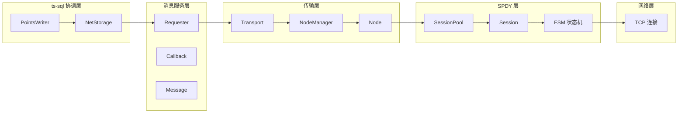
```mermaid
graph LR
    subgraph "ts-sql 协调层"
        PW["PointsWriter"]
        NS["NetStorage"]
    end

    subgraph "消息服务层"
        Req["Requester"]
        CB["Callback"]
        Msg["Message"]
    end

    subgraph "传输层"
        Trans["Transport"]
        NM["NodeManager"]
        Node["Node"]
    end

    subgraph "SPDY 层"
        Pool["SessionPool"]
        Session["Session"]
        FSM["FSM 状态机"]
    end

    subgraph "网络层"
        TCP["TCP 连接"]
    end

    PW --> NS
    NS --> Req
    Req --> Trans
    Trans --> NM
    NM --> Node
    Node --> Pool
    Pool --> Session
    Session --> FSM
    FSM --> TCP
```

---

## 9. 错误处理与超时管理

### 9.1 超时配置

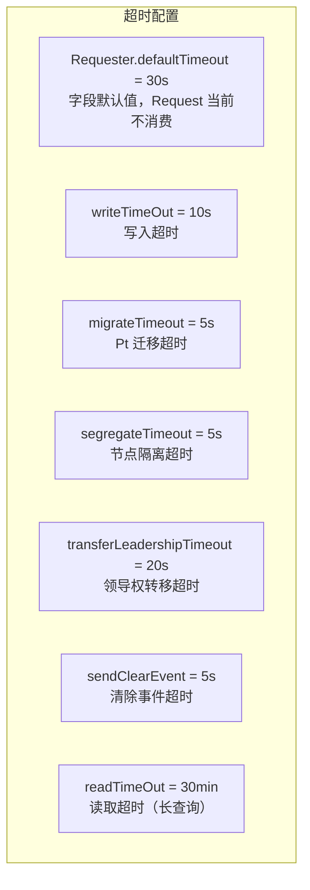
```mermaid
graph TD
    subgraph "超时配置"
        T1["Requester.defaultTimeout = 30s<br/>字段默认值，Request 当前不消费"]
        T2["writeTimeOut = 10s<br/>写入超时"]
        T3["migrateTimeout = 5s<br/>Pt 迁移超时"]
        T4["segregateTimeout = 5s<br/>节点隔离超时"]
        T5["transferLeadershipTimeout = 20s<br/>领导权转移超时"]
        T6["sendClearEvent = 5s<br/>清除事件超时"]
        T7["readTimeOut = 30min<br/>读取超时（长查询）"]
    end
```

**核心代码**：`lib/netstorage/storage.go:37-41`

```go
// 第 37 行：超时配置
var (
    migrateTimeout            = 5 * time.Second   // Pt 迁移
    segregateTimeout          = 5 * time.Second   // 节点隔离
    transferLeadershipTimeout = 20 * time.Second  // 领导权转移
    sendClearEvent            = 5 * time.Second   // 清除事件
)
```

**核心代码**：`lib/msgservice/requester.go:28-29`

```go
// 第 28 行：Requester 默认超时
const (
    retryInterval  = time.Millisecond * 100  // 重试间隔
    defaultTimeout = 30 * time.Second        // 默认超时
)
```

**核心代码**：`lib/spdy/transport/transport.go:30-32`

```go
// 第 30 行：Transport 层超时
const (
    readTimeOut  = time.Minute * 30  // 读取超时（长查询）
    writeTimeOut = time.Second * 10  // 写入超时
)
```

**逐行解释**：
- 写入操作的有效超时来自 `transport.NewWriteTransport`，为 10 秒
- 查询/DDL 普通请求的有效超时来自 `transport.NewTransport`，为 `readTimeOut = 30min`
- `Requester.defaultTimeout = 30s` 和 `SetTimeout()` 当前不会被 `Requester.Request()` 传给 transport；不要把它写成 DDL/query 的实际超时
- 管理操作（迁移、隔离）使用 5 秒超时
- 领导权转移使用 20 秒超时，因为涉及 Raft 选主

### 9.2 错误处理策略

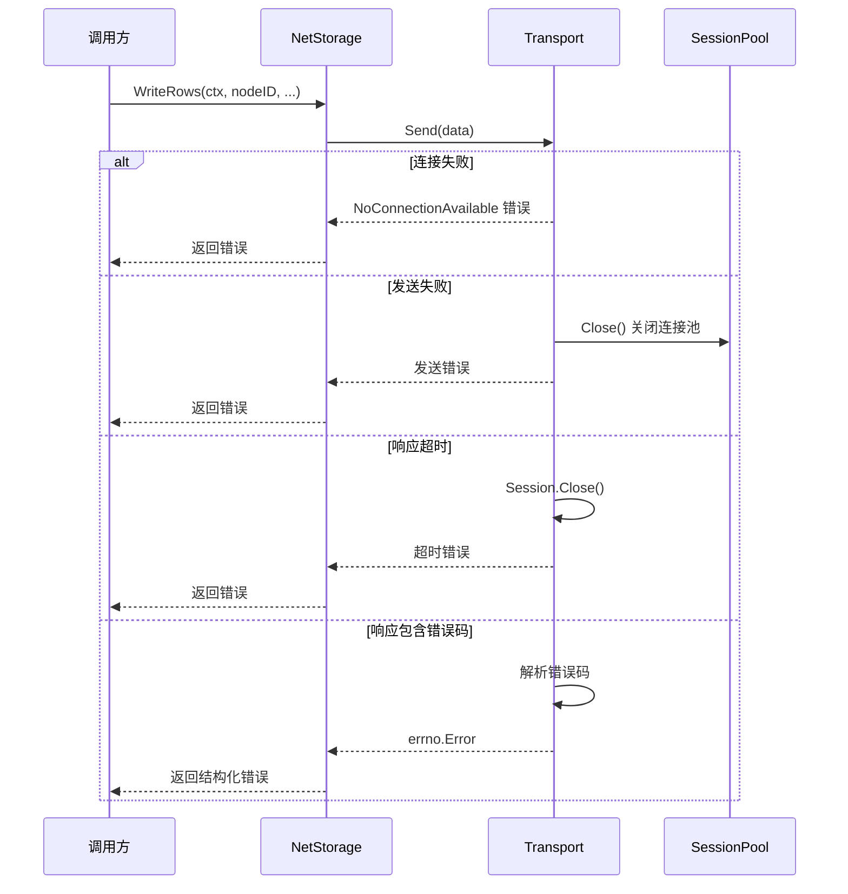
```mermaid
sequenceDiagram
    participant Caller as 调用方
    participant NS as NetStorage
    participant Trans as Transport
    participant Pool as SessionPool

    Caller->>NS: WriteRows(ctx, nodeID, ...)
    NS->>Trans: Send(data)

    alt 连接失败
        Trans-->>NS: NoConnectionAvailable 错误
        NS-->>Caller: 返回错误
    else 发送失败
        Trans->>Pool: Close() 关闭连接池
        Trans-->>NS: 发送错误
        NS-->>Caller: 返回错误
    else 响应超时
        Trans->>Trans: Session.Close()
        Trans-->>NS: 超时错误
        NS-->>Caller: 返回错误
    else 响应包含错误码
        Trans->>Trans: 解析错误码
        Trans-->>NS: errno.Error
        NS-->>Caller: 返回结构化错误
    end
```

**核心代码**：`lib/spdy/transport/transport.go:136-158`

```go
// 第 136 行：Send — 发送数据
func (s *Transport) Send(data Codec) error {
    if err := s.requester.Request(data); err != nil {
        s.pool.Close()  // 发送失败时关闭连接池
        return err
    }
    return nil
}

// 第 144 行：Wait — 等待响应
func (s *Transport) Wait() error {
    err := s.responser.Apply()
    if err != nil {
        spdy.HandleError(s.responser.Session().Close())  // 出错时关闭 Session
        return err
    }
    s.release()  // 成功时归还 Session 到连接池
    return nil
}

// 第 155 行：release — 归还 Session
func (s *Transport) release() {
    if s.requester != nil && s.pool.Available() {
        s.pool.Put(s.requester.Session())  // 归还到连接池
    }
}
```

**逐行解释**：
- **第 138 行**：发送失败时关闭整个连接池，防止后续请求使用损坏的连接
- **第 147 行**：响应出错时关闭 Session（不是整个连接池），因为可能只是这个 Session 的问题
- **第 151 行**：成功时归还 Session，实现连接复用

### 9.3 类型断言安全检查

**核心代码**：`lib/netstorage/storage.go`（多处）

```go
// 类型断言的安全检查模式
v, err := s.ddlRequestWithNodeId(nodeID, msgservice.ShowTagValuesRequestMessage, req)
if err != nil {
    return nil, err
}
resp, ok := v.(*msgservice.ShowTagValuesResponse)
if !ok {
    return nil, errno.NewInvalidTypeError("*msgservice.ShowTagValuesResponse", v)
}
```

**逐行解释**：
- 每个 DDL 方法都使用"逗号-ok"模式进行类型断言
- 如果响应类型不匹配，返回 `NewInvalidTypeError` 错误
- 这是一种防御性编程，防止消息类型注册错误导致的运行时 panic

---

## 10. 写入重试机制

### 10.1 PtView 路由重试

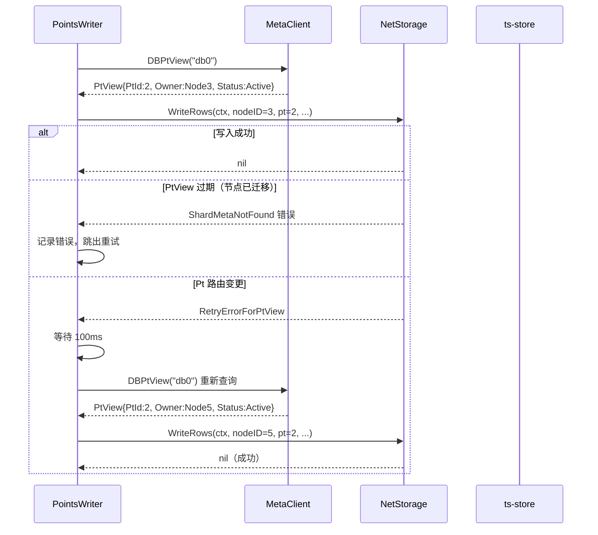
```mermaid
sequenceDiagram
    participant PW as PointsWriter
    participant MC as MetaClient
    participant NS as NetStorage
    participant Store as ts-store

    PW->>MC: DBPtView("db0")
    MC-->>PW: PtView{PtId:2, Owner:Node3, Status:Active}

    PW->>NS: WriteRows(ctx, nodeID=3, pt=2, ...)

    alt 写入成功
        NS-->>PW: nil
    else PtView 过期（节点已迁移）
        NS-->>PW: ShardMetaNotFound 错误
        PW->>PW: 记录错误，跳出重试
    else Pt 路由变更
        NS-->>PW: RetryErrorForPtView
        PW->>PW: 等待 100ms
        PW->>MC: DBPtView("db0") 重新查询
        MC-->>PW: PtView{PtId:2, Owner:Node5, Status:Active}
        PW->>NS: WriteRows(ctx, nodeID=5, pt=2, ...)
        NS-->>PW: nil（成功）
    end
```

**核心代码**：`coordinator/points_writer.go:854-893`

```go
// 第 854 行：writeRowToShard — 写入数据到目标 Shard（带重试）
func (w *PointsWriter) writeRowToShard(ctx *netstorage.WriteContext,
    database, retentionPolicy string) error {
    start := time.Now()
    var ptView meta2.DBPtInfos

RETRY:
    for {
        // 第 862 行：超时检查
        if time.Since(start).Nanoseconds() >= w.timeout.Nanoseconds() {
            break
        }

        // 第 866 行：获取最新的 PtView
        ptView, err = w.MetaClient.DBPtView(database)
        if err != nil {
            break
        }

        // 第 870 行：遍历 Shard 的 Owner（Pt）
        for _, ptId := range ctx.Shard.Owners {
            err = w.TSDBStore.WriteRows(ctx, ptView[ptId].Owner.NodeID,
                ptId, database, retentionPolicy, w.timeout)

            // 第 872 行：Shard 元数据不存在，跳出
            if err != nil && errno.Equal(err, errno.ShardMetaNotFound) {
                break RETRY
            }

            // 第 876 行：Pt 路由变更，重试
            if err != nil && errno.IsRetryErrorForPtView(err) {
                time.Sleep(100 * time.Millisecond)  // 等待 100ms
                goto RETRY  // 重新获取 PtView
            }
        }
        break
    }
    return err
}
```

**逐行解释**：
- **第 862 行**：每次重试前检查是否超时
- **第 866 行**：重新获取 PtView，因为 Pt 可能已迁移到新节点
- **第 870 行**：`ctx.Shard.Owners` 包含该 Shard 关联的 PtId 列表（复制场景可能有多个）
- **第 872 行**：`ShardMetaNotFound` 在该写入调用中会返回错误；是否重置路由、重试或放弃由上层 `PointsWriter` 等调用方决定，不是 netstorage 自身的完整恢复策略
- **第 876 行**：`IsRetryErrorForPtView` 判断是否为路由变更错误，是则重试
- **第 880 行**：等待 100ms 避免频繁重试

**通俗解释**：
写入重试就像"快递员找不到收件人"：
- 先查最新的地址簿（PtView）
- 如果收件人搬走了（Pt 迁移），重新查地址簿
- 如果地址簿查不到（ShardMetaNotFound），放弃
- 如果超时了，记录日志并退出

---

## 11. 潜在隐患与优化建议

### 11.1 连接池无退避重连

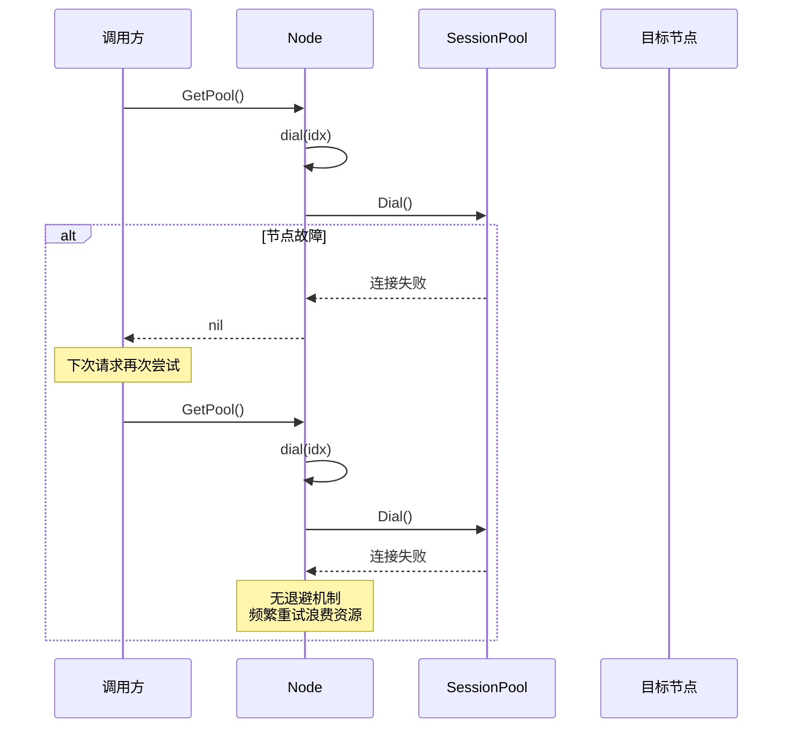
```mermaid
sequenceDiagram
    participant Caller as 调用方
    participant Node as Node
    participant Pool as SessionPool
    participant Target as 目标节点

    Caller->>Node: GetPool()
    Node->>Node: dial(idx)
    Node->>Pool: Dial()

    alt 节点故障
        Pool-->>Node: 连接失败
        Node-->>Caller: nil

        Note over Caller: 下次请求再次尝试
        Caller->>Node: GetPool()
        Node->>Node: dial(idx)
        Node->>Pool: Dial()
        Pool-->>Node: 连接失败
        Note over Node: 无退避机制<br/>频繁重试浪费资源
    end
```

**隐患**：
- `Node.dial()` 没有退避机制（backoff），节点故障时每次请求都尝试重连
- 频繁的 TCP 连接超时会浪费系统资源
- 建议：加入指数退避（exponential backoff），记录上次失败时间

### 11.2 写入超时与查询超时不平衡

**隐患**：
- 写入超时 10 秒，查询超时 30 分钟，差距过大
- 长时间查询占用连接资源，可能影响其他操作
- 建议：为长查询设置独立的连接池，或动态调整超时

### 11.3 MarshalRows 缓冲区无上限

**隐患**：
- `MarshalRows` 的 `ctx.Buf` 会随着数据量增长而增大
- 大批量写入时缓冲区可能占用大量内存
- 建议：设置缓冲区上限，超过阈值时重新分配

---

## 12. 端到端实战：一次完整写入的代码追踪

> 追踪 `INSERT cpu,host=server1 value=99.5` 从 ts-sql 到 ts-store 的完整路径。

### 12.1 调用链总览

```
用户 HTTP 请求
  → handler.serveWrite()
    → PointsWriter.WritePoints()
      → PointsWriter.writePointRows()
        → PointsWriter.routeAndMapOriginRows()    // 路由计算
        → PointsWriter.writeShardMap()            // 并行写入
          → PointsWriter.writeRowToShard()        // 写入单个 Shard
            → PointsWriter.TSDBStore.WriteRows()  // 调用 netstorage
              → NetStorage.WriteRows()            // 序列化 + 发送
                → MarshalRows()                   // 二进制序列化
                → Requester.Request()             // 创建 Transport
                  → Transport.Send()              // 通过 SPDY 发送
                    → MultiplexedSession.Send()   // Session 层发送
                      → TCP 连接写入              // 网络层
```

### 12.2 关键代码路径

```
lib/netstorage/storage.go:167    WriteRows() 入口
lib/netstorage/storage.go:174    ShardOwner() 验证
lib/netstorage/storage.go:183    MarshalRows() 序列化
lib/netstorage/storage.go:188    NewRequester() 创建请求器
lib/netstorage/storage.go:192    InitWithNodeID() 初始化节点
lib/netstorage/storage.go:212    Request() 发送请求

lib/msgservice/requester.go:42   NewRequester() 构造
lib/msgservice/requester.go:51   SetToInsert() 标记写入
lib/msgservice/requester.go:68   InitWithNode() 注册节点
lib/msgservice/requester.go:128  Request() 发送

lib/spdy/transport/transport.go:74   NewWriteTransport() 创建
lib/spdy/transport/transport.go:90   newTransport() 核心逻辑
lib/spdy/transport/transport.go:136  Send() 发送数据
lib/spdy/transport/transport.go:144  Wait() 等待响应

lib/spdy/transport/node_manager.go:50  NewWriteNodeManager()
lib/spdy/transport/node.go:42          GetPool() 获取连接池
lib/spdy/transport/node.go:60          dial() 建立连接
```

---

## 13. 总结

### 13.1 架构分层

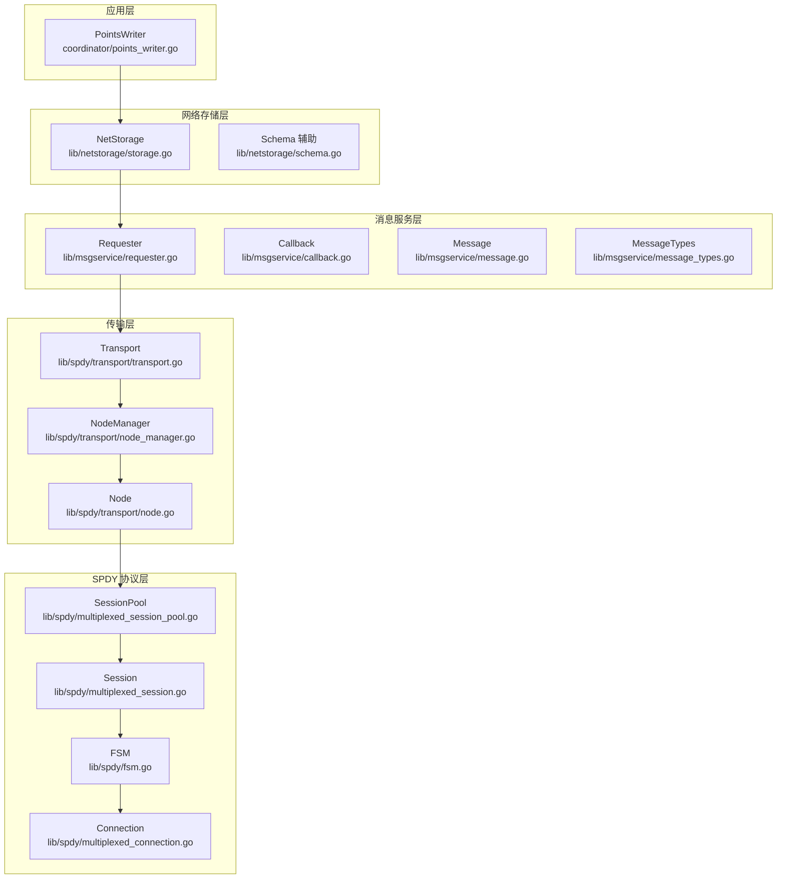
```mermaid
graph TB
    subgraph "应用层"
        PW["PointsWriter<br/>coordinator/points_writer.go"]
    end

    subgraph "网络存储层"
        NS["NetStorage<br/>lib/netstorage/storage.go"]
        Schema["Schema 辅助<br/>lib/netstorage/schema.go"]
    end

    subgraph "消息服务层"
        Req["Requester<br/>lib/msgservice/requester.go"]
        CB["Callback<br/>lib/msgservice/callback.go"]
        Msg["Message<br/>lib/msgservice/message.go"]
        Types["MessageTypes<br/>lib/msgservice/message_types.go"]
    end

    subgraph "传输层"
        Trans["Transport<br/>lib/spdy/transport/transport.go"]
        NM["NodeManager<br/>lib/spdy/transport/node_manager.go"]
        Node["Node<br/>lib/spdy/transport/node.go"]
    end

    subgraph "SPDY 协议层"
        Pool["SessionPool<br/>lib/spdy/multiplexed_session_pool.go"]
        Session["Session<br/>lib/spdy/multiplexed_session.go"]
        FSM["FSM<br/>lib/spdy/fsm.go"]
        Conn["Connection<br/>lib/spdy/multiplexed_connection.go"]
    end

    PW --> NS
    NS --> Req
    Req --> Trans
    Trans --> NM
    NM --> Node
    Node --> Pool
    Pool --> Session
    Session --> FSM
    FSM --> Conn
```

### 13.2 核心设计原则

| 原则 | 体现 |
|------|------|
| **接口抽象** | `Storage` 接口隔离实现细节，支持 Mock 测试 |
| **连接复用** | SPDY 多路复用 + SessionPool，减少 TCP 连接开销 |
| **读写分离** | WriteNodeManager / NodeManager 独立连接池 |
| **缓冲复用** | `WriteContext.Buf` 复用序列化缓冲区 |
| **异步操作** | Pt 迁移使用 goroutine 异步等待 |
| **防御编程** | 类型断言 + 错误码检查，防止运行时 panic |

### 13.3 关键数据流

| 操作 | SPDY 类型 | NodeManager | 超时 |
|------|-----------|-------------|------|
| 写入数据 | WritePointsRequest | WriteNodeManager | 10s |
| 流式写入 | WriteStreamPointsRequest | WriteNodeManager | 10s |
| DDL 操作 | DDLRequest | NodeManager | 30min |
| Pt 迁移 | PtRequest | NodeManager | 5s |
| 节点隔离 | SegregateNodeRequest | NodeManager | 5s |
| 领导权转移 | TransferLeadershipRequest | NodeManager | 20s |
| 健康检查 | PingRequest | NodeManager | 可配置 |
| 清除事件 | SendClearEvent | NodeManager | 5s |
