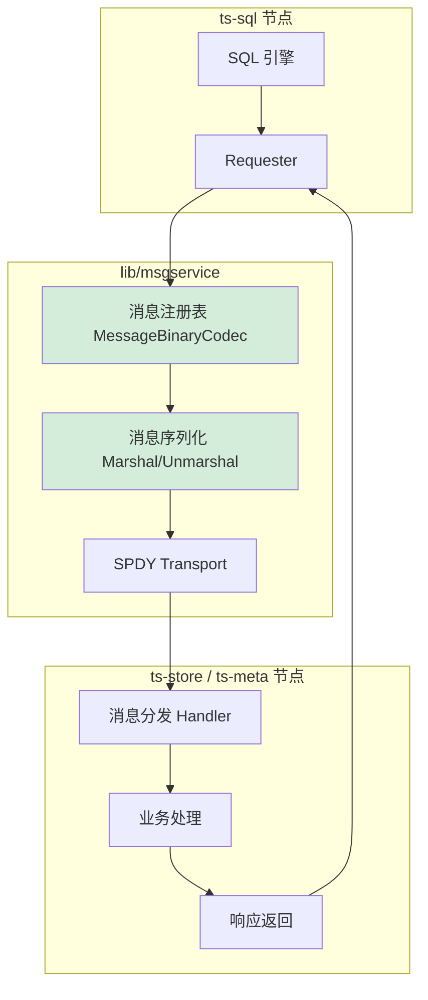
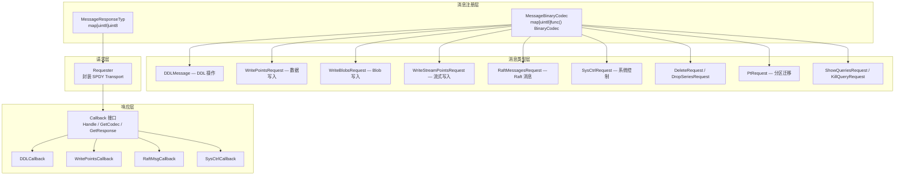
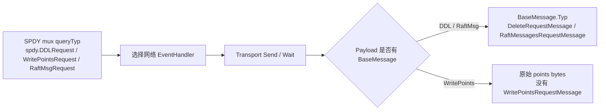
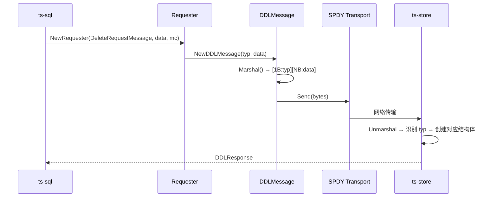
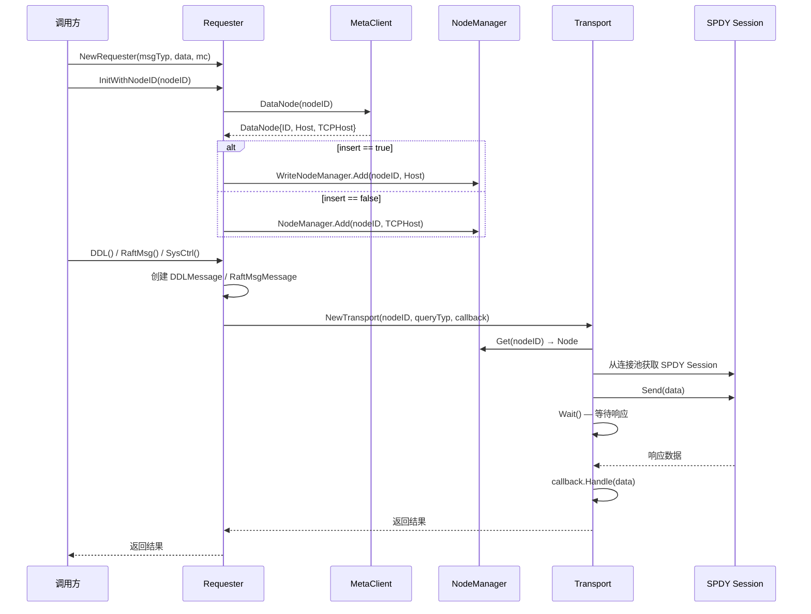
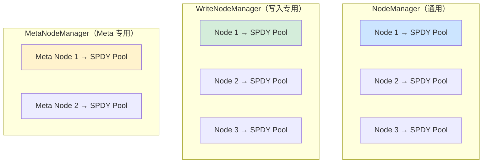
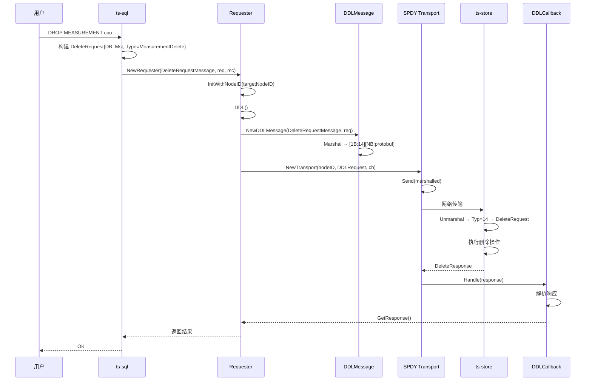
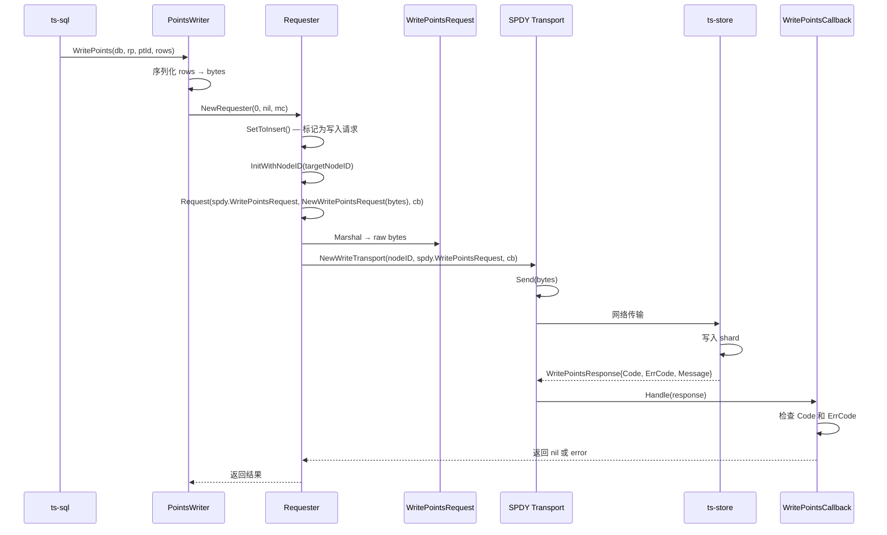
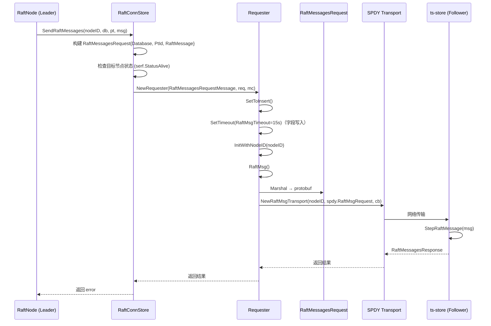

# Module 32: Service Message Bus 深度审计报告（庖丁解牛版）

> openGemini 的 `lib/msgservice/` 是集群内部服务间通信的消息总线。它定义了统一的消息注册、序列化、路由和异步响应机制，是 ts-sql 与 ts-store / ts-meta 之间 DDL 操作、数据写入、Raft 消息传递等核心 RPC 的基础设施。

---

## 1. 消息总线是什么？为什么需要它？



**通俗解释**：
在分布式集群中，ts-sql 需要向 ts-store 发送写入请求、DDL 命令、Raft 消息等。如果没有统一的消息总线，每种通信都需要自己管理连接、序列化、超时、重试。`msgservice` 抽象了这些细节，提供了一个统一的"消息注册 + 请求/响应"框架。

**与直接 gRPC 调用的区别**：

| 维度 | 传统 gRPC | openGemini msgservice |
|------|----------|----------------------|
| 协议 | HTTP/2 | SPDY（自研多路复用） |
| 序列化 | protobuf only | protobuf + 自定义二进制 |
| 连接管理 | 每服务一个连接 | 连接池，按用途分离 |
| 消息注册 | .proto 文件生成 | 运行时 map 注册 |
| 超时控制 | 统一超时 | 按消息类型差异化超时 |

---

## 2. 整体架构



---

## 3. 消息注册机制

### 3.1 消息类型常量

**代码位置**：`lib/msgservice/message_types.go:21-62`

```go
const (
    UnknownMessage uint8 = iota

    SeriesKeysRequestMessage          // 1
    SeriesKeysResponseMessage         // 2

    SeriesExactCardinalityRequestMessage  // 3
    SeriesExactCardinalityResponseMessage // 4

    SeriesCardinalityRequestMessage       // 5
    SeriesCardinalityResponseMessage      // 6

    ShowTagValuesRequestMessage           // 7
    ShowTagValuesResponseMessage          // 8

    // ... 更多消息类型 ...

    RaftMessagesRequestMessage            // 25
    RaftMessagesResponseMessage           // 26

    DropSeriesRequestMessage              // 27
    DropSeriesResponseMessage             // 28
)
```

**通俗解释**：
每种消息类型都有一个唯一的 `uint8` ID，奇数为请求，偶数为响应。这就像邮局的"业务编号"——寄信时填编号，收信时根据编号找到对应的处理方式。

### 3.1.1 SPDY mux typ 与 BaseMessage Typ 的区别



**代码讲解**：
- `Requester.Request(queryTyp, data, cb)` 的 `queryTyp` 是 SPDY mux 层类型，例如 `spdy.WritePointsRequest`、`spdy.DDLRequest`、`spdy.RaftMsgRequest`
- `BaseMessage.Typ` 是 msgservice 信封里的业务类型，只存在于 `DDLMessage`、`RaftMsgMessage` 这类包装消息中，例如 `DeleteRequestMessage`、`RaftMessagesRequestMessage`
- 普通写入 `WritePointsRequest` 不走 `BaseMessage.Typ` 注册表，也不存在 `WritePointsRequestMessage`；写入直接用 SPDY mux 类型 `spdy.WritePointsRequest` 加原始 points payload

**案例**：
```
DDL 删除:
  SPDY queryTyp = spdy.DDLRequest
  BaseMessage.Typ = DeleteRequestMessage
  Payload = [1B Typ][DeleteRequest.MarshalBinary()]

普通写入:
  SPDY queryTyp = spdy.WritePointsRequest
  BaseMessage.Typ = 无
  Payload = WritePointsRequest.points 原始字节

分区 Raft:
  SPDY queryTyp = spdy.RaftMsgRequest
  BaseMessage.Typ = RaftMessagesRequestMessage
  Payload = [1B Typ][RaftMessagesRequest.MarshalBinary()]
```

### 3.2 编解码器注册表

**代码位置**：`lib/msgservice/message_types.go:64-112`

```go
var MessageBinaryCodec = make(map[uint8]func() codec.BinaryCodec, 20)
var MessageResponseTyp = make(map[uint8]uint8, 20)

func init() {
    MessageBinaryCodec[SeriesKeysRequestMessage] = func() codec.BinaryCodec {
        return &SeriesKeysRequest{}
    }
    MessageBinaryCodec[SeriesKeysResponseMessage] = func() codec.BinaryCodec {
        return &SeriesKeysResponse{}
    }
    // ... 注册所有消息类型 ...

    // 请求→响应的映射关系
    MessageResponseTyp = map[uint8]uint8{
        SeriesKeysRequestMessage:     SeriesKeysResponseMessage,
        DeleteRequestMessage:         DeleteResponseMessage,
        RaftMessagesRequestMessage:   RaftMessagesResponseMessage,
        // ...
    }
}
```

**关键设计**：
- `MessageBinaryCodec`：消息类型 ID → 工厂函数，用于反序列化时创建正确的结构体
- `MessageResponseTyp`：请求类型 ID → 响应类型 ID，用于匹配请求和响应

### 3.3 BinaryCodec 接口

```go
type BinaryCodec interface {
    MarshalBinary() ([]byte, error)
    UnmarshalBinary(buf []byte) error
}
```

每种消息类型都实现此接口，负责自身的序列化和反序列化。底层使用 protobuf（`lib/msgservice/data/data.proto`）或自定义二进制格式。

---

## 4. 消息结构体详解

### 4.1 BaseMessage — 消息基类

**代码位置**：`lib/msgservice/message.go:30-53`

```go
type BaseMessage struct {
    Typ  uint8             // 消息类型 ID
    Data codec.BinaryCodec // 消息数据
}

func (bm *BaseMessage) Marshal(buf []byte) ([]byte, error) {
    marshal, err := bm.Data.MarshalBinary()
    buf = append(buf, bm.Typ)    // 第 1 字节：类型 ID
    buf = append(buf, marshal...) // 剩余字节：序列化数据
    return buf, err
}
```

**序列化格式**：
```
[1B: Typ] [NB: Data.MarshalBinary()]
```

### 4.2 DDLMessage — DDL 操作消息



**代码位置**：`lib/msgservice/message.go:55-83`

```go
type DDLMessage struct {
    BaseMessage
}

func (m *DDLMessage) Unmarshal(buf []byte) error {
    m.Typ = buf[0]                          // 读取类型 ID

    msgFn, ok := MessageBinaryCodec[m.Typ]  // 查找工厂函数
    if msgFn == nil || !ok {
        return fmt.Errorf("unknown message type: %d", m.Typ)
    }

    m.Data = msgFn()                        // 创建对应结构体
    return m.Data.UnmarshalBinary(buf[1:])  // 反序列化数据
}
```

**通俗解释**：
DDLMessage 就像一个"信封"。信封外面写着业务编号（Typ），里面装着具体的数据（Data）。收信方先看编号，然后用对应的"拆信工具"（工厂函数）来读取内容。

### 4.3 WritePointsRequest — 数据写入请求

**代码位置**：`lib/msgservice/message.go:207-281`

```go
type WritePointsRequest struct {
    points []byte  // 序列化后的行数据
}

func (r *WritePointsRequest) Marshal(buf []byte) ([]byte, error) {
    buf = append(buf, r.points...)
    return buf, nil
}

func (r *WritePointsRequest) Unmarshal(buf []byte) error {
    r.points = bufferpool.GetPoints()
    r.points = bufferpool.Resize(r.points, len(buf))
    copy(r.points, buf)
    return nil
}
```

**设计亮点**：
- 写入请求不使用 protobuf，直接传输原始字节，减少序列化开销
- 使用 `bufferpool` 管理内存，避免频繁分配

### 4.4 RaftMessagesRequest — Raft 消息传递

**代码位置**：`lib/msgservice/request.go:511-548`

```go
type RaftMessagesRequest struct {
    Database    string
    PtId        uint32
    RaftMessage raftpb.Message  // etcd Raft 原生消息
}

func (r *RaftMessagesRequest) MarshalBinary() ([]byte, error) {
    msg, _ := r.RaftMessage.Marshal()
    dr := &internal2.RaftMessagesRequest{
        Database:     proto.String(r.Database),
        PtId:         proto.Uint32(r.PtId),
        RaftMessages: msg,
    }
    return proto.Marshal(dr)
}
```

**通俗解释**：
Raft 节点之间需要交换投票、日志复制等消息。RaftMessagesRequest 将 etcd Raft 的原生消息包装在 protobuf 中，通过 msgservice 的通道发送到目标节点。

### 4.5 WriteStreamPointsRequest — 流式写入请求

**代码位置**：`lib/msgservice/message.go:433-515`

```go
type WriteStreamPointsRequest struct {
    points     []byte         // 序列化后的行数据
    streamVars []*StreamVar   // 流式变量（StreamOnly 标记 + StreamId 列表）
}

type StreamVar struct {
    Only bool     // 是否仅为流任务数据
    Id   []uint64 // 关联的 Stream 任务 ID
}
```

**设计说明**：
流式写入比普通写入多了一个 `StreamVar` 字段，用于标识数据是否来自 Stream 任务，以及关联哪些 Stream 任务 ID。这防止了 Stream 任务产生的数据再次触发 Stream 处理（循环触发防护）。

---

## 5. Requester — 请求发起器

### 5.1 结构体

**代码位置**：`lib/msgservice/requester.go:32-49`

```go
type Requester struct {
    msgTyp  uint8              // 消息类型 ID
    data    codec.BinaryCodec  // 请求数据
    mc      meta.MetaClient    // 元数据客户端（用于查找节点）
    node    *meta2.DataNode    // 目标节点

    insert  bool               // 是否为写入请求（使用不同的连接池）
    timeout time.Duration      // 超时时间
}
```

### 5.2 请求流程



**核心代码**：`lib/msgservice/requester.go:128-149`

```go
func (r *Requester) Request(queryTyp uint8, data transport.Codec, cb transport.Callback) error {
    var trans *transport.Transport
    var err error

    if r.insert {
        // 写入请求：使用写入专用连接池，超时 10 秒
        trans, err = transport.NewWriteTransport(r.node.ID, queryTyp, cb)
    } else {
        // 查询/DDL 请求：使用通用连接池，超时 30 分钟
        trans, err = transport.NewTransport(r.node.ID, queryTyp, cb)
    }

    if err != nil {
        return err
    }

    if err := trans.Send(data); err != nil {
        return err
    }
    if err := trans.Wait(); err != nil {
        return err
    }
    return nil
}
```

**关键设计**：
- **写入请求**使用 `WriteNodeManager`（写入专用连接池，超时 10 秒），因为写入需要低延迟
- **查询/DDL 请求**使用 `NodeManager`（通用连接池，超时 30 分钟），因为查询可能耗时较长
- **Raft 消息**使用 `RaftMsgTransport`，超时由 `config.RaftMsgTimeout` 控制（默认 15 秒）

### 5.3 连接池分离



**通俗解释**：
就像高速公路有"客车道"和"货车道"，不同类型的请求使用不同的连接池，避免写入请求被慢查询阻塞。

---

## 6. Callback — 异步响应处理

### 6.1 Callback 接口

**代码位置**：`lib/spdy/transport/transport.go:40-43`

```go
type Callback interface {
    Handle(interface{}) error  // 处理响应数据
    GetCodec() Codec           // 返回用于反序列化的 Codec
}
```

### 6.2 各种 Callback 实现

**代码位置**：`lib/msgservice/callback.go`

```mermaid
classDiagram
    class Callback {
        <<interface>>
        +Handle(interface{}) error
        +GetCodec() Codec
        +GetResponse() interface{}
    }

    class DDLCallback {
        +data interface{}
        +Handle(data) error
        +GetCodec() DDLMessage
        +GetResponse() interface{}
    }

    class WritePointsCallback {
        +data *WritePointsResponse
        +Handle(data) error
        +GetCodec() WritePointsResponse
    }

    class RaftMsgCallback {
        +data interface{}
        +Handle(data) error
        +GetCodec() RaftMsgMessage
        +GetResponse() interface{}
    }

    class SysCtrlCallback {
        +data interface{}
        +Handle(data) error
        +GetCodec() SysCtrlResponse
        +GetResponse() interface{}
    }

    class MigratePtCallback {
        +data interface{}
        +fn func(error)
        +Handle(data) error
        +SetCallbackFn(fn)
    }

    Callback <|.. DDLCallback
    Callback <|.. WritePointsCallback
    Callback <|.. RaftMsgCallback
    Callback <|.. SysCtrlCallback
    Callback <|.. MigratePtCallback
```

### 6.3 WritePointsCallback 详解

**代码位置**：`lib/msgservice/callback.go:68-91`

```go
type WritePointsCallback struct {
    data *WritePointsResponse
}

func (c *WritePointsCallback) Handle(data interface{}) error {
    msg, ok := data.(*WritePointsResponse)
    if !ok {
        return errno.NewInvalidTypeError("*msgservice.WritePointsResponse", data)
    }

    c.data = msg
    if c.data.Code == 0 {
        return nil                      // 成功
    } else if c.data.ErrCode != 0 {
        err := errno.NewError(c.data.ErrCode)
        err.SetMessage(c.data.Message)
        return err                      // 带错误码的错误
    }
    return errors.New(c.data.Message)   // 普通错误
}
```

**响应格式**：
```
[1B: Code] [2B: ErrCode] [NB: Message]
```

- `Code == 0`：成功
- `ErrCode != 0`：带错误码的错误（可精确定位）
- 否则：普通错误消息

### 6.4 MigratePtCallback — 分区迁移回调

```go
type MigratePtCallback struct {
    data interface{}
    fn   func(err error)  // 回调函数
}

func (c *MigratePtCallback) Handle(data interface{}) error {
    msg, ok := data.(*PtResponse)
    c.data = msg
    c.fn(msg.Error())  // 调用回调函数
    return nil
}
```

**设计说明**：分区迁移是异步操作，MigratePtCallback 支持注册回调函数，迁移完成后自动通知调用方。

---

## 7. 消息路由全流程

### 7.1 DDL 操作完整流程



### 7.2 数据写入完整流程



**代码讲解**：
- 写入路径创建 `msgservice.NewRequester(0, nil, mc)`，这里的 `msgTyp=0` 不参与普通写入编码
- `SetToInsert()` 让 `InitWithNode` 把节点加入 `WriteNodeManager`
- 真正决定远端 handler 的是 `Request(spdy.WritePointsRequest, msgservice.NewWritePointsRequest(pBuf), cb)`
- 不存在 `WritePointsRequestMessage` 常量，也不会写入 `[1B: BaseMessage.Typ]`

**案例**：
```
普通写入:
  r := msgservice.NewRequester(0, nil, mc)
  r.SetToInsert()
  r.InitWithNodeID(nodeID)
  cb := &msgservice.WritePointsCallback{}
  r.Request(spdy.WritePointsRequest, msgservice.NewWritePointsRequest(pBuf), cb)
```

### 7.3 Raft 消息传递流程



**代码讲解**：
- `RaftMessagesRequestMessage` 是 `BaseMessage.Typ`，用于 `NewRaftMsgMessage(r.msgTyp, r.data)` 的 payload 内部业务类型
- `spdy.RaftMsgRequest` 是 SPDY mux `queryTyp`，用于选择 `RaftMsg` 网络 handler
- `SetTimeout(config.RaftMsgTimeout)` 会写入 `Requester.timeout`；`RaftMsg()` 实际调用 `transport.NewRaftMsgTransport`，该工厂本身使用 `config.RaftMsgTimeout`

---

## 8. 错误处理机制

### 8.1 统一错误序列化

**代码位置**：`lib/msgservice/message_types.go:275-300`

```go
func NormalizeError(errStr *string) error {
    if errStr == nil {
        return nil
    }
    errBytes := bytesutil.ToUnsafeBytes(*errStr)
    errCode := encoding.UnmarshalUint16(errBytes[:2])  // 前 2 字节：错误码
    if errCode != 0 {
        return errno.NewError(errno.Errno(errCode), bytesutil.ToUnsafeString(errBytes[2:]))
    }
    return fmt.Errorf("%s", bytesutil.ToUnsafeString(errBytes[2:]))
}

func MarshalError(e error) *string {
    if e == nil {
        return nil
    }
    var dst []byte
    switch stdErr := e.(type) {
    case *errno.Error:
        dst = encoding.MarshalUint16(dst, uint16(stdErr.Errno()))
    default:
        dst = encoding.MarshalUint16(dst, 0)  // 通用错误码为 0
    }
    return proto.String(bytesutil.ToUnsafeString(dst) + e.Error())
}
```

**错误序列化格式**：
```
[2B: Errno] [NB: Error Message]
```

**通俗解释**：
错误信息也有标准格式。前 2 字节是错误编号（类似 HTTP 状态码），后面是错误描述。这样接收方可以精确识别错误类型，而不仅仅是解析字符串。

### 8.2 PartialWriteError — 部分写入错误

**代码位置**：`lib/msgservice/error.go:23-33`

```go
type PartialWriteError struct {
    Reason      error
    Dropped     int        // 丢弃的数据点数
    DroppedKeys [][]byte   // 被丢弃的 series key
}

func (e PartialWriteError) Error() string {
    return fmt.Sprintf("partial write: %s dropped=%d", e.Reason, e.Dropped)
}
```

**使用场景**：当写入请求中部分数据点格式错误时，不会全部失败，而是返回部分写入错误，告知哪些数据被丢弃。

---

## 9. 序列化格式汇总

| 消息类型 | 序列化方式 | 说明 |
|---------|----------|------|
| DDLMessage | [1B:Typ] + BinaryCodec.Marshal | 通用 DDL 框架 |
| WritePointsRequest | 原始字节（无 protobuf） | 高性能写入 |
| WriteBlobsRequest | 自定义二进制（codec.AppendXxx） | Blob 数据 |
| WriteStreamPointsRequest | 自定义二进制 + StreamVar | 流式写入 |
| RaftMessagesRequest | protobuf | Raft 消息 |
| SysCtrlRequest | protobuf | 系统控制 |
| DeleteRequest | protobuf | 删除操作 |
| ShowTagValuesRequest | protobuf | 查询元数据 |
| PtRequest | protobuf | 分区迁移 |

---

## 10. 配置参数

| 参数 | 默认值 | 说明 |
|------|--------|------|
| `retryInterval` | 100ms | 重试间隔 |
| `defaultTimeout` | 30s | `Requester.timeout` 字段默认值；当前 `Request()` 不消费 |
| `RaftMsgTimeout` | 15s | Raft 消息超时 |
| `readTimeOut` | 30min | `NewTransport` 有效超时（查询/DDL 等普通请求） |
| `writeTimeOut` | 10s | 写入超时（SPDY） |

---

## 11. 总结：msgservice 的关键设计

| 设计 | 目的 | 效果 |
|------|------|------|
| 消息注册表 | Go init 期静态 map 注册消息 codec | 新增 protobuf-backed 消息仍需更新 `.proto`/generated Go 和注册表 |
| 连接池分离 | 写入/查询/Meta 各自独立 | 避免慢查询阻塞写入 |
| 统一 BinaryCodec 接口 | 所有消息类型统一序列化 | 简化代码维护 |
| Callback 模式 | 异步响应处理 | 支持超时和回调 |
| 统一错误序列化 | 跨节点错误传递 | 精确错误定位 |
| SPDY 多路复用 | 单连接并发请求 | 高效网络利用 |
| 写入请求 raw payload | 避免 protobuf 编码原始 points bytes | Marshal 直接 append 原始 bytes；Unmarshal 仍会分配并 copy，不是端到端零拷贝 |

## 附录：关键数据结构速查表

| 结构体 | 文件 | 用途 |
|--------|------|------|
| `BaseMessage` | `lib/msgservice/message.go:30` | 消息基类 |
| `DDLMessage` | `lib/msgservice/message.go:55` | DDL 操作消息 |
| `WritePointsRequest` | `lib/msgservice/message.go:207` | 数据写入请求 |
| `WritePointsResponse` | `lib/msgservice/message.go:241` | 数据写入响应 |
| `WriteBlobsRequest` | `lib/msgservice/message.go:283` | Blob 写入请求 |
| `WriteStreamPointsRequest` | `lib/msgservice/message.go:433` | 流式写入请求 |
| `RaftMessagesRequest` | `lib/msgservice/request.go:511` | Raft 消息请求 |
| `SysCtrlRequest` | `lib/msgservice/message.go:84` | 系统控制请求 |
| `DeleteRequest` | `lib/msgservice/request.go:47` | 删除请求 |
| `PtRequest` | `lib/msgservice/message.go:559` | 分区迁移请求 |
| `Requester` | `lib/msgservice/requester.go:32` | 请求发起器 |
| `DDLCallback` | `lib/msgservice/callback.go:24` | DDL 响应回调 |
| `WritePointsCallback` | `lib/msgservice/callback.go:68` | 写入响应回调 |
| `RaftMsgCallback` | `lib/msgservice/callback.go:173` | Raft 消息回调 |
| `MigratePtCallback` | `lib/msgservice/callback.go:141` | 分区迁移回调 |
| `PartialWriteError` | `lib/msgservice/error.go:23` | 部分写入错误 |
| `MessageBinaryCodec` | `lib/msgservice/message_types.go:64` | 消息注册表 |
| `MessageResponseTyp` | `lib/msgservice/message_types.go:65` | 请求→响应映射 |

## 附录：关键函数调用链

```
DDL 操作:
  Requester.DDL()
    -> NewDDLMessage(msgTyp, data)
    -> Requester.Request(spdy.DDLRequest, data, cb)
      -> transport.NewTransport(nodeID, spdy.DDLRequest, cb)
      -> trans.Send(data)
      -> trans.Wait()
        -> cb.Handle(response)

数据写入:
  msgservice.NewRequester(0, nil, mc)
    -> r.SetToInsert()
    -> r.InitWithNodeID(nodeID)
    -> r.Request(spdy.WritePointsRequest, msgservice.NewWritePointsRequest(pBuf), cb)
    -> transport.NewWriteTransport(nodeID, spdy.WritePointsRequest, cb)
      -> WriteNodeManager.Get(nodeID)
      -> newTransport(node, spdy.WritePointsRequest, cb, writeTimeOut=10s)
    -> trans.Send(data)
    -> trans.Wait()

Raft 消息:
  RaftConnStore.SendRaftMessages(nodeID, db, pt, msg)
    -> msgservice.NewRequester(RaftMessagesRequestMessage, req, mc)
    -> r.SetToInsert()
    -> r.SetTimeout(RaftMsgTimeout)  // 写字段；实际超时由 NewRaftMsgTransport 使用 config.RaftMsgTimeout
    -> r.InitWithNodeID(nodeID)
    -> r.RaftMsg()
      -> transport.NewRaftMsgTransport(nodeID, spdy.RaftMsgRequest, cb)
      -> trans.Send(data)
      -> trans.Wait()

消息反序列化:
  DDLMessage.Unmarshal(buf)
    -> buf[0] → Typ
    -> MessageBinaryCodec[Typ]() → 创建结构体
    -> struct.UnmarshalBinary(buf[1:]) → 反序列化数据
```
