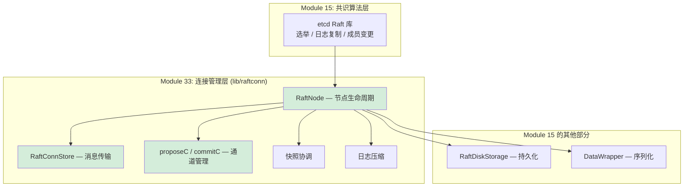
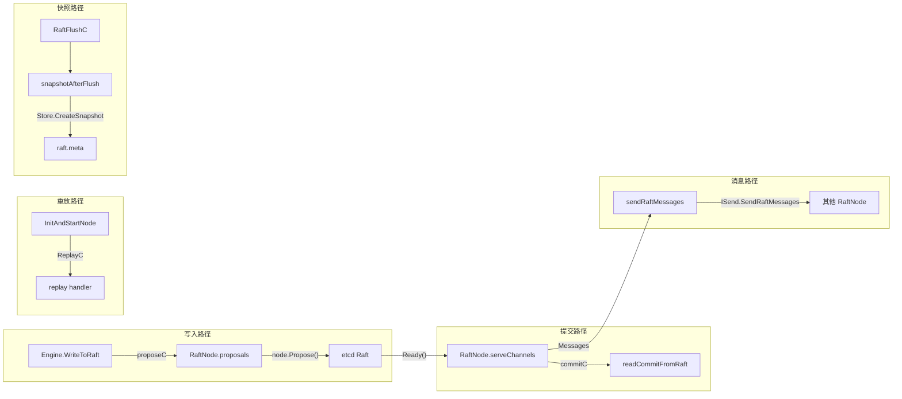
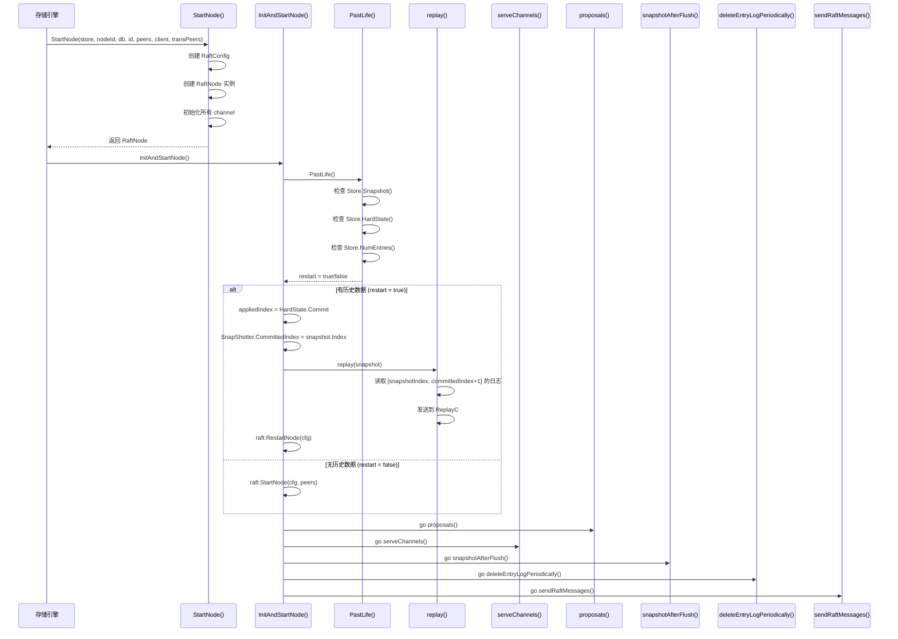
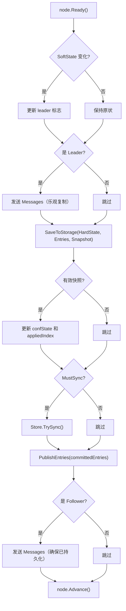
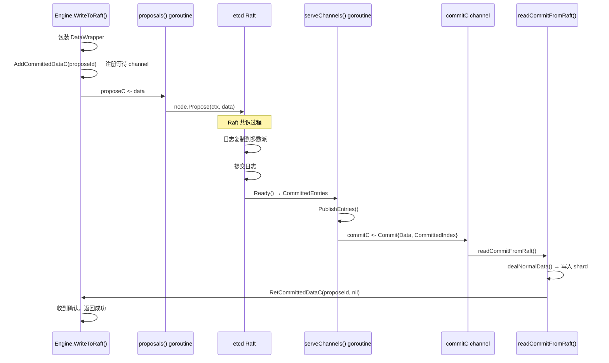
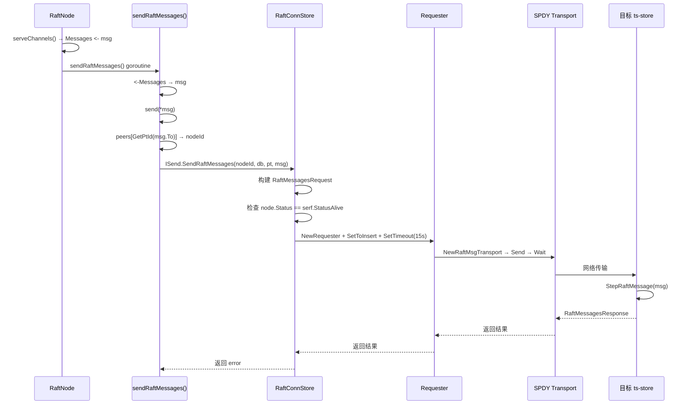
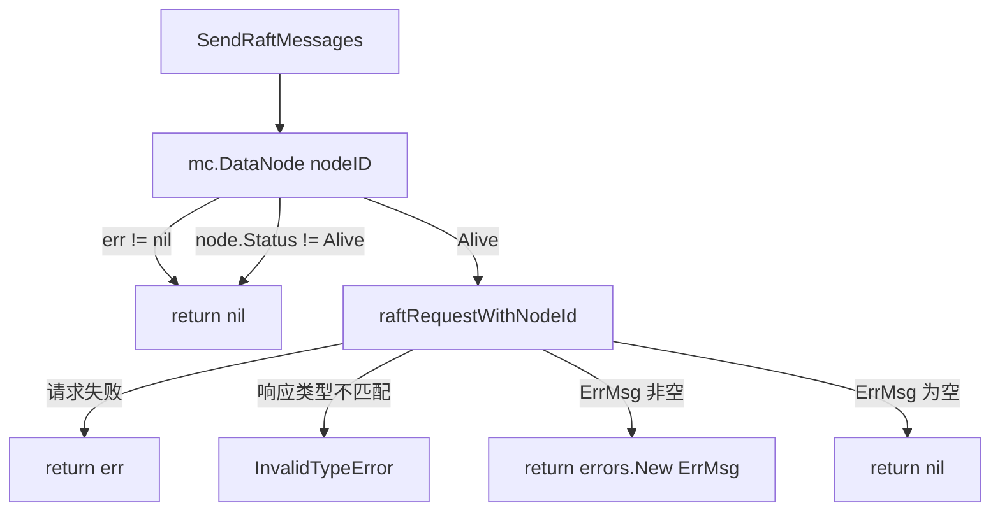
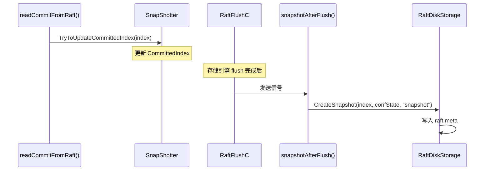
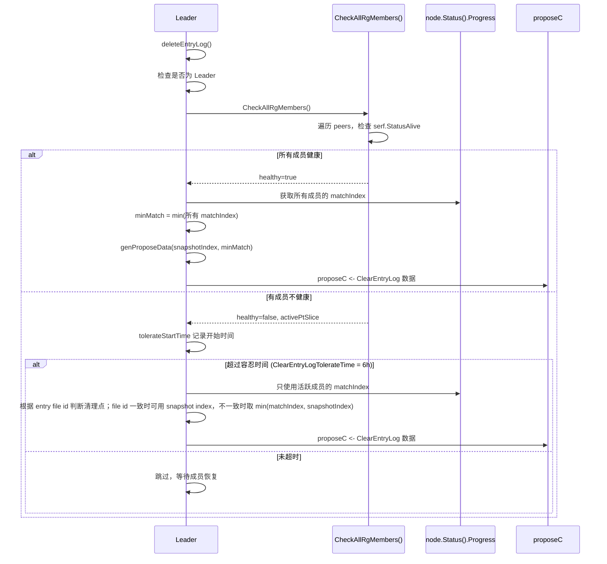

# Module 33: Raft Connection Manager 深度审计报告（庖丁解牛版）

> 本模块聚焦 `lib/raftconn/` — Raft 节点的连接管理层。它封装了 etcd Raft 节点的生命周期、消息传输、持久化协调和快照管理。**注意**：本模块专注于连接/传输层，共识算法本身（选举、日志复制、成员变更）由 Module 15（Raft Partition Consensus）覆盖。

---

## 1. raftconn 是什么？与 Module 15 的关系



**通俗解释**：
- **Module 15** 讲的是"Raft 算法怎么工作"（选举、日志复制、快照格式）
- **Module 33** 讲的是"Raft 节点怎么运转"（启动、停止、消息收发、通道管理）

就像一辆汽车，Module 15 是"发动机原理"，Module 33 是"发动机怎么装到车上、怎么启动、怎么保养"。

---

## 2. RaftNode — 核心结构体

### 2.1 结构体全景

**代码位置**：`lib/raftconn/node.go:57-106`

```go
type RaftNode struct {
    once        sync.Once
    proposeC    chan []byte            // 提议 channel：写入数据 → Raft
    confChangeC chan raftpb.ConfChange // 集群配置变更 channel
    commitC     chan *Commit           // 已提交日志 channel：Raft → 应用层
    ReplayC     chan *Commit           // 重放 channel：重启恢复
    errorC      chan<- error           // 错误 channel
    Messages    chan *raftpb.Message   // Raft 消息 channel：节点间通信

    nodeId   uint64                    // 物理节点 ID
    database string                    // 数据库名
    ptId     uint32                    // 分区 ID
    id       uint64                    // Raft 节点 ID = ptId + 1
    peers    map[uint32]uint64         // ptId → nodeId 映射

    tick *time.Ticker                  // 心跳定时器（400ms）

    ctx      context.Context
    cancelFn context.CancelFunc

    appliedIndex uint64                // 已应用的日志索引

    lock      sync.RWMutex
    confState *raftpb.ConfState        // 集群配置状态
    node      raft.Node                // etcd Raft 节点实例

    startTime time.Time
    Cfg       *raft.Config             // Raft 配置
    Store     *raftlog.RaftDiskStorage // 持久化存储
    RaftPeers []raft.Peer              // Raft Peer 列表

    ISend SendRaftMessageToStorage     // 消息发送接口

    MetaClient metaclient.MetaClient   // 元数据客户端

    SnapShotter *raftlog.SnapShotter   // 快照跟踪器

    logger *logger.Logger

    proposeId atomic.Uint64            // 提议 ID（原子操作）

    dataCommittedMu sync.RWMutex
    DataCommittedC  map[uint64]chan error // proposeId → 等待 channel

    Identity string                    // "database_ptId" 格式的标识

    tolerateStartTime atomic.Int64     // 容忍不健康 RG 的开始时间
}
```

### 2.2 Channel 架构



**通俗解释**：
RaftNode 就像一个"中转站"，通过 5 个 channel 连接不同的组件：
- **proposeC**：数据进来（写入请求 → Raft）
- **commitC**：数据出去（Raft → 存储引擎）
- **Messages**：节点间通信（Leader ↔ Follower）
- **ReplayC**：重启恢复（重放已提交但未应用的日志）
- **RaftFlushC**：快照触发（存储引擎 flush 完成后）

---

## 3. 节点生命周期

### 3.1 启动流程



**核心代码**：`lib/raftconn/node.go:108-162`（StartNode）

```go
func StartNode(store *raftlog.RaftDiskStorage, nodeId uint64, database string, id uint64,
    peers []raft.Peer, client metaclient.MetaClient, transPeers map[uint32]uint64) *RaftNode {

    c := raft.Config{
        ID:              id,
        ElectionTick:    config.ElectionTick,    // 默认 10
        HeartbeatTick:   config.HeartbeatTick,   // 默认 1
        Storage:         store,
        MaxSizePerMsg:   maxSizePerMsg,          // 4096
        MaxInflightMsgs: maxInflightMsgs,        // 256
    }

    n := &RaftNode{
        proposeC:    make(chan []byte, 1),
        confChangeC: make(chan raftpb.ConfChange),
        commitC:     make(chan *Commit, config.RaftMsgCacheSize),
        Messages:    make(chan *raftpb.Message, config.RaftMsgCacheSize),
        // ... 初始化其他字段
        ISend:          NewRaftConnStore(client),
        DataCommittedC: make(map[uint64]chan error),
    }
    n.initIdentity()  // Identity = "database_ptId"
    return n
}
```

**核心代码**：`lib/raftconn/node.go:225-262`（InitAndStartNode）

```go
func (n *RaftNode) InitAndStartNode() error {
    _, restart, err := n.PastLife()
    if err != nil {
        return err
    }

    if restart {
        state, _ := n.Store.HardState()
        n.appliedIndex = state.Commit
        sp, _ := n.Store.Snapshot()
        n.SnapShotter.CommittedIndex = sp.Metadata.Index

        if raftlog.IsValidSnapshot(sp) {
            n.SetConfState(&sp.Metadata.ConfState)
            n.replay(sp)  // 重放已提交但未应用的日志
        }
        n.node = raft.RestartNode(n.Cfg)
    } else {
        n.node = raft.StartNode(n.Cfg, n.RaftPeers)
    }

    // 启动 5 个后台 goroutine
    go n.proposals()
    go n.serveChannels()
    go n.snapshotAfterFlush()
    go n.deleteEntryLogPeriodically()
    go n.sendRaftMessages()
    return nil
}
```

### 3.2 停止流程

**代码位置**：`lib/raftconn/node.go:534-546`

```go
func (n *RaftNode) Stop() {
    if n.cancelFn != nil {
        n.cancelFn()  // 取消 context，通知所有 goroutine
    }
    n.once.Do(func() {
        close(n.proposeC)
        close(n.confChangeC)
        close(n.commitC)
        close(n.errorC)
        close(n.Messages)
    })
}
```

**关键设计**：
- `cancelFn()` 触发 context 取消，所有 goroutine 的 `select` 会收到 `ctx.Done()` 信号
- `sync.Once` 确保 channel 只关闭一次，避免 panic

---

## 4. 事件循环：serveChannels

### 4.1 核心循环

**代码位置**：`lib/raftconn/node.go:317-385`

```go
func (n *RaftNode) serveChannels() {
    var leader bool

    for {
        select {
        case <-n.ctx.Done():
            n.node.Stop()
            return

        case <-n.tick.C:
            n.node.Tick()  // 驱动 Raft 时钟

        case rd := <-n.node.Ready():
            // 1. 更新 Leader 状态
            if rd.SoftState != nil {
                leader = rd.RaftState == raft.StateLeader
            }

            // 2. Leader 先发送消息（乐观复制）
            if leader {
                for i := range n.processMessages(rd.Messages) {
                    n.Messages <- &rd.Messages[i]
                }
            }

            // 3. 持久化到磁盘
            n.SaveToStorage(&rd.HardState, rd.Entries, &rd.Snapshot)

            // 4. 处理快照
            if raftlog.IsValidSnapshot(rd.Snapshot) {
                n.confState = &rd.Snapshot.Metadata.ConfState
                n.appliedIndex = rd.Snapshot.Metadata.Index
            }

            // 5. 同步到磁盘（如果需要）
            for rd.MustSync {
                if err := n.Store.TrySync(); err != nil {
                    time.Sleep(10 * time.Millisecond)
                    continue
                }
                break
            }

            // 6. 发布已提交条目
            ok := n.PublishEntries(n.entriesToApply(rd.CommittedEntries))
            if !ok {
                n.Stop()
                return
            }

            // 7. Follower 后发送消息（确保已持久化）
            if !leader {
                for i := range n.processMessages(rd.Messages) {
                    n.Messages <- &rd.Messages[i]
                }
            }

            // 8. 通知 Raft 推进
            n.node.Advance()
        }
    }
}
```

### 4.2 Ready 处理流程图



**关键设计**：
- **Leader 先发消息后写盘**：降低写入延迟（乐观复制）
- **Follower 先写盘后发消息**：确保数据已持久化再确认
- **MustSync**：按 etcd raft `Ready.MustSync` 决定是否尝试 sync；实际是否落盘由 `RaftDiskStorage.TrySync()` 的 `SyncInterval/firstSync` 规则控制，不应简化成只有 HardState 变化才 fsync

---

## 5. 提议通道：proposeC / commitC

### 5.1 提议流程



**核心代码**：`lib/raftconn/node.go:393-426`（proposals）

```go
func (n *RaftNode) proposals() {
    confChangeCount := uint64(0)

    for n.proposeC != nil && n.confChangeC != nil {
        select {
        case prop, ok := <-n.proposeC:
            if !ok {
                n.proposeC = nil
            } else {
                err := n.node.Propose(n.ctx, prop)  // 提交到 Raft
                if err != nil {
                    n.logger.Error("propose data error", zap.Error(err))
                }
            }
        case cc, ok := <-n.confChangeC:
            if !ok {
                n.confChangeC = nil
            } else {
                confChangeCount++
                cc.ID = confChangeCount
                err := n.node.ProposeConfChange(n.ctx, cc)
                if err != nil {
                    n.logger.Error("propose conf change error", zap.Error(err))
                }
            }
        }
    }
}
```

### 5.2 提交确认机制

**代码位置**：`lib/raftconn/node.go:175-218`

```go
// 注册等待 channel
func (n *RaftNode) AddCommittedDataC(dw *raftlog.DataWrapper) (chan error, error) {
    n.dataCommittedMu.Lock()
    defer n.dataCommittedMu.Unlock()
    _, ok := n.DataCommittedC[dw.ProposeId]
    if ok {
        return nil, errno.NewError(errno.UsedProposeId, dw.Identity, dw.ProposeId)
    }
    c := make(chan error)
    n.DataCommittedC[dw.ProposeId] = c
    return c, nil
}

// 通知等待者
func (n *RaftNode) RetCommittedDataC(dw *raftlog.DataWrapper, committedErr error) {
    n.dataCommittedMu.RLock()
    c, ok := n.DataCommittedC[dw.ProposeId]
    n.dataCommittedMu.RUnlock()
    if !ok {
        return  // 可能已超时或节点重启
    }
    c <- committedErr
}

// 移除等待 channel
func (n *RaftNode) RemoveCommittedDataC(dw *raftlog.DataWrapper) {
    n.dataCommittedMu.Lock()
    defer n.dataCommittedMu.Unlock()
    close(n.DataCommittedC[dw.ProposeId])
    delete(n.DataCommittedC, dw.ProposeId)
}
```

**通俗解释**：
这个机制就像"取号等位"：
1. 写入请求来了，生成一个唯一编号（proposeId），创建一个等待通道
2. 请求提交到 Raft，等待共识
3. 共识完成后，通过等待通道通知调用方
4. 调用方收到通知，返回结果

### 5.3 ProposeId 生成

```go
const maxProposeId = math.MaxUint64 - 10000

func (n *RaftNode) GenerateProposeId() uint64 {
    n.proposeId.CompareAndSwap(maxProposeId, 0)  // 防溢出回绕
    return n.proposeId.Add(1)                     // 原子递增
}
```

**设计说明**：
- 使用 `atomic.Uint64` 实现无锁递增
- 接近最大值时回绕到 0，避免溢出

---

## 6. PublishEntries — 已提交条目发布

**代码位置**：`lib/raftconn/node.go:468-515`

```go
func (n *RaftNode) PublishEntries(ents []raftpb.Entry) bool {
    if len(ents) == 0 {
        return true
    }

    data := make([][]byte, 0, len(ents))
    for i := range ents {
        switch ents[i].Type {
        case raftpb.EntryNormal:
            if len(ents[i].Data) == 0 {
                continue  // 忽略空消息
            }
            data = append(data, ents[i].Data)

        case raftpb.EntryConfChange:
            var cc raftpb.ConfChange
            err := cc.Unmarshal(ents[i].Data)
            if err != nil {
                continue
            }
            n.confState = n.node.ApplyConfChange(cc)
            n.saveConfStateToMeta()  // 持久化配置状态
        }
    }

    if len(data) > 0 {
        select {
        case n.commitC <- &Commit{
            Database:       n.database,
            PtId:           GetPtId(n.id),
            Data:           data,
            CommittedIndex: ents[len(ents)-1].Index,
        }:
        case <-n.ctx.Done():
            return false
        }
    }

    n.appliedIndex = ents[len(ents)-1].Index
    return true
}
```

**Commit 结构体**：

```go
type Commit struct {
    Database       string
    PtId           uint32
    MasterShId     uint64
    Data           [][]byte // 所有已提交的日志数据
    CommittedIndex uint64
    fromReplay     bool     // 是否来自重放
}
```

---

## 7. 消息传输：RaftConnStore

### 7.1 SendRaftMessageToStorage 接口

**代码位置**：`lib/raftconn/message.go:28-30`

```go
type SendRaftMessageToStorage interface {
    SendRaftMessages(nodeID uint64, database string, pt uint32, msgs raftpb.Message) error
}
```

### 7.2 RaftConnStore 实现

**代码位置**：`lib/raftconn/message.go:32-75`

```go
type RaftConnStore struct {
    mc meta.MetaClient
}

func (s *RaftConnStore) SendRaftMessages(nodeID uint64, database string, pt uint32, msgs raftpb.Message) error {
    // 1. 构建请求
    req := &msgservice.RaftMessagesRequest{}
    req.Database = database
    req.PtId = pt
    req.RaftMessage = msgs

    // 2. 检查目标节点状态
    node, err := s.mc.DataNode(nodeID)
    if err != nil || node.Status != serf.StatusAlive {
        return nil  // 节点不可用，静默丢弃
    }

    // 3. 发送请求
    v, err := s.raftRequestWithNodeId(nodeID, msgservice.RaftMessagesRequestMessage, req)
    if err != nil {
        return err
    }

    // 4. 解析响应
    resp, ok := v.(*msgservice.RaftMessagesResponse)
    if !ok {
        return errno.NewInvalidTypeError("*msgservice.RaftMsgResponse", v)
    }
    if resp.GetErrMsg() != "" {
        return errors.New(resp.GetErrMsg())
    }
    return nil
}

func (s *RaftConnStore) raftRequestWithNodeId(nodeID uint64, typ uint8, data codec.BinaryCodec) (interface{}, error) {
    r := msgservice.NewRequester(typ, data, s.mc)
    r.SetToInsert()                     // 使用写入专用连接池
    r.SetTimeout(config.RaftMsgTimeout) // 15 秒超时
    err := r.InitWithNodeID(nodeID)
    if err != nil {
        return nil, err
    }
    return r.RaftMsg()
}
```

### 7.3 消息发送流程



**关键设计**：
- 节点不可用时静默丢弃（`return nil`），不阻塞 Raft 事件循环
- 使用写入专用连接池（`SetToInsert`），保证低延迟
- 超时 15 秒，避免长时间阻塞
- `SendRaftMessages` 的错误主要包括 transport/request 链路错误、响应类型错误（如 `InvalidType`）和响应中的 `ErrMsg` 非空；目标节点不存在、查不到或状态不是 `serf.StatusAlive` 时直接返回 `nil`

### 7.4 静默跳过与错误返回案例



```
案例 1：目标节点已经从元数据中删除
  mc.DataNode(nodeID) 返回 error
  -> SendRaftMessages 返回 nil
  -> RaftNode.send 只认为消息没有可投递目标，不阻塞事件循环

案例 2：目标节点存在但 Status=Failed
  node.Status != serf.StatusAlive
  -> SendRaftMessages 返回 nil

案例 3：目标节点 Alive 但网络请求失败
  raftRequestWithNodeId 返回 NoConnectionAvailable
  -> SendRaftMessages 返回该 error

案例 4：目标节点处理失败
  RaftMessagesResponse.ErrMsg = "step raft message failed"
  -> SendRaftMessages 返回 errors.New(ErrMsg)
```

---

## 8. 快照管理

### 8.1 快照触发

**代码位置**：`lib/raftconn/node.go:635-664`

```go
func (n *RaftNode) snapshotAfterFlush() {
    for {
        select {
        case <-n.SnapShotter.RaftFlushC:
            if err := n.snapShot(); err != nil {
                n.logger.Error("do snapshot error", zap.Error(err))
            }
        case <-n.ctx.Done():
            return
        }
    }
}

func (n *RaftNode) snapShot() error {
    index := n.SnapShotter.CommittedIndex
    for {
        err := n.Store.CreateSnapshot(index, n.ConfState(), []byte("snapshot"))
        if err == nil {
            break
        }
        if errors.Is(err, raft.ErrSnapOutOfDate) {
            break  // 快照已过期，忽略
        }
        // 其他错误，重试
    }
    return nil
}
```

**快照触发时序**：



### 8.2 ConfState 持久化

**代码位置**：`lib/raftconn/node.go:517-531`

```go
func (n *RaftNode) saveConfStateToMeta() {
    snapshot := &raftpb.Snapshot{
        Data: nil,
        Metadata: raftpb.SnapshotMetadata{
            ConfState: *n.confState,
            Index:     0,
            Term:      0,
        },
    }
    err := n.Store.Save(nil, nil, snapshot)
    if err != nil {
        n.logger.Error("store confstate error", zap.Error(err))
    }
}
```

**设计说明**：
每次集群配置变更（添加/删除节点）后，立即持久化 ConfState。这是一个特殊的快照（Index=0, Term=0），仅用于存储配置状态，防止服务重启前快照未生成导致配置丢失。

---

## 9. 日志压缩

### 9.1 周期性清理

**代码位置**：`lib/raftconn/node.go:731-750`

```go
func (n *RaftNode) deleteEntryLogPeriodically() {
    ticker := time.NewTicker(time.Minute)
    defer ticker.Stop()
    for {
        select {
        case <-ticker.C:
            n.deleteEntryLog()       // 通过 Raft 提议清理
            n.deleteEntryLogBySize() // 本地紧急清理
        case <-n.ctx.Done():
            return
        }
    }
}
```

### 9.2 通过 Raft 提议清理

**代码位置**：`lib/raftconn/node.go:752-809`



**核心代码**：`lib/raftconn/node.go:785-809`（forceDeleteEntryLog）

```go
func (n *RaftNode) forceDeleteEntryLog(index uint64) (bool, error) {
    if healthy, activePtSlice := n.CheckAllRgMembers(); !healthy {
        n.tolerateStartTime.CompareAndSwap(0, time.Now().UnixNano())
        if time.Now().UnixNano()-n.tolerateStartTime.Load() > int64(config.GetStoreConfig().ClearEntryLogTolerateTime) {
            // 超过容忍时间，使用活跃成员的最小 matchIndex
            progress := n.node.Status().Progress
            var minIndex uint64 = math.MaxUint64
            for _, ptId := range activePtSlice {
                if v, ok := progress[GetRaftNodeId(ptId)]; ok {
                    if v.Match < minIndex {
                        minIndex = v.Match
                    }
                }
            }
            data := n.genProposeData(index, minIndex)
            n.proposeC <- data
            n.tolerateStartTime.Store(0)
            return false, nil
        }
        return false, errors.New("replica group status is unhealthy")
    } else {
        n.tolerateStartTime.Store(0)
    }
    return true, nil
}
```

### 9.3 本地紧急清理

**代码位置**：`lib/raftconn/node.go:858-869`

```go
func (n *RaftNode) forceDeleteEntryLogBySize(index uint64) error {
    size := n.Store.EntrySize()
    if uint64(size) > uint64(config.GetStoreConfig().ClearEntryLogTolerateSize) {
        // 日志总大小超过 20GB，强制本地清理
        err := n.Store.DeleteBefore(index)
        if err != nil {
            return err
        }
    }
    return nil
}
```

**设计说明**：
当日志总大小超过 20GB 时，不再等待 Raft 共识，直接本地清理。这是防止磁盘爆满的紧急措施。

---

## 10. Raft 节点 ID 映射

**代码位置**：`lib/raftconn/node.go:872-879`

```go
// Raft 节点 ID = 分区 ID + 1（Raft 要求 ID > 0）
func GetRaftNodeId(ptId uint32) uint64 { return uint64(ptId) + 1 }
func GetPtId(raftNode uint64) uint32   { return uint32(raftNode) - 1 }
```

**具体例子**：
```
PT0 的 Raft 节点 ID = 0 + 1 = 1
PT1 的 Raft 节点 ID = 1 + 1 = 2
PT2 的 Raft 节点 ID = 2 + 1 = 3
```

---

## 11. 领导权转移

**代码位置**：`lib/raftconn/node.go:281-314`

```go
func (n *RaftNode) TransferLeadership(newLeader uint64) error {
    // 1. 等待选举出 Leader
    for {
        if n.node.Status().Lead == 0 {
            time.Sleep(100 * time.Millisecond)
            continue
        }
        break
    }

    // 2. 尝试转移领导权
    oldLeader := n.node.Status().Lead
    if oldLeader != newLeader {
        n.node.TransferLeadership(n.ctx, oldLeader, newLeader)
    }

    // 3. 等待转移完成（超时 10 秒）
    var timer = time.NewTimer(10 * time.Second)
    for n.node.Status().Lead != newLeader {
        select {
        case <-timer.C:
            return fmt.Errorf("try to transfer leadership timeout")
        default:
            time.Sleep(100 * time.Millisecond)
        }
    }
    return nil
}
```

**使用场景**：节点下线前，将领导权转移到其他节点，避免选举延迟。

---

## 12. 配置参数

| 参数 | 默认值 | 说明 |
|------|--------|------|
| `ElectionTick` | 10 | 选举超时 tick 数 |
| `HeartbeatTick` | 1 | 心跳间隔 tick 数 |
| `tickInterval` | 400ms | 每个 tick 的时间 |
| `maxSizePerMsg` | 4096 | 每条消息最大字节数 |
| `maxInflightMsgs` | 256 | 最大在途消息数 |
| `RaftMsgTimeout` | 15s | Raft 消息发送超时 |
| `WaitCommitTimeout` | 20s | 等待提交确认超时 |
| `ClearEntryLogTolerateTime` | 6h | 容忍不健康 RG 的最长时间 |
| `ClearEntryLogTolerateSize` | 20GB | 日志大小紧急清理阈值 |
| `maxProposeId` | MaxUint64-10000 | ProposeId 回绕阈值 |

**有效选举超时**：`10 × 400ms = 4 秒`

---

## 13. 总结：raftconn 的关键设计

| 设计 | 目的 | 效果 |
|------|------|------|
| 5 个 goroutine 分工 | 各司其职，互不阻塞 | 高并发处理 |
| Leader 先发后写 | 乐观复制 | 降低写入延迟 |
| Follower 先写后发 | 确保持久化 | 数据不丢失 |
| ProposeId 等待机制 | 精确匹配请求和响应 | 可靠的提交确认 |
| 容忍时间机制 | 等待故障节点恢复 | 避免不必要的 RG 重建 |
| 紧急本地清理 | 防止磁盘爆满 | 系统稳定性 |
| ConfState 即时持久化 | 防止配置丢失 | 集群配置安全 |
| 静默丢弃不可用节点消息 | 不阻塞事件循环 | 高可用性 |
| 领导权转移 | 优雅下线 | 减少选举延迟 |

## 附录：关键数据结构速查表

| 结构体 | 文件 | 用途 |
|--------|------|------|
| `RaftNode` | `lib/raftconn/node.go:57` | Raft 节点封装 |
| `Commit` | `lib/raftconn/node.go:48` | 已提交日志 |
| `RaftConnStore` | `lib/raftconn/message.go:32` | 消息传输实现 |
| `SendRaftMessageToStorage` | `lib/raftconn/message.go:28` | 消息发送接口 |

## 附录：关键函数调用链

```
启动路径:
  StartNode()
    → 创建 RaftNode 实例
    → InitAndStartNode()
      → PastLife() — 检查历史状态
      → replay() — 重放已提交日志
      → raft.RestartNode() / raft.StartNode()
      → go proposals()
      → go serveChannels()
      → go snapshotAfterFlush()
      → go deleteEntryLogPeriodically()
      → go sendRaftMessages()

写入路径:
  Engine.WriteToRaft()
    → DataWrapper.Marshal()
    → AddCommittedDataC(proposeId) — 注册等待
    → proposeC <- data
    → proposals() → node.Propose()
    → serveChannels() → Ready() → PublishEntries()
    → commitC <- Commit
    → readCommitFromRaft() → dealNormalData()
    → RetCommittedDataC(proposeId, nil) — 通知等待者

消息传输:
  serveChannels() → Messages <- msg
    → sendRaftMessages() → send(msg)
      → peers[GetPtId(msg.To)] → nodeId
      → RaftConnStore.SendRaftMessages()
        → msgservice.NewRequester()
        → r.RaftMsg() → SPDY Transport

日志压缩:
  deleteEntryLogPeriodically()
    → deleteEntryLog() — Leader 发起
      → CheckAllRgMembers()
      → forceDeleteEntryLog()
      → proposeC <- ClearEntryLog
    → deleteEntryLogBySize() — 本地紧急清理
      → forceDeleteEntryLogBySize()
      → Store.DeleteBefore()
```
