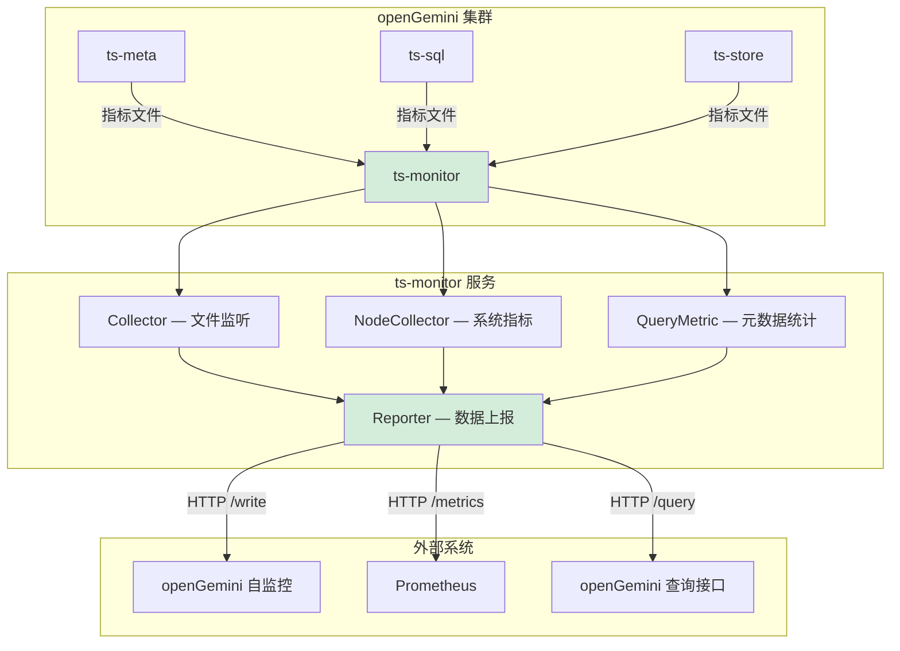
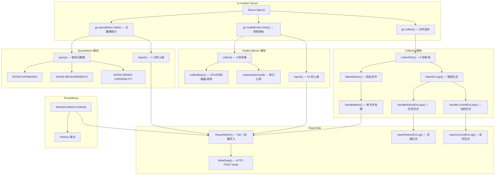
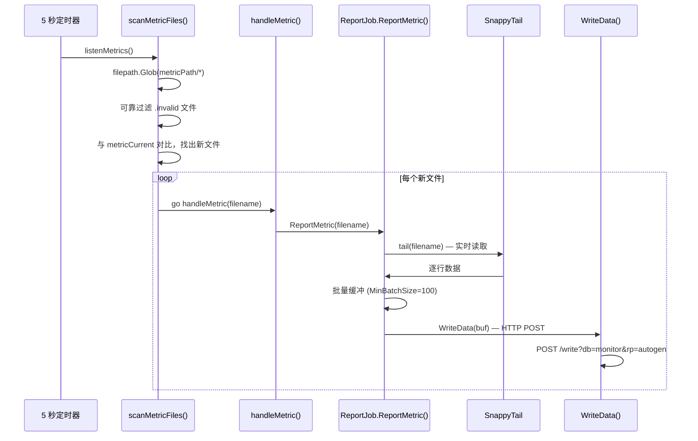
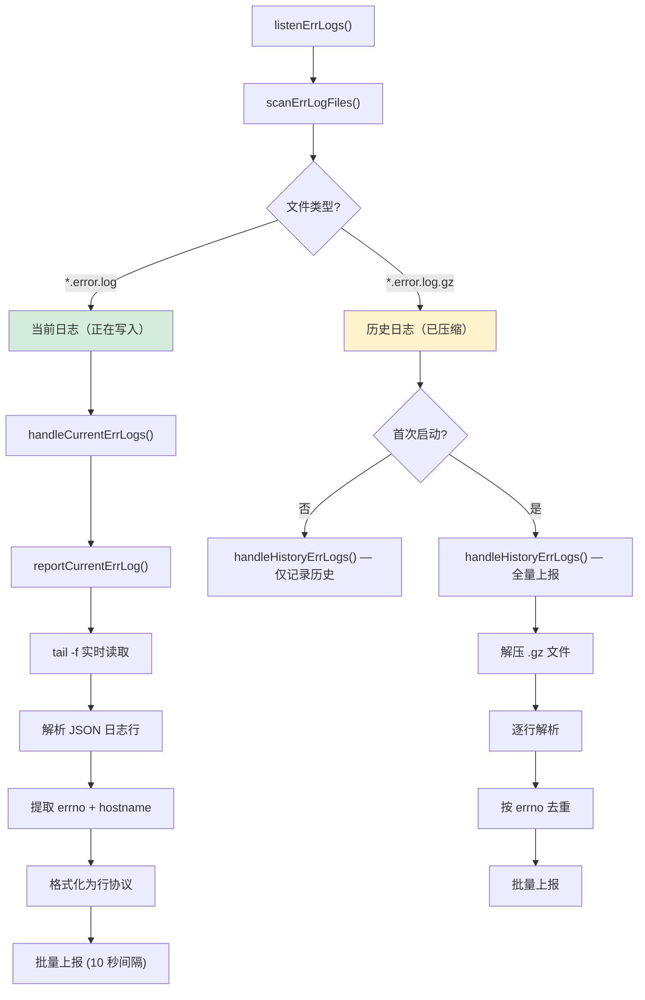
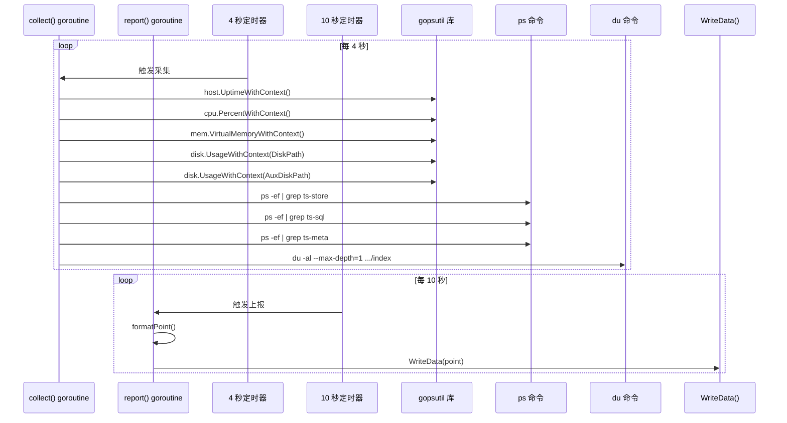
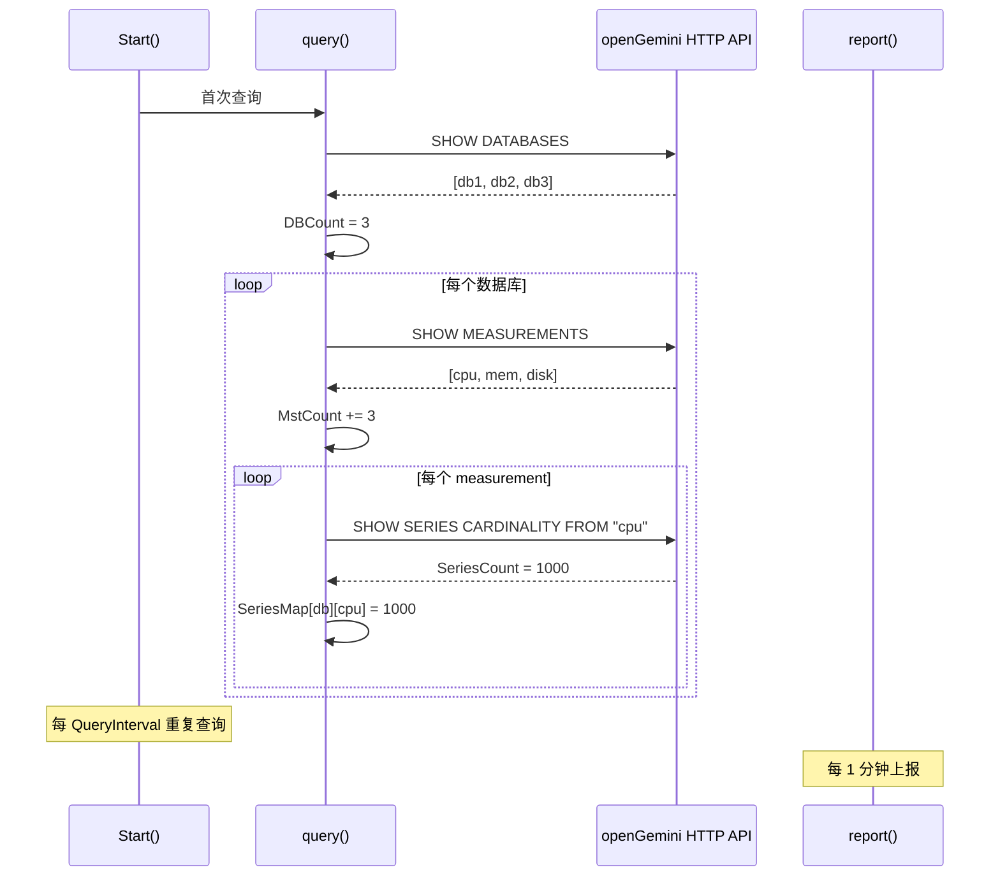
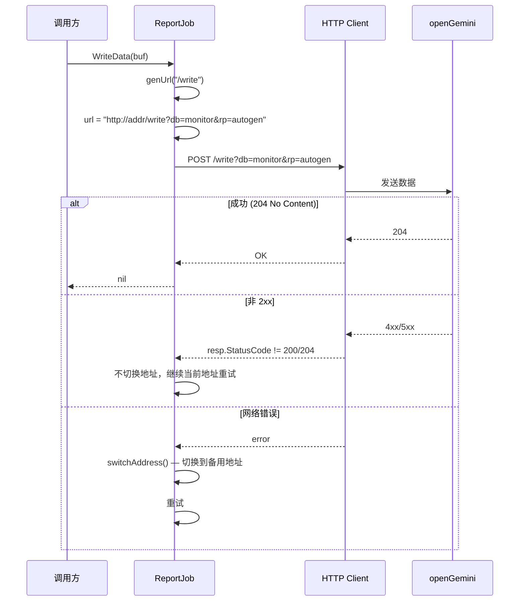

# Module 34: Monitoring Service 深度审计报告（庖丁解牛版）

> `app/ts-monitor/` 是 openGemini 的独立监控服务。它不处理用户查询，而是负责收集集群各节点的运行指标、错误日志和元数据信息，并将这些数据推送到 openGemini 自身（自监控）或外部监控系统（如 Prometheus）。

---

## 1. ts-monitor 是什么？为什么需要它？



**通俗解释**：
- openGemini 的每个节点（ts-meta、ts-sql、ts-store）会定期将运行指标写入本地文件
- ts-monitor 监听这些文件，读取指标数据，然后推送到目标数据库
- ts-monitor 还收集系统级指标（CPU、内存、磁盘）和集群元数据（数据库数量、measurement 数量、series 基数）
- 同时提供 Prometheus 兼容的 `/metrics` 端点

**为什么需要独立服务？**

| 维度 | 内嵌监控 | 独立 ts-monitor |
|------|---------|----------------|
| 资源隔离 | 与主服务竞争 CPU/内存 | 独立进程，GOMAXPROCS=2 |
| 故障隔离 | 主服务崩溃 = 监控丢失 | 独立进程，可独立重启 |
| 部署灵活性 | 每个节点都需要 | 单点部署，监控整个集群 |
| 数据聚合 | 分散在各节点 | 集中收集，统一上报 |

---

## 2. 整体架构



---

## 3. Server — 服务入口

### 3.1 结构体

**代码位置**：`app/ts-monitor/run/server.go:37-48`

```go
type Server struct {
    collector   *collector.Collector     // 文件监听器
    nodeMonitor *collector.NodeCollector // 系统指标收集器
    queryMetric *collector.QueryMetric   // 元数据统计器

    cmd    *cobra.Command
    logger *logger.Logger
    config *config.TSMonitor

    lockFilename string // 锁文件路径
    lockFile     *os.File
}
```

### 3.2 初始化流程

**代码位置**：`app/ts-monitor/run/server.go:50-94`

```go
func NewServer(conf config.Config, cmd *cobra.Command, logger *logger.Logger) (app.Server, error) {
    c := conf.(*config.TSMonitor)
    s := &Server{
        collector:   collector.NewCollector(c.MonitorConfig.MetricPath, c.MonitorConfig.ErrLogPath, c.MonitorConfig.History, logger),
        nodeMonitor: collector.NewNodeCollector(logger, &c.MonitorConfig),
        queryMetric: collector.NewQueryMetric(logger, &c.QueryConfig),
    }

    // 创建 Reporter（上报器），三个组件共享同一个 Reporter
    reporterJob := collector.NewReportJob(logger, c, false, errLogHistory)
    s.collector.Reporter = reporterJob
    s.nodeMonitor.Reporter = reporterJob
    s.queryMetric.Reporter = reporterJob

    // 注册 Prometheus Collector
    monitorCollector := NewMonitorCollector(s.collector)
    prometheus.MustRegister(monitorCollector)

    // 后台创建监控数据库
    go func() {
        for {
            err := s.collector.Reporter.CreateDatabase()
            if err == nil {
                return
            }
            time.Sleep(time.Second)
        }
    }()

    // 启动 HTTP 端点（Prometheus）
    if c.MonitorConfig.HttpEndpoint != "" {
        http.HandleFunc("/metrics", serveMetrics)
        go http.ListenAndServe(c.MonitorConfig.HttpEndpoint, nil)
    }

    // 限制 CPU 使用
    runtime.GOMAXPROCS(2)
    return s, nil
}
```

### 3.3 启动流程

**代码位置**：`app/ts-monitor/run/server.go:97-117`

```go
func (s *Server) Open() error {
    // 单例锁（防止重复启动）
    if err := s.singletonMonitor(); err != nil {
        return err
    }

    // 启动三个收集器
    go s.collect()              // 文件监听
    go s.nodeMonitor.Start()    // 系统指标
    if s.config.QueryConfig.QueryEnable {
        go s.queryMetric.Start() // 元数据统计（可选）
    }
    return nil
}
```

**单例机制**：使用文件锁（`monitor.lock`）确保同一台机器上只有一个 ts-monitor 实例运行。

---

## 4. Collector — 文件监听器

### 4.1 结构体

**代码位置**：`app/ts-monitor/collector/collect.go:46-58`

```go
type Collector struct {
    metricPath    string               // 指标文件目录
    metricCurrent map[string]struct{}  // 正在处理的指标文件
    muMetric      sync.Mutex

    errLogPath    string               // 错误日志目录
    errLogHistory string               // 历史记录文件路径
    errLogCurrent map[string]struct{}  // 正在处理的错误日志文件
    muErrLogCurr  sync.RWMutex

    done     chan struct{}
    Reporter *ReportJob
    logger   *logger.Logger
}
```

### 4.2 主循环

**代码位置**：`app/ts-monitor/collector/collect.go:74-104`

```go
func (c *Collector) ListenFiles() error {
    var hisErrLogs []string
    var currErrLogs []string
    init := true

    ticker := time.NewTicker(listenInterval)  // 5 秒
    defer ticker.Stop()

    go c.cleanErrLogHistory()  // 后台清理历史记录

    for {
        // 监听错误日志
        if err := c.listenErrLogs(hisErrLogs, currErrLogs, init); err != nil {
            return err
        }
        init = false

        // 监听指标文件
        c.listenMetrics(metrics)

        select {
        case <-c.done:
            return nil
        case <-ticker.C:
        }
    }
}
```

### 4.3 指标文件监听



**核心代码**：`app/ts-monitor/collector/collect.go:176-216`（listenMetrics）

```go
func (c *Collector) listenMetrics(metrics []string) {
    metrics = c.scanMetricFiles(metrics)
    if len(metrics) == 0 {
        return
    }
    for _, item := range metrics {
        go c.handleMetric(item)  // 每个文件一个 goroutine
    }
}

func (c *Collector) scanMetricFiles(metrics []string) []string {
    matches, _ := filepath.Glob(filepath.Join(c.metricPath, "*"))
    metrics = metrics[:0]

    c.muMetric.Lock()
    defer c.muMetric.Unlock()

    for _, filename := range matches {
        if strings.HasSuffix(filename, ".invalid") {
            continue  // 跳过无效文件
        }
        if strings.HasPrefix(filename, ".") {
            continue  // 仅当完整路径以 "." 开头才生效，通常不能可靠过滤隐藏文件
        }
        if _, ok := c.metricCurrent[filename]; !ok {
            c.metricCurrent[filename] = struct{}{}
            metrics = append(metrics, filename)
        }
    }
    return metrics
}
```

实际行为注意：`filename` 是 `filepath.Glob(metricPath/*)` 返回的完整路径，`strings.HasPrefix(filename, ".")` 通常无法过滤目录下的隐藏文件。因此当前可靠生效的是 `.invalid` 后缀过滤；“过滤所有隐藏文件”不能作为行为保证。

### 4.4 错误日志监听



**日志行解析**：`app/ts-monitor/collector/report.go:575-613`

```go
func (rb *ReportJob) parseErrLine(line []byte, filePrefix string, isCurrent bool, ...) (int, string) {
    data := make(map[string]interface{})
    json.Unmarshal(line, &data)

    tm := data["time"].(string)
    t, _ := time.Parse(time.RFC3339Nano, tm)
    ts := t.UnixNano()

    errno, _ := strconv.Atoi(data["errno"].(string))
    hostname, _ := data["hostname"].(string)
    tags := fmt.Sprintf("%s,errno=%s,hostname=%s", ErrLogMst, data["errno"], hostname)

    var field []string
    for k, v := range data {
        if _, ok := ignoreKeys[k]; ok {
            continue  // 忽略 errno, hostname, time, level, caller
        }
        field = append(field, fmt.Sprintf("%s:%v", k, v))
    }
    fields := strings.Join(field, ";")
    return errno, fmt.Sprintf(`%s msg="%s",repeated=%0.fi %d`, tags, fields, repeated, ts)
}
```

**输入示例**：
```json
{"time":"2024-01-15T10:30:00Z","errno":"5015","hostname":"node1","level":"error","caller":"engine.go:123","msg":"write failed","database":"mydb"}
```

**输出示例**：
```
err_log,errno=5015,hostname=node1 msg="caller:engine.go:123;msg:write failed;database:mydb",repeated=0 1705312200000000000
```

---

## 5. NodeCollector — 系统指标收集

### 5.1 收集的指标

**代码位置**：`app/ts-monitor/collector/node_monitor.go:68-104`

```go
type nodeMetrics struct {
    Uptime int64  // 系统运行时长（秒）

    CpuNum   int64   // CPU 核数
    CpuUsage float64 // CPU 使用率（%）

    MemSize        int64   // 内存总量（MB）
    MemInUse       int64   // 已用内存（MB）
    MemCacheBuffer int64   // 缓存+缓冲（MB）
    MemUsage       float64 // 内存使用率（%）

    StorePid    int64 // ts-store 进程 PID
    StoreStatus int64 // ts-store 状态（1=运行, 2=已停止）
    SqlPid      int64
    SqlStatus   int64
    DataPid     int64
    DataStatus  int64
    MetaPid     int64
    MetaStatus  int64

    DiskSize  int64   // 磁盘总量（MB）
    DiskUsed  int64   // 已用磁盘（MB）
    DiskUsage float64 // 磁盘使用率（%）

    AuxDiskSize  int64   // 辅助磁盘总量（MB）
    AuxDiskUsed  int64   // 辅助磁盘已用（MB）
    AuxDiskUsage float64 // 辅助磁盘使用率（%）

    IndexUsed int64  // 索引占用空间（MB）
}
```

### 5.2 采集流程



### 5.3 格式化输出

**代码位置**：`app/ts-monitor/collector/node_monitor.go:344-375`

```go
func (nc *NodeCollector) formatPoint() string {
    field := fmt.Sprintf(
        strings.Join(metricFields, ","),
        nc.nodeMetric.Uptime,
        nc.nodeMetric.CpuNum,
        nc.nodeMetric.CpuUsage,
        // ... 所有指标字段
    )
    return fmt.Sprintf("%s,host=%s %s", nodeMst, nc.conf.Host, field)
}
```

**输出示例**：
```
system,host=node1 Uptime=963389,CpuNum=32,CpuUsage=45.23,MemSize=64000,MemInUse=38000,MemCacheBuffer=5000,MemUsage=59.38,StorePid=12345,StoreStatus=1,SqlPid=12346,SqlStatus=1,DataPid=0,DataStatus=0,MetaPid=12347,MetaStatus=1,DiskSize=500000,DiskUsed=300000,DiskUsage=60.00,AuxDiskSize=200000,AuxDiskUsed=100000,AuxDiskUsage=50.00,IndexUsed=6324
```

### 5.4 进程状态检测

```go
const (
    psStore = "ps -ef | grep -iE \"ts-store.*-config\" | grep -v grep"
    psSql   = "ps -ef | grep -iE \"ts-sql.*-config\" | grep -v grep"
    psData  = "ps -ef | grep -iE \"ts-data.*-config\" | grep -v grep"
    psMeta  = "ps -ef | grep -iE \"ts-meta.*-config\" | grep -v grep"

    running int64 = 1
    killed  int64 = 2
)
```

**通俗解释**：
NodeCollector 通过 `ps` 命令检测 openGemini 各组件的运行状态。如果进程存在，状态为 1（running）；如果进程不存在，状态为 2（killed）。

---

## 6. QueryMetric — 元数据统计

### 6.1 收集的指标

**代码位置**：`app/ts-monitor/collector/query.go:56-63`

```go
type queryMetrics struct {
    DBCount   int64                            // 数据库数量
    MstCount  int64                            // measurement 数量
    SeriesMap map[string]map[string]int64       // {"db": {"mst": series_count}}
}
```

### 6.2 查询流程



**核心代码**：`app/ts-monitor/collector/query.go:149-198`（query）

```go
func (q *QueryMetric) query() error {
    // 1. 获取所有数据库
    queryDB, _ := q.queryExecute("", ShowDatabases)
    v, _ := parseSeries(queryDB)
    var databases []string
    for _, db := range v.Get("0", "values").GetArray() {
        databases = append(databases, string(db.GetStringBytes("0")))
    }
    q.queryMetrics.DBCount = int64(len(databases))

    // 2. 遍历每个数据库
    var mstCount int64
    for _, db := range databases {
        queryMst, _ := q.queryExecute(db, ShowMeasurements)
        v, _ = parseSeries(queryMst)
        var measurements []string
        for _, mst := range v.Get("0", "values").GetArray() {
            mstCount++
            measurements = append(measurements, string(mst.GetStringBytes("0")))
        }

        // 3. 查询每个 measurement 的 series 基数
        for _, mst := range measurements {
            querySeries, _ := q.queryExecute(db, fmt.Sprintf(ShowSeriesCardinality, mst))
            v, _ = parseSeries(querySeries)
            for _, vi := range v.GetArray() {
                q.queryMetrics.SeriesMap[db][mst] += vi.Get("values", "0").GetInt64("2")
            }
        }
    }
    q.queryMetrics.MstCount = mstCount
    return nil
}
```

### 6.3 格式化输出

**代码位置**：`app/ts-monitor/collector/query.go:233-255`

```go
func (q *QueryMetric) formatPoint() string {
    points := q.queryMetrics.points
    points = points[:0]

    // 集群级指标
    field := fmt.Sprintf(strings.Join(custerMetricFields, ","),
        q.queryMetrics.DBCount, q.queryMetrics.MstCount)
    points = append(points, fmt.Sprintf("%s %s", ClusterMetric, field))

    // 每个 measurement 的 series 基数
    for db, mp := range q.queryMetrics.SeriesMap {
        for mst, count := range mp {
            points = append(points, fmt.Sprintf(
                "%s,database=%s,measurement=%s SeriesCount=%d",
                MstMetric, db, mst, count))
        }
    }
    return strings.Join(points, "\n")
}
```

**输出示例**：
```
cluster_metric DBCount=5,MstCount=120
measurement_metric,database=mydb,measurement=cpu SeriesCount=1000
measurement_metric,database=mydb,measurement=mem SeriesCount=500
measurement_metric,database=monitor,measurement=system SeriesCount=10
```

---

## 7. ReportJob — 数据上报器

### 7.1 结构体

**代码位置**：`app/ts-monitor/collector/report.go:86-112`

```go
type ReportJob struct {
    storeDatabase  string   // 目标数据库
    storeRP        string   // 保留策略
    storeDuration  time.Duration
    rbAddress      []string // 目标地址列表（支持多地址）
    rbAddressIndex int64    // 当前使用的地址索引
    writeHeader    http.Header
    queryHeader    http.Header
    gzipped        bool
    protocol       string   // http 或 https

    Client HTTPClient
    done   chan struct{}
    logger *logger.Logger

    errLogStat    map[string]string // 错误日志状态
    compress      bool              // 指标文件是否压缩
    reportStat    *ReportStat       // 上报失败统计
    replicaN      int               // 副本数
    indexModuleMap map[string][]*metrics.ModuleIndex // 指标缓存（供 Prometheus）
}
```

### 7.2 写入流程



**核心代码**：`app/ts-monitor/collector/report.go:206-253`（retryEver）

```go
func (rb *ReportJob) retryEver(path string, headers http.Header, buf string, httpTimeout time.Duration) error {
    url := rb.genUrl(path)
    tries := 0
    body := strings.NewReader(buf)

    for {
        req, _ := http.NewRequest(http.MethodPost, url, body)
        req.Header = headers
        resp, err := rb.Client.Do(req)

        if err == nil {
            if resp.StatusCode == http.StatusNoContent || resp.StatusCode == http.StatusOK {
                break  // 成功
            }
            // 非 2xx 不调用 switchAddress，只计入重试次数
        } else {
            rb.switchAddress()  // 只有网络错误才切换到备用地址
            url = rb.genUrl(path)
            if checkConnectionError(err) {
                time.Sleep(time.Second)
                continue  // 连接错误，立即重试
            }
        }

        tries++
        if tries > MaxRetryTimes {
            break  // 超过最大重试次数
        }
        time.Sleep(100 * time.Millisecond)
        body.Reset(buf)
    }
    return nil
}
```

`retryEver` 的返回值也要注意：超过 `MaxRetryTimes` 后跳出循环并返回 `nil`，调用方不能仅凭返回 error 判断上报是否真正成功。

### 7.3 地址切换

```go
func (rb *ReportJob) switchAddress() {
    atomic.SetModInt64AndADD(&rb.rbAddressIndex, 1, int64(len(rb.rbAddress)))
}
```

**通俗解释**：
支持配置多个上报地址（逗号分隔）。当前只有网络错误路径会调用 `switchAddress()`；HTTP 返回非 2xx 时不会切换地址，只在当前地址上继续重试，超过 `MaxRetryTimes` 后仍返回 `nil`。

### 7.4 指标文件上报

**代码位置**：`app/ts-monitor/collector/report.go:269-324`

```go
func (rb *ReportJob) ReportMetric(filename string) error {
    lines := make(chan []byte)
    done := make(chan struct{})

    // 后台 tail 文件
    go func() {
        err := rb.tail(filename, lines)
        if err != nil {
            if !rb.reportStat.TryAgain(filename) {
                rb.reportStat.Delete(filename)
                fileops.RenameFile(filename, filename+".invalid")
            }
        }
        close(done)
    }()

    ticker := time.NewTicker(ReportFrequency)  // 5 秒
    batch := 0
    var buf bytes.Buffer

    for {
        select {
        case line := <-lines:
            ticker.Reset(ReportFrequency)
            batch += bytes.Count(line, []byte{'\n'})
            buf.Write(line)
            buf.WriteByte('\n')
            rb.parseIndex(line)  // 解析指标，缓存供 Prometheus
            rb.postData(&buf, &batch, MinBatchSize)  // 批量上报
        case <-ticker.C:
            rb.postData(&buf, &batch, 0)  // 定时上报
        case <-done:
            return rb.postData(&buf, &batch, 0)  // 文件读取完成
        case <-rb.done:
            return nil
        }
    }
}
```

**关键设计**：
- **Tail 模式**：使用 `SnappyTail` 实时读取文件新增内容
- **批量上报**：缓冲至少 100 行或 5 秒后上报
- **文件读取失败重试**：`tail()`/文件读取失败才按 `maxRetry=2` 计数，超过后将文件标记为 `.invalid`；HTTP 上报失败不走这里的 `.invalid` 逻辑

---

## 8. Prometheus 集成

### 8.1 MonitorCollector

**代码位置**：`app/ts-monitor/run/handler_metrics.go:32-77`

```go
var metricMsts = []string{
    "httpd", "performance", "io", "executor", "system", "runtime",
    "spdy", "measurement_metric", "cluster_metric", "sql_slow_queries", "errno",
}
var namespace = "opengemini"

type MonitorCollector struct {
    metricsCollector *collector.Collector
}

func (c *MonitorCollector) Collect(ch chan<- prometheus.Metric) {
    indexMap := c.metricsCollector.Reporter.GetIndexModuleMap()

    for _, moduleName := range metricMsts {
        metricSlice, ok := indexMap[moduleName]
        if !ok {
            continue
        }
        for _, metricIndex := range metricSlice {
            for metricName, metricValue := range metricIndex.MetricsMap {
                var labelKeys, labelValues []string
                for key, value := range metricIndex.LabelValues {
                    labelKeys = append(labelKeys, key)
                    labelValues = append(labelValues, value)
                }

                desc := metrics.NewDesc(namespace+"_"+moduleName, metricName, "", labelKeys)
                metric, ok := metricValue.(float64)
                if !ok {
                    continue
                }
                m := prometheus.MustNewConstMetric(desc, prometheus.GaugeValue, metric, labelValues...)
                ch <- prometheus.NewMetricWithTimestamp(metricIndex.Timestamp, m)
            }
        }
    }
}
```

### 8.2 指标解析

**代码位置**：`app/ts-monitor/collector/report.go:326-380`

```go
func (rb *ReportJob) parseIndex(line []byte) {
    lines := strings.Split(string(line), "\n")

    for _, value := range lines {
        m := metrics.ModuleIndex{
            LabelValues: make(map[string]string),
            MetricsMap:  make(map[string]interface{}),
        }

        // 数据格式: {table name},{labels} {indicator data} {timestamp}
        parts := strings.Split(value, " ")
        tmp := strings.Split(parts[0], ",")

        moduleName = tmp[0]  // 表名

        // 解析标签
        labels := tmp[1:]
        for _, label := range labels {
            labelKv := strings.Split(label, "=")
            m.LabelValues[labelKv[0]] = labelKv[1]
        }

        // 解析指标
        indexes := strings.Split(parts[1], ",")
        for _, index := range indexes {
            indexKv := strings.Split(index, "=")
            value, _ := strconv.ParseFloat(indexKv[1], 64)
            m.MetricsMap[indexKv[0]] = value
        }

        rb.indexModuleMap[moduleName] = append(rb.indexModuleMap[moduleName], &m)
    }
}
```

当前 `parseIndex` 对行协议格式的支持很窄：只可靠接受 `measurement,labelExpr fieldExpr timestamp` 这种两段头部形式（measurement + 一个 label 表达式段）。多段 label、缺 label、或复杂转义并不是完整行协议解析器的能力范围。

### 8.3 Prometheus 指标命名

```
opengemini_httpd_http_requests_total
opengemini_performance_query_duration_ns
opengemini_system_cpu_usage
opengemini_errno_error_count
```

**命名规则**：`{namespace}_{moduleName}_{metricName}`

---

## 9. ReportStat — 上报失败统计

**代码位置**：`app/ts-monitor/collector/report_stat.go:24-55`

```go
type ReportStat struct {
    failed map[string]int  // filename → 失败次数
    mu     sync.Mutex
}

const maxRetry = 2

func (s *ReportStat) TryAgain(key string) bool {
    s.mu.Lock()
    defer s.mu.Unlock()

    if _, ok := s.failed[key]; ok {
        s.failed[key]++
        return s.failed[key] <= maxRetry
    }
    s.failed[key] = 1
    return true
}
```

**通俗解释**：
如果一个指标文件读取失败（例如 tail/file read 返回错误），会记录失败次数。最多重试 2 次，超过后将文件重命名为 `.invalid`，不再处理。HTTP POST 非 2xx 或重试耗尽不会在这里把文件转为 `.invalid`。

---

## 10. 配置参数

| 参数 | 默认值 | 说明 |
|------|--------|------|
| `listenInterval` | 5s | 文件监听轮询间隔 |
| `collectFrequency` | 10s | 系统指标上报间隔 |
| `metricFlushFrequency` | 4s | 系统指标采集间隔 |
| `ReportFrequency` | 5s | 指标文件上报间隔 |
| `ReportLogFrequency` | 10s | 错误日志上报间隔 |
| `MinBatchSize` | 100 | 最小批量大小 |
| `MaxRetryTimes` | 20 | HTTP 最大重试次数 |
| `maxRetry` | 2 | 文件上报最大重试次数 |
| `HttpTimeout` | 10s | 创建数据库超时 |
| `ReportQueryFrequency` | 1min | 元数据统计上报间隔 |
| `GOMAXPROCS` | 2 | 限制 CPU 使用 |

---

## 11. 总结：ts-monitor 的关键设计

| 设计 | 目的 | 效果 |
|------|------|------|
| 独立进程 | 资源和故障隔离 | 不影响主服务 |
| GOMAXPROCS=2 | 限制 CPU 使用 | 避免与主服务竞争 |
| 文件锁单例 | 防止重复启动 | 数据不重复 |
| 文件监听 + Tail | 实时读取新增内容 | 低延迟上报 |
| 批量缓冲 | 减少 HTTP 请求次数 | 高效上报 |
| 多地址切换 | 高可用 | 目标不可用时自动切换 |
| 文件读取失败重试 + .invalid | 容错 | 坏文件不阻塞 |
| 按 errno 去重 | 减少日志上报量 | 避免重复数据 |
| Prometheus 集成 | 标准监控接口 | 与生态兼容 |
| 进程状态检测 | 及时发现组件故障 | 快速告警 |

## 附录：关键数据结构速查表

| 结构体 | 文件 | 用途 |
|--------|------|------|
| `Server` | `app/ts-monitor/run/server.go:37` | 服务入口 |
| `Collector` | `app/ts-monitor/collector/collect.go:46` | 文件监听器 |
| `NodeCollector` | `app/ts-monitor/collector/node_monitor.go:58` | 系统指标收集器 |
| `nodeMetrics` | `app/ts-monitor/collector/node_monitor.go:68` | 系统指标数据 |
| `QueryMetric` | `app/ts-monitor/collector/query.go:44` | 元数据统计器 |
| `queryMetrics` | `app/ts-monitor/collector/query.go:56` | 元数据指标数据 |
| `ReportJob` | `app/ts-monitor/collector/report.go:86` | 数据上报器 |
| `ReportStat` | `app/ts-monitor/collector/report_stat.go:24` | 上报失败统计 |
| `MonitorCollector` | `app/ts-monitor/run/handler_metrics.go:32` | Prometheus 采集器 |

## 附录：关键函数调用链

```
启动路径:
  main()
    → doRun()
      → run.NewServer(conf, cmd, logger)
        → collector.NewCollector()
        → collector.NewNodeCollector()
        → collector.NewQueryMetric()
        → collector.NewReportJob()
        → prometheus.MustRegister(MonitorCollector)
        → go Reporter.CreateDatabase()
      → s.Open()
        → singletonMonitor() — 文件锁
        → go collect() — 文件监听
        → go nodeMonitor.Start() — 系统指标
        → go queryMetric.Start() — 元数据统计

文件监听路径:
  Collector.ListenFiles()
    → listenErrLogs()
      → scanErrLogFiles()
      → handleHistoryErrLogs() — 历史日志
      → handleCurrentErrLogs() — 当前日志
    → listenMetrics()
      → scanMetricFiles()
      → handleMetric() → ReportJob.ReportMetric()
        → tail() — 实时读取
        → parseIndex() — 解析指标
        → postData() → WriteData() — HTTP 上报

系统指标路径:
  NodeCollector.collect() — 4 秒
    → collectBasic() — CPU/内存/磁盘/进程
    → collectIndexUsed() — 索引占用
  NodeCollector.report() — 10 秒
    → formatPoint()
    → WriteData()

元数据统计路径:
  QueryMetric.query()
    → queryExecute("", "SHOW DATABASES")
    → queryExecute(db, "SHOW MEASUREMENTS")
    → queryExecute(db, "SHOW SERIES CARDINALITY FROM mst")
  QueryMetric.report() — 1 分钟
    → formatPoint()
    → WriteData()

Prometheus 路径:
  HTTP GET /metrics
    → promhttp.Handler()
    → MonitorCollector.Collect()
      → Reporter.GetIndexModuleMap()
      → 遍历 metricMsts
      → prometheus.MustNewConstMetric()
```
