# Module 35: 数据恢复工具（ts-recover）深度审计报告

> ts-recover 是 openGemini 的离线数据恢复 CLI 工具。当数据库因硬件故障、误操作或备份恢复场景需要从备份文件中还原数据时，ts-recover 负责将全量备份和增量备份的数据文件正确地恢复到 openGemini 数据目录中，并通过 HTTP API 通知 meta 节点同步元数据。

---

## 1. ts-recover 是什么？为什么需要它？

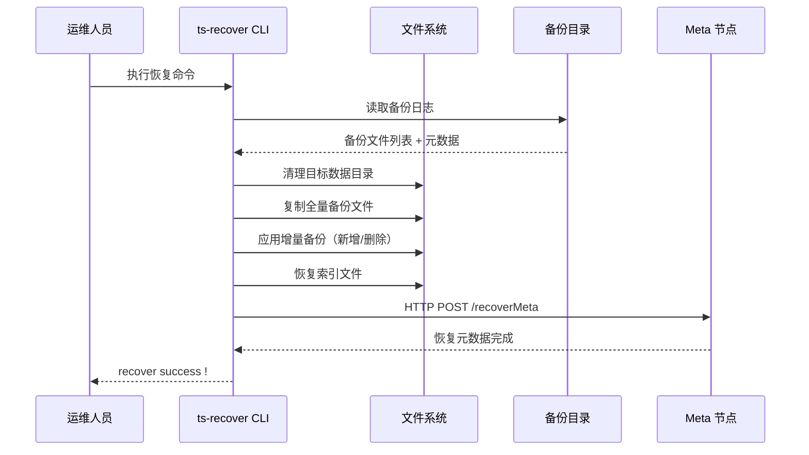

**通俗解释**：
ts-recover 就像一个"数据搬运工"。当数据库出问题时，它把备份目录中的文件按照正确的顺序搬回数据目录：
1. **先看清单**：读取备份日志，知道有哪些文件需要恢复
2. **清空场地**：清理目标数据目录，确保干净
3. **搬全量**：把全量备份的文件复制过来
4. **补增量**：把增量备份中新增的文件加上，删除的文件去掉
5. **通知总部**：告诉 meta 节点"数据恢复好了，请同步元数据"

**核心设计目标**：
1. **两种恢复模式**：全量恢复、全量 + 增量恢复
2. **文件级原子性**：通过备份日志追踪每个文件的状态
3. **安全保护**：默认拒绝覆盖已有数据，需 `--force` 显式确认
4. **元数据同步**：通过 HTTP API 通知 meta 节点恢复元数据

---

## 2. CLI 参数与入口

### 2.1 命令行参数

**代码位置**：`app/ts-recover/main.go`

```go
type RecoverConfig struct {
    RecoverMode        string  // 恢复模式："1"=全量+增量，"2"=仅全量
    DataDir            string  // openGemini 数据目录路径
    FullBackupDataPath string  // 全量备份文件路径
    IncBackupDataPath  string  // 增量备份文件路径
    SSL                bool    // 是否使用 HTTPS 连接 meta 节点
    InsecureTLS        bool    // 是否跳过 TLS 证书验证
    Force              bool    // 强制覆盖已有数据
    Host               string  // meta 节点地址（默认 127.0.0.1:8091）
}
```

**完整参数说明**：

| 参数 | 类型 | 默认值 | 说明 |
|------|------|--------|------|
| `-dataDir` | string | "" (必填) | openGemini 数据目录路径 |
| `-recoverMode` | string | "1" | 恢复模式：1=全量+增量，2=仅全量 |
| `-fullBackupDataPath` | string | "" (必填) | 全量备份文件路径 |
| `-incBackupDataPath` | string | "" (模式1必填) | 增量备份文件路径；一次只支持一个增量备份路径 |
| `-ssl` | bool | false | 是否使用 HTTPS |
| `-insecure-tls` | bool | false | 是否跳过 TLS 验证 |
| `-force` | bool | false | 强制覆盖已有数据 |
| `-host` | string | "127.0.0.1:8091" | meta 节点地址 |

**使用示例**：

```bash
# 仅全量恢复
ts-recover \
  -dataDir /var/lib/openGemini \
  -recoverMode 2 \
  -fullBackupDataPath /backup/full_20240101 \
  -host 127.0.0.1:8091

# 全量 + 增量恢复
ts-recover \
  -dataDir /var/lib/openGemini \
  -recoverMode 1 \
  -fullBackupDataPath /backup/full_20240101 \
  -incBackupDataPath /backup/inc_20240102 \
  -host 127.0.0.1:8091

# 强制恢复（覆盖已有数据）
ts-recover \
  -dataDir /var/lib/openGemini \
  -recoverMode 2 \
  -fullBackupDataPath /backup/full_20240101 \
  -force
```

### 2.2 入口函数

**代码位置**：`app/ts-recover/main.go:28-46`

```go
func main() {
    if err := doRun(os.Args[1:]...); err != nil {
        fmt.Fprintln(os.Stderr, err)
        os.Exit(1)
    }
}

func doRun(args ...string) error {
    options, err := ParseFlags(args...)   // 解析命令行参数
    if err != nil {
        return err
    }
    if err := recover.BackupRecover(&options); err != nil {
        return err
    }
    fmt.Println("recover success !")
    return nil
}
```

**逐行解释**：
- **第 29 行**：`doRun` 接受命令行参数，返回 error
- **第 36 行**：`ParseFlags` 解析命令行参数；当前只校验 `dataDir`，不会在这里校验备份路径
- **第 40 行**：`BackupRecover` 是恢复的核心入口
- **第 43 行**：成功后打印 "recover success !"

---

## 3. 恢复模式选择

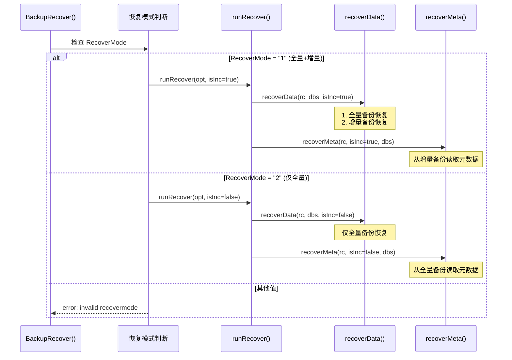

**核心代码**：`app/ts-recover/recover/recover.go:51-72`

```go
func BackupRecover(opt *RecoverConfig) error {
    if opt.FullBackupDataPath == "" {
        return fmt.Errorf("missing required parameter: fullBackupDataPath")
    }
    if opt.RecoverMode == "1" && opt.IncBackupDataPath == "" {
        return fmt.Errorf("missing required parameter: incBackupDataPath")
    }
    var err error
    switch opt.RecoverMode {
    case FullAndIncRecoverMode:    // "1"
        err = runRecover(opt, true)
    case FullRecoverMode:          // "2"
        err = runRecover(opt, false)
    default:
        return fmt.Errorf("invalid recovermode")
    }
    return err
}
```

**逐行解释**：
- **第 52-54 行**：在 `BackupRecover` 中验证全量备份路径必填
- **第 55-57 行**：模式 1（全量+增量）需要增量备份路径
- **第 60-61 行**：模式 1 调用 `runRecover(opt, true)`
- **第 62-63 行**：模式 2 调用 `runRecover(opt, false)`

**具体例子**：

```
场景：数据库因磁盘损坏需要恢复

已有备份：
  /backup/full_20240101/  ← 1月1日的全量备份
  /backup/inc_20240102/   ← 1月2日的增量备份

使用模式 1（全量+增量）恢复到 1月2日的状态：
  步骤 1：恢复全量备份（1月1日的完整数据）
  步骤 2：应用一个增量备份路径（1月2日的变更）
  步骤 3：同步元数据

使用模式 2（仅全量）恢复到 1月1日的状态：
  步骤 1：恢复全量备份（1月1日的完整数据）
  步骤 2：同步元数据
```

---

## 4. 数据恢复流程

### 4.1 总体流程

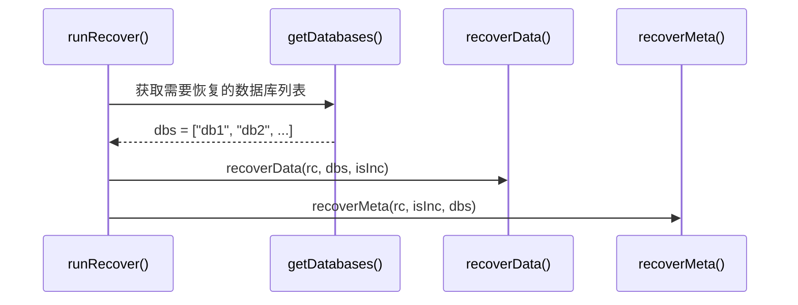

**核心代码**：`app/ts-recover/recover/recover.go:74-84`

```go
func runRecover(rc *RecoverConfig, isInc bool) error {
    dbs, err := getDatabases(rc)        // 步骤 1: 获取数据库列表
    if err != nil {
        return err
    }
    if err := recoverData(rc, dbs, isInc); err != nil {  // 步骤 2: 恢复数据文件
        return err
    }
    return recoverMeta(rc, isInc, dbs)  // 步骤 3: 恢复元数据
}
```

### 4.2 获取数据库列表

**代码位置**：`app/ts-recover/recover/recover.go:374-417`

```go
func getDatabases(rc *RecoverConfig) ([]string, error) {
    // 读取全量备份的结果日志
    path := fileops.Join(rc.FullBackupDataPath, backup.BackupLogPath, backup.ResultLog)
    fullRes := &backup.BackupResult{}
    if err := backup.ReadBackupLogFile(path, fullRes); err != nil {
        return nil, err
    }

    if rc.RecoverMode == FullRecoverMode {
        // 仅全量模式：直接返回全量备份中的数据库列表
        databases := make([]string, 0, len(fullRes.DataBases))
        for db := range fullRes.DataBases {
            databases = append(databases, db)
        }
        return databases, nil
    }

    // 全量+增量模式：验证两个备份的数据库列表一致
    incRes := &backup.BackupResult{}
    // ... 读取增量备份的结果日志 ...

    if fullRes.Time > incRes.Time {
        return nil, errors.New("fullBackup time should earlier than incBackup")
    }
    if len(fullRes.DataBases) != len(incRes.DataBases) {
        return nil, errors.New("databases not equal in full Backup and inc Backup")
    }
    // ... 验证每个数据库都存在 ...
    return databases, nil
}
```

**逐行解释**：
- 读取备份结果日志获取数据库列表
- 全量模式直接返回
- 增量模式需要验证：全量时间 < 增量时间，数据库列表一致

### 4.3 数据文件恢复

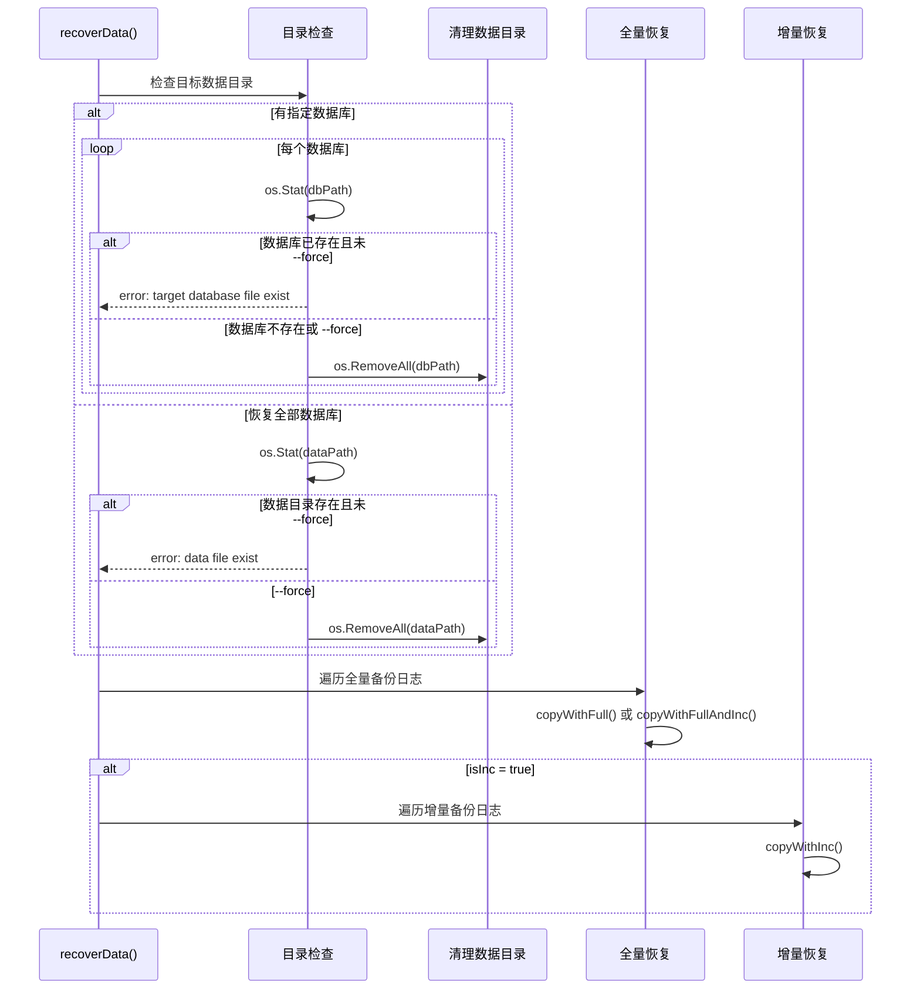

**核心代码**：`app/ts-recover/recover/recover.go:86-139`

```go
func recoverData(rc *RecoverConfig, dbs []string, isInc bool) error {
    dataPath := filepath.Join(rc.DataDir, config.DataDirectory)

    // 步骤 1: 检查并清理目标数据目录
    if len(dbs) > 0 {
        for _, db := range dbs {
            p := filepath.Join(dataPath, db)
            _, err := os.Stat(p)
            if !rc.Force && err == nil {
                return fmt.Errorf("target database file exist,db : %s.if you still recover,please use --force", db)
            }
            if err := os.RemoveAll(p); err != nil {
                return err
            }
        }
    }

    // 步骤 2: 恢复全量备份
    copyFunc := copyWithFull
    if isInc {
        copyFunc = copyWithFullAndInc
    }
    fullBackupDataPath := filepath.Join(rc.FullBackupDataPath, backup.DataBackupDir, dataPath)
    if err := traversalBackupLogFile(rc, fullBackupDataPath, copyFunc, isInc); err != nil {
        return err
    }

    // 步骤 3: 恢复增量备份
    if !isInc {
        return nil
    }
    incBackupDataPath := filepath.Join(rc.IncBackupDataPath, backup.DataBackupDir, dataPath)
    if err := traversalIncBackupLogFile(rc, incBackupDataPath); err != nil {
        return err
    }
    return nil
}
```

**逐行解释**：
- **第 89-108 行**：安全检查 — 如果目标目录已存在且未指定 `--force`，拒绝覆盖
- **第 110-111 行**：根据是否需要增量恢复选择复制函数
- **第 116-122 行**：遍历全量备份日志，执行文件复制
- **第 129-136 行**：如果是增量模式，遍历增量备份日志

**通俗解释**：
数据恢复就像"搬家"：
1. **检查新房**：看看目标目录是否已有数据（安全保护）
2. **清空新房**：如果指定了 `--force`，先清空目标目录
3. **搬大家具**：把全量备份的文件复制过来
4. **搬小物件**：如果是增量模式，把增量备份的变更也搬过来

---

## 5. 全量备份恢复

### 5.1 copyWithFull — 全量复制

**代码位置**：`app/ts-recover/recover/recover.go:280-299`

```go
func copyWithFull(rc *RecoverConfig, path string) error {
    backupLog := &backup.BackupLogInfo{}
    if err := backup.ReadBackupLogFile(path, backupLog); err != nil {
        return err
    }

    basicPath := filepath.Join(rc.FullBackupDataPath, backup.DataBackupDir)
    for _, fileList := range backupLog.FileListMap {
        for _, files := range fileList {
            srcPath := filepath.Join(basicPath, files[0])
            for _, f := range files {
                if err := backup.FileMove(srcPath, f); err != nil {
                    return err
                }
            }
        }
    }
    return nil
}
```

**逐行解释**：
- **第 282 行**：读取备份日志文件，获取文件列表
- **第 287 行**：`FileListMap` 是 `map[string][][]string`，key 是 measurement 名，value 是文件路径组
- **第 288-291 行**：`files[0]` 是源路径，其余是目标路径（一个文件可能有多个副本）
- **第 289 行**：`backup.FileMove` 执行文件复制

**具体例子**：

```
备份日志内容：
{
  "FileListMap": {
    "cpu": [
      ["/backup/data/db0/0/cpu/00000001-0000-00000001.tssp",
       "/var/lib/openGemini/data/db0/0/cpu/00000001-0000-00000001.tssp"]
    ],
    "mem": [
      ["/backup/data/db0/0/mem/00000001-0000-00000001.tssp",
       "/var/lib/openGemini/data/db0/0/mem/00000001-0000-00000001.tssp"]
    ]
  }
}

恢复过程：
  cpu 文件：/backup/.../cpu/00000001.tssp → /var/lib/.../cpu/00000001.tssp
  mem 文件：/backup/.../mem/00000001.tssp → /var/lib/.../mem/00000001.tssp
```

---

## 6. 增量备份恢复

### 6.1 copyWithFullAndInc — 合并全量与增量

**代码位置**：`app/ts-recover/recover/recover.go:301-325`

```go
func copyWithFullAndInc(rc *RecoverConfig, fullPath string) error {
    // 构造增量备份日志路径
    p, _ := filepath.Split(strings.Replace(fullPath, rc.FullBackupDataPath, rc.IncBackupDataPath, -1))
    incPath := filepath.Join(p, backup.IncBackupLog)

    // 检查增量备份日志是否存在
    _, err := fileops.Stat(incPath)
    if err != nil {
        // 没有增量日志，退回到纯全量复制
        err = copyWithFull(rc, fullPath)
        return err
    }

    // 读取增量备份日志
    incBackupLog := &backup.IncBackupLogInfo{}
    if err := backup.ReadBackupLogFile(incPath, incBackupLog); err != nil {
        return err
    }

    // 读取全量备份日志
    backupLog := &backup.BackupLogInfo{}
    if err := backup.ReadBackupLogFile(fullPath, backupLog); err != nil {
        return err
    }

    // 合并文件列表：全量文件 - 增量删除文件
    err = mergeFileList(rc, backupLog.FileListMap, incBackupLog.DelFileListMap)
    return err
}
```

**逐行解释**：
- **第 302 行**：将全量备份路径替换为增量备份路径，找到对应的增量日志
- **第 306-309 行**：如果增量日志不存在，退回纯全量复制
- **第 319 行**：`mergeFileList` 合并文件列表，排除增量中标记为删除的文件

### 6.2 mergeFileList — 文件列表合并

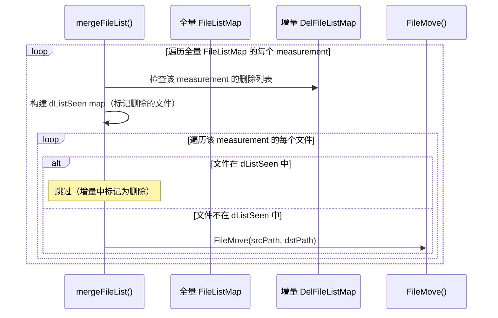

**核心代码**：`app/ts-recover/recover/recover.go:348-372`

```go
func mergeFileList(rc *RecoverConfig, listMap, delListMap map[string][][]string) error {
    fullBasicPath := filepath.Join(rc.FullBackupDataPath, backup.DataBackupDir)
    for name, fileList := range listMap {
        // 构建删除列表的查找表
        dListSeen := make(map[string]bool)
        if dLists, ok := delListMap[name]; ok {
            for _, files := range dLists {
                dListSeen[files[0]] = true
            }
        }
        // 复制文件，跳过删除列表中的文件
        for _, files := range fileList {
            if dListSeen[files[0]] {
                continue  // 增量中标记为删除，跳过
            }
            srcPath := filepath.Join(fullBasicPath, files[0])
            for _, f := range files {
                if err := backup.FileMove(srcPath, f); err != nil {
                    return err
                }
            }
        }
    }
    return nil
}
```

**具体例子**：

```
全量备份（1月1日）：
  FileListMap = {
    "cpu": [
      ["cpu_001.tssp", "/data/cpu_001.tssp"],
      ["cpu_002.tssp", "/data/cpu_002.tssp"],
      ["cpu_003.tssp", "/data/cpu_003.tssp"]
    ]
  }

增量备份（1月2日）：
  DelFileListMap = {
    "cpu": [
      ["cpu_002.tssp"]    ← 1月2日删除了 cpu_002
    ]
  }

合并结果：
  恢复文件：cpu_001.tssp, cpu_003.tssp
  跳过文件：cpu_002.tssp（在增量删除列表中）
```

### 6.3 copyWithInc — 增量文件复制

**代码位置**：`app/ts-recover/recover/recover.go:327-346`

```go
func copyWithInc(rc *RecoverConfig, incPath string) error {
    backupLog := &backup.IncBackupLogInfo{}
    if err := backup.ReadBackupLogFile(incPath, backupLog); err != nil {
        return err
    }

    basicPath := filepath.Join(rc.IncBackupDataPath, backup.DataBackupDir)
    for _, fileList := range backupLog.AddFileListMap {
        for _, files := range fileList {
            srcPath := filepath.Join(basicPath, files[0])
            for _, f := range files {
                if err := backup.FileMove(srcPath, f); err != nil {
                    return err
                }
            }
        }
    }
    return nil
}
```

**逐行解释**：
- `AddFileListMap` 记录增量备份中新增的文件
- 与 `copyWithFull` 类似，但只复制新增文件

---

## 7. 元数据恢复

### 7.1 元数据恢复流程

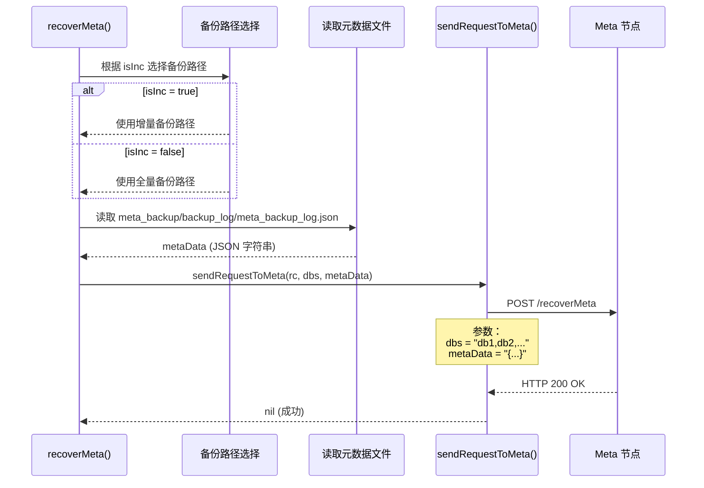

**核心代码**：`app/ts-recover/recover/recover.go:141-155`

```go
func recoverMeta(rc *RecoverConfig, isInc bool, dbs []string) error {
    var backupPath string
    if isInc {
        backupPath = rc.IncBackupDataPath
    } else {
        backupPath = rc.FullBackupDataPath
    }
    backupMetaPath := filepath.Join(backupPath, backup.MetaBackupDir)
    buf, err := os.ReadFile(filepath.Join(backupMetaPath, backup.MetaInfo))
    if err != nil {
        return err
    }
    return sendRequestToMeta(rc, dbs, string(buf))
}
```

### 7.2 HTTP 元数据同步

**代码位置**：`app/ts-recover/recover/recover.go:157-185`

```go
func sendRequestToMeta(rc *RecoverConfig, dbs []string, metaData string) error {
    protocol := "http"
    if rc.SSL {
        protocol = "https"
    }

    urlValues := url.Values{}
    urlValues.Add(backup.DataBases, strings.Join(dbs, ",")) // key: "dbs"
    urlValues.Add(backup.MetaData, metaData)                 // key: "metaData"

    Url, _ := url.Parse(fmt.Sprintf("%s://%s/recoverMeta", protocol, rc.Host))
    Url.RawQuery = urlValues.Encode()

    transport := &http.Transport{}
    client := &http.Client{Transport: transport}
    if rc.InsecureTLS {
        transport.TLSClientConfig = &tls.Config{InsecureSkipVerify: true}
    }

    res, err := client.PostForm(Url.String(), urlValues)
    if err != nil {
        return err
    }
    defer res.Body.Close()
    return resolveResponseError(res)
}
```

**逐行解释**：
- **第 159-161 行**：根据 SSL 配置选择 HTTP/HTTPS 协议
- **第 163-165 行**：构造请求参数：数据库列表 + 元数据 JSON；实际参数 key 是 `dbs` 和 `metaData`
- **第 168 行**：`Url.RawQuery = urlValues.Encode()` 会把参数放进 URL query
- **第 173 行**：`client.PostForm(Url.String(), urlValues)` 又会把同一组参数放进 form body，因此 URL query 和 PostForm 都携带参数
- **第 173-175 行**：如果配置了 `InsecureTLS`，跳过证书验证
- **第 178-179 行**：发送 POST 请求到 meta 节点的 `/recoverMeta` 接口

**具体例子**：

```
HTTP 请求：
  POST http://127.0.0.1:8091/recoverMeta
  Content-Type: application/x-www-form-urlencoded

  Body:
    dbs=prom,db0,db1
    metaData={"metaIds":["1","2"],"isNode":true}

  URL query:
    ?dbs=prom%2Cdb0%2Cdb1&metaData=...

成功响应：HTTP 200 OK
失败响应：HTTP 4xx/5xx + 错误信息
```

---

## 8. 备份日志遍历

### 8.1 全量备份日志遍历

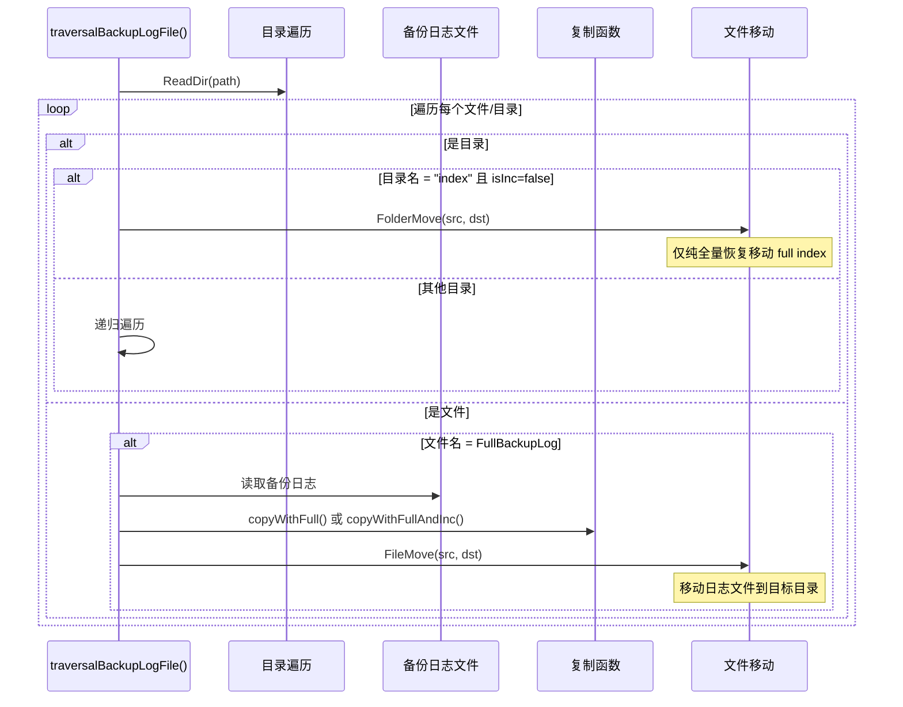

**核心代码**：`app/ts-recover/recover/recover.go:199-237`

```go
func traversalBackupLogFile(rc *RecoverConfig, path string, fn RecoverFunc, isInc bool) error {
    fds, err := fileops.ReadDir(path)
    if err != nil {
        return err
    }

    for _, fd := range fds {
        srcfp := filepath.Join(path, fd.Name())
        if fd.IsDir() {
            if fd.Name() == "index" && !isInc {
                // 索引目录直接移动（仅纯全量模式）
                outPath := strings.Replace(srcfp, filepath.Join(rc.FullBackupDataPath, backup.DataBackupDir), "", -1)
                if err := backup.FolderMove(srcfp, outPath); err != nil {
                    return err
                }
                continue
            }
            // 递归遍历子目录
            if err = traversalBackupLogFile(rc, srcfp, fn, isInc); err != nil {
                return err
            }
        } else {
            if fd.Name() == backup.FullBackupLog {
                // 找到备份日志文件，执行复制
                if err := fn(rc, srcfp); err != nil {
                    return err
                }
                // 移动日志文件
                outPath := strings.Replace(srcfp, filepath.Join(rc.FullBackupDataPath, backup.DataBackupDir), "", -1)
                if err := backup.FileMove(srcfp, outPath); err != nil {
                    return err
                }
            }
        }
    }
    return nil
}
```

全量+增量恢复时，遍历全量备份日志传入的 `isInc=true`，所以 full backup 里的 `index/` 不会在这一步移动；随后遍历增量备份时才会移动 inc backup 中的 index 相关内容。

---

## 9. 端到端实战：一次完整恢复

### 9.1 场景设定

```
数据库：prom, db0
全量备份：/backup/full_20240101/
增量备份：/backup/inc_20240102/
数据目录：/var/lib/openGemini/

全量备份内容：
  /backup/full_20240101/data_backup/
    data/var/lib/openGemini/data/prom/
      0/cpu/00000001-0000-00000001.tssp
      0/cpu/00000002-0000-00000001.tssp
    data/var/lib/openGemini/data/db0/
      0/mem/00000001-0000-00000001.tssp
    index/  ← 索引目录
    backup_log/result.json  ← 备份结果
    backup_log/full_backup_log.json  ← 文件列表

增量备份内容：
  /backup/inc_20240102/data_backup/
    data/var/lib/openGemini/data/prom/
      0/cpu/00000003-0000-00000001.tssp  ← 新增
    backup_log/inc_backup_log.json  ← 增量日志
      AddFileListMap: { "cpu": [["cpu_003.tssp", ...]] }
      DelFileListMap: { "cpu": [["cpu_002.tssp"]] }  ← 删除 cpu_002
```

### 9.2 恢复时序图

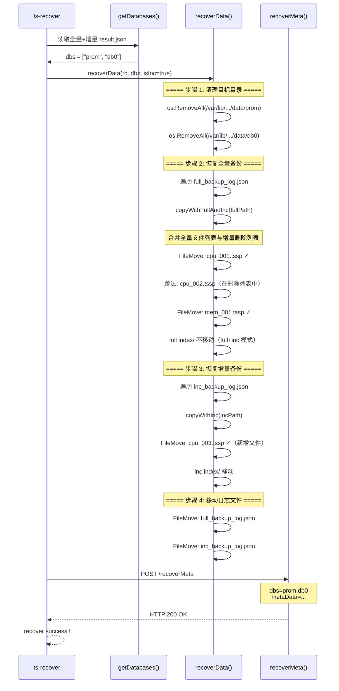

### 9.3 恢复结果

```
恢复前：
  /var/lib/openGemini/data/  ← 空或已有数据

恢复后：
  /var/lib/openGemini/data/
    prom/
      0/cpu/00000001-0000-00000001.tssp  ← 全量备份
      0/cpu/00000003-0000-00000001.tssp  ← 增量新增
      // cpu_002.tssp 被增量删除，未恢复
    db0/
      0/mem/00000001-0000-00000001.tssp  ← 全量备份
    index/  ← 索引目录
```

---

## 10. 安全保护机制

### 10.1 数据覆盖保护

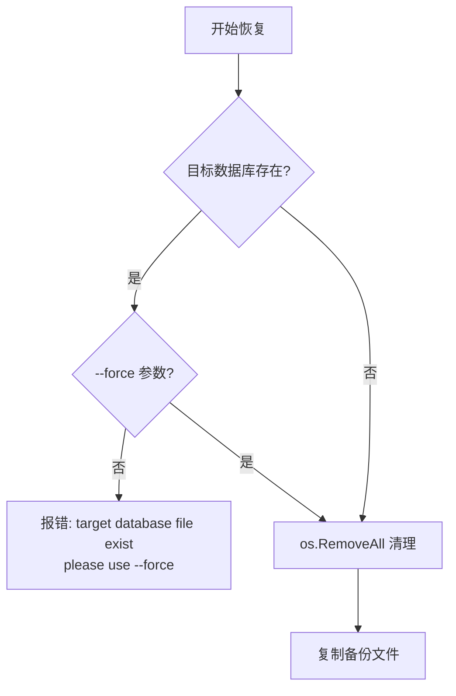

**代码位置**：`app/ts-recover/recover/recover.go:89-108`

```go
// 安全检查：防止误覆盖
if !rc.Force && err == nil {
    return fmt.Errorf("target database file exist,db : %s.if you still recover,please use --force", db)
}
```

### 10.2 备份完整性验证

```go
// 验证全量备份时间早于增量备份
if fullRes.Time > incRes.Time {
    return nil, errors.New("fullBackup time should earlier than incBackup")
}

// 验证数据库列表一致
if len(fullRes.DataBases) != len(incRes.DataBases) {
    return nil, errors.New("databases not equal in full Backup and inc Backup")
}
```

### 10.3 TLS 支持

| 配置 | 说明 |
|------|------|
| `--ssl` | 使用 HTTPS 连接 meta 节点 |
| `--insecure-tls` | 跳过 TLS 证书验证（测试环境用） |

---

## 11. 潜在隐患

### 11.1 恢复中断无断点续传

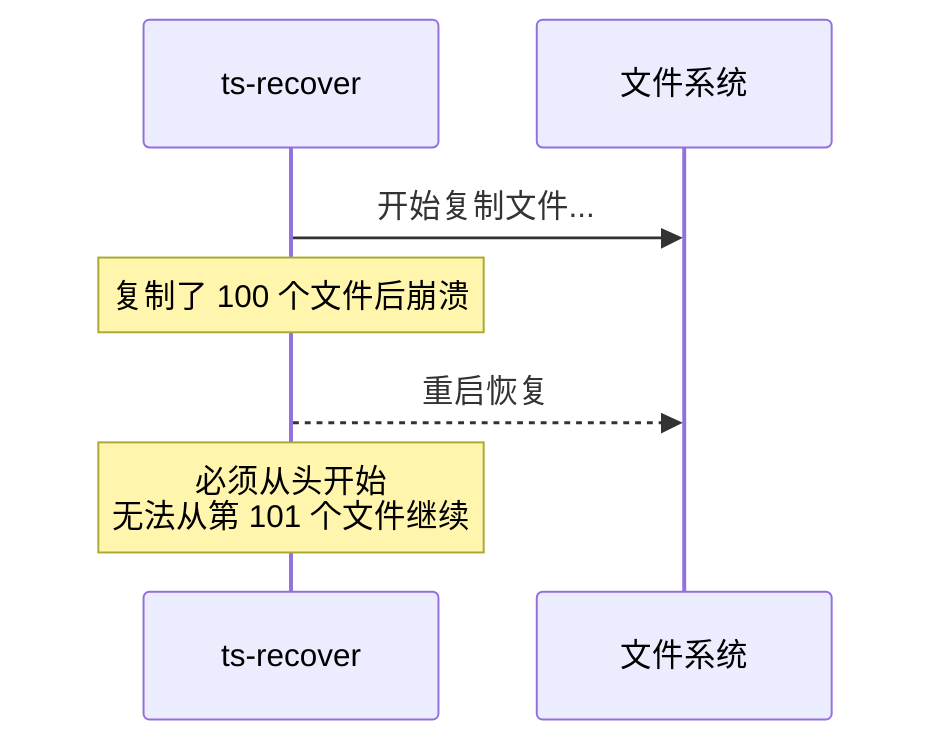

**隐患**：
- 恢复过程中如果中断，必须从头开始
- 对于大型数据库（TB 级），恢复时间可能很长
- 建议：实现断点续传机制，记录已恢复的文件

### 11.2 增量恢复的删除列表可能不完整

```
场景：
  全量备份：file1, file2, file3
  增量备份：删除 file2，新增 file4

  如果增量备份的 DelFileListMap 丢失：
    → file2 仍会被恢复（不应该恢复）
    → 数据不一致
```

### 11.3 元数据恢复无回滚机制

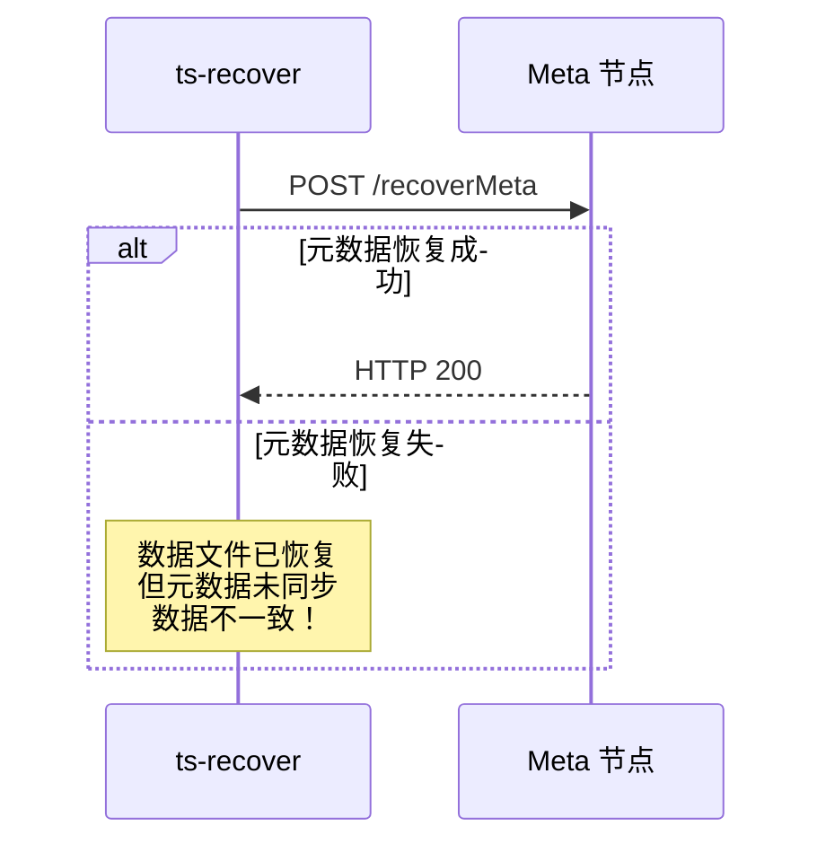

**隐患**：
- 如果数据文件恢复成功但元数据恢复失败，会导致数据不一致
- 建议：实现事务性恢复，支持回滚

---

## 12. 总结：ts-recover 的关键设计

| 设计 | 目的 | 效果 |
|------|------|------|
| 两种恢复模式 | 灵活的恢复策略 | 支持仅全量和全量+增量 |
| 备份日志追踪 | 记录每个文件的状态 | 支持增量删除和新增 |
| --force 保护 | 防止误覆盖 | 默认拒绝覆盖已有数据 |
| HTTP 元数据同步 | 恢复 meta 节点数据 | 数据和元数据一致 |
| 递归目录遍历 | 处理复杂的目录结构 | 支持多数据库、多 shard |
| 文件列表合并 | 处理增量删除 | 正确恢复到目标时间点 |
