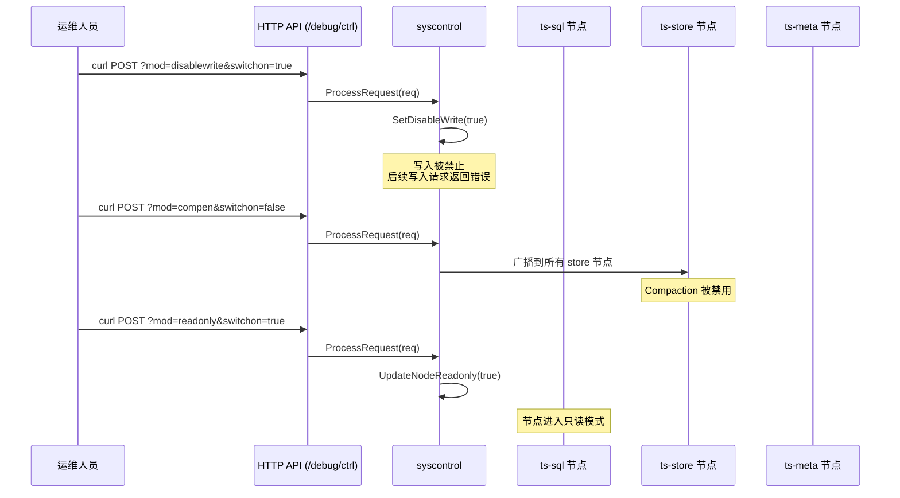
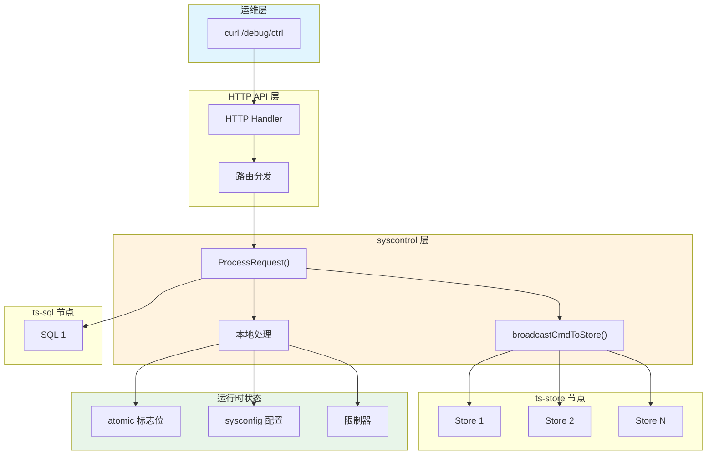
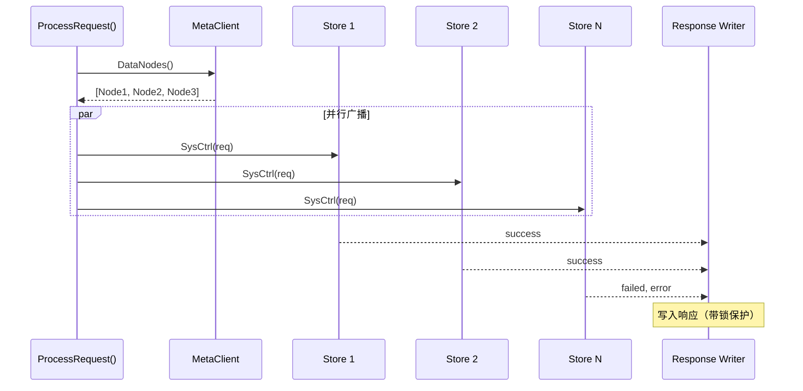
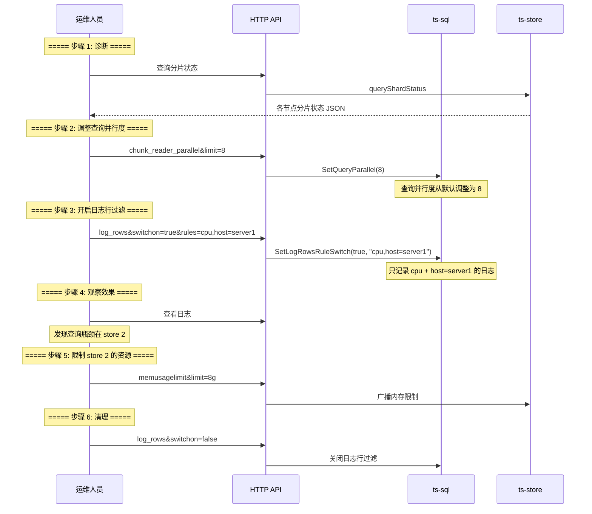
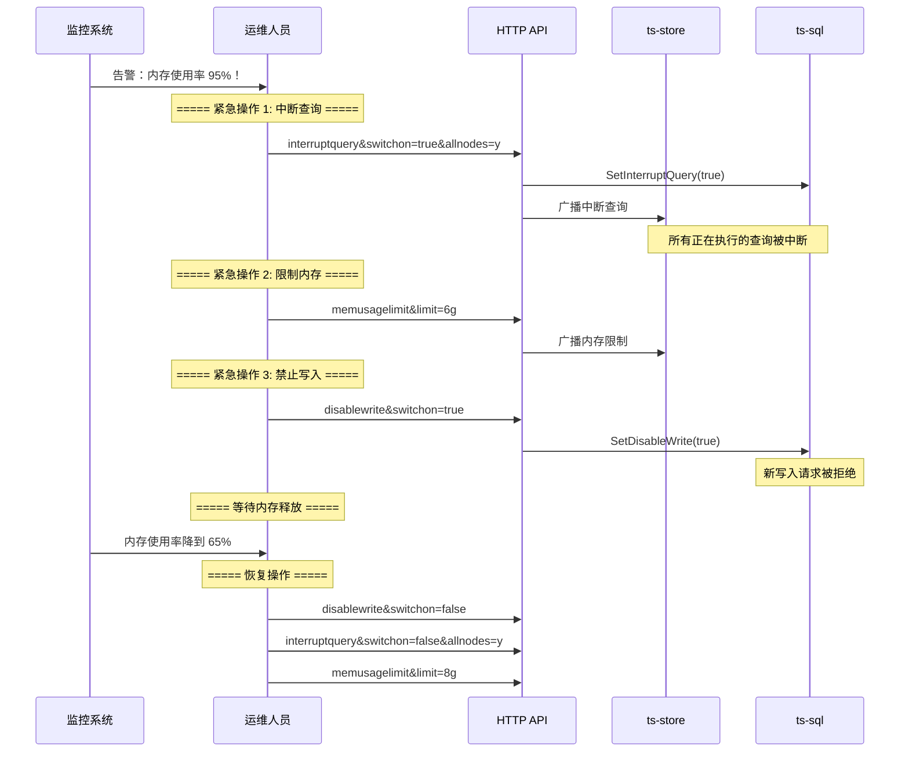

# Module 36: 系统控制模块（syscontrol）深度审计报告

> syscontrol 是 openGemini 的运行时系统控制中心。它通过 HTTP API 暴露一组调试和运维命令，允许管理员在不停机的情况下动态调整数据库的运行行为，包括写入开关、读取开关、节点只读模式、查询并发控制、Compaction 开关、内存限制、日志行过滤等。注意：只有 `ProcessRequest` 中有分支的 mod 才是 `/debug/ctrl` 命令；部分 setter 是内部 API，不能直接当 HTTP 控制命令使用。

---

## 1. syscontrol 是什么？为什么需要它？



**通俗解释**：
syscontrol 就像一个"远程遥控器"。运维人员可以通过 HTTP 请求，在不停机的情况下调整数据库的行为：
- **紧急刹车**：发现异常时，立即禁止写入或读取
- **限流降级**：调整查询并发数、内存使用限制
- **维护模式**：将节点设为只读，方便做备份或升级
- **调试开关**：开启日志行过滤、打印执行计划等

**核心设计目标**：
1. **运行时控制**：所有参数可动态调整，无需重启
2. **集群广播**：单条命令可广播到所有节点
3. **原子操作**：使用 `sync/atomic` 保证并发安全
4. **HTTP 接口**：通过 REST API 暴露，易于集成

---

## 2. 架构概览

### 2.1 系统控制架构



### 2.2 SysControl 结构体

**代码位置**：`lib/syscontrol/syscontrol.go:42-44`

```go
type SysControl struct {
    MetaClient meta.MetaClient  // 用于获取节点列表和发送命令
}
```

**全局单例**：

```go
var SysCtrl *SysControl

func init() {
    SysCtrl = NewSysControl()
    handlerOnQueryRequest[QueryShardStatus] = handleQueryShardStatus
}
```

**通俗解释**：
`SysControl` 是一个全局单例，它持有 `MetaClient` 的引用，用于：
- 获取集群中的所有数据节点列表
- 向指定节点发送控制命令
- 处理查询请求

---

## 3. 支持的控制命令

### 3.1 命令总览

| 命令 (mod) | 类型 | 作用域 | 说明 |
|------------|------|--------|------|
| `flush` | store | 广播 | 触发 MemTable flush |
| `compen` | store | 广播 | Compaction 开关 |
| `merge` | store | 广播 | 乱序文件合并开关 |
| `snapshot` | store | 广播 | 快照控制 |
| `downsample_in_order` | store | 广播 | 降采样有序控制 |
| `readonly` | local | 本地 | 节点只读模式；当前不处理 `host/allnodes` |
| `disablewrite` | local | 本地 | 禁止写入 |
| `disableread` | local | 本地 | 禁止读取 |
| `chunk_reader_parallel` | sql | 本地 | 查询并行度 |
| `binary_tree_merge` | sql | 本地 | 二叉树合并开关 |
| `print_logical_plan` | sql | 本地 | 打印逻辑计划 |
| `sliding_window_push_up` | sql | 本地 | 滑动窗口上推 |
| `force_broadcast_query` | sql | 本地 | 强制广播查询 |
| `log_rows` | sql | 本地 | 日志行过滤规则 |
| `time_filter_protection` | sql | 本地 | 时间过滤保护 |
| `verifynode` | store | 广播 | 节点验证 |
| `memusagelimit` | store | 广播 | 内存使用限制 |
| `backgroundReadLimiter` | store | 广播 | 后台读取限速 |
| `interruptquery` | both | 广播 | 中断查询 |
| `uppermemusepct` | both | 广播 | 内存使用百分比上限 |
| `parallelbatch` | sql | 本地 | 批量并行查询 |
| `backup` | store | 广播 | 备份命令 |
| `abort_backup` | store | 广播 | 中止备份 |
| `backup_status` | store | 广播 | 备份状态 |
| `write_stream_points_enable` | store | 广播 | 流式写入开关 |
| `failpoint` | both | 广播+meta | 故障注入 |

内部 API 说明：`querySeriesLimit`、层级存储开关、层级索引存储开关等虽然有 setter/getter，但如果 `ProcessRequest` 没有对应 mod 分支，就应标为内部 API，而不是 `/debug/ctrl` 命令。

### 3.2 命令路由分发

```mermaid
flowchart TD
    A[ProcessRequest] --> B{req.Mod()}

    B -->|"flush / compen / merge<br/>snapshot / downsample_in_order<br/>verifynode / memusagelimit<br/>backgroundReadLimiter"| C[广播到所有 store 节点]

    B -->|"abort_backup / backup_status"| D[广播到 store（备份命令）]

    B -->|"failpoint"| E[广播到 store + 发送到 meta]

    B -->|"readonly"| F[本地 UpdateNodeReadonly]

    B -->|"disablewrite"| G[本地 SetDisableWrite]

    B -->|"disableread"| H[本地 SetDisableRead]

    B -->|"chunk_reader_parallel"| I[本地 SetQueryParallel]

    B -->|"binary_tree_merge"| J[本地 sysconfig.SetEnableBinaryTreeMerge]

    B -->|"print_logical_plan"| K[本地 sysconfig.SetEnablePrintLogicalPlan]

    B -->|"sliding_window_push_up"| L[本地 sysconfig.SetEnableSlidingWindowPushUp]

    B -->|"log_rows"| M[本地 SetLogRowsRuleSwitch]

    B -->|"force_broadcast_query"| N[本地 sysconfig.SetEnableForceBroadcastQuery]

    B -->|"time_filter_protection"| O[本地 SetTimeFilterProtection]

    B -->|"interruptquery"| P[本地 + 广播到 store]

    B -->|"uppermemusepct"| Q[本地 + 广播到 store]

    B -->|"parallelbatch"| R[本地 SetParallelQueryInBatch]

    B -->|"write_stream_points_enable"| S[广播到 store]

    B -->|default| T[error: unknown sysctrl mod]

    style C fill:#e8f5e9
    style D fill:#e8f5e9
    style E fill:#fff3e0
    style F fill:#e1f5fe
    style G fill:#e1f5fe
    style H fill:#e1f5fe
```

---

## 4. 写入与读取控制

### 4.1 禁止写入

**代码位置**：`lib/syscontrol/syscontrol.go:159-189`

```go
var (
    DisableReads  = false
    DisableWrites = false
)

func SetDisableWrite(en bool) {
    DisableWrites = en
    logger.GetLogger().Info("DisableWrites", zap.Bool("switch", en))
}

func SetDisableRead(en bool) {
    DisableReads = en
    logger.GetLogger().Info("DisableReads", zap.Bool("switch", en))
}
```

**使用方式**：

```bash
# 禁止写入
curl -i -XPOST 'http://127.0.0.1:8086/debug/ctrl?mod=disablewrite&switchon=true'

# 恢复写入
curl -i -XPOST 'http://127.0.0.1:8086/debug/ctrl?mod=disablewrite&switchon=false'

# 禁止读取
curl -i -XPOST 'http://127.0.0.1:8086/debug/ctrl?mod=disableread&switchon=true'
```

**通俗解释**：
- `DisableWrites = true` 时，所有写入请求会被拒绝
- `DisableReads = true` 时，所有读取请求会被拒绝
- 这两个标志位在写入和查询路径中被检查

### 4.2 节点只读模式

```go
var Readonly = false

func UpdateNodeReadonly(switchOn bool) {
    Readonly = switchOn
}

func IsReadonly() bool {
    return Readonly
}
```

**使用方式**：

```bash
# 设置当前接收请求的本地节点只读
curl -i -XPOST 'http://127.0.0.1:8086/debug/ctrl?mod=readonly&switchon=true'
```

**具体例子**：

```
场景：升级数据库版本

步骤 1：分别对需要维护的节点发送 readonly 请求
  curl -XPOST 'http://node-a:8086/debug/ctrl?mod=readonly&switchon=true'
  curl -XPOST 'http://node-b:8086/debug/ctrl?mod=readonly&switchon=true'

步骤 2：等待所有写入完成
  → 此时新写入请求返回错误
  → 已有的写入请求正常完成

步骤 3：执行升级操作
  → 停止旧版本，启动新版本

步骤 4：恢复读写
  curl -XPOST 'http://node-a:8086/debug/ctrl?mod=readonly&switchon=false'
  curl -XPOST 'http://node-b:8086/debug/ctrl?mod=readonly&switchon=false'
```

当前 `readonly` 分支只调用本地 `UpdateNodeReadonly(switchOn)`，不会根据 `host` 或 `allnodes` 广播到其他节点。

---

## 5. 查询并发控制

### 5.1 查询并行度

**代码位置**：`lib/syscontrol/syscontrol.go:160-194`

```go
var QueryParallel int32 = -1  // -1 表示使用默认值

func SetQueryParallel(limit int64) {
    atomic.StoreInt32(&QueryParallel, int32(limit))
}
```

**使用方式**：

```bash
# 设置查询并行度为 4
curl -i -XPOST 'http://127.0.0.1:8086/debug/ctrl?mod=chunk_reader_parallel&limit=4'
```

### 5.2 查询 Series 限制

```go
var querySeriesLimit = 0  // 0 表示不限制

func SetQuerySeriesLimit(limit int) {
    querySeriesLimit = limit
}

func GetQuerySeriesLimit() int {
    return querySeriesLimit
}
```

`querySeriesLimit` 当前是内部 API：代码里有 setter/getter，但如果没有 `ProcessRequest` 分支，就不能通过 `/debug/ctrl?mod=querySeriesLimit...` 动态设置。

### 5.3 批量并行查询

```go
var ParallelQueryInBatch int32 = 0  // 0 表示不启用

func SetParallelQueryInBatch(en bool) {
    if en {
        atomic.StoreInt32(&ParallelQueryInBatch, 1)
    } else {
        atomic.StoreInt32(&ParallelQueryInBatch, 0)
    }
}
```

### 5.4 查询中断

```go
// interruptquery 命令：中断正在执行的查询
case NodeInterruptQuery:
    switchOn, _ := GetBoolValue(req.Param(), "switchon")
    sysconfig.SetInterruptQuery(switchOn)
    return broadcastCmdToStore(req, resp)
```

**使用方式**：

```bash
# 中断所有节点的查询
curl -i -XPOST 'http://127.0.0.1:8086/debug/ctrl?mod=interruptquery&switchon=true&allnodes=y'
```

**通俗解释**：
查询并发控制就像"交通管制"：
- **QueryParallel**：限制同时执行的查询数（类似限制车道数）
- **querySeriesLimit**：限制单个查询扫描的 series 数（类似限制车辆载重）
- **ParallelQueryInBatch**：批量查询是否并行执行（类似是否允许车队并行）
- **interruptquery**：紧急中断所有查询（类似交通管制信号）

---

## 6. 内存与资源控制

### 6.1 内存使用限制

```go
case memUsageLimit:
    // 广播到所有 store 节点
    dataNodes, _ := SysCtrl.MetaClient.DataNodes()
    for _, d := range dataNodes {
        go sendCmdToStoreAsync(req, resp, d.ID, d.Host, &lock, &wg)
    }
```

**使用方式**：

```bash
# 设置内存使用限制为 8GB
curl -i -XPOST 'http://127.0.0.1:8086/debug/ctrl?mod=memusagelimit&limit=8g'
```

`memusagelimit` 的 `limit` 是容量值，支持字节以及 `k/m/g` 后缀，不是百分比。百分比上限应使用 `uppermemusepct`。

### 6.2 内存使用百分比上限

```go
case UpperMemUsePct:
    upper, _ := GetIntValue(req.Param(), "limit")
    sysconfig.SetUpperMemPct(upper)  // 本地设置
    return broadcastCmdToStore(req, resp)  // 广播到 store
```

**使用方式**：

```bash
# 设置内存使用上限为 99%
curl -i -XPOST 'http://127.0.0.1:8086/debug/ctrl?mod=uppermemusepct&limit=99&allnodes=y'
```

### 6.3 后台读取限速

```bash
# 设置后台读取限速为 100MB/s
curl -i -XPOST 'http://127.0.0.1:8086/debug/ctrl?mod=backgroundReadLimiter&limit=100m'
```

**具体例子**：

```
场景：数据库内存使用率过高

监控告警：内存使用率 92%，接近 OOM

运维操作：
  1. 限制内存使用：memusagelimit&limit=8g
  2. 中断正在执行的大查询：interruptquery&switchon=true
  3. 降低后台读取速度：backgroundReadLimiter&limit=50m

效果：
  → 内存使用率从 92% 降到 78%
  → 大查询被中断，释放内存
  → 后台读取减速，减少内存压力
```

---

## 7. Compaction 与存储控制

### 7.1 Compaction 开关

```bash
# 禁用 Compaction
curl -i -XPOST 'http://127.0.0.1:8086/debug/ctrl?mod=compen&switchon=false&allshards=true'

# 启用 Compaction
curl -i -XPOST 'http://127.0.0.1:8086/debug/ctrl?mod=compen&switchon=true&allshards=true&shid=4'
```

### 7.2 乱序文件合并开关

```bash
# 禁用合并
curl -i -XPOST 'http://127.0.0.1:8086/debug/ctrl?mod=merge&switchon=false&allshards=true'
```

### 7.3 冷分片写入控制

```go
var WriteColdShardEnable int32 = 0

func IsWriteColdShardEnabled() bool {
    enabled := atomic.LoadInt32(&WriteColdShardEnable)
    return enabled == 1
}

func SetWriteColdShardEnabled(en bool) {
    if en {
        atomic.StoreInt32(&WriteColdShardEnable, 1)
    } else {
        atomic.StoreInt32(&WriteColdShardEnable, -1)
    }
}
```

**通俗解释**：
冷分片写入控制就像"节能模式"：
- **启用**：允许向冷分片（长时间没有写入的分片）写入数据
- **禁用**：拒绝向冷分片写入，减少不必要的 IO

该开关主要来自配置和内部 setter；如果 `ProcessRequest` 没有对应 mod 分支，就不要把它写成 `/debug/ctrl` 命令。

**具体例子**：

```
场景：层级存储（Hierarchical Storage）

配置：
  [hierarchical-store]
    enable-write-cold-shard = true

效果：
  → 冷数据存储在低成本存储（如对象存储）
  → 允许向冷分片写入，数据自动路由到低成本存储
  → 禁用时，冷分片变为只读
```

---

## 8. 层级存储控制

### 8.1 层级存储开关

```go
var HierarchicalStorageEnabled int32 = 0

func IsHierarchicalStorageEnabled() bool {
    enabled := atomic.LoadInt32(&HierarchicalStorageEnabled)
    return enabled == 1
}

func SetHierarchicalStorageEnabled(en bool) {
    if en {
        atomic.StoreInt32(&HierarchicalStorageEnabled, 1)
    } else {
        atomic.StoreInt32(&HierarchicalStorageEnabled, -1)
    }
}
```

层级存储开关当前应按内部 API 理解。除非 `ProcessRequest` 增加对应 mod 分支，否则它不是 `/debug/ctrl` HTTP 命令。

### 8.2 层级索引存储开关

```go
var HierarchicalIndexStorageEnabled int32 = 0

func IsHierarchicalIndexStorageEnabled() bool {
    enabled := atomic.LoadInt32(&HierarchicalIndexStorageEnabled)
    return enabled == 1
}

func SetIndexHierarchicalStorageEnabled(en bool) {
    if en {
        atomic.StoreInt32(&HierarchicalIndexStorageEnabled, 1)
    } else {
        atomic.StoreInt32(&HierarchicalIndexStorageEnabled, -1)
    }
}
```

层级索引存储开关同样是内部 API，不应在运维文档中写成可直接调用的 `/debug/ctrl` 命令。

**通俗解释**：
层级存储就像"分层仓库"：
- **热数据**：存储在 SSD 上，读写速度快
- **冷数据**：存储在 HDD 或对象存储上，成本低
- **层级存储开关**：控制是否启用这种分层策略

---

## 9. 日志与调试控制

### 9.1 日志行过滤

**代码位置**：`lib/syscontrol/syscontrol.go:242-279`

```go
type LogRowsRule struct {
    Mst  string            // measurement 名称
    Tags map[string]string // tag 过滤条件
}

var (
    LogRowsRuleSwitch int32 // 0: disable, 1: enable
    MuLogRowsRule     sync.RWMutex
    MyLogRowsRule     = &LogRowsRule{Mst: ""}
)

func SetLogRowsRuleSwitch(switchon bool, rules string) error {
    MuLogRowsRule.Lock()
    if switchon {
        rr := strings.Split(rules, ",")
        MyLogRowsRule.Mst = rr[0]
        MyLogRowsRule.Tags = make(map[string]string)
        for _, r := range rr[1:] {
            tkvs := strings.Split(r, "=")
            if len(tkvs) == 2 {
                MyLogRowsRule.Tags[tkvs[0]] = tkvs[1]
            }
        }
        atomic.StoreInt32(&LogRowsRuleSwitch, 1)
    } else {
        MyLogRowsRule.Mst = ""
        MyLogRowsRule.Tags = make(map[string]string)
        atomic.StoreInt32(&LogRowsRuleSwitch, 0)
    }
    MuLogRowsRule.Unlock()
    return nil
}
```

**使用方式**：

```bash
# 开启日志行过滤：记录 cpu measurement 中 host=server1 的数据
curl -i -XPOST 'http://127.0.0.1:8086/debug/ctrl?mod=log_rows&switchon=true&rules=cpu,host=server1'

# 关闭日志行过滤
curl -i -XPOST 'http://127.0.0.1:8086/debug/ctrl?mod=log_rows&switchon=false'
```

**具体例子**：

```
场景：调试某个 measurement 的写入问题

问题：cpu measurement 的数据写入异常

调试步骤：
  1. 开启日志行过滤
     curl -XPOST '...?mod=log_rows&switchon=true&rules=cpu,host=server1'

  2. 触发写入
     INSERT cpu,host=server1 value=99.5

  3. 查看日志
     → 日志中只记录 cpu + host=server1 的数据
     → 其他 measurement 和 tag 组合不记录

  4. 关闭日志行过滤
     curl -XPOST '...?mod=log_rows&switchon=false'
```

### 9.2 打印逻辑计划

```bash
# 开启逻辑计划打印
curl -i -XPOST 'http://127.0.0.1:8086/debug/ctrl?mod=print_logical_plan&enabled=1'
```

### 9.3 时间过滤保护

```go
func SetTimeFilterProtection(enabled bool) {
    query.TimeFilterProtection = enabled
}
```

**使用方式**：

```bash
# 开启时间过滤保护
curl -i -XPOST 'http://127.0.0.1:8086/debug/ctrl?mod=time_filter_protection&enabled=true'
```

**通俗解释**：
时间过滤保护就像"安全围栏"：
- 防止查询的时间范围过大，导致扫描过多数据
- 开启后，如果查询没有指定时间范围或范围过大，会被拒绝

---

## 10. 参数解析工具函数

### 10.1 类型安全的参数解析

**代码位置**：`lib/syscontrol/syscontrol.go:693-756`

```go
func GetIntValue(param map[string]string, key string) (int64, error) {
    str, ok := param[key]
    if !ok {
        return 0, ErrNoSuchParam
    }
    n, err := strconv.ParseUint(str, 10, strconv.IntSize)
    if err != nil {
        return 0, err
    }
    return int64(n), nil
}

func GetBoolValue(param map[string]string, key string) (bool, error) {
    switchStr, ok := param[key]
    if !ok {
        return false, ErrNoSuchParam
    }
    return strconv.ParseBool(switchStr)
}

func GetDurationValue(param map[string]string, key string) (time.Duration, error) {
    text, ok := param[key]
    if !ok || len(text) == 0 {
        return 0, ErrNoSuchParam
    }
    text = strings.Trim(text, " ")
    return time.ParseDuration(text)
}

func GetBytesValue(param map[string]string, key string) (int64, error) {
    str, ok := param[key]
    if !ok {
        return 0, ErrNoSuchParam
    }
    str = strings.Trim(str, " ")
    unit := str[len(str)-1:]
    size, _ := strconv.ParseInt(str[0:len(str)-1], 10, strconv.IntSize)

    switch strings.ToLower(unit) {
    case "k":
        size *= config.KB
    case "m":
        size *= config.MB
    case "g":
        size *= config.GB
    }
    return size, nil
}
```

**参数解析规则**：

| 函数 | 输入示例 | 输出 | 说明 |
|------|---------|------|------|
| `GetIntValue` | "4" | int64(4) | 解析无符号整数 |
| `GetBoolValue` | "true" | bool(true) | 解析布尔值 |
| `GetDurationValue` | "5m" | 5*time.Minute | 解析时间间隔 |
| `GetBytesValue` | "100m" | 100*1024*1024 | 解析字节大小（支持 k/m/g） |

---

## 11. 集群广播机制

### 11.1 广播到所有 Store 节点



**核心代码**：`lib/syscontrol/syscontrol.go:617-634`

```go
func broadcastCmdToStore(req msgservice.SysCtrlRequest, resp *bufio.Writer) error {
    if SysCtrl.MetaClient == nil {
        return fmt.Errorf("broadcastCmdToStore fail: metaClient nil")
    }
    dataNodes, err := SysCtrl.MetaClient.DataNodes()
    if err != nil {
        return err
    }
    var lock sync.Mutex
    var wg sync.WaitGroup
    for _, d := range dataNodes {
        wg.Add(1)
        go sendCmdToStoreAsync(req, resp, d.ID, d.Host, &lock, &wg)
    }
    wg.Wait()
    return nil
}
```

**逐行解释**：
- **第 619 行**：检查 MetaClient 是否已初始化
- **第 622 行**：从 MetaClient 获取所有数据节点
- **第 626-631 行**：为每个节点启动一个 goroutine 并行发送命令
- **第 632 行**：`wg.Wait()` 等待所有节点响应

### 11.2 异步发送命令

**代码位置**：`lib/syscontrol/syscontrol.go:636-642`

```go
func sendCmdToStoreAsync(req msgservice.SysCtrlRequest, resp *bufio.Writer, nid uint64, host string, lock *sync.Mutex, wg *sync.WaitGroup) {
    res := sendCmdToStore(req, nid, host)
    lock.Lock()
    WriteString(resp, res)
    lock.Unlock()
    wg.Done()
}
```

**逐行解释**：
- `sendCmdToStore` 发送命令到指定节点
- `lock.Lock()` 保护 resp 的并发写入
- `wg.Done()` 通知 WaitGroup 该节点已完成

**具体例子**：

```
场景：3 个 store 节点的 Compaction 控制

命令：禁用所有节点的 Compaction
  curl -XPOST 'http://127.0.0.1:8086/debug/ctrl?mod=compen&switchon=false&allshards=true'

执行流程：
  1. ProcessRequest() 获取节点列表：[Node1, Node2, Node3]
  2. 并行发送命令到 3 个节点
  3. 收集响应：
     Node1: 127.0.0.1:8400: success,
     Node2: 127.0.0.1:8401: success,
     Node3: 127.0.0.1:8402: success,
  4. 返回给客户端
```

---

## 12. 备份控制

### 12.1 备份命令

**代码位置**：`lib/syscontrol/syscontrol.go:578-615`

```go
func ProcessBackup(req msgservice.SysCtrlRequest, resp *bufio.Writer, sqlHost string) error {
    var host string
    s := strings.Split(sqlHost, ":")
    if len(s) > 0 {
        host = s[0]
    }
    params := req.Param()
    isNode := params["isNode"] == "true"

    // 广播到所有 store 节点（或指定节点）
    dataNodes, _ := SysCtrl.MetaClient.DataNodes()
    for _, d := range dataNodes {
        if !isNode || strings.Contains(d.Host, host) {
            go sendCmdToStoreAsync(req, resp, d.ID, d.Host, &lock, &wg)
        }
    }
    wg.Wait()

    // 如果需要备份元数据
    backupMeta := params["backupMeta"] == "true"
    if backupMeta {
        metaRes, err = SysCtrl.MetaClient.SendBackupToMeta(req.Mod(), req.Param())
    }
    return nil
}
```

### 12.2 备份相关命令

| 命令 | 说明 |
|------|------|
| `backup` | 触发备份 |
| `abort_backup` | 中止备份 |
| `backup_status` | 查询备份状态 |

**使用方式**：

```bash
# 触发备份
curl -i -XPOST 'http://127.0.0.1:8086/debug/ctrl?mod=backup'

# 中止备份
curl -i -XPOST 'http://127.0.0.1:8086/debug/ctrl?mod=abort_backup'

# 查询备份状态
curl -i -XPOST 'http://127.0.0.1:8086/debug/ctrl?mod=backup_status'
```

---

## 13. 查询请求处理

### 13.1 查询请求注册

```go
type queryRequestMod string

const (
    QueryShardStatus queryRequestMod = "queryShardStatus"
)

var handlerOnQueryRequest = make(map[queryRequestMod]func(req msgservice.SysCtrlRequest) (string, error), 1)
```

### 13.2 查询分片状态

**代码位置**：`lib/syscontrol/syscontrol.go:339-376`

```go
func handleQueryShardStatus(req msgservice.SysCtrlRequest) (string, error) {
    dataNodes, _ := SysCtrl.MetaClient.DataNodes()
    var lock sync.Mutex
    result := make(map[string]interface{})

    var wg sync.WaitGroup
    for _, d := range dataNodes {
        wg.Add(1)
        go func(d meta2.DataNode) {
            defer wg.Done()
            nodeRes, _ := SysCtrl.SendQueryRequestOnNode(d.ID, req)
            for k, v := range nodeRes {
                var vd interface{}
                json.Unmarshal([]byte(v), &vd)
                lock.Lock()
                result[k] = vd
                lock.Unlock()
            }
        }(d)
    }
    wg.Wait()

    data, _ := json.Marshal(result)
    return string(data), nil
}
```

**通俗解释**：
查询分片状态就像"巡查各仓库的库存"：
- 并行查询所有 store 节点的分片状态
- 汇总结果返回给调用方
- 用于监控和调试

---

## 14. 端到端实战：一次运维操作

### 14.1 场景：数据库性能调优



### 14.2 紧急故障处理



---

## 15. 并发安全机制

### 15.1 原子操作

```go
// 使用 atomic 保证并发安全
var QueryParallel int32 = -1

func SetQueryParallel(limit int64) {
    atomic.StoreInt32(&QueryParallel, int32(limit))
}
```

### 15.2 读写锁

```go
var (
    MuLogRowsRule sync.RWMutex
    MyLogRowsRule = &LogRowsRule{Mst: ""}
)

func SetLogRowsRuleSwitch(switchon bool, rules string) error {
    MuLogRowsRule.Lock()         // 写锁
    defer MuLogRowsRule.Unlock()
    // 修改 MyLogRowsRule
}
```

### 15.3 响应写入锁

```go
func sendCmdToStoreAsync(..., lock *sync.Mutex, wg *sync.WaitGroup) {
    res := sendCmdToStore(req, nid, host)
    lock.Lock()           // 保护 resp 的并发写入
    WriteString(resp, res)
    lock.Unlock()
    wg.Done()
}
```

**并发安全总结**：

| 变量 | 保护方式 | 说明 |
|------|---------|------|
| `QueryParallel` | `atomic.StoreInt32` | 单个 int32 的原子写入 |
| `ParallelQueryInBatch` | `atomic.StoreInt32` | 单个 int32 的原子写入 |
| `HierarchicalStorageEnabled` | `atomic.StoreInt32` | 单个 int32 的原子写入 |
| `WriteColdShardEnable` | `atomic.StoreInt32` | 单个 int32 的原子写入 |
| `MyLogRowsRule` | `sync.RWMutex` | 结构体的读写保护 |
| `resp` (ResponseWriter) | `sync.Mutex` | 并发写入保护 |

---

## 16. 潜在隐患

### 16.1 DisableWrites/DisableReads 非原子操作

```go
var (
    DisableReads  = false  // 普通 bool，非 atomic
    DisableWrites = false  // 普通 bool，非 atomic
)
```

**隐患**：
- `DisableWrites` 和 `DisableReads` 是普通 `bool` 类型，没有使用 `atomic` 或锁保护
- 在并发读写时可能出现数据竞争
- 建议：改用 `atomic.Int32` 或添加锁保护

### 16.2 Readonly 非原子操作

```go
var Readonly = false  // 普通 bool，非 atomic

func UpdateNodeReadonly(switchOn bool) {
    Readonly = switchOn  // 无锁写入
}
```

**隐患**：
- 同上，`Readonly` 也是普通 `bool`
- 建议：改用 `atomic` 操作

### 16.3 命令广播无超时控制

```go
func broadcastCmdToStore(...) error {
    for _, d := range dataNodes {
        wg.Add(1)
        go sendCmdToStoreAsync(...)
    }
    wg.Wait()  // 无超时等待
    return nil
}
```

**隐患**：
- 如果某个 store 节点响应很慢或挂起，`wg.Wait()` 会一直阻塞
- 建议：添加 context 超时控制

### 16.4 错误处理不完整

```go
func sendCmdToStore(req msgservice.SysCtrlRequest, nid uint64, host string) string {
    _, err := SysCtrl.SendSysCtrlOnNode(nid, req)
    if err != nil {
        res = fmt.Sprintf("\n\t%v: failed,%v,", host, err)
    } else {
        res = fmt.Sprintf("\n\t%v: success,", host)
    }
    return res
}
```

**隐患**：
- 失败时只记录错误，不中断其他节点的执行
- 对于关键操作（如禁止写入），部分节点失败可能导致不一致

---

## 17. 总结：syscontrol 的关键设计

| 设计 | 目的 | 效果 |
|------|------|------|
| HTTP API 接口 | 运行时控制 | 无需重启即可调整参数 |
| 集群广播 | 统一控制 | 单条命令影响所有节点 |
| atomic 操作 | 并发安全 | 大部分参数使用原子操作 |
| 多种控制命令 | 灵活运维 | 覆盖读写、查询、存储、调试 |
| 参数解析工具 | 类型安全 | 支持 int/bool/duration/bytes |
| 备份控制 | 数据保护 | 支持触发、中止、状态查询 |
| 日志行过滤 | 精准调试 | 只记录感兴趣的日志 |
