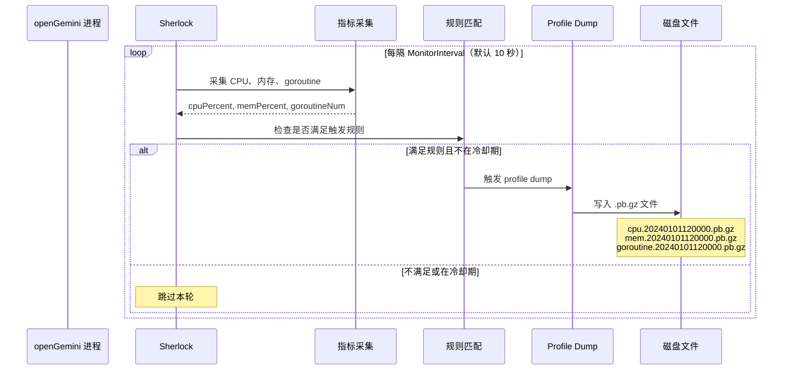
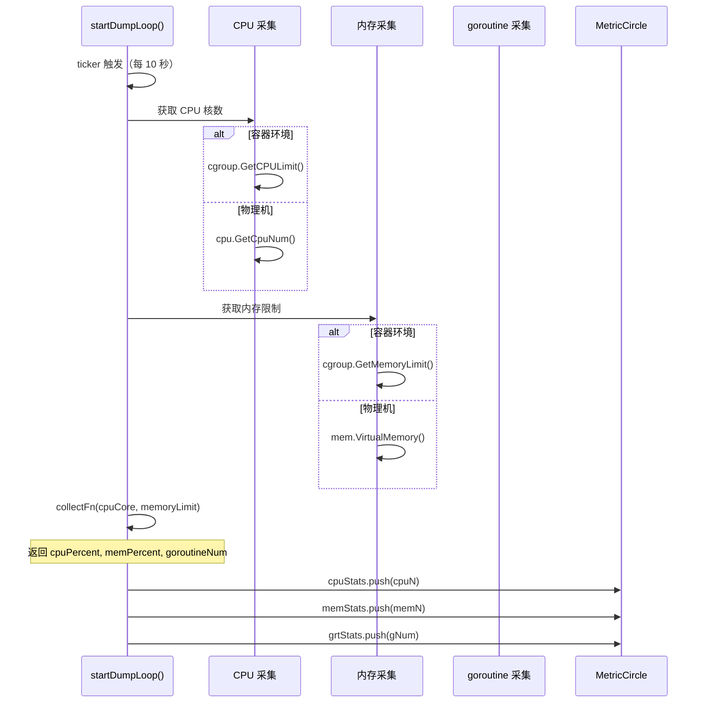
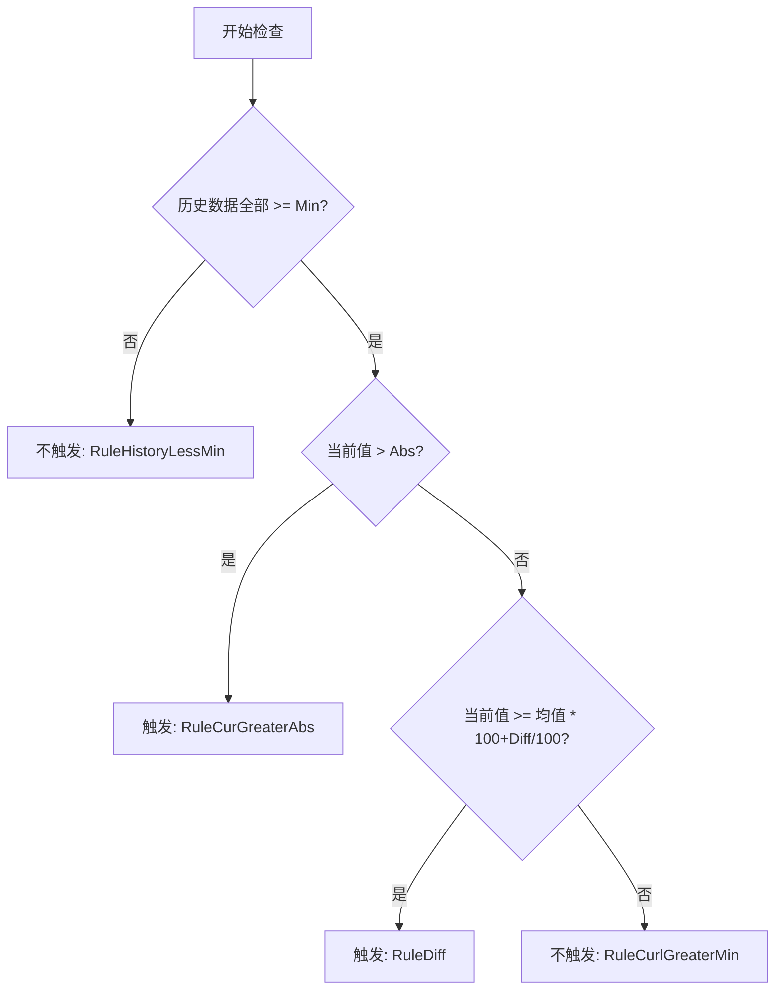
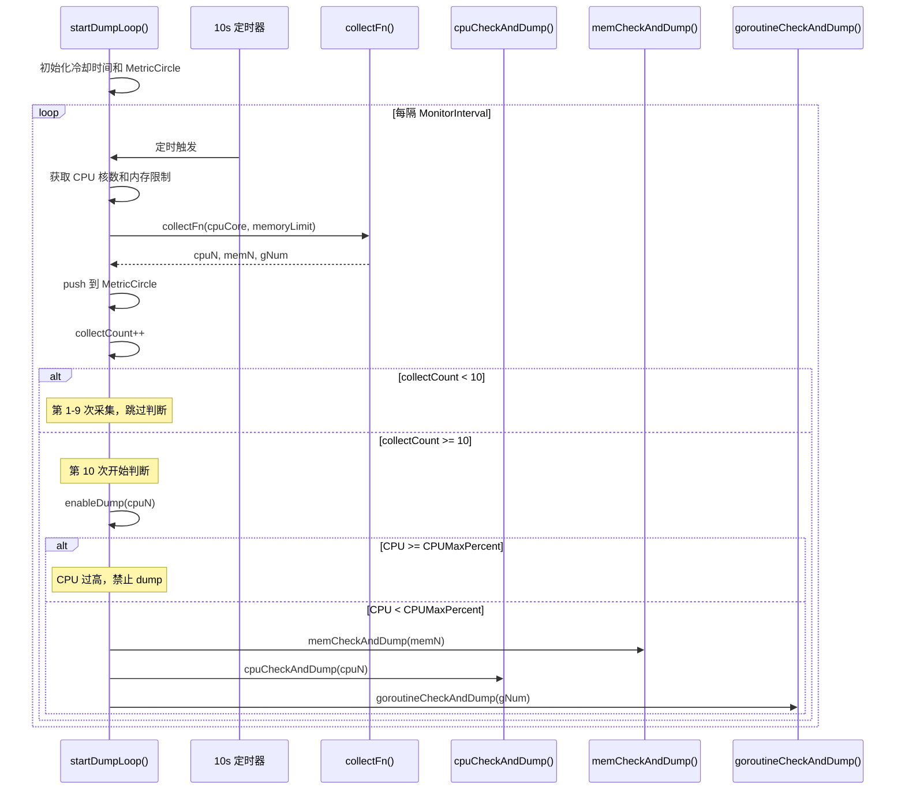
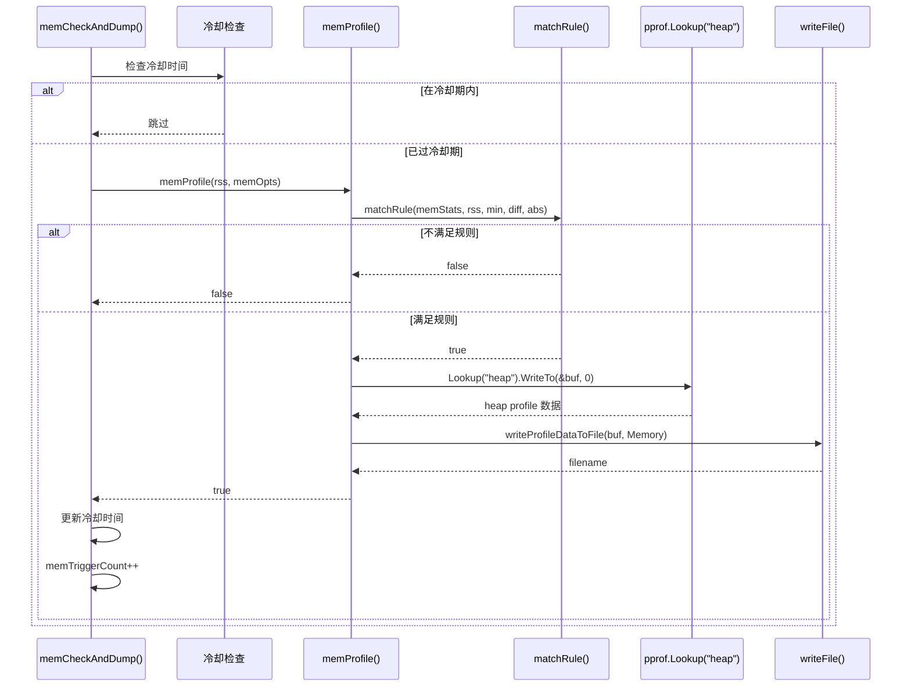
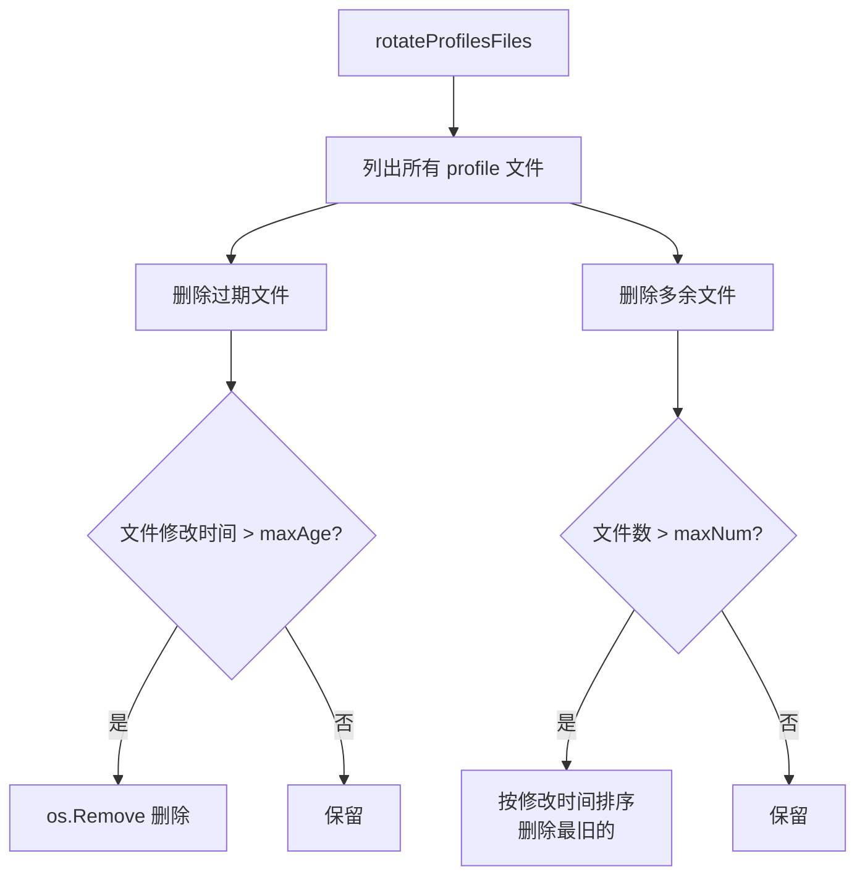
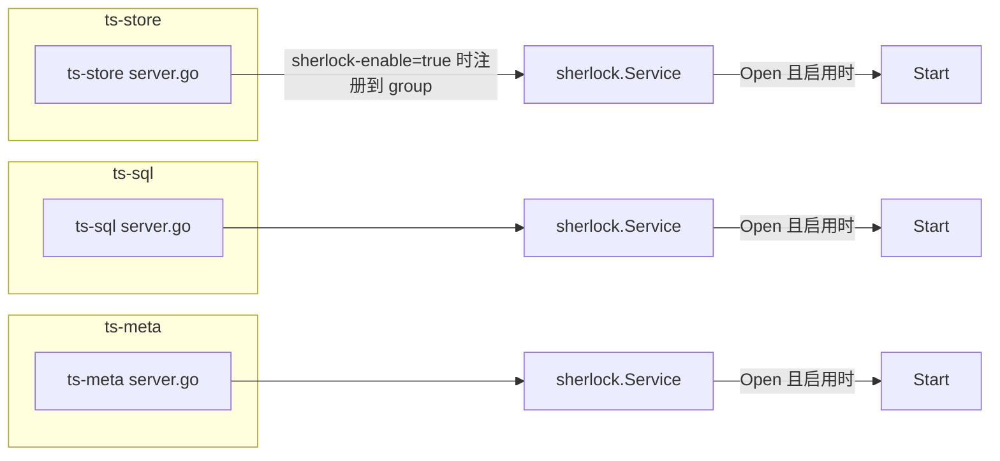
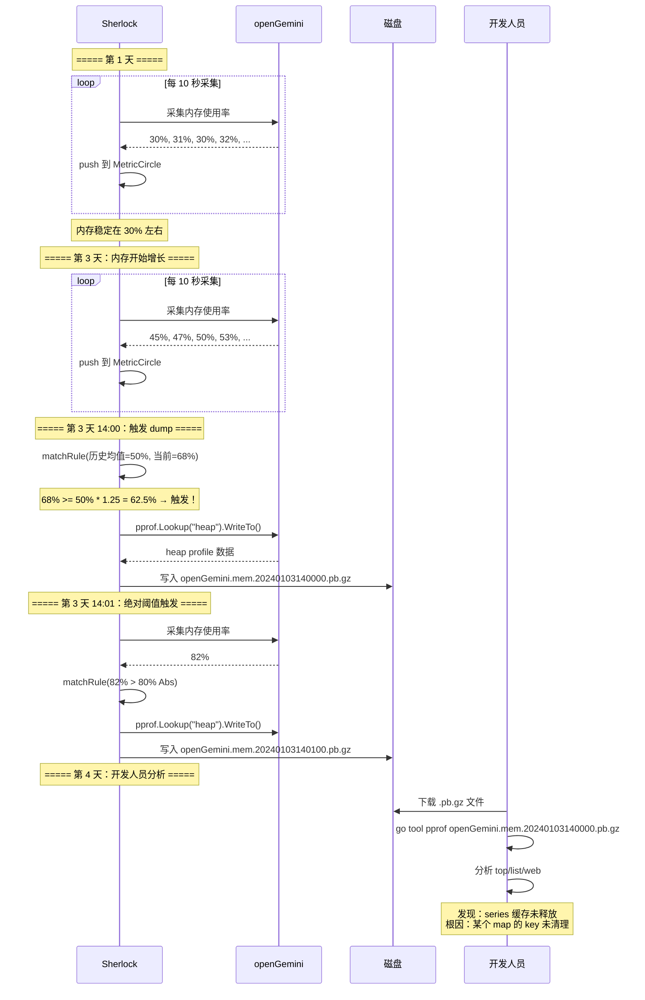

# Module 37: Sherlock 性能剖析器深度审计报告

> Sherlock 是 openGemini 内置的自动性能剖析（Profiling）模块。它默认关闭；只有配置 `sherlock-enable = true` 并启用具体 profile 类型后，才会持续监控 CPU 使用率、内存占用和 goroutine 数量，并在指标满足预设规则时自动 dump pprof 文件。

---

## 1. Sherlock 是什么？为什么需要它？



**通俗解释**：
Sherlock 就像一个"值班医生"，每隔 10 秒给数据库做一次体检：
- **量体温**：检查 CPU 使用率
- **称体重**：检查内存占用
- **数心跳**：检查 goroutine 数量

当某个指标异常时（比如内存突然飙升），Sherlock 会自动"拍照留证"——dump 一份 pprof 文件，记录当时的详细状态。这样即使半夜出了问题，第二天早上也能通过分析 pprof 文件找到原因。

**核心设计目标**：
1. **自动触发**：基于规则自动 dump，无需人工干预
2. **防抖机制**：冷却时间避免频繁 dump 影响性能
3. **预热保护**：前 9 次采集只记录，第 10 次采集开始判断
4. **文件轮转**：自动清理过期文件，防止磁盘写满
5. **容器感知**：自动检测容器环境，使用 cgroup 限制

---

## 2. Sherlock 结构体

### 2.1 核心结构

**代码位置**：`lib/sherlock/sherlock.go:30-54`

```go
type Sherlock struct {
    opts        *options     // 配置选项
    isContainer bool         // 是否在容器中运行

    // 统计信息
    collectCount    int      // 采集次数
    cpuTriggerCount int      // CPU dump 次数
    memTriggerCount int      // 内存 dump 次数
    grtTriggerCount int      // goroutine dump 次数

    // 冷却时间
    cpuCoolDownTime time.Time
    memCoolDownTime time.Time
    grtCoolDownTime time.Time

    // 指标环形缓冲区
    memStats *MetricCircle
    cpuStats *MetricCircle
    grtStats *MetricCircle

    // 指标采集函数（可替换，方便测试）
    collectFn func(cpuCore int, memoryLimit uint64) (int, int, int, error)

    stop chan struct{}  // 停止信号
    wg   sync.WaitGroup
}
```

### 2.2 创建与配置

**代码位置**：`lib/sherlock/sherlock.go:57-69`

```go
func New(opts ...Option) *Sherlock {
    sherlock := &Sherlock{
        opts:        newOptions(),
        collectFn:   collectMetrics,
        isContainer: isContainer(),
    }
    for _, opt := range opts {
        opt(sherlock.opts)
    }
    return sherlock
}
```

**使用示例**：

```go
s := sherlock.New(
    sherlock.WithMonitorInterval(10 * time.Second),
    sherlock.WithCPUMax(90),
    sherlock.WithSavePath("/tmp"),
    sherlock.WithCPURule(20, 25, 80, time.Minute),
    sherlock.WithMemRule(20, 25, 80, time.Minute),
    sherlock.WithGrtRule(3000, 20, 200000, 0, time.Minute*10),
)
s.EnableCPUDump()
s.EnableMemDump()
s.EnableGrtDump()
s.Start()
defer s.Stop()
```

---

## 3. 配置选项系统

### 3.1 全局选项

**代码位置**：`lib/sherlock/options.go:51-87`

```go
type options struct {
    logger *logger.Logger
    CPUMaxPercent int           // CPU 使用率上限，超过则禁止 dump
    *dumpOptions                // dump 文件配置
    MonitorInterval time.Duration // 监控间隔（默认 10 秒）
    memOpts *commonOption       // 内存规则
    cpuOpts *commonOption       // CPU 规则
    grtOpts *grtOptions         // goroutine 规则
}
```

**默认值**：

| 选项 | 默认值 | 说明 |
|------|--------|------|
| `sherlock-enable` | false | Sherlock 总开关，默认关闭 |
| `MonitorInterval` | 10s | 监控采集间隔 |
| `dumpPath` | openGemini 服务默认 `<openGeminiDir>/sherlock`；裸 `lib/sherlock` 未传 `WithSavePath` 时为 `/tmp` | dump 文件保存路径 |
| `maxNum` | 32 | 最大保留文件数 |
| `maxAge` | 7 天 | 文件最大保留天数 |

### 3.2 全局选项函数

| Option 函数 | 作用 |
|-------------|------|
| `WithMonitorInterval(d)` | 设置监控间隔 |
| `WithCPUMax(max)` | 设置 CPU 上限，超过则禁止 dump |
| `WithSavePath(path)` | 设置 dump 文件保存路径 |
| `WithMaxNum(n)` | 设置最大保留文件数 |
| `WithMaxAge(days)` | 设置文件最大保留天数 |
| `WithLogger(log)` | 设置日志记录器 |

### 3.3 触发规则选项

```go
type commonOption struct {
    Enable      bool          // 是否启用
    TriggerMin  int           // 最小触发阈值（百分比或绝对值）
    TriggerDiff int           // 相对增长百分比阈值
    TriggerAbs  int           // 绝对阈值
    CoolDown    time.Duration // 冷却时间
}
```

**CPU/内存规则**：

| Option 函数 | 参数 | 说明 |
|-------------|------|------|
| `WithCPURule(min, diff, abs, coolDown)` | min%, diff%, abs%, duration | CPU 触发规则 |
| `WithMemRule(min, diff, abs, coolDown)` | min%, diff%, abs%, duration | 内存触发规则 |
| `WithGrtRule(min, diff, abs, max, coolDown)` | min, diff%, abs, max, duration | goroutine 触发规则 |

**默认规则值**：

| 指标 | TriggerMin | TriggerDiff | TriggerAbs | CoolDown |
|------|-----------|-------------|------------|----------|
| CPU | 10% | 25% | 70% | 1 分钟 |
| 内存 | 10% | 25% | 80% | 1 分钟 |
| goroutine | 3000 | 20% | 200000 | 10 分钟 |

以上是规则阈值默认值；CPU、内存、goroutine 三类 dump 的 `enable` 默认都是 false。

---

## 4. 指标采集

### 4.1 采集流程



### 4.2 collectMetrics 函数

**代码位置**：`lib/sherlock/collect.go:21-30`

```go
func collectMetrics(cpuCore int, memoryLimit uint64) (int, int, int, error) {
    cpu, mem, gNum, err := getUsage()
    if err != nil {
        return 0, 0, 0, err
    }
    cpuPercent := cpu / float64(cpuCore)         // CPU 使用率 = 总使用率 / 核数
    memPercent := float64(mem) / float64(memoryLimit) * 100  // 内存使用率 = RSS / 限制
    return int(cpuPercent), int(memPercent), gNum, nil
}
```

**逐行解释**：
- **第 22 行**：`getUsage()` 获取原始的 CPU 使用率（可能是多核总和）、RSS 内存和 goroutine 数量
- **第 27 行**：CPU 使用率 = 总使用率 / CPU 核数，转换为单核百分比
- **第 28 行**：内存使用率 = RSS / 内存限制 * 100，转换为百分比

### 4.3 平台特定实现

**Linux/macOS/FreeBSD**（`lib/sherlock/sherlock_unix.go`）：

```go
func getUsage() (float64, uint64, int, error) {
    p, _ := process.NewProcess(int32(os.Getpid()))

    var cpuPercent float64
    if isContainer() {
        cpuUsage, _ := cgroup2.GetUsage(time.Second)
        cpuPercent = cpuUsage * 100  // 容器环境使用 cgroup 采集
    } else {
        cpuPercent, _ = p.Percent(time.Second)  // 物理机使用 gopsutil
    }

    mem, _ := p.MemoryInfo()
    rss := mem.RSS
    gNum := runtime.NumGoroutine()
    return cpuPercent, rss, gNum, nil
}
```

**其他平台**（`lib/sherlock/sherlock_other.go`）：

```go
func getUsage() (float64, uint64, int, error) {
    p, _ := process.NewProcess(int32(os.Getpid()))
    cpuPercent, _ := p.Percent(time.Second)
    mem, _ := p.MemoryInfo()
    rss := mem.RSS
    gNum := runtime.NumGoroutine()
    return cpuPercent, rss, gNum, nil
}
```

**容器检测**：

```go
func isContainer() bool {
    // 检查 /.dockerenv 文件
    _, err := os.Stat("/.dockerenv")
    if err == nil {
        return true
    }
    // 检查 /proc/1/cgroup 中的容器标识
    content, _ := os.ReadFile("/proc/1/cgroup")
    return containerRegexp.Match(content)
}
```

---

## 5. MetricCircle — 环形缓冲区

### 5.1 数据结构

**代码位置**：`lib/sherlock/circle.go:17-65`

```go
type MetricCircle struct {
    data    []int  // 数据缓冲区
    sum     int    // 当前总和（用于快速计算均值）
    dataIdx int    // 当前写入位置
    dataCap int    // 缓冲区容量
}
```

### 5.2 核心操作

```go
func (c *MetricCircle) push(dat int) {
    if c.dataCap == 0 {
        return
    }
    // 未满时：追加
    if len(c.data) < c.dataCap {
        c.sum += dat
        c.data = append(c.data, dat)
        return
    }
    // 已满时：覆盖最旧的数据，更新总和
    c.sum += dat - c.data[c.dataIdx]
    c.data[c.dataIdx] = dat
    c.dataIdx = (c.dataIdx + 1) % c.dataCap
}

func (c *MetricCircle) mean() int {
    if len(c.data) == 0 {
        return 0
    }
    return c.sum / len(c.data)
}
```

**通俗解释**：
MetricCircle 就像一个"环形记分板"：
- 容量固定（默认 10 个位置）
- 新数据来了，写入当前位置，覆盖最旧的数据
- `mean()` 计算最近 10 次的平均值
- `sum` 始终保持最新总和，计算均值时无需遍历

**具体例子**：

```
容量 = 3，数据流 = [10, 20, 30, 40, 50]

push(10): data=[10],       sum=10,  idx=0
push(20): data=[10,20],    sum=30,  idx=0
push(30): data=[10,20,30], sum=60,  idx=0  ← 满了

push(40): data=[40,20,30], sum=90,  idx=1  ← 覆盖 data[0]=10
push(50): data=[40,50,30], sum=120, idx=2  ← 覆盖 data[1]=20

mean() = 120 / 3 = 40  ← 最近 3 次的平均值
```

---

## 6. 规则匹配引擎

### 6.1 matchRule 函数

**代码位置**：`lib/sherlock/rule.go:26-43`

```go
func matchRule(history *MetricCircle, curVal, ruleMin, ruleDiff, ruleAbs int) (bool, RuleType) {
    // 规则 1: 历史数据必须全部 >= 最小阈值
    for i := range history.data {
        if history.data[i] < ruleMin {
            return false, RuleHistoryLessMin
        }
    }

    // 规则 2: 当前值超过绝对阈值
    if curVal > ruleAbs {
        return true, RuleCurGreaterAbs
    }

    // 规则 3: 当前值超过历史均值的 (100+diff)%
    mean := history.mean()
    if curVal >= mean*(100+ruleDiff)/100 {
        return true, RuleDiff
    }

    return false, RuleCurlGreaterMin
}
```

### 6.2 规则类型

```go
type RuleType uint8

const (
    RuleHistoryLessMin  RuleType = iota  // 历史数据低于最小阈值
    RuleCurlGreaterMin                    // 当前值高于最小阈值但未触发
    RuleCurGreaterAbs                     // 当前值超过绝对阈值
    RuleDiff                              // 当前值超过相对增长阈值
)
```

### 6.3 触发条件详解



**通俗解释**：
规则匹配就像"报警器"，有两个触发条件（满足任一即触发）：

**条件 1：绝对阈值**
- 当前值 > 绝对阈值 → 立即报警
- 例：内存使用率 > 80% → dump 内存 profile

**条件 2：相对增长**
- 前提：最近 10 次采样全部 >= 最小阈值（排除启动初期的噪声）
- 当前值 >= 历史均值 * (100 + diff) / 100 → 报警
- 例：CPU 使用率 >= 历史均值的 125% → dump CPU profile

**具体例子**：

```
配置：WithMemRule(10, 25, 80, time.Minute)
含义：Min=10%, Diff=25%, Abs=80%

场景 1：启动初期
  历史数据 = [2, 3, 5, 4, 3, 2, 4, 3, 5, 4]
  当前值 = 15%
  → 检查：历史数据不全部 >= 10%（有 2, 3, 5...）
  → 结果：不触发（RuleHistoryLessMin）

场景 2：正常运行，小幅波动
  历史数据 = [30, 32, 31, 33, 30, 32, 31, 33, 30, 32]
  当前值 = 35%
  → 检查：历史数据全部 >= 10% ✓
  → 当前值 35% < 80%（Abs）
  → 均值 = 31.4，阈值 = 31.4 * 1.25 = 39.25
  → 当前值 35% < 39.25%
  → 结果：不触发（RuleCurlGreaterMin）

场景 3：内存飙升
  历史数据 = [30, 32, 31, 33, 30, 32, 31, 33, 30, 32]
  当前值 = 85%
  → 检查：历史数据全部 >= 10% ✓
  → 当前值 85% > 80%（Abs）
  → 结果：触发（RuleCurGreaterAbs）→ dump 内存 profile

场景 4：内存持续增长
  历史数据 = [50, 52, 51, 53, 50, 52, 51, 53, 50, 52]
  当前值 = 68%
  → 检查：历史数据全部 >= 10% ✓
  → 当前值 68% < 80%（Abs）
  → 均值 = 51.4，阈值 = 51.4 * 1.25 = 64.25
  → 当前值 68% >= 64.25%
  → 结果：触发（RuleDiff）→ dump 内存 profile
```

---

## 7. 主循环 — startDumpLoop

### 7.1 主循环流程



**核心代码**：`lib/sherlock/sherlock.go:125-196`

```go
func (s *Sherlock) startDumpLoop() {
    defer s.wg.Done()

    // 初始化冷却时间
    now := time.Now()
    s.cpuCoolDownTime = now
    s.memCoolDownTime = now
    s.grtCoolDownTime = now

    // 初始化 MetricCircle（容量 = minMetricsBeforeDump = 10）
    s.cpuStats = newMetricCircle(minMetricsBeforeDump)
    s.memStats = newMetricCircle(minMetricsBeforeDump)
    s.grtStats = newMetricCircle(minMetricsBeforeDump)

    // 主循环
    ticker := time.NewTicker(s.opts.MonitorInterval)
    defer ticker.Stop()
    for {
        select {
        case <-s.stop:
            return
        case <-ticker.C:
        }

        // 获取 CPU 核数和内存限制
        cpuCore, memoryLimit := s.getSystemResources()

        // 采集指标
        cpuN, memN, gNum, err := s.collectFn(cpuCore, memoryLimit)
        if err != nil {
            continue
        }

        // 推送到环形缓冲区
        s.cpuStats.push(cpuN)
        s.memStats.push(memN)
        s.grtStats.push(gNum)

        s.collectCount++
        if s.collectCount < minMetricsBeforeDump {
            continue  // 第 1-9 次采集跳过；第 10 次开始判断
        }

        // CPU 过高则禁止 dump
        if err = s.enableDump(cpuN); err != nil {
            continue
        }

        // 检查并 dump
        s.memCheckAndDump(memN)
        s.cpuCheckAndDump(cpuN)
        s.goroutineCheckAndDump(gNum)
    }
}
```

**通俗解释**：
主循环就像"值班护士"的工作流程：
1. **每 10 秒巡视一次**：检查 CPU、内存、goroutine
2. **记录数据**：推送到环形缓冲区
3. **预热期**：前 9 次只记录不判断，第 10 次开始判断（排除启动噪声）
4. **CPU 保护**：如果 CPU 超过配置的 `CPUMaxPercent`，不做 dump（避免雪上加霜）；openGemini 默认 `CPUMaxPercent=0`，表示该保护不生效
5. **逐项检查**：内存 → CPU → goroutine，满足规则就 dump

---

## 8. 内存 Profile Dump

### 8.1 内存检查与 Dump



**核心代码**：`lib/sherlock/sherlock.go:199-238`

```go
func (s *Sherlock) memCheckAndDump(mem int) {
    memOpts := s.opts.GetMemOpts()
    if !memOpts.Enable {
        return
    }
    // 冷却检查
    if s.memCoolDownTime.After(time.Now()) {
        return
    }
    // 规则匹配
    if triggered := s.memProfile(mem, memOpts); triggered {
        s.memCoolDownTime = time.Now().Add(memOpts.CoolDown)
        s.memTriggerCount++
    }
}

func (s *Sherlock) memProfile(rss int, c commonOption) bool {
    match, _ := matchRule(s.memStats, rss, c.TriggerMin, c.TriggerDiff, c.TriggerAbs)
    if !match {
        return false
    }
    var buf bytes.Buffer
    err := pprof.Lookup("heap").WriteTo(&buf, 0)  // dump heap profile
    if err != nil {
        return false
    }
    s.writeProfileDataToFile(buf, Memory)
    return true
}
```

**逐行解释**：
- **第 201 行**：获取内存规则配置的副本
- **第 205 行**：冷却检查，避免频繁 dump
- **第 210 行**：`memProfile` 执行规则匹配和 dump
- **第 211 行**：触发后更新冷却时间
- **第 218 行**：`matchRule` 检查是否满足触发条件
- **第 224 行**：`pprof.Lookup("heap")` 获取 heap profile
- **第 228 行**：写入文件

---

## 9. CPU Profile Dump

### 9.1 CPU 检查与 Dump

**核心代码**：`lib/sherlock/sherlock.go:243-291`

```go
func (s *Sherlock) cpuCheckAndDump(cpu int) {
    cpuOpts := s.opts.GetCPUOpts()
    if !cpuOpts.Enable {
        return
    }
    if s.cpuCoolDownTime.After(time.Now()) {
        return
    }
    if triggered := s.cpuProfile(cpu, cpuOpts); triggered {
        s.cpuCoolDownTime = time.Now().Add(cpuOpts.CoolDown)
        s.cpuTriggerCount++
    }
}

func (s *Sherlock) cpuProfile(curCPUUsage int, c commonOption) bool {
    match, _ := matchRule(s.cpuStats, curCPUUsage, c.TriggerMin, c.TriggerDiff, c.TriggerAbs)
    if !match {
        return false
    }

    bf, filename, err := createAndGetFileInfo(s.opts.dumpOptions, CPU)
    if err != nil {
        return false
    }
    defer bf.Close()

    err = pprof.StartCPUProfile(bf)  // 开始 CPU 采样
    if err != nil {
        return false
    }
    time.Sleep(defaultCPUSamplingTime)  // 采样 10 秒
    pprof.StopCPUProfile()
    return true
}
```

**逐行解释**：
- **第 274 行**：`createAndGetFileInfo` 创建 dump 文件
- **第 281 行**：`pprof.StartCPUProfile(bf)` 开始 CPU 采样，写入文件
- **第 287 行**：`time.Sleep(defaultCPUSamplingTime)` 采样 10 秒
- **第 288 行**：`pprof.StopCPUProfile()` 停止采样

**注意**：CPU dump 与内存/goroutine dump 不同：
- 内存/goroutine dump 是瞬间快照
- CPU dump 需要持续采样 10 秒，记录这 10 秒内的 CPU 使用情况

---

## 10. Goroutine Profile Dump

### 10.1 Goroutine 检查与 Dump

**核心代码**：`lib/sherlock/sherlock.go:296-339`

```go
func (s *Sherlock) goroutineProfile(gNum int, c grtOptions) bool {
    match, _ := matchRule(s.grtStats, gNum, c.TriggerMin, c.TriggerDiff, c.TriggerAbs)
    // 安全保护：goroutine 数量过大时禁止 dump
    if c.GoroutineTriggerMaxNum > 0 && gNum >= c.GoroutineTriggerMaxNum {
        match = false
    }
    if !match {
        return false
    }

    var buf bytes.Buffer
    err := pprof.Lookup("goroutine").WriteTo(&buf, 0)  // dump goroutine profile
    if err != nil {
        return false
    }
    s.writeProfileDataToFile(buf, Goroutine)
    return true
}
```

**逐行解释**：
- **第 316-319 行**：安全保护 — 如果 goroutine 数量超过 `GoroutineTriggerMaxNum`，禁止 dump
- **第 331 行**：`pprof.Lookup("goroutine")` 获取所有 goroutine 的堆栈信息

**为什么要 GoroutineTriggerMaxNum？**
- goroutine 数量非常大时（如 100 万），dump 操作本身会消耗大量 CPU 和内存
- 可能导致 STW（Stop The World），拖垮整个应用
- 所以设置一个上限，超过就不 dump

---

## 11. Dump 文件管理

### 11.1 文件命名规则

**代码位置**：`lib/sherlock/report.go:63-66`

```go
func formatFilename(filePath string, dumpType configureType, pName string) string {
    suffix := time.Now().Format("20060102150405.000") + profileSuffix
    return path.Join(filePath, fmt.Sprintf("%s.%s.%s", pName, dumpType.string(), suffix))
}
```

**文件名格式**：

```
格式：{进程名}.{类型}.{时间戳}.pb.gz

示例：
  openGemini.cpu.20240101120000.123.pb.gz
  openGemini.mem.20240101120000.456.pb.gz
  openGemini.goroutine.20240101120000.789.pb.gz
```

### 11.2 文件轮转

**代码位置**：`lib/sherlock/profiles.go:26-44`

```go
func rotateProfilesFiles(directory string, dumpType configureType, maxNum int, maxAge time.Duration) error {
    files, err := listProfileFiles(directory, dumpType)
    if err != nil {
        return err
    }
    // 删除过期文件
    err = deleteOldProfileFiles(files, directory, maxAge)
    if err != nil {
        return err
    }
    // 删除多余文件
    err = deleteRedundantProfileFiles(files, directory, maxNum)
    return err
}
```

### 11.3 文件清理策略



**核心代码**：`lib/sherlock/profiles.go:78-103`

```go
func deleteOldProfileFiles(files []os.FileInfo, directory string, maxAge time.Duration) error {
    currentTime := time.Now()
    for _, file := range files {
        if currentTime.Sub(file.ModTime()) > maxAge {
            filePath := filepath.Join(directory, file.Name())
            _ = os.Remove(filePath)
        }
    }
    return nil
}

func deleteRedundantProfileFiles(files []os.FileInfo, directory string, maxNum int) error {
    if len(files) > maxNum {
        sort.Sort(byModTime(files))
        filesToDelete := files[:len(files)-maxNum]
        for _, file := range filesToDelete {
            filePath := filepath.Join(directory, file.Name())
            _ = os.Remove(filePath)
        }
    }
    return nil
}
```

**具体例子**：

```
配置：maxNum=5, maxAge=7天

当前文件列表（按修改时间排序）：
  1. openGemini.cpu.20231220120000.pb.gz  ← 12天前，过期
  2. openGemini.cpu.20231225120000.pb.gz  ← 7天前，过期
  3. openGemini.cpu.20231227120000.pb.gz  ← 5天前
  4. openGemini.cpu.20231229120000.pb.gz  ← 3天前
  5. openGemini.cpu.20231230120000.pb.gz  ← 2天前
  6. openGemini.cpu.20231231120000.pb.gz  ← 1天前
  7. openGemini.mem.20231231120000.pb.gz  ← 1天前
  8. openGemini.mem.20231231180000.pb.gz  ← 6小时前

清理过程：
  步骤 1: 删除过期文件（>7天）
    → 删除 #1, #2

  步骤 2: 删除多余文件（>5个）
    → 剩余 6 个 CPU 文件 + 2 个 Mem 文件
    → CPU 文件数 6 > 5，删除最旧的 #3
    → Mem 文件数 2 <= 5，不删除

最终结果：
  openGemini.cpu.20231229120000.pb.gz
  openGemini.cpu.20231230120000.pb.gz
  openGemini.cpu.20231231120000.pb.gz
  openGemini.mem.20231231120000.pb.gz
  openGemini.mem.20231231180000.pb.gz
```

---

## 12. 启用/禁用控制

### 12.1 运行时控制

**代码位置**：`lib/sherlock/sherlock.go:79-106`

```go
func (s *Sherlock) EnableCPUDump()  { s.opts.cpuOpts.Enable = true }
func (s *Sherlock) DisableCPUDump() { s.opts.cpuOpts.Enable = false }

func (s *Sherlock) EnableMemDump()  { s.opts.memOpts.Enable = true }
func (s *Sherlock) DisableMemDump() { s.opts.memOpts.Enable = false }

func (s *Sherlock) EnableGrtDump()  { s.opts.grtOpts.Enable = true }
func (s *Sherlock) DisableGrtDump() { s.opts.grtOpts.Enable = false }
```

### 12.2 CPUMaxPercent 保护

```go
func (s *Sherlock) enableDump(cpuUsed int) (err error) {
    if s.opts.CPUMaxPercent != 0 && cpuUsed >= s.opts.CPUMaxPercent {
        return fmt.Errorf("current cpu used percent [%v] is greater than the CPUMaxPercent [%v]",
            cpuUsed, s.opts.CPUMaxPercent)
    }
    return nil
}
```

**通俗解释**：
CPUMaxPercent 就像"安全阀"：
- 当 CPU 使用率已经超过配置的 `CPUMaxPercent` 时，dump 操作本身会消耗更多 CPU
- 可能导致系统雪崩
- 所以当 CPU 超过阈值时，禁止所有 dump 操作；默认值为 0 时，`enableDump` 的 `CPUMaxPercent != 0` 条件不成立，该保护不会触发

---

## 13. 在 openGemini 中的集成

### 13.1 各组件启动 Sherlock



**代码位置**：`app/ts-store/run/server.go`, `app/ts-sql/sql/server.go`, `app/ts-meta/run/server.go`

当前集成不是“每个组件无条件启动”。`sherlock-enable` 默认为 false：
- ts-store：只有 `s.config.Sherlock.SherlockEnable` 为 true 时，才创建 `sherlock.NewService(...)` 并注册到 service group。
- ts-sql / ts-meta：会创建 service 对象，但 `services/sherlock.Service.Open()` 只有在 `SherlockEnable` 为 true 时才调用底层 `Start()`。
- `Service.Stop()` 同样受 `SherlockEnable` 分支影响。

### 13.2 当前实现注意点

`services/sherlock/service.go` 中启用 goroutine dump 的分支当前写成了：

```go
if c.MemoryConfig.Enable {
    s.EnableGrtDump()
}
```

也就是说 goroutine dump 当前实际受 `MemoryConfig.Enable` 影响，而不是 `GoroutineConfig.Enable`。这应标为当前实现限制/疑似 bug：即使配置了 goroutine enable，只要 memory enable 为 false，goroutine dump 也可能没有启用。

---

## 14. 端到端实战：一次完整的性能问题诊断

### 14.1 场景：内存泄漏排查



### 14.2 分析 Profile 文件

```bash
# 下载 dump 文件
scp server:/tmp/openGemini.mem.20240103140000.pb.gz ./

# 分析内存 profile
go tool pprof openGemini.mem.20240103140000.pb.gz

# 查看 top 热点
(pprof) top
Showing nodes accounting for 800MB, 95% of 1000MB total
      flat  flat%   sum%        cum   cum%
     500MB 50.00% 50.00%      500MB 50.00%  engine/immutable.(*SeriesCache).Add
     200MB 20.00% 70.00%      200MB 20.00%  runtime.mallocgc
     100MB 10.00% 80.00%      100MB 10.00%  encoding/json.Unmarshal

# 查看具体函数
(pprof) list SeriesCache.Add
Total: 1000MB
ROUTINE ======================== engine/immutable.(*SeriesCache).Add
     500MB      500MB (flat, cum) 50.00% of Total
         .          .     42:func (c *SeriesCache) Add(key uint64, data []byte) {
     500MB      500MB     43:    c.data[key] = data  // 这里分配了 500MB
         .          .     44:}
```

---

## 15. 潜在隐患

### 15.1 CPU Dump 阻塞主循环

```go
func (s *Sherlock) cpuProfile(curCPUUsage int, c commonOption) bool {
    // ...
    pprof.StartCPUProfile(bf)
    time.Sleep(defaultCPUSamplingTime)  // 阻塞 10 秒！
    pprof.StopCPUProfile()
    // ...
}
```

**隐患**：
- CPU dump 需要 `time.Sleep(10s)`，期间主循环被阻塞
- 无法采集其他指标（内存、goroutine）
- 建议：在单独的 goroutine 中执行 CPU dump

### 15.2 冷却时间检查非原子

```go
if s.memCoolDownTime.After(time.Now()) {
    return
}
// ... 执行 dump ...
s.memCoolDownTime = time.Now().Add(memOpts.CoolDown)
```

**隐患**：
- 如果主循环在多个 goroutine 中运行（虽然当前是单 goroutine），可能出现竞态
- 当前实现是安全的（单 goroutine），但扩展性受限

### 15.3 文件轮转不完整

```go
func rotateProfilesFiles(directory string, dumpType configureType, maxNum int, maxAge time.Duration) error {
    files, err := listProfileFiles(directory, dumpType)
    // ...
    err = deleteOldProfileFiles(files, directory, maxAge)
    // ...
    err = deleteRedundantProfileFiles(files, directory, maxNum)
    // ...
}
```

**隐患**：
- `listProfileFiles` 只列出匹配特定 glob 模式的文件
- 如果文件名格式变化，旧文件可能不会被清理
- 建议：添加更通用的清理策略

### 15.4 容器环境检测不可靠

```go
func isContainer() bool {
    _, err := os.Stat("/.dockerenv")
    if err == nil {
        return true
    }
    content, _ := os.ReadFile("/proc/1/cgroup")
    return containerRegexp.Match(content)
}
```

**隐患**：
- 非 Docker 容器（如 Podman）可能没有 `/.dockerenv`
- cgroup 格式可能因 Kubernetes 版本而异
- 建议：添加更多检测方式

---

## 16. 总结：Sherlock 的关键设计

| 设计 | 目的 | 效果 |
|------|------|------|
| 环形缓冲区 | 保存历史指标 | 快速计算均值，O(1) 空间 |
| 双重触发规则 | 灵活的触发条件 | 绝对阈值 + 相对增长 |
| 预热保护 | 排除启动噪声 | 前 9 次只记录不判断，第 10 次开始判断 |
| 冷却时间 | 避免频繁 dump | 每种类型独立冷却 |
| CPUMaxPercent | 防止雪崩 | CPU 过高时禁止 dump |
| GoroutineMaxNum | 防止 STW | goroutine 过多时禁止 dump |
| 文件轮转 | 防止磁盘写满 | 按数量和天数清理 |
| 容器感知 | 适应不同环境 | 自动使用 cgroup 限制 |
| 可替换采集函数 | 方便测试 | 不依赖真实系统指标 |
| Functional Options | 灵活配置 | 支持运行时调整 |
