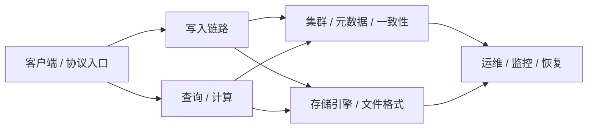

# openGemini 核心模块规格文档总览

这个目录面向开发者，用来从代码实现角度理解 openGemini 的核心架构、关键流程和模块边界。建议不要按文件编号机械阅读，而是按下面的系统路径进入：

## 推荐阅读路径

1. 先读 [01 写入引擎](01_write_engine_spec.md)、[13 TSSP 文件格式](13_tssp_file_format_spec.md)、[03 查询引擎](03_query_engine_spec.md)，建立单机读写主链路。
2. 再读 [06 集群通信](06_cluster_routing_spec.md)、[07 状态机](07_state_machine_spec.md)、[15 分区 Raft 共识](15_raft_partition_consensus_spec.md)，理解分布式执行边界。
3. 然后按工作需要进入协议、列存、流计算、降采样、监控恢复等专题。

## 1. 写入、存储与数据生命周期

这一组文档解释数据从 HTTP 写入、WAL/MemTable、索引构建、TSSP/列存文件、Compaction 到 Retention 清理的完整生命周期。阅读这组可以回答：数据写入后在哪里排队、如何落盘、如何组织索引、何时合并、何时被删除。

| 文件 | 用途 |
| --- | --- |
| [01_write_engine_spec.md](01_write_engine_spec.md) | 写入主链路总览，覆盖 HTTP write、line protocol 解析、shard 路由、WAL、MemTable、flush 和写入索引边界。 |
| [02_index_system_spec.md](02_index_system_spec.md) | 索引系统说明，覆盖 tag/series 索引、MergeSet、索引构建与查询过滤关系。 |
| [04_background_tasks_spec.md](04_background_tasks_spec.md) | 后台任务体系，解释 compaction、merge、out-of-order 处理、scheduler 等异步任务如何运行。 |
| [05_downsampling_spec.md](05_downsampling_spec.md) | 降采样生命周期，说明降采样规则、任务恢复、写入目标和策略执行边界。 |
| [11_column_store_spec.md](11_column_store_spec.md) | 列存存储引擎总览，覆盖列存写入、主键/稀疏索引、detached storage 和列存读取基础。 |
| [13_tssp_file_format_spec.md](13_tssp_file_format_spec.md) | TSSP 文件格式，解释 data block、chunk/meta index、trailer、bloom、reader/writer 和查询定位。 |
| [14_compaction_strategy_spec.md](14_compaction_strategy_spec.md) | Compaction 策略，说明 full/level compaction、任务选择、恢复语义和资源限制。 |
| [16_shelf_wal_spec.md](16_shelf_wal_spec.md) | Shelf WAL 机制，说明可查询 WAL、Processor、SeriesKeyOffsets、IndexBuilder 和可靠性边界。 |
| [17_shardkey_sparse_index_spec.md](17_shardkey_sparse_index_spec.md) | ShardKey 与稀疏索引，解释按 shard key 路由、sidecar 索引文件和列存裁剪。 |
| [18_retention_policy_spec.md](18_retention_policy_spec.md) | 保留策略，覆盖 shard/index retention、measurement TTL、LogKeeper 分支和物理删除流程。 |
| [29_fileops_abstraction_spec.md](29_fileops_abstraction_spec.md) | 文件操作抽象层，解释本地/对象存储文件 API、锁、Remove/Rename/Read 等底层 I/O 边界。 |

## 2. 查询、计算与分析能力

这一组文档解释从 SQL/PromQL 进入查询引擎，到逻辑计划、DAG、算子执行、缓存、下推、预聚合、列存读取和异常检测的完整路径。阅读这组可以回答：查询如何规划、如何分布式执行、哪些计算能下推或复用、列存如何裁剪数据。

| 文件 | 用途 |
| --- | --- |
| [03_query_engine_spec.md](03_query_engine_spec.md) | 查询引擎主文档，覆盖 SQL 解析、逻辑计划、DAG 构建、executor、remote query 和结果输出。 |
| [08_promql_compatibility_spec.md](08_promql_compatibility_spec.md) | PromQL 兼容层，解释 PromQL AST 转译、range query、rate 语义、HTTP handler 和兼容限制。 |
| [09_udaf_operator_spec.md](09_udaf_operator_spec.md) | UDAF 与算子框架，说明 aggregate operator、iterator、processor、min/max/count/sum 等算子实现。 |
| [10_stream_processing_spec.md](10_stream_processing_spec.md) | 流计算，覆盖 stream coordinator、ts-store stream task、TaskDataPool/cache 和流任务执行边界。 |
| [19_column_store_query_spec.md](19_column_store_query_spec.md) | 列存查询路径，解释 sparse index scan、fragment ranges、Location.Contains、segment 映射和 reader 执行。 |
| [23_query_cache_spec.md](23_query_cache_spec.md) | 查询缓存，说明 `ResultsCache.Do`、cache key、memory cache factory 和当前实现限制。 |
| [24_coprocessor_pushdown_spec.md](24_coprocessor_pushdown_spec.md) | Coprocessor/计算下推，解释下推条件、算子边界、storage scan 与计算层职责划分。 |
| [25_pre_aggregation_spec.md](25_pre_aggregation_spec.md) | 预聚合，说明可预聚合条件、rewrite、聚合复用和不能命中的场景。 |
| [26_parquet_export_spec.md](26_parquet_export_spec.md) | Parquet 导出，覆盖 `[data.parquet-task]` 配置、导出任务、merge/compact 影响和文件生成路径。 |
| [27_castor_anomaly_detection_spec.md](27_castor_anomaly_detection_spec.md) | Castor 异常检测，说明 `castor`/`castor_ad` SQL 用法、模型调用、输出字段和边界条件。 |

## 3. 集群、元数据与一致性

这一组文档解释 openGemini 的分布式控制面和数据面：节点通信、元数据客户端、Raft 状态机、分区迁移、netstorage/msgservice/raftconn 等。阅读这组可以回答：请求如何路由到目标节点、元数据如何变更、分区如何迁移、Raft 消息如何发送。

| 文件 | 用途 |
| --- | --- |
| [06_cluster_routing_spec.md](06_cluster_routing_spec.md) | 集群路由与通信总览，区分业务 RPC/SPDY、ts-meta Raft transport、ts-store partition Raft 和 request sequence 语义。 |
| [07_state_machine_spec.md](07_state_machine_spec.md) | Raft/meta 状态机，解释 command apply、snapshot、storeFSM、op map 和元数据变更流程。 |
| [12_cluster_migration_spec.md](12_cluster_migration_spec.md) | 集群迁移与 rebalance，覆盖 MoveAssign/MovePreOffload/MoveOffload 等状态、失败重试和恢复。 |
| [15_raft_partition_consensus_spec.md](15_raft_partition_consensus_spec.md) | 分区级 Raft 共识，说明 partition raft store、send、cleanup、leader/follower 和错误处理边界。 |
| [28_spdy_transport_spec.md](28_spdy_transport_spec.md) | SPDY 网络传输，解释 ConnID、session、data ack、multiplexing、背压和协议包结构。 |
| [30_metaclient_spec.md](30_metaclient_spec.md) | Metadata Client，说明 meta client 的 retry、V1/V2 执行差异、snapshot 获取和超时控制。 |
| [31_netstorage_spec.md](31_netstorage_spec.md) | netstorage 网络存储层，解释远程存储请求、Requester、transport 默认超时和 store 侧处理。 |
| [32_msgservice_spec.md](32_msgservice_spec.md) | msgservice 服务消息总线，说明 BaseMessage、codec、message type 分发和服务间消息处理。 |
| [33_raftconn_spec.md](33_raftconn_spec.md) | Raft connection manager，说明 RaftConn、节点活性判断、send skip 语义和连接管理。 |

## 4. 协议接入与生态集成

这一组文档解释 openGemini 对外兼容或集成的协议层。阅读这组可以回答：外部系统如何把数据写入或查询 openGemini，协议兼容到什么程度，哪些客户端能力不能假设可用。

| 文件 | 用途 |
| --- | --- |
| [20_kafka_protocol_spec.md](20_kafka_protocol_spec.md) | Kafka 协议兼容层，说明 Metadata/Fetch/HeartBeat、topic-as-SQL、consumer group 限制和低阶 Fetch 用法。 |
| [21_opentelemetry_spec.md](21_opentelemetry_spec.md) | OpenTelemetry 集成，说明 OTLP metrics 写入、Gauge/Sum/Histogram/Summary 映射、tag 和 field 生成。 |
| [22_arrow_flight_spec.md](22_arrow_flight_spec.md) | Arrow Flight 协议，说明 `flight-enabled`、auth token、ticket query、Flight SQL 和 handler 分支。 |

## 5. 运维、监控、恢复与运行时控制

这一组文档解释系统运行后的可观测、恢复、控制和诊断能力。阅读这组可以回答：如何看监控、如何恢复数据、如何动态调整节点行为、如何抓取性能剖析文件。

| 文件 | 用途 |
| --- | --- |
| [34_monitoring_spec.md](34_monitoring_spec.md) | Monitoring service，说明内部指标采集、handler、metrics 输出和服务运行方式。 |
| [35_recovery_tool_spec.md](35_recovery_tool_spec.md) | `ts-recover` 数据恢复工具，说明全量/增量/强制恢复、命令参数和恢复流程。 |
| [36_system_control_spec.md](36_system_control_spec.md) | syscontrol 系统控制，说明禁写/只读/并行度/内存限制/compaction 开关/备份控制等运行时命令。 |
| [37_sherlock_profiler_spec.md](37_sherlock_profiler_spec.md) | Sherlock 性能剖析器，说明内存/CPU/goroutine/profile dump、阈值触发和 pprof 分析入口。 |

## 端到端链路索引

下面这些链路可以帮助把单个模块串成整体架构：

| 想理解的问题 | 阅读链路 |
| --- | --- |
| 一条 line protocol 数据如何写入并落盘？ | [01 写入引擎](01_write_engine_spec.md) -> [16 Shelf WAL](16_shelf_wal_spec.md) -> [13 TSSP](13_tssp_file_format_spec.md) -> [14 Compaction](14_compaction_strategy_spec.md) |
| 一个查询如何从 SQL 变成分布式执行？ | [03 查询引擎](03_query_engine_spec.md) -> [06 集群路由](06_cluster_routing_spec.md) -> [31 netstorage](31_netstorage_spec.md) -> [23 查询缓存](23_query_cache_spec.md) |
| 列存如何写入、索引和查询？ | [11 列存](11_column_store_spec.md) -> [17 ShardKey/Sparse Index](17_shardkey_sparse_index_spec.md) -> [19 列存查询](19_column_store_query_spec.md) |
| 集群元数据如何驱动迁移和一致性？ | [30 MetaClient](30_metaclient_spec.md) -> [07 状态机](07_state_machine_spec.md) -> [12 迁移](12_cluster_migration_spec.md) -> [15 分区 Raft](15_raft_partition_consensus_spec.md) |
| 外部生态如何接入 openGemini？ | [20 Kafka](20_kafka_protocol_spec.md) -> [21 OpenTelemetry](21_opentelemetry_spec.md) -> [22 Arrow Flight](22_arrow_flight_spec.md) |
| 线上问题如何定位和恢复？ | [34 监控](34_monitoring_spec.md) -> [36 系统控制](36_system_control_spec.md) -> [37 Sherlock](37_sherlock_profiler_spec.md) -> [35 ts-recover](35_recovery_tool_spec.md) |

