# openGemini Architecture Specification

## 1. Project Overview

**Purpose:** openGemini is a cloud-native distributed time series database (TSDB) optimized for massive telemetry data storage and analysis, designed as a CNCF sandbox project.

**Core Capabilities:**
- Distributed MPP (Massively Parallel Processing) architecture for horizontal scalability
- High cardinality time series storage with specialized index engine (TSI/FHI)
- Column-oriented storage with LSM-based storage techniques (TSM files)
- Data compression (up to 15:1 ratio) using columnar format
- Compatible with InfluxDB v1.x Line Protocol, InfluxQL, and Prometheus remote read/write APIs
- Hierarchical storage tiering (hot/warm/cold)
- Built-in downsample and data retention policies
- Continuous queries and stream processing
- Single-node and distributed cluster deployment

---

## 2. System Architecture

**High-Level Context:**

openGemini follows a three-tier distributed architecture:
- **ts-sql**: Query coordinator - parses SQL/PromQL, creates distributed query plans
- **ts-meta**: Metadata management - cluster node coordination, shard mapping via Raft consensus
- **ts-store**: Data storage engine - implements storage, query execution, stream processing

**Architecture Diagram:**

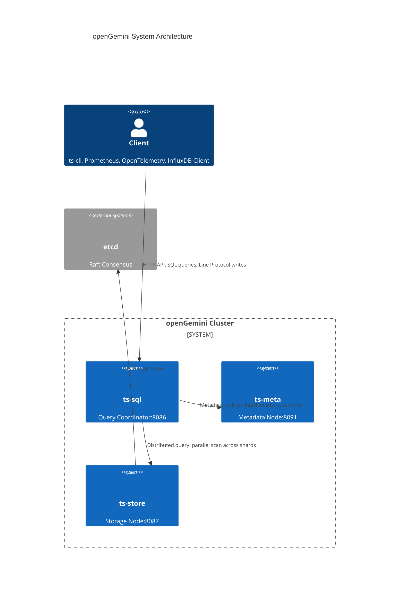

**Multi-Node Storage Topology:**

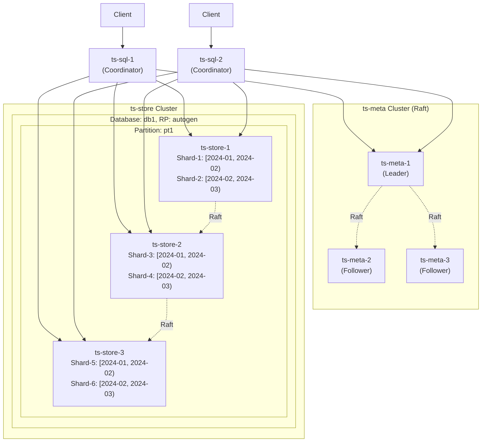

---

## 3. Module Boundaries & Responsibilities

### 3.1 ts-sql (Query Coordinator)

**Directory:** `app/ts-sql/`

**Architecture Responsibility:** Acts as the query entry point, parses InfluxQL/PromQL queries, creates distributed query execution plans, and aggregates results from storage nodes.

**Core Components:**

| Component | File | Responsibility |
|-----------|------|----------------|
| httpd.Service | `lib/util/lifted/influx/httpd/` | HTTP API server, handles /query, /write endpoints |
| QueryExecutor | `lib/util/lifted/influx/query/` | Query parsing, planning, execution |
| PointsWriter | `coordinator/points_writer.go` | Coordinates writes across storage nodes |
| SubscriberManager | `coordinator/subscriber.go` | Manages subscription for downsample/continuous query outputs |

**Key Struct (server.go:64):**
```go
type Server struct {
    MetaClient       *meta.Client           // Metadata client
    TSDBStore        netstorage.Storage    // Network storage interface
    QueryExecutor    *query.Executor       // Query execution engine
    PointsWriter     *coordinator.PointsWriter  // Write coordinator
    SubscriberManager *coordinator.SubscriberManager
    httpService      *httpd.Service
}
```

**Query Flow:**
```
HTTP Request → httpd.Service.ParseQuery() 
    → QueryExecutor.Execute() 
    → CreateDistributedPlan() 
    → ShardMapper.MapShards() 
    → Parallel Query across ts-store 
    → Merge Results 
    → HTTP Response
```

---

### 3.2 ts-meta (Metadata Management)

**Directory:** `app/ts-meta/`, `lib/util/lifted/influx/meta/`

**Architecture Responsibility:** Manages cluster metadata including database/retention policy/measurement schemas, shard-to-node mappings, and partition placement. Uses Raft consensus for high availability.

**Core Data Structures (data.go):**

```go
type Data struct {
    DBPtb map[string]map[uint32]*PtInfo  // Database → PtId → PtInfo
    Databases map[string]*DatabaseInfo
    Users     []UserInfo
    // Raft state and locks
}

type DatabaseInfo struct {
    Name              string
    RetentionPolicies map[string]*RetentionPolicyInfo
}

type RetentionPolicyInfo struct {
    Name               string
    Duration           time.Duration        // Data retention period
    ShardGroupDuration time.Duration        // Shard group time range
    ReplicaN           int                  // Replication factor
    ShardGroups        []ShardGroupInfo
}

type ShardGroupInfo struct {
    ID        uint64
    StartTime time.Time
    EndTime   time.Time
    Shards    []ShardInfo
}
```

**Raft Consensus:**
- Uses etcd/raft for leader election and log replication
- Three-node minimum for production
- Single leader per Raft group (per database partition)

---

### 3.3 ts-store (Data Storage Engine)

**Directory:** `app/ts-store/`, `engine/`

**Architecture Responsibility:** Implements the actual data storage and retrieval. Manages WAL, memtables, TSM files, indexes, and compaction.

**Core Sub-Modules:**

| Module | Path | Responsibility |
|--------|------|----------------|
| **Engine** | `engine/engine.go` | Top-level engine, manages all DB partitions |
| **Partition** | `engine/partition.go` | Database partition (Pt), contains multiple shards |
| **Shard** | `engine/shelf/shard.go` | Single shard, manages WAL and storage |
| **WAL** | `engine/shelf/wal.go` | Write-ahead log for durability |
| **TSM** | `engine/immutable/` | Time Structured Merge tree file management |
| **Index** | `engine/index/`, `engine/index/tsi/` | Series index (TSI) and skip indexes |
| **Mutable** | `engine/mutable/` | In-memory memtable (L0 of LSM) |
| **Executor** | `engine/executor/` | Query execution operators |

---

### 3.4 coordinator (Write Coordination)

**Directory:** `coordinator/`

**Architecture Responsibility:** Coordinates distributed writes across multiple storage nodes. Handles shard routing, write batching, and failure retry.

**Core Structures (points_writer.go):**

```go
type PointsWriter struct {
    TSDBStore TSDBStore  // Interface to storage engine
    MetaClient PWMetaClient
    timeout    time.Duration
}

type ShardRows struct {
    shardInfo *meta2.ShardInfo
    rows      []*influx.Row
}
```

**Write Coordination Flow:**
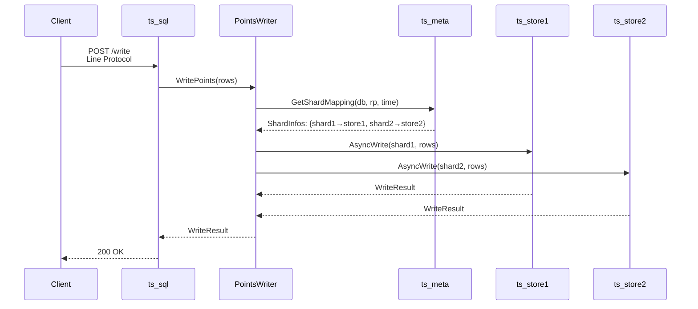

---

### 3.5 engine/shelf (Shard Storage)

**Directory:** `engine/shelf/`

**Architecture Responsibility:** Low-level shard storage operations including WAL management and memtable operations.

**Core Structures (shelf/shard.go):**

```go
type Shard struct {
    walDir     string
    info       *ShardInfo
    idxCreator *IndexCreator
    
    wal *Wal  // Write-Ahead Log
    // mutable memtable is in engine/mutable/
}

type ShardInfo struct {
    ident     *meta.ShardIdentifier
    filePath  string
    walPath   string
    tbStore   immutable.TablesStore  // TSM file storage
    idx       Index
}

// engine/shelf/wal.go
type Wal struct {
    dir      string
    files    []*WalFile
    encoder  *WalEncoder
}
```

**Background Processes (shelf/shard.go:104-124):**
```go
func (s *Shard) openBackgroundProcessor() {
    s.wg.Add(3)
    // 1. backgroundCreateIndex - creates TSI index from WAL data
    go s.backgroundCreateIndex()
    // 2. backgroundConvertToTSSP - flushes WAL to TSM files
    go s.backgroundConvertToTSSP()
    // 3. backgroundWalProcess - syncs WAL to disk
    go s.backgroundWalProcess()
}
```

---

### 3.6 engine/immutable (TSM Storage)

**Directory:** `engine/immutable/`

**Architecture Responsibility:** Manages TSM (Time Structured Merge) tree files, including compaction, merging, and columnar storage.

**Core Structures (mms_tables.go):**

```go
type MmsTables struct {
    path string
    db, rp string
    shardId uint64
    
    Order    map[string]*TSSPFiles   // Ordered TSM files by time
    OutOfOrder map[string]*TSSPFiles // Out-of-order data files
    CSFiles  map[string]*TSSPFiles   // Column store files
    
    fileSeq         uint64
    tier            *uint64
    compactionEn    int32
    mergeEn         int32
    sequencer       *Sequencer
}

type TSSPFiles struct {
    files []TSSPFile
    mu    sync.RWMutex
}

type TSSPFile interface {
    Name() string
    Size() uint64
    Path() string
    Contains(timestamp int64) bool
}
```

**Compaction Levels (compact.go:39):**
```
Level 0: Memtable flush → Initial TSM files
Level 1-6: Compaction merges files, reduces count, increases size
Level 7: Full compaction for cold tier or archival

const CompactLevels = 7
const LevelCompactRule = []uint16{0, 1, 0, 2, 0, 3, 0, 1, 2, 3, 0, 4, 0, 5, 0, 1, 2, 6}
```

---

### 3.6.5 Compaction & Merge System

**Directory:** `engine/immutable/`

**Architecture Responsibility:** Manages the lifecycle of TSM (Time Structured Merge) files through compaction and merge operations. Ensures efficient storage utilization, controls file count, and maintains data ordered by time.

#### 3.6.5.1 TSSP File Naming Convention

**TSSP File Name Format (tssp_file_name.go:58-59):**
```
Format: {seq:8hex}-{level:4hex}-{merge:4hex}{extent:4hex}.tssp[.init]
Example: 00008250-0001-00010001.tssp
```

| Component | Bits | Description | Range |
|-----------|------|-------------|-------|
| **seq** | 64-bit | Sequence number (timestamp-based) | 0x00000000-0xFFFFFFFF |
| **level** | 16-bit | Compaction level | 0-7 |
| **merge** | 16-bit | Merge counter | 0-0xFFFF |
| **extent** | 16-bit | Extent/fragment index within file | 0-0xFFFF |

**TSSPFileName Structure (tssp_file_name.go:38-45):**
```go
type TSSPFileName struct {
    seq    uint64  // Sequence number
    level  uint16  // Compaction level
    extent uint16  // Extent/fragment index
    merge  uint16  // Merge counter
    order  bool    // Is ordered (true) or out-of-order (false)
    lock   *string // File lock path
}
```

**File Classification:**
- **Ordered files** (`order=true`): Time-ordered data, stored in `Order/` directory
- **Out-of-order files** (`order=false`): Unordered data pending merge, stored in `OutOfOrder/` directory
- **Temporary files**: Files with `.tssp.tmp` suffix during write
- **Initialized files**: Files with `.tssp.init` suffix during index building

#### 3.6.5.2 Compaction Levels & Rules

**Level Definitions (compact.go:39-54):**
```go
const CompactLevels = 7

var (
    // LevelCompactRule is a repeating sequence that determines
    // which level to check for compaction at each interval
    // Pattern: 0→1→2→3→4→5→1,2,3→4→5→1,2,6 (cycles)
    LevelCompactRule = []uint16{0, 1, 0, 2, 0, 3, 0, 1, 2, 3, 0, 4, 0, 5, 0, 1, 2, 6}
    
    // Minimum files per level to trigger compaction
    LeveLMinGroupFiles = [CompactLevels]int{8, 4, 4, 4, 4, 4, 2}
)
```

**Note:** `LeveLMinGroupFiles` array indices 0-6 correspond to levels 0-6. Level 7 (full compaction) is triggered manually or by hierarchical service.

**Level Transition Rules:**

| Current Level | Next Level | Files Needed | Description |
|---------------|------------|--------------|-------------|
| Level 0 | Level 1 | 8 | Initial compaction from memtable flush |
| Level 1 | Level 2 | 4 | Minor compaction within level 1 |
| Level 2 | Level 3 | 4 | Continue merging |
| Level 3 | Level 4 | 4 | Large file consolidation |
| Level 4 | Level 5 | 4 | Further consolidation |
| Level 5 | Level 6 | 4 | Deep compaction |
| Level 6 | Level 7 | Manual | Full compaction (cold tier/archive) |

**Compaction Scheduling:**
- `LevelCompactRule` is a **cyclic pattern** checked at each compaction interval
- The scheduler iterates through the pattern: Level 0 → Level 1 → Level 0 → Level 2 → ...
- This ensures fair compaction across all levels without starving any level

**Compaction & Merge Flow (Compactor.run() every 10 seconds):**

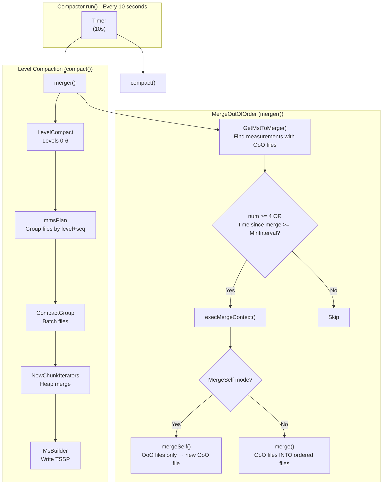

**Key Point:** `MergeOutOfOrder` and `FullCompact` are **COMPLETELY INDEPENDENT**. They are both triggered every 10 seconds by the same `Compactor.run()` loop but serve different purposes:

| Aspect | Merger (merger()) | Compactor (compact()) |
|--------|-------------------|----------------------|
| **Purpose** | Merge out-of-order files | Level compaction |
| **Files affected** | `OutOfOrder` map | `Order` map |
| **Output** | OoO → OoO OR OoO → Order | Level N → Level N+1 |

#### 3.6.5.3 File Selection & Grouping (mmsPlan)

**File Grouping Logic (mms_tables.go:1148-1196):**
```go
func (m *MmsTables) mmsPlan(name string, files *TSSPFiles, level uint16, 
    minGroupFileN int, plans []*CompactGroup) []*CompactGroup {
    
    seqMap := seqMapPool.Get().(*dictpool.Dict)
    seqMap.Reset()
    defer seqMapPool.Put(seqMap)
    
    idx := 0
    for idx < files.Len() {
        f := files.files[idx]
        lv, seq := f.LevelAndSequence()
        
        if lv != level {
            // Different level - flush current plan and move to next file
            plans = m.genCompactPlan(seqMap, minGroupFileN, name, level, files, plans)
            seqMap.Reset()
            idx++
            continue
        }
        
        // Group files by sequence number
        seqByte := record.Uint64ToBytesUnsafe(seq)
        if !seqMap.HasBytes(seqByte) {
            plans = m.genCompactPlan(seqMap, minGroupFileN, name, level, files, plans)
            seqMap.SetBytes(seqByte, f)
            idx++
        } else {
            // Same sequence - continue grouping
            i := idx + 1
            for i < files.Len() {
                f = files.files[i]
                if !levelSequenceEqual(level, seq, f) {
                    break
                }
                i++
            }
            idx = i
            seqMap.Reset()
        }
    }
    
    plans = m.genCompactPlan(seqMap, minGroupFileN, name, level, files, plans)
    return plans
}
```

**Planning Algorithm:**
1. Files are grouped by (level, sequence) tuples
2. A CompactGroup is created when `seqMap.Len() >= minGroupFileN[level]`
3. Each group contains files that can be compacted together
4. Groups are executed as independent compaction tasks

**CompactGroup Structure (task.go:25-31):**
```go
type CompactGroup struct {
    name     string      // Measurement name
    group    []string   // File paths in this group
    toLevel  uint16     // Target compaction level
    dropping *int64    // Pointer to closing flag
    shardId  uint64     // Shard ID for tracking
}
```

#### 3.6.5.4 Level Compaction (LevelCompact)

**LevelCompact Flow (compact.go:120-137):**
```go
func (m *MmsTables) LevelCompact(level uint16, shid uint64) error {
    levelLimited := config.GetStoreConfig().Compact.MaxCompactionLevel
    if levelLimited > 0 && int(level) >= levelLimited {
        return nil  // Skip if level exceeds limit
    }

    // Generate compaction plans for this level
    plans := m.ImmTable.LevelPlan(m, level)
    
    if len(plans) == 0 {
        return nil  // Nothing to compact
    }
    
    // Build task groups and execute
    taskGroups := m.buildCompactTaskGroup(plans, false, shid)
    for _, group := range taskGroups {
        m.scheduler.ExecuteTaskGroup(group, m.stopCompMerge)
    }
    return nil
}
```

**LevelCompaction Sequence (compact.go:52):**
```
LevelCompactRule = {0, 1, 0, 2, 0, 3, 0, 1, 2, 3, 0, 4, 0, 5, 0, 1, 2, 6}
                  └───────────────────────────────────────────────────┘
                  Sequence of levels to check for compaction (repeating cycle)
```

**Scheduler & Concurrency Control (compact.go:67-84):**
```go
func SetMaxCompactor(n int) {
    maxCompactor = n
    if maxCompactor == 0 {
        maxCompactor = cpu.GetCpuNum()
    }
    if maxCompactor < 2 {
        maxCompactor = 2
    }
    if maxCompactor > 32 {
        maxCompactor = 32
    }
    compLimiter = limiter.NewFixed(maxCompactor)
}
```

#### 3.6.5.5 Full Compaction (FullCompact)

**FullCompact Flow (compact.go:418-438):**
```go
func (m *MmsTables) FullCompact(shid uint64) error {
    n := int64(maxFullCompactor) - atomic.LoadInt64(&fullCompactingCount)
    if n < 1 {
        return nil  // All full compactors busy
    }

    // Pre-full compaction at lower level if configured
    if preLevel := config.PreFullCompactLevel(); preLevel > 0 {
        plans := m.buildFullCompactPlan(n, preLevel)
        if len(plans) > 0 {
            m.scheduler.ExecuteBatch(m.buildCompactTasks(plans, true, shid), m.stopCompMerge)
            return nil
        }
    }

    // Full compaction from level 0
    plans := m.buildFullCompactPlan(n, 0)
    if len(plans) > 0 {
        m.scheduler.ExecuteBatch(m.buildCompactTasks(plans, true, shid), m.stopCompMerge)
    }
    return nil
}
```

**Full vs Level Compaction:**

| Aspect | Level Compact (Minor) | Full Compact (Major) |
|--------|---------------------|---------------------|
| **Scope** | Single level | All levels |
| **Files Selected** | Same level + sequence | All levels |
| **Trigger** | `LeveLMinGroupFiles` threshold | Manual or scheduled |
| **Concurrency** | `maxCompactor` | `maxFullCompactor` (cpu/2) |
| **Output Level** | `level + 1` | Target level (often 7) |
| **Use Case** | Regular maintenance | Cold tier archival |

#### 3.6.5.6 Merge Operations

**Merge Types:**

| Type | Description | Trigger |
|------|-------------|---------|
| **MergeOutOfOrder** | Entry point - triggered every 10s by `Compactor.merger()` | Background goroutine |
| **mergeTool.merge()** | Merges out-of-order files INTO ordered files | When MergeSelf=false |
| **mergeTool.mergeSelf()** | Merges out-of-order files ONLY into new OoO file | When MergeSelf=true |
| **MergeSelf** | Fast-path self-merging implementation | Used by mergeTool |

**Triggered Independently from Compaction:**

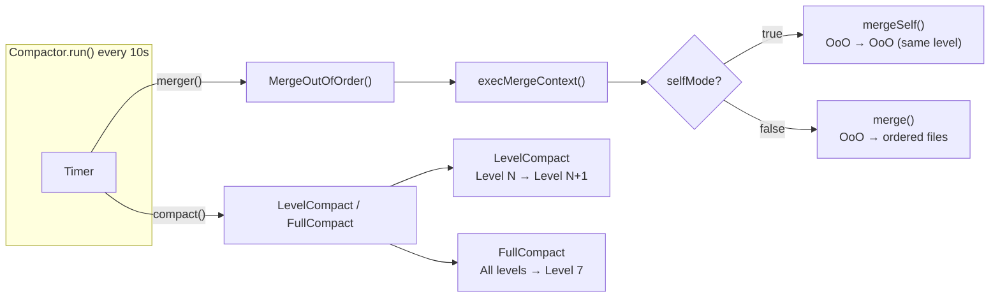

**MergeContext (merge_tool.go:52):**
```go
type MergeContext struct {
    mst       string      // Measurement name
    order     fileSeqs    // Ordered file sequences (time-overlapped)
    unordered fileSeqs    // Out-of-order file sequences
    shId      uint64     // Shard ID
}
```

**mergeTool.merge() - OoO INTO Ordered:**
```go
func (mt *mergeTool) merge(ctx *MergeContext) {
    // 1. Find ordered files that overlap with OoO time ranges
    matchOrderFiles(ctx)
    
    // 2. Create UnorderedReader for OoO data
    // 3. Create ColumnIterator for ordered data
    // 4. Heap-merge into ordered output
    // 5. Replace old ordered files with new
    // 6. Delete OoO files
}
```

**mergeTool.mergeSelf() - OoO ONLY:**
```go
func (mt *mergeTool) mergeSelf(ctx *MergeContext) {
    if ctx.UnorderedLen() <= 1 {
        return  // Nothing to merge
    }
    
    if ctx.MergeSelfFast() {
        mt.mergeSelfFastMode(ctx)  // Direct: MergeSelf.Merge()
    } else {
        mt.mergeSelfStreamMode(ctx)  // Chunked via mergeTool.execute()
    }
}
```
```

**MergeSelf Mode (merge_self.go:48-86):**
```go
func (m *MergeSelf) Merge(mst string, toLevel uint16, files []TSSPFile) (TSSPFile, error) {
    builder := m.createMsBuilder(mst, toLevel, files[0].FileName(), FilesMergedTire(files))
    
    sh := record.NewColumnSortHelper()
    itrs := m.createIterators(files)  // Create ChunkIterators from files
    
    for {
        sid, rec, err := itrs.Next()
        if rec == nil || sid == 0 {
            break
        }
        
        rec = sh.Sort(rec)  // Sort by time
        itrs.merged = rec
        builder, err = builder.WriteRecord(sid, rec, nil)
        if err != nil {
            builder.Reset()
            return nil, err
        }
    }
    
    merged, err := builder.NewTSSPFile(true)
    return merged, err
}
```

**Fast vs Stream Mode (merge_tool.go:202-215):**
```go
func (mt *mergeTool) mergeSelf(ctx *MergeContext) {
    mt.mts.lmt.Update(ctx.mst)
    
    if ctx.UnorderedLen() <= 1 {
        return  // Nothing to merge
    }
    
    if ctx.MergeSelfFast() {
        mt.mergeSelfFastMode(ctx)  // Fast mode: single sorted output
        return
    }
    
    mt.mergeSelfStreamMode(ctx)  // Stream mode: chunked processing
}
```

#### 3.6.5.7 Data Merging Algorithm (ChunkIterators)

**Multi-way Merge using Min-Heap (compact.go:145-173):**
```go
func (m *MmsTables) NewChunkIterators(group FilesInfo) *ChunkIterators {
    compItrs := &ChunkIterators{
        closed:        m.closed,
        stopCompMerge: m.stopCompMerge,
        name:          group.name,
        itrs:          make([]*ChunkIterator, 0, len(group.compIts)),
        merged:        &record.Record{},
    }
    
    for _, i := range group.compIts {
        itr := NewChunkIterator(i)
        itr.WithLog(CLog)
        if !itr.Next() {
            itr.Close()
            continue
        }
        compItrs.itrs = append(compItrs.itrs, itr)
    }
    
    heap.Init(compItrs)  // Initialize min-heap by timestamp
    return compItrs
}
```

**ChunkIterator Heap Order:**
```go
func (c *ChunkIterators) Less(i, j int) bool {
    return c.itrs[i].CurrentTime() < c.itrs[j].CurrentTime()
}
```

**Merge Execution (compact.go:175-242):**
```go
func (m *MmsTables) compact(itrs *ChunkIterators, files []TSSPFile, 
    level uint16, isOrder bool, cLog *Log.Logger) ([]TSSPFile, error) {
    
    _, seq := files[0].LevelAndSequence()
    fileName := NewTSSPFileName(seq, level, 0, 0, isOrder, m.lock)
    
    tableBuilder := NewMsBuilder(m.path, itrs.name, m.lock, m.Conf, 
        itrs.maxN, fileName, FilesMergedTire(files), nil, 
        itrs.estimateSize, config.TSSTORE, m.obsOpt, m.GetShardID())
    
    for {
        id, rec, err := itrs.Next()
        if rec == nil || id == 0 {
            break  // End of data
        }
        
        record.CheckRecord(rec)
        if correctTimeDisorder {
            rec = record.SortRecordIfNeeded(rec)
        }
        
        if m.indexMergeSet != nil && m.indexMergeSet.HasDeletedTSID(id) {
            continue  // Skip deleted series
        }
        
        tableBuilder, err = tableBuilder.WriteRecord(id, rec, func(fn TSSPFileName) (uint64, uint16, uint16, uint16) {
            ext := fn.extent + 1  // Increment extent for each record
            return fn.seq, fn.level, 0, ext
        })
    }
    
    if tableBuilder.Size() > 0 {
        f, err := tableBuilder.NewTSSPFile(true)
        newFiles = append(newFiles, f)
    }
    
    return newFiles, nil
}
```

#### 3.6.5.8 TSSP File Writing (MsBuilder)

**MsBuilder Structure (msbuilder.go:51-101):**
```go
type MsBuilder struct {
    Path string
    TableData
    Conf            *Config
    chunkBuilder    *ChunkDataBuilder  // Encodes chunks
    mIndex          MetaIndex          // Meta index builder
    trailer         *Trailer           // File trailer
    bf              *bloom.Filter      // Bloom filter for series
    
    fd             fileops.File        // Data file handle
    diskFileWriter fileops.FileWriter  // Encoded file writer
    metaFileWriter fileops.MetaWriter  // Index file writer
    
    dataOffset      int64              // Data section offset
    fileSize        int64              // Total file size
    RowCount        int64              // Total rows written
    chunkMetaCodecCtx *ChunkMetaCodecCtx // Chunk meta compression
    
    Files              []TSSPFile      // Output files
    FileName           TSSPFileName    // Output file name
    pkIndexWriter      sparseindex.PKIndexWriter  // Primary key index
}
```

**Write Record Flow (msbuilder.go):**
1. **WriteRecord**: Encodes record into chunk data
2. **FlushChunk**: Writes chunk to disk when full
3. **NewTSSPFile**: Finalizes and closes the file

**NewTSSPFile Creation (msbuilder.go):**
```go
func (m *MsBuilder) NewTSSPFile(sort bool) (TSSPFile, error) {
    if m.Size() > 0 {
        // Finalize the last chunk
        m.flush()
        
        // Write trailer with file metadata
        m.trailerOffset = m.DiskFileWriter().WriteTrailer(m.trailer)
        
        // Close the file
        m.diskFileWriter.Close()
    }
    
    // Rename from .tssp.tmp to final name
    finalPath := m.FileName.Path(m.Path(), false)
    if err := fileops.RenameFile(m.TmpPath(), finalPath, lock); err != nil {
        return nil, err
    }
    
    return newTSSPFile(m.FileName, finalPath), nil
}
```

#### 3.6.5.9 Crash Recovery (Compact Log)

**CompactedFileInfo Structure (compaction_file_info.go:37-42):**
```go
type CompactedFileInfo struct {
    Name    string    // Measurement name with version
    IsOrder bool      // Is ordered file
    OldFile []string  // Original file names
    NewFile []string  // New compacted file names
}
```

**Compact Log Format:**
```
[CompactedFileInfo marshaled]
[magic: "2021A5A5"]  // End marker for validation
```

**Log File Naming (compaction_file_info.go:125-134):**
```go
func GenLogFileName(logSeq *uint64) string {
    var buf [16]byte
    rand.Read(buf[:8])  // Random prefix
    seq := atomic.AddUint64(logSeq, 1)
    copy(buf[8:], record.Uint64ToBytesUnsafe(seq))
    return fmt.Sprintf("%08x-%08x", buf[:8], buf[8:])
}
```

**Recovery Flow (compaction_file_info.go:351-383):**
```go
func procCompactLog(shardDir string, logDir string, lockPath *string, 
    engineType config.EngineType) error {
    
    dirs, err := fileops.ReadDir(logDir)
    
    logInfo := &CompactedFileInfo{}
    for _, logFile := range dirs {
        err = readCompactLogFile(logFile, logInfo)
        if err != nil {
            if err == ErrDirtyLog {
                continue  // Skip incomplete logs
            }
            return err
        }
        
        // Process the log entry
        if err = processLog(shardDir, logInfo, lockPath, engineType); err != nil {
            // Log error but continue
        }
        
        // Remove processed log file
        fileops.Remove(logFile)
    }
    return nil
}
```

**Log Processing (processLog):**
1. Read compacted file info from log
2. Check if new files exist:
   - If yes: Log was complete, delete old files
   - If no: Check if old files still exist
     - If old files exist: Rename `.tssp.tmp` files to complete
     - If not: Log is invalid

#### 3.6.5.10 Compaction & Merge Summary

**Compactor.run() - Every 10 seconds:**

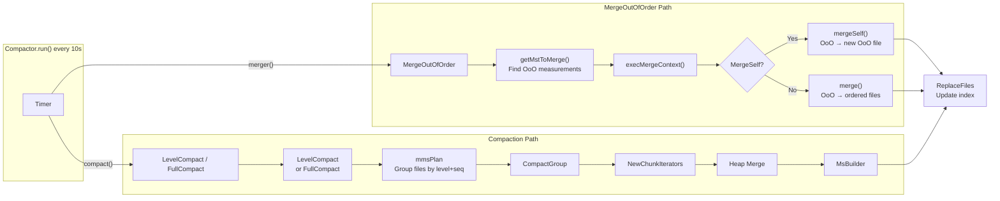

**Key Distinctions:**

| Aspect | MergeOutOfOrder | LevelCompact | FullCompact |
|--------|-----------------|--------------|-------------|
| **Trigger** | `merger()` every 10s | `compact()` every 10s | Manual/scheduled |
| **Files** | `OutOfOrder` map | `Order` map | `Order` map |
| **Output** | OoO merged into OoO or Order | Level N → Level N+1 | All → Level 7 |
| **Concurrency** | Limited by `compLimiter` | Limited by `compLimiter` | Limited by `fullCompactor` |

**Key Files:**

| File | Purpose |
|------|---------|
| `compact.go` | Compaction entry points, ChunkIterators, merge execution |
| `compaction_file_info.go` | Compact log format, crash recovery |
| `merge_tool.go` | Out-of-order merge coordination |
| `merge_self.go` | Self-merging within same level |
| `mms_tables.go` | MmsTables, mmsPlan, file grouping |
| `ts_mms_tables.go` | LevelPlan, file iterator creation |
| `task.go` | CompactTask, CompactGroup |
| `msbuilder.go` | TSSP file writer, MsBuilder |
| `tssp_file_name.go` | File naming convention |

---

### 3.6.6 Task Scheduler (Compaction Coordinator)

**Directory:** `lib/scheduler/`

**Architecture Responsibility:** Domain-specific task coordinator for compaction and merge operations in the TSM storage engine. Provides concurrency control, duplicate prevention, graceful shutdown, and atomic multi-task completion.

**Core Interfaces (task.go):**

```go
type Task interface {
    Key() string                      // Unique identifier for deduplication
    UUID() uint64                     // Task instance ID
    BeforeExecute() bool              // Pre-execution check (e.g., resource acquisition)
    Execute()                         // Main task logic
    Stop()                           // Graceful stop
    Finish()                         // Post-execution cleanup
    OnFinish(event Event)            // Register completion callback
}

type Event func()                    // Callback function type

type EventManager struct {
    dispatched bool                   // Ensures single dispatch
    mu         sync.RWMutex
    events     []Event               // Queued callbacks
}
```

**Key Features:**

| Feature | Implementation | Purpose |
|---------|---------------|---------|
| **Concurrency Limiting** | `limiter.Fixed` (semaphore channel) | Controls max parallel compaction tasks |
| **Duplicate Prevention** | `taskMutex` map (key → struct{}) | Ensures same task not running twice |
| **Graceful Shutdown** | `CloseAll()` stops all tasks | Clean shutdown on server stop |
| **Task Grouping** | `TaskGroup` with ref counting | Atomic multi-task completion |

**TaskScheduler (task_scheduler.go:25-52):**

```go
type TaskScheduler struct {
    mu        sync.RWMutex
    taskMutex map[string]struct{}     // Key-based mutex for deduplication
    tasks     map[uint64]Task         // Active tasks by UUID
    limiter   limiter.Fixed           // Concurrency limiter (semaphore)
    wg        sync.WaitGroup
    closed    bool
    closeSignal chan struct{}
}
```

**CompactTask Integration (engine/immutable/task.go:25-58):**

```go
type CompactTask struct {
    scheduler.BaseTask
    plan  *CompactGroup
    table *MmsTables
    full  bool
}

func (t *CompactTask) BeforeExecute() bool {
    if !t.table.acquire(t.plan.group) {
        return false                 // Skip if resources not available
    }
    t.OnFinish(func() {
        t.table.CompactDone(t.plan.group)
        t.table.blockCompactStop(t.plan.name)
    })
    return true
}
```

**Key Files:**

| File | Purpose |
|------|---------|
| `lib/scheduler/task.go` | Task interfaces, BaseTask, TaskGroup, EventManager |
| `lib/scheduler/task_scheduler.go` | TaskScheduler, concurrency control |
| `engine/immutable/task.go` | CompactTask implementation |
| `engine/immutable/mms_tables.go` | MmsTables integration |

---

### 3.7 engine/index (Index Management)

**Directory:** `engine/index/`

**Architecture Responsibility:** Provides various index types for efficient series lookup and filtering. Manages series-to-ID mapping, tag indexes, and secondary skip indexes.

---

#### 3.7.1 Index Type Definitions

**IndexType Enum (lib/index/index_type.go:22-35):**
```go
type IndexType int

const (
    MergeSet IndexType = iota   // 0: TSI primary index
    Text                        // 1: Full-text index
    Field                       // 2: Field index
    TimeCluster                 // 3: Time clustering
    BloomFilter                 // 4: Bloom filter for membership testing
    BloomFilterFullText         // 5: Bloom filter + full-text
    MinMax                      // 6: Min-max for range pruning
    Set                         // 7: Set index
    IndexTypeAll                // 8: All index types
    BloomFilterIp               // 9: Bloom filter for IP addresses
)
```

**Index Name Mapping (index_type.go:50-60):**
```go
IndexNameToType = map[string]IndexType{
    "mergeset":            MergeSet,
    "bloomfilter":         BloomFilter,
    "bloomfilter_fulltext": BloomFilterFullText,
    "minmax":              MinMax,
    "set":                 Set,
    "bloomfilter_ip":      BloomFilterIp,
}
```

---

#### 3.7.2 Index Architecture Overview

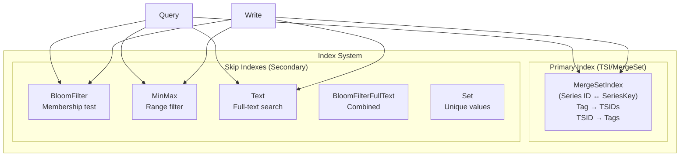

---

#### 3.7.3 Primary Index (MergeSetIndex / TSI)

**Purpose:** Maps series keys (measurement + tags) to unique SeriesIDs (SID), and provides tag-based series lookup.

**Key Structures (mergeset_index.go:56-77):**
```go
const (
    nsPrefixKeyToTSID = iota    // SeriesKey → SeriesID
    nsPrefixTSIDToKey           // SeriesID → SeriesKey
    nsPrefixTagToTSIDs          // TagKV → []SeriesID (inverted index)
    nsPrefixDeletedTSIDs        // Tombstoned series
    nsPrefixTSIDToField         // SeriesID → Field keys
    nsPrefixFieldToPID          // Field → Primary ID
    nsPrefixMstToFieldKey       // Measurement → Field definitions
    nsPrefixTagKeysToTagValues  // For column store
)
```

**Series Key Encoding:**
```
SeriesKey = measurementName + [tag1=value1, tag2=value2, ...]
IndexKey = SeriesKey (used for hash-based sharding)
```

**MergeSetIndex Interface (index.go:593-620):**
```go
type Index interface {
    // Series management
    CreateIndexIfNotExists(mmRows *dictpool.Dict) error
    GetSeriesIdBySeriesKey(key []byte) (uint64, error)
    SearchSeries(series [][]byte, name []byte, condition influxql.Expr, tr TimeRange) ([][]byte, error)
    SearchSeriesWithOpts(span *tracing.Span, name []byte, opt *query.ProcessorOptions, ...) (GroupSeries, int64, error)
    
    // Tag-based lookup
    SearchTagValues(name []byte, tagKeys [][]byte, condition influxql.Expr) ([][]string, error)
    
    // Deletion
    DeleteTSIDs(name []byte, condition influxql.Expr, tr TimeRange) error
    LoadDeletedTSIDs() error
    
    Path() string
    Open() error
    Close() error
}
```

---

#### 3.7.4 Skip Index System (Secondary Indexes)

**Purpose:** Allow query execution to skip irrelevant data fragments without reading actual data.

**SKIndexReader Interface (sparseindex/skip_index.go:37-45):**
```go
type SKIndexReader interface {
    // Create index readers for query conditions
    CreateSKFileReaders(option hybridqp.Options, mstInfo *influxql.Measurement, isCache bool) ([]SKFileReader, error)
    // Filter fragments using skip index
    Scan(reader SKFileReader, rgs fragment.FragmentRanges) (fragment.FragmentRanges, error)
    Close() error
}
```

**Skip Index Types & Readers:**

| Index Type | Reader | Purpose | File Suffix |
|------------|--------|---------|-------------|
| **BloomFilter** | `BloomFilterIndexReader` | Fast membership test | `.idx` |
| **BloomFilterIp** | `BloomFilterIpIndexReader` | IP address bloom filter | `.idx` |
| **BloomFilterFullText** | `BloomFilterFullTextIndexReader` | Text + bloom filter | `.init` |
| **MinMax** | `MinMaxIndexReader` | Range comparison | `.idx` |
| **Set** | `SetIndexReader` | Unique value set | `.idx` |
| **Text** | `TextIndexReader` | Full-text search | `.idx` |

**Fragment-Based Skip Mechanism:**

```
Data File → Divided into Fragments → Each Fragment has Skip Index

Example with BloomFilter:
  Query: WHERE tag = 'value'
  1. Check BloomFilter for each fragment
  2. If BloomFilter says NO → Skip entire fragment
  3. If BloomFilter says MAYBE → Read and check
```

---

#### 3.7.5 IndexBuilder (Index Coordinator)

**IndexBuilder Structure (index_builder.go:50-80):**
```go
type IndexBuilder struct {
    path          string
    Relations     map[uint32]*IndexRelation  // OID → IndexRelation
    primaryIndex  PrimaryIndex
    EnableTagArray bool
    lock          *string
    // ... configuration
}

type IndexRelation struct {
    oid            uint32                    // Index type ID
    indexAmRoutine *IndexAmRoutine          // Index access mode routine
    iBuilder       *IndexBuilder
}
```

**Index Creation Flow:**

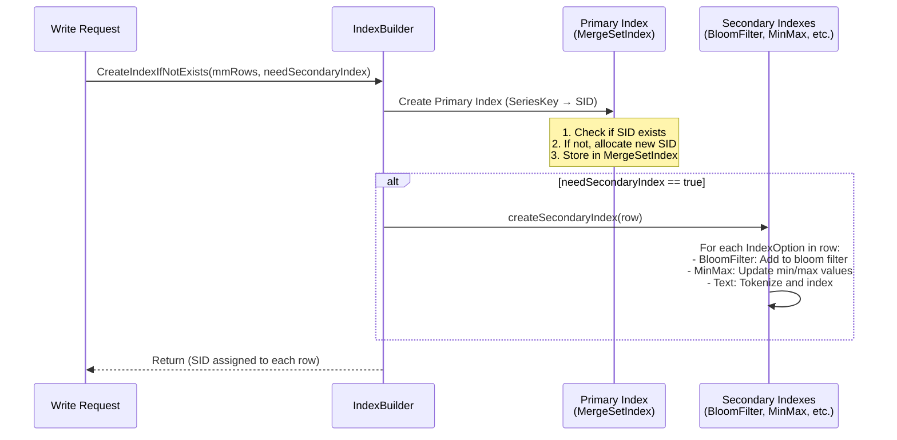

---

#### 3.7.6 Index Creation During Writes

**Write Path Index Creation (ts_storage.go:80-98):**
```go
func (storage *tsstoreImpl) writeIndex(idx Index, mmPoints *dictpool.Dict) error {
    start := time.Now()
    writeIndexRequired := false
    
    for mmIdx := range mmPoints.D {
        rows := mmPoints.D[mmIdx].Value.(*[]influx.Row)
        for ri := range *rows {
            if (*rows)[ri].SeriesId == 0 {
                writeIndexRequired = true
                break
            }
        }
    }
    
    if writeIndexRequired {
        // Full index creation (new series)
        if err = idx.CreateIndexIfNotExists(mmPoints, true); err != nil {
            return err
        }
    } else {
        // Only secondary indexes (existing series)
        if err = idx.CreateSecondaryIndexIfNotExist(mmPoints); err != nil {
            return err
        }
    }
    return nil
}
```

**Primary Index Creation (mergeset_index.go:681-711):**
```go
func (idx *MergeSetIndex) CreateIndexIfNotExists(mmRows *dictpool.Dict) error {
    idx.mu.Lock()
    defer idx.mu.Unlock()
    
    for mmIdx := range mmRows.D {
        rows := mmRows.D[mmIdx].Value.(*[]influx.Row)
        for rowIdx := range *rows {
            row := &(*rows)[rowIdx]
            if row.SeriesId != 0 {
                continue  // Already has SID
            }
            // Create index for this series
            row.SeriesId, err = idx.createIndexesIfNotExists(vkey.B, vname.B, row.Tags)
        }
    }
    return nil
}
```

**Series ID Assignment (mergeset_index.go:755-779):**
```go
func (idx *MergeSetIndex) createIndexesIfNotExists(vkey, vname []byte, tags []influx.Tag) (uint64, error) {
    // 1. Check if series already exists
    tsid, err := idx.getSeriesIdBySeriesKey(vkey)
    if tsid != 0 {
        return tsid, nil  // Already exists
    }
    
    // 2. Check series cardinality limit
    if err = idx.indexBuilder.SeriesLimited(); err != nil {
        return 0, err
    }
    
    // 3. Add to bloom filter for fast existence check
    idx.AddNewSeriesKey(vkey)
    
    // 4. Create new series ID
    tsid, err = idx.createIndexes(vkey, vname, tags, nil, false)
    return tsid, err
}
```

**Secondary Index Creation (index_builder.go:394-414):**
```go
func (iBuilder *IndexBuilder) createSecondaryIndex(row *influx.Row, primaryIndex PrimaryIndex) error {
    for _, indexOpt := range row.IndexOptions {
        // indexOpt contains Oid and IndexList for this index type
        relation := iBuilder.Relations[indexOpt.Oid]
        if relation == nil {
            // Lazy initialization of index relation
            relation, err = NewIndexRelation(opt, primaryIndex, iBuilder)
            iBuilder.Relations[indexOpt.Oid] = relation
        }
        // Insert into the secondary index
        if err := relation.IndexInsert([]byte(row.Name), row); err != nil {
            return err
        }
    }
    return nil
}
```

---

#### 3.7.7 Index Usage During Queries

**Query Flow with Skip Indexes:**

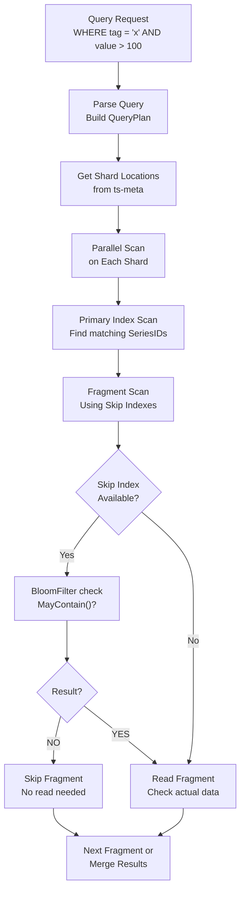

**Skip Index Scan Implementation (sparseindex/skip_index.go:75-109):**
```go
func (r *SKIndexReaderImpl) Scan(reader SKFileReader, rgs fragment.FragmentRanges) (fragment.FragmentRanges, error) {
    var droppedFragment uint32
    var totalFragment uint32
    var res fragment.FragmentRanges
    
    for i := 0; i < len(rgs); i++ {
        mr := rgs[i]
        totalFragment += mr.End - mr.Start
        
        for j := mr.Start; j < mr.End; j++ {
            // Key operation: MayBeInFragment checks skip index
            ok, err := reader.MayBeInFragment(j)
            if !ok {
                droppedFragment++  // Skip this fragment
                continue
            }
            // Fragment may contain matching data, include it
            dataRange := fragment.NewFragmentRange(
                util.MaxUint32(rgs[i].Start, j),
                util.MinUint32(rgs[i].End, j+1),
            )
            res = append(res, dataRange)
        }
    }
    return res, nil
}
```

---

#### 3.7.8 Index File Organization

**Directory Structure per Shard:**
```
shard/
├── mergeset/                    # Primary TSI index
│   ├── index.db                 # Main index data
│   ├── index.db-journal         # Write-ahead log
│   └── index.db-lock            # File lock
├── bloomfilter_field1.idx       # Bloom filter for "field1"
├── bloomfilter_field2.idx       # Bloom filter for "field2"
├── minmax_timestamp.idx         # MinMax for timestamp
└── text_description.idx         # Full-text index for "description"
```

**BloomFilter File Format:**
```
[4 bytes: CRC32]
[N bytes: Bloom filter bitset]
```

**MinMax File Format:**
```
[Fragment 0: min value, max value]
[Fragment 1: min value, max value]
...
```

---

#### 3.7.9 TagSet & Series Grouping

**TagSet Structure (tsi/index.go:54-81):**
```go
type TagSet interface {
    Ref(), Unref()
    Len() int
    GetSid(sidIdx, shardIdx int) uint64
    GetShardId(sidIdx, shardIdx int) uint64
    GetSeriesKeys(sidIdx int) []byte
    GetFilters(sidIdx int) influxql.Expr
    GetTagsVec(sidIdx int) *influx.PointTags
}

type TagSetEx interface {
    TagSet
    Append(uint64, []byte, influxql.Expr, influx.PointTags, []clv.RowFilter)
    GetTagSetItem(int) *TagSetInfoItem
}
```

**TagSetMergeInfo (used for distributed queries):**
```go
type TagSetMergeInfo struct {
    IDs        [][]uint64  // SeriesIDs per shard
    ShardIds   [][]uint64  // ShardIDs
    SeriesKeys [][]byte    // Encoded series keys
    TagsVec    []influx.PointTags
    Filters    []influxql.Expr
    RowFilters *clv.RowFilters  // For full-text index
}
```

---

#### 3.7.10 Index Configuration & Limits

**Index Options per Measurement (meta.MeasurementInfo):**
```go
type MeasurementInfo struct {
    Name              string
    EngineType        config.EngineType
    IndexRelation     *influxql.IndexRelation
    // ...
}

// IndexRelation defines indexes for a measurement
type IndexRelation struct {
    Oids       []uint32   // Index type IDs: {BloomFilter, MinMax, Text, ...}
    IndexNames []string   // Index names: {"bloomfilter", "minmax", ...}
    IndexList  [][]string // Fields to index: [["tag1"], ["field1"], ...]
}
```

**Example: Creating Indexes on Measurement:**
```sql
CREATE MEASUREMENT cpu WITH
    INDEXLIST = ['tag host', 'tag region', 'field value'],
    Indextype = 'bloomfilter'
```

---

### 3.8 services (Background Services)

**Directory:** `services/`

| Service | Responsibility |
|---------|---------------|
| **downsample** | Pre-aggregation and data downsampling |
| **continuousquery** | Continuous query execution |
| **retention** | Data retention policy enforcement |
| **stream** | Stream processing engine |
| **fence** | Distributed fencing for write coordination |
| **sherlock** | Self-monitoring and diagnostics |
| **arrowflight** | Apache Arrow Flight protocol support |

---

### 3.9 Downsample Service (降采样)

**Directory:** `services/downsample/`, `engine/`

**Architecture Responsibility:** Pre-aggregates time series data at configurable intervals to reduce data volume while preserving essential statistical properties. Operates as a background service on each ts-store node.

#### 3.9.1 Downsample vs Related Services

| Service | Trigger | Source | Target | Purpose |
|---------|---------|--------|--------|---------|
| **Downsample** | On data write (synchronous) | TSM files | New TSM files (same RP) | Built-in pre-aggregation |
| **Continuous Query** | Scheduled interval | User SQL query | User-specified RP/measurement | Custom SQL aggregation |
| **Retention** | Scheduled interval | TSM files | Deletion | Storage cleanup |
| **Stream** | Real-time (per batch) | MemTable | Stream output | Real-time processing |

**Key Differences:**

| Aspect | **Downsample** | **Continuous Query** |
|--------|---------------|---------------------|
| **Definition** | RP-level config | User-defined SQL |
| **Aggregation** | Built-in functions only | Any SQL aggregation |
| **Output** | Same RP, multiple levels | User-specified destination |
| **Trigger** | On data write (synchronous) | Scheduled interval (asynchronous) |
| **Flexibility** | Limited (first/last/min/max/sum/count/mean) | Full SQL expressiveness |

#### 3.9.2 Core Data Structures

**ShardDownSamplePolicyInfo (engine/shard.go):**
```go
type ShardDownSamplePolicyInfo struct {
    DbName                string
    RpName                string
    ShardId               uint64
    PtId                  uint32
    TaskID                uint64
    DownSamplePolicyLevel int     // Current downsample level
    Ident                 *meta.ShardIdentifier
}
```

**DownSamplePolicyInfo (meta/downsample_policy.go):**
```go
type DownSamplePolicyInfo struct {
    TaskID             uint64
    Calls              []*DownSampleOperators  // Aggregation functions
    DownSamplePolicies []*DownSamplePolicy    // Multi-level policies
    Duration           time.Duration           // Total duration
}

type DownSamplePolicy struct {
    SampleInterval time.Duration  // Sampling frequency
    TimeInterval   time.Duration  // Aggregation time bucket
    WaterMark      time.Duration  // Low watermark
}

type DownSampleOperators struct {
    Name      string   // "first", "last", "min", "max", "sum", "count", "mean"
    FieldName string   // Target field
}
```

**Downsample Policy Example:**
```sql
CREATE RETENTION POLICY "1h_only" ON "db" 
DURATION 30d 
REPLICATION 1 
SHARD DURATION 1h
DOWNsample "2h:count:field1,sum:field2,min:field3,max:field3,first:field4,last:field4"
```

This creates a 2-hour interval downsample with multiple aggregation functions.

#### 3.9.3 Downsample Task Flow

**High-Level Flow:**

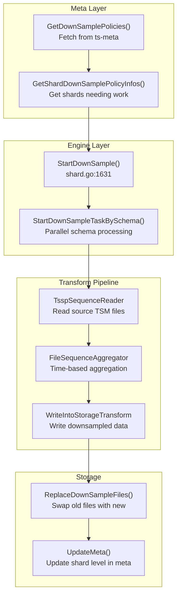

**Service Loop (service.go):**
```go
func (s *Service) handle() {
    for {
        select {
        case <-s.closed:
            return
        case <-t.C:
            // 1. Get downsample policies from Meta
            policies := s.MetaClient.GetDownSamplePolicies()
            
            // 2. Update engine with policies
            s.Engine.UpdateDownSampleInfo(policies)
            
            // 3. Get shards needing downsample
            shardInfos := s.Engine.GetShardDownSamplePolicyInfos()
            
            // 4. Start downsample tasks
            for _, si := range shardInfos {
                go s.Engine.StartDownSampleTask(si)
            }
        }
    }
}
```

#### 3.9.4 Transform Pipeline (Read → Aggregate → Write)

**Pipeline Architecture (record_plan.go):**

```go
// Stage 1: TsspSequenceReader - reads source TSM files
TsspSequenceReader = NewLogicalTSSPScan()

// Stage 2: FileSequenceAggregator - aggregates data
FileSequenceAggregator = NewFileSequenceAggregator()

// Stage 3: WriteIntoStorageTransform - writes results
WriteIntoStorageTransform = NewLogicalWriteIntoStorage()
```

**Stage 1: TsspSequenceReader (record_plan.go:54)**
```go
func (r *TsspSequenceReader) Work(ctx context.Context) error {
    for {
        select {
        case <-ctx.Done():
            return nil
        default:
        }
        
        // Read next chunk from TSM files
        chunk, err := r.reader.Next()
        if err == io.EOF {
            return nil
        }
        
        // Output: SeriesRecord with (sid, record, timeRange)
        r.Output.Collect(seriesRecord)
    }
}
```

**Stage 2: FileSequenceAggregator (record_plan.go:830)**
```go
func (r *FileSequenceAggregator) Work(ctx context.Context) error {
    for {
        select {
        case sr := <-r.Input.State:
            // Group by time interval
            timeKey := sr.Timestamp / r.timeInterval
            
            // Apply aggregation functions
            for _, op := range r.operators {
                switch op.Name {
                case "sum":
                    r.aggResult[timeKey].Sum += sr.GetFloat Field(op.FieldName)
                case "count":
                    r.aggResult[timeKey].Count++
                case "min":
                    r.aggResult[timeKey].Min = min(...)
                case "max":
                    r.aggResult[timeKey].Max = max(...)
                case "first":
                    r.aggResult[timeKey].First = sr.GetFirst(...)
                case "last":
                    r.aggResult[timeKey].Last = sr.GetLast(...)
                }
            }
        case <-ctx.Done():
            r.flush()
            return nil
        }
    }
}
```

**Stage 3: WriteIntoStorageTransform (record_plan.go:494)**
```go
func (r *WriteIntoStorageTransform) Work(ctx context.Context) error {
    for {
        select {
        case sr := <-r.Input.State:
            r.writeRecord(sr)  // Write to buffer
        case <-ctx.Done():
            r.EndFile()  // Finalize and close file
            return nil
        }
    }
}

func (r *WriteIntoStorageTransform) writeRecord(sr *SeriesRecord) {
    // Accumulate records by sid
    r.currSid = sr.Sid
    r.recordSchema = sr.Schema
    
    // Write to StreamWriteFile
    r.currStreamWriteFile.WriteData(r.currSid, r.recordSchema, segs, nil)
}
```

#### 3.9.5 TSM File Writing (MsBuilder)

**StreamWriteFile Structure:**
```go
type StreamWriteFile struct {
    fd          fileops.File
    name        string
    dir         string
    conf        *Config
    chunkRows   int
    maxChunkRows int
    msBuilder   *MsBuilder  // TSM file builder
}
```

**NewTSSPFile Creation (msbuilder.go):**
```go
func (m *MsBuilder) NewTSSPFile(sort bool) (TSSPFile, error) {
    if m.Size() > 0 {
        m.flush()  // Flush pending chunks
        
        // Write trailer with metadata
        m.trailerOffset = m.DiskFileWriter().WriteTrailer(m.trailer)
        
        // Close file
        m.diskFileWriter.Close()
    }
    
    // Rename from .tssp.tmp to final name
    finalPath := m.FileName.Path(m.Path(), false)
    if err := fileops.RenameFile(m.TmpPath(), finalPath, lock); err != nil {
        return nil, err
    }
    
    return newTSSPFile(m.FileName, finalPath), nil
}
```

**File Naming After Downsample:**
```
Downsample Level 0: 00008250-0001-00010001.tssp  (level 1)
Downsample Level 1: 00008250-0002-00010001.tssp  (level 2)
```

#### 3.9.6 File Replacement & Recovery

**ReplaceDownSampleFiles Flow (shard.go:1714):**
```go
func (s *shard) ReplaceDownSampleFiles(mstNames []string, 
    originFiles [][]immutable.TSSPFile, 
    newFiles [][]immutable.TSSPFile, ...) error {
    
    // 1. Write crash recovery log
    logFile, err := s.writeDownSampleInfo(mstNames, originFiles, newFiles, taskID, level)
    
    // 2. Replace files in MmsTables
    s.immTables.ReplaceDownSampleFiles(mstNames, originFiles, newFiles, true, callback)
    
    // 3. Update shard metadata in Meta
    s.updateShardIentOnMeta(meta)
    
    // 4. Delete log file on success
    fileops.Remove(logFile, lock)
}
```

**Downsample Recovery (shard.go:1337):**
```go
func (s *shard) DownSampleRecover() error {
    // Read log files from {shardDir}/downsample/log/
    logFiles := s.readDownSampleLogFiles()
    
    for _, log := range logFiles {
        if log.newFilesExist() {
            // Success path: rename temp files
            s.renameDownSampledFiles(log)
        } else {
            // Failure path: remove temp files
            s.cleanupFailedDownSample(log)
        }
    }
}
```

#### 3.9.7 Downsample vs Continuous Query

| Aspect | Downsample | Continuous Query |
|--------|------------|------------------|
| **Configuration** | Per-RP policy | Per-CQ SQL |
| **Aggregation** | Built-in functions | User-defined SQL |
| **Output** | Same or new RP | User-specified measurement |
| **Trigger** | Internal timer | Internal timer |
| **Flexibility** | Limited to predefined ops | Full SQL expressiveness |

**CQ Execution Flow (continuousquery/service.go):**
```go
func (s *Service) ExecuteContinuousQuery(cq *ContinuousQuery, now time.Time) error {
    // Calculate time range based on interval
    startTime, endTime := cq.calculateTimeRange()
    
    // Execute source query
    results := s.QueryExecutor.Execute(cq.source, startTime, endTime)
    
    // Write results to target
    return s.WriteResults(cq.target, results)
}
```

#### 3.9.8 Downsample Key Files

| File | Purpose |
|------|---------|
| `services/downsample/service.go` | Service loop, policy management |
| `services/downsample/functions.go` | Query schema generation |
| `engine/shard.go` | StartDownSample(), ReplaceDownSampleFiles() |
| `engine/record_plan.go` | Transform pipeline (Reader, Aggregator, Writer) |
| `engine/mutable/ts_table.go` | Flush to TSM |
| `engine/immutable/msbuilder.go` | TSM file writing |
| `lib/util/lifted/influx/meta/downsample_policy.go` | Policy data structures |

---

### 3.10 Stream Processing Service

**Directory:** `app/ts-store/stream/`, `lib/stream/`

**Architecture Responsibility:** Real-time stream query processing that continuously filters, transforms, and aggregates incoming write data with sub-second latency. Operates on incoming data before it reaches TSM storage.

#### 3.10.1 Stream vs Other Services

| Service | Trigger | Execution | Latency | State |
|---------|---------|-----------|---------|-------|
| **Stream** | On incoming write | Real-time, per-batch | Sub-second | Stateful (windows) |
| **Continuous Query** | Time interval | Periodic batch query | Higher | Stateless |
| **Downsample** | On data write | Synchronous pre-agg | Lowest | Stateful |
| **Retention** | Time interval | Deletion | N/A | N/A |

#### 3.10.2 Core Components

| Component | File | Purpose |
|-----------|------|---------|
| **StreamEngine** | `app/ts-store/stream/stream.go` | Main processing engine (874 lines) |
| **TimeTask** | `app/ts-store/stream/time_task.go` | Time-windowed aggregation (959 lines) |
| **TagTask** | `app/ts-store/stream/tag_task.go` | Group-by-tag aggregation (1164 lines) |
| **StreamLib** | `lib/stream/stream.go` | Field calls: min, max, sum, count |
| **StreamInfo** | `lib/util/lifted/influx/meta/stream.go` | Stream metadata definitions |
| **WalManager** | `engine/wal_manager.go` | WAL for stream replay |

**StreamEngine Interface:**
```go
type Engine interface {
    WriteRows(writeCtx *WriteStreamRowsCtx) (bool, error)
    RegisterTask(info *meta.StreamInfo, fieldCalls []*streamLib.FieldCall) error
    Drain()
    DeleteTask(id uint64)
    Run()
    Close()
}
```

#### 3.10.3 Task Types

**TimeTask (no dimensions):**
```go
// Time-windowed aggregation without group-by
values      []float64     // aggregated values: windowNum * fieldCallsLen
validValues []bool        // validity flags
windowOffset []int        // offset for each window
```

**TagTask (with dimensions):**
```go
// Group-by-tag windows
values sync.Map  // key: ptID, value: *sync.Map (groupKey → values)
shardIds map[uint32][]*uint64  // shard IDs per PT per window
```

#### 3.10.4 Stream Task Flow

**Creation & Registration:**
```
1. Meta Server stores StreamInfo
2. Stream Engine initialization
   ├── Creates FilterConcurrency goroutines
   └── Initializes cache channels
3. updateTask() - Periodic task update (every 10s)
   └── Reads GetStreamInfos() from MetaClient
4. RegisterTask() creates TimeTask or TagTask
```

**TimeTask Execution:**
```
run() starts:
├── monitorRecover(consumeData) - goroutine for data consumption
└── cycleFlush() - periodic flush based on window + maxDelay
```

**TagTask Execution:**
```
run() starts 4 goroutines:
├── cycleFlush() - periodic flush
├── parallelCalculate() - concurrent aggregation workers
├── cleanWindow() - cleanup old windows
└── consumeDataAndUpdateMeta() - data routing
```

#### 3.10.5 Data Flow

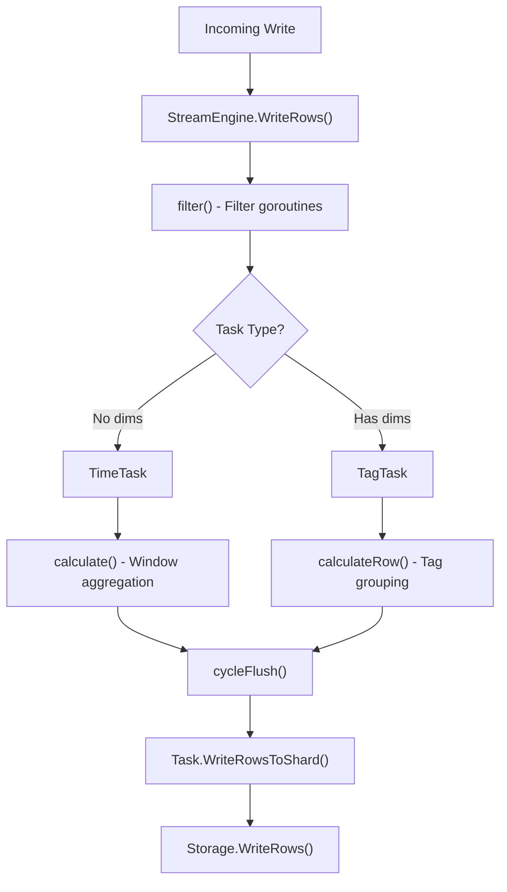

**Replay Path (Recovery):**
```
Stream.Start() → detectReplay() every 5s
    → StreamWalManager.Replay() reads WAL
    → StreamHandler() receives ReplayRow
    → Normal filter() → Task.Put()
```

#### 3.10.6 Stream Key Files

| File | Lines | Key Content |
|------|-------|-------------|
| `app/ts-store/stream/stream.go` | 874 | Main engine, task registration |
| `app/ts-store/stream/time_task.go` | 959 | Time-windowed aggregation |
| `app/ts-store/stream/tag_task.go` | 1164 | Tag-grouped aggregation |
| `lib/stream/stream.go` | 113 | FieldCall definitions |
| `lib/util/lifted/influx/meta/stream.go` | 301 | StreamInfo metadata |
| `engine/wal_manager.go` | 331 | Stream WAL replay |

---

### 3.11 Continuous Query Service

**Directory:** `services/continuousquery/`, `lib/metaclient/`

**Architecture Responsibility:** Executes user-defined continuous queries (CQ) on a scheduled interval, pre-computing expensive aggregation queries and storing results for fast retrieval.

#### 3.11.1 CQ vs Downsample

| Aspect | **CQ** | **Downsample** |
|--------|--------|----------------|
| **Trigger** | Time interval (user-defined) | On data write |
| **Definition** | SQL: `CREATE CONTINUOUS QUERY` | Config: `ALTER RP ... DOWNSAMPLE` |
| **Flexibility** | Any SELECT with aggregation | Pre-defined ops only |
| **Output** | User-specified measurement | Same or new RP |
| **State** | Stateless (runs query each time) | Stateful (pre-aggregates) |

#### 3.11.2 Core Components

| Component | File | Purpose |
|-----------|------|---------|
| **Service** | `services/continuousquery/service.go` | Main service, scheduling |
| **ContinuousQuery** | `services/continuousquery/continuous_query.go` | CQ struct, parsing |
| **CQInfo** | `lib/util/lifted/influx/meta/continuous_query.go` | Meta storage (CRUD) |
| **MetaClient** | `lib/metaclient/metaclient_cq.go` | RPC to meta |

**Service Structure:**
```go
type Service struct {
    MetaClient          metaclient.MetaClient
    QueryExecutor       interface{ ExecuteQuery() }
    ContinuousQueries   []*ContinuousQuery
    lastRuns            map[string]time.Time
    maxProcessCQNumber  int
    cqLeaseChanged      chan struct{}
}
```

#### 3.11.3 CQ Execution Flow

**Creation Flow:**
```
User: CREATE CONTINUOUS QUERY cq1 ON db0 
      BEGIN SELECT mean(v1) INTO "result_mst" 
      FROM "src_mst" GROUP BY time(30m) END
            ↓
statement_executor.executeCreateContinuousQueryStatement()
            ↓
MetaClient.CreateContinuousQuery() → Meta Node
            ↓
data.CreateContinuousQuery() → data.MaxCQChangeID++
```

**Execution Flow:**
```
1. handle() runs on interval (default 1s)
         ↓
2. checkCQIsChanged() → GetMaxCQChangeID() → WaitForDataChanged()
         ↓
3. getCQLease() → MetaClient.GetCqLease(host) returns []string{cqNames}
         ↓
4. getContinuousQueries() builds []*ContinuousQuery
         ↓
5. ExecuteContinuousQuery(cq, now) in goroutine pool
         ↓
6. QueryExecutor.ExecuteQuery() with SELECT INTO
         ↓
7. Results written to target via storage layer
```

#### 3.11.4 SELECT INTO Implementation

**Target Structure:**
```go
type SelectStatement struct {
    Fields  Fields
    Target  *Target  // INTO clause destination
    // ...
}

type Target struct {
    Measurement *TargetMeasurement
}

type TargetMeasurement struct {
    Database       string
    RetentionPolicy string
    Name           string
}
```

**Time Range Calculation:**
```go
startTime := nextRun.Add(-cq.resampleFor - cq.groupByOffset).
               Truncate(cq.resampleFor).Add(cq.groupByOffset)
endTime   := startTime.Add(cq.resampleFor - cq.groupByOffset).
               Truncate(cq.resampleFor).Add(cq.groupByOffset)
```

#### 3.11.5 CQ Key Files

| File | Purpose |
|------|---------|
| `services/continuousquery/service.go` | Main service, scheduling |
| `services/continuousquery/continuous_query.go` | CQ struct, parsing |
| `lib/config/continuousquery.go` | Configuration |
| `lib/util/lifted/influx/meta/continuous_query.go` | Meta CRUD |
| `lib/metaclient/metaclient_cq.go` | Meta RPC calls |
| `lib/util/lifted/influx/influxql/ast.go:5352` | CreateContinuousQueryStatement |

---

### 3.12 Retention Service

**Directory:** `services/retention/`, `services/retention/mst/`

**Architecture Responsibility:** Periodically identifies and deletes expired data based on retention policies. Supports both local storage and shared storage (OBS) deletion.

#### 3.12.1 Retention Policy Structure

```go
type RetentionPolicyInfo struct {
    Duration           time.Duration      // Main retention
    HotDuration        time.Duration      // Hot tier
    WarmDuration       time.Duration      // Warm tier
    IndexColdDuration time.Duration      // Cold tier
    ShardGroupDuration time.Duration      // Shard duration
    DownSamplePolicyInfo *DownSamplePolicyInfo
}
```

#### 3.12.2 Expiration Logic

**Mark Phase:**
```go
if !Deleted() && EndTime.Add(Duration).Before(t) {
    // Mark as deleted in meta
}
```

**Delete Phase:**
```go
if DeletedAt.Add(RetentionDelayedTime).After(t) {
    // Ready for actual deletion
}
```

**Shard Expiration Check:**
```go
func (s *shard) IsExpired() bool {
    now := time.Now().UTC()
    if s.durationInfo.Duration != 0 && 
       s.endTime.Add(s.durationInfo.Duration).Before(now) {
        return true
    }
    return false
}
```

#### 3.12.3 Deletion Flow

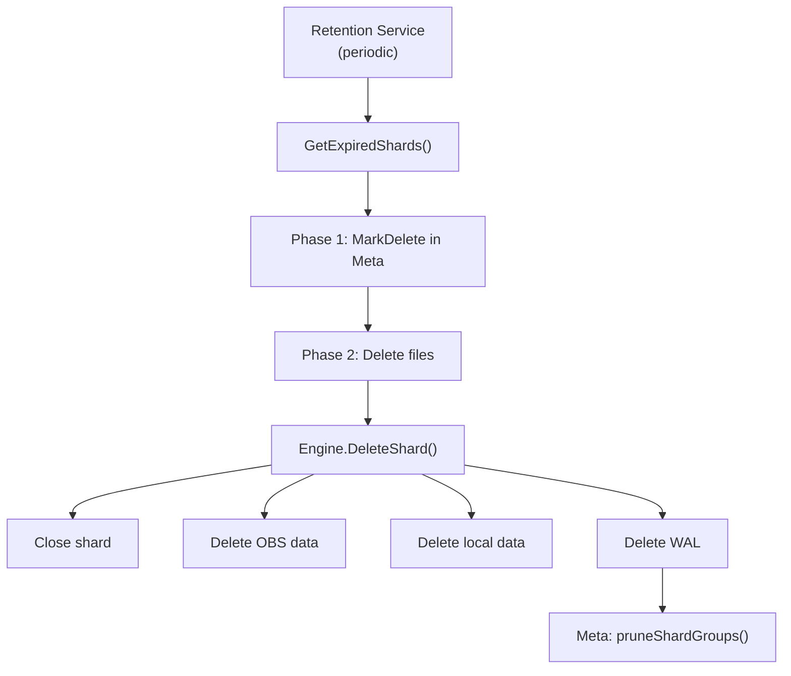

**Two-Phase Deletion:**
1. **Mark**: Update meta to mark shard as deleted
2. **Delete**: After delay, actually delete files and prune meta

#### 3.12.4 Retention Key Files

| File | Purpose |
|------|---------|
| `services/retention/service.go` | Main service, shard deletion |
| `services/retention/mst/service.go` | Per-measurement TTL |
| `services/downsample/service.go` | Downsample coordination |
| `engine/engine.go:598` | ExpiredShards() |
| `engine/engine.go:747` | DeleteShard() |
| `engine/shard.go:1548` | IsExpired() |
| `lib/util/lifted/influx/meta/retentionpolicy.go` | Policy structures |

---

### 3.13 Spdy RPC Framework

**Directory:** `lib/spdy/`, `lib/spdy/transport/`

**Architecture Responsibility:** Custom RPC framework providing multiplexed TCP connections, streaming responses, and flow control. Used for all inter-node communication in openGemini.

#### 3.13.1 RPC Types

| Type | Constant | Description |
|------|----------|-------------|
| **Echo** | `Echo` | Health check |
| **SelectRequest** | `SelectRequest` | SELECT query |
| **WritePointsRequest** | `WritePointsRequest` | Write data |
| **MetaRequest** | `MetaRequest` | Meta operations |
| **PtRequest** | `PtRequest` | Partition operations |
| **WriteStreamPointsRequest** | `WriteStreamPointsRequest` | Stream write |
| **RaftMsgRequest** | `RaftMsgRequest` | Raft consensus |
| **AbortRequest** | `AbortRequest` | Abort query |
| **DDLRequest** | `DDLRequest` | DDL operations |

#### 3.13.2 Frame Header

```
16 bytes: | Version(1) | Type(1) | Flags(2) | Seq(8) | Length(4) |
```

**Flags:**
- `SYN_FLAG` - Session open
- `ACK_FLAG` - Acknowledgment
- `FIN_FLAG` - Session close
- `RST_FLAG` - Reset/abort
- `DATA_ACK_FLAG` - Flow control

#### 3.13.3 RPC Patterns

**Request-Response (one-shot):**
```go
// Client sends request, waits for single response
SelectRequest → Response with FullFlag=true
```

**Streaming (chunked):**
```go
// Multiple partial responses + final
Response with FullFlag=false (repeated)
Response with FullFlag=true (final)
```

**Callback-based Async:**
```go
// Fire-and-forget with callback
transport.Callback = func(resp) { ... }
```

#### 3.13.4 Connection Architecture

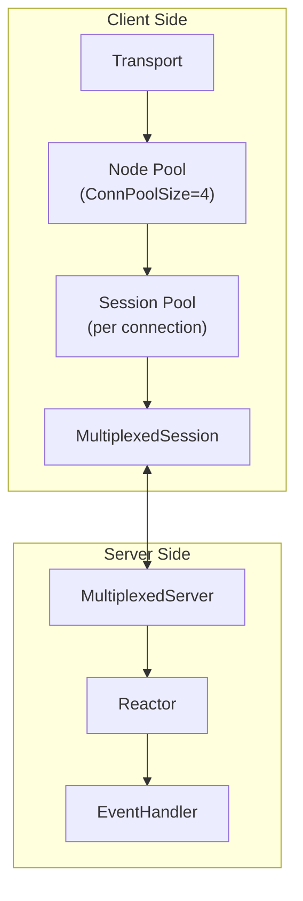

**Session Multiplexing:**
- Single TCP connection carries multiple logical sessions
- Each session has own recv queue
- Optional snappy compression
- Optional TLS

#### 3.13.5 Usage in openGemini

**ts-store (data node):**
- `SelectServer` - Handles SELECT, DDL, Abort, Pt operations
- `InsertServer` - Handles writes, stream writes, Raft msgs

**ts-sql (coordinator):**
- `executor.RPCClient` - Sends queries to ts-store
- `NetStorage` - Interface for writes and DDL

**ts-meta (meta node):**
- `MetaProcessor` - Handles meta operations

#### 3.13.6 Spdy Key Files

| File | Purpose |
|------|---------|
| `lib/spdy/mux.go` | Protocol definitions |
| `lib/spdy/multiplexed_connection.go` | TCP framing |
| `lib/spdy/multiplexed_session.go` | Session management |
| `lib/spdy/multiplexed_session_pool.go` | Connection pooling |
| `lib/spdy/multiplexed_server.go` | Server reactor |
| `lib/spdy/reactor.go` | Event dispatch |
| `lib/spdy/fsm.go` | Session FSM |
| `lib/spdy/transport/transport.go` | High-level transport |
| `lib/spdy/transport/requester.go` | Client request builder |

---

### 3.14 OBS Object Storage (lib/obs/, lib/fileops/)

**Directory:** `lib/obs/`, `lib/fileops/`

**Architecture Responsibility:** Provides object storage interface for cold tier data in hierarchical storage. OBS (Object Storage Service) serves as the final tier for data that has been moved from hot and warm storage.

#### 3.14.1 Storage Tier Hierarchy

```
Hot Tier (SSD/NVMe) → Warm Tier (HDD) → Cold Tier (OBS) → Archive
```

| Tier | Storage Type | Purpose | Latency |
|------|-------------|---------|---------|
| **Hot** | Local SSD/NVMe | Active writes, recent data | Sub-ms |
| **Warm** | Local HDD | Historical data | ~10ms |
| **Cold** | OBS (Object Storage) | Archived data | ~100ms |

#### 3.14.2 Core Components

| Component | File | Purpose |
|-----------|------|---------|
| **OBSOptions** | `lib/obs/obs_options.go` | Configuration (endpoint, bucket, credentials) |
| **OBSClient** | `lib/obs/obs_client.go` | OBS SDK wrapper for CRUD operations |
| **OBSFS** | `lib/obs/obs_fs.go` | VFS implementation for object storage |

#### 3.14.3 OBS File Naming

**File Suffix:** Cold tier files use `.obs` suffix.

```
Format: {sequence}-{level}-{merge}{extent}.tssp.obs
Example: 00008250-0001-00010001.tssp.obs
```

#### 3.14.4 VFS Interface

**OBSFS provides unified file interface:**
```go
type File interface {
    Name() string
    Write(b []byte) (n int, err error)
    Read(b []byte) (n int, err error)
    Seek(offset int64, whence int) (int64, error)
    Close() error
}
```

#### 3.14.5 OBS Key Files

| File | Purpose |
|------|---------|
| `lib/obs/obs_options.go` | OBS connection configuration |
| `lib/obs/obs_client.go` | OBS SDK wrapper |
| `lib/obs/obs_fs.go` | VFS implementation for object storage |
| `lib/fileops/file_ops.go` | File operations abstraction |

---

### 3.15 Hierarchical Storage Service (services/hierarchical/)

**Directory:** `services/hierarchical/`

**Architecture Responsibility:** Manages automatic data tiering between Hot, Warm, and Cold storage based on data age and access patterns.

#### 3.15.1 Tier Movement Flow

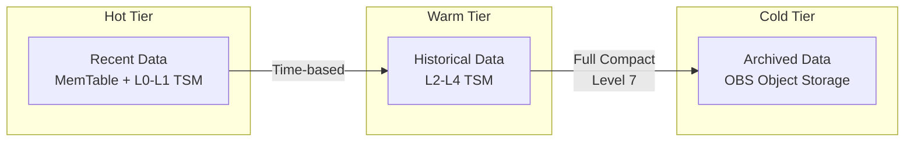

#### 3.15.2 Key Method: ExecShardMove

**Engine.HierarchicalStorage() flow:**
```
Engine.HierarchicalStorage()
    ↓
shard.ExecShardMove(targetTier)
    ↓
startFilesMove()
    ↓
CopyFileFromDFVToOBS()
```

#### 3.15.3 Hierarchical Key Files

| File | Purpose |
|------|---------|
| `services/hierarchical/service.go` | Main service, tier management |
| `engine/shard.go` | ExecShardMove(), startFilesMove() |
| `lib/obs/obs_client.go` | CopyFileFromDFVToOBS() |

---

### 3.16 ts-data (Single-Node Deployment)

**Directory:** `app/ts-data/`

**Architecture Responsibility:** Provides a single-node deployment mode that combines ts-store and ts-sql into a single process.

#### 3.16.1 Architecture Overview

Unlike distributed deployments where ts-sql and ts-store run as separate processes, ts-data combines both:

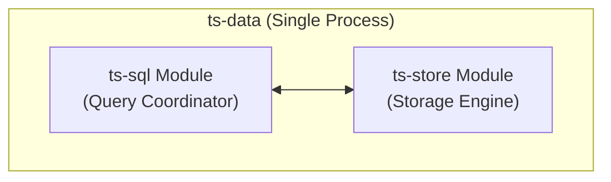

**Key Characteristics:**
- Single binary: `ts-data`
- No network communication between ts-sql and ts-store (in-process)
- Suitable for single-node deployments and testing

#### 3.16.2 Command Structure (main.go)

```go
cmdStore := store.NewCommand(info, true)  // Storage engine
cmdSql := ingestserver.NewCommand(info, false)  // Query/ingest
app.Run(os.Args[1:], cmdStore, cmdSql)
```

#### 3.16.3 Deployment

**Startup:**
```bash
./ts-data -config conf/openGemini.singlenode.conf
```

**Ports (single-node):**
| Port | Service | Description |
|------|---------|-------------|
| 8086 | ts-sql | HTTP API |
| 8087 | ts-store | Internal operations |

---

### 3.16.1 ts-server (All-in-One Single-Node Deployment)

**Directory:** `app/ts-server/`

**Architecture Responsibility:** Provides a complete single-node deployment that combines ts-meta, ts-store, and ts-sql into a single process, enabling full openGemini functionality without external dependencies.

#### 3.16.1.1 Architecture Overview

ts-server combines all three core components (meta, store, sql) into one process:

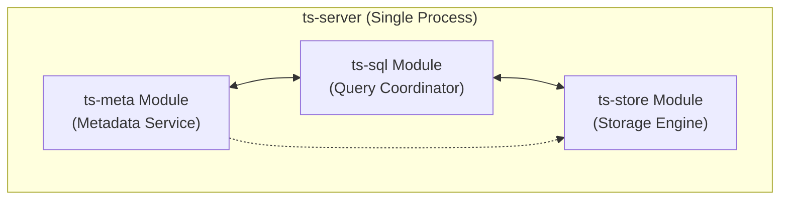

#### 3.16.1.2 ts-server vs ts-data

| Feature | ts-data | ts-server |
|---------|---------|-----------|
| **Components** | ts-sql + ts-store | ts-meta + ts-sql + ts-store |
| **Meta service** | Not included | Included |
| **External dependencies** | Requires external meta | None (fully standalone) |
| **Binary name** | `ts-data` | `ts-server` |
| **App type** | `AppData` ("data") | `AppSingle` ("single") |
| **Use case** | Lightweight single-node | Full single-node production |

#### 3.16.1.3 Command Structure (main.go)

```go
cmdMeta := meta.NewCommand(info, false)      // Metadata service
cmdStore := store.NewCommand(info, false)    // Storage engine
cmdSql := ingestserver.NewCommand(info, false)  // Query/ingest

cmdSql.AfterOpen = func() {
    run.InitStorage(cmdSql.Server, cmdStore.Server)  // Local storage linkage
}
app.Run(os.Args[1:], cmdMeta, cmdStore, cmdSql)
```

#### 3.16.1.4 Deployment

**Startup:**
```bash
./ts-server -config conf/openGemini.singlenode.conf
```

**Ports:**
| Port | Service | Description |
|------|---------|-------------|
| 8086 | ts-sql | HTTP API |
| 8087 | ts-store | Internal operations |
| 8091 | ts-meta | Meta RPC |

---

### 3.17 ts-monitor (Dedicated Monitoring Service)

**Directory:** `app/ts-monitor/`

**Architecture Responsibility:** A dedicated monitoring service that runs as a separate binary to collect system metrics, query cluster metadata, and aggregate error logs.

#### 3.17.1 Architecture Overview

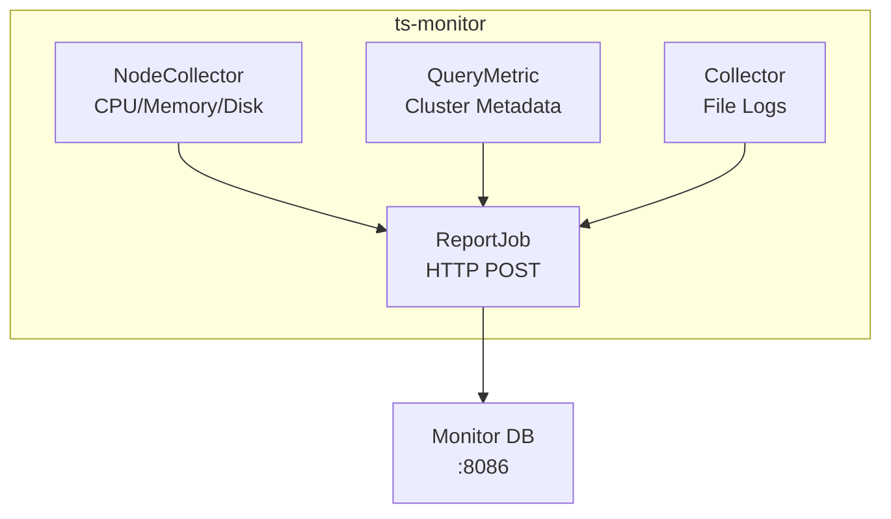

#### 3.17.2 Core Components

| Component | File | Responsibility |
|-----------|------|----------------|
| **NodeCollector** | `collector/node_monitor.go` | CPU, memory, disk via gopsutil |
| **QueryMetric** | `collector/query.go` | DB count, measurement count, series cardinality |
| **Collector** | `collector/collect.go` | File-based metric/error log collection |
| **ReportJob** | `collector/report.go` | HTTP POST reporting |

#### 3.17.3 Metrics Collected

**NodeCollector:**
```go
type nodeMetrics struct {
    Uptime, CpuNum, CpuUsage    // System info
    MemSize, MemInUse, MemUsage  // Memory
    DiskSize, DiskUsed, DiskUsage // Disk
    StorePid, SqlPid, MetaPid    // Process PIDs
}
```

**QueryMetric:**
```sql
SHOW DATABASES                              -- Database count
SHOW MEASUREMENTS                           -- Measurement count
SHOW SERIES CARDINALITY FROM "mst"          -- Series count
```

#### 3.17.4 Configuration (monitor.conf)

```ini
[monitor]
  host = "{{addr}}"
  metric-path = "/tmp/openGemini/metric"
  error-log-path = "/tmp/openGemini/logs"

[query]
  query-enable = false
  http-endpoint = "{{query_addr}}:8086"

[report]
  address = "{{report_addr}}:8086"
  database = "monitor"
```

#### 3.17.5 ts-monitor Key Files

| File | Purpose |
|------|---------|
| `app/ts-monitor/main.go` | Entry point |
| `app/ts-monitor/run/server.go` | Server initialization |
| `collector/node_monitor.go` | System metrics |
| `collector/query.go` | Cluster metadata queries |
| `collector/collect.go` | File monitoring |
| `collector/report.go` | HTTP reporting |

---

### 3.18 Castor (Anomaly Detection & Forecasting)

**Directory:** `services/castor/`, `python/ts-udf/`

**Architecture Responsibility:** Provides ML-powered anomaly detection and time series forecasting as a UDAF (User-Defined Aggregate Function). Uses Python workers for compute-intensive ML while Go handles data flow.

#### 3.18.1 Supported Operations

| Operation | Description |
|-----------|-------------|
| `detect` | Anomaly detection on streaming/batch data |
| `fit_detect` | Combined model fitting and anomaly detection |
| `predict` | Time series forecasting |
| `fit` | Model training/fitting for later use |

**Algorithms:**
- `BatchDIFFERENTIATEAD` - Batch differentiation anomaly detection
- `DIFFERENTIATEAD` - Online differentiation anomaly detection
- `METROPD` - MetroPolis forecasting algorithm

#### 3.18.2 Architecture Overview

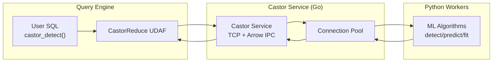

**Data Flow:**
```
Query Engine → Arrow Records → Castor Service → Python Workers → Results
```

#### 3.18.3 Core Components

| Component | File | Purpose |
|-----------|------|---------|
| **Service** | `services/castor/service.go` | Main orchestration, goroutines for monitoring |
| **Client** | `services/castor/client.go` | Connection pool, Arrow IPC client |
| **Constants** | `services/castor/const.go` | Message types, metadata keys |

#### 3.18.4 Integration with Query Engine

**CastorReduce UDAF (udaf_functions.go):**
```go
// Collects chunks from query execution
// Serializes to Arrow records
// Sends to castor service via HandleData()
// Collects results via response channels
```

#### 3.18.5 Configuration

```toml
[castor]
  enabled = true
  addr = "127.0.0.1:8084"    # Python worker address
  pool-size = 4               # Connection pool size
```

#### 3.18.6 Castor Key Files

| File | Purpose |
|------|---------|
| `services/castor/service.go` | Main service (345 lines) |
| `services/castor/client.go` | Connection pool (263 lines) |
| `engine/executor/udaf_functions.go` | Query engine integration |
| `python/ts-udf/` | Python ML workers |

---

### 3.19 ShardMerge Service

**Directory:** `services/shardMerge/`

**Architecture Responsibility:** Merges multiple time-based shards into a single shard as part of storage optimization. Runs periodically to consolidate shards.

#### 3.19.1 Purpose

When data is ingested with time gaps or irregular intervals, multiple small shards may accumulate. ShardMerge consolidates these into a single shard for better storage efficiency.

#### 3.19.2 Architecture

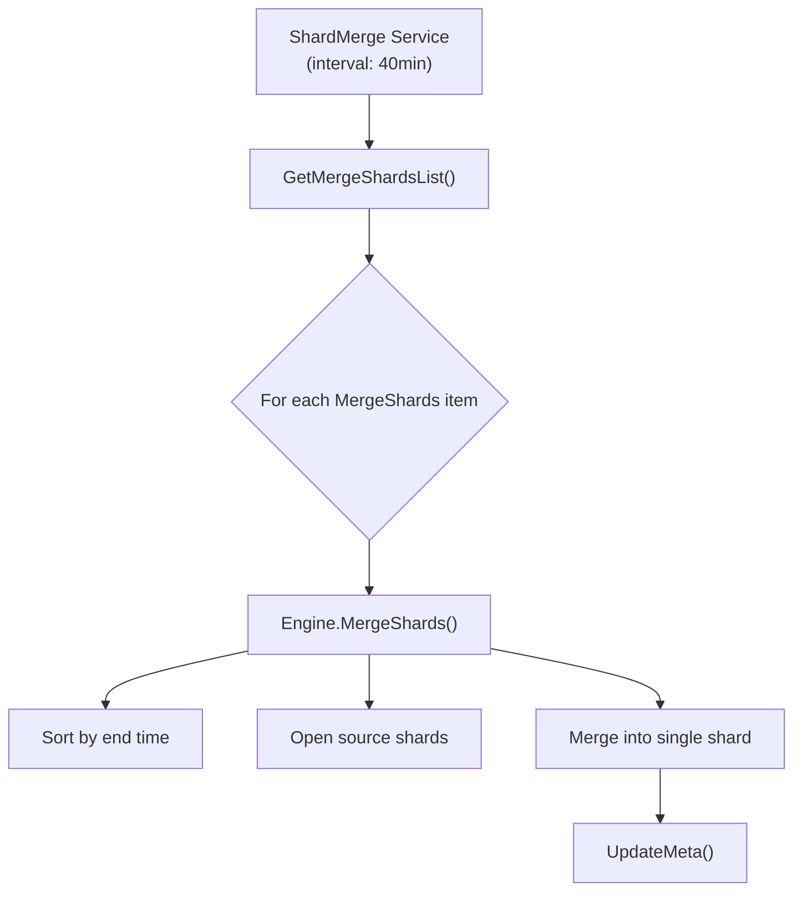

#### 3.19.3 MergeShards Structure

```go
type MergeShards struct {
    DbName        string
    PtId          uint32
    RpName        string
    ShardIds      []uint64
    ShardEndTimes []int64
    EngineType    []config.EngineType
}
```

#### 3.19.4 Configuration

```toml
[shardMerge_service]
  enabled = false           # Disabled by default
  run-interval = "40m"     # Check interval
```

#### 3.19.5 Relationship to Other Services

- Related to **Hierarchical Storage** (shard tier management)
- Part of **ts-store** storage subsystem
- Shares interfaces with hierarchical service (`UpdateShardInfoTier`)

#### 3.19.6 ShardMerge Key Files

| File | Purpose |
|------|---------|
| `services/shardMerge/service.go` | Main service (84 lines) |
| `lib/config/shard_merge.go` | Configuration |
| `lib/util/lifted/influx/meta/shardinfo.go` | MergeShards struct |

---

### 3.20 ts-recover (Data Recovery Utility)

**Directory:** `app/ts-recover/`, `recover/`

**Architecture Responsibility:** Standalone CLI tool for restoring data from backups. Complements `engine/backup.go` for disaster recovery.

#### 3.20.1 Recovery Modes

| Mode | Description |
|------|-------------|
| **Mode 1** | Full + Incremental: Applies full backup, then merges incremental |
| **Mode 2** | Full only: Applies only full backup |

#### 3.20.2 Architecture Overview

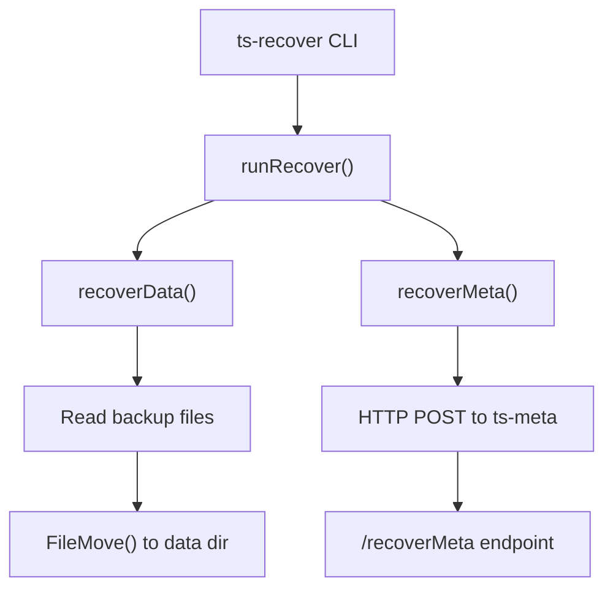

#### 3.20.3 Configuration

| Field | Purpose |
|-------|---------|
| `DataDir` | Target openGemini data directory |
| `RecoverMode` | "1" = full+inc, "2" = full only |
| `FullBackupDataPath` | Full backup location |
| `IncBackupDataPath` | Incremental backup location |
| `Host` | Meta node address |
| `Force` | Force overwrite existing data |

#### 3.20.4 Backup/Recovery Architecture

```
ts-store (engine/backup.go) → Backup Files → ts-recover → ts-meta (/recoverMeta)
```

#### 3.20.5 Recovery Flow

```
1. runRecover() orchestrates
2. recoverData() - Restores time series data files
3. recoverMeta() - Sends metadata to meta node
4. FileMove/FolderMove() - Copies from backup to data dir
```

#### 3.20.6 ts-recover Key Files

| File | Purpose |
|------|---------|
| `app/ts-recover/main.go` | CLI entry point |
| `app/ts-recover/recover/recover.go` | Core recovery logic (417 lines) |
| `engine/backup.go` | Backup creation (complement) |

---

### 3.21 Kafka Consumer Service (services/consume/)

**Directory:** `services/consume/`

**Architecture Responsibility:** Provides a Kafka-compatible consumer interface for reading time-series data from openGemini. Implements Kafka broker protocol (API versions v1/v2) to allow standard Kafka consumers to query data using SQL translated to topic names.

#### 3.21.1 Supported Kafka APIs

| API Key | Name | Supported Versions |
|---------|------|-------------------|
| 1 | Fetch | v2 |
| 2 | ListOffsets | v1 |
| 3 | Metadata | v1 |
| 8 | OffsetCommit | v2 |
| 12 | HeartBeat | v1 |
| 18 | ApiVersions | v1 |

#### 3.21.2 Architecture Overview

```mermaid
flowchart TB
    subgraph "Kafka Consumer"
        KC["Standard Kafka Client"]
    end
    
    KC -->|"Fetch Request<br/>(SQL as topic)"| KS["Kafka Server<br/>(services/consume)"]
    
    KS --> H["HandlerManager"]
    H --> FH["FetchHandleV2"]
    
    FH --> P["Processor"]
    P -->|"CreateConsumeIterator()"| E["Engine"]
    E --> S["Shard<br/>(TSSP files)"]
    
    S --> CR["ConsumeIterator"]
    CR --> P
    P --> FH
    FH --> KC
```

**Key Insight:** The "topic" name in Fetch requests is interpreted as a SQL query string.

#### 3.21.3 Data Flow

1. Client sends **Fetch request** with topic = SQL query
2. `FetchHandleV2.Handle()` unmarshals request
3. `Processor.Init()` parses "topic" as SQL, creates iterator via engine
4. `Processor.Process()` iterates data using `Iterator.Next()`
5. Each `ConsumeRecord` wrapped in Kafka FetchMessage
6. Response serialized as Kafka Fetch v2 format

#### 3.21.4 Core Components

| Component | File | Responsibility |
|-----------|------|----------------|
| **Service** | `service.go` | Main entry, registers handlers |
| **Kafka Server** | `kafka/server.go` | TCP listener, request/response loop |
| **HandlerManager** | `kafka/handle/handler.go` | Routes requests by API key/version |
| **FetchHandleV2** | `fetch.go` | Handles data read requests |
| **Processor** | `processor.go` | Parses SQL, creates engine iterators |

#### 3.21.5 Configuration

```toml
[consume]
  consume-enabled = false     # Default: disabled
  consume-host = "127.0.0.1"
  consume-port = 9092         # Kafka default port
  consume-max-read-size = "1MB"
```

---

### 3.22 gRPC Writer Service (services/writer/)

**Directory:** `services/writer/`

**Architecture Responsibility:** Provides a high-performance gRPC-based write path alternative to HTTP/line protocol. Supports binary protobuf records with compression (ZSTD, LZ4, Snappy).

#### 3.22.1 Two Write Modes

| Mode | Description |
|------|-------------|
| **Legacy (default)** | Converts records to line protocol, delegates to PointsWriter |
| **Shelf** | Direct columnar writes via RecordWriter to storage |

#### 3.22.2 Architecture

```mermaid
flowchart TD
    A["gRPC Client<br/>(opengemini-client-go)"] -->|"WriteRequest<br/>(protobuf)"| S["WriterService"]
    S --> D["RecordDecoder"]
    D -->|"Decompressed Records"| RW["RecordWriter"]
    RW -->|"BlobGroup"| SH["Shard"]
    SH --> ST["Storage"]
```

#### 3.22.3 Legacy vs Shelf Mode

| Aspect | Legacy Mode | Shelf Mode |
|--------|-------------|------------|
| **Data format** | Line protocol | Binary protobuf |
| **Compression** | No | ZSTD/LZ4/Snappy |
| **Stream support** | Yes | No |
| **Write path** | PointsWriter | Direct storage |

#### 3.22.4 Core Components

| Component | File | Responsibility |
|-----------|------|----------------|
| **Service** | `service.go` | gRPC server, Write/Ping RPC |
| **RecordWriter** | `record_writer.go` | Shelf-mode shard routing |
| **Decoder** | `decoder.go` | Protobuf decompression |
| **Context** | `context.go` | WriteContext, MetaManager |

#### 3.22.5 Configuration

```toml
[record_writer]
  enabled = false              # Default: disabled
  rpc-address = "127.0.0.1:8305"
  auth-enabled = false
  shelf-mode = false           # Use RecordWriter path
  tls-enabled = false
```

---

### 3.23 engine/mutable (MemTable)

**Directory:** `engine/mutable/`

**Architecture Responsibility:** Provides the in-memory storage layer (L0 of LSM tree). Manages data before flush to TSM files, with support for both row-store (TSSTORE) and column-store (COLUMNSTORE) engines.

#### 3.23.1 MemTable Structure

```go
type MemTable struct {
    msInfoMap map[string]*MsInfo    // measurement name → data
    msInfos   []MsInfo              // pre-allocated slice
    memSize   int64                 // current memory size (atomic)
    MTable    MTable                // TSSTORE or COLUMNSTORE
    idx       *ski.ShardKeyIndex   // shard key index for RANGE mode
    ref       int32                 // reference count
}
```

#### 3.23.2 Flush Trigger Conditions

| Trigger | Condition | Default |
|---------|-----------|---------|
| **Size-based** | `memSize > 30MB` | 30 MB per shard |
| **Time-based (TSSTORE)** | `writeColdDuration` elapsed | 5 seconds |
| **Time-based (COLUMNSTORE)** | `writeColdDuration` OR `forceSnapShotDuration` | 5s / 20s |

#### 3.23.3 Data Flow: MemTable → TSM

```mermaid
flowchart TD
    A["Write Request"] --> B["MemTable.WriteRows()"]
    B --> C["WriteChunk.appendFields()"]
    C --> D{"Flush Trigger?"}
    D -->|"Yes"| E["MemTable.FlushChunks()"]
    E --> F["Split: ordered vs unordered"]
    F --> G["MsBuilder.WriteRecord()"]
    G --> H["immutable.WriteIntoFile()"]
    H --> I["TSPFile"]
```

#### 3.23.4 Memory Management

**MemTablePool:**
- Pools inactive MemTables by "db/rp" key
- Capacity: 3 per pool
- Expiration: 120 seconds
- Background cleanup every 30s

#### 3.23.5 Key Files

| File | Purpose |
|------|---------|
| `table.go` | Core MemTable, MsInfo, WriteChunk |
| `ts_table.go` | TSSTORE flush implementation |
| `cs_table.go` | COLUMNSTORE with concurrent chunks |
| `pool.go` | MemTable and record pooling |

---

## 4. ts-meta High Availability (HA)

### 4.1 Node Status Detection

**Gossip Protocol (Serf-based)**

openGemini uses HashiCorp Serf for node membership and failure detection. Each ts-meta node maintains a gossip protocol with other meta/data nodes.

**Node Status States (nodeinfo.go:17-27):**
```go
type NodeStatus int64

const (
    StatusNone NodeStatus = iota
    StatusAlive        // Node is healthy and responding
    StatusFailed       // Node is unreachable
    StatusRestart      // Node is restarting
    StatusLeaving       // Node is leaving the cluster
    StatusLeft          // Node has left the cluster
)
```

**Node Types:**
```go
type NodeType int
const (
    SQL NodeType = iota
    STORE
    META
)
```

**DataNode Structure (nodeinfo.go:102-108):**
```go
type DataNode struct {
    NodeInfo
    ConnID      uint64  // Increments on restart
    AliveConnID uint64  // Set via gossip when joining
    Index       uint64
    Az          string  // Availability zone for rack/zone awareness
}

type NodeInfo struct {
    ID              uint64
    Host            string
    RPCAddr         string
    Status          serf.MemberStatus
    LTime           uint64         // Lamport timestamp for event ordering
    GossipAddr      string
    SegregateStatus uint64
    Role            string         // "writer", "reader", or "" (both)
}
```

**Event Sources (cluster_manager.go:37-46):**
```go
type eventFrom string

const (
    fromGossip        eventFrom = "gossip"        // From Serf gossip protocol
    fromSelfCheck     eventFrom = "selfCheck"     // Periodic self-check
    fromRetryChan     eventFrom = "retryChan"     // Retry failed events
    fromReopen        eventFrom = "reopen"        // Meta leader change reopen
    fromLeaderChanged eventFrom = "leaderChanged" // Leadership change
    fromTakeover      eventFrom = "takeover"      // Takeover event
)
```

### 4.2 ClusterManager State Machine

**ClusterManager Structure (cluster_manager.go:69-86):**
```go
type ClusterManager struct {
    store           storeInterface
    eventCh         chan serf.Event           // Primary event channel
    retryEventCh    chan serf.Event           // Retry event channel
    closing         chan struct{}
    handlerMap      map[serf.EventType]memberEventHandler
    memberIds       map[uint64]struct{}        // Alive node IDs
    stop            int32                      // 0=running, 1=stopped
    takeover        chan bool
    getTakeOverNode chooseTakeoverNodeFn
}
```

**Event Handler Map (cluster_manager.go:98-101):**
```go
c.handlerMap = map[serf.EventType]memberEventHandler{
    serf.EventMemberJoin:   &joinHandler{baseHandler{c}},   // Node joins
    serf.EventMemberFailed:  &failedHandler{baseHandler{c}}, // Node fails
    serf.EventMemberLeave:   &leaveHandler{baseHandler{c}}   // Node leaves
}
```

**State Machine Transitions:**

```mermaid
stateDiagram-v2
    [*] --> Running: Start
    Running --> Stopping: Close()
    Stopping --> [*]: All events processed
    
    Running --> Running: handleEvent()
    
    note right of Running
        Events processed:
        - EventMemberJoin
        - EventMemberFailed
        - EventMemberLeave
    end note
```

**Event Processing Flow (cluster_manager.go:268-316):**
```go
func (cm *ClusterManager) checkEvents() {
    for {
        select {
        case <-cm.reOpen:
            // Resend events on leader change to prevent event loss
            resendPreviousEvent(fromReopen)
            return
        case <-cm.closing:
            return
        case event := <-cm.eventCh:
            processEvent(event, fromGossip)
        case event := <-cm.retryEventCh:
            processEvent(event, fromRetryChan)
        case <-check:
            // Periodic self-check every 10 seconds
            checkFailedNode()
        }
    }
}
```

**Failed Node Detection (cluster_manager.go:323-401):**
```go
func (cm *ClusterManager) checkFailedNode() {
    // Check data nodes
    for i := range dataNodes {
        if dataNodes[i].LTime == 0 {
            continue
        }
        e := cm.eventMap[fmt.Sprintf("%d", dataNodes[i].ID)]
        if e == nil {
            // No event found, create synthetic failed event
            e = &serf.MemberEvent{
                Type:      serf.EventMemberFailed,
                EventTime: serf.LamportTime(dataNodes[i].LTime),
                Members: []serf.Member{{
                    Name:   fmt.Sprintf("%d", dataNodes[i].ID),
                    Status: serf.StatusFailed,
                }},
            }
            go cm.processEvent(*e, fromSelfCheck)
        }
    }
}
```

### 4.3 DBPT Management

**DB Partition (Pt) is the fundamental unit of data distribution and HA.**

**PtInfo Structure (database.go:229-235):**
```go
type PtInfo struct {
    Owner  PtOwner   // Owner node information
    Status PtStatus  // Current partition status
    PtId   uint32    // Partition ID
    Ver    uint64    // Version for optimistic locking
    RGID   uint32    // Replica Group ID
}

type PtOwner struct {
    NodeID uint64    // Owning node ID
}
```

**PtStatus State Machine (database.go:217-227):**
```go
const (
    Online PtStatus = iota              // Normal operation, accepting reads/writes
    PrepareOffload                      // Preparing to move away from current node
    PrepareAssign                       // Preparing to accept new partition
    Offline                             // Partition not available
    RollbackPrepareOffload             // Rollback: keeping the partition
    RollbackPrepareAssign              // Rollback: rejecting the partition
    Disabled                           // Partition disabled
)
```

**PtStatus State Transition Diagram:**

```mermaid
stateDiagram-v2
    [*] --> Online: CreateDBPtView
    
    Online --> PrepareOffload: PreOffload command
    Online --> PrepareAssign: Assign command (move in)
    
    PrepareOffload --> Offline: Offload complete
    PrepareOffload --> RollbackPrepareOffload: Rollback command
    
    PrepareAssign --> Online: Assign complete
    PrepareAssign --> RollbackPrepareAssign: Rollback command
    
    Offline --> PrepareAssign: Takeover on new node
    
    RollbackPrepareOffload --> Online: Rollback complete
    RollbackPrepareAssign --> Online: Rollback complete
    
    Online --> Disabled: Disable command
    Disabled --> Online: Enable command
```

**DBPT View Structure (data.go:196):**
```go
type Data struct {
    PtView map[string]DBPtInfos  // Key: dbName, Value: slice of PtInfo
}

type DBPtInfos []PtInfo
```

**Database Hierarchy:**
```
Database (e.g., "sensordb")
├── RetentionPolicy (e.g., "autogen", "1h", replicaN=3)
│   ├── ShardGroup (time-based, e.g., [2024-01-01 00:00, 2024-01-01 01:00))
│   │   ├── Shard 1 (owner: Node 1, [key range: a-m])
│   │   ├── Shard 2 (owner: Node 2, [key range: n-z])
│   └── PtView: {db: "sensordb", pt: [Pt1@Node1, Pt2@Node2, Pt3@Node3]}
```

**UpdatePtInfo Flow (store_fsm.go:773-774):**
```go
func applyUpdatePtInfo(fsm *storeFSM, cmd *proto2.Command) interface{} {
    return meta2.ApplyUpdatePtInfo(fsm.data, cmd)
}
```

**Raft Consensus for Pt Ownership:**
- Each DBPT modification goes through Raft
- Commands: `UpdatePtInfoCommand`, `UpdateShardInfoTierCommand`
- Ensures consistent Pt ownership across meta cluster

### 4.4 Failure Handling & Takeover

**HA Policy Selection (cluster_manager.go:62-67):**
```go
func init() {
    takeOverNodeChoose = make([]chooseTakeoverNodeFn, config.PolicyEnd)
    takeOverNodeChoose[config.WriteAvailableFirst] = getTakeOverNodeForWAF
    takeOverNodeChoose[config.SharedStorage] = getTakeOverNodeForSS
    takeOverNodeChoose[config.Replication] = getTakeOverNodeForWAF
}
```

**Takeover Node Selection (cluster_manager.go:455-499):**

*Write-Available-First Policy:*
```go
func getTakeOverNodeForWAF(cm *ClusterManager, oid uint64, ...) (uint64, error) {
    for {
        cm.mu.RLock()
        if _, ok := cm.memberIds[oid]; ok {
            cm.mu.RUnlock()
            return oid, nil  // Prefer original owner if alive
        }
        cm.mu.RUnlock()
        time.Sleep(time.Second)
    }
}
```

*Shared-Storage Policy:*
```go
func getTakeOverNodeForSS(cm *ClusterManager, oid uint64, nodePtNumMap *map[uint64]uint32, isRetry bool) {
    // Select node with least partitions (load balancing)
    // Or random node on retry
}
```

**Failover Handler (member_event_handler.go:111-129):**
```go
func (bh *baseHandler) failOverForRep(id uint64) error {
    // 1. Get all failed DBPTs owned by failed node
    dbPtInfos := globalService.store.getFailedDbPts(id, meta.Offline)
    
    // 2. Process each partition
    for i := range dbPtInfos {
        bh.cm.processReplication(dbPtInfos[i])
    }
}
```

### 4.5 MigrateStateMachine

**MSM States (migrate_state_machine.go:32-38):**
```go
type MSMState int

const (
    Stopped MSMState = iota
    Running
    Stopping
)
```

**MigrateStateMachine Structure (migrate_state_machine.go:40-56):**
```go
type MigrateStateMachine struct {
    retryMu        sync.RWMutex
    retryingEvents []MigrateEvent
    state           MSMState
    eventsRecovered bool
    eventMap        map[string]MigrateEvent  // Dedupe in-flight events
}
```

**MSM Event Recovery Flow (migrate_state_machine.go:100-116):**
```go
func (m *MigrateStateMachine) recoverStateMachine() {
    // Get pending events from store
    events := globalService.store.getEvents()
    
    // Re-execute all events to recover state
    for _, e := range events {
        event := m.createEventFromInfo(e)
        event.setRecovery(true)
        m.executeEvent(event)
    }
    
    m.eventsRecovered = true
    close(m.recoverNotify)  // Signal recovery complete
}
```

**Event Types (migrate_state_machine.go:118-131):**
```go
func (m *MigrateStateMachine) createEventFromInfo(e *meta.MigrateEventInfo) MigrateEvent {
    switch EventType(e.GetEventType()) {
    case AssignType:
        me = NewAssignEvent(e.GetPtInfo(), e.GetDst(), e.GetAliveConnId(), false)
    case MoveType:
        me = NewMoveEvent(e.GetPtInfo(), e.GetSrc(), e.GetDst(), e.GetAliveConnId(), false)
    }
}
```

### 4.6 Raft Leader State & Lifecycle

**Store Structure (store.go:54-75):**
```go
type Store struct {
    data       *Data
    config     *Config
    path       string
    raft       *RaftWrapper
    notifyCh   <-chan bool   // Raft leadership notification channel
    stepDown   chan struct{}  // Closed when leader steps down
    deleteWg   sync.WaitGroup // Waits for delete goroutines on stepdown
    closing    chan struct{}
    cm         *ClusterManager
}
```

**RaftNotifyCh Event Flow:**

```mermaid
stateDiagram-v2
    [*] --> Follower: Initial Start
    Follower --> Candidate: Election timeout
    Candidate --> Leader: Won election (notifyCh ← true)
    Leader --> Follower: Lost quorum (notifyCh ← false)
    
    note right of Leader
        On notifyCh ← true:
        1. Create stepDown channel
        2. Start ClusterManager
        3. Start MSM
        4. Start BalanceManager
        5. Start MasterPtBalanceManager
        6. Start delete goroutines
    end note
    
    note left of Follower
        On notifyCh ← false:
        1. Close stepDown channel
        2. Stop all managers
        3. Wait for deleteWg
    end note
```

**Leadership Change Handler (store.go:483-525):**

```go
case v := <-s.notifyCh:
    stat.NewMetaStatistics().AddLeaderSwitchTotal(1)
    if v {
        // ELECTED LEADER
        s.stepDown = make(chan struct{})
        globalService.msm.Start()
        globalService.balanceManager.Start()
        globalService.clusterManager.Start()
        globalService.masterPtBalanceManager.Start()
        
        s.deleteWg.Add(3)
        go s.checkDelete(DeleteDatabase)
        go s.checkDelete(DeleteRp)
        go s.checkDelete(DeleteMeasurement)
        go s.RepairPT(time.Minute)
    } else {
        // STEPPED DOWN
        stat.NewMetaStatCollector().Clear(stat.TypeMetaStatItem)
        close(s.stepDown)
        globalService.clusterManager.Stop()
        globalService.balanceManager.Stop()
        globalService.masterPtBalanceManager.Stop()
        globalService.msm.Stop()
        s.deleteWg.Wait()  // Wait for pending deletes
    }
```

**Delete Goroutines & stepDown (store.go:1196-1206):**

```go
func (s *Store) checkDelete(deleteType int) {
    defer s.deleteWg.Done()
    for {
        select {
        case <-s.closing:
            return
        case <-s.stepDown:
            return  // Exit immediately on stepdown
        default:
            // Process pending deletes...
        }
    }
}
```

**Raft States:**
| State | Description |
|-------|-------------|
| **Follower** | Replicates log entries from leader, votes for candidates |
| **Candidate** | Initiates election when election timeout expires |
| **Leader** | Accepts writes, replicates logs to followers, manages all cluster operations |

**Leadership Guarantee:**
- Only the Raft leader can process metadata writes
- All PtInfo updates go through `storeFSM.Apply()` → Raft consensus
- Leadership is required for ClusterManager, MSM, and BalanceManager operation

---

## 5. Core Data Models

### 5.1 Time Series Record

```go
// lib/record/record.go
type Record struct {
    *RecMeta
    ColVals []ColVal  // Column values
    Schema  Schemas   // Field definitions
}

type Field struct {
    Name string
    Type uint8  // Field_Type_Tag, Field_Type_Float, Field_Type_Int, Field_Type_String, Field_Type_Boolean
}

// lib/util/lifted/vm/protoparser/influx/
type Row struct {
    Time    uint64
    Tags    PointTags
    Fields  Fields
    Name    string  // Measurement name
    HashID  uint64  // Pre-computed hash for sharding
}
```

### 5.2 Line Protocol Format

```
measurement,tag1=value1,tag2=value2 field1=1.0,field2=2i 1700000000000000000
```

Components:
- **Measurement**: Table name
- **Tags**: Indexed key-value pairs (comma-separated)
- **Fields**: Non-indexed values (comma-separated)
- **Timestamp**: Nanoseconds since epoch

### 5.3 Database Hierarchy

```go
DatabaseInfo {
    Name: "sensordb"
    RetentionPolicies: {
        "autogen": RetentionPolicyInfo {
            Duration: 0  // Infinite
            ShardGroupDuration: 1h
            ReplicaN: 1
            ShardGroups: [
                ShardGroupInfo {
                    StartTime: 2024-01-01 00:00:00
                    EndTime: 2024-01-01 01:00:00
                    Shards: [
                        ShardInfo { ID: 1, Owners: [Node1] },
                        ShardInfo { ID: 2, Owners: [Node2] }
                    ]
                }
            ]
        }
    }
}
```

### 5.4 Shard Identifier

```go
type ShardIdentifier struct {
    NodeID    uint64
    ShardID   uint64
    Policy    string
    OwnerType string  // "dbpt"
    Database  string
    RpName    string
}
```

---

## 6. Core Data Flows & Workflows

### 6.1 Write Path (Line Protocol → TSM)

```mermaid
flowchart TD
    A["Client<br/>Line Protocol"] --> B["ts-sql HTTP API<br/>/write"]
    B --> C["PointsWriter<br/>Decode & Validate"]
    C --> D["ShardMapper<br/>Map to Shards"]
    D --> E1["ts-store-1<br/>Shard-1"]
    D --> E2["ts-store-2<br/>Shard-2"]
    
    E1 --> F1["WAL<br/>Write-Ahead Log"]
    E2 --> F2["WAL"]
    
    F1 --> G1["MemTable<br/>Mutable Store"]
    F2 --> G2["MemTable"]
    
    G1 -.Flush.-> H1["TSM File<br/>Level 0"]
    G2 -.Flush.-> H2["TSM File<br/>Level 0"]
    
    H1 --> I1["Compaction<br/>Level 1-6"]
    H2 --> I2["Compaction<br/>Level 1-6"]
    
    I1 --> J["Cold Storage<br/>Optional Tiering"]
    I2 --> J
```

**Step-by-Step:**

1. **HTTP Receive** (ts-sql): Parse line protocol, create `influx.Row` objects
2. **Shard Routing** (coordinator): Hash rows by (db, rp, time) → determine target shard
3. **WAL Append** (shelf): Write to WAL for durability before memory
4. **MemTable Write** (mutable): Append to in-memory buffer
5. **Flush Trigger**: When memtable reaches size/time threshold
6. **TSM File Creation**: Convert memtable to immutable TSM file (Level 0)
7. **Compaction**: Background process merges TSM files through levels

**WAL Record Types (wal.go:57-64):**
```go
const (
    WriteWalLineProtocol = iota + 1
    WriteWalArrowFlight
)
```

### 6.2 Query Path (InfluxQL → Results)

#### 6.2.1 High-Level Query Flow

```mermaid
sequenceDiagram
    participant Client
    participant ts_sql as ts-sql HTTP
    participant Meta as ts-meta
    participant Store1 as ts-store-1
    participant Store2 as ts-store-2

    Client->>ts_sql: POST /query<br/>SELECT * FROM cpu<br/>WHERE time > now()-1h

    ts_sql->>ts_sql: serveQuery()
    ts_sql->>ts_sql: Parse SQL → InfluxQL AST
    ts_sql->>ts_sql: query.Prepare() → Build Logical Plan

    ts_sql->>Meta: ShardGroupsByTimeRange(db, rp, timeRange)
    Meta-->>ts_sql: ShardGroups: [shard1, shard2, ...]

    par Distributed Query Execution
        ts_sql->>Store1: RPC: Scan(shard1, querySchema)
        ts_sql->>Store2: RPC: Scan(shard2, querySchema)
    end

    Store1-->>ts_sql: ChunkReader results
    Store2-->>ts_sql: ChunkReader results

    ts_sql->>ts_sql: MergeSort & Aggregate
    ts_sql-->>Client: JSON/Chunked Response
```

---

#### 6.2.2 HTTP Entry Point (handler.go:1160)

**serveQuery() Flow:**

```go
func (h *Handler) serveQuery(w http.ResponseWriter, r *http.Request, user meta2.User) {
    // 1. Parse query from request
    q, err, status = h.getSqlQuery(r, qr)
    
    // 2. Build ExecutionOptions
    opts := query.ExecutionOptions{
        Database:      db,
        RetentionPolicy: rp,
        ChunkSize:     chunkSize,
        ParallelQuery: atomic.LoadInt32(&syscontrol.ParallelQueryInBatch) == 1,
    }
    
    // 3. Execute query
    results := h.QueryExecutor.ExecuteQuery(q, opts, closing, qDuration)
    
    // 4. Stream results to client
    for r := range results {
        rw.WriteResponse(Response{Results: []*query.Result{r}})
    }
}
```

---

#### 6.2.3 Query Execution Pipeline

**Executor.ExecuteQuery (executor.go:311):**
```go
func (e *Executor) ExecuteQuery(query *influxql.Query, opt ExecutionOptions, ...) <-chan *Result {
    if opt.ParallelQuery {
        go e.executeParallelQuery(query, opt, closing, qDuration, results)
    } else {
        go e.executeQuery(query, opt, closing, qDuration, results)
    }
    return results
}
```

**StatementExecutor.ExecuteStatement (statement_executor.go:207):**
```go
func (e *StatementExecutor) ExecuteStatement(stmt influxql.Statement, ctx, seq) error {
    if stmt, ok := stmt.(*influxql.SelectStatement); ok {
        // SELECT statements use pipeline executor
        return e.retryExecuteSelectStatement(stmt, ctx, seq)
    }
    // Other statements (DDL, SHOW, etc.) handled directly
}
```

**retryExecuteSelectStatement (statement_executor.go:1047):**
```go
func (e *StatementExecutor) retryExecuteSelectStatement(stmt, ctx, seq) error {
    for i := 0; i < maxRetrySelectCount; i++ {
        err = e.executeSelectStatement(stmt, ctx, seq)
        if err == nil || !errno.IsRetryErrorForPtView(err) {
            break
        }
        time.Sleep(retrySelectInterval * (1 << i))
    }
    return err
}
```

---

#### 6.2.4 Logical Plan Creation

**executor.Select() (executor/select.go:52):**
```go
func Select(ctx, stmt *influxql.SelectStatement, shardMapper query.ShardMapper, opt) (Executor, error) {
    // 1. Prepare: Compile AST and create ShardMapper
    s, err := query.Prepare(stmt, shardMapper, opt)
    
    // 2. Build Logical Plan from AST
    return s.Select(ctx)
}
```

**query.Prepare() (query/select.go:137):**
```go
func Prepare(stmt, shardMapper ShardMapper, opt) (PreparedStatement, error) {
    // 1. Compile InfluxQL to internal representation
    c, _, err := Compile(stmt, CompileOptions{})
    
    // 2. Create PreparedStatement with ShardMapper
    return c.Prepare(shardMapper, opt)
}
```

**preparedStatement.Select() (executor/select.go:179):**
```go
func (p *preparedStatement) Select(ctx) (Executor, error) {
    // Build the query plan using optimizer
    best, req, err := p.BuildLogicalPlan(ctx)
    
    // Returns a PipelineExecutor that runs the query
    return p.executorBuilder.Build(ctx, best)
}
```

---

#### 6.2.5 Shard Mapping (ClusterShardMapper)

**MapShards() (shard_mapper.go:61):**
```go
func (csm *ClusterShardMapper) MapShards(stmt, t influxql.TimeRange, opt, condition) (ShardGroup, error) {
    // 1. Get all ShardGroups in the time range
    groups, err := csm.MetaClient.ShardGroupsByTimeRange(db, rp, tmin, tmax)
    
    // 2. For each measurement, determine target shards
    for _, source := range sources {
        // Filter shards by engine type
        // Use shard key to find matching shards
        shs = groups[i].TargetShards(measurement, shardKeyInfo, condition, aliveShardIdxes)
    }
    
    return csming, nil  // ClusterShardMapping
}
```

---

#### 6.2.6 Pipeline Executor Architecture

**PipelineExecutor Structure (executor/pipeline_executor.go:51):**
```go
type PipelineExecutor struct {
    dag        *TransformDag      // Directed Acyclic Graph of transforms
    root       *TransformVertex   // Root node of the DAG
    processors Processors        // All processor nodes
    context    context.Context    // Query context
    Query      string             // Query string for debugging
}
```

**Pipeline Transform DAG:**

```mermaid
graph TD
    subgraph "Query Plan DAG"
        RS["RawSeries<br/>(Source)"]
        CHUNK["ChunkReader<br/>(Index Scan)"]
        FILTER["FilterTransform<br/>(WHERE)"]
        AGG["AggregateTransform<br/>(GROUP BY)"]
        SORT["SortTransform<br/>(ORDER BY)"]
        LIMIT["LimitTransform<br/>(LIMIT)"]
        OUT["Output<br/>(Sink)"]
    end
    
    RS --> CHUNK
    CHUNK --> FILTER
    FILTER --> AGG
    AGG --> SORT
    SORT --> LIMIT
    LIMIT --> OUT
```

**Execute Flow (executor/pipeline_executor.go:259):**
```go
func (exec *PipelineExecutor) Execute(ctx context.Context) error {
    exec.InitContext(ctx)
    
    // Run each processor in parallel
    wg.Add(len(exec.processors))
    for _, p := range exec.processors {
        go func(processor) {
            err := processor.Work(exec.context)  // Run transform
        }(p)
    }
    wg.Wait()
    
    return processorErr
}
```

---

#### 6.2.7 ts-store Query Execution

**shard.CreateLogicalPlan() (iterator_plan.go:52):**
```go
func (s *shard) CreateLogicalPlan(ctx, sources, schema) (hybridqp.QueryNode, error) {
    // 1. Create query cursors from index
    info, err := s.CreateCursor(ctx, schema)
    
    // 2. Return logical dummy shard wrapping cursors
    return executor.NewLogicalDummyShard(info), nil
}
```

**shard.CreateCursor() (iterators.go:130):**
```go
func (s *shard) CreateCursor(ctx, schema) (comm.TSIndexInfo, error) {
    // 1. Scan TSI index to find matching series
    result, seriesNum, err := s.Scan(span, schema, allocFunc)
    
    // 2. Clone readers (mutable + immutable)
    immutableReader, mutableReader, err := s.cloneReaders(mstName, hasTimeFilter, tr)
    
    // 3. Create group cursors for data iteration
    groupCursors, err = s.createGroupCursors(ctx, span, schema, result, ...)
    
    return NewTsIndexInfo(immutableReader, mutableReader, groupCursors), nil
}
```

---

#### 6.2.8 Index Scan (TSI → Skip Index → TSM)

**shard.Scan() - Index Lookup:**
```go
func (s *shard) Scan(span, schema, allocFunc) (tsi.GroupSeries, int64, error) {
    // 1. Get IndexRelation for measurement
    indexRelation := s.indexBuilder.GetIndexRelation()
    
    // 2. For each secondary index (BloomFilter, MinMax, etc.)
    for _, relation := range indexRelation.Relations {
        // Skip indexes used to filter fragments
        skReaders, _ := relation.CreateSKFileReaders(schema)
    }
    
    // 3. Search TSI MergeSetIndex for matching series
    tagSets, seriesNum, err := s.indexBuilder.Scan(span, mstName, opt, callback)
    
    return tagSets, seriesNum, nil
}
```

**Skip Index Scan Flow:**

```mermaid
sequenceDiagram
    participant Query as Query Condition
    participant TSI as TSI Index<br/>(Primary)
    participant SK as Skip Index<br/>(BloomFilter/MinMax)
    participant TSM as TSM Files

    Query->>TSI: SearchSeries(condition)
    TSI-->>Query: SeriesIDs matching condition
    
    Query->>SK: MayBeInFragment(fragId)?
    SK-->>Query: true/false/maybe
    
    alt SK says NO
        Query->>Query: Skip entire fragment
    else SK says MAYBE
        Query->>TSM: Read fragment data
        TSM-->>Query: Actual data records
    end
```

---

#### 6.2.9 Data Reading (TSM + MemTable)

**KeyCursor Interface (comm/cursor.go:46):**
```go
type KeyCursor interface {
    Next() (*record.Record, SeriesInfoIntf, error)
    Close() error
    GetSchema() record.Schemas
}
```

**ChunkReader.Work() (iterator_plan.go:260):**
```go
func (r *ChunkReader) Work(ctx context.Context) error {
    for {
        select {
        case <-ctx.Done():
            return nil
        default:
        }
        
        // Get next record from cursor
        rec, info, err := r.cursor.Next()
        if err == io.EOF {
            return nil
        }
        
        // Apply transforms and output
        chunk := r.transform(rec)
        r.Output.Collect(chunk)
    }
}
```

**Reading from Immutable TSM (MmsTables):**
```go
func (mms *MmsTables) Search(span, schema, seriesKeys, opts) (*SeriesIterator, error) {
    // 1. Seek to first matching key in TSM
    ts.Seek(key)
    
    // 2. Read blocks matching time range
    for ts.NextItem() {
        // Decode TSM block
        rec, err := ts.ReadBlock(ofs, size)
    }
    
    return NewSeriesIterator(rec), nil
}
```

---

#### 6.2.10 Complete Query Flow Diagram

```mermaid
flowchart TD
    A["Client HTTP Request<br/>/query"] --> B["serveQuery()<br/>Parse SQL to AST"]
    B --> C["query.Prepare()<br/>Build Logical Plan"]
    C --> D["executor.Select()<br/>Create PipelineExecutor"]
    
    D --> E["ClusterShardMapper.MapShards()<br/>Find shards for time range"]
    E --> F["Parallel: RPC to each ts-store"]
    
    subgraph "ts-store Query Execution"
        F1["shard.CreateLogicalPlan()<br/>Create Query Plan"]
        F1 --> F2["shard.CreateCursor()<br/>Initialize Index Scan"]
        F2 --> F3["shard.Scan()<br/>TSI + Skip Index Lookup"]
        F3 --> F4["cloneReaders()<br/>Get MemTable + TSM readers"]
        F4 --> F5["createGroupCursors()<br/>Create KeyCursors"]
        F5 --> F6["PipelineExecutor.Execute()<br/>Run Transform DAG"]
        F6 --> F7["ChunkReader.Work()<br/>Read & Transform Data"]
    end
    
    F --> G["Merge Results<br/>Sort/Aggregate"]
    G --> H["Stream to Client<br/>Chunked JSON Response"]
```

---

#### 6.2.11 Query Path Key Files

| Component | File | Function |
|-----------|------|----------|
| **HTTP Entry** | `lib/util/lifted/influx/httpd/handler.go:1160` | `serveQuery()` |
| **Query Executor** | `lib/util/lifted/influx/query/executor.go:311` | `ExecuteQuery()` |
| **Statement Executor** | `lib/util/lifted/influx/coordinator/statement_executor.go:207` | `ExecuteStatement()` |
| **Pipeline Builder** | `engine/executor/select.go:52` | `Select()` |
| **Shard Mapper** | `coordinator/shard_mapper.go:61` | `MapShards()` |
| **Query Plan** | `engine/iterator_plan.go:52` | `CreateLogicalPlan()` |
| **Cursor Creation** | `engine/iterators.go:130` | `CreateCursor()` |
| **Index Scan** | `engine/index/tsi/mergeset_index.go` | `SearchSeries()` |
| **Pipeline Executor** | `engine/executor/pipeline_executor.go:259` | `Execute()` |
| **Chunk Reader** | `engine/iterator_plan.go:209` | `NewChunkReader()` |

---

#### 6.2.12 Query Plan & Operator Pushdown

##### 6.2.12.1 Query Planning Pipeline

The query planning follows this flow:

```mermaid
flowchart TD
    A["SQL: SELECT * FROM cpu<br/>WHERE host='server1'<br/>GROUP BY host, time(1h)"] --> B["Compile<br/>InfluxQL AST"]
    B --> C["Prepare<br/>Create ShardMapper & QuerySchema"]
    C --> D["BuildLogicalPlan<br/>Build Raw Logical Plan"]
    D --> E["Optimize (HeuPlanner)<br/>Apply Pushdown Rules"]
    E --> F["BuildExecutor<br/>Convert to PipelineExecutor"]
    F --> G["Execute<br/>Run DAG of Processors"]
```

**BuildLogicalPlan (executor/select.go:179):**
```go
func (p *preparedStatement) BuildLogicalPlan(ctx context.Context) (hybridqp.QueryNode, hybridqp.Trait, error) {
    // 1. Create QuerySchema from AST
    schema := NewQuerySchemaWithJoinCase(fields, sources, opt, ...)
    
    // 2. Build initial logical plan
    plan, err := buildQueryPlan(ctx, stmt, qc, schema)
    
    // 3. Apply heuristic planner/optimizer
    planner := BuildHeuristicPlanner()
    planner.SetRoot(plan)
    best := planner.FindBestExp()  // Apply pushdown rules
    
    return best, mstsReqs, nil
}
```

---

##### 6.2.12.2 Logical Plan Builder (Operator Stacking)

**LogicalPlanBuilderImpl (logic_plan.go:2543):**
```go
type LogicalPlanBuilderImpl struct {
    schema hybridqp.Catalog
    stack  QueryNodeStack   // Stack of logical plan nodes
    rules  ExprRewriteRules
}
```

**Plan Building (buildNodes):**
```go
func buildNodes(builder *LogicalPlanBuilderImpl, schema, s *QuerySchema) {
    if len(schema.Calls()) > 0 {
        buildAggNode(builder, schema, hasSlidingWindow)  // Aggregate
    }
    if !hasSelector && s.opt.HasInterval() {
        builder.Interval()  // Time grouping
    }
    builder.Project()  // Projection
    if hasSort {
        buildSortNode(builder, schema, s)  // Sort
    }
    if schema.HasLimit() {
        builder.Limit(limit, offset)  // Limit
    }
}
```

**Logical Plan Node Types (logic_plan.go:2579-2900):**

| Method | Creates Node | Description |
|--------|-------------|-------------|
| `Aggregate()` | LogicalAggregate | Aggregation (GROUP BY) |
| `HashAgg()` | LogicalHashAgg | Hash-based aggregation |
| `Filter()` | LogicalFilter | WHERE clause filtering |
| `Interval()` | LogicalInterval | Time window grouping |
| `Limit()` | LogicalLimit | LIMIT/OFFSET |
| `Sort()` | LogicalSort | ORDER BY |
| `Project()` | LogicalProject | Column projection |
| `Series()` | LogicalSeries | Series scan source |
| `IndexScan()` | LogicalIndexScan | Index-based scan |
| `HttpSender()` | LogicalHttpSender | Remote query sending |
| `Exchange()` | LogicalExchange | Data exchange node |
| `Merge()` | LogicalMerge | Merge results |

---

##### 6.2.12.3 Heuristic Planner (Optimization Rules)

**HeuPlannerImpl (heu_planner.go:596):**
```go
func (p *HeuPlannerImpl) FindBestExp() hybridqp.QueryNode {
    p.executeProgram(p.mainProgram)  // Run optimization rules
    final := p.buildFinalPlan(p.root)  // Build final plan
    return final
}
```

**SQL Optimization Rules (initSqlHeuInstruction):**
```go
rules := []OptRuleCatagory{
    RULE_SUBQUERY,          // Subquery handling
    RULE_PUSHDOWN_LIMIT,    // Limit pushdown
    RULE_PUSHDOWN_AGG,      // Aggregation pushdown
    RULE_SPREAD_AGG,        // Aggregation spreading
    RULE_HEIMADLL_PUSHDOWN, // Series-level pushdown
    RULE_PUSHDOWN_DISTINCT, // Distinct pushdown
}
```

---

##### 6.2.12.4 Operator Pushdown Mechanism

**Pushdown Principles:**

Operators are pushed down to the **earliest possible execution point** to reduce data volume:

```
┌─────────────────────────────────────────────────────────────┐
│  Without Pushdown:                                        │
│  All data → Network Transfer → Filter on Coordinator      │
│                                                             │
│  With Pushdown:                                            │
│  Filter on Storage Node → Only Matching Data → Network     │
└─────────────────────────────────────────────────────────────┘
```

**CanPushDown Interface (query/op_factory.go:63-108):**
```go
type Aggreator interface {
    CanPushDown() bool
    CanPushDownSeries() bool  // Can push down in series aggregation
    OptimizeAgg() bool        // Can optimize aggregation
}
```

**Aggregate Functions Pushdown Support (query/agg_functions.go):**

| Function | CanPushDown | CanPushDownSeries |
|----------|-------------|-------------------|
| count | true | true |
| sum | true | true |
| min | true | true |
| max | true | true |
| first | true | true |
| last | true | true |
| mean | true | true |

---

##### 6.2.12.5 Limit Pushdown

**LimitPushdownToSeriesRule (heu_rule.go:522):**
```go
func (r *AggPushdownToSeriesRule) OnMatch(call *OptRuleCall) {
    series, ok := call.Node(0).(*LogicalSeries)
    if !series.Schema().CanSeqAggPushDown() {
        return
    }
    // Transform: Add aggregate node below series
    call.TransformTo(node)
}
```

**Limit Pushdown Flow:**

```mermaid
sequenceDiagram
    participant Coordinator
    participant Store as ts-store
    participant Shard as Shard

    Note over Coordinator: Original Plan: Limit → Exchange → Aggregate → Series
    
    Coordinator->>Store: Send: Limit + Exchange + Aggregate + Series
    Note over Store: Optimized Plan: Series → Aggregate → Exchange → Limit
    
    Store->>Shard: Execute Series → Aggregate (pushed down)
    Shard-->>Store: Partial Aggregated Results
    Store-->>Coordinator: Filtered & Aggregated Data
    Coordinator->>Coordinator: Final Limit Application
```

---

##### 6.2.12.6 Aggregation Pushdown

**AggPushdownToSeriesRule (heu_rule.go:565):**
```go
func (r *AggPushdownToSeriesRule) OnMatch(call *OptRuleCall) {
    series, ok := call.Node(0).(*LogicalSeries)
    
    // Only pushdown if:
    // 1. Has aggregate functions
    // 2. Can pushdown (not in subquery)
    // 3. Contains series-level aggregations
    if series.Schema().CanCallsPushdown() {
        // Push aggregate computation to storage node
        call.TransformTo(aggNode)
    }
}
```

**Pushdown Conditions:**
```go
func (r *AggPushdownToSeriesRule) OnMatch(call *OptRuleCall) {
    if series.Schema().IsInSubquerySchema() {
        return  // Cannot pushdown in subquery
    }
    if series.Schema().ContainSeriesIgnoreCall() {
        return  // Cannot pushdown if contains non-pushdown functions
    }
    // Pushdown allowed...
}
```

---

##### 6.2.12.7 Query Plan Types

**Plan Types (executor/select.go:203):**
```go
planType := GetPlanType(schema, stmt)
if planType != UNKNOWN {
    // Use template plan for common patterns
    templatePlan = SqlPlanTemplate[planType].GetPlan()
    plan = p.buildPlanByCache(ctx, schema, templatePlan, &mstsReqs)
    return plan, mstsReqs, err
}
// Fall back to extended planning
plan = buildExtendedPlan(ctx, stmt, qc, schema)
```

**Template Plan Types:**
- `UNLIMIT_SERIES_POINT` - Full series scan
- `LIMIT_SERIES_POINT` - Limited series scan
- `LIMIT_SERIES_AGG` - Series with aggregation
- `LIMIT_TIME_AGG` - Time-based aggregation
- `LIMIT_TAG_AGG` - Tag-based aggregation

---

##### 6.2.12.8 Distributed Query Planning

**Remote Query Traits (executor/select.go:768-820):**
```go
func BuildNodeExchange(ctx context.Context, builder LogicalPlanBuilder, queryPlan hybridqp.QueryNode) error {
    // Convert traits to RemoteQuery nodes
    traits := TransNodeTraits(*nodeTraits)
    
    // Create exchange node for distributed execution
    queryPlan = builder.CreateNodePlan(queryPlan, traits)
    return nil
}

type RemoteQuery struct {
    Database string
    PtID     uint32
    NodeID   uint64
    ShardIDs []uint64
    Opt     *query.ProcessorOptions
}
```

**Multi-Node Query Distribution:**
```mermaid
graph TD
    subgraph "Coordinator (ts-sql)"
        Q["Query Plan"]
        Ex["Exchange Node"]
    end
    
    subgraph "ts-store-1"
        S1["Series"]
        A1["Aggregate"]
    end
    
    subgraph "ts-store-2"
        S2["Series"]
        A2["Aggregate"]
    end
    
    Q --> Ex
    Ex -->|"Remote Query 1"| S1
    Ex -->|"Remote Query 2"| S2
    S1 --> A1
    S2 --> A2
    A1 --> Merge["Merge Results"]
    A2 --> Merge
    Merge --> Final["Final Aggregate"]
```

---

##### 6.2.12.9 Query Schema & Options

**QuerySchema (executor/schema.go):**
```go
type QuerySchema struct {
    opt     *query.ProcessorOptions
    sources influxql.Sources
    fields  influxql.Fields
    // ...
}

type ProcessorOptions struct {
    Name       string
    Expr       influxql.Expr        // Main condition
    Condition  influxql.Expr        // WHERE clause
    StartTime  int64               // Time range start
    EndTime    int64               // Time range end
    Dimensions []string             // GROUP BY tags
    Limit      int                  // LIMIT
    SLimit     int                 // Series LIMIT
    ChunkSize  int                 // Response chunk size
    // ...
}
```

**Query Hint Types (hybridqp/compiler.go):**
```go
const (
    Unspecified = iota
    FullSeriesQuery      // Full series scan
    SpecificSeriesQuery  // Specific series query
    QueryPushDown        // Full pushdown hint
)
```

---

##### 6.2.12.10 Physical Plan (Pipeline Executor)

**Logical → Physical Plan Conversion:**

```mermaid
graph LR
    subgraph "Logical Plan"
        LS["LogicalSeries"]
        LA["LogicalAggregate"]
        LF["LogicalFilter"]
    end
    
    subgraph "Physical Plan"
        PS["SeriesTransform"]
        PA["AggregateTransform"]
        PF["FilterTransform"]
    end
    
    LS -->|CreateSeriesPlan| PS
    LA -->|CreateAggregate| PA
    LF -->|CreateFilter| PF
```

**Transform Creators (executor/logic_plan.go:2890-3059):**
```go
func (b *LogicalPlanBuilderImpl) CreateSeriesPlan() hybridqp.QueryNode
func (b *LogicalPlanBuilderImpl) CreateAggregate(input) hybridqp.QueryNode
func (b *LogicalPlanBuilderImpl) CreateLimit(input) hybridqp.QueryNode
func (b *LogicalPlanBuilderImpl) CreateProject(input) hybridqp.QueryNode
```

### 6.3 Index Scan Flow

```mermaid
flowchart LR
    A["Query Condition"] --> B["TSI Index<br/>Series ID Lookup"]
    B --> C["Sparse Index<br/>Time Range Filter"]
    C --> D["Bloom Filter<br/>Skip Unnecessary Files"]
    D --> E["TSM Files<br/>Actual Data Read"]
    E --> F["Result Merge<br/>Sort/Dedupe"]
```

---

### 6.4 Query Parsing & AST

**Directory:** `lib/util/lifted/influx/influxql/`

**Architecture Responsibility:** Parses InfluxQL and PromQL query strings into Abstract Syntax Trees (AST) for execution. Handles tokenization, lexical analysis, LALR parsing, and AST construction.

#### 6.4.1 Query Parsing Architecture

**Two-Query Language System:**

| Language | Parser Type | Location | Grammar Definition |
|----------|-------------|----------|-------------------|
| **InfluxQL** | Custom LALR (goyacc) | `lib/util/lifted/influx/influxql/` | `sql.y` → `y.go` |
| **PromQL** | Native Prometheus | `github.com/prometheus/prometheus/promql/parser` | Built-in Go |
| **PromQL→InfluxQL** | Transpiler | `lib/util/lifted/promql2influxql/` | Manual AST conversion |

**Query Parsing Flow:**

```mermaid
flowchart TD
    subgraph "InfluxQL Path"
        A1["HTTP /query<br/>POST /query"] --> B1["serveQuery()<br/>handler.go:1159"]
        B1 --> C1["getSqlQuery()<br/>Parse params & body"]
        C1 --> D1["influxql.NewParser()<br/>Create parser instance"]
        D1 --> E1["YyParser.ParseTokens()<br/>LALR parsing"]
        E1 --> F1["Query AST<br/>ast.go"]
    end
    
    subgraph "PromQL Path"
        A2["HTTP /api/v1/query<br/>POST /api/v1/query"] --> B2["servePromQuery()<br/>handler_prom.go:534"]
        B2 --> C2["parser.ParseExpr()<br/>Prometheus parser"]
        C2 --> D2["Transpiler.Transpile()<br/>promql2influxql"]
        D2 --> F2["SelectStatement<br/>InfluxQL AST"]
    end
    
    F1 --> G["QueryExecutor.ExecuteQuery()<br/>Execute query"]
    F2 --> G
```

#### 6.4.2 InfluxQL Parser Architecture

**Key Files:**

| File | Purpose |
|------|---------|
| `parser.go` | Main Parser struct with parsing entry points |
| `scanner.go` | Lexer/tokenizer - converts input to tokens |
| `token.go` | Token definitions and keyword lookup table |
| `y.go` | Generated LALR parser (6000+ lines) |
| `yyParser.go` | YyParser struct wrapping Scanner |
| `ast.go` | AST node definitions |

**Parser Entry Point (parser.go:141):**
```go
func (p *Parser) ParseQuery() (*Query, error) {
    return p.Language.Parse(p)
}

func (p *Parser) ParseCondition() (Expr, error) {
    return p.Language.Parse(p)
}
```

**YyParser Structure (yyParser.go:42):**
```go
type YyParser struct {
    Query   Query           // Output: parsed query
    Scanner *Scanner        // Input: token scanner
    error   YyParserError  // Error handling
    Params  map[string]interface{}  // Parser parameters
}
```

**Scanner/Lexer (scanner.go:17):**
```go
type Scanner struct {
    r        *reader        // Input reader
    preToken Token          // Lookahead token
    checkDOT bool          // Check for DOT in numbers
    buf      [64]bytes.Buffer  // Token buffer
    idx      int            // Buffer index
}
```

**Token Flow:**
```
Input String
    ↓
Scanner.Scan() → (Token, Pos, literal)
    ↓
bufScanner (3-token lookahead buffer)
    ↓
YyParser.Lex() receives tokens via yyParse()
    ↓
AST Construction via grammar rules
```

**Token Types (token.go):**
```go
const (
    // Keywords
    SELECT = 57346
    FROM = 57347
    WHERE = 57348
    AND = 57349
    OR = 57350
    // ... 330+ token types total
    
    // Literals
    IDENT = 57301
    STRING = 57302
    NUMBER = 57303
    DURATIONVAL = 57304
    REGEX = 57305
)
```

#### 6.4.3 Grammar Definition & Parser Generation

**Grammar Source:** The grammar is defined in `sql.y` (yacc format) and compiled to `y.go` using `goyacc`:

```yacc
// Example grammar rules (simplified from actual sql.y)
%type {Statement}
%type {SelectStatement}

query:
    | statement
    
statement:
    SELECT fields FROM sources where opt_time_bound
    {
        $$ = &SelectStatement{
            Fields: $2,
            Sources: $4,
            Condition: $5,
        }
    }
    | CREATE DATABASE name
    | SHOW SERIES
    | SHOW TAG VALUES
```

**Parser Generation:**
```bash
goyacc -o y.go -p yy sql.y
# Output: y.go (generated LALR parser)
```

**YyParser Lex Method (yyParser.go:80):**
```go
func (p *YyParser) Lex(lval *yySymType) int {
    token, pos, lit := p.Scanner.Scan()
    
    // Handle special tokens
    switch token {
    case IDENT:
        if isKeyword(lit) {
            return keywordToken[lit]  // Convert to keyword token
        }
        lval.str = lit
        return IDENT
    case STRING:
        lval.str = lit
        return STRING
    // ... other token handling
    }
}
```

#### 6.4.4 AST Node Definitions

**Node Interface (ast.go:317):**
```go
type Node interface {
    node()  // Marker method
    RenderBytes(buf *bytes.Buffer, posmap BufPositionsMap) *bytes.Buffer
    String() string
}
```

**Top-Level AST Structures:**

**Query (ast.go:510):**
```go
type Query struct {
    Statements Statements  // List of statements
    depth      int        // Nesting depth for subqueries
}
```

**Statements (ast.go:564):**
```go
type Statements []Statement

type Statement interface {
    Node
    RequiredPrivileges() (ExecutionPrivileges, error)
}
```

**SelectStatement (ast.go:2108):**
```go
type SelectStatement struct {
    // Core fields
    Fields     Fields           // SELECT fields (expressions)
    Target     *Target          // INTO clause
    Dimensions Dimensions       // GROUP BY dimensions
    Sources    Sources          // FROM sources (measurements)
    Condition  Expr             // WHERE clause
    
    // Ordering & Limits
    SortFields SortFields       // ORDER BY
    Limit, Offset int           // LIMIT/OFFSET
    SLimit, SOffset int        // Series limits
    
    // Options
    Fill       FillOption       // FILL option
    TimeAlias  string           // Time column alias
    tz        *time.Location   // Timezone
    
    // Flags
    IsRawQuery bool            // Raw query vs aggregate
    IsPromQuery bool           // PromQL-style query
    
    // Join support
    JoinSrc  Source            // JOIN source
    JoinClause *JoinClause     // JOIN definition
}
```

**Expression Types (ast.go):**

| Type | Line | Description |
|------|------|-------------|
| `BinaryExpr` | ~800 | a + b, a > b, tag = 'value' |
| `Call` | ~1100 | Function calls: sum(), count() |
| `VarRef` | ~1380 | Variable reference (field/tag name) |
| `StringLiteral` | ~1470 | String constant |
| `IntegerLiteral` | ~1480 | Integer constant |
| `NumberLiteral` | ~1490 | Float constant |
| `BooleanLiteral` | ~1500 | true/false |
| `DurationLiteral` | ~1520 | 1h, 5m, 3s |
| `RegexLiteral` | ~1530 | /pattern/ |
| `ParenExpr` | ~1570 | (expression) |

**BinaryExpr (ast.go:800):**
```go
type BinaryExpr struct {
    Op  Token       // Operator: + - * / = != < > <= >= AND OR
    LHS Expr        // Left-hand side
    RHS Expr        // Right-hand side
}
```

**Call (ast.go:1100):**
```go
type Call struct {
    Name  string     // Function name: sum, count, mean
    Args  []Expr     // Function arguments
    Ref   *VarRef    // Reference to be resolved
}
```

**Source Types (ast.go):**

| Type | Line | Description |
|------|------|-------------|
| `Measurement` | ~1780 | Table reference |
| `SubQuery` | ~1950 | Subquery in FROM |
| `Join` | ~2000 | JOIN clause |
| `Union` | ~2050 | UNION clause |

**Measurement (ast.go:1780):**
```go
type Measurement struct {
    Database  string
    RetentionPolicy  string
    Name      string          // Measurement name
    IsTarget  bool            // Is target (INSERT INTO)
    Condition Expr             // Resource condition
}
```

#### 6.4.5 Statement Types

**Supported Statement Types (ast.go):**

| Statement | Type | Description |
|-----------|------|-------------|
| `SelectStatement` | SELECT | SELECT queries |
| `CreateDatabaseStatement` | CREATE DATABASE | Create database |
| `CreateMeasurementStatement` | CREATE MEASUREMENT | Create measurement |
| `CreateRetentionPolicyStatement` | CREATE RP | Create retention policy |
| `CreateContinuousQueryStatement` | CREATE CQ | Create continuous query |
| `DropDatabaseStatement` | DROP DATABASE | Drop database |
| `DropMeasurementStatement` | DROP MEASUREMENT | Drop measurement |
| `DropSeriesStatement` | DROP SERIES | Drop series |
| `ShowDatabasesStatement` | SHOW DATABASES | Show databases |
| `ShowMeasurementsStatement` | SHOW MEASUREMENTS | Show measurements |
| `ShowSeriesStatement` | SHOW SERIES | Show series |
| `ShowTagKeysStatement` | SHOW TAG KEYS | Show tag keys |
| `ShowTagValuesStatement` | SHOW TAG VALUES | Show tag values |
| `ShowFieldKeysStatement` | SHOW FIELD KEYS | Show field keys |
| `ExplainStatement` | EXPLAIN | Query execution plan |
| `ExplainAnalyzeStatement` | EXPLAIN ANALYZE | Detailed execution analysis |

**Statement Interface (ast.go:612):**
```go
type Statement interface {
    Node
    RequiredPrivileges() (ExecutionPrivileges, error)
}
```

**Example: ShowSeriesStatement (ast.go:2320):**
```go
type ShowSeriesStatement struct {
    Offset      int
    Limit       int
    SortFields  SortFields
    Condition   Expr
    PackageName string
}
```

#### 6.4.6 PromQL Transpiler Architecture

**Location:** `lib/util/lifted/promql2influxql/`

**Key Files:**

| File | Purpose |
|------|---------|
| `transpiler.go` | Main PromQL → InfluxQL transpiler |
| `models.go` | PromCommand structure |
| `selector.go` | Vector/matrix selector transpilation |
| `call.go` | Function call transpilation |
| `binary_expr.go` | Binary expression transpilation |
| `aggregate_expr.go` | Aggregate expression transpilation |

**PromQL Parsing Flow (handler_prom.go:769-888):**
```go
func execQuery(...) {
    // 1. Parse PromQL using native Prometheus parser
    expr, err := parser.ParseExpr(r.FormValue("query"))
    
    // 2. Transpile to InfluxQL AST
    transpiler := &promql2influxql.Transpiler{
        PromCommand: promCommand,
    }
    nodes, err := transpiler.Transpile(expr)
    
    // 3. Convert to InfluxQL Query
    switch nodes := nodes.(type) {
    case *influxql.SelectStatement:
        q = &influxql.Query{Statements: []influxql.Statement{nodes}}
    }
}
```

**Transpiler Structure (transpiler.go:16):**
```go
type Transpiler struct {
    PromCommand              // Query parameters
    timeRange         time.Duration
    dropMetric        bool
    duplicateResult   bool
    minT, maxT        int64
    timeCondition     influxql.Expr
    isStepVariantExpr bool
}
```

**PromCommand (models.go:30):**
```go
type PromCommand struct {
    Cmd             string         // Command type
    Database        string         // Target database
    RetentionPolicy string         // Target RP
    Measurement     string         // Target measurement
    Exact           bool           // Exact matching
    Start, End      *time.Time    // Time range
    Evaluation      *time.Time     // Evaluation time
    Step            time.Duration // Query step (GROUP BY time)
    LookBackDelta   time.Duration // Look-back window
    DataType        DataType       // TABLE_DATA, GRAPH_DATA, etc.
    ValueFieldKey   string         // Field to use
    LabelName       string         // Label for grouping
}
```

**Transpilation Examples:**

| PromQL | InfluxQL |
|--------|----------|
| `metric_name{tag="value"}` | `SELECT * FROM metric_name WHERE tag = 'value'` |
| `rate(metric[5m])` | `SELECT derivative(metric) FROM metric WHERE time > now() - 5m` |
| `sum by (host)(metric)` | `SELECT sum(metric) FROM metric GROUP BY host` |
| `metric{_start="1h"}` | `SELECT * FROM metric WHERE time >= now() - 1h` |

#### 6.4.7 Adding New Statement Types

**Step-by-Step Process:**

**Step 1: Define AST Node (ast.go)**

```go
// Example: Add a new statement type
type MyNewStatement struct {
    // Define fields
    Name    string
    Options map[string]string
}

func (s *MyNewStatement) node() {}
func (s *MyNewStatement) String() string { return fmt.Sprintf("...") }
func (s *MyNewStatement) RequiredPrivileges() (ExecutionPrivileges, error) {
    return nil, nil
}
```

**Step 2: Add Token to sql.y (if new keywords)**

```yacc
// In sql.y token section
%token <tval> MY_NEW_KEYWORD

// In grammar rules section
my_new_statement:
    MY_NEW_KEYWORD IDENT options
    {
        $$ = &MyNewStatement{Name: $2, Options: $3}
    }
```

**Step 3: Regenerate Parser**

```bash
cd lib/util/lifted/influx/influxql
goyacc -o y.go -p yy sql.y
```

**Step 4: Add Executor Handler (statement_executor.go)**

```go
func (e *StatementExecutor) executeMyNewStatement(stmt *MyNewStatement) error {
    // Implement execution logic
    return nil
}
```

**Step 5: Wire Up in ExecuteStatement (statement_executor.go:207)**

```go
switch stmt := stmt.(type) {
case *influxql.MyNewStatement:
    return e.executeMyNewStatement(stmt)
// ... other cases
}
```

#### 6.4.8 Query Parsing Key Files

| Component | File | Function |
|-----------|------|----------|
| **Parser Entry** | `influxql/parser.go` | `ParseQuery()`, `ParseCondition()` |
| **Lexer** | `influxql/scanner.go` | `Scan()`, tokenization |
| **Tokens** | `influxql/token.go` | Keyword lookup, token constants |
| **Grammar** | `influxql/y.go` | Generated LALR parser |
| **YyParser** | `influxql/yyParser.go` | Parser struct wrapping scanner |
| **AST Nodes** | `influxql/ast.go` | All AST node definitions |
| **PromQL Transpiler** | `promql2influxql/transpiler.go` | `Transpile()` |
| **HTTP Handler** | `httpd/handler.go` | `serveQuery()` |
| **PromQL Handler** | `httpd/handler_prom.go` | `servePromQuery()` |
| **Statement Executor** | `coordinator/statement_executor.go` | `ExecuteStatement()` |

#### 6.4.9 Complete Query Parsing Flow

```mermaid
sequenceDiagram
    participant Client
    participant HTTP as HTTP Handler
    participant Parser as influxql.Parser
    participant Scanner as Scanner
    participant YyParser as YyParser (LALR)
    participant AST as SelectStatement
    participant Executor as StatementExecutor

    Client->>HTTP: POST /query<br/>"SELECT * FROM cpu<br/>WHERE host='server1'"
    
    HTTP->>Parser: ParseQuery()
    Parser->>Scanner: Initialize with query string
    Parser->>YyParser: ParseTokens()
    
    loop LALR Parsing
        YyParser->>Scanner: Lex()
        Scanner-->>YyParser: Token
        YyParser->>YyParser: Reduce (apply grammar rule)
    end
    
    YyParser-->>AST: Build AST
    AST-->>Executor: SelectStatement
    
    Executor->>Executor: executeSelectStatement()
    Executor-->>Client: Query Results
```

#### 6.4.10 Grammar Extension Example

**Adding a New Function:**

If you want to add a new built-in function `my_func(arg1, arg2)`:

**1. Add token for function name (token.go):**
```go
var builtins = map[string]int{
    "my_func": MY_FUNC,
}
```

**2. Add grammar rule (sql.y):**
```yacc
function_call:
    MY_FUNC '(' expr ',' expr ')'
    {
        $$ = &Call{Name: "my_func", Args: []Expr{$3, $5}}
    }
```

**3. Regenerate parser:**
```bash
goyacc -o y.go -p yy sql.y
```

**4. Add execution in query engine (function dispatch):**
```go
// In query execution, add case for new function
switch call.Name {
case "my_func":
    return executeMyFunc(call.Args)
}
```

---

## 6.5 Authentication & Authorization

**Directory:** `lib/util/lifted/influx/httpd/`, `lib/util/lifted/influx/meta/`

**Architecture Responsibility:** Manages user authentication and query execution privileges. Supports username/password authentication with role-based access control.

#### 6.5.1 Authentication Flow

```mermaid
sequenceDiagram
    participant Client
    participant HTTPD as HTTP Handler
    participant Auth as Authentication
    participant Meta as Meta Store
    
    Client->>HTTPD: Request + credentials
    HTTPD->>Auth: Validate credentials
    Auth->>Meta: GetUser(username)
    Meta-->>Auth: UserInfo + Hash
    Auth-->>HTTPD: Valid/Invalid
    HTTPD-->>Client: 401 if invalid
```

#### 6.5.2 Privilege Types

| Privilege | Description |
|-----------|-------------|
| READ | Read data from specified database |
| WRITE | Write data to specified database |
| ALL | Full access to database |
| NO PRIVILEGES | No access |

#### 6.5.3 Query Execution Privileges

**Statement.RequiredPrivileges():**
```go
type Statement interface {
    RequiredPrivileges() (ExecutionPrivileges, error)
}
```

**Example Privilege Checks:**
```go
func (s *SelectStatement) RequiredPrivileges() (ExecutionPrivileges, error) {
    return ExecutionPrivileges{
        {Database: s.Database, Privileges: READ},
    }, nil
}

func (s *ShowSeriesStatement) RequiredPrivileges() (ExecutionPrivileges, error) {
    return ExecutionPrivileges{
        {Database: s.Database, Privileges: READ},
    }, nil
}
```

#### 6.5.4 Key Files

| File | Purpose |
|------|---------|
| `httpd/handler.go` | Authentication middleware |
| `lib/util/lifted/influx/meta/user.go` | UserInfo, Privilege types |
| `coordinator/statement_executor.go` | Privilege checking before execution |

---

## 6.6 Write Acknowledgment Semantics

**Directory:** `engine/shelf/wal.go`, `engine/mutable/`, `coordinator/`

**Architecture Responsibility:** Defines when a write is acknowledged to the client and the durability guarantees provided.

#### 6.6.1 Write Path Durability Levels

| Level | Acknowledged When | Durability |
|-------|-------------------|------------|
| **WAL Only** | After WAL fsync | Crash-safe, may lose memtable |
| **MemTable** | After memtable flush | Durable after flush |
| **Replica** | After N replicas confirm | Multi-node durability |

#### 6.6.2 Write Acknowledgment Flow

```mermaid
sequenceDiagram
    participant Client
    participant PW as PointsWriter
    participant WAL as WAL
    participant Mem as MemTable
    participant RS as Replica
    
    Client->>PW: Write Points
    PW->>WAL: Append entries
    WAL-->>PW: WAL fsynced
    PW->>Mem: Write to memtable
    Mem-->>PW: Data in memory
    PW->>RS: Replicate to N nodes
    RS-->>PW: N acknowledgments
    PW-->>Client: Write Succeeded
```

#### 6.6.3 WAL Durability

**WAL Write (engine/shal/wal.go:245):**
```go
func (w *wal) Write(sid uint64, rec *record.Record) error {
    // 1. Encode record to WAL buffer
    buf := w.encode(sid, rec)
    
    // 2. Write to WAL file
    _, err := w.writer.Write(buf)
    
    // 3. Fsync to disk (guaranteed durability)
    if err := w.writer.Sync(); err != nil {
        return err
    }
    
    return nil
}
```

**Acknowledgment After WAL:**
- Client receives success after WAL is fsynced
- Memtable is updated asynchronously
- Data is durable even if memtable is lost

#### 6.6.4 Replication Acknowledgment

**Write Consistency Levels:**
```go
const (
    WriteOne = iota  // One replica
    WriteAll         // All replicas
    WriteQuorum      // Majority of replicas
)
```

**Quorum Write:**
```go
func (s *shard) writeToReplica(sid uint64, rec *record.Record, quorum int) error {
    successes := 0
    for _, replica := range s.replicas {
        if err := replica.Write(sid, rec); err == nil {
            successes++
        }
        if successes >= quorum {
            return nil  // Success
        }
    }
    return ErrNotEnoughReplicas
}
```

#### 6.6.5 Write Durability Configuration

```toml
[write]
  # Write acknowledgment after WAL fsync
  wal-enabled = true
  
  # Write after N replicas acknowledge
  consistency = "quorum"
  replicas = 3
```

---

## 6.7 Recovery Procedures

**Directory:** `engine/`, `services/`

**Architecture Responsibility:** Defines procedures for recovering from various failure scenarios including node crashes, network partitions, and data corruption.

#### 6.7.1 Crash Recovery Types

| Type | Trigger | Recovery Time | Data Loss |
|------|---------|--------------|-----------|
| **Process Crash** | ts-store killed | ~seconds | None (WAL) |
| **Node Reboot** | OS restart | ~minutes | None (WAL) |
| **Disk Failure** | Disk corruption | ~hours | Hot data |
| **Network Partition** | Switch failure | Variable | Depends on quorum |

#### 6.7.2 ts-store Crash Recovery

**Recovery Flow:**
```
1. OpenShard() detects shard directory exists
         ↓
2. Read WAL files from {shardDir}/wal/
         ↓
3. Replay WAL entries in order
         ↓
4. Rebuild memtable from WAL
         ↓
5. Open TSM files and build index
         ↓
6. Resume normal operation
```

**WAL Replay (shard.go):**
```go
func (s *shard) recover() error {
    // 1. Get WAL segments
    segments, err := s.wal.Segments()
    
    // 2. Replay each segment
    for _, seg := range segments {
        entries, err := s.wal.ReadSegment(seg)
        for _, entry := range entries {
            // Write to memtable (not WAL)
            s.memTable.Write(entry.Sid, entry.Record)
        }
    }
    
    // 3. Mark memtable as flushed
    s.memTable.MarkFlushed()
    
    return nil
}
```

#### 6.7.3 ts-meta Recovery

**Meta Node Recovery:**
```
1. Start ts-meta with existing data directory
         ↓
2. Load Raft snapshot (if exists)
         ↓
3. Replay Raft log entries
         ↓
4. Elect leader (if needed)
         ↓
5. Resume meta operations
```

#### 6.7.4 Data Recovery Tool (ts-recover)

**Recovery Modes:**
| Mode | Description |
|------|-------------|
| **Mode 1** | Full + Incremental: Restore full backup, then apply incremental |
| **Mode 2** | Full only: Restore from latest full backup |

**Usage:**
```bash
./ts-recover -data-dir /data/openGemini \
  -full-backup-data-path /backup/full \
  -inc-backup-data-path /backup/inc \
  -recover-mode 1
```

#### 6.7.5 Compaction Crash Recovery

**Compact Log Recovery (compaction_file_info.go):**
```go
func procCompactLog(shardDir string, logDir string) error {
    dirs, err := fileops.ReadDir(logDir)
    
    for _, logFile := range dirs {
        logInfo := readCompactLogFile(logFile)
        
        if newFileExists(logInfo) {
            // Success: rename .tssp.tmp to final
            completeCompaction(logInfo)
        } else {
            // Failure: clean up temp files
            cleanupFailedCompaction(logInfo)
        }
        
        fileops.Remove(logFile)  // Remove log
    }
}
```

#### 6.7.6 Downsample Recovery

**Downsample Crash Recovery (shard.go:1337):**
```go
func (s *shard) DownSampleRecover() error {
    // Read log files from {shardDir}/downsample/log/
    logFiles := s.readDownSampleLogFiles()
    
    for _, log := range logFiles {
        if log.newFilesExist() {
            // Success path: rename temp files
            s.renameDownSampledFiles(log)
        } else {
            // Failure path: remove temp files
            s.cleanupFailedDownSample(log)
        }
    }
}
```

#### 6.7.7 Recovery Key Files

| File | Purpose |
|------|---------|
| `engine/shard.go` | OpenShard(), recover() |
| `engine/wal.go` | WAL replay |
| `engine/immutable/compaction_file_info.go` | Compact log recovery |
| `engine/shard.go:1337` | Downsample recovery |
| `app/ts-recover/recover/recover.go` | Backup restoration |

---

## 7. Interfaces & Integration Points

### 7.1 HTTP API (ts-sql:8086)

| Endpoint | Method | Purpose |
|----------|--------|---------|
| `/query` | POST | Execute InfluxQL queries |
| `/write` | POST | Write line protocol data |
| `/ping` | GET | Health check |
| `/metrics` | GET | Prometheus metrics |

**Query Request:**
```json
{
  "db": "sensordb",
  "sql": "SELECT * FROM sensor WHERE time > now() - 1h"
}
```

**Write Request:**
```
sensor,farmID=f1,deviceID=d0 sensorID="s20",value=50.98 1700000000000000000
```

### 7.2 Prometheus Remote API

**Remote Write** (ts-store:8087):
```
POST /api/v1/write
Content-Type: application/x-protobuf
X-Prometheus-Remote-Write-Version: 0.1.0
```

**Remote Read** (ts-store:8087):
```
POST /api/v1/read
Content-Type: application/x-protobuf
```

### 7.3 Meta Communication

| Port | Service | Protocol |
|------|---------|----------|
| 8091 | ts-meta | Raft/Spdy |
| 8087 | ts-store | Spdy |

**Meta Client Interface (coordinator/points_writer.go:74):**
```go
type PWMetaClient interface {
    Database(name string) (di *meta2.DatabaseInfo, err error)
    RetentionPolicy(database, policy string) (*meta2.RetentionPolicyInfo, error)
    CreateShardGroup(database, policy string, timestamp time.Time, ...) (*meta2.ShardGroupInfo, error)
    Measurement(database string, rpName string, mstName string) (*meta2.MeasurementInfo, error)
    GetAliveShards(database string, sgi *meta2.ShardGroupInfo, isRead bool) []int
}
```

---

## 8. Observability & Build Baseline

### 8.1 Metrics & Logging

**Prometheus Metrics** (`/metrics`):
- `openGemini_write_requests_total`
- `openGemini_query_duration_seconds`
- `openGemini_storage_size_bytes`
- `openGemini_compaction_in_progress`

**Structured Logging** (`go.uber.org/zap`):
```go
log.Info("open engine done", zap.Duration("time used", d))
log.Error("get index result fail", zap.Error(err))
```

**Tracing** (`lib/tracing/`):
- OpenTelemetry integration
- Span context propagation across distributed queries

### 8.2 Execution Model

| Binary | Role | Run Mode |
|--------|------|----------|
| **ts-server** | All-in-one single node | `./ts-server -config conf/openGemini.singlenode.conf` |
| **ts-sql** | Query coordinator | `./ts-sql -config conf/openGemini.conf` |
| **ts-meta** | Metadata management | `./ts-meta -config conf/openGemini.conf` |
| **ts-store** | Data storage | `./ts-store -config conf/openGemini.conf` |
| **ts-monitor** | Monitoring export | `./ts-monitor -config conf/monitor.conf` |

### 8.3 Build Requirements

- **Language**: Go 1.22+
- **Build Tool**: Python 3.7+ (`python build.py`)
- **Output**: `build/{ts-meta,ts-monitor,ts-server,ts-sql,ts-store}`

---

## 10. Core Libraries & Utilities

This section documents the foundational library modules that support the core application components.

---

### 10.1 lib/record (Core Data Structure)

**Directory:** `lib/record/`

**Architecture Responsibility:** Provides the fundamental `Record` type for representing time-series data chunks with column-oriented storage, schema definitions, and pooling.

#### 10.1.1 Core Structures

| Structure | Lines | Purpose |
|-----------|-------|---------|
| `Record` | 1552 | Primary time-series data container with schema and column values |
| `ColVal` | 668 | Individual column values with bitmap for null tracking |
| `Field` | 112 | Schema definition for a column (name + type) |
| `RecMeta` | 195 | Record metadata (interval index, times, pre-agg info) |
| `ColMeta` | 195 | Column metadata for pre-aggregation (min, max, first, last, sum, count) |

#### 10.1.2 Record Type

```go
type Record struct {
    ColVals []ColVal   // Column values
    Schema  Schemas    // Column schema
    RecMeta *RecMeta   // Record metadata
}
```

**Supported Field Types:**
- `Field_Type_Int` - Integer
- `Field_Type_Float` - Float64
- `Field_Type_String` - String
- `Field_Type_Boolean` - Boolean
- `Field_Type_Tag` - Tag (stored as string)

#### 10.1.3 Record Pool System

```go
// Object pooling for different record types
IntervalRecordPool, FileCursorPool, AggPool, TsmMergePool, SeriesPool
```

#### 10.1.4 Key Files

| File | Lines | Purpose |
|------|-------|---------|
| `record.go` | 1552 | Core Record struct |
| `column.go` | 668 | ColVal with bitmap operations |
| `record_sort.go` | 408 | Sorting algorithms |
| `column_util.go` | 364 | Column utilities |
| `record_trans.go` | 318 | Transformation operations |

---

### 10.2 lib/metaclient (Meta Client RPC)

**Directory:** `lib/metaclient/`

**Architecture Responsibility:** RPC client for communicating with ts-meta cluster. Handles all cluster metadata operations including databases, retention policies, users, shards, and node coordination.

#### 10.2.1 Client Architecture

```go
type MetaClient interface {
    MetadataManager
    DatabaseManager
    NodeManager
    ShardManager
    UserManager
    SystemManager
    SubscriptionManager
    ContinuousQueryManager
    DownSampleManager
    MeasurementManager
    StreamManager
}
```

#### 10.2.2 Authentication

```go
type UserAuthCache struct {
    AuthCache       // TTL-based credential cache
    Role            // Enum: SQL, STORE, META
}
// Password: PBKDF2 with multiple algorithm versions (ver01, ver02, ver03)
```

#### 10.2.3 Command Types

40+ command types via `applyFunc` map:
- Database: Create, Drop, MarkDelete
- Retention Policy: Create, Drop, Update, SetDefault
- Shard: CreateShardGroup, DeleteShardGroup, ReSharding
- User: CreateUser, DropUser, UpdateUser, SetPrivilege
- Node: CreateMetaNode, CreateDataNode, CreateSqlNode

#### 10.2.4 Key Files

| File | Lines | Purpose |
|------|-------|---------|
| `meta_client_impl.go` | 4179 | Main client implementation |
| `meta_callback.go` | 521 | RPC callback handlers |
| `auth.go` | 419 | Authentication & password |
| `metaclient_cq.go` | 147 | Continuous query support |

---

### 10.3 lib/netstorage (Network Storage Interface)

**Directory:** `lib/netstorage/`

**Architecture Responsibility:** Network interface for SQL-Store communication. Provides `Storage` interface for DDL operations, data writes, and queries across the cluster.

#### 10.3.1 Storage Interface

```go
type Storage interface {
    WriteRows(ctx *WriteContext, nodeID uint64, pt uint32, ...) error
    DropShard(nodeID uint64, database, rpName string, ...) error
    
    TagValues(nodeID uint64, db string, ptIDs []uint32, ...) (influxql.TablesTagSets, error)
    ShowTagKeys(nodeID uint64, db string, ptId []uint32, ...) ([]string, error)
    ShowSeries(nodeID uint64, db string, ptId []uint32, ...) ([]string, error)
    DropSeries(nodeID uint64, db string, ptId []uint32, ...) error
    
    MigratePt(nodeID uint64, data transport.Codec, cb transport.Callback) error
    TransferLeadership(database string, nodeId uint64, ...) error
}
```

#### 10.3.2 Integration Points

- **MetaClient**: Uses `meta.MetaClient` for ShardOwner lookup
- **Spdy**: Uses SPDY transport for network communication
- **Record**: MarshalRows converts records to wire format

---

### 10.4 lib/config (Configuration System)

**Directory:** `lib/config/`

**Architecture Responsibility:** TOML-based configuration for all openGemini binaries with validation and environment variable overrides.

#### 10.4.1 Binary-Specific Configurations

| Binary | Structure | Key Components |
|--------|-----------|----------------|
| TS-SQL | `TSSql` | HTTP, Coordinator, Meta, Data, Sherlock, Limits |
| TS-Store | `TSStore` | Data, Index, Retention, HierarchicalStore, Stream |
| TS-Meta | `TSMeta` | Meta, Data, Logging, Gossip, Spdy |

#### 10.4.2 Key Config Structures

```go
type Meta struct {
    RetentionAutoCreate bool
    HTTPBindAddress     string
    RPCBindAddress      string
    RaftBindAddress     string
    DefaultNumOfShards  int
    DefaultPtNumPerNode int
    DefaultHaPolicy     string
}

type Store struct {
    Merge       MergeConfig
    MemTable    MemTableConfig
    Wal         WalConfig
    ReadCache   ReadCacheConfig
    Consume     ConsumeConfig
    Fence       FenceConfig
}

type Coordinator struct {
    WriteTimeout         toml.Duration
    MaxConcurrentQueries int
    QueryTimeout         toml.Duration
    ShardWriterTimeout   toml.Duration
}
```

#### 10.4.3 Key Files

| File | Lines | Purpose |
|------|-------|---------|
| `store.go` | 609 | TSStore configuration |
| `sql.go` | 331 | TSSql and Coordinator |
| `meta.go` | 366 | TSMeta and Meta structs |
| `spdy.go` | 215 | SPDY transport config |
| `sherlock.go` | 152 | Sherlock self-monitoring |

---

### 10.5 lib/fileops (File Operations)

**Directory:** `lib/fileops/`

**Architecture Responsibility:** Virtual file system (VFS) abstraction supporting local filesystem and Huawei Cloud OBS.

#### 10.5.1 Core Interface

```go
type VFS interface {
    Open(name string) (File, error)
    Create(name string) (File, error)
    List(dir string) ([]string, error)
    Remove(name string) error
    Rename(old, new string) error
    // 30+ methods for file/directory operations
}

type File interface {
    io.Closer, io.Reader, io.Seeker, io.Writer, io.ReaderAt
    Sync() error
    Stat() (os.FileInfo, error)
    Truncate(size int64) error
}
```

#### 10.5.2 Storage Backends

| Type | Constant | Description |
|------|----------|-------------|
| Local | `Local = 1` | Local filesystem (default) |
| OBS | `Obs = 2` | Huawei Cloud Object Storage |
| HDFS | `Hdfs = 3` | Planned |

#### 10.5.3 OBS Integration

```go
type obsFs struct {
    client *obsClient
    bucket string
}
// Supports multipart range reads via StreamFS protocol
```

#### 10.5.4 Key Files

| File | Lines | Purpose |
|------|-------|---------|
| `file_ops.go` | 630 | Core VFS interface |
| `obs_fs.go` | 911 | OBS filesystem implementation |
| `os_fs.go` | 353 | Local filesystem implementation |

---

### 10.6 lib/bufferpool (Memory Buffer Pooling)

**Directory:** `lib/bufferpool/`

**Architecture Responsibility:** Efficient byte buffer pooling to reduce GC pressure.

#### 10.6.1 Pool Structure

```go
type Pool struct {
    defaultSize    int
    bytebufferpool.Pool
    localCache     chan *bytes.Buffer
}
// maxDefaultSize = 1MB, minDefaultSize = 64 bytes
```

#### 10.6.2 Get/Put Mechanics

```
Get() → localCache → bytebufferpool.Pool → allocate
Put() → if > 32MB → shared pool, else → localCache
```

---

### 10.7 lib/bloomfilter (Bloom Filter)

**Directory:** `lib/bloomfilter/`

**Architecture Responsibility:** Probabilistic data structure for fast set membership testing.

#### 10.7.1 Versions

| Version | Hash Distribution | Entries |
|---------|-------------------|---------|
| V0 | `tableLow/tableHigh` (256 entries) | Legacy |
| V2 | `tableV2` (496 entries) | Current |
| V3 | `tableV3` (512 entries) | Latest |

#### 10.7.2 Key Files

| File | Lines | Purpose |
|------|-------|---------|
| `bloomfilter.go` | 209 | All bloom filter implementations |

---

### 10.8 lib/compress (Compression)

**Directory:** `lib/compress/`

**Architecture Responsibility:** Multiple compression algorithms for time-series data with adaptive selection.

#### 10.8.1 Float Compression Algorithms

| Algorithm | Code | Description |
|-----------|------|-------------|
| Null | 0 | No compression |
| OldGorilla | 1 | Legacy |
| Snappy | 2 | Snappy |
| Gorilla | 3 | Standard gorilla |
| Same | 4 | RLE same value |
| RLE | 5 | Run-length encoding |
| MLF | 6 | Multi-Level Format |

#### 10.8.2 Adaptive Selection

```
1. If valueCount ≤ 4 → No compression
2. If all same → RLE Same
3. If distinctCount ≤ 8 → RLE
4. If MLF enabled → MLF
5. Else → Gorilla
6. If compressed > 90% original → revert to null
```

#### 10.8.3 Key Files

| File | Lines | Purpose |
|------|-------|---------|
| `compress.go` | 187 | RLE, Snappy, Gorilla |
| `float.go` | 269 | Adaptive float with MLF |
| `mlf/compressor.go` | 314 | MLF compression |

---

### 10.9 lib/encoding (Data Encoding)

**Directory:** `lib/encoding/`

**Architecture Responsibility:** Type-specific encoding/decoding for time-series blocks.

#### 10.9.1 Block Types

| Type | Code | Description |
|------|------|-------------|
| Float64 | 1 | 64-bit float |
| Integer | 2 | 64-bit integer |
| Boolean | 3 | Boolean bitpack |
| String | 4 | Compressed string |
| Tag | 5 | Tag value |

#### 10.9.2 Integer Encoding

| Algorithm | Code | Description |
|-----------|------|-------------|
| ConstDelta | 1 | Constant delta |
| Simple8b | 2 | 8b for small deltas |
| ZSTD | 3 | Zstandard |
| Uncompressed | 4 | Raw int64 |

#### 10.9.3 Key Files

| File | Lines | Purpose |
|------|-------|---------|
| `encoding.go` | 623 | Core interfaces, block encoding |
| `int.go` | 386 | Integer encoding (ZigZag, Simple8b) |
| `timestamp.go` | 324 | Time encoding |

---

### 10.10 lib/logger (Logging System)

**Directory:** `lib/logger/`

**Architecture Responsibility:** High-performance structured logging with Zap and log suppression.

#### 10.10.1 SuppressLogger

```go
type SuppressLogger struct {
    log      *zap.Logger
    rounds   int           // force output every N rounds
    interval time.Duration // indulgence interval
}
// Singleton pattern with automatic suppression
```

#### 10.10.2 Integration

- Uses Uber's Zap for structured logging
- Dual output: normal + `.error` suffix file
- Integrates with `lib/errno` for error code generation

---

### 10.11 lib/errno (Error Number System)

**Directory:** `lib/errno/`

**Architecture Responsibility:** Unified error code system across all modules and node types.

#### 10.11.1 Error Code Ranges

| Range | Category |
|-------|----------|
| 6400-6414 | HTTP errors |
| 1001-1028 | Network module |
| 1101-1135 | Query engine |
| 2101-2140 | Store engine |
| 4001-4058 | Meta |
| 5001-5045 | Write process |
| 6001-6023 | Index |

#### 10.11.2 Error Code Format

```
{node}{module}{level}{errno}
Example: 40114001 → Sql(4) + Index(1) + Warn(1) + 4001
```

---

### 10.12 lib/tracing (Distributed Tracing)

**Directory:** `lib/tracing/`

**Architecture Responsibility:** OpenTelemetry-compatible distributed tracing.

#### 10.12.1 Core Structures

```go
type Trace struct {
    trace *tracing.Trace
    subs  map[uint64]*Trace  // Sub-traces by SpanID
}

type Span struct {
    span     *tracing.Span
    start    time.Time
    elapsed  int64  // Nanoseconds
    counters map[string]*SpanCounter
}
```

#### 10.12.2 PP (Pretty-Print) Tracking

```go
StartPP() / EndPP()  // Manual operation timing
AddPP()               // Atomic accumulation
```

---

### 10.13 coordinator (Write Coordination)

**Directory:** `coordinator/`

**Architecture Responsibility:** Write coordination, shard routing, statement execution, and subscription management.

#### 10.13.1 PointsWriter (Write Coordination)

```go
type PointsWriter struct {
    metaClient PWMetaClient
    store     TSDBStores
    // Shard routing and retry logic
}

func (p *PointsWriter) RetryWritePointRows(...) error {
    // 1. Map rows to shards
    // 2. Write to local/remote nodes
    // 3. Retry on failure
}
```

#### 10.13.2 ClusterShardMapper (Query Routing)

```go
type ClusterShardMapper struct {
    metaClient meta.MetaClient
    // Maps SELECT to shards based on time range
}

func (m *ClusterShardMapper) MapShards(...) ([]*ClusterShardMapping, error) {
    // 1. Get shard groups by time range
    // 2. Filter by condition
    // 3. Return node→partition→shards mapping
}
```

#### 10.13.3 Key Files

| File | Lines | Purpose |
|------|-------|---------|
| `points_writer.go` | 1025 | Write coordination |
| `shard_mapper.go` | 948 | Query shard routing |
| `write_helper.go` | 876 | Schema caching, write assist |
| `record_writer.go` | 547 | Arrow record writing |
| `subscriber.go` | 390 | Subscription delivery |

#### 10.13.4 Module Dependencies

```
coordinator/
├── points_writer.go → netstorage, meta, stream, fence, statistics
├── shard_mapper.go → executor, hybridqp, meta, netstorage
├── write_helper.go → meta, record, config, influxql
├── record_writer.go → engine, meta, obs, record
└── subscriber.go → meta, config, logger
```

---

### 10.14 lib/index (Index Type Definitions)

**Directory:** `lib/index/`

**Architecture Responsibility:** Canonical type system for all index implementations.

```go
type IndexType int

const (
    MergeSet IndexType = iota  // 0: TSI primary index
    Text                     // 1: Full-text index
    Field                    // 2: Field index
    BloomFilter              // 4: Bloom filter
    BloomFilterFullText     // 5: Bloom filter + full-text
    MinMax                   // 6: Min-max for range pruning
    Set                      // 7: Set index
    BloomFilterIp            // 9: Bloom filter for IP
)
```

---

### 10.15 lib/hashtable (Hash Tables)

**Directory:** `lib/hashtable/`

**Architecture Responsibility:** High-performance hash tables for query execution.

#### 10.15.1 Implementations

| Type | Key | Hash Function |
|------|-----|---------------|
| `IntHashMap` | int64 | `mix64` |
| `StringHashMap` | []byte | xxhash |

#### 10.15.2 Page-Based Array

```go
ByteDoubleArray   // 16KB pages for byte storage
Int64DoubleArray  // 256-entry pages for int64
```

#### 10.15.3 Usage

- Hash JOINs
- GROUP BY aggregation
- DISTINCT operations

---

### 10.16 lib/rpn (RPN Calculator)

**Directory:** `lib/rpn/`

**Architecture Responsibility:** Converts InfluxQL WHERE clauses to RPN for index evaluation.

```go
type RPNExpr struct {
    Val []interface{}  // Flattened RPN expression
}

type SKRPNElement struct {
    RPNOp  Op              // RPN operator
    Key    string           // Column/key name
    Value  interface{}      // Comparison value
    Ty     influxql.DataType
}
```

#### Operators

```go
InRange, NotInRange, InSet, NotInSet, NOT, AND, OR, MATCHPHRASE
```

---

### 10.17 lib/opentelemetry (OTLP Integration)

**Directory:** `lib/opentelemetry/`

**Architecture Responsibility:** Converts OpenTelemetry protocol to InfluxDB line protocol.

```go
type OtelContext struct {
    PtraceWriter  TracesWriter
    PmetricWriter MetricsWriter
    PlogWriter    LogsWriter
    Database      string
    RetentionPolicy string
}
```

#### Supported Types

- Gauge, Sum, Histogram, Summary metrics
- Trace spans
- Log records

---

## 9. Appendix: Directory Structure

```
openGemini/
├── app/
│   ├── ts-sql/sql/           # Query coordinator HTTP server
│   │   └── server.go        # Main SQL server (Server struct)
│   ├── ts-meta/run/         # Metadata service
│   │   └── server.go        # Meta cluster coordination
│   ├── ts-store/
│   │   ├── storage/         # Storage interface (Storage struct)
│   │   ├── transport/       # Network transport (InsertServer, SelectServer)
│   │   └── run/             # Storage server entry
│   ├── ts-server/           # Single-node combined server
│   └── ts-monitor/          # Monitoring service
│
├── engine/
│   ├── engine.go            # Top-level Engine interface (EngineImpl)
│   ├── partition.go         # DB partition (Pt) management (DBPTInfo)
│   ├── partition_raft.go    # Raft replication for partitions
│   ├── shard.go             # Shard interface (engine/shelf)
│   ├── shelf/               # Low-level shard storage
│   │   ├── shard.go         # Shard implementation
│   │   ├── wal.go          # Write-Ahead Log
│   │   └── wal_codec.go    # WAL encoding
│   ├── immutable/           # TSM file management
│   │   ├── mms_tables.go   # Multi-measurement storage (MmsTables)
│   │   ├── tssp_file.go    # TSM file format
│   │   ├── compact.go      # Compaction logic
│   │   └── reader.go      # TSM file reader
│   ├── index/               # Index management
│   │   ├── index.go        # Index factory
│   │   ├── tsi/            # Time Series Index
│   │   ├── sparseindex/    # Skip indexes (bloom, minmax)
│   │   └── textindex/      # Full-text index
│   ├── mutable/             # Memtable (L0 storage)
│   ├── executor/            # Query execution operators
│   ├── hybridqp/            # Query plan nodes
│   └── iterator_plan.go     # Query plan creation (CreateLogicalPlan)
│
├── coordinator/              # Distributed coordination
│   ├── points_writer.go     # Write coordination (PointsWriter)
│   ├── shard_mapper.go      # Shard routing (ClusterShardMapper)
│   └── subscriber.go        # Subscription management
│
├── services/                 # Background services
│   ├── downsample/          # Pre-aggregation
│   ├── continuousquery/     # Continuous queries
│   ├── retention/            # Retention policy enforcement
│   ├── stream/              # Stream processing
│   ├── fence/               # Distributed fencing
│   └── arrowflight/         # Arrow Flight protocol
│
├── lib/                     # Shared libraries
│   ├── record/              # Core Record data structure
│   ├── config/              # Configuration
│   ├── logger/              # Structured logging
│   ├── metaclient/          # Meta client interface
│   ├── netstorage/          # Network storage interface
│   ├── spdy/                # Custom RPC framework
│   ├── compress/            # Compression algorithms
│   └── util/lifted/influx/
│       ├── meta/            # Metadata data structures (DatabaseInfo, etc.)
│       ├── influxql/        # InfluxQL parser
│       └── query/           # Query executor
│
└── config/                  # Configuration files
    ├── openGemini.conf      # Cluster configuration
    └── openGemini.singlenode.conf
```
