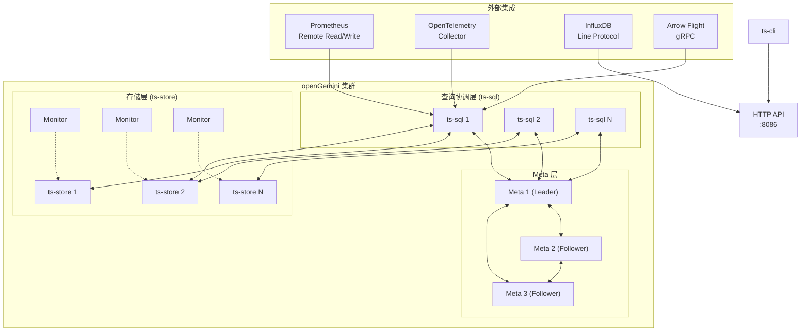
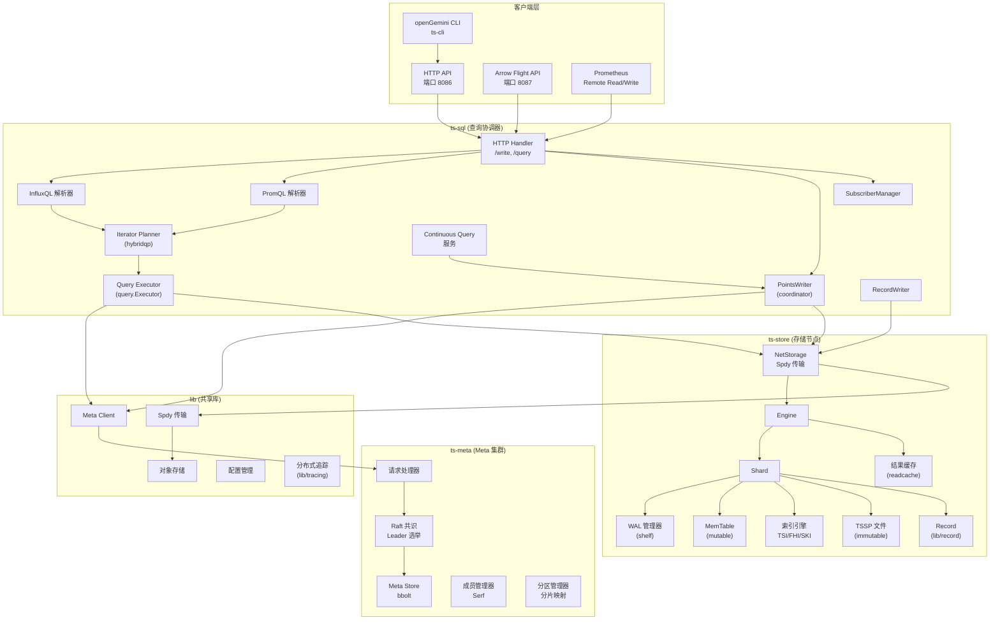
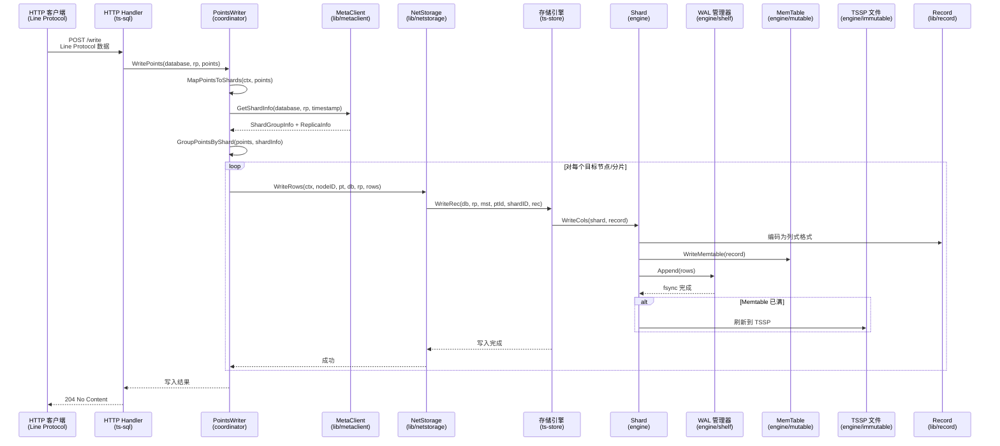
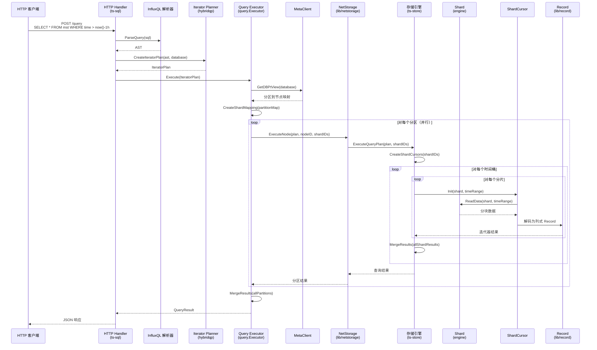
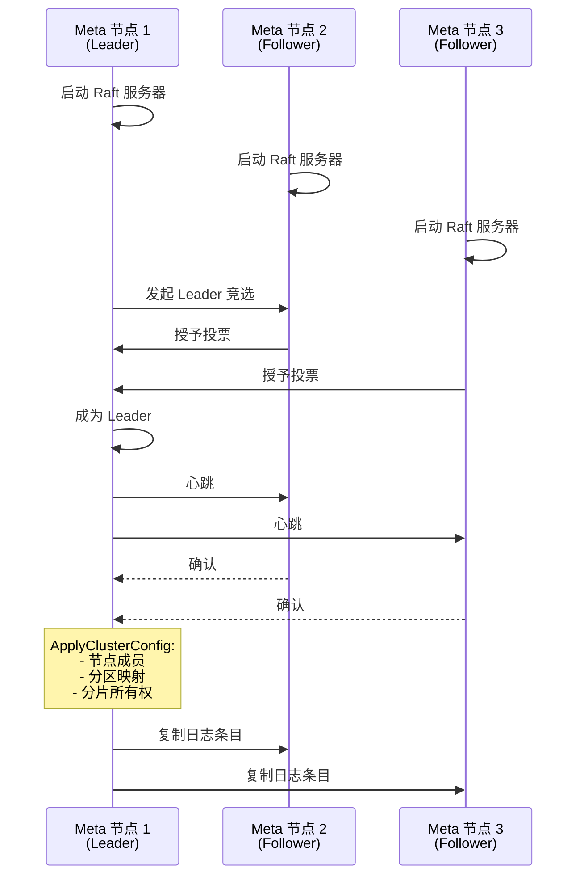
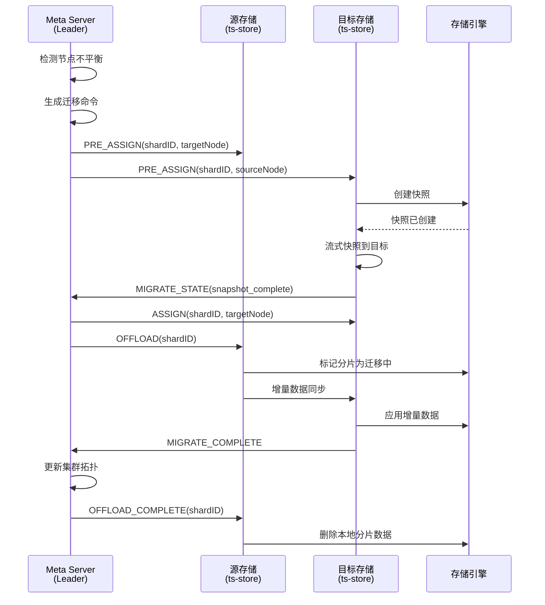
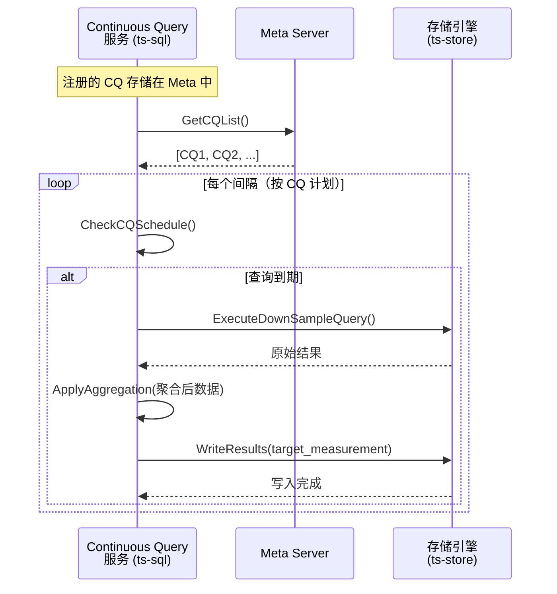
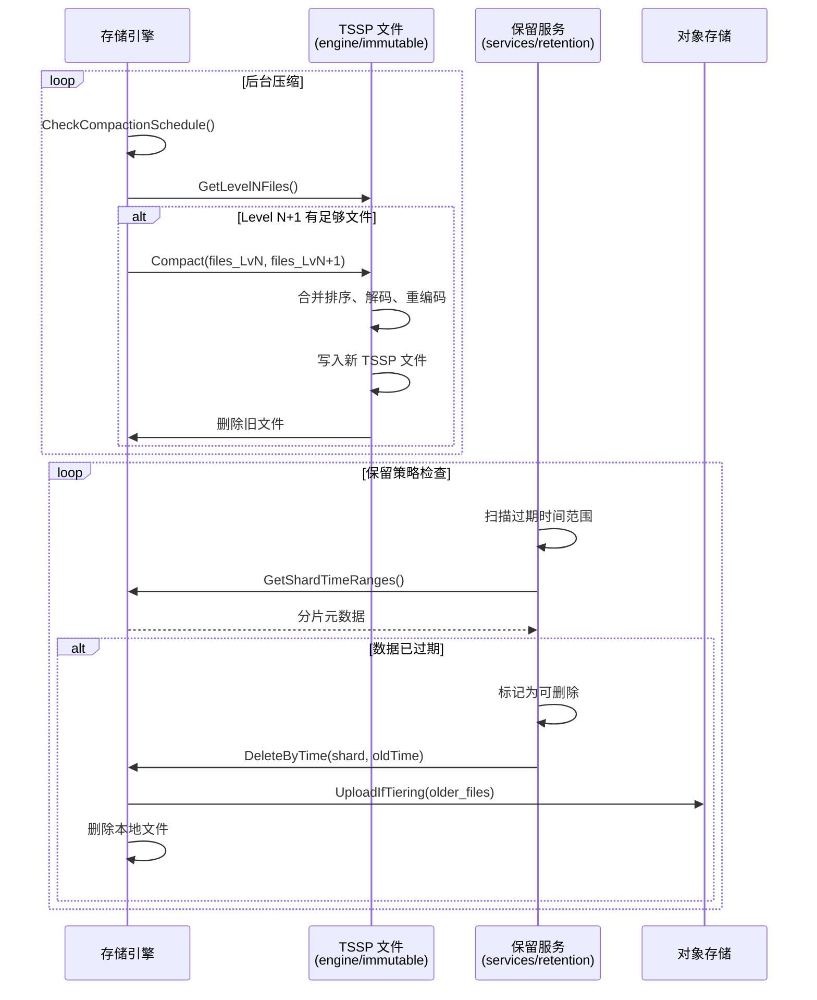

# openGemini 系统架构规格说明书

## 1. 项目概述

### 目的
openGemini 是一款云原生分布式时序数据库（TSDB），专为大规模遥测数据的存储和分析而设计。它提供高性能数据写入、高效查询和水平扩展能力，适用于物联网、监控和可观测性场景。

### 核心能力
- **数据写入**：通过 InfluxDB Line Protocol 兼容实现高吞吐量写入支持
- **时序查询**：支持 InfluxQL 查询语言，兼容 PromQL 以集成 Prometheus
- **水平扩展**：分布式集群架构，支持自动数据分区和并行查询执行
- **高基数支持**：专用存储引擎，解决索引内存占用过高的问题
- **数据压缩**：列式存储，专用压缩算法（压缩比高达 15:1）
- **多引擎支持**：同时支持行式（LSM-tree）和列式存储引擎
- **云原生部署**：通过 Kubernetes operator 容器化部署，兼容 OpenTelemetry 和 Prometheus

## 2. 系统架构

### 高层架构概述

openGemini 作为 CNCF 生态系统中的分布式时序数据库运行。它采用多组件架构，包括：

- **Meta 集群**：通过 Raft 共识协调集群状态、管理分区映射、处理节点成员关系
- **存储节点**：存储时序数据分片，具备内置复制和故障转移能力
- **查询协调器**：跨分布式存储节点处理 InfluxQL/PromQL 查询
- **协调层**：路由请求、管理数据分区、处理跨节点操作

### 架构图（L2 - 组件级别）

## 3. 模块边界与目录结构

### 目录到模块映射

| 目录 | 架构职责 |
|------|----------|
| `app/ts-meta/` | Meta 集群节点 - 基于 Raft 共识的集群元数据、分区分配、节点成员管理 |
| `app/ts-sql/` | 查询协调器 - HTTP API 端点、InfluxQL/PromQL 解析、分布式查询编排 |
| `app/ts-store/` | 存储引擎节点 - 数据持久化、分片管理、压缩、本地索引 |
| `app/ts-data/` | 数据服务器模式 - 组合 ts-store + ts-sql（无 meta），用于简化部署 |
| `app/ts-server/` | 单服务器模式 - 组合 ts-meta + ts-store + ts-sql 于单一进程，用于简化部署 |
| `app/ts-monitor/` | 监控边车 - 节点级指标收集和报告（与 ts-store 并行运行） |
| `app/ts-recover/` | 灾难恢复工具 - 协助集群恢复 |
| `coordinator/` | 写入协调（运行在 ts-sql 中）- 分片映射、写入分发、流任务路由 |
| `engine/` | 核心存储引擎 - TSM/列式存储、查询执行、索引 |
| `engine/executor/` | 查询执行引擎 - 基于迭代器的跨分片查询处理 |
| `engine/hybridqp/` | 查询规划和优化 - AST 转换、迭代器计划构建 |
| `engine/immutable/` | TSM/TSSP 文件管理 - 文件格式、压缩、块读取 |
| `engine/shelf/` | 预写日志 - 持久化写入缓冲、重放支持 |
| `engine/mutable/` | MemTable - 刷新到 TSSP 前的活跃写入缓冲区 |
| `engine/op/` | 查询运算符 - 迭代器执行的聚合、投影运算符 |
| `engine/comm/` | 游标接口 - 执行器和存储间的通信协议 |
| `engine/index/` | 多索引实现 - TSI（倒排）、FHI（哈希）、SKI（稀疏） |
| `engine/optimizer/` | 查询优化器（保留） |
| `engine/clearevent/` | 清理事件处理 - 数据过期处理 |
| `lib/` | 共享工具 - 网络传输、元数据客户端、缓存、压缩 |
| `lib/record/` | 核心数据结构 - 列式记录格式、模式、排序、合并 |
| `lib/metaclient/` | Meta 客户端 - 到 ts-meta 集群元数据查询的接口 |
| `lib/netstorage/` | 网络存储接口 - 通过 Spdy 到 ts-store 节点的 RPC |
| `lib/spdy/` | 自定义 RPC 传输 - 基于 SPDY 的请求/响应帧 |
| `lib/obs/` | 对象存储客户端 - S3/OBS 分层存储集成 |
| `lib/codec/` | 编码/解码 - 网络消息的二进制编解码器 |
| `lib/stream/` | 流处理 - 持续数据转换的流任务执行 |
| `lib/readcache/` | 读取缓存 - 基于 fastcache 的快速结果缓存 |
| `lib/resultcache/` | 结果缓存 - 查询结果缓存 |
| `lib/tracing/` | 分布式追踪 - 追踪上下文传播（有限） |
| `lib/logger/` | 结构化日志 - 基于 zap 的日志记录 |
| `lib/errno/` | 错误号定义 |
| `lib/msgservice/` | 消息服务 - 内部消息传递 |
| `lib/raftconn/` | Raft 连接 - Raft 的网络传输 |
| `lib/raftlog/` | Raft 日志 - 共识的日志管理 |
| `services/` | 后台服务 - 连续查询、降采样、保留、流处理 |
| `services/arrowflight/` | Arrow Flight 服务 - 基于 gRPC 的列式数据传输 |
| `services/sherlock/` | 健康检查服务 - 节点健康监控 |
| `services/castor/` | 数据转换服务 - 数据转换 |
| `services/consume/` | Kafka 消费者服务 - 从 Kafka 主题摄取流数据 |
| `services/fence/` | 地理围栏服务 - 地理空间围栏监控和警报 |
| `services/hierarchical/` | 分层管理服务 - 热/温/冷数据分层编排 |
| `services/retention/` | 保留策略服务 - 执行数据保留策略 |
| `services/retention/mst/` | 按测量保留处理 |
| `services/downsample/` | 降采样服务 - 数据降采样/聚合 |
| `services/continuousquery/` | 连续查询执行 |
| `services/series/` | 系列删除处理服务 - 异步系列键清理 |
| `services/shardMerge/` | 分片合并服务 - 后台分片合并 |
| `services/stream/` | 流处理服务 |
| `services/runtimecfg/` | 运行时配置服务 - 动态配置更新 |
| `services/writer/` | 写入器服务 - 内部写入任务协调 |
| `config/` | 配置模式和 TOML 默认值 |
| `lib/util/lifted/` | 供应商库 - InfluxDB v1.11.2、VictoriaMetrics、HashiCorp (Raft, memberlist) |

### 关键模块接口

**协调器模块** (`coordinator/`，运行在 ts-sql 进程中)
- `PointsWriter`：根据分片映射将传入写入分发到相应存储节点
- `ClusterShardMapper`：基于分区键（时间 + 标签哈希）将查询映射到分片
- `RecordWriter`：通过 RPC 处理到存储节点的大容量记录写入
- `SubscriberManager`：管理订阅；接收写入通知并转发数据到订阅者端点（HTTP/InfluxDB）
- `Stream`：管理持续数据转换的流任务执行

**查询执行器模块** (`engine/executor/`, `engine/hybridqp/`)
- **注意**：存在两个不同的执行器实现：
  - `query.Executor` (`lib/util/lifted/influx/query`): ts-sql 进程中的分布式查询协调；跨存储节点协调执行
  - `ExecutorBuilder` (`engine/executor/`): ts-store 进程中的本地查询执行引擎；本地执行迭代器计划
- `IteratorPlan`：表示查询执行计划（由 hybridqp 从 AST 创建）
- `ShardCursor`：用于扫描时序数据的每分片游标
- `ClusterShardMapping`：将节点映射到分片以进行分布式查询执行

**存储引擎模块** (`engine/`)
- `EngineImpl`：管理多个分片的主存储引擎实现
- `Shard`：单个分片数据管理、memtable、刷新、WAL
- `MutableTable` (`engine/mutable/`): 刷新到 TSSP 前的内存写入缓冲区（memtable）
- `WALManager` (`engine/shelf/`): 用于持久化和重放的预写日志
- `TSSPFile` (`engine/immutable/`): 时间序列数据文件格式（合并的 TSM + 索引）
- `Record` (`lib/record/`): 时序记录的列式数据结构

**索引变体** (`engine/index/`)
| 索引 | 用途 |
|------|------|
| `tsi/` | 时间序列索引 - 基于标签查询的倒排索引 |
| `fhi/` | 完整哈希索引 - 精确匹配查询的哈希索引 |
| `ski/` | 稀疏索引 - 用于时间范围剪枝的 min/max 统计 |
| `bloomfilter/` | 布隆过滤器 - 快速存在性检查 |
| `textindex/` | 文本索引 - 文本字段搜索 |

**Meta 模块**
- `MetaServer` (`app/ts-meta/meta/`)：基于 Raft 共识的集群状态
- `Processor`：命令处理和状态机更新
- `MetaClient` (`lib/metaclient/`)：查询集群元数据的客户端接口

**Spdy 传输模块** (`lib/spdy/`)
- `MultiplexedSession`：带流量控制的复用 SPDY 会话
- `MultiplexedSessionPool`：可复用 SPDY 会话池，用于连接重用
- `SessionRole`：区分客户端和服务器会话角色

## 4. 核心数据流与工作流程

### 4.1 写入路径（Line Protocol 摄入）

### 4.2 查询路径（InfluxQL 分布式查询）

### 4.3 Meta 集群 Leader 选举

### 4.4 分片重平衡 / 数据迁移

### 4.5 连续查询执行

### 4.6 压缩和数据保留

## 5. 技术栈与依赖

### 语言与框架

| 组件 | 语言 | 框架 |
|------|------|------|
| 所有服务 | Go 1.24 | 标准库 net/http, HashiCorp raft v1.7.0 |
| 查询解析器 | Go | InfluxQL (influxdb v1.11.2), PromQL (VictoriaMetrics) |
| 构建系统 | Python 3.7+ | 自定义 build.py |
| CLI 工具 | Go | Cobra CLI |

### 关键库

| 库 | 版本 | 用途 |
|----|------|------|
| HashiCorp raft | v1.7.0 | Meta 集群分布式共识 |
| etcd/raft/v3 | v3.5.10 | 备用共识实现 |
| bbolt | v1.3.10 | Meta 持久化的嵌入式键值存储 |
| HashiCorp memberlist | v0.5.0 | 节点成员和故障检测 |
| spdy | (内部) | 基于 SPDY 协议的自定义 RPC 传输 |
| VictoriaMetrics | v1.102.1 | PromQL 执行引擎、时序查询 |
| InfluxDB | v1.11.2 | Line Protocol 解析、InfluxQL AST、模型 |
| roaring | v1.9.4 | 系列 ID 索引的位图压缩 |
| fastcache | v1.12.2 | 高性能内存缓存 |
| zap | v1.27.0 | 结构化日志 |
| prometheus/client_golang | v1.20.5 | 指标暴露 |
| gorilla/mux | v1.8.1 | HTTP 请求路由 |
| grpc | v1.66.0 | Arrow Flight 传输 |
| apache/arrow/go | v13.0.0 | 列式数据格式 |
| klauspost/compress | v1.17.11 | Snappy、LZ4 压缩 |
| google.golang.org/protobuf | v1.35.2 | 消息编码的协议缓冲区 |

### 基础设施

| 组件 | 技术 | 用途 |
|------|------|------|
| Meta 持久化 | bbolt | Raft 日志存储、集群状态 |
| 数据存储 | 本地文件系统 (ext4/xfs) | TSSP 文件、WAL |
| 对象存储 | S3 兼容 (OBS/Huawei) | 分层冷数据存储 |
| 服务发现 | HashiCorp Serf | 节点发现、故障检测 |
| 容器编排 | Kubernetes (openGemini-operator) | 生产部署 |
| 配置管理 | TOML | 静态配置文件 |

## 6. 设计权衡与已知限制

### 一致性模型
- **副本组最终一致性**：写入在成功写入副本组主节点后确认。 follower 副本通过 Raft 日志复制异步更新。
- **元数据强一致性**：集群拓扑、分片所有权和认证数据通过 Raft 共识实现强一致性。

### 分区策略
- **基于时间的分区（主要）**：数据按时间分区到分片组。每个分片组覆盖可配置的时间窗口。
- **基于标签的哈希（可选）**：通过指定标签键的一致性哈希进行二次分区，用于高基数场景。
- **每节点固定分区数**：`ptnum-pernode` 配置限制每节点分区数；调整需要集群重平衡。

### 查询执行
- **基于协调器的路由**：所有查询通过 ts-sql 协调器节点路由，聚合多个存储节点的结果。
- **广播查询**：某些查询（如 `SHOW DATABASES`）必须广播到所有节点；`force-broadcast-query` 配置控制此行为。
- **无原生子查询优化**：复杂嵌套查询可能需要多个执行阶段。

### 存储引擎约束
- **内存绑定索引**：TSI 索引将整个系列 ID 映射加载到内存中以提高性能。高基数场景需要仔细的内存配置。
- **压缩开销**：后台压缩与查询/摄入资源竞争；重负载写入工作负载需要调整 `max-concurrent-compactions`。
- **冷数据分层**：对象存储集成需要明确配置，不是自动的。

### 认证与授权
- **共享密钥认证**：默认使用共享密码文件（`weakpasswd.properties`）。
- **无列级访问控制**：授权仅在数据库/测量级别操作。
- **HTTPS 可选**：TLS/HTTPS 支持存在，但默认不强制。

### 部署限制
- **Raft 需要奇数节点**：Meta 集群需要 3 或 5 个节点以实现适当的容错；2 节点集群可能发生脑裂场景。
- **需要时钟同步**：准确的时间戳对于基于时间的分区和查询正确性至关重要；集群节点间必须进行 NTP 同步。
- **每分片单写入者**：每个分片一次只接受来自一个协调者的写入；来自多个协调者到同一分片的并发写入需要外部序列化。

### 可观测性
- **有限的分布式追踪**：各服务有追踪工具（`lib/tracing/`），但跨服务边界的追踪传播未完全实现。
- **有限的查询分析**：`EXPLAIN ANALYZE` 功能仅限于单节点执行计划。

---

*本文档由自动化系统考古学生成。如有问题或澄清，请联系 openGemini 维护者。*
